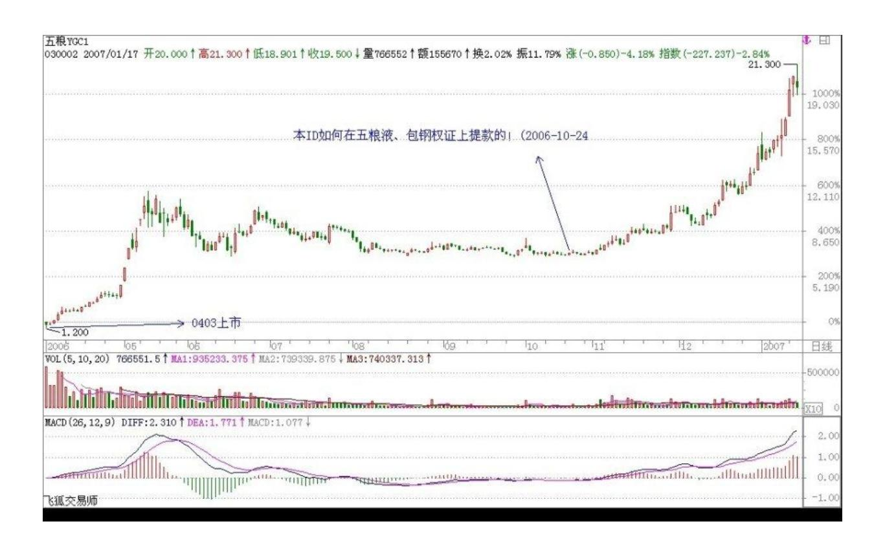

# 教你炒股票 6:本 ID 如何在五粮液、包钢权证上提款的

股票上永远不缺英雄,更永远不缺死去的英雄,最近的英雄们都又在 吹投资,但投资这内裤永远掩盖不了股票扒光后赤裸裸的投机。阴符 云:"天性,人也;人心,机也;立天之道以定人也。天发杀机,斗转星移;地发杀机,龙蛇起陆;人发杀机,天地反覆;天人合发,万 化定基。"不投这个机,又如何夺天地之造化?股票市场也是一样的。

对于本 ID 来说,这股票市场就如同提款机,时机到了,就去提款, 时机不到,就让他搁在那。市场就如同男人,整天管他就会犯贱,就 会咬你。所以男人不能经常搞,这市场也一样,必须耐心等待他的骚 动,他不骚动,是不能搞的。本 ID 曾写帖子"G 股是 G点,大牛不 用套!" ,连 G 点都不明白,是没资格谈论股票的。

如同要找到男人的 G 点,就要对这男人充分了解,要找到这市场的 G 点,其道理是一样的。但就像光知道男人有 G 点还是不能乱搞,首先 要了解他是干净的,是安全的,否则高潮还没有就翘了,那不麻烦大 了?这市场也是一样的,不是什么机会、G 点都要搞的,首先的前提 要安全,要像去银行提款一样安全。就像又有 G 点又干净的男人才值 得搞,市场上也只有这样又安全又能 G 点的机会,才值得投机。

就像四月份时本 ID 在五粮液、包钢认购权证上的布局。为什么选择 他们而不是其他,道理很简单,因为他们既有认购又有认沽,而对于 企业来说,除非行情特别不好,否则是不会让认沽兑现的,因为不兑 现,这就是一个空头支票,而兑现是要掏真金白银的。因此,对既有 认购又有认沽的认购权证来说,认沽和认购的行权价之间的差价,就 是认购权证最安全的底线。对于五粮液、包钢认购权证,这个底线就 分别是1.02 和 0.43 元。而本 ID 当时分别在 1 元多和 4毛多吃他 们,是不是和去银行提款一样安全?唯一遗憾的是,他们的盘子都太 小,属于小男人的类型,容纳不了太大的资金。小男人,没什么劲; 小盘的股票,也一样。

投机不是瞎搞,是要清清楚楚地搞。要清清楚楚,就要对市场充分地 理解,要明白其道道。本 ID 曾发明了一个口号在私下流传,就是 "像搞男人一样搞股票,像做爱一样做股票。"不明白这,没资格谈 论股票。关于这个话题,今天就到这,有时间、有心情,继续。

\*\*\*\*\*\*\*\*\*\*\*\*\*\*\*\*\*\*\*\*。

解盘及互动问答: 1. 网友冰火:多谢大侠指教。我就是那个冰火。 我大概明白你的意思了。假如 Y 是认沽行权价,X 是认购行权价,发 行企业为了自己的利益会尽量保证行权当天的股价不低于 Y,所以认 购权证的最终价格会不低于 Y-X,所以只要认购权证的价格跌到(Y-X)以下的区间内,都是比较安全的。是这个意思吗?2006-11-22 10:58:10缠师:不一定要跌到那区间,基本就不会跌到那个区间,在 上面高点的位置就可以了,那是一个底线,基本不会跌破。所以你就 有了一个几乎绝对安全的标准。像最近的武钢,几乎绝对安全线在 0.21 元,在0.35 元见到底部。等于你用最多 30%的风险去赌300%的 利润,这样当然可以介入了。

#### \*\*\*\*\*\*\*\*\*\*\*\*\*\*\*\*\*\*\*\*。

附录:权证简介:"认购权证"是股票衍生性金融商品。发行人发行 一定数量、特定条件的有价证券,投资者付出权利金持有该权证后, 有权在某一特定期间(美式权证)或特定时点(欧式权证),按一定 的履约价格,向发行人买进一定数量之标的股票。

"认沽权证"即认售权证,就是看跌期权。具体地说,就是在行权的 日子,持有认沽权证的投资者可以按照约定的价格卖出相应的股票给 上市公司。

"认购权证"持有人有权按约定价格在特定期限内或到期日向发行人 买入标的证券,"认沽权证"持有人则有权卖出标的证券。"认购权 证的"的价值随相关资产价格上升而上升,"认沽权证"的价值则随 相关资产价格下降而上升。
