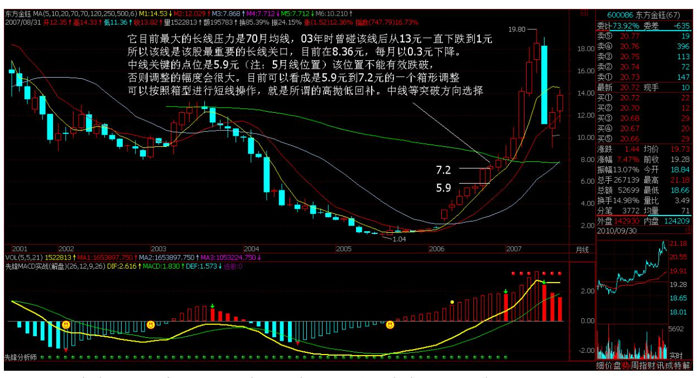

教你炒股票 8:投资如选面首,G 点为中心,拒绝ED 男

选面首,先看面,终要看"里子" 。何谓"里子"?就是"G 点为中 心,拒绝 ED 男!"这也是本 ID 关于投资的警世之言。拿投资来忽 悠的人,总爱编一些关于"面"的神话。诸如基本面、技术面、心理 面、资金面,这面那面,都如同面首之"面",不过是进而"里子" 的借口。没有"G 点为中心,拒绝 ED男!"的"里子" ,这面那面 又有何意义?投资的结果很简单,就"输、赢"两种。所有关于投资 的理论把戏,都企图通过控制某种"输入"而把"输"这结果给去 了。因此一切相关的理论前提就必然建立在这样一个逻辑假设之上: 输入与输出间被某种必然的逻辑关系和因果链条所连接。而该逻辑假 设,相当于说"面首的面和其里子有着必然的逻辑关系。"如果这都 能成立,那么帅男就一定 G 点澎湃、满面胡子的糙爷就一定非 ED 男,出去扒几个面首看看就知道这类假设是何等荒谬。然而,现实 中,企图跳过"面"而直捣"里子",同样是一种荒谬的幻想。即使 "面"和"里子"没有任何必然的联系,但现实依然只能从"面"到 "里子"。那种企图否定一切"面"的,企图直接就"里子"就 G 点 的,不过是把某种"面"当"里子"了。这种人,终生被骗而不知, 就像把"叫床分贝"当高潮指标一样可笑。

投资领域,没有任何理论可以描述这种从"面"的输入到"里子"输 出的必然关系,因为这种关系根本不存在。但人只要介入这种投资游 戏,其介入就必然要以某种方式进行,相应地,其后必然有着某种理 论、信念的基础。而正因为绝对正确的不存在,因此反而使得各种理 论、信念基础之间有了比较的可能。任何好的投资理论,最终都只面 向"里子" ,就如同一个好面首,必须最终以其 G 点的澎湃度来证 明其优秀。

相应的,投资市场最重要的指标就是高潮度,一个长期没有高潮的市 场,就如同没有 G 点的石男,是不值得任何关注的。期待一个石男变 成一个优秀的面首,那是牧师的工作,而投资市场不需要牧师。一个 市场能进入可投资的视界,首先要显示其 G 点的萌动,否则还是一边 凉快去吧。

世界,永远不缺 G 点萌动的男人去面首,同样,在世界总的市场体系 中,永远不缺高潮萌动的市场。但大多数的散户,就喜欢泡石男,以 为石男没有攻击性就安全了,以为长期没有高潮的市场就一定安全。 有多少人因此而独守空房、耗费青春,整天听着看着别人高潮不断, 最终寂寞难耐,走向另一个极端,见高潮就扑上去,如飞蛾一样死 掉。本 ID 曾言"像搞男人一样搞股票,像做爱一样做股票" 。搞男

人、做爱,最终都是要获得其高潮,最终采阳而补。投资也一样,通 过市场的高潮是要赚取其利润,是采利而补。

可惜,市场上的人,大多数都让人当阳给采了,可笑可怜。要采阳而 不要被采,这就是和面首游戏的第一准则,而投资市场的道理也是一 样的。

20 采阳,过熟不行,过生也不行,必须把握其火候。

阳生,必有其萌动,必须待其萌动之后才可介入。具体对于股票来 说,按其是否萌动的标准把所有股票动态地进行分类,一种是可以搞 的,一种是不能搞的,将你参与的股票限制在能搞的范围内,不管任 何情况,这是必须遵守的原则。当然,搞的分类原则,各人可以有所 不同。例如,250 天线以及周线上的成交量压力线的突破(娇注:22 课 3 买课程全是年线的突破);资金量不大且短线技术还可以的,可 以把 250天线改成 70 天线、35 天线,甚至改为 30 分钟图里的相应 均线;对新股,可以用上市第一日的最高价作为标准;还有,就是接 近安全线的股票,例如在第六期里,本 ID 给出的一个带认沽权怔的 认购权怔介入的安全线标准;而对于有一定水平的人,识别各种空头 陷阱,利用空头陷阱介入是一个很好的方法,这种方法比较专业点, 以后专门说。

男人只有两种,能搞的和不能搞的;市场也只有两种,能搞的和不能 搞的。必须坚持的是,不能搞的就无论发生什么情况都不能搞,除非 能达到某种能搞的标准而自动成为能搞的对象,就像用 ED 把男人进 行分类一样,ED 男只有非 ED 后才有进入被搞侯选集合的可能。一旦 被搞的分类原则确定,就一定要严格遵守"只搞能搞的"原则。可 惜,这样一个简单的原则,绝大多数的人即使知道也不能遵守。人的 贪婪使得人有一种企图占有所有机会的冲动,就如同看到街上的所有 男人都企图上去扒光他们一样,这种人叫"花痴","花痴"在投资 市场的命运一定是悲惨的。

在投资市场,定好"能搞"的"G 点萌动"标准,相应选出来的,至 少不是 ED 男了。而接下来,就要防止其"早泄" 。这里找到有关 "早泄"的医学定义:男子性功能障碍中仅次于阳痿的最常见的症 状,是射精障碍中最常见的疾病,发病率占成人男性的 35%一50%。投 资市场里,这"早泄"的比例和市场总体强度有关,在熊市中这比例 至少是 80%以上,而牛市中这个比例就小多了,大概就 30%。无论是

选一个好面首还是一个好股票,把"早泄"的一类给筛出去可是最重 要也是最困难的一步,很多所谓的高手,就死在这一步上。关于这问 题,将在下一讲中详细论述。

\*\*\*\*\*\*\*\*\*\*\*\*\*\*\*\*\*\*\*\*。

解盘及互动问答:

#### \*\*\*\*\*\*\*\*\*\*\*\*\*\*\*\*\*\*\*\*。

1. 网友【匿名】:楼主认为大盘能涨到多少点?缠师:预测这个是股 评家们干的事情,本 ID 只对赚钱感兴趣。而且大盘跌也可以挣钱, 预测它干什么?(2006-11-20 15:44:33) 21缠师:那是迟早的事情。 (2006-11-20 15:45:29)

#### \*\*\*\*\*\*\*\*\*\*\*\*\*\*\*\*\*\*\*\*。

3. 网友[匿名] xof\_fox:请教楼主,"只要你 30 年后还能活下来, 自然就是最大的牛人" ,假如一个人生存了 30 年,但前 25 年都是 惨败,就是最后 5年风光,这也叫牛人吗?不好意思。我这个问题有 点钻牛角尖。2006-11-20 19:10:44缠师:牛人,一般是指站在潮流之 巅的人。在投资市场里,整体的失败是一次都不能发生的,只要发生 一次,基本就是一辈子都翻不了身了。个别的失败是允许的,但不能 影响大局。

最早时,几千万就可以当庄家了,现在几千万连个大散户都算不上。 在投资市场中,一次跌倒,终生都追不回来。剩下的时间,基本只能 在后面跟着玩了。而在后面跟着玩的人,怎么都算不了牛人。(2006- 11-2020:18:20)

#### \*\*\*\*\*\*\*\*\*\*\*\*\*\*\*\*\*\*\*\*。

4. 网友[匿名] 傻妞:高禅,听了你的股道禅论,真的很佩服!但还 是云里雾里的,我是一个刚起步的散户。我问一个简单的问题,K 线 图中哪条是年线?千万别大笑,我只认得 5,10,20 日线,请指教! 另外,我买的东方金钰(原 G 多佳 600086),什么时候会涨啊?能 否借喝水的功夫分析分析。谢谢!等回信!2006-11-21 21:15:16缠 师:本 ID 不是股评,说股票只是本博客的一个方面,纯粹是希望来 这里的人能学点东西。本来你的问题是不应该回答的,因为本 ID 怕

一旦开始回答这类问题,这里就成了咨询台了。但看你说得诚恳,本 ID破例一次。年线一般指 250 日的均线,但在各种周期的图表上,都 可以用上。例如分钟图、小时图、周线图、月线图等都可以。具体如 何设置找附近的人问问。

至于你说的 600086,它已经长了很多了,连续拉了 8个月的阳线,股 价从 1 块多长到 7 块多了,出现调整是最正常不过了。关键是你买 的位置,如果22 你是最近才买的,对面临的调整风险就要有所承受。 本 ID 现在只能告诉你,它现在的具体状况。它目前最大的长线压力 是 70 月均线,03 年时曾碰该线后,从 13 元一直下跌到 1 元。所 以,该线是该股最重要的长线关口。目前在 8.36 元,每月以 0.3 元 下降。中线关键的点位是 5.9 元,该位置不能有效跌破,否则调整的 幅度会很大。目前可以看成是 5.9 元到 7.2 元的一个箱形调整,可 以按照箱型进行短线操作,就是所谓的高抛低回补。中线等待突破方 向的选择。

但还是请各位注意,不要轻易介入涨幅过大的股票。

要从一开始就学会用尽量小的风险换取尽量大的利润。

5. 网友[匿名] 傻妞:我还以为,高人都是只做最后的疯涨那一段 呢。没想到楼主这样的大侠,也这么注意规避风险啊。

缠师:要想在股市里长期打胜战,就一定要坚持用最小的风险,去换 取最大利润。防范风险是第一位的,这里没有什么高低之分。亏损是 按百分比的,一百亿和一百万,亏了百分百,都是零。

人弃我不一定取,人抢我一定给。(2006-11-2122:06:50)

#### \*\*\*\*\*\*\*\*\*\*\*\*\*\*\*\*\*\*\*\*。

6. 网友[匿名] 冰火:"除非行情特别不好,否则,是不会让认沽证 兑现的。因为不兑现,这就是一张空头支票,而兑现是要掏真金白银 的。"楼主你这句话,我尤其看不明白。权证一旦发行了,就是有法 律效力的,企业怎能像投资者买认购权证一样,赖皮不兑现呢?还 有,就是难道企业有操纵权证价格的能力?我的问题太弱智了,俺承 认俺超级菜,但不问清楚,我真的睡不瞑目啊。2006-11-22 00:59:00 缠师:对不起,刚上来。股价升破认沽价,认沽权证就是废纸,就不 用兑现了,因为没人会去兑现。例如,认沽价 3 元,现在股价是 4 元,没人会用 4元的股票去换 3 元的人民币。

#### \*\*\*\*\*\*\*\*\*\*\*\*\*\*\*\*\*\*\*\*。

7. 网友[匿名] 冰火:您为何说 15 元多买 N 中工就是理性?现在我 不是想问 N 中工值不值这个价,我只想知道假如我在那个位置买了, 在这个长达几个月的过程中,应该如何处理,才是最佳的操作手法? 2006-11-20 12:44:11缠师:开盘就买 N 中工,当然是理性的。因为 它是恢复新股发行后的第一支新股上市,而且开盘的位置也不太高。 后面之所以出现如此走势,是中国特色的管理层所造成的。但开盘 15 元多买的,后面 18、19元随便你出。由于情况发生了意外,当然就要 选择退出。这还是上面的原则,买股票一定不能追高。这随便你出, 由于情况发生了意外,当然就要选择退出。

这还是上面的原则,买股票一定不能追高,这样一旦发生意外,退出 也简单。

那些赚了指数亏了钱的,稍安毋躁。前面说过了,这只是牛市的第一 阶段,以后机会多了去了,还是先把技术学好。任何人只要愿意花时 间和心血研究25 价格运动,就能够在合理的时间内建立自己的判断准 则。而这些准则,将在他未来的投机活动中发挥作用。否则,死都不 知道怎么死的,就不好了。不要用你的想象代替现实。股市里的牛人

每年都有,死去的牛人更多,市场的第一原则就是生存,只要你 30 年后还能活下来,自然就是最大的牛人。2006-11-2122:07:06本 ID 自 2001 年到 2005 年,4 年,从来不看股票。但从 2005 年 6 月以 后天天看,等哪天本 ID 不看了,你们可要小心了。
