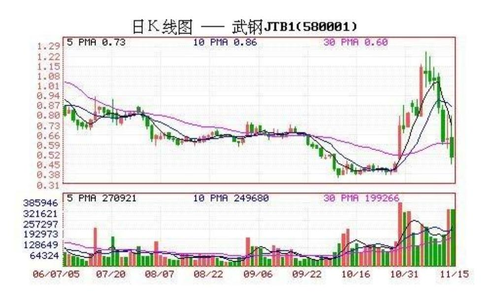

# 教你炒股票 9:甄别"早泄"男的数学原则

(2006-11-22 12:00:00)设计一个程序,将所有投资对象进行分类,只 搞那些能搞的,这是投资的第一原则。在分类中,所应用的程序可以 各色各样,但有一点是肯定的,即没有任何一个程序可以使得所选能 搞的最终都百分百能被搞得高潮迭起,就像没有任何一个挑选面首的 程序使得所选能搞的最终都能百分百被搞得高潮迭起。因为任何操作 程序都必然面对"早泄"问题,就像任何关于面首的选择都必然面临 "早泄"男的甄别问题。

而甄别"早泄"之所以困难重重,使得无数所谓高手死无葬身之地, 是因为"早泄"这事还真得真刀真枪地实干才能发现,这比 ED 的甄 别可复杂多了、风险大多了。ED,不需要深入介入就可趁早发现,但 "早泄"不可以,怎么都要试上一试,而这玩意是一锤子的买卖,这 次行还不能保证下次就一定行,因此要有效甄别、及早发现而减少损 失就成了一个头号难题。

许多所谓高手会宣称,出现什么情况,这股票就会长。但实际上,任 何一种情况,都有着极高百分比的可能会出现"早泄" ,确定能搞的 突然就变成不能搞了,使得介入变成了套牢。这种情况,在投资里简 直太常见了。

那么,如何甄别"早泄"男?首要的就是严格的资金管理,一旦出现 "早泄"现象,必须马上退出,即使下面突然又不"早泄"了,又强 力高潮了,也必须这样干。而且"早泄"特敏感,一个偶尔的因素就 可能导致,而要重新再来,还要等待一个长的不应期,一个长的调整 过后,即使会高潮不断,也浪费了时间,有这时间,可搞的东西多了 去了,这世界又不只有一个面首、一只股票。当然,这里说的只是基 本原则,如果有一套严格的分批介入和退出程序,这一切都变得简 单。资金管理问题,涉及面很广,以后会专门分析介绍,这里说的是 另一个方面,就是如何能在投资领域尽量避免碰到"早泄" 男。

"早泄"出现的根本原因在于介入程序出现破缺,出现程序所不能概 括的异常情况,这对于所有程序都是必然存在的。而一个程序出现异 常,也就是出现"早泄"的概率有多大,这是可以通过长期的数据测 试来确定的。最简单的就是抛硬币,正面买、背面不买,这样也算一 个介入程序,但这样一个程序的"早泄" 率,至少是 50%以上。现在 的问题其实很简单,就是如何发现一个"早泄"率特别低的介入程 序。但答案很不幸,任何一个孤立的程序都不会有太低的"早泄" 率,如果一个程序的"早泄"率低于 10%,那就是超一流的程序了, 按照这个程序,你投资 10 次,最多失误 1 次,这样的程序是很厉害 的,基本没有。

但问题不像表面所见那么糟,在数学中,有一个乘法原则可以完全解 决这个问题。假设三个互相独立的程序的"早泄"率分别为 30%、 40%、30%,这都27 是很普通的并不出色的程序。那么由这三个程序组 成的程序组,其"早泄"率就是 30%\*40%\*30%=3.6%,也就是说,按这 个程序组,干 100 次,只会出现不到4 次的"早泄",这绝对是一个 惊人的结果。即使对于选面首来说,有这样的高效率,大概连武则天 大姐都要满意了。

现在,问题的关键变成,如何去寻找这三个互相独立的程序。首先, 技术指标,都单纯涉及价量的输入而来,都不是独立的,只需要选择 任意一个技术指标构成一个买卖程序就可以。对于水平高点的人来 说,一个带均线和成交量的 K 线图,比任何技术指标都有意义。其 次,任何一个股票都不是独立的,在整个股票市场中,处在一定的比 价关系中,这个比价关系的变动,也可以构成一个买卖系统,这个买 卖系统是和市场资金的流向相关的,一切与市场资金相关的系统,都 不能与之独立;最后,可以选择基本面构成一个甄别"早泄"男程 序,但这个基本面不是单纯指公司赢利之类的,像本 ID 在前几期所 说,国航李总当兵出身不会让自己的股票长期跌破发行价这么没面 子,还有认沽权证基本不会让兑现等等,这才是更重要的基本面,这 需要对市场的参与者、对人性有更多的了解才可能精通。

当然,上面这三个独立的程序只是本 ID 随手而写,任何人都可以设 计自己的独立交易程序组,但原则是一致的,就是三个程序组之间必 须是互相独立的,像人气指标和资金面其实是一回事情,各种技术指 标都是互相相关的等等,如果把三个非独立的程序弄在一起,一点意 义都没有。就像有人告诉你,面首的鼻子大就不会"早泄",另一个 告诉你耳朵大不会"早泄",第三个告诉你胡子多不会"早泄",如

果真按这三样来选人,估计连武则天大姐的奶妈的邻居的奶妈的邻居 的奶妈的奶妈的奶妈,都会不满意的。

借地说说如何看本 ID 的文章,本 ID 不是股评,不会推荐什么股 票,所以希望来本 ID 这里知道什么具体股票的,就不要浪费时间 了。试想,真有本事的人,挣钱都忙不过来,怎么会当股评。本 ID 这里,股票只是其中一个小项目,只是希望来这里的人也学会怎么挣 钱。所谓六艺,不会挣钱,在经济社会里还算人吗?看本 ID 的文 章,要学会方法,当然,本 ID有时候可能有意无意就会透露点东西, 但你必须有分析能力,要吃透方法。就像 10 月 24日告诉你认购权证 介入的一个原则,26 日武钢认购权证就大幅启动,2 周从 3 毛多长 到 1 块多,翻了快 4 倍,如果你真能吃透本 ID 所说的方法,这种 机会是可以把握的。

至于现实的股市,本 ID 在前面已经反复说了,只要是牛市,股票都 要表现的,前几天大家可能都很烦银行股,因为大家都没有,但昨天 开始大家就高兴了,因为银行股不动,其他股票开始动。别恨银行 股,哪天它们真见顶了,市场也好不了,它们是红旗,各位只要看着 红旗还在打,各根据地就可以继续轮动大干了。股票的运动是有规律 的,好好学习,这一切都能在你的把握中。至于说本 ID 想炫耀自 己,这种废话根本不值得反驳。本 ID 在投资市场曾干过事情牛的程 度超过你们所有人的想象,本 ID 还用向你们炫耀?本 ID 现在只是 把东西抖点出来,活跃一下博客的气氛,没有其他任何想法。

\*\*\*\*\*\*\*\*\*\*\*\*\*\*\*\*\*\*\*\*解盘及互动问答:

#### \*\*\*\*\*\*\*\*\*\*\*\*\*\*\*\*\*\*\*\*。

缠师:友情提醒,大盘短线最大的风险是 1972 到1977 的缺口。大盘 在所有板快都轮动上涨了一次后,短线的震荡在所难免。应有一定的 心理准备。2006-11-22 14:27:22昨天本 ID 在盘中友情提醒,要对震 荡要有心理准备。大盘经过昨天下午随后的跳水与今早的震荡,越来 越接近真正的调整了。注意,本 ID 说的调整只是短线的,好的个股 甚至会借调整启动。2006-11-2312:09:31大盘在进入调整前,有极大 可能先制造一个多头陷阱,大盘在 1923-1925 留下突破缺口,1972 到 1977留下中继缺口,如果是多头陷阱,一旦出现衰竭性缺口,就是 警报拉响。

再次友情提醒,目前深成指数与沪指已出现背离,这是一个很不好的 信号,如果 2 点以后还不改变,盘中震荡不可避免。而且指数进入调 整的可能进一步加大。2006-11-23 13:42:46大盘如上友情提示,盘中 出现大幅震荡,震荡中新板块借机启动,这就是典型的轮动,短线技 术好的在其中可以玩得不亦乐乎。

但大盘今天终显疲态,两地指数出现背离,成交量也有所萎缩,预示 真正的调整迫在眉睫。注意,盘中震荡和调整可不是一回事,即使最 短线的调整,也至少要去考验 5 天甚至 10 天线的。

还是像中午所说的,对调整无须恐惧,技术好的人最喜欢调整了。调 整正是寻找下一次上涨好股票的时候,至少可以利用调整换股或打差 价,前期没动的股票也会借调整启动的。2006-11-23 15:11:58

#### \*\*\*\*\*\*\*\*\*\*\*\*\*\*\*\*\*\*\*\*。

1. 网友匿名] 快: 11 月 16 日提到的北辰实业(601588)是否也可 以理解成,从 3-4 元布局到 10元以上走呢? 2006-11-22 12:18:40缠 师:本 ID 不是股评,要自己学会看走势。(2006-11-22 12:19:52)

#### \*\*\*\*\*\*\*\*\*\*\*\*\*\*\*\*\*\*\*\*。

2. 网友馋中听禅:已介入 580003 和 580002,烦请缠师点评。 谢 谢!2006-11-22 12:26:59缠师:你现在介入的位置都不算太好,有一 定的风险,属于中途介入,一旦出现再次上涨,也就是出现二次上 涨,就一定要找好出货的时机。对于权证,这个时机就是放巨量。 (2006-11-22 12:35:59)

#### \*\*\*\*\*\*\*\*\*\*\*\*\*\*\*\*\*\*\*\*。

3. 网友[匿名] 伤心太平洋:最近买股很不顺手,一买就被套,一卖 就涨,请问这是为什么?缠师:主要是你介入的时机不对,或者介入 的动机不对。介入时,首先要想好是短线还是中线介入。如果是中 线,就要有至少两个月以后的操作期。介入的动机,对于投资特别重 要,这点以后会说到。(2006-11-22 12:47:46)

#### \*\*\*\*\*\*\*\*\*\*\*\*\*\*\*\*\*\*\*\*。

4. 网友[匿名] 朝阳一小猪:强人啊强人。可是程序怎么设计法呢? 不能指望我们大家都去学习股票分析程序设计啊。即便能学会,等我 们学完了研究31 完了,牛市也结束了。普通人只能一只只股票自己看 啊,工作量巨大啊。好象有种股票分析软件叫什么飞狐交易师的,是 可以让用户自己设定一些指标值进行选股的吧?想知道博主是怎么弄 的啊,一定要不吝赐教哦。2006-11-22 12:43:51缠师:本 ID 不是让 你们设计电脑程序。是让你们想好一套系统的股票操作方法,不要企 求有什么独门暗器。请你再好好读读(教你炒股票 9 原文),慢慢理 解,会悟出点东西来的。(2006-11-22 12:50:05)

#### \*\*\*\*\*\*\*\*\*\*\*\*\*\*\*\*\*\*\*\*。

5. 网友[匿名] 飞龙:楼主应该不缺钱吧,为什么还要花大把时间炒 股呢?2006-11-22 12:49:47缠师:本 ID 炒股不花多少时间的,只有 牛市的时候才需要看股票。本 ID 从 2001 年到 2005 年,4 年时间 连一眼股票都不看的。现在就算看,一天也就4小时。本 ID 炒股,不 是钱的问题,而是一个智力的问题。炒股票对于本 ID 来说,就是一 个智力游戏,是休息的好方法。(2006-11-22 12:52:53)

#### \*\*\*\*\*\*\*\*\*\*\*\*\*\*\*\*\*\*\*\*。

缠师:友情提醒,大盘短线最大的风险是 1972 到1977 的缺口。大盘 在所有板快都轮动一次后,大盘短线的震荡在所难免。应有一定的心 理准备。(2006-11-22 14:27:22)

#### \*\*\*\*\*\*\*\*\*\*\*\*\*\*\*\*\*\*\*\*。

6. 网友[匿名] 中银国际:哎呀,大盘现在真的跳水啦,从最高位已 经跳了 30 点啦,楼主真神人呀。

2006-11-22 14:41:36缠师:大盘震荡就是折腾。利用折腾,技术高的 人就可以玩板块轮动的游戏。大盘震荡,个股可不一定会震荡,创新 高的股票仍不会少的。(2006-11-2216:50:33)

#### \*\*\*\*\*\*\*\*\*\*\*\*\*\*\*\*\*\*\*\*。

7. 网友[匿名]:对于你选股票的所谓的 3 个可以相乘起来的条件, 还是有点不很明白。2006-11-2214:16:39缠师:复习一下初中的数学 《概率论》。

#### \*\*\*\*\*\*\*\*\*\*\*\*\*\*\*\*\*\*\*\*。

8. 网友[匿名]: 对第二点所谓的市场的比价系统、买卖系统还不太 明白。能不能说得更清楚点?是不是指市场当下的热点呢?比如前一 阶段的炒银行股,大盘股,然后现在的炒二线蓝筹和非蓝筹,是不是 这个意思?缠师:不是。市场的比价系统是指市场个股之间有比价关 系。这是市场的整体结构,要把握这点,必须对市场的总体结构有所 把握。比价关系的变动是最重要的,这点以后会说到。

#### \*\*\*\*\*\*\*\*\*\*\*\*\*\*\*\*\*\*\*\*\*。

9. 网友[匿名]:你说的第三个条件比较简单,但是作为我们一般的投 资者又如何能知道呢?散户的消息面太差了。

缠师:很多消息,根本就不是什么秘密,关键你要有心。不是要你瞎 听消息,而是要好好分析消息。是你在使用消息,而不要被消息使 用。(2006-11-22 )

#### \*\*\*\*\*\*\*\*\*\*\*\*\*\*\*\*\*\*\*\*。

10. 网友[匿名] 飞龙:我炒股已有 N 年了,运气好,赚了几百万, 但总觉得不能一辈子炒股啊。现在想办实业,不知做什么。再给别人 打工,也不可能了。写写博客,又没有楼主的才情。虽受共产党教育 多年,却没有什么信仰,钱越多人越空虚,痛苦啊!请楼主指点迷 津,多谢!2006-11-22 16:15:58缠师:先把房子、车子买好,把几十 年的生活费用、养孩子的费用等等留出来买国债,再买一些基本的保 险。 把上面所有的问题都处理好了,如果还有闲钱,就继续炒股票。 有空来本博客看看本 ID 讲解的《论语》,看看"缠中说禅" 。人生 不悟道,才是真正的白活了。炒股票也是可以悟道的,边炒边悟吧。

实业就不要干了。炒过股票的人再干实业,基本很难成功。干实业太 累,风险比炒股票大多了。炒股票的风险,一个人就可以控制,干实 业的风险,谁都控制不了。(2006-11-22 17:10:13)

#### \*\*\*\*\*\*\*\*\*\*\*\*\*\*\*\*\*\*\*\*。

11. 网友[匿名] Jim:现在的证券分析软件越来越高级了,都有荐股 的功能吧?多下载几个不同公司设计的证券分析软件,分析某个股票 时,如果 10个有 7个建议买进,就买进,反之亦然。2006-11- 2216:37:35缠师:这样和只有一个系统没什么区别,所有分析软件的 原理都是一样的,等于一回事。(2006-11-2217:11:12)

#### \*\*\*\*\*\*\*\*\*\*\*\*\*\*\*\*\*\*\*\*。

12. 网友[匿名] 倒霉呀:在上周偶尔发现了这里,就再也止不住每天 要来看看了。呵呵。真的很佩服很佩服楼主呀! 今年股市大牛,于是 N 年没有炒股的我一激动,在 5 月份有色金属股涨到不能再涨的时 候,义无反顾地介入了。结果在大家都说随便都能挣钱的大好时机, 我竟然赔了 40%。现在虽然大盘的大势趋好,但是我依然深套其中, 呵呵。看了楼主的文章,感觉自己没有炒股的脑子呀!2006-11-22 16:29:52缠师:临走时才看到你的帖子,就随手回答了吧。当一个教 训,以后一定不要追高介入任何股票。买股票,一定要在调整结束后 将启动时介入,这是在市场中生存的最好办法。(2006-11-22 17:14:32)

#### \*\*\*\*\*\*\*\*\*\*\*\*\*\*\*\*\*\*\*\*。

13. 网友[匿名] 射男哥哥:检点数女股票高论:做股票就象做爱,选 股票就象选面首。早出如男人早泻,高点如女人高潮。疲软股票如 ED 男人,调整期如男人不应期。大牛市不用安全套。古今中外,闻所未 闻。尽管数女没养过孩子(26 岁亿元资产女博士),如日后真有了一 男半女,上面如此文字怎么让你的儿女过目呢?想一想,哥哥我都后 背发凉!人无远虑,必有近忧。人没有深远的审察、思虑、谋划,必 然缠附祸患。2006-11-22 17:57:29缠师:本 ID 叫缠中说禅,孩子是 不会知道缠中说禅是谁的,等孩子知道时,估计新浪都倒闭了。 (2006-11-22 18:28:54) 34

14. 网友[匿名] CC:博主来了。能不能给解释一下刚才的问题,先 谢。因为是新来你博客,对你的观点还有些陌生,但对你讲的某些理 念是认同的。 对你的名言有点不理解。为什么说做股票就象做爱呢? 这之间有什么可类比之处呢?2006-11-22 18:54:52缠师:刚看到你的 帖子,看来还走不了了。连续几章不一直在比喻着吗?这种事情只可 意会,不可言传。

这里可没有变成黄色博客的打算,所以给点幽默感,多干多体会。 (2006-11-22 22:44:12)

#### \*\*\*\*\*\*\*\*\*\*\*\*\*\*\*\*\*\*\*\*。

15. 网友[匿名] 青皮六:楼主买股票看基本面吗?缠师:本 ID 不看 通常所看的基本面,只看本 ID 认为是基本面的基本面,例如国航的 李总是当兵出身的。(2006-11-23 11:56:22)

#### \*\*\*\*\*\*\*\*\*\*\*\*\*\*\*\*\*\*\*\*。

缠师:昨天本 ID 在盘中友情提醒,要大家对大盘的震荡要有心理准 备,大盘经过昨天下午随后的跳水与今早的震荡,越来越接近真正的 调整了。注意,本 ID说的调整只是短线的,好的个股甚至会借调整启 动。

大盘在进入调整前,有极大的可能先制造一个多头陷阱。大盘在 1923-1925 留下突破缺口,1972 到 1977留下中继缺口,如果是多头 陷阱,一旦出现衰竭性缺口,就是警报拉响。(2006-11-23 12:10:28)

#### \*\*\*\*\*\*\*\*\*\*\*\*\*\*\*\*\*\*\*\*。

16. 网友[匿名] 信禅人:楼主说得有水平,很有心。以后会经常到此 走走。想请教:股市还能走多远?资源类的股票还能进吗?如原水 (600649)。2006-11-2312:42:0935 缠师:还没表现(上涨)的股票接 下来都会表现的。这股也不例外。原水刚上年线,回试年线不破就可 介入。但短线注意大盘调整产生的影响。如果能逆大盘调整而启动, 则力度会较大,否则跟着大盘走,就没什么意思了。(2006-11-23 15:33:08)

17. 网友[匿名] 一声叹息:已经介入 600267,600868。请博主鉴 定,谢谢!2006-11-23 13:15:39缠师:前者未上年线,以后最好不要 介入这类股票。

但既然已经介入了,就持有吧。反正没启动的最终都会启动,会轮到 它的。后者在年线整理,耐心等待整理完成吧。(2006-11-23 15:37:09)

#### \*\*\*\*\*\*\*\*\*\*\*\*\*\*\*\*\*\*\*\*。

18. 网友心禅:与你有缘,博客的名字里都有一个"禅"字,可却大 相径庭。对你的"股禅"佩服不已!我买股票总是"买了跌卖了 涨!"你的文章好,可我看得云里雾里。问一个简单的问题,请别 笑。在K 线图上,哪根均线是年线?哪根又是半年线?怎样看啊?我 现在能进"北辰" (601588)吗?东方金钰(600086)何时能涨?非 常真诚地请教"教主" !2006-11-23 11:39:07缠师:那股票 (600086)庄家控盘太厉害,如果介入成本太高,要忍受一定的风 险。中线关键看本 ID 上次说的 70 月线,如果真突破了,就有继续 的大行情。 "北辰"中线肯定没到位,但本 ID 不喜欢追高的,也不 建议任何人追高买入。(2006-11-2312:18:35)

#### \*\*\*\*\*\*\*\*\*\*\*\*\*\*\*\*\*\*\*\*。

19. 网友[匿名] 冰火:楼主你的话可是吓着我了。2006-11-23 12:16:20缠师:吓着什么?调整很正常,调整就是轮动的好时机,有 什么可怕的?(2006-11-23 12:19:57)\*\*\*\*\*\*\*\*\*\*\*\*\*\*\*\*\*\*\*\*36 20. 网友[匿名] 捣蛋: 600653 能不能介入呢?2006-11-23 12:11:44缠 师:这个位置比较尴尬,中线没问题,短线要小心找好介入的时机。

随便告诉你一个奥秘:介入股票最好在均线粘合时。

例如这股票,11 月 13 日就是最好的短线介入时机,而现在等于要赌 第二波,比原来的位置差多了。 关于如何介入的一些小窍门,以后会 陆续写的,请关注。

(2006-11-23 12:25:38)

21. 网友好养的鱼:楼主你好!我于 4.31 元附近介入了 600992,请 问最近会有大涨机会吗? 2006-11-2300:09:27缠师:该股由于资金占 用的问题,有一定基本面上的压力。但盘面上有庄家在搞。中线关键 先站稳 4.6 元的年线,才会有大幅启动的机会。

#### \*\*\*\*\*\*\*\*\*\*\*\*\*\*\*\*\*\*\*\*。

22. 网友[匿名]捣蛋: 600653 能不能介入呢?网友[匿名]:我几个 月前买的 600653,正打算出手呢。

2006-11-23 12:11:44缠师:中线就不存在出手的问题,短线已经错过 出手的好时机了。你没看本 ID 写的如何教你炒股票,放巨量后就是 一个好的短线出手时机。你看它在11 月17 日是不是特别符合这个? (2006-11-23 12:32:23)

#### \*\*\*\*\*\*\*\*\*\*\*\*\*\*\*\*\*\*\*\*。

缠师:本 ID 最近心情好,愿意回答各位关于股票的问题。股票是不 推荐的,因为不是股评,也鄙视股评。各位可以到处宣传。(2006-11- 23 12:35:15)

#### \*\*\*\*\*\*\*\*\*\*\*\*\*\*\*\*\*\*\*\*。

23. 网友[匿名] 诚心请教:请问楼主,600320应怎样操作呢? 谢谢了!2006-11-23 12:29:41缠师:中线问题不大,短线昨天是一个 打短差的好时机,因为第一次冲击年线。错过就算了。(2006-11- 2312:55:05)

#### \*\*\*\*\*\*\*\*\*\*\*\*\*\*\*\*\*\*\*\*。

24. 网友[匿名] 快: 600596 和 600143 如何看待呢?2006-11-23 12:40:15缠师:后面这个(600143)太庄股了,介入就免了,有就拿 着。前面那个(600596)还可以,但不是好的介入时机,拿着没问 题。(2006-11-23 13:00:06)

#### \*\*\*\*\*\*\*\*\*\*\*\*\*\*\*\*\*\*\*\*。

缠师:再次友情提醒,目前深成指数与沪指已出现背离,这是一个很 不好的信号,如果 2 点以后还不改变,盘中震荡不可避免。而且指数 进入调整的可能进一步加大。(2006-11-23 13:42:46)大盘如上友情提 示,盘中出现大幅震荡,震荡中新板块借机启动,这就是典型的板块 轮动,短线技术好的在其中可以玩得不亦乐乎。但大盘今天终显疲 态,两地指数出现背离,成交量也有所萎缩,预示真正的调整迫在眉 睫。

注意,盘中震荡和调整可不是一回事,即使最短线的调整也至少要去 考验 5 天甚至 10 天线的。还是像中午所说的,对调整无须恐惧,技 术好的人最喜欢调整了,调整正是寻找下一次上涨的好股票的时候, 至少可以利用调整换股或打差价,前期没动的股票也会借调整启动 的。(2006-11-23 15:11:58)

#### \*\*\*\*\*\*\*\*\*\*\*\*\*\*\*\*\*\*\*\*。

25. 网友[匿名] 幸运星:非常佩服楼主的才气和能力!想请教楼主一 个问题:象我这样一个公司小职员,厌倦了朝九晚六的生活,如果下 半辈子想靠股市谋生,楼主觉得这种想法可行不?我没有投资经验, 周围也没有懂行的朋友,学习途径也主要是网络。

2006-11-23 14:53:5538 缠师:在公司里也可以炒股票,这和上班是 没什么矛盾的。等你积累了一定财富后才专门炒股票,先把技术学 好。炒股票不是赌博,连赌博都有技术,别说股票了。(2006-11-23 15:20:00)

#### \*\*\*\*\*\*\*\*\*\*\*\*\*\*\*\*\*\*\*\*。

26. 网友[匿名] 青皮六:女禅师,趁你心情好,请教一下 000922 这 个股票。股改前还有机会吗?为了等股改,俺已被数次抄了后路了。 2006-11-2315:05:54缠师:不要一条路走到黑,等股改这种游戏,是 N 个月以前玩的,现在已经不玩这个了。既然都等了这么久,就继续 等吧,以后千万别这样了。要紧跟形势。

(2006-11-23 15:23:12)

#### \*\*\*\*\*\*\*\*\*\*\*\*\*\*\*\*\*\*\*\*。

27. 网友[匿名] 中银国际:这么厉害,楼主做指数期货,肯定天下无 敌了。2006-11-23 14:30:58缠师:那当然,正等着它开呢。玩外盘太 累,经常晚上爬起来。恒指早玩厌了,还是玩玩国内的雏男吧。

#### \*\*\*\*\*\*\*\*\*\*\*\*\*\*\*\*\*\*\*\*。

28. 网友[匿名] 最爱诚信:楼主:真的很仰慕你哦!我拿路桥建设 (600263)都大半个月了,来回折腾,刚够手续费!请问此股后市将 如何走呀?中交股份上市对此股有何影响?感觉走势随城建在走。谢 谢!2006-11-23 15:31:19缠师:要养成尽量不玩第二波的习惯。该股 票是一波大的长势后的整理,这种整理最烦人了,骗线又多。

该股中线没问题,短线要有耐心了。压力在250 周线,目前在 7.72 元,能突破站稳,则第二波行情展开,否则还是箱型整理。(2006-11- 23 15:44:07)

#### \*\*\*\*\*\*\*\*\*\*\*\*\*\*\*\*\*\*\*\*。

29. 网友[匿名] 谗:请教 TCL(000100),高位被套,成本价 5.6 元,后期如何操作?多谢了! 2006-11-23 14:01:45缠师:这成本,估 计是抄底抄出来的。首先要严重吸取教训,特别是散户,绝对不要抄 底,一定要等股票走稳将启动时才介入。

目前该股正在磨年线,一旦站稳,会有一波行情的。

但你那成本也太高了,能否到你的成本还真不好说。

如果有可能,趁调整时补点仓,能把成本调整到 3 元附近,那解套甚 至挣个百分之几十的机会,还是很大的。

如果你是短线技术好一点的那种人,可以不用那么死板,补三分之一 到一半的仓,根据短线指标弄短差,把成本降下来。你现在的问题是 成本太高了,以后千万别去炒底,千万记住。(2006-11-23 15:56:06)

#### \*\*\*\*\*\*\*\*\*\*\*\*\*\*\*\*\*\*\*\*。

30. 网友[匿名] 弃暗投明:老师好!现在才发现这么好的去处。希望 还不晚。请问:现在 600036 还可介入吗?有人建议 8 元以下再介 入,您看会调整这么多吗?还有,您怎么看煤炭股?如 600971 等, 会成为下波热点吗?缠师:你说招行(600036)?短线根本不可能。

中线可能性也几乎没有,长线,几年以后的事情就不说了。煤炭股中 线没问题。调整后会启动的。(2006-11-23 16:03:44)

#### \*\*\*\*\*\*\*\*\*\*\*\*\*\*\*\*\*\*\*\*。

31. 网友[匿名] 等你回复:现在很多股票涨高了,不敢进。低的又怕 继续跌。请楼主谈谈下一阶段选股的方法好吗?希望楼主能专门出一 篇操作股票技巧的文章,主要是怕漏过你在回复中谈到的。多谢了! 2006-11-23 16:00:51缠师:可以。(2006-11-23 16:04:45)

#### \*\*\*\*\*\*\*\*\*\*\*\*\*\*\*\*\*\*\*\*。

32. 网友[匿名] 古代:您确实让我无限敬佩!我非喜欢你的一句话: "人弃我取,人取我给。"不与人争先。2006-11-23 16:03:29缠师: 错了。本 ID 的话是:"人弃我不一定取,人争我一定给。"这里有 重大区别的。 (2006-11-2316:06:58)

#### \*\*\*\*\*\*\*\*\*\*\*\*\*\*\*\*\*\*\*\*。

33. 网友[匿名] 半小时以上:潜水多日,已被妖女缠住,心里痒痒 的,七上八下不提。"早泄"的比喻很形象,精彩!可否更深入的阐 述甄别方法?缠师:这个问题会陆续展开,前面那篇只是个概括。

(2006-11-23 16:08:02)

#### \*\*\*\*\*\*\*\*\*\*\*\*\*\*\*\*\*\*\*\*。

34. 网友[匿名] 青皮六:以股票吸引众人,以孔子、马克思教化之, 女禅师深意也。2006-11-23 16:07:45缠师:没有谁有资格教化谁,教 化是"鲁式"的虚伪,不是真正的孔子。(2006-11-23 16:09:31)

#### \*\*\*\*\*\*\*\*\*\*\*\*\*\*\*\*\*\*\*\*。

35. 网友[匿名] 士敏:晕,这里怎么改股市了,没人说《论语》了? 2006-11-23 15:58:59缠师:你看,前面不是也有说《论语》的问题? 股市里也有《论语》的,道不远人。(2006-11-2316:10:32)

36. 网友针眼麦芒:呵呵。楼主这里真是好地方。就《论语》,之前 看过南怀瑾老先生的别裁,甚是喜欢。今见楼主的祥解,同样精彩。 受益菲浅,先谢过。愿楼主在儒学的世界里更上一层楼。现有 600795,想冲击年线再入,未果。短线还能持有否?呵呵。看过你的 经济学。自觉惭愧,从零开始。

望楼主不吝赐教。2006-11-23 16:07:58缠师:《论语》,本 ID 所解 和南所解,可谓天地悬隔,不是一回事情。600795,如果是短线,第 一、二次冲击年线都是最好的短差机会。这股票的下方支持在 5.67\5.72 元的缺口位置。只要不破,中线就没问题,如果是希望中 线持有的,就耐心等待年线和半年线的突破。关键是你希望短线还是 中线,这和你的资金量和持有量有关。(2006-11-23 16:17:16)

#### \*\*\*\*\*\*\*\*\*\*\*\*\*\*\*\*\*\*\*\*。

37. 网友风月:本人对数学妹妹的佩服是相当的那个啊!我敢大胆的 说一句:哪位男人真成了妹妹的面首,那是那个男的荣幸啊!妹妹帮 我看看 600401,这个股,快涨了吧?3 天再不涨,我就换。2006-11- 2316:06:30缠师:你的介入时机不对。如果是短线,一定要在均线粘 合时介入,这样就不用浪费时间。当然,既然已经介入了,就好好看 着,不过要承受一定的短线风险。(2006-11-23 16:19:40)

#### \*\*\*\*\*\*\*\*\*\*\*\*\*\*\*\*\*\*\*\*。

38. 网友[匿名] 海子:今天第一天看 LZ 的文章,觉得很特别,受益 不浅。请教:600426、600535 和600219,从中线来看,LZ 以为趋势 如何?拿 600497做长线,LZ 对此股的评价如何?由于没有时间,不 太喜欢经常进出。在此先谢了。2006-11-23 18:46:33缠师:600426 正围绕 120 周均线进行中期调整,最终要站稳才有第二波大行情。 600535 前期 18 元不能有效突破的话,小心是中期调整的 B 浪反 弹,中线支持看年线。600219 在 120 周与 250 周均线间中线调整, 第二波行情的展开要首先攻克 250 周均线。

600497 本 ID 对长线从来没兴趣,5 周线是中线生命线,一旦有效跌 破将进入中期调整。(2006-11-2321:19:50)

39. 网友[匿名] 酸辣粉:多个嘴。这个技巧没有一定的功力不要乱 用。给你举个例子,600685 在 9.19-9.27 元这个时间,600220 在 9.14-9.21 元这个42 时间,你把它们的 K 线调出来看,你能看出任 何差别吗?都是均线粘合,可后面的方向是截然相反的,事后看都明 白,可人处在当中时,一般都认为肯定是向上的,其实却不然。像这 样的例子很多。所以说技巧不能乱用,一定要全面看。就象楼主昨天 所说的程序组合,就是多方位考察个股的意思。

缠师:还是有区别的,后者(600220)是三角形整理的最后骗线,而 前者(600685)不存在这个问题。另外,本 ID 从来不赞成搞那些第 一波走势太强,其后调整时间又太长的股票,这种股票充满骗线。 (2006-11-23 21:24:02)

#### \*\*\*\*\*\*\*\*\*\*\*\*\*\*\*\*\*\*\*\*。

40. 网友[匿名] 想飞:楼主,请问 600188 符合均线纠缠介入点吗? 很想象你一样在股市中赚钱。想学习,又不知如何入手。真的很迷 茫,望楼主不厌其烦多讲讲。2006-11-23 20:05:39缠师:先站稳年线 再说吧。(2006-11-23 21:27:07)

#### \*\*\*\*\*\*\*\*\*\*\*\*\*\*\*\*\*\*\*\*。

41. 网友[匿名] 缠绵不觉:呵呵,请教缠女600581,短线能走到哪 啊?2006-11-23 19:30:47缠师:短线刚好受制于 4 元的 120 周均 线,只有有效突破,上升空间才能彻底打开。(2006-11-2321:29:02)

#### \*\*\*\*\*\*\*\*\*\*\*\*\*\*\*\*\*\*\*\*。

42. 网友[匿名] 炼铁设备:请教数女:(1)牛市到目前为止是否已 接近尾声了?(2)何谓长线,短线,年线,粘合线,大盘?我不懂 股票,别笑我。我正在补股票课,为股指作准备,不知在那里能长期 与你联系?2006-11-23 21:29:06缠师:这问题(问题 1)不早说过了 吗?现在是牛市的第一阶段。联系就在这里吧,至于那几个问题,以 后都会说到的。(2006-11-23 21:35:23) 43

#### \*\*\*\*\*\*\*\*\*\*\*\*\*\*\*\*\*\*\*\*。

43. 网友[匿名] tryrtytry:股市,恶之,必察焉;股市,好之,必 察焉。2006-11-23 20:27:06缠师:道不远人。(2006-11-23

#### \*\*\*\*\*\*\*\*\*\*\*\*\*\*\*\*\*\*\*\*。

44. 网友[匿名] 无花果:楼主,想问 600050 有多大的潜力?请给解 答。谢谢! 2006-11-23 21:31:47缠师:不要习惯问有多大潜力这种 问题,就像问跌到多少才是底一样,都是些害人的想法产生的问题。 你只要需要知道中线行情正在展开,持有一直等待行情结束的信号产 生。(2006-11-23 21:39:28)

#### \*\*\*\*\*\*\*\*\*\*\*\*\*\*\*\*\*\*\*\*。

45. 网友[匿名]:感谢并请教楼主:600663 这个票怎样?缠师: 600663 是典型的在年线上盘整,然后所有均线粘合后产生中线行情的 例子。各位可以好好研究该股日线图形去体会。这种股票有就拿着, 中线介入最好机会已经过去。短线最好机会,也就是最强势走势中跳 空缺口后回试 5 日线的最佳短线介入机会也已经过去。所以中短线都 不是好的介入时机,就算了吧。

(2006-11-23 21:46:40)

#### \*\*\*\*\*\*\*\*\*\*\*\*\*\*\*\*\*\*\*\*。

46. 网友[匿名] 有风南来:我说的是《论语》,股票不懂。2006-11- 23 21:41:31缠师:股票不离《论语》。(2006-11-23 21:47:37) 44

#### \*\*\*\*\*\*\*\*\*\*\*\*\*\*\*\*\*\*\*\*。

47. 网友[匿名] 酸辣粉:请教一下博主,如何看待这几天沪市的量 能?如果从量价结合来看,觉得是很正常健康的。可是从这几天的盘 口来看,到觉得有放量滞涨的感觉。不知博主怎么看?另外大盘调整 是肯定的了,但不可出现 6.7/7.13 那样的大阴线,否则这个地方就 是顶了。博主怎么看?缠师:首先不用考虑顶的问题,除非你觉得短 线的顶也是顶。其次,中线的顶不是一天炼成的,只有筑顶一定时间 后才会出现那种类型的大阴线。而上升途中的大阴线,只会引发多头 更凶猛的反扑。(2006-11-2321:51:08)

48. 网友【匿名】:你好楼主!我在 2.91 元介入600877(中国嘉 陵)和 4.6 元介入 000606(青海明胶)。希望楼主帮我分析,我该 如何操作才能尽量减少亏损。万分感谢!缠师:临走才看到你的问 题,本 ID 对套牢者的问题总要优先回答。首先请一定要记住,不要 在以巨量大阴线构造顶部的下跌反抽中介入,这是股票投资的大忌。 你的青海明胶大概就是这样买的。等吧,中线应该有解套机会的,这 个教训一定要吸取。

你的中国嘉陵大概是追高买入的,这又是一个教训。

也是等吧,中线应该有解套机会的。这个教训千万要吸取,一定不要 追高买股票。一定要有这样的心态,它爱长多少是多少,权当这股票 不存在。(2006-11-2322:07:36)

#### \*\*\*\*\*\*\*\*\*\*\*\*\*\*\*\*\*\*\*\*。

49. 网友[匿名] 奇淫合欢散:向 LZ 敬礼!请教000752 目前能否介 入?另外烦请 LZ 看看 002035 的周 K 线,很有趣,错落有致,似乎 很适合做波段。

2006-11-23 21:59:56缠师:所有股票都适合做波段。不要对有规律的 走势产生定式,很多人经常就是这样被杀的。000752 中线分批介入风 险不大,但可能需要耐心。 (2006-11-2322:12:49)45 缠师:大盘如 期调整,请自己密切关注逆市不跌的股票,下轮的黑马由此产生的可 能性很大。(2006-11-24 10:07:17)
