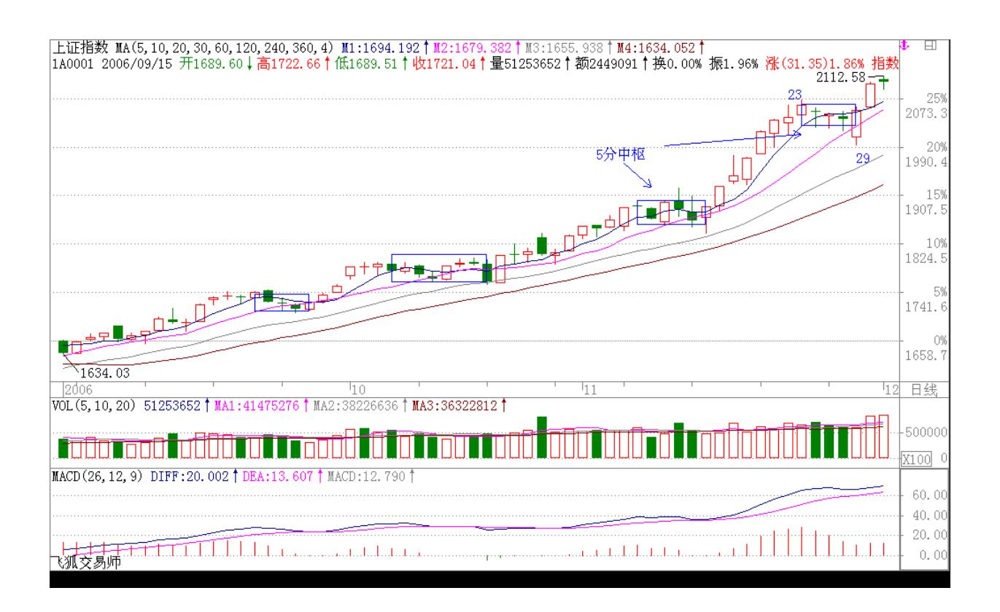
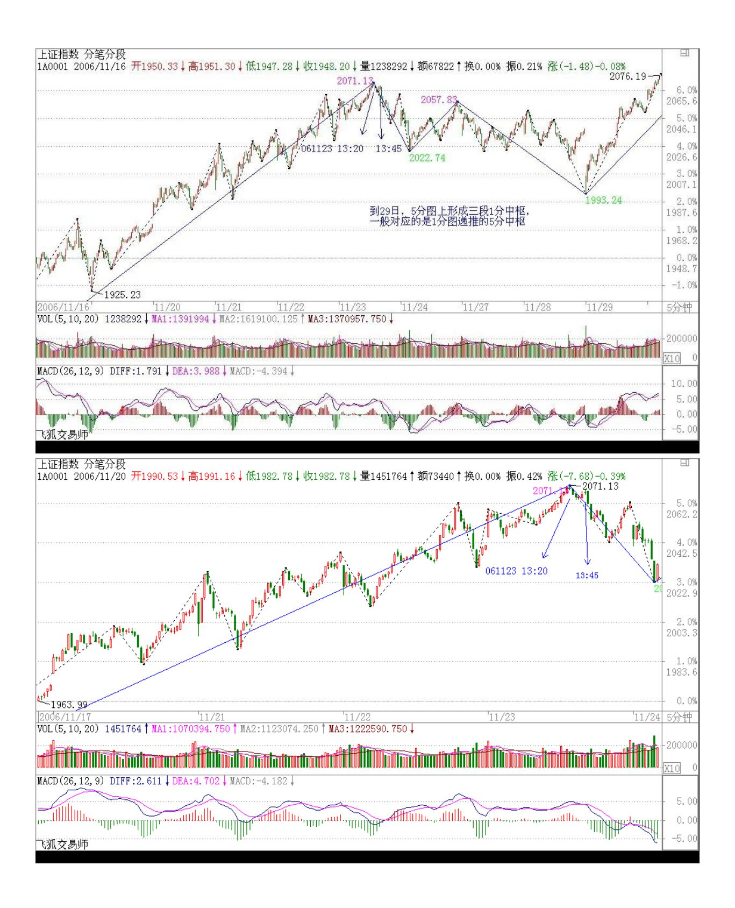
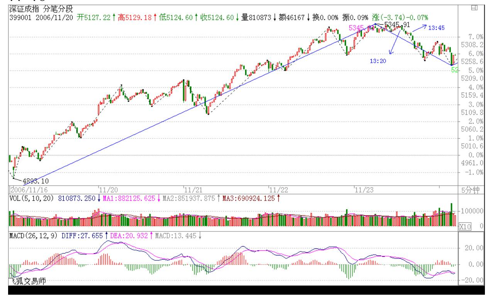

# 教你炒股票 10:2005 年 6 月,本 ID 为何时隔四年后重看股票

(2006-11-24 12:02:50 ) 2001 年 6 月后,本 ID 就从未看过股票, 直到 2005年 6 月。本 ID 是严重反对人民币升值的,曾写有"货币 战争和人民币战略"在网上广泛流传。但到2005 年 6 月,本 ID 知 道有些事情不是人力可为的,天要下雨、娘要嫁人,LET IT BE 吧。 所以 2005年 6 月,本 ID 时隔四年后重看股票。

在强国论坛的人都知道,2005 年 6 月最暴跌时,本ID 连续三次罕有 地表扬一个政府官员,就是股市当时的新人、如今那位著名的山东 人。其后还专门写文章为他说股改"开弓没有回头箭"而热烈鼓掌。 同时,本 ID 却曾写过这样的文章"群狼争肉:国有股流通与国有资 产蚕食、瓜分游戏!" 。这,难道是本 ID逻辑混乱、前后矛盾吗?

非也,这就是昨天本 ID 所解释的《论语》里"子曰:众,恶之,必 察焉;众,好之,必察焉"的完美应用。确实,从好恶角度,本 ID 严重反对人民币升值、反对国有股流通,而且深刻地分析了这些玩意 后面的现实逻辑关系和严重后果。但在股市里,本 ID从来没有好恶。 只要有点金融常识的人都知道,本币的历史性升值所带来历史性牛市 曾被太多国家所经历。本 ID 只知道,一旦人民币升值、国有股流 通,股市将大涨。知识分子为什么可笑,就是有好恶而无"察" ,企 图以理论来理论现实,十足脑子水太多了。

书呆子是不适宜投资市场的,错了,应该是投机市场。别相信这世上 有什么投资市场,世界本身都是投机的,还有什么资可投?就像有人 号称所谓爱情,而所有的爱情,都不过是遮掩性游戏谎言的一条内裤 而已。所有的性游戏都可以用这样的数学表达式表示:4N9。N 代表从 0 到无穷的自然数,0 等于没搞上,无穷等于天长地久也就是废话,1 等于一夜情 419,所有的性游戏包括爱情,都被这样一个数学表达式 表示了。那么,任何一个投资者和股票的性关系,也完全可以以此表 示。任何股票和你,都不过是一个 4N9的关系,可以投机的就是这个 N,如果你能在这个 N里把一只股票当面首一样采尽他的精气,那你就 是高手了。其后再换一个继续 N2 的游戏,如果该游戏可以新戏不 断,而你又能采之而不被采,那你就是高手中的高手了。世界就那么 简单,别把自己搞糊涂了。

股票,恶之,必察焉;股票,好之,必察焉。由孔子的话,不难明白 以上的道理,而明白这道理,就明白投机市场第一原则"只搞能搞 的"所依。智慧都是相通的,"只搞能搞的",而不是"只搞喜欢 的" 。能搞是需要"察"而得之,不是靠喜好厌恶而来的。随便在市 场里抓一个人,问他为什么买手里的股票,一万个人有 9999 个告诉 你因为他的股票如何如何好,这种人能在市场上长久活下来就世界最 大奇迹了。本ID 从来不觉得自己手里的股票有什么好,只知道他们能 搞。

但几乎所有的人,包括庄家、散户,都喜欢为自己股票的好找理由。 别以为庄家就不这样,庄家里的傻人从来不比散户少,本 ID 见多 了。这些人,拿了股票就到处找理由为其持有、上涨编故事,就算股 票已经从 10 跌到 1 了,还乐此不疲。市场里所有亏损,都是因为持 有了不能搞的股票而造成的。但无论任何股票,能搞总是相对的,不 能搞却是绝对的,就像 4N9里,如果你为了某面首把 N 设成无穷,那 么劝你自杀吧,因为你活也白活了,你已经不是人,而是某面首的附

属物。N 只能有限地给予一个固定的能搞对象,有 N1,就要有 N2, 这样才能生生不息,才能风生水起。

但在 4N9 任意一段 N 中,这面首、这股票就是你的全部,你要全身 心地投入去"察"去"采" ,投机市场,机会总是一闪而过,别到白 天才问夜的黑,那什么菜都凉了。能搞是相对的,意味着随时能搞就 会变成不能搞。一旦这"机"失去了,就会在不能搞的泥潭难以自 拔。无论对面首或股票,都要全身心地往死里干然后抛弃,这是不能 偏废的两方面,任何的失败者都一定是至少在其中一面失败了。

在 4N9 的任何一段 N 中,可以有世界上最浪漫的故事、最火热的缠 绵,有无数的细节,从前戏到缠绵到进入到高潮到不应到抛弃,所有 的故事只是唯一的故事,就像所有的 AV 都只有同一的情节。从下一 期开始,我们将仔细分析同一 AV 情节的每一个细节,让每一细节深 入你心,成为本能的反应,然后才能成为AV 主角,在每一段 4N9 中 高潮迭起,采阳不休。

\*\*\*\*\*\*\*\*\*\*\*\*\*\*\*\*\*\*\*\*。

解盘及互动问答:

\*\*\*\*\*\*\*\*\*\*\*\*\*\*\*\*\*\*\*\*。

缠师:大盘如期调整,请自己密切关注逆市不跌的股票,下轮的黑马 由此产生的可能性很大。2006-11-2412:15:10目前正在 5 日线的多空 争夺中,多头胜则会出现最强走势,当天调整完成,否则调整时间将 大幅度延长。

但个股表现不会差,密切关注未启动的、逆势走强的股票。

本 ID 有空会在最新帖子里即时有关大盘走势的提示。是否准确,各 位可以自行判断。2006-11-2412:17:2048 昨天的提示转录如下:再次 友情提醒,目前深成指数与沪指已出现背离,这是一个很不好的信 号,如果2 点以后还不改变,盘中震荡不可避免。而且指数进入调整 的可能进一步加大。2006-11-23 13:42:46大盘如上友情提示,盘中出 现大幅震荡,震荡中新板块借机启动,这就是典型的轮动,短线技术 好的在其中可以玩得不亦乐乎。

但大盘今天终显疲态,两地指数出现背离,成交量也有所萎缩,预示 真正的调整迫在眉睫。注意,盘中震荡和调整可不是一回事,即使最 短线的调整也至少要去考验 5 天甚至 10 天线的。

还是像中午所说的,对调整无须恐惧,技术好的人最喜欢调整了,调 整正是寻找下一次上涨好股票的时候,至少可以利用调整换股或打差 价,前期没动的股票也会借调整启动的。2006-11-23 15:11:58五日线 压力不小,站稳前应多观察,密切注意不随大盘而动的股票。2006- 11-24 13:34:49重新突破 5 日线,14 点的回试确定站稳,大盘将展 开反攻。2006-11-24 13:50:35还是那话,短线继续板块轮动,没动的 都要动。调整是短线高手的天堂,当然,中线的也可以打点短差,技 术一般的就看着吧,这"上上下下"的享受,也可以继续享受享受。 2006-11-27 12:19:44今天大盘的走势十分规范,最终就刚好收在本 ID 所强调的 5 日线上,其实,目前大盘并不太重要,关键是把握好 个股轮动,本 ID 每次都反复强调这一点,强调不用怕调整,调整就 是机会。2006-11-2715:10:23大盘结束调整后的这次上攻一旦完成, 下一轮的调整将比较大,是全面性的,大多数个股都会跟着调,而不 像这次,就大盘股调,这点是必须注意的,本 ID事先告诉各位了。

今天走势很正常,关键还是这两天一直强调的 5 日线,目前最稳妥的 走法就是让 5 日线和 10 日线来个接吻的前戏,然后再次高潮。但必 须再次指出,这次高潮过后,相应的不应期要比这次长。2006-11- 2812:15:1349 和各位说说银行股,不是让各位现在买,只是银行股是 大盘风向。2006-11-28 12:37:43目前最重要的是招商,他突破历史天 价后回试。整个大盘和银行股的走势与之极为密切,一旦他能真正突 破历史天价,所有银行股都会进一步扩展上升空间。

所以他的走势对短、中线大盘的力度十分关键。

试想,一个站在 25-30 元的招行,为所有股票打开了多大的上升空 间。更别说 50 元的了。

招行最终能否上 50 元,这点本 ID 不愿意预测。但本 ID 只知道, 每次大行情,深发展都上 50 元。招行也是深圳的,他的行长姓马。

1. 网友[匿名] 蕃茄:"难度不大就不叫前戏了。前戏是难度最大 的。有前戏,高潮可待。连前戏都没有,只能喝西北风了。"楼主自 研的这套东东还真的满贴切,看来沪市要接吻还是要靠银行股呀。 2006-11-28 12:43:24缠师:吻有几种。如果是飞吻,太轻飘,以后的 走势不稳。唇吻,这要小心骗线,只要不是骗线,其后走势都较好。 湿吻,骗线几率太大,但如果不是,那走势反而比较火暴。

#### \*\*\*\*\*\*\*\*\*\*\*\*\*\*\*\*\*\*\*。

缠师:这大盘够有表演欲的,中午本 ID 说最稳妥的走法就是让 5 日 线和 10 日线来个接吻的前戏,结果下午就来了一次表演,把那些装 纯情的吓了一跳。

2006-11-28 14:56:17上面还说了,吻有三种:如果是飞吻,就这一下 就没了,明天直接攻上 5 日线,扬长而去;如果是唇吻,那今天下午 的表演还会有的。5 日线是压力。如果是湿吻,10 日线一定要破的, 那种火辣辣的镜头会不断出现,把所有纯情分子羞跑了,高潮才会出 现。是什么吻,判断很简单,看住 5 日线就行了。

下午马上有应酬,晚上不一定能上来,尽量争取吧。各位,看多点 AV,不纯情了。股票自然能做好。

纯情的人,连吻都怕看的人,是做不好股票的。

#### \*\*\*\*\*\*\*\*\*\*\*\*\*\*\*\*\*\*\*\*。

2. 网友 [匿名] 乡下人:你这厮,自己的家园已经不错了,每每去别 处打广告,不自信。不要拉大旗做虎皮嘛。2006-11-24 12:23:21缠 师:正因为有绝对的信心才要广告,广而告之,中国有十几亿人,潜 力巨大。(2006-11-24 12:26:23)

- 3. 网友[匿名] 快:600118、600123 和 600832 此三股。数女如何看 待?2006-11-24 12:09:30缠师:600118 中线调整,等待年线上移给 予支持。
- 600123 中线问题不大,短线 15.8 元压力位不破,小心回调压力。 600832 年线压力不小,一旦站稳,中线行情展开。(2006-11-24

#### \*\*\*\*\*\*\*\*\*\*\*\*\*\*\*\*\*\*\*\*。

4. 网友[匿名] 你的样子:数女你好!我花了几天时间,把你的博客 从头看到这儿了。佩服!佩服!有个问题想请教,像我基本上是股票 的门外汉,能否趁现在的天时也介入股票呢?对股票来说是搞明白些 重要,还是大势更重要些?2006-11-24 12:24:46缠师:先学习,别从 开始就糊涂,那就麻烦大了。

(2006-11-24 12:33:04)

#### \*\*\*\*\*\*\*\*\*\*\*\*\*\*\*\*\*\*\*\*。

5. 网友[匿名] 惊为天人:美女,能否推荐些炒股票入门的好书啊? 看了你的文章,我深刻的理解为什么高手都是寂寞的啦。2006-11-24 12:28:4451 缠师:就看本 ID 的文章就行了。对股票,全中国没有比 本 ID 更权威的了,你还想看什么?(2006-11-24 12:33:57)\*\*\*\*\*\*\*\*\*\*\*\*\*\*\*\*\*\*\*\*6. 网友[匿名] 灵岩:楼主:真的非 常想知道你对封基、钢铁股、电力股(或公用事业股)的看法,希望 你能够赐教。谢谢!2006-11-24 12:35:24缠师:都没问题。钢铁股的 中线行情不都在展开吗?其他也会表现的,拿着就请耐心点。(2006- 11-2412:39:27)

#### \*\*\*\*\*\*\*\*\*\*\*\*\*\*\*\*\*\*\*\*。

7. 网友[匿名] 灵岩:不然我就请教个股吧。600026、600886、 600401、600012 和 600231 会如何走呢?谢谢!2006-11-24 12:39:15缠师:600026,30 天均线是中线的关键,不破继续持有,买 入最好时机已过。600886,回试年线得到支持,再确认不破有望展开 中线行情。600401,考验年线支持。600012,突破年线,等待确认。 600231,4.89 元的短线压力突破前维持箱型,中线问题不大。

(2006-11-24 12:46:18)

#### \*\*\*\*\*\*\*\*\*\*\*\*\*\*\*\*\*\*\*\*。

8. 网友馋中听禅:禅师好!大作已拜读并收藏。关于股票,禅师用的 是未复权的 K 线图形,为何不用复权的?比如:600581 周 120p 在

4 元阻力位,若复权120p 为 3 元。我的理解:大多散户不复权,故 将错就错。烦请指正!2006-11-24 12:43:40缠师:打倒夫权,当然就 不能要复权的了。(2006-11-24 12:47:18)\*\*\*\*\*\*\*\*\*\*\*\*\*\*\*\*\*\*\*\*9. 网友[匿名] 夜雨:帮助我看一下 580004 如何,谢谢!2006-11-24 12:39:3152 缠师:还行,但权证风险较大,短线技术差的最好别参 与。(2006-11-24 12:52:38)

#### \*\*\*\*\*\*\*\*\*\*\*\*\*\*\*\*\*\*\*\*。

10. 网友[匿名] 爱你数女:请教房地产股是看涨还是看跌?2006-11- 24 12:51:45缠师:二线地产股补涨,然后就是三线的,把握这个节 奏。(2006-11-24 12:53:45)

#### \*\*\*\*\*\*\*\*\*\*\*\*\*\*\*\*\*\*\*\*。

11. 网友[匿名] 老闲:连着看了几天你的博客,突然感觉自己就是属 于你说的那种不能挣钱的废人,还号称学过经济学,不是一般的厚脸 皮。先向姐姐表示一下感谢!因为确实,你有的想法解决了一些困扰 我的问题。呵呵,思想这个东西,有时候会产生意想不到的外部效 应。感谢互联网。感谢博主和大家分享自己的知识和经验。另外,请 教个实际问题,看图的时候,是否应该看复权以后的 K 线?还想问 问:8.1 元买入的 000898 ,3.2 元买入的000725 ,4 元买入的 600301,这三只股票应该如何操作?出了?还是留着?目前这三支股 占仓位不大,还有资金可以操作。多谢!2006-11-24 12:50:00缠师: 不复权。复权的可参看历史阻力、支持位。

000898:一定不要追高买股票,刚突破年线回试时买不更安全有效? 000725:等待一下,中线会解套的。

600301:还是年线问题,中线应该问题不大,短线磨年线会有点磨 人。(2006-11-24 12:59:08)

#### \*\*\*\*\*\*\*\*\*\*\*\*\*\*\*\*\*\*\*\*。

缠师:五日线压力不少,站稳前应多观察,密切注意不随大盘而动的 股票。(2006-11-24 13:34:49) 53 重新突破 5 日线,14 点的回试确 定站稳,大盘将展开反攻。(2006-11-24 13:50:35) 反攻力度有点 弱。个股表现不错,房地产股票如上面所说的,一线然后二线接着三 线,现在连天鸿这种三线亏损房地产股票也启动了,但这时候,房地

产板块短线压力就开始增加了,中线暂时问题不大。(2006-11-24 14:14:17)

#### \*\*\*\*\*\*\*\*\*\*\*\*\*\*\*\*\*\*\*\*。

缠师:如期反攻,力度有问题,下周反复难免。短线5 日线是关键, 不能跌破,跌破则重新考验 2000 点下缺口支持。(2006-11-24 15:00:18)

#### \*\*\*\*\*\*\*\*\*\*\*\*\*\*\*\*\*\*\*\*。

12. 网友[匿名] 夜雨:姐姐,你真是高手啊!这几天发现您的文章, 真是惊为天人。谢谢你刚才回答了我580004 的问题。我现在手上还有 重仓股 601111,成本 4.45 元;000039,成本 14.2 元;600436,成 本17.4 元。这几只股,要卖还是要留呢?还有想进600832,现在能进 吗?谢谢!2006-11-24 13:08:50缠师:千万别追高买股票,一定要在 刚启动的时候买。中线大幅上涨后,一定要等中线调整结束后再买, 这样虽然会浪费很多所谓的机会,但这样一定能活下来。现在牛市没 问题,随便怎么买都会挣钱,但一旦养成这个极其不好的习惯,以后 就麻烦大了。

601111:此股中线是没问题的,短线折腾少不了。

000039:不要等拉了大阳线才买股票,一定要习惯于在放量突破回调 时买股票,这样风险小很多。该股票中线没问题,短线有一定折腾, 因为刚好在前期缺口位置上。600436: 17-18 元的短线箱型正面临突 破选择,该股属于大幅上升后的大中级调整,15.5-19.6元的中线大箱 型整理结束前折腾少不了。600832:短线面临 11.4 元的年线压力, 一旦有效突破,上升空间彻底打开。(2006-11-24 20:50:56)

#### \*\*\*\*\*\*\*\*\*\*\*\*\*\*\*\*\*\*\*\*。

13. 网友[匿名] 熊熊:姐姐,我近来看了你的博客,我就是不能挣钱 的人。请教您 000562 和 000875 的走势。请赐教。在炒股方面请多 出点文章。谢谢!2006-11-24 13:39:5354 缠师:000562:暴涨后的 中线大调整,短线有一次突破走势,但是否真突破,要密切观察,因 为这种类型的走势最多骗线了。短线压力 8.8 元,中线压力9.6 元, 如要展开第二波上涨,必须有效突破后一位置。000875: 正积聚中线

启动能量。中线关键位置是120 周线,目前在 3.4 元,正逐步下行。 中线行情展开,以有效突破该线为标志。(2006-11-24 21:07:55)

#### \*\*\*\*\*\*\*\*\*\*\*\*\*\*\*\*\*\*\*\*。

14. 网友[匿名] 请教 LZ: 600832 现在的年线位置是 8.78 元啊, 怎么是 11.4 元呢?差这么多?我的设置是 240 日,未复权的。 2006-11-24 21:10:32缠师:你的不对,找找原因。另外,年线一般用 250天。(2006-11-24 21:16:36)

#### \*\*\*\*\*\*\*\*\*\*\*\*\*\*\*\*\*\*\*\*。

15. 网友风月:"就看本 ID 的,对股票,全中国没有比本 ID 更权 威的,你还想看什么?" 。"现代诗词就不说了,古典诗词,暂时本 ID 还没看到当代有谁比本 ID 写得好的,本 ID 在网上贴的,都是中 下水平的,暂时几次挑战都没见对手,其他就不说了。"天地间,就 没见过有这么自信的人!如果数学妹妹的自信给我一点,我也会改变 很多!悄悄的问一声妹妹,怎么样才能有强大的自信?2006-11-24缠 师:这就是实力。对具体股票不能一个个解释了,太浪费时间。有些 人一个人就弄了十几只股票,如果这样,本 ID 什么都不干都解释不 过来。 以后每次每人最多一只股票,特别以后人越来越多,这种情况 要找一个好的解决办法。而最好的办法,就是你们要自己学会。学会 渔,自有鱼。(2006-11-24 21:20:01)

#### \*\*\*\*\*\*\*\*\*\*\*\*\*\*\*\*\*\*\*\*。

16. 网友[匿名] 咕咚:不知下周初,楼主对认沽证有何见解?2006- 11-24 21:17:18缠师:等待一次大盘转折时的大爆发。(2006-11- 2421:23:43)

#### \*\*\*\*\*\*\*\*\*\*\*\*\*\*\*\*\*\*\*\*。

17. 网友[匿名] toLZ:"你的不对,找找原因,另外,年线一般用 250 天。"小姐如何设置,我一向都是这么看的啊?我刚才注意比照 了一下,你前面所说的年线我都对不上,万望指教,或许这个问题对 你很简单。2006-11-24 21:22:55缠师:对不起,本 ID 对电脑系统没 什么研究,东方明珠 8 元多的年线肯定不对,可能没把 G 股的除权 算上。每套系统都不同,自己慢慢研究去吧。

#### \*\*\*\*\*\*\*\*\*\*\*\*\*\*\*\*\*\*\*\*。

18. 网友[匿名] 无言:今夜外汇市场美元大跌,下周对中国股市会有 何影响?2006-11-24 20:11:21缠师:这种思维方式是完全错误的。不 要预测任何消息对市场的影响,而是要仔细观察市场对消息的所有消 息的综合反应,也就是市场的走势本身。就像感冒之于人的体质,消 息是来测试市场体质的,而不是用来预测的。(2006-11-24 21:31:16)

#### \*\*\*\*\*\*\*\*\*\*\*\*\*\*\*\*\*\*\*\*。

19. 网友[匿名] 数妹 fans:数妹辛苦了!2006-11-24 21:28:58缠 师:没事。有时间就多说点,没时间就少说点,本ID 不能保证天天都 能如此的。(2006-11-2421:32:28)

#### \*\*\*\*\*\*\*\*\*\*\*\*\*\*\*\*\*\*\*\*。

20. 网友[匿名] 摄影之友:LZ,你更象是智慧的化身。面对楼主的大 智大慧,真的是听君一习言,胜读十年书。而您这么年轻,又怎能不 让我想起:"有志不在年高,无志穷活百年"这句话呢。你是智慧之 子!我入股市也是很长时间了,大概有近三个月了。可我仍旧输在心 态的问题上。唉。慢慢调整吧。我前几天出掉了 600177(雅弋尔), 可今天它却逆市上56 涨了。所以想请教:(1)600177 我下周可以再 追回来吗?尽管我看 LZ 说了,对摒弃的股票就要绝情。(2)600028 (中国石化),我是 7.70 元的价格买的。600019(宝钢),我是 6.36 元的价格买的。

可以继续持有吗?(3)请教 LZ 对下周的大势,有什么评论吗? 2006-11-24 21:24:04缠师:你这种问题有典型性,本 ID 不介意说多 两句。

首先你要问自己当时为什么抛那股票。如果你是本着中线介入的,那 股票中线所有指标都走得很好,一直在 120 周线上调整,没有跌破这 中线的生命线,所以找不到要中线走的理由;短线就不说了,走了就 走了。所以买股票时一定要先搞清楚你为什么要买,你搞他的理由是 什么,是短线的还是中线的,相应的要设计好介入的模式和仓位控 制,不能被市场的短线波动所影响。

你另外两只股票介入的价格是不是有点太追高了?中线,它们都没有 问题。但本 ID 觉得还是要养成绝对不追高的好习惯,除非是刚启

动,在大幅上涨后才追高,这不是投资的长久之计。

大盘走势在上面收盘总结里已经说了。找 3 点附近本ID 的帖子看 看。(2006-11-24 21:41:13)

#### \*\*\*\*\*\*\*\*\*\*\*\*\*\*\*\*\*\*\*\*。

缠师:这是今天在盘中的一些即时提示,好好研究一下,以后指数期 货用得着。

大盘如期调整,请自己密切关注逆市不跌的股票,下轮的黑马由此产 生的可能性很大。

目前正在 5 日线的多空争夺中,多头胜则会出现最强走势,当天调整 完成,否则调整时间将大幅度延长。

但个股表现不会差,密切关注未启动的、逆势走强的股票。2006-11- 24 12:15:10五日线压力不少,站稳前应多观察,密切注意不随大盘而 动的股票。2006-11-24 13:34:49重新突破 5 日线,14 点的回试确定 站稳,大盘将展开反攻。2006-11-24 13:50:3557 反攻力度有点弱。 个股表现不错,房地产股票如上面所说的,一线然后二线接着三线, 现在连天鸿这种三线亏损房地产股票也启动了,但这时候,房地产板 块短线压力就开始增加了,中线暂时问题不大。2006-11-24 14:14:17 如期反攻,力度有问题,下周反复难免。短线 5 日线是关键,不能跌 破,跌破则重新考验 2000 点下缺口支持。2006-11-24 15:00:18

#### \*\*\*\*\*\*\*\*\*\*\*\*\*\*\*\*\*\*\*\*。

21. 网友[匿名] toLZ:"对不起,本 ID 对电脑系统没什么研究,东 方明珠 8 元多的年线肯定不对,可能没把 G 股的除权算上,每套系 统都不同,自己慢慢研究去吧。"谢谢 LZ!在夫权(复权)上的问 题,已经解决了。非常感谢。我一直用的是标准除权的,软件是最简 单的钱龙,不知 mm 用的是何方神圣?2006-11-24 21:41:34缠师:机 构室里是什么就用什么,每个证券公司都有所不同,本 ID 也不大注 意。关键是人,而不是系统。(2006-11-24 21:49:57)

22. 网友馋中听禅:"对具体股票不能一个个解释了,太浪费时间。 有些人一个人就弄了十几只股票,如果这样,本 ID 什么都不干都解 释不过来。" "以后每次每人最多一只股票,特别以后人越来越多, 这种情况要找一个好的解决办法" 。"而最好的办法,就是你们要自 己学会。学会渔,自有鱼。" 初级问题我来回答,禅师只需说 "对"或"错"即可。2006-11-24 21:49:24缠师:这样也可以,你自 己顺便也提高了。(2006-11-24 21:50:54)

#### \*\*\*\*\*\*\*\*\*\*\*\*\*\*\*\*\*\*\*\*。

23. 网友[匿名] 在路上:禅师没回应我的股票问题,那也没关系,在 下还想请教2个问题:(1)我的侄女今年刚上初一,能否推荐几本未 来对她在数学方面有拓展的读本。(2)能否再解释几句"教你炒股票 4" 的那句"用你的眼睛去看,用你的心去感受"。唉!本人资质有 限啊。还望赐教。谢谢!2006-11-2421:42:3558 缠师:关键是她自己 的兴趣,如果没有这方面的兴趣,看什么都不好使。

炒股首先不要受消息、情绪等等的影响,这样你的眼睛才看得清楚。 然后你的心才会敏感。慢慢对市场就有了一种灵感。市场仿佛就是你 的身体一样。它有什么风吹草动、头疼脑热的,你马上就有感应。这 样才有点样子。但这是要慢慢来的。先把一些基础的东西变成自己的 一种本能反应。例如建立符合自己的有效的操作程序等等,这是初学 者最基本的东西。(2006-11-24 21:57:10)

#### \*\*\*\*\*\*\*\*\*\*\*\*\*\*\*\*\*\*\*\*。

24. 网友[匿名] 破缠悟禅:禅师你好!本人新进入股市,请教几个问 题。麻烦禅师帮忙分析。目前本人手中持有 000858 、000659 和 600050 这三只股票。麻烦禅师给分析下形势。谢谢!另外,本人想学 点短线操作技术,请问禅师有什么忠告? 2006-11-2421:52:10缠师: 000858:大涨后的中线大调整,现在正等待 5周线的上移支持,如果 短线能站稳 5 周线,则第二波突破就很有可能出现,否则还要折腾折 腾。 000659和 600050 中线都没问题,详细就不说了。(2006-11-24 22:01:06)

25. 网友[匿名] 小迷糊:我从 mop 追数女到天涯杂谈,又到股市论 坛,再到这个 blog。谢谢数女在方法论上对股票操作的评论,看了真 感觉当头棒喝,让我悟了很多东西。本月实战的战果辉煌,无一失 手。这是数女的功劳。哈哈。数女若到成都,我请你喝茶。

多谢多谢! 2006-11-24 21:54:19缠师:要不断总结,不能被胜利冲 昏头脑。毕竟现在是牛市,操作难度要小多了。市场操作是一个武功 修炼的过程。不能把自己局限在一个境界里。要先摸索总结,然后寻 求突破,达到一个新的境界。这都是自我修炼的过程,别人只能从旁 说道几句。(2006-11-2422:05:16)

#### \*\*\*\*\*\*\*\*\*\*\*\*\*\*\*\*\*\*\*\*。

26. 网友[匿名] 摄影之友:"你另外两只股票介入的价格是不是有点 太追高了?中线,它们都没有问题。

但本 ID 觉得还是要养成绝对不追高的好习惯。除非是刚启动,在大 幅上涨后才追高。否则,不是投资的长久之计。"谢谢 LZ。那我下周 如何操作?出掉它们吗(600028/600019)?也不再追 600177了吗? 郁闷。唉。无知者无畏啊。也许就是这样的心态我才追的。2006-11- 24 22:08:35缠师:也不用全抛了。毕竟中线行情还没有完全结束。如 果你满仓这两只股票,那最好借短线冲高的机会,减低一点仓位。这 样就减少了风险,资金运用也可以灵活点。如果占仓位比例不高,那 就留着也没问题。

说实在的,你这类情况,谁处理都麻烦。而所有操作的困难都是操作 的失误造成的。养成好习惯是投资第一重要的事情。别怕机会都没 了,市场中永远有机会,关键是有没有发现和把握机会的能力,而这 种能力的基础是一套好的操作习惯。这样所有的操作都没有什么两难 的地方,都很简单。

真正的高手从来不迎难而上,把自己整天搞到置之死地而后生的地 步。看看庄子里解牛的故事,好好想想。(2006-11-24 22:23:14)

#### \*\*\*\*\*\*\*\*\*\*\*\*\*\*\*\*\*\*\*\*。

27. 网友[匿名] thanks: LZ,我每天都光顾你的博客,在这里我学 到很多的知识,感谢你给我们带来了快乐。顺便问,600797 可以搞 吗?2006-11-2422:23:22缠师:中线没问题。短线最好的、也就是均

线粘合时机已经错过。目前介入,要冒突破失败的风险。所以只能算 是次好的时机,是否介入,关键看你对风险的承受能力如何了。今天 最后一个问题了,再见。

(2006-11-24 22:30:00)

#### \*\*\*\*\*\*\*\*\*\*\*\*\*\*\*\*\*\*\*\*。

28. 网友[匿名] ddt181:姐姐,很佩服你。我几年前买的 600352 和 600253 两只垃圾股。指数都已经涨了一倍了,还是套着的。讨教什么 时候可以解放?缠师:等吧。会轮到他们的。(2006-11-28 09:12:36)

#### \*\*\*\*\*\*\*\*\*\*\*\*\*\*\*\*\*\*\*\*。

60 29. 网友[匿名] lran:学生欲先为孺子,至于君子,至于君,或 至于道,至于禅。不知此生有望无。

缠师:如此也稳妥,但如果有大勇猛、大智慧者,犯不着如此周折。 本 ID 说你就佛,你敢承担吗?不敢承担,就是缺乏大智、大勇;如 真的以为有所承担,就是大妄言、大痴汉。

佛,干屎橛,着它作么?干屎橛,又碍你什么?碍你的,只是你,瞎 觅什么?(2006-11-25 23:22:14) 本章有点高深,因为康德的哲学, 本来能明晰的人就很少。现在说孔子在两千多年前一句话,就把康德 几十年的研究给盖了,大概能接受的人很少,够各位研究一阵子了。 (2006-11-26 12:22:04)无论是否玩股票的,要不被股票或其他玩,而 是玩股票和其他,就要好好学学《论语》,不知其"不患",又焉知 其"患"?不知其"患",焉能不患?(2006-11-26 12:27:10)

#### \*\*\*\*\*\*\*\*\*\*\*\*\*\*\*\*\*\*\*\*。

30. 网友[匿名] 股王之王:没坐上,够狠自己坐,不用研究那么多别 人的,做好自己的就行。2006-11-2612:29:43缠师:不干白不干,不 做白不做,但千万别做自己。

(2006-11-26 12:39:13)

31. 网友 nlittle:认沽证的主力玩法很阴险,我确实不适合玩。我 在 580999 上赔了 10 多万,所以准备博个中线,赔了算我倒霉。30 万让别的散户少输点,挣了留下老本就是个捐字。2006-11-26 12:38:30缠师:只要不是太高买的,是有机会的。(2006-11- 2612:54:18)

#### \*\*\*\*\*\*\*\*\*\*\*\*\*\*\*\*\*\*\*\*。

32. 网友[匿名] toLZ:说好周末不谈股票,怎么又来了?2006-11-26 13:04:21缠师:主要是他的留言给新浪删了,所以有点特殊。

到此为止,下不为例。(2006-11-26 13:12:38)

#### \*\*\*\*\*\*\*\*\*\*\*\*\*\*\*\*\*\*\*\*。

33. 网友 [匿名] CCTV:LZ 真准时,每天基本都一个时间,难道 LZ 在现实中是一个很古板的人?LZ 今天说到康德,康德好象连每天散步 的时间都很准时的,LZ 像康德?2006-11-26 12:35:49缠师:午时, 阳极而衰,明白不?注意,这个是本 ID 写的,刚才新浪好象有点问 题,突然跳出来了。但必须注意,目前为止,只有这个匿名是本 ID 写的,因为是系统突然出意外造成的。注意,有些贪玩分子会故意用 这种方式装成本 ID,如果你被骗了,那和本 ID 无关。本 ID 并不介 意有人这样胡闹。(2006-11-26 13:31:50)

#### \*\*\*\*\*\*\*\*\*\*\*\*\*\*\*\*\*\*\*\*。

34. 网友[匿名] 古代:老师这句话,学生有些迷惑:只有学好了基本 功,用心领会孔子的思想。自然就能达到庄子解牛故事(庖丁解牛) 里的水平了。没吃过"芥末鸭掌"怎知其味。佛说:本来无一物。可 我是凡夫俗子,又比较愚钝。只能用心学习了。2006-11-26 13:32:06 缠师:境界不是用功就可以突破的,光用功是没用的。所谓诗在功夫 外。光用功,连诗都写不好,别说其他了。(2006-11-26 13:36:31)

#### \*\*\*\*\*\*\*\*\*\*\*\*\*\*\*\*\*\*\*\*。

35. 网友[匿名] nn:楼主现在在玩孔子,俺被楼主玩。被谁玩不重 要,重要的是玩得高兴。俺高兴就愿意被玩。不高兴就不被玩。玩股 票就高兴,赚了就是玩。亏了就是被玩。玩或被玩已经不再重要了。 关键是充实了业余生活。赚没赚对生活影响不大。数字游戏而已。谢

谢楼主提供一个可以被高兴的被玩的场所。楼主已经将孔子玩成了缠 中说禅的代言人了。但确实有道理,继续支持。楼主同意俺的观点 吗?2006-11-26 13:50:03缠师:说得不对。本 ID 只按孔子的意思来 解释,并没有增加本 ID 自己的想法。本 ID 可以理解孔子,孔子怎 么能理解本 ID?这点本 ID 早有说过。但孔子的是一个很重要的基 础,不了解孔子,更高深的就免谈了。(2006-11-26 13:59:17)

#### \*\*\*\*\*\*\*\*\*\*\*\*\*\*\*\*\*\*\*\*。

36. 网友[匿名] 小明:LZ 这么博学,实在是佩服!以 LZ 的才学, 做个国家战略研究顾问什么的一点都不差吧?如果真的如此或许对咱 老百姓也是福祉啊。

2006-11-26 13:50:45缠师:这种活自有人干,本 ID 只干别人干不了 的。

(2006-11-26 14:01:24)

#### \*\*\*\*\*\*\*\*\*\*\*\*\*\*\*\*\*\*\*\*。

37. 网友[匿名] 小明:不知 LZ 为啥对男人有那么大的深仇大恨?总 找机会挖苦,打击。男人好面子其实是好事。试想,如果哪个人连脸 面都不要了,"不知其可以" !不过,在 LZ 面前丢面子,实在不是 丢面子的事。就好比男人在心爱的女人面前丢面子一样,不足为惧。 LZ 以为如何?2006-11-26 14:02:17缠师:这种男性中心主义的想 法,还是少想点吧,那个时代早过去了。2 点了,外面的天空依然灰 暗,这北京十一月的天空。下了,再见!(2006-11-2614:13:44)

#### \*\*\*\*\*\*\*\*\*\*\*\*\*\*\*\*\*\*\*\*。

缠师:今天的反复折腾,在上周已经明确指出。2006-11-24 15:00:18 如期反攻,力度有问题,下周反复难免。短线 5 日线是关键,不能跌 破,跌破则重新考验 2000 点下缺口支持。本结论继续有效。(2006- 11-27 12:18:55) 63还是那话,短线继续板块轮动,没动的都要动。 调整是短线高手的天堂,当然,中线的也可以打点短差,技术一般的 就看着吧,这"上上下下"的享受,也可以继续享受享受。(2006-11- 27 12:19:44)\*\*\*\*\*\*\*\*\*\*\*\*\*\*\*\*\*\*\*\*38. 网友[匿名] 打死你我也不 说:上午买了000004,请数女点评一下。2006-11-27 12:18:45缠师: 中线有机会,但短线没突破 4-4.2 元的压力区,还要继续折腾。另

外,如果不是强力突破的走势,一般最好别早上买股票。因为没有 T+0,经常下午可以有很好的选择。当然,如果是中线着眼,逐步建 仓,那是另一回事。(2006-11-27 12:23:33)

#### \*\*\*\*\*\*\*\*\*\*\*\*\*\*\*\*\*\*\*\*。

39. 网友[匿名] 请教:博主今天怎么还不来?在下有两个股请求诊 断,600015(华夏银行)和 600883(博闻科技),万请不吝赐教。 另:对博主学识阅历万分佩服。2006-11-27 09:12:21缠师:600015: 三线银行股,大盘调整后有补涨潜力。600883 中线有潜力,短线等待 均线系统走好。

(2006-11-27 12:33:23)

#### \*\*\*\*\*\*\*\*\*\*\*\*\*\*\*\*\*\*\*\*。

40. 网友[匿名] 数妹 fans:数妹,请帮我看看000608 和 600649 后 市如何操作?谢谢!2006-11-2712:27:29缠师:000608: 二、三线房 地产股,正补涨中,介入最好时机已过,目前介入有短线风险,中线 问题不大。600649: 中线有潜力,短线在半年和年线间需要积聚能 量。(2006-11-27 12:36:43)\*\*\*\*\*\*\*\*\*\*\*\*\*\*\*\*\*\*\*\*64 41. 网友[匿 名] 青皮六:由女孩到禅师真是一大跨越。人的思想与年龄真的不成 正比。请教女禅师该搞科技股了吧?基金还戏吗?2006-11-27 12:31:27缠师:这是必然要搞的。只是迟早的问题。目前正积聚启动 的能量。基金中线没完,但介入最好时机已过。(2006-11-27 12:39:23)

#### \*\*\*\*\*\*\*\*\*\*\*\*\*\*\*\*\*\*\*\*。

42. 网友[匿名] 老无用:很受教。请教女禅师600376 的走势?谢 谢!2006-11-27 12:39:03缠师:三线地产,等待补涨契机。(2006- 11-2712:40:57)

#### \*\*\*\*\*\*\*\*\*\*\*\*\*\*\*\*\*\*\*\*。

43. 网友[匿名] 博主:能帮忙看看 600018 吗?2006-11-26 20:04:25缠师:中线仍有潜力。短线再启动需要补量。(2006-11-27 12:47:46)

#### \*\*\*\*\*\*\*\*\*\*\*\*\*\*\*\*\*\*\*\*。

44. 网友[匿名] nlittle:哎,主力要恨死博主了,但我坚决支持博 主。下午准备满仓认沽证,要么升天,要么短期下下地狱。2006-11- 27 12:41:12缠师:心态好一点,不能赌性太大。除非你觉得自己短线 感觉很好(即短线的操作技术很好),否则最好不要满仓参与风险太 大的品种。 赚钱是一辈子的事情,而不是一锤子的买卖。(2006-11- 27 12:49:57)

#### \*\*\*\*\*\*\*\*\*\*\*\*\*\*\*\*\*\*\*\*。

45. 网友[匿名] 国平:请楼主帮忙看看 600887 和600200。多谢! 2006-11-27 12:43:3965 缠师:600887: 中线没问题,短线考验年线 支持力度。600200: 庄股,有自救企图。(2006-11-2712:54:29)

#### \*\*\*\*\*\*\*\*\*\*\*\*\*\*\*\*\*\*\*\*。

46. 网友[匿名] 海子:数女,你好!请看一下000822 如何?多谢! 2006-11-27 12:51:12缠师:有潜力。(2006-11-27 12:55:28)

#### \*\*\*\*\*\*\*\*\*\*\*\*\*\*\*\*\*\*\*\*。

缠师:今天大盘的走势十分规范,最终就刚好收在本ID 所强调的 5 日线上,其实,目前大盘并不太重要,关键是把握好个股轮动,本 ID 每次都反复强调这一点,强调不用怕调整,调整就是机会。

大盘结束调整后的这次上攻一旦完成,下一轮的调整将比较大,是全 面性的,大多数个股都会跟着调,而不像这次,就大盘股调,这点是 必须注意的,本 ID事先告诉各位了。(2006-11-27 15:10:23)\*\*\*\*\*\*\*\*\*\*\*\*\*\*\*\*\*\*\*\*47. 网友[匿名] 是非:LZ,美国通

过逼迫日圆先升值再贬值的方式,实现了对日本经济成果的转移(略 夺)。你觉得这一幕会在中国重演吗? 2006-11-27缠师:你去看看本 ID 几年前写的"货币战争与人民币战略" ,博客里有。目前的情况 并不是本 ID 愿意看到的。(2006-11-27 15:15:12)

#### \*\*\*\*\*\*\*\*\*\*\*\*\*\*\*\*\*\*\*\*。

48. 网友[匿名] 瞎鼓捣:请教高人,600087 如何?2006-11-27 12:51:1366 缠师:短线放量过急,需要缩量确认突破后再放量。

#### \*\*\*\*\*\*\*\*\*\*\*\*\*\*\*\*\*\*\*\*。

49. 网友[匿名] 外科医生:请问小妹,能否现价介入000042(深长 城)?多谢了!2006-11-27 13:12:36缠师: 11 月 14 日回试年线的 最佳买点过了,现在介入要承受一定短线震荡风险,但中线问题不 大。

(2006-11-27 15:24:30)

#### \*\*\*\*\*\*\*\*\*\*\*\*\*\*\*\*\*\*\*\*。

50. 网友[匿名] mm:博主,你好!怎么看 600581?

(2006-11-27 13:13:07缠师:前两天才回答过,4 元的 120 周线是 压力,短线蓄势攻击,折腾少不了。中线问题不大。(2006-11-27 15:27:25)

#### \*\*\*\*\*\*\*\*\*\*\*\*\*\*\*\*\*\*\*\*。

51. 网友[匿名] 想发财:请 LZ 看看 000959 和600508。多谢! 2006-11-27 13:16:21缠师:000959: 年线蓄势,中线问题不大,短 线需要补量。 600508: 半年线蓄势,中线问题不大,短线尝试突 破。(2006-11-27 15:30:39)

#### \*\*\*\*\*\*\*\*\*\*\*\*\*\*\*\*\*\*\*\*。

52. 网友[匿名] 冰火:大姐, 请问我的判断是否对?000407:中线 不错,短线半年线有反复。但好象就要启动了。 000503:短线启动, 中线不错,但启动后还需确认。好像大姐看盘主要是看均线系统啊。 谢谢! 2006-11-27 13:40:26缠师:000407:均线没完全走好,箱型 整理蓄势。

000503:年线蓄势,中线有潜力。本 ID 没有什么是主要看的,只要 均线现成,不要按其它键,回答问题比较方便。(2006-11-27 15:35:28)

53. 网友[匿名] 7nt:"本女和证监会从一开始就有打交道,从第一 届到现在,都很熟悉。"据相关资料,楼主应该是 80 年代出生的 人。第一届证监会成立于 1992 年 10 月,那时楼主应该才 12 岁左 右,楼主怎么和它们打交道?另外楼主在 2005 年 6 月前整整 4 年 没有抄股,25 岁减 4,也就是说楼主在21岁前就已经赚够亿元身家 了。请问楼主多大开始投资股市?起步资金多少?虽然这些问题含有 个人隐私,但回答这些问题也可以让那些怀疑楼主年龄及资金来路的 人消除疑问。先谢谢楼主了。

缠师:关于年龄,本 ID 只说过没经历文革时代,其他什么都没说 过。本 ID 为什么就不能和刘大爷打交道?后面三位周大爷、周大叔 的,本 ID 为什么就不能打交道?刘大爷现在还在很多地方兼了很多 职务呢。

#### \*\*\*\*\*\*\*\*\*\*\*\*\*\*\*\*\*\*\*\*。

54. 网友[匿名] 圆无边无实虚:佛说:菩萨心不应住色布施。须菩 提!菩萨为利益一切众生,应如是布施。如来说:一切诸相,即是非 相。又说:一切众生,则非众生。须菩提!如来是真语者、实语者、 如语者、不诳语者、不异语者。(摘自《金刚经》)请教博主,《楞 严经》中佛将什么放在了首位?随文字无实意,动念即乖。你即是 我,我也即是你。你不是我,我也不是你。佛吃饱了,不等于我吃饱 了。故此请教博主。谢谢!2006-11-27 13:34:32缠师:声前、末后且 不问你,何谓这一念?这一念都不明白,还说什么"动念即乖" 。 (2006-11-2715:50:07)

#### \*\*\*\*\*\*\*\*\*\*\*\*\*\*\*\*\*\*\*\*。

55. 网友[匿名] 真冰火:博主,匿名留言的虽然无从区分来源,但添 加一段代码到你的博客里,可以看到每个匿名留言者的 IP,而且是真 实 IP 而不是代理IP 的(包括以前的)。也许你对留言人的 IP 地址 不感兴趣,但至少有助于防止有些小人利用匿名系统捣乱。我希望你 能添上代码,搞清楚谁是谁。2006-11-27 13:48:01缠师:心放宽点, 名字就一符号。(2006-11-2715:50:51)

56. 网友[匿名] 炼铁设备:我完全不懂股票。看着大家向楼主请教股 票潜力的气氛,我竟插不上嘴,心里感到惭愧。楼主,趁在牛市的好 时机,能否给我推荐一支股票,一方面发点小财,另一方面学点股票 知识,借以扫盲。谢谢!2006-11-27 14:58:33缠师:本 ID 不是股 评,没兴趣也没资质推荐股票。

市场里永远有机会,关键你是否能把握。还是先学炒股技术吧。有事 先下,晚上有时间再上来,再见。

(2006-11-27 16:03:43)

#### \*\*\*\*\*\*\*\*\*\*\*\*\*\*\*\*\*\*\*\*。

57. 网友[匿名] 急等钱用:请教 600704,4.75 元买的,现在被套牢 了,这星期能解套否? 2006-11-2717:25:23缠师:投资最重要的一条 就是用来投资的钱必须是多余的,是可以长期利用的。本 ID 不想当 算命先生,希望你好运吧。(2006-11-27 21:39:46)

#### \*\*\*\*\*\*\*\*\*\*\*\*\*\*\*\*\*\*\*\*。

58. 网友[匿名] 无言:请教楼主,600879 在这周行情中向上空间有 多大?谢谢!2006-11-27 18:13:35缠师:预测是股评干的事情。本 ID 不是股评。要在投资市场成功,唯一只需要知道,此时此地能搞 吗?如果仍在能搞的标准下,就继续持有,否则抛弃,就这么简单。 (2006-11-27 21:43:15)

#### \*\*\*\*\*\*\*\*\*\*\*\*\*\*\*\*\*\*\*\*。

69 59. 网友[匿名] 想飞: LZ,请问 600036 调到位了吗?2006-11- 27 15:17:28缠师:一定要改变思维模式。不要问什么调整到位没有的 问题,而是要问自己搞的标准是什么,每个人的标准都不同,这与资 金量和投资经验有关。唯一正确的问法是:600036 现在符合自己搞的 标准吗?是否符合,只有你自己知道。如果你自己都不知道,那请你 先停下来,自己想清楚。不清不楚就是把市场当赌场,市场会变脸 的。(2006-11-27 21:48:25)

60. 网友[匿名] 炼铁设备:"本 ID 不是股评,没兴趣也没资质推荐 股票。市场里永远有机会,关键你是否能把握。还是先学炒股技术 吧。"我能否在上面你评价过的股票中选一支呢?商品期货白糖和大 豆在春节前会成什么趋势呢?请发表下你的高见。谢谢!2006-11-27 20:06:22缠师:先学习缠论炒股技术吧。先自己心中有数,才不会盲 目。别人永远都不能替代你自己。(2006-11-

2721:56:07)\*\*\*\*\*\*\*\*\*\*\*\*\*\*\*\*\*\*\*\*61. 网友[匿名] lran:鱼我所好 也,可嗟来之鱼总有吃完的时候。目前看来博主的心情不错,有问必 答。

可还是奉劝各位,100 条鱼也比不了渔啊。其实博主的股票文章中自 有一以贯之,《经济学》、《孔子》、《马克思》、《股票》等等实 为一篇,视、观、察而已。求鱼不如求渔,熊掌在此,庸人弃之。

学生作妄语,待博主斧正。2006-11-27 21:53:53缠师:自己心中有 数,才不会盲目。别人永远都不能替代你自己。佛,也只有你自己去 成,谁也替代不了你。(2006-11-27 21:58:09)

#### \*\*\*\*\*\*\*\*\*\*\*\*\*\*\*\*\*\*\*\*。

62. 网友[匿名] 面首:我有一万元能不能炒股啊?会不会因此发财? 2006-11-27 20:09:04缠师:为什么不能呢?但发财只是一个结果。心 里有结果,就不会有结果了。先问自己能否耕耘吧。

(2006-11-27 22:02:03) 70

#### \*\*\*\*\*\*\*\*\*\*\*\*\*\*\*\*\*\*\*\*。

63. 网友[匿名] 清:问题:中信国安 03 年买入,S宁新百 04 年买 入,其实只是执着不想卖出而已,你觉得如何操作好呢?给我一个操 作建议,别说得太"股评"呀,可以的话不妨说明可以持有到什么时 候。2006-11-27 21:20:16缠师:既然已经长线持有了,就一直持有到 长线不能持有为止,而现在没有任何这样的信号产生。(2006-11-27 22:04:55)

#### \*\*\*\*\*\*\*\*\*\*\*\*\*\*\*\*\*\*\*\*。

64. 网友[匿名] 狼:请教 000850 和 000680 后市如何操作,谢谢! 2006-11-27 21:47:28缠师:000850: 大涨后的中线调整中,短线要

突破需补量。000680: 6.9 元的 120 月线是长线行情展开的最重要 关口。(2006-11-27 22:10:42)

#### \*\*\*\*\*\*\*\*\*\*\*\*\*\*\*\*\*\*\*\*。

65. 网友[匿名] 关于有色股:今天下午,似乎有色股的主力在撤退? 似乎在进攻其他的品种,LZ 如何看?这是主力暂时的撤退吗?很快又 能搞起来?2006-11-27 21:54:52缠师:短线轮动很正常。长线看,有 色股票的分化在于筹码的集中度。有些散户拿的太多的,就只能继续 折腾了。散户不敢拿的,都变庄股,走起来就没谱了。(2006-11-27 22:13:34)

#### \*\*\*\*\*\*\*\*\*\*\*\*\*\*\*\*\*\*\*\*。

66. 网友[匿名] 小股民:请楼主帮忙看看 600426 和600016 的后 市。不知道现在进入 600016,会不会有大风险?2006-11-27 21:58:57缠师:600426: 一般股票从个位到十位都要长期折腾的。该 股就是围绕 10 元干这活。中线问题不大,短线还是看成一个 9 到 11 元的大箱型比较稳妥。

71 600016:本 ID 从来不希望人追高介入,4 元多刚破年线时,你去 哪里了呢(为什么那时不买)?世界上又不是只有一只股票。当然, 该股中线没问题,但这不是一个必须介入的理由。(2006-11-27 22:22:29)

#### \*\*\*\*\*\*\*\*\*\*\*\*\*\*\*\*\*\*\*\*。

67. 网友[匿名] xuesheng:请问 lz,000897 如何?2006-11-27 22:17:58缠师:大涨后的三角形整理,短线要突破需补量。

(2006-11-27 22:24:36)

#### \*\*\*\*\*\*\*\*\*\*\*\*\*\*\*\*\*\*\*\*。

68. 网友 yahwang:初学乍练,才入市两周。持有601398、000788、 000751、600616 和 600079 各1/5,无后续资金补仓。老衲想尝试自 己在股市的年收益率。请点评。2006-11-27 22:59:27缠师:中线问题 都不大。(2006-11-28 09:04:17)

#### \*\*\*\*\*\*\*\*\*\*\*\*\*\*\*\*\*\*\*\*。

69. 网友[匿名] LIVERPOOL:请教数女:600500 和600642 后市如何 操作。关注 600256,过了买入时机,请问还有机会吗?谢谢!! 2006-11-2802:47:18缠师: 600500 和 600642,持有等待卖点出现。 股票在任何时候都可以买入,唯一的不同是承受的风险的不同。而好 的方法就是在最低风险的时候介入,但世界上没有绝对无风险的机 会。介入的关键是你明白你的风险在哪里,能承受多少,怎么退出。 (2006-11-2809:07:54)

#### \*\*\*\*\*\*\*\*\*\*\*\*\*\*\*\*\*\*\*\*。

70. 网友[匿名] 密码:这么说来像 600550 和000523 这种,刚回踩 年线的股票是最值得搞喽?缠MM 是不是这个意思?2006-11-28 06:38:2872 缠师:请好好看教你炒股票 9:甄别"早泄"男的数学原 则!(2006-11-28 09:09:32)

#### \*\*\*\*\*\*\*\*\*\*\*\*\*\*\*\*\*\*\*\*。

缠师:今天走势很正常,关键还是这两天一直强调的5 日线,目前最 稳妥的走法就是让 5 日线和 10 日线来个接吻的前戏,然后再次高 潮。但必须再次指出,这次高潮过后,相应的不应期要比这次长。 (2006-11-28 12:15:13)

#### \*\*\*\*\*\*\*\*\*\*\*\*\*\*\*\*\*\*\*\*。

71. 网友[匿名] 蕃茄:按楼主的说法,深沪两市继续背离呀。这前戏 难度大了点。2006-11-28 12:20:56缠师:难度不大就不叫前戏了。前 戏是难度最大的。

有前戏,高潮可待。连前戏都没有,只能喝西北风了。(2006-11-28 12:23:05)

#### \*\*\*\*\*\*\*\*\*\*\*\*\*\*\*\*\*\*\*\*。

72. 网友[匿名] 破缠悟禅:禅师,现在大盘的走势和你说的基本一 致。请教个问题,你预测下一波中,哪个板块可以先达到高潮?谢谢 指点!2006-11-2812:22:06缠师:所有板块都会动一次的。如果从力 度上看,还是在中低价股的补涨上会比较有力度,特别是强势板块的

补涨股。毕竟,目前大家都很谨慎。新板块的大面积高潮,要等待下 一次大的不应期结束之后。

(2006-11-28 12:25:31)

#### \*\*\*\*\*\*\*\*\*\*\*\*\*\*\*\*\*\*\*\*。

73. 网友[匿名] 希望你比我过得好:楼主,我这几天拿了点路桥建 设,到昨天为止,已经收了七连阳了。

天天担心它调整,今天早上终于把我洗出去。您看此股走势怎样?如 果可以,我还想接回来,不知有没有机会!(害怕越等成本越高) 2006-11-28 12:27:4073 缠师:这种股票短线最好操作了,5 日线不 破就拿着,万一它玩小阳后长阳的着数怎么办?缠师:和各位说说银 行股,不是让各位现在买,只是银行股是大盘风向。目前最重要的是 招商,他突破历史天价后回试。整个大盘和银行股的走势与之极为密 切,一旦他能真正突破历史天价,所有银行股都会进一步扩展上升空 间。所以他的走势对短、中线大盘的力度十分关键。试想,一个站在 25-30元的招行,为所有股票打开了多大的上升空间。更别说 50 元的 了。

招行最终能否上 50 元,这点本 ID 不愿意预测。但本 ID 只知道, 每次大行情,深发展都上 50 元。招行也是深圳的,他的行长姓马。 (2006-11-2812:37:43)\*\*\*\*\*\*\*\*\*\*\*\*\*\*\*\*\*\*\*\*74. 网友[匿名] 不应 期:请楼主看看 600508、000959 和 000630,哪个更适合中长线呢? 谢谢!2006-11-28 12:31:37缠师:中线都没问题。至于长线,本 ID 只对 4N9 感兴趣,对天长地久的谎言没兴趣。(2006-11-2812:39:49)

#### \*\*\*\*\*\*\*\*\*\*\*\*\*\*\*\*\*\*\*\*。

75. 网友[匿名] 蕃茄:"难度不大就不叫前戏了。前戏是难度最大 的。有前戏,高潮可待。连前戏都没有,只能喝西北风了。"楼主自 研的这套东东还真的满贴切,看来沪市要接吻还是要靠银行呀。2006- 11-28 12:35:18缠师:吻有几种:如果是飞吻,太轻飘,以后的走势 不稳。唇吻:这要小心骗线,只要不是骗线,其后走势都较好。湿 吻:骗线几率太大,但如果不是,那走势反而比较火暴。(2006-11-28 12:43:24)

76. 网友[匿名] 新手:麻烦 LZ 看看 600010 和601398。多谢! 2006-11-28 12:33:58缠师:中线都没问题。(2006-11-28 12:45:16) 77. 网友[匿名] 蕃茄:"招行最终能否上 50 元,这点本 ID 不愿意 预测。但本 ID 只知道,每次大行情,深发展都上 50 元。招行也是 深圳的,他的行长姓马。" 他要让他的票票天马行空吗?2006-11- 2812:44:21缠师:这样最好,皆大欢喜。(2006-11-28 12:46:32)

#### \*\*\*\*\*\*\*\*\*\*\*\*\*\*\*\*\*\*\*\*。

78. 网友[匿名] 爱你数女:请教,深圳还能炒房地产吗?我问的是买 房子。谢谢!2006-11-28 12:44:58缠师:本 ID 好几年没买过房子 了,不熟悉。炒房子还不如炒造房子的股票,就像汽车,你肯定对夏 利没兴趣,但对夏利股票就不一定了。 (2006-11-2812:48:41)

#### \*\*\*\*\*\*\*\*\*\*\*\*\*\*\*\*\*\*\*\*。

79. 网友 [匿名] 数女粉丝:请问 002037,我 8 块进的,近期能否 解套?谢谢!2006-11-28 12:43:02缠师:不要在所有均线都向下发散 时买股票,风险太大。最近中小版的面首们扩张的也太快了,大家都 有喜新厌旧的毛病,而且还有小非的压力,所以老的只好委屈一下 了,等等吧。(2006-11-28 12:59:36)

#### \*\*\*\*\*\*\*\*\*\*\*\*\*\*\*\*\*\*\*\*。

80. 网友 [匿名] 你的样子:这两天听缠女的教导,先学习了。可是 发现,股票这个东西,什么时候能学通了啊?又没有缠女的领悟力, 什么东西一看就是最高境界。恐怕等自己学明白了点,大牛市都过去 了。

于是决定缩小学习目标,只看缠女的股票文章。翻来覆去的看。看看 能不能悟出什么点东西来。缠女能说说目前是入市时机么?2006-11- 28 12:54:13缠师:学好了,永远有机会,熊市里都不缺机会。关键是 股票,你入的是股票,所以只要是好的股票,符合你指定的能搞标准 就可以入,不入白不入。(2006-11-28 13:02:30)

#### \*\*\*\*\*\*\*\*\*\*\*\*\*\*\*\*\*\*\*\*。

缠师:今天走势很正常,关键还是这两天一直强调的5 日线,目前最 稳妥的走法就是让 5 日线和 10 日线来个接吻的前戏,然后再次高 潮。但必须再次指出,这次高潮过后,相应的不应期要比这次长。

