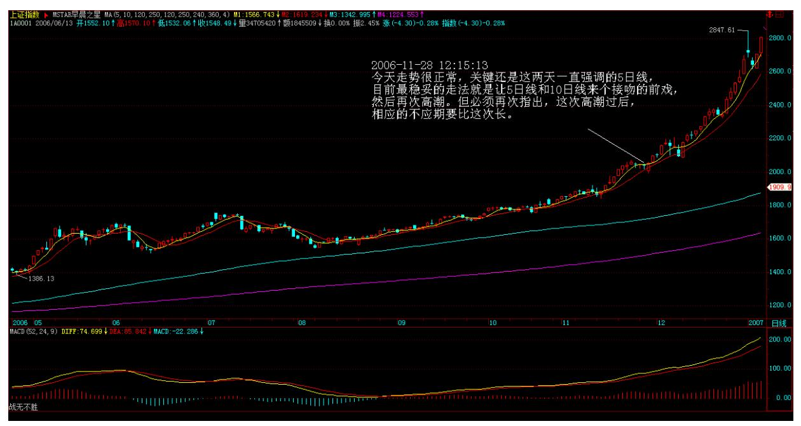
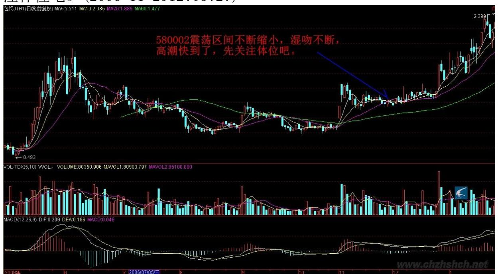

教你炒股票 11:不会吻,无以高潮

技术分析,最核心的思想就是分类,这是几乎所有玩技术的人都搞不 清楚的一点。技术指标发出买入信号,对于技术派来说,就以为是上 帝给了暗示一般,抱着如此识见,几乎所有技术派都很难有大的成 功。

技术指标不过是把市场所有可能的走势进行一个完全的分类,为什么 技术派事后都是高手,真正干起来就个个阳痿,就是这个原因。

技术分析可说的东西太多了,这指标那指标,如何应用,关键就是上 面所说的分类问题。任何技术指标,只是把市场进行完全分类后指出 在这个技术指标的视角下,什么是能搞的,什么是不能搞的,如此而 已。

至于这个指标对应的情况是否百分百反映在实际的走势上,这个问题 的答案肯定是否定的,否则所有的人都可以按照这指标操作,哪里还 有亏钱的人?然而,只要站在纯粹分类的角度考察技术指标,那么, 技术指标就会发挥他最大的威力。

最简单又最实用的技术指标系统就是所谓的均线系统。均线系统显然 不是一个太精确的系统,太多的骗线。如果你按照突破某条均线就买 入操作,反之卖出,那你的成功率绝对不会高,特别当这条均线是短 期的。真正有用的是均线系统,也就是由若干条代表短、中、长期走 势的均线构成的技术评价系统。注意,任何技术指标、系统,本质上 都是一个评价系统,也就是告诉你在这个系统的标准下,评价对象的 强弱。例如,一条 5 日均线,站在上面,代表着用 5日均线对市场所 有情况进行分类,目前站在 5 日均线上这种情况意味着是强势。然 而,站在 5 日均线上的同时,可能对于 10 日均线是在其下,那对于 10 日均线的系统评价,这种情况就是弱势了,那究竟相应的走势是强 还是弱?其实,强弱都是相对的,关键是你操作所介入的标准。对于 超超短线来说,在 1 分钟钱上显示强势就可以介入了,特别在有 T+0 的情况下,这种操作是很正常的。但对于大资金来说,就算日线上的 5 日强势也不足以让他们感兴趣。任何技术指标系统的应用,首要的 选择标准都和应用的资金量和操作时间有关,脱离了这个,任何继续 的讨论都没有意义。因此,每个人都应该按照自己的实际情况来考虑 如何去选择相应的参数,只要明白了其中的道理,其应用完全在于一 心了。

81 均线系统,必然有着各条均线间的关系问题,任何两条均线的关 系,其实就是一个"吻"的问题。按"吻"的标准,可以把相应的关 系进行一个完全分类:飞吻、唇吻、湿吻。把短期均线当成是女王, 长期均线当成面首,那么"男上位"意味着空头市场,而"女上位" 意味着多头市场,要赚钱,就要多来点"女上位"。

飞吻:短期均线略略走平后继续按原来趋势进行下去。

唇吻:短期均线靠近长期均线但不跌破或升破,然后按原来趋势继续 下去。

湿吻:短期均线跌破或升破长期均线甚至出现反复缠绕,如胶似漆。

飞吻出现的几率比较少,一般都是在趋势特别强烈的时候,而太火暴 的趋势是不可能太长久的,所以其后的震荡经常出现;唇吻,任何一 段基本的趋势过程中最常见到的方式,特别在"男上位"的情况下, 基本都是这种方式,一旦出现唇吻反弹基本就该结束了,在"女上 位"的情况下,调整结束的概率也是很大的,但也要预防唇吻演变成 湿吻;湿吻,一段趋势后出现的较大调整中,还有就是在趋势出现转

折时,这种情况也很常见,特别是在"男上位"的情况下,如果出现 短、中、长各类均线来一个 NP 的湿吻,这么情色的 AV 场景往往意 味着行情要出现重大转折,要变天了,"男上位"要变成"女上位" 了。

注意,任何的行情转折,在很大几率上都是由湿吻引发的,这里分两 种情况:一种是先湿吻,然后按原趋势来一个大的高潮,制造一个陷 阱,再转折;另一种,反复湿吻,构造一个转折性箱型,其后的高 潮,就是体位的转化了。在"男上位"的情况下,一旦出现湿吻,就 要密切注意了,特别是这个湿吻是在一个长期"男上位"后出现的, 就要更加注意了,其后的下跌往往是介入的良机,因为空头陷阱的概 率简直太大了。必须提醒,这一点对趋势形成的第一次湿吻不成立。 但湿吻之后必有高潮,唯一的区别只是体位的区别,关键判断的是体 位而不是高潮的有无。(娇注:长短均线反复缠绕粘合,最终必有方向 的选择。)会吻,才有高潮,连吻都不会,怎么高潮呢?82

\*\*\*\*\*\*\*\*\*\*\*\*\*\*\*\*\*\*\*\*。

解盘及互动问答:

#### \*\*\*\*\*\*\*\*\*\*\*\*\*\*\*\*\*\*\*\*。

缠师:大盘受外围影响,选择湿吻方式,短线急跌,选择好不跌的股 票,有机会。技术不好的,就等最近反复强调的 5 日线站稳以后再说 了。下面的判断继续有效。2006-11-29 12:03:27大盘受外围影响,选 择湿吻方式,短线急跌,选择好不跌的股票,有机会。技术不好的, 就等最近反复强调的 5 日线站稳以后再说了。2006-11-29 09:36:47 关于这个接吻,昨天中午的提示继续有效。2006-11-29 12:05:27今天 走势很正常,关键还是这两天一直强调的 5 日线,目前最稳妥的走 法,就是让 5 日线和 10 日线来个接吻的前戏,然后再次高潮。但必 须再次指出,这次高潮过后,相应的不应期要比这次长。2006-11- 2812:15:13

今早刚开盘时,就让技术好的人,选择不跌的股票,有机会;技术不 好的就看 5 日线。一般来说,技术不好的,这类震荡就上上下下享受 一下就完了。技术好的,这是打短差降低成本或者换股的好机会。

目前走势很简单,就是 5 日线能否站稳的问题,站稳就继续冲击一 波,因此明天的震荡依然难免,强的就在 5 日线站整固,一般就围绕 5 日线折腾,弱的还要跳跳水、吓吓人。

但对于个股来说,大盘怎么走都不是问题,下一波是个股普遍有表现 的一波,很多前期没大动的,都要好好表现一把,其实这次调整,很 多股票都创新高,个股比大盘重要得多。

如果一定要看指数,就看深圳成分指数,这比上海的敏感有效。

至于上海指数,5 日、10 日线唇吻还是湿吻,其实都不大重要,但这 次调整后再上一波后的那次调整,规模就会大多了,这已经反复说 过。

从大盘健康的角度说,本 ID 给大盘的建议是:先深成指突破 6103 点的历史高位,然后上海跟上,突破以后再调整,这样更健康。不知 道大盘有没有兴趣听本 ID 的意见了。2006-11-29 15:14:38缠师:该 结论继续有效。2006-11-30 11:43:54但对于个股来说,大盘怎么走都 不是问题,下一波是个股普遍有表现的一波,很多前期没大动的,都

要好好表现一把,其实这次调整,很多股票都创新高,个股比大盘重 要得多。

如果一定要看指数,就看深圳成分指数,这比上海的敏感有效。至于 上海指数,5 日、10 日线唇吻还是湿吻,其实都不大重要,但这次调 整后再上一波后的那次调整,规模就会大多了,这已经反复说过。

从大盘健康的角度说,本 ID 给大盘的建议是:先深成指突破 6103 点的历史高位,然后上海跟上,突破以后再调整,这样更健康。不知 道大盘有没有兴趣听本 ID 的意见了。2006-11-29 15:14:3885 今天 大盘有点接受了本 ID 的建议。2006-11-3011:45:32

#### \*\*\*\*\*\*\*\*\*\*\*\*\*\*\*\*\*\*\*\*。

1. 网友[匿名] 青皮六:为标题图片送一句诗:花径不曾缘客扫,蓬 门今始为君开。请教女禅师,银行股会在 12 月 11 日前基本调整到 位吗?2006-11-2915:27:39缠师:其实让他们调整时间更长些,会更 健康。这一波就让别的股票表现。让他们(银行股)在这里进行上升 三角型或旗型的整理,这样对大盘中线走势更有利。昨天说的,目前 关键看招行,他率先突破历史天价,他的走势,就是大盘的风向标。 总之,二线股是下面最多机会表现的,然后是三线,把握还节奏。

#### \*\*\*\*\*\*\*\*\*\*\*\*\*\*\*\*\*\*\*\*\*。

缠师:突破的有效性在今天下午和明后两天需要确认。其后走势是否 能如本 ID 建议那样,就继续看了。今天大盘走势十分规范,下午两 点如期一波跳水确认突破的有效性后,继续上扬,唯一不足的是启用 了银行股冲关,这与深沪两市的资金争夺有关,这在每次的行情中都 有体现。谁先突破历史新高,对两个市场的管理者的好处是很大的。 2006-11-30 15:13:57明天出现震荡很正常,只要 5 日线不破,本 ID 给市场的建议能够成为现实的可能性将继续增加。个股还是看好二线 股,而三线股的蓄势补涨依然可期。

附录本 ID 建议:从大盘健康的角度说,本 ID 给大盘的建议是:先 深成指突破 6103 点的历史高位,然后上海跟上,突破以后再调整, 这样更健康。不知道大盘有没有兴趣听本 ID 的意见了。2006-11- 2915:14:38权证天天都可以介入,天天都有机会,关键是你是否有这 样的技术。580002 震荡区间不断缩小,湿吻不断,高潮快到了,先关 注体位吧。(2006-11-2912:05:27)

86 87 2. 网友[匿名] 打死你我也不说:狂哥,不是我说你,连常识 都不懂,国债 327 没有谁违规,当时根本就没有相应的条款。2006- 11-29 12:16:53缠师:当时连交易都可以不算的,也算奇迹了。

(2006-11-29 12:30:56)

#### \*\*\*\*\*\*\*\*\*\*\*\*\*\*\*\*\*\*\*\*。

3. 网友[匿名] 数女粉丝:数女关于股票的文章,写得真好。一直在 学习中。非常感谢数女! 2006-11-2912:39:53缠师:关键要拿着图形 (股票的 K 线图)自己对照着看,才好理解。这里说的都是概念,要 化为自己的直觉才行。(2006-11-29 12:41:18)

#### \*\*\*\*\*\*\*\*\*\*\*\*\*\*\*\*\*\*\*\*。

4. 网友任我行:楼主帮我看看 030002,还有没有上涨动力。2006- 11-29 12:43:15缠师:正股正在挑战前期高位,一旦成功,空间完全 打开。暂时耐心持有,好好观察。5 日线不破就有成功希望。(2006- 11-29 12:55:29)

5. 网友任我行: 600639 怎样?地产股还会不会涨呢?2006-11-29 12:45:17缠师:不要问还会不会涨,这是一个错误问题。而是应该判 断,现在正在涨中,这就足够了。(2006-11-2912:57:30)

#### \*\*\*\*\*\*\*\*\*\*\*\*\*\*\*\*\*\*\*\*。

6. 网友[匿名] 数女粉丝:谢谢你的提示。这半年来,几乎每天都光 顾你的博客,从中学到了很多的知识。2006-11-29 12:57:4588 缠 师:谢谢,先下,再见。(2006-11-2912:59:20)

#### \*\*\*\*\*\*\*\*\*\*\*\*\*\*\*\*\*\*\*\*。

7. 网友[匿名] 小屁孩:博主你好!昨天我买入了600500 被套。痛苦 中,烦请博主给分析一下。谢谢!另外它还有可转债,我应不应该 要?2006-11-2915:01:22缠师:习惯在接吻探底时买,这时候风险最 小。中线问题不大,短线买的不好,就套一下,权当上了一堂卫生 课。(2006-11-29 15:19:14)

#### \*\*\*\*\*\*\*\*\*\*\*\*\*\*\*\*\*\*\*\*。

8. 网友[匿名] 老豆:你好数妹!能帮我看看600262,000301 和 600082 吗?先谢了!2006-11-2914:24:16缠师:中线都问题不大,耐 心点。市场中不要习惯于问为什么?而要习惯于现在是什么,符合什 么,只要符合持有的就持有,符合卖出的就卖出,就这么简单。 (2006-11-29 15:23:15)

#### \*\*\*\*\*\*\*\*\*\*\*\*\*\*\*\*\*\*\*\*。

9. 网友[匿名] yy:博主你好!烦请博主给分析一下600498,短线如 何?2006-11-29 15:12:30缠师:今天刚好触及下降压力线,一旦突 破,上升空间将打开,关键看量的堆积。中线问题不大,科技股是必 然要表现的。(2006-11-29 15:27:12)

#### \*\*\*\*\*\*\*\*\*\*\*\*\*\*\*\*\*\*\*\*。

10. 网友[匿名] 夜雨:美女姐姐,我的 580004 会有高潮吗?还是已 经早泄了呢?我的成本是 2.34 元。

等了好几天了,他的高潮都还不来。其他正股倒是牛得很。2006-11- 29 15:23:5889 缠师:你买的位置不好,被折腾是理所当然的。对箱 型的走势,一定要在箱底买,这样止损也简单。目前正等待均线系统 的粘合,耐心点吧。(2006-11-2915:37:07)

#### \*\*\*\*\*\*\*\*\*\*\*\*\*\*\*\*\*\*\*\*。

11. 网友[匿名] 痒痒:请博主分析一下 600177 的走势。谢谢! 2006-11-29 15:32:52缠师:这股票,原来被吹太多。筹码太散,所以 走势特别反复。中线会有表现的,短线 6.5 元的压力位突破了,空间 将打开。(2006-11-29 15:51:05)

#### \*\*\*\*\*\*\*\*\*\*\*\*\*\*\*\*\*\*\*\*。

12. 网友风顿: lz 好!请帮忙看看 600348。2006-11-29 15:33:47 缠师:会表现的,等着吧。(2006-11-29 15:55:54)

#### \*\*\*\*\*\*\*\*\*\*\*\*\*\*\*\*\*\*\*\*。

13. 网友 [匿名] 缠粉:缠姐,9.7 元进的水井坊,还能继续持有 吗?2006-11-29 17:25:45缠师:连 5 日线都没破,最强势,当然要 持有。

(2006-11-30 09:16:38)

#### \*\*\*\*\*\*\*\*\*\*\*\*\*\*\*\*\*\*\*\*。

14. 网友[匿名] 小迷糊:数女妹妹,假如人民币持续升值,和美圆比 价突破 1 比 6,那么受益的股票有那些呢?我想得不是很清晰,请指 教一下。 谢谢!2006-11-30 08:49:3890 缠师:银行、地产、航空 等,但这都是由头,所有都受益,因为指数就有了继续大涨的最坚实 理由。日本、台湾等的历史性大牛市都是由此而产生的。

(2006-11-30 09:18:27)

#### \*\*\*\*\*\*\*\*\*\*\*\*\*\*\*\*\*\*\*\*。

15. 网友[匿名] 湖边人家:很想问问数女妹妹,000007 我持有大半 年了。大盘涨这么多了,它怎么就不动呢?我是要换股还是继续持

有?谢谢!2006-11-29 22:33:16缠师:三线股,等二线涨了就到它 了。(2006-11-3009:19:47)

#### \*\*\*\*\*\*\*\*\*\*\*\*\*\*\*\*\*\*\*\*。

16. 网友[匿名] 缠粉:姐姐,"必须提醒,这一点对趋势形成的第一 次湿吻不成立。"这一句怎么理解?什么是趋势?网友[匿名] yf:明 白那几条线是怎么回事啦!不知 MACD 是咋回事?我也问过别人,人 家说:于无声处听惊雷。搞得自己很没有面子。呵呵。

2006-11-29 21:25:20缠师:这些下面都会说到,请耐心点。(2006- 11-3009:21:06)

#### \*\*\*\*\*\*\*\*\*\*\*\*\*\*\*\*\*\*\*\*。

17. 网友 [匿名] 老无用:请教楼主 000851 走势?谢了!2006-11- 30 12:53:04缠师:30 天均线有效跌破前,应该一路中线持有,除非 出现放量加速上涨的情况。总之,二线股是下面最多表现的,然后是 三线,把握好节奏。

#### \*\*\*\*\*\*\*\*\*\*\*\*\*\*\*\*\*\*\*\*。

18. 网友[匿名] 一声叹息:请博主看看 600857 最近能不能搞出高潮 来啊?先谢了!2006-11-30 11:55:5491 缠师:短线大涨后的整固, 再放量还有一次启动。

(2006-11-30 11:59:12)

#### \*\*\*\*\*\*\*\*\*\*\*\*\*\*\*\*\*\*\*\*。

19. 网友[匿名] 搞不懂:请问数女,002066 能不能搞一下?2006- 11-30 11:59:32缠师:中线没问题。(2006-11-30 12:00:56)

#### \*\*\*\*\*\*\*\*\*\*\*\*\*\*\*\*\*\*\*\*。

20. 网友 [匿名] 希望你过得比我好:楼主,您点评的路桥建设真的 拉了一根中阳钱,可我已经出了。听了您的话后,第二天又进去了。 现在算是浅套了点。

这样大的行情之下都能套住,说出来真丢人,但没有办法。2006-11- 30 12:13:00缠师:出了的股票怎么能又进去呢?世界上不是只有一只 股票,抛弃了就不捡回来。心态要好一点。既然又弄错了,就将错就 错吧,中线暂时问题不大。以后千万别这样操作了。注意:不要因为 涨得太多而抛股票。只有一种情况需要抛股票:就是这股票走弱了。

(2006-11-30 12:18:28)\*\*\*\*\*\*\*\*\*\*\*\*\*\*\*\*\*\*\*\*21. 网友[匿名] 缠 禅:能否赐教 600062?2006-11-30 12:18:37缠师:向庄股演化中。 (2006-11-30 12:52:12)

#### \*\*\*\*\*\*\*\*\*\*\*\*\*\*\*\*\*\*\*\*。

22. 网友[匿名] 远方:你好,请教 601001(大同煤业)是否还可持 有?2006-11-30 12:51:2692 缠师:中线蓄势中。(2006-11-30 12:53:00)

#### \*\*\*\*\*\*\*\*\*\*\*\*\*\*\*\*\*\*\*\*。

23. 网友[匿名] 想飞: LZ,你是按什么标准把股票划分为一、二、 三线的?因为弄不清,现在也不敢进,只是看着。2006-11-30 12:46:46缠师:这没有什么太明确的标准,都是约定俗成的。

像深发展(000001)是一线股,深房是三线股,这是历史形成的。当 然业绩也有一定作用,但不是唯一的因数。(2006-11-30 12:55:42)

#### \*\*\*\*\*\*\*\*\*\*\*\*\*\*\*\*\*\*\*\*。

24. 网友[匿名] 半小时以上:美女,昨天有人说你是一个"组合 体",看到了吗?2006-11-30 12:55:06缠师:这种故事在本 ID 叫 "喜欢数学的女孩"时,被本 ID 打击得无路可逃的左派就编造过, 爱编造故事的人,只能是废物,和废物还需要浪费时间吗?(2006-11- 30 12:57:19)

#### \*\*\*\*\*\*\*\*\*\*\*\*\*\*\*\*\*\*\*\*。

25. 网友 [匿名] 外科医生:请问小妹,一只股票走弱的标志是什么 呢?破 5 日均线?2006-11-3012:59:31缠师:不要习惯于这种机械化 的思维。一切都根据实际情况来的,不同资金量、不同的操作水平,

所确定的操作标准就不同。但一点是相同的,就是以我为主,定好相 应的标准才操作。(2006-11-30 13:02:47)

#### \*\*\*\*\*\*\*\*\*\*\*\*\*\*\*\*\*\*\*\*。

缠师:大盘突破的有效性在今天下午和明后两天需要确认。其后走势 是否能如本 ID 建议那样,就继续看了。(2006-11-30 13:03:57) 93

#### \*\*\*\*\*\*\*\*\*\*\*\*\*\*\*\*\*\*\*\*。

26. 网友 [匿名] 秋阳:请教小妹,000900 和600320 后势如何?谢 了! 2006-11-30 15:11:07缠师:中线都在蓄势上攻。(2006-11-30 15:17:29)

#### \*\*\*\*\*\*\*\*\*\*\*\*\*\*\*\*\*\*\*\*。

27. 网友[匿名] 清:讲正题,还是股市。关于我的中信国安 (000839)03 年买入,S 宁新百 04 年买入的问题,"本 ID"对我 也太不厚道,随便说了句"既然已经长线持有了,就一直持有到长线 不能持有为止,而现在没有任何这样的信号产生。"至少得说说 3 个 月/半年的投资评级"中性" 、"买入"、"增持" 、"走赢大市" 或"减持"之类。或者对这两个股票的意见。

缠师:对不起,本 ID 不是股评,对这种上位的评级把戏没兴趣。本 ID 只告诉你具体的操作方法,对这两个股票,中长线的潜力还没有完 全挖掘,当然就是一直持有等待中长线潜力完全耗尽为止。就像一个 长期持有茅台的人,本 ID 只可能告诉他继续持有。在牛市里,预测 任何股票的顶部都是荒谬的。这是思想方法的根本区别。(2006-11-30 15:26:28)

#### \*\*\*\*\*\*\*\*\*\*\*\*\*\*\*\*\*\*\*\*。

28. 网友[匿名] 夏日:请教小妹,000625 和 000969后势如何?谢 了! 2006-11-30 15:30:22缠师:000625: 中线潜力正在进一步挖掘 中。

000969: 短线如有突破,预防背驰出现。(2006-11-30 15:36:48)

29. 网友[匿名] 风花雪月:美媚,你好!近一年来,读了你所有的佳 作,收益颇多。也就有了一句发自肺腑的话想对你说:"衷心的谢谢 你!并恳请你有机会到哈尔滨来玩。一定去接你。"另外,请帮助看 一下600007 和 600178 两只股票,在一段时间内的趋势(我是在 2001 年最高时买进的)。谢谢!缠师:临走才看见,也回答了吧。 600007 解套并没有太大困难,甚至会有意外的惊喜。600178,这个难 度有点大,时间要长点,耐心点吧。站在至少 5年牛市的角度,只要 不是最次的股票,绝大多数都要突破历史天价的,看看以前牛市的走 势就知道了。(2006-11-30 15:48:54)

#### \*\*\*\*\*\*\*\*\*\*\*\*\*\*\*\*\*\*\*\*。

30. 网友[匿名] 呵呵:(网友提问缺失)缠师:孔二爷的思想最终的 指归都是天下,修身最终也是为了天下,不理解这点是白学了。这几 天股票比较火,问的人多,等几天股市大调整了,人自然少了,股市 里的人都这个德行,如果不从根子上改变,依然悲剧不断。所以看股 市的,也好好学学《论语》,半部《论语》治天下,就别说股市了。 (2006-11-30 15:53:54)

#### \*\*\*\*\*\*\*\*\*\*\*\*\*\*\*\*\*\*\*\*。

31. 网友[匿名] 想飞:LZ,请教一个关于均线系统的问题。你所说的 短、中、长期均线,其实并不是市场通常意义上说的参数,而是按个 人的操作习惯自行设定的。比如,可以把 5、10、20 线设成一个短、 中、长期系统。不知我这样理解对不对?2006-11-3022:53:31缠师: 根据你自己的资金量和操作水平来设置。

(2006-12-01 09:11:33)

#### \*\*\*\*\*\*\*\*\*\*\*\*\*\*\*\*\*\*\*\*。

缠师:大盘今天出现震荡是正常的,关键是 5 日线。只要 5 日线站 稳,板块会继续轮动表现的。(2006-12-01 09:13:03)

#### \*\*\*\*\*\*\*\*\*\*\*\*\*\*\*\*\*\*\*\*。

95 32. 网友[匿名] ataoo0:想请楼主分析一下000063。谢谢!2006- 12-01 09:25:15缠师:中线潜力还没有充分发挥出来。买就算了。因 为本 ID 从来不赞成别人追高,但如果连 30 天线都不触及,当然要

坚决持有。今早走势和开盘时所说一致,下午,震荡依旧,但个股基 本不要太考虑大盘。
