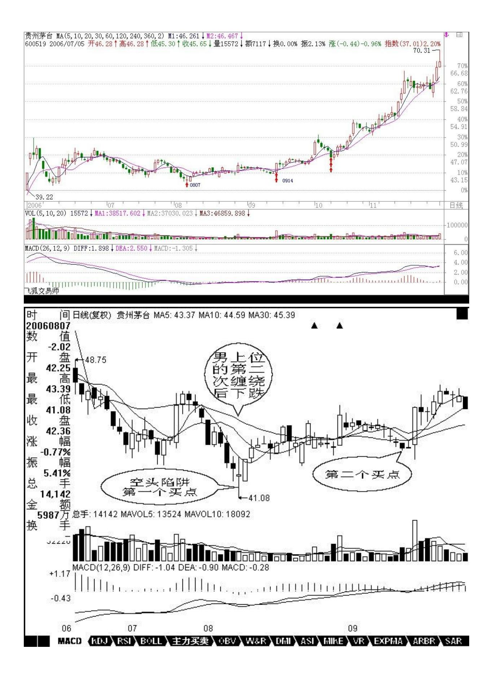
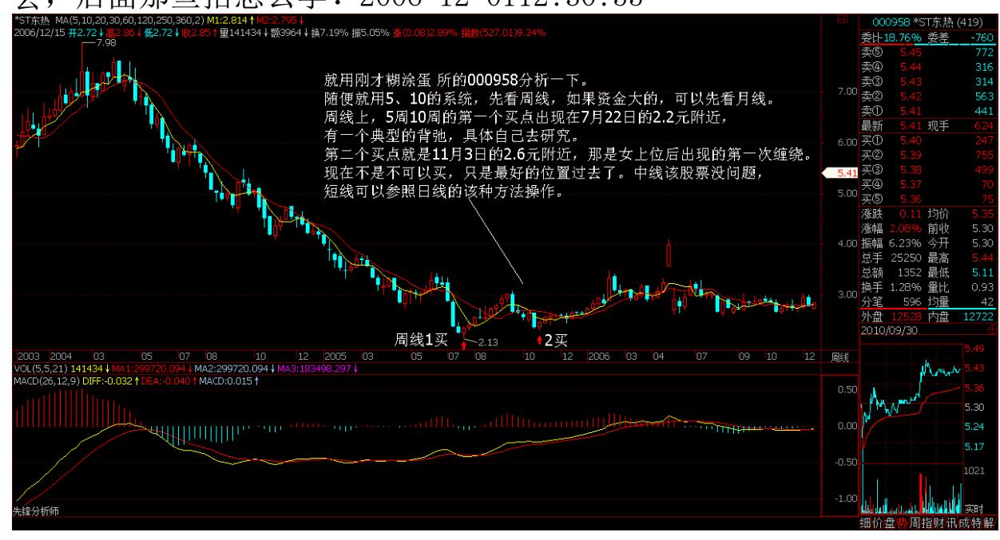

# 教你炒股票 12:一吻何能消魂?

(2006-12-01 12:03:48)就算是看 AV,最终也是为了实战。上章说了 那么多关于"吻"的知识,目的是为了干而不看,光看不干,那不成 了阴九幽?AV 看多了而不实践,绝对有损健康。但干,马上要遇到的 就是风险问题。任何一个位置介入,都存在风险,而且除非行情走出 来了,否则即使最简单的均线系统,也没人能事先百分百地确认究竟 采取怎样的方式去"吻" 。熟悉本 ID 所解《论语》的都知道,风险 是"不患"的,是无位次的,任何妄求在投资中的绝对无风险,都是 痴心妄想。唯一的办法,就是设置一个系统,使得无位次、"不患" 的风险在该系统中成为有位次,"患"的系统,这是长期战胜市场的 唯一方法。

必须根本自己的实际情况,例如资金、操作水平等等,设置一套分类 评价系统,然后根据该系统,对所有可能的情况都设置一套相应的应 对程序,这样,一切的风险都以一种可操作的方式被操作了。而操作 者唯一要干的事情,就是一旦出现相应的情况,采取相应的操作。对 于股票来说,实际的操作无非三种:买、卖、持有。当然,在实际 中,还有一个量的问题,这和资金管理有关,暂且不考虑。那么,任 何投资操作,都演化成这样一个简单的数学问题:N 种完全分类的风 险情况,对应三种(买、卖、持有)操作的选择。

例如,对于一个简单的,由 5 日均线与 10 日均线构成的买卖系统, 首先,两者的体位构成一个完全分类,女上位是牛,男上位是熊,还 有一种是互相缠绕的情况,这种情况最终都要演化成女上位或男上 位,只有两种性质:中继或转折。相应,一个最简单的操作系统就此 产生,就是在体位互相缠绕完成后(娇:低点)介入,对于多头来说, 这样一个系统无非面临两个结果,变为女上位成功,变为男上位失 败。由于缠绕若是中继就延续原体位,若转折就改变体位,因此对多 头来说,值得介入的只有两种情况:男上位转折,女上位中继,空头 反之。

对于任种走势,首要判断的是体位:男上位还是女上位。这问题只要 有眼睛的都能判断出来,对于 5 日、10 日的均线系统来说,5 日在 上就是女上位,反之就是男上位,这在任何情况下都是明确的。如果

是女上位的情况,一旦出现缠绕,唯一需要应付的就是这缠绕究竟是 中继还是转折。可以肯定地说,没有任何方法可以百分百确定该问 题,但还是有很多方法使得判断的准确率足够高。例如,女上位趋势 出现的第一次缠绕是中继的可能性极大,如果是第三、四次出现,这 个缠绕是转折的可能性就会加大;还有,出现第一次缠绕前,5 日线 的走势必须是十分有力的,不能是疲软的玩意,这样缠绕极大可能是 中继,其后至少会有一次上升的过程出现;第三,缠绕出现前的成交 量不能放得过大,一旦过大,骗线出现的几率就会大大增加,如果量 突然放太大而又萎缩过快,一般即使没有骗线,缠绕的时间也会增 加,而且成交量也会现在两次收缩的情况。

97 女上位选择第一次出现缠绕的中继情况,而男上位的就相反,要寻 找最后一次缠绕的转折情况,其后如果出现急跌却背弛,那是最佳的 买入时机。抄底不是不可以,但只能选择这种情况。然而,没有人百 分百确认那是最后一次缠绕,一般,男上位后的第一次缠绕肯定不 是,从第二次开始都有可能,如何判断,最有力的就是利用好背弛制 造的空头陷阱。关于如何利用背弛,是一个专门的话题,以后会详细 论述。

综合上述,利用均线构成的买卖系统,首先要利用男上位最后一次缠 绕后背弛构成的空头陷阱抄底进入,这是第一个值得买入的位置,而 第二个值得买入或加码的位置,就是女上位后第一次缠绕形成的低 位。站在该系统下,这两个买点的风险是最小的,准确地说,收益和 风险之比是最大的,也是唯一值得买入的两个点。但必须指出的,并 不是说这两个买点一定没有风险,其风险在于:对于第一个买点,把 中继判断为转折,把背弛判断错了;对于第二个买点,把转折判断成 中继。这些都构成其风险,但这里的风险很大程度和操作的熟练度有 关,对于高手来说,判断的准确率要高多了,而如何成为高手,关键 一点还是要多干、看参与,形成一种直觉。但无论高手还是低手,买 点的原则是不变的,唯一能高低的地方只是这个中继和转折以及背弛 的判断。

明白了这一点,任何不在这两个买点买入的行为都是不可以原谅的, 因为这是原则的错误,而不是高低的区别,如果你选择了这个买卖系 统,就一定要按照这个原则了。买的方式明白了,卖就反过来就可以 了,这是十分简单的。一吻而消魂,学会这消魂之吻,就能在动荡的 市场中找到一个坚实的基础。当然,相应的均线的参数可以根本资金

量等情况给予调节,资金量越大,参数也相应越大,这要自己去好好 摸索了。

这点,对于短线依然有效,只是把日线改为分钟线就可以了。而一旦 买入,就一直持有等待第一个卖点,也就是女上位缠绕后出现背弛以 及第二个卖点也就是变成男上位的第一个缠绕高点把东西卖了,这样 就完成一个完整的操作。

注意,买的时候一般最好在第二个买点,而卖尽量在第一个卖点,这 是买和卖不同的地方。

补充一个例子,让不习惯抽象的人能理解:对于喜欢用日线的,用茅 台为例子给一个分析,5 日和 10 日。8 月 7 日,男上位的第二次缠 绕后下跌,但成交量等都明显出现背弛,构成小的空头陷阱,成为第 一个买点在 41 元附近。9 月 14 日,女上位的第一次缠绕下跌形成 第二个买点在 44 元附近。然后基本就沿着 10 日线一直上涨,即使 是短线,10日线不有效跌破就继续持有等待第一个卖点,也就是缠绕 后出现背弛的出现。第二个卖点就是变成男上位的第一个缠绕的高 点,目前这一切都没出现,所以就持有等待出现。

98 再补充一句:希望来这里的人,以后慢慢少点诸如要涨多少要跌多 少之类的问题,因为这类问题都是错误的思维下产生的。本 ID 不是 股评,不是算命先生,才没兴趣猜测上升、下跌的空间,本 ID 只是 一个观察者,只在买点出现时介入,然后持有等待卖点的出现,其他 本 ID 一律没兴趣。来这里,如果最终不能脱胎换骨,在投资上换一 副眼睛,那你就白来了。

#### \*\*\*\*\*\*\*\*\*\*\*\*\*\*\*\*\*\*\*\*。

缠师:大盘今天出现震荡是正常的,关键是 5 日线。只要 5 日线站 稳,板块会继续轮动表现的。这个对下午判断继续有效。2006-12-01 12:09:33本 ID 对大盘的建议继续有效,引用如下:从大盘健康的角 度说,本 ID 给大盘的建议是:先深成指突破6103 点的历史高位,然 后上海跟上,突破以后再调整,这样更健康。不知道大盘有没有兴趣 听本 ID 的意见了。2006-11-29 15:14:38现在大盘最大的风险是上海 人比较小气,因为深圳先突破历史新高几乎是不可改变的了。上海有 可能故意捣乱,让大家都突破不了。这种事情听起来像天方夜谈,但 历史上出现过不止一次了。但历史却一次次地证明,只要是大牛市, 深圳就是比上海牛,这也是判断行情的一个很重要的经验。当深圳比 上海弱时,是大行情的机会很小的。现在看到深圳比上海强,即使是 上海人,也应该为此高兴。2006-12-01 12:16:49各位注意:本 ID 告 诉你的是最佳买点如何判断,并不是说除了这两个点就不能买,但那 要承受更大的风险,而要长期成功,就要尽量学会把风险控制到最 低。还有,这只是一招,绝不能光靠这一招,但如果连一招都学不 会,后面那些招怎么学?2006-12-0112:30:55

大盘今天如期出现震荡,目前大盘最大的危险就是前面所说的沪深之 间的竞争,特别上海历史上有故意拆台的前科,这一点必须有所警 惕。技术上,今天深圳成指留下的缺口十分重要,如果很快回补,则

技术上发出不好的信号。下周一依然有震荡的需要,但各股行情依然 继续。由于 11 月是巨阳,12月上冲后出现大幅震荡不可避免,这必 须要清醒。2006-12-0115:02:23现在不是不可以买,只是最好的位置 过去了。中线给股票没问题,短线可以参照日线的该种方法操作。

(2006-12-01 12:26:27) 102 103 1. [匿名] 糊涂蛋:请教 000958 能介入吗?2006-12-01 12:09:07缠师:学好上面一招,就要自己先分 析一下,你看看用 5 日、10 日,这股的最佳和第二买点在哪里?随 便就用 5、10 的系统,先看周线,如果资金大的,可以先看月线。周 线上,5 周 10 周的第一个买点出现在 7 月 22 日的 2.2 元附近, 有一个典型的背弛,具体自己去研究。

第二个买点就是 11 月 3 日的 2.6 元附近,那是女上位后出现的第 一次缠绕。现在不是不可以买,只是最好的位置过去了。中线给股票 没问题,短线可以参照日线的该种方法操作。2006-12-01 12:33:53

#### \*\*\*\*\*\*\*\*\*\*\*\*\*\*\*\*\*\*\*\*。

2. 网友[匿名] 糊涂蛋:非常感谢数女在百忙之中天天按时教我们 吻、缠绕、介入、体位、G 点等,现有三个疑问请数女解答:(1)如 果招数所有人都学会了,市场会变成怎样呢?(也许糊涂蛋从来都不 缺乏)。(2)你天天按时授课,是抱着怎样的目的?(3)我们该怎 样感谢你呢?2006-12-01 12:44:59缠师:首先,不会所有人都学会。 其次,市场最后比的不是技术,而是心态。这永远不可能统一。高手 永远是高手。低手,如果不经过磨练,学多少技术也白搭。

你的第二个问题很无聊。干事情为什么都要目的,事情本身不可以就 是目的?至于感谢,说一句狠话。世界上有谁有能力感谢本 ID 的? 本 ID 什么都不缺,谁又有资格感谢本 ID?(2006-12-01 12:50:57)

#### \*\*\*\*\*\*\*\*\*\*\*\*\*\*\*\*\*\*\*\*。

3. 网友[匿名] 7NT 开叫:非常认同楼主的安全原则和均线操作法。 楼主所讲绝对是真经。非常实用。谢谢! 2006-12-01 12:47:35缠师: 那只是一个指南。路必须自己走。多看点 AV,也就是各种股票的走势 图。好好分析。要心里完全明了,化为自己的直觉,这才有点用处。 (2006-12-0112:52:19)

4. 网友[匿名] 无言:楼主你好!今天买入了600809,请问后市空间 有多大?谢谢!2006-12-0112:47:35缠师:希望来这里的人,以后慢 慢少点问这类的问题,因为这类问题都是错误的思维下产生的。本 ID 不是股评,不是算命先生,才没兴趣猜测上升、下跌的空间,本 ID 只是一个观察者,只在买点出现时介入,然后持有等待卖点的出现, 其他本 ID 一律没兴趣。来这里,如果最终不能脱胎换骨,在投资上 换一副眼睛,那你就白来了。(2006-12-01 12:55:32)

#### \*\*\*\*\*\*\*\*\*\*\*\*\*\*\*\*\*\*\*\*。

缠师:大盘今天如期出现震荡,目前大盘最大的危险就是前面所说的 沪深之间的竞争,特别上海历史上有故意拆台的前科,这一点必须有 所警惕。技术上,今天深圳成指留下的缺口十分重要,如果很快回 补,则技术上发出不好的信号。下周一依然有震荡的需要,但各股行 情依然继续。由于 11 月是巨阳,12 月上冲后出现大幅震荡不可避 免,这必须要清醒。(2006-12-01 15:02:23)

#### \*\*\*\*\*\*\*\*\*\*\*\*\*\*\*\*\*\*\*\*。

5. 网友[匿名] liang:请问楼主,股票的基本面和技术面,哪个是上 帝?缠师:把基本面当上帝和把技术当上帝一样可笑。
