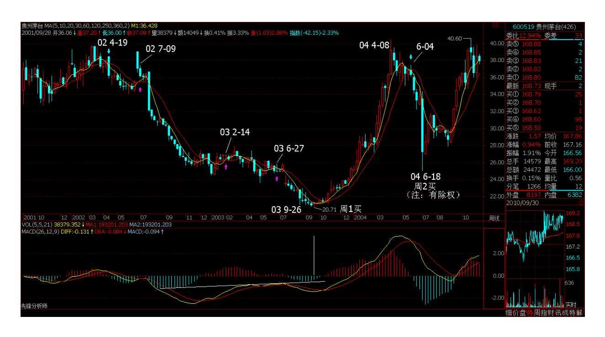
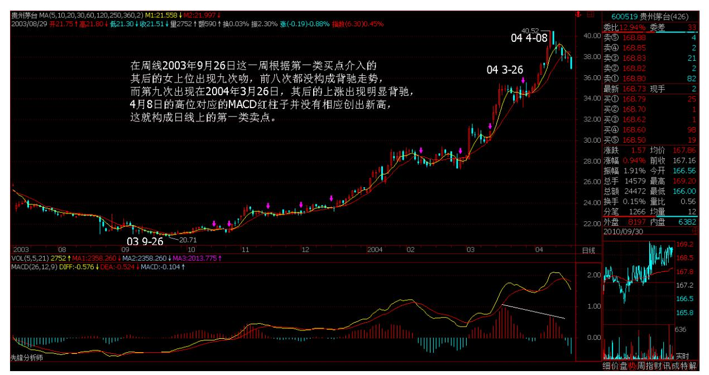
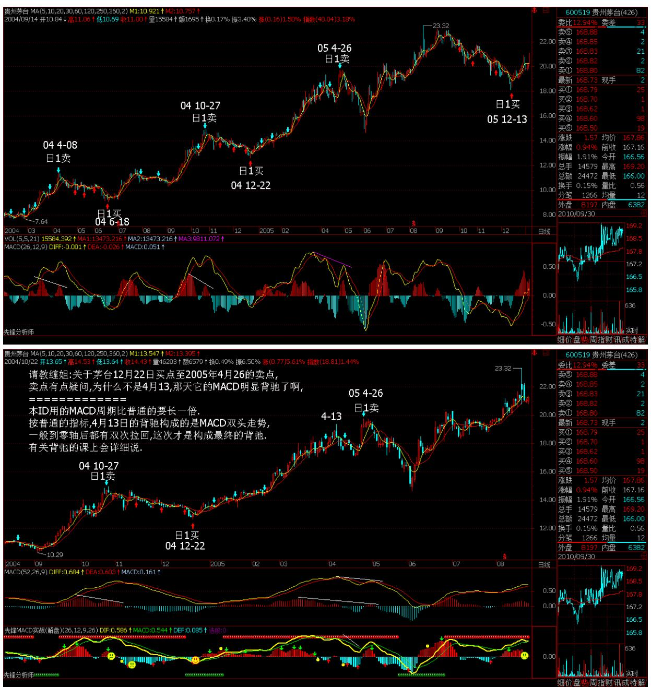
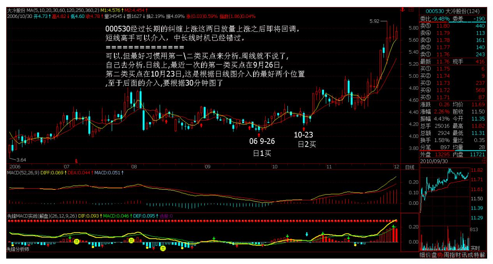
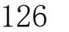
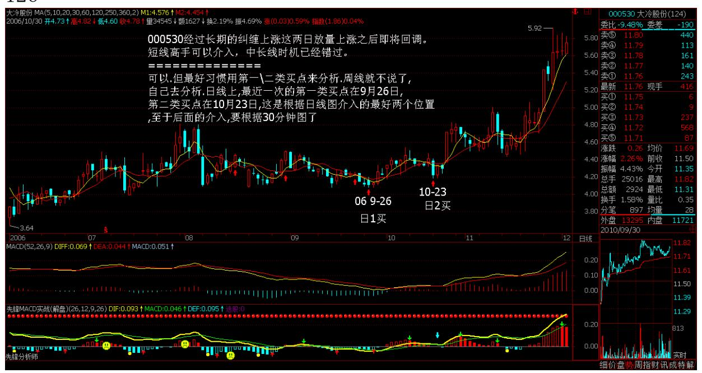

# 教你炒股票 14:喝茅台的高潮程序

(2006-12-05 11:35:20)前面说了很多理论上的东西,现在用一个实际 的股票来说明一下具体的用法。就用茅台吧,边喝茅台边上课。这里 先假设所有看的人都能找到茅台上市以来的周线和日线图。前面说过 两条均线间"吻"的三种方式,其中的湿吻是最明显的缠绕例子,而 飞吻和唇吻是缠绕的特殊例子,在均线操作系统中所指的缠绕,包括 这三种吻。而从实际的比例看,湿吻出现的几率是最大的,但在长期

均线系统中,例如周线、月线等,唇吻的例子比例也很大。先复习一 下相关定义:飞吻:短期均线略略走平后继续按原来趋势进行下去。 唇吻:短期均线靠近长期均线但不跌破或升破,然后按原来趋势继续 下去。 湿吻:短期均线跌破或升破长期均线甚至出现反复缠绕,如胶 似漆。

女上位:短期均线在长期均线之上。 男上位:短期均线在长期均线之 下。

第一类买点:用比较形象的语言描述就是由男上位最后一吻后出现的 背驰式下跌构成。 第二类买点:女上位第一吻后出现的下跌构成。

现在,先打开茅台的周线图,在茅台快 6 年的周线图上,用 5 周与 10 周均线构成的买卖系统,只有第一类和第二类买点各一个,可见, 在周线图上,按均线系统构成的买点并不常见,一旦出现必须珍惜。 仔细分析:2002 年 4 月 19 日那周,茅台进入男上位,其后在 2002 年 7 月 9 日(注:7 月 5 日)那周进入男上位的第一吻,前面已经 说过,这第一吻后的下跌一般不会构成买点,必须是至少第二吻以 后。其第二吻出现在 2003 年 2 月 14 日那周,是典型的湿温,其后 在下跌并没构成背驰,不符合第一类买入点的原则。然后在 2003 年 6 月 27 日那周构成第三吻,是一个不太强烈的湿吻,其后的下跌就 出现了明显的背驰走势,在 MACD 图上,绿柱子比上一次的明显缩 短,而低位却低于上次绿柱子出现时的低位。如何判断背驰走势结 束,最简单的就是当绿柱子缩短,而股价继续创新低,这次,明显地 发生在 2003 年 9月 26 日这一周,意味着底部出现,第一类买点构 造完成,可以大举介入了。

第一类买点出现后,茅台也正常地改变体位,进入女上位,一直到 2004 年 6 月 4 日那周出现女上位后的第一吻,其后的下跌构成周线 上的第二类买点。这里有一个很重要的技巧,就是第二类买点如何精 确地把握,由于在周线女上位后第一吻的调整不构成明显的下跌走 势,因此对于第一类买点的背弛走法就无法出现,这时候就要降低 K 线级别,从日线图上寻找最佳买点,这里给出一个缠中说禅买点定 律:大级别的第二类买点由次一级别相应走势的第一类买点构成(该 定律是有专利的,发明权一定要明确,这一点必须明确,否则以后本 ID 不会再说任何定律了,该定律一定没有任何人发现过,其他本 ID 已发现的定律也一样,哪天本 ID 心情好再说几个,但前提是不能让 本 ID 发现有盗版的,各位也应该和本 ID 一起监督)。例如,周线 上的第二类买点由日线上相应走势的第一类买点构成。有了这个缠中 说禅买点定律,所有的买点都可以归结到第一类买点。

对于茅台,2004 年 6 月 4 日那周出现女上位后第一吻,对应在日线 图上是明显的男上位走势,该走势其中出现三次吻,分别在 2004 年 4 月 29 日、5 月18日、6 月 1 日,都是典型的湿吻,但前两次其后 的下跌都没有出现背驰,只有第三次,出现明显的背驰性走势,6 月 18 日创下低点后,MACD 的绿柱子明显比前面的要缩短,这就构成了 日线上的第一类买点,而这个买点,在周线上就是第二类买点。注 意,后面由于除权,价位上似乎比这个要低了,其实并没有。

站在周线角度,茅台的买点就这两个了,而其后的卖点至今没出现, 如果当时根据这两个买点介入的,目前应该继续持有,直到卖点出 现。但是,这是一种针对特别大资金的玩法法,例如 50 亿以上,对 于资金量一般的,例如 10 亿以下的,有一种增加资金流动性的玩 法,就是充分利用日线的卖点回避大的调整,虽然这种调整站在周线 的角度不一定要参与。

缠中说禅短差程序就是:大级别买点介入的,在次级别第一类卖点出 现时,可以先减仓,其后在次级别第一类买点出现时回补。对于周线 买点介入的,就应该利用日线的第一类卖点减仓,其后在第一类买点 回补。对于茅台,分析如下:在周线 2003 年 9 月 26 日这一周根据 第一类买点介入的,其后的女上位出现九次吻,前八次都没构成背驰 走势,而第九次出现在 2004 年 3 月 26 日,其后的上涨出现明显背 驰,4 月 8 日的高位对应的 MACD红柱子并没有相应创出新高,这就 构成日线上的第一类卖点。

118 其后的第一类买点出现在 6 月 18 日,然后的第一类卖点出现在 10 月 27 日,然后第一类买点出现在 12月 22 日,下一个第一类卖 点出现在 2005 年 4 月26日,接着的第一类买点出现在 2005 年 12 月 13日,下面的第一类卖点至今没出现,也就是说,即使是站在日线 的角度,2005 年 12 月 13 日介入的茅台,根本就没有出现卖点,唯 一正确的就是坚决持有。当然,如果资金量小,不是按周线的,第一 类、第二类买点都是最多按日线的,就可以相应在30 分钟等更小的级 别内找到第一类卖点而弄出短差来,那就太细了,各位自己研究去。 (娇注:下图禅师看的是不复权图,娇配图是复权图。不想改了,注

意区别)要把握好这个均线构成的买卖系统,必须深刻理解缠中说缠 买点定律:大级别的第二类买点由次一级别相应走势的第一类买点构 成。如果资金量不特别巨大,就要熟练缠中说禅短差程序:大级别买 点介入的,在次级别第一类卖点出现时,可以先减仓,其后在次级别 第一类买点出现时回补。这样才能提高资金的利用率。注意,该定律 和程序都要注意版权,任何人都可以用,也不收任何版权费,但这个 版权必须要明确,否则本 ID 心情不好,就没兴趣再说任何定律、程 序了。严惩所有企图盗版去招摇撞骗的人。各位要多看图,根据相应 的资金量以及性格去定自己的操作级别,然后具体是熟练,否则就是 纸上谈兵,毫无意义了。

\*\*\*\*\*\*\*\*\*\*\*\*\*\*\*\*\*\*\*\*。

解盘及互动问答:

#### \*\*\*\*\*\*\*\*\*\*\*\*\*\*\*\*\*\*\*\*。

缠师:本 ID 对大盘的建议继续有效,引用如下。该结论继续有效。 2006-11-29 15:14:38从大盘健康的角度说,本 ID 给大盘的建议是: 先深成指突破 6103 点的历史高位,然后上海跟上,突破以后再调 整,这样更健康。不知道大盘有没有兴趣听本 ID 的意见了。

有事要先走,下午来不了了,晚上再上来,以下提示继续有效。2006- 12-05 13:46:42技术上,今天深圳成指留下的缺口十分重要,如果很 快回补,则技术上发出不好的信号。

下周一依然有震荡的需要,但各股行情依然继续。由于 11 月是巨 阳,12 月上冲后出现大幅震荡不可避免,这必须要清醒。2006-12-01 15:02:23各位,好好去研究一下,真明白了,终生受益。一定要看图 研究清楚。不明白的本 ID 都尽量解释明白的。大盘如期进入震荡,5 日线是短线关键,但个股问题不大,特别没动的二\三线股。2006-12- 0522:23:28这震荡很正常,下午关键看深圳补完缺口后的表现,如果 就此止住,就很快恢复上攻,否则还要折腾几天。赢利的股票关键看 你是短线还是中线了,如果是短线,前两天开始就应该有所动作,中 线正好利用这震荡弄短差。 事情要有预见性,这震荡上周五收盘时已 经说过了,昨天中午又强调了一次,如果没动,那就上上下下享受一 下。5 日线是否有效突破要看下午走势,不要太快下结论。心态要好 点。

现在,如果没及早准备,反而要稳住自己,如果大满仓,那下午或明 天的反抽时可以适当减低仓位。由于大盘中线问题不大,如果短线技 术不好的,也不一定玩短线。2006-12-06 12:34:01今天大盘没什么新 意,都是预料中的事情,中午说了,没走的就上上下下享受一下,短 线行的就忙忙弄点短差,5 日线是调整的关键。 2006-12-0615:01:20 以后本 ID 这里不准备对具体个股与大盘走势发表任何具体意见,免 得各位狐疑。所有走势与本 ID 无关, 别瞎闹了。

对大盘,最后把前面说的强调一次:长线:目前是牛市的第一轮,主 要涨的是大盘成分股。大调整后的第二轮,涨的是成长股,最后是重 组股。这个节奏的完成大概需要几年时间。

中短线:大盘 11 月是长阳,本月出现大幅度的震荡是理所当然的 (这在 12 月 1 日就说了,现在继续有效。)好了,以后这些具体的 问题都不准备继续说了。2006-12-07 15:06:20对不起,你看上面,已 经在说本 ID 是大盘的庄家还有个股的庄家,这种事情在本 ID 这里 怎么可能会有答案呢?说了也白说,本 ID 不希望在这些无聊问题上 纠缠,所以所有具体走势的问题暂时谢绝回答。

2006-12-07 15:18:17这个帖子就这样了,有问题请到新帖子里,但请 不要问具体的个股问题,论语\技术\音乐\数学\科学\哲学\艺术\哲学 \宗教等等都可以,就是不要问具体个股的可能走势。2006-12-07 15:22:49希望各位来这里是共同研究,不是来依靠本 ID 这拐杖。本 ID 不希望演化成这样一种局面:本 ID 说一句话就对大盘走势影响巨 大,本 ID 反对任何上帝式的人,包括本 ID 自己。2006-12-07 15:12:20

#### \*\*\*\*\*\*\*\*\*\*\*\*\*\*\*\*\*\*\*\*。

1. 网友 [匿名] 外科医生:小妹,这次接下来的调整怎么判断呢?我 太笨了,呵呵。努力学习中。2006-12-05 11:58:23缠师:比上次厉 害。但中线问题不大,没涨的还会借机启动。二线股后是三线股。把 握好该节奏。(2006-12-05 12:06:44)

#### \*\*\*\*\*\*\*\*\*\*\*\*\*\*\*\*\*\*\*\*。

2. 网友[匿名] 听禅: 000685 的日线 5、10 日均线吻上了,是不是 可以搞一下呢?2006-12-05 11:56:43缠师:好好研究本帖子。真明白

了,至少比市场上95%的人要厉害了。(2006-12-05 12:08:56)

#### \*\*\*\*\*\*\*\*\*\*\*\*\*\*\*\*\*\*\*\*。

3. 网友寻找幸福:深奥,看不懂。2006-12-0512:08:37缠师:自己找 茅台股票(600519)的图,对着图看,很简单。(2006-12-05 12:09:36)

#### \*\*\*\*\*\*\*\*\*\*\*\*\*\*\*\*\*\*\*\*。

4. 网友小明:楼主,600183 也算二线蓝筹,为何到现在还没怎么 动?马上都要轮到三线了,它不是要歇菜?2006-12-05 12:10:46缠 师:典型的庄股。等庄家有心情了自然就涨了。

(2006-12-05 12:13:42)

#### \*\*\*\*\*\*\*\*\*\*\*\*\*\*\*\*\*\*\*\*。

123 5. 网友[匿名] 外科医生:我的 600639 今天又涨停了,看了一 下日线,好像背驰了,红烛缩小了对吗?2006-12-05 12:10:50缠师: 没有。但中线已经进入成交密集区域。再上行后短线出现震荡洗盘很 正常。(2006-12-05 12:19:26)

#### \*\*\*\*\*\*\*\*\*\*\*\*\*\*\*\*\*\*\*\*。

6. 网友小明:"好好研究本帖子,真明白了,至少比市场上 95%的人 要厉害了。" 缠 mm,此话当真?如果真如此,那鄙人要好好领会。 不过,这个我总觉得对于小盘股来说,不是很灵,对于大盘股蓝筹来 说,还是很灵的。现在我准备老老实实做人,就买大盘蓝筹股,不想 去追什么牛股,暴涨股。请指教此思路对否?2006-12-05 12:17:51缠 师:先仔细研究。不研究怎么会正在明白和应用呢?不要把自己的思 想限制在一个范围。只是牛市第一期是成分股的天下。牛市第二期就 要变了。要"不患"而患,学《论语》。(2006-12-05 12:23:04)

#### \*\*\*\*\*\*\*\*\*\*\*\*\*\*\*\*\*\*\*\*。

7. 网友[匿名] 妄语:请教:"而对于上一章所说的第二个买点,一 旦该缠绕中出现跌破前面男上位的最低位,就意味着买入程序出现问 题,必须在任何一个反弹中把股票出清。但在这种情况下,不排除后

面出现上涨。"600519 在 8 月 7 号的破位属于这种情况吗?2006- 12-05 12:18:29缠师:那是买点。不要搞错了。即使站在日线角度 看,前期的低位在 5 月 26 日的 37 元多。怎么会跌破了呢?不要把 两种情况搞糊涂了。 (2006-12-0512:25:25)

#### \*\*\*\*\*\*\*\*\*\*\*\*\*\*\*\*\*\*\*\*。

8. 网友[匿名] 外科医生: MACD 是否有滞后?盘中就可以看到吗? 2006-12-05 12:32:19缠师:当然。(2006-12-05 12:39:31)

#### \*\*\*\*\*\*\*\*\*\*\*\*\*\*\*\*\*\*\*\*。

缠师:安排一个作业:用分析茅台的方法分析一下:000063。(2006- 12-05 12:41:11)

#### \*\*\*\*\*\*\*\*\*\*\*\*\*\*\*\*\*\*\*\*。

9. 网友[匿名] 你的粉丝:请教 000530,这几个交易日,每天就涨一 两分钱,怎么理解?2006-12-0512:36:59缠师:不要关心一些不太重 要的信息。要找到自己的坚固港湾。用上面的方法从周线图分析该股 票,就知道这股票中线正干什么了。 (2006-12-05 12:48:32)\*\*\*\*\*\*\*\*\*\*\*\*\*\*\*\*\*\*\*\*10. 网友[匿名] 想飞的猪:无意中 闯入缠禅的地盘,像是进入了一座思想的圣殿,学习中。感谢缠禅无 私的分享、悉心的指点。有个问题想请教,调整是迟早的事,面对即 将的大盘调整,如何处理手中已有涨幅、但中期仍看好的二线蓝筹股 呢?比如 600787,它的卖点体位还不明显,是先行撤出,还是静待中 线心理价位再卖?很多能搞的股票,从图形上,结合你的理论,似乎 卖点都不清晰。在大盘如此疯狂的拉抬下,在 600028等几只指标股貌 似做头的图形下,如何处理已有获利的中线股?谢谢缠禅先!2006- 12-05 12:41:48缠师:方法都告诉你了。要举一反三。缠中说禅短差 程序:大级别买点介入的,在次级别第一类卖点出现时,可以先减 仓,其后在次级别第一类买点出现时回补。(2006-12-05 12:52:01)

#### \*\*\*\*\*\*\*\*\*\*\*\*\*\*\*\*\*\*\*\*。

11. 网友[匿名] CCTV: LZ,至少我是支持你的。别人怎么,我管不 着。 2006-12-05 12:52:59125 缠师:谢谢!不过本 ID 允许任何意 见存在,只要新浪不删就可以。(2006-12-05 12:53:55)

#### \*\*\*\*\*\*\*\*\*\*\*\*\*\*\*\*\*\*\*\*。

缠师:技术上,今天深圳成指留下的缺口十分重要,如果很快回补, 则技术上发出不好的信号。下周一依然有震荡的需要,但各股行情依 然继续。由于11 月是巨阳,12 月上冲后出现大幅震荡不可避免,这 必须要清醒。(2006-12-05 13:46:42)

#### \*\*\*\*\*\*\*\*\*\*\*\*\*\*\*\*\*\*\*\*。

- 12. 网友[匿名] 你的粉丝: 000530 周线飞吻后上行,刚突破 250
- 线,继续持股。我分析得对吗?老师。2006-12-05 12:56:56缠师:
- 对。有就继续持有。而周线的第一\二类买点早过了。该股走势很标
- 准,可以作为案例来分析学习。

(2006-12-05 21:56:43)

#### \*\*\*\*\*\*\*\*\*\*\*\*\*\*\*\*\*\*\*\*。

13. 网友[匿名] 妄语:略有些懂了,还在琢磨中。缠女能不能找个此 方法失败或必须止损的票来和 600519对应比较,以便能更深刻理解。 先谢了。2006-12-0513:15:51缠师:在周线上,失败的例子还真不好 找。有找到的请举出来。(2006-12-05 21:58:17)

#### \*\*\*\*\*\*\*\*\*\*\*\*\*\*\*\*\*\*\*\*。

14. 网友[匿名] 在路上:请教缠姐:关于茅台 12 月22 日买点至 2005 年 4 月 26 的卖点,买点好理解,卖点有点疑问。为什么不是 4 月 13,那天它的MACD 明显背驰了啊?我理解是其后才出现第一次 湿吻(对这一次的买卖)。但其后 4 月 26 的 MACD 又明显放大了, 按当时来看应该不算背驰啊。请指教! 2006-12-05 13:52:21

缠师:本 ID 用的 MACD 周期比普通的要长一倍。按普通的指标,4 月 13 日的背驰构成的是 MACD 双头走势。一般到零轴后都有双次拉 回。这次才是构成最终的背弛。有关背弛的问题,课上会详细说。 (2006-12-05 22:12:54)127 15. 网友[匿名] 笨笨猪:我的分析: 000530 经过长期的纠缠上涨,相信庄家已经收足筹码,这两日放量上 涨之后即将回调。短线高手可以介入,中长线时机已经错过。2006- 12-05 14:55:34缠师:分析得还可以。但最好习惯用第一\二类买点来 分析。周线就不说了,自己去分析。日线上,最近一次的第一类买点

在 9 月 26 日。第二类买点在10 月23 日。这是根据日线图介入的最 好两个位置。至于后面的介入,要根据 30 分钟图了。 (2006-12- 0522:18:03) 128

#### \*\*\*\*\*\*\*\*\*\*\*\*\*\*\*\*\*\*\*\*。

16. 网友[匿名] 小明:早上入了 000623, 追高了。后市情况如何? 还能不能搞?2006-12-05 21:16:43缠师:一定要找到自己坚固的港 湾。如果喜欢弄短线,可以用 5 分钟图甚至 1 分钟找第一\二类买 点。

根本没必要去追高。(2006-12-05 22:19:50)

#### \*\*\*\*\*\*\*\*\*\*\*\*\*\*\*\*\*\*\*\*。

缠师:各位。好好去研究一下。真明白了,终生受益。一定要看图研 究清楚。不明白的本 ID 都尽量解释明白的。

大盘如期进入震荡。5 日线是短线关键,但个股问题不大,特别没动 的二\三线股。(2006-12-0522:23:28) 昨天中午已经将上周的提示重 复了。所以对今天的震荡应该有准备了。2006-12-05 13:46:42有事要 先走,下午来不了了,晚上再上来,以下提示继续有效。2006-12-01 15:02:23技术上,今天深圳成指留下的缺口十分重要,如果很快回 补,则技术上发出不好的信号。下周一依然有震荡的需要,但各股行 情依然继续。由于 11 月是巨阳,12 月上冲后出现大幅震荡不可避 免,这必须要清醒。(2006-12-06 11:55:52)

#### \*\*\*\*\*\*\*\*\*\*\*\*\*\*\*\*\*\*\*\*。

17. 网友 [匿名] ataoo0:楼主,中午点评一下昨天000063 的作业 吧?2006-12-06 11:10:13缠师:下午或晚上吧。别这么快就有答案, 就不好好想了。(2006-12-06 12:04:29)

#### \*\*\*\*\*\*\*\*\*\*\*\*\*\*\*\*\*\*\*\*。

130 18. 网友小明:今天只谈孔老二,不谈股票。大盘一切尽在掌握 之中,不过就是赚不到钱。2006-12-06 12:05:00缠师:关键要定好操 作的级别。选好股票的第一\二类买点。(2006-12-06 12:07:02)

#### \*\*\*\*\*\*\*\*\*\*\*\*\*\*\*\*\*\*\*\*。

19. 网友[匿名] 外科医生:现手中盈利股票如何操作?多谢!大盘破 位了?2006-12-06 12:01:00缠师:这震荡很正常。下午关键看深圳补 完缺口后的表现。如果就此止住,就很快恢复上攻,否则还要折腾几 天。赢利的股票关键看你是短线还是中线了,如果是短线,前两天开 始就应该有所动作,中线正好利用这震荡弄短差。(2006-12-06 12:09:47)

#### \*\*\*\*\*\*\*\*\*\*\*\*\*\*\*\*\*\*\*\*。

20. 网友[匿名] 请问:缠姐,你的定理在认沽权证上有效吗?? 2006-12-06 12:18:16缠师:只要有 K 线图的市场交易品种,都有 效。但认沽权证风险太大,又有时间限制,所以最好用短线的K 线。 (2006-12-06 12:22:01)

#### \*\*\*\*\*\*\*\*\*\*\*\*\*\*\*\*\*\*\*\*。

21. 网友[匿名] nn:楼主这篇很有道理啊,支持。看来孔二爷也得感 谢你啊。是你大众真正了解孔二爷的人啊。孔二爷因你而更加伟大了 啊。顺便问个问题,为什么于丹讲论语就那么火呢?而楼主这里始终 火不起来,我很为此不平啊。昨天有位博友认为楼主的文章太深奥 了,我也有同感。楼主是否考虑过这个问题啊?楼主对于丹怎么评论 呢?简单几句就行啊。

2006-12-06 12:23:58缠师:对不起。本 ID 从来不看这些人的东西。 东抄西拼的东西也没必要和本 ID 的比。(2006-12-0612:31:22)

#### \*\*\*\*\*\*\*\*\*\*\*\*\*\*\*\*\*\*\*\*。

131 22. 网友[匿名] 外科医生:大盘跌破 5 日均线,主力无护盘, 放量杀跌,看起来很象顶啊。实在是晕啊,等小妹指点。2006-12-06 12:31:10缠师:事情要有预见性。这震荡,上周五收盘时已经说过 了。昨天中午又强调了一次,如果没动,那就上上下下享受一下。5 日线是否有效突破,要看下午的走势,不要太快下结论。心态要好 点。(2006-12-0612:34:01)

23. 网友[匿名] 想飞:LZ,烦请帮忙看看 600376 好吗?该股日线还 未有卖出信号,但周线似乎出现背离了,30 分钟线也已出现背离了, 好象要进入调整了。

我是否应该短线反弹中先出来?2006-12-06 12:32:15缠师:30 分钟 图上,1 日 10 点 30 分钟出现明显背驰,短线早该走了。别看太多 的图,如何是短线,就看好 30 分钟的 K 线图就行了。(2006-12- 0612:46:09)

#### \*\*\*\*\*\*\*\*\*\*\*\*\*\*\*\*\*\*\*\*。

24. 网友小明:缠 mm,我想做个短差,选了几个股,你看哪一个最 好?600770 和 000927 哪个更好?盼回复!2006-12-06 12:42:47缠 师:这类问题,本 ID 不能回答,一旦回答了,本ID 以后会忙死的。 提示,如果是很短的走势,看到 5分钟甚至 1 分钟图,看看有没有 1 类买点。 (2006-12-06 12:48:49)

#### \*\*\*\*\*\*\*\*\*\*\*\*\*\*\*\*\*\*\*\*。

25. 网友[匿名] 海子:数女好!若 5 日线跌破,后续大势将调整, 估计幅度较大,可能不止是上上下下的问题,需要规避风险吗?可以 谈谈看法吗?2006-12-06 12:46:49缠师:风险要提前规避。不是跌了 才谈论。前几天不是一直在谈论这个问题吗?132 请看前几天的提 醒:技术上,今天深圳成指留下的缺口十分重要,如果很快回补,则 技术上发出不好的信号。2006-12-01 15:02:23下周一依然有震荡的需 要,但各股行情依然继续。由于 11 月是巨阳,12 月上冲后出现大幅 震荡不可避免,这必须要清醒。

现在,如果没及早准备,反而要稳住自己,如果大满仓,那下午或明 天的反抽时可以适当减低仓位.由于大盘中线问题不大,如果短线技术 不好的,也不一定玩短线。(2006-12-06 12:51:38)

#### \*\*\*\*\*\*\*\*\*\*\*\*\*\*\*\*\*\*\*\*。

缠师:今天大盘没什么新意,都是预料中的事情,中午说了,没走的 就上上下下享受一下,短线行的就忙忙弄点短差,5 日线是调整的关 键。(2006-12-0615:01:20)对四川提出最强烈的抗议。

虽然本 ID 消息极端准确,今天本 ID 手里的某酒厂股票还在大盘大 跌时涨停了,本 ID 还是要抗议。本ID 之所以买他的股票,就是要抽 他的血,他们把厂家卖给外国人,本 ID 就是要抽他们的血。这事情 可能已经无法更改,准确的消息说这几天就要停牌,大概两周,然后 就宣布外国鬼子进村了。气愤!抗议还是用原来的文章。

四川,别给中国丢人!(娇注:600779)2006-10-18 16:16:23本 ID 曾以"收购中国"为题写过几篇文章,力陈中国将面临被收购的现实 风险。几年前,本 ID 著名网文"货币战争与人民币战略"中,对这 种局面已有所告戒。后来在人民币放开那天,本 ID 写到"中国终于 世界了,但世界还能中国吗?" ,不到两年,对目前的中国企业,要 面临的却已是"世界依然世界,中国还能中国?" 133 对中国企业的 非中国化,早已麻木。在另一帖子中也说过,反正鬼佬的钱也是钱, 以后就吸鬼佬血了,看谁比谁狠。但这几天,对有关四川某著名白酒 企业将被世界第一大酒业集团收购的事,还是有点不能接受。白酒, 中国的国粹,英国佬为了他们的"英国病"可以把威士忌搞得更 GAY,但凭什么让白酒威士忌?谁有这个权力?四川,别给中国丢人! 李白曾喝过的酒、杜甫曾喝过的酒,东坡曾喝过的酒。没有酒,哪有 中国的文化?没有酒,你让李白如何去"对影成三人"?让杜甫如何 去"白日放歌"?又让东坡如何去"问青天"?就算全中国的酒都给 卖了,四川的酒又如何能忍心卖?某酒,凭洋人的一个奖就成了国 酒,但它有李白、杜甫、东坡吗?它有什么资格当国酒?要卖就把它 卖了,但不要卖四川的酒,因为那是李白、杜甫、东坡!就让威士忌 更 GAY,让波尔多更 SEX,但四川的酒一定要中国,一定要李白、一 定要杜甫、一定要东坡!在没有李白、杜甫、东坡的年代,这大概是 一个中国人最基本、最底线的要求了。人,可以没道德,但一定要有 底线。四川,别给中国丢人!(2006-12-0615:05:13) 还有最新的消息 说中国一个最大的药厂之一被国外最大药厂之一收购,方案,该股票正 停牌,本ID 也按照抽血的原则大量持有该股票。但本 ID 只希望把这 事情搞黄!反正即使黄了,本 ID 也不会亏钱,成本低着了。最近听 说也要宣布了,气愤!(2006-12-06 15:08:03) 卖他干什么?当然要 持有,抽干他们的血。(2006-12-06 15:16:20)

\*\*\*\*\*\*\*\*\*\*\*\*\*\*\*\*\*\*\*\*。

26. 网友[匿名] 在路上:这次无意中上了缠姐这条船,那酒我也有 点,坚决支持你的抗议!2006-12-0615:27:00缠师:抗议是要抗议, 钱也要赚,这在论语里是怎么说的?请下面的人回答,看各位论语学 的怎么样。

(2006-12-06 15:31:22)

#### \*\*\*\*\*\*\*\*\*\*\*\*\*\*\*\*\*\*\*\*。

27. 网友[匿名] ataoo0:子曰:人能弘道,非道弘人。2006-12-06 15:38:52134 缠师:不对。这个问题本 ID 早给过答案,在教你炒股 票 10 里有这么一段:非也,这就是昨天本 ID所解释的《论语》里 "子曰:众,恶之,必察焉;众,好之,必察焉"的完美应用。确 实,从好恶角度,本 ID 严重反对人民币升值、反对国有股流通,而 且深刻地分析了这些玩意后面的现实逻辑关系和严重后果。但在股市 里,本 ID 从来没有好恶。只要有点金融常识的人都知道,本币的历 史性升值所带来历史性牛市曾被太多国家所经历。本 ID 只知道,一 旦人民币升值、国有股流通,股市将大涨。知识分子为什么可笑,就 是有好恶而无"察" ,企图以理论来理论现实,十足脑子水太多了。 论语与股票并不矛盾的。(2006-12-06 15:47:42)

#### \*\*\*\*\*\*\*\*\*\*\*\*\*\*\*\*\*\*\*\*。

28. 网友[匿名] 摄影之友:是的。好象这样的情况越来越多。还有美 资进入的。楼主应该聚集一批如你一样大资金的主人。进行反收购。 哼。子曰:放于利而行,多怨。2006-12-06 15:46:42缠师:答案在上 面。如果按照你这样的想法,就是没学好论语了,好好体会这一句, 无论是人和股票,都有无穷好处:"众,恶之,必察焉;众,好之, 必察焉。" 敌人现在很强大,正面阻击是没用的,只能不断骚扰壮大 自己,只要自己不被消灭,有一天就会大反攻,把美国欧洲全给收 了。现在,是壮大自己保存实力的时候。利用一切机会去抽他们的 血。(2006-12-0615:51:27)

#### \*\*\*\*\*\*\*\*\*\*\*\*\*\*\*\*\*\*\*\*。

29. 网友馋中听禅:子曰:碰上大坏蛋,不赚白不赚, 赚完还想赚。 回答完毕。 谢谢!2006-12-0615:48:39缠师:这个意思是对的。但要 有方法。大坏蛋没本事能当大坏蛋吗?要击败大坏蛋,就要比他们 "还坏\还要强大" ,就要把他们的血给抽干了。 (2006-12- 0615:54:13)

#### \*\*\*\*\*\*\*\*\*\*\*\*\*\*\*\*\*\*\*\*。

135 30. 网友[匿名] 心易:明白了,楼主是要把我们培养出来,将来 一起去抽干他们的血。2006-12-0616:06:23缠师:这样最好。但不要 说培养,而是共同学习。

(2006-12-06 16:10:02)

#### \*\*\*\*\*\*\*\*\*\*\*\*\*\*\*\*\*\*\*\*。

31. 网友[匿名] 无聊:请问 lz,你说的那瓶酒俺也想买点,抽他们 的血,可乎?2006-12-06 16:17:41缠师:这个抽血的繁重任务还是让 本 ID 来完成吧。

现在中线买点早过了,风险太大。本 ID 持有的成本不同,不建议任 何人追高买入。 (2006-12-0616:20:48)

#### \*\*\*\*\*\*\*\*\*\*\*\*\*\*\*\*\*\*\*\*。

32. 网友[匿名] 妄语:按缠妹的方法,我怎么看600519 的周线和日 线,现在都出现了第一卖点了?价格新高了,但 MACD 都开始背驰 了。2006-12-0616:00:58缠师:周线上不存在背驰。日线上将演化为 MACD 的双头形态。该形态在昨天的回帖里有所讲述,就是先下跌靠近 0 轴,然后再上涨形成真正的日线背驰。当然,如果按照短线,在 30 分钟图上可以找到精确的卖点在 1 日 13 点 30 分。然后今天下午 MACD 回抽0 轴时可以回补。不过这都太短了,但对资金少的人完全可 以按照这样去操作。(2006-12-06 16:31:08)

#### \*\*\*\*\*\*\*\*\*\*\*\*\*\*\*\*\*\*\*\*。

33. 网友馋中听禅:因我全仓招商轮船,不能给禅师捧个钱场, 那就 捧个人场吧。2006-12-06 16:25:44缠师:昨天说,"按新股放量突破 开盘那天高位就可以介入"那招数的是你?学了就要用。招商轮船的 走势完全就是这样的。(2006-12-06 16:33:19) 136

#### \*\*\*\*\*\*\*\*\*\*\*\*\*\*\*\*\*\*\*\*。

34. 网友[匿名] 小鸟:请讲解一下什么是背驰好吗?多谢! 2006- 12-06 16:01:49缠师:明天写一个帖子说这个问题。(2006-12-

#### \*\*\*\*\*\*\*\*\*\*\*\*\*\*\*\*\*\*\*\*。

35. 网友[匿名] 想飞:LZ,看来 600376 我要短线变中线了,希望尽 快解套,这可能就是学习过程中必须付出的代价吧。我觉得体位的判 断,在均线纠缠过程中是比较难的。除非趋势已确立,但那时可能就 失去了最好的买卖点了,苦恼呀。2006-12-06 13:26:14缠师:短线最 多就看 30 分钟图。你看 1 日 10、30分钟图,是不是一个典型的第 一类卖点?好好研究一下图。(2006-12-06 16:36:57)

#### \*\*\*\*\*\*\*\*\*\*\*\*\*\*\*\*\*\*\*\*。

36. 网友馋中听禅:报告禅师:我按教 7 (有一种方式是最简单的, 就是盯着所有放量突破上市首日最高价的新股),进入了 601872(招 商轮船), 6.7元的成本。我已爽歪歪了!2006-12-06 16:39:45缠 师:这就对了。但如果没学清楚的招数,最好就先学好,例如第一类 买卖点的问题。机会多了。关键要有好的技术。(2006-12-06 16:44:42)

#### \*\*\*\*\*\*\*\*\*\*\*\*\*\*\*\*\*\*\*\*。

37. 网友 [匿名] 缠禅:数 mm,000503 的 30 分钟线在 12 月 1 日 10:30 分好象构成背驰了,是吧?怎么其后又没怎么下跌,又创出新 高了呢?请 mm 分析一下。谢谢 2006-12-06 20:52:49缠师:你这种 思维是不对的。背驰只是告诉你相应的升势告一段落。但没有承诺一 定要调整多长时间与多大幅度。这个问题应该看低一级别的第一类买 点回补。你看看该股低一级别的 5 分钟图,在 5 日 10点 25 分,出 现明显的第一类买点。这就是一个回补的最好时机,后面的上涨,一 点都没耽误。

看看这个短线的成果:1 日 10:30 分的 9.7 元附近,30 分钟背驰 卖出,5 日 10 点 25 分的低一级别5 分钟图上,9.2 元第一类买点 回补,除了差价,还节约出两天的交易时间去干别的活,这个操作完 全符合本 ID 所指出的操作程序。一定量的短线能有这样的效果,大 概不会有任何其他的股票交易系统有如此高效了。(2006-12-06 21:32:58)

38. 网友[匿名] 想飞:LZ,请看 600050 的周线,2005/10/21 周与 2005/6/3 周构成背驰,其后的走势显示这是一个失败的第一买点,对 吗? 盼回答!!2006-12-06 14:18:02缠师:2005/10/21 周没创新 低,都是 2.43 元,不是标准的背驰,所以不构成标准的第一类买 点。反而是该股在 2006 年 8 月 7 日的 2.19 元构成一个日线上标 准的第一类买点。可以去分析一下。该股在 30分钟图上,11 月 14 日 13:30,2.68 元构成最近一个标准的短线(30 分钟图上的)第一 买点。

好好分析。如果按照本 ID 的原则,即使用 30 分钟图,该股也应该 在 11 月 14 日 13:30,2.68 元出现后买入,到今天为止,该股在 30 分钟图上也没出现第一类卖点,所以即使看 30 分钟图,也应该持 有。(2006-12-06 21:44:03)

#### \*\*\*\*\*\*\*\*\*\*\*\*\*\*\*\*\*\*\*\*。

39. 网友[匿名] 缠禅:谢谢缠 mm 解读,又懂多一点了。000063 的 周线第一个买点出现在 99 年 4 月 30日,第一个卖点通过日线找 出,是在 00 年的 11月13 日。第二买点在 03 年 1 月 2 日。下个 卖点在05 月 19 日。第三买点在 05 年 7 月 12 日。到现在第三卖 点还没出现。请问 mm,这样分析对不对?2006-12-06 21:43:19缠 师:99 年 4 月 30 日,是一个第二类的买点。(娇注:月 2 买)该 股在周线上最标准的唯一一个第一类买点在 2003 年 1 月 3 日的 12.69 元那周。

(2006-12-06 21:50:03)138 各位要多看不同的图。这样才有感觉的, 特别是玩短线的。下了。再见。(2006-12-06 21:55:58)

#### \*\*\*\*\*\*\*\*\*\*\*\*\*\*\*\*\*\*\*\*。

缠师:严重注意。本 ID 从来不推荐任何具体股票,更从来反对追 高,要买就在第一类买点里买。不要搞糊涂了。(2006-12-07 10:59:42)

#### \*\*\*\*\*\*\*\*\*\*\*\*\*\*\*\*\*\*\*\*。

40. 网友[匿名] GG:请问,今天大盘会怎样啊?反弹出吗?2006-12- 07 11:02:18缠师:昨天说了,继续震荡。5 日线看好,不破问题不 大,否则有麻烦。(2006-12-07 11:07:24)

#### \*\*\*\*\*\*\*\*\*\*\*\*\*\*\*\*\*\*\*\*。

41. 网友[匿名] 小明:缠 mm,把这个事搞大,然后可能的话,再搞 黄不是很好吗?2006-12-07 11:06:40缠师:事情哪里有你想的这么简 单?最主要本 ID 不想出风头。为这些小战役而抛头露脸,不值得。 昨天只不过是敲山震虎,今天对方已经有所惊乱,看有没有转机。 (2006-12-07 11:11:31)

#### \*\*\*\*\*\*\*\*\*\*\*\*\*\*\*\*\*\*\*\*。

42. 网友[匿名] 小明:呵呵,佩服啊!对方有所惊乱?我是丝毫看不 出来的。呵呵。就让他们有所忌惮!2006-12-07 11:18:20缠师:本 ID 现在是立于不败之地。他们现在无非两种策略:一种是加快进程, 二种是暂停。这两种情况都是本 ID 愿意看到的。针对不同策略,本 ID自有应对的方法。这就不能说了。(2006-12-07 11:21:57) 139 打 仗就会飞沙走石。谢绝散户参与,参观无妨。

别到时候伤着了,来本 ID 这里吵闹,本 ID 没这时间接待。(2006- 12-07 11:36:12)

#### \*\*\*\*\*\*\*\*\*\*\*\*\*\*\*\*\*\*\*\*。

43. 网友[匿名] 外科医生:昨天感觉你可能很高兴,所以感觉有些张 扬了。2006-12-07 11:25:48缠师:请好好学学论语。对本 ID 来说, 根本不存在什么张扬。对于市场,本 ID 只会按市场的规律干每一件 事情,本 ID 不会在市场中干一件无用功的。对于市场,本 ID 无喜 无悲。(2006-12-07 11:40:31)

#### \*\*\*\*\*\*\*\*\*\*\*\*\*\*\*\*\*\*\*\*。

44. 网友[匿名] 淡定:缠 MM,不好意思,600050 这么凶悍,让我淡 定不了了,修养不到家啊。请帮忙分析,是否还可继续持有?2006- 12-07 11:41:43缠师:这算什么凶悍?涨你也怕,那还有什么办法? 你忘了本 ID 文章里骂一大叔 4 元不到就把北辰给卖了,当时是 4 元多一点,现在看多少了?前两天,那大叔问本 ID 卖了没有,本 ID 反问他,给一个卖的理由,他无法给出,本 ID 也无法给出,所以就 从来没卖过。同样,你就耐心持有,等待第一类卖点出现。如果你怕 大调整,就去看 30 分钟的第一类卖点。(2006-12-07 11:47:20)

#### \*\*\*\*\*\*\*\*\*\*\*\*\*\*\*\*\*\*\*\*。

45. 网友[匿名] 妄语:又彻底被缠妹搞晕:这个背驰是指的 MACD 的 均线不再随股价新高或新低,还是看MACD 的柱体不再随股价新高或新 低?两者一致当然最好,如不一致时,参考哪个?2006-12-07 11:59:28缠师:都要看。综合看。这个问题比较复杂。本来今天要写 文章进一步说明的,结果今天有这事情,所以耽搁了,明天补上。 (2006-12-07 12:01:41)

#### \*\*\*\*\*\*\*\*\*\*\*\*\*\*\*\*\*\*\*\*。

140 46. 网友[匿名] jeep2500:你的这套系统很实用,仔细学习过 了。我更喜欢 8 天和 21 天的均线,因为 5 和 10 的缠绕的次数多 了一些,不如 8 和 21更简洁。我更喜欢趋势更明朗一些。呵呵。另 外,不知道你对成交量的分析有什么独到见解没有?愿洗耳恭听! 2006-12-07 12:02:08缠师:成交量的问题,以后会说到。参数都要自 己去调试。有些人心急的,就要快点,每个人不同。

(2006-12-07 12:06:02)

#### \*\*\*\*\*\*\*\*\*\*\*\*\*\*\*\*\*\*\*\*。

缠师:以后本 ID 这里不准备对具体个股与大盘走势发表任何具体意 见了。免得各位狐疑。所有走势与本ID 无关,别瞎闹了。

对大盘,最后把前面说的强调一次:长线:目前是牛市的第一轮,主 要涨的是大盘成分股。大调整后的第二轮,涨的是成长股,最后是重 组股。这个节奏的完成大概需要几年时间。中短线:大盘 11 月是长 阳,本月出现大幅度的震荡是理所当然的。(这在 12 月 1 日就说 了,现在继续有效。)好了。以后这些具体的问题都不准备继续说了。

#### \*\*\*\*\*\*\*\*\*\*\*\*\*\*\*\*\*\*\*\*。

47. 网友·[匿名] 小鸟:我不吃你的鱼,等我学会钓鱼了,我吃我自 己钓的鱼。好妹妹,快说说背驰吧,这个不太清楚,买卖点怎么也不 明白。2006-12-0715:27:25缠师:明天说,可以吗? 本 ID 要去弄弄 头发,晚上要去腐败一下。明天继续说背驰。再见了。先下。
