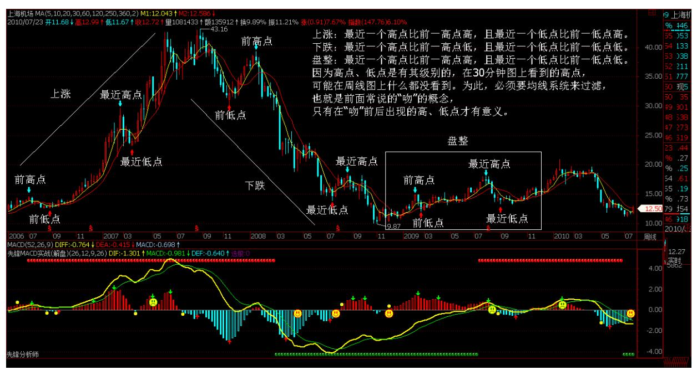
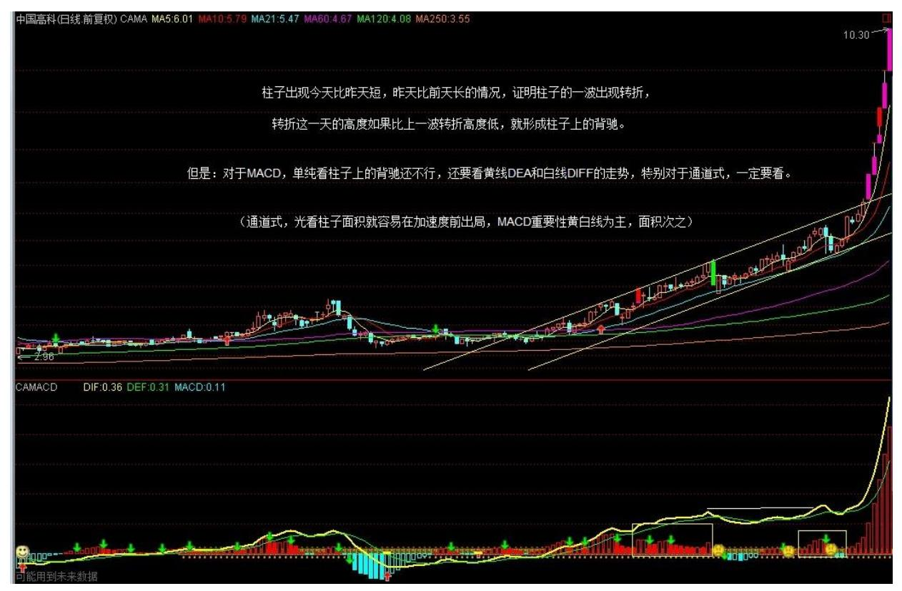
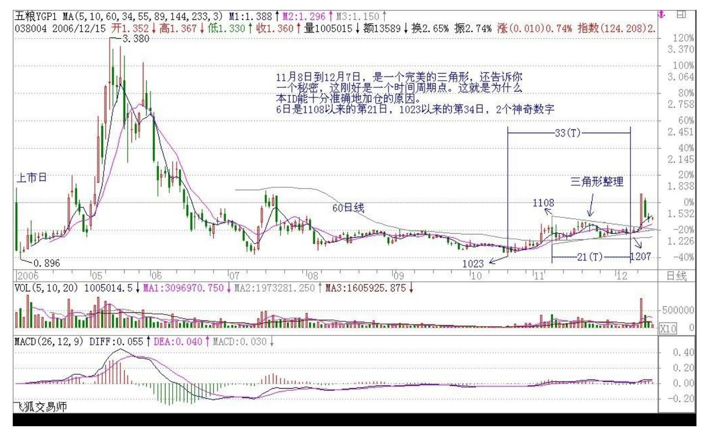
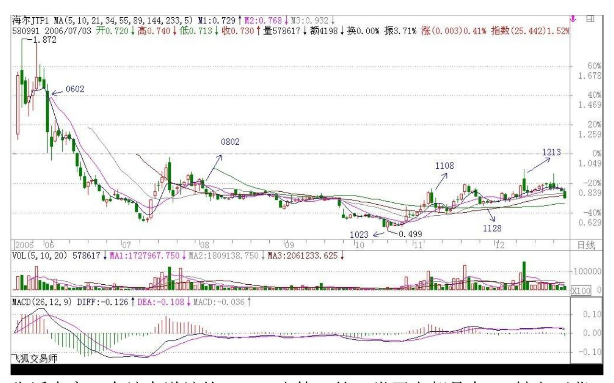
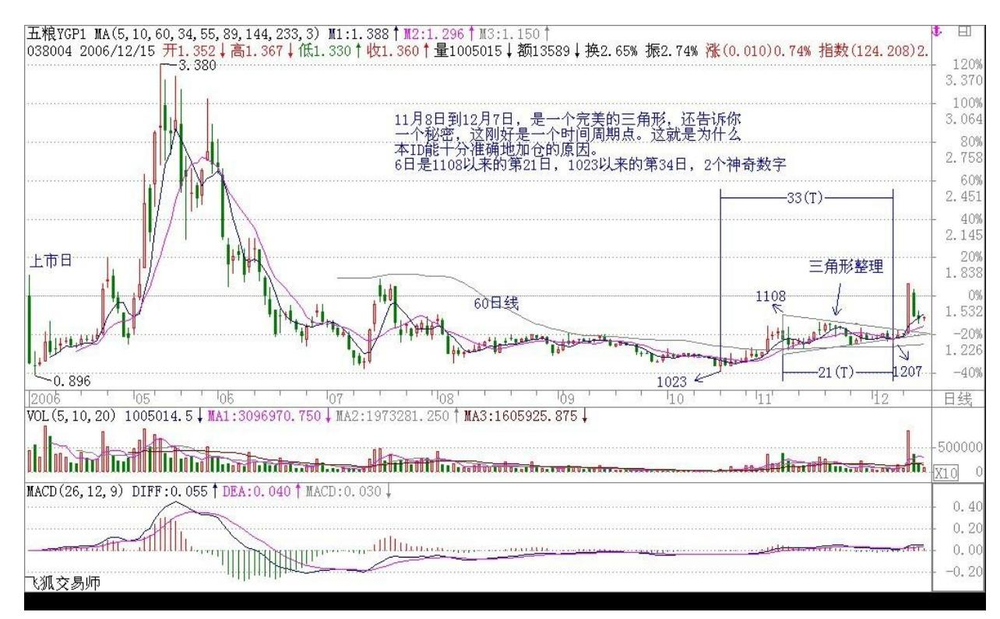
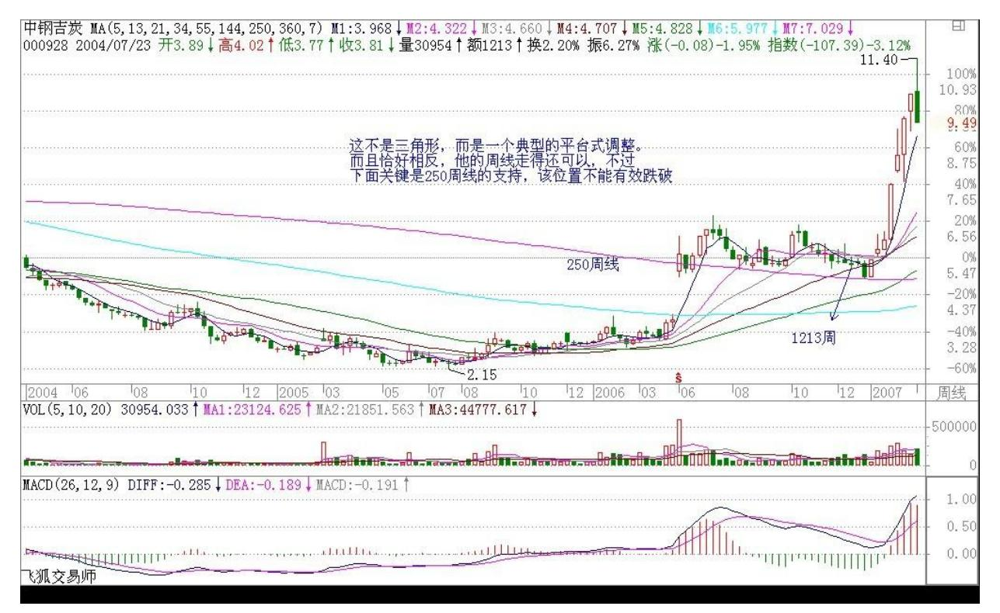
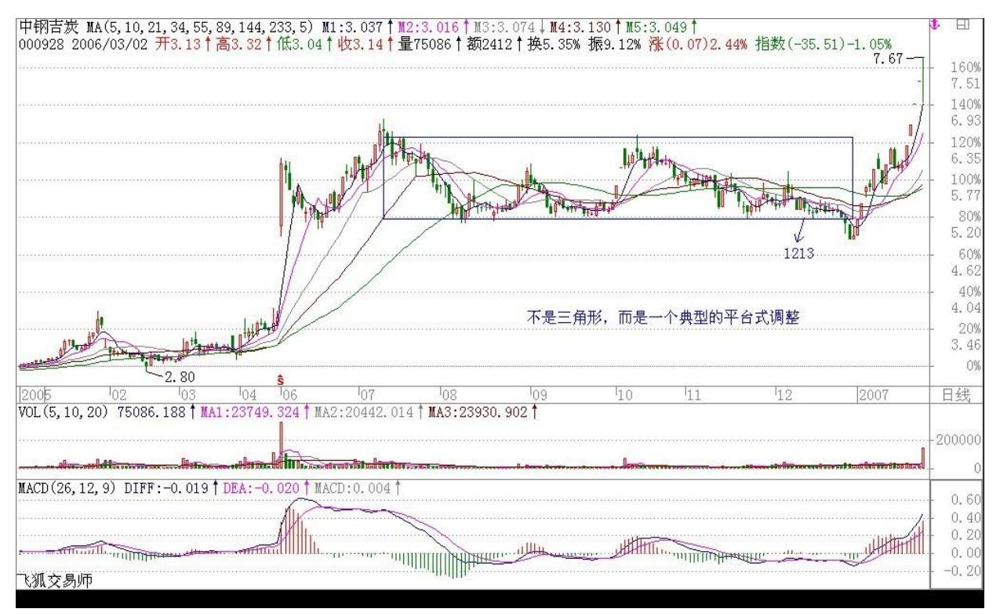
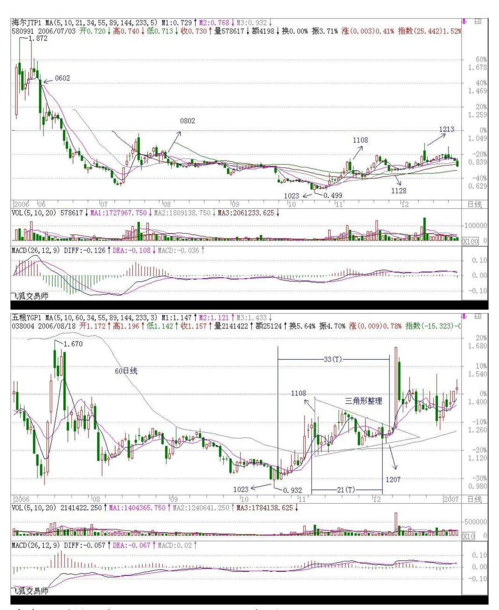

# 教你炒股票 15:没有趋势,没有背驰

(2006-12-08 11:55:57)有人很关心诸如庄家、主力之类的事情,但散 户、庄家的位次分野这类事情不过是市场之"不患"下的"患" ,对 本 ID 所解《论语》熟悉的,对此都很容易理解。有些东西是超越散 户、庄家的位次分野的,这是市场之根,把握了,所谓散户、庄家的 位次分野就成了笑话。如果真喜欢听有关庄家的逸事、秘闻,以后有 空本 ID 可以说点,而且还可以告诉你如何阻击、搞死庄家,这一 点,环视国内,没有比本 ID 更有经验的了。

对于市场走势,有一个是"不患"的,就是走势的三种分类:上涨、 下跌、盘整。所有走势都可以分解成这三种情况。这是一个最简单的 道理,而这才是市场分析唯一值得依靠的基础。很多人往往忽视最简 单的东西,去搞那些虚头八脑的玩意。而无论你是主力、散户、庄 家,都逃不过这三种分类所交织成的走势。

那么,何谓上涨、下跌、盘整?下面给出一个定义。

首先必须明确的是,所有上涨、下跌、盘整都建立在一定的周期图表 上,例如在日线上的盘整,在30 分钟线上可能就是上涨或下跌,因 此,一定的图表是判断的基础,而图表的选择,与上面所说交易系统 的选择是一致的,相关于你的资金、性格、操作风格等。

上涨:最近一个高点比前一高点高,且最近一个低点比前一低点高。

下跌:最近一个高点比前一高点低,且最近一个低点比前一低点低。

盘整:最近一个高点比前一高点高,且最近一个低点比前一低点低; 或者最近一个高点比前一高点低,且最近一个低点比前一低点高。

操作的关键不是定义,而是如何充分理解定义而使得操作有一个坚固 的基础。其中的困难在于如何去把握高点和低点,因为高点、低点是 有其级别的,在 30分钟图上看到的高点,可能在周线图上什么都没看 到。为此,必须要均线系统来过滤,也就是前面常说的"吻"的概 念,只有在"吻"前后出现的高、低点才有意义。(娇注:下图盘整 的定义低点有个小错误,实在找不到好的例图了,凑合看吧。后期趋 势和盘整的定义都有改变,后期为准。)142 143 这里,首先要搞清 楚"吻"是怎样产生的。如果一个走势,连短线均线都不能突破,那 期间出现的高、低点,肯定只是低级别图表上的,在本级别图表上没 有意义。当走势突破短期均线却不能突破长期均线,就会形成"飞 吻";当走势突破长期均线马上形成陷阱,就会形成"唇吻";当走 势突破长期均线出现一定的反复,就会形成"湿吻"。由此可见, "吻"的分类是基于对原趋势的反抗程度,"飞吻"是基本没有任何 反抗力,"唇吻"的力度也一般,而"湿吻",就意味着力度有了足 够的强度,而一切的转折,基本都是从"湿吻"开始的。

转折,一般只有两种:一、"湿吻"后继续原趋势形成陷阱后回头制 造出转折;二、出现盘整,以时间换空间地形成转折。第二种情况暂 且不说,第一种情况,最大的标志就是所谓的"背驰"了。必须注 意:没有趋势,没有背驰。在盘整中是无所谓"背驰" 的,这点是必 须特别明确的。还有一点是必须注意的,这里的所有判断都只关系到 两条均线与走势,和任何技术指标都无关。

如何判断"背驰"?首先定义一个概念,称为缠中说禅趋势力度:前 一"吻"的结束与后一"吻"开始由短线均线与长期均线相交所形成 的面积。在前后两个同向趋势中,当缠中说禅趋势力度比上一次缠中说 禅趋势力度要弱,就形成"背驰"。按这个定义,是最稳妥的办法, 但唯一的缺点是必须等再次接吻后才能判断,这时候,走势离真正的 转折点会已经有一点距离了。如何解决这个问题:第一种方法,看低 一级别的图,从中按该种办法找出相应的转折点。这样和真正的低点 基本没有太大的距离。

还有一种方法,技巧比较高,首先再定义一个概念,称为缠中说禅趋 势平均力度:当下与前一"吻"的结束时短线均线与长期均线形成的 面积除以时间。因为这个概念是即时的,马上就可以判断当下的缠中

说禅趋势平均力度与前一次缠中说禅趋势平均力度的强弱对比,一旦 这次比上次弱,就可以判断"背驰"即将形成,然后再根据短线均线 与长期均线的距离,一旦延伸长度缩短,就意味着真正的低部马上形 成。按这种方法,真正的转折点基本就可以完全同时地抓住。

但有一个缺陷,就是风险稍微大点,且需要的技巧要高点,对市场的 感觉要好点。

纯粹的两条均线的 K 线图,就足以应付最复杂的市场走势了。当然, 如果没有这样的看图能力,可以参照一下技术指标,例如 MACD 等, 关于各技术指标的应用,以后会陆续说到。

\*\*\*\*\*\*\*\*\*\*\*\*\*\*\*\*\*\*\*\*。

解盘及互动问答:

#### \*\*\*\*\*\*\*\*\*\*\*\*\*\*\*\*\*\*\*\*。

1. 网友[匿名] 雨中荷 :谢谢你!楼主。我明白了。就是如果股价或 指数创新高而 MACD 的红柱子却低于前一天,也就有可能产生背驰, 对吗?还有,如果产生背驰,股价下跌,5 日均线和 10 日均线接吻 后,会不会还有一个冲高,有一个相对的高点可出货,还是就一路下 跌了呢?谢谢你!2006-12-12 16:03:42缠师:理解错误。柱子出现今 天比昨天短,昨天比前天长的情况,就证明柱子的一波出现了转折。 转折这一天的高度,如果比上一波转折高度低,就形成柱子上的背 驰。但对于 MACD,单纯看柱子上的背驰还不行,还要看黄线 DEA 和 白线 DIF 的走势,特别对于通道式,一定要看。这个问题以后说技术 指标时再细说。

145 2. 网友[匿名] 获益匪浅:"任何的上涨转折,都是由某级别的 第一类卖点构成的;任何的下跌转折,都是由某级别的第一类买点构 成的。"不知博主能否抽空详述之,甚盼。2006-12-12 17:02:44缠 师:当然,但要安排在下下一课,因为下一课要说的是一种适合中小 资金的高效买卖法。(2006-12-1219:31:21)

#### \*\*\*\*\*\*\*\*\*\*\*\*\*\*\*\*\*\*\*\*。

3. 网友[匿名] 炼铁设备:从5分钟走势图中判断如下:北辰实业 (601588)明天升。上港集团,明天升。工商银行,明天有跌 的可能。招商银行,中国银行,明天跌。请楼主批评!2006-12-12 16:49:26缠师:完全理解反了。这里不是教怎么当算命先生的。预测 升跌是股评的事情,和本 ID 无关。(2006-12-12 19:53:57)

#### \*\*\*\*\*\*\*\*\*\*\*\*\*\*\*\*\*\*\*\*。

4. 网友[匿名] 舞者:你好楼主!今日沪深两市均已创出近日新高, 但是 MACD 都没有创出新高,请问是不是已经形成背驰?谢谢!2006- 12-12 16:48:09缠师:不是这样看的。今天的红柱子比昨天长,这就

可以了。因为这一片正在形成中。哪天如果红柱子缩短,而前面最后 位置超不过,才是危险的信号。

#### \*\*\*\*\*\*\*\*\*\*\*\*\*\*\*\*\*\*\*\*。

5. 网友[匿名] 舞者:"而前面最后位置超不过,才是危险信号。" 请问这里所说的"前面最后位置"是上一日的红柱子?还是上一波最 长的红柱子?请明示。

缠师:这个问题很简单的。背驰,如果用 MACD 红绿柱子来看,当然 是看一波的。红绿柱子的一波怎样构成:就是先伸长,再缩短,而最 长的位置就是转折点。如果今天还比昨天长,证明转折点还没出来, 只有出现今天比昨天短,昨天比前天长的情况,才会出现转折。这个 问题一看图就明白了,太常识性的问题了。(2006-12-12 20:11:39)

#### \*\*\*\*\*\*\*\*\*\*\*\*\*\*\*\*\*\*\*\*。

6. 网友[匿名] 可惜:对楼主来说,是失去了单生意。也别抗议了, 你还在乎那点钱?2006-12-1220:09:59缠师:对不熟悉市场的人,就 少谈论市场的事情。本ID 来来回回地抽血,没别人什么事情。这个话 题到此为止,想探本 ID 口风,门都没有! (2006-12-1220:16:23)

#### \*\*\*\*\*\*\*\*\*\*\*\*\*\*\*\*\*\*\*\*。

7. 网友[匿名] 我已潜水好久:"本 ID",你也真让我头疼。我想这 里不是所有的人都是职业做股票的,所以大家也就没什么时间看短 线,而你那套理论只把核心的思想说出来了,但是股市千变万化,怎 么可能是那么简单的一个核心思想就可预测的,他需要好多指标相互 支持的。2006-12-12 20:30:02缠师:你的理解也是错的。首先,本 ID 反对任何的预测。其次,任何一套系统的有效性问题,在前面也多 次探讨过了,特别是在数学原则那一章里,先把本ID 说的先搞明白, 否则说什么都没意义。(2006-12-12 20:33:13)

#### \*\*\*\*\*\*\*\*\*\*\*\*\*\*\*\*\*\*\*\*。

8. 网友[匿名] 一样一样:请教 600900,是否即将发生背离呢?谢 谢!2006-12-12 20:15:03缠师:如果是 30 分钟,背离(背驰)早发 生了,所以才有这么多天的调整。而在日 K 线图上,背离并不存在。 因为,一般最有效的背离是这样发生的:黄白线回到 0 轴附近再上

去,股价新高而两线(黄白线)以及柱子都不新高,这时候出现的背 离最有效。

(2006-12-12 20:38:09)

#### \*\*\*\*\*\*\*\*\*\*\*\*\*\*\*\*\*\*\*\*。

9. 网友[匿名] 路过:缠 mm, 看你在,问你下你对易经有研究么? 如果有,什么程度?2006-12-1220:32:57148 缠师:说完《论语》会 说它的,一年以后吧。

(2006-12-12 20:39:37)

#### \*\*\*\*\*\*\*\*\*\*\*\*\*\*\*\*\*\*\*\*。

10. 网友[匿名] 一样一样:再请教。好的股票真正上涨的时候,不正 是背离、背离、再背离吗? 2006-12-12 20:33:03缠师:错。真正的 背离发生以后,就会出现转折。去研究一下北晨实业(601588)的 30 分钟图吧。关键的问题是,别把不是背离的当成背离了。这里有很多 技巧,以后都会说到的。(2006-12-12 20:43:30)

#### \*\*\*\*\*\*\*\*\*\*\*\*\*\*\*\*\*\*\*\*。

11. 网友[匿名] 上海三毛:非常感谢楼主,跟着楼主学到了不少东 西。我觉得跟着你学炒股,我一定能把前些年在股市的损失找回来 的。谢谢!2006-12-1220:43:14缠师:本 ID 不是拐杖。一定要把我 说的东西,变成你自己的东西才可以。多看图,多研究,多理解,这 里没有可以取巧的地方。(2006-12-12

20:45:00)\*\*\*\*\*\*\*\*\*\*\*\*\*\*\*\*\*\*\*\*12. 网友[匿名] 摄影之友:"如果 你是超短线,每天进出的,卖了就要马上找到该买的对象,这样资金 利用率才高,否则 T+1,很难操作。如果你是中线的,在牛市中就不 要随便空仓,除非你资金特别少,可以利用震荡不断把成本降低,直 到日线或周线的第一类卖点出现后一次性卖出。" 博主:我12 月 11 日,根据 15 分钟 K 线以 3.92 元的价位买入 000932(华菱管 线)。我本想用 5 分钟来监督卖点。可按照你上面的意思,我需要改 用日线来找卖点了吗?2006-12-12 20:41:23缠师:千万别这样认为。 本 ID 那话的前提,是你在日线或周线的第一、二类买点买入的。你 现在的买点根本不符合这个要求,这怎么能按此操作呢?首先,15 分 钟线上,其实也没出现标准的第一类买点,这个买入,其实是一个箱

型买入的操作,和第一类买点无关。短线就按箱型来操作,箱顶不破 就出,回来再买回来。当然,如果你运气好,这次上去就突破箱顶, 那就更好了。但操作上不能抱有这种心理。(2006-12-12 20:52:35) 149

#### \*\*\*\*\*\*\*\*\*\*\*\*\*\*\*\*\*\*\*\*。

13. 网友[匿名] 学生:"如果跟盘技术不行,有一种方式是最简单 的。就是盯着所有放量突破上市首日最高价的新股,以及放量突破年 线然后缩量回调年线的老股,这都是以后的黑马。"而 002087 在 12 月 6日那天符合第一种情况,为什么这几天走势如此疲软。请缠 MM 点评。"没有趋势,没有背驰" 一课中对背驰百思不得其解,能否像 喝茅台一样举例分析。

谢谢!2006-12-12 20:45:40缠师:你就看好了茅台的例子就可以了。 找好一个例子慢慢摸索,真明白了,再看其他例子。如果均线看背驰 一时把握不好,就先看 MACD 的,那个好把握。

都是方法,关键要精通一种,不要贪多。实际操作时,一种方法精通 就足够了,最怕就是什么都懂点,什么都不精通。(2006-12-12 20:55:52)

#### \*\*\*\*\*\*\*\*\*\*\*\*\*\*\*\*\*\*\*\*。

14. 网友[匿名] 一样一样:谢谢指导。那么,背离是短线看 30 分 钟,长线看日线或周线吗?哪个更有效呢? 2006-12-12 20:55:02缠 师:你的思维还是没转过来。不是规定看什么,而是你根据自己的情 况先选好用什么图来看。至于进去后,如何利用低级别的图弄短差, 那是另外一个问题,是如何提高资金利用率的问题。(2006-12- 1220:58:01)

#### \*\*\*\*\*\*\*\*\*\*\*\*\*\*\*\*\*\*\*\*。

15. 网友[匿名] caiyd:谢谢你的分析。难怪我分析最近的半年没发 现内容,您说的全是 05 年的大局。

最好的卖点还在 06 年 7 月 28 日,看来我只能捂住这个股票,等解 套了。

缠师:没事的。大牛市,最后基本所有股票的涨幅都不会太差的。有 时间多学点东西,毕竟市场不是一年两年的事情。(2006-12-12 21:02:31) 缠师:各位注意:对背驰的判断是实际操作中最大的难点 之一,一下子把握是有困难的,所以要耐心。判断背驰,可以光看均 线关系,这对技巧的要求比较高。

150 也可以看技术指标,例如 MACD,这种好把握一点。MACD 关键是 处理好红绿柱子的一波,与一波中的高点转折的关系。每个红绿柱的 一波都向一个小山,山顶就是转折的地方,这一看图就明白了。

但光会看红绿柱还只是初步。关键要会看上面的两条黄白线。黄白线 在 0 轴(也就是分割红绿柱那条直线)之上就是多头行情,之下就是 空头行情。

告诉大家一个缠中说缠的 MACD 定律:第一类买点都是在 0 轴之下背 驰形成的,第二类买点都是第一次上0 轴后回抽确认形成的。卖点的 情况就反过来。 关于这个定律以及其他问题,以后会在专门说 MACD 时更详细地解说,这里可以先看着。(2006-12-1221:14:35)

#### \*\*\*\*\*\*\*\*\*\*\*\*\*\*\*\*\*\*\*\*。

16. 网友心禅:这里是每天都会想着进来看看的,惊喜禅主在。你好 辛苦,中午、晚上都要回答我们的问题。看见你说,明天会有一个 "关于中小资金高效买卖"的文章,好期待!相信禅主一定是佛家善 人,与我们同在。今天不问技术上的事了,知道你在北京,我是深圳 的,真心希望有时间能有幸接待你!2006-12-12 21:10:09缠师:没 有。今天刚好没应酬,北京现在外面天寒地冻的,还不如在这里回答 一下问题,至少可以帮助一下大家。那文章是后天出来,上面这么多 内容,要有点时间让各位消化。否则这么快就说新的,都搞混了,那 就麻烦了。

上面那"各位注意" ,请好好看看,自己看图好好理解一下。(2006- 12-12 21:19:21)给大家一个图,结合本 ID 上面的"各位注意" , 自己分析一下。这就是 038004(五粮液认沽)。这东西本 ID 上市时 搞过一次了,最近这次是搞第二次,就是按照这个标准进入的。各位 猜猜本 ID 是如何进入的,又在什么地方加码买入的。明天告诉各位 答案。

该权证风险极大,最终要变成废纸。本 ID 说它只是为了给各位上 课。你们绝对不要买。而且现在买点都早过了,更不能买。(2006-12- 12 21:29:01) 好了,今天就到这了,先下,再见。(2006-12-12 21:30:16) 适于中小资金的高效买卖法,明天上传。

151 那个医药公司,今天谜底已经揭晓了,所有人都应该知道是谁 了,因为它一开盘就涨停。

今天公告里没把事情全说出来。外方是世界最大医药公司之一,他们 有一个产品特别适用于男猿人。

(2006-12-13 12:04:19) 关于 038004 的作业,回答比较正确的是下 面这位。但还是有点出入。10 月 23到 25 日是本 ID 的建仓期,第 一波上去后,11 月 8日减了一半,后来在60 天线附近一路回补。加 仓是在12 月 6 日、7 日两天,比第一次买的,加了 1/2 的仓位。这 里的理由除了第二类买点,还有一个现在没说到的,就是三角形整理 的第五波末段。该走势十分标准,自己去研究一下。昨天根据 5 分钟 线的背弛出了大半,剩下的成本是 0 了。本 ID 炒权证,特别是认沽 证,第一轮上去都会这样减仓操作,只持有成本是 0 的仓位等待第二 波,第二波是否有,这已经问题不大了,这样就绝对立于不败之地 了。

17. 网友[匿名] 在路上:我先来回答禅姐的038004 的问题,以检验 最近向禅姐学习的成绩。无论对错,望禅姐和各位同道指正,以求共 同步。日线图(5/10 日均线):一、 038004 的强力上升结束后,于 06 年 5 月 26进入男上位,其后于 7.3 元来了一个很浅的湿吻。按 照禅中说禅定律,后面的下跌(7 月 12 日)不是第一类买点。7 月 17 日,来了第二次湿吻,但其后并未出现背驰(中间几次反复缠绕均 未突破最高\低价,属于缠姐说的盘整)。

10 月 12 日,又来了次湿吻。这次湿吻后的下跌至10 月 31 日形成 的 MACD 的柱子的面积小于上次下跌的面积而形成背驰,构成第一类 买点。而最佳位置,我在 30 分钟图上看的,不太确定。还有,就是 这次背驰,MACD 的柱子面积是和 5 月 26 日至 7 月 3日的那次下跌 对比?还是和 9 月 18 日至 10 月12日那次下跌对比呢?虽然,这次 背驰,MACD 的柱子面积比那二次都小。这二个问题请禅姐和各位指 教。

另外,可以得到证实的是,这次的背驰在 MACD 中,可明显看出绿柱 比前二次下跌都短,面积也小很多,黄白线也在 0 轴以下金交叉且并 未创最近一次下跌的新低。这确实是一个完美的例子,我相信缠姐会 买在10 月 23 日那天。

二、 找到了某个股票的第一类买点的位置,再找其第二类买点的位置 就容易多了。这也是我最近的体会。

如果第一类买点找错,那么,找第二类买点也容易错。权证 038004 在 11 月 14 日那天,女上位后的第一次缠绕,也许是 12 月 7 日那 天。因为 11 月14 日那天,30 分钟图同样出现盘整。而 12 月7 日 比较像背驰但未创新低。对比缠姐曾解说过的 MACD的 M 头后再背驰 的说法(虽然我也不太懂)。应该是12 月 7 日那天是加仓的位置。那 也是第一类买点出现后,MACD 黄白线冲 0 轴后的第一次回抽并且已 经走平了。

望禅姐指正,并希望能回答其中的不明之处,不胜感激! (2006-12-13 12:17:52) 缠师:本 ID 的权证不止038004。还有一个的典型例子, 又是一个作业。请用昨天回复里说的缠中说缠的 MACD 定律好好分析 一下580991。为什么本 ID能在 10 月 23 到 25 日坚决建仓。

告诉大家一个缠中说缠的 MACD 定律:第一类买点都是在 0 轴之下背 驰形成的,第二类买点都是第一次上0 轴后回抽确认形成的。卖点的 情况就反过来。

(2006-12-13 12:21:37)154 155 18. 网友小明:缠 mm,是 999 吧! 你还是不改你口风啊,还骂我们是男猿人!关于 038004,我分析得对 吗?2006-12-13 12:06:16缠师:本 ID 说的是适合于男猿人,又没有 说适合于各位,不要搞糊涂了。038004 的答案在上面。另外还有新的 作业。(2006-12-13 12:26:04)

#### \*\*\*\*\*\*\*\*\*\*\*\*\*\*\*\*\*\*\*\*。

缠师:各位,以后多看回帖。因为在回帖里,很多文章说不到的事情 都会说到,还有些特别的问题。本 ID的作业,一定要自己搞清楚,像 580991 的情况,研究透了,对用 MACD 判断背驰就有把握了。(2006- 12-13 12:28:46)

#### \*\*\*\*\*\*\*\*\*\*\*\*\*\*\*\*\*\*\*\*。

19. 网友小明:缠 mm,我回答的也不差啊,怎么不提一下呢?本来以 为你的资金量很大的,现在看来估计这只是你的一个小仓位而已。我 猜的对吗?2006-12-13 12:27:43缠师:对于本 ID 的总资金,仓位不 大,对于一般人,那就很大了。本 ID 不坐庄的,所以别以为本 ID把 他们拉起来了。(2006-12-13 12:30:16)

#### \*\*\*\*\*\*\*\*\*\*\*\*\*\*\*\*\*\*\*\*。

20. 网友[匿名] 零零六三:请问,大概什么时候能把《缠中说禅》这 本书写完出版?2006-12-13 12:05:22缠师:可能要一年以后了。 (2006-12-13 12:31:18)

#### \*\*\*\*\*\*\*\*\*\*\*\*\*\*\*\*\*\*\*\*。

21. 网友[匿名] 在路上:10 月 12 日又来了湿吻,这次湿吻后的下 跌至 10 月 31 日,形成的 MACD 的柱子的面积小于上次下跌的面积 而形成背驰,构成第一类买点。而最佳位置,我在 30 分钟图上看的 不太确定。还有就是,这次背驰形成的 MACD 的面积是和5 月 26 日 至 7 月 3 日的那次下跌对比?还是和 9月 18 日至 10 月 12 日那 次对比?虽然这次背驰比那二次都小。这二个问题请禅姐和各位指 教。

缠师:但你对 MACD 的分析,不大对,好好研究一下。

缠中说缠的 MACD 定律:第一类买点都是在 0 轴之下背驰形成的,第 二类买点都是第一次上 0 轴后回抽确认形成的。卖点的情况就反过 来。 提示:不要看太散了,一大段地看。(2006-12-13 12:35:32)

#### \*\*\*\*\*\*\*\*\*\*\*\*\*\*\*\*\*\*\*\*。

22. 网友心禅:"禅主" ,上文所说的"三角形整理的第五波末 段。"在已知的情况下,看 038004 清楚,可是正确的从哪个"吻点 开始计算?2006-12-1312:33:33缠师:三角形的判别不看均线,直接 看图形。11 月 8日到 12 月 7 日,是一个完美的三角形,还告诉你 一个秘密,这刚好是一个时间周期点。这就是为什么本ID 能十分准确 地加仓的原因。几个因数都结合在一切了。(2006-12-13 12:37:50) 157 158 教你炒股票 15:没有趋势,没有背驰 23. 网友小明:缠 mm,你肯定算大户了,也不要太谦虚哦。呵呵。2006-12-13 12:37:05 缠师:大户?大户不过是散户的一种。(2006-12-1312:40:03)各位自 己学好技术吧,别关心本 ID 是谁了。本 ID昨天用百度,竟然"缠中 说禅是谁"在下面一栏出现。证明用百度查询这个问题的人不少。本 ID 是谁基本没人知道,本 ID 干过的事情基本没人不知道。

其他就别浪费时间了。(2006-12-13 12:47:38) 开盘,先下,有时间 研究一下技术,看看论语,听听音乐,别胡思乱想了。(2006-12-13 12:49:00)

#### \*\*\*\*\*\*\*\*\*\*\*\*\*\*\*\*\*\*\*\*。

24. 网友[匿名] 中间体:"本 ID 的权证不止038004。还有一个的典 型例子,又是一个作业。" "请用昨天回复里说的缠中说缠的 MACD 定律好好分析一下 580991,为什么本 ID 能在 10 月 23 到 25日坚 决建仓。" 2006-12-13 12:21:37 根据缠中说禅定律(原来我只知道 牛吨定律):10 月 23 到 25 日形成第一类买点, 缠姐在 11 月 8 日应该出掉了1/2(开始转折)。因为在 11 月 21 日形成背离,又出 掉 1/2,还剩 1/4。有可能在 12 月 7 日-11 日又补了点, 因为三 角型整理即将完毕。请打分! 2006-12-13 13:55:06缠师:先把题目 审清楚。现在已经不能简单说一个"第一类买点"就完事了。为什么 是第一类买点,一定要搞清楚。如何判断,现在必须要更仔细地回答 这个问题。第一类买点,是下跌趋势中出现背驰产生的,现在的问题 就要问,这个背驰是如何判断的,怎么看。这是实际操作中最重要的 问题之一了。 (2006-12-13 15:07:41)

#### \*\*\*\*\*\*\*\*\*\*\*\*\*\*\*\*\*\*\*\*。

25. 网友[匿名] 想飞:LZ,请看 600000(浦发银行)的周线图 2004/3/12-2004/10/15 之间的情况。

好象无论 MACD 的面积还是柱子的长短都出现了背驰。请问对吗?还 有,你说过不要介入第一波涨幅过大的股票。怎么判断呢?是不是要 用"前复权"来看K 线图呢?因为如果用"不除权"的 k 线图来看, 两者之间的差距还挺大的。2006-12-13 14:53:11159 缠师:是一定要 在第一类和第二类买点介入。另外,那周线图在那段时间怎么会构成 背驰了呢?没有趋势就没有背驰,先把这个问题搞清楚了再说。

(2006-12-13 15:09:09)26. 网友[匿名] 想飞:"第二个值得买入或 加码的位置,就是女上位后第一次缠绕形成的低位。"LZ,这个缠绕 是否一定得是湿吻?飞吻和唇吻算不算?2006-12-13 14:53:11缠师: 这个并不需要,在变动快速的图上,不出现湿吻也是很正常的,但其 基础往往令人怀疑。好好研究一下 038004 日线的第二类买点构成, 这是一个用三角形构造第二类买点的完美例子。(2006-121315:12:27)马上有事了,先下。上面给的作业,请好好思考。为什么 要用权证的例子?首先这都是实战的例子,其次,权证而且还是认沽 的,都能符合要求,就更证明了本 ID 这套方法的适用范围。一般的 股票,走势更规范,就更不用说了。权证走势都能搞明白,其他就更 好办了。再见。(2006-12-13 15:19:03)

#### \*\*\*\*\*\*\*\*\*\*\*\*\*\*\*\*\*\*\*\*。

27. 网友心禅:禅主,是不是所有的缺口,都应该会补上?我今天本 想买入 000400,可看它 8.85 元跳空高开,就等补缺口,可它却涨上 去了,为什么不补?盼解答!2006-12-13 15:22:31缠师:缺口不补, 表示强势。特别是突破性的缺口,或岛型反转的缺口,是不补的。上 海指数 94 年在300 多点留的那个缺口,10 几年都没补过。唯一肯定 要补的缺口,就是盘整中的,已经上涨最后的衰竭性缺口。(2006-12- 13 15:28:18)

#### \*\*\*\*\*\*\*\*\*\*\*\*\*\*\*\*\*\*\*\*。

28. 网友[匿名] 学习中:根据缠中说缠的 MACD 定律:第一类买点都 是在 0 轴之下背驰形成的,第二类买点都是第一次上 0 轴后回抽确 认形成的。下午买的600567 价位 3.24 元,是否是第二类买点呢?敬 请楼主点评。2006-12-13 15:25:57缠师:首先,把基本概念搞清楚。 买点必须先确定是在什么级别的 K 线图上的。是日线还是周线?还是 其他什么级别的 K 线图。没有这个前提,哪里有什么买点。不行,一 定要走了,有问题先放在这里,晚上有空再回答。再见。(2006-12-13 15:41:57)

29. 网友[匿名] yjbtxy:请教禅女:000928 现在是否面临三角形整 理突破?分钟线、日线图很好看,但是周线图不好看。2006-12-13 16:01:38缠师:这不是三角形,而是一个典型的平台式调整。

而且恰好相反,他的周线走得还可以,不过下面关键是 250 周线的支 持,该位置不能有效跌破。(2006-12-13 21:01:50)161

162 163 30. 网友[匿名] 中间体:其实,我还有的混淆, 这三个面 积:A:8 月 2 日到 8 月 16 日形成的面积。B:9 月 18 日到 10 月 12 日形成的面积。C:10 月19 日到 10 月 31 日形成的面积。因 为 A 与 B之间有明显的平台,有平台就没有趋势。是 C 与 B相比 呢?还是 B 与 A 相比呢?似乎 C 与 B 相比更好。2006-12-13 15:52:40缠师:你好好理解这句话:没有趋势就没有背驰。背驰是趋 势和趋势比,和盘整无关。再好好研究,你会真明白的。不是所有的 绿柱子都要去比的。盘整里的绿柱子是没有意义的。(2006-12-13 21:04:04)

#### \*\*\*\*\*\*\*\*\*\*\*\*\*\*\*\*\*\*\*\*。

31. 网友[匿名] 无言:缠姐,昨晚看了你的回帖,缠中说蝉定律。第 二买点在黄白线上到 0 轴以上。看了各个股票的走势,今天一早就进 去跟庄家抢筹码。

002069 分别在 64.30 元、65.20 元、65.36 元满仓了。坐轿的感觉 真爽啊!还望以后不吝赐教。谢谢! 2006-12-13 15:38:07缠师:短 线,关键要注意箱顶是否能有效突破。

(2006-12-13 21:08:16)

#### \*\*\*\*\*\*\*\*\*\*\*\*\*\*\*\*\*\*\*\*。

32. 网友[匿名] 想飞:LZ,请讲解 580991 时,顺带讲讲怎么判断趋 势的,好吗?最好从上市第一天一路讲下来。2006-12-13 21:07:48缠 师:先把如何判别 MACD 搞清楚。趋势、盘整的判别比这个简单。去 好好消化本 ID 在没有趋势没有背驰给出的定义,自然就明白了 (2006-12-13 21:10:49)

#### \*\*\*\*\*\*\*\*\*\*\*\*\*\*\*\*\*\*\*\*。

33. 网友 wy1499:楼主,沪市认沽权证的板块联动性很强,如 990、 991、992、993、994 在 12 月 6 日下午 2 点半到 7 日上午 10 点 同时背驰到第二类买点的低位,但具体哪一个拉伸幅度大和拉升时间 的先后顺序就很难判断了。我在 6 日下午看上了 993,本打算先在这 一票上搞 40%,再在后涨的其他票上再搞个 20%,岂料 7 日中午涨了 不到 20%就早泻了,最后搞得找了个低位跑了,郁闷啊!2006-12-13 15:41:40164 缠师:要找盘整图形结束的来搞。没结束的只不过是箱 型整理。对比一下 038004 的完美 5 波就知道了。993 要盘整图形完 美以后才可能大表现。所有关于 991 的问题明天再说,让各位有充分 的时间思考。

晚安,再见。(2006-12-13 21:18:42) /p>
