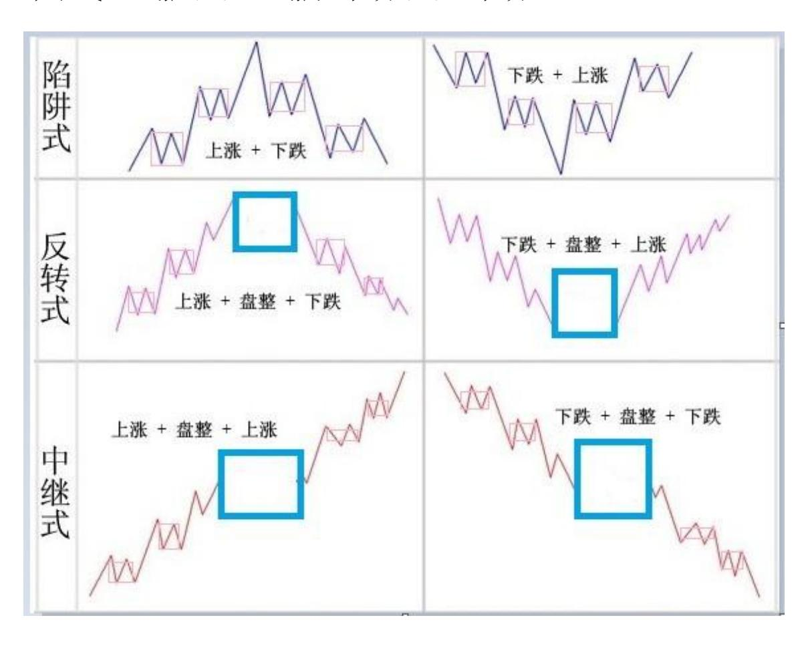
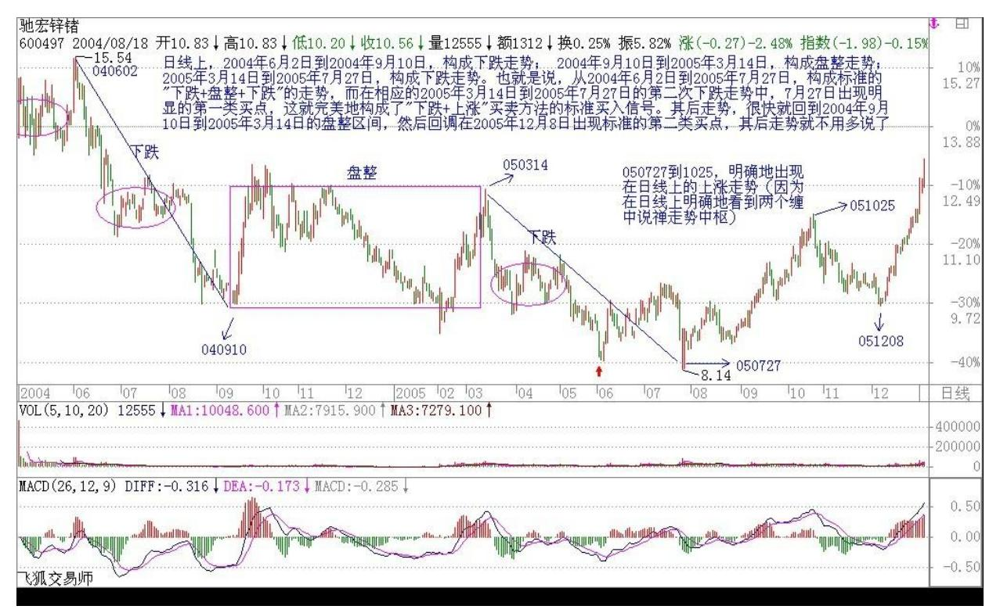
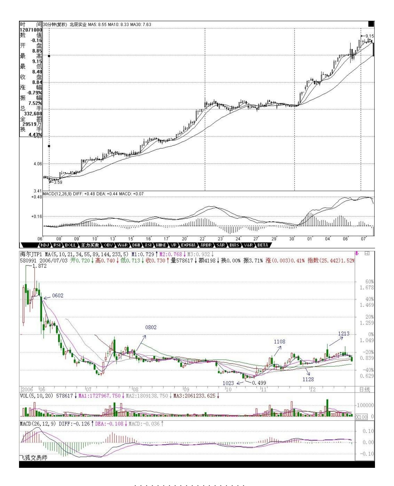
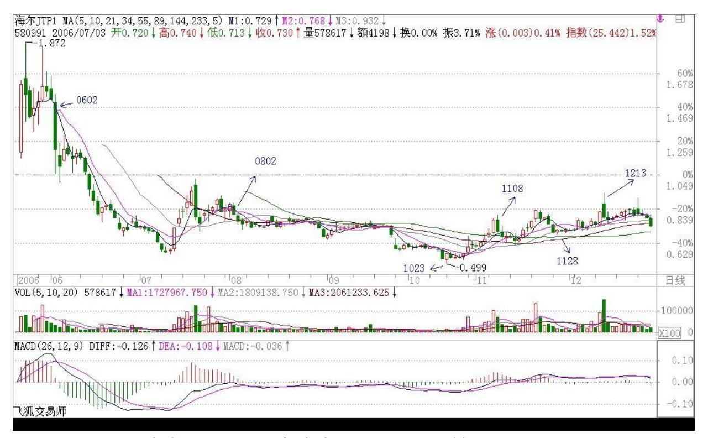
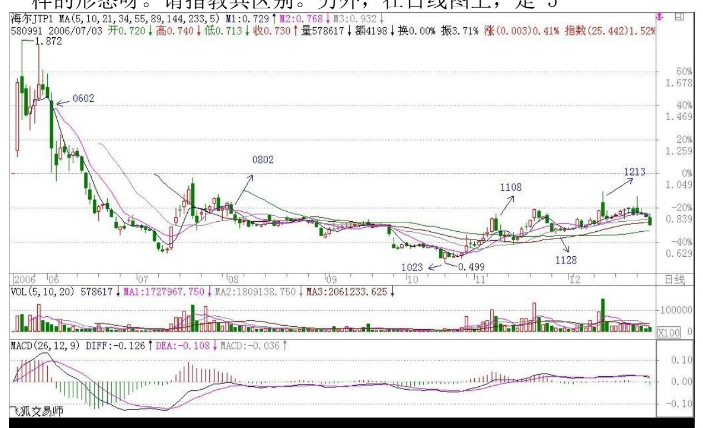
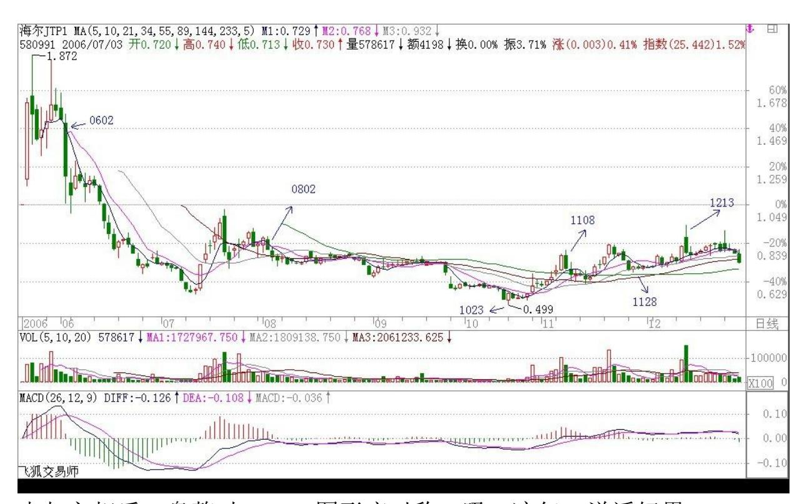

教你炒股票 16:中小资金的高效买卖法

(2006-12-14 12:06:47)上章说过,市场任何品种任何周期下的走势 图,都可以分解成上涨、下跌、盘整三种基本情况的组合。上涨、下 跌构成趋势,如何判断趋势与盘整,是判断走势的核心问题。一个最 基本的问题就是,走势是分级别的,在 30 分钟上的上涨,可能在日 线图上只是盘整的一段甚至是下跌中的反弹,所以抛开级别前提而谈 论趋势与盘整是毫无意义的,这必须切实把握。注意,下面以及前面 的讨论,如没有特别声明,都是在同级别的层面上展开的,只有把同 级别的事情弄明白了,才可以把不同级别走势组合在一切研究,这是 后面的事情了。

上涨、下跌、盘整三种基本走势,有六种组合可能代表着三类不同的 走势:陷阱式:上涨 下跌;下跌 上涨。

反转式:上涨 盘整 下跌;下跌 盘整 上涨。

中继式:上涨 盘整 上涨;下跌 盘整 下跌。

市场的走势,都可能通过这三类走势得以分解和研究。站在多头的角 度,首先要考虑的是买入,因此,上面六种最基本走势中,有买入价 值的是:下跌上涨、下跌盘整上涨、上涨盘整上涨三种。没有买入价 值的是:上涨下跌;上涨盘整下跌;下跌盘整下跌。由此不难发现, 如果在一个下跌走势中买入,其后只会遇到一种没买入价值的走势, 就是下跌盘整下跌,这比在上涨时买入要少一种情况。而在下跌时买 入,唯一需要躲避的风险有两个:一、该段跌势未尽;二、该段跌势 虽尽,但盘整后出现下一轮跌势。

在上一章没有趋势没有背驰中,对下跌走势用背驰来找第一类买点, 就是要避开上面的第一个风险。而当买入后,将面对的是第二个风 险,如何避开?就是其后一旦出现盘整走势,必须先减仓退出。为什 么不全部退出,因为盘整后出现的结果有两种:上涨、下跌,一旦出 现下跌就意味着亏损,而且盘整也会耗费时间,对于中小资金来说, 完全没必要。这里有一个很重要的问题留待后面分析,就是如何判断 盘整后是上涨还是下跌,如果把握了这个技巧,就可以根据该判断来 决定是减仓退出还是利用盘整动态建仓了(注:重要的问题指如何判 断 3 买)。这是一个大问题,特别对于不想坐庄的大资金来说,这是 一个最重要的问题,因为不想坐庄的大资金的安全建仓在六种走势中 只可能在下跌盘整上涨这一种,其他都不适用。至于坐庄的建仓方 法,和这些都不同,如有兴趣,本 ID 以后也可以说的。

根据上面的分析,可以马上设计一种行之有效的买卖入方法:在第一 类买点买入后,一旦出现盘整走势,无论后面如何,都马上退出。这 种买卖方法的实质,就是在六种最基本的走势中,只参与唯一的一 种:下跌上涨。对于资金量不大的,这是最有效的一种买卖方法。下 面重点分析:对于下跌上涨来说,连接下跌前面的可能走势只会有两 种:上涨和盘整。如果是上涨下跌上涨,那意味着这种走势在上一级 别的图形中是一个盘整,因此这种走势可以归纳在盘整的操作中,这 在以后对盘整的专门分析里研究。换言之,对于只操作"下跌上涨" 买卖的,"上涨下跌上涨"走势不考虑,也就是说,当你希望用"下 跌上涨"买卖方法介入一只出现第一类买点的股票,如果其前面的走 势是"上涨下跌",则不考虑。注意,不考虑不意味着这种情况没有 赢利可能,而只是这种情况可以归到盘整类型的操作中,但"下跌上 涨"买卖方法是拒绝参与盘整的。如此一来,按该种方法,可选择的 股票又少了,只剩下这样一种情况,就是"盘整下跌上涨" 。

从上面的分析可以很清楚地看到,对于"下跌上涨" 买卖方法方法来 说,必须是这样一种情况:就是一个前面是"盘整下跌"型的走势后 出现第一类买点。显然,这个下跌是跌破前面盘整的,否则就不会构 成"盘整下跌"型,只会仍是盘整。那么在该盘整前的走势,也只有 两种:上涨、下跌。对于"上涨盘整下跌"的,也实质上构成高一级 别的盘整,因此对于"下跌上涨"买卖方法方法来说也不能参与这种 情况,因此也就是只剩下这样一种情况:"下跌盘整下跌" 。

170 综上所述,对于"下跌上涨"买卖方法方法来说,对股票的选择 就只有一种情况,就是:出现第一类买点且之前走势是"下跌盘整下 跌"类型。因此这里就得到了用"下跌上涨"买卖方法方法选择买入 品种的标准程序:一、首先只选择出现"下跌盘整下跌"走势的。 二、在该走势的第二段下跌出现第一类买点时介入。三、介入后,一 旦出现盘整走势,坚决退出。注意,这个退出肯定不会亏钱的,因为 可以利用低一级别的第一类卖点退出,是肯定要赢利的。但为什么要 退出,因为它不符合"下跌上涨"买卖不参与盘整的标准,盘整的坏 处是浪费时间,而且盘整后存在一半的可能是下跌,对于中小资金来 说,根本没必要参与。一定要记住,操作一定要按标准来,这样才是 最有效率的。如果买入后不出现盘整,那就要彻底恭喜你了,因为这 股票将至少回升到"下跌盘整下跌"的盘整区域,如果在日线或周线 上出现这种走势,进而发展成为大黑马的可能是相当大的。

举一个例子:驰宏锌锗:日线上,2004 年 6 月 2 日到 2004年 9 月 10 日,构成下跌走势;2004 年 9 月 10 日到 2005 年 3 月 14 日,构成盘整走势;2005 年 3月 14 日到 2005 年 7 月 27 日,构 成下跌走势。也就是说,从 2004 年 6 月 2 日到 2005 年 7 月 27 日,构成标准的"下跌盘整下跌"的走势,而在相应的 2005 年3 月 14 日到 2005 年 7 月 27 日的第二次下跌走势中,7 月 27 日出现 明显的第一类买点,这就完美地构成了"下跌上涨"买卖方法的标准 买入信号。其后走势,很快就回到 2004 年 9 月 10 日到2005 年 3 月 14 日的盘整区间,然后回调在 2005年 12 月 8 日出现标准的第 二类买点,其后走势就不用多说了。

该种方法反过来就是选择卖点的好方法了,也就是说前面出现"上涨 盘整上涨"走势的,一旦第二段升势出现第一类卖点,一定要走,因 为后面很可能就是"上涨下跌"的典型走势。对此,也举一个例子: 北辰实业,在 30 分钟图上,11 月 7 日 10 点 30 分到 11 月 22 日 10 点,构成上涨;11 月 22 日10点到 11 月 30 日 11 点构成盘 整;11 月 30 日 11点到 12 月 7 日 10 点构成上涨。而在第二段上 涨中,30 分钟图上的 3 次红柱子放大,一次比一次矮所显示的严重 背离,就完美地构成了"上涨盘整上涨"后出现第一类卖点的"上涨 下跌"型卖出。如果以后学了时间之窗的概念,对该股的卖点就更有

把握了,各位注意到 11 月 7 日 10 点 30 分和 12 月 7日 10 点之 间的关系没有(低点到高点一个月)。

"这种方法,无论买卖,都极为适用于中小资金,如果把握得好,是 十分高效的,不过要多多看图,认真体会,变成自己的直觉才行。另 外请多看文章后面的跟贴,ID 的一些回复都是针对一些主帖没所到的 细节东西,而且都是针对各位提出的不同问题的。还有多看前面的章 节,把所有问题都搞懂,参与市场是不能有半点糊涂的。

### 解盘及互动问答:

#### \*\*\*\*\*\*\*\*\*\*\*\*\*\*\*\*\*\*\*\*。

1. 网友[匿名] ruifeng0021:作业提交(分析580991 的背驰):从 日线图上看,9 月 22 日开始下跌趋势,5 日和 10日均线成男上位缠 绕,以 10 月 17 日为分界点,后面的 MACD 的面积较前面小不少, 可判断为背弛。

MACD 上绿柱子变短,黄白线在 0 线以下,均支持背弛的判断。最好 的买点在下跌中的低点 10 月 23日,是缠理论中第一类买点。在 30 分钟图上,会看得更清楚。从 9 月 22 日的 11:00 到 10 月 23 日 的 11:00,是很明显的"下跌+盘整+下跌"走势。10月 23 日的 11:00 处是最好的买点。

以上分析是否对路?2006-12-14 15:35:35缠师点评:完全错误。请好 好体会这一句:没有趋势,没有背驰。背驰是趋势与趋势之间的比 较。你不先找出两段趋势来,哪里有背驰可言? (2006-12- 1415:43:19)补充一句,你说的那段走势里,在 5 分钟图上是对的, 是"下跌+盘整+下跌" ,但在 30 分钟上就只是一个下跌。请好好想 明白这个区别。 (2006-12-1415:58:37)

#### \*\*\*\*\*\*\*\*\*\*\*\*\*\*\*\*\*\*\*\*。

2. 网友[匿名] 摄影之友:博主,现在的大盘已经取得了阶段性的进 展。请再次为我们明示下一步的操作

吧。这几天没有你的明示,实在郁闷至及,成绩欠佳。就当"扶上 马,送一程"吧。今天轻仓。但愿我的思路是对的。2006-12-14 15:33:14缠师:又是一个错误思维。请问现在是牛市还是熊市?如果 是牛市,机会满大街都是,为什么要轻仓?从 1000 点上来,你的仓 位整天变来变去,收益能否比一路持有成分股不动来得高?如果没 有,那你的操作都是有很大问题的。

176 如果你是市场中的人,资金回来就要马上选择好的进入对象。例 如,在 30 分钟图或日线图上找符合要求的股票,或者找轮炒的股 票,这样资金利用率才会高。或者干脆就长抓一些股票,根据市场的 波动不断弄短差,把成本降低,这样资金利用率也高。牛市里不挣钱 就与熊市心态有关。 (2006-12-1415:50:32)177 178 3. 网友[匿名] 翅膀的痕迹:缠 MM,10 月 27日前期"下跌+盘整+下跌"走势,27 日创历史新低但是绿柱子缩短,判断为背弛。2006-12-14 15:55:13缠 师:不对。分析不能这样粗略的,那是很严格的。

如果你真掌握了这种方法,你就知道其严格性。

再告诉各位一个缠中说禅定律:任何非盘整性的转折性上涨,都是在 某一级别的"下跌+盘整+下跌"后形成的。下跌反之。好好理解。 (2006-12-14 16:02:18)

#### \*\*\*\*\*\*\*\*\*\*\*\*\*\*\*\*\*\*\*\*。

4. 网友[匿名] 夜雨:美女姐姐,谢谢你对 038004的解说。我又得到 您的提醒了,下午换仓操作,有收获再告诉大家。不知我猜的对不 对?哈哈。 以上这段话是昨天看了美女姐姐关于 038004 的回答给我 的提醒。所以我昨天下午进了 030002。楼主已经提示过好几支牛股 了。如 600839 和 000927,我是在来这就买了的。看了楼主的文章, 坚定了我持股的信心,大家也要好好找啊。寻找宝藏的游戏真好玩。 再一次感谢美女姐姐。2006-12-14 16:00:46缠师:这里是说技术的, 不是来寻宝的。先把技术学好吧。(2006-12-14 16:03:48)

#### \*\*\*\*\*\*\*\*\*\*\*\*\*\*\*\*\*\*\*\*。

5. 网友[匿名] 中间体:对权证 580991 的走势分析:2006.6.2-7.12 下跌。2006.7.12-10.19 盘整。

10 月 19 日以后为第二次下跌,背离出现。对吗?2006-12-14 16:06:08缠师:首先,要搞清楚是在什么图上讨论问题。在日线图 上,如果要构成下跌,要很明显地看出至少两个高点,两个低点。你 认为的下跌,这个要求不成立,你认为的盘整也是。(2006-12-14 16:12:56)

#### \*\*\*\*\*\*\*\*\*\*\*\*\*\*\*\*\*\*\*\*。

6. 网友[匿名] 在路上:本来我以为自己已经搞清楚什么是盘整了, 但看了驰宏锌锗的例子又糊涂了,请缠姐指点。日线上,2004 年 6 月 2 日到 2004年 9月 10 日,构成下跌走势。这个明显。但 2004 年 9月 10 日到 2005 年 3 月 14 日,构成盘整走势。这个就不太明 白了。这次相比上一次,股价不也是创了新低了吗?也没有比上一个 高点高啊?怎么会是盘整呢?请缠姐明示! 2006-12-14 16:14:28缠 师:盘整,会构成各种不同的图形。这是一种特殊的盘整图形,叫顺 势平台,这是盘整里最弱的一种。

由于现在还没说到价值中枢的概念,所以有关趋势与盘整的最严格定 义没法给出。该定义是本 ID 独此一家,以后会说到的。所以,现在 各位先用这个通用的,但不完全严格的定义来找趋势与盘整吧。该定 义唯一不精确的地方,就是这个顺势平台,把这个特例记住就可以 了。(2006-12-14 16:31:27)

7. 网友[匿名] ruifeng0021:还没想明白。请问,在权证 580991 的 30 分种图上,9 月 28 日 14:30 到10 月 20 日的 11:30 这段不算 盘整吗?我看从 9月22 日到 10 月 23 日的 30 分钟和 5 分钟图是 一样的形态呀。请指教其区别。另外,在日线图上,是 5

月 31 日-7 月 11 日和 9 月 21 日-10 月 23 日两段趋势比较。对 吗?缠师:知道为什么吗?因为它的下跌在 30 分钟图上,根本没有 出现高点和低点。也就是说根本就是一条直线下来的,连 5-30 分钟 线都突破不了,这种只能算是低一级别里的下跌。注意,在一个级别 的趋势里,必须出现明显的高点和低点。这在 30 分钟图里,是没有 的。而 5 分钟图或者 1 分钟图里是明显的。所以说,在 5 分钟里是 "下跌+盘整+下跌" ,而 30 分钟里合起来只算一个下跌。(2006- 12-1416:49:31)180 181 8. 网友[匿名] 雨中荷:楼主你好!权证 580991 的背驰是不是因为在 6 月 2 日到 7 月 14 日期间,由五日 线和十日线交叉形成的 MACD 的面积远远大于9 月 2 日到10 月 17 五日线和十日线交叉而形成的 MACD 的面积。所以就可以判断背驰产 生了,然后 10 月 23 日股价创新低而 MACD 的绿柱缩短,也就是表 示第一买点形成。请楼主点评。谢谢!2006-12-14 16:39:30缠师:先 别判别什么背驰。背驰是趋势与趋势的力度对比表现出来的。先把趋

势找好,趋势的级别找好,才有指出背驰的前提。这个思路一定要清 楚!好好理解。(2006-12-14 16:51:17)

#### \*\*\*\*\*\*\*\*\*\*\*\*\*\*\*\*\*\*\*\*。

9. 网友[匿名] 阿 Q:"再告诉各位一个缠中说禅定律:任何非盘整 性的转折性上涨,都是在某一级别的'下跌+盘整+下跌'后形成的。 下跌反之。"我看了一下图,是这样理解的,30 分钟图上的非盘整性 上涨是由 5 分钟图上的"下跌+盘整+下跌"后形成的。

对否?2006-12-14 16:37:52缠师:不对。不一定是低一级别的,同级 别的也可以。高一级别的也可以。所以是某一级别。(2006-12-14 16:58:56)

#### \*\*\*\*\*\*\*\*\*\*\*\*\*\*\*\*\*\*\*\*。

10. 网友[匿名] 获益匪浅:再看图,似乎有新的发现,望楼主指教。 从日线图上看,应该是 6 月 1 日开始下跌趋势,至 7 月 12 日出现 第一个低点,之后开始转折形成第一吻,并且是湿吻。9 月 21 日开 始形成第二次下跌,并与 10 月 23 日出现第二个低点,且比第一个 低点还低。通过比较 MACD 绿柱子及均线形成的面积比较,趋势力度 明显减弱,形成背驰。2006-12-14 16:54:56缠师:这个思路是模糊 的。习惯于这样的思维将很难面对实时复杂的情况。应该是:首先判 别是在哪个级别出现趋势,而且是前后两个趋势,然后才有谈论背驰 的可能。再次强调:没有趋势、没有背驰,先把趋势搞明白。背驰是 两个前后趋势之间的比较。

思维要转过来。这里的思维和其他地方是完全不同的。别以为看到绿 柱子就知道背驰,那只是辅助手段,首先要搞清楚趋势。(2006-12-14 17:03:01)

#### \*\*\*\*\*\*\*\*\*\*\*\*\*\*\*\*\*\*\*\*。

182 11. 网友总书记:请问博主,看图是根据自己的情况选择一种级 别的图后,始终看这一级别的图,还是各级别的图来回看?如先看日 线,然后看 30 分钟,再看 5 分钟?谢谢!2006-12-14 16:59:16缠 师:你按照某级别的图进出,但你首先要搞清楚,你这个级别的走势 究竟是怎样产生的。而且,趋势的改变往往是从其他级别的图形改变

开始的,所以当然要看不同级别的图。但进出,就要根据你的资金大 小等来决定进出的级别。

这个问题很简单,例如,你有 10 亿资金,一个 30分钟的买点,肯定 对你没意义,所以你根本无须看 30分钟的图来进出。例如,你是看日 线的进出的,但你必须时刻关注 30 分钟图。为什么?因为日线的改 变,首先从 30 分钟开始。你必须知道 30 分钟究竟在发生什么事 情。当然,5 分钟太短,就没必要看了。(2006-12-14 17:09:59)

#### \*\*\*\*\*\*\*\*\*\*\*\*\*\*\*\*\*\*\*\*。

缠师:看来各位在级别、趋势、背驰、盘整等方面都还很混乱。下周 一,本 ID 将上传一个更系统详细关注这几个概念的文章。这几天, 有空先自己想清楚,自己想明白是最好的。所以本 ID 一定要给作 业,这样才知道是否真明白了。(2006-12-14 17:12:32)

#### \*\*\*\*\*\*\*\*\*\*\*\*\*\*\*\*\*\*\*\*。

12. 网友[匿名] 面首甲:请问姐姐,在大牛市里如何寻找第一买点的 股票?是到那些跌幅榜上去找吗?毕竟大多数股是处在买点和卖点之 间啊。2006-12-1417:10:16缠师:你这样的问题,就仿佛你从来没看 过前面的课程。先把前面的课程认真消化了,就不会问这样的问题 了。可以提示一句,买点和卖点是有级别的,日线上的第一类买点, 可能两年才出现一次,而 5 分钟上的,可能两天就出现一次,关键看 你想干什么了。

#### \*\*\*\*\*\*\*\*\*\*\*\*\*\*\*\*\*\*\*\*。

13. 网友【匿名]】阿 Q:"再告诉各位一个缠中说禅定律:任何非盘 整性的转折性上涨,都是在某一级别的'下跌+盘整+下跌'后形成 的。下跌反之。" 183 我看了一下图,是这样理解的,30 分钟图上 的非盘整性上涨是由 5 分钟图上的"下跌+盘整+下跌"后形成的。对 否?2006-12-14 16:37:52缠师:不对。不一定是低一级别的,同级别 的也可以。高一级别的也可以。所以是某一级别。(2006-12-14 16:58:56) 网友【匿名】阿 Q:所以这只是非转折性上涨(下跌)的 一个必要而非充分条件?缠师:不对。你这样的思维,又把级别给忘 掉了。某一级别的"下跌+盘整+下跌"后,也必然导致某级别的非盘 整性的转折性上涨。但关键是级别,例如这个上涨只是在 1 分钟图上

出现,那就不一定有意义了,这才是关键所在,和什么充分必要无 关。各位,一定要注意级别,从一开始就反复强调,离开级别谈趋势 是没意义的,30 分钟的趋势,在日线上可能就是盘整,一定要搞清 楚。(2006-12-14 17:22:04)

#### \*\*\*\*\*\*\*\*\*\*\*\*\*\*\*\*\*\*\*\*。

缠师:本 ID 要下了,把几句最重要的话列举如下,一定要每一句都 搞清楚,才可能真明白的:1、离开级别,无所谓趋势。 2、没有趋 势,没有背驰;背驰是前后趋势间的比较。也就是说,在同一级别图 上,存在两段同方向的趋势,是出现背驰的前提。 3、趋势、盘整 等,都必须要图上有明显的高低点。没有明显高低点的,只能构成趋 势或盘整中的一段。

先把这几个最简单的问题搞清楚,然后才可能深入下去。因为这都是 最基础的东西。

例如,第一类买点是背驰后出现的,如果你连背驰是什么都搞不清 楚,在一个盘整中也找什么第一类买点,那肯定要出问题的。

提一个问题,各位思考一下,如果能回答正确,那上面关于级别、趋 势、盘整等就能明白个大概了。

某一级别的图形中,盘整低点是如何形成的?该问题的答案也构成一 条缠中说禅定律。(2006-12-1417:33:18) 184 各位,都别急着回答 580991 的问题了,先把上面几个基本的问题搞清楚。先下,再见。

(2006-12-14 17:36:37)

#### \*\*\*\*\*\*\*\*\*\*\*\*\*\*\*\*\*\*\*\*。

14. 网友【匿名】阿 Q:作业:某一级别图形中,盘整低点是如何形 成的?该问题的答案也构成一条缠中说禅定律。答:某一级别的图形 中,盘整低点是由低一级别的买点形成的;同理,某一级别的图形 中,盘整高点是由低一级别的卖点形成的。2006-12-1417:40:57缠 师:临下提示一下。这个回答是典型的似是而非。

各位要回答正确,一定要把各种概念严格细致地想清楚,因为有些关 系特别微妙。看了各位的答案,都不大对。相关问题,请到新帖子继

续讨论。(2006-12-1512:24:13)缠师:首先,各位可以提各种问题, 不一定是股票的。别真把这里搞成股票论坛了。这只是本博客一个小 方面。关于昨天的问题,周一将以一个帖子的形成公布答案,因为这 个级别、趋势、盘整等的关系问题,是最重要也是最容易混淆的问题 之一了。世界上从来没有人能真正讲明白的。当然,本 ID是第一个。

所以这个问题请大家多作思考,经过思考,再听,就会更精确把握。 提示各位:这里最大的难点在于"级别",如果市场走势只有一个级 别,那就不存在任何问题了。本 ID 看了各位的解释,都不大对。请 深入思考关于"级别"的问题。(2006-12-15 12:37:26)

#### \*\*\*\*\*\*\*\*\*\*\*\*\*\*\*\*\*\*\*\*。

15. 网友[匿名] 小小钱:姐姐你好,我只有一万多元的资金量,那么 少的资金是不是只操作一只股票就好?而且看 15 分钟或以下级别的 图做超短线就行,然后全仓位进出?2006-12-15 12:28:59缠师:如果 你熟悉了这里说的方法,就该这样干;没熟悉之前,最好还是先拿着 先肯定涨的白马股票,这样至少不会比指数涨幅差。注意,对中小资 金来说,股票不能太多,太多成基金了。还不如自己去买基金。 (2006-12-15 12:44:13)

#### \*\*\*\*\*\*\*\*\*\*\*\*\*\*\*\*\*\*\*\*。

16. 网友[匿名] 善存:回答昨天的问题。问:某一级别的图中,盘整 的低点是如何形成的?答:是由次一级别的"下跌+盘整+下跌"后形 成的的第一类买点形成的。请指正。2006-12-15 12:41:56缠师:这只 是一种情况,如果都有这么严格的关系,那股票就太简单了。请深入 思考级别问题,不同级别构成的关系问题。(2006-12-15 12:45:34)

#### \*\*\*\*\*\*\*\*\*\*\*\*\*\*\*\*\*\*\*\*。

17. 网友[匿名] 中间体:问:某一级别的图形中,盘整低点是如何形 成的?答:在一波下跌中, 最后必有反弹,反弹高点就是接下来盘整 的高点, 又由于没有背离,MACD 绿柱子最长的点,就是盘整的最底 点。

2006-12-15 12:41:35缠师:先把最基本的搞清楚。MACD 只是判断背 弛的一种方法,不是最核心的问题,那最核心的问题解决,那只是小

问题。最核心的问题,就是:不同级别中盘整、趋势的关系问题。 (2006-12-15 12:52:21)

#### \*\*\*\*\*\*\*\*\*\*\*\*\*\*\*\*\*\*\*\*。

18. 网友[匿名] 小小钱:谢谢了。还有个问题,我电脑上的图对照你 讲解的图,如果对照以前比较长时间的图,要拉出以前的走势,但可 视范围很小,看起来很晕。请问这个怎么解决。不好意思,问很菜的 问题。2006-12-15 12:51:02缠师:你可以往上前移的,具体哪个键, 每个系统不同,自己问去。(2006-12-15 12:55:36)

#### \*\*\*\*\*\*\*\*\*\*\*\*\*\*\*\*\*\*\*\*。

缠师:公布一个八卦消息。本 ID 在这里不希望说具体个股,虽然本 ID 这里的消息是全国第一准确,第一多的,但说消息会影响大家学 习,那不是根本的事情。本 ID 在这里也绝少暗示什么股票,除了北 辰实业在 4 块多,以及武钢认购在 3 毛多,刚好写到类似东西,故 意暗示了一下。最近市场又在喝酒又吃药了。酒的庄家的另一只股 票,2005 年 6 月是 3 元多,现在 3 元多是尾数,前面究竟是 1、 2、3,自己想去。药就不说了。要避嫌疑。

其他就更不存在暗示问题,各位别胡思乱想了。开盘了,先下。再 见。补充一句,本 ID 的酒呀药呀都是陈年的,别和本 ID 一般玩 法,本 ID 不建议任何人追高的。所以那 3 元多现在是尾数的,本 ID 也从来不说。(2006-12-15 13:06:02)

#### \*\*\*\*\*\*\*\*\*\*\*\*\*\*\*\*\*\*\*\*。

19. 网友[匿名] 射男哥哥:三问楼主:一、我看楼主的所有定理\判 断\作业\都是从形成后的图形中找出来的,这好比盖棺论定。问题 的关键是,在动态的状态下向前推断能精确吗?二、趋势仅仅是某一 股票的趋势吗?驰宏锌锗若没有全球有色金属大涨的行情,能有今天 的图形吗?三、楼主自己大量拥有的水井坊和三九药业靠的是图形分 析习得来的第一买点而巨量买入?还是靠的绝密内部消息呢?我是门 外汉,提的问题幼稚,请楼主方便时回答,以解哥哥我心中疑惑。 2006-12-15 13:02:56缠师:学都学不好,还怎么实践。真明白了自然 能实践。第二个问题,就是完全没理解才会提出来的。先补数学原理 那一课。不理解那一课,根本就不会知道这几课谈论的究竟是什么,

占什么位置。第三个问题,阻击点的选择当然按技术,这有什么可说 的。趋势对任何人都一视同仁,关键你能否把握。(2006-12-15 15:12:19)

#### \*\*\*\*\*\*\*\*\*\*\*\*\*\*\*\*\*\*\*\*。

20. 网友[匿名] 沙锅:老窖?不听消息炒股,是我的交易法则之一, 不搞违反原则的事情。八卦的消息,左耳进右耳出。 2006-12-15 14:53:21缠师:对。所以本 ID 也不愿意说什么消息。只是昨天有人 说本 ID 说的时候会暗示什么,因此今天必须就有暗示嫌疑的说一 下。注意,对那水酒,经过前两天被人大量阻击,怎么都要歇一下。 既然八卦了,就八卦到底。首先先当本 ID 不存在,别什么都往本 ID 身上扯,本 ID 只是说昨天晚上发的一个梦,各位别当真。

昨天晚上,本 ID 梦见有一个叫庄家的人,他在 3、4块钱对某个叫股 票的人上下其手。又有一个叫另一个庄家的人,也一起在上下其手。 其中某人,比较花心,还对股票的另一个兄弟在几个月前基本相同的 价位上下其手,1 年半后,该兄弟被搞大了 7、8 倍,自以为有酒就 可以乱性,很威猛的样子。

不说那兄弟了,股票被搞着,越来越大,大到 4 倍时,庄家忍不住, 开始早泄,结果上下翻腾。突然有些叫基金的玩意过来,接着庄家的 体液,说吃得真高兴。

187 有一个叫世界最大的物体,光顾股票家,说要分他的家产,然后 把他卖到全世界。这个故事,基金们听了很高兴,所以就继续吃庄家 的体液,叫另一个庄家的人也跟着上下折腾,进进出出的,但就是不 泄。

这个 N 判断游戏,真好玩,结果怎样,没看到,因为梦醒了。(2006- 12-15 15:26:46)

#### \*\*\*\*\*\*\*\*\*\*\*\*\*\*\*\*\*\*\*\*。

21. 网友[匿名] 袖手旁观:严重支持这一章。对于当下正处在深刻分 化阶段的社会,是有最急迫现实意义的一章了。现在对民众之"困" ,正在很多方面全方位地隐隐成形,而对"学"的制度化之困,是最 罪恶、最危险的困。一旦人群的划等分类正式成形,其间鸿沟恐怕不 是轻易能解的。不过"困而不学"的主观原因也是常有的,不完全都

是"困而不能学"。只是这一点算是细枝末节,不影响缠 mm 的行文 结论。

开句玩笑:越多读缠 mm 的文章,越觉得叫"缠 mm" 颇不顺口,要 不改成"缠子"得了?哈哈。2006-12-15 13:03:26网友[匿名] 戈 石:尊敬的楼主:读到今天 41 讲,豁然开朗, "圣人之道,就是 把'人不知'改造成'人不愠',而现实中,最切实的就是'学而知 之'。" 楼主是真正的君子,有教无类,我等一定"好、敏、求", 不辜负楼主的圣贤之心,而解自身之困,从而解他人之困,改造我们 的社会,与天其时而天与其时,楼主真是千古之奇才,继续继续,敬 候敬候,谢谢!谢谢!2006-12-15 13:05:06网友[匿名] 南海明镜:禅 mm,你的境界之高,真不是比那些大师强一点半点,而是那些人根 本没法和你比,我能够有缘读到你的文章,算是我今年的一个重大机 遇,得遇明师啊!2006-12-15 13:05:16网友[匿名] nn:李泽厚:孔 子说:"生来就有知识是上等,学习而后有知识是次等。"天生聪慧 可以说得过去,这点大家都可以理解。比如楼主天生聪慧,但从来就 没有天生就有知识的。人与人之间,只有学得快与慢、及理解不理解 得了的差别。而不可能不学就有知识的事。所以楼主的解释明显高过 那些大家.。

2006-12-15 13:06:15缠师:都过奖了,共同学习吧。(2006-12- 1515:31:23)

#### \*\*\*\*\*\*\*\*\*\*\*\*\*\*\*\*\*\*\*\*。

188 22. 网友[匿名] tryrtytry:作业修正。某一级别中,某一波 次,相邻上升和下降的两波段缠中说禅趋势,力度反向且相等形成该 波次的盘整,同级别的不同波次的盘整相比较时,当某一波次的下降 波段背驰且价位为最低时,形成该级别盘整的低点。盘整高

点与之相反。盘整时 MACD 图形应对称。吸口凉气,说话好累。2006- 12-15 13:09:27网友[匿名] 心易:580991 作业:30 分钟图分析。9 月 22 日 11:30 分,开始下跌至 9 月 29 日 15 时完成第一次下 跌。10 月 17 日 14:30 分,下跌至10月 23 日 11 时,价 0.50 元。此第二次的下跌趋势力度比第一次弱。且 MACD 绿柱子比第一次 下跌的绿柱子短,DIF 和 DFA 二线反比第一次下跌位置高,形成背 驰。还有,从 9 月 22 日至 10 月 23 日刚好是一个月的时间。以上 分析是否正确?请缠 m 指正。谢谢!2006-12-15 13:12:31缠师:请 先别管什么 MACD,什么背驰的。如果就只有级别、趋势、盘整等最基 本的概念,你如何分析,这才是最根本的。 (2006-12-15 15:33:29) 189 190 23. 网友[匿名] 在路上:被缠姐的问题弄得整晚没睡,原来 以为自己明白了些,现在是越来越糊涂了,问题不但没少,反而更多 了。先尝试着回答,看看能学到什么。问题:某一级别中,盘整低点 是如何形成的?回答:某一级别中,盘整低点是由次 二 级别中"下 跌+盘整+下跌"后构成的第一类买点形成的。2006-12-15 13:49:35 缠师:有问题,证明你原先的理解是有问题的,所以才有问题。如果 真明白了,别人怎么折腾,走势怎么折腾,心里都像明镜似的,怎么 会有问题呢?请继续研究。如有可能,周末好好研究一下,看不同的 图,把自己的理解对照不同的图,看看能否都看清楚、明白。这样才 是真有效的。(2006-12-1515:38:04)

#### \*\*\*\*\*\*\*\*\*\*\*\*\*\*\*\*\*\*\*\*。

24. 网友[匿名] 无言:缠姐,我越看你的问题越糊涂,本来我第一次 看你的定律,马上就找到了 002069的启动点,应该说对趋势和背弛理 解得不错。这种东西也是只可意会不可言传,只能靠多看图来解决, 多看盘来领会。现在我的疑问是:我们能只看 K 线图来捕捉到有无庄 家在低位进入,还是已经知道有主力了,再从图形上去寻找阻击点? 2006-12-1515:36:23缠师:你那个是把 1 分钟图上的第二类买点给买 了,所以很快就启动赢利了。但学习不能就此就完了,一定要深究下 去。估计你在这次买的时候,不会清晰地知道自己究竟买在什么位置 上了,但一定要继续努力,搞清楚。真明白了,市场的走势如自己的 心跳一样清晰可辩。这样,你想不一路赢利都难。

现在解决的是数学原则里三个独立系统的其中一个系统的问题,而真 正成功的操作,一定要三个系统同时发挥作用,好好把数学原则那章 搞清楚。而技术系统是比较麻烦的,所以要详细说。(2006-12- 1515:44:38)

#### \*\*\*\*\*\*\*\*\*\*\*\*\*\*\*\*\*\*\*\*。

25. 网友[匿名] 清:两三天没有来问问题了,主要是概念未明确,甚 至模糊了。刚才"本 ID"又酒又药的,打开 K 线看看,突然想问个 问题。600779,12日创出新高,MACD 图上短均线向上,但红蜡烛 (MACD的柱子)就缩短,而且比前一日(前一片,随便问一句:应该 给前一趋势,前一片高点比较吧?)的高点都矮,那这种情况算是一 个"背驰"吗?依然盼回复!2006-12-15 13:44:06191 缠师:不是光 一个 MACD 就能完全解决问题的。

从你的论述可以看出,你没彻底明白什么是趋势、级别。一定要明 确、清晰地确立级别、趋势、盘整等最基础的概念,这是出发点,这 是几何上的点、线、面。分清楚这些了,才有谈论 MACD 等的必要。

(2006-12-15 15:48:23)

#### \*\*\*\*\*\*\*\*\*\*\*\*\*\*\*\*\*\*\*\*。

26. 网友[匿名] 炼铁设备:在证券营业部看图,人太多,抢不到机 会。请问,楼主用的是那种看图软件,钱龙没有一分钟的走势图,最 小为 5 分钟,不熟悉大智慧。请推荐一个系统。谢谢了!2006-121513:50:05缠师:你能来博客,就能上网,网上有很多交易软件,像 什么同花顺、大智慧,自己找一个顺手的弄就完了,本 ID 对这些都 不大清楚。对于本 ID 来说,随便一个有不同级别走势的图就足够, 连均线都可以没有。(2006-12-15 15:52:29)

#### \*\*\*\*\*\*\*\*\*\*\*\*\*\*\*\*\*\*\*\*。

27. 网友[匿名] 悠悠悠哉:天才是最好的,主动学习是很好的,遇到 不惑再学的也不错,遇到不惑都懒得去学的。差也!上次那个作业我 回答的不对啊。级别指什么啊? 5 分钟 K 线图、 60 分钟 K 线图或 日 K线图吗?再回答一遍。以某一时间周期均线为基准的,没有趋势 情况下,形成的盘整的高低点。对吧?呵呵。2006-12-15 15:51:33缠 师:首先,你论语的解释和上面的三位,大家是一回事情,可惜是不 对的。其实,什么是周期线?别在最基础的概念中弄些非基础的东 西。就级别、趋势、盘整是最基础的,先把这几个搞懂。(2006-12- 1515:55:09)

#### \*\*\*\*\*\*\*\*\*\*\*\*\*\*\*\*\*\*\*\*。

28. 网友[匿名] 缠:似懂非懂,就是确定不了射的那个点呀,我急。 2006-12-15 15:47:42缠师:急什么?关键要学会。真会了,市场永远 有机会。不少人,大牛市还亏损累累,有些人,熊市照样能牛。关键 要耐心学会。多看图。 建议各位先形成一定的理解后,多看图,特别 要找自己的理解不能解释的图,从中再找出毛病。请问,这在《论 语》里是怎么说的?用三个字表示。

\*\*\*\*\*\*\*\*\*\*\*\*\*\*\*\*\*\*\*\*29. 网友[匿名] 搜:数学原则那章,指的是那 个呀?2006-12-15 15:57:46缠师:教你炒股票 9:甄别"早泄"男的 数学原则!(2006-12-15 16:04:38)

#### \*\*\*\*\*\*\*\*\*\*\*\*\*\*\*\*\*\*\*\*。

30. 网友[匿名] 清:不能不佩服"本 ID"的锐利。其实这几日,我 一直被"本 ID"的"没有趋势,没有背驰"文章里面,"如果一个走 势,连短线均线都不能突破,那期间出现的高、低点,肯定只是低级 别图表上的"这句话所迷惑。大概我的文学水平差吧,请问"本 ID" ,上面说的"走势"如果化成数学曲线形态,是什么样的连线,也就 是在每一级别的 K 线图上,应该会有短均线、长均线和股票走势线?

希望能不厌我烦,指出我概念出错的地方。谢谢!2006-12-15 16:03:32缠师:级别在某种程度上就是一个过滤器。例如那些快速下 跌中,像日线上那些很窄的通道式下跌,难道其中没有高、低点吗? 那当然有。就像每条日K 线都有上影下影一样,但在日线级别上,这 些都必须被过滤掉,整个通道式的下跌只能算趋势中的一段,而不能 算是趋势。但如果看 5 分钟或 30 分钟线,这个日线上不能算趋势 的,就能明显地显示出趋势图形的基本特征,在这些低级别中,趋势 就是成立的。

告诉各位一个最基本的缠中说禅原理:对于任何级别的图形,趋势与 盘整都是要完成的。注意,这个原理的重要性,对于技术分析来说, 就如同光速不变对于狭义相对论一样重要。(2006-12-15 16:15:10)

#### \*\*\*\*\*\*\*\*\*\*\*\*\*\*\*\*\*\*\*\*。

31. 网友[匿名] 小小:禅姐,我等困了!2006-12-1516:05:37193 网 友[匿名] 中间体:看来,只有等礼拜一的答案了。缠姐一定要深入浅 出地讲明啊。我们是一群笨小孩, 当然也很可怜。2006-12-15 16:06:10缠师:不经过你们自己的思考本 ID 的理论文章,是不可能 真正掌握本 ID 的炒股技术的。本 ID 这样是为各位好,希望大家真 能把握。(2006-12-1516:16:54)

#### \*\*\*\*\*\*\*\*\*\*\*\*\*\*\*\*\*\*\*\*。

32. 网友[匿名] 中间体:有时发现 5 分钟 K 线背离了, 但日 K 线 还没背离。出了点体液(股票筹码),但盘中一拉又上去了。出了的 体液,追也追不回来。

2006-12-15 16:10:42缠师:这就是因为你对级别没有概念,真明白 了,就知道该怎么操作了。(2006-12-15 16:18:29) 周末了,本 ID 要去腐败了,明天可以放音乐了,想听什么了,请在下面建议了。本 ID 下了,再见了。

(2006-12-15 16:24:22) 北京十二月的阳光,是为撒野、犯罪准备 的,本 ID 犯罪去了。再见。(2006-12-16 12:04:36) 周末不想说股 票,明天再说,再见。

(2006-12-17 11:58:37)北京今天继续阳光灿烂的日子。阳光下不犯罪 是有罪的。本 ID 继续犯罪去了。再见。明天继续教你炒股票。
