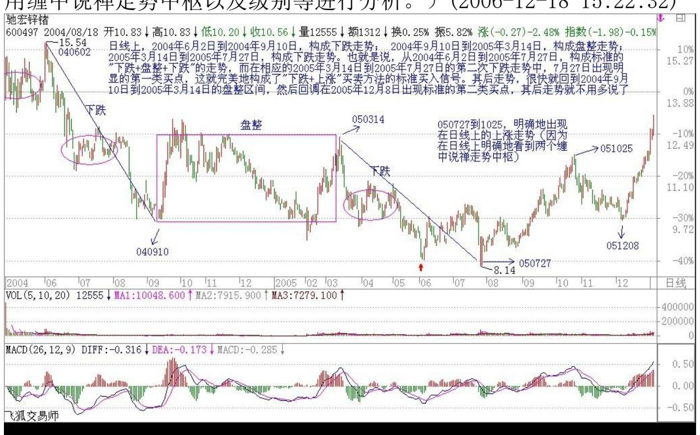
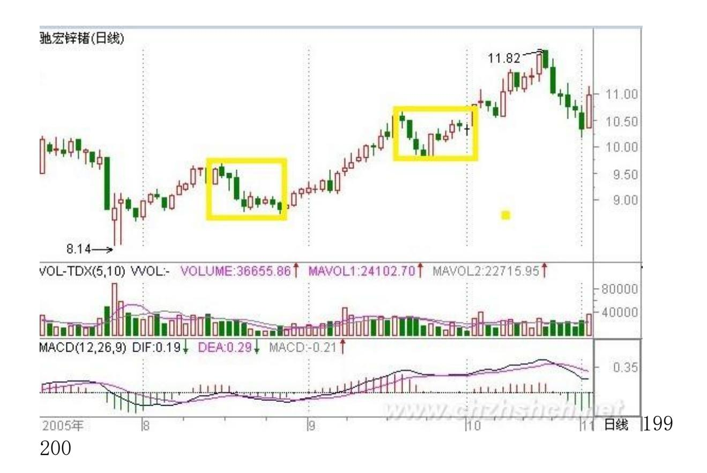
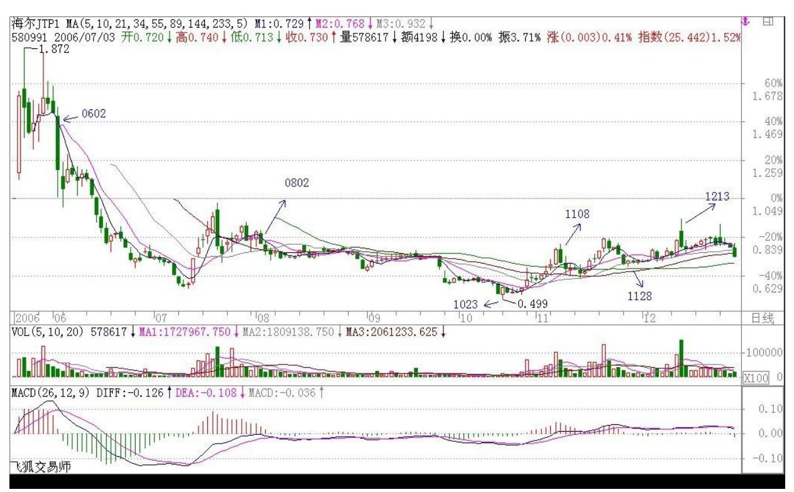
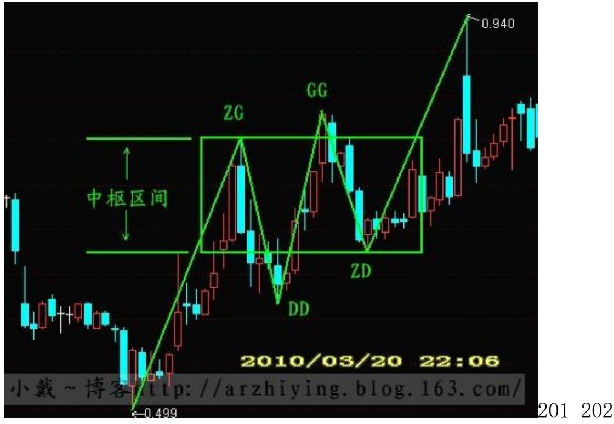
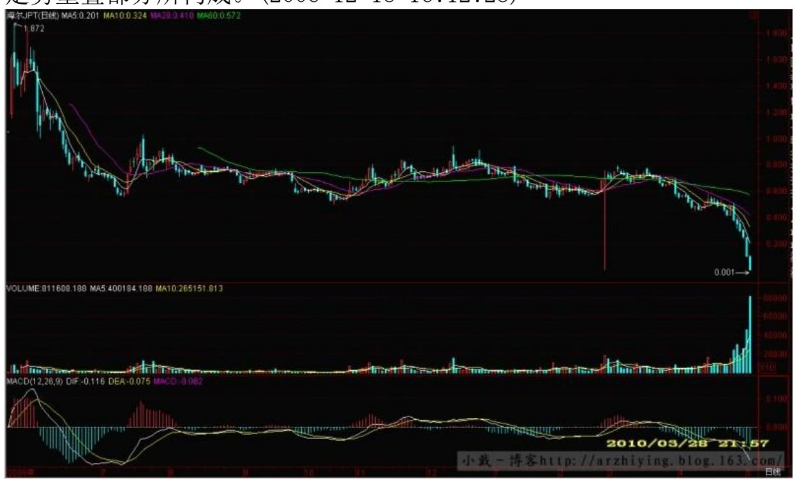
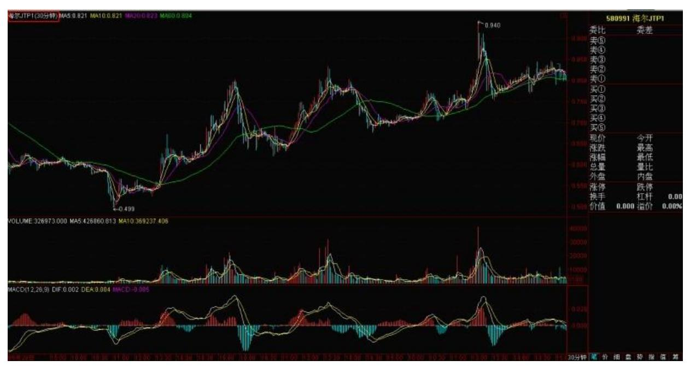
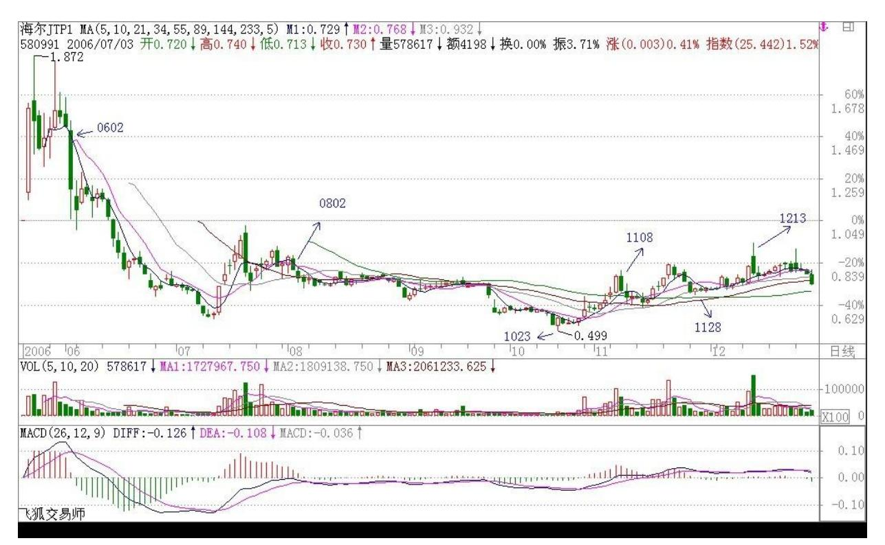
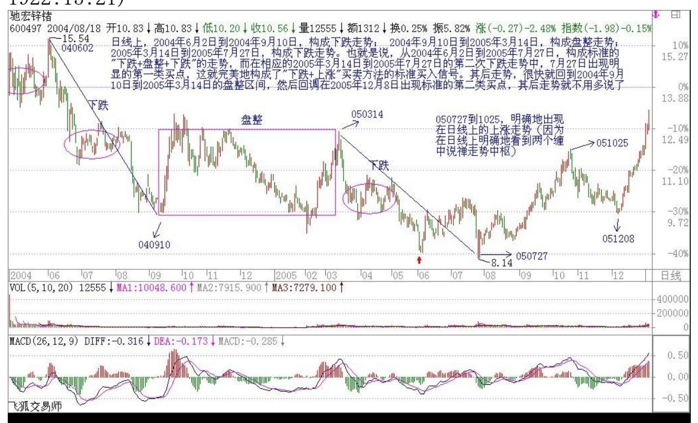
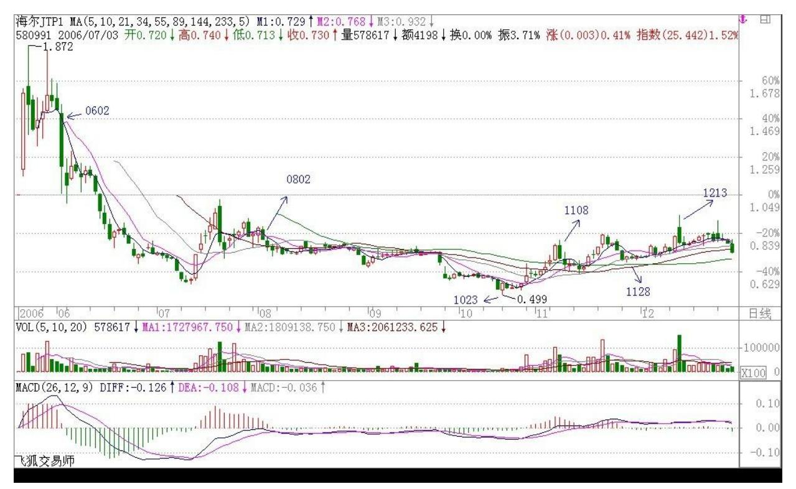

# 教你炒股票 17:走势终完美

(2006 年 12 月 18)任何级别的所有走势,都能分解成趋势与盘整两 类,而趋势又分为上涨与下跌两类。以上结论,不是从天而降的,而 是从无数图形的分析实践中总结出来的,正如《论语》所说"由诲 女,知之乎!知之为,知之;不知为,不知;是知也。" (请看本 ID 相应系列的解释。娇注:孔子说:实践教导你,以此而有智慧啊。 依智慧而进一步实践,以此而有新的智慧;不依以实践而有的智慧进 一步实践,就不会有新的智慧。这,就是最根本的智慧)这个从实际 图形中总结出来的简单经验,却是一切有关技术分析理论的唯一坚实 基础。这个基础,所有接触技术分析的人都知道,但可惜没有人能深 究下去,然后就沉入技术指标、交易系统等苦海不能自拔。试想,基 础都没搞清楚,又有什么可立起来?而基础稳固了,技术指标、交易 系统等都是小儿科了。

由上可得到"缠中说禅技术分析基本原理一" :任何级别的任何走势 类型终要完成。后面一句用更简练的话,就是"走势终完美" 。这个 原理的重要性在于把实践中总结出来的、很难实用的、静态的"所有 级别的走势都能分解成趋势与盘整" ,转化成动态的、可以实用的 "走势类型终要完成" ,这就是论语所说的智慧:"所有级别的走势 都能分解成趋势与盘整"是"不患"的,是无位次的,而"走势类型 终要完成" 的"走势终完美"以"所有级别的走势都能分解成趋势与 盘整"的无位次而位次之,而"患"之。

因为在实际操作中,面对是都是鲜活的、当下的,而正如《论语》所 说的,"由知、德者,鲜矣!"(娇注-孔子说:蹈行、践履"闻、 见、学、行""圣人之道"智慧、所得的君子,永远处在创新、创造 之中啊)必须直面这种当下、鲜活,才能创造。而在任何一个走势的当 下,无论前面是盘整还是趋势,都有一个两难的问题:究竟是继续延 续还是改变。例如,原来是在一个趋势中,该趋势是否延续还是改变 成相反的趋势或盘整,这样的问题在当下的层次上永远是"不患" 的,无位次的。任何宣称自己能解决这个两难问题的,就如同在地球 上宣称自己不受地球引力影响一样无效,这是任何面对技术图形的人 都必须时刻牢记的。但这个两难的"不患",在"所有级别的走势都 能分解成趋势与盘整"的"不患"下,又成了其"患" ,就因此可以 位次。

195 走势终完美 (该问题的理解,可以参考本 ID 关于《论语》相关 章节的解释。娇注:不患" ,无位次;"患" ,以不患"的"无位 次"而"位次" 。

何谓"位"?就是指变化的位次。例如《易经》乾卦,从"初九"到 "上九" ,就是不同的位次,对应着变化的不同状态)。

正因为当下的走势是两难的,也就是在不完美到完美的动态过程中, 这就构成了其"不患"而位次的基础。"走势终完美" ,而走势"不 患"地可以分解成趋势与盘整,换言之,"趋势终完美,盘整也终完 美"。

"走势终完美"这句话有两个不可分割的方面:任何走势,无论是趋 势还是盘整,在图形上最终都要完成。另一方面,一旦某种类型的走 势完成以后,就会转化为其他类型的走势,这就是"不患"而有其位 次。在技术分析里,不同的位次构成不同的走势类型,各种位次以无 位次而位次。而如何在不同位次之间的灵活运动,是实际操作中最困 难的部分,也是技术分析最核心的问题之一。

为了深入研究这复杂问题,必须先引入缠中说禅走势中枢的概念:某 级别走势类型中,被至少三个连续次级别走势类型所重叠的部分,称 为缠中说禅走势中枢。换言之,缠中说禅走势中枢就是至少三个连续 次级别走势类型重叠部分所构成。这里有一个递归的问题,就是这次 级别不能无限下去,就像有些半吊子哲学胡诌什么"一分为二",而 "分"不是无限的,按照量子力学,物质之分是有极限的,同样,级 别之次也不可能无限,在实际之中,对最后不能分解的级别,其缠中 说禅走势中枢就不能用"至少三个连续次级别走势类型所重叠"定 义,而定义为至少三个该级别单位 K 线重叠部分。一般来说,对实际 操作,都把这最低的不可分解级别设定为 1 分钟或 5 分钟线,当 然,也可以设定为 1 秒种线,但这都没有太大区别。

有了上面的定义,就可以在任何一个级别的走势中找到"缠中说禅走 势中枢" 。有了该中枢,就可以给"盘整" 、"趋势"给出一个最 精确的定义:缠中说禅盘整:在任何级别的任何走势中,某完成的走 势类型只包含一个缠中说禅走势中枢,就称为该级别的缠中说禅盘 整。

缠中说禅趋势:在任何级别的任何走势中,某完成的走势类型至少包 含两个以上依次同向的缠中说禅走势中枢,就称为该级别的缠中说禅 趋势。该方向向上就称为上涨,向下就称为下跌。

那么,是否可能在某级别存在这样的走势,不包含任何缠中说禅走势 中枢?这是不可能的。因为任何图形上的"向上+向下+向上"或"向 下+向上+向下" 都必然产生某一级别的缠中说禅走势中枢,没有缠中 说禅走势中枢的走势图只意味着在整张走势图形上只存在两个可能, 就是一次向下后永远向上,或者一次向上后永远向下。要出现这两种 情况,该交易品种必然在一定时期交易后永远被取消交易,而这里探 讨走势的一般情况,其前提就是该走势可以196 不断延续下去,不存 在永远取消交易的情况,所以,相应有:"缠中说禅技术分析基本原 理二":任何级别任何完成的走势类型,必然包含一个以上的缠中说 禅走势中枢。

由原理一、二以及缠中说禅走势中枢的定义,就可以严格证明:"缠 中说禅走势分解定理一":任何级别的任何走势,都可以分解成同级 别"盘整"、"下跌"与"上涨"三种走势类型的连接。

"缠中说禅走势分解定理二":任何级别的任何走势类型,都至少由 三段以上次级别走势类型构成。

这些证明都很简单,就和初中几何的证明一样,有兴趣自己来一下。 由上面的原理和定理,就可以严格地给出具体操作唯一可以依赖的两 个坚实的基础。因为某种类型的走势完成以后就会转化为其他类型的 走势,对于下跌的走势来说,一旦完成,只能转化为上涨与盘整,因 此,一旦能把握下跌走势转化的关节点买入,就在市场中占据了一个 最有利的位置,而这个买点,就是前面反复强调的"第一类买点"; 而因为无论是趋势还是盘整在图形上最终都要完成,所以在第一类买 点出现后第一次次级别回调制造的低点,是市场中第二有利的位置, 为什么?因为上涨和盘整必然要在图形上完成,而上涨和盘整在图形 上的要求,是必须包含三个以上的次级别运动,因此后面必须还至少 有一个向上的次级别运动,这样的买点是绝对安全的,其安全性由走 势的"不患"而保证,这,就是在前面反复强调的第二类买点。买点 的情况说了,卖点的情况反之亦然。

综上所述,就不难明白为什么本 ID 在前面反复强调这两类买卖点 了。因为该两类买卖点是被最基础的分析所严格保证的,就如同几何 中严格定理一样,只要找准了这两类买卖点,在市场的实际走势中是 战无不胜的,是波涛汹涌的市场中最坚实的港湾。关于该两类买卖点 与走势及上述原理、定理间密不可破的逻辑关系,必须切实理解体 会,这是所有操作中最坚实、最不能混淆的基础。

由上面的原理、定理,就可以继续证明前面已经说过的"缠中说禅买 卖点定律一" :任何级别的第二类买卖点都由次级别相应走势的第一 类买点构成。

这样,就像前面曾说过的,任何由第一、二类买卖点构成的缠中说禅 买卖点,都可以归结到不同级别的第一类买卖点。由此得到"缠中说 禅趋势转折定律" :任何级别的上涨转折都是由某级别的第一类卖点 构成的;任何的下跌转折都是由某级别的第一类买点构成的。

197 注意,这某级别不一定是次级别,因为次级别里可以是第二类买 卖点,而且还有这种情况,就是不同级别同时出现第一类买卖点,也 就是出现不同级别的同步共振,所以这里只说是某级别。

本 ID 以上对技术分析的理论构建,绝对前无古人,就像欧几里德之 于几何一样。这是为纷繁的技术分析找到了一个坚实的理论基础,由 这些原理、定理,可以继续引申出不同的定理,就像几何里面一样。 这些定理,都是抛开一切偶然因数的,而实际的操作,必须建立在此 之上,才会长期立于不败之地。

这些问题以后还要逐步展开,这里先把两个前面已经让各位思考例子 来分析一下,让各位对趋势、级别、走势中枢等概念有一个感性的认 识,毕竟上面抽象的方法并不是每个人都能理解的:驰宏锌锗:为什 么从 2004 年 6 月 2 日到 2005 年7 月 27 日,构成标准的"下跌 +盘整+下跌"的走势,而类似的图形在 580991 上不算,这唯一的原 因就是因为后者在日线的下跌中并不构成日线级别的缠中说禅走势中 枢,而在 30 分钟线上,这个中枢是明确的。所以 580991 只构成 30 分钟级别上的"下跌+盘整+下跌" 。

其后的上涨,对 600497 驰宏锌锗,2005 年 7 月 27日到 10 月 25 日,明确地出现在日线上的上涨走势(为什么?因为在日线上明确地 看到两个缠中说禅走势中枢)。而 580991 从 2006 年 10 月 23 日 到 12月 13 日,只构成日线上的盘整走势(为什么?因为在日线上明 确地看到一个缠中说禅走势中枢)。

两者力度上有如此区别的技术上的原因就是上面两个:一、"下跌+盘 整+下跌"走势的出现级别不同,一个是日线,一个是 30 分钟的。 二、其后的第一段走势,一个是日线上涨,一个是日线盘整。

以上内容,足够各位消化几天了。后面还有很多内容,逐一写来。但 请注意版权,发现抄袭的本 ID 要抓来狗头铡给铡了。

最后布置几条思考题:1、 连接两相邻同级别缠中说禅走势中枢的一 定是趋势吗?一定是次级别的趋势吗?198 2、 背驰是两相邻同向趋 势间,后者比前者的走势力度减弱所造成的,如果用均线或 MACD 等 判断其力度,一定要在同级别的图上吗?同级别的 MACD 红绿柱子背 驰一定反映某级别趋势间出现背驰吗?是相应级别的趋势出现背驰 吗?3、 盘整的高低点是如何造成的。(这个问题有点难度,提示, 用缠中说禅走势中枢以及级别等进行分析。)(2006-12-18 15:22:32)

解盘及互动问答:\*\*\*\*\*\*\*\*\*\*\*\*\*\*\*\*\*\*\*\*缠师:再布置一个作业(分 析具体的股票):请分析一下北辰实业 12 月 7 日以来走势的具体级 别、走势类型。(2006-12-18 15:26:28)

#### \*\*\*\*\*\*\*\*\*\*\*\*\*\*\*\*\*\*\*\*。

1. 网友[匿名] 中间体:缠姐,给举个例讲一下吧,什么样叫重叠? 2006-12-18 15:23:32缠师:权证 580991 从 11 月 8 日到 11 月 28 日,三个次级趋势构成的日线中枢 。(2006-12-1815:27:52)

#### \*\*\*\*\*\*\*\*\*\*\*\*\*\*\*\*\*\*\*\*。

2. 网友[匿名] 小小:请问禅姐,600519 在 10 上位第二次缠绕后, 8 月 7 日形成背弛,那第一个问题:10 上位的第一次缠绕是 7 月 4 日还是 7 月 24日?第二,10 上位的第一次缠绕是那一天结束的?这 两个问题是我最湖涂的了。请禅姐给说明一下。我一直坐在这里等你! 2006-12-18 15:34:29缠师:用均线或 MACD 看背驰都是辅助性的,都 不是最重要的。最重要的是把今天的搞清楚,这是最重要的。关于背 驰相关的问题,本 ID 后面会继续说的。

先把逻辑关系搞清楚:走势-级别-趋势-前后趋势比较-背驰-用均线等 辅助判断背驰。所以,先把前面搞清楚,别困在一些某节上,前面明 白了,后面自然清楚。难道没有均线、没有 MACD 就判断不了背驰? 显然不是。那只是辅助。(2006-12-18 15:47:11) 各位好好研究吧, 真明白了,终身受用。如果你希望知道什么黑马股之类的,这里没 有。300 只成分股,牛市结束后一看,都是黑马。牛市里有什么黑 马?都是黑马,还用找吗?关键是你是否有持有的信心。牛市炒股票 还用这么费心?前面本 ID 已经多次说过,牛市首先要灭的就是熊市 心态,有时间先把基础搞好吧。

本 ID 这里不帮任何人。你们个个是佛,本 ID 能帮个什么忙啊?别 憋屈自己了。(2006-12-18 15:55:14) 204

#### \*\*\*\*\*\*\*\*\*\*\*\*\*\*\*\*\*\*\*\*。

3. 网友[匿名] 中间体:缠姐,我知道今天一课很重要,你能否具体 讲一讲,三个次级趋势如何构成的日线中枢? 我用 60 分钟、30 分 钟、15 分钟图对比,看不出什么名堂啊。 麻烦了,碰到如此笨的学 生。

缠师:这不是最简单的事情吗?三段走势,不正好构成一个重叠吗? 区间就在 0.677 与 0.803 之间,构成中枢。(2006-12-18 15:58:21)

#### \*\*\*\*\*\*\*\*\*\*\*\*\*\*\*\*\*\*\*\*。

4. 网友[匿名] 游客:"中枢"的概念还是不清楚。烦请解惑。请 教:"某级别类型走势中,被至少三个连续次级别类型走势所重叠的 部分。"比如是指周线、日线、小时线的 K 线重叠吗?2006-12- 1816:05:12缠师:不是几条 K 线的重叠,是至少三个连续次级别类型 走势重叠部分所构成。(2006-12-18 16:12:28)

205 206 207 5. 网友[匿名] 中间体:这不是最简单的事情吗?三段 走势,不正好构成一个重叠吗?区间就在0.677 与 0.803 之间,构成 中枢。请讲明,从哪到哪是一段,哪三段?2006-12-18 16:07:26缠 师:这么简单的问题自己去思考,本 ID 回答你是害了你,你就不思 考了。那几天,在图上就这下、上、下的三段,这还用本 ID 说吗? (2006-12-1816:13:59)

#### \*\*\*\*\*\*\*\*\*\*\*\*\*\*\*\*\*\*\*\*。

6. 网友[匿名] 心禅:禅主,601588(北辰实业)作业提交。从其 30 分钟图上看,12 月 7 日-12 月 12日为下跌,12 日-18 日 13:00 为盘整期,今天下午上涨。是一个标准的"下跌+盘整+上涨"。禅 主,我也判断它周一会结束盘整。可我按"下跌+盘整+下跌"原则考 虑,判断它今天会再次下探,为什么会错?请指正。2006-12-18 16:03:56缠师:谁告诉你?股票一定要走出"下跌+盘整+下跌"的? 基本概念要搞清楚。(2006-12-18 16:14:59)

#### \*\*\*\*\*\*\*\*\*\*\*\*\*\*\*\*\*\*\*\*。

缠师:以后要本 ID 直接告诉答案的,本 ID 一律不回答。回答是害 了各位。各位必须先思考,把自己的答案找出来,本 ID 来给各位评 判,这样才有助于各位。(2006-12-18 16:16:54)

7. 网友[匿名] 一剑:缠姐,和你探讨《货币战争和人民币策略》一 文。我认为目前中国经济高度依赖美国消费市场,大量顺差间接享用 美国经济虚拟化所带来的好处,所以在目前应该配合美圆贬值战略, 以继续保持美国经济体系运转,所以第一买入点应该在未来而不是现 在。请赐教!2006-12-18 16:16:17缠师:2005 年 7 月前,人民币和 美圆直接挂钩,就成了双核,对世界其他体系进行盘剥,中国借机长 大,如藤绕树一般。而现在,是美国对所有人的盘剥,中国现在刚进 入破位之中,把一个好好的"上涨+盘整+上涨"弄成"上涨+盘整+下 跌" ,这时候还谈什么第一类买点?鼻子都给人牵着走了。 另外, 少用什么配合的说法,中国人凭什么要配合美国。中国对美国只有两 种:一种叫利用,一种叫被利用。可惜现在是被利用了,一群大傻 瓜!(2006-12-18 16:24:54)

#### \*\*\*\*\*\*\*\*\*\*\*\*\*\*\*\*\*\*\*\*。

8. 网友[匿名]中间体:谢谢!其实,我们是没理解缠姐的表达, 这 个"重叠"到底是什么?怎样就是重叠?我们不理解啊。2006-12-18 16:18:34网友[匿名]求知: "中枢"的概念太重要了,也太抽象了, 本人愚笨,还请结合例子细致一点解释。2006-12-18 16:18:38缠师: 这不是最简单的问题吗?A 段经过 8 元到 18元,B 段经过 18 元到 12 元,C 段经过 12 元到 24元,你说这 ABC 三段的重叠部分在什么 地方?如果这都回答不出来,本 ID 也没办法了,因为这是幼儿园的 小朋友都能回答的。(2006-12-18 16:27:44)

#### \*\*\*\*\*\*\*\*\*\*\*\*\*\*\*\*\*\*\*\*。

缠师:各位把下面这个定义好好读读。缠中说禅走势中枢的概念:某 级别类型走势中,被至少三个连续次级别类型走势所重叠的部分,称 为缠中说禅走势中枢。换言之,缠中说禅走势中枢就是至少三个连续 次级别类型走势重叠部分所构成。

关键是这几词:三个、连续、次级别、重叠。例子,580991:在 11 月 8 日到 11 月 28 日,构成 0.677元到 0.803 元的中枢。一看就 明白,看图明白才是真明白。(2006-12-18 16:34:32)

9. 网友[匿名] 如:当下最紧要的一个问题,望不吝赐教。关于在上 一课中提到的,如何判断盘整后的图形将会是上涨还是下跌? 能否说 明?209 目前股市,相当多的个股正是"上涨+盘整"的走势,或者是 "上涨+下跌+盘整"的走势。而如何判明这盘整之后的走势?还有, 如何判断什么是有效突破?这都成了我目前的当务之急。 烦请缠 mm 详细说明。不胜感激。2006-12-18 16:30:03缠师:你看到本 ID 文中 的作业没有?"3、 盘整的高低点是如何造成的。" (这个问题有点 难度,提示,用缠中说禅走势中枢以及级别等进行分析。)把这个问 题回答出来了,就能解决你的问题。【娇注:盘整维持需次级别离开 次级别返回(或者次以下级别)。若次级别离开,次级别回抽不返回 中枢,即突破盘整,也就是 3 买。】(2006-12-18 16:36:15)

#### \*\*\*\*\*\*\*\*\*\*\*\*\*\*\*\*\*\*\*\*。

10. 网友[匿名] 巴索林:一直在看缠 mm 的文章,觉得缠 mm 的思想 既有广度又有深度,思维严谨,逻辑性强,而且文章诙谐、幽默。令 我辈从中获益不少。

对缠 mm 有教无类,诲人不倦的精神深感敬意和感谢。但心中有一疑 惑,在此顺便问问缠 mm,望解答。

既然高手无论在牛市还是熊市都能在股市提款,为什么缠 mm2001 年-2005 年却不看一眼股票呢?是否像你这样的高手也要回避熊市 呢?那么职业股民在熊市中岂不要转行了?2006-12-18 16:00:26缠 师:本 ID 又不等钱花,为什么要花精力在熊市里忙?有技术,熊市 一样挣钱,这没错,但这种钱本 ID早没兴趣了。人生有很多事情可以 干,关键是要明白当下最值得干什么。有大牛市,本 ID 当然不会错 过,那种破熊市里的破行情,值得本 ID 去浪费时间吗?(2006-12-18 16:41:19) 本 ID 十分理解各位急着挣钱的心理,但这种心理本来就 是市场参与者的大忌,连自己的心都控制不住,对自己的贪婪、欲望 都不能控制,是不能在市场中长久成功的。心态平和点,焦躁没有智 慧。(2006-12-18 16:48:43)

#### \*\*\*\*\*\*\*\*\*\*\*\*\*\*\*\*\*\*\*\*。

11. 网友[匿名] 一剑:"2005 年 7 月前,人民币和美圆直接挂钩, 就成了双核,对世界其他体系进行盘剥,中国借机长大,如藤绕树一 般。而现在,是美国对所有人的盘剥,中国现在刚进入破位之中,把

一个好好的"上涨+盘整+上涨"弄成"上涨+盘整+下跌" ,这时候还 谈什么第一类买点?鼻子都给人牵着走了。"就好象两个壮女人去逛 面首店,面首店只有一个快被榨干了的小面首,两个壮女人如何盘剥 啊?只怕落个整个面首店崩盘,所以现在只好让美国这个壮女人先盘 剥,我们先听听声音,否则美国这个壮女人没有面首活不下去了,我 们也无法从她身上吸油了,连个淫声都听不见了?缠师:不对。而是 一个大蛋糕,美国人习惯性占全份的,习惯性分蛋糕,而某些蠢人或 别有用心者有意无意地顺着美国人去了。中国的事情其实一直很简 单,不是蠢人太多,而是汉奸太多。(2006-12-1816:56:38)缠师:各 位知道为什么智慧难得吗?就因为偷心不死,整天想着捷径,想着一 夜暴富。你看看真正成功的人,有哪个是靠中彩票的?要在市场上成 功,首先要把这偷心给废了,否则学什么都没用,一到场上就犯糊 涂,然后就后悔、自责,然后又继续犯糊涂。道理是死的,用的是 人,人没道理,什么道理都没用。

没错,本 ID 可以告诉你消息,让你买所谓的黑马,但就算让你买 了,你可能也守不住。你回头看看,有多少黑马是你曾经买过的,如 果都留到现在,你还用找黑马吗?别说找不到黑马,而是好好想想, 为什么黑马都避着自己。(2006-12-18 17:06:54) 各位,请把那四个 作业好好想想吧,如果真想学点什么。先下,再见。(2006-12-18 17:09:28)

#### \*\*\*\*\*\*\*\*\*\*\*\*\*\*\*\*\*\*\*\*。

缠师:各位不要光问股票的问题,论语等其他问题都可以在这里交流 的。本 ID 就不喜欢把什么都搞成一种颜色。(2006-12-19 11:59:51) 那几个作业请各位认真思考,一定要多从中枢的概念出发,因为有了 中枢的概念,盘整、趋势都没包含其中的,那是比盘整、趋势更基本 的概念。(2006-12-19 12:12:29) 关于第四个作业,可以换一个提 法。对北辰,本 ID曾说会强力反抽,前两天还有人质疑本 ID 怎么反 抽还不出现。不知道这两天的反抽算不算强力了。强不强力且不说, 关键各位要把知识学到。

用走势终完美的逻辑关系在相应走势级别中说明这两天北辰走势的必 然性。注意,这里只是研究学习之中,没人叫你现在还去追高。其 实,如果你真学明白了,这种机会根本不用咨询本 ID,自己就可以把 握。

#### \*\*\*\*\*\*\*\*\*\*\*\*\*\*\*\*\*\*\*\*。

211 12. 网友[匿名] 学习:试着回答"盘整的高低点如何形成?"这 个问题。根据盘整的定义:盘整的高点:连续三个次级别中最低一个 级别的下跌趋势背离后,第一个上涨趋势的走完为高点。反之为低 点。请指正。2006-12-19 12:02:26缠师:什么叫走完,不要用模糊的 概念来思考问题,要分类清楚、逻辑明确、系统才可以。提示,从缠 中说禅中枢入手。(2006-12-19 12:23:12) 缠师回答网友[匿名] 戈石 的问题:你思考的入口是对的,就是要从缠中说禅中枢出发,但每道 题都没有把特例思考好,一种特殊的情况往往是操作中最大的敌人, 而能否把所有特殊的情况都思考到,这是很关键的地方。

请继续努力,多给自己出点难题,把所有你现在回答不能包含的特殊 情况都思考一下。(2006-12-1912:35:38)

#### \*\*\*\*\*\*\*\*\*\*\*\*\*\*\*\*\*\*\*\*。

13. 网友 [匿名] 快:LZ,大盘还会出现类似今年7、8 月份的那种走 势吗?2006-12-19 12:36:33缠师:当然会出现,只是时间长短的问 题。上次是大的平台型,这次很可能就是锯齿型,走出三角形的可能 性不是没有,但小一点了。不过,真正调整的出现必须把这次突破历 史高位所产生的惯性耗尽。由于年尾基金做业绩的因素的影响,而 且,现在基金的业绩和新募集的关系太大,成了一种营销手段,所以 大盘因此的影响不可小视。(2006-12-19 12:45:36)

#### \*\*\*\*\*\*\*\*\*\*\*\*\*\*\*\*\*\*\*\*。

14. 网友[匿名] nn:先报到,再仔细学习。谢啦!请问楼主,《易 经》能否与《论语》同时穿插着解啊?股票倒是可以少一点。非常期 待你的易经开讲喔。

2006-12-19 12:39:42缠师:真明白《论语》的,自然就明白《易经》 了。

(2006-12-19 12:46:40) 15. 网友[匿名] 小溪:缠JJ 您好!辛苦 了!我的 600196 都有 5 个重叠了,那叫什么呢?那也叫一个走势中 枢吗? 2006-12-1912:40:20212 缠师:什么叫至少?如果一万年在一 个区间里,那还是一个中枢。(2006-12-19 12:48:27)

#### \*\*\*\*\*\*\*\*\*\*\*\*\*\*\*\*\*\*\*\*。

16. 网友[匿名] 快:看来不该问!另:央视二套的《大国崛起》,数 女以为如何?2006-12-19 12:44:25缠师:应景之作。(2006-12-19 12:49:18)

#### \*\*\*\*\*\*\*\*\*\*\*\*\*\*\*\*\*\*\*\*。

17. 网友[匿名] 心禅:禅主,中午好!昨晚上反复学习了你多次重复 的"被至少三个连续次级别类型走势所重叠的部分,称为缠中说禅走 势中枢。",终于找到并明白 0.607-0.803 重叠形成的中枢了,就是 "下跌+上涨+下跌"趋势形成的最高低点之间线段的重叠,对否?一 个中枢后的走势就是"盘整" ,二个向上的中枢后走势就是"上涨" ,二个向下的后的走势就是"下跌" ,对否?但是我对"向上或向下 中枢" 还没有辨别清楚!请指正!2006-12-19 12:49:05缠师:明白 就好。但一个中枢后的走势就是"盘整" ,是错的。先把决定论的思 维方式废掉才行。(2006-12-19 12:51:37)

#### \*\*\*\*\*\*\*\*\*\*\*\*\*\*\*\*\*\*\*\*。

18. 网友[匿名] 中间体:缠姐,走势中枢是在次级别中发生的,那么 它的计数的第一段走势,是不是一定要与主级别相反呢?2006-12-19 12:51:04缠师:为什么一定要相反呢?如果在盘整里,怎么相反? (2006-12-19 12:53:31)

#### \*\*\*\*\*\*\*\*\*\*\*\*\*\*\*\*\*\*\*\*。

19. 网友 yahwang:前几天问的问题,可能楼主没看到。现在问楼主 另一问题。半仓操作,始终做日内差,可行性大吗?按你所了解的对 于坐庄户来说,日内差价所得能构成最后收益的多大比例?2006-12- 1912:52:31213 缠师:资金量不大是可能的,盘整时间越长,成本越 低。盘整是用来降低自己成本的,抬高别人成本的。有空教各位坐 庄。开盘,先下。(2006-12-1912:57:05)

20. 网友[匿名] 想飞:LZ,下午好!请教一个问题,上证指数(周 线)自 2005/6/10 见底后,第一个走势中枢是 1077-1213 点,第二 个走势中枢是 1520-1747点,到目前是一个上升趋势。对吗?我对第 二个走势中枢的判断还不肯定。感觉又象盘整。因为它和昨天讲的 580991(日线)走势很像,但因为该段图形在日线上是盘整,故判断 周线上,该段应为原趋势的一段。不知这样想是否正确?2006-12-19 15:09:25缠师:上证指数周线见底后,根本连一个中枢都没形成。因 为都没有形成典型的日线级别连续三类型走势的重叠,那些都只是日 线级别的中枢。这个意味着什么?意味着目前在周线级别上,只是一 个大的走势类型的第一段,也和本 ID 一直强调的牛市第一波的判断 是一致的。(2006-12-19 21:24:03)

#### \*\*\*\*\*\*\*\*\*\*\*\*\*\*\*\*\*\*\*\*。

21. 网友[匿名] 缠禅:禅 mm,走势、走势类型和趋势之间有什么区 别?这两个概念不太理解。2006-12-19 20:57:02缠师:这应该是很清 楚的。走势类型三种:上涨、下跌、盘整。上涨、下跌合起来叫趋 势。(2006-12-1921:25:45)

#### \*\*\*\*\*\*\*\*\*\*\*\*\*\*\*\*\*\*\*\*。

22. 网友[匿名] 南海明镜:某级别类型走势中,被至少三个连续次级 别类型走势所重叠的部分,称为缠中说禅走势中枢。请问禅mm:是 "某级别,类型走势中"还是"某级别类型,走势中"呢?请恕愚 钝。

2006-12-19 17:04:48缠师: "某级别,类型走势中" ,本 ID 这里 有点笔误,"类型走势"应该写成"走势类型" 。(2006-12-19 21:27:49)

#### \*\*\*\*\*\*\*\*\*\*\*\*\*\*\*\*\*\*\*\*。

214 23. 网友[匿名] 中间体:【而类似的图形在580991 上不算,这 唯一的原因就是因为后者在日线的下跌中并不构成日线级别的缠中说 禅走势中枢,而在30 分钟线上,这个中枢是明确的。所以 580991 只 构成 30 分钟级别上的"下跌+盘整+下跌" 。】2006/7/14- 2006/7/28 有一个走势中枢,但没有第二个。这与"走势终完美"不

是矛盾的吗? 2006-12-1916:30:15缠师:谁告诉你走势中枢一定要两 个的,盘整有多少个?(2006-12-19 21:31:56)

#### \*\*\*\*\*\*\*\*\*\*\*\*\*\*\*\*\*\*\*\*。

24. 网友[匿名] 管他是谁:不知道先生何时开讲东西方绘画、雕塑艺 术,比如东方寺院壁画与西方教堂壁画、魏晋南北朝的雕塑与欧州中 世纪雕刻及东西方美术发展史?看了看分类还差了一块。2006-12- 1919:19:49缠师:先把这股票的无头债给还了再说吧。(2006-12-19 21:34:06)

#### \*\*\*\*\*\*\*\*\*\*\*\*\*\*\*\*\*\*\*\*。

25. 网友[匿名] 在路上:缠中说禅的定理还是比较明确的。只是有一 点,让我们还陷入无尽的糊涂中。那就是趋势与盘整的划分,只要这 两个概念完全清楚明白后,其它的级别、背驰等也就顺理成章,只差 一点啊。缠姐说 580991 日线图上从 6 月 2 日至 10 月23 日不是一 个完整的"下跌+盘整+下跌" ,只有在30 分钟图上才是,然后又说 11 月 8 日至 11 月 28日是三个连续次级别类型走势所重叠的部分, 称为缠中说禅走势中枢,这个理解了。

但问题又来了,10月23日至11月8日那次,又是什么趋势呢? 和这个中枢是什么关系?11月28日之后至今又是什么趋势呢?是 不是因为只有一个中枢的存在,而把10月23日至今天的走势都当 成盘整了呢?那如果明天以后一直上涨而形成第二个中枢,那这第二 个中枢的起点从哪算起呢?从11月28日那天?为什么10月23 日至11月8日不计入三个连续次级别类型走势?有谁知道?请告诉 我吧。

在缠姐这里,很需要智慧啊。没有标准的图可参考,没有图标明每一 个点,好让我们去理解。然后去理解全部,那怕是只一张也好啊。可 惜的是,每个股票的例子都有让人不明白之处。2006-12-19 21:33:25 缠师:你的问题在于把"下跌+盘整+下跌"和"下跌"搞混了。 580991,从上市到 10 月 23 日,在日线上构成"下跌"走势,其后 是一个未完成的走势类型,暂时只构成一个中枢。而在 30 分钟线 上,6 月

2 日至 10 月 23 日是典型的"下跌+盘整+下跌" ,是三种完成的走 势类型的连接,好好把这里面的区别理解了,才算有点真明白。 (2006-12-19 21:43:03) 216 217 26. 网友[匿名] 炼铁设备:"缠中 说禅走势中枢"是否就是中期趋势?2006-12-19 21:39:12缠师:毫无 关系。(2006-12-19 21:43:41)

#### \*\*\*\*\*\*\*\*\*\*\*\*\*\*\*\*\*\*\*\*。

27. 网友[匿名] 勇敢的心:请问老师:日线的次级别的类型是指 60 分钟的还是 30 分钟的走势?2006-12-19 21:53:57缠师:一般用 30 分钟。(2006-12-19 22:07:50)

#### \*\*\*\*\*\*\*\*\*\*\*\*\*\*\*\*\*\*\*\*。

28. 网友[匿名] 在路上:请问缠姐:580991在30分钟图上 6 月 2 日至 10 月 23 日的"下跌+盘整+下跌" ,第二个下跌是不是 从9月1日10:00低点之前的高点算起?2006-12-19 22:05:03缠 师:不是。8 月 2 日。(2006-12-19 22:09:38)

29. 网友[匿名] 想飞:"缠中说禅趋势:在任何级别的任何走势中, 某完成的走势类型至少包含两个以上依次同向的缠中说禅走势中枢, 就称为该级别的缠中说禅趋势。该方向向上就称为上涨,向下就称为 下跌。"LZ,这"两个以上依次同向的缠中说禅走势中枢"是否必须 是连续的?600497 日线2004/6/2-2004/9/13 似乎只有一个缠中说禅 走势中枢。即11.36-12.75 元,对吗?2006-12-19 22:04:43缠师:当 然要连续。是一个,但之前没有一个?加起来就是两个。一般人说下 跌都是从最高价说起,本 ID指那天开始就是顺着大家来。 (2006-12- 1922:15:21)

218 219 30. 网友[匿名] 无言:缠姐,我本来是明白的,越看越糊涂 了,跳过这节。请问怎么能在出现买/卖点时,就可以预判行情的力度 和幅度呢?何时开讲这课? 能不能先在这里给我一点启示?我再自己 看图体会。

谢谢! 2006-12-19 22:11:13缠师:你连基础的都不明白,还怎么能判 断力度?先把基础搞清楚,不清楚,越学越乱。17 这课,完全是标准 的数学书写法,就差完全用数学符号了。像学习几何一样去学,就学 会了。先下,两天后见,原因看外面的公告。再见。(2006-12-19 22:17:55)

缠师:这两天请好好复习一下下面的东西:走势:你打开走势图看到 的就是走势。走势分不同级别。

走势类型:上涨、下跌、盘整。

趋势:上涨、下跌。

缠中说禅走势中枢:某级别走势类型中,被至少三个连续次级别走势 类型所重叠的部分。

缠中说禅盘整:在任何级别的任何走势中,某完成的走势类型只包含 一个缠中说禅走势中枢,就称为该级别的缠中说禅盘整。

缠中说禅趋势:在任何级别的任何走势中,某完成的走势类型至少包 含两个以上依次同向的缠中说禅走势中枢,就称为该级别的缠中说禅 趋势。该方向向上就称为上涨,向下就称为下跌。

"缠中说禅技术分析基本原理一" :任何级别的任何走势类型终要完 成。

"缠中说禅技术分析基本原理二" :任何级别任何完成的走势类型, 必然包含一个以上的缠中说禅走势中枢。

220 "缠中说禅走势分解定理一":任何级别的任何走势,都可以分 解成同级别"盘整"、"下跌"与"上涨"三种走势类型的连接。

"缠中说禅走势分解定理二":任何级别的任何走势类型,都至少由 三段以上次级别走势类型构成。

(2006-12-19 22:01:00) 原来文章中,经常把"走势类型"与"类型 走势"混着用,其实是一回事,现在都统一为"走势类型" ,原文, 本 ID 也已相应修改了。

除了那四个作业,请再好好分析这个例子:580991,从上市到 10 月 23 日,在日线上构成"下跌"走势,其后是一个未完成的走势类型, 暂时只构成一个中枢。

而在 30 分钟线上,6 月 2 日至 10 月 23 日是典型的"下跌+盘整 +下跌" ,是三种完成的走势类型的连接,好好把这里面的区别理 解,才算有点真明白。

(2006-12-19 22:04:51)221 222 31. 网友 [匿名] 职业轿夫:牛!lz 姐姐讲故事吧。等了两天了。2006-12-22 15:59:42缠师:你想听故事 还是看直播?故事本 ID 没有,本ID 只有直播的。(2006-12-22 16:01:22)

#### \*\*\*\*\*\*\*\*\*\*\*\*\*\*\*\*\*\*\*\*。

32. 网友[匿名] 昨夜:既然是全球第一博客,那要不要出个多语种版 本?另外,看看是否应该和联合国、世贸等组织做个互相链接?以体 现本博客的全球地位。2006-12-22 16:00:02缠师:联合国、世贸只是 傻人打嘴仗的地方,谁爱去谁去。这里说论语,听音乐,偶尔也可以 直播点东西,爱干什么都可以。(2006-12-22 16:03:47) 本 ID什么都 没干过,什么药呀酒呀米呀的,都和本 ID 没关系,那只是本 ID 发

梦时说的梦话,如果现实中竟然兑现了,那只是巧合,别往本 ID 身 上扯,别给本ID 惹麻烦。当然,如果有人喜欢麻烦,本 ID 也不介 意,本 ID 最不怕的就是麻烦了。(2006-12-2216:08:29)

#### \*\*\*\*\*\*\*\*\*\*\*\*\*\*\*\*\*\*\*\*。

缠师:为了严肃这里的环境,别把这里搞成一个消息满天飞的地方, 使得各位无心学习真正的技术,以后本 ID 就少发梦了,过去的就过 去了。即使本ID 是最牛的人,也不能成为你的拐杖,必须自己站起 来。本ID 只希望看到各位自己站起来。(2006-12-2216:14:29) 好 了,以后都正常进行,明天音乐会,想听什么就说吧。(2006-12-22 16:27:40) 本 ID 要去腐败了,先下,再见。(2006-12-22 16:29:16) 最近上传的网站老有问题,经常连线不上,请各位耐心点,如果连不 上,就换个时间来听。

什么时候新浪也能上传音乐就好了,现在搞了个视频,容量太小。本 ID 原来想上传一部歌剧的,好象不行。(2006-12-23 15:26:21) 223 今天北京的天气很糟糕,但本 ID 窗外正有一群鸽子在飞,有 50 来 只,灰的白的各半,本 ID 看鸽子去了,各位有鸽子的就放鸽子,没 鸽子就放飞机吧。下了,再见。

(2006-12-23 15:30:37)

#### \*\*\*\*\*\*\*\*\*\*\*\*\*\*\*\*\*\*\*\*。

缠师:上周的作业,明天帖子里回答:1、 连接两相邻同级别缠中说 禅走势中枢的一定是趋势吗?一定是次级别的趋势吗?2、 背驰是两 相邻同向趋势间,后者比前者的走势力度减弱所造成的,如果用均线 或 MACD 等判断其力度,一定要在同级别的图上吗?同级别的 MACD 红绿柱子背驰一定反映某级别趋势间出现背驰吗?是相应级别的趋势 出现背驰吗?3、 盘整的高低点是如何造成的。(这个问题有点难 度,提示,用缠中说禅走势中枢以及级别等进行分析。)(2006-12-25 15:32:17)大盘的走势没什么说的,牛市第一阶段,涨成分股,这强调 过无数次了,别用自己的想象来想象牛市的顶部。再强调一次,现在 只不过是牛市的第一阶段。

(2006-12-25 15:37:17)

33. 网友[匿名] 小鸟:妹妹,上一集说到"不是智慧的真正所在" ,我还以为接下来会说到什么才是智慧的真正所在呢。不过,每天无 数遍地刷,终于把你刷出来了 2006-12-25 15:29:20缠师:以后都是 3 点以后,一般没什么特别的,3 点半前就有了。有工夫多点看股 票,读论语,听音乐。

(2006-12-25 15:39:06) 本 ID 先下了,有什么问题请放在这里,晚 上来回答。(2006-12-25 15:40:49) 224

#### \*\*\*\*\*\*\*\*\*\*\*\*\*\*\*\*\*\*\*\*。

34. 网友总书记:请问禅女:(1)在前面所说的"下跌+盘整+下 跌"法则中,如果前面是一个大的上涨,这在上一级别也构成了盘 整。这种情况该怎么分析啊?(2)你在前面分析个股的时候常用不同 级别的压力线,支持线来分析,这种技术你什么时候能教教我们啊? (3)你会解《道德经》吗?2006-12-2515:49:21缠师:(1)"下跌 +盘整+下跌"不算什么法则,只是一种比较有用的形态。高级别盘 整,低级别出现"下跌+盘整+下跌"的情况很常见,这就是一种技 术分析上最愿意见到的情况。不同级别综合一起,得到的结论更准 确。具体以后会说到的。(2)学会现在的,那些都很简单了。(3) 以后会的,把论语说了,然后是易经,还有中医,把这些说了,大概 能轮到它了。(2006-12-25 20:32:47)

#### \*\*\*\*\*\*\*\*\*\*\*\*\*\*\*\*\*\*\*\*。

35. 网友[匿名] 外科医生:可是深圳综指 K 线的确发生了背迟了 啊。对吗?2006-12-25 20:27:12缠师:首先把级别明确。站在日线的 角度,并没有什么背弛,因为根本就没有可比较的趋势。当然,在 5 分钟图上,你会找到不少背弛后调整的情况。

好好想想作业二:2、背驰是两相邻同向趋势间,后者比前者的走势力 度减弱所造成的,如果用均线或 MACD等判断其力度,一定要在同级别 的图上吗?同级别的MACD 红绿柱子背驰,一定反映某级别趋势间出现 背驰吗?是相应级别的趋势出现背驰吗?(2006-12-2520:36:19)

#### \*\*\*\*\*\*\*\*\*\*\*\*\*\*\*\*\*\*\*\*。

36. 网友[匿名] 古代:不过美国最无耻。泰国现在遭受"痛苦"与货 币升值过快有关。不知老师怎么看?2006-12-25 17:44:56缠师:美国

其实没什么无耻的。站在他自己的利益上,他干了应该干的,在国家 战略上,最好少用道德标准,因为这一点用处都没有。强者是干出来 的,不是道德出来的。(2006-12-25 20:39:52)

#### \*\*\*\*\*\*\*\*\*\*\*\*\*\*\*\*\*\*\*\*。

37. 网友[匿名] 中间体:缠姐, 问一个健康方面的问题,。吃醋对身 体有利吗 ?2006-12-25 17:53:33缠师:饮食关键是平衡,偏则病。 没有什么是无条件对身体有利的。但这些都不是究竟的,有其身,必 有其患。不从身的根源下手,都是没用的。修其身,必先明其心。心 不明,修也妄。(2006-12-25 20:46:31)

#### \*\*\*\*\*\*\*\*\*\*\*\*\*\*\*\*\*\*\*\*。

38. 网友 x 股者:单位 K 线的重叠,形成中枢,这些中枢构成的走 势,是这一级别图形上最小级别的走势;这些最小级别的走势形成的 中枢,构成的走势,是高一级别的。所以,一个特定级别的中枢和走 势构成了更高级别的中枢和走势;也就是说,中枢和走势,都是有其 自己特定级别的,都是要在其自身的级别中进行判定的。这个说法是 不是正确呢?请博主点拨一下。2006-12-25 17:40:57缠师:都错了。 站在纯理论的角度,是可以说低级别走势的积累、迭加构成高级别的 走势。但这里没有什么必然的规律。如果有,就可以用这些规律把市 场的走势给构造出来了,这显然是不对的。正因为如果,就不能从低 级别看起。分析图形,要从高看到低。低级别走势的意义,是在高级 别意义的彰显后才能彰显。(2006-12-25 20:54:10)

#### \*\*\*\*\*\*\*\*\*\*\*\*\*\*\*\*\*\*\*\*。

39. 网友 [匿名] 学习:Lz,你好!通过近一段的学习,整理一下思 路,不知对否,请指正。思路一:所谓趋势应包含两个以上的走势中 枢。那么在某一级别里,如果形成了"上涨中枢+盘整中枢+上涨中 枢",应该说就形成了这个级别里的一个趋势。正是因为有了趋势, 才能判断背弛,即第二个上涨与第一个上涨进行比较。

缠师:不要把"上涨+盘整+上涨"和单纯的"上涨" 混淆了。前者是 三个走势类型的连接构成,而后者是一个单纯的走势类型。

226 40. 网友 [匿名] 学习:思路二:如果在某一个级别里形成多次 缠绕且低点、高点不断抬高,那么只要在连续三个次级别里走势重 叠,就可以判断成是在某一个级别形成由多个上涨中枢构成的上涨趋 势。

2006-12-25 20:45:47缠师:有了中枢的定义后,就不用考虑什么高、 低点了,只要向上构成两个中枢就是上涨。

#### \*\*\*\*\*\*\*\*\*\*\*\*\*\*\*\*\*\*\*\*。

41. 网友 [匿名] 学习:思路三:根据走势终完美,是不是指每一个 级别里都要完成一个趋势。比如北辰实业(601588),其日线判断成 一个上涨中枢,其后至今的走势判断为一个盘整中枢,那么后面应该 再跟一个上涨中枢,这样判断对吗?有没有这样的走势呢?比如在 30 分钟走势形成一个"上涨+盘整+上涨" ,然后是一个盘整中枢,再连 接一个"下跌+盘整+下跌",而相应的日线里形成"上涨中枢+盘整中 枢+下跌中枢" 。假设是新股,在 30 分钟形成第一个"上涨+盘整 +上涨"前没有任何走势。这只是我的一个假想,但会不会有这样的可 能呢?缠师:盘整不是一种走势类型吗?为什么都一定要构成趋势?

#### \*\*\*\*\*\*\*\*\*\*\*\*\*\*\*\*\*\*\*\*。

42. 网友 [匿名] 学习:思路四:假设我现在看 30分钟图和 5 分钟 图来进行操作。5 分钟是我定为最低级别,那么 5 分钟图里形成一个 带吻的上涨(这里不考虑吻的形式即力度问题),随后连接一个同样 的下跌,再连接一个同样的上涨,这样是不是就可以判断成一个盘整 中枢呢?而在 30 分钟图里,同样是一个盘整中枢。如果成立,是不 是盘整的高、低点就是在这样的上涨和下跌中,由吻的前后比较产生 的背离所形成呢?缠师:如果 5 分钟是最低级别,按三个连续 5 分 钟K 线一旦有重叠,该重叠就可以构成中枢。不过一般都用 1 分钟当 最低级别的。(2006-12-25 21:02:01)

#### \*\*\*\*\*\*\*\*\*\*\*\*\*\*\*\*\*\*\*\*。

43. 网友[匿名] 东方红:在楼主看来,即使美国采取严厉的惩罚措施 逼人民币升值,中国照样无动于衷?可否考虑过升值对产业升级的促 进作用?2006-12-2517:25:32227 缠师:在一个广泛联系的经济系统 中,不存在任何能够持续的单方惩罚。有一个糊涂想法,认为满足一

下美国人,美国人的压力就会少的。而事实却是,美国的方针就是把 中国最终完全控制。不管你让步与否,这个方针都不会变的,压力永 远存在。只不过不升值,玩的可能是橄榄球,升值,玩的可能是蓝 球,对于中国来说,难度的级别是一样的。(2006-12-2521:12:19)

#### \*\*\*\*\*\*\*\*\*\*\*\*\*\*\*\*\*\*\*\*。

44. 网友[匿名] 外科医生:"首先把级别明确,站在日线的角度,并 没有什么背弛,因为根本就没有可比较的趋势。当然,在 5 分钟图 上,你会找到不少背弛后调整的情况。"是在日线啊,今天虽然价格 上升,但 MACD 红柱子缩短了啊。很困扰。请禅妹一定教一下。2006- 12-25 20:57:20缠师:谁告诉你日线的 MACD 的柱子缩短,就一定意 味日线出现背弛的?如果真是这样,还要背弛概念干什么?直接研究 MACD 就可以了。把作业二好好想想。(2006-12-25 21:14:41)

#### \*\*\*\*\*\*\*\*\*\*\*\*\*\*\*\*\*\*\*\*。

45. 网友[匿名] 糊涂蛋:数女好像除了对电脑不太熟悉,其他没有不 会的。看了这么久你写的教你炒股票的文章,始终入不了门,人笨没 办法。不过,俺用自己的炒股方法炒股,一个多月来也有百分之几十 的收益。我选股票,就看日线上 MACD 下的绿柱走到最长时,就是我 进去的时候。明天俺就要去个鸟不拉屎的地方了,手上的最后一只票 600433 还没等到拉升,明天清仓出局咯。跟数女及各位道个别,一年 后回来也许就能买到数女的解的《论语》了。不懂也要买本附庸一下 风雅。哈哈。2006-12-25 21:13:25缠师:你那种方法,在牛市里问题 还不太大。但在熊市里,或者碰到牛市里的熊股,那问题就很大了。 所以还是要把真正的问题搞清楚,这才是长远之策。一路顺风。 (2006-12-25 21:16:50)

#### \*\*\*\*\*\*\*\*\*\*\*\*\*\*\*\*\*\*\*\*。

46. 网友[匿名] 心禅:禅主,最近买了本于丹的《论语心得》,她也 是北大的。禅主对她有何评价?"道不远人。"禅主最深髓体会的是 哪种"道"?2006-12-25 21:12:46228 缠师:孔男人不也北大的?北 大里就没大笨蛋?(2006-12-25 21:17:50)\*\*\*\*\*\*\*\*\*\*\*\*\*\*\*\*\*\*\*\*47. 网友[匿名] 想飞:LZ,好!"缠中说禅走势中枢就是至少三个连续次 级别走势类型重叠部分所构成" 。"三个连续次级别走势类型"不一 定全是由趋势组成,也可以由"趋势+盘整"组成,是吗?"重叠部

分"是否指走势中,高点中最低的+低点中最高的之间的部分?2006- 12-25 20:58:30缠师:对。一般以前三个次级别重叠为标准,严格的 公式可以这样表示:走势类型 A、B、C,分别的高、低点是 a1\a2, b1\b2,c1\c2。则,中枢的区间就是(max(a2,b2,c2),min (a1,b1,c1))。其实,实际上用目测就可以,不用这么复杂。(2006- 12-2521:23:36)

#### \*\*\*\*\*\*\*\*\*\*\*\*\*\*\*\*\*\*\*\*。

48. 网友 x 股者:博主,那中枢的级别如何把握呢?一个图上的,有 很多级别的中枢,这个该如何把握是好呢?又或者我的思维进入一个 错误的地方了吗?2006-12-25 21:23:24缠师:看定义,把定义搞清 楚。搞清楚就不会问这种问题了。(2006-12-25 21:24:27)

#### \*\*\*\*\*\*\*\*\*\*\*\*\*\*\*\*\*\*\*\*。

49. 网友[匿名] 海子:数女好!请教个问题,5 分钟线、15 分钟 线、30 分钟线、日 K 线,显示的信息出现矛盾时,尤其是目前较敏 感的时间,应该以5 分钟线,15 分钟线为准吧? 2006-12-25 21:22:58缠师:怎么会有矛盾的信息?例如 5 分钟出现下跌,日线出 现上涨,这能算矛盾吗?站在日线的角度,那5 分钟的下跌只构成一 个小的回挡。至于看哪个,关键是你的资金量与操作频率,如果资金 量小,频率快的,5 分钟图上一旦出现危险,就可以退出来了。而对 资金量大的,5 分钟图的危险没什么意义,除非这种危险演化成日线 上的危险。(2006-12-25 21:28:31) 229

#### \*\*\*\*\*\*\*\*\*\*\*\*\*\*\*\*\*\*\*\*。

50. 网友[匿名] 在路上:问题3、在看图过程中发现,不管是以月 线、周线还是日线为标准,最后都要走到以最小的1分钟线上去。因 为每一级的趋势或盘整都须次级别的走势来确定,而次一级别的又须 更次一级别的走势确定,直到1分钟图上(以现在大多数软件的功 能)才以三根K线重叠来判定中枢,是这样的吗?缠姐是怎么用的 呢?2006-12-25 21:25:48缠师:错。次级别的前三个走势类型都是完 成的才构成该级别的中枢,完成的走势类型,在次级别图上是很明显 的,根本就不用看到再下面的级别去。

(2006-12-25 21:31:42)

#### \*\*\*\*\*\*\*\*\*\*\*\*\*\*\*\*\*\*\*\*。

51. 网友任我行:禅主能不能贴图上来给我们看。这样我们学起来会 快些。2006-12-25 21:29:15缠师:装一个股票操作系统,里面所有的 股票走势都可以看到,每一个图都可以学习。多看图。本 ID 的理论 对任何一张走势图都是成立的。 (2006-12-2521:33:25)

#### \*\*\*\*\*\*\*\*\*\*\*\*\*\*\*\*\*\*\*\*。

52. 网友[匿名] 心禅:禅主,疑问:如何判断"每一个中枢的几个连 续次级别类型走势"?一般会经历几个?2006-12-25 21:30:03缠师: 至少三个。

#### \*\*\*\*\*\*\*\*\*\*\*\*\*\*\*\*\*\*\*\*。

53. 网友[匿名] 心禅:禅主,疑问:中枢重叠点区间段还有什么作 用?对后面的上涨或下跌分析有作用吗?230 缠师:当然。(2006-12- 25 21:34:22)

#### \*\*\*\*\*\*\*\*\*\*\*\*\*\*\*\*\*\*\*\*。

54. 网友[匿名] 在路上:缠姐,我有问题请教:因没图,用假设的例 子举例:有一段是上涨趋势从5元涨到10元,而后在10元附近形 成了一个中枢,而后下跌至8元附近形成一个中枢,后再下跌至6元 后趋势改变,请问10元至6元算不算是一次在高一级别的下跌趋 势?不知我说明白没有?意思就是刚好在顶部有一个中枢的,其后下 跌中又形成一次中枢。因高点处中枢是转折点,既对前边的上涨有 关,也与其后的下跌有关。请指教。

缠师:如果你说的那些中枢都是同一级别的,就构成了"上涨+下跌" 的走势。如果上面的中枢构成了更高级别的中枢,就构成"上涨+盘整 +下跌"的走势。这种走势,往往意味着在大级别中是一个大的盘整。

#### \*\*\*\*\*\*\*\*\*\*\*\*\*\*\*\*\*\*\*\*。

55. 网友[匿名] 在路上:两个同向中枢能否会轻微重叠?假如是一个 向上的趋势,第二个中枢的下边与第一个中枢的上边有重叠,这种情 况会不会出现?缠师:这将会构成高一级别的中枢。而在本级别中,

也将这看成一个中枢。在一个趋势中,中枢之间是绝对不重叠的。 (2006-12-25 21:43:23)

#### \*\*\*\*\*\*\*\*\*\*\*\*\*\*\*\*\*\*\*\*。

56. 网友[匿名] 老老没用:盘整的高低点是如何造成的呢?"首先, 任何级别的盘整,只含一个走势中枢(即,被至少三个连续次级别走 势类型所重叠的部分,称为缠中说禅走势中枢)。""其高低点的形 成,是由该次级别某种走势类型完成后转化,产生的第一类买卖点而 来。这个高低点,是在走势中枢之外的(指上下)。"而怎么判断某 种走势类型的完成呢?以上是我的理解(疑问还很多,可打字太 慢),听缠姑娘教诲吧。2006-12-25 21:38:18231 缠师:明天的帖子 会专门说到,这里就不回答了。对不起,太晚了,先下,再见。 (2006-12-2521:45:44) 232
