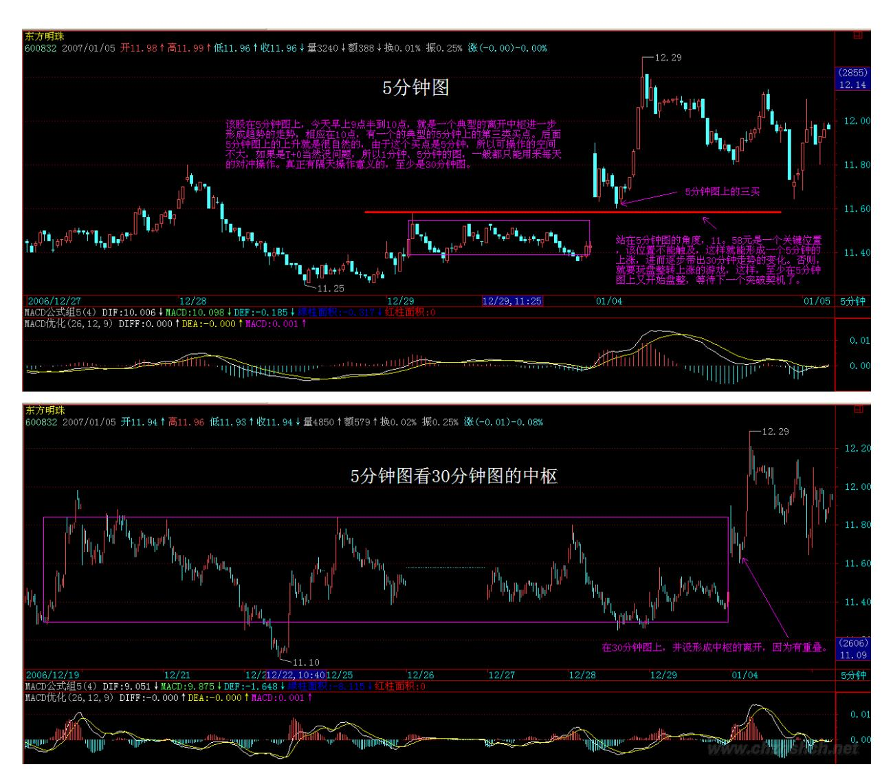

# 教你炒股票 19:学习缠中说禅技术分析理论的关键

< (2006-12-27 15:18:10)本 ID 看了看各位的问题,发现前面说了那 么多,似乎真能看明白的没几个。为什么?很简单,估计来这里的人 都没受过太严格的数学训练,如果受过严格的数学训练,本 ID 现在 所说的,简直就是最简单不过的东西。这里的整个推导过程,和几何 里的毫无区别,初中学过几何的,都应该能明白。所以要看明白,最 好先把自己的数学神经先活动起来。有一句不大中听的话,像孔男人 之类的文科生,是很难炒什么股票的。别说一般的散户了,就算当庄 家,本 ID 所见过的庄家肯定是全国最多的,有一个很明显的规律, 就是文科生当庄家,基本死翘翘。这可不是玩笑话,是直接经验的总 结。孔男人之类的文科生最大特点就是脑子缺根筋----数学思维的 筋。

其次,请把以前学过的一切技术分析方法先放下,因为本 ID 这里所 说的,和所有曾有的技术分析方法的根本思路都不同。一般的技术分 析方法,或者用各种指标,或者用什么胡诌的波段、波浪,甚至江 恩、神经网络等等,其前提都是从一些神秘的先验前提出发。例如波 浪理论里的推动浪 5 波,调整浪三波之类的废话,似是而非,实战中 毫无用处,特别对于个股来说,更是没用。至于什么江恩理论,还有 什么周期理论、神经网络之类的,都是把一些或然的东西当成必然, 理论上头头是道,一用起来就错漏百出。那些支持位、阻力位,通道 线、第三浪之类的玩意,只能当庄家制造骗线的好工具。

如果真明白了本 ID 的理论,就会发现,其他技术分析里所说的现 象,都能在本 ID 的理论中得到解释,而且还可以给出其成立的相应 界限。例如,一个股票新上市后直接向下 5 波后反手就向上 5 波形 成 V 字型,按波浪理论,就无法得到解释,而用缠中说禅走势中枢的 定理,这是很容易解决的问题。那些理论都是把复杂的走势给标准化 成某种固定的模式,就如同面首宣称不带套的爱不是爱一样可笑。对 于庄家来说,对一般人所认识的所谓技术分析理论,早就研究得比谁 都精通,任何坐过庄的人都知道,技术图形是用来骗人的,越经典的 图形越能骗人。但任何庄家,唯一逃不掉的就是本 ID 在分析中所说 的那些最基本的东西,因为这些东西本质上对于市场是"不患" 的, 只要是市场中的,必然在其中,庄家也不例外。

就像任何的大救星,都逃不掉生老病死。

这里必要强调,技术分析系统在本 ID 的理论中只是三个独立的系统 之一,最基础的是三个独立系统所依据的概率原则所保证的数学上的 系统有效性。但技术分析系统之所以重要,就是因为对于一个完全没 有消息的散户来说,这是最公平、最容易得到的信息,技术走势是完 全公开的,对于任何人来说,都是第一手,最直接的,这里没有任何 的秘密、先后可言。技术分析的伟大之处就在于,利用这些最直接、 最公开的资料,就可以得到一种可靠的操作依据。单凭对技术分析的 精通与资金管理的合理应用,就完全可以长期有效地战胜市场,对于 一般的投资者来说,如果你希望切实参与市场之中,这是本 ID 觉 得,如果你光只是想挣点钱,那么没必要学什么技术分析,在牛市 里,买基金就可以了,特别是和指数相关的基金,你就至少能跟上指 数的涨幅。但市场不单单是为挣钱而存在的,市场是一个最好的修炼 自己的地方,人类的贪婪、恐惧、愚蠢,哪里最多?资本市场里,每 时每刻都在演绎着。在这个大染缸里修炼自己,这才是市场最大的益 处。战胜市场,其实就是战胜自己的贪婪、恐惧、愚蠢,本 ID 的理 论只是把市场拔光给各位看,而拔光一个人并不意味着就等于征服一 个人,对于市场,其道理是一样的。

不干,不可能征服市场。对于市场来说,干就是一切。技术分析的最 终意义不是去预测市场要干什么,而是市场正在干什么,是一种当下 的直观。在市场上所有的错误都是离开了这当下的直观,用想象、用 情绪来代替。例如现在,还有多少人为工行的上涨而忿忿不平,却不 能接受这样一个当下最直观的事实。多次反复强调,牛市第一波涨的 就是成分股,工行这最大的成分股不涨,还有谁涨?96 年的牛市,最 大的成分股就是发展,那时候比这不更厉害多了,工行这又算得了什 么?市场是有规律的,但市场的规律并不是显而易见的,是需要严格

的分析才能得到。更重要的是,市场的规律是一种动态的,在不同级 别合力作用下显示出来的规律,企图用些单纯的指标、波段、波浪、 分型、周期等等预测、把握,只可能错陋百出。但只要把这动态的规 律在当下的直观中把握好、应用纯熟,踏准市场的节奏,并不是不可 能的。最后布置一个作业:在所谓的波浪理论里,有一个所谓的结 论,大概意思是说第四浪的调整一般在第三浪的第四子浪范围内,用 缠中说禅走势中枢的相关定理分析该结论成立的范围以及局限性,相 应给出类似走势的一个更合理的理论分析与实际操作准则。 (注:第 4 浪调整回 3 浪的4 子浪后继续走浪 5 属于缠论背驰后第一种情况 回最后个中枢扩展类似)\*\*\*\*\*\*\*\*\*\*\*\*\*\*\*\*\*\*\*\*解盘及互动问答:

#### \*\*\*\*\*\*\*\*\*\*\*\*\*\*\*\*\*\*\*\*。

缠师:成分股的威力,各位会继续看到的。有人说现在涨的很离谱, 本 ID 怎么一点感觉都没有?比起 96年那次,差远了。比起 91 年甚 至 93 年那次,更差远。年 94 年 8、9 月那次的反弹,从指数的速 度上也比这次快。没什么可说的,只不过以前的龙头叫发展、长虹。 现在换成了工行之类的,一点新意都没有。本 ID 已经不想说第一波 是成分股这种话了,说得太多,没意思了。如果要和 96 年比,见 4500 点前就不该有大的调整。明年、最迟后年怎么都应该见6000 点。否则,本 ID 简直对这次的行情失望之极。

元旦后,以及特别在人寿上市前后出现平台式快速震荡是必要的。这 是短线最大的风险,至于中长线,又是一句说过无数次的话,现在才 是牛市的第一阶段。

2006-12-28 15:45:14238 各位先等等,本 ID 先弄一下排版,大盘这 样的跳水又不是第一次,牛市就是下跌猛,像夏天一样。

这样的走势,要最终逆转,必须要有很强的政策性干预,关注一下这 方面的事情。2007-01-04 15:28:42

239 240 1. 网友[匿名] 请教:搂主,是不是所有股票留有跳空高开 的缺口迟早都得补上?一般啥时候会补呀?2007-01-04 21:23:30缠 师:上海(上证指数)94 年 8 月有一个大缺口在300 多点处,10 几 年都没补,这算什么?当然,在强烈上涨后出现的缺口,以及盘整中 的缺口肯定补,而突破性的,在趋势完成前肯定不补。(2007-01- 0421:31:50)

#### \*\*\*\*\*\*\*\*\*\*\*\*\*\*\*\*\*\*\*\*。

2. 网友[匿名] 无言:缠姐,600704 的 5 分钟图10:30 分黄白线回 压在 0 轴以下,怎么算很好的买点呢?2007-01-04 21:09:39缠师: 这个 MACD 是最好那种,从 0 轴很低的位置回到 0 轴上然后一个双 回试,典型的启动形态。关于MACD 的问题,以后会详细说。真会看

MACD 的人,本ID 没见过。MACD 可不是光看看红绿柱,0 轴就完了。 技巧多着呢。(2007-01-04 21:35:57)

#### \*\*\*\*\*\*\*\*\*\*\*\*\*\*\*\*\*\*\*\*。

- 3. 网友[匿名] nn:现在谈《论语》的越来越少了,俺来冒个泡。俺 觉得楼主此篇有点勉强,其实孔子的内心就是有看不起农民的意思。 这也没有什么。就不说他那个年代,就算现在,又有多少人是看得起 农民兄弟的呢?要不怎么中央一而再、再而三的呼吁不要拖欠农民工 的工资这个问题呢?中国 13亿人中,农民占了 9-10 亿。但弱者还是 农民,为什么?这正是孔子看不起农民的原因所在。请楼主看了下面 对话后还有什么可讲?樊迟请学稼。子曰:"吾不如老农。"请学为 圃。
- (1) 曰:"吾不如老圃。"樊迟出。子曰:"小人哉,樊须也!上 好礼,则民莫敢不敬,上好义,则民莫敢不服;上好信,则民莫敢不 用情。(2) 夫如是,则四方之民襁(3)负其子而至矣,焉用稼?"期 待大家讨论。 2007-01-04 21:32:49缠师:你先把今天的搞清楚再 说。关于这条,以后本ID 会说到的,并不是你理解的意思。(2007- 01-0421:37:32) 各位请多看点论语的解释,本章的解释,相当于孔子 的资本论,有空好好研究。(2007-01-0421:40:24)

#### \*\*\*\*\*\*\*\*\*\*\*\*\*\*\*\*\*\*\*\*。

241 4. 网友[匿名] 戈石: 000767 从 12 月 11 日至今,是否形成 一个日线上的缠中说禅走势中枢?2007-01-04 21:24:00缠师:还没有 形成。对于趋势来说,如果真不形成中枢是好事情,证明上涨有动 力。大盘从 8 月到现在,就没形成过日线上的中枢,所以才这么强。 当然,该股要不形成,就必须从明天开始,不能回跌了,马上突破, 否则就形成日线的中枢。(2007-01-0421:43:30)

#### \*\*\*\*\*\*\*\*\*\*\*\*\*\*\*\*\*\*\*\*。

5. 网友[匿名] 非冬虫夏草:在博客上留言 n 次了,第一次得到博主 回复。谢谢!上学时数学成绩很好,自认为还算不上笨。十几天前发 现此地,遂照单学习一通,结果彻底糊涂了。呵呵,汗颜呀。希望有 一天,你的博客点击率能为全球第一。很想听维也纳新年音乐会,我 在本地音像店没找到,如有,请播一下好吗?谢谢啦! 2007-01-04

21:40:51缠师:对不起,有时候可能照顾不过来。本 ID 这里还真没 有所谓圆舞曲之王之类人的东西,如果真欣赏音乐,就不要听那些音 乐。巴赫、贝多芬还听不过来,听所谓圆舞曲之王,还不如听流行音 乐算了。它其实就是当时的流行音乐。而真正的音乐是不可能流行 的。(2007-01-04 21:47:55)\*\*\*\*\*\*\*\*\*\*\*\*\*\*\*\*\*\*\*\*6. 网友[匿名] 听 说:楼主,是不是股指期货出台,股市将会大幅跳水?因为现在大部 队抢拿沪深 300 的筹码是为做空期指准备的。一旦砸盘,试想? 2007-01-04 21:47:49缠师:你说,钱多还是股票多?开始有波动很正 常,但多头总是有力点。特别,如果是两千多点的位置,做空能有多 大空间。同样 1000 点,幅度是一样的,但从 2500 到 1500 容易还 是 2500 到 3500 容易?期货就是要把人夹死的,当空头被诱骗进来 后,就夹死他,就这么简单。(2007-01-04 21:51:16)

#### \*\*\*\*\*\*\*\*\*\*\*\*\*\*\*\*\*\*\*\*。

7. 网友[匿名] 无言:缠姐,你有这么多看盘技巧,真的等你说完 了,牛市也不久了。不然你先告诉我,我留个 QQ?2007-01-04 21:48:29242 缠师:你精通一个就足够了。像第一类买卖点,如果你 精通了,95%的人不是你的对手,关键是精通。
