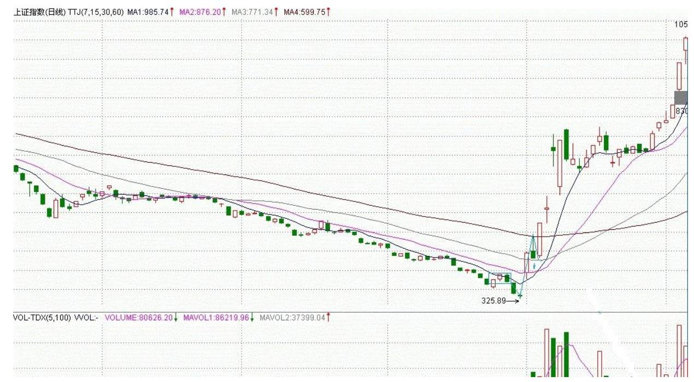
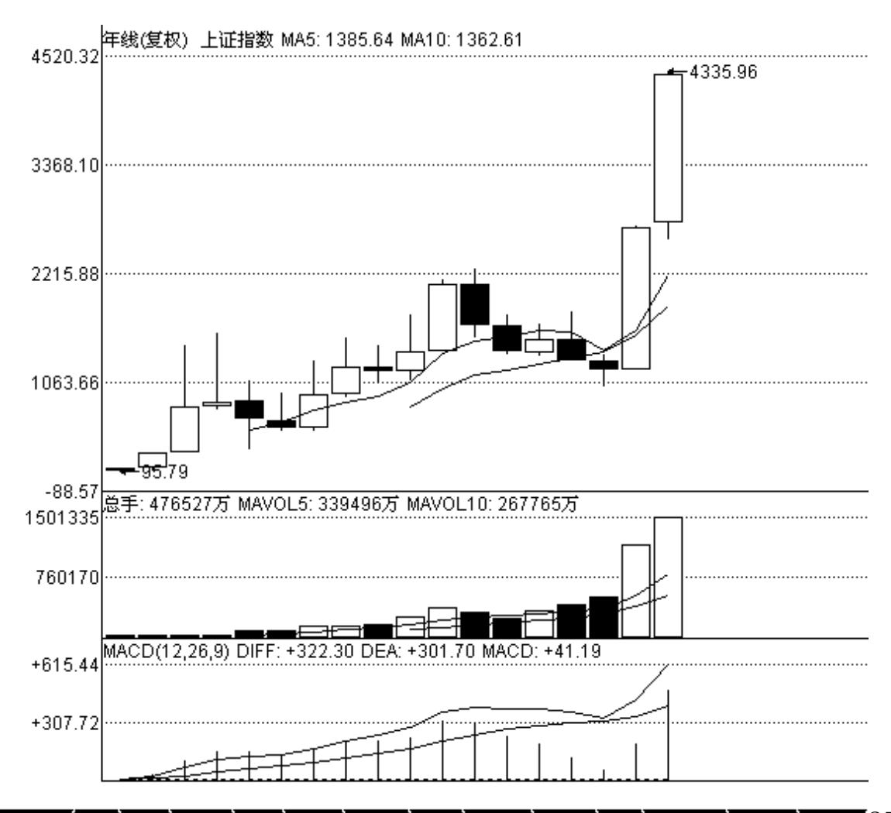

# 教你炒股票 21:缠中说禅买卖点分析的完备性

(2007-01-09 15:03:58)前面已经说过三类的买卖点,一个很现实的问 题,就是除了这三类买卖点之外,还有什么其他类型的买卖点?答案 是否定的。这里必须强调的是,这三类买卖点,都是被理论所保证 的,100%安全的买卖点,如果对这三类买卖点的绝对安全性没有充分 的理解,就绝对不可能也绝对没有对缠中说禅技术分析理论有一个充 分的理解。市场交易,归根结底就是买卖点的把握,买卖点的完备性 就是理论的完备性,因此,对这个问题必须进行一个概括性的论述。

所谓 100%安全的买卖点,就是这点之后,市场必然发生转折,没有任 何模糊或需要分辨的情况需要选择。

市场交易,不能完全建筑在或然上,这市场的绝对必然性,是交易中 唯一值得信赖的港湾。有人可能要反驳说,世界上没有绝对的东西。 那么,世界上没有绝对的绝对性又是哪个上帝所保证的?任何的绝对 性,都是建立在"不患"之上的,而市场本身,也是建立在"不患" 之上的,"不患"本"患" ,"患"本"不患" ,但这不影响其精 彩与绝对。相关方面的理解,请多看本 ID 所解释的《论语》。股票 市场,不是一个单纯的理论问题。虽然在理论上,本 ID 可以向所有 人揭示其买卖点的完备性,但买卖点不可能自动去买卖,最终的交易 是人去完成的,相同的工具,可能在不同的人手下就有了完全不同的

结果,而市场只看结果,任何人,哭着喊着说自己所用的理论是完备 的、最好的都没用,是人使理论,而非理论使人,要让这人使理论达 到理论一般的完美,最终只能靠自己在市场中的修炼了,这就与《论 语》有着密切的关系了。修、齐、治、平,同样适用于股票市场的交 易。

从上面一系列关于缠中说禅走势中枢的分析可知,在走势中的任何一 个点,必然面临两种可能:走势类型的延续或转折。换言之,例如对 于一个必然的买点,必须满足以下的两种情况之一:一个向上的延续 或一个由下往上的转折。对于延续的情况,能产生的,只能是在一个 上升的过程中,否则就无所谓延续了,对于上升的延续中产生的买 点,必然有一个中枢在前面存在着;对于转折,被转折的前一段走势 类型只能是下跌与盘整,而无论的下跌还是盘整,买点之前都必然有 一个走势中枢存在。归纳上述,无论前面的走势是什么情况,都唯一 对应着一个中枢存在后走势的延续或转折,这分析对卖点同样有效。

因此,所有买卖点都必然对应着与该级别最靠近的一个中枢的关系。 对于买点来说,该中枢下产生的必然对应着转折,中枢上产生的必然 对应着延续。而中枢有三种情况:延续、扩张与新生。如果是中枢延 续,那么在中枢上是不可能有买点的,因为中枢延续必然要求所有中 枢上的走势都必然转折向下,在这时候,只可能有卖点。而中枢扩张 或新生,在中枢之上都会存在买点,这类买点,就是第三类买点。也 就是说,第三类买点是中枢扩张或新生产生的。中枢扩张导致一个更 大级别的中枢,而中枢新生,就形成一个上涨的趋势,这就是第三类 买点后必然出现的两种情况。

(娇注:3 买后中枢新生细分 2 小类,1 非盘背更高位置形成新中枢 2 盘背就此形成新中枢,统称中枢移动)。中枢对于更大级别中枢的 情况,肯定没有马上出现一个上涨趋势的情况诱人,所以对于实际操 作中,任何尽量避免第一种情况就是一个最大的问题。

但无论是哪种情况,只要第三类买点的条件符合,其后都必然要赢 利,这才是问题的关键。

对于中枢下形成的买点,但如果该中枢是在上涨之中的,在中枢之下 并不能必然形成买点,中枢下的买点,只可能存在于下跌与盘整的走 势类型中。换言之,一个上涨趋势确定后,不可能再有第一类与第二 类买点,只可能有第三类买点。而对于盘整的情况,其中枢的扩张与

新生,都不能必然保证该买点出现后能产生向上的转折(娇注:盘整的 情况,也可以产生向上的转折,但是没有必然性),因为其扩张与新 生完全可以是向下发展的,而对于中枢延续的情况,中枢形成后随时 都可以打破而结束延续,也不必然有向上的转折,所以盘整的情况 下,中枢下也不必然产生买点。因此,只有在下跌确立后的中枢下方 才可能出现买点。这就是第一类买点。

第二类买点是和第一类买点紧密相连的,因为出现第一类买点后,必 然只会出现盘整与上涨的走势类型,而第一买点出现后的第二段次级 别走势低点就构成第二类买点,根据走势必完美的原则,其后必然有 第三段向上的次级别走势出现,因此该买点也是绝对安全的。第二类 买点,不必然出现在中枢的上或下,可以在任何位置出现,中枢下出 现的,其后的力度就值得怀疑了,出现扩张性中枢的可能性极大,在 中枢中出现的,出现中枢扩张与新生的机会对半,在中枢上出现,中 枢新生的机会就很大了。但无论哪种情况,赢利是必然的。(第二类卖 点分析反之)。

显然,第一类买点与第二类买点是前后出现的,不可能产生重合,而 第一类与第三类买点,一个在中枢之下、一个在中枢之上,也不可能 产生重合。只有第二类买点与第三类买点是可能产生重合的,这种情 况就是:当第一类买点出现后,一个次级别的走势凌厉地直接上破前 面下跌的最后一个中枢,然后在其上产生一个次级别的回抽不触及该 中枢,这时候,就会出现第二类买点与第三类买点重合的情况,也只 有这种情况才会出现两者的重合。当然,在理论上没有任何必然的理 由确定第二、三类买点重合后一定不会只构成一个更大级别的中枢扩 张,但实际上,一旦出现这种情况,一个大级别的上涨往往就会出 现。一个最典型的例子,就是大盘在 94 年 7 月底部跌到 325 点 后,8 月 1 日跳空高开,5 分钟上形成单边上涨突破前面的 30 分钟 中枢,第二天大幅上冲后突然大幅回洗形成 5 分钟的走势级别的回 抽,那时候最高已经摸到快 500 点,一天半上涨 50%,又半天回跌 15%,这样的回抽,一般来说是很恐怖的,但如果明白第二类买点与第 三类买点的重合道理,就知道这是最好的补进机会,结果第三天又开 始单边上扬,第六天达到750 点。这是指数上最典型的一个例子了。 而且,325点留下的缺口至今未补,中国几十年的一个大牛市,从指数 上看,这是一个最重要的缺口了,将支持中国股市几十年甚至上百年 的大牛市。

253 254 补充一句,站在特大型牛市的角度,中国就从来没出现过熊 市,大家打开上海的年线图就可以看到,从 1992 年到 2005 年,一 个完美的年级别缠中说禅中枢的三段次级别走势完成,时间刚好是 13 年,一个完美的时间之窗。站在年线的角度,中国股市的真正大牛市 才真正开始,因为该中枢是中国股市的第一个年中枢,区间在 998 到 1558 点。站在年线级别,在下一个年线级别中枢确立之前,中国股市 的调整只可能出现一个季级别的调整,而第一个出现的季级别的调 整,只要不重新跌回 1558 点,就将构成中国股市年线级别上的第三 类买点,其后至少出现如去年类型幅度的上涨。

255 256 由此可见,本 ID 的理论是可以站在如此宏观的视角上判断大趋 势的。目前中国的股市没有任何可担心的地方,即使出现调整,最多 就是季级别的,其后反而构成第三类买点。而且更重要的是,站在年 线的级别看,目前还在第一段的次级别上扬中,要出现第二段的季级 别调整,首先要出现月线级别的中枢,目前连这个中枢都没出现,换 言之,年线级别的第一段走势还没有任何完成的迹象,这第一段,完 全可以走到 6000 点才结束。今后十几年,中国股市的辉煌,用本 ID 走势必完美的原则,会看得一清二楚。该原则无论是对年线还是 1 分 钟线,都一视同仁,这就是缠中说禅技术分析理论厉害之处,这叫大 小同杀,老少咸宜。

(娇注:照着这样分析 2010 年 11 月都没有完成年中枢的季级别离 开,因为月中枢在 10 年 8 月刚够 3段中枢。用 6124 点为日级别背 驰引发季级别转折,从 6124 开始分析新季级别走势比较现实---此处

为缠师现在的习惯,非后期递归级别)对卖点的分析是一样的,归纳 起来,就有缠中说禅买卖点的完备性定理:市场必然产生赢利的买卖 点,只有第一、二、三类。

相同的分析,可以证明缠中说禅升跌完备性定理:市场中的任何向上 与下跌,都必然从三类缠中说禅买卖点中的某一类开始以及结束。换 言之,市场走势完全由这样的线段构成,线段的端点是某级别三类缠 中说禅买卖点中的某一类。

思考题:任何一个线段,其端点必然是一买点及一卖点,请完全列出 各类买卖点之间可能的组合。如果一线段的端点是同级别的买卖点, 有什么组合是绝对不可能出现的。

( 娇注:1 买-1 卖 2 买-1 卖 1 买-2 卖 2 买-2 卖;1 卖-1 买 2 卖-1 买 1 卖-2 买 2 卖-2 买 。不可能出现的是线段端点为 3 买 卖)

\*\*\*\*\*\*\*\*\*\*\*\*\*\*\*\*\*\*\*\*。

解盘及互动问答:

#### \*\*\*\*\*\*\*\*\*\*\*\*\*\*\*\*\*\*\*\*。

缠师:大盘没什么可说的,人寿开在 40 附近,短线有所震荡是正常 的,最主要换手不足,太惜售,短线的关键就是要把这些人吓出来。 中线该股一点问题都没有,看看茅台上市时多少钱,现在多少。中国 最大的资源就是人,人寿搞的就是人,没有人,酒也废了。

257 各位关键在持住股票,好像本 ID 发梦时说的某药,短短 10 个 交易日,上涨 40%,过两天一算还要多,但能持住的有几个?做人专 一点,别前戏都没开始就早泄了。今天下午有事,有问题的请放下, 晚上回答。2007-01-09 15:13:32就算是 419,也要把前戏、高潮弄足 了,牛市一定不能当早泄男。先下,再见。2007-01-09 15:16:30去年 成绩不好的,归根结底都是心态问题,先把心态调整好,别整天希望 天上掉馅饼,而有时候真的天上掉馅饼了,又抓不住,这样怎么可能 挣钱?2007-01-09 21:32:33太晚了,先下,各位好好休息,好好思 考,一定要在心里建立自己坚固的港湾,才可能在实际操作中从容面 对风浪。2007-01-09 22:00:06今天继续补涨,三线成分股表现,这十

分符合轮动的节奏。但轮动能否继续,关键就看工行等能否重新走 强,不行的话,就要进入一个至少 30 分钟,甚至日线级别的调整。

最近的大涨,使得反压言论开始冒头,这是考验管理层智慧的时候 了。如果管理层不干傻事,日线级别的调整就足够了。调整时,非成 份股会出现补涨,短线机会还是很多的。2007-01-10 16:22:39缠师 (讲心态):态,古字上"能"下"心" ,能心心能也。何谓能心? 无所住而生其心也。何谓心能?其心生而住所无也。世之痴人,以 "无所住而生其心"为圣为解,以"其心生而住所无"为凡为缚,于 圣凡自生分别,翳眼生花,可叹可怜。复有痴汉,求一清净之常态, 谓之安心。岂知安心者,心也,以心求心,相缠相续,即清如朗月、 净似幽潭,犹鬼窟活计,自欺欺人。

能心者,心也;心能者,心也。心无可安,无心可安;心无所住,无 心所住。心心相心、心心心相。安者,心也;住者,心也;解者,心 也;缚者,心也;生者,心也;灭者,心也;是心,心也;非心,心 也。心无所心,无心所心,犹心也。心而能心,心而心能,能心心 能,态变乾坤。(2007-01-10 15:49:21) 缠师:买了股票,就一定要 从买点一直持有到至少是同级别的第一卖点。除非你的短线技术特别 好,否则就不要乱动,没必要为券商打工。2007-01-10如果有资金量 大点的,可以参考一下那 5 只股票 12月 20 日以后的走势,看看本 ID 是如何把可以让 8亿农民一人一口的大米藏到这 5 个庄家的肚子 里的。

至于资金量小的,就算了,好好找好精确的买点。

2007-01-10 17:17:14就算是 419,也要把前戏、高潮弄足了,牛市一 定不能当早泄男。先下,再见。(2007-01-09 15:16:30)

#### \*\*\*\*\*\*\*\*\*\*\*\*\*\*\*\*\*\*\*\*。

1. 网友[匿名] 悠悠悠哉:大姐,你讲的那 3 类买卖点,在你以前的 那些文章里有啊?我找过了,找不到,告诉我一下啊。 很多人也想知 道的啊!2007-01-09 16:29:45缠师:认真读过前面文章的,都不应该 有这样的问题。面对市场,不经过一番洗心革面,是不可能战胜市场 的。市场里,任何的侥幸都只能是暂时的,而且会被市场所加倍索 还。(2007-01-09 21:09:07)

#### \*\*\*\*\*\*\*\*\*\*\*\*\*\*\*\*\*\*\*\*。

2. 网友 wy1499:沉醉,你对伟星股份走势的疑问,我也同样碰到 了。就以前缠 MM 曾提到的北辰实业(601588)在 2006/11/7- 2006/12/6 的涨势中也出现过。在 30 分钟图上,无论从均线走势力 度还是 MACD指标,11 月 13 日 11 点时涨势已形成背驰,可后面却 迭创新高,证明这其实是个中继。如果不是事后看图,我很可能选在 11/13 日出货了。个人觉得对于买卖点的把握,还要掌握其他方面的 知识才行。缠 MM说过,真正的高手的功力在于中继和转折的判断上。

我现在就是经常把中继错判成转折,特别是在小级别图上。不过,结 合大级别图,减少操作频率,成功率可以高一些。当然喽,最好的办 法还是期待缠 MM 的后续内容吧。楼主觉得我的看法,对吗?对了, 楼主以前提示过时间之窗,那是在日线图和 30 分钟图上以一个月为 准,怎么到大盘的年线上变 13 年了,两者有什么数学关系吗?2007- 01-09 19:25:49缠师:时间之窗又不是只有一种。以后会说到的。

(2007-01-09 21:10:58)

#### \*\*\*\*\*\*\*\*\*\*\*\*\*\*\*\*\*\*\*\*。

3. 网友[匿名] 无知:缠姐,我资金量比较小,今天没买中国人寿 (601628),有没有必要卖掉不太动的股票买进中国人寿啊?2007- 01-09 20:35:57缠师:本 ID 10 几天前,不已经有一个关于药的梦了 吗?那个梦就是为各位小资金们准备的,买了以后就一直等着,继续 学论语、学技术、学其他。怎么都不明白呢?本 ID 随便发一个梦, 你就进入梦乡,耐心地等待最后至少把 1 变成 2、3 的,期间就好好 学习、天天向上,为什么要整天跑来跑去?人的贪婪总是很可笑的, 为什么一定要每天都发一个梦呢?一个梦让你把 1 安全地变成 2、 3,难道还需要其他的梦吗?那些每天发一个梦的人,最终能把 1变成 2、3 吗?本 ID 新来的那一笔资金其实弄了 5 只股票,这个药已经 是最安全的,10 个交易日让你从 1 变成 1.4,不敢说是最牛的,肯 定也是最近比较牛的了。本ID 另外 4 个都不愿意说了,只要其中一 只就能达到目的,没必要说那么多了。

当然,本 ID 也可以把其他四只说出来,其中两只和那药一样,都是 深圳的,本 ID 比较懒,现在代码太多,懒得记,都找的是代表只有 两种数字的,另外两只,和这三只里的其中两只代码相连。

这 5 只股票,最终都像去年的酒一样的,这肯定是无疑的。但各位如 果资金小的,买一只就够了。如果有药,就存放好,小心受潮。

各位,专一点吧,每天跑来跑去的,一定挣不了大钱。至于人寿,如 果你专一,一定没问题,如果你不专一,肯定受折磨。

#### \*\*\*\*\*\*\*\*\*\*\*\*\*\*\*\*\*\*\*。

4. 网友[匿名] 学习: LZ,形成更大级别的中枢,其区间是两个区间 的总和吗? 2007-01-09 21:26:44缠师:例如,原来是日线的,现在 变成周线的,那就在周线上找次级别也就是日线上三段走势,按中枢 的公式去确定,并不存在两个区间总和的问题。(2007-01-09 21:37:00)

#### \*\*\*\*\*\*\*\*\*\*\*\*\*\*\*\*\*\*\*\*。

5. 网友[匿名] 舍小赢大:楼主腐败回来了,我对工行的背驰判断对 吗?缠 MM ,工商银行 5 分钟 K 线图上已经是女上位背驰了,我的 判断正确吗?2007-01-09 16:38:14缠师:要学会从大角度看问题。工 行这次下来的调整,必然需要一个走势类型完美的问题。例如,一个 日线级别的调整,就必然在 30 分钟上有三段走势。

想想现在是第几段,意味着什么?这样就能很从容地安排自己的操作 了。只有定好大方向,才有必要看小细节。(2007-01-09 21:41:07)

#### \*\*\*\*\*\*\*\*\*\*\*\*\*\*\*\*\*\*\*\*。

6. 网友[匿名] 无言:缠姐,好人啊!功德无量。不但不收学费,还 提供饭票。虽然不知缠姐的票是什么,但自从学了缠姐的理论,现在 每天稳定收益3 个点。谢谢! 2007-01-09 21:39:47缠师:本 ID 原来 的想法是,各位如果资金都不太大,要好好学习又不安心,整天想去 找工作吃饭,就提供一剂药给大家当饭吃,让大家安心学习,现在看 来,不知道有多少人理解本 ID 的意图了。

偷心不死,是学不了真工夫的。有时候,把药煮好让大家吃,估计也 不一定有用的。关键还是人自己。本ID 的理论也如同那药,就算大家 都知道都明白,实际操作下来,好坏还是要看自己的心态。统计一 下,有谁能在 6 元上下买那药,现在还放着,然后安心学习研究的? (2007-01-09 21:47:01)

#### \*\*\*\*\*\*\*\*\*\*\*\*\*\*\*\*\*\*\*\*。

7. 网友[匿名] 不争而胜:LZ,您说资金量 30W 的持股,最好不要超 过 3 只。我根据您的理论,抓来抓去收藏了一大把,虽都有赢利,但 想专一点,您能否帮忙剔除一些。600824,配股后 5.5 元左右的成 本;000928,4.9 元买的;000520,3.2 元买的;000429,4.7 元买 的;000100,2.2 元买的。谢谢您了!2007-01-09 21:46:45缠师:告 诉你原则,然后自己思考,才有进步。站在周线的角度,一个漂亮的 第一类买点与第二类买点相组合的,都应该持有。目前很多股票,站 在周线角度,都出现第一类与第二类买点,面临突破,这些股票在今 年一定会有好表现的,什么时候加速?就是在周线、或至少在日线上 出现第三类买点,然后就进入加速。符合以上要求的,都应该保留。

如果一个股票,在周线或至少在日线上出现第三类买点了,那就一直 持有等待相同级别或至少是次级别的第一类卖点出现。股票其实就这 么简单。当然,如果你短线有时间,就按更低级别的图打短差,如果 没时间,也没必要干了。(2007-01-09 21:57:27) 太晚了,先下,各 位好好休息,好好思考,一定要在心里建立自己坚固的港湾,才可能 在实际操作中从容面对风浪。再见。(2007-01-09 22:00:06)

#### \*\*\*\*\*\*\*\*\*\*\*\*\*\*\*\*\*\*\*\*。

8. 网友[匿名] 淡定:楼主,怎么不回答俺 000001的问题啊?2007- 01-10 15:56:37缠师:什么问题?(2007-01-10 16:24:36)

#### \*\*\*\*\*\*\*\*\*\*\*\*\*\*\*\*\*\*\*\*。

9. 网友[匿名] WHQ999:来报到。今天工行好像没完成任务啊。今天 心态不好,把我的招商轮船(601872)卖了点,买了泸天化,反不如 不换,其实不该乱换股的。反省。2007-01-10 16:12:41缠师:买了股 票,就一定要从买点一直持有到至少是同级别的第一卖点。除非你的 短线技术特别好,否则就不要乱动,没必要为券商打工。(2007-01- 1016:26:11)

#### \*\*\*\*\*\*\*\*\*\*\*\*\*\*\*\*\*\*\*\*。

10. 网友[匿名] whq999:只要不追高,严格按买点买入,不会有大问 题的。现在,上海和深圳的指数走势有差异,缠妹指导一下,以哪个

为主来判断后势呢?会不会近期形成日级的中枢呢?2007-01-10 16:25:09262 缠师:都一样。关键两个市场不要背离就可以。

(2007-01-10 16:28:49)

#### \*\*\*\*\*\*\*\*\*\*\*\*\*\*\*\*\*\*\*\*。

11. 网友[匿名] 潜龙勿用:缠姑娘好!到穷山僻壤出差几天,没能上 网分享你的智慧了,今天倍感亲切。

我今天发现中信海直(000099)在周线上有第二类买点,所以在 4.39 元进入了,到今天收盘已有所收获。不知判断对否?2007-01-10 16:27:06缠师:买得高了点,4 元随便买。任何买点,都应该在回跌 的时候介入,而不是追上去。只是回跌的级别不同而已。(2007-01-10 16:32:08) 各位没必要知道那么多股票,本 ID 的第二只股票是 5 个 0 中间一数字的能源股,题材是整体上市,都涨那么多了。本ID 也不 好让各位买了。前几天是一个标准的第三类买点。当然,本 ID 资金 量大,不可能在一个精确的点上买。

第三个是前面三个 0,后面三个相同的另外数字的江浙的股。

第四和第三后 5 个数字都相同,就前面一个不同。

第 5 个和第三个最后一个数字不同的 300 样本股。

算了 ,最快一个已经第一时间告诉了,都拿不住,这四个可没第一个 牛,知道了也没意思。

注意,本 ID 现在可不当什么庄家,只是喜欢抽庄家血。

还有,这笔后来的钱只占本 ID 的一小部分,本 ID的大部队可不在这 里,大部队早就进去了,现在都没影子地高了,更没必要知道了。 (2007-01-1016:48:14)

#### \*\*\*\*\*\*\*\*\*\*\*\*\*\*\*\*\*\*\*\*。

263 12. 网友[匿名] 淡定: 000001 还可以搞吗?2007-01-10 16:39:46缠师:不应该这样思考问题,而是要问自己,它在什么级别 上有第一、二、三类买点,该级别值得介入吗?(2007-01-10

16:51:07) 今年的钢铁等于去年的有色。今年的药等于去年的酒。今 年的什么等于去年的银行?(2007-01-10 17:00:51)

#### \*\*\*\*\*\*\*\*\*\*\*\*\*\*\*\*\*\*\*\*。

13. 网友[匿名] 淡定:惭愧啊楼主,我是 6.5 元介入到现在的,现 在走也不是留也不是,所以请楼主指点啊。

缠师:那就该继续拿着,还 S 着(未股改),急什么?当然,短线技 术好,可以打点短差(2007-01-1017:02:30)

#### \*\*\*\*\*\*\*\*\*\*\*\*\*\*\*\*\*\*\*\*。

14. 网友[匿名] 青皮六:今天不请教股票。女禅师曾说,可请教任何 问题。冬季来临,老人故去的特别多,家中亦有老人故去。念其一 生,颇多感慨。 孔子说:未知生,焉知死。陶渊明说:亲戚或余悲, 他人亦已歌。死去何所道,托体同山阿。女禅师世外高人,学识渊 博,不知如何看待生死?2007-01-1017:00:16缠师:生死之!(2007- 01-10 17:03:38)

#### \*\*\*\*\*\*\*\*\*\*\*\*\*\*\*\*\*\*\*\*。

15. 网友[匿名] 小明:突然发现,000666 竟然走得也相当漂亮! 2007-01-10 17:02:54缠师:低价股都要补涨的,现在的低价股自然是 遍地机会。(2007-01-10 17:07:48) 264

#### \*\*\*\*\*\*\*\*\*\*\*\*\*\*\*\*\*\*\*\*。

缠师:如果有资金量大点的,可以参考一下那 5 只股票 12 月 20 日 以后的走势,看看本 ID 是如何把可以让 8 亿农民一人一口的大米藏 到这 5 个庄家的肚子里的。至于资金量小的,就算了,好好找好精确 的买点。先下了,晚上再说。(2007-01-10 17:18:26)

#### \*\*\*\*\*\*\*\*\*\*\*\*\*\*\*\*\*\*\*\*。

16. 网友[匿名] 快:数女,如何看待 A 股与 H 股的严重分化呢? 2007-01-10 15:58:24缠师:香港是中国的一部分,而不是相反。 (2007-01-10 20:42:54)

#### \*\*\*\*\*\*\*\*\*\*\*\*\*\*\*\*\*\*\*\*。

17. 网友[匿名] laoliu:可不可以这样理解?在一个买点和一个卖点 之间买入,只要能在卖点卖掉,都是有利可图的。这样就可以理解为 缠MM推荐的股票还可以买,只要没到卖点。2007-01-10 19:15:42缠 师:就在买点买,卖点卖。当然,买点并不一定是一个点,一个价 位。级别越大的,可以容忍的区间越大。你的"之间"之类的概念是 模糊的。卖点还没出现,什么叫买点和卖点之间?以后会说到如何精 确地控制买点的区间的问题,这里就不详细说了。(2007-01-10 20:47:41)

#### \*\*\*\*\*\*\*\*\*\*\*\*\*\*\*\*\*\*\*\*。

- 18. 网友 wy1499:楼主,想请教个问题。我最近一直一边做股票,一 边在玩股指期货的仿真交易。我发现期货的走势和股票也是相通的。 但是因为期货实行的是保证金制度,收益率要远远高于股票,楼主这 么大的资金为什么不去做期货?以楼主的身份,要做港股的期货应该 是没什么制度障碍的。我猜测,是不是大牛市做股票风险更小,收益 也有保障;而熊市里期货可以做空,这时候更能派上用场,请问是这 样吗?2007-01-10 18:44:05缠师:你怎么知道本 ID 不玩期货?股票 的风险小,最大的风险就是法律风险。除此之外,对于大资金,真没 什么风险了。但期货不一样,期货是不能说的。
- 一旦火星碰地球,那一定要死人才能完事的。(2007-01-10 20:51:51)

#### \*\*\*\*\*\*\*\*\*\*\*\*\*\*\*\*\*\*\*\*。

19. 网友[匿名] YY:"今年的钢铁等于去年的有色。" 钢铁已经涨 了那么多了,还能涨?2007-01-1017:09:06缠师:去年的有色是跨年 度行情,上半年疯狂后就歇了,钢铁为什么不能这样?

#### \*\*\*\*\*\*\*\*\*\*\*\*\*\*\*\*\*\*\*\*。

20. 网友[匿名] YY:今年的药等于去年的酒?缠师:去年的酒是全年 一路涨,今年的药为什么不可以?

21. 网友[匿名] YY:今年的什么等于去年的银行?是不是煤炭股?缠 师:银行为什么涨,就是因为海归以及战略位置的重要,要和银行一 样,至少也要有这两个条件。

(2007-01-10 20:58:03) 缠师:各位注意,本 ID 之所以今天说那 5 只股票,只是为了明天上课的需要,这可是现场版本,因为明天要说 说如何利用买点,特别是第三类买点阻击庄家的一些小方法。本 ID 从 12月 20 日开始,现场直播给各位看了,那药是绝对的现场版本, 其他四只,各位看看,看能看出点什么。

注意,为了避免不必要的法律纠纷,本 ID 一切关于具体股票的言 论,都是在说梦话,千万别相信。

(2007-01-10 21:03:18)

#### \*\*\*\*\*\*\*\*\*\*\*\*\*\*\*\*\*\*\*\*。

266 22. 网友[匿名] kkk:"但期货不一样,期货是不能说的。一旦 火星碰地球,那一定要死人才能完事的。" 楼主的意思是,期货只讲 资金大小而不完全靠技术是吗?一旦对垒起来,必有一方死球是吗? 所以中国小资金一出门就被屠杀,对吧?2007-01-1021:01:37缠师: 技术还是很重要的,但技术不是唯一的。特别在期货里,就像一个狩 猎场,一群火枪手就等着那些兔子、豹子跑进来被围剿,所以去别人 的场子上,如果被盯上,会很难受的。虚拟市场,归根结底就是一个 狩猎场。站在国家、民族的立场上,关键是要建立自己的场地。N 年 前香港大干的那次(97年香港的官鳄大战),如果在别人的场子上, 有可能吗?(2007-01-10 21:09:03)

#### \*\*\*\*\*\*\*\*\*\*\*\*\*\*\*\*\*\*\*\*。

23. 网友[匿名] 手中无股: lz,能说说股指期货推出前后,股市的 变化吗? 2007-01-10 21:02:32缠师:股指期货出现后,资金会更加集 团化。风险最大的,反而不是散户,反而是不大不小的所谓游资。

所以,以前已经多次说过了,跟就跟大部队,别和游击队玩。否则, 怎么死都不知道。有集团进驻的领域会反复活跃,而没有的,就可能 出现长期不动的局面。这种情况会越来越明显。当然,在这几年还不 会太严重,毕竟中国平均主义的习惯还改不了,而且目前股票种类也 太少了,但这是大方向。(2007-01-1021:15:15)

#### \*\*\*\*\*\*\*\*\*\*\*\*\*\*\*\*\*\*\*\*。

24. 网友[匿名] 悠悠悠哉:哈哈,心为何解啊?大姐。2007-01-10 20:45:50缠师:心,为何解。(2007-01-10 21:17:27)\*\*\*\*\*\*\*\*\*\*\*\*\*\*\*\*\*\*\*\*25. 网友[匿名] 带套操作:最影响 心态的,是患得患失吧!炒股票不止会让人心浮气躁,还会放大人们 内心的恐惧、贪婪。最终,性格就是命运,也是财运。

与其让股市影响心态,不如把宝押在缠 mm 身上,赚也好,赔也好, 至少落一清净,谢谢缠 mm。2007-01-10 21:13:15267 缠师:错。要 自己立起来,谁都不值得依靠。患得患失,是因为本来就糊涂。本 ID 的理论,就是要消除这样或然的糊涂,让你对股市一目了然。知道股 市在干什么,你自己该干什么。破患得患失、恐惧、贪婪,靠的是智 慧而不是其他。(2007-01-1021:21:16)

#### \*\*\*\*\*\*\*\*\*\*\*\*\*\*\*\*\*\*\*\*。

26. 网友[匿名] 心禅:工行日线级别的调整需要 30分钟图上 3 个连 续走势(下跌-上涨-下跌),完成一个"缠中说禅中枢" ,现在是第 二个走势阶段?缠师:可以这样认为。以后说到趋势中,中枢形态的 交替原则,就知道为什么这次的调整如此急促了。因为很简单,上次 的中枢形态是平台,这以后再说了。

#### \*\*\*\*\*\*\*\*\*\*\*\*\*\*\*\*\*\*\*\*。

27. 网友[匿名] 心禅:600779 从 30 分钟图看,12月 20 日 14.58 元-1 月 05 日 12.37 元,为第一段下跌走势,然后到 1 月 9 日 14.08 元为第二段上涨走势,再到 1 月 10 日 13.47 元为第二段下 跌走势。已经有连续三个走势,完成一个中枢(13.47-14.08 元), 接下来继续可能会是一个中枢扩张或新生?缠师:目前这样的走势, 中枢延伸、扩张、新生都可能。因此在这种位置,在日线上是没有买 点的,该股在日线上最近的一个买点就是 12 月 5 日的第三类买点。 对于这样的股票,只能是在低位买的继续持有,按照低级别图弄点短 差。当然,中线是没问题的。

#### \*\*\*\*\*\*\*\*\*\*\*\*\*\*\*\*\*\*\*\*。

28. 网友[匿名] 心禅:在上证 50 中选择的 600795(12 月 29 日买 入)已有 56%收益,选择的 600428(1 月 4 日),仅 4 天已涨幅

27%,可惜资金小了。感谢禅主!缠师: 56%?6 元到 8 元怎么会有 56%?干事情要精确点。(2007-01-10 21:44:20)

#### \*\*\*\*\*\*\*\*\*\*\*\*\*\*\*\*\*\*\*\*。

268 29. 网友[匿名] 你的粉丝:记得以前,你还说过买得有广深铁路 啊。怎么卖了?2007-01-10 21:38:51缠师:现在也没卖呀。但那不是 这笔资金干的活。本ID 这 5 只是一笔新资金,一个耗了 N 年的实业 项目套现出来的资金,这不在以前都说过了?

#### \*\*\*\*\*\*\*\*\*\*\*\*\*\*\*\*\*\*\*\*。

30. 网友[匿名] 过客:小姐,您好!我初入股市,资金很少,就想赚 点零花钱。我时间较为充裕,希望小姐能介绍一些前景较好的股票。 感谢先。2007-01-1021:45:21缠师:好象现在,这里问这种问题的人 已经不多了。

希望你在这里时间长点,也和大家一样自己立起来。

(2007-01-10 21:50:12)

#### \*\*\*\*\*\*\*\*\*\*\*\*\*\*\*\*\*\*\*\*。

31. 网友[匿名] 心禅:【缠师:56%?6 元到 8 元怎么会有 56%?干 事情要精确点。2007-01-1021:50:54】谢谢禅主的批语。确实粗心 了,可我上面1、2、3 问题对否?还等回答!或者不回答就是"默 许"?缠师:都回答了,没看到?

#### \*\*\*\*\*\*\*\*\*\*\*\*\*\*\*\*\*\*\*\*。

32. 网友[匿名] 外科医生:药里面有啥股票可以搞的吗?我现在资金 在钢铁股和铁路股上面。泸天化和一支低价玻璃股。等出来了,还能 赶上药吗?多谢!2007-01-10 21:54:03缠师:年底回头看沪深 300, 基本涨幅都不会相差太多的。先关心的应该是自己的股票是否出现卖 点了。

而不是老觉得隔壁的饭菜总比自家的好。高手并不一定都能拿到每一 只黑马。但高手一定能在该走的时候走,该留的时候留,走了又能及 时找到新的猎物。复利的威力是最大的黑马。(2007-01-10 21:58:19) 269 缠师:太晚了,先下,再见。再说一次,目前短线的主题就是补 涨,从 50 到 300,到非成分股,注意这个节奏,至于大盘,晃荡几 下是正常的。 目前最有力的就是第三类买点的低价股票。(2007-01- 1022:02:27)
