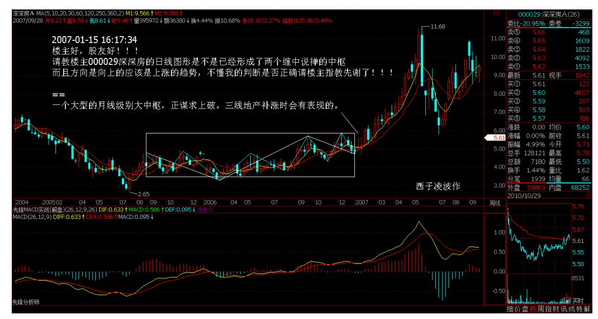
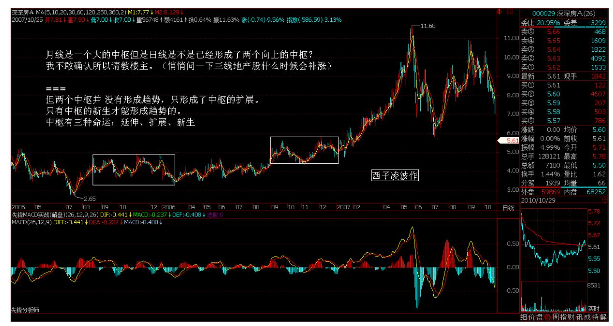
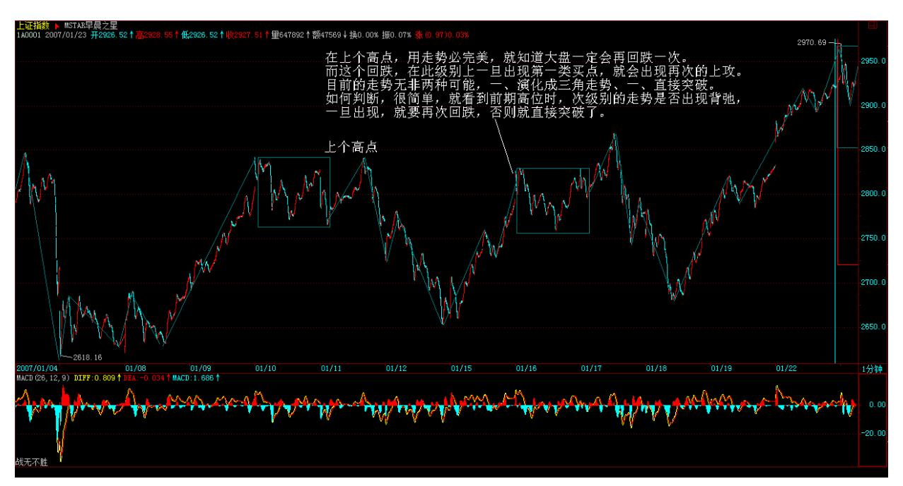
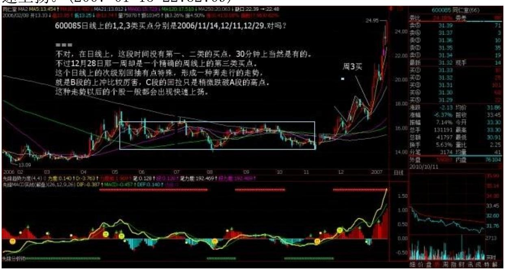
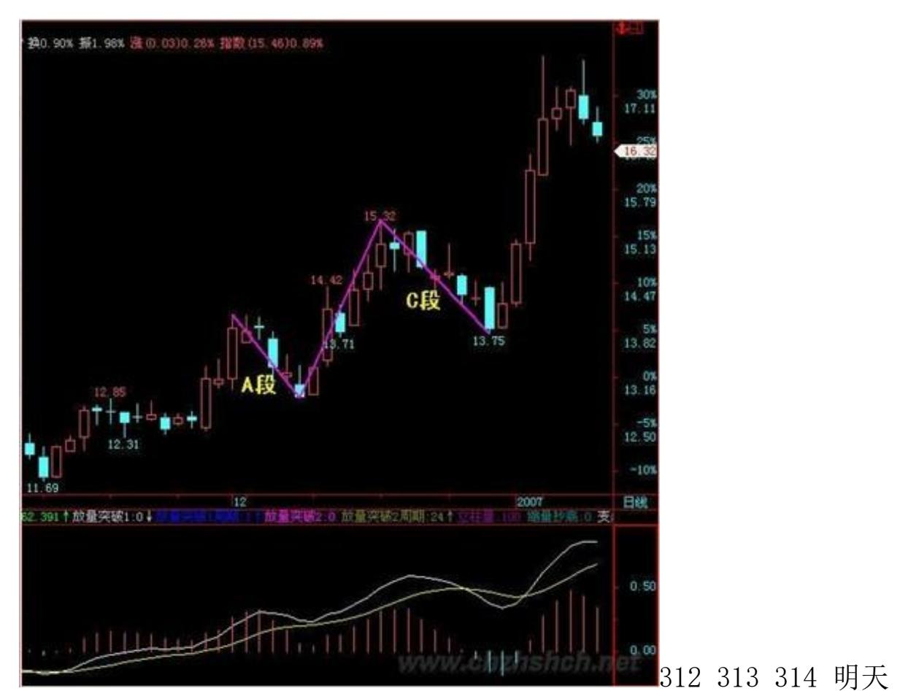
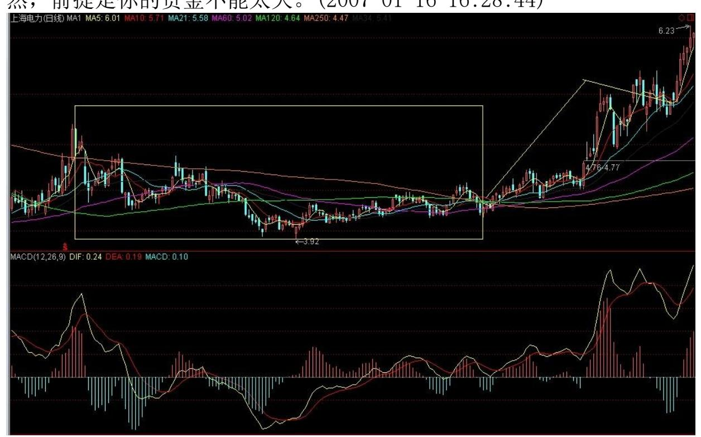
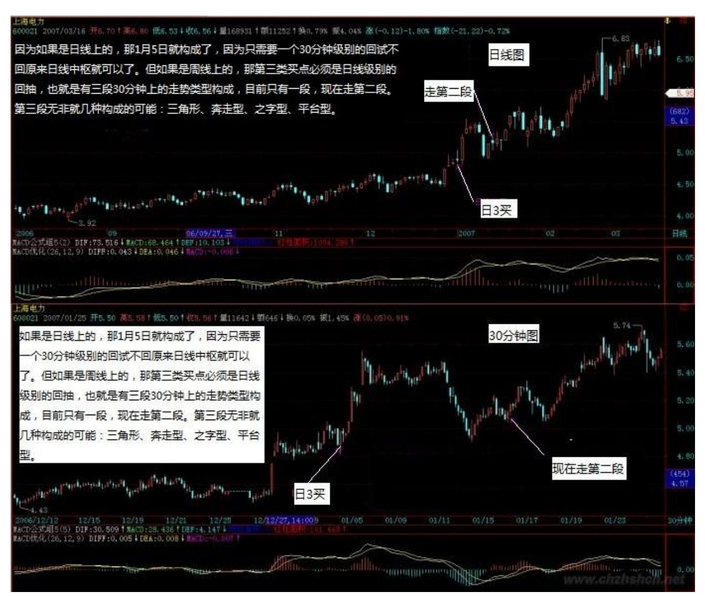
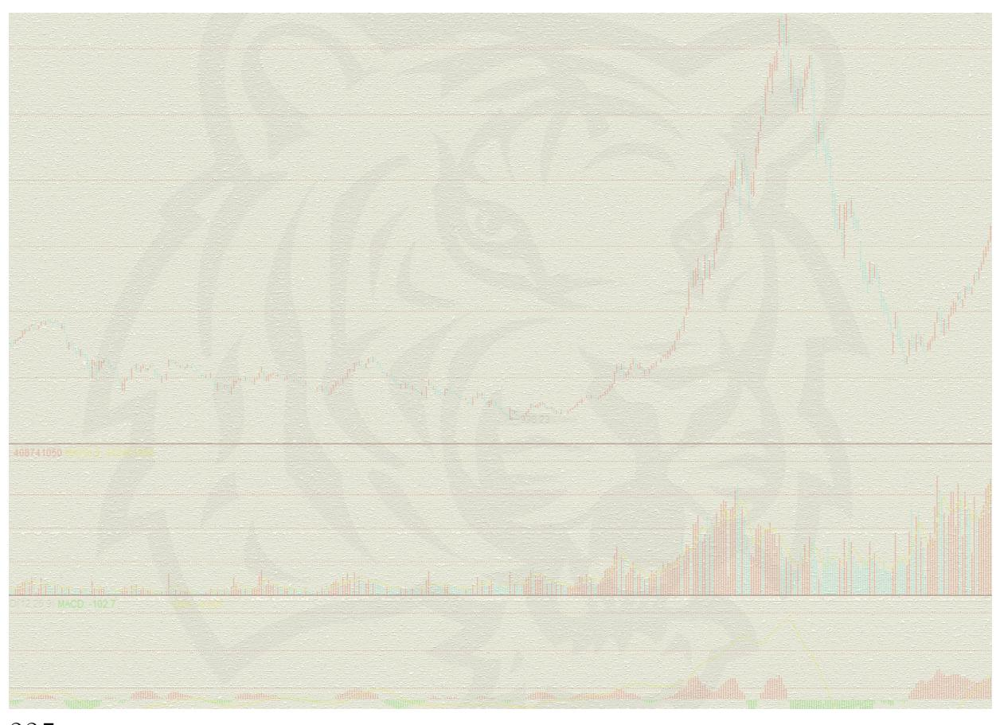

# 教你炒股票 23:市场与人生

(2007-01-15 15:50:11)说了这么多技术上的问题,暂且停一期,说说 技术外的事情。技术只是最粗浅的东西,同样的技术,在纯技术的层 面,在不同人的理解中,只要能正确地理解里面的逻辑关系,把握是 没有问题的,但关键是应用,这里就有极大的区别了。市场充满了无 穷的诱惑与陷阱,对应着人的贪婪与恐惧。单纯停留在技术的层面, 最多就是一个交易机器,最近即使能在市场中得到一定的回报,但这 种回报是以生命的耗费为代价的。无论多大的回报,都抵不上生命的 耗费。生命,只有生命才能回报,生命是用来参透生命,而不是为了 生不带来、死不带走的所谓回报。

但有一种人,自以为清高,自以为远离金钱、市场就是所谓的道。可 怜这种人不过是废物点心,他们所谓的道不过是自渎的产物,道不远 人,道又岂何市场相违?人的贪婪、恐惧、市场的诱惑、陷阱,又哪 里与道相远?在当代社会,不了解资本市场的,根本没有资格生存, 而陷在资本市场,只能是一种机械化的生存。当代社会,资本主义社 会,无论有多少可以被诟病的,但却构成了当下唯一现实的生存。当 然,你可以反抗这种生存,但所有的反抗,最终都将资本主义化,就 如同道德资本、权力资本的游戏之于资本的游戏一般。了解、参与资 本市场,除了以此兜住那天上的馅饼等小算计外,更因为这资本、这 资本市场是人类当下的命运,人类所有贪嗔痴疑慢都在此聚集,不与 此自由,何谈自由?不与此解脱,何谈解脱?自由不是逃避、解脱更 不是逃避,只有在五浊恶世才有大自由、大解脱,只有在这五浊恶世 中最恶浊之处才有大自由、大解脱。

当然,政治也是这五浊恶世中最恶浊之处,那些在政治在失败者,是 没资格谈论什么自由、解脱的;淫乱也是这五浊恶世中最恶浊之处, 在淫乱中所谓坐怀不乱者是无所谓自由、解脱的。出于污泥而不染

者,不过是自渎的废物,污泥者又何曾污?染又何妨?真正的自由、 解脱,是自由于不自由、解脱于不解脱,入于污泥而污之,出于污泥 而污之,无污泥可出而无处污泥,无污泥可入而无处不污泥。

投资市场最终比的是修养与人格及见识,光从技艺上着手,永远只能 是匠人,不可能成为真正的高手。古代有所谓的打禅七,在现代社 会,能找到 7 天来打禅七是极其奢侈的事情了。但每周,有一个小 时,抛开一切束缚,抛开一切人群,独自一个人,在房间里、在高山 上、在河流里、在星空下、在山野的空谷回音中,张开没有眼睛的眼 睛、没有耳朵的耳朵、俯视这世界、倾听这世界。其实,何处不是房 间、高山、河流、星空、山野?何处有束缚需要抛开?在资本、政 治、淫乱贪婪、恐惧的血盆大口里,就是自由、解脱的清凉之地。当 然,如果没有如此见识,还是先去需要自己的房间、高山、河流、星 空、山野,但最终,依然要在五浊恶世中污之恶之,不如此,无以自 由、解脱。

\*\*\*\*\*\*\*\*\*\*\*\*\*\*\*\*\*\*\*\*。

解盘及互动问答:

#### \*\*\*\*\*\*\*\*\*\*\*\*\*\*\*\*\*\*\*\*。

缠师:股票最终比的是修养与人格,股票的大师,归根结底是哲学、 艺术的大师。在现代社会,不了解资本市场的,根本没有资格在当代 社会生存。而光理解资本市场的,也不可能在当代社会有好的生存。 光从技艺上着手,永远只能是匠人,不可能成为真正的高手。2007- 01-14 15:16:32大家要为今天把人寿拉涨停出了力的给点掌声,本 ID 属于人寿的多头系统,人寿的问题,不单纯是个股问题,而是一个中 国定价权的问题。当然,空头还是比较大的,最大的危险在于经济学 以及经济系统的汉奸。人寿低位买了的就拿着了,现在位没必要追 了。

多空的斗争,还是很激烈的,一般的散户,抗风险能力低,千万别追 高。2007-01-15 16:08:06各位注意了:已经 N 次说过,现在是补涨 的天下,二线、特别是低价股横行,选好第三类买点,你会忙得不亦 乐乎。本 ID 教你的是找吃的本事,而不是光把饭给你,各位看看今 天涨停的股票,有多少是从第三类买点启动的,就上海的,而且只说

低价的,随便说几个:600608(600068)、600555、600784、600684、 600300、600829、600587、600820、600884。

(娇注:此处 3 买清一色属于递归级别的 5 分钟 3买,一分类型离 开和 1 分类型回抽 10 日线左右,30分 MACD 回抽 0 轴不破。在此 处是作为日 3 买登场。)各位好好研究一下,就用第三类买点,目前 就可以找到足够多的饭吃。自己找到的才是真本事。关键是把这技术 练好。2007-01-16 15:37:18

#### \*\*\*\*\*\*\*\*\*\*\*\*\*\*\*\*\*\*\*\*。

1. 网友[匿名] 手中无股:Lz,十分佩服,您觉得钱钟书怎样? 2007-01-15 15:59:43299 缠师:你就是佛,管那钱钟干啥?(2007- 01-1516:02:15)

#### \*\*\*\*\*\*\*\*\*\*\*\*\*\*\*\*\*\*\*\*。

2. 网友[匿名] 快:楼主及缠迷们周末快乐!2007-01-15 16:07:59网 友[匿名] 沉醉:看样子你应该是 80 年代的人,从你谈话中看出。估 计缠子不是你同时代的人。 2007-01-15 00:05:02网友淡定:在哪里 读书不重要,在名校至少比落后山区好多了。

网友[匿名] 快:是你自己的心在哪里,有这样的好条件,自己就问, 自己应该利用现有的条件做什么。你要什么?你心安定了,你的世界 就安然了。

网友[匿名] 沉醉:对大多数凡人来说,假设能在达到一定的高度后, 做到"心安定了" ,应该是一生的追求吧?数女以为如何?缠师:能 乱的是你的心吗?你的心什么时候乱过?别认贼作父。(2007-01-15 16:11:30)

#### \*\*\*\*\*\*\*\*\*\*\*\*\*\*\*\*\*\*\*\*。

3. 网友[匿名] 水房姑娘:人寿和联通接过工行的大旗,不知这旗能 打到什么时候?对小散来说,什么时

候逃命安全呢?2007-01-15 16:12:36缠师:工行是不应该倒的,如果 工行倒了,就意味着牛市的第一波结束。(2007-01-15 16:17:45)

#### \*\*\*\*\*\*\*\*\*\*\*\*\*\*\*\*\*\*\*\*。

4. 网友[匿名] 雨中荷:楼主好!股友好!请教楼主,000029(深深 房)的日线图形,是不是已经形成了两个缠中说禅的中枢?而且方向 是向上的,应该是上涨的趋势。不知我的判断是否正确?请楼主指 教。

先谢了!2007-01-15 16:17:34300 缠师:一个大型的月线级别的大中 枢,正谋求向上突破。三线地产股补涨时会有表现的。(2007-01- 1516:19:40) 301 5. 网友[匿名] 中间体:缠姐,我个人感觉在某种 意义上, 第三类买点很类似突破平台后的回档确认,对吗?2007-01- 15 16:16:27缠师:不够精确。这样就会有很多假突破被包含其中了, 而且不是什么平台的突破都能搞的。(2007-01-1516:21:02)

#### \*\*\*\*\*\*\*\*\*\*\*\*\*\*\*\*\*\*\*\*。

6. 网友[匿名] 外科医生:另外说一句,我现在每天晚上和在外地的 老妈交流读你的文章的体会。老妈天天学到很晚,重点文章都学了好 多遍了。

缠师:先把各种图看好,各种情况分析好。关键在实践中把握。 (2007-01-15 16:22:00)

#### \*\*\*\*\*\*\*\*\*\*\*\*\*\*\*\*\*\*\*\*。

7. 网友[匿名] 快:小女两周岁了。多大开始让她感受您的"周末音 乐会"更适合?另外,听此类音乐,对器材有起点的要求吗? 2007- 01-15 16:12:11缠师:开始先听莫扎特比较轻松的作品,器材一般就 可以。对器材的追求很容易走火入魔,没必要。

(2007-01-15 16:23:37)

#### \*\*\*\*\*\*\*\*\*\*\*\*\*\*\*\*\*\*\*\*。

8. 网友[匿名] 外科医生:预测到反弹,没有想到如此强烈。会是最 后的疯狂吧?呵呵。2007-01-1515:55:42缠师:这是很不精确的想 法,什么叫最后的疯狂?最后的疯狂,如果是指牛市最后一段的走 势,那还早着呢。如果指第一波最后的走势,站在深成指的角度,第 二个周线的中枢都没有出现,怎么会存在最后的疯狂问题?一般来 说,牛市的第一波,一定要出现两个周线中枢后再一次的上涨,这时 候才有最后疯狂的可能。那时候,低价成分股会上演疯狂行情,那时 候就要小心了。现在如果拿着涨幅不大的成分股,那就是拿着印钞 机。(2007-01-15 16:29:08) 302

#### \*\*\*\*\*\*\*\*\*\*\*\*\*\*\*\*\*\*\*。

- 9. 网友[匿名] 雨中荷:请教楼主,000029(深深房)的日线图形是 不是已经形成了两个缠中说禅的中枢了?而且方向是向上的,应该是 上涨的趋势。不知我的判断是否正确?请楼主指教。先谢了!2007- 01-15 16:32:08缠师:一个大型的月线级别的大中枢,正谋求上破。
- 三线地产补涨时会有表现的。

#### \*\*\*\*\*\*\*\*\*\*\*\*\*\*\*\*\*\*\*\*。

10. 网友[匿名] 雨中荷:回复收到。谢楼主!月线是一个大的中枢, 但是日线是不是已经形成了两个向上的中枢了呢?我不敢确认,所以 请教楼主。(悄悄问一下三线地产股什么时候会补涨?)

缠师:但两个中枢并没有形成趋势,只形成了中枢的扩展。只有中枢 的新生才能形成趋势的。中枢有三种命运:延伸、扩展、新生(2007- 01-15 16:34:20) 303304 11. 网友[匿名] 水房姑娘:请缠M推荐几 本对新入股市的新手来说读了会有长进的书 2007-01-1516:32:49缠 师:只推荐读缠论。不建议读其他的股市糟粕书。

(2007-01-15 16:35:17)

#### \*\*\*\*\*\*\*\*\*\*\*\*\*\*\*\*\*\*\*\*。

12. 网友[匿名] 中间体:缠姐,第三类买点出现后,什么时候能下 手? 因为下手早了有可能它还下去(当然这就不够成第三类买点), 下手晚了,它有可能窜上去了。这技巧很关键啊。(看小级别 K 线 吗?)望缠姐指导。 2007-01-15 16:33:07缠师:早说过了,第三类 买点就可次次级别的第一类买点。(2007-01-15

16:36:54)\*\*\*\*\*\*\*\*\*\*\*\*\*\*\*\*\*\*\*\*13. 网友[匿名] 善存:除了年末为 银行卖命,没有研究大作外,这几天都在学习,只是没有说话。不知 道缠妹妹有没有兴趣做一下私募,现在应该是很好的时机。如果以后 决定做,别忘了说一声,我一定会购买。另外,还可以给你推荐一个 好帮手,我觉得他是属于比较有实力的了。2007-01-15 16:32:24缠 师:本 ID 有很多私募的朋友,不过本 ID 没兴趣干什么私募了。如 果本 ID 愿意,特别知道本 ID 干过什么事后,估计要破公募的记

录。本 ID 现在更多的时间要花在文化的建构上,以后出现,也完全 以此示人。(2007-01-15 16:43:25)

#### \*\*\*\*\*\*\*\*\*\*\*\*\*\*\*\*\*\*\*\*。

14. 网友[匿名] 猫猫:请问:这几天大盘的 30 分钟是不是走势必完 美了呀?2007-01-15 16:30:13缠师:你还没理解什么是走势必完美。 在上个高点,用走势必完美,就知道大盘一定会再回跌一次。而这个 回跌,在此级别上,一旦出现第一类买点,就会出现再次的上攻。目 前的走势无非两种可能。一种是演化成三角形走势,另一种是直接突 破。如何判断?很简单,就看到前期高位时,次级别的走势是否出现 背弛,一旦出现,就要再次回跌,否则就直接突破了。

(2007-01-15 16:48:30) 305 306 15. 网友[匿名] 清:学技术,问问 题。问题 1:能否分别指出在日、30 分钟、5 分钟 K 线图里面, 短、中、长均线一般采用多少天均线。问题 2:女上位后第一次缠绕 形成的低点(第二买点),可以比第一买点的价格更低吗?记得"本 ID"举出的一个 30分钟图的茅台例子,就是这种情况。但另一方面, "本 ID"又说过,当在第二买点买入后,一旦上涨时出现男上位缠 绕,且缠绕中出现跌破前面男上位的最低位,就一定要退出(避免买 入程序的错判)。那这会是矛盾吗?还是一个风险度的问题?还是我 理解错了?问题 3:今天的股票不少已经收复周五的失地,但从 30 分钟图上看,很多是男上位后第一次缠绕,那么接下来要做短差的卖

点是否就要盯紧 5 分钟图是否出现背驰?还是要结合什么图的均线去 看?谢谢!2007-01-15 16:07:55缠师:先把中枢搞清楚,均线都是配 合的东西。中枢是根本。(2007-01-15

16:51:04)\*\*\*\*\*\*\*\*\*\*\*\*\*\*\*\*\*\*\*\*16. 网友[匿名] 中间体:缠姐,你 从没提到成交量所起的作用, 我想肯定有很大作用,能不能略表其 义?2007-01-15 16:49:37缠师:成交量和走势一样,有着类型的分 析,以后会说到。(2007-01-15 16:55:48)

#### \*\*\*\*\*\*\*\*\*\*\*\*\*\*\*\*\*\*\*\*。

17. 网友[匿名] 小屁孩:lz 您好!您看一下这两句话是不是矛盾 啊?还是我没看懂啊?"走势中枢的延伸与不断产生新的走势中枢, 并相应围绕波动,互不重叠而形成趋势。在这两种情况下,一定不可 能形成更大级别的走势中枢。而要形成一个更大级别的走势中枢,必 然要采取第三种的方式,就是围绕新的同级别走势中枢产生后的波动 与围绕前中枢的某个波动区间产生重叠"。"缠中说禅走势中枢中心 定理一:走势中枢的延伸等价于任意区间[dn,gn]与[ZD,ZG]有重 叠。换言之,若有 Zn,使得 dn>ZG 或 gn<ZD,则必然产生高级别的 走势中枢或趋势及延续。"2007-01-15 16:29:03缠师:怎么会有矛 盾,自己画图一下就明白了?不是中枢的延伸,就是中枢的扩展,也 就是产生高级别的走势中枢;或者中枢的新生,就是趋势及延续。

(2007-01-15 16:58:35)

#### \*\*\*\*\*\*\*\*\*\*\*\*\*\*\*\*\*\*\*\*。

307 18. 网友[匿名] 是知也:MM,我今年进了600162(香江控股), 是被他们的当家人翟美卿的爱心打动而进入的,没有体会到爽的感 觉,失去了宝贵的时间。苦恼死了!你能帮我分析一下吗?我对中枢 的概念不太理解,什么是三个次级别连续走势类型的重叠?能不能说 具体一点?谢谢了。2007-01-1516:54:09缠师:有一个数学公式,先 把公式搞明白。(2007-01-15 16:59:33)

#### \*\*\*\*\*\*\*\*\*\*\*\*\*\*\*\*\*\*\*\*。

19. 网友[匿名] 插班生:一直有个疑问,请楼主指点:形成两个中 枢,且同向,才能构成趋势?例如,在盘整后(30 分钟线的中枢), 以次级别(5 分钟)走势向上走,在 5 分钟线上还没有形成中枢前,

可以看做是中枢(30 分种)的离开。但在形成第一个 5分钟线上的中 枢后,此时如何看待当下(30分钟)的走势? 2007-01-15 16:44:58 缠师:注意,有几个概念必须搞清楚:一、即使形成一个 5 分钟的中 枢,依然有回跌入原 30 分钟中枢的可能。二、离开中枢,并不意味 着中枢不会继续延续,只要这个离开只是次级别的,而下一个次级别 的回抽一样有可能重新回到原中枢而使得中枢延续。

三、这里必须搞清楚第三类买点的介入时机,就是一定要使得回抽的 次级别不能回到原中枢这一点得到确认,这可以参考该次级别的第一 类买点。

中枢的延续、扩展、新生之间的区别是很细微的,必须严重认真地研 究三者对应的数学公式,那是最精确的。在新的中枢形成之前,中枢 的这三种可能性都不可能完全从逻辑上排除。而第三类的买卖点的精 妙之处,在于不依赖于这种不可确定性而确定了,里面的细微之处请 好好理解。走势必完美是第一原理,搞不清这一点,其他都很难搞清 楚。(2007-01-1521:25:20)

#### \*\*\*\*\*\*\*\*\*\*\*\*\*\*\*\*\*\*\*\*。

20. 网友[匿名] 小溪:缠姐姐好!能真正做到自由、解脱的人,那他 不是凡人了。我好想知道 JJ 您自由、解脱了没?如果您能真正自 由、解脱了,那您就是我心目中景仰的神了。2007-01-15 16:41:14缠 师:你就是佛,你景仰别人干啥?别自我憋屈了!(2007-01-15 21:26:44) 308

#### \*\*\*\*\*\*\*\*\*\*\*\*\*\*\*\*\*\*\*\*。

21. 网友[匿名] 恒旧常新:博主禅心妙意,美哉!只是我等冥顽之 辈,知易行难啦。可有验方?2007-01-15 16:58:32缠师:以此得失之 心求之,永无出离之日。知且无知,行其无行,无知而妄知,无行而 妄行,还求个验方、求个护身符干啥?可验方的,不离尔,离尔又求 何验方?尔求尔之验方,骑驴找驴干啥?(2007-01-1521:34:49)

#### \*\*\*\*\*\*\*\*\*\*\*\*\*\*\*\*\*\*\*\*。

22. 网友[匿名] 学生:求清净本是"心"所需,以求"能"之增长。 "能"是"天","心"乃"地" ,也是阳光与照之关系。心外求 学,心内见性。

缠师:心即见、见即性,乾坤不过尔心之一尘,还内外个什么? (2007-01-15 21:37:48)

#### \*\*\*\*\*\*\*\*\*\*\*\*\*\*\*\*\*\*\*\*。

23. 网友[匿名] 无言:缠姐,你好!难得你还在,请教两个问题: 一、跟你学论语,是不是也要照 1、2、3 的次序来,或者可以随意从 中学?二、要中长线跟踪一只股票,是不是先利用日线或周线确立买 点,再看月线根据中枢理论和走势必完美的原理来确定目标位。谢谢! 2007-01-15 17:02:19缠师:论语最好按顺序来,否则后面的用到前面 一些解释,完全没着落,理解会有困难。关于买卖点,是先按自己的 资金等实际情况确定适合的级别,然后在该级别的买点买入,持有到 卖点卖点,而不是确定什么目标位。不是预测,只要看以及反应。 (2007-01-1521:41:10)

#### \*\*\*\*\*\*\*\*\*\*\*\*\*\*\*\*\*\*\*\*。

24. 网友[匿名] yagami0122:缠妹应该知道量子物理学里面"观测 者"的问题吧,当"观测者"参与的时候,试验结果将会产生变化。 缠妹的这套缠论,众观测者对股市的"观测" ,将会决定该缠论的结 果发生变化,这套缠论也将贴上一个有效期的标签。2007-01-15 17:03:17309 缠师:量子力学只知道"不患" ,却不知道"不患"而 "患" ,更不知道"患"而"不患" 。就像只要在三角形之和为 180 度的空间里,平行线就永远没有交点,这和任何观察者都无关。

要理解本 ID 的理论,必须首先理解其数学性。本 ID的理论当然有过 时的可能,但其前提是自然数系统内部出现矛盾,换言之,就是数学 系统内部出现基础性矛盾,整个数学系统塌陷。这样,一切建筑在数 学之上,利用到数学的一切学科,也随之塌陷。(2007-01-15 21:54:53)

#### \*\*\*\*\*\*\*\*\*\*\*\*\*\*\*\*\*\*\*\*。

25. 网友[匿名] 夜雨:谁说女子不如男,美女姐姐就是奇女子。今天 文章形而上,不知有多少人能体会您的用心良苦呢。形而下,您也写 得好。文字其实不在于形式,而在于用心。虽然没有每天留言,每天 看你的文章,但很感动你的悔人不倦。虽然您的水平非常高,但并没

有让人有高高在上的感觉,而是与我们平常坐在在一起。还有我感觉 你一定是喜欢王小波的。

您现在做的事,写的文字,也有王小波遗风。你能回答一下,满足我 的猜测吗?谢谢!说一下,你不喜欢捧鲁迅,我想,你对鲁迅个人也 不讨厌的,其实你不喜欢的是把他利用为旗帜,成为一种象征,高高 在上,用来打击异已的的行为吧。其实鲁迅也只是平常人,对弱势群 体怒其不争,只好用尖刻的语言表达。你做得更好,对我们这些在股 市上的弱市群体,你耐心的教导我们学习炒股的方法。虽然你不具 名,但用行动表达你的理念,令人感动,并学习之。实践的方式不 同,但大爱是共同的。2007-01-15 18:08:56缠师:对不起,本 ID 对 王小波以及中国 20 世纪的所有文人都没有任何兴趣。一个打倒孔家 店的世纪,注定是一个荒芜的世纪。(2007-01-15 21:58:00)\*\*\*\*\*\*\*\*\*\*\*\*\*\*\*\*\*\*\*\*26. 网友[匿名] 水房姑娘:缠M得 道前,难道没有看到觉得受益非浅的书吗?2007-01-15 17:47:30缠 师:书上得来终是浅。(2007-01-15 22:00:43)

#### \*\*\*\*\*\*\*\*\*\*\*\*\*\*\*\*\*\*\*\*。

310 27. 网友[匿名] 逻辑一生:任何走势可以分解成上涨、下跌和盘 整,但是如果再细分到不能再分的最小的两个基本单元,即上涨和下 跌的话,就可以得出上涨和下跌是绝对的(特别是在股市),盘整是 相对的,由一定定义,例如均线系统来约束的上涨趋势和下跌趋势, 也自然就是是相对的概念。

缠师:刚好相反。如果站在超长线的角度,任何股票都不过是一个大 型的盘整。如果一定要说什么是绝对的,那盘整是绝对的。不过这种 绝对、相对的概念都是些糊涂概念,对操作没有什么意义。操作只是 一种反应,反应是当下的,没有什么绝对、相对。

#### \*\*\*\*\*\*\*\*\*\*\*\*\*\*\*\*\*\*\*\*。

28. 网友[匿名] 逻辑一生:有了上涨和下跌的最基本定义,我们就可 以进一步定义盘整,显然盘整是要三个以上最小单位价格的变化才能 给出的相对概念。与此类似,下跌趋势和上涨趋势也是需要三个以上 最小单位价格的变化才能给出的相对概念。而且对于实际应用来说, 通过对不同周期均线的定义,就可以得出受到均线系统约束的均线趋 势概念,实际中的技术分析通常也正是基于均线系统。因此,我们说

趋势和盘整都是相对的,而任何上涨和下跌趋势之间的转换或者继 续,必然又是要通过盘整来承前启后的,这点与lz(楼主)的看法基本 一致,其实也是如 lz 所说是可以被数学证明的。

缠师:上涨和下跌之间的转换完全没必要经历什么盘整,最典型的就 是 V 型走势。注意,盘整、下跌、上涨,都不过是一种结果,不是问 题的关键之处。均线也一样,均线只是一种结果,只能当一种参考, 不是关键之处。

#### \*\*\*\*\*\*\*\*\*\*\*\*\*\*\*\*\*\*\*\*。

29. 网友[匿名] 逻辑一生:而有了上述一些基本的概念,再结合混沌 理论、突变理论和数学上的正态分布等理论,只要你肯钻研,应该完 全可以构建一个类似楼主的中枢理论的技术分析系统。而这个系统如 果足够数学精确的话,也是完全能够解释市场中通常的一些经验描 述,例如:W/M 形走势,上下三角形/圆弧、横有多长竖有多高,甚至 预测并解释有些人梦寐以求的主升浪中最有血肉的一部分,当然这些 经验描述如果没有前面的理论依托,都不可能是高成功率的。

缠师:什么正态分布之类的东西,都是有其逻辑前提的,你要用所谓 的正态分布,首先要证明股市是符合这种逻辑前提的,可惜这种证明 是不存在的。本 ID的理论,是一种独立的公理化系统,和什么正态不 正态无关,这点必须搞清楚。否则又陷入一般数学化处理股市的陷阱 里。记住,数学不是一种先验的逻辑,任何现实的系统都有其现实的 逻辑。(2007-01-1522:17:38)311 30. 网友[匿名] 一尘:色不异空, 空不异色。色即是空, 空即是色。 受想行识, 亦复如是。2007-01- 15 20:02:07缠师:经是经,尔是尔!(2007-01-15 22:19:01)

#### \*\*\*\*\*\*\*\*\*\*\*\*\*\*\*\*\*\*\*\*。

31. 网友[匿名] 淡定:楼主好!掌握了您的理论就是让我们多一种战 胜恐惧和贪婪的工具,赢钱也就成了自然的结果,可您的理论真的很 难懂,如果可以的话,拜托多讲解,讲解得再浅显一点好吗?2007- 01-15 22:04:48缠师:其实,已经说得很浅显,逻辑关系很清楚了。

首先把中枢的数学公式搞清楚,然后把中枢的延伸、扩展、新生搞清 楚,然后再把握好各类的买卖点,一步步来,仔细研究一下就明白 了。(2007-01-1522:22:00)

#### \*\*\*\*\*\*\*\*\*\*\*\*\*\*\*\*\*\*\*\*。

32. 网友[匿名] abc: 600085 日线上的 1、2、3 类买点分别是 2006/11/14、2006/12/11、2006/12/29。

对吗?2007-01-15 21:48:02缠师:不对。在日线上,这段时间没有第 一、二类的买点,30 分钟上当然是有的。不过 12 月 28 日那一周却 是一个精确的周线上的第三类买点。这个日线上的次级别回抽有点特 殊,形成一种奔走形的走势,就是 B 段的上冲比较厉害,C 段的回拉 只是稍微跌破 A段的高点。有这种走势以后的个股,一般都会出现快 速上扬。(2007-01-15 22:32:09)

关键看好在前期高位是否有次级别的背弛出现,以防指数出现三角形 走势。另外就是深沪指数是否会背离,这也是一个危险信号,只要这 两点都不出现,那大盘就没大问题。用自己的眼睛观察,就足够了, 别预测什么。

个股还是低价股票,特别是那些这次回调刚好构成第三类买点的股 票,想想为什么 000600 节前回调后节后一下就来了快 50%,排除本 ID 的梦,最重要还是第三类买点的力量,本 ID 的梦只是让他更有力 量而已。再见。(2007-01-15 22:40:08)

#### \*\*\*\*\*\*\*\*\*\*\*\*\*\*\*\*\*\*\*\*。

33. 网友 [匿名] 摄影之友:"在图形上是一个标准的三角型,一般 中枢的延伸,如果是收敛形态,都会走成三角形,这以后会说到。" 博主,你说的收敛三角形,学文的我认为,就是厚积薄发的意思。对 吗?2007-01-16 15:20:56缠师:三角形也可以构成顶部的,必须按照 最精确的程序来。文科思维在这里可能会有麻烦。市场操作,还是多 点数学思维好。(2007-01-16 15:25:06)

#### \*\*\*\*\*\*\*\*\*\*\*\*\*\*\*\*\*\*\*\*。

34. 网友[匿名] 无知:缠 mm,感觉对背驰的判断还是不明白,以后 还有没有背驰的课?2007-01-1615:15:30缠师:有。(2007-01-16 15:25:34)

#### \*\*\*\*\*\*\*\*\*\*\*\*\*\*\*\*\*\*\*\*。

缠师:各位注意了。已经 N 次说过,现在是补涨的天下,二线、特别 是低价股横行,选好第三类买点,你会忙得不亦乐乎。本 ID 教你的 是找吃的本事,而不是光把饭给你,各位看看今天涨停的股票,有多 少是从第三类买点启动的,就上海的,而且只说低价的,随便说几 个:600608、600555、600784、600684、600300、600829、600587、 600820、600884。

各位好好研究一下,就用第三类买点,目前就可以找到足够多的饭 吃。自己找到的才是真本事。关键是把这技术练好。(2007-01-16 15:37:18) 315 35. 网友[匿名] 小小:老师好!我总是不自信。 600796 又没拿住,换 600333 了。自残!2007-01-16 15:28:55缠 师:自信是干出来的。多干点,多总结,自信就有了。但关键是要有 一套行之有效的操作规程,不断总结改进。(2007-01-16 15:39:15)

#### \*\*\*\*\*\*\*\*\*\*\*\*\*\*\*\*\*\*\*\*。

36. 网友[匿名] whq999:斗争很激烈,等待很痛苦,决定这几天不看 盘了,过阵子来收庄稼,缠妹帮我顶住。先谢谢了。 2007-01-16 15:38:07缠师:市场的任何事情都是锻炼人的机会,特别是那种痛苦 的事情。另外,说过多次了,自己找吃的,本ID 提供找吃的方法。目 前市场就两条主线,一个是低价补涨,一个是中高价的打开空间。后 者不大适合散户。

药是去年的酒,钢铁是去年的有色。另外像能源、汽车、军工等等, 都会有表现的。迟点,有业绩、有送股的股票,特别是去年炒得厉害 的,必须通过送股把股价弄下来,这是春节前后、特别是业绩公布高 峰时候的重点,这个节奏是很明显的。技术上,用好第三类买点,足 以把 95%以上的人赢了。自己找,别整天希望别人喂你吃饭。(2007- 01-16 15:51:16)

- 37. 网友[匿名] 摄影之友:"就回答你一个,山东人,本 ID 进去的 位置是一个周线级别中枢的第三类买点。该周线中枢是一个延伸形 态,在图形上是一个标准的三角型,一般中枢的延伸,如果是收敛形 态,都会走成三角形,这以后会说到。其他自己去研究。" (1)根 据"缠中说禅中枢"概念,本人寻找到2005/7/22 在山东人(指某个 山东的股票)的周线级别的图上,我看到了"缠中说禅"中枢了。 即:3.52-2.64元,2.64-3.57 元,3.57-2.73 元,区间为(2.73, 3.57)。
- (2)根据"缠中说禅中枢"第三类买卖点定理:一个次级别走势类型 向上离开缠中说禅走势中枢,然后以一个次级别走势类型回试,其低 点不跌破 ZG,则构成第三类买点;更根据老大的已知条件,在 12/19-12/21 时,量能激增,向上突破。由此我判断,老大是以 2 倍 的 1.8M 杀入。
- 316 是的。以上是我的判断。我仿佛看到亲爱的博主,站在"缠中说 禅理论"的基石上,轻轻微笑,上扬的嘴角挂满了智慧,用她那充满 个性的右手,连续三天都在山东人的额头轻轻点了三下。

我爱你。亲爱的博主,我从心底里尊重你,缠中说禅!追上吧。我告 诉自己。跟我喜欢的博主一起,我愿意。于是,我以 2.5 倍的 1.8M 跟了上去! 博主,我想得对吗?另,我有一个问题:你常常说打短 差。怎么办才能做短差?我真的不大懂。请指教下。

2007-01-16 15:15:09缠师:那股票中线肯定没问题。关键就是现在里 面太乱,本 ID 也不大愿意出手,一出手弄不好就当庄家了,这种事 情本 ID 是不干的。

还有,本 ID 赚钱的方法和各位有所区别,本 ID 是阻击,而不是坐 庄,也不是跟庄,所以有时候,大家耗着时,就会很折腾。一般一旦 一方取胜了,就会突然大幅变动股价,例如像那个能源一样突然就飞 起50%,不过前面的折腾也少不了。各位最好就别跟本ID 的股票。

大把股票有第三类买点的。特别是散户,一般第三类买点突破,都有 至少 20%以上的涨幅。各位等 30 分钟背弛就出来,换别的第三类买 点的,这样来回几次,资金利用率就高了,没必要跟着本 ID 打仗。

当然,本 ID 打仗,各位可以看现场直播。如果像药,你低位就拿着 的,那就继续拿着,否则在目前的位置就算了。本 ID 又不是庄家, 更不需要别人抬轿子,各自觅食去,把第三类买点的操作用熟,终生 受益。(2007-01-16 16:04:49)

#### \*\*\*\*\*\*\*\*\*\*\*\*\*\*\*\*\*\*\*\*。

38. 网友[匿名] 空读:"当然,政治也是这五浊恶世中最恶浊之处, 那些在政治上的失败者,是没资格谈论什么自由、解脱的;淫乱也是 这五浊恶世中最恶浊之处,在淫乱中所谓坐怀不乱者是无所谓自由、 解脱的。出于污泥而不染者,不过是自渎的废物,污泥者又何曾污? 染又何妨?真正的自由、解脱,是自由于不自由、解脱于不解脱,入 于污泥而污之,出于污泥而污之,无污泥可出而无处污泥,无污泥可 入而无处不污泥。" 刚学完上一篇。与以前之感触有所共鸣。万法皆 空,佛教为何搞许多清规戒律。形式的东西,当然,搞也是空,不搞 也是空,空也是空,不空也是空。恶也是空,善也是空,浊也是空, 清也是空,怎么做都没有错,错又何妨,有妨又如何。

317 "夫圣人者,不凝滞于物,而能与世推移。举世混浊,何不随其 流而扬其波?众人皆醉,何不哺其糟而啜其醨。乐在其中,亦不亦乐 乎。"2007-01-16缠师:正因为万法皆空,才有种种戒律;以空为 空,生死沉浮,岂有出期!(2007-01-16 16:10:05)

#### \*\*\*\*\*\*\*\*\*\*\*\*\*\*\*\*\*\*\*\*。

39. 网友[匿名] 无知:缠 mm,找第三类买点要不要除权?2007-01- 16 16:06:51缠师:无所谓,但如果你选好不复权就一直用不复权的, 别换来换去。(2007-01-16 16:12:59)

#### \*\*\*\*\*\*\*\*\*\*\*\*\*\*\*\*\*\*\*\*。

40. 网友[匿名] 我的 2006:弱弱的问一句:缠妹妹,我观注了你的 博客很久了。但是我却总是看不懂你的理论,能不能系统的给我们讲 讲? 2007-01-1616:04:07缠师:一直很系统。你一章章看下来,特别 从中枢开始着手,自然就明白了。目前这个说法是最准确、最精练 的。仔细把其中的关系搞清楚。 (2007-01-1616:15:20)

41. 网友[匿名] 插班生: 2007/1/15 目前 600021在周线上构成第三 类买点。请楼主批阅。谢谢!2007-01-16 15:58:26缠师:这个不准 确。为什么?因为如果是日线上的,那 1 月 5 日就构成了,因为只 需要一个 30 分钟级别的回试不回原来日线中枢就可以了。但如果是 周线上的,那第三类买点必须是日线级别的回抽,也就是由三段 30 分钟上的走势类型构成。目前只有一段,现在正在走第二段。第三段 无非就几种构成的可能:三角形、奔走型、之字型、平台型。中线该 股问题不大,但站在短线角度,最快速的就是 30 分钟回抽所对应的 日线上的第三类买点。例如对该股,1 月 5 日的第三类买点介入后, 在 5 分钟发现背驰后离开,然后就去换另外的日线第三类买点的股 票,这样资金利用率的高了。当然,如果没有这种快速切换的熟练, 就慢慢来,把操作的级别放大点。

一般按日线第三类买点进入的,只要你资金不太大,而且判断不出问 题,离开也及时,而且够勤奋,每天都选好下一个可介入的品种,那 么,一月内至少可以操作 7、8 次,一月翻倍并不是太难的事情,当 然,前提是你的资金不能太大。(2007-01-16 16:28:44)

320 321 42. 网友[匿名] 空读:戒律不亦空乎?不亦是以空为空,又 如何出呢?生死沉浮,又往哪里出呢?2007-01-16 16:26:39缠师:只 知道空为空,不知空不空,又岂知空?自古以来,得一空字而休去 者,如过江之鲫,可怜可叹。

先把空字放下,将有担起来。(2007-01-16 16:32:55)

#### \*\*\*\*\*\*\*\*\*\*\*\*\*\*\*\*\*\*\*\*。

43. 网友[匿名] 新手:你好,我看了你很多文章。我是第一次炒股。 照你说的,在 9.7 元买进了000900,可不怎么涨,能帮我看看吗? 谢! 2007-01-16 16:31:29缠师:现在已经 11 元多了?关键不是涨 了多少,而是你是否按规程操作了。你看现在你只有 15%的涨幅,明 天拉起来可能就一下 30%了,持有要有耐心,除非卖点出现,否则不 能乱动。但一但卖点出现,就必须离开。

你现在需要思考的不是庄家干什么去了,而是你是在什么级别上操作 的,现在该级别出现卖点没有。如果你希望快速一点,而且你的人反 应也比较快,那完全可以按小一点的级别操作。

注意,市场考验的是长期的赢利能力,而不是一次爆发的能力,关键 是长期有效的交易策略。买入时要把各种情况想好,持有要坚决,卖 更要坚决,这才能逐步提高。是你炒股票,不是股票炒你,先从自己 下手。(2007-01-16 16:39:52)

#### \*\*\*\*\*\*\*\*\*\*\*\*\*\*\*\*\*\*\*\*。

44. 网友[匿名] 牛牛:"一般按日线第三类买点进入的,只要你资金 不太大,而且判断不出问题,离开也及时,而且够勤奋,每天都选好 下一个可介入的品种,那么,一月内至少可以操作 7、8 次,一月翻 倍并不是太难的事情,当然,前提是你的资金不能太大。"请问缠 姐,这样的操作模式是否以 5 分钟为操作级别,选股看日线买点,进 出用 5 分钟买卖点吗?2007-01-16 16:41:17缠师:以日线的第三类 买点。要找这个买点,就看一个 30 分钟的回抽,而该回抽低点,就 看 5 分钟的背弛。必须三个级别共同来才可以。(2007-01- 1616:44:56)322 45. 网友[匿名] 空读:无名天地之始,有名万物之 母。故常无欲以观其妙,常有欲以观其徼。此两者同出而异名。有是 什么?空即不空,空即是有。不知如何处之?2007-01-16 16:42:51缠 师:以无见之妄文而论禅宗,何有出期?天地,尔心一尘,万物,尔 眼一翳,鬼窟中活计,何有出期!(2007-01-16 16:49:06)

#### \*\*\*\*\*\*\*\*\*\*\*\*\*\*\*\*\*\*\*\*。

46. 网友[匿名] 摄影之友:博主,中枢产生的意义,可以再讲讲吗? 我还是有些晕噢。象今天的药,五分钟药上我看到了一个中枢形成 了,那它的意义是什么呐? 2007-01-16 16:42:12缠师:这个以后会 说到的。现在最要紧的是把第三类买点搞清楚,然后实践中不断提 高,现在这种机会层出不穷,这么难得的实践机会,要把握好。 (2007-01-16 16:50:50)

#### \*\*\*\*\*\*\*\*\*\*\*\*\*\*\*\*\*\*\*\*。

47. 网友[匿名] 新年好:【网友:缠姐,能不能回答一下我的问题 啊,很迷茫啊。2007-01-16 16:45:41问题:600085 日线上的 1、2、 3 类买点分别是2006/11/14、2006/12/11、2006/12/29。对吗? 200701-15 21:48:02缠姐的回答:不对。在日线上,这段时间没有第 一、二类的买点,30 分钟上当然是有的。不过 12 月 28日那一周却 是一个精确的周线上的第三类买点。这个日线上的次级别回抽有点特 殊,形成一种奔走形的走势,就是 B 段的上冲比较厉害,C 段的回拉 只是稍微跌破 A 段的高点。这种走势以后的个股一般都会出现快速上 扬。】我的问题:请问缠姐,你这里所说的 A,B,C 分别是那三段? 本来以为是 A 段:2006/12/11-2006/12/20,B 段:2006/12/21- 2006/12/28,C 段:2006/12/29-2007/01/05。可好像跟你说不太一 样,我说的 B 段明显不是上冲。请缠姐告知 A、B、C 分别指的那三 段?如果理解了这个,那 000600 后来的急拉应该跟这是一样的道理 的。

323 缠师:2006 年 12 月 4 日到 2006 年 12 月 28日,三段一目了 然。注意,回调形成的中枢一定是下、上、下方式的。当然,这里的 下、上、下,可以有一段是以盘整的平走替代。(2007-01-16 16:53:57)

#### \*\*\*\*\*\*\*\*\*\*\*\*\*\*\*\*\*\*\*\*。

48. 网友[匿名] 牛牛:昨日用缠姐教的第三类买点在6.64 元买入了 600196,今日 7.36 元卖出,原因是30 分钟出现 macd 背离,且量价 也背离,但后市又拉起,我的这次操作有什么问题吗?请缠姐指教。 2007-01-16 16:53:41缠师:首先该股在 30 分钟上并没有什么背弛。 背弛需要两段趋势的比较,而不是单纯看 MACD 红柱子短了。本次回 调只是一个次级别背弛造成的,但不是 30分钟级别的。因此,站在 30 分钟的级别上,回跌后就要回补回来,然后等待 30 分钟真正的背 弛出现。

一般,如果你判断不太熟悉,只会 MACD,那么如果MACD 在高处形成 双头下来,在 0 轴附近会有一个再向上的过程。因为那双头,一般是 低级别背弛造成的。而真正的背弛,一般都要先回抽 0轴,然后再上 造成的。

其次,该股并不构成一个精确的三类买点,因为有所重叠。反而是去 年 11 月在月线上有一个精确的第二类买点,目前的上扬与高买点有 关。要对图形进行精确的分析,这需要不断磨练的,慢慢来,这是正 确的道理。(2007-01-16 17:08:11)

#### \*\*\*\*\*\*\*\*\*\*\*\*\*\*\*\*\*\*\*\*。

49. 网友[匿名] 中间体:你比如说,刚刚你讲到的600021,1 月 5 日出现的第三类日 K 线买点,从五分钟 K 线图上看,1 月 4 日就发 生了 5 分钟 K 线的背驰。是卖点,何以再能在 5 日买它? 2007- 01-16 17:06:33缠师:如果是 1 分钟图上,早上有卖点了,下午就会 有买点。为什么不可以在 5 分钟图上,4 日有卖点,5 日就有买点? 关键是这个买点构成的是日线上的第三类买点。买点与卖点出现的频 率和级别有关。如果是年线,估计人的一生最多就见一个股票的两个 第一类买点。(2007-01-16 17:12:57)

#### \*\*\*\*\*\*\*\*\*\*\*\*\*\*\*\*\*\*\*\*。

324 缠师:先下,有问题放下,晚上再说,再见。(2007-01-16 17:13:25)\*\*\*\*\*\*\*\*\*\*\*\*\*\*\*\*\*\*\*\*50. 网友[匿名] 水房姑娘:缠M能 否分析一下短途铁路 601333 庄家的意图。2007-01-16 17:14:49缠 师:临走前回答一下。这是一个错误的思维方式:首先,这种大盘股 票,一般来说并不一定有一个单独的庄家,里面打乱仗的机会更大, 其次,庄家就算有意图,能否实现还是个问题,如果碰到像本 ID 这 样的人,那庄家就倒八辈子的霉了。

正确的思路,只看走势本身,走势是各种势力综合的结果,这才是唯 一可以依据的东西。目前该股正在一个大的中枢里运行,等待再次放 量的时机。操作上,就看下次放量时是否能有效突破,如果走出上攻 走势,就看 30 分钟等低级别的图,等待卖点的出现,前提是你是按 日线级别操作的。再见。(2007-01-1617:20:41)

#### \*\*\*\*\*\*\*\*\*\*\*\*\*\*\*\*\*\*\*\*。

51. 网友[匿名] 牛牛:真心地感谢缠姐,自从学习了缠姐的理论后, 我彻底改掉了追价的恶习,这一个多月的业绩是去年一年的总和。还 有几个问题请教缠姐:1. 现在的普涨行情,很多股出现了第三买点后 等发现已经涨高了,是放弃,还是找次级别的一二类买点进入呢?请 问如何应对?2. 我时间比较多,资金量不是特别大。请问缠姐,我用 什么样的操作级别比较好呢?谢谢缠姐了!2007-01-16 17:24:18缠 师:如果你手头的股票在一个良好的上涨趋势中,就一定要坚决持 有。有些股票开始走得慢,但越走越快,不拿着,扔了换其他股票,

一来要忍受刚进去时震荡产生的亏损,二来一旦扔掉的涨得更好,心 里影响就更大了。

以前本 ID 不是说过一个大叔,3 块多让买的北辰实业(601588),4 块不到就扔了,被本 ID 一顿数落。当时说他去年主要是 3 元多买了 一只股票,所以还挣了点钱。他和上市公司十分熟悉,最后反而是让 上市公司的人给洗出来了,10 块钱全没了。到今天刚好一个月多几 天,今天一个涨停,快 14 了,后悔有用吗?卖点不出来就别卖了, 股票只要中线启动,其升势就不会很简单的改变。

至于新进股票,最好还是按规程来。这是一个习惯问题。如果按次级 别进入,就要按次级别的规程来。一旦上涨趋势确认,就一定要持有 到卖点出现为止。

- 一个好习惯,比短线的蝇头小利重要多了。因为无论你能挣多少钱,
- 一个坏毛病就足以化为乌有。(2007-01-16 21:10:31)

#### \*\*\*\*\*\*\*\*\*\*\*\*\*\*\*\*\*\*\*\*。

52. 网友[匿名] 外科医生:请问禅妹:有时候没有出现任何级别的背 迟,也就是没有出现卖点,但是股价却出现转折,不断下跌,这样的 情况怎么处理?多谢!2007-01-16 21:02:26缠师:这种情况根本不会 发生,只是没找到相应级别的转折而已。所以要对市场的走势不断观 察,才有机会提高。(2007-01-16 21:13:18)

#### \*\*\*\*\*\*\*\*\*\*\*\*\*\*\*\*\*\*\*\*。

53. 网友[匿名] 无知:今天深圳创新高而上海没有,是否算是背离 了?2007-01-16 20:50:10缠师:目前上海的上证指数是一个大盘指 数,所以如果只是一两天出现这种情况,问题还不算大,但如果长时 间出现,那就问题大了。所以本周上海必须创新高,否则调整级别要 继续加大。(2007-01-1621:16:58)

#### \*\*\*\*\*\*\*\*\*\*\*\*\*\*\*\*\*\*\*\*。

54. 网友[匿名] 新菜鸟:请问缠姑娘:600028 今天上午收盘时,5 分钟和 30 分钟是不是出现了第一类买点?按走势完美的规则,它是 不是应该探 10.20元,然后再?怎么操作啊?才看您的文章,还不熟 练。2007-01-16 18:20:18326 缠师:1 分钟图上在上午收盘前,是一 个第一类买点,其他图上倒没有。他的走势,基本就是工行的一个翻 版,比工行滞后点。

#### \*\*\*\*\*\*\*\*\*\*\*\*\*\*\*\*\*\*\*\*。

55. 网友[匿名] 新菜鸟:您说药是去年的酒,钢铁是去年的有色。我 觉得石油是去年的银行。因为他有战略意义。我是瞎猜的,所以今天 本来要割肉的。没有割,在我觉得像是 5 分钟的买点上补了一点。我 是菜鸟,但我希望通过在这里的学习,看能不能变成个大鹏鸟。呵 呵。大家别笑,帮帮我哦。

缠师:石化(600028)中线问题不太大,短线在 10元上下还要折腾。

炒股票要注意节奏。前段时间是超级大盘的天下,现在是二、三线股 的天下。不能把节奏弄错了。如果弄错了,就等吧。找机会把节奏调 回来。一般最好别砍仓,牛市砍仓,太不吉利了。而且很容易把心情 弄坏,节奏会越来越错。最好就等等,反正板块会轮动,轮到他时, 如果走不出上涨的延伸,就找机会出来。一大堆低价股票在向你招 手,有必要追高吗?等待的时候,好好反省,以后一定要把握节奏。 (2007-01-16 21:29:23)

#### \*\*\*\*\*\*\*\*\*\*\*\*\*\*\*\*\*\*\*\*。

56. 网友[匿名] ccy:报告一下,学习缠女的理论有两月了。市值从 2.5万元增至3.6万元了。十分感谢。今天来冒个泡。2007-01-16 21:08:05缠师:继续努力。牛市结束前,至少把这变成 100万。也就 再来 30 倍,5 次翻番就可以了。本 ID 和你设计一下,第一波成分 股的行情中,把它变成 10万,应该是难度不大的。第二波的成长股行 情,如果弄得好,100 万的任务就完成了。还有第三波最疯狂的重组 行情,你的目标应该是 1000 万了。(2007-01-16 21:34:35)

#### \*\*\*\*\*\*\*\*\*\*\*\*\*\*\*\*\*\*\*\*。

57. 网友[匿名] 手中无股:Lz,对"第三类买卖点定理"中的"其低 点不升破 ZD,则构成第三类卖点" ,应为"其高点不升破 ZD,则构 成第三类卖点" ,不知对不对?2007-01-16 21:34:19327 缠师:谢 谢!是高点。写的时候是把买点的复制过去改了几个字,应该是改漏 了。现在去改回来。

#### \*\*\*\*\*\*\*\*\*\*\*\*\*\*\*\*\*\*\*\*。

58. 网友[匿名] 在路上:【各位注意了:已经 N 次说过,现在是补 涨的天下,二线、特别是低价股横行,选好第三类买点,你会忙得不 亦乐乎。本 ID教你的是找吃的本事,而不是光把饭给你,各位看看今 天涨停的股票,有多少是从第三类买点启动的,就上海的,而且只说 低价的,随便说几个: 600608、600555、600784、600684、600300、 600829、600587、600820、600884。各位好好研究一下,就用第三类 买点,目前就可以找到足够多的饭吃。自己找到的才是真本事。关键 是把这技术练好。2007-01-1615:37:18】(此处是引用缠师的话)缠 姐的这几个例子举得好。600820、600829 这两个股票我腾不出手来 搞,但身边的朋友们可就赚大了。看到缠姐提到,自信又增加了,证 明学的方向还是对的,至少自己看到的股票被提到了。2007-01- 1621:18:36缠师:本 ID 的理论就如同欧几里德几何,只要学会了, 任何人应用都是一样的。所以该尊重的是理论本身,而不是本 ID。本 ID 也不能违背该理论。就像牛顿发现了万有引力,但依然在万有引力 之中。所以,有信心的是理论本身。而对理论的信心来自对其逻辑结 构的充分理解,进而在实践中不断校对其理解,这样才真的变成自己 的。注意,这几只股票都走出第三类买点后的上扬了,没必要去追 高,还有更多的刚在第三类买点的股票再招手,自己去找去。(2007- 01-1621:43:35)\*\*\*\*\*\*\*\*\*\*\*\*\*\*\*\*\*\*\*\*59. 网友[匿名] 淡定:请教楼 主两个问题:1. 000001 在 1 月 11 日出了日线级别的第三类买点? 2. 600050 在 1 月 11 日出了第一类卖点,目前等第三类买点的出 现,对吗?多谢了!2007-01-1621:36:38缠师:还要抓紧学习。所有买 点都肯定是调整时出现的。怎么会 000001 的 1 月 11 日是第三类买 点?发展(000001)现在的买点,基本都只能在 30 分钟以上才有 了,除非出现大的调整。

注意,这样并不会丢掉任何一段有价值的行情。在行情的延伸段里, 一个 30 分钟的买点到卖点所产生的利润,比日线启动初期要大多 了。600050 的 1月 11日不是什么第一类卖点。反而是 4 日有一个 5 分钟背弛引发的小级别卖点。联通(600050)的中线潜力是不小的。 且不说什么 3G,一个通讯公司的海龟,就足以让联通上 8 元。当 然,短线整理一下也应该。

(2007-01-16 21:56:38)

#### \*\*\*\*\*\*\*\*\*\*\*\*\*\*\*\*\*\*\*\*。

60. 网友[匿名] 天地:【各位注意了:已经 N 次说过,现在是补涨 的天下,二线、特别是低价股横行,选好第三类买点,你会忙得不亦 乐乎。本 ID 教你的是找吃的本事,而不是光把饭给你,各位看看今 天涨停的股票,有多少是从第三类买点启动的,就上海的,而且只说 低价的,随便说几个:600608、600555、600784、600684、600300、 600829、600587、600820、600884。各位好好研究一下,就用第三类 买点,目前就可以找到足够多的饭吃。自己找到的才是真本事。关键 是把这技术练好。2007-01-1615:37:18】(此处是引用缠师的话) 600684 的第三类买点我怎么没看出来啊。12 日的回调可是在中枢里 的。之前的么?怎么看的?是打错了还是我没看出来?2007-01-16 21:53:18缠师:是在周线的中枢里,但在日线的中枢外。而对于日线 上的第三类买点,只要一个 30 分钟级别的回抽不破日线中枢就可以 了。有时候不同级别的中枢缠绕在一起,会对判断产生困难,关于这 方面的事情,以后会说到。(2007-01-16 22:00:30)

#### \*\*\*\*\*\*\*\*\*\*\*\*\*\*\*\*\*\*\*\*。

61. 网友[匿名] 手中无股:Lz,对"ccy"的增收计划看得很吸引 人,但给个大致的期限好吗?不会是"一万年吧!" (开个玩笑)。 2007-01-1621:52:50缠师:你没看清楚?牛市结束前,牛市分三波。 现在是牛市的第一波,这个已经说了无数次了。(2007-01-16 22:01:40)

#### \*\*\*\*\*\*\*\*\*\*\*\*\*\*\*\*\*\*\*\*。

62. 网友[匿名] 恒旧常新:博主似乎一直在用否定一切的语言,劝人 放下。却又教我等在股市赚钱的真本事。难不成放下就是为了拿起? 放下一切才能拿起一切?如果这是目的,为何不将这目的放下?如果 放下这目的,那这人生有何意义?难道这真是一场游戏?一场不是梦 的真实游戏?要的是我们真情实意的投入,玩耍一场,直到游戏结 束,各自回家。家在那里?也许一直在家,游戏是在家里玩的。2007- 01-1621:14:03329 缠师:放下、拿起,都是自生分别,本 ID 这里无 如许葛藤。本 ID 连淫乱都不否定,还否定语言干什么?在这里寻活 计是没出路的。偷心不死,永无出途。(2007-01-16 22:06:17)

63. 网友[匿名] 插班生:再次学习第三类买点,体会如下,请楼主指 点。例如:日线的第三类买点,由离开日线中枢(在 30 分钟线上) 的次级别走势类型(由 5 分钟线确定)回抽不再回到日线中枢的 ZG 产生,而这个回抽是由日线中枢的次级别(5 分钟线上)走势类型来 确定。而要完成该回抽走势类型(5分钟线确定),需要包含 2 个该 回抽走势类型的次级别中枢(在 1 分钟线上)。所以介入点一定是 5 分钟线上的回抽走势类型完成后,即产生新的走势(1分钟线上的新中 枢)。这时才代表回抽走势类型的完成。(此处引自课文:走势终完 美) 2007-01-1621:49:29缠师:没必要。只要在 5 分钟的第一类买 点介入就可以。这关系到背弛的判断问题,以后会继续说。在实际操 作中,如果判断不准,就参照一下技术指标,一般这时候,30 分钟的 MACD 有一个回抽 0 轴的动作,一般都不该跌破。(2007-01-16 22:09:27)

#### \*\*\*\*\*\*\*\*\*\*\*\*\*\*\*\*\*\*\*\*。

64. 网友[匿名] 新年好:缠姐,请问 000767,000800 日线上是不是 形成了奔走式?还有啊,缠姐不打算告诉我们什么相当于去年的银行 了吗?我想是保险公司,对吗?2007-01-16 22:08:13缠师: 000767 在 12 月 26 日是一个标准的第三类买点,没什么奔走的。000800 是 12 月 22 日,也没有什么奔走。(2007-01-16 22:17:01)

#### \*\*\*\*\*\*\*\*\*\*\*\*\*\*\*\*\*\*\*\*。

65. 网友[匿名] 淡定:多谢楼主!顺便检讨一下,昨天把 600555 给 丢了,郁闷死了,真该好好学习啊。

2007-01-16 22:12:37缠师:为什么?这么标准的第三类买点产生的上 扬,怎么都该等到次级别的背弛卖点出来才走。要养成好习惯,别荡 两下就晕了。(2007-01-16 22:20:23) 330

#### \*\*\*\*\*\*\*\*\*\*\*\*\*\*\*\*\*\*\*\*。

66. 网友[匿名] 看聊:让我头痛的背弛啊。2007-01-16 22:10:59缠 师:先把这理解了:一、两段前后同向趋势间的比较。二、如果用 MACD 辅助,关键是连接两个趋势的走势类型所产生的回抽 0 轴过 程。其后出现的背驰才是有效的。更精确的判断,以后再说。

67. 网友 [匿名] 手中无股: Lz,您提供的 600608第三类买点怎么 看不出来?2007-01-16 22:28:45缠师:是 600068(葛洲坝), 600608 是笔误。各位注意一下。600608 今天好象停牌了,怎么可能 涨停。

#### \*\*\*\*\*\*\*\*\*\*\*\*\*\*\*\*\*\*\*\*。

缠师:各位注意了:已经 N 次说过,现在是补涨的天下,二线、特别 是低价股横行,选好第三类买点,你会忙得不亦乐乎。本 ID 教你的 是找吃的本事,而不是光把饭给你,各位看看今天涨停的股票,有多 少是从第三类买点启动的,就上海的,而且只说低价的,随便说几 个:600068、600555、600784、600684、600300、600829、600587、 600820、600884。

各位好好研究一下,就用第三类买点,目前就可以找到足够多的饭 吃。自己找到的才是真本事。关键是把这技术练好。(2007-01-16 22:39:31) 各位注意了:由于回答的问题众多,出现个把笔误是不可 避免的,有发现的请提出来,本 ID 没时间每个字都看得很清楚。例 如上面 600068 与 600608的问题,本 ID 前面已经有定义的,就是 "各位看看今天涨停的股票,有多少是从第三类买点启动的,就上海 的,而且只说低价的,随便说几个" ,看看今天的涨停版就知道写错 了。所以请各位有什么问题都可以提出来,不要把疑问吃到肚子里。 (2007-01-16 22:44:43) 前面已经说过如果出现次次级别的背弛就要 走三角形,今天 5 分钟的背弛如此明显还看不出,那就要去好好补课 了。

还有人寿在 5 分钟上也是典型的背大盘今天的震荡是 5 分钟的背弛 引发的,一个绝好的短差机会,如果没把握好的,继续好好学习。这 么典型的走势必须要把握好。没搞清楚的,就把上海和人寿的 5 分钟 图弄出来好好研究。其实,就算你看不懂大盘,看本 ID 阻击的股票 今早开始就走得特难看,就知道今天要震荡了。当然,本 ID 的快乐 都是建筑在庄家的痛苦之上,这里说声对不起了,傻庄们。

(2007-01-17 15:18:53)

68. 网友[匿名] 无言:缠姐,这次调整是会以时间换空间,还是以空 间换时间?2007-01-17 15:18:23缠师:就算真的突破,也需要这样的 震荡洗盘,而且深圳昨天有缺口,这也是压力。这种震荡是绝好的短 线机会,具体分析看上面。(2007-01-17 15:22:15)

#### \*\*\*\*\*\*\*\*\*\*\*\*\*\*\*\*\*\*\*\*。

69. 网友[匿名] 学习: LZ,今天大盘在 30 分钟里算背弛吗?2007- 01-17 15:19:29缠师:没必要管 30 分钟。因为突破是日线的次级别 走势,也就是 30 分钟图上的调整是否结束,要看 5分钟是否背弛。5 分钟的背弛太明显了。昨天本ID 还特别说过,两段趋势,中间的 MACD 回抽 0 轴后背弛,自己去看看,是不是教科书一样精确。 (2007-01-17 15:25:18) 缠师:各位:如果对背弛没有什么直观感觉 的,好好看看今天的上海大盘以及人寿的 5 分钟图,标准图形,这里 本 ID 还要对人寿的庄家说声对不起,本 ID 也弄了他的短差,虽然 本 ID 中线是看好他,但本 ID 见到背弛就要发狠,没办法,对不起 了。(2007-01-17 15:28:36)

#### \*\*\*\*\*\*\*\*\*\*\*\*\*\*\*\*\*\*\*\*。

70. 网友[匿名] 快:牛市第一阶段结束的标志,数女能否再综合阐述 一下?2007-01-17 15:26:08332 缠师:还早着呢。牛市第一阶段怎么 会这么快结束?就算是大级别调整,也是第一阶段的中途调整。

第一段走势,走个 08 年都是正常的。当然,中途调整几个月也是正 常的。对于高手来说,调整最好,来回的机会更多,更好玩。调整的 钱更好抢。(2007-01-17 15:31:43)

#### \*\*\*\*\*\*\*\*\*\*\*\*\*\*\*\*\*\*\*\*。

71. 网友[匿名] 满目山河:没错,一直记着 LZ 说的"可能走三角 形" ,故而保持较低的仓位。但是,确实对"背驰"把握不好(几只 股票卖得均比较早),还请 LZ 再详细说说。2007-01-17 15:29:00缠 师:把今天这两个图好好看,印在脑子里。(2007-01-17 15:32:42)

#### \*\*\*\*\*\*\*\*\*\*\*\*\*\*\*\*\*\*\*\*。

72. 网友[匿名] 无言:缠姐,这次调整是会以时间换空间,还是以空 间换时间?(此处:问题与 68 重复,但缠师的回答没重复)200701-17 15:18:23缠师:已经调整很多天了,目前可探讨的是调整是否 延续的问题。这个在本周,最迟下周一就有答案。但即使调整,个股 行情不断,只要没启动的低价股,都有机会。现在指数的意义不是太 大。(2007-01-1715:35:10)

#### \*\*\*\*\*\*\*\*\*\*\*\*\*\*\*\*\*\*\*\*。

73. 网友[匿名] 小菜:老师,可以帮我分析一下600075吗?我 不是太懂。2007-01-17 15:27:54缠师:如果你对本 ID 的理论没搞清 楚,最简单就看均线,中线 20 天不破就拿着。然后好好研究本 ID的 理论。(2007-01-17 15:37:55)

#### \*\*\*\*\*\*\*\*\*\*\*\*\*\*\*\*\*\*\*\*。

74. 网友[匿名] 学习:"两段之间的回抽,大盘是以走势类型完成 的,已经看得比较明显了。" (此处是引用缠师的话) 是不是中间 必须以走势类型进行回抽。我的理解是,如果不是以走势类型回抽, 就够不成两段趋势。这样理解对吗?还是直接回抽将 MACD回抽至 0, 就可以比较了?缠师:当然,中间也是一个走势类型,可以明显看出 三段来。你看看那两个图,极为标准,跟教科书一样。(2007-01-17 15:40:07)

#### \*\*\*\*\*\*\*\*\*\*\*\*\*\*\*\*\*\*\*\*。

缠师:各位如果还不明白,就看看 000002 的 15 分钟图,也是一个 标准走势,今天这个调整,完全可以提前避开。(2007-01-17 15:42:33)

#### \*\*\*\*\*\*\*\*\*\*\*\*\*\*\*\*\*\*\*\*。

75. 网友[匿名] 悠悠悠哉:大盘日线图的 macd 现在也背驰了,是 吗?老大说说啊。 2007-01-1715:38:51缠师:没有。只是 5 分钟 的,日线要背弛,还需要一个大的回抽 0 轴的过程。(2007-01-17 15:44:07)

#### \*\*\*\*\*\*\*\*\*\*\*\*\*\*\*\*\*\*\*\*。

76. 网友[匿名] 妄语:上海大盘的 5 分钟图的背弛,好象有点牵 强,人寿的 5 分钟图背弛,就简直没看出来。2007-01-17 15:41:09 缠师:如果这么标准的图都看不出来?把你对背弛的理解就是完全错 误的,至少不是本 ID 所说的背驰。

注意,是趋势之间的比较,而不是红柱之间的比较。

好好去研究,把以前的错误观念改过来。否则永远也学不会。(2007- 01-17 15:47:23)

#### \*\*\*\*\*\*\*\*\*\*\*\*\*\*\*\*\*\*\*\*。

77. 网友[匿名] 新年好:还有啊,缠姐。背驰是回抽0 轴产生的,这 个回抽是一定跌倒 0 轴以下才算吗?还是只要接触到就可以了? 2007-01-17 15:45:21334 缠师:上下一点都无所谓。关键是分明的两 个趋势之间的比较。注意,背弛了并不是说就跌个没完了,只要次级 别再出现买点,就又涨回去,现在关心的就是次级别的下一个买点 了。

好好看看万科的 15 分钟 K 线图,4 日那次也背弛过一次,然后下 跌,然后在 1 分钟出现买点,再次上涨,然后到昨天再次 15 分钟背 弛出现卖点,太教科书了。好好去研究。(2007-01-17 15:51:20)

#### \*\*\*\*\*\*\*\*\*\*\*\*\*\*\*\*\*\*\*\*。

78. 网友[匿名] 新年好:缠姐啊,000002 除了看出是回抽 0 轴外, 两段走势的 macd 红柱背驰并不明显啊。是不是只要回抽 0 轴就会产 生背驰?2007-01-1715:50:08缠师:还不明显?左边趋势对应的面积 比右边的大,那么明显,肉眼都可以看出来。(2007-01-1715:52:40)

#### \*\*\*\*\*\*\*\*\*\*\*\*\*\*\*\*\*\*\*\*。

缠师:不行了,今晚有饭局,刚才已经打电话来请了,本 ID 先下, 有问题放下来,晚上回来回答。先下,再见。(2007-01-17 15:54:33)

#### \*\*\*\*\*\*\*\*\*\*\*\*\*\*\*\*\*\*\*\*。

缠师:刚饭局回来,发现这里太多人对背弛还是一团酱,明天本 ID 就写一个"MACD 对背弛的辅助判断" ,大家看文章好好再学习,今 天就不对有关背弛的问题再回答了。大家请多看今天大盘的 5 分钟

图,以及人寿的 5 分钟图,为明天的学习准备一下。(2007-01-17 21:23:00)

#### \*\*\*\*\*\*\*\*\*\*\*\*\*\*\*\*\*\*\*\*。

缠师:本 ID 突然发现,这里也不是完全没有对背弛有点感觉的,你 看这位,本 ID 可以给他戴一个大红花。

335

#### \*\*\*\*\*\*\*\*\*\*\*\*\*\*\*\*\*\*\*\*。

79. 网友 [匿名] 过客:楼主你好,601628 现在 30分钟背离了。我 下午开盘就出对吗?急盼回答。2007-01-17 13:06:23网友[匿名] 赚 到了:哪里有背驰?看来你没学明白。

1 分钟有。2007-01-17 13:01:29(此处是网友代缠师回答)网友[匿 名] 过客:说错了,是 5 分钟有,很明显的。(2007-01-17

21:27:25) 缠师:对。601628 是 5分钟背驰。(2007-01-17

21:27:25)

#### \*\*\*\*\*\*\*\*\*\*\*\*\*\*\*\*\*\*\*\*。

缠师:各位注意了:为了鼓励大家学习的热情,本 ID现在颁发一个大 红花给上面叫"过客"的网友,他在今天 13 点的留帖,明确说了人 寿是 5 分钟的背弛,很正确。证明背弛这东西,还是有人能通过学习 在实战中掌握的。大家都要向这位"过客"网友学习,彻底把技术上 的疑点弄清楚。大家注意了,你的学习会有回报的,但前提是,你一 定要努力而且彻底把本 ID的理论学清楚。(2007-01-17 21:31:13) 缠 师:吃饭时喝了不少水井坊,那破酒真难喝,唯一的原因就是肥水不 流外人田。可惜本 ID 没什么病,想消费一点药都没机会。各位慢慢 聊,趁着酒兴,本 ID 要和李白他们玩玩,就不陪各位了,明天见。 (2007-01-1721:42:49) 336
