教你炒股票 24:MACD 对背弛的辅助判断

(2007-01-18 15:02:43)这一章完全不在计划之中,其实该问题以前已 说过,现在有点炒冷饭。但发现这里的人,绝大多数还是搞不懂,也 就不妨结合点例子再说一次。要完全解决背弛问题,必须对中枢进行 更进一步的分析,这是以后章节的事情了。但现在大家好象都急于 用,而对中枢,好象真理解的没几个,继续深入下去,浅的都一团 浆,深的更没法弄。因此,详细说说 MACD 对背弛的辅助判断这样一 种不绝对精确,但比较方便,容易理解的方法,对那些还没把握中枢 基本分析的人,是有帮助的。也就是说,如果你一时真搞不懂中枢的 问题,那就用这个方法,也足以应付一般的情况了。

首先,背弛同样有级别的问题,一个 1 分钟级别的背弛,在绝大多数 的情况下,不会制造一个周线级别的大顶,除非日线上同时也出现背 弛。但出现背弛后必然有逆转,这是没任何商量余地的。有人要问, 究竟逆转多少?那很简单,就是重新出现新的次级别买卖点为止。由 于所有的买卖点,最终都可以归到某级别的第一类买卖点,而背驰与 该种买卖点密切相关,所以可以这样说,任何的逆转,必然包含某级 别的背驰,以后用严格的方法,可以证明如下定理:缠中说禅背驰-买 卖点定理:任一背驰都必然制造某级别的买卖点,任一级别的买卖点 都必然源自某级别走势的背驰。

该定理的证明这理暂且不说了,换句话说,只要你看到某级别的背 驰,必然意味着要有逆转。但逆转并不意味着永远的,例如,日线上 向上的背驰制造一个卖点,回跌后,在 5 分钟或 30 分钟出现向下的 背驰制造一个买点,然后由这买点开始,又可以重新上涨,甚至创新 高,这是很正常的情况。

用 MACD 判断背驰,首先要有两段同向的趋势。同向趋势之间一定有 一个盘整或反向趋势连接,把这三段分别称为 A、B、C 段。显然,B 的中枢级别比A、C 里的中枢级别都要大,否则 A、B、C 就连成一个 大的趋势或大的中枢了。A 段之前,一定是和 B 同级别或更大级别的 一个中枢,而且不可能是一个和 A 逆向的趋势,否则这三段就会在一 个大的中枢里了。

归纳上述,用 MACD 判断背驰的前提是,A、B、C 段在一个大的趋势 里,其中 A 之前已经有一个中枢,而 B 是这个大趋势的另一个中 枢,这个中枢一般会把 MACD 的黄白线(也就是 DIFF 和 DEA)回拉 到 0 轴附近。而 C 段的走势类型完成时对应的 MACD 柱子面积(向

上的看红柱子,向下看绿柱子)比 A 段对应的面积要小,这时候就构 成标准的背弛。

2 估计有些人连 MACD 的最基本常识都没有,不妨说两句。首先你要 打开带 MACD 指标的图(千万别问本 ID 怎么才会有 MACD 的图,本 ID 会彻底晕倒的),MACD 上有黄白线,也有红绿柱子,红绿柱子交 界的那条直线就是 0 轴。上面说的颜色都是通常系统用的,如果你的 系统颜色不是这样,那本 ID 只能说上面两条绕来绕去的曲线就是黄 白线,有时一组向上、有时一组向下的就是红绿柱。本 ID 也只能描 述到这样地步了,如果还不明白,到任意一个证券部举个牌子,写上 "谁是黄白线、谁是红绿柱" ,估计会有答案的。

这样说有点抽象,就用一个例子,请看 601628 人寿的 5 分钟图:11 日 11 点 30 分到 15 日 10 点 35 分构成一个中枢。15 日 10点 35 分到 16 日 10 点25 分构成 A 段。16 日 10 点 25 分到17 日 10 点 10 分,一个标准的三段构成新的中枢,也相应构成 B段,同时 MACD 的黄白线回拉 0 轴。其后就是 C段的上涨,其对应的 MACD 红 柱子面积明显小于 A 段的,这样的背驰简直太标准了。

注意,看 MACD 柱子的面积不需要全出来,一般柱子伸长的力度变慢 时,把已经出现的面积乘 2,就可以当成是该段的面积。所以,实际 操作中根本不用回跌后才发现背驰,在上涨或下跌的最后阶段,判断 就出来了,一般都可以抛到最高价位和买在最低价位附近。

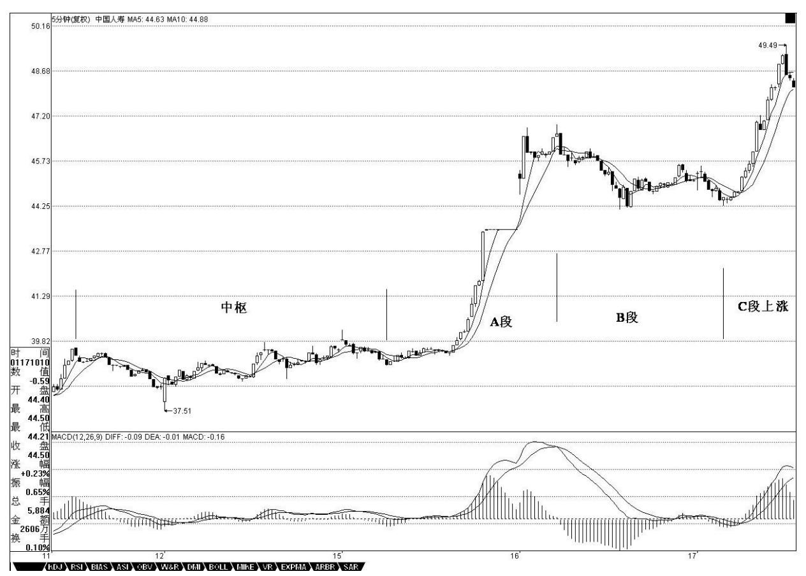

3 4 上面是一种最标准的背驰判断方法。那么,背驰在盘整中有用 吗?首先,为明确起见,一般不特别声明的,背驰都指最标准的趋势 中形成的背驰。而盘整用,利用类似背驰的判断方法,也可以有很好 的效果。这种盘整中的类似背驰方法的应用,称为盘整背弛判断。

盘整中往上的情况为例子,往下的情况反之亦然。如果 C 段不破中 枢,一旦出现 MACD 柱子的 C 段面积小于 A 段面积,其后必定有回 跌。比较复杂的是如果 C 段上破中枢,但 MACD 柱子的面积小于A 段 的,这时候的原则是先出来,其后有两种情况,如果回跌不重新跌 回,就在次级别的第一类买点回补,刚好这反而构成该级别的第三类 买点,反之就继续该盘整。

昨天上海的 5 分钟图上,就构成一个标准盘整背驰。12 日 14 点35 到 16 日 9 点 45 构成 A 段,16 日 9 点 45 到 16 日 13 点30 构 成 B 段,16 日 13 点 30到 17 日 13 点 05 构成 C 段。其中 B 段 制造了 MACD 黄白线对 0 轴的回拉,C 段与 A 段构成背驰。对 C 段 进行更仔细的分析,9 点 35 的第一个红柱,由于并没创新高,所以 不构成背驰,10 点 40 的第二个红柱子,由于这时候的 C 段还没有

# 形成一个中枢,根据走势必完美,这 C 段肯定没

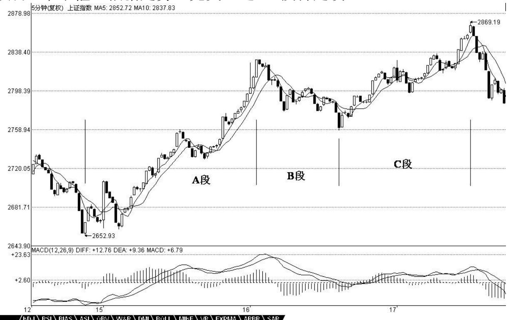

完,所以继续。13 点 05 分,第三个红柱子,这时候,把三个红柱子 的面积加起来,也没有 A 段两个红柱子面积和大,显然背驰了,所以 要走人了。而随后的回跌,马上跌回大的中枢之内,所以不可能有什 么第三类买点,不过站在超短线的立场,如果出现次级别的第一类买 点,又可以重新介入了。

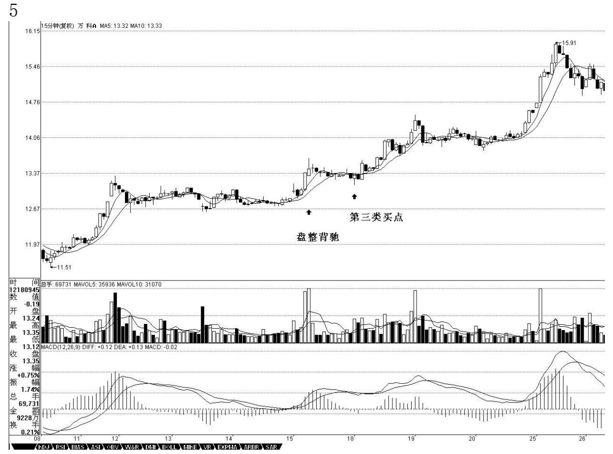

6 那么,有没有盘整背驰后回跌形成第三类买点的例子,其实这种例 子太多了,第三类买点,有一种情况就是这样构成的。例如,000002 万科的 15 分钟图,12 月 15 日 10 点 45 分,构成一个盘整背驰, 所以要出来,其后的次级别回跌并不重新回到前面的中枢里,就在 18 日 9 点 45 分构成了标准的第三类买点,这时候就该重新回补了。

7 背驰与盘整背驰的两种情况中,背驰是最重要的,一旦出现背驰, 其回跌,一定至少重新回到 B 段的中枢里,看看 601628 人寿昨天的 回跌,就一目了然了。而盘整背驰,一般会在盘整中弄短差时用到, 如果其间突破中枢,其回跌必须分清楚上面的两种情况。

必须注意,无论背驰与盘整背驰,只要满足上面相应的标准,其技术 上都是绝对的,没有任何的或然。问题不在于这种技术的准确性,而 在于操作者判断的准确性,也就是说,必须先把什么是背驰,什么是 盘整背驰,他们之间的标准是什么,如果连这些都搞不清楚,那是无 法熟悉应用这项技术的。

必须说明的是,由于 MACD 本身的局限性,要精确地判断背驰与盘整 背驰,还是要从中枢本身出发,但利用 MACD,对一般人理解和把握比 较简单点,而这已经足够好了。光用 MACD 辅助判断,即使你对中枢 不大清楚,只要能分清楚 A、B、C 三段,其准确率也应该在90%以 上。而配合上中枢,那是 100%绝对的,因为这可以用纯数学的推理逻 辑地证明,具体的证明,以后会说到。

\*\*\*\*\*\*\*\*\*\*\*\*\*\*\*\*\*\*\*\*。

解盘及互动问答:

#### \*\*\*\*\*\*\*\*\*\*\*\*\*\*\*\*\*\*\*\*。

1. 网友 [匿名] 无言:缠姐,你看错了。我说的是 600832,日线和 周线出现第三买点了。另外,今天看了你的新文章,600028 中午进去 的。是 5 分钟级别的第一买点,根据走势必完美的原则,明天上午还 有一次回调。对吗? 2007-01-18 21:41:51缠师:600832 的走势比较 复杂。12 月 8 日是一个日线的第三类买点。一般这种买点出现后, 肯定会回升,但并不一定就能形成趋势上涨,还可能演化成复杂的中 枢扩张,该股就属于后者。因此站在大的角度看,该股现在已经逐步 在摆脱这巨大的周线中枢延伸。

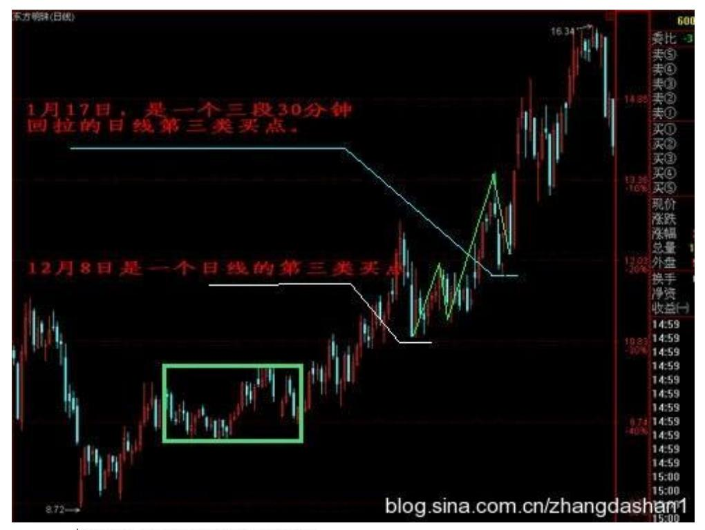

1 月 17 日,是一个三段 30 分钟回拉的日线第三类买点。注意,第 三类买点的结束位置不一定是整个回拉的最低位置。因为一个三段回 来,C 段并不一定创新低。在复杂的回拉中,还有三角形 5 段回拉 的,只要最后一次回拉不回到原来的中枢就可以了。

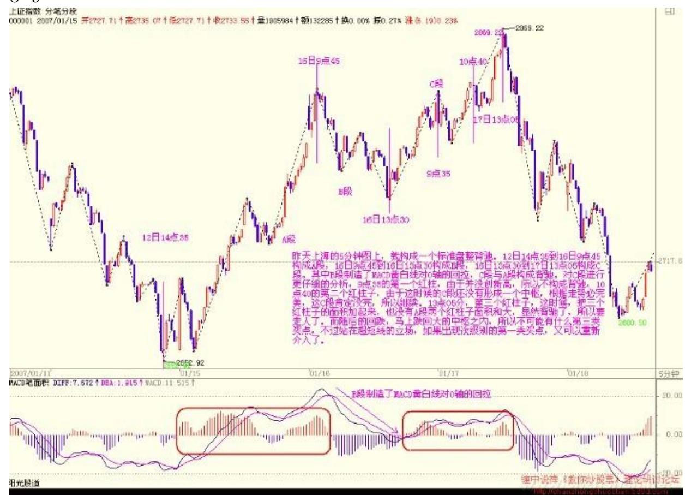

缠师:前面已经说过,如果出现次次级别的背弛就要走三角形,今天 5 分钟的背弛如此明显还看不出,那就要去好好补课了。还有人寿在 5 分钟上也是典型的背弛。2007-01-17 15:18:5310 缠师:大盘今天 的震荡是 5 分钟的背弛引发的,一个绝好的短差机会,如果没把握好 的,继续好好学习。这么典型的走势必须要把握好。没搞清楚的,就 把上海和人寿的 5 分钟图弄出来好好研究。

其实,就算你看不懂大盘,看本 ID 阻击的股票今早开始就走得特难 看,就知道今天要震荡了。当然,本 ID 的快乐都是建筑在庄家的痛 苦之上,这里说声对不起了,傻庄们。

缠师:各位!如果对背弛没有什么直观感觉的,好好看看今天的上海 大盘以及人寿的 5 分钟图,标准图形,这里本 ID 还要对人寿的庄家 说声对不起,本 ID 也弄了他的短差,虽然本 ID 中线是看好他,但 本 ID 见到背弛就要发狠,没办法,对不起了。2007-01- 1715:28:3611

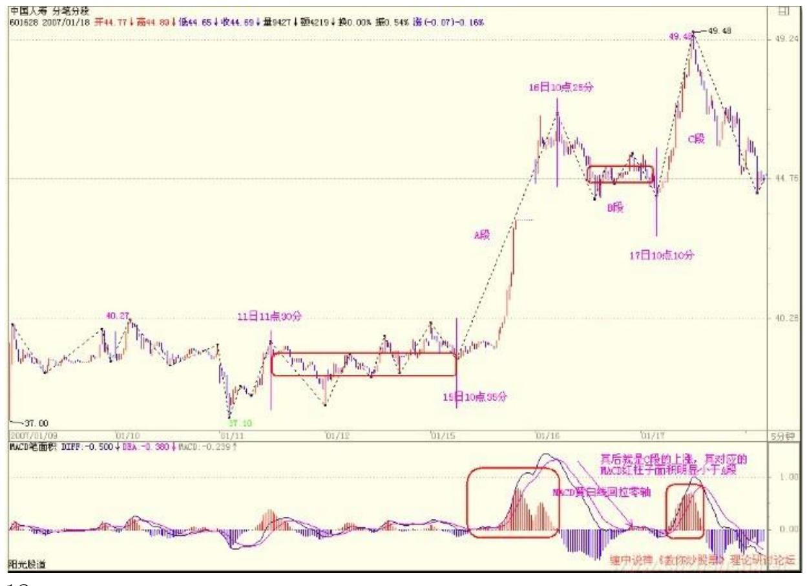

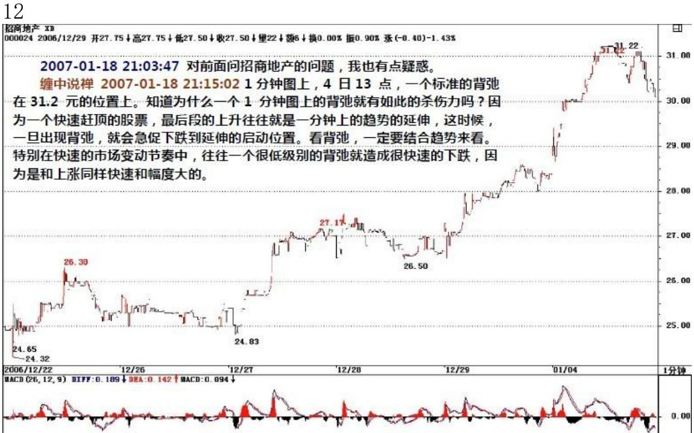

13 14 2. 网友[匿名] 无知:缠姐,有问题求教!000682 昨天下午收 盘候发现 macd 回抽 0 轴后红炷显著缩短,早上集合竟价出掉了。

不过今天好象没怎么下跌。不知这个背驰判断是否正确,卖得早了 吗?2007-01-18 21:10:29缠师: 先把趋势搞清楚。该股日线上在干 什么?30 分钟线上在干什么?才轮到 5 分钟的问题。如果 30 分钟 或日线在一个明确的上涨初期时,那 5分钟的背驰当然不可能制造太 大的回挡。对于 3 元多的一个上涨初期的股票,一个 5 分钟的背 驰,让他从 3.48 元回到 3.35 元,4%的幅度,已经足够了。没人告 诉说 5 分钟背驰就一定要跌 50%的。人寿之所以跌得那么多,就是因 为背驰前的 5 分钟是一个快速的急拉,因此对称着跌下来了。而 000682不存在这种情况。

#### \*\*\*\*\*\*\*\*\*\*\*\*\*\*\*\*\*\*\*\*。

3. 网友[匿名] 无知: 国寿今天的下跌,是否因背驰构成了 5 分钟 级别的第一类买点?还是属于一分钟的背驰?因为 5 分钟没有两段可 以对比的下跌趋势。

缠师: 1 分钟有,然后就从 41.0 元反弹到 44.2 元,足够可以了。

#### \*\*\*\*\*\*\*\*\*\*\*\*\*\*\*\*\*\*\*\*。

4. 网友[匿名] 赚到了: 缠 MM,问个极端的问题。比如背驰出现 时,如果有个傻庄故意强拉,这样随后的走势就不会逆转,这样的图 形用你的理论应该怎么解释呢?2007-01-18 21:30:56缠师: 庄家的 运转不也在构成走势本身?别把庄家当上帝一样。如果他可以拉抬, 自然就不会出现背驰。如果他边拉边出,走势上自然留下痕迹,就是 背驰。注意,走势是一切力量的综合结果,没必要单独考虑某种力 量。

- 5. 网友[匿名] KK:"缠师:你首先要搞清楚中枢形成的三段的方向 是怎么开始的,不是随便三段就是的。这是最基础的东西,不能到现 在还搞不清楚。
- 15 如果是向上的走势,里面的中枢一定是下-上-下的,向下的相 反。"又重新翻了前面缠中说禅走势中枢的定义:某级别走势类型

中,被至少三个连续次级别走势类型所重叠的部分,称为缠中说禅走 势中枢。

还是犯糊涂,这个下-上-下包含了两个中枢么? 这是一个上涨的趋 势, 一定包含至少两个中枢,是不是"下上"的水平区间, 然后后 面的"上下" 水平区间正好构成两个中枢?2007-01-1821:34:31缠 师: 好好把上面的课补一下。一个趋势,有两个中枢,因此至少就有 6 段走势,然后加上前面低部回拉的第一段,最后冲刺的一段,还有 连接两个中枢的一段,至少有 9 段走势是明确无误的。

要多看图,否则怎么会有感觉?人寿 5 分钟图上,从 11 日 9 点55 分到 17 日 13 点 05 分,就是一个最标准的没有出现延伸的完整上 涨,自己数数看究竟有多少段?

#### \*\*\*\*\*\*\*\*\*\*\*\*\*\*\*\*\*\*\*\*。

6. 网友 [匿名] 勇敢的心: 缠主,是否当时没创出新高就不叫背 驰,因为还不成趋势? 2007-01-18 21:48:42缠师:创出新高也不一 定是趋势,要把概念明确区分。所以还有盘整背弛判断。

#### \*\*\*\*\*\*\*\*\*\*\*\*\*\*\*\*\*\*\*\*\*。

7.网友[匿名] 勇敢的心: 请问缠主:今天我在 11:20 看出600198 的 5 分钟背驰,所以下午 17.6 元卖掉了 600198。对吗?2007-01- 18 21:45:51缠师:600198,在 5 分钟的 K 线图上,没有什么背驰。 在其 1 分钟的 K 线图上,才勉强有。为什么说勉强?因为现在只能 看到最低一分钟的,而今天该股一开盘瞬间有一个 18 元以上的高 价,要反映这种走势,必须有 1 秒种的图才能精确反映。由于交易所 不提供这种图,所以在一些超级快速的走势中,1 分钟图上都会有点 变异,这不是理论的问题,而是交易所不能提供最详尽数据的问题。

一般来说,最精确的、最低级别的图,就是每一笔成交按次序排列而 成的图,现在看的 1 分钟图,已经有点粗糙了。但对于大一点的走势 来说,影响不大。

16\*\*\*\*\*\*\*\*\*\*\*\*\*\*\*\*\*\*\*\*\*8. 网友[匿名] 大风:请教老师一个问题: 炒股票,只看日 K 线图,不可以吗?如果可以,那怎么理解缠中说禅 走势中枢:某级别走势类型中,被至少三个连续次级别走势类型所重 叠的部分。日 K线图的次级别的 K 线图,不就是 30 分钟 K 线图

吗?回答一下呀老师,虽然问题有点幼稚,但我真的想知道。2007- 01-18 22:19:57缠师:当然可以。但前提是你永远不打短差,而且只 弄特大型的行情,也就是只弄大牛市,从底部一直拿到顶部。而对于 中线调整来说,因为很多判断必须用到次级别的走势,甚至次次级别 的走势。

对于一些快速的走势,例如这两天的房地产,如果不看 5 分钟或30 分钟的图,根本就看不到其中的变盘预告。

#### \*\*\*\*\*\*\*\*\*\*\*\*\*\*\*\*\*\*\*。

缠师: 各位:一定要先分清楚趋势和盘整,然后再搞清楚背驰与盘整 背驰。盘整背驰里的三种情况,特别是形成第三类买点的情况,一定 要搞清楚。注意,盘整背驰出来,并不一定都要大幅下跌,否则怎么 会有第三类买点构成的情况呢?而趋势中产生的背驰,一定至少回跌 到 B 段中,这就可以预先知道至少的跌幅。

此外,对背驰的回跌力度,和级别很有关系,如果日线上在上涨的中 段刚开始的时候,MACD 刚创新高,红柱子伸长力度强劲,这时候5 分 钟即使出现背驰,其下跌力度显然有限,所以只能打点短差,甚至可 以不管。而在日线走势的最后阶段,特别是上涨的延伸阶段,一个 1 分钟的背驰足以引发暴跌,所以这一点必须多级别地综合来考察,绝 对不能一看背驰就抛等跌 50%,世界上哪里有这样的事情。好了,各 位好好研究,先把一些最基础的东西搞清楚。先下,再见。2007-01- 18 22:40:17这股市真是一点意外都没有,真没挑战性。已经说了,极 有可能有三角形,然后才突破,最迟本周一见分晓,结果怎么样,大 家都看到了。必须提醒,三角形一般是一段走势的最后一个调整中经 常出现的,因此,三角形出现后,其后的走势就要时刻小心了。当 然,这只是对 30 分钟而言,而日线上要出现大调整,还早着。所 以,密切关注 30 分钟或 60 分钟的图形,一旦出现背驰,就可以打 点短差了。还有,今天大盘的缺口不补,因此,最迟在周四前,还有 一个回试去考验这个缺口,当然,并不是说缺口一定要补,完全可以 突破 3000 点后才回试,而且回试甚至连 2900 点都可以不触及,但 回试是必须的,这会引发一个震荡。2007-01-22 15:27:14

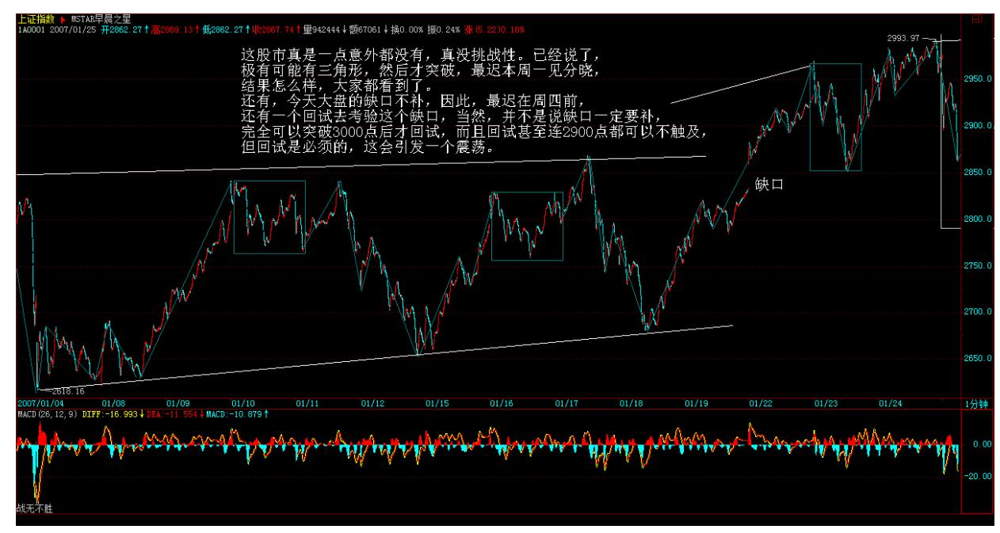

17 18 缠师:个股方面,还是二、三线的天下,太多可闹的股票,就 不说了。至于本 ID 现场表演的那 8 只股票,本 ID 只有两只手,不 可能天天每一只都关照到,但关照一两只是肯定无疑的,这叫轮搞, 回想这段时间的走势,除了那药之外,其他都是被轮着搞,当然,这 都是 本 ID 的梦话,说说而已。

#### \*\*\*\*\*\*\*\*\*\*\*\*\*\*\*\*\*\*\*。

9. 网友【匿名】:目前大盘已经突破日线中枢,接下来的回试如果跌 破 2868 的话,会变成中枢扩张,就会有比较大的震荡。这样分析对 吗?缠师:强势的话,也就是能产生中枢新生的,2870 是不该被回试 触及的。换言之,今天的缺口是不能被补的,否则就陷入一个更大级 别的调整。最强的走势,就是快速突破或接近 3000 点后出现震荡, 在 2870 点上支持住,然后站上 3000 点,这是最有力的走势了,能 否出现,没必要预测,只要看着就可以。如果出现 30 分钟或 60 分 钟背驰还突破不了 3000 点,那调整的时间、幅度就要有一定的延 长。

#### \*\*\*\*\*\*\*\*\*\*\*\*\*\*\*\*\*\*\*\*。

10. 网友[匿名] 外科医生:上午基本都出了,呵呵。大盘一直 5分钟 背驰,可就是不跌下来。不会踏空了吧?我现在最喜欢下跌了。还烦 请缠妹指点。

2007-01-22 15:24:47缠师:大盘 5 分钟没有什么背驰,黄白线创新 高一般都不会是本级别的背驰。大盘其实只是一个 1 分钟的背驰,然 后下午就有一个跳水,然后很快就把指标调整过来了。注意,背驰是 要看前后级别的走势的。不是光看一个级别就可以。

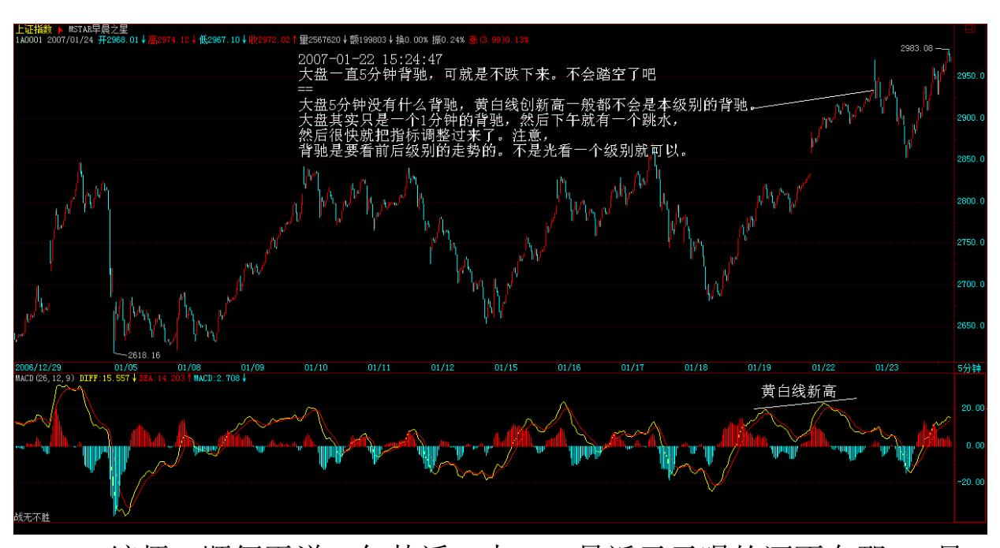

19 20 缠师:顺便再说一句梦话,本 ID 最近天天喝的酒不在那 8 只 里,这就不说了。至于药,现在刚好是一个月,从 6 元下变成 11 元,不知道有没有比这还快的,最主要是最近每天只能弄 5%,走起来 慢了点,没让各位 1 月翻倍,对不起了。

#### \*\*\*\*\*\*\*\*\*\*\*\*\*\*\*\*\*\*\*\*。

11. 网友 [匿名] 直面缠生: 5 分钟图上,大盘虽然一度背驰,但是 日线上,这是突破原来中枢后的第一次上涨趋势,根据走势必完美, 这种背驰的威力肯定不大,弄不好踏空,所以我一直没走。缠姐,我 说得对吗? 2007-01-22 15:36:53缠师:是 1 分钟的背驰,5 分钟黄 白线创新高,这要配合黄白线和柱子一起看的。1 分钟的背驰,在盘 中下午那次跳水已经化解了。

本 ID 懒得去找了,请问从 12 月 20 日到今天,有没有比本 ID的药 更快的?元旦放假也是影响一月翻倍的原因。有就拿着,有时候洗洗 盘是不可避免的,但中线,前几天不是说了,9 元只是月线圆底的边 沿,而且现在还是 S 股,请问各位该到什么位置才对?听听大家的意 见。至于其他,都说了,中线都是没问题的,只是有些盘中乱点,来

回需要折腾,像浙江人这种上下来回,如果你的短线技术好点,其实 更好玩。2007-01-22

#### \*\*\*\*\*\*\*\*\*\*\*\*\*\*\*\*\*\*\*\*。

12. 网友 [匿名] 看聊: 大盘在1分钟、5分钟和30分钟图上,我 都看不到缺口,只有日线有缺口,2007-01-22 15:53:23缠师:日线都 有缺口,低级别就更有缺口了,没有缺口只是技术软件的问题。看缺 口,就看日线的,其他没必要看了。

#### \*\*\*\*\*\*\*\*\*\*\*\*\*\*\*\*\*\*\*\*。

13. 网友 [匿名] whq999: 缠妹,上证指数明早再来个大缺口怎么 办? 2007-01-22 16:00:58缠师:那盘中就回补的可能性太大了。其 实现在不怕震荡,就怕拉得太快,连续跳空向上,这样很快就阳亢而 死了。

#### \*\*\*\*\*\*\*\*\*\*\*\*\*\*\*\*\*\*\*\*。

21 14. 网友 [匿名] 花蝴蝶: 请教缠姐:在 000503 的五分钟图 上,1 月 22 日 10:05 分的 MACD 已经背驰,上涨力度也已衰竭,

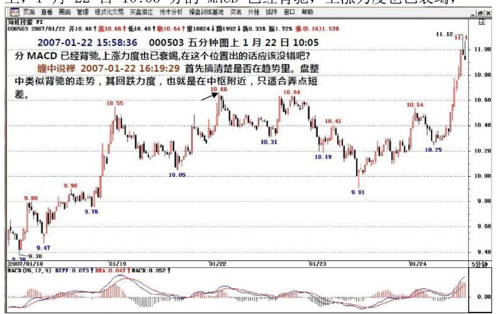

在这个位置出的话应该没错吧?2007-01-22 15:58:36缠师:首先,搞 清楚是否在趋势里。盘整中类似背驰的走势,其回跌力度,也就是在 中枢附近,只适合弄点短差。

22 23 15. 网友[匿名] 新手: 缠师好!000900 在 5 分钟 K 线图 上,上午是不是出现了背弛?你看 600295 下午的 5 分 K 线,是不 是要回调了?那天问过你000900,真被你说准了。我现在有了30%的收 获,不过没卖,只是帐上的。望指教。看了你的每一篇文章。可还是 不是很懂。第一次炒股。 2007-01-22 16:20:15缠师:现在没有背 驰。请先去学学怎么看背驰。那几个条件必须同时满足。该股 14 上 的历史高位,这里出现震荡是正常的,一旦有效突破,那空间就大 了。短线可以用震荡弄点短差,如果技术不行,那就算了。中线一定 问题都没有。

#### \*\*\*\*\*\*\*\*\*\*\*\*\*\*\*\*\*\*\*\*。

16.网友[匿名] 外科医生: 请问禅妹,现在空仓的怎么办?何时介入 最妥?2007-01-22 16:26:44缠师:不是早说了。三角形,你看这三角 形多标准,当然是在三角形的下边介入最好。现在还说介入,有点晚 了。只能找那些个股里反应比较慢的介入了。

牛市里最大的毛病就是空仓。就像熊市里最大的毛病就是满仓一样。 牛市的调整,特点就是时间快,卖了一定要找地方买回来,否则就买 不回来了。而且对那些特别强的股票,走了基本就没有买回来的可 能,如果你 50 走的茅台,估计 N 年的熊市低点,都不知道有没有机 会买回来了。

#### \*\*\*\*\*\*\*\*\*\*\*\*\*\*\*\*\*\*\*\*。

17. 网友[匿名] 学生:请问,600033 在 1 月 9 日形成日线级别的 第三类买点,对吗?假若是,为何接着出现几天的调整呢?2007-01- 22 20:10:18缠师:日线级别的第三类买点怎么可能是一天完成的?必 须有 30分钟上明确的三段走势,这不会一天就能完成。你说的那天根 本不是第三类买点,只是突破的第一段的中途休整。

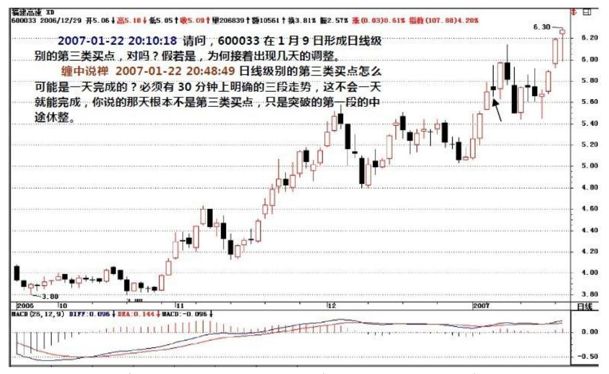

24 25 18. 网友[匿名] 牛: 博主,请问:600000,月线上 03/1- -04/2 的这个波动,是不是一个月线的中枢?由三个周线走势重叠。 在这个月线中枢前的01/9/21--02/3/22 是一个周线中枢?是不是这 样? 2007-01-22 17:38:48缠师:一个月线的中枢怎么可能一个月就 完成?好好把中枢的概念搞清楚。

#### \*\*\*\*\*\*\*\*\*\*\*\*\*\*\*\*\*\*\*\*。

19. 网友 [匿名] 心禅 :缠 mm 来了,谢谢回答。我只是给自己定的 目标太高了,所以影响到了操作。我想一个月翻倍呢。还有一个问 题,也困扰好几天了。想请教一下:收缩三角形的整理形态,到终点 的那一点是属于第一类买点吗?然后,随后出现的买点是第二类买 点?以 000878 为例:2006/12/29日就属于第一类买点。

2007/1/18 日就属于第二类买点。不知我理解得对不对? 2007-01-22 20:46:46网友小明:禅主,我感觉收缩三角形的整理形态,到终点的 那一点是属于第三类买点,对否? 2007-01-22 20:51:01缠师:第三 类买点只能在中枢之外。三角型最后的买点,只能是次级别的买点。 对三角形的操作,只是能高位走了以后低位回补,这样来回弄,一旦 接近或突破上沿次级别背弛,就要走,回来下沿次次级别或次级别背 弛,就买回来。一旦过上沿没有背驰,就是真突破了,这样就可以不

走,等大图形的背驰出现。整个操作很有节奏的,短差也弄了,突破 也不耽误,这才是正确的操作方法。

#### \*\*\*\*\*\*\*\*\*\*\*\*\*\*\*\*\*\*\*\*。

20. 网友[匿名] 我的 2006: 缠妹妹,你的理论正在学习中,感觉好 深奥。现有一问题请教:在你的第17课中讲道:缠中说缠走势中枢 是至少三个连续次级别走势类型重叠部分所构成,为什么不是二个或 两个以上呢?2007-01-22 20:53:07缠师:如果是两个,那上涨中随便 一个回调都成中枢,那不乱套了。中枢是一个确认的概念,必须两次 向一个位置的确认才构成中枢。而两次的确认,必然出现三个或以上 的次级别走势,这个随便画画图形就明白了。

#### \*\*\*\*\*\*\*\*\*\*\*\*\*\*\*\*\*\*\*\*。

26 21. 网友 [匿名] 不争而胜: 我一直没机会吃药(买缠师前面说 的医药股)。不过上周看了 LZ 的帖,推测汽车股可能涨,于是买了 辆奥迪(制造奥德车的股票,可能是 000800),现在已经开上高速公 路了(形容此股票涨得快)。请教 LZ,涨停后如何判断背驰?特别是 那些天天一字停板的票。象 600385之类的,5 分钟线可以在上周看到 非常明显背驰。但 600763 之类的,如何判断?我在5 块左右重仓持 有的,上周五看到涨停一度打开,出了一半,今天又拉了个一字涨停 板!顶它个肺。还请 LZ 您指教一下如何搞这类股票。2007-01-22 16:21:30缠师:这个问题早说过了。一字涨停的,都是一分钟中枢不 断延伸的上涨,只要这个趋势不断延伸,就不存在出的理由。至于用 MACD如何判断其走势,这涉及 MACD 的一些特殊技巧,明天会说到。

#### \*\*\*\*\*\*\*\*\*\*\*\*\*\*\*\*\*\*\*\*。

22. 网友 [匿名] 学习:缠妹好!问两个问题。谢谢!如果构成中枢 的第一\三段重叠在一个单位价格上,那是中枢吗?看中枢,是不是不 用受到均线的干扰? 2007-01-22 21:35:01缠师:有走势才有均线, 看 MACD 和看均线可以配合起来,均线更直观点。

#### \*\*\*\*\*\*\*\*\*\*\*\*\*\*\*\*\*\*\*\*。

23. 网友[匿名] 新手: 缠老师,能还问你一下 600295 吗?本来这 票想按你说的,等出现了买点才买进的,可今天没忍住,还是下手买 了。你能帮我看看吗?新手。 2007-01-22 21:36:55缠师:为什么前

两天的阴线时不买?买股票,特别在牛市里,要敢于在阴线时买。特 别结合次级别走势有买点的,无论哪类买点,都是在下跌或回试中形 成的,一定要养成好习惯。不要回调不敢买,反而追高买。

其次,该股中线没有问题,5.7 元是中线关键位置,只要回试站稳, 中线空间就打开了。上面关键的压力在 250 周线,这是该股最终能走 多高的最后一个考验。如果能有效突破,最终把周线上那个巨大缺口 给补了,也是很正常的事情。

27

#### \*\*\*\*\*\*\*\*\*\*\*\*\*\*\*\*\*\*\*\*。

24. 网友 [匿名] 在路上: 首先感谢缠姐的好药(缠师说的医药 股)。让我天天固定赚钱,然后专心寻找第三类买点并大有收获。

今年 1 月至今已增长 50%了。谢谢!有两个问题请教:(1)如果在 日线图上,形成了下跌的走势终完美,出现了第一类买点后,比如上 证在05年6见底后,开成上涨,在06年5-8月形成的日线中 枢,跟以前的下跌时形成的中枢有没有关系?也就是说是不是在这次 上涨中,只须看着上涨趋势中的中枢?(2)缠姐几时会说到正在形 成的中枢中啊?有好几种不同的K线形态,其后的走势都会有些不 同。如平台、三角、还有缠姐说的"奔走"等。这对有很多第三类买 点出现时,会有一个选择的过程。能否详细说说那种更强一些。谢 谢! 2007-01-22 21:45:27缠师:这些问题以后都会说到的。现在一 展开说,就长了去了。第一个问题可以简单回答。下跌中枢对后面的 上涨,当然会有影响。

所以股市经常会出现所谓的对称性上涨。怎么跌下来的就怎么涨上 去,这主要就是因为前面下跌中枢的影响。但在观察时,看上涨,还 是只看上涨本身的中枢,前面下跌的中枢只是一个可能阻力的参考。 至于底部下跌与上涨的连接部分,比较复杂,以后再说。

#### \*\*\*\*\*\*\*\*\*\*\*\*\*\*\*\*\*\*\*\*。

25. 网友 [匿名] LLMY: 600320 在 30 分钟级别的 K 线图上,上周 出现背弛了。可今天又向上跳空。均线上看,还是背弛。macd 红柱也 是一波比一波短。缠姑娘能解释一下吗?谢谢!2007-01-2221:29:05

缠师:上周没有背驰。首先要搞清楚是哪段和哪段比。你不能把段里 面的自己比,这样制造的只是小级别的背驰 ,不是 30 分钟的。

对背驰还要下爹工夫。

#### \*\*\*\*\*\*\*\*\*\*\*\*\*\*\*\*\*\*\*\*。

26. 网友 [匿名] 小明: 关于中枢:构成中枢,比如日线级别上的中 枢,最短只要几天时间的走势,才可以构成一个中枢呢?因为只要看 它的次级别28 (30 分钟级别),上有 3 个连续的 N 型走势就可以 了。以601333 为例。30 分钟线上:1/17 日 13:30-1/18 日 13:30 有3 个连续的走势,所以就构成了日线上 17,18 日的中枢。这样理 解对吗?请指教。 2007-01-22 21:21:48

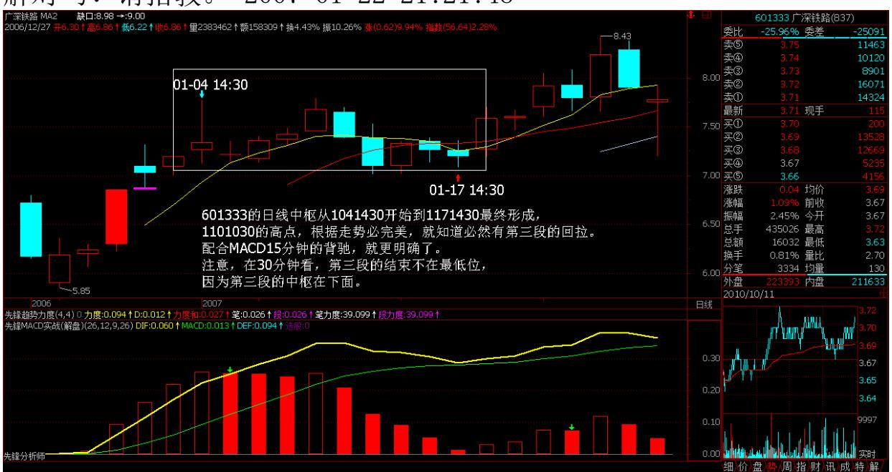

缠师:你还是没有搞清楚中枢。在上涨中,中枢只能是回试的时候形 成的,你说那时间怎么会形成日线中枢?601333 的日线中枢从 2007/1/04 /14:30开始到 2007/1/17 /14:30 最终形成, 2007/1/10/10:30 的高点,根据走势必完美,就知道必然有第三段的 回拉。配合 MACD15 分钟的背驰,就更明确了。注意,在 30 分钟图 上看,第三段的结束不在最低位,因为第三段的中枢在下面。

29 30 从 2007/1/17/14:30 开始,就是开始对日线中枢的摆脱,能否 成功,目前还不能下结论,但这不影响操作,如果不成功就可以出来 打短差,否则就继续持有。该 30 分钟图有点意思,三段的各自中枢

的位置都不是在通常的中间位置。这一点都不奇怪。没有人规定中枢 一定在图形的中间位置的。

#### \*\*\*\*\*\*\*\*\*\*\*\*\*\*\*\*\*\*\*\*。

27. 网友 [匿名] 心禅: 禅主,上周五出门前放掉了水酒(卖了酒类 股票),是因为总担心日线上的调整,今天却再次上涨,对于此种情 况我该如何把握?是要等日线上明显的"背驰"吗?即双头并立,同 时 MACD 这段涨波比上段小?看图发现,MACD 柱子经常会出现在越来 越短的情况下,又突然拉升使柱子伸长,此种情况又该如何提前判 断?是技术或经验?盼回复! 2007-01-22 21:02:25缠师:对中线的 股票,就不要乱走。30 分钟都没背弛,走什么?站在超短线的角度, 今天早上走还有点道理,道理是什么?明天告诉你。但站在中线的角 度,这股票还早着了。

#### \*\*\*\*\*\*\*\*\*\*\*\*\*\*\*\*\*\*\*\*。

28 网友[匿名]:中国人寿 m5 图中(匪注:见本课第 3 页图),到第 二个红柱子为什么没形成中枢?到次级别图上看已经有三个走势重叠 了啊?缠师:你首先要搞清楚中枢形成的三段的方向是怎么开始的, 不是随便三段就是的。这是最基础的东西,不能到现在还搞不清楚。 如果是向上的走势,里面的中枢一定是下-上-下的,向下的相反。

网友[匿名]:能否用"没有趋势没有背驰"的理论,来解说一下昨天 大盘和人寿的背驰,麻烦尽量写详细些。如果用很精练抽象的语言一 带而过的话,相信许多和我一样没有悟性的人还是会很糊涂的。用的 均线是哪种?是 5MA 和 10MA 的吗?MACD 指标参数是多少?趋势的 分段时间点,背驰的时间,这样明确才能让我等菜鸟细细体会!谢谢 啦!缠师:你先把本帖看清楚,把三个例子研究清楚。背驰和什么均 线都没有关系,说的是 MACD 。对 MACD 的一些最基础知识,这里就 不用说了。不知道的,随便在证券部抓个人都可以问到。工行的破位 是为了去完成第三段的走势,所以很正常,当该走势完成后,将出现 周线级别中枢的第二段走势。

31
