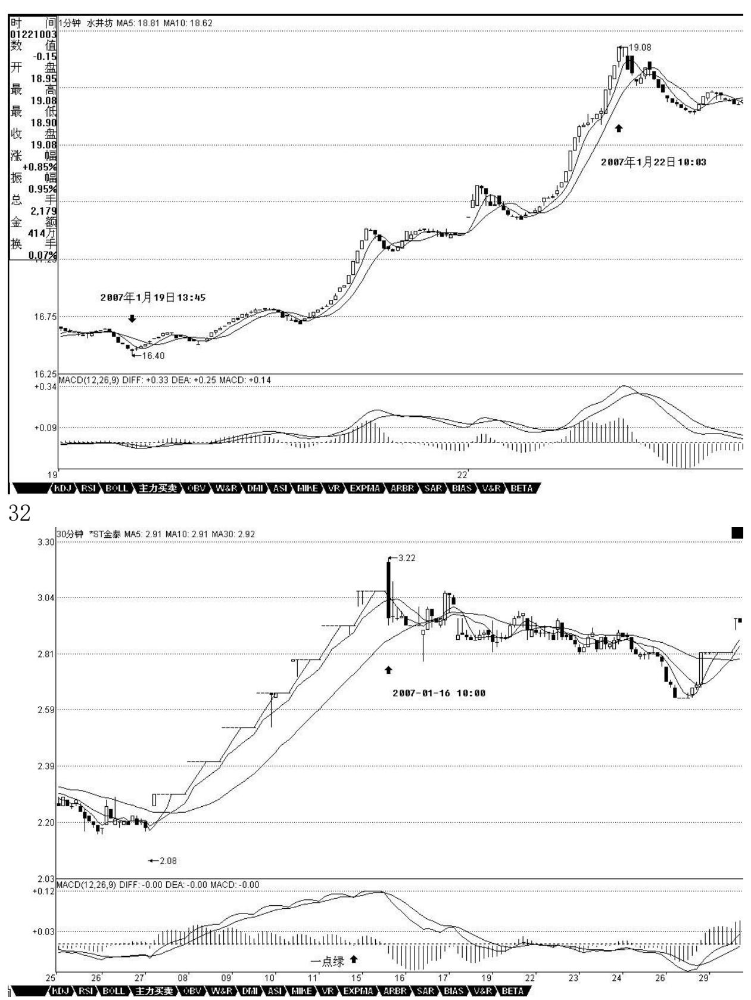
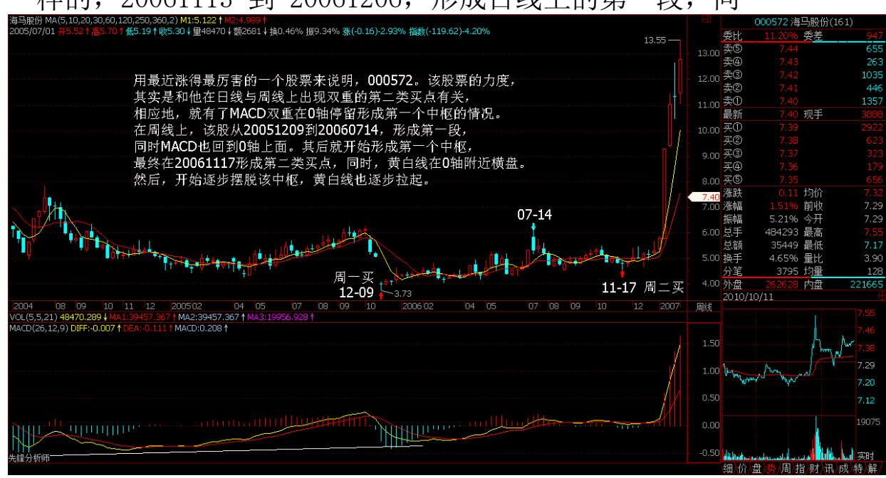
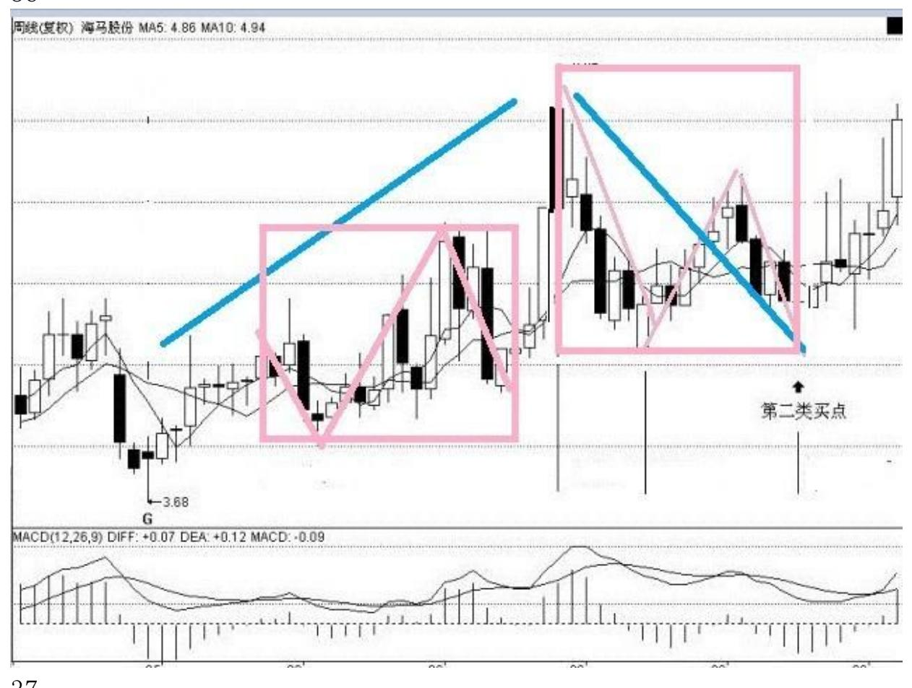
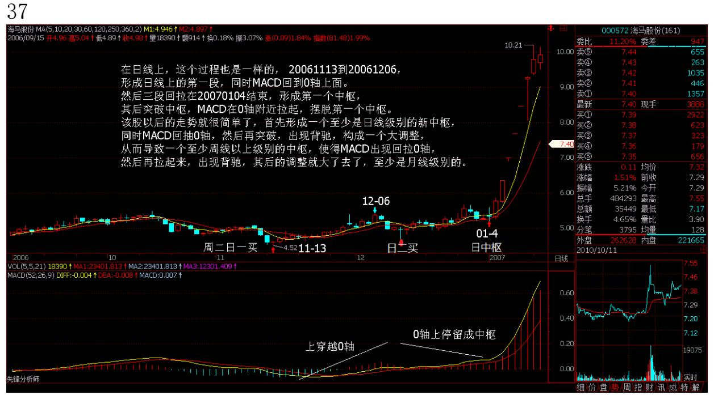
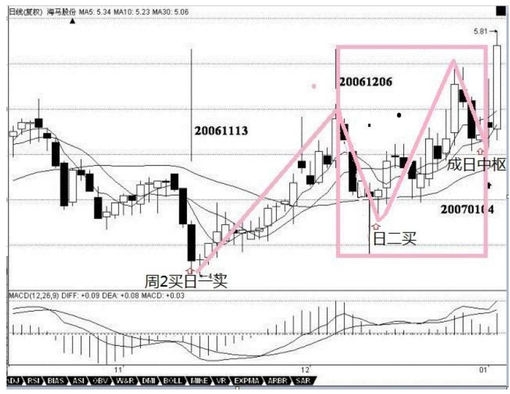
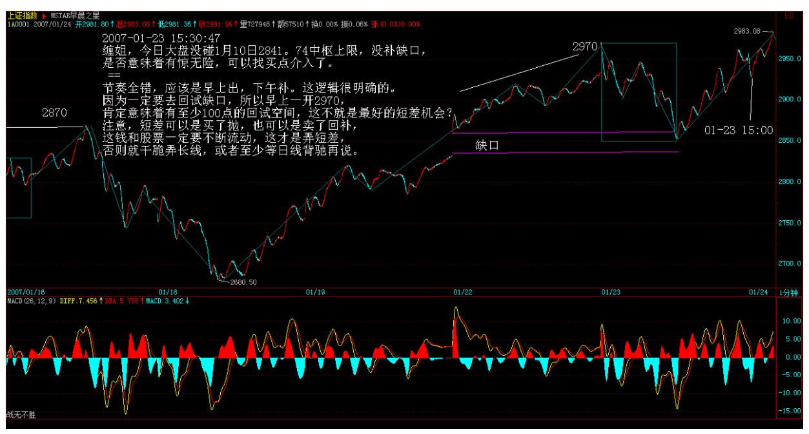
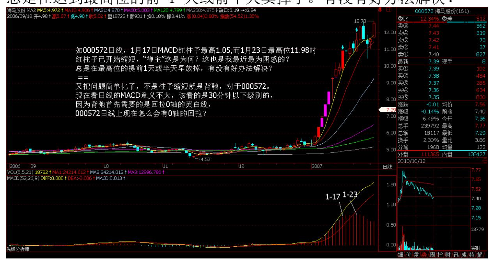
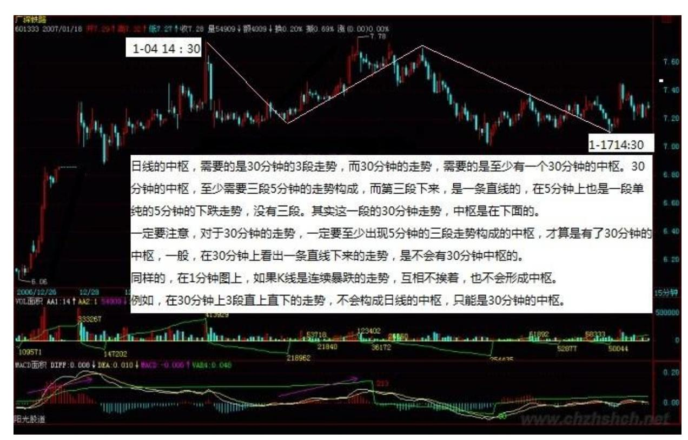
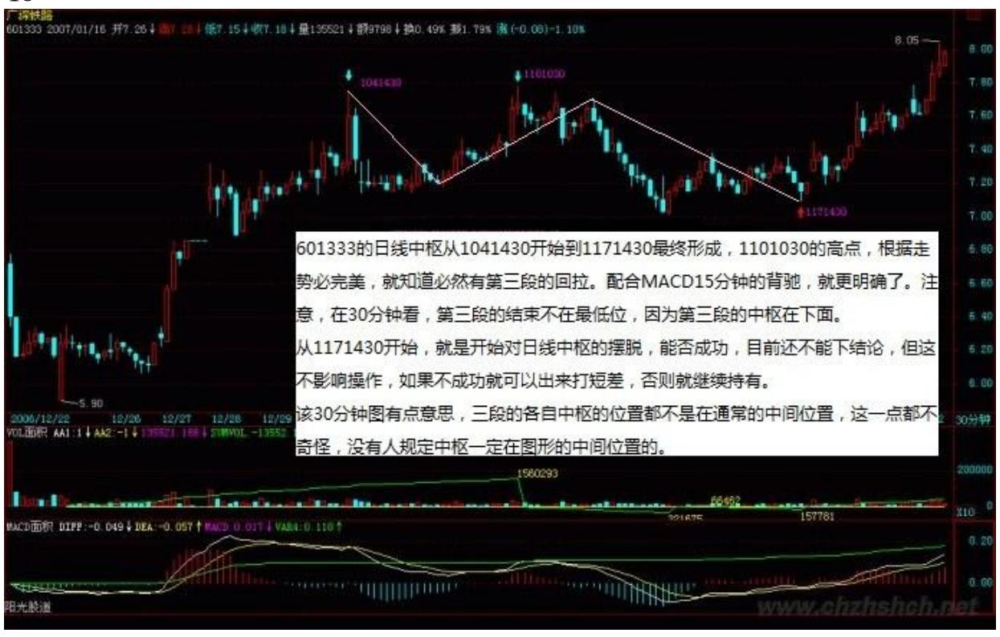
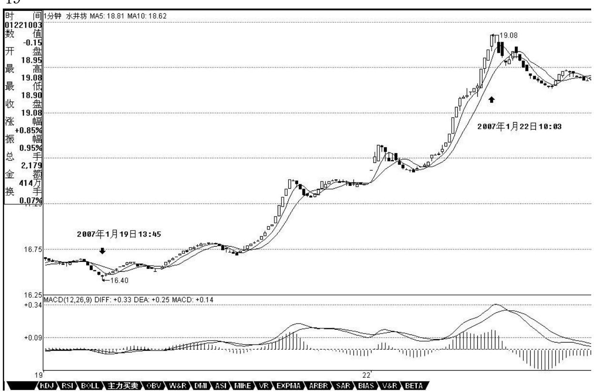

教你炒股票25:吻,MACD,背驰,中枢

(2007-01-23 15:13:13)发现很多人把以前的东西都混在一起了,所以 先把一些问题再强调一下。所谓的"吻" ,是和均线系统相关的,而 均线系统,只是走势的一个简单数学处理,说白了,离不开或然率, 这和后面所说的中枢等概念是完全不同的,所以一定要搞清楚,不要 把均线系统和中枢混在一起了。均线系统,本质上和 MACD 等指标是 一回事,只能是一种辅助性工具。由于这些工具比较通俗,掌握起来 比较简单,如果不想太深研究的,可以先把这些搞清楚。

但"学如不及",对事情如果不能穷根究底,最终都是"犹恐失之" 的,因此,最终还是要把中枢等搞楚。MACD,当一个辅助系统,还是 很有用的。MACD的灵敏度,和参数有关,一般都取用 12、26、9 为参 数,这对付一般的走势就可以了,但一个太快速的走势,1 分钟图的 反应也太慢了(娇注:最快速的走势用 MACD 柱子长度到达的极限数值 参考),如果弄超短线,那就要看实际的走势,例如看 600779 的 1 分钟图,从 16.5 元上冲 19 元的这段,明显是一个 1 分钟上涨的不 断延伸,这种走势如何把握超短的卖点?不难发现,MACD 的柱子伸 长,和乖离有关,大致就是走势和均线的偏离度。打开一个MACD 图, 首先应该很敏感地去发现该股票 MACD 伸长的一般高度,在盘整中, 一般伸长到某个高度,就一定回去了,而在趋势中,这个高度一定高 点,那也是有极限的,一般来说,一旦触及这个乖离的极限,特别是 两次或三次上冲该极限,就会引发因为乖离而产生的回调。这种回调 因为变动太快,在 1 分钟上都不能表现其背驰,所以必须用单纯的 MACD 柱子伸长来判断。注意,这种判断的前提是 1 分钟的急促上 升,其他情况下,必须配合黄白线的走势来用。从该 1 分钟走势可以 看出,17.5 元时的柱子高度,是一个标杆,后面上冲时,在 18.5 元 与 19 元分别的两次柱子伸长都不能突破该高度,虽然其形成的面积 大于前面的,但这种两次冲击乖离极限而不能突破,就意味着这种强 暴的走势,要歇歇了。

33 还有一种,就是股票不断一字涨停,这时候,由于 MACD 设计的弱

点,在 1 分钟、甚至 5 分钟上,都会出现一波一波类似正弦波动的 走势,这时候不能用背弛来看,最简单,就是用 1 分钟的中枢来看, 只要中枢不断上移,就可以不管。直到中枢上移结束,就意味着进入 一个较大的调整,然后再根据大一点级别的走势来判断这种调整是否 值得参与。如果用 MACD 配合判断,就用长一点时间的,例如看 30 分钟。一般来说,这种走势,其红柱子都会表现出这样一种情况,就 是红柱子回跌的低点越来越低,最后触及 0 轴,甚至稍微跌破,然后 再次放红伸长,这时候就是警告信号,如果这时候在大级别上刚好碰 到阻力位,一但涨停封不住,出现大幅度的震荡就很自然了。例如 600385,在 2。92 那涨停,MACD 出现一点的绿柱子,然后继续涨 停,继续红柱子,而 3.28 元是前期的日线高位,结果 3.22 元涨停 一没封住,就开始大幅度的震荡。

34 35 注意,如果这种连续涨停是出现在第一段的上涨中,即使打开 涨停后,震荡结束,形成一定级别的中枢后,往往还有新一段的上 涨,必须在大级别上形成背驰才会构成真正的调整,因此,站在中线 的角度,上面所说的超短线,其实意义并不太大,有能力就玩,没能 力就算了。关键是要抓住大级别的调整,不参与其中,这才是最关键 的。

此外,一定要先分清楚趋势和盘整,然后再搞清楚背驰与盘整背驰。 盘整背驰里的三种情况,特别是形成第三类买点的情况,一定要搞清 楚。注意,盘整背驰出来,并不一定都要大幅下跌,否则怎么会有第 三类买点构成的情况。而趋势中产生的背驰,一定至少回跌到 B 段 中,这就可以预先知道至少的跌幅。

对背驰的回跌力度,和级别很有关系,如果日线上在上涨的中段刚开 始的时候,MACD 刚创新高,红柱子伸长力度强劲,这时候 5 分钟即 使出现背驰,其下跌力度显然有限,所以只能打点短差,甚至可以不 管。而在日线走势的最后阶段,特别是上涨的延伸阶段,一个 1 分钟 的背驰足以引发暴跌,所以这一点必须多级别地综合来考察,绝对不 能一看背驰就抛等跌 50%,世界上哪里有这样的事情。

一般来说,一个标准的两个中枢的上涨,在 MACD 上会表现出这样的 形态,就是第一段,MACD 的黄白线从 0 轴下面上穿上来,在 0轴上 方停留的同时,形成相应的第一个中枢,同时形成第二类买点,其后 突破该中枢,MACD 的黄白线也快速拉起,这往往是最有力度的一段, 一切的走势延伸等等,以及MACD 绕来绕去的所谓指标钝化都经常出现

在这一段,这段一般在一个次级别的背驰中结束,然后进入第二个中 枢的形成过程中,同时 MACD 的黄白线会逐步回到0 轴附近,最后, 开始继续突破第二个中枢,MACD 的黄白线以及柱子都再次重复前面的 过程,但这次,黄白线不能创新高,或者柱子的面积或者伸长的高度 能不能突破新高(娇注:1 黄白线 2 柱子面积 3 柱子高度),出现 背驰,这就结束了这一个两个中枢的上涨过程。明白这个道理,大多 数股票的前生后世,一早就可以知道了。

用最近涨得最厉害的一个股票来说明,000572。该股票的力度,其实 是和他在日线与周线上出现双重的第二类买点有关(娇:波浪 3浪 3),相应地,就有了 MACD 双重在 0 轴停留形成第一个中枢的情 况。在周线上,该股从 20051209 到 20060714,形成第一段,同时 MACD 也回到 0 轴上面。其后就开始形成第一个中枢,最终在 20061117 形成第二类买点,同时,黄白线在 0 轴附近横盘。然后, 开始逐步摆脱该中枢,黄白线也逐步拉起。在日线上,这个过程也是 一样的,20061113 到 20061206,形成日线上的第一段,同

时 MACD 回到 0 轴上面。然后三段回拉在 20070104 结束,形成第一 个中枢,其后突破中枢,MACD 在 0 轴附近拉起,摆脱第一个中枢。 该股以后的走势就很简单了,首先形成一个至少是日线级别的新中 枢,同时 MACD 回抽 0 轴,然后再突破,出现背驰,构成一个大调 整,从而导致一个至少周线以上级别的中枢,使得 MACD 出现回拉 0 轴,然后再拉起来,出现背驰,其后的调整就大了去了,至少是月线 级别的。

39 40 必须注意,MACD 在 0 轴附近盘整以及回抽 0 轴所形成的中 枢,不一定就是相应级别的中枢,而是至少是该级别的中枢。例如日 线 MACD 的 0 轴盘整与回拉,至少构成日线的中枢,但也可以构成周 线的中枢,这时候就意味着日线出现三段走势。

\*\*\*\*\*\*\*\*\*\*\*\*\*\*\*\*\*\*\*\*。

解盘及互动问答:

\*\*\*\*\*\*\*\*\*\*\*\*\*\*\*\*\*\*\*\*。

1. 网友 [匿名] 猫猫: 博主姐姐,还有问题:趋势和盘整的问题, 某级别中趋势的中枢和此级别盘整的中枢是否是同一个级别的?我感 觉中枢和盘整的概念很难弄清楚,能不能帮我解析下?2007-01-23 15:30:48缠师:连接两同向趋势的盘整中枢,当然要比那两趋势的中 枢级别高,否则就归到其中一个趋势去了。搞明白中枢就可以了,盘

整不用管。只要把中枢的确立、延伸、扩展、新生等搞明白了,自然 就明白盘整。

#### \*\*\*\*\*\*\*\*\*\*\*\*\*\*\*\*\*\*\*\*。

2. 网友·[匿名] 缠 fans: 缠姐,今日大盘没碰 1 月 10 日 2841.74(上证指数)中枢上限,没补缺口,是否意味着有惊无险?可 以找买点介入了吗?2007-01-23 15:30:47缠师:节奏全错,应该是早 上出,下午补。这逻辑很明确的。因为一定要去回试缺口,所以早上 一开 2970,肯定意味着有至少 100点的回试空间,这不就是最好的短 差机会?注意,短差可以是买了抛,也可以是卖了回补。这钱和股票 一定要不断流动。这才是弄短差。否则就干脆弄长线,或者至少等日 线背驰再说。

41 42 3. 网友·[匿名] 大盘:今天虽然回探 2869(上证大盘指数) 高点(中枢三段的高高点),但是好像没有触及日线中枢高点 2840 点,不知是不是我对中枢的判断还是有错?望楼主指点。 2007-01-23 15:41:18缠师:由于触及了最高点,使得存在演化成大中枢的危险。 但由于回试,如果是两次的,那只要下一次不跌破这个位置,那就会 使得中枢的脱离得到确认。所以,现在是一个震荡时期。站在短线的 角度,是最好玩的,上不去就给,跌下来只要不有效跌破 2870,就买 回来。而一旦确认回试站稳,那就单边上去,或至少是震荡上去了, 下面这个中枢就见不着了。

#### \*\*\*\*\*\*\*\*\*\*\*\*\*\*\*\*\*\*\*\*。

4. 网友 [匿名] 猫猫:每个走势的端部是否都应该存在一个中枢? 2007-01-23 15:44:36缠师:不一定。如果是突然跳空上来或下去,可 以只在下面形成中枢。中枢的位置没有什么固定的,哪里都可以,但 只要是完整的走势类型,就一定至少有一个中枢。

#### \*\*\*\*\*\*\*\*\*\*\*\*\*\*\*\*\*\*\*\*。

5. 网友·[匿名] 如初见 : 000629,1 分钟图,14:54 出现背弛, 见新高、面积小、回抽 0 轴、红柱短。但我又不敢确定。缠MM 帮看 看,如果是,明天开盘出一半。多谢! 2007-01-2315:46:15缠师:你 要经常考虑的是,大的级别是什么,才考虑 1 分钟的。除了最后的冲 刺以及权证,一般都没必要看 1 分钟的图。当然,1 分钟背弛,在盘 中肯定有回跌,但关键是这种回跌如果不及时补回来,一下就过去 了。所以,除非你每天每秒都趴在股市里,否则太短的短线不一定要 弄。

短线是用来摊成本的,要挣大钱,关键是看中线。例如本 ID 的药, 你看 1 分钟背驰,只要你手脚慢点,一定没机会补回来。至少到今 天,都是这样。

越难弄短差的,越是中线的好股票。很多人总是说,某某股票曾买 过,抛了还涨 1 倍、2 倍、3 倍,这种事情少见吗? 43\*\*\*\*\*\*\*\*\*\*\*\*\*\*\*\*\*\*\*\*6. 网友 [匿名] 大盘: 今天上证大盘虽然 回探 2869 高点(中枢三段的高高点),但是好像没有触及日线中枢 高点 2840 点,不知是不是我对中枢的判断还是有错?望楼主指点。 有点明白了,要是下一个 30 分钟的下跌走势完成后的低点高过 2870,应该基本就是继续上升和震荡上升(在 2870 上震荡)的大盘 行情了。2007-01-23 15:55:41缠师:对。但操作上不能这样,而是冲 高只要没力,也就是短线背驰,就出来。回试不破就回补。而不是看 最后的结果。如果是结果破了,那时候再操作,是不是有点太晚?不 过一定要注意,本 ID 这里说的是小资金的人,天天可以全仓进进出 出的。对于资金大的,只能部分的弄短差来降低成本。这和资金量有 关系。而且更和你手中的股票有关系。有些股票,大盘跌了,涨得更 兴奋,所以短差是要具体看个股的具体走势的,不能一概而论。

7. 网友 [匿名] 大盘: 缠 MM,上次上课的时候不是说,只要中枢高 点被触及,就不能算形成中枢新生,而是变成中枢扩张吗?怎么又变 成要两次回试呢?大概 2870 只是日线三段中枢的高高点(从30 分钟 图表看),而不是日线中枢高点 2840。楼主文章强调的,可能是不触 及中枢高点。当然,只要回试触及三段的最高点,仍可能形成更大级 别的中枢。例如,周线中枢。至于二次回试后,不破2870 是形成日线 级别新的中枢呢?还是与更大级别中枢有什么关系。楼主没有进一步 解释,我也就不清楚了。这是我粗浅的理解。

2007-01-23 16:27:45缠师:在突破中,第一次很低级别的回抽,只要 不跌回中枢里面,而是触及围绕中枢震荡的外围高点。就象这次的 2870,那还不能肯定就一定会构成更大级别的中枢。为什么?因为例 如下面的中枢是日线级别的,如果第一次的回拉只是 5 分钟级别的, 那很可能只是上升途中的小级别回拉。只有当次级别的,对日线来 说,也就是至少是 30 分钟级别的回拉触及,才算是构成更大级别的 中枢。这个道理其实很简单,想想为什么两个同级别中枢的连接一定 是次级别以下的走势,就明白了。

#### \*\*\*\*\*\*\*\*\*\*\*\*\*\*\*\*\*\*\*\*。

44 8. 网友 [匿名] abc :最近看到老外要做庄 A 股的说法,请教LZ 对此的看法,会不会 A 股也象东南亚一样? 2007-01-2319:58:46缠 师:现在是战国时代,统一六国还早了,鹿死谁手,还说不好。

外国人进来是迟早的事情,其实也没什么大不了的。中国人终有一天 要大规模走出去的。世界市场少了中国人,怎么能算世界市场?现在 先在这里和他们练练,也没什么坏处。中国人,从来都不会被外国人 打败。只有中国人才能害中国人。看看历史,中国的外患没有前赴后 继的汉奸蠢动,能成事吗?中国最大的祸患不是外国人,而是汉奸。

#### \*\*\*\*\*\*\*\*\*\*\*\*\*\*\*\*\*\*\*\*。

9. 网友 [匿名] 恒旧常新: 请问缠师: 按照"趋势中的缠中说禅走 势中枢之间必须绝对不存在重叠"的要求,我发现 600497 在 05年 3 月 14 日开始到 05 年 7 月 27 日结束的下跌趋势中,两个日线中枢 的外缘是重叠的。我判断的中枢是 05/3/30-05/5/9;05/6/6-05/6/21 。不知我的问题在哪里?请教老师明示。 200701-23 20:35:41缠师: 用高点比高点低、低点比低点低来定义下跌,这算是下跌。

但用最精确的中枢来定义,这不构成下跌。只是一个中枢的复杂延伸 构成,没有两个中枢。注意,有了中枢以后,对下跌、盘整的判断一 定以中枢的角度看,其他的角度,都可以先放下了。

#### \*\*\*\*\*\*\*\*\*\*\*\*\*\*\*\*\*\*\*\*。

10. 网友 [匿名] 心禅: 文中提到"乖离",就是指走势和均线的偏 离度吗?"乖离"这个指标如何计算?(比如是大于 1 或者小于1) 趋势中一定高度的高点极限如何计算?(比如说 000572,前面没有可 比性) 2007-01-23 21:17:03缠师:这不用计算,用柱子的长度就可 以,这都是很直观的。

#### \*\*\*\*\*\*\*\*\*\*\*\*\*\*\*\*\*\*\*\*。

11. 网友 [匿名] 心禅:全凭经验吗?但是,如 000572 日线,1月 17 日 MACD 红柱子最高 1.05,而 1 月 23 日最高位 11.98时,红柱 子已开始缩短。禅主,这是为何?这也是我最近,最为困惑的?股票 总是在达到最高位的前 1 天或前半天卖掉了。有没有好办法解决?

45 缠师:又把问题简单化了。不是柱子缩短就是背驰。对于 000572,现在看日线的 MACD 意义不大。应该看的是 30 分钟以下级 别的。

因为背弛,首先需要的是回拉 0 轴的黄白线。000572 日线上现在怎 么会有 0 轴的回拉?46 12. 网友 [匿名] 猫猫: 假定已经存在一个 上升趋势中枢 A,形成这个中枢的最后一个次级别走势直接下来,然 后出现三个次级别重叠,在 A 下方形成一个新的中枢 B,那 AB 是不 是已经形成一个新的下跌趋势了?还是要再在 B 下方形成一个 C 中 枢才能认为形成趋势了? 2007-01-23 21:16:27缠师:这种情况其实 就是 V 型转势的情况。一般都是在最高点左右,分别有一个上、一个 下的次级别走势,然后左右对称都形成一个中枢。在大图形上,就构 成类似头肩顶的走势,然后再跌破中枢,下去形成新的中枢,构成下 跌。至于从顶上直接打破上升最后一个中枢的情况,一般情况下都会 回拉过来,形成大的中枢。如果连回拉都不拉,直接在下面形成中枢 的情况,而同样需要再跌破这中枢,然后在下面形成第二个中枢才算 下跌。但这种情况十分罕见,基本只出现在除权后。或者毁灭性利空 的突发中。

#### \*\*\*\*\*\*\*\*\*\*\*\*\*\*\*\*\*\*\*\*。

13. 网友 [匿名] 舍小赢大 :缠 MM 好!想请教一下,你常指的有效 跌破,是指跌破多少呢? 有百分比吗?谢谢! 2007-01-2321:26:16 缠师:就是次级别下去,次级别反拉不能重新上来。这和百分比无 关。

#### \*\*\*\*\*\*\*\*\*\*\*\*\*\*\*\*\*\*\*\*。

14. 网友 [匿名] 天山飞狐 :"601333 的日线中枢从 2007-1- 04/14:30 开始到 2007-1-17/14:30 最终形成,2007-1-10/10:30的高 点,根据走势必完美,就知道必然有第三段的回拉。配合MACD15 分钟 的背驰,就更明确了。注意,在 30 分钟图看,第三段的结束不在最 低位,因为第三段的中枢在下面。" (此处是引用缠师的话)这里不 解的是:为什么不能说 601333 的日线中枢从 2007-1-04/14:30 开始 到 2007-1-12/15:00 就算完成呢?2007-1-10/10:30到 2007-1- 12/15:00 不也是完整的一段吗?还有一个混淆的概念

是:这三段走势在 30 分钟明显构成了一个中枢。那此中枢称为 30分 钟中枢呢?还是日线中枢呢?还是两者都是?缠师:日线的中枢,需 要的是 30 分钟的 3 段走势。而 30 分钟的走势,需要的是至少有一 个 30 分钟的中枢。30 分钟的中枢,至少需要三段 5 分钟的走势构 成。而第三段下来,是一条直线的,在 5分钟上也是一段单纯的 5 分 钟的下跌走势,没有三段。其实这一段的 30 分钟走势,中枢是在下 面的。

47 一定要注意。对于 30 分钟的走势,一定要至少出现 5 分钟的三 段走势构成的中枢,才算是有了 30 分钟的中枢。一般,在 30分钟上 看出一条直线下来的走势,是不会有 30 分钟中枢的。同样的,在 1 分钟图上,如果 K 线是连续暴跌的走势,互相不挨着,也不会形成中 枢。例如,在 30 分钟上 3 段直上直下的走势,不会构成日线的中 枢,只能是 30 分钟的中枢。

50 15. 网友 [匿名] 新年好 :对啊。缠姐。我也有心禅同样的疑 问?像 600779 的 1 分钟线上涨到 17.8 元左右的时候,红柱已经明 显缩短。按说应该出了,可明显后边又有一个拉升,到 19 元左右。 2007-01-23 21:43:05缠师:背驰需要多少个条件?光柱子缩短就背 驰?前面的黄白线有回拉 0 轴吗?背驰和柱子缩短不是一回事情。不 能把问题简单化了。

51 52 缠师:各位一定要把 MACD 判断背驰的几个条件综合起来,不 能光看柱子就完事,这样还不如直接看 MACD 算了,还搞背驰干什 么?如果柱子就有效,也不需要什么背驰了。就是因为柱子经常无 效,所以才需要综合性的背驰概念。晚了,先下了,好好研究。股票 风险很低,正好是一个练习的好地方,在充分了解之前,千万别去弄 什么期货,现在就好好练习吧。2007-01-23 22:07:02

#### \*\*\*\*\*\*\*\*\*\*\*\*\*\*\*\*\*\*\*\*。

16. 网友 [匿名] 风儿: 请问,上升趋势形成的中枢,为什么一定要 是"下、上、下"形成的呢?前面的文章里面,并没有提到啊?而且 通常的上升就是"上、下、上"形成一个中枢,然后再一直上去,再 "下、上"又形成一个中枢啊。 2007-01-23 22:05:21缠师:你说, 调整是从什么地方算起?难道从低点算起?在上升中形成中枢的地 方,必然对应着调整。当然是从高点开始算起,自然就是"下、上、 下"的,这不会太难理解吧。

#### \*\*\*\*\*\*\*\*\*\*\*\*\*\*\*\*\*\*\*\*。

17. 网友 [匿名] 笨笨猪: "其实,本 ID 所换的方向,在回帖里都 有说过,这段时间本 ID 新换的,主要的如下几个板块:军工、有 色、农业、环保、公用事业。" (此处引用缠师的话)请教一下:能 源板块如何呢? 2007-01-24 15:57:03缠师:能源、汽车都可以的。 关键是具体的个股的技术走势,千万别追高买股票。

#### \*\*\*\*\*\*\*\*\*\*\*\*\*\*\*\*\*\*\*\*。

18. 网友[匿名] 学校新生: 哪位热心的师兄告能诉在下?前面提到 的 8 只股票,除了打包发梦的那 5 只,还有个四川的酒, 另外2 只 是什么?谁给说一下?谢谢了!2007-01-24 16:07:17缠师:酒不算这 8 只的。那是老资金搞的。水酒中线还是有潜力的,毕竟收购还没完

成。追高就没必要了。其他 8 只也是,都涨了,没必要追高了。在本 ID 新说的板块中找回调的买点吧。还有,金融是长线的问题,本 ID 是长线持有了。中国的金融是最核心的国家安全问题,这是最重要 的。

53 19. 网友 [匿名] 大盘: 求助解答关于中枢理论的应用和学习难 点。通过楼主几次的解答,自己感觉判断中枢形成的难点,已经不在 于概念了。而是在于,理解和分析清楚,构成中枢的三段中,任意的 一段,又必须是至少由次级别连续三段完成的。例如,判断日线中枢 的形成,首先至少要有三段连续的 30 分钟走势类型完成;而 30 分 钟的每一段又要求是 5 分钟图表上的三段走完;5 分钟的三段又要求 至少 1 分钟图表的三段要走完。如此循环判断,感觉实际应用起来真 是不太方便。不知楼主有什么实际的应用技巧没有?可以帮助我们不 用一层一层去判断每一段是否走完。而是可以,只从一个次级别就可 以方便的判断出来。 2007-01-2416:09:38缠师:看日线没必要去找 1 分钟的。一般日线上很明显地看出三段。而且,每段中,日 K 线有至 少三根以上重合,那(注:那这段)基本都是 30 分钟的走势了。当看 次级别的背驰等,才需要去看次级别的图。

#### \*\*\*\*\*\*\*\*\*\*\*\*\*\*\*\*\*\*\*\*。

20. 网友 [匿名] 空读 :缠禅,学了后去看图,看到 000008(当年 的亿安科技),在 2000 年 2 月 17 日 126 元的大顶时,从日线和 周线上,至今都没有看到第一类卖点。因为时间久了,不知 30分钟线 上有没有?这么大级别的调整,日线上是否应该出现卖点?2007-01- 24 16:18:44缠师:不一定。在快速拉升的最后阶段,一个 1 分钟的 背驰足以引发暴跌。所以,在不同的时期,对待不同的走势,关注的 背驰级别也有所不同。这以后会具体说到。

#### \*\*\*\*\*\*\*\*\*\*\*\*\*\*\*\*\*\*\*\*。

21. 网友 [匿名] abc :LZ 换仓的股票,还是成分股吗?是不是牛市 的第一阶段已经结束了? 2007-01-24 20:40:18缠师:基本都是成分 股。但都是二、三线的成分股。

22. 网友 [匿名] 勤学好问 :请问,是不是大盘出现60分钟的背 弛,可能预示着会有一个比较大、而且是持续时间比较长的调整? 2007-01-2454 21:10:58缠师:也不一定。往往可以用空间换时间,或 相反。各位注意了:最好就是自己用技术选好股票,这才是真工夫。 本 ID 说的股票就拿来观赏吧,除非出现明确的回调买点。

#### \*\*\*\*\*\*\*\*\*\*\*\*\*\*\*\*\*\*\*\*。

23. 网友 [匿名] 楚天 :600523 昨天 13:10 和今天 10:00 是不 是形成背离?缠老师。 2007-01-24 21:15:2缠师:临走回答一下。请 先搞清楚背驰的条件,还有级别。没有具体的级别,光说背驰是没意 义的。下了,再见。

#### \*\*\*\*\*\*\*\*\*\*\*\*\*\*\*\*\*\*\*\*。

24. 网友 [匿名] 面首甲 :今天缠姐心情不好,大家问问题注意点。 上海 60 分钟背弛已经确定了。下一个重要点位 2618。200701-25 15:24:13缠师:本 ID 没有什么心情不好的。关键是有些国人,就爱 舔鬼佬的屁眼,忒没劲。本来这个调整,是在预期中的,但因为鬼佬 几句话,就人心涣散了。这就明白为什么日本人,可以把中国压制这 么多年了吧?本 ID 今天玩的很开心。上上下下的。这是最好的短差 机会。而且顺便把盘给洗了。一切按技术来,没错的。

#### \*\*\*\*\*\*\*\*\*\*\*\*\*\*\*\*\*\*\*\*。

25. 网友 [匿名] 除奸: 在这种情况下,被套的股票怎么办?2007- 01-25 15:35:19缠师:首先,想想为什么被套?是不是追高了呢?其 次,如果股票是好股票,在调整中有很多机会,可以用短线把成本降 下来。对于技术娴熟的,调整是最好挣钱的机会。因为来回的次数 多。

55

#### \*\*\*\*\*\*\*\*\*\*\*\*\*\*\*\*\*\*\*\*。

26. 网友 [匿名] 摄影之友: 老大,你没不开心就好。这不正好是你 昨天话的验证:以空间换时间嘛!谢谢你!2007-01-25 15:41:25缠 师:现在,上海(上证指数)连缺口都还没补完,这个 60 分钟的背 驰是早提醒了,只是本 ID 不爽它出现的方式。这算什么?不过,这

是一个过程,必须慢慢改变国人的崇洋心理。这就要靠不断的洗盘/拉 抬达到。股市是靠资金说话的,今天狠狠洗一下,但好股票是没机会 给你在低价位买的。关键是股票本身。

#### \*\*\*\*\*\*\*\*\*\*\*\*\*\*\*\*\*\*\*\*。

27. 网友 [匿名] wjy885: 我今天进了 000915,但时机没掌握好。 下午红了(涨了),我以为缠姐发力了。但也没什么大不了的,支持 祖国,支持股市,支持缠姐。2007-01-25 15:44:02缠师:错。不要为 支持任何人买股票。本 ID 也不需要任何人支持。要在买点买。想想 你的买点是不是真正的买点。市场上要学会弄短差。有时候来回拉一 下,只是为了降低成本,并洗洗盘,千万别养成追高的习惯。

#### \*\*\*\*\*\*\*\*\*\*\*\*\*\*\*\*\*\*\*\*。

28. 网友 [匿名] 勇敢的心: 今天我买了 600151、600663、 600432、600731、600180。原来的 000859、600055、600488 被套 了。心情沉重。2007-01-25缠师:坏毛病。不能买太多股票。而是要 集中点。然后用机动的资金,不断弄短差,把成本降低。这才是最安 全的弄法。任何时候,都要集中兵力。而且要有机动的资金。本 ID 资金量大,当然不能太集中。否则就要举牌了。只要不是本 ID 这种 情况的,都应该集中点。

#### \*\*\*\*\*\*\*\*\*\*\*\*\*\*\*\*\*\*\*\*。

缠师:回来看到这个,炸了锅。因此,先来一个特别声明:本 ID现在 基本上没有任何工行的仓位,年初开始就大面积换成二、三线股票, 这里的人,56 都可以证明本 ID 多次反复强调二、三线股票。昨天的 帖子还把这次战略性转仓的主要 5 个方面列举出来:军工、有色、农 业、环保、公用事业。而且今天这些股票根本没跌,还有涨停的,当 然这和本 ID 的努力有点关系,所以,本 ID 对工行的论述完全和利 益无关,但本 ID 就是不愿意看到,中国人要看美国人的脸色。

#### \*\*\*\*\*\*\*\*\*\*\*\*\*\*\*\*\*\*\*\*。

29. 网友 [匿名] 白玉兰: 禅妹妹,我有个问题:你说的中线一般指 多长时间 2007-01-25 21:21:31缠师:中线,是指周线级别的。日线 级别的,算中短线。月线以上算长线。30 分钟算短线。5 分钟只能算

超短线。而 1 分钟,至多在有 T+0 的交易制度下,才有操作的意 义。

#### \*\*\*\*\*\*\*\*\*\*\*\*\*\*\*\*\*\*\*\*。

30. 网友 [匿名] 悠悠悠哉: 老大都没工行的仓位的啊!那也是嘴上 加油的,实际不出力的咯?怎么说好呢? 2007-01-25 21:23:16缠 师:怎么会不出力?他再砸才出力,行不行?而且,现在工行的位 置,离上次 1 毛多的低位还有距离。现在就出手,是不是太急了? 二、三线股是主攻目标。这在年初就决定了,这里也多次说过,应该 清楚啊。

#### \*\*\*\*\*\*\*\*\*\*\*\*\*\*\*\*\*\*\*\*。

31. 网友 [匿名] 小明: 缠 mm,我知道个股机会不断,想知道大盘 可能会调整到多少? 会调到 2200 点? 本次调整,迟迟不来,现在 既然已经来了,那它的级别就不小,时间也不会短吧?2007-01-25 21:25:59缠师:上面不是说了。最多就是周线级别的中枢,和去年 5 月到 8月那个一样。而且能否走出来,还是个问题。强一点的,歇两 天就可以继续上攻了。

#### \*\*\*\*\*\*\*\*\*\*\*\*\*\*\*\*\*\*\*\*。

57 32. 网友 [匿名] 悠悠悠哉: 不过,老大啊。 势头都被别人抢去 了,岂不是很难板回来啊? 2007-01-25 21:28:48缠师:这有什么难 的?关键是,现在拉工行没什么意义。二、三线股遍地机会,大家都 忙不过来。但工行如果非理性下跌,大家就会出手的。控盘是不能意 气用事的。就像浙江人(指缠师在前面说的浙江股票),今天一大早 就封了(指涨停了),根本不管大盘,难道会是瞎搞的?注意,千万 别追高。本 ID 在 8、9 元时,就说了。你不买,现在买不有毛病 吗?有些股票回调就是机会,特别没怎么启动的,怕什么?

#### \*\*\*\*\*\*\*\*\*\*\*\*\*\*\*\*\*\*\*\*。

33. 网友 [匿名] 悠悠悠哉:今天浙江人的量(成交量)有点大啊。

缠师:就算是本 ID 的股票,也不能不看买点就追高买。这是本 ID多 次强调,坚决反对追高的。要有好习惯。只在买点买股票。跌下来, 买点就有了,看不同级别去找买点。这才是正道。

#### \*\*\*\*\*\*\*\*\*\*\*\*\*\*\*\*\*\*\*\*。

34. 网友 [匿名] 悠悠悠哉: 我换了。这两天是其它的。 600217明 天回跌就再跟进, 不管大盘了。老大,你帮我问问,这只股票到底有 没有并购题材啊?还有,有人说税调整后,许多亏损企业会扭亏的, 你估计它会扭亏吗?2007-01-25 21:44:30缠师:临近业绩公布期,最 好就买有业绩支持的股票,这是最安全的选择。当然,如果投入不 大,而且又有技术上的支持,没业绩也不怕。特别在大盘调整时,有 些亏损股票也会乱奔一下的。

#### \*\*\*\*\*\*\*\*\*\*\*\*\*\*\*\*\*\*\*\*。

35. 网友 [匿名] 潜水很久: 大姐,39 元买的人寿,明天怎么操 作?边看边学习中。2007-01-25 21:53:01缠师:49 元那天不是背 驰,这里很多人都出了。后面的走势很标准。其实没有美国人,也要 调到 40 元的,为什么?走势必完美!因此 1 月 23 日那天58 是必 须走的。必然有一波下来。如果不清楚这个的,请好好看看本 ID 有 关股票的文章。至于后面,将继续寻找支持,然后有一个相应级别的 反弹,压力位置 45 元的中枢位置。目前该股最强的走势,就是围绕 45 元的中枢震荡。弱的就要回到 38 元,回到原来的中枢,进行震 荡。但站在中长线的角度,该股有绝对的潜力。但必须等待下一轮一 线股票的集体启动。否则,依然以围绕某个中枢的震荡为主,短差机 会少不了。

#### \*\*\*\*\*\*\*\*\*\*\*\*\*\*\*\*\*\*\*\*。

36. 网友 [匿名] 小明: 卖掉人寿了。听大姐的,找有买点的股票, 换 2 线股。 2007-01-25 21:55:14网友[匿名] 炒楼又炒股: 卖人 寿?都跌到 40 元了,还卖啊?缠师:明天上午,会有个继续顺势下 探,估计在下午会有个明显的背弛,到时候有钱就可以补仓了!

#### \*\*\*\*\*\*\*\*\*\*\*\*\*\*\*\*\*\*\*\*。

37. 网友[匿名] 炒楼又炒股:缠 mm,人寿在你们主力看来,应该属 于二线股吧? 2007-01-25 21:58:56缠师:一线股,权重股。在盘整 中用来控盘,在上升中用来突破。

这次上涨最大的问题,就是没人关照这些一线股。大家都忙各自的一 亩三分地,这也正常,现在是二、三线的天下。人寿短线机会不少,

看 5 分钟和 30 分钟可以找到很多的。

#### \*\*\*\*\*\*\*\*\*\*\*\*\*\*\*\*\*\*\*\*。

38. 网友 [匿名] 悠悠悠哉: 人寿怎么被打的一塌糊涂啊?如果主力 手中没大盘股, 到时怎么玩股指期货啊? 2007-01-25 22:04:02缠 师:想有的时候随时有,这还不简单?关键有钱就可以了。现在是轻 视指数炒个股的时代,最近有关整体上市、业绩、送配等,是最多机 会的。

59 39. 网友 [匿名] 悠悠悠哉: 老大,人寿看上去想要去碰 37元的 样子?2007-01-25 22:08:00缠师:没必要去预测这些。关键看技术走 势,出现买点就买,卖点就卖。何必这么累去预测?需要关心的是,5 分钟、30 分钟背驰没有?

#### \*\*\*\*\*\*\*\*\*\*\*\*\*\*\*\*\*\*\*。

40. 网友 [匿名] 淡定: 楼主,帮忙看一下,这个位置 000001 和 600050 是否应该先出来啊? 2007-01-25 22:13:50缠师:关键你是什 么心态拿这些股票。如果是中线的心态,请问,兴业银行快 16 元的 发行价,是不是要跌破?如果不破,发展现在的价位从中线看,是太 高了?600050 最大的潜力在中移动的回归,3G 也是一个,这在可见 的将来是必然要出现的。不过中线持股,也不能太死板,可以按短线 指标卖点卖,买点买弄差价,这才是最好的持有方法。

#### \*\*\*\*\*\*\*\*\*\*\*\*\*\*\*\*\*\*\*\*。

缠师:各位注意了,以下话本 ID 说过多次,就是:在操作上,一定 不能等什么确认,而是有卖点就卖,有买点就买,当然是根据相应的 级别。即使你是中线持有,5 分钟、30 分钟背驰,也可以先卖部分出 去,下来再回补,这样就机动灵活了。

如果你思路清晰的,现在的问题是睁大眼睛等待回补的买点出现,而 不是恐慌杀跌,卖点不卖,现在才杀跌,都是典型的坏毛病。如果你 现在满仓,没有任何的钱,那就要好好反省自己操作的缺陷。

不能太死板。

前段时间,本 ID 不是说了自己如何去分配新到的 8 亿公斤大米,都 要留着 1 亿的机动,而且还要留一个管子,可以随时变现。这次,老 资金新换的,也有一个搞水的公用事业股,20 倍市盈的当机动,这是 很关键的,要学会这种操作思路,这样就不会被市场的突然波动击 倒。

本 ID 这种资金量都需要如此清醒,大家是否应该反省一下自己的操 作思路和持仓结构。当然,如果资金量特别小,就全仓进出,该卖就 全卖,该买就全买,这样利用率高,但前提是,你对本 ID 所说的买 卖点有充分的把握。

60

#### \*\*\*\*\*\*\*\*\*\*\*\*\*\*\*\*\*\*\*。

41. 网友 [匿名] 舍小赢大: LZ 你好!原来这两只股票(600538和 600253)想做中线的,所以没有理会昨天5分钟线上的背驰。那是否 明天先要出去呢?2007-01-25 22:23:12缠师:就算是中线,有 5 分 钟背驰也可以先出部分的,下来回补,这样就机动了。如果这次没踏 准节奏,下次注意就可以了,没什么可担心的。

#### \*\*\*\*\*\*\*\*\*\*\*\*\*\*\*\*\*\*\*\*。

42. 网友 [匿名] YY: 老大,请帮忙看看 601872 属于几线股? 2007-01-25 22:34:08缠师:新股,一般只要不是太巨大盘子的,最多 只能算二线。

#### \*\*\*\*\*\*\*\*\*\*\*\*\*\*\*\*\*\*\*\*。

43. 网友钱老赔股老套:昨日央视新闻已经播放了罗杰斯对于中国股 市的看法,认为 A 股泡沫较大需要释放。让一个老外在媒体上胡说八 道,把中国股市往砸下了 100 多点,真是荒唐,滑天下之大稽。如果 明天再涨 150 点,上了 3000 点,是不是就没有泡沫了?中国股市 3000 点有泡沫,美国的、香港的 10000 多点就没有泡沫啦?股市上 的涨涨跌跌这很正常,借利空消息来打压指数也很正常。中国的投资 大师有没有到美国的媒体上去说三道四的,我不知道。即便有,人家 美国会允许你这样做吗?那个股市上没有泡沫?真真的是笑话了。网 易、搜狐就真的值 100 多美元?打死谁都不信的。如果想借外国的鸡 下外国的蛋也就罢了,但若硬是要借外国的公鸡来下中国的蛋,则本

老赔与本老套共同认为:这是全中国人民的悲哀。他妈的!2007-01- 26 10:21:59(此处无缠师回答)

#### \*\*\*\*\*\*\*\*\*\*\*\*\*\*\*\*\*\*\*\*。

44. 网友 [匿名] WHQ999: 缠妹辛苦!谢谢您!今天作了个波段。呵 呵。2007-01-26 15:15:3361 缠师:在盘整中,要多弄短差。不能一 味死多。有短线卖点就出去,回来就补回来。现在要多注意股票的质 地,因为业绩公布,这方面要多注意点。千万别追高,一定要灵活运 用理论,否则学了本ID 的理论,一点灵活都没有,那不白学了。和那 些一跌就软的闹钟有什么区别?强硬是要靠正确的操作的,来回折 腾,谁与争锋?

#### \*\*\*\*\*\*\*\*\*\*\*\*\*\*\*\*\*\*\*\*。

45. 网友 [匿名] 新年好: 缠姐,我昨天买的 600677,买得太失败 了,今天连 30 日均线都跌破了。昨天买的时候以为日线是第三类买 点,没等到 5分钟线背驰了再买。本来看着有背驰的迹象,这次操作 失误完全是自己的胡乱猜测造成的,没遵照缠姐的理论等背驰出现了 再说。缠姐,我现在该怎么办啊? 2007-01-26 15:20:40缠师:好好 总结。第三类买点一定要等到次次级别的背驰或双次回拉确认。该股 是军工里的三线,等二线把空间打开了,自然有机会。【注:K 线图 的级别,日线 3 买要求 30 分级别走势离开,和30 分走势回抽。而 30 分走势起码由 3 段 5 分图级别走势组成的最简单类型的 3 买叫 双次回拉。若是 5段 5 分钟的盘整走势或者9 段 5 分钟的趋势组成 的 3 买,图形就不一样了,分解操作,无论哪种最后都要看 5 分图 背驰。此图标准 30 分趋势背驰后,做日中枢(非递归级别)】 \*\*\*\*\*\*\*\*\*\*\*\*\*\*\*\*\*\*\*\*46. 网友 [匿名] 无敌槟榔: 上午 11 时左 右,根据此博理论介入,可惜我是小本买卖。2007-01-26 15:18:07缠 师:也给一个大红花!但要注意出货点,在震荡中,要敢于来回动。

#### \*\*\*\*\*\*\*\*\*\*\*\*\*\*\*\*\*\*\*\*。

47. 网友 [匿名] 小鸟: 妹妹,我也是趁低价满仓了。另外我昨天就 判断今天是低开低走,下午回升的,我也要大红花!另外,我的崇拜 对象又加一个罗锅班长!我也很喜欢你呀!2007-01-2615:23:1162 缠 师:也给一个大红花!但会买一定要会卖,这样才是一轮完美的操 作。

#### \*\*\*\*\*\*\*\*\*\*\*\*\*\*\*\*\*\*\*。

48. 网友 [匿名] 满目山河: 唉。我的资金管理有问题,不然按缠妹 妹的方法,我今天当天就可以挣 10%了。2007-01-26 15:25:42缠师: 好好总结。一定要有机动仓位。你看本 ID 上次说的 8 亿大米中,就 特别说了机动的米,还有一个管子是用来随时变现的。这次,公用事 业的那个水,也有这样的功能。这样就可以对抗市场的所有突发事件 了。

#### \*\*\*\*\*\*\*\*\*\*\*\*\*\*\*\*\*\*\*\*。

49. 网友 [匿名] 牛牛: 缠姐,在震荡中来回,一般就用一分钟的买 卖点吧?另外,今天 10:30 也满上了(买满了股票),稍微早了点, 效果很好。2007-01-26 15:36:39缠师:在快速市场中可以用这个。1 分钟背驰就把机动的资金撤出来,为下次进攻当准备,而且这部分资 金绝对不能追高。而下次的买点,就要看 30分钟等的调整情况。要综 合判断,不能光一味用 1分钟。为什么今天 1 分钟就这么好使?因为 这是一个快速变动的市场,1 分钟的背驰足以引发回头。其实,按最 稳健的操作,今天的尾盘就可以把机动资金的一部分退出来,先把这 个差价的利润兑现一部分。因为在急剧变动的市场里,下一天的开盘 是什么情况,受消息面影响很大。人的心理很浮躁,所以波动特别 多。

注意,本 ID 这里说的都是机动资金,一般这种资金应该占仓位的1/4 到 1/3,走势特别不好时甚至应该提高到 1/2。在牛市里,即使是中 期调整,也没必要完全空仓。因为在调整中,来回的次数很多,把这 些都把握住,拿着比不拿住弄的钱多多了。

#### \*\*\*\*\*\*\*\*\*\*\*\*\*\*\*\*\*\*\*。

50. 网友 [匿名] 学习: 现在我可是死死地盯着一分钟,只要一个回 拉,产生背离就先跑。2007-01-26 15:31:5163 缠师:这样也太短 了。在急剧变动的市场中才有必要,市场缓和下来后,还是看 5 分钟 或 30 分钟比较好。

#### \*\*\*\*\*\*\*\*\*\*\*\*\*\*\*\*\*\*\*\*。

51. 网友 [匿名] 新年好: 请问缠姐和各位同学,我对大盘 1 分钟 背驰还有一个疑问,请帮忙解答。这个背驰是不是在 10:23 回抽 0

轴阿?真的很疑惑,请一定回答一下。谢谢了。 2007-01-2615:48:08 缠师:上证指数在 10 点 17 分黄白线回抽 0 轴,然后再破位,在10 点 56 分达到 2720 点,但 MACD 没创新低,标准的背驰。

#### \*\*\*\*\*\*\*\*\*\*\*\*\*\*\*\*\*\*\*\*。

52. 网友 [匿名] 小鸟: 另外,000915 在 5 分钟出现背驰,我是赶 紧出了,怎么后面还在涨呀?2007-01-26 15:52:09缠师:000915 现 在还在一个盘整里,不符合趋势两段比较的背驰。

至于盘整中的背驰,现在也没有,因为这种刚上 0 轴的,根本就谈不 上背驰。背驰是要上 0 轴后有一次大拉升,然后回抽 0 轴,再拉 升,才会有背驰的。000915 今天之所以不能突破,就是现在环境还很 动荡,贸然突破,有些潜伏的汉奸突然发难,就给敌人以先手了。打 击汉奸,要比汉奸更狡猾!看到技术,按技术走就行了。

#### \*\*\*\*\*\*\*\*\*\*\*\*\*\*\*\*\*\*。

53. 网友[匿名] stone: 可不可以认为,大盘在 25 日 13:56 到26 日 10:57,1 分钟图上形成"下跌-盘整-下跌"趋势?但 9:30-9: 36 那断有点问题。另外,大盘的 1 分钟背驰,能看出来,但个股就 不行了。如 000793 在 10:57 是看不出来的,而且,绿柱面积高度 均大于前面,这种情况,后面的上涨和缠中说禅趋势矛盾阿。如何理 解这种情况?2007-01-26 16:03:09缠师:个股就按照个股的走势来。 有些个股早点,有些晚一点,这很正常。像 600432,你根本就不能按 大盘的来看,要看具体的个股。

#### \*\*\*\*\*\*\*\*\*\*\*\*\*\*\*\*\*\*\*\*。

64 54. 网友 [匿名] 小鸟: 根据你的第一买点和第二买点理论,现 在是第一买点。下周出现第二买点,也就是说还要有一个回调的动 作,是吗?第二买点应该没有第一买点低。同样,第二卖点也应该没 有第一卖点高,是吗?"000915 现在还在一个盘整里,不符合趋势两 段比较的背驰,至于盘整中的背驰,现在也没有,因为这种刚上 0 轴 的,根本就谈不上背驰,背驰是要上 0 轴后有一次大拉升,然后回抽 0 轴,再拉升,才会有背驰的。" (此处引用缠师的话)我记得你前 面的课里说到第一买点,是男上位最后一次缠绕产生时,说男上位后 第一次缠绕通常不是背驰。那么我是不是可以理解为女上位后第一次

也通常不是背驰?2007-01-26 16:09:21缠师:有 MACD 就不要用上下 位了,道理是一样的,而 MACD 更直观。大家注意了,让大家知道今 天大盘上来的第二类买点在哪里,第一类买点就是 10点 57 分的 2720,第二类买点就是 13:30 的2771,MACD 对应双回抽 0 轴站 稳。第三类买点在 1 分钟里是很难有的,因为 1 分钟就是最低的, 第三类很难找到。第一类买点当然比第二类低,二比三低,卖点反过 来。

#### \*\*\*\*\*\*\*\*\*\*\*\*\*\*\*\*\*\*\*\*。

55. 网友 [匿名] 戈石: 尊敬的楼主:有没有单纯根据走势和成交量 看背驰的方法?上班的时候只能看到这些。2007-01-26 16:16:42缠 师:这样很难准确,上班就按大点的级别弄,例如 30 分钟,变动慢 点。

#### \*\*\*\*\*\*\*\*\*\*\*\*\*\*\*\*\*\*\*\*。

56. 网友 [匿名] 知了: 呵呵。说得不错。请问你能在 05-06 年将 8 万多元做成 217.6 万元吗?否则,你没资格和罗锅 PK 的。因为他 在 1000 点唱多在 3000 点唱空。而你却在 3000 点唱多。

2007-01-26 15:59:17网友[匿名] PK:班门弄斧。2007-01-26 16:14:2665 缠师:各位注意了。本 ID 从 2005 年 6 月开始一直唱 多,最出名的文章叫"G 股就是 G 点" ,这里的人都该看过。本 ID 现在无所谓多空,千万别理解错了。一个中枢扩展该干什么,是有理 论的唯一根据的,和本 ID 的喜好无关。但本 ID 的结论很明确,牛 市的第一波没完,这个观点没变。周线中枢的震荡,不影响这个结 论。今天要喝粥,大家准备了没有?先下了,各位慢慢聊,再见!

#### \*\*\*\*\*\*\*\*\*\*\*\*\*\*\*\*\*\*\*\*。

57. 网友[匿名] 淡定: 谢谢楼主,楼主辛苦啦。楼主给那罗 X 厮 (美国人罗杰斯)两记响亮大耳光,太爽了!2007-01-29 15:25:28缠 师:跳出来的汉奸不可怕。最坏的是深藏的汉奸,突然出手的那种。 所以今天走势比较犹豫也是应该的,毕竟一些深藏的汉奸还没完全冒 泡。至于那美国人,来到中国的地界,哪里有他说话的地方!

58. 网友 [匿名] 听缠说禅: 禅妹,问一个问题:一个中枢仅只由3 个走势组成吗?如果大于 3 个,又怎么判断是中枢还是盘整?2007- 01-29 15:28:00缠师:你好象完全没看过已经有的帖子。中枢和盘整 根本就是两个不同层次的东西。还有,后面关于中枢的扩展等方面的 内容,你好象也完全没看过。

#### \*\*\*\*\*\*\*\*\*\*\*\*\*\*\*\*\*\*\*\*。

59. 网友 [匿名] 悠悠悠哉: 涨了必盘或跌 ,也是你理论的同一 性。是吧?是理论的依据?2007-01-29 15:36:46缠师:同一性可不单 单是理论的依据,而且还是人存在的一个必然属性。人是趋向于同一 性的。例如,能被耳朵所"思"的,就有着同一的属性,也就是属于 声音的。同一性是一个深刻的哲学命题,没有通常想的那么简单。只 要有所"思" ,就在同一性里。我思故我在,这就以同一性为前提。

66 60. 网友 [匿名] 手中无股:lz,请问快速消费品板块还有多大 戏? 2007-01-29 15:44:24缠师:这是去年本 ID 炒烂的板块了。关 于这个板块,本 ID 有不少故事可以说说,有空再说吧。该板块潜力 还有一点,像有些价位还不太高的股票。对于该板块,今年本 ID 是 以降低仓位为主。特别是那些 30 元以上的,水酒的情况有点特殊, 因此价位毕竟不太高。退出来的钱都是有色、军工等那五个板块去 了。中线该板块应该还有一定表现的,毕竟现在里面的机构特别是基 金特别多。

#### \*\*\*\*\*\*\*\*\*\*\*\*\*\*\*\*\*\*\*\*。

61. 网友 [匿名] 满目山河:缠妹妹,如果要跟你的股票,用什么级 别的买点进入合适呢? 2007-01-29 15:53:30缠师:算了,都离开底 部了,没必要再买了。其实,这次大跌,用第三类买点的方法可以找 到一大堆股票,看看今天创新高涨停的,有不少就是从周五的第三类 买点的结束位置起来的。学会了方法,自己都能找到好股票,不一定 要跟本 ID 的,本 ID 不是庄家,只是经常比庄家还凶狠。

#### \*\*\*\*\*\*\*\*\*\*\*\*\*\*\*\*\*\*\*\*。

62. 网友 [匿名] 勇敢的心: 缠主你好!我今天在 0.392 元左右攻 击了 580994。作了两拨,过夜了。请问是否符合第一买点?急盼回 答。2007-01-29 15:54:33缠师:注意 ,没必要对这些已经快停牌的

权证再介入了。别赌徒的心理太重,有机会先出来吧。就算有最好的 技术,还是先把风险放在第一位。市场中最大的风险就是没时间让你 改错,让错成为永远。在市场里,复利的力量是最大的,只要有好的 心态与技术,复利是必然的,这就可以战胜一切。
