# 教你炒股票 26:市场风险如何回避

(2007-01-30 15:09:57)在对中枢进行更深入的分析之前,先写这一 章。注意,这不是粗略地谈论市场风险的回避问题,而是对这个问题 进行一个根本性的分析。

首先要搞清楚的,什么是市场的风险。有关风险,前面可以带上不同 的定性,政策风险、系统风险、交易风险、流通风险、经营风险等 等,但站在纯技术的角度,一切风险都必然体现在价格的走势上,所 有的风险,归根结底,最终都反映为价格波动的风险。例如,某些股 票市赢率很高,但其股价就是涨个不停,站在纯技术的角度,只能在 技术上衡量其风险,而不用考虑市赢率之类的东西。

本 ID 理论成立的一个最重要前提,就是被理论所分析的交易品种必 须是在可预见的时间内能继续交易的。例如,一个按日线级别操作的 股票,如果一周后就停止交易,那就没意义了,因为这连最基本的前 提都没有了。当然,如果你是按 1 分钟级别去交易,那一周后停止交 易的股票即使有风险,也是技术上可以控制的。唯一不能控制的就 是,不知道交易什么时候被突然停止,这种事情是技术上的最大死 穴,因此本 ID 的理论也不是万能的,唯一不能的地方,就是突然会 被停止交易,理论成立的前提没有了。当然,有一种更绝的就是交易 不算了,这和停止交易是一个效果,这绝对不是天方夜谈,在不成熟 的市场里一点都不奇怪,例如那著名的 327 事件,本 ID 肯定是那次 事件的最大冤家。本 ID 当天在高位把一直持有多天的多仓平了,因 为按技术肯定要回调,在最后万国发疯打跌停时,本 ID 又全仓杀进 去开多仓,价位 147.5 元,结果第二天竟然不算,幸亏本 ID 反应 快,在别的品种封停前抢进去了,后来都集中到 319 上,一直持有到 190 附近平仓,然后马上转到股票上,刚买完,第二天就公布停国债 期货,股市从 500 多点三天到 900多点。所以本 ID 对国债期货是很 有感情的,最主要是一次被不算了,幸亏当时守纪律,不贪小便宜开 空仓,否则就麻烦大了。还有就是最后一天走掉,免去了最后的所有 麻烦,还赶了一个股票的底。当时所谓的大户室里,都是有人专门报 单的,直接打给场内的红马甲,行情不忙的时候还可以和红马甲聊

天,确实人性化,不像现在都基本是电脑对电脑,一点意思都没有。 本 ID 是刚上大学就开始炒股票,天天往证券部去,年龄不大,股龄 可长了去了,可怜大学基本没上过一堂课,除了考试,基本就没见过 老师,各位千万别学。

说了那么多,只是想说明一个道理,像交易不算,突然停止交易等, 并不是本 ID 的理论可以控制的,像本 ID 最后一天在 319 平仓,决 不是看图来的,只是 327 不算的经历,使得本 ID 受到严重教训,对 当时那些管理层的严重弱智以及毫无信用采取坚决不信任的态度,先 出来免得又来一次不算而已。但只要交易延续、交易是算的,那么本 ID 的理论就没有任何盲点需要特别留意了。所以,在应用本 ID 的理 论时,唯一需要提防的风险就是交易能否延续以及是否算数。对那些 要停止交易的品种,最好别用什么理论了,直接去赌场算了。至于停 牌之类的,不影响理论对风险的控制。其他的一切风68 险,必然会反 映在走势上,而只要走势是延续的,不会突然被停止而永远没有了, 那一切的风险都在本 ID 的理论控制之中,这是一个最关键的结论, 应用本 ID 的理论,是首先要明确的。但更重要的是,停止交易不是 因为市场的原因,而是因为自身。任何的交易都必须有钱,也就是交 易的前提是先有钱,一旦钱是有限期的,那么等于自动设置了一个停 止交易的时限,这样的交易,是所有失败交易中最常见的一种,以前 很多人死在透支上,其实就是这种情况。任何交易的钱,最好是无限 期的,如果真有什么限期,也是足够长的,这是投资中极为关键的一 点。一个有限期的钱,唯一可能就是把操作的级别降到足够低,这样 才能把这个限期的风险尽量控制,但这只是一个没有办法的办法,最 好别出现。

有人可能要问,如果业绩突然不好或有什么坏消息怎么办?其实这种 问题没什么意义,即使在成熟市场里,这类的影响都会事先反应在走 势上,更不用说在中国社会里,什么消息可以没有任何人事先知道? 你不知道不等于别人不知道,你没反应不等于别人没反应,而这一 切,无论你知道与否,都必然会反应到走势上,等消息明朗,一切都 晚了。走势是怎么出来的?是用钱堆出来的!在这资本的社会里,又 有什么比用实在的钱堆出来的更可信?除了走势,又有什么是更值得 相信的?而那些更值得相信的东西,又有哪样不是建筑在金钱之上 的?资本市场就是一个金钱的游戏,除了钱,还是钱。只有钱是唯一 值得信任的,而钱在市场上运动的轨迹,就是走势。这是市场中唯一 可以观察与值得观察的东西。一切基本面、消息面等的分析,最终都

要落实到走势上,要让实在的钱来说话,否则都是自渎而已。只要有 钱的运动,就必然留下轨迹,必然在走势上反映出来。

市场中,唯一的活动,其实就是钱与股票的交换运动。股票就是废纸 一张,什么基本面分析,这价值那价值的归根结底都是胡诌,股票就 是废纸,唯一的功能就是一张能让你把一笔钱经过若干时间后合法地 换成另一笔钱的凭证。交易的本质就是投入一笔钱,在若干时间后换 成另一笔钱出来,其中的凭证就是交易的品种。本质上,任何东西都 可以是交易品种,所谓股票的价值,不过是引诱你把钱投进来的诱 饵。应用本 ID 理论的人,绝对要首先认清楚这一点。

对于你投入的钱来说,那些能让你在下一时刻变成更多的钱出来的凭 证就是有价值的。如果有一个机器,只要你投 1 块钱,1 秒钟后就有 1 万亿块钱出来,那傻瓜才炒股票。可惜没有这机器,所以只能在资 本市场上玩。而市场上,对任何的股票都不值得产生感情,没有任何 股票可以给你带来收益,能给你带来收益的是你的智慧和能力,那中 把钱在另一个时间变成更多钱的智慧和能力。股票永远是孙子,被股 票所转的,就连孙子都不如了。

同理,市场的唯一风险就是你投入的钱在后面的时刻不能用相应的凭 证换成更多的钱,除此之外,一切的风险都是狗屁风险。但任何的凭 证,本质上都是废纸,以 0 以上的任何价格进行的任何交易都必然包 含风险,也就是说,都可能导致投入的钱在后面的某一时刻不能换回 更多的钱,所以,交易的风险永远存在。那么,有什么样的可能,使 得交易是毫无风险的?唯一的可能,就是你拥有一个负价格的凭证。 什么是真正的高手、永远不败的高手?就是有本事在相应的时期内把 任何的凭证变成负价格的人。对于真正的高手来说,交易什么其实根 本不重要,只要市场有波动,就可以把任何的凭证在足够长的时间内 变成负价格。本 ID 的理论,本质上只探讨一个问题,如何把任何价 格的凭证,最终都把其价格在足够长的时间内变成负数。

69 任何的市场波动,都可以为这种让凭证最终变成负数的活动提供正 面的支持,无论是先买后卖与先卖后买,效果是一样的,但很多人就 只会单边运动,不会来回动,这都是坏习惯。市场的无论涨还是跌, 对于你来说永远是机会,你永远可以在买卖之中,只要有卖点,就要 卖出,只要有买点就要买入,唯一需要控制的,就是量。

即使对于本 ID 这样的资金量来说,1 分钟的卖点本 ID 也会参与, 只是可能就只卖 5 万股,跌回来 1 分钟买点买回来,差价就只有 1 毛钱,整个操作就除了手续费可能只有 4000 元的收入,但4000 元不 是钱?够一般家庭一个月的开销了。而更重要的是,这样的操作能让 本 ID 的总体成本降低即使是 0.000000001 分,本 ID也必须这样 弄。所以,对于本 ID 来说,任何的卖点都是卖点,任何的买点都是 买点,本 ID 唯一需要控制的只是买卖的量而已。级别的意义,其实 只有一个,基本只和买卖量有关,日线级别的买卖量当然比 1 分钟级 别的要多多了,本 ID 可以用更大的量去参与买卖,例如 100 万股, 1000 万股,甚至更多。对于任何成本为正的股票,本 ID 永远不信 任,只有一个想法就是要尽快搞成负数的。

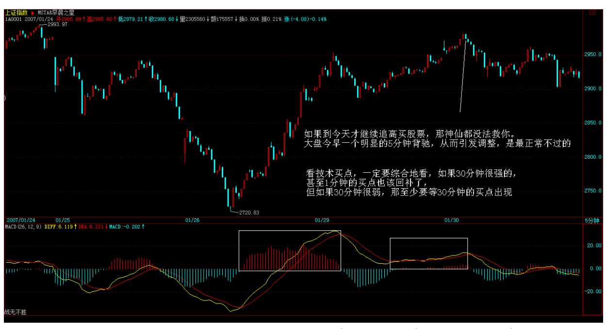

对权证也不例外,例如已经停掉的某认购权证,本 ID 最终在最后几 天上涨到 1 块多完全出掉时,当时的成本是负的 2 块 8 毛多,注 意,本 ID 的仓位是一直不变的,最开始多少就是多少,上上下下, 卖点的时候变少,买点的时候又回复原来的数量,但绝对不加仓,一 开始就买够。

因此,站在这个角度,股票是无须选择的,唯一值得选择的,就是波 动大的股票,而这个是不能完全预测的,就像面首的行与不行,谁知 道下一次怎么样?对于本 ID 来说,市场从来没有任何的风险,除非 市场永远一条直线。当然,对于资金量小的投资者,完全可以全仓进 出,游走在不同的凭证之间。这样的效率当然是最高的,不过这不适

用于大资金。大资金不可能随时买到足够的量,一般来说,本 ID 只 在月线、最低是周线的买点位置进去,追高是不可能的,这样会让变 负数的过程变得太长,而且都是在庄家吸得差不多时进去,一般都是 二类或三类买点,这样可以骗庄家打压给点货,从散户手里买东西太 累,一般不在月线的第一类买点进去,这样容易自己变庄家了。对于 庄家来说,本 ID 是最可怕的敌人,本ID 就像一个吸血的机器,无论 庄家是向上向下都只能为本 ID 制造把成本摊成负数的机会,他无论 干什么都没用,庄家这种活,本 ID早不干了,本 ID 只当庄家的祖 宗,庄家,无论是谁,只要本 ID看上了,就要给本 ID 进贡。一笔足 够长的钱+加上本 ID 理论的熟练运用=战无不胜。市场,哪里有什么 风险?70

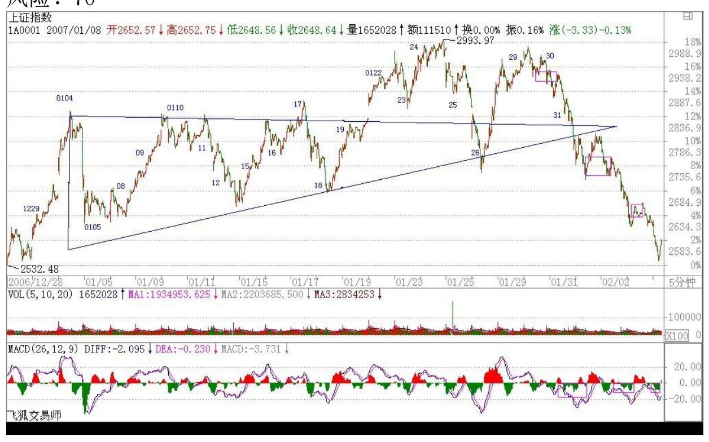

71 72

\*\*\*\*\*\*\*\*\*\*\*\*\*\*\*\*\*\*\*\*。

解盘及互动问答:

\*\*\*\*\*\*\*\*\*\*\*\*\*\*\*\*\*\*\*\*。

缠师:今天大盘的走势什么自然,还加上加息的忽悠,就更厉害了。 但这没什么,关键是你操作得法,这才是关键。别整天跌了才问怎么

办,卖点出来的时候干什么去了?别小看短线,没本事干短线的才鄙 视短线。有本事的,凭什么不干?学好技术吧。股票都是废纸。但本 ID 的理论能让废纸变出黄金。大盘的周线中枢震荡也不是今天才说 的。因此上上下下都很正常。按着短线的背驰可以找到很好的买卖 点。对于高手来说,震荡行情是最好挣钱的,即使目前办不到,也要 好好学习。其他就不说了,心态第一,洗心革面!2007-01-31 15:24:33每个人都有看法,特别像股市这种东西,但来这里,首先要 洗心革面!否则就别来,来了也白搭!如果来了这里,你还追高杀 跌,不要买点买\卖点卖,那就别来了。世界很广阔,何必来这里。今 天的大跌不过是昨天 5 分钟背驰所引发的。按照本 ID 的理论,你不 能逃过吗?然后你按 5 分钟或其他的买点重新买入,难道就不可以避 免所有的下跌吗?下跌对于本 ID 理论的实践者来说,就是快乐的事 情。因为在下跌之前,你已经离开,因为下跌总在卖点之后。至于有 人 6 块不买,喜欢 12 块买。那行,不是有人说 15 分钟拉涨停吗? 别说涨停,从跌停到涨停,10 分钟足够了。但首先要把喜欢杀跌的都 给杀掉!500 万股压盘算什么?大盘跌 150 点又算什么?好。本 ID 不是雷锋。本 ID 干的事情只按技术与需要来。解放军已经干了。以 后有谁还说废话也可以继续废话。只是各位,想学真功夫的人,就少 听废话为好。别再干 6 块不买 12 块才买的蠢事!至于有些希望明天 还跌停的黑心汉。也少点白日梦。别刚学了点皮毛就觉得怎么了。还 早着呢。(娇注:禅师生气了,在说000999。)以上话都是梦话。现实 如有雷同和本 ID 毫无关系。本 ID 不担负任何法律责任。下午走的 太急,补充一段,有必要把一些前面已经多次提过的原则重复一次: 1、你手中的钱,一定是能长期稳定地留在股市的,不能有任何的借贷 之类的情况,这太关键了。本 ID 见过太多的人就是死在钱的非长期 性上,故事以后有空说。

2、级别必须配套来看,最好不要单纯的短线。任何进入的股票,最好 是至少是日线级别的买点进入的,一定不能远离底部,特别对于生 手,这更为重要。短线是让你把成本降下来,而且确保持有的安全 性。除了日线的单边上扬走势,短线必须坚持。但仓位可以控制。例 如,用其中的 1/3,慢慢养成好习惯以后,就可以更随心所欲一点。

73 3、如果判断不准确,那卖点卖错了无所谓。这么多股票还怕找不 到好的?但买点一定要谨慎,宁愿筹码少了,也不能追高买回来。操 作中,开始的熟练程度差,不奇怪,这种事情要不断实践才能提高 的。

- 4、最开始,以中长线心态进入时,尽量参考一下基本面的情况。不能 搞太烂的股票。而短线就不大需要考虑这些问题,只看技术就可以。
- 5、不要有依赖心理,只有自己在实践中成为自己一部分的,才是真实 的。
- 6、一个坏习惯足以毁掉一切,每次操作后一定要不断总结,逐步提 高。
- 7、如果你选择股票时是以一个中长线的心态谨慎选择的,那么就不要 随便斩仓。本 ID 反对斩仓、止蚀之类的玩意。亏出去的钱是真亏出 去的。而只要筹码在,不断的短线足以把成本摊下来。斩仓又一定能 买到更好的股票?特别在中长线依然看好的情况,更没必要。
- 8、先卖后买也是可以挣钱的,不要光知道先买后卖。
- 9、股票都是废纸,你要的不是任何股票,而是通过股票把血抽出来! 10、恐惧和贪婪,都源自对市场的无知。

大 盘 今 天 因 为 一 个 1 分 钟 的 背 驰 反 弹 , 但 力 度肯 定 不 能 和 上 次 相 比 , 这 也 就 是 所 谓 的 不 重 复, 走 势 都 能 让 所 有 人 猜 到 就 不 是 走 势 了 。200702-01- 15:32:19

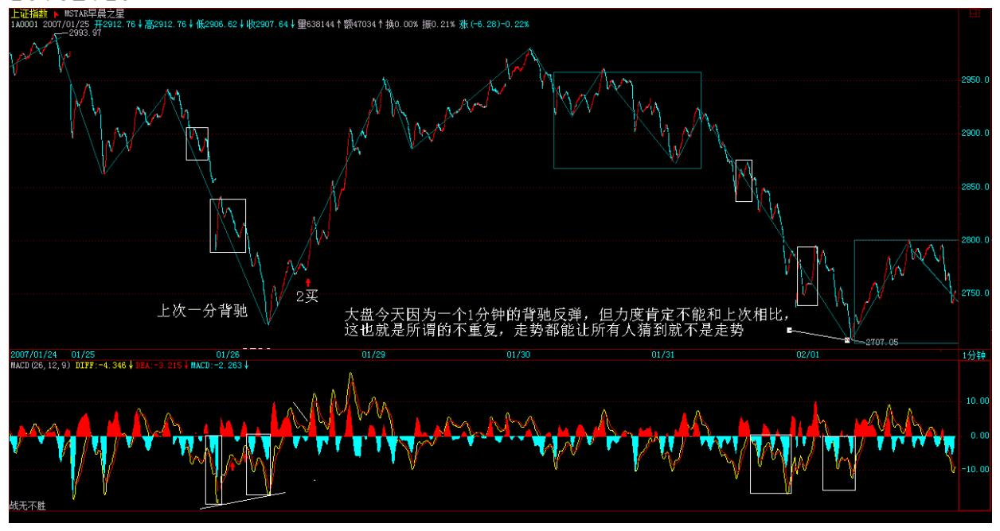

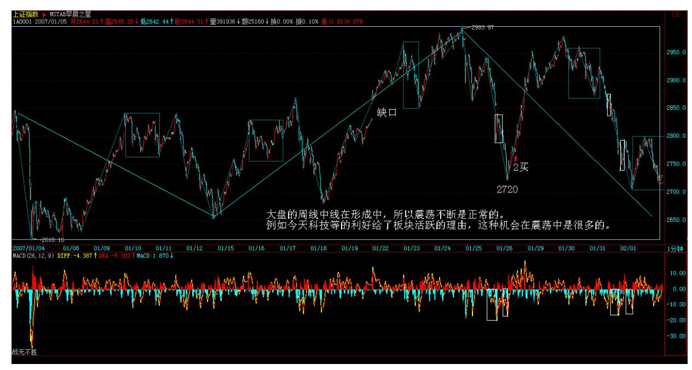

75 像 000416、000600、000998 这些创新高、或涨停的,就不要追 高,低位不买,去追高是本 ID 最厌恶的事情。弄短差就要一心一 意,这样才容易有效果的。当然,技术熟练的可以在一个股票组里不 断变换,但这需要练习。大盘的周线中线在形成中,所以震荡不断是 正常的。例如今天科技等的利好给了板块活跃的理由,这种机会在震 荡中是很多的。

76 大盘现在的任务是先站稳,在这种情况下弄短差,如果技术不熟 练,宁愿卖早了,不能卖迟了,只要有钱赚、有差价,先变成现实为 好。当然,没这条件的,就中线拿着,只要不是烂股票和追高买的, 问题都不大的。

#### \*\*\*\*\*\*\*\*\*\*\*\*\*\*\*\*\*\*\*\*。

1. 网友 [匿名] 过客: 今天的药有点受潮啊,缠姐。 2007-01- 3015:19:09缠师:那就对了。前两天提醒了都不走,今天还问什么? 现在是走了的找机会买回来,而不是问这类无聊的问题。这个毛病改 不过来,很难提高。

#### \*\*\*\*\*\*\*\*\*\*\*\*\*\*\*\*\*\*\*\*。

2. 网友 [匿名] 淡定: 楼主辛苦!000001 坚定持有,早上出了小部 分 600050,感觉短期是否该回避风险了? 2007-01-30 15:26:05缠 师:看技术买点,一定要综合地看,如果 30 分钟很强的,甚至1 分

钟的买点也该回补了,但如果 30 分钟很弱,那至少要等 30分钟的买 点出现。

#### \*\*\*\*\*\*\*\*\*\*\*\*\*\*\*\*\*\*\*。

3. 网友 [匿名] 雨中荷: 楼主好!我今天在 11.30 元左右全仓买入 000999,尾市跌停,楼主我该如何操作?是先出局还是先观望?谢谢 你!2007-01-30缠师:首先,你为什么要在那里买?1 分钟背驰就 买?一个一月涨了 1 倍的股票,1 分钟背驰就买?先套着吧。好好反 省。看来本ID 前几天的提醒白说了。中线该股是肯定没问题的,短线 受点折磨也应该,否则永远没进步。以后本 ID 都不会再提醒就洗盘 了,反正说了也白说,而且还害了大家有依赖。

\*\*\*\*\*\*\*\*\*\*\*\*\*\*\*\*\*\*\*\*4. 网友 [匿名] 天生迷糊: 你好!数学女 孩。今天好多人都不敢买卖了,大盘忽悠起来了,能给个明灯吗?我 正在学习你的课程,感谢! 2007-01-3077 15:31:56缠师:先把本 ID 说过的理论搞清楚,今天的大盘走得太标准了,一点意外都没有。看 看 5 分钟的图。

#### \*\*\*\*\*\*\*\*\*\*\*\*\*\*\*\*\*\*\*\*。

5. 网友 [匿名] 学习: 5 分钟背弛看到了,和上一次相比没什么新 意。唯一的区别是上次比较明显的看出 5 分钟的回拉是一个走势类 型,而这次回拉,我没有看出中枢。 2007-01-30 15:43:11缠师:看 出是第一步,第二步而且最重要的是操作。这里又不培养股评,知道 有什么用?关键是操作。操作就有一个量的问题,而且还有个股与大 盘不同的问题,这都要在实践中不断提高的。

#### \*\*\*\*\*\*\*\*\*\*\*\*\*\*\*\*\*\*\*\*。

6. 网友 [匿名] 糊涂: 缠姐 你好!你说的行业里没有煤炭股,不知 道煤炭股的后市如何?大同煤业今天 30 分钟新高。但 macd 很短是 否背弛?2007-01-30 15:56:28缠师:能源可以,没问题的,本 ID 不 可能把所有板块都买了,并不是说本 ID 不买的就不好。

### \*\*\*\*\*\*\*\*\*\*\*\*\*\*\*\*\*\*\*\*。

缠师:大家注意了:在谈判中,没到最后一刻都不知道最后的买家与 价格,这是多方较力的结果,这种事情,怎么可能让记者知道?关键

是要去想想,为什么这么多人都想收购他?收购价是多少?这是否能 支持其股价以及继续向上。当然,这些最终都反应在走势中,看着就 知道了。本 ID 这里当然有很准确的消息,但说出来也没什么意义, 反而让大家有个坏习惯。

各位,现在就不要具体问个股如何操作的问题了,就是按图形来操 作,把级别定好,但千万别太机械了,要配合好大级别的,否则都按 1 分钟来,就

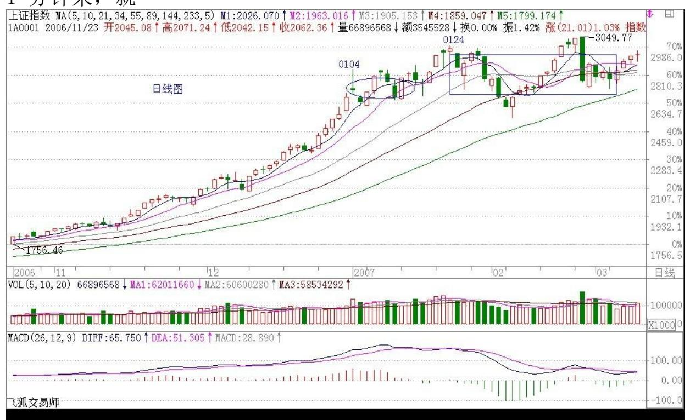

78 机械了。首先要判断好大级别的走势,例如日线在上涨中,那 1分 钟之类的就算走了,一定要及时买回来,而且最好别按 1 分钟弄,5 分钟甚至更长都可以,除非是最后的急促拉抬,那就要配合好 1 分钟 的图形。600779 就是一个好例子,好好研究。

上海的指数就是一个最好的例子,8 月份上来到去年底,趋势中最多 就是 30 分钟的中枢,从今年一开始延续到现在,先形成日线中枢, 然后扩张为周线中枢, 这之间的不同也太明显了。

(备注:07 年 6 月前说的 30 分中枢,相当于后期的 5 分中枢;日 线中枢相当于后期的 30 分中枢;5 分中枢相当于后期 1 分中枢;1 分中枢相对于后期的 1 分图笔中枢)79

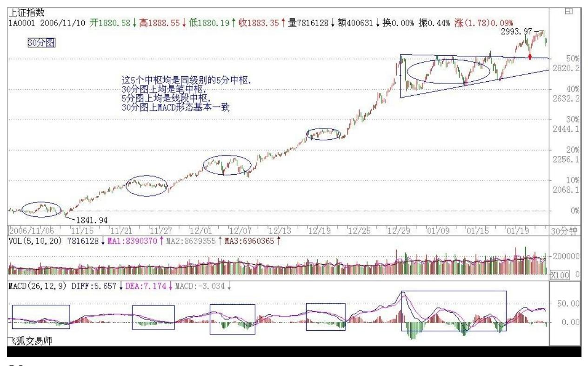

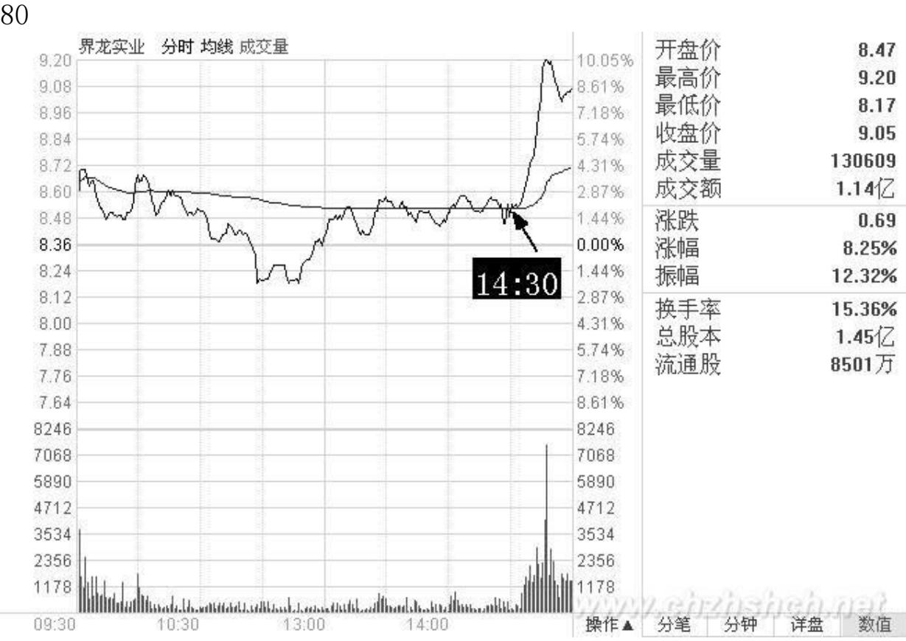

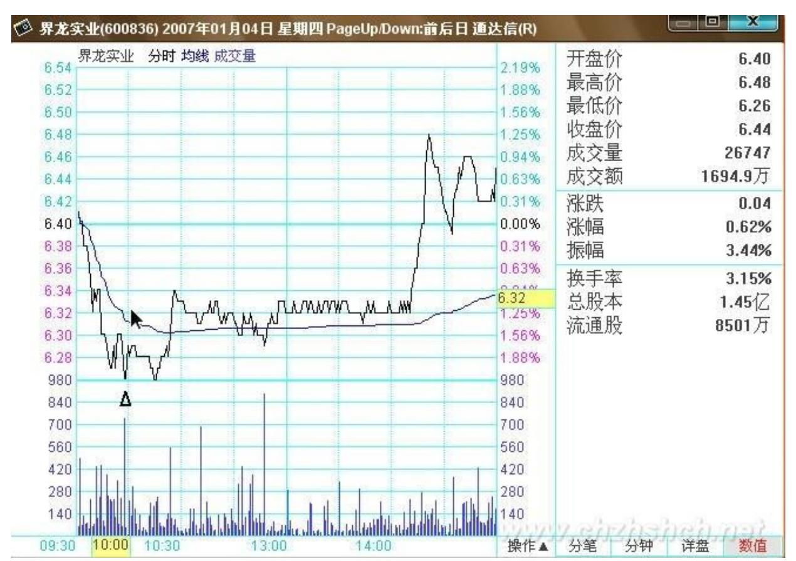

7. 网友【匿名】:缠主你好!今天 600836 我如果按照原来的思路, 今天我就会满仓进,明天出。可是你说过不追高买票,我忍了。但是 如果它走出600817 当年的走势,我们不就失去一次很好的机会?这样 的超强的股票如何把握?2007-02-01 21:59:55缠师:今天 14 点半, 是一个典型的 1 分钟上,第一中枢上来,0轴回抽构成第二类买点的 例子,如果在那时候买了,你算又学了点东西。根本不存在追高的问 题。如果拉起来再买,那就没必要了。

所谓超强的股票,主要是他在第一、二类买点的时候你没发现而已, 没什么特别的。该股 30 分钟的第一类买点在 1 月 4 日 10点左右。 第二类买点在 1 月 18 的 11 点,都很容易发现的。

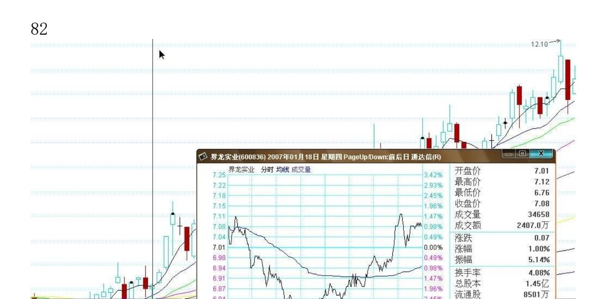

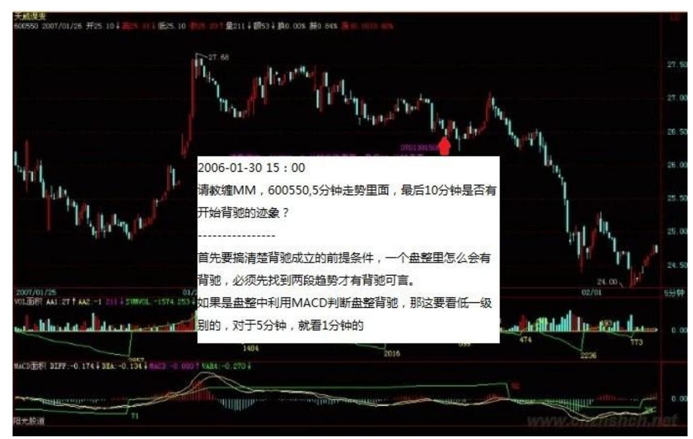

84 8. 网友【匿名】:请教缠 MM,600550,5 分钟走势里面,最后10 分钟是否有开始背驰的迹象?2006-01-30 15:00缠师:首先要搞清楚 背驰成立的前提条件。一个盘整里怎么会有背驰?必须先找到两段趋 势才有背驰可言。如果是盘整中利用 MACD判断盘整背驰,那这要看低 一级别的,对于 5 分钟,就看 1 分钟的。

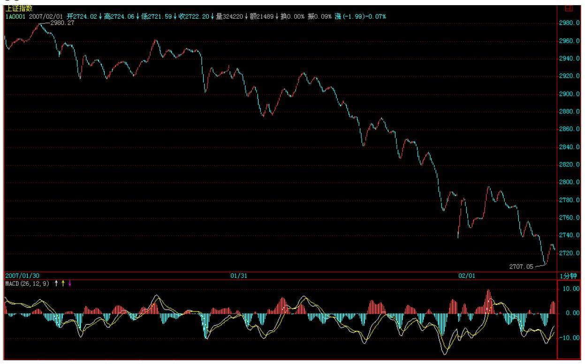

86 9. 网友罗锅:小心呀!大盘走得不好呀!5 分钟不背驰千万别买 股票呀!2007-01-31 11:24:02网友 [匿名] 听缠说禅:1 分钟背驰, 红白线回抽 0 轴的力度不大,才会造成这样的结果吧?那就不算背驰 了?这样的情况怎么把握?这很关键的!请罗锅帮助分析一下。 2007-01-31 11:41:33网友罗锅:下午应该有一个 1 分钟买点。但 5 分钟走的很难看。

这 1 分钟有什么意义呀?对冲一下可以吧?俺现在是等 5 分钟走好 再说啦!87

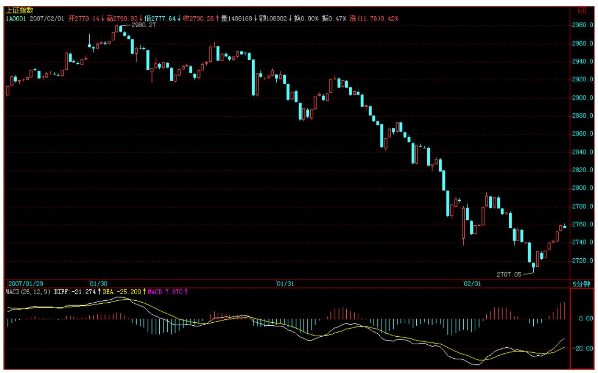

88 10. 网友[匿名] 无言: 真是痛心呀。看看要形成周线的中枢还有 多大的下跌空间。现在大盘是阴跌,不是快速杀跌。时间久了。你们 整天想着打短差,会赚小钱亏大钱的。现在最明智的就是空仓呀。 2007-01-31 12:01:52网友罗锅:大纱帽(大傻冒)。真下跌的时候按 数学妹妹的方法,不一样可以逃掉?到时候就是 30 分钟不背驰不 买。明白吗?5 分钟背驰不出现,大家千万别买呀! 1 分钟的反弹很 快就有。可以对冲呀。但千万别大面积来。5 分钟还没有走好呀。 2007-01-3114:24:16
