# 教你炒股票 27:盘整背驰与历史性底部

如果在第一个中枢就出现背驰,那不会是真正意义上的背驰,只能算 是盘整背驰,其真正的技术含义,其实就是一个企图脱离中枢的运 动,由于力度有限,被阻止而出现回到中枢里。一般来说,小级别的 盘整背驰,意义都不太大,而且必须结合其位置,如果是高位,那风 险就更大了,往往是刀口舔血的活动。但如果是低位,那意义就不同 了,因为多数的第二、三类买点,其实都是由盘整背驰构成的,而第 一类买点,多数由趋势的背驰构成。一般来说,第二、三类的买点, 都有一个三段的走势,第三段往往都破点第一段的极限位置,从而形 成盘整背驰,注意,这里是把第一、三段看成两个走势类型之间的比 较,这和趋势背驰里的情况有点不同,这两个走势类型是否一定是趋

势,都问题不大,两个盘整在盘整背驰中也是可以比较力度的。这 里,先补充一个定义,就是在某级别的某类型走势,如果构成背驰或 盘整背驰,就把这段走势类型称为某级别的背驰段。

盘整背驰最有用的,就是用在大级别上,特别是至少周线级别以上 的,这种盘整背驰所发现的,往往就是历史性的大底部。配合MACD, 这种背驰是很容易判断的。这种例子太多,例如 000002,谁都知道该 股是大牛股,但这牛股的底部,如果学了本 ID 的理论,是谁都可以 发现的。请看该股的季线图,也就是三个月当成一个 K线的图。1993 年第一季度的 36.7 元下跌到 1996 年的第一季度的3.2 元,构成第 一段,刚好前后 13 季度,一个神奇数字;1996 年的第一季度然后到 2001 年第三季度的 15.99 元,构成第二段,一个典型的三角形,中 枢的第二段出现三角形的情况很常见,前后 23季度,和 21 的神气数 字相差不大;2001 年第三季度下跌到 2005年的第三季度的 3。12 元,前后刚好 17 周,神奇数字 34 的一

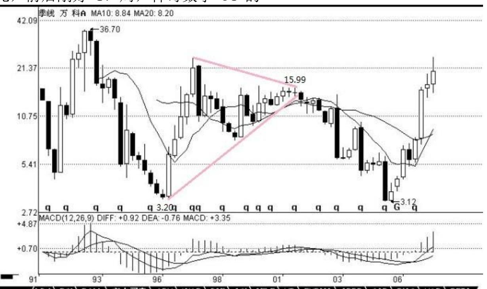

半,也是一个重要的数字。第一段跌幅是 33.5 元,第三段是12.87 元,分别与神奇数字 34 和 13 极为接近。因为 13 的下一个神气数 字是 21,加上前面说过的 17,都不可能是第三段的跌幅,因此,站 在这种角度,万科的 2.99 元附近就是铁底了。不过这种数字分析意 义不大,最简单的判断还可以用 MACD 来,第三段跌破第一段的 3.2 元,但 MACD 明显出现标准的背弛形态:回抽 0轴的黄白线再次下跌

不创新低,而且柱子的面积是明显小于第 1 段的,一般来说,只要其 中一个符合就可以是一个背弛的信号,两个都满足就更标准了。从季 度图就可以看出,万科跌破 3.2 元就发出背弛的信号。而实际操作 中,光看季度线是不可能找到精确的买点的,但对大资金,这已经足 够了,因为大资金的建仓本来就是可以越跌越买,只要知道其后是一 个季度级别的行情就可以了。而90 对于小资金来说,这太浪费时间, 因此精确的买点可以继续从月线、周线、日线、甚至 30 分钟一直找 下去,如果你的技术过关,你甚至可以现场指出,就在这 1 分钟,万 科见到历史性大底部。因为季度线跌破 3.2 元后,这个背驰的成立已 经是确认了,而第三段的走势,从月线、周线、日线等,可以一直分 析下去,找到最精确的背驰点。

91 学过数学分析的,都应该对区间套定理有印象。这种从大级别往下 精确找大级别买点的方法,和区间套是一个道理。以万科为例子,季 度图上的第三段,在月线上,可以找到针对月线最后中枢的背驰段, 而这背驰段,一定在季度线的背驰段里,而且区间比之小,把这个过 程从月线延伸到周线、日线、30 分钟、5 分钟、1 分钟,甚至是每笔 成交,这区间不断缩小,在理论上,甚至可以达到这样一种情况,就 是明确指出,就这一笔是万科历史底部的最后一笔成交,这成交完成 意味着万科一个历史性底部的形成与时代的开始。当然,这只是最理 想的情况,因为这些级别不是无限下去的,因此,理论上并不能去证 明就是一个如极限一样的点状情况的出现,但用这种方法去确认一个 十分精确的历史底部区间,是不难的。

推而广之,可以证明缠中说禅精确大转折点寻找程序定理:某大级别 的转折点,可以通过不同级别背驰段的逐级收缩范围而确定。换言 之,某大级别的转折点,先找到其背驰段,然后在次级别图里,找出 相应背驰段在次级别里的背驰段,将该过程反复进行下去,直到最低 级别,相应的转折点就在该级别背驰段确定的范围内。如果这个最低 级别是可以达到每笔成交的,理论上,大级别的转折点,可以精确到 笔的背驰上,甚至就是唯一的一笔。(当本 ID 十几年前发现这个定 理时,有一个坏毛病,总是希望在实际操作上也精确到笔,因此还发 明了其他古怪的看盘方法,不过这些其实都意义不大,1 分钟的背驰 段,一般就是以分钟计算的事情,对于大级别的转折点,已经足够精 确了,对大资金,基本没什么用处。)要理解本章,如果忘了的,最 好把高数里的区间套定理复习一下,这个思路是一样的,当然,由于 级别不是无限可分的,不可能达到数学上唯一一点的精度。各位有时 间可以参考一下,600640、000001、000006、000009、000012、

600643 的季度图,看看历史底部是怎么形成的。当然,只有特别老的 股票才可以用季度图。而月线图的,看 600663、一个标准的例子。

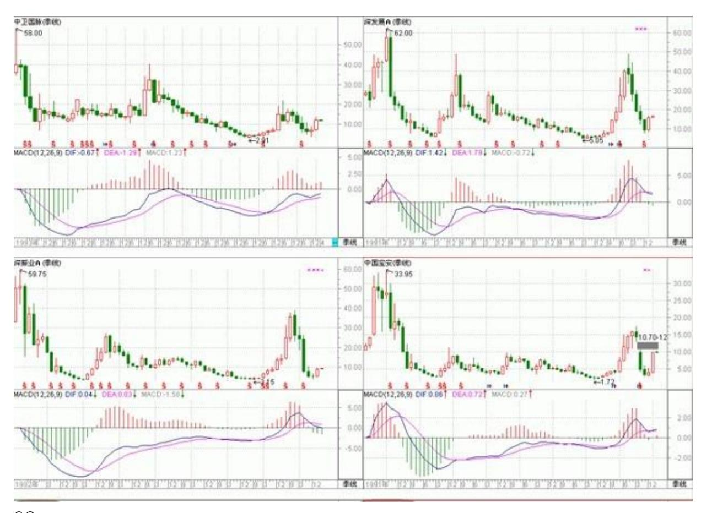

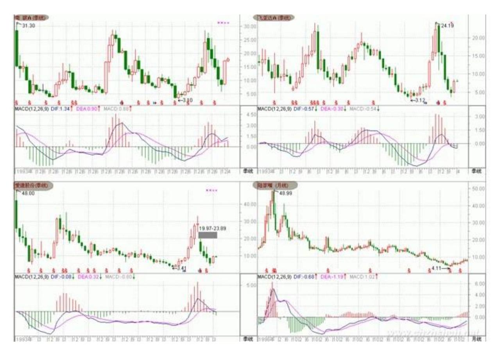

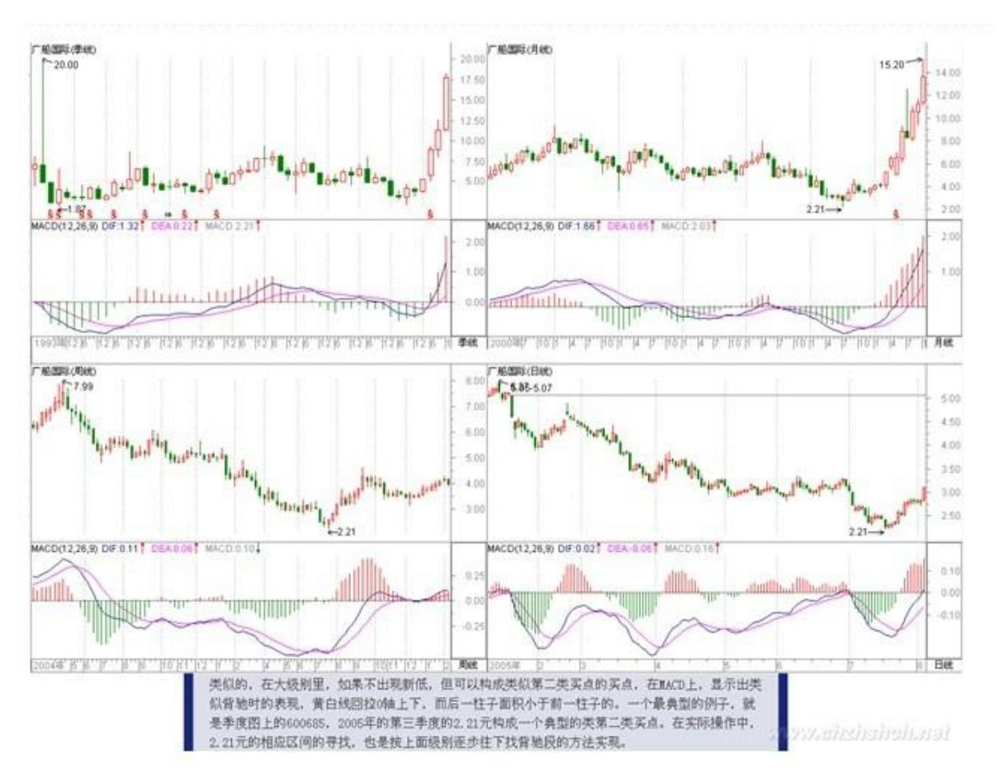

94 上面说的是背驰(注:笔误-盘整背驰)构成的买点,注意,第一 类买点肯定是趋势背驰构成的,而盘整背驰构成的买点,在小级别中 是意义不大的,所以以前也没专门当成一种买点,但在大级别里,这 也构成一种类似第一类买点的买点,因为在超大级别里,往往不会形 成一个明显的趋势,这也就是以前回帖曾说过的,站在最大的级别 看,所有股票都只有一个中枢,因此,站在大级别里,绝大多数的股 票都其实是一个盘整,这时候就要用到这因为盘整背驰而形成的类第 一类买点了。这个级别,至少应该是周线以上。

类似的,在大级别里,如果不出现新低,但可以构成类似第二类买点 的买点,在 MACD 上,显示出类似背驰时的表现,黄白线回拉 0轴上 下,而后一柱子面积小于前一柱子的。一个最典型的例子,就是季度 图上的 600685,2005 年的第三季度的 2.21 元构成一个典型的类第 二类买点。在实际操作中,2.21 元的相应区间的寻找,也是按上面级 别逐步往下找背驰段的方法实现。

95 96 这一课,把找大牛市底部的一个方法说了,这个方法足以让你 终生受用。随着以后股票越来越多,老股票越来越多,这种方法将在 下一轮大牛市中大放异彩,这大牛市搞不好是 30 年以后的事情了, 30 年以后,希望你还能记得这一课。当然,如果按照周线级别,那不 用等 30 年了。不过,周线找出来的,不一定是历史性大底,可能就 是一个比较长线的底部。如果把这种方法用在日线上,也是可以的, 但相应的可靠性就不是那么绝对了。

补充一个本 ID 理论的学历标准:精通找出各级别中枢的,是幼儿圆 毕业。精通分别中枢的新生、延伸、扩展的,是学前班毕业。精通分 辨盘整背驰与背驰,躲过盘整背驰转化为第三类买卖点的是小学毕 业。各位自己对照一下。

\*\*\*\*\*\*\*\*\*\*\*\*\*\*\*\*\*\*\*\*。

解盘及互动问答:

\*\*\*\*\*\*\*\*\*\*\*\*\*\*\*\*\*\*\*\*。

缠师:今天走势十分正常,昨天已经说了,1 分钟的背驰和上次的不 会一样,都一样还叫走势吗?现在,就让那些看所谓技术的人喊跌破 颈线砍仓去吧,市场永远是智慧赚愚蠢的钱,他们不砍仓,钱从哪里 来。按照本 ID 理论的,这种走势是最好的,比上涨还容易挣钱,关 键是卖点要走,看准了买点才进。下周会有一个 5 分钟的买点出现, 抓住了 10%的利润是跑不掉的。整个周线的中枢还在形成中,这种震 荡将不断,是练习本 ID 理论的绝佳场所,好好练习,这个场所可是 用钱堆出来的。2007-02-02 15:19:09

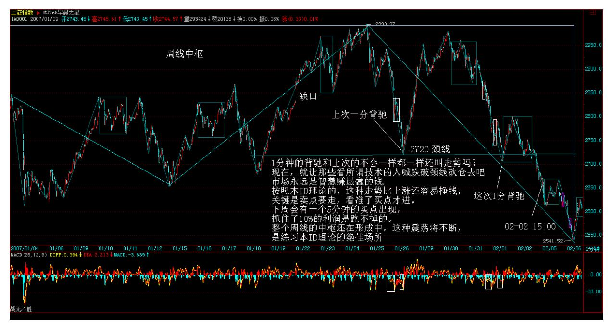

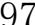

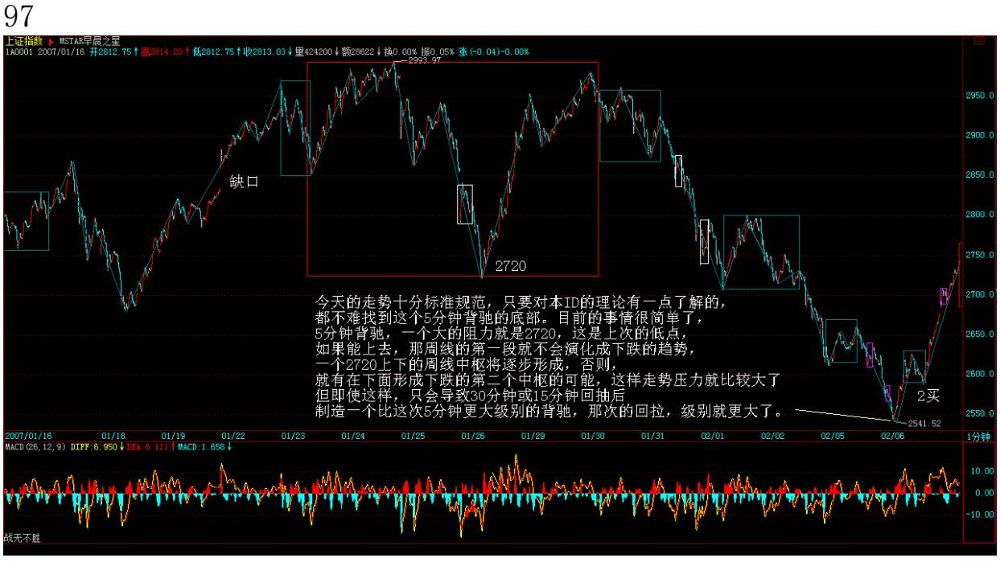

至于本 ID 所说的个股,本 ID 一样按照理论来操作,绝对不会举 着,那是傻瓜的作法,震荡才能产生利润,才能把成本降下来。

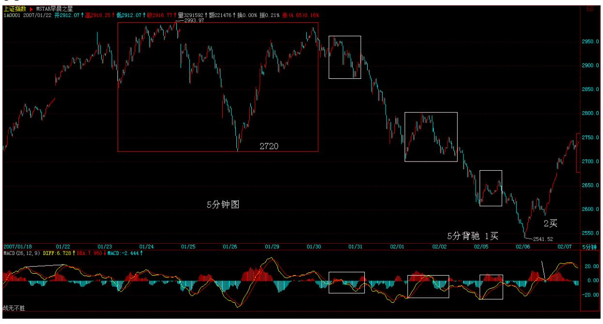

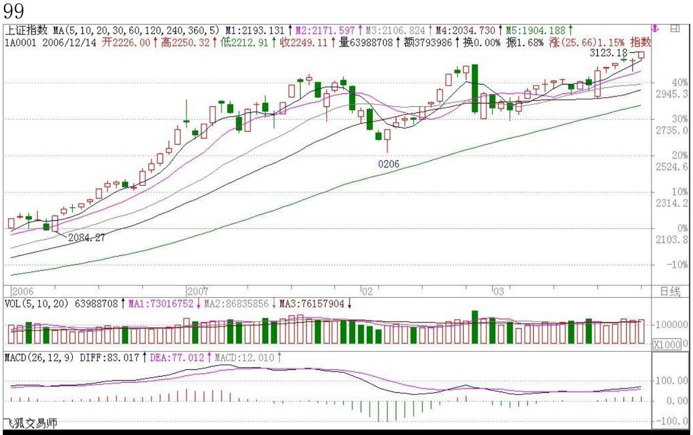

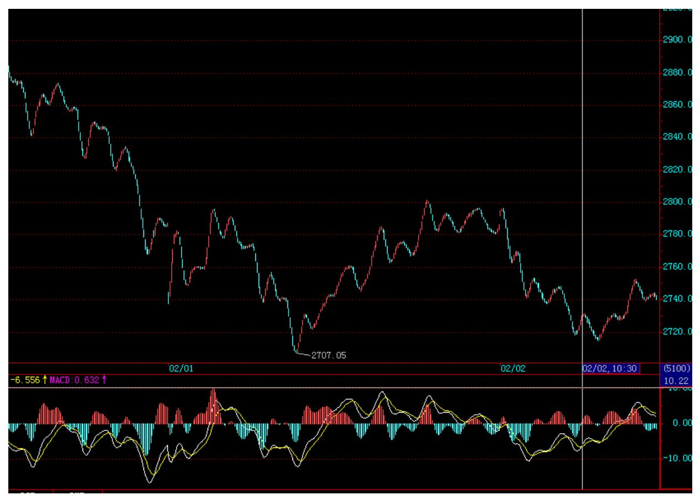

101 个股没什么可说的,关键是操作的技术。这几天,本 ID 说过的 股票里最极端的就是 777 和 999 了,如果你的技术能让你在这几天 在 999 上的获利不比777 差太远,那你的技术就有点谱了。精通本ID 的理论后,涨跌的分别就会消失,在里脑子里,只有买点卖点,没什 么涨跌,达到这种境界,就算初步有成了。

102 1. 网友罗锅:为什么不破底呀?不破不立呀!数学妹妹说过的。 2007-02-02 10:53:39网友 [匿名] 路过:明日大盘,低开低走,主力 全天水下运作。二次探低,下午发力。上海成交过千亿,大涨。周线 翻红。路人,忍不住说几句,技术上的东西很简单,心态是第一位 的。 2007-02-0211:26:03网友【匿名】:大纱帽!这还用你说吗?今 天早上开盘一定跌!看5 分钟图回抽 0 轴还要往下跌一波就知道了! 上海成交不可能过千亿!下午最好破。

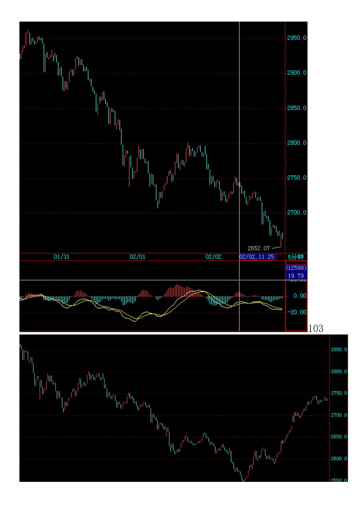

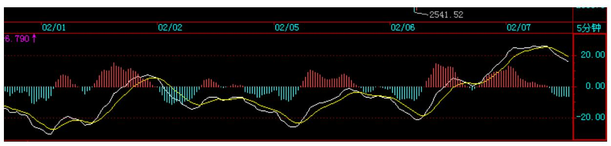

2. 网友[匿名] 小鸟:罗锅,我认为昨天 11 点出现的是第一买点。 2007-02-02 12:05:14104

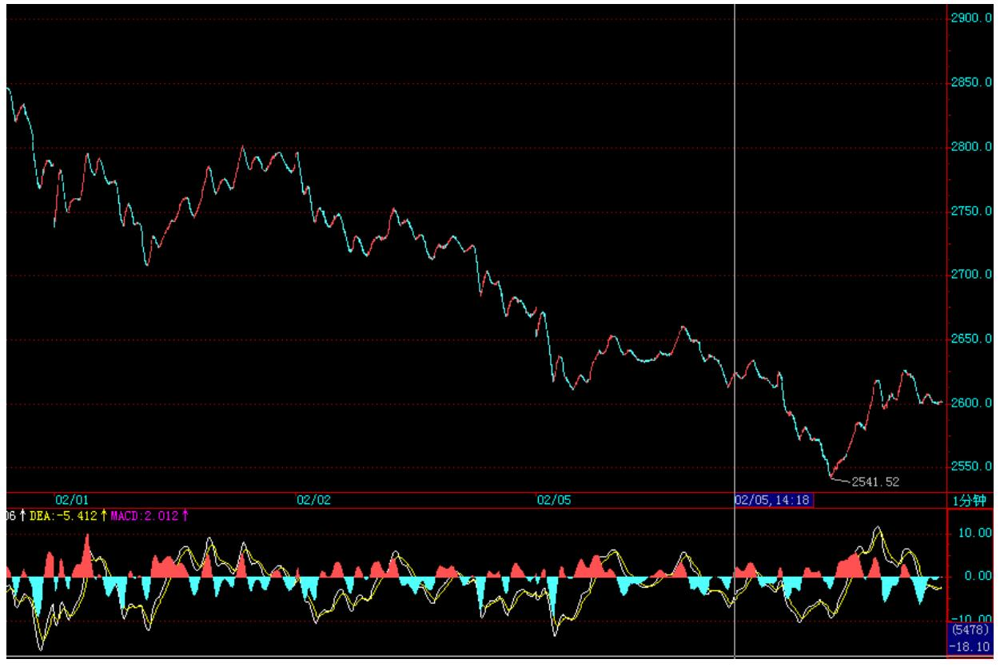

网友罗锅:那是 1 分钟的!现在就等 5 分钟的背驰啦!上面说啦。 不破底就是 1 分钟的第二买点。破了就是 5 分钟的第一买点。当然 前提是要有背驰。今天下午就知道啦。最好破掉。不破反而不好。1 分钟在这里搞一个三角形。那下周还要大跌一次。

105 3. 网友外科医生:罗班长真厉害。5 分钟背驰了。2007-02- 0214:14:58网友罗锅:俺太厉害啦!早上就说下午还要打一波。上午 那个背驰段还没有走出两个中枢。这次可要注意啦。看看是不是真的 背驰啦。大家准备子弹呀。俺现在只有刚才出 000998 的一点钱啦。 也时刻准备着啦。注意这波下来破底。不要急!大盘应该破一次底。

这样才构成 5 分钟背驰呀。2007-02-05 14:18:42106

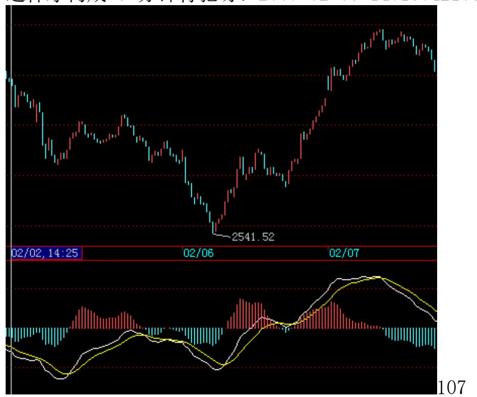

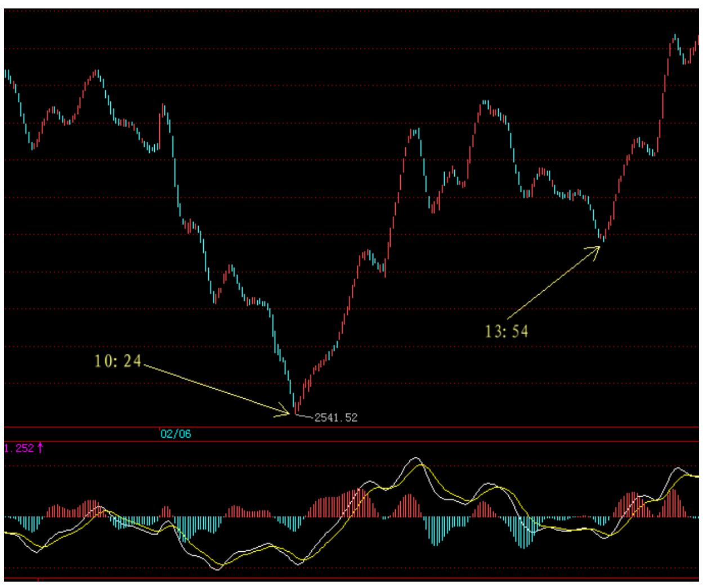

4. 网友罗锅:大盘 1 分钟背驰还没有出现。别急!不过俺的股票都 好。全满仓啦。不管啦。满仓 000999,5 分钟背驰。1 分钟大盘也快 啦。冲!数学妹妹的理论太牛啦!牛!1 分钟大盘今天真的反弹啦。 不过注意卖点呀。从现在开始就要注意卖点啦。特别是对冲的。1 分 钟受阻。熬过还有一波。看14 点。要跳 1 波。看 14 点以后。数学 妹妹的理论太牛啦!第二类买点!太牛啦!救命呀!2007-02-06 14:18:40108

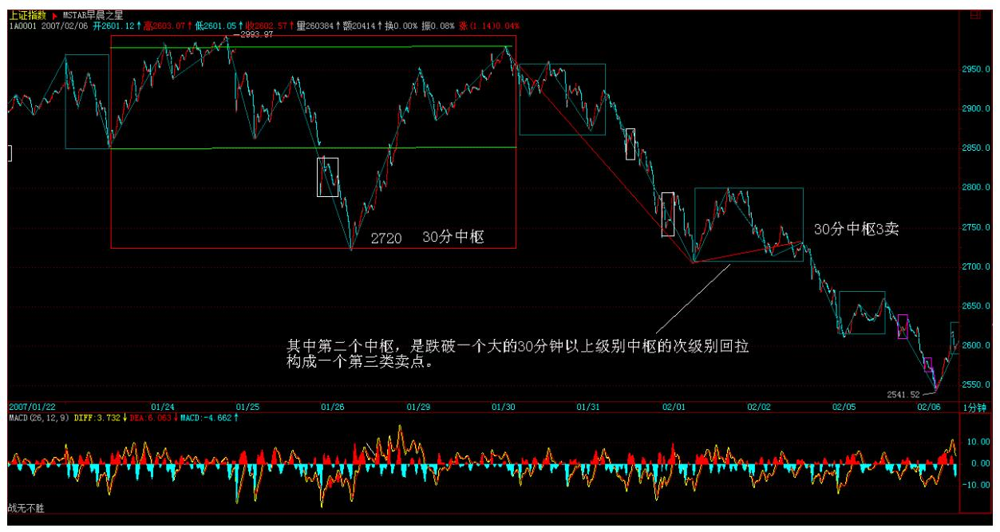

109 缠师:布置作业:今天就用 5 分钟与 1 分钟的配套分析,把这 次 5 分钟的背驰分析清楚。这个问题,在实战中很多这里的人都当下 找出来了,但事后分析一下,复一下盘,还是有意义的。下了,再 见。晚上 9 点公布答案。2007-02-06 16:52:47作业答案(各位请参 考):上次因一个 5 分钟的顶背弛创造出 2980 点的高位,从该位置 开始,是一个 5 分钟级别的下跌过程。共形成三个下跌的中枢:第一 个 1301055 到 1301345,第二 2011105 到 2021110,第三2051005 到 2051330。其中第二个中枢,是跌破一个大的 30 分钟以上级别中 枢的次级别回拉,构成一个第三类卖点。2007-02-0622:14:35110

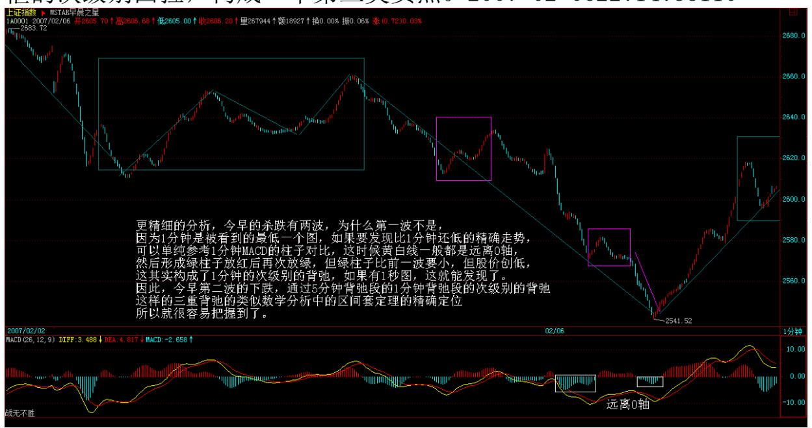

111 而从 MACD 开,从第二个中枢开始的一段,与从第一中枢开始的 一段,力度上也没有特别的减少(娇注:看 MACD 上回来 0 轴后的下 跌黄白线的斜率和速度),所以这时候就是特别小心会产生第三个中 枢。一般来说,从第三类卖点下来的一段,除非力度特别弱,跌破中 枢后马上拉回,否则都不会构成真正的背弛,也就是说相应的次级别 背驰只造成一个下跌中枢。

从第三中枢开始的下跌,从 1 分钟图看,明显弱于从第二中枢开始的 那一段,这从 MACD 上回来 0 轴后的下跌能明显看出。

更精细的分析,今早的杀跌有两波,为什么第一波不是,因为 1 分钟 是被看到的最低一个图,如果要发现比 1 分钟还低的精确走势,可以 单纯参考 1分钟 MACD 的柱子对比,这时候黄白线一般都是远离 0 轴,然后形成绿柱子放红后再次放绿,但绿柱子比前一波要小,但股 价创低,这其实构成了 1分钟的次级别的背弛,如果有 1秒图,这就 能发现了。

因此,今早第二波的下跌,通过 5 分钟背弛段的 1 分钟背弛段的次 级别的背弛这样的三重背弛的类似数学分析中的区间套定理的精确定 位,所以就很容易把握到了。

#### 112

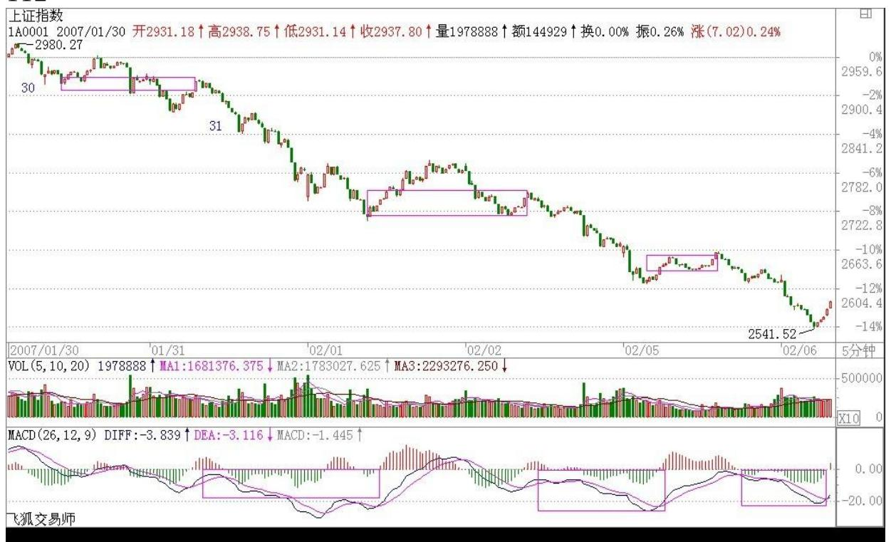

如果不明白区间套定理的,可以找一本数学分析的书看看。或者再研 究一下第 27 课的内容。

#### 113

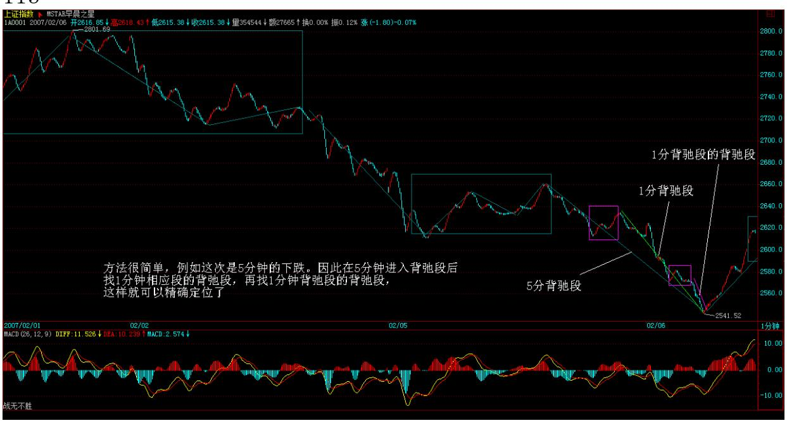

114

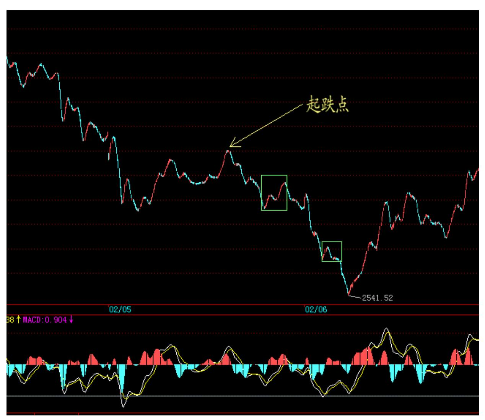

缠师:大家注意了。现在对大家的要求是对背弛的精确定位,如果有 可能,是可以达到 1 分钟的次级别的精确度的。这次大盘的下跌就是 一个很好的例子。方法很简单,例如这次是 5 分钟的下跌。因此在 5 分钟进入背弛段后,找 1 分钟相应段的背弛段,再找 1 分钟背弛段 的背弛段,这样就可以精确定位了。这个方法有点难度,尽量去理解 吧,如果以前学过区间套定理的,应该很简单,或者先找一本数学书 看看?2007-02-06 22:21:08115 116 5. 网友 [匿名] 乐土: 缠师, 这一轮大牛市基本走完?200702-02 15:19:05缠师:这轮牛市的第一 段都没走完,什么叫基本走完?一个周线的调整很正常,又不是今天 才说的。这个调整的级别最多就是去年 5月到 8 月那个,8月以后是 什么?

6. 网友 [匿名] 乐土:缠师,谢谢!再请教:中信证券(600030), 今天是 30 分钟假背池吗?还要象猎人那样,等背池买入点?谢! 2007-02-02 15:29:26缠师:背驰就是背驰,没有什么假背驰。错了是 因为你判断错了。

最多的错误,都是发生在把盘整背驰转化为第三类买卖点给搞成背驰 了。能把这关过了,你的水平可以上初中了。

#### \*\*\*\*\*\*\*\*\*\*\*\*\*\*\*\*\*\*\*\*。

7. 网友 [匿名] 东山: 说禅姑娘,关于一些缠中说禅定理的证明, 有时间您能给写一下吗? 2007-02-02 15:27:35缠师:有些定理,自 己都可以证明。你能证明,就证明你的理解够深刻了。所以这是一个 很好的练习。例如,今天这个,就是很好的例子。

#### \*\*\*\*\*\*\*\*\*\*\*\*\*\*\*\*\*\*\*\*。

8. 网友 [匿名] 咻咻: 请问 600177 在今天 14:40 是否形成了15 分钟线的标准背驰?我的判断对吗?谢谢! 2007-02-0215:25:35缠 师:错。只是一个比 1 分钟还低的背驰。

#### \*\*\*\*\*\*\*\*\*\*\*\*\*\*\*\*\*\*\*\*。

117 9. 网友 [匿名] 惑: 请说一下中国人寿好么? 2007-02- 0215:42:33缠师:这以前早说过了。去形成下跌的第二个中枢。该股 在 49 元那次上涨背驰出来后,本 ID 就从来没提过了。因为该股要 等待一个下跌的背驰出现。出现以后就可以重新介入了。那次,行情 就小不了了。本 ID 也在等着,希望能见到 30 元附近的价位。中 线,N年以后看,复权上 100 是没问题的,不过要耐心等待背驰的出 现。

#### \*\*\*\*\*\*\*\*\*\*\*\*\*\*\*\*\*\*\*\*。

10. 网友 [匿名] 夜雨: 美女姐姐,我总结一下今天的操作,卖都是 对的。没找好买点,买都是错的。一定要看清楚了才下手。可今天买 点好难找啊。

2007-02-02 15:44:21缠师:谁告诉你每天都一定有买点的?在强烈的 趋势中,1 分钟的买点有时候 2、3 天才有一个。不过 5 分钟的买点

正形成中,对于大资金以及好股票,其实今天就可以开始部分介入 了。

#### \*\*\*\*\*\*\*\*\*\*\*\*\*\*\*\*\*\*\*\*。

11. 网友 [匿名] 小鸟: 妹妹,今天 600331 在下午 13:50 我觉得 应该是背驰了,但是却继续下跌,那么收盘前 10 分钟是背驰吧?但 是虽然绿柱子比早上 10 点的高,均线却更低,这是怎么回事呀?补 充一下,是 5 分钟上的。2007-02-02 15:50:16缠师:背驰和均线没 关系。说背驰,你首先要说级别,否则无从说起。

#### \*\*\*\*\*\*\*\*\*\*\*\*\*\*\*\*\*\*\*\*。

12. 网友 [匿名] 炼铁设备:帮帮我!今天 416 一分钟图:从 2 月1 日的 4.30 元至 2 月 2 日的 4.73 元,这个"上、下、上" 的过程 是产生了背驰? 2007-02-02 15:54:58118 缠师:有些敏感的股票,本 ID 就不评论了,免得被人说又当裁判又当运动员。自己去分析,或者 互相分析。

#### \*\*\*\*\*\*\*\*\*\*\*\*\*\*\*\*\*\*\*\*。

13. 网友 [匿名] 乐土: 缠师,我想既然学您的理论,就应该去另外 选一只来磨练。您看中信(600640)或者深发展(000001)可以吗? 我想象猎人一样等待第一买点的到来。今天,我几次想买,但想到与 缠中说禅买点原则不符合,才没冲动。谢! 2007-02-0215:57:57缠 师:不熟练的时候,最好找一些刚突破底部的,业绩不差的,这样安 全点。

#### \*\*\*\*\*\*\*\*\*\*\*\*\*\*\*\*\*\*\*\*。

14. 网友 [匿名] 锅贴: 靓女 lz,我的 600090 惨了。帮我看看还 能不能持有,好吗?谢谢! 2007-02-02 15:57:01缠师:找一个买点进 去弄短线,这有什么惨的?你技术好点,震荡就可以挣很多钱,怕什 么?

#### \*\*\*\*\*\*\*\*\*\*\*\*\*\*\*\*\*\*\*\*。

15. 网友 [匿名] 第一次实战: 今天终于鼓起勇气,按照 lz 理论进 行了第一次实战。目标是宝钢(600019),15 分钟 K 线下午两点出

现明显背驰,买入后宝钢马上强烈反弹,2%的幅度。转而观察低级别 5 分钟,1 分钟 K 线,是否有卖点出现。可虽说无卖点出现,但是由 于大盘忽然转弱,走势急转而下(5 分钟 1 分钟 K 线均无出现卖 点),5 分钟再次出现男上位缠绕。按照 lz 所示,应严守纪律退 出,这时是正好盈亏为 0。但是初次实战,犹豫了一下,走势急转下 跌,-2%,于是坚定退出。再次等待机会。结语:任何走势都是无定 的,严守纪律,给操作戴套。 2007-02-0215:55:45缠师:你知道你的 操作为什么有问题吗?首先,你对背驰的判断是错误的。宝钢 15 分 钟根本没有背驰,更谈不上标准。黄白线都没拉回去,怎么可能有背 驰?该背驰是典型的 1 分钟背驰,3 波拉上去后就是一个完美的卖 点,为什么?因为这卖点要看次级别的,而1 分钟下面看不到,所以 一般来说,3 波上去就可以走,而且刚好碰到 250 的 1 分钟均线, 最好的对冲出逃机会了。好好总结,继续来。

119

#### \*\*\*\*\*\*\*\*\*\*\*\*\*\*\*\*\*\*\*\*。

16. 网友 [匿名] 第一次实战:谢谢楼主。学艺不精,继续努力。缠 师:注意,是涨的时候形成卖点,而不是跌下来再走。宁愿卖早了, 不要卖晚了。特别是对冲。

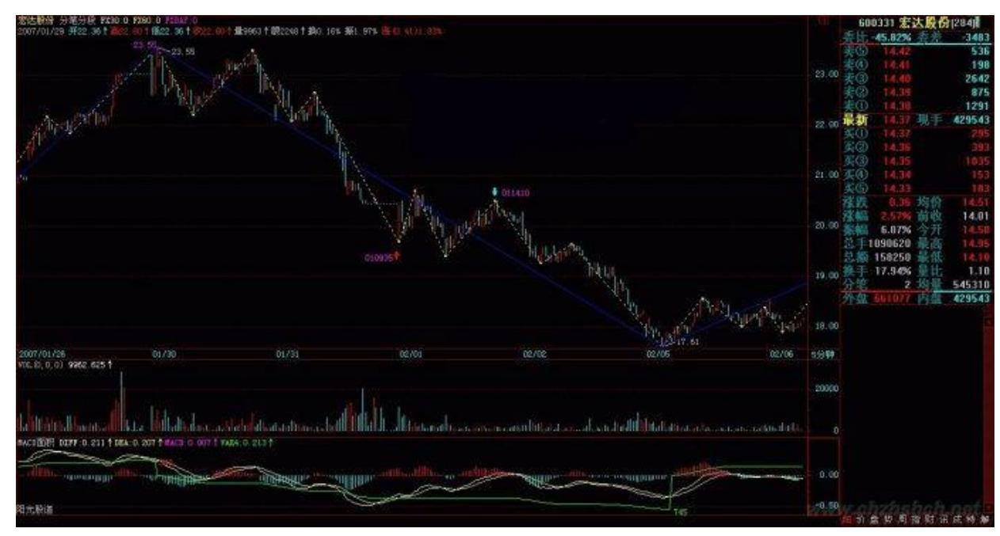

17. 网友 [匿名] 小注: 禅主,601628 是否 30 分钟背弛了,36元 我进了,请你给看看好吗!2007-02-02 16:19:50缠师:错。MACD 的 黄白线没拉回 0 轴前是不会有背驰的。最多是正在形成 1 分钟的背 驰。

#### \*\*\*\*\*\*\*\*\*\*\*\*\*\*\*\*\*\*\*\*。

18. 网友 [匿名] 小鸟: 请问,我的理解对不对呀?妹妹,600331在 5 分钟上在 13:15 到 14:00 只有一个中枢,所以还没形成趋势, 需要继续下跌形成第二个中枢,有了趋势才能和前一个趋势对比,是 不是这样呀?2007-02-02 16:23:54缠师:5 分钟中枢在昨天就形成 了,010935 到 011410,010935 前面是一段,011410 后面是一段, 这两段就可以比较了。

120 121 19. 网友 [匿名] 小注: 禅主,601628 是 15 分钟黄白线 拉回 0 轴一次了。是否 15 分钟背弛?2007-02-02 16:40:50缠师: 这是一个条件,还有必要看其后股价新低后是否创新低。更精确的判 断,可以参考 5 分钟的图。也就是这个背驰段什么时候结束。

#### \*\*\*\*\*\*\*\*\*\*\*\*\*\*\*\*\*\*\*\*。

20. 网友 [匿名] 巴索林: LZ,请分析下 600316 吧,我 25 元的成 本,严重套牢了,怎么办啊? 2007-02-02 16:43:38缠师:下面找一 个买点摊一下,很快可以解套的。

#### \*\*\*\*\*\*\*\*\*\*\*\*\*\*\*\*\*\*\*\*。

21. 网友 [匿名] 清: 先谢谢"本 ID"对我昨天提出问题的回答。 非常谢谢!今日手上 N 多股票都暴跌,国安,水酒和管子都挨了一 刀。水酒"本ID"是不是不要啦?既然错过了卖点。也只能坐坐升降机 了。既然牛市行情还会延伸,就先学点技术。问点关于技术的问题: 背驰是否能理解成黄白线回抽 O 轴的前后两段趋势,再MACD 上映射 的面积比较,当然还有黄白线是否也创出新低(高)的区别,而且回 抽前的面积内会否也出线黄白线的回抽。就是指短时间内多次出现黄 白线在 0 轴缠绕的情况?2007-02-02 16:00:50缠师:本 ID 不是早 说了,前期一直在出消费类的换农业、军工等,消费类,中期调整后 会创新高的。可以利用震荡把成本降低。

周末了,找一个小时去找找自己吧,找不到自己,又怎能不让股票所 转?转股票,而不要被股票转。

#### \*\*\*\*\*\*\*\*\*\*\*\*\*\*\*\*\*\*\*\*。

22. 网友 [匿名] 空读: 搞不清楚的一件事,上班族看日线和 30分 钟线就可以了,看日线的买点进,30 分钟线上的卖点卖了,再在30 分钟级别的买点买回。30 分钟卖点出现后是否一定会出现 30分钟级 别的买点?这次大盘是由一个 60 分钟级别的第一类卖点引起的下 跌,回补的话是等 60 分钟的买点出现?还是等次一级别的买点?60 分钟的次级别是 30 分钟还是 15 分钟?总不会是 5 分钟吧? 2007- 02-02 19:20:16122 缠师:日线是相对的大趋势,以日线买点进,看 30 分钟买卖点做短差降成本。30 分钟卖点后当然有买点。

\*\*\*\*\*\*\*\*\*\*\*\*\*\*\*\*\*\*\*\*23. 网友 [匿名] 小糊小舞: 楼主,有一个小 问题请教下:在看你前面的炒股系列中,你回复别人的个股咨询时, 一会说看 35 日线、70 线,中线你又说过看 120 周线。那么我想问 下楼主眼里的短线、中线和长线周期分别是什么?背后选择的逻辑是 什么?象你这么牛,一定有自己的道理,希望不要简单地以"个人喜 好"来概括。谢谢! 2007-02-03 10:18:57缠师:均线只是个参考, 如同 MACD。后面的中枢理论是关键,有了他,均线和 MACD 都只是辅 助工具。

24. 网友 [匿名] 晕: 另外,有可能某级别没出现中枢,它之上的级 别却出现了,有这种可能性吗? 2007-02-04 19:50:55缠师:不可 能。"之上级别"出现中枢,则由"之上级别"的次级,即当前级别 的三段连续走势构成之上级别的中枢。当前级别的走势至少有一个当 前级别的中枢。

#### \*\*\*\*\*\*\*\*\*\*\*\*\*\*\*\*\*\*\*\*。

25. 网友 [匿名] 夜雨: 美女姐姐,觉得 600028 和 000079, 6000011 有戏吗?觉得跌很多了,想做个差价,可买点好象没找对。 不对,没做成,现在套 5%了。2007-02-05 15:31:07缠师:5%不算什 么?一反弹就开始挣钱了。给大家一句话,因为大家的水平参差,那 就按自己的水平,找看得懂的图形操作。有些特别简单又标准的图 形,先看这些操作。那些因为你的看图水平还达不到的,就避开。这 样是一个比较可行的办法。随着你的水平提高,能处理的图形就越来 越多。

#### \*\*\*\*\*\*\*\*\*\*\*\*\*\*\*\*\*\*\*\*。

123 26. 网友 [匿名] asdf: 缠女王, 有时候在下跌趋势上, 一波 比一波 MACD 绿柱子都短, 面积都小。 有时候第二波比第一波小时 就认为是背驰, 但是后面还有几波, 还是跌, 怎么找到最后一波, 确认那个是背驰啊? 2007-02-05 15:46:02缠师:MACD 只是辅助,不 是全部。你首先要分清楚趋势,如果是趋势造成的盘整(娇:他的意 思是指标盘整),就一定要先确定背驰段。如果 30 分钟是急剧下跌 的,1 分钟的背驰又有多大用?关键是先找到大一点级别的背驰段, 然后再用小级别的背驰来找精确买点,这才是有用的。像这次大盘, 你首先确定目前已经进入 5 分钟的背驰段,然后再按 1 分钟来找买 点,这才精确。当然,最好就是在 30 分钟的背驰段用 5 分钟找买 点,短线这样就比较安全了。

#### \*\*\*\*\*\*\*\*\*\*\*\*\*\*\*\*\*\*\*\*。

27. 网友 [匿名] 站在子弹上: 谢谢楼主的解答。我自己的感觉呢, 就是第一段趋势上去的力度越大,在第二段中枢确立的时候,然后突 破中枢再回抽确认之后为最好的一个介入点,后面的幅度应该也比较 大,速度应该也不差吧。请楼主点评。 2007-02-0515:51:01缠师:好

好去研究一下第三类买点。但对小级别来说,第三类买点有一定风 险,不是买了不涨,而是 t+1 涨了不一定能抛。

#### \*\*\*\*\*\*\*\*\*\*\*\*\*\*\*\*\*\*\*\*。

28. 网友 [匿名] 职业轿夫: 为什么都是军工概念的票,600151和姐 姐的股差距就这么大呢?姥姥不疼,舅舅不爱的。姐姐啊,你就要他 一晚上吧。2007-02-05 15:10:37缠师:没事的,以后都会跟上来的, 不过里面的人比较温柔,不像本 ID 那么穷凶极恶。

#### \*\*\*\*\*\*\*\*\*\*\*\*\*\*\*\*\*\*\*\*。

29. 网友[匿名] 清: 怎么不提"管子"了?2007-02-05 16:12:02124 缠师:000778 没什么事,走得很稳的。这股票,本 ID 本来是用来当预备队用的,万一出什么事情就要兑现了。不过目前还 好,本 ID 其他地方不断产生利润,所以才又有钱开了 000938。不过 这股票千万别瞎抢,本 ID 是中线阻击,看着图形悠着点。

#### \*\*\*\*\*\*\*\*\*\*\*\*\*\*\*\*\*\*\*\*。

30. 网友 [匿名] 糊涂: 缠姐姐,你好!600879(火箭股份),我在 昨天 15 分钟线的背弛点 10:45 和 14:30 都买了,可你说那只是 盘整背弛。那今天 09:45 是否是背弛?因为已经形成两个中枢了 (011000 到 011415 和 021045 到 021500)。今天我在 5 分钟线 14:05 的背弛位全部卖出了。不知我的判断是否正确?卖出了,我又 感觉买不回了,我是否还有买点? 2007-02-05 15:59:04缠师:你的 理解错误了。首先盘整背驰就不一定比背驰差。例如第二类或第三类 买点的盘整背驰,就不会太差。盘整背驰一定要防止变成第三类买卖 点,这要配合大级别的图形来综合的看。例如一个30 分钟上的下跌刚 开始破位,那 5 分钟上的盘整背驰就转化为第三类卖点的几率就 99% 了。所以这种盘整背驰,一般都没必要参与。如果 30 分钟是刚开始 上涨的,5 分钟向下的盘整背驰反而是一个好的买点了。对该股,站 在周线图上看,你看看现在的回试是什么?不能光看一个级别的,眼 光要全面点。

#### \*\*\*\*\*\*\*\*\*\*\*\*\*\*\*\*\*\*\*\*。

31. 网友 [匿名] 中间体: 缠姐,关于背驰的 ABC 三段,有时候B 段反向运动力度太大,造成 MACD 回抽过分,(中枢级别过高?) 图 型就很难看懂。是不是这就会变成一个大中枢呢? 200702-05 16:29:46缠师:如果 B 段不是回抽 0 轴附近,就根本不满足条件, 否则任意三段都可以用 MACD 判断背驰了,那不乱套了?一定要先满 足条件。

#### \*\*\*\*\*\*\*\*\*\*\*\*\*\*\*\*\*\*\*\*。

32. 网友 [匿名] 中间体:是回抽 0 轴了,但回抽过分是不是又变成 大中枢呢?缠师:回抽过分是一个模糊的概念,操作不能模糊,模糊 了就出大毛病了。

125

#### \*\*\*\*\*\*\*\*\*\*\*\*\*\*\*\*\*\*\*\*。

33. 网友 [匿名] ataoo0: 000938,今天楼主怎么一反常态,直接暴 料了? 2007-02-05 16:26:09缠师:以前也说得很明显呀,像药、什 么浙江人那些,一说完,几乎马上就有人猜到,既然这样,那还不如 本 ID 自己说了,别让那些自以为猜谜很厉害的人得意。

\*\*\*\*\*\*\*\*\*\*\*\*\*\*\*\*\*\*\*\*34. 网友 [匿名] 小注: 601628 看着真要奔 30 吗? 2007-02-0516:25:23缠师:30 元,不错。本 ID 就可以开始 重新介入了。

#### \*\*\*\*\*\*\*\*\*\*\*\*\*\*\*\*\*\*\*\*。

35. 网友 [匿名] 恒旧常新: 请问老师一个中枢的问题:形成中枢的 A\B\C 三段中,B 段的高点(上涨中枢中)可以比 A 段的高点高吗? 下跌中枢中,B 段的低点可以比 A 段的低点低吗??200702-05 16:40:43缠师:当然可以,什么情况都可以,只要这三段有重叠就可 以。

#### \*\*\*\*\*\*\*\*\*\*\*\*\*\*\*\*\*\*\*\*。

36. 网友 [匿名] 缠文观止: 【缠中说禅走势中枢定理三:某级别 "缠中说禅走势中枢"的破坏,当且仅当一个次级别走势离开该缠中 说禅走势中枢后,其后的次级别回抽走势不重新回到该缠中说禅走势 中枢内。这定理三中的两个次级别走势的组合只有三种:趋势+盘整、 趋势+反趋势、盘整+反趋势。趋势+盘整中的趋势中的价值中枢,与盘

整中的价值中枢的级别是不同的,后者更高。如果以一个次级别的盘 整类型离开中枢,返回当然不可能也是盘整类型,否则就构成一个大 级别的盘整类型,这就与原中枢维持的前提矛盾了。】(这里引用缠 师的文字)126 我的疑问是:两个次级别走势的组合"趋势+盘整" ,盘整的价值中枢如果比趋势价值中枢高的话,又怎么能叫两个次级 别走势的组合呢?这里的盘整是次级的吗?2007-02-05 16:41:46缠 师:只要走势走出来的,都是可能的组合,这很正常,至于这些组合 构成什么意义的图形,那是另外的问题。这两者不是一个概念。

#### \*\*\*\*\*\*\*\*\*\*\*\*\*\*\*\*\*\*\*\*。

37. 网友 [匿名] 缠文观止:还有对"缠中说禅走势分解定理一" : 任何级别的任何走势,都可以分解成同级别"盘整" 、"下跌" 与 "上涨"三种走势类型的连接。这个定理能不能再具体说明一下,或 证明一下,感觉总有些迷惑。特别是"同级别"这个定语的修饰范 围。定理中提到的"下跌"与"上涨"走势类型一定是趋势吗?缠 师:上涨、下跌当然都是趋势。至于同级别,就是有相同的中枢。至 于两个相同的中枢叠加一起,可能就构成中枢的扩张等情况。一个大 级别的盘整,同样可以分解成小级别的走势类型的连接。任何级别的 图形,如果用该级别的中枢去分类,不到该中枢的,那必然有后面的 走势使得中枢的级别达到该级别。超过该级别的,一定能分级别成该 级别中枢的组合,这应该不难理解。所以,如果用该级别的上涨、下 跌、盘整来看,那就有定理一了。

#### \*\*\*\*\*\*\*\*\*\*\*\*\*\*\*\*\*\*\*\*。

38. 网友 [匿名] 诚诚: LZ,你好!请问钢铁股还有戏吗?我买的 000898,1 月 30 日 30 分钟的背弛没空抛(是背弛吧?),结果跌 下来,就一直舍不得抛了。因为你说钢铁是去年的有色。还有 600386,一直把握不住它的波段。请教。谢谢! 2007-02-0516:56:03 缠师:钢铁股不是已经说了,是去年的有色,你看看去年有色是怎么 走的?600386 是钢铁股?波段只按技术,和个股基本面无关。

#### \*\*\*\*\*\*\*\*\*\*\*\*\*\*\*\*\*\*\*\*。

39. 网友 [匿名] 同学: 缠中说禅走势分解定理二:"任何级别的任 何走势类型,都至少由三段以上次级别走势类型构成。此定理二中三 段以上次级别走势类型怎理解?说的是?请同学们帮帮忙。谢谢!

2007-02-05 22:10:15127 缠师:任何级别走势类型,至少有一个中 枢,这个中枢至少由3 段连续次级别走势的重叠构成。所以,盘整走 势至少有三段以上次级别,那趋势至少有两个中枢,就至少有六段次 级别走势类型构成了。

#### \*\*\*\*\*\*\*\*\*\*\*\*\*\*\*\*\*\*\*\*。

40. 网友[匿名] 学习中: 那有没有可能更少呢?我一直想不通:比 如,ABC 构成一个中枢,CDE 构成另一个同向的,这样只要 5 个段。 另外,BCD也可能另外构成一个反向的,该如何处理?缠师:这样理解 是错的。注意,两个中枢不可能共用一个次级走势。

128
