# 教你炒股票 28:下一目标:摧毁基金

任何不承认股票废纸性质的理论,都是荒谬的。任何股票,如果是因 为有价值而持有,那都不过是唬人的把戏。长期持有某种股票的唯一 理由就是,一个长期的买点出现后,长期的卖点还没到来。站在这个 角度,年线图就是最长线的图了,因为任何一个人大概也就能经历 70、80 根的年 K 线,一个年线的第一类买点加一个年线的第一类卖 点,基本就没了。把握好这两点,比任何价值投资的人都要牛了,那 些人,不过是在最多是年线的买点与卖点间上下享受了一番而已。

站在中国股市的现实中,这轮牛市的一个大的调整,必然会出现基金 的某种程度的崩溃,上一次的牛市,让证券公司毁了不少,这一次牛 市,毁的就是基金。投资的第一要点就是"你手中的钱,一定是能长 期稳定地留在股市的,不能有任何的借贷之类的情况" 。而基金,不 过是所谓合法地借贷了很多钱而已,即使是没有利息的,性质一样。 一旦行情严重走坏,基金必然面临巨大的风险,一次大的赎回潮就足 以让很多基金永不超生。传销,通常只有一个后果:归零。基金,至 少对大多数来说,一样。这是基金一个最大、严重违反投资要点的命 门:他的钱都不是他的。对于开放式基金,这点更严重,因为这种赎 回是可以随时发生的。而中国的开放式基金就更可怕,中国人的行为 趋同性极为可怕,国人一窝蜂去干一件事的后果是什么,大概也见过 不少了,无论政治、经济、学术上,无一例外。

由基金这个大命门,派生出一个必然的小命门,就是所谓的基金经理 必然要以净值为标准,就像当官的以 GDP 为标准一样。而基金又有一 个当面首还要立牌坊的搞笑规定,一个基金拿某只股票是有一定比例 限制的,也就是说,基金在这点上,连庄家都不如,一旦超配,唯一 的办法就是找其他基金帮忙拉一把,几家基金一起持有,其实就是联 合坐庄,万一都超配了,或者一时各基金都无暇他顾,那就构成了一 个很好的阻击机会。站在本 ID 的立129 场上,基金就是傻大个,短 差又弄不来,又不能随时护盘砸盘,他持有的实际效果,就是让股票 的盘子变小了。就算不用一些非市场的手段、一些在中国肯定效果一 流的桌底游戏,一次设计合理的阻击足以让这基金,轻的,吃点哑巴 亏,重的,让他清盘走人。注意,这市场是开放的,不是本 ID心狠手 辣,而是只要有命门,必然有人攻击,难道本 ID 不攻击,这命门就 不存在?和傻大个玩游戏,如果他能熬得住,大不了就弄了一次出色 的短差,等于傻大个持有的筹码人间蒸发了一段时期,投资中,唯一 重要的其实就是成本,成本比傻大个低,再起来时,傻大个就更危险 了,一次搞不死,还不能搞两次、三次,总有搞死的时候。一旦往下 搞,基金的净值熬不住,那基金经理就可以走人了,然后,那些筹码 就可以信达、东方一番了。如果在一个大级别的,例如月线中枢的调 整中,一个集中的攻击,打破一个点,把一个基金公司集中搞跨,所 有的基金公司都将面临严重的赎回潮,然后就整个市场都可以严重地 信达、东方一番了。吃散户有什么意思呀,基金,就是散户打包,让 人一口吃,少麻烦。

最近,一个小的周线中枢震荡,就足以让本 ID 去试验一下。一个20% 都不到的回调,一个就算跌停也就 5%的股票(000999),一个基本面面 临严重好转的个股,已经让某些人坐不住了。某些傻大个超配了,找 人护也没人有空了,看看上周基金的净值,这种局面再维持一周,估 计就有人熬不住了。当然,现在的基金还有实力,一棍子肯定打不死 的,这次只是闹着玩一次,感觉不错,最次就是权当洗了一次盘,弄 了一个出色的短差。本 ID 可没在这次就把人击倒的想法,12 元不 行,难道不可以 20 元才搞死?只要短差出来了,死的一定是没弄短 差的人!本 ID 对散户可从来都很仁慈的,在高位已经严重提醒了要 洗盘了,听不见可不是本 ID 的问题。现在的股票,并不是每一个都 有庄家的,基金成了越来越重要的阻击目标,这个目标是现实存在 的,任何道德说教都没用,你不搞,还怕没人搞?至于这个命门如何 化解,如何不让这成为外国游资的重大突破目标,那就不可能是水平 还在小学的管理层所能明白的。对这种事情,本 ID 的态度一向很明 确,不干白不干,干了白干,本 ID 只是按着技术提示来,买点买、

卖点卖,任何有命门的,都可以产生利润,都可以抽血,为什么不可 以玩玩?有罪的不是本 ID 废了其命门,而是谁让如此的命门来招惹 攻击?市场经济,永远都是血腥的,这一切,都由资本的虚拟化所决 定。

一个虚拟的资本,就如同僵尸,不吃血,怎么活?对于这一点,必须 有清楚的认识。市场打开,就必然要面对各种攻击,如果管理层的智 力还达不到攻击者的千分之一,那只有瞎闹的份。下一个死的,一定 是基金,在一个月线级别的调整中,这一幕必然上演,现在唯一有疑 问的是,不会连一个周线级别的调整,都会有好戏提前上演吧?这个 可能性是不大的,如果真出现,这基金也弱了。对于这么弱的对手, 本 ID 是没兴趣了,对手越强越好玩。

130 投资,就当独行客,所有事情都自己去承担。而本 ID 的理论, 是一个客观的描述,和任何的主观分析无关,就如同阳光、空气,不 管你是否认识,都存在着。不理解这一点,那是不可能明白本 ID 的 理论的。

娇注:禅师这篇文章的论点,不敢苟同:1. 基金是中国证券市场存在 的支撑力量,是融资所依赖的市场的基石,决策者不会让基金死亡 的。2. 价格走势决定一切没错,但股票背后是什么显然对价格有影 响。这也是各种股票表现不一的理由。

\*\*\*\*\*\*\*\*\*\*\*\*\*\*\*\*\*\*\*\*。

解盘及互动问答:

\*\*\*\*\*\*\*\*\*\*\*\*\*\*\*\*\*\*\*\*。

缠师:刚上来,发现下午所有回帖都没有了。这里受到攻击甚至最后 被关闭都是很正常的,因为这里的存在至少会让庄家、汉奸等等很不 高兴。当然,在现实中,本 ID 是不怕他们的,他们能找的人,本 ID 也能找,他们想玩什么游戏,本 ID 都可以陪他们玩。

但在虚拟的空间里,这一切就很难说了,最主要是本 ID 暂时不想抛 头露脸。

最近这里捣乱的人越来越多,这都是很正常的,本 ID 没义务也没兴 趣去制止或干涉他们,在本 ID 这里,爱怎样都可以。不过,如果真

想学习的,就快点把这里的帖子都复制下去,说不好哪天这里被汉奸 给删了,也一定不奇怪的。各位看着办吧。

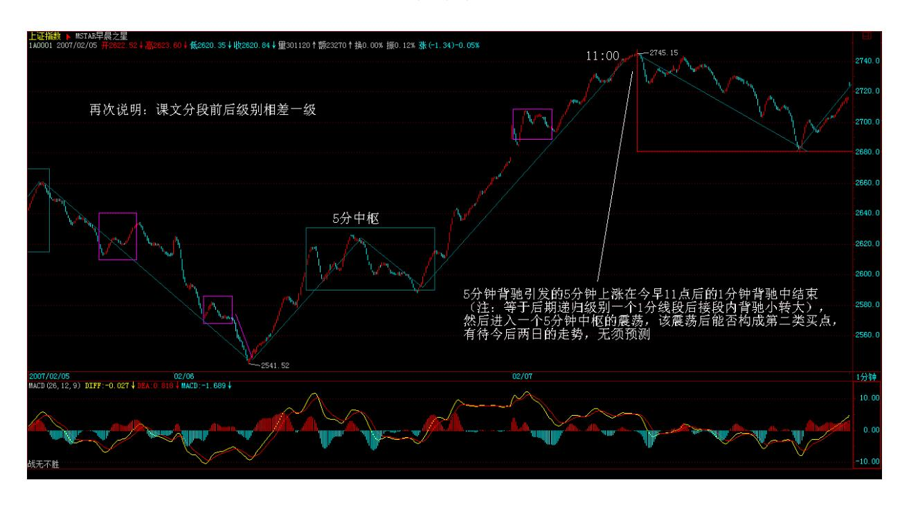

\*\*\*\*\*\*\*\*\*\*\*\*\*\*\*\*\*\*\*\*。

网友罗锅:又可以发新基金啦。管理层投降啦。大盘基本面好转啦。 技术面比基本面要早反应呀。数学妹妹的理论太牛啦。大盘要调一下 啦。不过 2720破,中枢大概就这里啦。以后就是围绕震荡啦。2007- 02-07 11:12:46

#### \*\*\*\*\*\*\*\*\*\*\*\*\*\*\*\*\*\*\*\*。

缠师:把今天对大盘的评价重写。5 分钟背驰引发的 5 分钟上涨在今 早 11 点后的 1 分钟背驰中结束(等于后期递归级别一个 1 分线段 后接段内背驰小转大),然后进入一个 5 分钟中枢的震荡,该震荡后 能否构成第二类买点,有待今后两日的走势,无须预测。(后震荡成递 归级别 5 分钟中枢,一个 5131

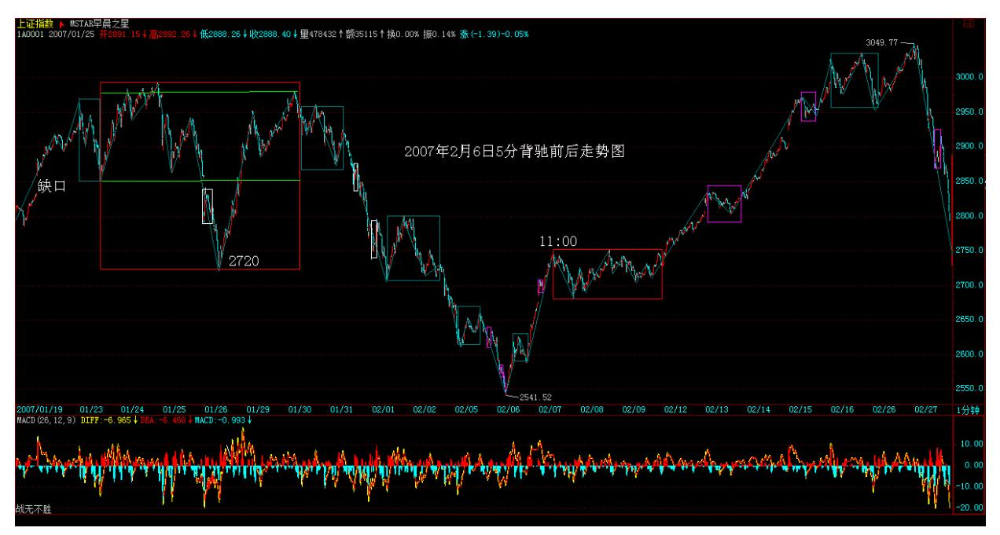

分钟中枢后接一个 1 分钟中枢背驰完成递归级别 30 分中枢的第 2 段)。2007-02-07 20:43:08132

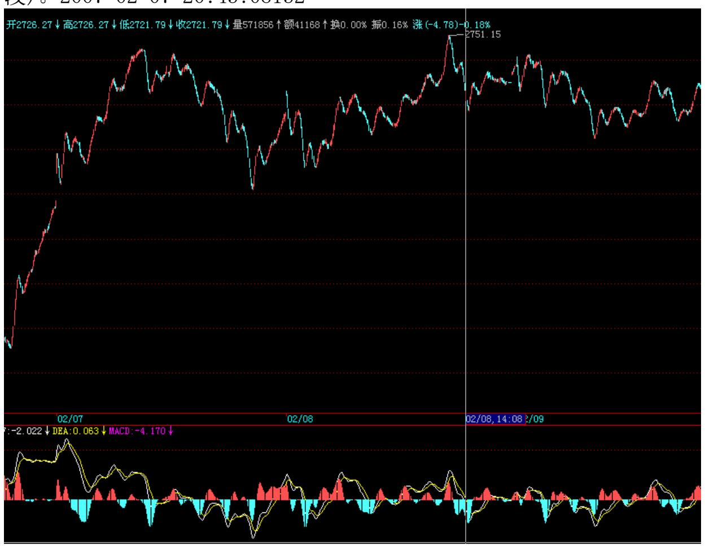

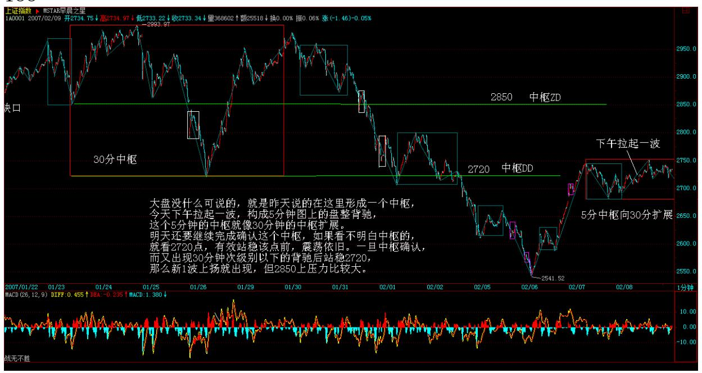

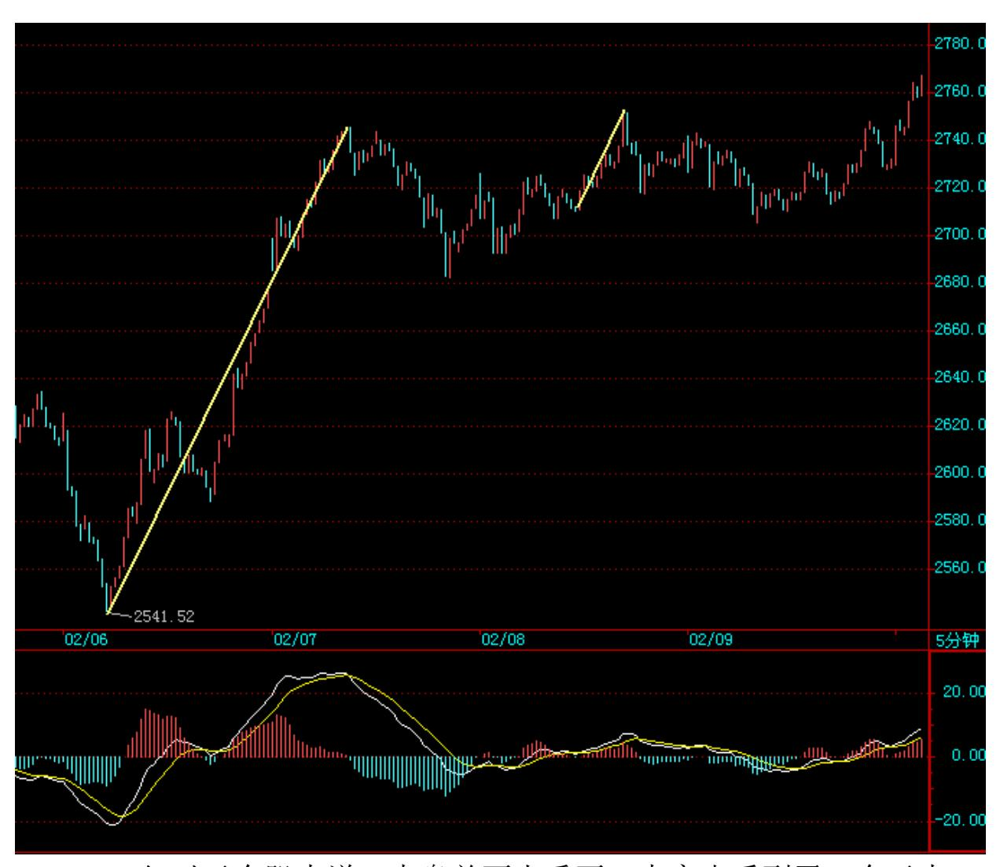

135 136 但对于个股来说,大盘并不太重要。大家也看到了,今天本 ID的某些个股很兴奋,这是正常的。在大盘震荡中,突破一下有好 处,至少大盘如果突然走坏,但回跌的空间与震荡的差价就可以出来 了,而大盘一旦走好,追涨的也会比较踊跃。这些都是手法问题,但 注意,本 ID 最鄙视追涨的人,任何追涨的人,本 ID 都乐于让他有 点教训。追涨,一点技术含量都没有,有本事的就在第一、二、三买 点买。第一、二、三卖点卖。

今天是温柔的浙江人的忌日,本 ID 有一个令无数庄家闻风丧胆的坏 毛病,就是一旦一只阻击的股票到 1 倍升幅以后,本 ID 一定找一个 机会把手里的货出掉一半,然后本 ID 的成本就是负数了,后面,怎 么玩本 ID 都肯定是赢家。不过 777 的题材还在,中线还是有很大空 间的,只是本 ID 的负成本计划在 999 之后又一次胜利完成,当然要 立字为据。

#### \*\*\*\*\*\*\*\*\*\*\*\*\*\*\*\*\*\*\*\*。

1. 网友 [匿名] abc: 请教LZ,关于昨天000002季线,为什 么不考虑除权除息对价格的影响?2007-02-06 15:14:43缠师:不考 虑,不要夫权(不要复权)。

#### \*\*\*\*\*\*\*\*\*\*\*\*\*\*\*\*\*\*\*\*。

2. 网友 [匿名] 摄影之友: 今天我特意休假在家。早上先出了一些 三九药业,后来运用了你的理论,在 5 分钟背驰时,在 9.73 元接 入,做了一个小短差。心里不象昨天那样难受了(俺的货币今天也不 难过了,止跌回暖了)。谢谢你!另:人寿我只有一小部分在手里。 是我用来练习做短差用的。 多谢你!亲爱的博主。真想在家看图做短 差。这种感觉真好。2007-02-06 15:21:09缠师:不用谢谢本 ID,技 术是自己的,关键是自己熟练,和谁都没关系。

#### \*\*\*\*\*\*\*\*\*\*\*\*\*\*\*\*\*\*\*\*。

3. 网友 [匿名] 听缠说禅: 楼主,中国联通终于也动弹了,这次是 30 分钟的背驰,我没有判断错吧? 2007-02-06 15:26:34137 缠师: 会买会卖才是完美的操作!

#### \*\*\*\*\*\*\*\*\*\*\*\*\*\*\*\*\*\*\*\*。

4. 网友 [匿名] 听缠说禅:楼主,你不知道,为了学习你的理论,这 次大盘震荡期间,一直跟着判断并实践着。但是,因为本人愚钝,学 艺不精,加之有时其他事务,耽搁了盯盘,我还是出现了一些失误和 遗憾。中国联通倒是将成本降低了 0.2 元,已经很是开心了。在座的 很多人估计没有几个能像罗锅班长那样有 20%的成绩,我很羡慕他 啊!缠师:成本降低就是成绩,从一种思维、操作到另一种,是一个 艰难的过程。很多人会走回头路,贵在坚持。如果不熟练,可以先降 低操作资金。

#### \*\*\*\*\*\*\*\*\*\*\*\*\*\*\*\*\*\*\*\*。

5. 网友 [匿名] 老无用: 潜水多日,但一直在仔细阅读楼主的文 章,有很多不明白的。今天楼主列举了数只经典股票的季、月线图来 说明大底部的寻找方法,仔细研究了这些股票的季线,仍有很多不解 之处。最大的问题是 600640,按背驰信号的几个标准,该股03 四季

度已创新低,MACD 面积显然小于前期,似应算背驰。当然黄白线与三 季度比仍在小幅下降,但与前期比则明显未创新低。

000001,000002,000006,000009 等亦均是按相同情况判断背驰的。 但该股在经历了一个较强的反弹后,又大幅下挫,直至 05 年三季度 见底。

当然此处是一个明显的背驰,MACD 面积比前期小,但同样此处的黄白 线与上季度比仍在下降。唯一不同的是 MACD 柱子比上一季度缩短。 但其他几只股票也有柱子不缩短的。如 000001,000009 等。

这就给背驰的判断带来巨大困惑。(娇注:他背驰段没有找对)另 000012 在底部时,MACD 面积并未缩小,黄白线仍在下降,柱子长度 亦未缩短,如何判断其背驰呢?是否还有其他研判标准,楼主还未及 披露? (娇注:000012 最后 30 分背驰段连绿柱子都不出的盘 背)。

最后就是复权问题,两月前楼主曾戏言是反对夫权,所以不复权,后 又说均可。但这两者有巨大差别,因复权后无新低可言,背驰研判失 去前提。此类问题困惑心头日久,给学习和实战带来极大问题,诚望 楼主给予解惑。谢谢!2007-02-06 15:17:36138 缠师:你的图形是复 权的?不要复权。对超长线,更没必要复权。短线有点必要,毕竟突 然的缺口,使得一些指标有变化。但也只限于除权后的一定时间内。 如果熟练,根本没必要复权。

\*\*\*\*\*\*\*\*\*\*\*\*\*\*\*\*\*\*\*\*6. 网友 [匿名] 三藏:楼主帮忙给解释一下缠 中说禅趋势平均力度吧,理解不了。想了好久了。有哪位同学知道 的,告诉告诉我啊!今天第一天来学习。 2007-02-06 15:31:52缠 师:用 MACD,这样比较简单,要用本 ID 那个指标,必须自己制作一 个指标,这样才好用,否则一般人用不好。

#### \*\*\*\*\*\*\*\*\*\*\*\*\*\*\*\*\*\*\*\*。

7. 网友 [匿名] 三藏:好像很难啊。那么要用楼主的"趋势平均力 度"这个指标的必要条件就是:1. 首先要用 MACD。2. 自己制作一个 指标。可是定义都没理解,怎么做指标吗?能换一种表达方式,重新 解释一下定义吗?谢谢楼主了!缠师:不对。MACD 就可以了。一般人 没必要用本 ID 那个指标,那东西是精确,但用起来很麻烦,还要自

己编指标,一般人根本弄不来。还不如直接用 MACD,准确率差点,但 只要结合好中枢、背驰,达到 95%以上的准确率,是一点问题没有 的。这就足够了。

#### \*\*\*\*\*\*\*\*\*\*\*\*\*\*\*\*\*\*\*\*。

8. 网友 [匿名] 并不完美: 楼主的理论,在工商银行上却行不通 了。无论是日线级别还是 30 分钟级别,从一月四日下跌的那天之 前,都未出现过背离(背驰)。但跌幅却如此深和长。LZ 的理论,让 我们避不开跌的风险。而从那天以后,30 分钟图上至少出现了 2次的 背离买入信号(一月 15 日 10点左右及一月 19 日 10 点左右),但 却在 5 分钟级别的 K 线上,找不出合适的卖点。更谈不上达到前期 的高位来产生顶背离了。希望 LZ 能让我们明白工商银行的特殊性。 这样可以让我们在今后的操作中规避这种类型的股票。谢谢!2007- 02-06 15:44:02缠师:工行的问题以前已经分析过了。那次在 1 分钟 图上出现典型的背驰。这就是急速行情中最典型的特征。1 分钟背驰 引发暴跌,然后是一个下跌,139 两中枢,然后一个三段的 B 段,然 后破底,到今天出现 5 分钟背弛,都十分标准。好好先把中枢概念搞 清楚。

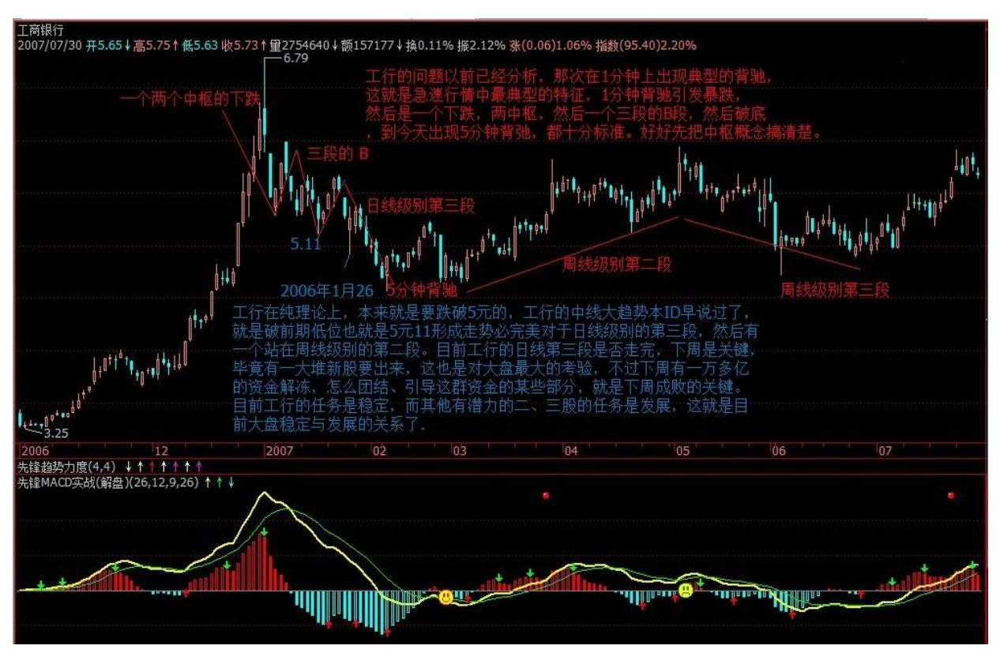

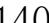

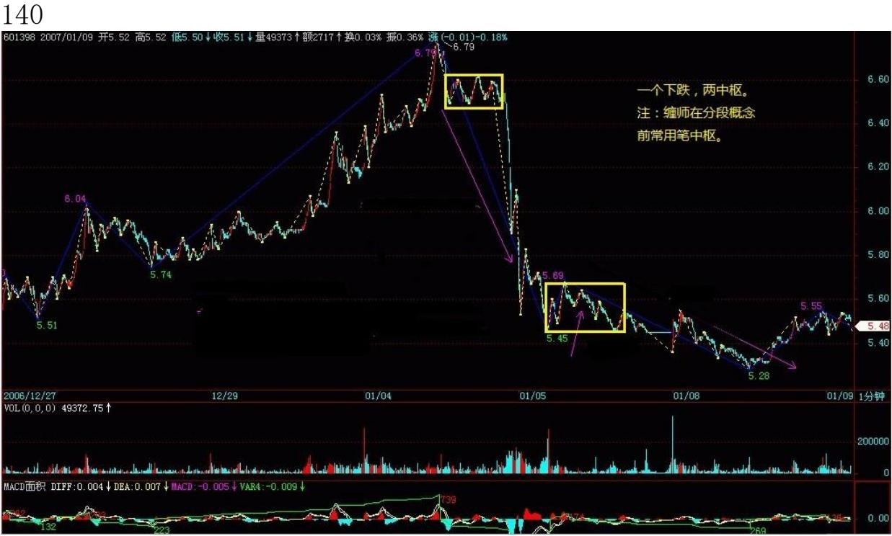

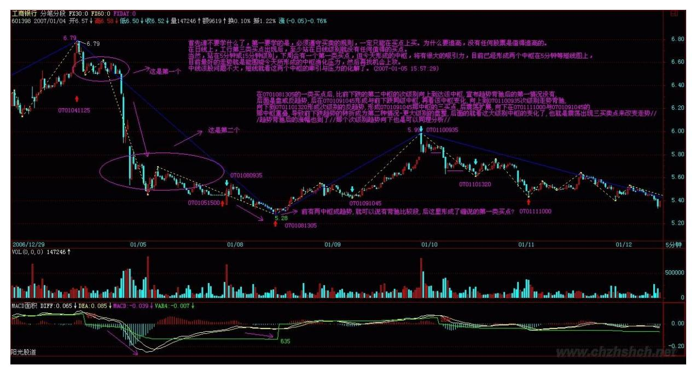

#### 142

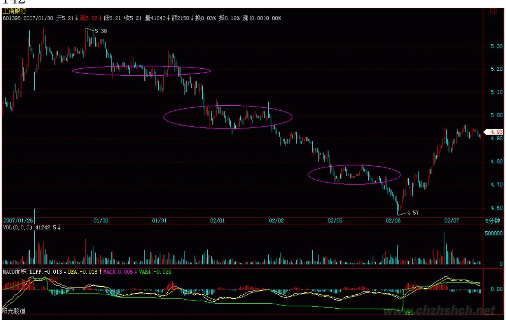

143 144 9. 网友 [匿名] 下下: 缠主,管子今天是怎么回事啊?其 它钢铁股都翻红了,他为什么选择今天调整啊?现在也没反弹啊? 2007-02-06 15:47:00缠师:下跌得少,反弹自然少。大家注意了:如 果抢反弹,一般有两类是肯定没问题的,一就是指标股,不拉指标 股,人气起不来,所以是必须拉的。二是跌得很多后背驰的,一个小

反弹,就有 10%几以上的空间。大家一定要注意那些在第一段中不跌 的,除非其创新高并很有力度,否则一旦大盘反弹结束,就有补跌的 可能。这是必须注意的。

#### \*\*\*\*\*\*\*\*\*\*\*\*\*\*\*\*\*\*\*\*。

10. 网友 [匿名] 我: 缠主,今天 10:30 分 600016 五分钟图是背 驰吧了?我小进了些,长得很好。为什么这个五分钟背驰能拉升这么 多? 2007-02-06 15:46:44缠师:因为前面跌得多,而且是趋势,所 以一旦结束,发生背驰,就很有力度。并不是每次都有这种力度的。 关键是板块对了,位置对了,而且是前期强势股,所以力度就大了。 会买一定要会卖,这才是完美操作。

#### \*\*\*\*\*\*\*\*\*\*\*\*\*\*\*\*\*\*\*\*。

11. 网友 [匿名] 老无用: 今天按楼主的背驰理论,上午 9:55发现 600784 的 15 分钟背驰,小仓位介入,单笔资金的获利率非常令人满 意。请楼主点评我的判断对否?多谢! 2007-02-0616:02:39缠师:可 以,但会买一定要会卖。如果数量不大,可以在小级别的背驰中出 掉,回来再补,这样来回操作,技术才能练出来。

#### \*\*\*\*\*\*\*\*\*\*\*\*\*\*\*\*\*\*\*\*。

12. 网友 [匿名] 悠悠悠哉: 老大,我觉得你是不是该惭愧一下啊? 老大不做主力拉升,只愿吸血,就好比一个超级大的散户。别人在前 面冲锋陷阵,老大享受成果,一旦苗头不对,撒腿就跑。如果大资金 人人这样,市场永远没行情的。 2007-02-06 16:05:51145 缠师:市 场不是慈善机构。该涨的时候要凶,像现在的 777,该跌的时候一样 要凶,像这几天的 999,关键是你的技术。所以,本 ID 反复说过, 技术不好的,千万别跟 ID 的股票。当然,跟本ID 的股票,你的技术 肯定能练得不错。这些股票中线都肯定没问题,但短线的震荡,不正 是技术派用场的地方?

#### \*\*\*\*\*\*\*\*\*\*\*\*\*\*\*\*\*\*\*\*。

13. 网友 [匿名] 木香珠: 我的功课,希望得到禅主指点,别让我自 以为是的瞎琢磨,浪费时间和机会。600028 日线上,于 1 月 19日将 中继判断为转折,次日杀入,后将 1 月 24 日唇吻判断湿吻。

因为看图不太熟练,在反弹过程中,1 月 30 日产生唇吻时,没及时 出清股票。结果股价一泻而下,昨天果断出清。本来可盈利10%,结果 亏损 10%,惨痛。今天从 5 分钟图上看,于 1:55 分第二买点时底 位补进一点。 2007-02-06 16:02:27缠师:有卖点不卖就是最大的错 误。比有买点不买还要严重。另外,请多看中枢等后面的章节,有了 中枢后,前面的意义不大。

#### \*\*\*\*\*\*\*\*\*\*\*\*\*\*\*\*\*\*\*\*。

14. 网友 [匿名] 学生古代: 老师,学生我感觉场外很多资金,一直 在等什么?中国不会像数年前东南亚,但是太多狼一直盯着羊群! 2007-02-06 15:46:44缠师:为什么不能把自己变成狼,这和资金大小 无关。只要你能买点买、卖点卖,就是最凶猛的狼。

#### \*\*\*\*\*\*\*\*\*\*\*\*\*\*\*\*\*\*\*\*。

15. 网友 [匿名] 中间体: 请缠姐指出以下操作(及思路)的不对的 地方。000407,我很看好。日 K 线在第 6 段中枢的上升阶段,今天 收盘前,1 分钟线上, 红柱开始缩短, 5 分钟即将开始背驰。 抛出 了 1/3 仓位。但我还是很担心明天会立马涨上去。按缠姐的理论, 这又不可能,。请答复。 2007-02-06 16:00:31缠师:那是一个比 1 分钟级别还低的背驰,其实可以等 1 分钟走坏再说。出了就算了,千 万别追高买回来,钱放着不会发霉的。等下一个机会,下一146 个有 把握的机会。

#### \*\*\*\*\*\*\*\*\*\*\*\*\*\*\*\*\*\*\*。

16. 网友 [匿名] 大河: 昨天看了 LZ 对火箭股份的回复,我以为它 是形成了周线上的第三类买点了。本知道今天上午大盘会跌,还是在 开盘时候以18.35 元买入了。结果跌了 5 个点。我是不是又错了?在 低位 17.17 元的时候,我又不敢再补回来。因为它没有背驰。想问一 下,我错在哪里呀? 该股从 2 月 1 日 9:35 分到现在是不是还在一 个盘整中?因为我看它尾巿五分钟上对应的红柱子减少了,是不是可 以说它明天又要跌了?请问缠妹妹,我是不是买在卖点上了 2007-02- 06 16:17:03缠师:学了本 ID 的理论,还像一般人那样抢开盘,就是 太无聊了。要学会耐心等待买点。今天早上那价位是买点吗?后来砸 下来反而出现一个短线买点。当时大盘也见到 5 分钟的精确买点。那 时候才该进去,然后对冲出来或不出来,等 1 分钟卖点,都可以。这

样才能把成本降低,否则学本 ID 理论干什么?随便听一个说说就算 了。要把这些追高或不在买点买、卖点卖的坏毛病改了,否则很难进 步的。还有,顺便说说,今天如果说追高买 000938,都是有问题的, 等买点,股票又不是什么,一定要马上拥有的,有买点再说。没买 点,什么股票都是垃圾。

#### \*\*\*\*\*\*\*\*\*\*\*\*\*\*\*\*\*\*\*\*。

17. 网友 [匿名] 老无用: 今天按楼主的背驰理论,上午 9:55发现 600784 的 15 分钟背驰,小仓位介入,单笔资金的获利率非常令人满 意,请楼主点评我的判断对否?多谢! 2007-02-0616:26:10缠师:可 以。但是,你不能光看一个级别的图,必须把次级别的图也看,才能 发现精确买点。昨天说了,昨天那只是进入背弛段,而精确买点要看 次级别的图。请把上一次的课程再研究一下。大级别的道理,小级别 也一样的。

#### \*\*\*\*\*\*\*\*\*\*\*\*\*\*\*\*\*\*\*\*。

18. 网友 [匿名] 小鸟: 妹妹帮我看看 600331 在 5 分钟和 15分钟 图上,是不是应该还有一跌,跌破 17.6 元形成 15 分钟背驰,现在 还是在盘整147 缠师:这股票的 5 分钟背弛比大盘早,5 日就有了。 不要预测是否还有一波,卖点没出来就预测下一个买点,都是一种坏 毛病。

目前 5 分钟的盘整能否突破,就看今后两天了。这种背驰后走成盘整 的,关键是看能否突破上去回来形成小级别的第三类买点,如果

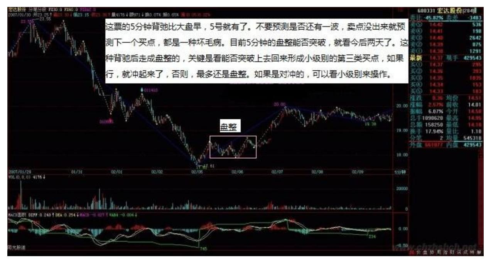

行,就冲起来了,否则,最多还是盘整。如果是对冲的,可以看小级 别来操作。

148 149 19. 网友 [匿名] 后知后觉: 我是新生一个,对禅主的理论 了解的浅显,但是对禅主所开课程的个别章节的讲座、图形还能熟记 与心,眼前浮现。在自己关注的股票池中,发现 600495(晋西车轴) 的日线蓝柱子不再伸长,就看了 60 分钟 K 线,同样蓝色柱子也在缩 短。看 30 分钟 K 线,蓝色柱子已经回 0 轴,15 分钟方向奔 0 轴。再看 5 分钟 K 线,黄白线已经上穿 0 轴,并进行了两次回拉, 眼前浮现禅主讲的一幕,应该三次回拉,遂耐心等待,果然三次回拉 后,蓝色小柱逐渐缩短,此时感觉是禅主说的买点了。

综合大盘,各股都在翻红,就 21.7 元坚决杀入。买入后还上下小幅 波动几下,几分钱级别的。收盘获利 3%。此举纯属幸运,还是不明 白其中的道里。请禅主或各位同学根据 K 线,结合禅主的理论,做个 此股的实例分析,这样有助于我的提高。劳烦禅主给予此股今后的操 作指导了,谢谢了。2007-02-06 16:35:13缠师:你确实有点碰巧,买 的位置是买点与卖点之间的位置,并没有买在真正的买点上。真正的 买点只有三种、第一、二、三类。不过这问题不大,找准卖点就可以 了。例如看 1 分钟背驰找一个超短线的卖点。如果走势很强,可以找 级别大一点的,反复操作,才有效果的。注意,短线不是意味着不看 大级别。既然大级别在一个明显的中枢里,当然应该多点短线把成本 降下来。

#### \*\*\*\*\*\*\*\*\*\*\*\*\*\*\*\*\*\*\*\*。

20. 网友 [匿名] 听缠说禅: 建议楼主每天出一个作业,第二天出正 确答案。好帮助大家对照自己的分析是否错误,错误在哪里,这样你 的学生会整体提高快一点。2007-02-06 16:32:17缠师:可以。今天就 用 5 分钟与 1 分钟的配套分析,把这次 5 分钟的背驰分析清楚。这 个问题,在实战中,很多这里的人都当下找出来了,但事后分析一 下,复一下盘,还是有意义的。

#### \*\*\*\*\*\*\*\*\*\*\*\*\*\*\*\*\*\*\*\*。

21. 网友 [匿名] 清: 能帮我看看 600682S(宁新百)的走势吗。。 大概一分钟和五分钟都发生背驰了。但走势很弱。是盘整背驰还是背 驰呢?还有一个问题。大概 14:50 分时,发觉不少股票都滞涨,那 个一分钟图上,如何判断是否出现背驰而卖出呢?谢谢! 2007-02-06 16:41:00缠师:这股票,最大问题就是下来没形成两个中枢,所以没 跌透。

所以大盘反弹,背驰后就形成盘整走势。一般这样,最坏的情况,就 是盘整后再跌一波,形成 30 分钟以上的背驰,才见到比较有力度的 底部。当然,如果大盘走势特别强,这背驰演化的的盘整也有往上突 破的机会,并不必然向下。

150 毕竟盘整后上升、下降都是正常的。至于说今天有些股票没力, 这是正常的,今天都有力了,那明天不就没股票反弹?而且反弹中, 最有力度的肯定是指标股以及近期相应的板块,例如银行,这很自 然,资金在里面。注意,背驰后不必然出现 V 型反转,也可以形成盘 整后再选择方向。所以为什么抢反弹都是必须跌透的,也就是至少两 个以上中枢的原因。

#### \*\*\*\*\*\*\*\*\*\*\*\*\*\*\*\*\*\*\*\*。

22. 网友 [匿名] 酿酒制药: 缠姐好!那个药咋还不出消息呢?不是 一月底出结果吗?三九太不讲信用了。2007-02-06 21:09:59缠师:这 就构成了这个阻击的一个外在环境,否则阻击还真不好弄。毕竟目前 各基金的持仓总数已经超过 50%,如果没有大盘的配合,以及消息迟 迟不出,向下阻击也不会轻易展开。所以,单纯技术还是不够的,必 须多方面综合。当然,如果是单纯的短差,就是另外一回事情了。为

什么?因为在短差的时间内,其他因数基本都可以假设是恒定的,因 此只考虑技术因数就可以了。

#### \*\*\*\*\*\*\*\*\*\*\*\*\*\*\*\*\*\*\*\*。

23. 网友 [匿名] 淡定: 楼主,还有一问题请教,象 600050 这样的 股票,如果根据短线指标来做,很多时间来回差价交手续费还差不 多,那如果站在中线的角度该如何降低成本呢?盼答。多谢了!2007- 02-06 21:17:04缠师:没人让你整天按 1 分钟的指标做,5 分钟的肯 定比手续费多多了。而且,这还有综合看,如果是在 30 分钟跌势的 背驰段,那一分钟的背驰可能就构成那精确的底部,这时候就不能够 因为是 1分钟的而忽视了。

#### \*\*\*\*\*\*\*\*\*\*\*\*\*\*\*\*\*\*\*\*\*。

24. 网友 [匿名] 努力学 2: 继续我的笨问题:【缠中说禅走势分解 定理一:任何级别的任何走势,都可以分解成同级别"盘整" 、"下 跌"与"上涨" 三种走势类型的连接。(原文)回帖:问:而这也回 答了上一章中的作业:"连接两相邻同级别缠中说禅走势中枢的一定 是趋势吗?一定是次级别的趋势吗? 答:首先,这不必然是趋势。任 何走势类型都可能,最极端的就是跳空缺口后形成新的"缠中说禅走 势中枢" ;其次,也不一定是次级别的,只要是次级别以下,例如跳 空缺口,就属于最低级别,如果图上是日线、周线,就不会是次级别 了。】(博主原文和回帖)我的问题:我理解的走势分151 解是不交 叉但首尾相接(看了博主举的例子也是这个意思)。

闭区间[X1,Xn]=[X1,X2]+[X2,X3]+...+[Xn-1,Xn]。我的困惑在于:中 枢相连部分为什么不一定是次级别的?按定义,中枢由三段次级别完 成的走势重叠部分构成,那么在次级别走势图上,两个三段走势之间 也必然是 0 个或多个完成的走势,否则和前面的定理冲突。

假如两个三段走势之间没有另外走势,那么它们首尾相连,也就是说 跳空前的那根 K 线既属于前面中枢的最后一段走势,也属于后面中枢 的第一段走势。我的理解哪里出偏差了? 2007-02-0621:42:09缠师: 你好好看看都市股份的 1 分钟图,就知道为什么了。连续的涨停只构 成 1 分钟中枢的上移,而缺口是比 1 分钟还低的级别。

其间连 5 分钟的中枢都不能形成。

网友 [匿名] 努力学 2:那么,除去缺口这种情况,是否中间的连接 段一定是次级别走势?还是我对分解的理解有误?缠师:也不一定, 但肯定是次级别以下的。

网友 [匿名] 努力学 2:实在不好意思。还没明白。还麻烦老师详 解:中枢由三段次级别完成的走势重叠部分构成,那在次级别走势图 上,两个三段走势之间也必然是完成的走势段(跳空除外),否则和 分解定理冲突。(缠中说禅走势分解定理一:任何级别的任何走势, 都可以分解成同级别"盘整"、"下跌"与"上涨"三种走势类型的 连接。)是不是我理解的分解不对(不交叉但首尾相接)?[X1,Xn]= [X1,X2]+[X2,X3]+...+[Xn-1,Xn]缠师:跳空的级别是无限低的,不构 成任何中枢中的一段。这和分解定理没有什么矛盾的。上涨、下跌都 是完成了的走势类型,是比中枢以及连接中枢的要大的概念,不要搞 混了。走势类型的级别只与其中包含的中枢有关。例如,包含一个日 线中枢的走势类型,那一定是日线级别的盘整,包含两个以上日线中 枢的,那一定是日线级别的趋势。这和连接中枢的走势级别无关。

#### \*\*\*\*\*\*\*\*\*\*\*\*\*\*\*\*\*\*\*\*。

25. 网友 [匿名] 荷塘月色: 缠姐看看 600151,感觉 5 分钟不像背 驰,两段趋势的面积好像一样大啊,但 30 分钟像在走中枢,估计又 好像要跌一下,明天要不要先走,待跌后再接回?? 2007-02-06 22:30:40缠师:5 分钟没背驰,是 1 日的 1 分钟背驰造成本次上涨 的。并不是说 5 分钟的上涨就一定是 5 分钟的背驰造成的。1 分钟 的背驰,通过中枢的扩展152 等最终形成比 5 分钟大、甚至是日线的 上涨,都是可能的,600151 这次的回升就是这样构成了。有关这种情 况,以后会详细论述的。

#### \*\*\*\*\*\*\*\*\*\*\*\*\*\*\*\*\*\*\*\*。

26. 网友 [匿名] 不在潜水: 楼主,有一问题请教。前提:上升过程 形成的日线中枢。问题:有没有可能在形成日线中枢的 30 分钟走势 的第三段,没有形成 5 分钟背驰,而由一个一分钟背驰形成向上,或 先形成盘整,再突破盘整向上的走势而结束 30 分钟的第三段向下的 走势? 或者还是必定要出现 5 分钟背驰才能结束这第三段走势?谢 谢! 2007-02-06 22:35:21缠师:完全可能。5 分钟的背驰至少制造 一个 5 分钟的走势类型,但还可以制造更大级别的,但这都要通过中

枢的扩展完成。因此,一个 1 分钟的背驰,当然也可以构成大顶或大 底。

其实这个问题已经说过,想想工行、北辰的例子,都是 1 分钟顶背驰 造成大顶的绝好例子。为什么?就是后面发生了中枢的逐步扩展。 例 如,今天大盘 5 分钟的背驰制造出一个 5 分钟的三段走势来,也就 是说,这个反弹就此结束,在理论上也是成立的。因为已经达到 5 分 钟背驰所能制造的最低级别走势要求。那么,其后反弹的继续依靠什 么?就不是背驰的力量了,要靠中枢的延伸与扩展等手段。

背驰是制造底部,制造第一类买点的,而中枢扩展、延伸是制造第 二、三类买点的。有关这些问题,比较复杂,以后的课程还多着了。 太晚先下了,再见。

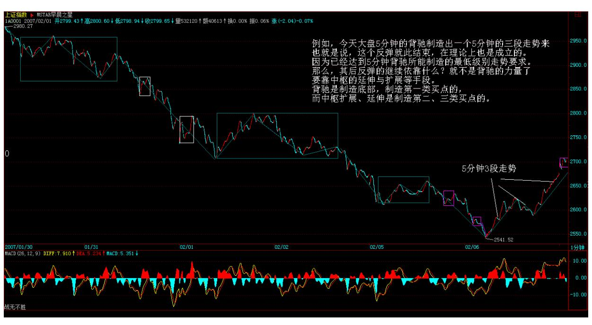

153

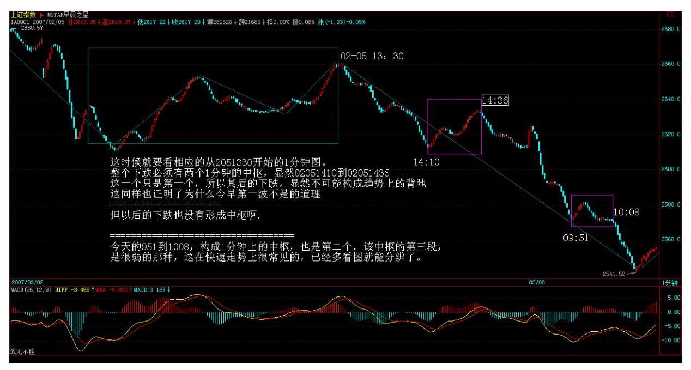

154 155 27. 网友【匿名】:问题 1:这里的高低点有量化的概念 吗?我就老在学习中把"不明显"的看成"明显"的,从而发生误 判。

记得前面也有同学问什么程度算高低点,不过后面没有答案,所以我 也没搞明白。

缠师:没有量化,比如连续涨停板,中间没有 5 分钟级别的低点高 点,关键是识别中枢。多看图,经验到了,看着就很"明显"了。

网友【匿名】:问题 2:是否任一级别完成的走势,在该级别 K 线图 上是否都需明显看出两个高低点,而不仅限日线级别?另外,盘整类 型走势是否也需要看出两个明显的高低点,还是一个就可以(因为只 有一个中枢,一对高低点附近对应一个中枢位置)?缠师:中枢真正 搞清楚了,这个问题就没有了。

网友【匿名】:问题 3:高低点是否包括起始和结束点?比如一段下 跌,从高点一路下来,中间大幅回升一次,又继续跌至一个低点然后 回升,这样算上起始结束共两个高低点?缠师:中枢真正搞清楚了, 这个问题也没有了。

网友【匿名】:问题 4:完成的走势类型为什么在此级别图上很明 显,因为前面所说的高低点原因吗?缠师:完成的走势类型,构其中 枢的三段连续走势,其高低点通常要破 10 均线,且 5、10 通常会湿 吻,当然很明显。

#### \*\*\*\*\*\*\*\*\*\*\*\*\*\*\*\*\*\*\*\*。

28. 网友 [匿名] 拜读者: 缠 MM,首先感谢你的理论。 我是新手, 有幸能在学股票的初期遇到你。你说的小学毕业的标准我已经知道 了,正在努力。但初中、高中、大学的标准呢?至少要让我有个目标 啊。谢谢回复。 2007-02-07 21:20:09缠师:现在还说不了,因为有 些概念还没说到。在本 ID 这里小学毕业,对比外面的人已经很厉害 了。不过可以告诉你,例如,到了硕士,可以开些专门的班,例如怎 么坐庄,还有如何阻击庄家等等。

156 29. 网友 [匿名] 诚诚: 亲爱的 LZ,强烈谴责那些胆小的庄家 和软骨头的汉奸!我们都支持你对他们予以痛击!再想请教一个问题: 30 分钟背弛下来的下跌,反弹后的卖点要在同一级别还是下一级别 找?谢谢! 2007-02-07 21:24:46缠师:你的问题表达不大清楚。一 般,按本 ID 的术语,30 分钟背驰就制造了一个至少 30 分钟级别的 第一类卖点,如果这 30 分钟级别的卖点刚好在日线的背驰段,那就 同时也是日线的第一类卖点。

背驰出现后,首先会有一个 5 分钟级别的向下走势完成,然后有一个 反抽,一个 5 分钟级别的向上走势。注意,这些走势都不一定是趋 势,盘整也可以的。第二个 5 分钟的背驰就构成了第二类卖点。

第三类卖点,一般是没有马上形成下跌形成一个盘整,最后盘不住 了,跌破中枢,次级别反抽不上中枢后形成的。

因此,对卖货来说,最好还是在上涨中抓住背驰,这样的技巧要求当 然很高,但其效益与回报也是最高的。要达到这,必须进行艰苦的学 习与实践,没有捷径。

#### \*\*\*\*\*\*\*\*\*\*\*\*\*\*\*\*\*\*\*\*。

30. 网友 [匿名] 白玉兰: 有点象白色恐怖。不要怕,星星之火可以 燎原的。禅妹妹,我们一直会支持你的。我是在上海的东北人。

有用得着的说一声。2007-02-07 21:38:29缠师:谢谢!估计是一个恐 吓。这也太小儿科了。这群人还真不知道本 ID 的厉害。说实在,现

在的庄家、基金经理,基本都是本 ID的后辈,他们年龄可能比本 ID 大,但资历就差远了,这些事就不说了。对不起,本 ID 要下了。

现实中,本 ID 当然可以找人警告一下某些人,不过这样就会让本ID 抛头露脸,所以暂时没必要了。希望这些人看到声明,收敛一下,别 把脸撕破了,把虚拟空间现实化,那就不好玩了。那些在阴暗角落的 人,看着办吧。下了,再见。

有人将本 ID 所搞的详细列了出来,这样也好,本 ID 的怎么样,阻 击点都是根据本 ID 的理论来的,回头一看,有目共睹。

157 31. 网友[匿名] 罗锅: 数学妹妹的前 5 只股票,12 月中旬说 的:000999、000777、000600、000778、600777。元旦后说的三只: 000915、000416、000099。1 月下旬说的:600343、000998、 600649、600578、600432。前两天的:000938 2007-02-0810:43:16缠 师:注意,这些股票基本都说了很长时间了,有些都快 1 个半月了, 所以离本 ID 的买点都很远,因此不建议任何人再参与了,学会了本 ID 的理论,有什么股票找不出买点的?那才是最关键的。

不过,本 ID 搞的股票,最终都翻倍,那是问题不大的,否则本 ID搞 他们干什么?有些肯定还不只一倍,这也是肯定的。当然,这都是从 本 ID 的买点算起的,没买的,千万别追高了。自己找去。

本 ID 在用翻倍变负成本法慢慢套回资金后,不再阻击小家伙了,准 备阻击一个大家伙,可以公开说,中国联通。现在本 ID 还没怎么进 场,有很少的一点底仓,是今天出 777 换进去的。注意,本ID 这是 打打仗,而且联通不和别的,本 ID 可暂时控制不住走势,大家千万 别跟着买。

#### \*\*\*\*\*\*\*\*\*\*\*\*\*\*\*\*\*\*\*\*。

32. 网友 [匿名] 小明: 今天的 777 可是好玩了。有个问题不太明 白,该股应该属于江苏的,怎么总是说是浙江人。该公司的大门我还 经过好几次。

呵呵。老大,5 个手指夹一物今天走的也不错啊。我买了点。 不知道 后面会不会来个斩立决啊? 2007-02-08 15:17:39缠师:名字当然是 有理由的,道理就别问了,反正大家知道是谁就可以。

#### \*\*\*\*\*\*\*\*\*\*\*\*\*\*\*\*\*\*\*\*。

33. 网友 [匿名] 呼呼: 我弱弱的问个问题:是不是不管大盘,还是 个股,所有的缺口,都在回补一下? 2007-02-08 15:18:40缠师:这 问题以前已经回答过,不一定,就像 325 点上海的大缺口,94 年 的,现在还没补。

#### \*\*\*\*\*\*\*\*\*\*\*\*\*\*\*\*\*\*\*\*。

158 34. 网友 [匿名] 中间体: 今天缠姐出了 50 万股 777, 看来 还有 50 万股在里面。2007-02-08 15:29:51缠师:谁告诉你本 ID 只 出了 50 万股的?别瞎猜这些无关的问题。关键是自己学好。

#### \*\*\*\*\*\*\*\*\*\*\*\*\*\*\*\*\*\*\*\*。

35. 网友 [匿名] 满目山河: 缠妹妹,请教一个问题:昨天600160 五分钟背驰,今天怎么又强势上涨了?给分析一下,该股有搞头(力 度)吗?缠师:背驰走了一定要找机会补回来,没人说背驰了以后一 定下跌50%的,特别是大级别上涨里的小级别背驰,很多情况下就一个 盘中回档就完成了 。要综合地看。

#### \*\*\*\*\*\*\*\*\*\*\*\*\*\*\*\*\*\*\*\*。

36. 网友 [匿名] 小牛: 请问说禅妹妹,比如日线级别的背弛一定会 有次级别甚至次次级别的背弛吗?我在昨天把 000919 在上午卖了,我 觉得是一个60 分钟的背弛。后来下午涨上去了,我是不是把盘整背弛 看成卖点了?2007-02-08 15:45:53缠师:昨天上午创新高了?60 分 钟图上好象昨天下午最后一小时才创新高的。对 60 分钟图的精确把 握,要在进入背驰段后,关注 15分钟、5 分钟甚至 1 分钟的走势, 这样才可能把握住精确的位置。

还要好好学习。

#### \*\*\*\*\*\*\*\*\*\*\*\*\*\*\*\*\*\*\*\*。

37. 网友 [匿名] 铁弹子: 缠 MM,昨天请教了中枢的问题,未见答 复。有同学给俺判了分,将俺打回重读幼儿园小班了,郁闷啊!就说 今天的 5 分钟 K 线,振荡逐步收紧,我的理解该中枢应该是:MAX 的低点和 MIN 高点,那么就形成很窄的一条中枢,这样理解对吗?俺 可是认真看了大作的啊。 2007-02-08 15:37:00缠师:不一定很窄 的,MAX 的低点和 MIN 高点是对的,一般看前面三段。后面的不是围 绕震荡产生的延伸,就是扩展。要分别对待。

一般来说,中枢159 中比较复杂的就是三角形或矩形了,这以后会说 到。

#### \*\*\*\*\*\*\*\*\*\*\*\*\*\*\*\*\*\*\*\*。

38. 网友 [匿名] 外科医生: 老大,好郁闷啊。为何大涨的时候我总 是空仓啊? 2007-02-08 16:01:22缠师:为什么前两天背驰的时候不 买?关键是对走势的理解还不深,"学如不及,犹恐失之" 。

#### \*\*\*\*\*\*\*\*\*\*\*\*\*\*\*\*\*\*\*\*。

39. 网友 [匿名] 中间体: 问缠姐一个很要紧的问题。第二类买点是 不是看中枢的第三段?而第三类买点看中枢的第一段。对吗?2007- 02-08缠师:不完全对。次级别上涨后,第一次次级别回调构成的第二 类买点,其后肯定有利润。但经常会演化成大级别的盘整。特别在一 些超级底部里。所以那时候就要看这中枢的演化情况,根据中枢次级 别的走势来决定大型中枢的第二类买点。而第三类买点和第二类买点 在判断上,唯一不同的就是,第三类买点的中枢级别比下面突破那中 枢要小。关键这些具体的区别,以后都会详细说到的。路还长着了。

网友 [匿名] 中间体:谢谢!是不是可以肯定,第三类买点的中枢级 别比下面突破那中枢要要大的话,就不是第三类买点了?缠师:那当 然。这就演化成中枢的扩展或走势延伸中的新中枢等情况了。

#### \*\*\*\*\*\*\*\*\*\*\*\*\*\*\*\*\*\*\*\*。

40. 网友 [匿名] 巴索林: LZ,你前天不是说,以后每天给我们布置 一道作业吗?我们等你下一道作业很久了。 2007-02-0816:26:37缠 师:好的。但这功课今天不能公布答案,因为明天要说这个问题。

160

缠师:大家注意了,今天的功课来了。一个 5 分钟的下跌背驰后,其 后的回升至少能到什么位置。给出相应回升位置的一个分类,相应确 定回升的力度。

\*\*\*\*\*\*\*\*\*\*\*\*\*\*\*\*\*\*\*\*41. 网友 [匿名] 清: 其实,问这个问题的主 要原因是,往往在小级别里做短差,因为调整幅度如果不大,又快速 拉升,往往错过买入机会,或出现帮证券所打工的结果。所以,想搞 清楚小级别如何判断背驰,即使在回抽 0 轴后,出现了新高,而 MACD 图上面积却同前比较减少,但立于当下,如何判别会否在下探后 再次拉升,而使后面的面积增大而大于前面(回抽 0 轴前的面积)。 谢谢。希望解疑! 2007-02-08 16:24:03缠师:这个问题,其实多次 回答了。小级别的背驰要发挥大作用,第一种是在大级别走势的背驰 段里。否则,小级别的背驰不会引发大级别的反转。当然也不会产生 太大的影响。第二种情况,在急促的走势里,小级别的背驰往往反转 的幅度特别大,这也是特别值得关注的。例如工行元旦后的见顶,北 辰、酒类股等,都是这种情况。
