# 教你炒股票 29:转折的力度与级别

(2007-02-09 15:08:08)在某级别的盘整中,或者说围绕某级别中枢的 震荡、延续中,不存在转折的问题,除非站在次级别图形中,才有转 折问题的探讨。对于上涨的转折,有两种情况:下跌与盘整;对于下 跌的转折,也有两种情况:上涨与盘整。转折是有级别的,关于转折 与背驰的关系,有如下定理:缠中说禅背驰-转折定理:某级别趋势的 背驰将导致该趋势最后一个中枢的级别扩展、该级别更大级别的盘整 或该级别以上级别的反趋势。

该定理的证明有点抽象,估计大多数的人都没兴趣,那就用一个例子 来说明,也大致知道证明的轮廓,更重要的是,这样,各位对走势的 形成有一个更深切的认识。例如,一个 5 分钟背驰段的下跌,最终通 过 1 分钟以及 1 分钟以下级别的精确定位,最终可以找到背驰的精 确点,其后就发生反弹。注意,反弹只是一般的术语,在本 ID 的理 论中,对这反弹会有一个很明确的界定,就是包括三种情况:一、该 趋势最后一个中枢的级别扩展。二、该级别更大级别的盘整。三该级 别以上级别的反趋势。

一、该趋势最后一个中枢的级别扩展。

对于 5 分钟级别趋势发生背驰的情况,那这个 5 分钟级别的趋势里 所具有的中枢都是 5 分钟级别的,假设共有 N 个,显然,这个 N>=2。考虑最后一个中枢的情况,最后的背驰段,跌破该中枢后,该 背驰段显然是一个 1 分钟以下级别的走势,否则就和该中枢是 5分钟 级别趋势的最后一个中枢的前提矛盾了。该背驰段出现第一类买点发 生反弹,显然,该反弹一定触及最后一个中枢的DD=min(dn),也就是 围绕该中枢震荡的最低点,否则,如果反弹连这都触及不了,就等于 在下面又至少形成一个新的 5 分钟中枢,这与上中枢是最后一个矛 盾。这种只触及最后一个中枢的 DD=min(dn) 的反弹,就是背弛后最 弱的反弹,这种反弹,将把最后一个中枢变成一个级别上的扩展,例 如,把 5 分钟的中枢扩展成 30 分钟甚至更大的中枢。

前面说过,第一类买点是绝对安全的,即使是这样一种最低级别的反 弹,也有足够的空间让买入获利,而且,一般这种情况出现得特别 少,很特殊的情况,但理论上,是要完全精确的,不能放过任何一种 情况,如果不幸碰到这种情况,在资金利用率的要求下,当然是要找 机会马上退出,否则就会浪费时间了。

162 注意,这种情况和盘整背驰中转化成第三类卖点的情况不同,那 种情况下,反弹的级别一定比最后一个中枢低,而这种情况,反弹的 级别一定等于或大于最后一个中枢的。因此,这两种情况,不难区 分。

二、该级别更大级别的盘整。三、该级别以上级别的反趋势。

这二种情况就是发生转折的两种情况,原理是一样的,只是相应的力 度有区别。当反弹至少要重新触及最后一个中枢,这样,将发生转 折,也就是出现盘整与上涨两种情况,对于上面 5 分钟下跌的例子, 就意味着,将出现 5 分钟级别更大的盘整或 5 分钟级别以上的上 涨,两段走势类型的连接,就有两种情况出现:下跌+盘整,或者下跌 +上涨。注意,这里的盘整的中枢级别一定大于下跌中的中枢级别,否 则就和下跌的延伸或第一种该趋势最后一个中枢的级别扩展搞混了。 而上涨的中枢,不一定大于上跌中的中枢,例如,一个5 分钟级别的 下跌后反过来是一个 5 分钟级别的上涨,这是很正常的,但如果是盘 整,那就至少是 30 分钟级别的。

有人总是搞不明白为什么"下跌+盘整"中盘整的中枢级别一定大于下 跌中的中枢,这里不妨用一个例子说明一下:例如,还是一个 5分钟

的下跌,那至少有两个中枢,整个下跌,最一般的情况就是 a+A+b+B+c,其中的 a\b\c,其级别最多就是 1 分钟级别的,甚至最 极端的情况,可以就是一个缺口。而 A、B,由于是 5 分钟级别的中 枢,那至少由 3 段 1 分钟的走势类型构成,如果都按 1 分钟级别的 走势类型来计量,而且不妨假设 a\b\c 都是 1 分钟的走势类型,那 么 a+A+b+B+c 就有 9 个 1 分钟的走势类型。

而一个 30 分钟的盘整,至少有 3 个 5 分钟的走势类型,而 1 个5 分钟的走势类型,至少有 3 个 1 分钟的走势类型,也就是一个30 分 钟的盘整,就至少有 9 个 1 分钟的走势类型,这和上面a+A+b+B+c 的数量是一致的。从这数量平衡的角度,就知道为什么"下跌+盘整" 中盘整的级别一定比下跌的级别大了,如果级别一样,例如一个 5 分 钟的盘整,只有 3 个 1 分钟的走势类型,那和9 就差远了,也不匹 配。当然,"下跌+盘整"中盘整的级别一定比下跌的级别大,最主要 的原因还不是这个,而是上面说到的,如果该级别一样,那只有两种 情况,下跌延伸或下跌最后一个中枢扩展,和"下跌+盘整"是不搭界 的。

有人可能还有疑问,如果下跌最后一个中枢扩展,例如 5 分钟扩展成 30 分钟,那和 5 分钟级别下跌+30 分钟级别盘整有什么区别?这区 别大了,因为在"5 分钟级别下跌+30 分钟级别盘整",也就是"下 跌+盘整"中,下跌和盘整都是完成的走势类型,这意味着是两个走势 类型的连接。而下跌最后一个中枢扩展,是一个未完成的走势类型的 延续,还在一个走势类型里。例如,在上面的a+A+b+B+c 里,如果 B+c 发生中枢扩展,从 5 分钟扩展成 30分钟的,那么 a+A+b 就是一 个 5 分钟的走势类型,把 a+A+b 用 a~表示,而 B+c 发生中枢扩展 用 A~表示,那么整个走势就表示成 a~+A~,其后的走势163 还可以继 续演化,形成 a~+A~+b~+B~+c~,也就是扩展成一个30 分钟级别的下 跌,当然还可以有其他的演化,总之,是必须把走势类型给完成了, 这和"下跌+盘整"的情况显然是不同的。

本 ID 的理论是最市场走势最精确的分析,必须把所有情况以及其分 辨了然于胸,才可能对市场的走势有一个精确的把握。如果本 ID把这 套理论出版,书名就可以是《《市场哲学的数学原理》,因为本 ID 的理论的严密性以及对市场的意义,一点不比牛顿对物理的意义差, 这一点,是必须逐步明确认识的。而且,本 ID 这套理论,是建立在 纯数学的推理上的,完全没有发生爱因斯坦对牛顿颠覆等类似无聊事

情的可能。不了解这一点,是不可能真正理解本 ID理论的,因此就会 "学如不及,犹恐失之" 。

以上三种情况,就完全分类了某级别背驰后的级别与力度,也就是某 级别的第一类买点后将发生怎么样的情况,而第一类卖点的情况是一 样的,只是方向相反。注意,这里说的是最精确的情况,由于第一种 情况很少发生且和第二种情况有所类似,所以粗糙地说,也可以说背 驰以后就意味着盘整和反趋势。那么,怎么分别这几种情况,关键就 是看反弹中第 1 个前趋势最后一个中枢级别的次级别走势(例如前面 的下跌是 5 分钟级别,就看 1 分钟级别的第 1 次反弹),是否重新 回抽最后一个中枢里,如果不能,那第一种情况的可能就很大了,而 且也证明反弹的力度值得怀疑,当然这种判别不是绝对的,但有效性 很大。

例如,这次 20070206 的反弹,用 5 分钟背驰段,然后考察 1 分钟 以及 1 分钟以下级别的背驰进行精确定位,可以极为精确地把握这个 底部,而且在实践中,很多人按照本 ID 的理论都把握住了,

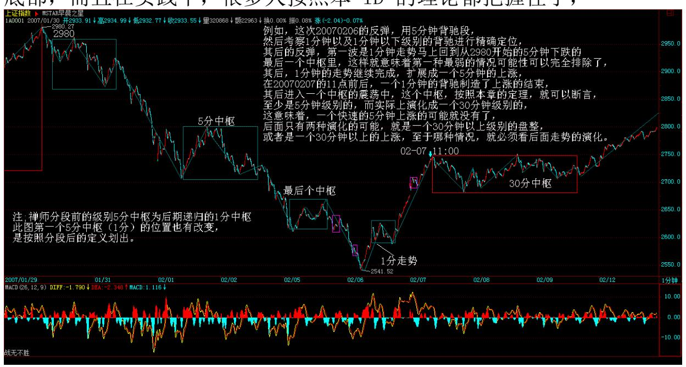

那么,其后的反弹,第一波是 1 分钟走势马上回到从 2980 开始的5 分钟下跌的最后一个中枢里,这样就意味着第一种最弱的情况可能性 可以完全排除了,其后,1 分钟的走势继续完成,扩展成一个5 分钟 的上涨,在 20070207 的 11 点前后,一个 1 分钟的背驰制造了上涨 的结束,其后进入一个中枢的震荡中,这个中枢,按照本章的定理, 就可以断言,至少是 5 分钟级别的,而实际上演化成一个 30分钟级

别的,这意味着,一个快速的 5 分钟上涨的可能就没有了,后面只有 两种演化的可能,就是一个 30 分钟以上级别的盘整,或者是一个 30 分钟以上的上涨,至于哪种情况,就必须看后面走势的演化。

164 165 而对于实际的操作,这两种情况并没有多大的区别,例如是 盘整还是上涨,关键看突破第一个中枢后是否形成第三类买点,而操 作中,是在第一、二类买点先买了,然后观察第三类买点是否出现, 出现就继续持有,否则就可以抛出,因此在操作上,不会造成任何困 难。当然,如果是资金量特别小,或者对本 ID 的理论达到小学毕业 水平,那么完全可以在突破的次级别走势背驰时先出掉,然后看回试 是否形成第三类买点,形成就回补,不形成就不回补,就这么简单。 当然,要达到这种境界,首先要对本 ID 的理论小学毕业,否则,你 根本分辨不清楚盘整背驰与第三类买点的转化关系,怎么可能操作? 而且,这种操作,必须反复看图、实际操作才可能精通、熟练的。当 然,如果真精通、熟练了,除了同样是本 ID小学已经毕业的人,几乎 没有人是你的对手了。

那么,实际操作中,怎么才能达到效率最高。一个可被理论保证的方 法就是:在第一次抄底时,最好就是买那些当下位置离最后一个中枢 的 DD=min(dn) 幅度最大的,所谓的超跌,应该以此为标准。

因为本章的定理保证了,反弹一定达到 DD=min(dn)之上,然后在反弹 的第 1 波次级别背驰后出掉,如果这个位置还不能达到最后一个中 枢,那么这个股票可以基本不考虑,当然,这可能有例外,但可能性 很小。然后在反弹的第一次次级别回试后买入那些反弹能达到最后一 个中枢的股票而且最好是突破该中枢的而且回试后能站稳的,根据走 势必完美,一定还有一个次级别的向上走势类型,如果这走势类型出 现盘整背驰,那就要出掉,如果不出现,那就要恭喜你了,你买到了 一个所谓 V 型反转的股票,其后的力度当然不会小。至于如何预先判 断V 型反转,这就不是本章定理可以解决的问题,必须在以后的课程 里才能解决。

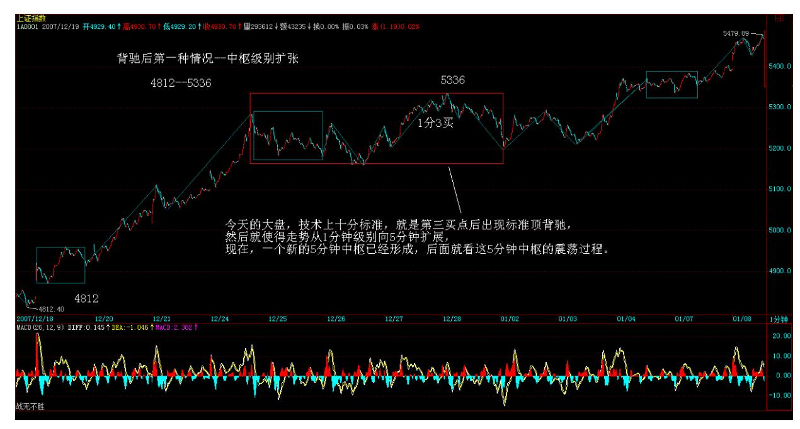

#### 

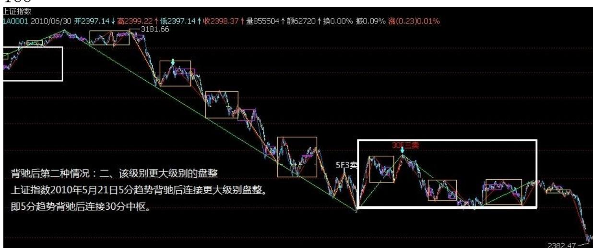

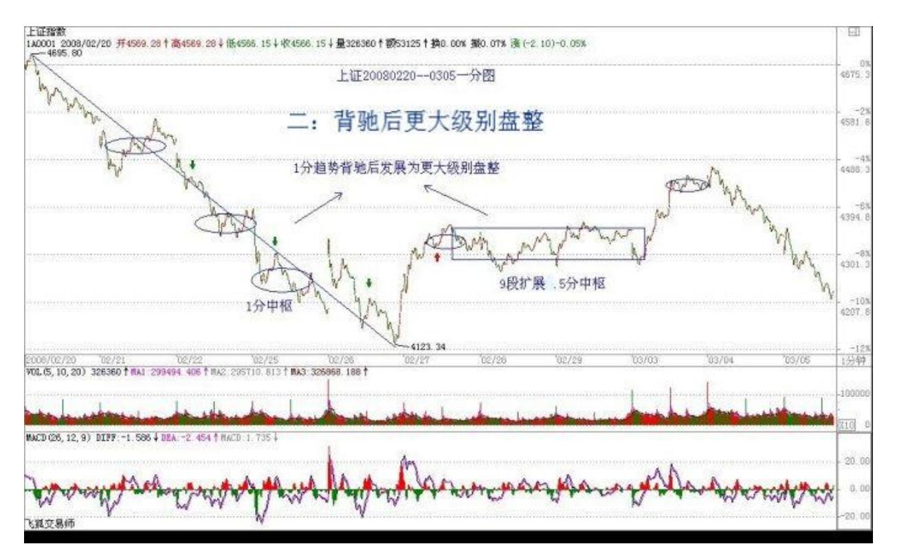

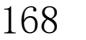

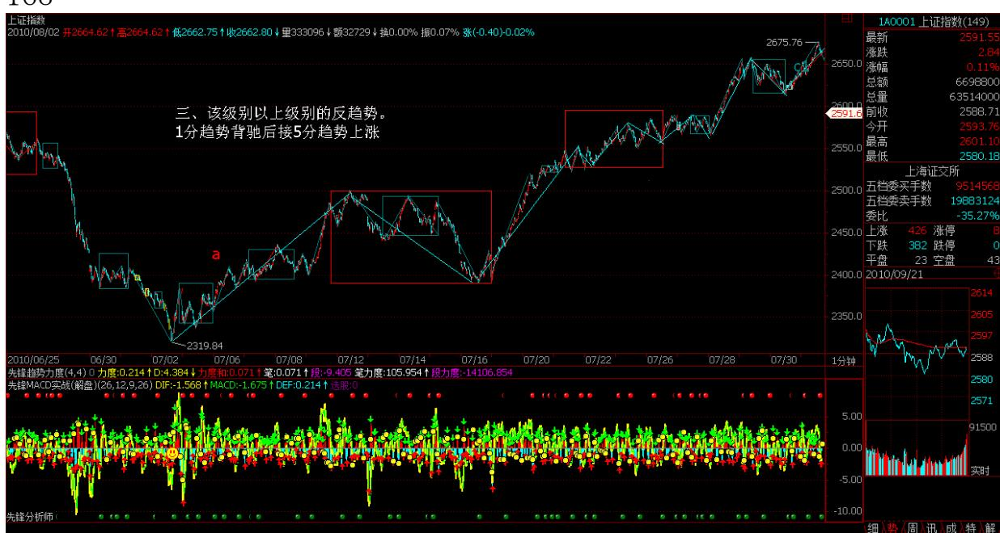

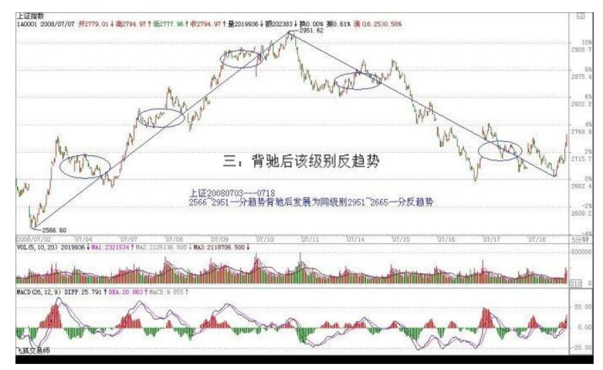

#### 

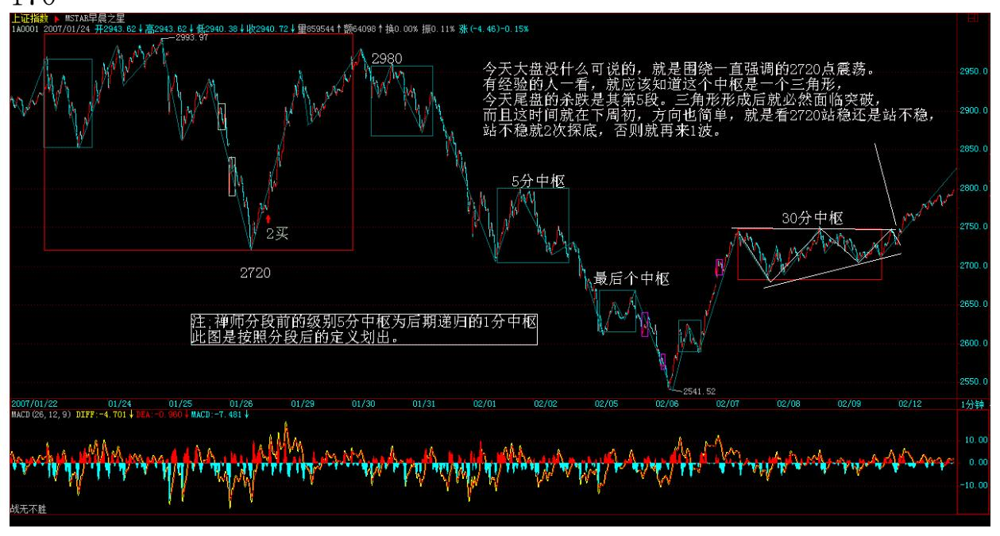

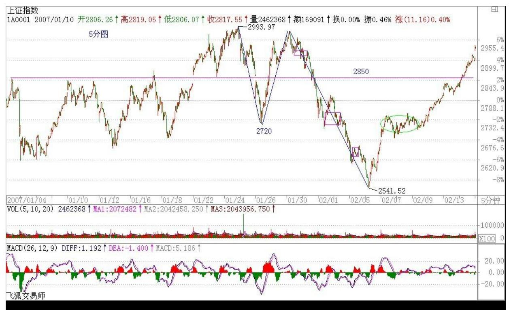

172 个股没什么说的,自己看图找吃,下周告诉大家,像 999、777这 种翻倍变负成本的,如何在坚持负成本下,筹码越来越多,这才是最 牛的吸血方法,让所有庄家、基金闻风丧胆。

\*\*\*\*\*\*\*\*\*\*\*\*\*\*\*\*\*\*\*\*。

解盘及互动问答:

#### \*\*\*\*\*\*\*\*\*\*\*\*\*\*\*\*\*\*\*\*。

缠师:大盘一点意外都没有,三角形后就是再一波。2850 上的压力已 经早提醒了,本 ID 也很想把联通赶鸭子一样赶上 5 元,把大盘也赶 上 3000 点让大家过个好年,但汉奸可不乐意,能否 3000 点过年, 还说不好。大家就看着吧,关键还是股票,其实 3000 点只是个心理 问题,不是大家的,是汉奸和管理层的。最不济,就再来回几次将那 些心理有毛病的治疗好,再上 3000,希望心理有毛病的人越少越好。 个股没什么说的,自己找吃吧,学那么多,不能白学。而本 ID 曾说 过的,除了一两只前期不跌都涨得太多需要洗盘的,其他都还可以, 就看图练习,本 ID 不能多说,又当运动员又当裁判还当解说,这也 太没意思了。2007-02-12 15:15:26173

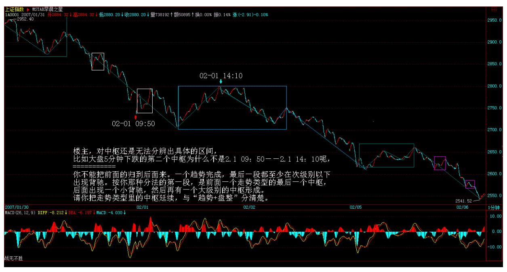

174 1. 网友【匿名】kk:楼主说看走势图,要从大看到小。看你的回 复,好像又说,要从小看到大,怎么理解?我的问题就是,有没有一 个直观的方法,可以在当下级别的图上,分辨出当下级别的中枢,而 不是从下一级别看。

缠师:不存在这个问题,你当时就可以判断的。前面有关于中枢延伸 的标准定义,中枢是否延伸、扩展,有标准的数学公式的,自己好好 找找,看当时的图就可以判断。看当下级别的背驰,当然可以不看其 他级别,但这背驰有多大效果,就要看其他级别的情况,这是两种不 同性质的问题,请搞清楚。

#### \*\*\*\*\*\*\*\*\*\*\*\*\*\*\*\*\*\*\*\*。

2. 网友 [匿名] mmhh: 大盘一分钟明显背驰,为何还上涨?能否请 缠 MM 解释解释。谢谢! 2007-02-12 15:35:31缠师:30 分钟在明显 的突破前期,1 分钟的背驰制造一个盘中的震荡就可以完成,就像今 天下午一样。已经反复强调,一定要从大级别往小级别看,用区间套 的方法。1 分钟级别的背驰发挥大威力,是因为在大级别的背驰段 里。如果大级别是第二买点开始的初升、甚至是主升段,看小级别的 背驰有多大意义?就算卖了,也要马上找位置买回来。否则都光看 1 分钟的背驰,那不乱套了?本 ID 的理论是在各级别之间系统、综合 应用的,不是光看一个级别的,一定要搞清楚。

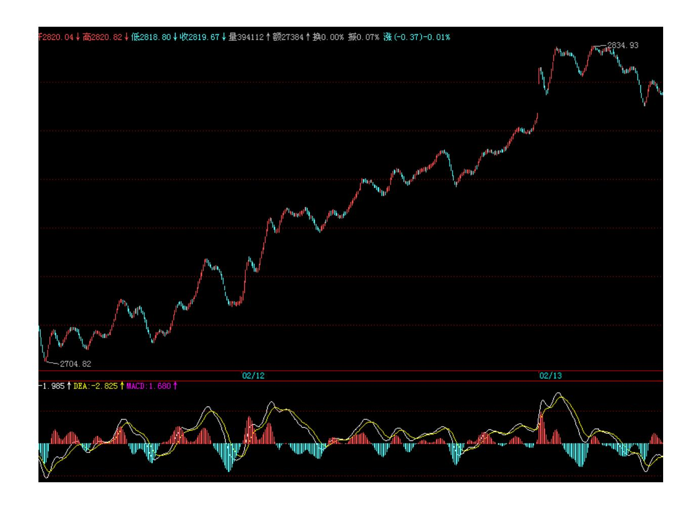

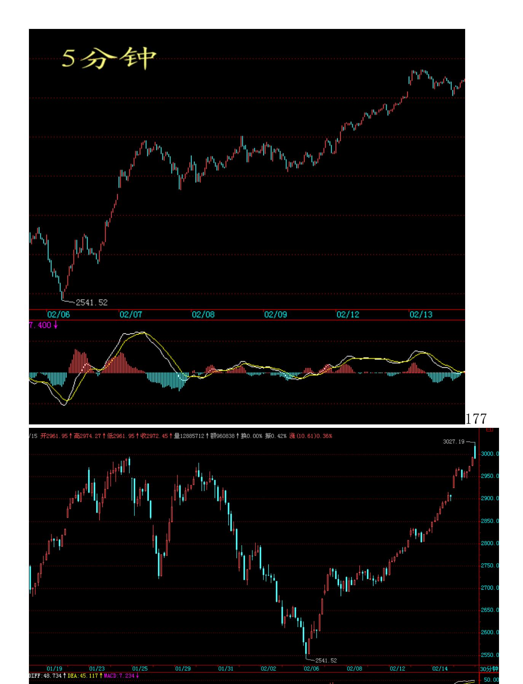

178 p> 3. 网友 [匿名] 小明: 缠 mm,现在大盘敏感时期是不是过 去了? 个股可以发动一波行情了吧?2007-02-12 15:19:03缠师: 二、三线股对大盘的敏感度不大。只要大盘不大跌,行情都会有的。 短期,大盘股会有一定的上探,但现在对 3000 的靠近,都有一个试 探实质,如果没有特别的事情,就过了。如果又有什么人出来蹦跳两 下,就会再洗,大盘就这样了。二、三线个股行情比较独立。

#### \*\*\*\*\*\*\*\*\*\*\*\*\*\*\*\*\*\*\*\*。

4. 网友 [匿名] 温柔的股客: 楼主,对中枢还是无法分辨出具体的 区间,比如大盘 5 分钟下跌的第二个中枢为什么不是 2/1 /09:50- 2/1 /14:10呢?有什么道理呀?我搞不太明白。我想你会说2/1/ 09:50-2/1/ 11:05 不是一个次级别的走势。那我想问一下,如何 在 5 分钟的图上可以比较方便的分辨出 5 分钟的中枢?或是在日线 图上可以分辨日线的中枢,而不是看 30 分钟或 60 分钟图。谢谢! 期盼楼主答复,困扰已久。2007-02-12 15:43:32网友【匿名】gg:这 方面我也很迷茫,希望楼主能回答。

网友【匿名】op:这方面,我也是比较糊涂。一般就是沿下跌趋势找 "上、下、上"中枢,主要是每段到底要几根 K 线。很糊涂,望缠妹 明示。

缠师:怎么又回到这么初级的问题了?中枢和多少根 K 线没什么关 系。除非是最低级别的。由于不能再用下一级别的定义,所以就可以 定义为三根相连 K 线的重叠部分。如果数学还行的,就知道中枢其实 是一个典型的递归。也就是最低的 A0=?, An+1=F(An),明白这个 数学式,就明白各级别中枢的定义了。

#### \*\*\*\*\*\*\*\*\*\*\*\*\*\*\*\*\*\*\*\*。

5. 网友 [匿名] 乐土: 缠 M,您能帮忙看一下 600640 吗?在上周 五 02091345 看起来有 1 分钟背弛,却跌停了。是需要用平均趋势力 度来解释吗?谢谢.!2007-02-12 16:07:00缠师:还是光看 1 分钟的 背驰。这个问题和上面的回答是一样的。

就是要首先看大级别的背驰段,然后再按区间套的方法看小级别来精 确定位。否则,一个 1 分钟的背驰,可能就以一个盘中的震荡就化解 了。针对该股,如果看大级别的图,用走势必完美,就知道第三段的 下跌是必然的。所以,要先180 看大级别,知道大级别再干什么,再 看小级别。要综合、系统地看问题。

#### \*\*\*\*\*\*\*\*\*\*\*\*\*\*\*\*\*\*\*\*。

6. 网友 [匿名] 戈石: 女王,您的联通(600050)今天走得很强。 昨晚学习缠论时,思想就开了小差:女王在联通里打仗,一定是龙争 虎斗,听了"远离毒品"的告诫,作为小散我先闪了。在一旁为女王 喝彩比较合适,并时刻关注 30 分钟走势中枢的突破,祝您成功。 2007-02-12 16:07:34缠师:股票在周末是毒品,因为周末不开盘,还 放不下,当然就是毒品。开盘了,股票就是股票,该怎么就怎么,一 切走势说了算。

#### \*\*\*\*\*\*\*\*\*\*\*\*\*\*\*\*\*\*\*\*。

7. 网友 [匿名] asdf: 请女王解答我的疑惑:我对你的理论有点困 惑。 趋势 a+A+b+B+c。如果 c 段背驰, 为什么一定会上升到 B里 面?我也知道假设不上升到 B,则是下跌形成一个新的中枢。难道下 跌形成一个新的中枢就不是背驰么?觉得有点循环论证逻辑的味道, 用背驰说明回升到 B, 又用回升不到 B 说明不是背驰。请女王解除 我的疑惑 。另外想问下,女王构建出如此一个投资理论体系的基础是 什么?像数学, 都是有一套公理的。从一开始读这里的文章,就觉得 被引入了一个基于某个基础的思维。根据这个思维,从我的视角层次 看女王的思想,确实非常严密。但是一直想不通这个理论体系的基础 是什么。一直存在怀疑,因为基于一个错误的基础,也可以构造出一 套逻辑严密的体系。 请解除我的困惑。觉得这个基础是先验操作的经 验,但是这个又是一个悖论, 用基于实践的基础来证明理论,又用理 论去指导实践。

缠师:第一个问题,把中枢的扩展、延伸分别清楚。这两种情况是绝 对不可以混淆的。前面有精确的数学公式,请找一下好好研究。

至于背驰的问题,背驰就一定转折,这可以严格地证明。没有什么循 环的。因为背驰,所以不可能产生走势的延伸,就这么简单。至于为 什么,该证明是怎样的,现在还不能说。这个证明用到很高深的数学

工具,一般人暂时只需要知道结果就可以。背驰也是有精确定义的, 但精确定义对一般人来说也没意义,需要用到测度论里很多的知识。 用 MACD 来辅助判断,准确率至少 95%以上,已经足够好了。对于一 般人来说,没必要再去探讨具体的定义。2007-02- 1216:48:47\*\*\*\*\*\*\*\*\*\*\*\*\*\*\*\*\*\*\*\*181 8. 网友星星: 楼主能不能对 中枢,中枢延伸,扩张,盘整以及第一二三类买卖点多留一些作业, 然后进行点评,基础扎实了,才能更好的学习。 2007-02-12 16:41:47缠师:有精确的数学公式在前面,首先只要把公式看懂就行 了。而且,以前已经多次说过例子了,前面都有。因为新人不断进 来,这些问题都要重复说一遍,那这课程就永远说不完了。最简单的 方法,就是你按你的理解去分析一些个股,本 ID 给你改,这样效果 可能更好。

#### \*\*\*\*\*\*\*\*\*\*\*\*\*\*\*\*\*\*\*\*。

9. 网友[匿名] 百思不解: 问题一:趋势+盘整,盘整的中枢级别高 于趋势吗?(这时盘整不能叫次级走势吧?)那第三类买点是在盘整 结束后吗?还是盘整中第一个次级别走势的结束点?趋势+反趋势组 合,就不存在这些疑问。2007-02-12 16:35:24缠师:在"趋势+盘 整"里,盘整的中枢级别肯定大于趋势里的中枢级别。没有中枢,哪 里有第三类买点?中枢形成中的第一次级别走势连中枢都没形成,哪 里谈得上该中枢的第三类买点?网友[匿名] 百思不解:问题二:盘整 +反趋势,盘整的中枢级别和反趋势的中枢级别相同吗?缠师:和 "趋势+盘整"一样。(注:前面两个问题,提问者想问的是第 3 类 买卖点的情况。而缠师回答的是两个走势类型的连接)网友[匿名] 百 思不解:问题三:盘整+盘整,如果以一个次级别的盘整类型离开中 枢,返回当然不可能也是盘整类型,否则就构成一个大级别的盘整类 型,这就与原中枢维持的前提矛盾了。怎么理解呢?离开和返回中枢 的两个次级盘整走势,无论哪个属于 Z 走势段,都有【dn,gn】与中 枢区间有重叠啊,怎么会构成大级别盘整呢?为何不算中枢延续?缠 师:注意,这里说的盘整+盘整,是在第三类买点的前提下的,后一 个盘整的低点不会跌回前面中枢之内,这时候,无论后面怎么走,都 至少有一个【dn,gn】不与中枢重叠,就不会是延伸了。

#### \*\*\*\*\*\*\*\*\*\*\*\*\*\*\*\*\*\*\*\*。

182 10. 网友 [匿名] 红欲然: 姐姐请问,假如某股从 4 元涨至6 元在 5 元和 6 元形成中枢后上升至 7 元然后回跌至 6.5 元,在次 级别上出现背驰 ,是否意味着第三类卖点构成? 2007-02- 1217:01:30缠师:是买点。但一定要注意,第三类买点,一定要在第 一个中枢后效果最好。如果在趋势的第 N 个中枢后,这样当然还是有 利润,不过没必要了。

#### \*\*\*\*\*\*\*\*\*\*\*\*\*\*\*\*\*\*\*\*\*。

11. 网友 [匿名] 请教楼主: 楼主,我正在学习您的理论,因为开始 的晚,所以很多您在前面讲课时用的例子,盘面上已经看不到了。这 个问题有解决的办法吗?请指教。谢谢! 2007-02-1217:23:00缠师: 有些 1 分钟图是很难看到了。其实最好就不看图,具体研究定义的数 学公式,自己画图理解。如果抽象定义都理解了再去看图,那要深刻 得多。

#### \*\*\*\*\*\*\*\*\*\*\*\*\*\*\*\*\*\*\*\*。

12. 网友 [匿名] 缠文观止: 楼主好!关于背驰,我有几个疑问,前 面回答解决了一个。还有几个,恳请楼主解惑:(1)如果主力利用背 驰人为作图,背驰是否失效?2007-02-12 17:21:16缠师:背驰不存在 失效的问题,只要本 ID 理论存在的两个前提存在,这个结论就不会 改变,这两个前提,明天的帖子都会说到。

网友 [匿名] 缠文观止:(2)第一类买点多是趋势背驰,第二三类买 点多是盘整背驰,那二三类买点还是次级第一类买点吗?应该是次级 "类第一类买点"吧?缠师:这个问题前面有定理的。所有买点,归 根结底都是第一类买点,要找第二、三类,其精确的,都要下次级别 以下找第一类。

网友 [匿名] 缠文观止:(3)原文中讲到,用 MACD 判断背驰,首先 要有两段同向的趋势。那么大趋势最后两个背驰段,一定要是趋势 吗?大趋势最后一个中枢的前后两段连接,可以是次级以下的走势, 不必然是趋势,这时运用背驰有效吗?183 缠师:盘整背驰就不一定 要有趋势,否则当然都要是趋势。如果只是围绕中枢震荡的前后两 段,那只有盘整背驰。这是两种不同的情况。

网友 [匿名] 缠文观止:(4)在一个上涨大趋势的延伸中,假如其最 后中枢前后两段次级趋势没有发生背驰,而股价因利空产生连续跌停 走势,这种情况背驰就不能够提前给出信号了吧?看不到背驰,怎么

操作呢?缠师:对于真实的市场,你的假设是不存在的。(娇注,前面 句有误。各级别小转大的存在,使各种走势都成为可能。)在实际 中,就算这次房地产的突然利空,其最后的高点都在第一类卖点的控 制下。现实的市场,总存在先知先觉的,所谓的利空,都是二手货。
