# 教你炒股票 31:资金管理的最稳固基础

(2007-02-15 15:16:12)对于小资金来说,资金管理不算一个特别大的 问题,但随着赢利的积累,资金越来越大,资金管理就成了最重要的 事情。一般来说,只要有好的技术,从万元级到千万元级,都不是什 么难事情。但从千万以后,就很少人能稳定地增长上去了。所有的短 线客,在资金发展到一定后,就进入滞涨状态,一旦进入大级别的调

整,然后就打回原形,这种事情见得太多了。因此,在最开始就养成 好的资金管理习惯,是极为重要的。投资,是一生的游戏,被打回原 形是很可悲的事情,好的资金管理,才能保证资金积累的长期稳定, 在某种程度上,这比任何的技术都重要,而且是越来越重要。对于大 资金来说,最后比拼的,其实就是资金管理的水平。

资金,必须长期无压力,这是最重要的。有人借钱投资,然后赢利后 还继续加码,结果都是一场游戏一场梦。96 年,本 ID 认识一东北朋 友,大概是不到 10 万元开始,当时,可以高比例透资,1 比2、3 很 普通,1 比 10 也经常见,当时的疯狂,不是现在的人能想象的。在 96 年的牛市中,他很快就从不到 10 万变成 2 千多万,当时,透资 的比例也降下来,大概就 1 比 1 多点,如果当时把所有透资还了, 就没有后来的悲剧了。对于他来说,96 年最后三周一定是最悲惨的, 股票从 12 元在三周内急跌到 6 元以下,有人可能要问,那他为什么 不先平仓?老人都知道,那次下跌是突然转折,瀑布一样下来的,如 果没有走,根本没有走的机会,最后能走的时候,由于快触及平仓 点,他的仓位在 6 元多往下一直平下去,根本没有拒绝的可能,证券 部要收钱,最后,还了透资,只剩下不到 20万,真是一场游戏一场 梦,又回到原点。但这还不是最戏剧性的,最悲惨的是,这股票从他 平完仓的当天开始到 97 年 5 月,不到 5个月的时间,从 6 元不到 一直涨到 30 元以上,成了最大的黑马,这股票是深圳本地股,后来 从 30 多元反复下跌,05 年到了 3 元以下,目前价位在他被开始平 仓的位置,6 元多点。

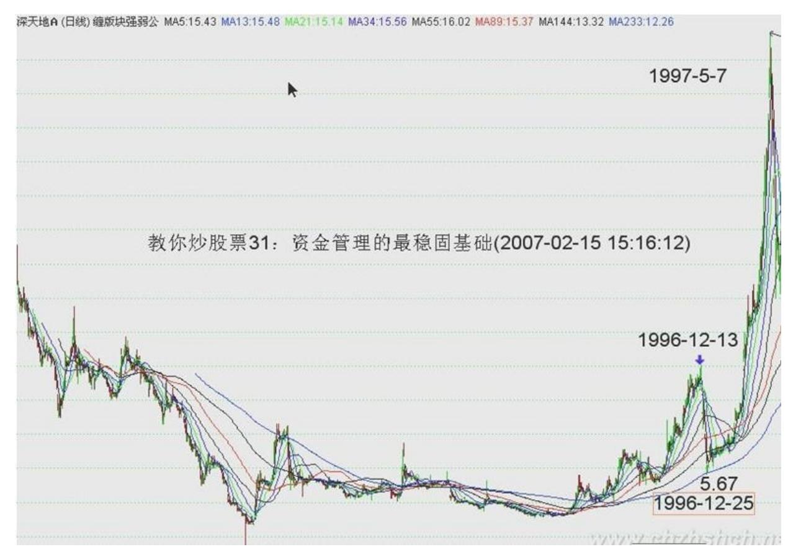

191 192 一个无压力的资金,是投资的第一要点,虽然前面反复说 过,但说完上面的例子,还是要再次强调。另外一个重要的,就是自 己的资金,一定不能交给别人管理,自己的盘子,一定要自己负责, 不能把自己的命运交给别人。又是一个故事,时间要提早 4、5年,92 年的事情了。这朋友,92 年已经有几千万的资金,在当时也算可以 了。结果,因为家里有事处理,把盘子交给一个朋友管理,那人还是 后来特别出名的人,说出来,市场里的老人都知道,当时大盘从 1400 多点回跌,已经跌了很多,以为到底部了,结果这家伙自作主张透资 抄底,大盘却一直下跌,等这朋友过了两、三周回来,一切早已灰飞 湮灭。那次大盘一直跌破 400 点才到底部,半年内一共下跌了 1000 多点,后来从 400 点以下不到 4 个月又创出 1558 点的历史高位, 市场就是这么残酷,把命运交给别人,就是这样了。

不能把自己放置在一个危险的境地,所谓背水一战、置之死地而后 生,都不是资本市场应该采取的态度。这样的态度,可能一时成功, 但最终必然失败。技术分析的最重要意义在于,让你知道市场究竟在 干什么,市场在什么位置该干什么,让你知道,一个建立的仓位,如 何持有,如何把一个小级别的持有逐步转化为大级别的持有,又如何 退出,这一切,最终都是为资金管理服务的,投资最终的目的不是股

票本身,而是资金,没收回资金,一切都没意义。股票都是废纸,对 资金的任何疏忽,都会造成不可挽回的损失。任何人,必须明确的 是,多大的资金,在市场中都不算什么,而且,资金是按比例损失 的,一万亿和一万元,按比例损失,变成 0 的速度是一样的。无论多 大的资金,要被消灭,可以在举手之间,因此,永远保持最大的警 觉,这是资金管理最大的、最重要的一点,没有这一点,一切管理都 是无用的。

一个最简单又最有效的管理,就是当成本为 0 以前,要把成本变为 0;当成本变成 0 以后,就要挣股票,直到股票见到历史性大顶,也 就是至少出现月线以上的卖点。一些最坏的习惯,就是股票不断上 涨,就不断加仓,这样一定会出问题。买股票,宁愿不断跌不断买, 也绝对不往上加码。投入资金买一只股票,必须有仔细、充分的准 备,这如同军队打仗,不准备好怎么可能赢?在基本面、技术面等方 面都研究好了,介入就要坚决,一次性买入。如果你连一次性买入的 信心都没有,证明你根本没准备好,那就一股都不要买。

买入以后,如果你技术过关,马上上涨是很正常的,但如果没这水 平,下跌了,除非证明你买入的理由没有了,技术上出现严重的形 态,否则都不能抛一股,而且可以用部分机动的资金去弄点短差(注 意,针对每只买入的股票,都要留部分机动的资金,例如1/10),让 成本降下来,但每次短差,一定不能增加股票的数量,这样,成本才 可能真的降下来,有些人喜欢越买越多,其实不是什么好习惯。这股 票该买多少,该占总体资金多少,一开始就应该研究好,投入以后就 不能再增加。

股票开始上涨后,一定要找机会把股票的成本变成 0,除了途中利用 小级别不断弄短差外,还要在股票达到 1 倍升幅附近找一个大级别的 卖点出掉部分,把成本降为 0。这样,原来投入的资金就全部收回来 了。有人可能要说,如果那股票以后还要上涨 10 倍呢?这没问题, 当股票成本为 0 以后,就要开始挣股票。也就是利用每一个短差,上 面抛了以后,都全部回补,这样股票就越来越多,而成本还是 0。这 样,这股票就算再上涨 100 倍,越涨你的股票越来越多,而成本永远 为 0,这是最可怕的吸血,庄家、基金无论如何洗盘,都使得你的股 票越来越多,而你的成本却是 0,然后,等待一个193 超大级别的卖 点,一次性把他砸死,把那庄家、基金给毁了。

想想,成本为 0 的股票,在历史大顶上砸起来是最爽的。

这就是资金管理中针对每只股票的最大原则,按照这原则,你不仅可 以得到最安全的操作,而且可以赢得最大的利润。特别挣股票的阶 段,一般一个股票,盘整的时间都占一半以上,如果一个股票在上涨 后出现大型盘整,只要超大级别卖点没出现,这个盘整会让你的股票 不仅把抛掉的全挣回来,而且比底部的数量还要多,甚至多很多。一 旦股票再次启动,你就拥有比底部还多的但成本为 0 的股票,这才是 最大的黑马,也是最大的利器。一个合理的持仓结构,就是拥有的 0 成本股票越来越多,一直游戏到大级别上涨结束以后,例如这轮大牛 市,直到牛市结束前,才把所有股票全部清仓。

而资金,就可以不断增加参与的股票种类,把这程序不断下去,这 样,操作资金不会增加,特别对大资金,不会经常被搞到去当庄家或 钱太多买了没人敢进来,这样就不会增加操作的难度,但股票种类越 来越多,但成本都是 0。这样,才会有一个最稳固的资金管理基础。

一言既出、驷马难追。既然承诺大家春节前一定让联通上 5 元,大盘 上 3000,就无论如何都要办到。当然,这不是本 ID 一个人能办到 的,但在北京,又有什么不能办到的?中国的中心是北京,北京人最 讨厌汉奸,汉奸既然在 3000 点之前捣乱,就要让红旗放上3000 点过 年,中国的世纪,哪里有汉奸说话的地方?血战,快意恩仇,就这么 简单了。该看到的大家都看到的,不能看到的也没必要说了。对于本 ID 曾说过的 10 多只股票,除了一些前期涨幅过大的,都创出新高 了,当然,有些涨得快点,有些慢的,但中线肯定都没问题。

不过,本 ID 在这里公布说阻击的目标,确实让本 ID 操作上增加很 大难度,这里汉奸的眼线肯定不少了,现在本 ID 说的股票,本ID 不 动好象就没人动了,这样不好,本 ID 又不是庄家,这样搞下去没意 思了。所以,里面的庄家也别太偷懒,虽然你们肯定是本 ID的后辈, 但你们的年龄估计都比本 ID大,尊敬长辈也没有这样的,自己看着办 吧。

以市场老人的口吻教训一些这些懒人,市场是需要口碑的,吃点小 亏,立个金字牌子,有什么不好的。举一个本 ID 在 N 年前干过的最 小的事情,把一只股票从 14 元,两周多点阻击上 25 元全出掉,时 间也是春节前后,一分钱没花,靠的是什么?自己去想想吧。

明天,汉奸还有可能发难,所以,大家还需要努力。

\*\*\*\*\*\*\*\*\*\*\*\*\*\*\*\*\*\*\*\*。

解盘及互动问答:

#### \*\*\*\*\*\*\*\*\*\*\*\*\*\*\*\*\*\*\*\*。

缠师:一言既出、驷马难追。既然承诺大家春节前一定让联通上 5 元,大盘上 3000,就无论如何都要办到。当然,这不是本 ID 一个人 能办到的,但在北京,又有什么不能办到的?中国的中心是北京,北 京人最讨厌汉奸,汉奸既然在 3000 点之前捣乱,就要让红旗插在 3000 点上过年,中国的世纪,哪里有汉奸说话的地方?2007-02-15 15:18:31血战,快意恩仇,就这么简单了。该看到的大家都看到的 了,不能看到的也没必要说了。对于本 ID 曾说过的 10 多只股票, 除了一些前期涨幅过大的,都创出新高了,当然,有些涨得快点,有 些慢的,但中线肯定都没问题。

不过,本 ID 在这里公布说阻击的目标,确实让本 ID 操作上增加很 大难度,这里汉奸的眼线肯定不少了,现在本 ID 说的股票,本ID 不 动好象就没人动了,这样不好,本 ID 又不是庄家,这样搞下去没意 思了。所以,里面的庄家也别太偷懒,虽然你们肯定是本 ID

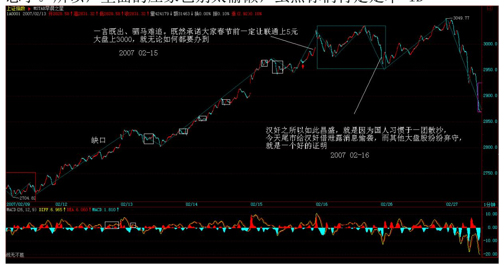

的后辈,但你们的年龄估计都比本 ID大,尊敬长辈也没有这样的,自 己看着办吧。

以市场老人的口吻教训一下这些懒人,市场是需要口碑的,吃点小 亏,立个金字牌子,有什么不好的。举一个本 ID 在 N 年前干过的最 小的事情,把一只股票从 14 元,两周多点阻击上 25 元全出掉,时 间也是春节前后,一分钱没花,靠的是什么?自己去想想吧。

明天,汉奸还有可能发难,所以,大家还需要努力。

#### 195

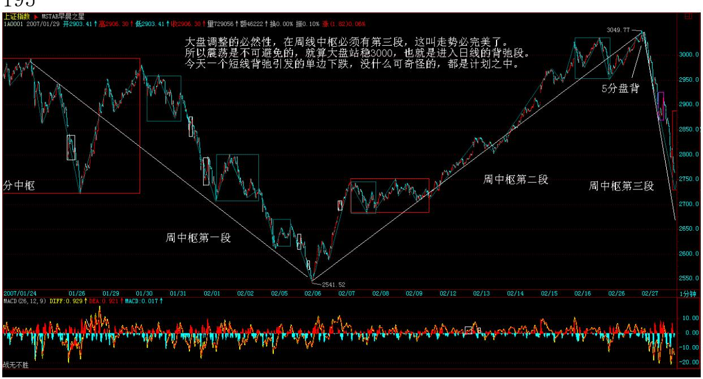

196

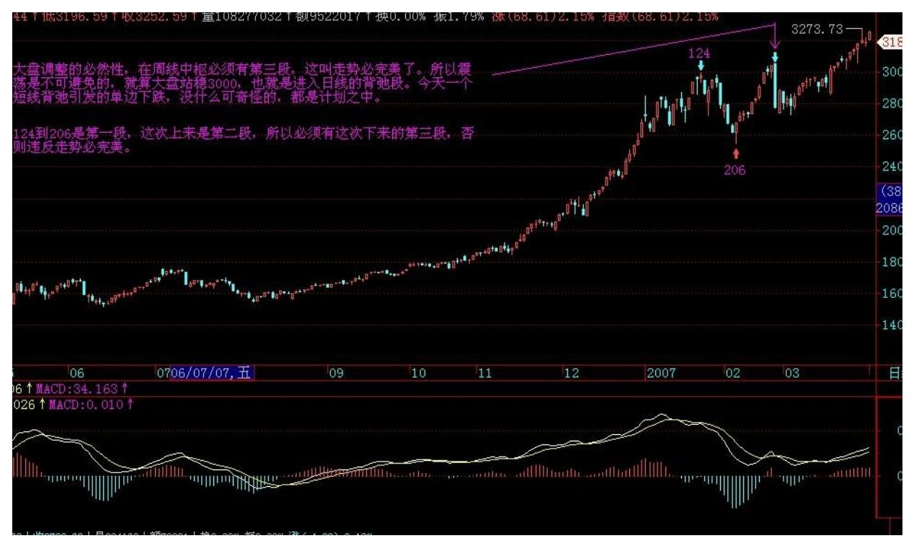

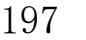

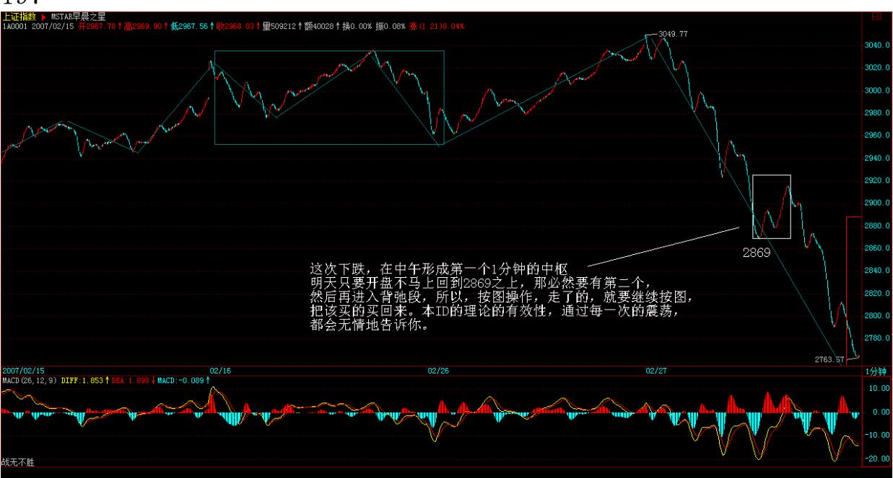

198 本 ID 的理论永远都是按图办事,没有死多、死空这些无聊玩 意。

这次下跌,在中午形成第一个 1 分钟的中枢,明天只要开盘不马上回 到 2869 之上,那必然要有第二个,然后再进入背弛段,所以,按图

操作,走了的,就要继续按图,把该买的买回来。本 ID 的理论的有 效性,通过每一次的震荡,都会无情地告诉你。

199 1. 网友[匿名] 下下: "显示谈不上什么日背弛,只是一个分钟 线上的背弛,但最大的技术压力是周线的中枢必须有三段。现在走第 三段。" 哪位同学说说周线中枢上的前两段,是哪段到哪段?(注: 日中枢)2007-02-27 16:14:41缠师:124 到 206 是第一段,这次上 来是第二段,所以必须有这次下来的第三段,否则违反走势必完美。

#### \*\*\*\*\*\*\*\*\*\*\*\*\*\*\*\*\*\*\*\*。

2. 网友匿名] 无限: 今天看见女王在联通博杀,和大盘多方的共同 努力,说声,你们辛苦了!感谢你们让我们能过个开心年!拜你们所 赐,我的几个股票也都启动了(我只买了女王的紫光股份,其他的都 是我自己选的股票)。对于紫光股份,我强烈抗议这个懒庄。真是动 一天,歇一周。非典型性老年痴呆症。本来还有更难听的,我实在不 好意思再骂您啦。希望您利用好节前的最后一个机会,创立一个金字 招牌吧!等过了年还有一段时间可以上冲,别等着大家都看跌的时 候,你才出来,让人人喊打!另外一个问题,今天大盘的跳空缺口会 以什么用方式补上呢?谢谢女王!祝你新年快乐,万事如意!在此也 给同学们拜个早年!恭喜发财,2007 年一起飞黄腾达!无限敬上。 2007-02-15 15:34:07缠师:即使突破 3000,震荡的压力还是很大 的,以后震荡中补掉的机会多了。明天其实还是有压力的。特别这次 上来夹空了不少人。

那些人即使明天不出手,过年后还是会出手的。现在并没有绝对的把 握一定击毁他们。当然,他们也没有任何把握一定能出手成功,这是 大战,现在还很难说胜负。

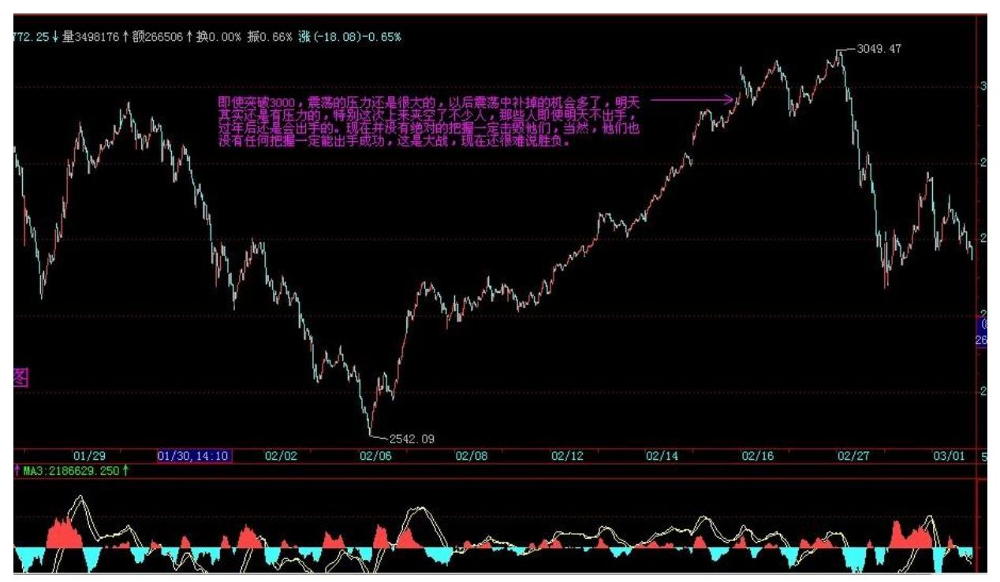

200 201 至于个股,本 ID 今天唯一买入的,就是某些深圳的本地低 价股,其他都是在套现。特别像 000416、600432 等等这些。对于本 ID 来说已经翻倍的,本ID 只能无情地把成本变成 0。当然,这些个 股,中线都还有潜力,只是对本 ID 来说,以后就是挣筹码了。

至于涨幅不大的,买点出现,本 ID 会回补的,因为,周线调整结束 后,大盘依然要向上。

#### \*\*\*\*\*\*\*\*\*\*\*\*\*\*\*\*\*\*\*\*。

3. 网友[匿名] 小鸟: 想起来了。盘整是只形成一个中枢的,假如在 某级别盘整背驰中出掉了,是不是下跌中只用形成一个中枢后就可以 再捡回来?2007-02-15 15:24:35缠师:次级别背驰后接回来,但必须 关照大级别的,一旦有盘不住的倾向,就不要接了,等破位再说。这 个问题的精确解决,要等以后的课程。

#### \*\*\*\*\*\*\*\*\*\*\*\*\*\*\*\*\*\*\*\*。

4. 网友 [匿名] 满目山河: 一分钱未花?那挣钱了吗?呵呵。缠妹 妹,今天这课太重要了,谢谢! 2007-02-15 15:24:56缠师:把货出 了当然要挣钱。只是拉抬并没花钱。

#### \*\*\*\*\*\*\*\*\*\*\*\*\*\*\*\*\*\*\*\*。

5. 网友 [匿名] 如初见: 我的重仓股 000533 今天复牌。5 分钟、 30 分钟图均未出现卖点,可长幅已超过 50%了。实在有点怕。

缠 JJ 能不能指点指点。否则,心中没底啊。 2007-02-1515:29:17缠 师:一般现在复牌后震荡几天都继续涨的。如果你技术熟练,就可以 参考本课说的方法。此外,最重要的是,如果出了,你能找到更好的 股票吗?如果没有,就别出了。当然,短线是可以的,上面抛了,下 面拣回来。这种活动,只要有短线买卖点都可以进行,控制好每次的 参与量就可以了。例如,特别不熟练的,用 1/10 操作,这样也是一 个很好的练习方法。技术是靠自己练出来的。

202

#### \*\*\*\*\*\*\*\*\*\*\*\*\*\*\*\*\*\*\*\*。

6. 网友 [匿名] 外科医生: 恭喜禅妹此战告捷。为你担心呢。这样 目标太大了呵。5.03 元再次加仓联通。 2007-02-15 15:31:59缠师: 联通现在没必要买了。本 ID 说那天,第二天刚好有一个买点,那时 候为什么不买。注意,联通的压力大家都看到了,散户千万别买。散 户千万别买联通,否则后果自负。除非你是很中线的心态持有,能等 到中移动回归那一天,否则根本没必要买联通。

#### \*\*\*\*\*\*\*\*\*\*\*\*\*\*\*\*\*\*\*\*\*。

7. 网友 [匿名] 外科医生: 联通在你说的第二天,那个买点买了。 今天又买了。多谢禅妹指点。 2007-02-15 15:44:28缠师:没必要 买,一定要看技术图形。没有买点就别买了。

#### \*\*\*\*\*\*\*\*\*\*\*\*\*\*\*\*\*\*\*\*。

8. 网友小糊小舞: 楼主,还有一个问题请教。具体操作中,如何把 成本变为 0?以后会有课吗?应该不是一定要等股票翻倍然后出一半 吧? 2007-02-15缠师:如果你在震荡中,能成功的不断弄短差,一般 不用翻番。你的出一半后成本就是 0 了。其实,当时的卖点,关键看 30 分钟或日线的卖点,有了就出手,如果还在连续拉升,那过了 1 倍也没必要出,等卖点出现,这要灵活点。

9. 网友 [匿名] 看聊: 数妹妹,000938 走的也过于稳健了吧?他和 大众公用都有创投概念,可走势却有天壤之别。虽然我认为他能上1 6元,可看别的股票飞涨而它不涨,心情很不爽啊。看来我还要悟 禅。 2007-02-15 15:50:34203 缠师:000938 主要是业绩有问题,所 以大家都有所顾忌。但一旦业绩明朗,那就会放手大干了。你想想, 最高层都是清华的,清华的股票能有问题吗?这么大的牛市,一个从 100 元下来的股票,难道连 20 元都上不去吗?现在主要是货少了, 而不是拉不拉得上去的问题。对散户来说,你可以长期关注,然后根 据技术图形来打短差,高位卖了,然后就跟别的股票,回跌有大买点 了,然后再回补,这样资金效率就高了。等货比较集中了,自然有连 续拉升的行情。注意 416 没有?为什么业绩公布不好,调整两天后又 开始大幅上涨,道理很简单,货干净了。

\*\*\*\*\*\*\*\*\*\*\*\*\*\*\*\*\*\*\*\*10. 网友 [匿名] 红运当头: 请问楼主,象我 们这样的散户,在下跌市中,所留部分机动的资金被套捞了怎么办? 不等于将主动权交给了别人了吗?谢谢! 2007-02-15 16:07:36缠师: 你为什么在下跌市里买入?一定要等到买点出现了才买啊。

而且一个中线的仓位,至少应该在一个日线级别的买点介入,这样才 有中线运用的价值。当然,如果你技术不熟练,会找错买点,这必须 由技术的提高才能最终解决。否则,技术不过关,这些问题总是存在 的。唯一的办法就是,如果技术不过关,那就介入的量要控制好。例 如,技术好的,有 1 万元,都可以先买 8 千,技术不好的,那就先 买 3 千,涨了不追,跌了,如果中线形态保持,就在次级别买点补 进。当然,如果你连上涨和下跌都分不清,那还是先学技术,什么操 作都别进行。

#### \*\*\*\*\*\*\*\*\*\*\*\*\*\*\*\*\*\*\*\*。

11. 网友 [匿名] 兰兰: 缠姐,请问股票上涨一倍后,出一半股票, 成本为 0 后,做短差时,是用退出来的全部本金来买卖相应股票数 量,还是买卖股票数量和原来卖出的股票一样?谢谢回复!2007-02- 15 16:07:26缠师:成本为 0 前,只补进相同的数量,仓位不增加。 成本为 0后,抛出后,跌回来,就把抛出的钱,全补进去,这样买回 来的数量一定多了,股票才会越来越多。

#### \*\*\*\*\*\*\*\*\*\*\*\*\*\*\*\*\*\*\*\*。

12. 网友 [匿名] 清: 求助!能帮我看看 000690 这个股票,今天的 买卖点各是什么地方出现吗?我今早出了大部分,由于后来一直没有 找到买点,204 后来下午有一波大反弹,也并没有再入,对这个高送 股的走势,明天由于除权,我怕 K 线图都不好把握,能借用您一点时 间分析分析吗?谢谢!盼回复! 2007-02-15 15:46:55缠师:有买 点。1110 就是一个比 1 分钟级别还低的买点,如何判断?以前说过 的。对冲中,如果大的走势没坏,回跌比较多后就可以逐步回补。你 不能冀望,一个中线上涨中段的股票,一个 1 分钟的背驰就可以回跌 20%,这不现实。

\*\*\*\*\*\*\*\*\*\*\*\*\*\*\*\*\*\*\*\*13. 网友 [匿名] 白玉兰: 妹妹咋不回答我的 问题?山东人是老 8股中表现最差的,是同样的程序选出来,可是就 是不一样,这需要是先退出,还是继续持有? 2007-02-15 16:23:58 缠师:这股票,里面人还是多,不干净,但已经比以前好多了。现在 只能慢慢推着上,一急拉,别人不都出来了。走得慢有时候并不一定 是坏事,特别开始的时候。你看 777,原来也很麻烦,打跌停的都 有,但后来不也走出来了。如果没耐心就先出来吧,按技术去找别的 股票,一样的。

#### \*\*\*\*\*\*\*\*\*\*\*\*\*\*\*\*\*\*\*\*。

14. 网友 [匿名] NN: 从楼主的回帖中可以感觉出,楼主和许多基 金管理层是串通一气的。请问楼主,这样联合作战是否违法?感觉有 操控之嫌啊?缠师:本 ID 阻击他们,谁认识他们?他们配认识本 ID 吗?配和本 ID 串通一气吗?

#### \*\*\*\*\*\*\*\*\*\*\*\*\*\*\*\*\*\*\*\*。

15. 网友 [匿名] 外科医生: 请问禅妹,在一个上升趋势中,如果1 分钟没有背驰,5 分钟级别会发生背驰吗?会不会出现次级别没有背 驰,而大级别先背驰了呢? 多谢! 2007-02-15 16:23:36缠师:在标 准的趋势中,不可能。大级别进入背驰段,然后级别逐步向下进入, 这是最标准的状态。除非出现突发事件,使得小级别突然破裂。

16. 网友 [匿名] 勤学好问: 请问楼主,大盘是不是日线上的上涨背 弛,已经有形成的可能了?2007-02-16 15:33:02缠师:行情就算创新 高,进入最后一段的几率是不少的。所以对现在的行情,不能死多。 这次之所以要玩这一下,就是因为要告诉汉奸们,别以为你们想哪出 就哪出,就算做空,也轮不到你们先发话。

\*\*\*\*\*\*\*\*\*\*\*\*\*\*\*\*\*\*\*\*17. 网友 [匿名] 勤学好问: 上次是大盘 60 分钟背驰,引发了400 多点的爆跌。所以这次一旦日线上的背驰出现 的话,那调整可能就更大一些了。 我的理解对吗?楼主。 2007-02- 16 15:41:53缠师:就算最后一段结束,还是在这里中枢上下震荡。震 荡完了,牛市依然继续。

#### \*\*\*\*\*\*\*\*\*\*\*\*\*\*\*\*\*\*\*\*。

18. 网友 [匿名] aaaa: 楼主,问一下今天下午大盘 5 分钟图上 14:05 是不是背驰? 2007-02-16 15:47:20缠师:所以就有了后面的 杀跌,这在技术上很合理,不过尾盘像工行之类出工不出力,本 ID 有点不齿他们。

网友 [匿名] aaaa:大盘出现背驰,但手中股票没出现背弛,也就没 楼主说的卖点,但它确实又是随大盘一起跌了。楼主,这样的情况究 竟卖还是不卖??缠师:不会没有的,只是级别小点而已。一般都是 1 分钟以下,仔细观察以下就明白。这可以对冲一下,抛了,然后买 回来。如果中线的,就不用管了。

206

#### \*\*\*\*\*\*\*\*\*\*\*\*\*\*\*\*\*\*\*\*。

19. 网友两只老虎: 神仙姐姐说的 14 只股票,我怎么数来数去都有 17 支(不含联通)。今天的航天股走得不好。昨天、今天管子都不太 好,我总担心神仙姐姐会不会把管子拿来应急了。 2007-02-16 15:39:04缠师:没有,只有 14 只,最开始 5 只,然后 416 那三 只,后面是 432 那 5 只,还有一个 938,就没有了。

#### \*\*\*\*\*\*\*\*\*\*\*\*\*\*\*\*\*\*\*\*。

20. 网友 [匿名] 兰兰: 缠姐,祝姐姐新春愉快!万事如意!我收了 一份干净的大礼。多谢!有一些问题,烦请姐姐指点,谢谢!(放假

就不问了)以下判断对吗?两个中枢趋势背驰组成: 一个大一级别中 枢+A 一段上涨(包含 2 个本级中枢由次级别三段构成)+B 1 个大一 级别中枢+C 一段上涨(包含 2 个本级中枢由次级别三段构成),每 一段上涨可以在次一级别背驰卖出,再在大一级别中枢形成的盘整 一、二、三类买点买入。2007-02-16 16:00:04缠师:最好就是先按资 金量定好操作的级别。例如,30 分钟,只在30 分钟进入背驰段后, 用 5 分钟、1 分钟以及 1 以下的背驰精确定位后卖出,这样就不用 一见 1 分钟背驰都很紧张去卖,那太累了。

网友 [匿名] 兰兰:一个中枢盘整背驰组成:A 一段上涨(包含 2个 本级中枢由次级别三段构成)+B 1 个大一级别中枢+C 一段上涨(包 含 2 个本级中枢由次级别三段构成),例如,姐姐在第 24 课上海 5 分钟图盘整背驰,c 段的中枢是 30 分钟中枢?B 段有 30分钟中枢还 是没形成中枢?缠师:前面都有精确的定义的,自己去找一下。

网友 [匿名] 兰兰:成本为 0 后,筹码增加前提是在一个大级别上涨 中进行,是吗?然后在大级别上涨背驰后,彻底卖出吗?这级别是在 2 个周线中枢,还是月线中枢形成后?如果超长线,n 年牛市,一股 票 n 年上涨。可以一直不卖?缠师:这和你的资金以及行情有关。如 果是一个大牛市,当然要到月线背驰再说。盘整的时候,弄短差比较 简单,单边上涨中,技术要求比较高。

207 网友 [匿名] 兰兰:昨天 1 分钟大盘第三类买点,当时形成时, 如何判断下跌已完成?用 macd,如果一段红,一段绿,绿的变短了就 是底,是吗?如果只有一种颜色,以该线变短为准,对吗?上涨情况 同理吗?缠师:前面有,找次次级别的第一类买点。

#### \*\*\*\*\*\*\*\*\*\*\*\*\*\*\*\*\*\*\*\*。

21. 网友 [匿名] aaaa: 趁楼主在,抓紧再问个问题:600010,5分 钟图上,2 月 9 日 14:00 左右,我判断为盘整背驰,出了。想等跌 下来买,结果没下来多少,后面却猛涨上去了,超郁闷。楼主,我的 判断是否有问题? 2007-02-16 16:12:49缠师:你看看前面说的,本 ID 理论小学毕业的标准是什么?达到那标准,你就不会判断错了。

22. 网友[匿名] 外科医生: 联通在你说的第二天那个买点买了,今 天又买了。多谢禅妹指点。2007-02-15 15:44:28缠师:没必要买,一 定要看技术图形。没有买点就别买了。

#### \*\*\*\*\*\*\*\*\*\*\*\*\*\*\*\*\*\*\*\*\*。

23. 网友[匿名] 夜雨: 老师厉害啊。春节快乐,先预祝一下。 000999,今天下午 14.50 又出现了 5 分钟买点,同学们关注啊。

请问老师,600080 今天有卖点吗?我看不清楚啊。不过也先出了。

学习您的话,宁可卖早,也不要卖迟,机会很多。 2007-02- 1515:39:00缠师:你说 S 股中线会有问题吗?999 难道不是 S 股?

#### \*\*\*\*\*\*\*\*\*\*\*\*\*\*\*\*\*\*\*\*。

208 24. 网友[匿名] 侯长老: 周六开始有 4 周假期,晚上到上海, 估计 30 后半夜能到家。给博主和各位学友拜个早年。祝愿大家万事 如意,新春愉快!2007-02-15 16:15:30缠师:同贺,一路顺风。

#### \*\*\*\*\*\*\*\*\*\*\*\*\*\*\*\*\*\*\*\*。

25. 网友 [[匿名] 小明: 告诉大家,我准备放弃做短线了,拿着一 个股持有不放,做中长线投资。做短线太累了,往往还吃力不讨好。 毕竟我们不是庄,能够主动利用各种背驰造成价格上的波差(波 动),所以还不如像林园那样,多潇洒!当然我不可能像他那样拿那 么长时间,我说的中长线大概就几个月。其他的时间就不每天盯着盘 面看了,等晚上上网的闲暇时间,顺便打开行情软件看看收盘价格就 可以了。然后其他的时间干点别的,学学论语啊,关心关心 qq 上的 mm 啊等等。请缠 mm 指正! 2007-02-15 16:10:04缠师:你可以把操 作的级别提高点,这样频率就降低,这样也很轻松的。

#### \*\*\*\*\*\*\*\*\*\*\*\*\*\*\*\*\*\*\*\*。

26. 网友 [匿名] 炼铁设备: "注意 416 没有?为什么业绩公布不 好,调整两天后又开始大幅上涨,道理很简单,货干净了。"416调整 时,我坚守着,昨天 4.58 元我把它卖了,今天想买回却找不到买 点。请问楼主,明天早上能否买回 416,谢谢!2007-02-1516:29:06

缠师:没卖点你卖他干什么?卖了就别买了。首先要反省一下这样的 操作,不能再发生了。

#### \*\*\*\*\*\*\*\*\*\*\*\*\*\*\*\*\*\*\*\*。

27. 网友 [匿名] 白玉兰: 【妹妹咋不回答我的问题?山东人是老8 股中表现最差的,是同样的程序选出来,可是就是不一样,这是是先 退出还是什么? 2007-02-15 16:34:11209 缠师:这股票,里面人还 是多,不干净,但已经比以前好多了,现在只能慢慢推着上,一急 拉,别人不都出来了,走得慢有时候并不一定是坏事,特别开始的时 候。你看 777,原来也很麻烦,打跌停的都有,但后来不也走出来 了。如果没耐心就先出来吧,按技术去找别的股票,一样的。 】(此 处和前面重复)网友 [匿名] 白玉兰:我有耐心的,我只是打探一 下,这里又很多人拿了山东人,他们怕你生气已经不敢问了。777 我 赚了,就是跌停前一天卖的,然后补的 999,特别感谢你 。

缠师:600777 一直在创新高,你不能要求每一只股票都是连续涨停上 去的,每只股票的盘面不同,当然走势就不一样了。而且这股票5 元 下本来就是强阻力,5 元下走得慢点,很正常。

网友 [匿名] 兰兰: 缠姐,刚才您回答小鸟关于大盘中枢问题,我认 为是从 1048 到 1337 才有三段,1048 到 1329 好像没有三段?请指 点。谢谢! 缠师:第三段是 1114 到 1129,前三段的级别一定是一样 的,按你那种分法,就不一样了。其实后面都是中枢的延伸。各位注 意,这才是正确的。

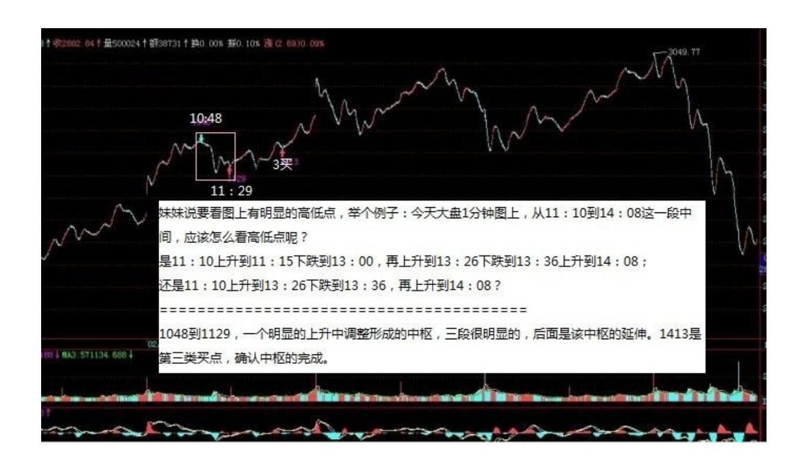

\*\*\*\*\*\*\*\*\*\*\*\*\*\*\*\*\*\*\*\*。

28. 网友[匿名] 小鸟: 不好意思,再问一个关于找中枢有个问题: 妹妹说要看图上有明显的高低点,举个例子:今天大盘 1 分钟图上, 从 11:10到 14:08 这一段中间,应该怎么看高低点呢?是11:10 上升到 11:15 下跌到 13:00,再上升到 13:26 下跌到13:36 上 升到 14:08;还是 11:10上升到 13:26 下跌到 13:36,再上升到 14:08?2007-02-15 15:45:26缠师:1048 到 1129,一个明显的上升 中调整形成的中枢,三段很明显的,后面是该中枢的延伸。1413 是第 三类买点,确认中枢的完结。

210 211 29. 网友 [匿名] 兰兰: 缠姐,刚才您回答小鸟关于大盘中 枢问题,我认为是从 1048 到 1337 才有三段,1048 到 1329 好像没 有三段? 请指点。谢谢!我结合 MACD 也是这样判断的,但妹妹的意 思应该是 11:16 和 13:00 也分别是高低点了。妹妹,对吗?2007- 02-15 16:34:46缠师:上面把 1129 写成 1329 了。纠正了。

#### \*\*\*\*\*\*\*\*\*\*\*\*\*\*\*\*\*\*\*\*。

30. 网友[匿名] 新学生: 缠老师好,先预祝老师新春快乐!再我想 问个问题。很明显的,中枢能看出来,但像 600193 的日线我感觉没

有中枢,不知道对不对? 老师能回答一下吗?2007-02-1516:09:10缠 师:怎么会没有?1221 到 0118 就很明显。

#### \*\*\*\*\*\*\*\*\*\*\*\*\*\*\*\*\*\*\*\*。

31. 网友[匿名] 新学生:请问缠姐, 1221-0118 也应该是周线的中 枢啊。

缠师:周线的,要每一段都有日线中枢,这不符合要求。

#### \*\*\*\*\*\*\*\*\*\*\*\*\*\*\*\*\*\*\*\*。

32. 网友 [匿名] 大盘: 请问博主,第 3 类买点,有一种是盘整背 驰后,不跌破中枢高点形成的。是不是还有不是盘整背驰形成的第 3 类买点?例如,趋势中形成第 2 个中枢的第 1 段次级别下行走势。 还有,对于不断形成新的中枢,例如,上涨方向 3 个以上的中枢,对 从第 3 个中枢开始的每个新生中枢,次级别的第 1 段下行走势,为 什么不可以称为第 3 类买点?每个新生中枢次级别的第3 段下行走势 又算是什么买点呢?另外,盘整背驰与趋势背驰的区别,我还不是十 分清楚。是不是趋势背驰是至少形成 2 个中枢后的上行段发生的背驰 吗?(与第 1 个同级别中枢后的次级别上行段进行比较)而盘整背驰 是离开第 1 个中枢后的上行段发生的背驰吗?(与第 1 个同级别中 枢前的次级别上行段进行比较)恳请解惑。谢谢!2007-02-15 16:01:01212 缠师:也有可能。例如一个很强劲的上涨,然后一个快 速的回调,然后继续上升。第三类买点关键是次级别上去,次级别回 调不回中枢里。盘整背驰一般都是中枢震荡时发生的,而趋势背驰, 是a+A+b+B+c 中,cb 间的比较。

#### \*\*\*\*\*\*\*\*\*\*\*\*\*\*\*\*\*\*\*\*。

33. 网友 [匿名] 楚狂人: 请问缠主,炒期货外汇什么的,也能完全 套用这理论嘛? 2007-02-15 16:54:03缠师:前面那课不是说了两个 前提条件了吗?你觉得他们不符合吗?

#### \*\*\*\*\*\*\*\*\*\*\*\*\*\*\*\*\*\*\*\*。

34. 网友 [匿名] 巴索林: 缠主新年愉快!请教 600316,5 分钟线 一点点不断盘整向上,真不好弄短差,又担心会大跌一下,不知怎样 操作?请缠主指教。 2007-02-15 16:53:29缠师:这走得很标准,中

枢不断新生,就一个个看上去,如果暂时不会看,就看 5 分钟的 120 线,不破,不会有大调整的。

#### \*\*\*\*\*\*\*\*\*\*\*\*\*\*\*\*\*\*\*\*。

35. 网友 [匿名] 炼铁设备: 我有耐心的,我只是打探一下,这里又 有很多人拿了山东人,他们怕你生气,已经不敢问了。2007-02-15 16:48:59网友[匿名] 白玉兰:777 我赚了,就是跌停前一天卖的,然 后补的999,特别感谢你。

网友 [匿名] 炼铁设备:祝贺你!777 感觉明天有危险。药因当初追 高,随后发生调整,我亏惨了。

缠师:中线没问题的。

213

#### \*\*\*\*\*\*\*\*\*\*\*\*\*\*\*\*\*\*\*\*。

36. 网友 [匿名] 小鸟: 请问 10:11 到 10:33 算一个中枢吗? 2007-02-15 17:02:29缠师:当然,然后是一个背驰,引发后面的下 跌。要先下了,再见。

#### \*\*\*\*\*\*\*\*\*\*\*\*\*\*\*\*\*\*\*\*\*。

37. 网友 [匿名] 越看越迷糊: 缠 mm 好!看到最后,反而有个最基 础的问题迷糊了。还是关于走势中枢的。缠 mm 说过,上升趋势的走 势中枢由"下、上、下"三段重叠得到。假如"上"这段较长,两个 "下"段都很短,以致于三段没有交叉,如何求得中枢?如果在上升 趋势中取"上、下、上"三段,则不存在这个问题?2007-02-15 17:06:10缠师:临走回答你,那就不形成中枢,谁告诉你下上下一定 形成中枢的?没重叠哪里有中枢?下了。再见。

#### \*\*\*\*\*\*\*\*\*\*\*\*\*\*\*\*\*\*\*\*。

38. 网友 [匿名] 越看越迷糊:"关键是,这种走势很可能发生,即 在一个上升趋势中,每一次回调都距离上一次的高点很远,从而形成 强势上涨,而不形成走势中枢。" (此处引用缠师的话)那么又该怎 样理解这句话:缠中说禅趋势:在任何级别的任何走势中,某完成的

走势类型至少包含两个以上依次同向的缠中说禅走势中枢,就称为该 级别的缠中说禅趋势。

网友【匿名】:当然是后面才会形成中枢。缠妹妹说过,在日线上, 如果不形成日线中枢,证明走势强劲,要到更高的位置才形成中枢。 没有形成中枢,证明走势没有完结,这很好理解。

#### \*\*\*\*\*\*\*\*\*\*\*\*\*\*\*\*\*\*\*\*。

39. 网友 [匿名] 小鸟: 请问 10:11 到 10:33 算一个中枢吗? 2007-02-15 17:02:29214 缠师:当然,然后是一个背驰,引发后面的 下跌。

#### \*\*\*\*\*\*\*\*\*\*\*\*\*\*\*\*\*\*\*\*。

40. 网友 [匿名] 小鸟:越来越糊涂了,我也看出来是个背驰,下面 是下跌,10:49-11:10 是下跌的第一段,可为什么楼主把这一段算 作一个中枢的第一段呢?难道这是个盘整中枢?请楼主讲解一下,谢 谢!网友【匿名】代缠师回答:我理解,一个是前面的中枢,一个后 面的中枢,不是一回事情。

#### \*\*\*\*\*\*\*\*\*\*\*\*\*\*\*\*\*\*\*\*。

41. 网友 [匿名] frogleg: 网友 [匿名] 小鸟,我的理解你看对不 对?无论分、时、日、周、月,当前的中枢分太清楚是不可能的。只 有发生的中枢才可以回头分析,以后的情况均要预测。要理解中枢, 就一定要对 MACD 有一个明确的概念,即 macd 趋势背离,是对以前 周期的否定,还要对成本和赌博有很强的概念。举一个例。若是一个 股价在两个月上升了两倍,后深幅下跌,日线上出现了几条 macd 趋 势背离,股价跌到周(或月)均线上,如不考虑受政策影响,从理论 上看,这是一个介入的良好时机,是不是要买呢?我考虑的时候很简 单:反向考虑,如果我是庄,别人来买,我当然高兴,越多人来买越 好,全卖,这种票我当然不买。所以我选择介入的股票就明确了,是 那种盘子大,业绩好(不会一下子 out,不能玩了),大伙都有兴趣 的,这才是冼盘和共同再次投机!网友 [匿名] 小鸟:你的理解是不 对的。我理解楼主妹妹的意思,MACD 和中枢没关系,只是辅助。有三 个次级别就构成中枢,不需要预测。

42. 网友 [匿名] 小丸子: 缠妹妹好!000777 无论是日线级别还是 30 分钟、5 分钟或是 1 分钟上都没有出现背驰,可是为什么在2 月 8 日它的振幅达 14%,收了一根长阴线,不理解。象这样的股票怎样 才能保住到手的利润?盼复!谢谢! 2007-02-15 21:49:41215 网友 代缠师回答:1 分钟背弛,很明显。

#### \*\*\*\*\*\*\*\*\*\*\*\*\*\*\*\*\*\*\*\*。

43. 网友 [匿名] frogleg: 你的理解是不对的, 我理解楼主妹妹的 意思,MACD 和中枢没关系,只是辅助。有三个次级别就构成中枢,不 需要预测。

网友[匿名] CCTV:是我错了,中枢和 MACD 无关。小中枢的预测形成 上层中枢,对不?2007-02-15 22:23:22网友代缠师回答:和预测没关 系,按我的理解,中枢是形成的,你要看到中枢形成了才有中枢,没 形成之前就没有中枢,不需要预测。

#### \*\*\*\*\*\*\*\*\*\*\*\*\*\*\*\*\*\*\*\*。

44. 网友 [匿名] 大盘: 请问 trytrytry、cctv、过客、wy1499等朋 友,在结合中枢利用 macd 进行趋势背驰或者盘整背驰判断时,对于 30 分钟以上级别的背驰段前的中枢(例如是底部背驰),我发现在 macd 的图上,由于背驰段前面中枢的上-下-上三段走势,黄白线从负 值回拉 0 轴附近的时候,往往会形成红-绿-红柱子这样交错的不标准 macd 走势。反而是低级别如 1 分钟底部背驰,下跌背驰段前面中枢 上-下-上三段走势容易使得黄白线回拉 0轴附近形成的单个红柱子, 结合背驰段的绿柱面积可以比较准确判断出背驰。请问,有什么方法 可以避免误判非标准的 macd 图表黄白线回拉 0轴的错误,或者不用 macd 来判断背驰?谢谢 2007-02-16 12:15:53网友代缠师回答:这问 题楼主妹妹说过,把 MACD 的参数调大。

#### \*\*\*\*\*\*\*\*\*\*\*\*\*\*\*\*\*\*\*\*。

45. 网友 x 股者: 博主,来问题了。上次说的大盘 2980 开始的5 分钟下跌,第一个中枢为什么不是从 1301035 开始的,而是从 1301055 开始算起的呢?在 1301055 至 1301310 是不是这个中枢的 前三段,之后的是中枢的延伸? 2007-02-26 16:00:16网友代缠师回 答:35 那个,是前面走势类型的中枢,同一个走势类型的中枢,和下 跌+盘整里盘整的中枢,要搞清楚区别。一般标记中枢,都说前三216 段,后面的延伸,可说可不说,关键你知道是延伸就行,否则每个中 枢都说那么仔细,这文章就没法写,太长了。

#### \*\*\*\*\*\*\*\*\*\*\*\*\*\*\*\*\*\*\*\*。

46. 网友 [匿名] 小小的我: 先给妹妹拜晚年!一个春节都坐在电脑 前学习缠中说禅理论,觉得有一点点懂了。于是,根据 000761本钢 5 分钟图,以为:02051030-02150935 是 A 段,之前有个中枢;接下去 至 02161500 是 B 段,构成一个较大的盘整中枢,同时MACD 回抽 0 轴,今天开盘起走 C 段,上午 10:45 股价创新高,C段红柱小于 A 段,想必背驰,想起妹妹说过的有卖点一定要卖的,于是卖了,可收 盘咋还创新高了呢?妹妹给看看俺的问题出在哪儿啦,那地方不叫背 驰啊?另,工行上午 09:58,一分钟图 4.99元,是不是第一类买点 啊?而在 5 分钟上,它没有前一个中枢的高点 4.98元,算不算第二 类买点啊?俺对缠理论入迷了,妹妹一定要回答啊!2007-02-26 15:53:55缠师:要搞清楚,背弛必要有调整。但不必然有大调整。如 果是盘整背弛,那往往转化成第三类买点。对于小级别的背弛,是否 产生大调整,必须是从大级别看起,这也是区间套方法所说的。例如 5分钟的背弛,你必须先要看 30 分钟是否进入背驰段的可能。好象这 次,30 分钟在主升段的,那 5分钟的背弛往往就是一个盘中的小调整 就完成了,这种背驰就没多大操作的意义了。否则 1 分钟背驰都每个 弄一下,又不知道如何回补,那是很累的。一般这种背弛,盘中对冲 一下就可以了。但那些符合区间套的背驰,就要充分注意了。

#### \*\*\*\*\*\*\*\*\*\*\*\*\*\*\*\*\*\*\*\*。

47. 网友 [匿名] 勇敢的心: 请教缠主:100 万元的资金一天进6000 万流通盘的股票,是否会被套住。日换手 5%。谢谢! 200702-26 16:21:59缠师:是否套住和你买的位置有关,100 万资金不算什么。 一般来说,你买的量少于 0.5%流通盘以下的,可以忽略。

#### \*\*\*\*\*\*\*\*\*\*\*\*\*\*\*\*\*\*\*\*。

48. 网友 [匿名] 炼铁设备: "其实散户挣钱真的很简单,就像这14 只股票,基本的节奏都不大一样,利用技术,把涨幅大的换成涨幅小 的,这样的利用率就高了。"(此处引用缠师的话)"把涨幅大的换 成涨幅小的"。这句我理解不了。是不是我把17.40-15.20元

换成7-8元的股票? 2007-02-26 16:27:25217 缠师:涨的多,有大 级别卖点的,可以先出来,没必要参与盘整,找那些有较大买点的, 这样利用率就高了。

#### \*\*\*\*\*\*\*\*\*\*\*\*\*\*\*\*\*\*\*\*。

49. 网友 [匿名] 兰兰: 缠姐好!兰兰报到。关于资金管理,想听听 姐姐高见。如果已买了若干股票,在上涨中,隔一小段时间有一点小 小钱,姐姐不建议再买这些股票。如果用这些钱买新股票,那么所买 股票会多于 2、3 只,姐姐也不主张这么买,如何管理运用这些小小 钱? 2007-02-26 16:26:31缠师:前面说过了,买之前必须认真分 析,有足够信心才买,买就一次性买,留点机动性资金就可以。千万 别追着买,股票几千只,不要一棵树吊死。

#### \*\*\*\*\*\*\*\*\*\*\*\*\*\*\*\*\*\*\*\*。

50. 网友 [匿名] 请教: 缠师,盘整背驰,没看明白。其中提到的 ABC 三段,是指组成这段盘整走势中枢的三段重叠走势吗? 200702- 26 16:19:36网友代答:缠师中枢里的 ABC 三段,站在次级别上看, 就是三个完成的走势类型的叠加,这是很好理解的。

#### \*\*\*\*\*\*\*\*\*\*\*\*\*\*\*\*\*\*\*\*。

51. 网友[匿名] mmhh: 禅 mm 好!祝新年快乐!请问 000962 五分 钟好像要背驰,应该如何操作更好点。谢谢!不好意思,俺的问题可 能浅薄了点,但俺也不能不懂装懂啊。再次请缠 mm 解释解释!再次 谢谢! 2007-02-26 16:40:18缠师:进入背弛段,要找精确的卖点 的,就看 1 分钟以及以下的,这叫区间套方法。前面有一个课是专门 说这个的。但对小级别的背驰,是否能引发大的调整,必须要看大级 别是否进如背驰段。上面有关这个问题,刚回答了,请参考。

网友[匿名] mmhh:上次说的大盘 2980 开始的 5 分钟下跌,第一个 中枢为什么不是从 1301035 开始的,而是从 1301055 开始算起的 呢?在 1301055 至1301310 是不是这个中枢的前三段,之后的是中枢 的延伸?218 网友回答:35 那个是前面走势类型的中枢,同一个走势 类型的中枢,和下跌+盘整里盘整的中枢,要搞清楚区别。一般标记中 枢,都说前三段,后面的延伸,可说可不说,关键你知道是延伸就 行,否则每个中枢都说那么仔细,这文章就没法写,太长了。

52. 网友【匿名】:1301055 当时的价位不是低点啊。1120 有新低。 它属于下跌过程中的一点啊。按定义是否要从 1120 算起呢?学生迷 惑中。

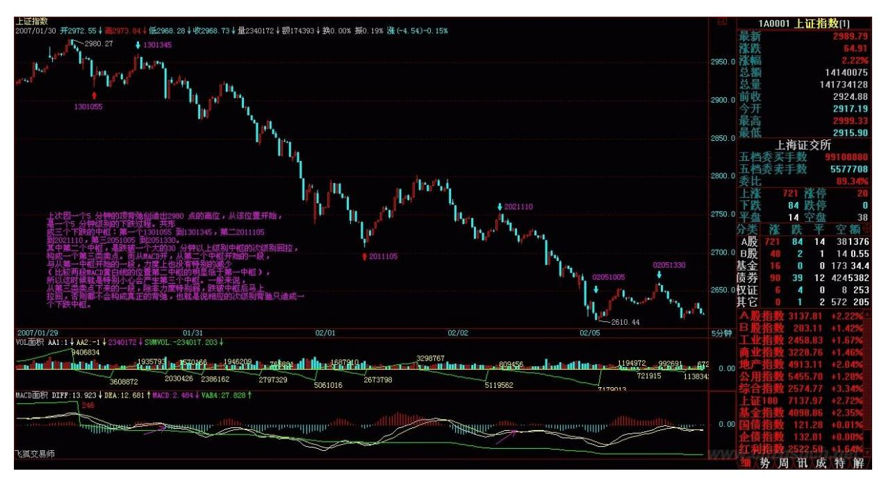

缠师:B 段低点不能跌破 A 段的?中枢的定义里可没有这个要求。

请把 29 课的第二种情况:该级别更大级别的盘整、好好看看。

219 220 53. 网友[匿名] momo: 600028 的周、月线都不是老师说的 值得弄的股票,但是日线以下级别的就还可以,那是不是也要放弃参 与?2007-02-26 16:53:12缠师:如果你资金量不大,又能短线操作, 那看 30 分钟的买点就足够了。当然,最好日线不能在背弛段里。

#### \*\*\*\*\*\*\*\*\*\*\*\*\*\*\*\*\*\*\*\*。

54. 网友 [匿名] 潜水员: 很多人都在潜水学习,不敢浮出水面(害 怕学艺不精)。大家都在发奋学习,我也是!2007-02-2616:54:56缠 师:学习不怕犯错误的,这样实战才少犯。

#### \*\*\*\*\*\*\*\*\*\*\*\*\*\*\*\*\*\*\*\*。

55. 网友 [匿名] 风冷清秋: 缠姐,山东人走得好弱啊。 200702-26 16:00:15缠师:那股票一早就说了,里面有四伙人,本 ID 最近都在

忙其他的,暂时没时间和他们折腾,一个个来,本 ID 可没 14 只 手。

#### \*\*\*\*\*\*\*\*\*\*\*\*\*\*\*\*\*\*\*\*。

56. 网友[匿名] 笨笨: 楼主,很惭愧啊。原来的 600036 套在里 面,上次按你的理论很努力在弄短差,好不容易搬平, 今天又挂了。 能不能指点一下。万分感谢! 2007-02-26 17:01:35缠师:首先,你 买的位置就不对,以后千万别追高买股票。其次,要耐心,该股票中 线问题不大,就当一个学习的品种,中信快上来了,会动起来的 。

#### \*\*\*\*\*\*\*\*\*\*\*\*\*\*\*\*\*\*\*\*。

221 57. 网友 [匿名] 勇敢的心: "35 那个是前面走势类型的中 枢,同一个走势类型的中枢,和下跌+盘整里盘整的中枢,要搞清楚区 别。" (此处引用缠师的话)1055 连短期均线都没站上,能否算 a 段?学生还是不明白。笨。请多指点。 2007-02-26 17:05:50缠师: 这个与均线没什么关系。关键是次级别,把原来的走势类型给完结 了。如何完结,请看第 29 课。

\*\*\*\*\*\*\*\*\*\*\*\*\*\*\*\*\*\*\*\*58. 网友 [匿名] 无敌槟榔: 根据 LZ 文章内 容,今日重仓建了66,为本地与低价概念,但介入位置不是很理想, 未能在上午10:00 动手,结果跑了一段路才上车。这是第二次利用 LZ 理论,来进行操作了。上次是试手,这次把我小本买卖集中干 66。主 要练习做短差,将本金分成 5 份,4 份买货,1 份做预备队。买货的 半量为短差最大范围,一直操作到 LZ 说的大级别卖点清仓。改变以 前以盈亏百分比判断清仓的方式。

有以下问题请 LZ 指点:(1)短差最理想的目的是将成本下 1/3还是 1/2,剔除价格大幅上升,例如缓升,每天震幅在 5%右,时间为 1 个 月,不计其他因素,本人倾向前者。(2)以 2 个月为判断点,买卖 系统是以日线加 60,还是 60 加 30 为妥?谢谢! 200702-26 17:05:50缠师:买的位置确实不好,就算是 10 点买,也只是一个小 级别的第三类买点。不过,资金不大,纯练习也可以了。短差,是按 图操作,不要设定目标,不要给自己一个框。如果你资金很小,那每 天可以找一个对冲的位置。这样等于每天都有一个短差。这个一般看1 分钟的都能找到。而 5 分钟、30 分钟这些级别,能把成本降很多, 特别那些活跃的个股,震荡幅度大的,一次 30 分钟级别的操作,如

果资金不大,基本能把成本至少降 10%以上。注意,有了中枢,均线 只能当参考。

#### \*\*\*\*\*\*\*\*\*\*\*\*\*\*\*\*\*\*\*\*。

59. 网友 [匿名] 请教: 难道整个盘整走势本身就是个中枢,而不像 趋势那样,有前面的连接段和后面的背驰段? 2007-02-2617:07:26缠 师:某级别的盘整,是包含相应级别一个中枢的走势类型。盘整和中 枢不是一个概念。像中枢的延伸、扩展等都在盘整里。盘整是一个不 精确的概念,一定要用中枢的精确来精确之。

222

#### \*\*\*\*\*\*\*\*\*\*\*\*\*\*\*\*\*\*\*\*。

60. 网友 [匿名] 缠文观止: 楼主好!麻烦楼主,有时间把前面的内 容整理一下,补充完整,修正一些前后容易误会的概念。真的很难学 啊。还没有哪个技术学得这么让人费劲啊。 2007-02-2615:58:51缠 师:从中枢开始,概念都很明确的。一般人经常把中枢之前的混在后 面。注意不要这样就没问题了。有了中枢,前面那些吻啊、湿啊的东 西,就可以不看了,只能当参考。

#### \*\*\*\*\*\*\*\*\*\*\*\*\*\*\*\*\*\*\*\*。

61. 网友 [匿名] narcissus: 女神妹妹,潜水学习理论很久了,今 天冒泡出来恭贺女神妹妹新年万事胜意!并祝妹妹除奸顺利,生活美 好!有个问题请教,似乎和所学理论相悖。000922,无论 30分钟还是 日线,一直背弛,但是一直涨,百思不解。请女神妹妹方便时候一定 不吝赐教!这里先行顿首谢过! 2007-02-26 17:23:24缠师:S 阿继 电器,连日线的背弛段都没出现过,怎么会有日线的背弛?如果用 MACD 辅助,连 0 轴都没有回抽,怎么会有背弛?

#### \*\*\*\*\*\*\*\*\*\*\*\*\*\*\*\*\*\*\*\*。

62. 网友 [匿名] 楚狂人: 缠主:关于走势类型完成的问题,麻烦你 指点:某级别一个走势类型的完成是否最少含有两个以上同级别中 枢?构成中枢的 3 段次级别走势是否要含有 6 个以上的中枢?或 b 段为一个高一级别的盘整?关于走势类型何为完成?及级别分辨上的 问题始终甚多疑惑,请指点? 2007-02-26 17:31:18缠师:这类问题

应该清楚,走势类型的完成怎么会最少含有两个以上同级别中枢?盘 整难道不是走势类型?任何级别盘整,怎么完成都只能是一个相应级 别的中枢。先把最基础的概念搞清楚,否则越到后来越乱。至于趋势 如何转折的,第 29 课不已经说得很清楚了。三种情况的分类,这里 就没必要再说了。

223

#### \*\*\*\*\*\*\*\*\*\*\*\*\*\*\*\*\*\*\*\*。

63. 网友[匿名] 大盘: 春节假期对博主的炒股课程文章重新学习了 一遍,有了更深的体会,当然细节方面仍然有不少不懂的地方。

特别是对于盘整走势的判断问题,归纳起来,学习盘整走势中遇到的 疑难问题有如下几个方面:(1)盘整走势结束后发生转折的问题:盘 整走势结束后,如果接下来是上涨走势,一定有某级别离开盘整中枢 低点的下跌背驰段吗?如果是"盘整+下跌" ,又一定有离开盘整中 枢高点的上升背驰段吗?(2)盘整中枢的方向判断问题:虽然博主的 中枢定义本身并没有提到构成中枢的三段走势的起始方向判断问题, 但是博主在相关回帖当中说过。简单来说,上涨趋势中,中枢三段的 方向依次是下-上-下,下跌是上-下-上。那么,盘整当中的中枢方向 是如何确定的呢?是根据盘整走势前面的走势来判断吗?例如,对于 "下跌+盘整"走势的组合,盘整中枢方向是下-上-下三段吗?"上涨 +盘整" 走势的组合,盘整中枢方向是上-下-上吗?2007-02-26 20:19:26缠师:粗略看了一下你的问题,都是基本概念没搞清楚。回 答问题(1):盘整怎么会有背弛?盘整只能有盘整背弛。把背弛和盘 整背弛的基本概念先分清楚。回答问题(2):盘整哪里有什么方向, 只有趋势才有方向,这是最基本的概念。 中枢就是中枢,哪里有什么 盘整中枢、趋势中枢之分?盘整和趋势的区别,只在于盘整只有一个 相应级别的中枢,趋势有两个以上相应级别的中枢。

#### \*\*\*\*\*\*\*\*\*\*\*\*\*\*\*\*\*\*\*\*。

64. 网友思朴: 呵呵,你都这么牛了,怎么还在意那区区的点击率? 大盘高风险的时候请提示一下,说白了,现在赚钱很容易,但能看得 出风险的,对多数人来说,就不那么容易了。 2007-02-2621:22:27缠 师:点击代表有多少人看了,看了才有可能受益,这就是点击率唯一 的用处。至于说到风险,那是一般性的无聊思维。明白本 ID的理论,

就没有这类问题了。本 ID 的理论,只会考虑类似的问题,进入背弛 段了吗?背弛了吗?这都是具体的、可操作性的问题。风险这类虚无 飘渺的问题,本 ID没兴趣。站在所谓的风险角度,股票都是废纸,这 就是真正的风险。

224

#### \*\*\*\*\*\*\*\*\*\*\*\*\*\*\*\*\*\*\*\*。

65. 网友 [匿名] 傻子: 先谢谢白玉兰妹妹,确实卖了铜业,也没什 么后悔的,进了 600269,也在涨。主要是没学会缠理,比较着急,有 点心急如焚的感觉。我的基础太差了,不知道从何学起。星期天去书 店看看。有关均线的书,请给推荐本好书。谢谢! 200702-26 21:32:28缠师:均线什么的,那些可以没必要知道。把中枢等搞清楚 了,没均线一样可以。你如果没有受到其他炒股理论的影响,反而好 学。

#### \*\*\*\*\*\*\*\*\*\*\*\*\*\*\*\*\*\*\*\*。

66. 网友星星: 楼主在吗?有些问题想请你回复一下。谢谢!北辰实 业 30 分钟图 06-12-07 10:00 产生了背驰。按楼主的理论,此次背 驰所产生的走势至少应触及上一个中枢的最高点即 6.15 元,为什么 以后的走势至今还没有触及这一点?2007-02-26 21:32:09缠师:你看 30 分钟的 MACD,符合背弛的条件吗?网友星星:如何判断一个盘整 的开始与结束?比如说,一个上涨趋势完成后,对应的走势必然是盘 整或下跌,那么当形成一个中枢的时候,我如何判断他是一个盘整还 是一个下跌趋势的第一个中枢?是不是应该等等看?还有,趋势可以 根据背驰来判断其结束,那么盘整用什么来判断其结束?缠师:为什 么有第三类买点或卖点,把这问题想明白没有?网友星星:上涨的中 枢是下上下,下跌的中枢是上下上,那么一个盘整的中枢是什 么???缠师:怎么到现在还问这种问题?盘整的中枢和趋势的中枢 又有什么不同?中枢就是中枢,哪里有什么盘整、趋势的中枢之区别 呢?你可以说是趋势中产生的中枢,但不可以说盘整中产生的中枢, 有了中枢才可能有盘整。

网友星星:看楼主的意思,不应该预判走势的发展方向,应该等其完 成后再来判断,那是不是就是说,不可能提前判断一个上涨或下跌的 趋势?那我们为什么说这一轮牛市是一个上升趋势呢?为什么不可能

是一个盘整呢?完成一个中枢就结束,这样的话,走势必完美又有什 么意义呢?不就成典型225 的马后炮了吗?缠师:又是糊涂概念。走 势必完美和一定上涨或盘整没任何关系。

走势必完美等价于说中枢一定可以形成。先把概念搞清楚。任何级别 都不可能永远不形成中枢,这才是走势必完美的意思。

网友星星:楼主可否将大盘自 05 年 998 点见底后的日线中枢给指一 下。谢谢!缠师:以前文章都有。

网友星星:楼主讲了这么多理论,仔细学习后发现从理论上还可以理 解一点,但现在发现最大的问题是,无法准确的判断中枢,这可要了 命了。希望楼主能开一讲,专门讲一下判断中枢的方法。找一张图, 按步骤讲一下判断中枢的要点,比如 K 线组合什么的。谢谢!缠师: 判别中枢就是看图认字,只要符合中枢定义的就是中枢,就这么简 单,先把定义搞清楚。

#### \*\*\*\*\*\*\*\*\*\*\*\*\*\*\*\*\*\*\*\*。

67. 网友[匿名] 竹影: 拜读了楼主的文章,请教一句:沪深两市 1000 多只股票,有很多是不符合贵理论中的经典走势的。那么在选股 的时候,是不是毫不犹豫的把不符合贵理论经典走势的股票剔除。即 使基本面很好。谢谢! 2007-02-26 21:47:46缠师:没有任何一只股 票的走势不符合本 ID 理论的。如果连这点都不明白,那就是没学清 楚。先从中枢入手好好学,学明白了,看任何图都如看自己的掌纹一 样。

#### \*\*\*\*\*\*\*\*\*\*\*\*\*\*\*\*\*\*\*\*。

68. 网友 [匿名] 天山飞狐: 缠主,我这样的认识对不对?即构成中 枢的三段走势,下上下或上下上三段,在次级别图中,上下段都是依 次独立完整的一段趋势,而非盘整。所以,在次级别图上,上或下都 至少包含该级别的两个中枢。 2007-02-26 21:47:54226 缠师:先把 最基本的概念搞清楚。什么叫走势类型?盘整不是走势类型吗?发现 很多人连最基本的概念都没搞清楚。

缠师:走势类型:趋势(上涨、下跌)、盘整。中枢是最原始的,走 势必完美是针对中枢必然形成说的,任何级别都不存在永远不形成中 枢的走势,任何走势最终都必然形成某个走势类型或者他们的叠加。 任何市场的走势都必然可以分级别成相同

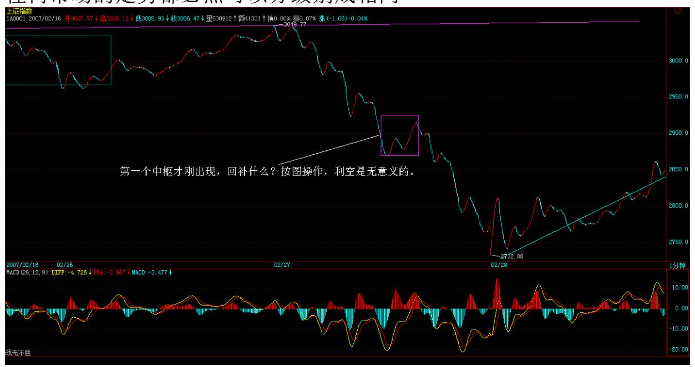

级别走势类型的叠加。趋势和盘整的唯一区别,就是包含的相应级别 中枢前者必须两个以上,而后者只能一个。这些都是最基本的概念, 如果都搞不清楚,那是没法看下去的。大家继续努力吧,本 ID的理论 是一个纯粹的数学理论,估计孔男人之类的文科生有点困难,但还是 不难的,多点努力吧。

#### \*\*\*\*\*\*\*\*\*\*\*\*\*\*\*\*\*\*\*\*。

69. 网友 [匿名] 阿甘: 老大,我也买了 000029,怎么尾市砸下来 了?缠师:000029 是什么?房地产股票,本 ID 从来不碰。

#### \*\*\*\*\*\*\*\*\*\*\*\*\*\*\*\*\*\*\*\*\*。

70. 网友 [匿名] 淡定: 楼主好!今天过得不容易啊。本来留了一半 的清醒,想高位出掉手中的货的,可一时犹豫了一下,下午又进了。 郁闷 ING! 另外,请问楼主,是否真有市场传闻的重大利空啊? 2007-02-27 15:39:25缠师:第一个中枢才刚出现,回补什么?按图操 作,利空是无意义的。

227 (前期的 1 分中枢,为递归后的笔中枢)228 71. 网友 [匿名] NOVEMBER: 缠主能帮忙看看 600690 么?下面感觉有吻的趋势,该补 仓还是斩? 2007-02-27 15:44:13缠师:不要跌了才问怎么样?背弛 肯定是出现在涨之中的,到跌的时候,卖点早过了。本 ID 反复说 过,宁愿卖早,不能卖晚。

#### \*\*\*\*\*\*\*\*\*\*\*\*\*\*\*\*\*\*\*\*。

72. 网友 [匿名] shabi: 都这样了,你还吹呢。从你写的文章来 看,你心浮气躁。你还和罗杰斯叫板。就你这心态,还炒股啊?你的 文章里有一句话说什么 4000 块也是钱啊。冲你这句话,你就没见过 什么钱,你是个变态。 2007-02-27 15:44:50缠师:4000 块难道不是 钱?在本 ID 眼里,4000 块和 4000 亿并没有任何的区别,要亏起 来,速度是一样的。一个人,如果还有大小之分别,那连庄子的境界 都没达到。

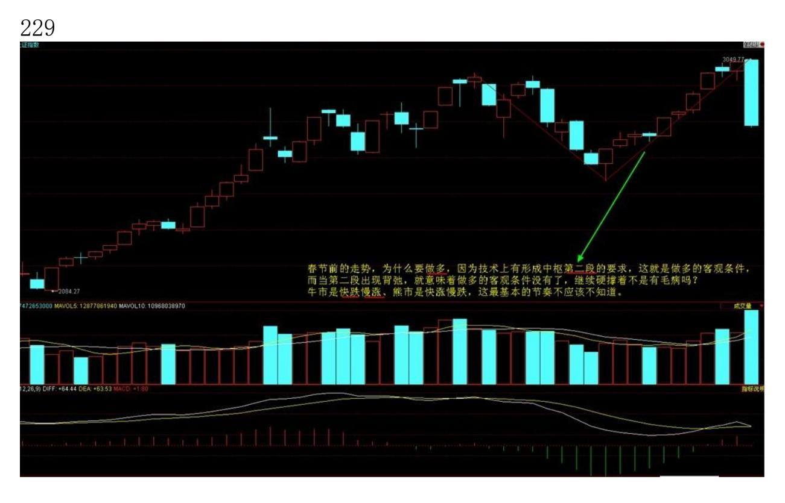
