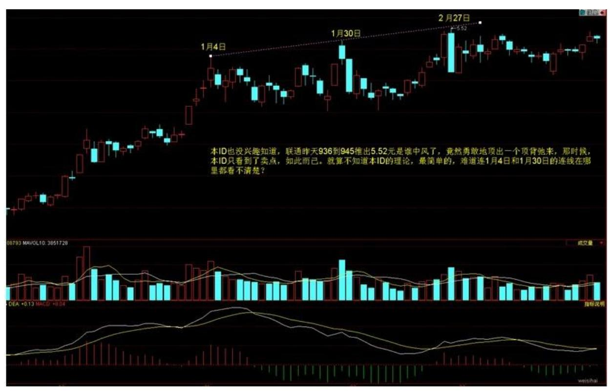
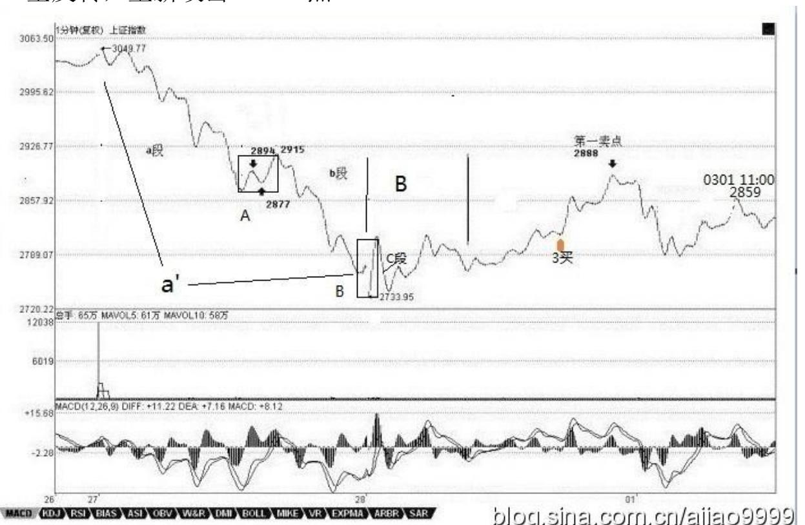
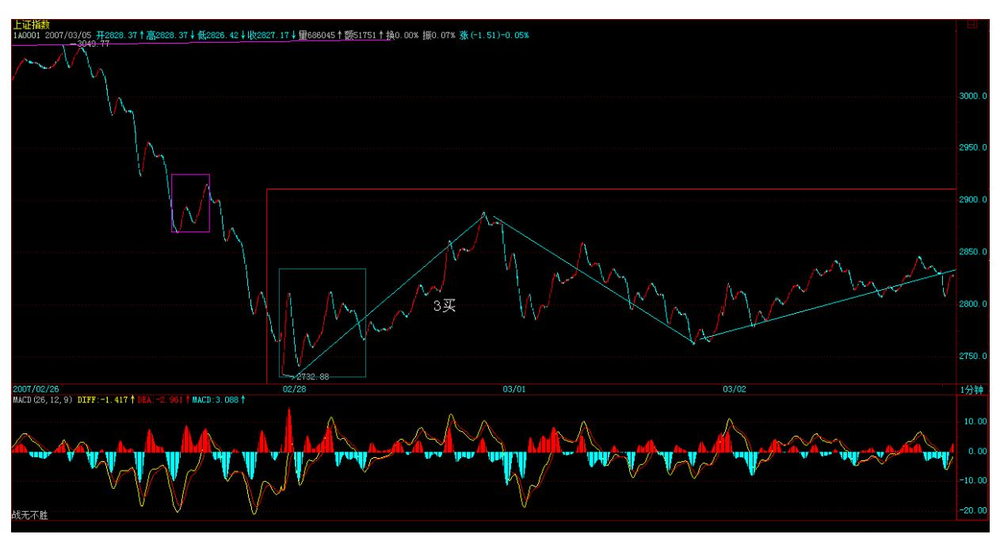
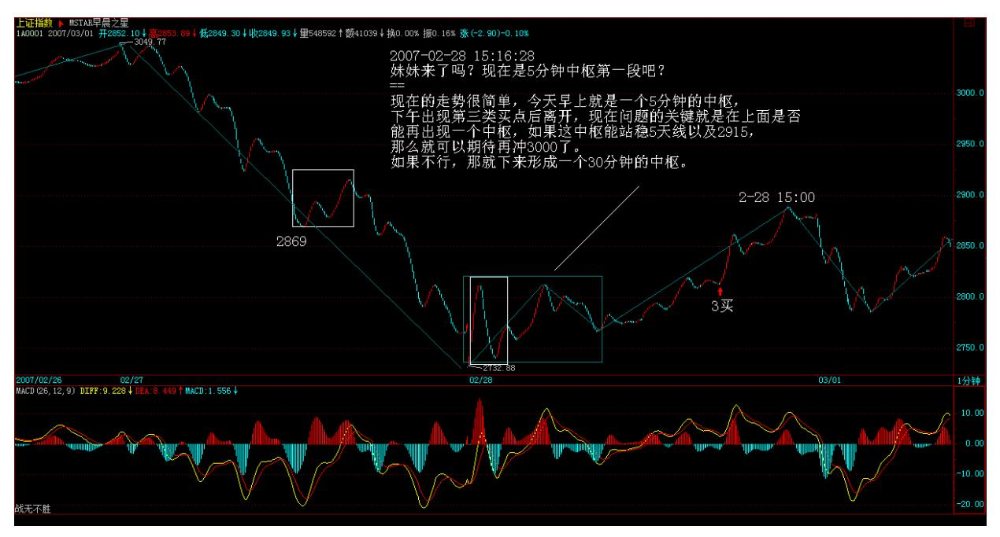
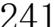
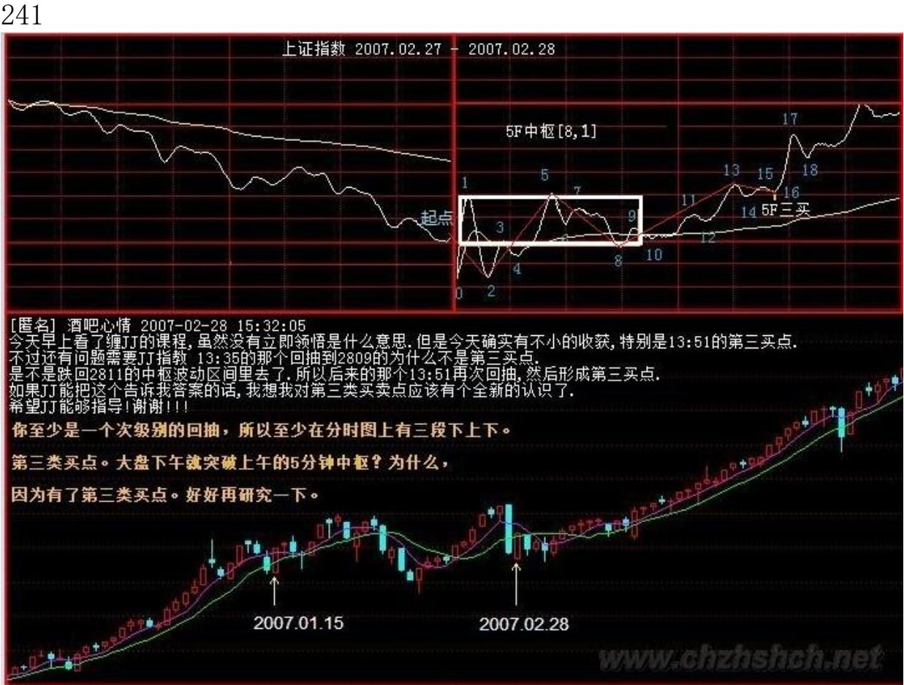
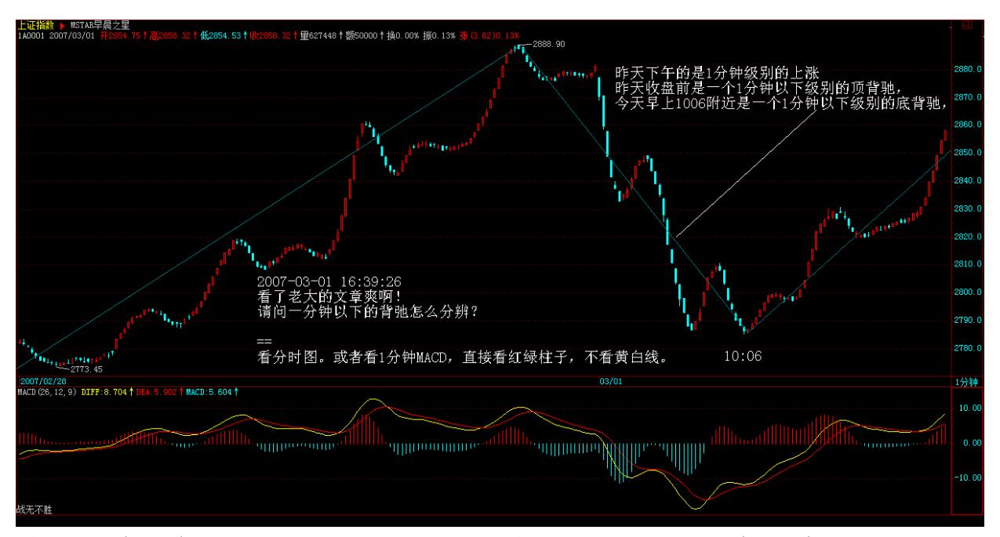
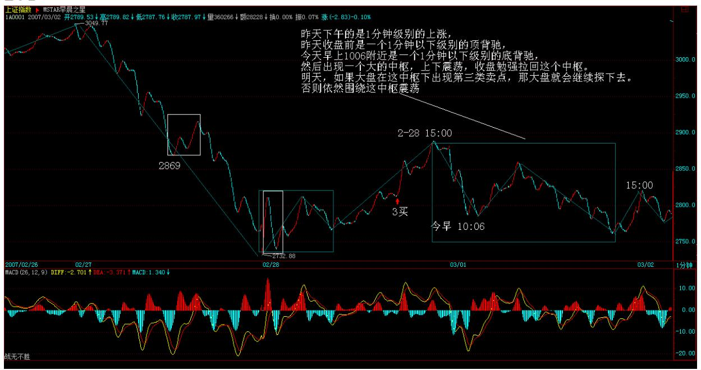

教你炒股票 32:走势的当下与投资者的思维方式

231 有一种更坏的毛病就是涨了才高兴,一跌就哭着脸。请问,光做 多,怎么把成本降为 0?股票都是废纸,光涨光做多,永远顶着一个

雷。在前面的文章已经多次强调,只有 0 成本的股票才是真正安全 的。如果死多死空思维不改变,永远都是股票的奴隶。而且,跌完以 后涨得最快的是什么?就是跌出第三类买点来的股票,看看000416 上 次的那一跌,一个完美的第三类买点,后面是一个月100%幅度的上 涨,中间还带了一周的假期。大跌,就把眼睛放大,去找会形成第三 类买点的股票,这才是股票操作真正的节奏与思维。本 ID 的理论里 没有风险的概念,风险是一个不可操作的上帝式概念,本 ID 的眼里 只有买点、卖点,只有背驰与否,这些都是有严格定义的、可操作 的,这才是让股票当你奴隶的唯一途径。

有人可能要反问本 ID,你不是说中国的地盘中国人做主吗?请问,难 道中国人做主,就只能做多的主,不能做空的主?这还算什么主?如 果你把握了本 ID 的理论,严格按买点买、卖点卖,那你就是股票的 主人。所谓汉奸,不过是希望通过他们的伎俩来把中国的血给吸走, 而如果你有本事让汉奸低卖高买,那汉奸就死定了。就像这次,去问 问联通上谁吃了哑巴亏。前面本 ID 说过,N 年前干过一个阻击,从 14 元一直阻击上 25 全出掉,也是春节前后的,算起来就 10 来个交 易日,一分钱没花,为什么?就是把某些人的节奏给搞乱了,大家应 该记得赵本山和范伟拍卖那场对话,有点类似。具体怎么样,以后和 大家说如何阻击的时候再说。不过可以告诉大家最终的结果,那股票 最终跌回 3 元多。

股票,如同跳舞,关键是节奏,节奏一错,就没法弄了。买点买、卖 点卖,就是一个最合拍的节奏,任何不符合这个节奏的,都要出乱 子。例如,你是按 30 分钟级别操作的,明明顶背驰了,你不卖,一 定要想着还要高,然后底背驰的时候忍不住了,杀出去,这样下来, 你很快就不用玩股票了,因为股票很快就玩死你。走势有其节奏,你 操作股票,如同和股票跳舞,你必须跳到心灵相通,也就是前面说 的,和那合力一致,这样才是顺势而为,才是出色的舞者。如果不明 白的,今天去跳一下舞,找一个舞伴,把他的节奏当成股票的节奏, 感应一下。

感应,是当下的,如果当下你还想着前后,那你一定跳不好舞。股票 也一样,永远只有当下的走势状态,股票的走势,没有一个必然的、 上帝式的意义,所有的意义都是当下赋予的。例如,一个 30分钟的 a+A+b+B+c 的向上走势,你不可能在 A 走出来后就说一定有 B,这样 等于是在预测,等于假设一种神秘的力量在确保 B 的必然存在,而这 是不可能的。那么,怎么知道 b 段里走还是不走?这很简单,这不需

要预测,因为 b 段是否走,不是由你的喜好决定的,而是由 b 段当 下的走势决定的。如果 b 段和 a 段相比,出现明显的背驰,那就意 味着要走,否则,就不走。而参考 b 段的 5分钟以及1 分钟图,你会 明确地感觉到这 b 段是如何生长出来的,这就构成一个当下的结构, 只要这个当下的结构没有出现任何符合区间套背驰条件的走势,那么 就一直等待着,走势自然会在 30 分钟延伸出足够的力度,使得背驰 成为不可能。这都是自然发生的,无须你去预测。

详细说,在上面例子 30 分钟的 a+A+b+B+c 里,A 是已出现的,是一 个 30 分钟的中枢,这可以用定义严格判别,没有任何含糊、预测的 地方。而 b 段一定不可以出现 30 分钟的中枢,也就是只能最多是 5 分钟级别的。如果 b 段一个 5 分钟级别的开始上涨已经使得 30 分 钟的图表中不可能出现背驰的232 情况,那么你就可以有足够的时间 去等待走势的延伸,等待他形成一个 5 分钟的中枢,一直到 5 分钟 的走势出现背驰,这样就意味着 B 要出现了,一个 30 分钟的新中枢 要出现了。是否走,这和你的资金操作有关了,如果你喜欢短线,你 可以走一点,等这个中枢的第一段出现后,回补,第二段高点看 5 分 钟或 1 分钟的背弛出去,第三段下来再回补,然后就看这个中枢能否 继续向上突破走出 c 段。注意,c 段并不是天经地义一定要有的,就 像 a 也不是天经地义一定要有的。要出现 c 段,如同要出现 b 段, 都必须有一个针对 30 分钟的第三类买点出现,这样才会有。所以, 你的操作就很简单了,每次,5 分钟的向上离开中枢后,一旦背驰, 就要出来,然后如果一个 5 分钟级别的回拉不回到中枢里,就意味着 有第三类买点,那就要回补,等待 c 段的向上。而 c 段和 b 段的操 作是一样的,是否要走,完全可以按当下的走势来判断,无须任何的 预测。不背驰,就意味着还有第三个中枢出现,如此类推。显然,上 面的操作,不需要你去预测什么,只要你能感应到走势当下的节奏, 而这种感应也没有任何的神秘,就是会按定义去看而已。

那么,30 分钟的 a+A+b+B+c 里,这里的 B 一定是 A 的级别?假设 这个问题,同样是不理解走势的当下性。当 a+A+b 时,你是不可能知 道 B 的级别的,只是,只要 b 不背驰,那 B 至少和 A 同级别,但 B 完全有可能比 A 的级别大,那这时候,就不能说a+A+b+B+c 就是某 级别的上涨了,而是 a+A+b 成为一个 à,成为à+B 的意义了。但,无 论是何种意义,在当下的操作中都没有任何困难,例如,当 B 扩展成 日线中枢,那么就要在日线图上探究其操作的意义,其后如果有 c 段,那么就用日线的标准来看其背驰,这一切都是当下的。至于中枢 的扩展,其程序都有严格的定义,按照定义操作就行了,在中枢里,

是最容易打短差降成本的,关键利用好各种次级别的背驰或盘整背驰 就可以了。

所以,一切的预测都是没意义的,当下的感应和反应才是最重要的。 你必须随时读懂市场的信号,这是应用本 ID 理论最基础也是最根本 的一点。如果你连市场的信号、节奏都读不动,其他一切都是无意义 的。但,还有一点很重要,就是你读懂了市场,但却不按信号操作, 那这就是思维的问题了,老有着侥幸心理,这样也是无意义的。按照 区间套的原则,一直可以追究到盘口的信息里,如果在一个符合区间 套原则的背驰中发现盘口的异动,那么,你就能在最精确的转折点操 作成功。本 ID 的理论不废一法,盘口工夫同样可以结合到本理论中 来,但关键是在恰当的地方,并不是任何的盘口异动都是有意义的。 本 ID 的理论由于是从市场的根子上考察市场,所以把握了,你就可 以结合各种理论,什么基本面、政策面、资金面、庄家等等因数,这 些因数如何起作用、有效与否,都在这市场的基本走势框架上反应出 来。

由于市场是当下的,那么,投资者具有的思维也应该是当下的,而任 何习惯于幻想的,都是把幻想当成当下而掩盖了对当下真实走势的感 应。这市场,关键的是操作,而不是吹嘘、预测。有人可能要反问, 怎么这里也经常说些类似预测、吹嘘的话,例如前两天本 ID说让汉奸 砸盘联通。请问,汉奸可能有几十亿股的联通吗?汉奸砸盘本 ID 就 要接?本 ID 为什么不可以先砸?为什么一定要在顶背弛接砸盘?本 ID 又没毛病,汉奸如果有爱好,最好在底背弛的时候砸盘,本 ID 一 定欢迎。而对于本 ID 来说,如果有些话能当百万兵,本 ID 凭什么 不说?本 ID 也没兴趣知道,联通昨天 936 到945 推出5.52 元是谁 中风了,竟然勇敢地顶出一个顶背弛来,那时候,本 ID 只看到了卖 点,如此而已。就算不知道本 ID 的理论,最简单的,难道连 1 月 4 日

233 和 1 月 30 日的连线在哪里都看不清楚。

234 所有非汉奸、非奸细的各位请注意了,这里奸细少不了,如果你 把这里当成一个纯粹的课堂,那就太小看这里了。但,有一点是无疑 的,就是一旦你掌握本 ID 的理论,你根本无须听任何话,无论谁的 话,任何话都是废话,走势永远第一。牛顿不能违反万有引力,本 ID 也不能违反本 ID 的理论,这才是最关键的地方。而只有这样,才有 可能有一个正确的思维基础。你无须尊重本 ID,甚至,你学会本 ID 的理论,还可以专门和本 ID 作对,企图在市场上挣本 ID 的钱,但 你必须尊重本 ID 的理论,就像你必须尊重万有引力一样,否则市场 的走势每分每秒都会给你足够的教训。

\*\*\*\*\*\*\*\*\*\*\*\*\*\*\*\*\*\*\*\*。

解盘及互动问答:

\*\*\*\*\*\*\*\*\*\*\*\*\*\*\*\*\*\*\*\*。

缠师:今天之所以如此早就发课程,就是让各位现场学习。看看 a+A+b+B+c 是如何变成 à+B,如果早上不敢回补,那么 1351 的第三 类买点,怎么都应该回补了。而且个股与大盘的节奏不同,这两天深

圳低价本地股表现怎样,今天哪个板块先涨停的,除非你的眼睛有毛 病,大概都应该能看明白了。如果今早没看到课程的,那么就好好对 照这两天的 1 分钟图研究一下。如果把本课程吃透,那你的水平可以 上初二了。大盘后面的走势很简单,就是2915,昨天一分种中枢的高 点。如果看不懂的,就看 5 日线。上不去,那就要二次探底,否则就 V 型反转,重新攻击 3000 点。2007-02-2815:15:26

235 236 至于个股方面,没什么可说的,今天的课程里专门让大家去 找第三类买点的:"大跌,就把眼睛放大,去找会形成第三类买点的 股票,这才是股票操作真正的节奏与思维。"不仅是思维本身,心态 如何调整,有了这次现场直播,大家对这节奏,不知道有没有感觉。 今天一早看课程又能理解的,有福了。 网友[匿名]A:第二个1 分钟 中枢形成,就看后面是否背驰了。2007-02-28 09:53:25 网友[匿 名]B:不一定,你仔细研究一下妹妹今天举的两个例子。我觉得,大 盘还存在一种可能,就是形成妹妹文章里说的 à+B,然后突破 B 直接 上去。现在应该按 à+B 来看了。2007-02-28 10:24:40缠师:至于个 股方面,没什么可说的,今天的课程里专门让大家去找第三类买点 的:"大跌,就把眼睛放大,去找会形成第三类买点的股票,这才是 股票操作真正的节奏与思维。"不仅是思维本身,心态如何调整,有 了这次现场直播,大家对这节奏,不知道有没有感觉。今天一早看课

程又能理解的,有福了。 缠师表扬高徒(网友):表扬一下 CCTV, 为了这几句话:网友[匿名] 老新手:第二个 1 分钟中枢形成,就看 后面是否背驰了。2007-02-28 09:53:25网友[匿名]CCTV:不一定,你 仔细研究一下妹妹今天举的两个例子。我觉得,大盘还存在一种可 能,就是形成妹妹文章里说的à+B,然后突破 B 直接上去。现在应该 按 à+B 来看了。2007-02-2810:24:40237 汉奸,本 ID 就把你们像面 首一样玩弄(2007-03-01 15:42:20)百团大战以后是什么,熟悉中国历 史的没有不知道的,除非他是汉奸或鬼佬并且脑子进满了水。显然, 中国的金融市场的很重要部分,被汉奸与鬼佬把持着,这一点已多次 指出。不承认这一点,不是别有用心就是瞎了眼。用最简单的板块 论,例如金融板块显然就是汉奸与鬼佬围剿的重灾区。特别,由于金 融股多数都同时在其他市场上交易,因此更容易成为他们企图控制中 国金融市场的利器。

有些幼稚的人,例如一个叫什么水皮的,昨天还傻忽忽地说,谁谁谁 发表什么文章,就要涨了。中国最可怕的不是汉奸,而是那些弱智的 所谓爱国者,喊两句口号就等于爱国,这爱国也太没技术含量了。喊 口号是赶不走日本人的,同样杀不死汉奸和鬼佬。在金融市场中哪里 有什么和谐,那是血和肉!别老大不小的还装天真!本 ID 承认,本 ID 现在所能集合的力量,还不足以和汉奸与鬼佬进行全方位大集团的 会战,这都是前期保守的金融政策所导致的!那种希望杀光大鳄的政 策,只是为外国大鳄的入侵制造良好的环境。没有 2000 年前后可笑 的金融政策,没有某些人中了海龟的迷幻。中国民间的力量也足以和 外国鬼子在最大层面上进行会战了。

这就像百团大战一样,一个中级规模的阻击就会引发后面残酷的围 剿。但历史却是这样发展的,所谓的围剿并没有达到任何目的,日本 人最终还是滚出去了。确实,汉奸们可以不断打压金融股来控制走 势,就像日本人占据着大中小城市。但二、三线股有着广阔的纵深空 间,这就是本 ID 们的地盘,没汉奸、鬼佬们什么事情。

在大跌前一天,本 ID 说了深圳本地低价股,大跌又有什么影响?不 照样连续涨停?同时还强调了农业、环保的股票,怎么样大家都有眼 睛看。注意,各位没必要一定要看本 ID 所说那 14 只股票里的农 业、环保,只要是这个板块,只要是低价,走势有买点出现的都没问 题。环保其实还包括新能源。

本 ID 最近的口号就是,对 5 元上下的三线股发动最残酷的攻击,汉 奸、鬼佬最好把工行砸回 4 元,把人寿砸回 20 元,那时候自然去接 管你们,让你们永远滚出中国。游击战,把汉奸和鬼佬像面首一样玩 弄。

238 N 年前,本 ID 已经到处呼吁,中国人的盘子要中国人控着,现 在还不是最可怕的情况,毕竟,大的国有股还抓在手里,但如果还不 警惕,汉奸自然有办法把那些都蒙掉。温先生的文章不是说要金融安 全吗?盘子控在汉奸与鬼佬手里,是没有安全可言的,这就是最简单 的道理。

今天的盘子没什么可说的,上不了 5 日线就要二次探底,就这么简 单。现在就看这在 2800 附近的 30 分钟中枢如何演化的,这是最近 的一个唯一的主题。

239 240 缠师:市场的任何走势都是最好的免费训练,纸上谈兵没用 的,关键是实际操作,心手合一才可以,否则就是浪费时间。市场只 认识走势本身,其他一切都是多余的,不经过一番修炼,是不能成器 的。各位好自为之吧。今天早点把文章贴出来,也希望各位在大的震 荡中,能有一个顿悟。这样,就真的对得起这震荡与本 ID的文章了。 2007-02-28 08:50:44

1. 网友[匿名] CCTV:第二个 1 分钟中枢形成,就看后面是否背驰 了。 2007-02-28 08:50:44网友[匿名] 老新手:不一定,你仔细研究 一下妹妹今天举的两个例子。2007-02-28 10:24:40网友[匿名] CCTV:我觉得,大盘还存在一种可能,就是形成妹妹文章里说的 à+B,然后突破 B 直接上去。现在应该按 à+B 来看了。

2007-02-28 10:20:59(以上是网友之间的对话)

#### \*\*\*\*\*\*\*\*\*\*\*\*\*\*\*\*\*\*\*\*。

2. 网友 [匿名] 水房姑娘: 缠M,现在开始炒垃圾股了,是否行情 到第三波了?要玩完了? 2007-02-28 15:21:18缠师:就算是第三 波,也是第一大波的第三波。这轮牛市,走个 10年 8 年有什么奇怪 的?上一次牛市,一共走了 13、14 年。

#### \*\*\*\*\*\*\*\*\*\*\*\*\*\*\*\*\*\*\*\*。

3. 网友 [匿名] 小鸟: 妹妹来了吗?现在是 5 分钟中枢第一段吧? 2007-02-28 15:16:28缠师:现在的走势很简单。今天早上就是一个 5 分钟的中枢,下午出现第三类买点后离开。现在问题的关键,就是在 上面是否能再出现一个中枢。如果这中枢能站稳 5 天线以及 2915 点,那么就可以期待再冲 3000 了。如果不行,那就下来形成一个 30 分钟的中枢。

242 4. 网友[匿名] 酒吧心情 :今天早上看了缠 JJ 的课程,虽然没 有立即领悟是什么意思。但是,今天确实有不小的收获,特别是1351

的第三买点。不过,还有问题需要向 JJ 请教:上证指数1335 点的那 个回抽,到 2809 点,为什么不是第三买点?是不是跌回 2811 点的 中枢波动区间里去了?所以,后来的那个 1351 再次回抽,然后形成 第三买点?如果 JJ 能告诉我这个问题的答案的话,我想我对第三类 买卖点应该有个全新的认识了。希望 JJ 能够给予指导。谢谢! 2007-02-28 15:32:05缠师:你至少是一个次级别的回抽,所以至少在 分时图上有三段下上下。

243 244 5. 网友 [匿名] 满目山河: 缠妹妹真是出其不意啊。哪知 道这么早就出新东东了啊。刚来,才看到。缠妹妹教我们是不是有点 着急啊?我倒是希望早点看到全部课程。期待中。2007-02- 2815:32:45缠师:这种现场版本,现场看,印象深。事后看,即使不 管那些说闲话的,对大家的理解也不太好。今天没看到的,只能看已 经形成的图形去想象那种现场气氛了。

#### \*\*\*\*\*\*\*\*\*\*\*\*\*\*\*\*\*\*\*\*。

6. 网友 [匿名] 快: 现在应该说,第一个 5 分钟中枢快完成了吧? 2007-02-28 15:35:27缠师:你还没理解今天的课程。早上已经形成, 而下午出现第三类买点,那就确认结束了。

#### \*\*\*\*\*\*\*\*\*\*\*\*\*\*\*\*\*\*\*\*。

7. 网友[匿名] 小鸟: 再一次体会:不做预测,只看当下!这和我事 先估计的情况完全不一样。2007-02-28 15:37:06缠师:预测其实也是 可以的。但你要把所有可能的情况都列清楚。

像本 ID 现场直播的今天走势,你没想到,所以就漏掉了。其实,所 有的情况,基本就是你预测的那种以及今天直播的这种。把这些情况 弄清楚,就可以上初二了。继续努力吧。

#### \*\*\*\*\*\*\*\*\*\*\*\*\*\*\*\*\*\*\*\*。

8. 网友 [匿名] 小鸟: 要看明天是否形成第二个 5 分钟中枢并且是 否站稳,是吗?2007-02-28 15:42:27缠师:如果你技术可以,就可以 利用中枢的震荡弄点对冲。例如 5日线冲不破,先出来。跌回来,不 出现单边下跌的情况,能形成中枢的,再补回来。当然,这要看具体 的个股,有些股票走得强,已经出现上涨走势,那直接看个股的背驰 就可以。技术不行的,就操作少点。先研究清楚了。

#### \*\*\*\*\*\*\*\*\*\*\*\*\*\*\*\*\*\*\*\*。

9. 网友 [匿名] 惊鸿一慕: 谢谢缠姐姐的理论。昨天在 26.67 元把 600888 卖了,进入日线背驰段立即清仓!今天下午在 23.60 元又全 部补回来了,赚了 13%,真爽!缠姐姐,今天 600888 的低位买点形 成了第三类买点,我的理解正确嘛?谢谢! 2007-02-2815:44:33缠 师:这只能算依然在中枢里的震荡。这个中枢级别很大,一旦往上突 破,空间不小。短线就看什么时候突破了。确认以一个至少是日线上 的第三类买点为标准。可以参考一下 600432 在 22 元那次回抽,不 过那个中枢没这个大,突破起来就比较轻松。

#### \*\*\*\*\*\*\*\*\*\*\*\*\*\*\*\*\*\*\*\*。

10. 网友 [匿名] 瞎鼓捣: 假如在 30 分钟的买点进入的,是不是要 等 30 分钟背弛才出,有没有不等到 30 分钟背弛就发生转折的,如 果有这种情况该怎么操作?2007-02-28 15:52:33缠师:你还没理解本 课程。如果是 a+A+b+B+c,那自然就是 30 分钟背驰。如果演化成 à+B,那可能就是一个最低级别的背驰引发一个 B,然后跌破或升破 B,这就不一定要等什么 30 分钟的背驰了。因为这时候的 B 已经是 日线级别以上的,就要按这个大的中枢来判断了。好好理解一下,这 是两种不同的情况。后面还有课程详细分析的,不过可以先自己思考 一下。

#### \*\*\*\*\*\*\*\*\*\*\*\*\*\*\*\*\*\*\*\*。

11. 网友 [匿名] 也许认识你: 加一个问题。第 3 类买点出来后, 上涨一段,然后直接就下跌了,跌到前面的那个中枢,这种情况应该 怎么处理?缠师:上涨一段如果出现背驰,那你早出了,等不到下跌 的时候。

如果不出现背驰,就至少会形成一个新的中枢在上面,更不存在任何 问题了。

#### \*\*\*\*\*\*\*\*\*\*\*\*\*\*\*\*\*\*\*。

12. 网友 [匿名] 后知后觉: 承蒙禅主关照,今天的第三类买点看到 了,也把握到了。也在群里跟同学说了。只是买的股票还没起来。

2007-02-28246 缠师:你要根据本股票自身的走势,大盘的只能是参 考。一般来说,只要大盘不是单边下跌,那二、三线个股受大盘的影 响,不会太大。

#### \*\*\*\*\*\*\*\*\*\*\*\*\*\*\*\*\*\*\*\*。

- 13. 网友 [匿名] 箭梦弦歌: 在 à+B 形成过程中,我唯一的依据是 盘整的回抽越来越高,所以认为可能不能跌破本中枢,直到第三类买 点形成,才最终确认 a+B 形成了。我的这个想法对吗?缠mm,盼回 答。2007-02-28 15:56:25缠师:B 中的走势,也有次级别的。一样可 以用背驰之类的方法决定买卖点。盘整其实可以很简单处理,就是按 次级别来看就行了。
- 一段段分解操作。当然,有些特别小级别的,就没必要操作了。

#### \*\*\*\*\*\*\*\*\*\*\*\*\*\*\*\*\*\*\*\*。

14. 网友 [匿名] 大盘: 请问博主,为什么不可以认为上海指数 1月 以来,到目前都还是在 1 月形成的日线中枢里震荡延伸行情呢?不是 每次 30 分钟上升后又 30 分钟回抽到中枢里吗?日线中枢的扩展, 不是要前后两个不重叠的日线中枢的震荡,高低点有瞬间重合才算 吗?我怎么觉得,好多股票,目前都是第一个日线中枢延伸呢?中枢 延伸的低点,和发生转折是根据什么来判断?也是根据延伸段内,次 级别的背驰来判断吗?对这些问题,还比较迷惑。

2007-02-28 16:01:36缠师:延伸不能超过 9 个次级别,否则就变成 更大级别的了。这根据定义很容易理解。例如,9 个 30 分钟的延 伸,每三个又构成日线级别,三个日线级别自然就是周线级别。你可 以数数,现在究竟有多少个了,已经足够形成周线中枢了。注意,如 果股价是一条直线,没波动的,那不能这样加。例如,直接封涨停 的,就只能算最多 1 分钟级别的。因为要构成大级别的,首先要有波 动。没波动就不存在扩展、延伸的问题。

#### \*\*\*\*\*\*\*\*\*\*\*\*\*\*\*\*\*\*\*。

15. 网友总书记: 博主,走出 A,就一定能有 b 吗?如果在 A 里面 就发生反转呢?首先,走出 b 的条件是什么?如果 A 就形成一个日 线的中枢呢? 还有,现在大盘是不是在一个五分钟的 A 内?那前面 的 a 也就只有一个中枢了?博主,前面我的很多问题,你都没有回

答。今天请你一定要回答啊。多谢了啊!2007-02-2816:03:47247 缠 师:上面不是已经反复说了?第三类买点。大盘下午就突破上午的 5 分钟中枢?为什么,因为有了第三类买点。好好再研究一下。

#### \*\*\*\*\*\*\*\*\*\*\*\*\*\*\*\*\*\*\*。

16. 网友 [匿名] 大盘: 请问博主,关于中枢扩展。例如,第 2个 5 分钟中枢出现顶部背驰,随后的下跌扩展成 30 分钟的中枢。

如果随后的下跌特别厉害,不仅跌破第一个 5 分钟的中枢高高点(或 者震荡的高高点),而且跌破前面已经有的一个日线中枢的高高点 (或者震荡的高高点),是不是这种情况,日线中枢就直接扩展成周 线中枢了呢?还是仍然算是日线中枢的延伸呢?2007-02-2816:10:38 缠师:5 分钟的背驰是否要走,你要根据当时 30 分钟、日线的情况 来看。如果大级别在主升段,就算走了也要买回来。如果符合区间套 的情况,那就不能随便买回来了。所以根本不存在跌回来怎么办的问 题。因为那时候,你需要考虑的是买不买,而不是卖不卖。

别把节奏搞错了。

#### \*\*\*\*\*\*\*\*\*\*\*\*\*\*\*\*\*\*\*。

17. 网友 [匿名] 三藏: 老大,你今天说的大盘后面的走势很简单, 就是 2915 点,昨天一分种中枢的高点。如果看不懂的,就看5 日 线。上不去,那就要二次探底。这段话的原理是什么啊?为什么没站 住 ZG 就会再次下跌呢?就是这探底的原理我不知道。老大麻烦解释 一下。谢谢!2007-02-28 16:19:04缠师:每个中枢的 GG、DD 都是最 重要的位置之一,都会产生阻力或支持,原理以后课程再说了。先 下,再见。

#### \*\*\*\*\*\*\*\*\*\*\*\*\*\*\*\*\*\*\*\*。

18. 网友[匿名] 淡定: 楼主好啊!今天郁闷了一天。我昨天偏偏进 了汉奸围剿的重灾区了呢。大盘大跌的那天还进了 000001。现在该如 何是好啊?缠师:元旦以后,一直就不让碰这类股票。都在说二、三 线股里,找有买点的来买。如果买了,只能等着了。最晚下半年会起 来的。

248 19. 网友 [匿名] 努力学习: 先顶再看。000938 今天震荡幅度 到了 9%。可惜高位没走。2007-03-01 15:46:34缠师:有卖点就要 出,别整天事后才后悔,这样永远学不好的。

#### \*\*\*\*\*\*\*\*\*\*\*\*\*\*\*\*\*\*。

20. 网友 [匿名] 人寿: 缠妹妹对人寿这么痛恨?打到 20 元,我可 就惨了。平安今天上市好像定价比较低,后市妹妹怎么看?2007-03- 01 16:04:29网友代缠师回答:人寿现在是空方主控着,而且最重要的 是,战略投资还有一大批,要等这些因数完了才能大起。不过中线问 题不大,就拿着,找机会在下面补点就解套挣钱了。

#### \*\*\*\*\*\*\*\*\*\*\*\*\*\*\*\*\*\*\*。

21. 网友 [匿名] i3618: 请教博主,是否在30分钟下出现第三类 卖点,就要继续向下呢?理论上有可能出现第三类买点吗?2007-03- 01 15:55:00缠师:第三类买点是在中枢上面出现的。震荡的处理很简 单,就是看次级别的背驰弄对冲。当然,最好就是找有大级别第三类 买点的强势股票,这样,大盘只要不一天内大幅下跌,一般都很安 全。

#### \*\*\*\*\*\*\*\*\*\*\*\*\*\*\*\*\*\*。

22. 网友 [匿名] 后知后觉: 禅主,虽然有人问过了。我还想问一 下:今天上市的平安保险,您怎么看? 当然不是技术上事。希望您给 予指点。

缠师:其实明白了本 ID 前面的课程,这都很简单。现在 48 元附近 有一个小中枢,能否上去形成一个大中枢,就是能否短线走强的关 键。没出现这个之前,基本不用关注。等在下面形成中枢后,如果是 短线的,就找一个短线底背驰介入。从中线看,这个位置套不住人。

#### \*\*\*\*\*\*\*\*\*\*\*\*\*\*\*\*\*\*\*。

249 23. 网友【匿名】yh:缠姐,我又有问题了。对于 a'+B,既然此 a'已非彼 a,此 B 也非彼 B。为何不跳高一个级别直接看成a+A 呢? 这样理解对吗?网友代缠师回答:此时的 B 还不知是什么级别的。可 以是彼 B,也可以扩展成非彼 B 的高一级别的 A。把 a'看成高一级

别的 a 可以。还没有高一级别的 A 时,彼 B 暂不能看成高一级别的 A。

网友【匿名】yh:谢谢你的回答。不过我所说的是在 a+A+b+B+c 已经 确定失效的情况下。就像昨天的上海大盘,在出现 1 分钟第 3类买点 时。这时我们虽然不能判定未来的走势,但是可以对 a'+B有所预期。 其实,我所提的只是个纯概念的问题。就是为什么要定义成 a'+B,而 不定义成高级别的 a+A?这样通用性不是更好吗?缠师:确实,写成 à+À是最好的。不过,关键是要明白意思。

#### \*\*\*\*\*\*\*\*\*\*\*\*\*\*\*\*\*\*\*。

24. 网友 [匿名] 兰兰: 缠姐好!精确的定义我都看了,还有一些不 明之处,请姐姐指点。从前一两天的大盘走势来看,分时图和 1分钟 图差不多,下跌第一个 1 分钟中枢可以认为是 5 分钟中枢吗?第 2 个是 5 分钟中枢也是 1 分钟中枢吗?分时图没有 MACD看背驰,是看 成交量吗?姐姐的博客人气已经很旺了。特别是姐姐回答问题的时 候。我经常刷不出画面。翻页也快,都插不上几句话。2007-03-01 16:31:25缠师:不能。5 分钟的中枢必须有三个 1 分钟级别走势类型 的重合。而 1 分钟的走势类型,怎么都至少有一个 1 分钟的中枢。 如果你把 1 分钟当成最低级别的,那至少要有三根 K 线重合。有些 连续的拉抬,直上直下的,就没有 K 线重合,所以不能看成是中枢。 MACD 是 MACD,和成交量没什么关系。

#### \*\*\*\*\*\*\*\*\*\*\*\*\*\*\*\*\*\*\*\*。

25. 网友[匿名] dliss: 我觉得,对于新手来说,最好不要做超短 线。还是多看看日 K 线图,先找感觉。各种各样的图形形态了然于胸 才可以。缠mm,我说得对吗? 2007-03-01 16:34:04缠师:对。太短 的,反应慢的就错过了。很难把握。最短也要 5 分钟以上级别的,最 好是 30 分钟以上的。

250

#### \*\*\*\*\*\*\*\*\*\*\*\*\*\*\*\*\*\*\*。

26. 网友步点:大跌真可怕。今天辛辛苦苦去抄底,补回前几天卖出 的 PP(票票)们,不料收盘还是整体跌了 1%。剩下的银子,等到 2600 点补。2007-03-01

缠师:昨天怎么不补?而且不是随便补的,最好是补有日线第三类买 点的。

#### \*\*\*\*\*\*\*\*\*\*\*\*\*\*\*\*\*\*\*\*。

27. 网友 [匿名] 瞎鼓捣: 看了老大的文章爽啊!请问一分钟以下的 背弛怎么分辨? 2007-03-01 16:39:26缠师:看分时图。或者看 1 分 钟 MACD,直接看红绿柱子,不看黄白线。

252 28. 网友 [匿名] 小鸟: 妹妹,我觉得今天大盘 1 分钟怎么和 昨天是一样的,只是级别更低,下跌时 a+A+b+B+c 因为 b 背驰了, 所以转化为 a~+B。请问是这样的吗?2007-03-01 15:54:33网友代缠 师回答:昨天下午的是 1 分钟级别的上涨,昨天收盘前是一个 1 分 钟以下级别的顶背驰。今天早上 10:06 附近,是一个 1分钟以下级 别的底背驰。然后出现一个大的中枢,上下震荡。收盘勉强拉回这个 中枢。明天,如果大盘在这中枢下,出现第三类卖点,那大盘就会继 续探下去。否则依然围绕这中枢震荡。
