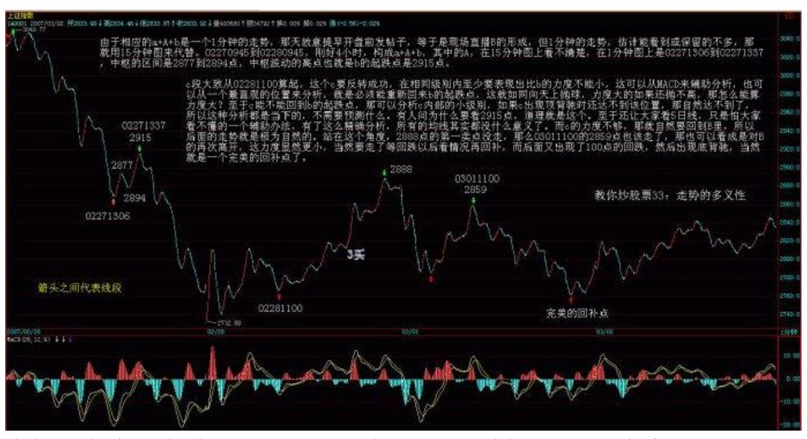
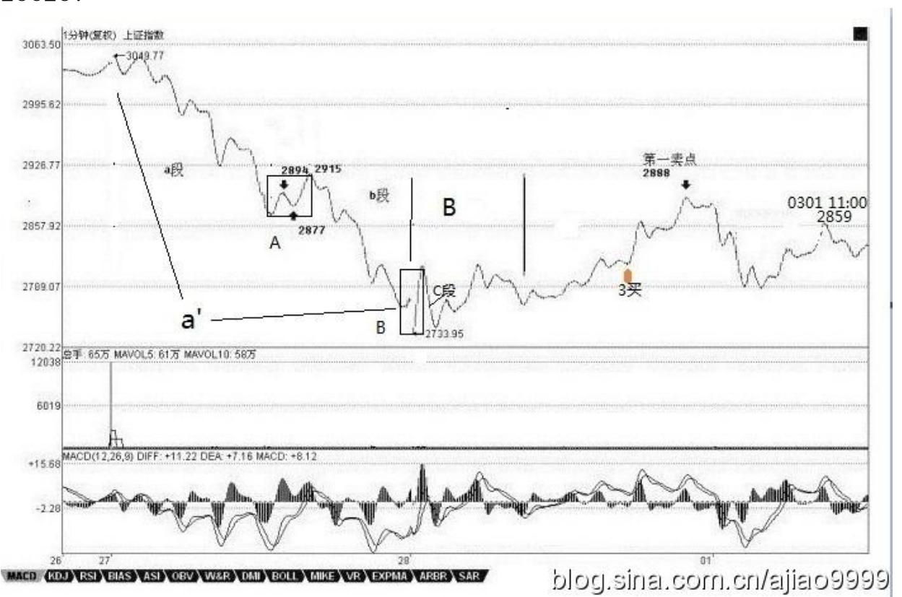
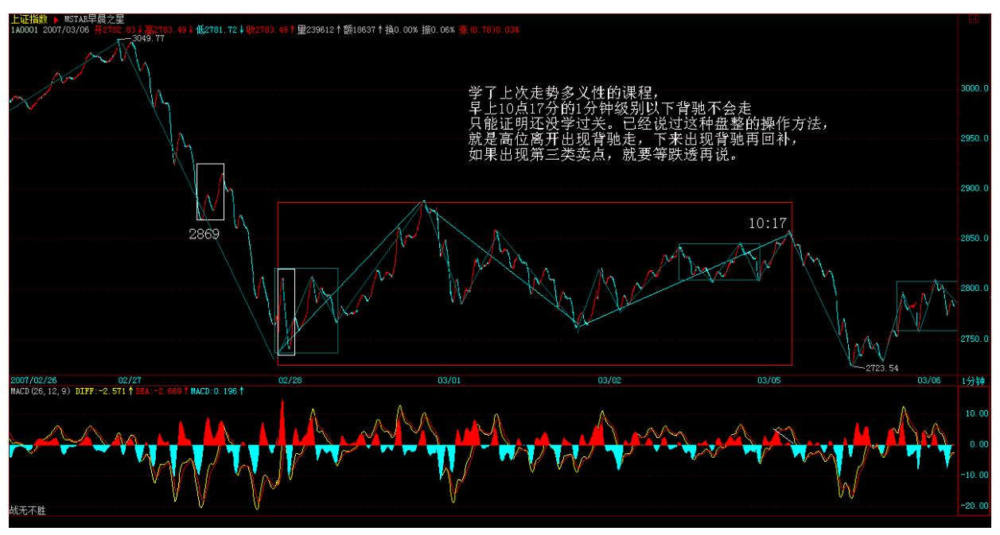
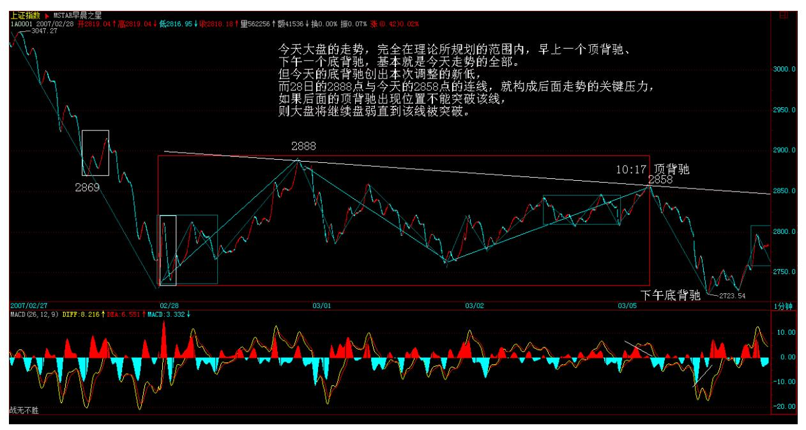
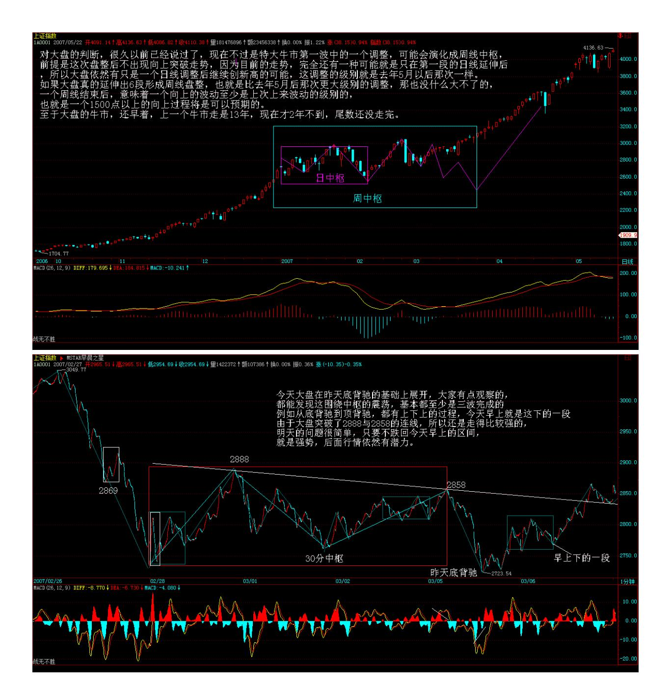
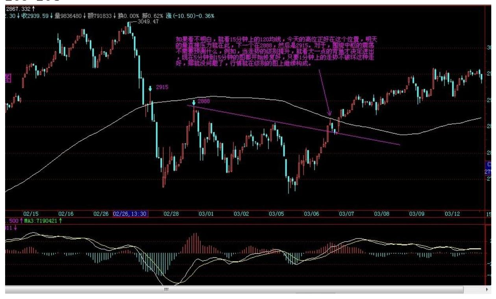
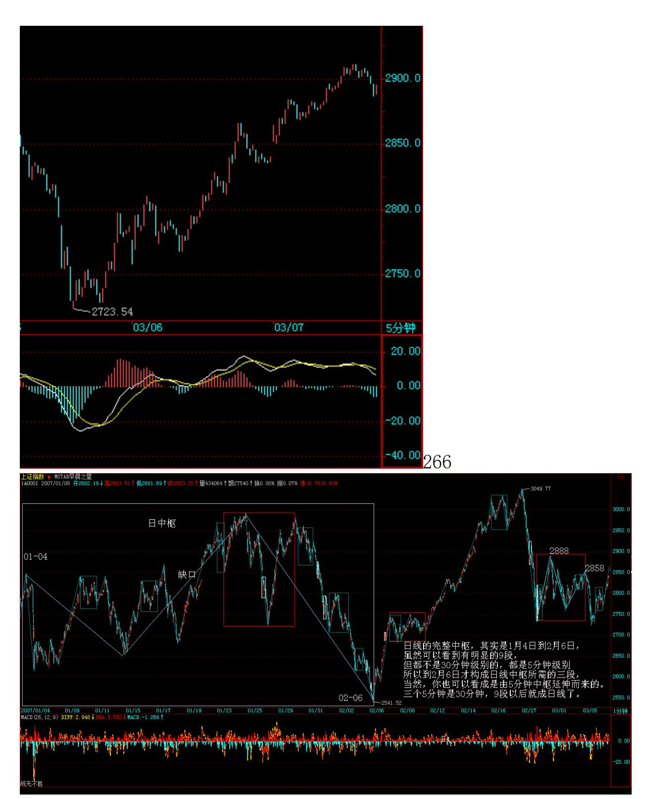
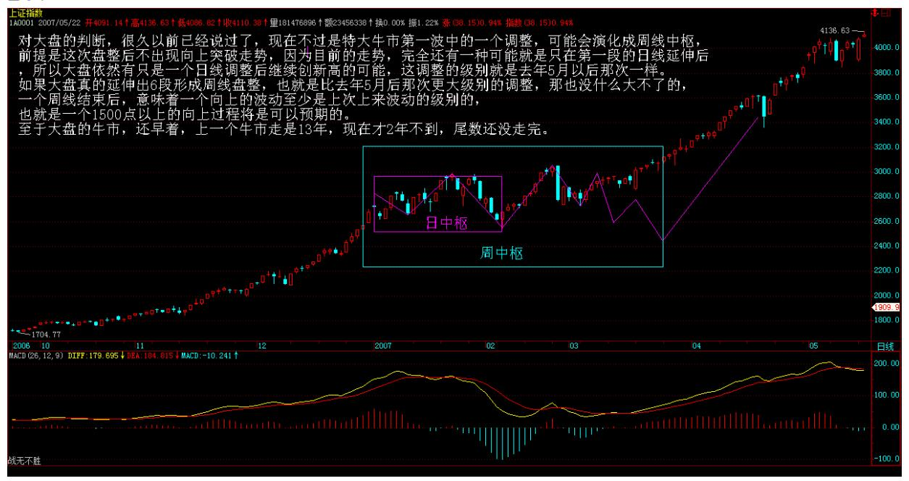

# 教你炒股票 33:走势的多义性

(2007-03-02 15:20:37)如果市场都是标准的 a+A+b+B+c,A、B 的中 枢级别一样,那这市场也太标准、太不好玩了。市场总有其复杂的地 方,使得市场的走势呈现一种多义性,就好象诗词中文字的多义性一 样。如果没有多意义性,诗词都如逻辑一样,那也太没意思了。而所 有走势的多义性,都与中枢有关。

例如,5 分钟级别的中枢不断延伸,出现 9 段以上的 1 分钟次级别 走势。站在 30 分钟级别的中枢角度,3 个 5 分钟级别的走势重合就 形成了,而 9 段以上的 1 分钟次级别走势,每 3 段构成一个5 分钟 的中枢,这样也就可以解释成这是一个 30 分钟的中枢。这种情况, 只要对中枢延伸的数量进行限制,就可以消除多义性,一般来说,中

枢的延伸不能超过 5 段,也就是一旦出现 6 段的延伸,加上形成中 枢本身那三段,就构成更大级别的中枢了。

另外一种多义性,是因为模本的简略造成的。不同级别的图,其实就 是对真实走势不同精度的一种模本,例如,一个年线图当然没有1 个 分笔图的精确度高,很多重要的细节都不可能在大级别的图里看到。 而所谓走势的级别,从最严格的意义上说,可以从每笔成交构成的最 低级别图形不断按照中枢延伸、扩展等的定义精确地确认出来,这是 最精确的,不涉及什么 5 分钟、30 分钟、日线等。但这样会相当 累,也没这个必要。用 1 分钟、5 分钟、30 分钟、日线、周线、月 线、季线、年线等的级别安排,只是一个简略的方式,最主要是现在 可以查到的走势图都是这样安排的,当然,有些系统可以按不同的分 钟数显示图形,例如,弄一个 7 分钟的走势图,这都完全可以。这 样,你完全可以按照某个等比数列来弄一个级别序列。不过,可以是 可以,但没必要。因为,图的精确并没有太大的实质意义,真实的走 势并不需要如此精确的观察。当然,一些简单的变动也是可以接受 的,例如去掉30 分钟,换成 15 分钟和60 分钟,形成 1 分钟、5 分 钟、15 分钟、60 分钟、日线、周线、月线、季线、年线的级别安 排,这也是可以的。

虽然没有必要精确地从最低级别的图表逐步分析,但如果你看的图表 的缩放功能比较好,当你把分笔图或 1 分钟图不断缩小,这样,看到 的走势越来越多,而这种从细部到全体的逐步呈现,会对走势级别的 不断扩张有一个很直观的感觉,这种感觉,对你以后形成一种市场感 觉是有点帮助的。在某个阶段,你可能会形成这样一种感觉,你如同 站在重重叠叠的走势连绵中,而当下的趋向,仿佛照亮着层层叠叠的 走势,那时候,你往往可以忘记中枢之类的概念,所有的中枢,按照 各自的级别,仿佛都变成大小不同的迷宫关口,而真正的路只有一 条,而你的心直观当下地感应着。说实在,当有了这种市场清晰的直 觉,才算到门口了。那时候,就如同看一首诗,如果还从语法等去分 析,就如同还用中枢等去分析一样,而真正的有感觉的读者,是不会 计较于各种字句的纠缠的,整体的直观当下就呈现了,一首诗就如同 一自足的世界,你当下就全部拥有了。市场上的直观,其实也是一样 的。只要那最细微的苗头一出来,就当下地领悟了,这才算是对市场 走势这伟大诗篇一个有点合格的的阅读。

255例如,对 a+A+b+B+c,a 完全可以有另一种释义,就是把 a 看成 是围绕 A 这个中枢的一个波动,虽然 A 其实是后出现的,但不影响

这种看法的意义。同样 c 也可以看成是针对 B 的一个波动,这样整 个走势其实就简化为两个中枢与连接两者的一个走势。在最极端的情 况下,在 a+A+b+B+c 的走势系列类型里,a 和 c 并不是必然存在 的,而 b 完全可以是一个跳空缺口,这样,整个走势就可以简化为两 个孤零零的中枢。把这种看法推广到所有的走势中,那么任何的走势 图,其实就是一些级别大小不同的中枢,把这些看成不同的星球,在 当下位置上的星球对当下位置产生向上的力,当下位置下的产生向下 的力,而这些所有力的合力构成一个总的力量,而市场当下的力,也 就是当下买卖产生的力,买的是向上的力,卖的是向下的力,这也构 成一个合力,前一个合力是市场已有走势构成的一个当下的力,后者 是当下的交易产生的力,而研究这两种力之间的关系,就构成了市场 研究的另一个角度,也就是另一种释义的过程。这是一个复杂的问 题,以后会陆续说到,算是高中的课程了。

现在先别管什么力不力的,可以从纯粹中枢的角度对背驰给出另外的 释义。对 a+A+b+B+c,背驰的大概意思就是 c 段的力度比 b 的小 了。那么,站在 B这个中枢的角度,不妨先假设 b+B+c 是一个向上的 过程,那么 b 可以看成是向下离开中枢 B,而 c 可以看成是向上离 开中枢 B。所谓顶背驰,就是最后这个中枢,向上离开比向下离开要 弱,而中枢有这样的特性,就是对无论向上或向下离开的,都有相同 的回拉作用,既然向上离开比向下离开要弱,而向下离开都能拉回中 枢,那向上的离开当然也能拉回中枢里,对于b+B+c 向上的走势,这 就构成顶背驰,而对于 b+B+c 向下的走势,就构成底背驰。对于盘整 背驰,这种分析也一样有效。其实,站在

中枢的角度,盘整背驰与背驰,本质上是一样的,只是力度、级别以 及发生的中枢位置不同而已。

同样,站在纯中枢的角度,a+A+b+B,其中 B 级别大于 A 的这种情况 就很简单了,这时候,并不必然地 B 后面就接着原方向继续,而是可 以进行反方向的运行。例如,a+A+b+B 是向下的,而 a+A+b 其实可以 看成是对 B 一个向上离开的回拉,而对中枢来说,并没要求所有的离 开都必须按照上下上下的次序,一次向上的离开后再一次向上的离 开,完全是被允许的,那站在这个角度,从 B 直接反转向上,就是很 自然的。那么,这个反转是否成功,不妨把这个后续的反转写成 c, 那么也只要比较一下 a+A+b 与 c 这两段的力度就可以,因为中枢 B 对这两段的回拉力度是一样的,如果 c 比 a+A+b 弱,那当然反转不 成功,也就意味着一定要重新回到中枢里,在最强的情况下也至少有 一次回拉去确认能否构成一个第三类买点。而a+A+b 与 c 的力度比 较,与背驰的情况没什么分别,只是两者的方向不同而已。如果用 MACD 来辅助判别,背驰比较的黄白线和柱子面积都在 0 轴的一个方 向上,例如都在上面或下面,而 a+A+b 与c 就分别在不同的方向上, 由于这,也不存在黄白线回拉的问题,但有一点是肯定的,就是黄白 线至少要穿越一次 0 轴。这几天大盘的走势,就对这种情况有一个最 标准的演示。简略分析一下。

#### 256257

258 259不过,这些分析都是针对指数的,而个股的情况必须具体分 析,很多个股,只要指数不单边下跌,就会活跃,不爱搭理指数,所 以不能完全按指数来弄。其实。对于指数,最大的利益在期货里。不 过,期货的情况有很大的特殊性,因为期货是可以随时开仓的,和股 票交易凭证数量的基本稳定不同,所以在力度分析等方面有很多不同 的地方,这在以后再说。

\*\*\*\*\*\*\*\*\*\*\*\*\*\*\*\*\*\*\*\*。

解盘及互动问答:

\*\*\*\*\*\*\*\*\*\*\*\*\*\*\*\*\*\*\*\*。

缠师:今天军工意料之中的利好使得打击汉奸又多了一重利器,中信 的即将发行,使得汉奸对金融股的打压也不再肆无忌惮。目前关键是 心理面的修复,通过震荡把不坚定分子洗干净。大盘的技术走势,有 了今天的课程,自己就可以分析了。如果看不明白,那还是5 日线, 两会结束是一个敏感时间,下周初是一个心理敏感时间,因为听说汉 奸和面首都有周经现象。

个股没什么可说的,现在学得多了,就要自己去找股票,不要扎堆, 虽然本 ID 不介意操作难度加大,但这样其实是害了大家。自己找的 才最好吃,学的是方法。低价股里,像科技(包括 3G)、旅游等等历 史上活跃的,都是找股票好的板块。但选股票一定要按技术来找,找 有第三类买点的,或至少是刚从第三类买点起来的。估计现在 999 没 几个人有了,被抛下车的也不用伤心,你们的水平和某著名的、有着 汉奸名字的基金一样,有数以千万计的筹码因为被赎回而丢失了。这 简直是太令人高兴的事情,343 的情况也一样,就要害一下这些汉 奸。但汉奸还有筹码,本 ID 现在就是要挑逗他们,最好都砸出来。 2007-03-02 15:21:10下午要去钓鱼台一趟,所以把帖子提前发出来。 学了上次走势多义性的课程,早上 10 点 17 分的 1 分钟级别以下背 驰不会走,只能证明还没学过关。已经说过这种盘整的操作方法,就 是高位离开出现背驰走,下来出现背驰再回补,如果出现第三类卖 点,就要等跌透再说。2007-03-05 11:56:42260

261 262技术不过关的,在盘整时完全可以离开,等大盘走强再说。例 如一个周线中枢的形成,怎么都弄好几个月,你完全可以回家抱孩子 去。但真正的杀手,盘整就是天堂,盘整往往能创造比上涨更大的利 润,抛了可以买回来,而且可以自如地在各板块中活动,但能达到这 种境界,必须刻苦的学习与训练,如果学不了,就先离开,本ID 教你 一种最简单的办法,就是等大盘周线出现底背驰再来,这样,你 N 年 才需要看一次盘,多轻松?盘整就要敢抛敢买,一旦出现第三类卖点 进入破位急跌,就要等跌透,有一点级别的背驰再进入,这样才能既 避开下跌,又不浪费盘整的震荡机会。如果技术不熟练的,就减少仓 位操作。大盘没什么可说的,一个绝佳的练习盘整操作的运动场,要 珍惜。

#### 263 264

个股方面,依然是板块轮动,中信要发行,汉奸不敢乱砸金融股,所 以就起来了,就这么简单,而且今天的金融股还有稳定的任务,毕竟 香港的股市最近也不太平。散户没必要理会这些,根据当下的走势就

可以。注意,板块轮动很快,千万不能追高买,应该找没动的有买点 的买,这样才能占据先机。

#### 267

1. 网友[匿名] 咕咚: 缠姐好!下面是您对大势的评价:"对大盘的 判断,很久以前已经说过了,现在不过是特大牛市第一波中的一个调 整,可能会演化成周线中枢,前提是这次盘整后不出现向上突破走 势,因为目前的走势,完全还有一种可能,就是只在第一段的日线延 伸后。。。" 缠姐你所指"第一段的日线"具体为哪一段?2007-03- 06 16:16:48缠师:日线的完整中枢。其实是 1 月 4 日到 2 月 6 日,虽然在上面可以看到有明显的 9 段,但都不是 30 分钟级别的, 都是 5分钟级别。所以到 2 月 6日才严格地构成日线的中枢所需要的 三段。当然,你也可以看成是由 5 分钟中枢延伸而来的。三个 5 分 钟是 30 分钟,9 段以后就成日线了。

268 而这,如果是从周线的中枢来看,这只能算第一段。如果这位置 要真的构成周线中枢,那至少要在这里盘到 4 月以后。而现在,完全 可以直接突破上去,这样就不构成周线的中枢了。所以,站在当下的 走势上,其实,还有这种强势的选择。
