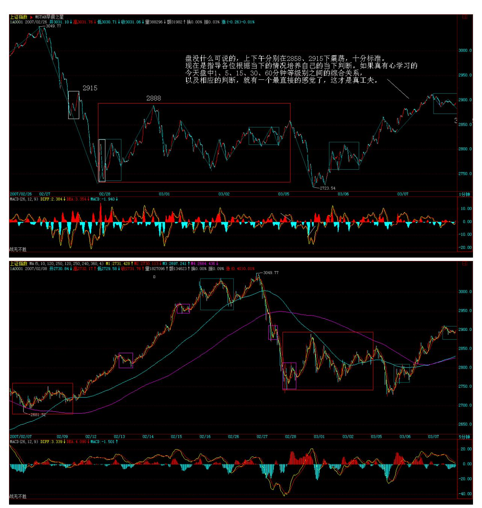
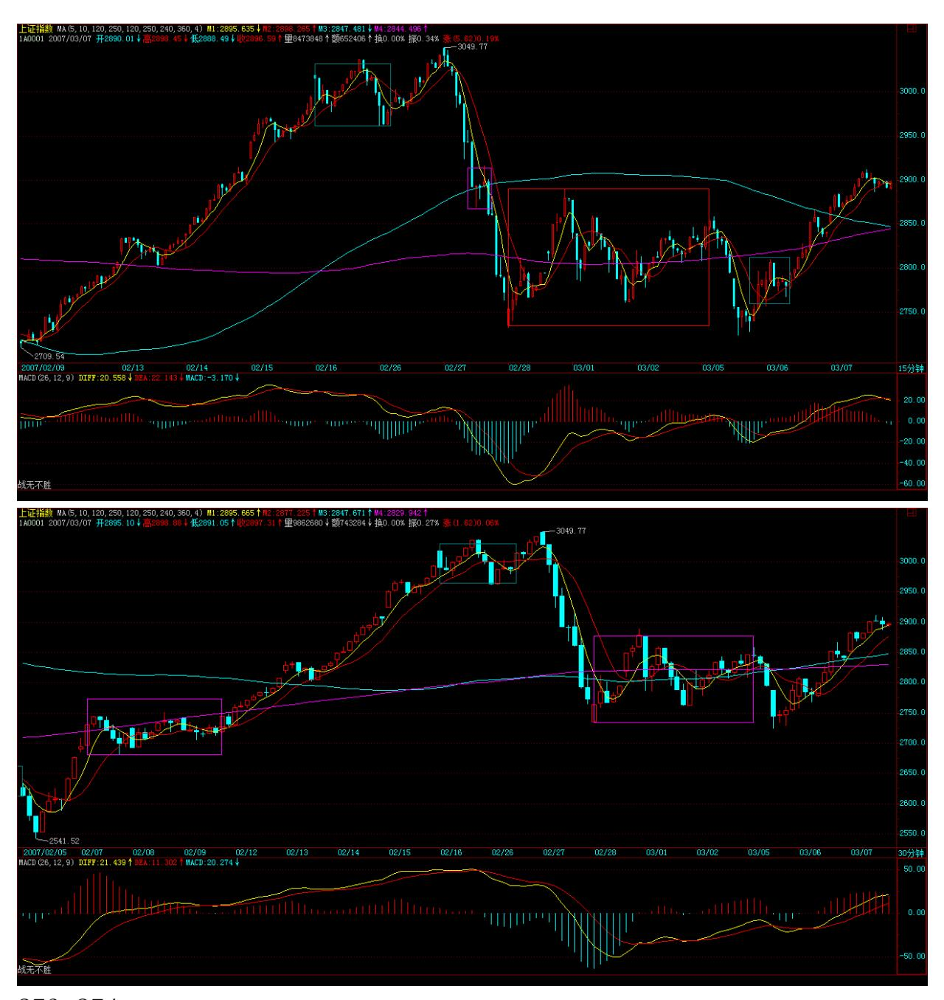
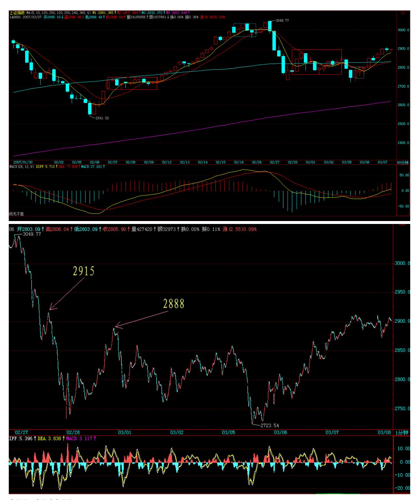
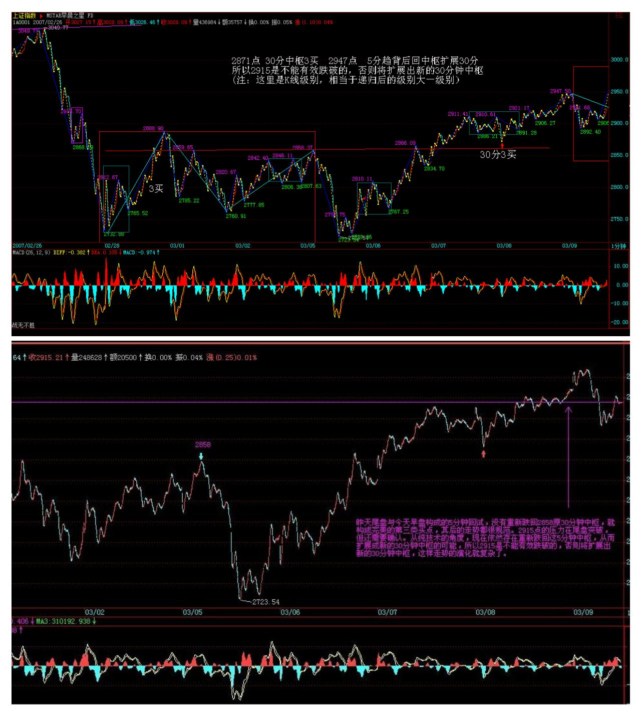
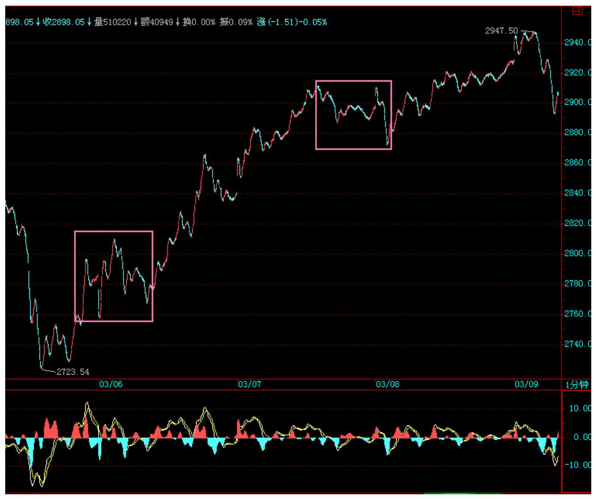
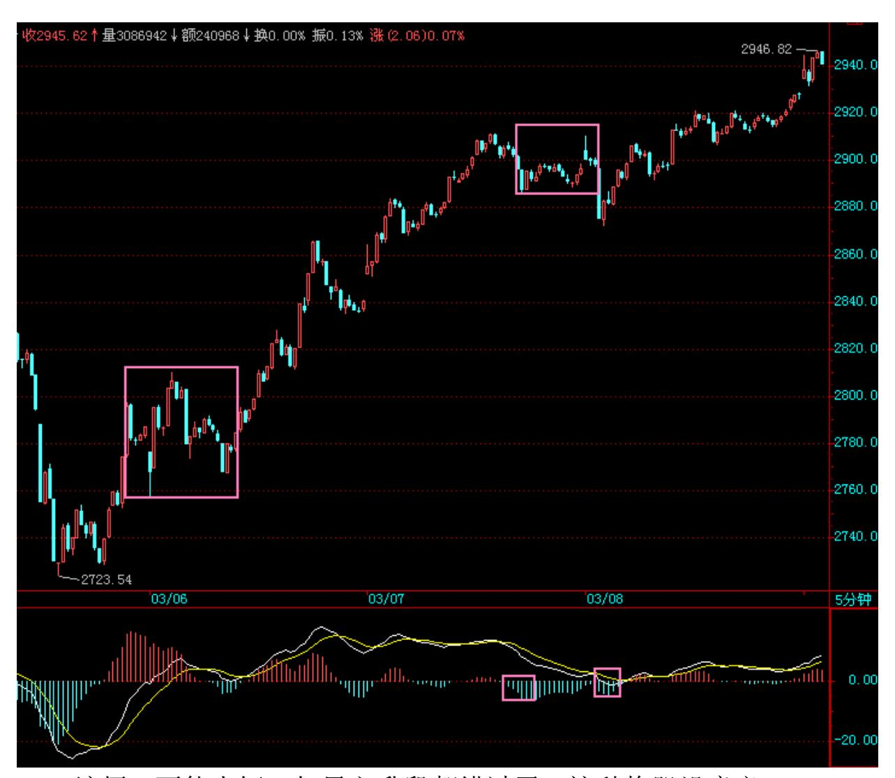
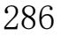
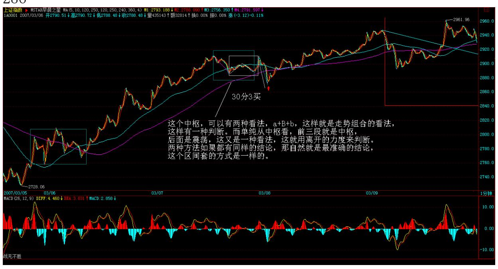

# 教你炒股票 34:宁当面首,莫成怨男

(2007-03-07 15:09:54)面首,一种职业;怨男,一种自虐。面首常 有,怨男更常有。怨男,无分贵贱,无关学问。李后主(李煜),一 国之君,人生长恨水长东地成就一代怨词,也算怨得有点声色;以后 主为隔代知己的王某(王国维),一头扑入不能长东只能长恨的死水 里,比起清华园后来那些因阴阳失调而成就的千万怨男,也算怨得有 点动静。清华男的脑子多不好使,在逻辑与数据的迷宫中迷失自我, 是否与此阴阳失调相关且不论,但北大男如面首,清华男如怨男,却 是不争的事实。宁要面首,莫要怨男,这也是北大比清华出色的地 方。站在消费者的角度,面首总比怨男可爱得多。最不可爱的,当然 就是怨男里的面首或面首中的怨男。那一片记录着中国人耻辱的残园 附近的两种男人,就如同股市中的失败男人一样。股市中的失败男 人,只有两种,面首与怨男,当然也就包括其中最不可爱的两者交 集。

面首,被股票所消费者,被股票所玩弄者,被股票忽悠着从阳亢到阳 痿间不断晃悠者。非怨男的面首有一好处,就算不太精液了也还很敬 业,到处想方设法也要找点这鞭那鞭嚼嚼又可以继续傻忽忽、乐呵呵 地敬业了。怨男,有两种,一种是当面首时被用废的,能用的只剩下 嘴了,或者去当当股评卖卖假阳具去骗骗人,或者每天对着股市这镜 子顾影自怜,或者就编编故事对着往昔的梦境再梦里阳亢一把;另一 种是拍 AV 的、说评书的、当狗崽的、玩裸聊的,总之,都不是能玩 真的,都是些企图用口眼就能制造快感的发育不良者。要快感就玩真 的,真刀真枪来,总是当医疗器械的免费宣传者那算什么事?无论面 首或怨男,最大的共同点就是喜欢被玩,当一种面首或怨男的密码被 输入后,这面首或怨男的程序就自动运行。其人,不过是傀儡而已, 但竟然也乐在其中,也算天下之奇事。不摆脱这各种情绪操控的傀儡 命运,就无人可言,但更可怕的的是,很多人却深陷其中而不能自 拔,甚至不能自知。很多人,从一开始就自闭其路,一开始就是死路 一条。例如,自以为高明地把股市当赌场(吴敬琏),这样,一双赌眼 看股市,怎么闹都是一条赌命,其命运就由其最开始的所谓高明所决 定了。"闻见学行" ,有如此闻,而有如此见,复有如此学,终有如 此行,如此股市就以各人自渎的想象成为众多股市参与者的坟墓。

正闻、正见、正学、正行,无此四正,要在股市里终有成就,无有是 处。正,不是正确的意思,所谓正确,不过是名言之争辩。正,是正 是,是当下,只有当下,才是正是,才是这个。要当下闻、当下见、 当下学、当下行,才是正闻、正见、正学、正行。而对于股市来说, 只有走势是当下的,离开走势,一切都与当下无关。一切"闻见学 行" ,只能依走势而"闻见学行" ,离开此,都是瞎闹。不符合当 下走势的,上帝说正确也白搭。由此,入股270在股市中,钱的大小根 本不重要,亏损是按百分比的,所有的钱,无论你是从哪里涨起来 的,在任何一个位置,变成 0 的几率是一样的。这个几率是当下存在 的,任何人、任何时候都不可能摆脱,这是"不患"的。当下的走 势,就如同一把飞速滚动的屠刀,任何与之相反的,都在屠杀之列, 而与之顺着的,那被屠的血就成了最好的盛宴。也就是说,一旦你的 操作,陷入一种与当下走势相反的状态,任何该种状态的延续就意味 着死亡,一旦进入这种状态,唯一正确的选择就是离开。当然,走势 是千变万化而有级别性的,任何的当下,并不就意味着 1 秒种的变 化,而是根据你的资金以及承受所可能的操作级别来决定的。一直所 说的操作级别,就是针对此而说。例如,你根据资金等情况,决定自 己的操作级别是 30 分钟的,那 30 分钟所有可能发生的走势都在你 的计算之中,一旦你已有的操作出现与 30 分钟实际当下走势相反的 情况,那么就意味着你将进入了一个 30 分钟级别的屠杀机器里。这 种情况下,只有一种选择,就是用最快的时间退出。

注意,这不是止蚀,而是一种野兽般的反应。走势如同森林,野兽在 其中有着天生般的对危险的直觉,这种危险的直觉总是在危险没发生 之前,而野兽更伟大的本事在于,一旦危险过去,新的觅食又将开 始,原来的危险过去就过去了,不会有任何心理的阴影,只是让对危 险的知觉更加强大。没有任何走势是值得恐惧的,如果你还对任何走 势有所恐惧、有所惊喜,那么,你还是面首、怨男级别的,那就继续 在当下的走势中磨练,让这一切恐惧、惊喜灰飞湮灭。这里,只需要 正闻、正见、正学、正行,而不要面首与怨男,即使面首比怨男要可 爱一丁点。

\*\*\*\*\*\*\*\*\*\*\*\*\*\*\*\*\*\*\*\*。

解盘及互动问答:

缠师:大盘没什么可说的,上下午分别在 2858、2915 下震荡,十分 标准。注意,来这里别把本 ID 当股评,现在是指导各位根据当下的 情况培养自己的当下判断。如果真有心学习的,今天盘中 1、5、15、 30、60 分钟等级别之间的综合关系,以及相应的判断,就有一个最直 接的感觉了,这才是真工夫。2007-03-07 15:12:14271 272

273 274

280 281大盘只要不有效站稳 2915,最终形成第三类买点,则下面这 中枢依然不能摆脱。说得简单点,现在大盘无非两种盘整方式,一种 就在2915 附近重新回跌,甚至继续破底形成之字型,一种就是先上 3000,然后再回拉形成平台型,这些都不用考虑,当下就知道了。

对不起,有一个笔误,是 2858。2007-03-07 15:12:14

#### \*\*\*\*\*\*\*\*\*\*\*\*\*\*\*\*\*\*\*\*。

1. 网友 [匿名] 惊鸿一慕:缠姐姐,请问用 MACD 辅助判断顶背驰, 是否存在红柱子长度、红柱子面积、黄白线判断的优先次序?例如, 600598(北大荒),5 分钟图上,3 月 5 日 9:45 分创新高 9.24 元,红柱子也比 3 月 2 日 11:15 时的高,黄白线却没创新高,背 驰段红色柱子面积相比 A 部分减少了。好像不符合缠论的限制条件: 红柱子、黄白线没有创新高。我怎么选择优先次序?谢谢! 2007-0306 16:29:56缠师:一般来说,最重要的是黄白线,柱子面积之和一般 在复杂走势里重要。当然,其实这都不是最关键的。最关键是要各级 别配套地看,才能知道哪个背驰的力度大。否则,每一个 1 分钟以下 的背驰都要动,那就会累死。但如果中枢就是 5、30 分钟的,每次离 开都是 1 分钟的,那 1 分钟以下的背驰当然就很重要了。因为根据 中枢的回拉力,1 分钟以下背驰就引发大的回拉,这几天大盘的高低 点都是由 1 分钟以下背驰构成的,原因就在这里。如何判断背驰只是 最基础的,关键是如何明确地根据综合的情况来利用背驰,这才是需 要不断实践、提高的。

#### \*\*\*\*\*\*\*\*\*\*\*\*\*\*\*\*\*\*\*\*。

2. 网友 [匿名] 悠悠悠哉: a+A+b+B+c 中 A、B 是中枢?那 a+A+ b 和 b+B+c 是不是中枢那? 2007-03-07 15:13:15缠师:前面是, 后面不是。

#### \*\*\*\*\*\*\*\*\*\*\*\*\*\*\*\*\*\*\*\*。

282缠师:看次级别内部的走势。和上几次说离开力度不够的判断是一 样的。

#### \*\*\*\*\*\*\*\*\*\*\*\*\*\*\*\*\*\*\*。

4. 网友 [匿名] 满目山河: 传媒平台?是电视专栏还是? 2007-03- 08 15:45:36缠师:不是,本 ID 不会抛头露脸的,台面上的事情还需 要本 ID干就太没意思了。

#### \*\*\*\*\*\*\*\*\*\*\*\*\*\*\*\*\*\*\*\*。

5. 网友[匿名] 插班生: 楼主,第三类是第一次下试就能确定了。我 还以为要两次呢。糊涂。2007-03-08 15:45:36缠师:昨天尾盘那次不 算? 这是典型的之字型。

#### \*\*\*\*\*\*\*\*\*\*\*\*\*\*\*\*\*\*\*\*。

6. 网友[匿名] 三藏: 老大,金融股什么时候动动啊?11.53 元买的 民生银行,今天一天不死不活的。2007-03-08 15:31:49缠师:前两天 不是动了?现在是板块轮动。没必要连续拉抬一个板块。否则,对修

复人气没好处,也容易受到正面攻击。所以一直强调,没必要追高, 才能把握轮动节奏。动过的,等调整好了,自然又动了。

#### \*\*\*\*\*\*\*\*\*\*\*\*\*\*\*\*\*\*\*。

283缠师:就按中枢里的操作方法,前几天那次震荡不是演示过好几次 了?回去去好好读《教你炒股票 33:走势的多义性》。

#### \*\*\*\*\*\*\*\*\*\*\*\*\*\*\*\*\*\*\*。

8. 网友 [匿名] 三九: "一个 30 分钟的 a+A+b+B+c 的向上走势, 你不可能在 A 走出来后就说一定有 B,这样等于是在预测,等于假设 一种神秘的力量在确保 B 的必然存在,而这是不可能的。那么,怎么 知道 b 段里走还是不走?这很简单,这不需要预测,因为b 段是否 走,不是由你的喜好决定的,而是由 b 段当下的走势决定的。如果 b 段和 a 段相比,出现明显的背驰,那就意味着要走,否则,就不 走。" (此处引用缠师的话)LZ 好,我记得你前面说过,背驰必须 出现在第二个中枢之后,这和上面的说法是否有矛盾? 2007-03-08 15:56:1缠师:这有什么矛盾?第一个中枢之后的是盘整背驰。

#### \*\*\*\*\*\*\*\*\*\*\*\*\*\*\*\*\*\*\*\*。

9. 网友 [匿名] 盼解惑!谢谢 :引用:"昨天尾盘与今天早盘构成 的 5 分钟回试。"分析:我认为这是个由 2 个一分钟中枢,由于波 动区间重叠而形成的 5 分钟的盘整走势。问题:请问缠师,这个盘整 走势的背弛,我怎么看不明白啊?今早的下跌一段,力度明显大于昨 天刚开始下跌的力度,怎么也转折了呢?2007-03-08缠师:从 a+B+b 的角度,是算柱子的面积而不是长度的最长处。看5 分钟图就更明显 了。从纯中枢的角度,5 分钟中枢,昨天尾盘就形成了,后面的拉以 及今早的跳都是围绕的震荡。

284 缠师:不能太短,如果主升段都错过了,这种换股没意义。

#### \*\*\*\*\*\*\*\*\*\*\*\*\*\*\*\*\*\*\*\*\*。

11. 网友 [匿名] L8453: 盘啊盘,被晕了一天。2007-03- 0815:34:03缠师:走势很规范,晕是磨练不够,所以要不断在当下磨 练,光学概念没用的。

#### \*\*\*\*\*\*\*\*\*\*\*\*\*\*\*\*\*\*\*\*。

12. 网友 [匿名] L8453:老大,关于您回复的大盘 1 月 9 日到 2月 6 日是日线中枢。这么说,是不是可以认为,5 分钟级别的 9段就构 成了日线级别的中枢?也就是说,次次级别,当延伸了 6段,加上原

来次次级别的中枢三段,这时就构成了本级中枢。是这样吗? 2007- 03-08 15:38:10缠师:是 1 月 4 日开始,正好 9 段 5 分钟走势。

#### \*\*\*\*\*\*\*\*\*\*\*\*\*\*\*\*\*\*\*\*。

13. 网友 [匿名] 乱麻: 缠主是中国人,理由如下:(1)痛恨汉 奸。(2)喜欢研究《论语》。(3)文言文说的比白话文好,缠主的 白话文实在拗口,基本上搞不清在说什么。(4)我注意到一个现象, 国外一些技术教程,看上去浅显易懂,把很复杂的道理说得简单明 白。国内专家的文章,把简单明白的道理说得云山雾罩,生怕人家说 他不专业。从这点来看,缠主可确定为中国国籍。呵呵,开个玩笑, 得罪了莫怪! 2007-03-08 16:22:23缠师:国外的所有技术理论,本 ID 都研究过,和本 ID 的技术理论,根本不是一个路子。这是一个公 理化系统。如果你是文科生,那好好换一个数学脑子来。如果已经是 理科生,那回学校重读。理论是最基础的,关键是实践中的当下,这 是另一个层次的东西,鬼佬的理论,根本达不到这个层次。

缠师:临走回答一下。你不能把两种不搭界的看法混在一起。按中枢 看,就严格按中枢的定义来,其后在中枢结束前的所有走势,都可以 看成是围绕中枢的震荡过程。至于仔细的分类,以后会说到。

这个问题,上面回答,昨天开始的这个 5 分钟中枢时已经有所回答。 这个中枢,可以有两种看法,a+B+b,这样就是走势组合的看法,这样

有一种判断。而单纯从中枢看,前三段就是中枢,后面是震荡,这又 是一种看法。这就用离开的力度来判断。两种方法如果都有同样的结 论,那自然就是最准确的结论,这个区间套的方式是一样的。具体以 后课程都会说到,必须走了,再见。

287 288网友 CCTV:这很简单呀。a+B+b,就是用盘整背驰判断 b 是 不是背驰。中枢看法,像 B 里有三段,那 a 和 B 里的前两段也构成 中枢,那就可以把 B 余下部分和 b 都看成是前三段的震荡。那就可 以用离开的力度来判断。多义性那节课说的很清楚。这两种方法都得 到同样的结论。我的理解就是这样,我相信我是理解对了,没什么。 2007-03-08 17:13:18
