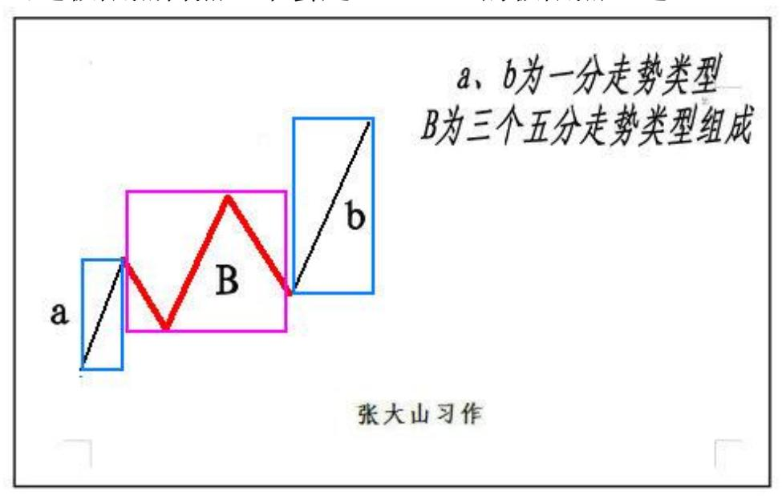
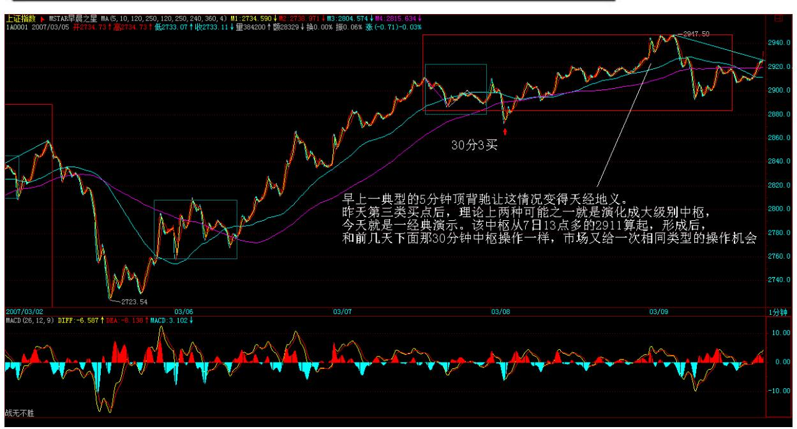
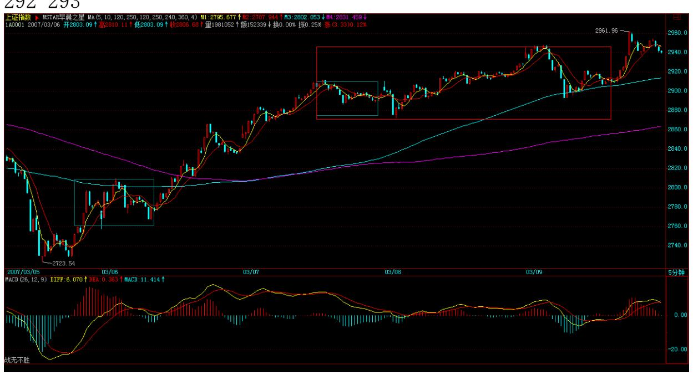
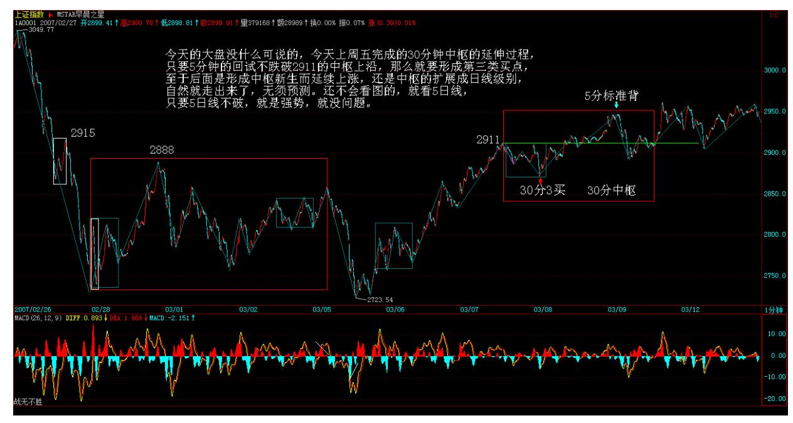
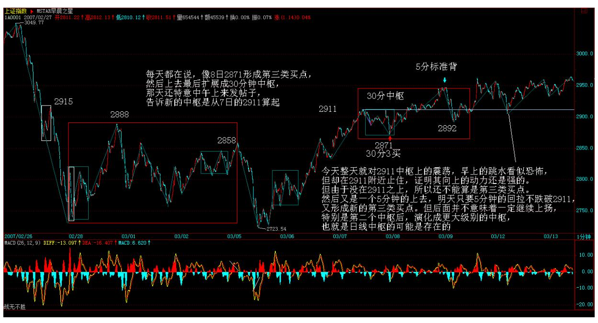
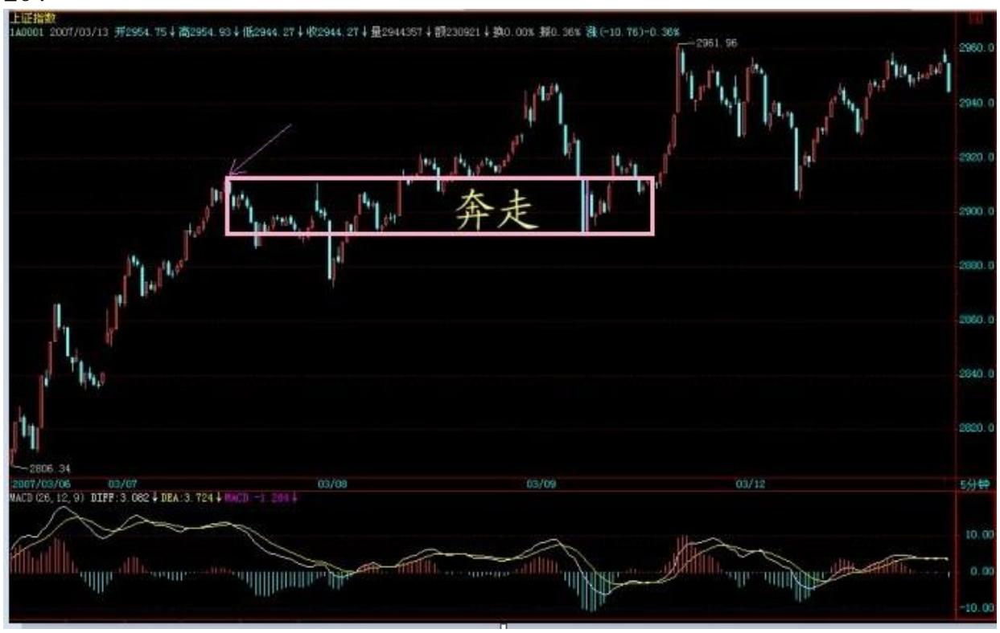
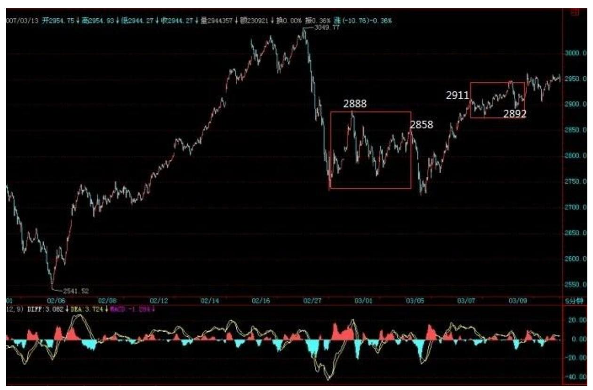

# 教你炒股票 35:给基础差的同学补补课

(2007-03-09 11:51:34)个人的理解能力之间相差太大,自然就有先后 之别,因此用一堂课给基础差的同学补补课也是应该的,而且很多自 以为基础好、明白的,看看也有益,有些细微处的理解也不一定能完 全到位。前面课程,最基础的无非两方面,一、中枢;二、走势类型 及其连接。这两方面相互依存,如果没有走势类型,中枢也无法定 义;而没有中枢,走势也无法分出类型。如果理论就此打住,那么一 个循环定义就不可避免。要解决该循环,级别的概念是不可缺少的。 有了级别,一个严格的递归式定义才可以展开。

所谓的最低级别,就如量子力学的量子概念,物理世界不是想当然地 无限连续的,而市场的交易同样如此。最严格去定义,每笔的交易是 最低级别的,连续三笔相同价位的交易,就构成最低级别的中枢。有 一个最低级别中枢的走势,就是最低级别的盘整走势类型;有两个最 低级别中枢的走势,就是最低级别的趋势走势类型,如果第二个中枢 比第一个高,那就是上涨走势类型,反之就是下跌走势类型。一般来 说,假设依次存在着 N(N>2)个中枢,只要依次保持着第 N 个中枢 比 N-1 个高的状态,那么就是上涨走势类型的延续;依次保持着第 N 个中枢比 N-1 个低的状态,就是下跌走势类型的延续。显然,根据上 面的定义,在最低级别的上涨里,只要也只有出现依次第 N 个中枢不 再高于、即等于或低于第 N-1 个的状态,才可说这最低级别的上涨结 束。最低级别下跌的情况与此相反。

上面就用最低级别的中枢把走势在最低级别上进行了完全分类,而三 个连续的最低级别走势类型之间,如果发生重叠关系,也就是三个最

低级别走势类型所分别经过的价格区间有交集,那么就形成了高一级 别的缠中说禅中枢。有了该中枢定义,依照在最低级别上的分类方 法,同样在高级别上可以把走势进行完全的分类,而这个过程可以逐 级上推,然后就可以严格定义各级别的中枢与走势类型而不涉及任何 循环定义的问题。但如果按严格定义操作,必须从最低级别开始逐步 确认其级别,太麻烦也没多大意义,所以才有了后面1、5、15、30、 60 分钟,日、周、月、季、年的级别分类。在这种情况下,就可以不 大严格地说,三个连续 1 分钟走势类型的重叠构成 5 分钟的中枢, 三个连续 5 分钟走势类型的重叠构成 15 或 30分钟的中枢等话。在 实际操作上,这种不大严格的说法不会产生任何原则性的问题,而且 很方便,所以就用了,对此,必须再次明确。

以上这些,都在前面反复提到,但很多人好象还是糊涂,不妨最后再 说一次。显然,站在任意一个固定级别里,走势类型是可以被严格划 分的。例如,说一个 5 分钟的走势类型,显然不可能包含一个30 分 钟的中枢,因为按定义,一个单独的 5 分钟走势类型无论如何延续, 也不可能出现一个 30 分钟的中枢。要形成一个 30 分钟的中枢,显 然只能是 3 个以上 5 分钟走势类型的连接才可能。走势类型与走势 类型的连接,这两个概念不可能有任何含糊290显然,一个高级别的走 势类型必然就是由几个低级别的走势类型连接而成,但不一定都是次 级别的走势类型,例如,a+B+b,B 是 30分钟中枢,由 3个 5 分钟走 势类型构成,a、b 是 1 分钟走势类型,那么 a+B+b 这个 30 分钟走 势类型就能分解成 2 个 1 分钟走势类型和 3 个 5 分钟走势类型的 连接。但我们还可以通过拆散重分,使得一个高级别的走势类型必然 就是由几个次级别的走势类型连接而成,由于中枢里至少有三段次级 别走势类型,所以就有了"缠中说禅走势分解定理二":任何级别的 任何走势类型,都至少由三段以上次级别走势类型构成。

例如,还是上面 a+B+b 的例子,估计很多人怎么都看不出为什么这分 解定理一定成立。其实,不妨假设 B 中有三段 5 分钟走势类型,分 别表示为 B1、B2、B3,那么 a+B+b=a+ B1+B2+B3+b=( a+B1)+B2+ (B3+b),显然( a+ B1)、B2、(B3+b)都是 5 分钟走势类型,这 就是该分解定理所说的东西。学过一点抽象代数的都容易理解上面的 话,用抽象的话说,就是走势类型连接这种运算是符合结合律的。但 走势类型的连接运算不符合交换率,这就是该运算的特别之处。只要 明白了走势类型连接运算的结合性,那就不难同时明白"缠中说禅走 势分解定理一":任何级别的任何走势,都可以分解成同级别"盘 整"、"下跌"与"上涨"三种走势类型的连接。

其实,就像量子力学有多种数学的处理形式,本 ID 的理论,同样可 以用抽象代数的方法来处理,只是那样的话,就更少人能看懂了。而 抽象的方法,不仅简洁,而且更能暴露其实质。这些以后再说了,现 在还是用比较简单的、类似几何的方法去理解吧。

注意,走势是客观的,而用什么级别去分析这走势却是主观的。根据 "缠中说禅走势分解定理一" ,任何级别的任何走势,都可以分解成 同级别"盘整" 、"下跌"与"上涨"三种走势类型的连接,那么就 意味着,按某种级别去操作,就等于永远只处理三种同一级别的走势 类型及其连接。还是上面 a+B+b 的例子,站在 5 分钟级别的角度, 这里有三个走势类型的连接,站在 30 分钟级别的角度,就只有一个 走势类型。那么,前面反复说的,确定自己操作的级别,就是确定自 己究竟是按什么级别来分析、操作。例如,5 分钟级别上下上三段, 意味着在 5 分钟级别上有 2 个底背驰、2 个顶背驰,按买点买、卖 点卖的原则,就有 2 次的完整操作;而按30 分钟级别看,这里就没 有买卖点,所以就无须操作。

从纯理论的角度,操作级别越低,相应的效率越高,但实际操作级别 是不可能随意低的,而究竟按什么级别来分析、操作,和你的资金等 具体条件相关。例如,T+1 的情况下,按 1 分钟以下级别的操作,就 面临着不能顺利兑现的风险,而系统的操作,要把所有可能的情况都 考虑其中,因此完全按 1分钟以下级别的操作是不可能的,除非是 T+0。此外,级别越小,平均的买卖点间波幅也越小,因此,那些太小 的级别,不足以让交易成本、交易误291因此,根据各种情况,你就可 以相应定好自己的操作级别,这样就可以按照相应的级别分析、操 作。也就是说,一旦该级别出现买卖点,你必须进入或退出。也就是 说,在你的操作级别上,你是不参与任何调整或下跌走势类型的。有 人曾问本 ID 为什么 2001 年后四年都不看股票,那很简单,就因为 在本 ID 的操作级别上出现卖点,所以就全部退出,等有相应买点再 说。制定了相应级别,是否按照次级别以下进行部分操作,那是操作 风格问题,而实际上是应该安排这种操作的,特别当进入一个你的操 作级别的次级别盘整或下跌,这是你可以忍受的最大级别非上涨走 势,当然要操作一下来降低自己的成本。如果你的操作级别很大,那 么其次级别的次级别,也可以用来部分操作的。这样,整个操作就有 一定的立体性,从而更降低其风险,也就是能进行把成本降低这唯一 能降低风险的活动,只有当成本为 0 时,才算真正脱离风险。

根据"缠中说禅走势分解定理" ,很容易就证明"缠中说禅买卖点级 别定理" :大级别的买卖点必然是次级别以下某一级别的买卖点。

这个证明很简单,具体就不写了,还用上面的例子来说明:a+B+b=a+ B1+B2+B3+b=( a+ B1)+B2+(B3+b),最后的(B3+b)形成 30 分钟 的买卖点,那么自然其极限点在 b 上,对 b 进行分解,如果该极限 点不是 b 的买卖点,那么就意味着 b 还没完成,还要延伸下去,那 么这极限点自然也不会是(B3+b)的极限点,这

就矛盾了。但注意,大级别的买卖点不一定就是次级别的买卖点,在

这个例子里,b 可以是 1 分钟级别的,就不是 30 分钟级别的次级别 了。所以只能说是次级别以下某一级别的买卖点。这也是为什么有时 候,有时候一个 1 分钟的背驰就会引发大级别下跌的原因。

在最规范的走势中,该大级别的买卖点刚好是下面所有级别的买卖 点。当然,这还是一个很粗糙的定理,在以后的课程里,还有更精细 的,这以后再说了。

#### 292 293

294 295 296

\*\*\*\*\*\*\*\*\*\*\*\*\*\*\*\*\*\*\*\*\*\*\*\*\*\*\*\*\*\*\*\*\*\*\*\*\*\*

# 解盘及互动问答:

\*\*\*\*\*\*\*\*\*\*\*\*\*\*\*\*\*\*\*\*\*\*\*\*\*\*\*\*\*\*\*\*\*\*\*\*\*\*

缠师: 个股也没什么可说的,以前说的板块都没问题,现在关键是心

理面上的影响,对 3000 点有点心理阴影,慢慢修复。而汉奸也企图 利用两会结束,人们普遍的见好就收心理发难,所以这方面的斗争还 将延续。深圳由于接近外边,所以受的影响更大,也走得弱点,如果 深圳重新走强,那问题就简单了。汉奸做空也只为了买回来,现在世 界上没有任何有实力的机构敢说完全放弃中国市场,别说 5 年,2 年 都不敢,这样,你说汉奸又能翻多大的浪?甚至一个周中枢都不一定 给他们面子。

#### 297

298 299缠师:这次上来,就是两个中枢 2858 点下面一个,2911 点 下面一个,从而形成 30 分钟级别的上涨,(注:这两个 30 分中枢震 荡高点有重叠,后面走势完成后,第二个中枢后移,满足不重叠的要 求)现在的问题是,这个上涨是否延续,还是最后演化成 à+B 型。

300 301缠师:缺口没什么特别的,你可以把除权缺口当成最低级别的 下跌,新的中枢和一般下跌时形成新中枢的处理是一样。然后一切都 按中枢的定义来看。有些缺口就在原来的中枢下面不远处,这样,同 样可以按第三类卖点来操作,特别那种假填权骗人进来的行情,一下 就能发现。

#### \*\*\*\*\*\*\*\*\*\*\*\*\*\*\*\*\*\*\*\*。

3. 网友 [匿名] smallfish: 缠姐姐,学了这么久的技术,发现心态 还没整好。最近买卖不佳,请问 002040,600196,明天找买点介入, 可否中线持有?想歇一段,调整一下心态。 2007-03-1216:00:52缠 师:注意,任何一次失误都要马上总结,不能连续失误再调整。

如果真的出现连续失误,那就是你的方法有很大问题,必须改进,好 好想想,想好了再操作。方法的问题无非几种:参与过小级别的操 作、没有按买卖点操作,参照过于频繁、对图形判断不熟练、有盲 点、乱听消息等等。先把问题找出来,究竟是什么问题。注意,失误 的原因永远与市场无关,找原因,只能找自己的原因。2007-03-12 16:29:43\*\*\*\*\*\*\*\*\*\*\*\*\*\*\*\*\*\*\*\*4. 网友[匿名] 酒吧心情: 对于奔走 型,我尝试着说下自己的看法。就是不断的进行中枢延伸,然后一旦

突破中枢,回抽不破最高点 ZG,就说明有第三买点了。对于大盘来 说,就是上攻。现在关键就是对 ZG 的判断,从 2911 来看的话,应该 是从第一段的那个最高点算的。不知道 JJ 的意思如何? 请 JJ 明 教。 2007-03-1216:12:33缠师:对,第二个 30 分钟中枢从 2892 到 2911。这次上来的走势,如同标准的教科书,好好仔细研究中枢的扩 展、延伸等问题。

#### \*\*\*\*\*\*\*\*\*\*\*\*\*\*\*\*\*\*\*\*。

302缠师:奔走型向上,就是第二段特别高,第三段跌破一点第一段高 点那种。
