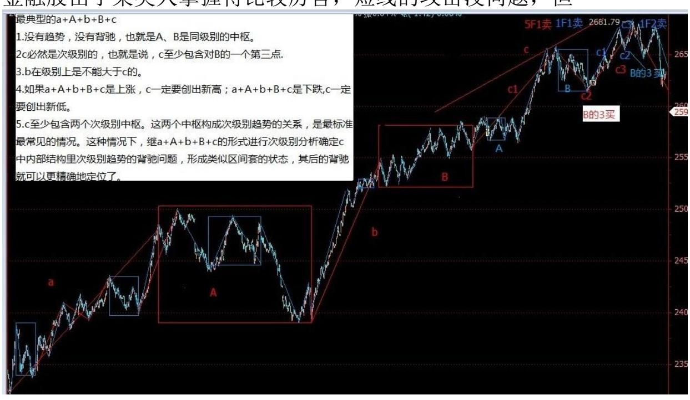
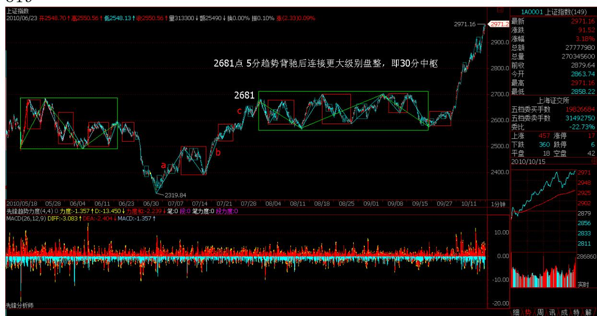
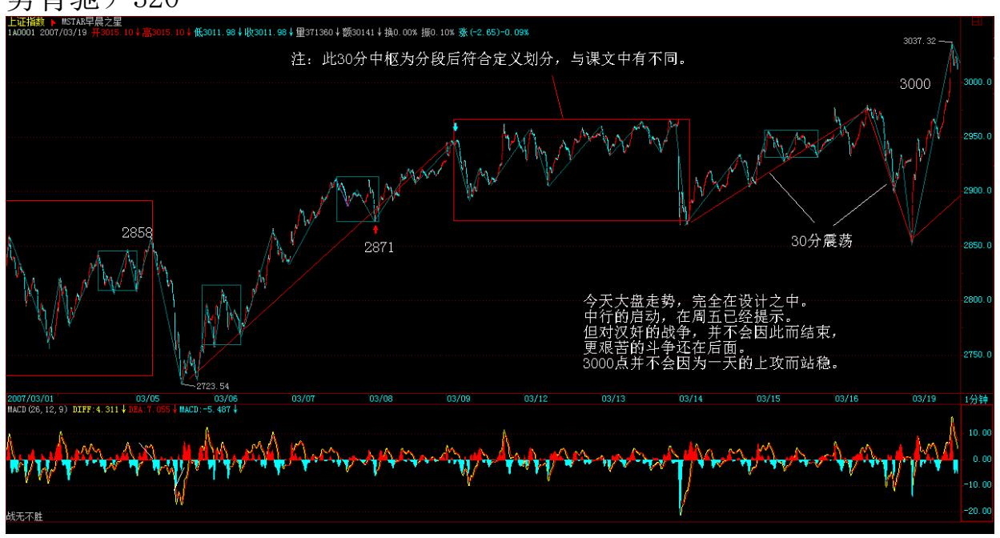
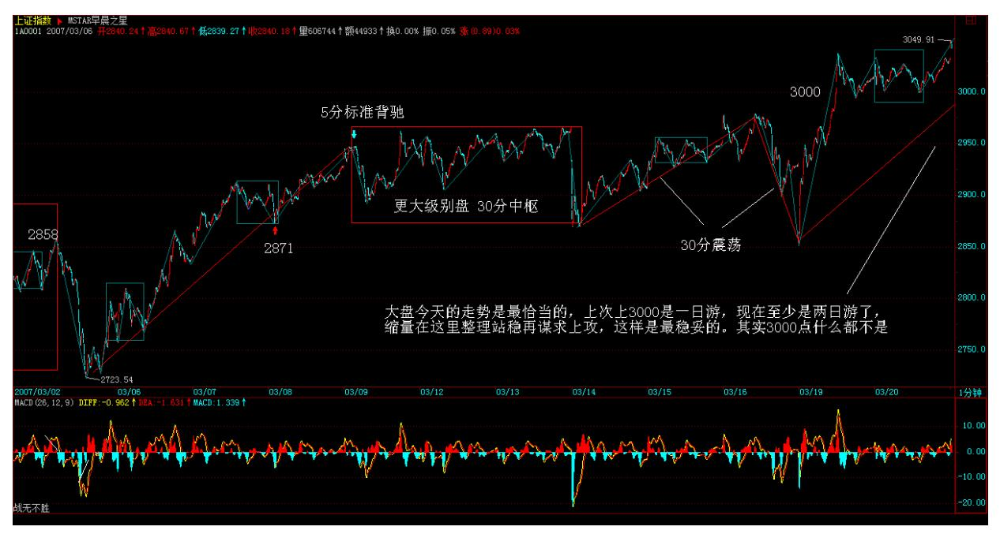
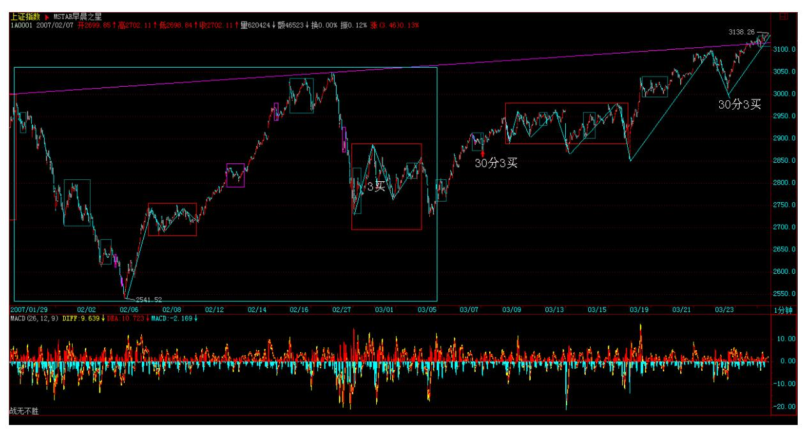

# 教你炒股票 37:背驰的再分辨

(2007-03-16 11:51:32)背驰问题说过多次,但发现还有很多误解。不 妨用最典型的a+A+b+B+c 为例子把一些经常被混淆的细节进行说明。

没有趋势,没有背驰,不是任何 a+A+b+B+c 形式的都有背驰的。当说 a+A+b+B+c 中有背驰时,首先要 a+A+b+B+c 是一个趋势。而一个趋 势,就意味着A、B 是同级别的中枢,否则,就只能看成是其中较大中 枢的一个震荡。例如,如果 A 的级别比 B 大,就有a+A+b+B+c=a+A+ (b+B+c),a 与(b+B+c)就是围绕中枢 A 的一些小级别波动。这 样,是不存在背驰的,最多就是盘整背驰。当然,对于最后一个中枢 B,背驰与盘整背驰有很多类似的地方,用多义性,可以把 b、c 当成 B 的次级波动。但多义性只是多角度,不能有了把 b、c 当成 B 的次 级波动这一个角度,就忘了 a+A+b+B+c 是趋势且 A、B级别相同的角 度。多义性不是含糊性,不是怎么干怎么分都可以,这是必须不断反 复强调的。

其次,c 必然是次级别的,也就是说,c 至少包含对 B 的一个第三类 买卖点,否则,就可以看成是 B 中枢的小级别波动,完全可以用盘整 背驰来处理。而 b 是有可能小于次级别的,力度最大的就是连续的缺 口,也就是说,b 在级别上是不能大于 c 的。例如,如果 b 是次级 别,而 c 出现连续缺口,即使 c 没完成,最终也延续成次级别,但 c 是背驰的可能性就很小了,就算是,最终也要特别留意,出现最弱 走势的可能性极大(娇:扩展后续涨续跌)。

还有,如果 a+A+b+B+c 是上涨,c 一定要创出新高;a+A+b+B+c 是下 跌,c 一定要创出新低。否则,就算 c 包含 B 的第三类买卖点,也 可以对围绕 B 的次级别震荡用盘整背驰的方式进行判断。对c 的内部 进行分析,由于 c 包含 B 的第三类买卖点,则 c 至少包含两个次级 别中枢,否则满足不了次级别离开后次级别回拉不重回中枢的条件。 这两个中枢构成次级别趋势的关系,是最标准最常见的情况,这种情 况下,就可以继续套用 a+A+b+B+c 的形式进行次级别分析确定 c 中 内部结构里次级别趋势的背驰问题,形成类似区间套的状态,这样对 其后的背驰就可以更精确地进行定位了。

最近太忙,不能写太长了。补充两句关于大盘目前的走势,说实在, 现在如果要摆脱目前的中枢,没有金融股的配合基本是不可能的。但 金融股由于某类人掌握得比较厉害,短线的攻击没问题,但

一个持续的攻击,就有点困难了。不过金融股在中线角度,依然还是 一大早的观点,用工行为例子,就是围绕 5 元上下的一个大级别震 荡,要大跌,打压的人是要付出代价的。顺便说一句,中行里的汉奸 实力小点,中行有奥运概念、业绩也较好一点,能否改造成一个反汉 奸的武器,成为一个突破口,还需要很大的努力。其实这改造已经不 是一天两天的事情,中行这几天已经连续比工行股价要高了,这就是 成绩。具体的细节就不说了,总之,斗争是残酷的,是复杂的,不能 赤膊上阵,要用最充分的耐心去消耗汉奸的实力。

下午一收盘就要去开反汉奸利器出炉的最后一次会议,就来不了了。 大盘走势,很简单,在第三类买点出现前,继续震荡,这种走势已经 反复很多次了,应该熟练应对了,所以也没必要多说了。

(注:例图节选 2010 年上证 2319-2681 1 分趋势背驰区间套 5分趋 势背驰)320

321 322 这次大盘成分股的启动能否成功,其实取决于市场的每个参 与者,火点起来了,但是否燎原,这不是本 ID 能决定的,市场是大

家的,不是本 ID 一个人的。本 ID 已经干了所有该干的事情,当 然,本 ID 只会根据当下的情况采取不同的手法,一定不会狂接硬 撑。只要火真的燎原了,什么汉奸都是白费的。

个股没什么说的,中国经济的大局在新的经济结构,所谓改变经济增 长方式,因此站在中长线角度,前期一直强调的环保(特别强调过包 括新能源)、农业、军工、科技等等板块都是值得中长线关注的,这 是中国经济发展的新方向。

当然,短线决战在金融股,银行、保险等,都是决战场所。显然,汉 奸目前的实力还是很厉害的,本 ID 已经有了长期抗战的准备,越震 荡,成本越低,没什么大不了的。不过,一旦有机会突破,这机会是 不会放过的。大盘具体走势,按照中枢自己就可以分析,本ID 要先 下,还有会议在后面。再见。

神州自有中天日,万国衣冠舞九韶(2007-03-19 08:52:42)以美欧日为 动力源的全球化经济在 2000 年网络泡沫后出现历史性的发展瓶颈, 而中国经济的崛起,是资本全球化历史与现实的必然要求,是一个有 别于欧美日的全球经济新动力源的必然选择,是一个拥有最多人口、 最大潜在市场的新兴经济体的必然承担,是不以任何人的意志为转移 的必然趋势。当中国经济成为全球化新动力源时,中国股市也应当成 为世界股市的新龙头,成为面向世界的超级大市场。中国的交易所, 必将成为世界性交易所,世界上的公司必将以能到中国上市为荣。这 一切,将成为中国新一轮特大型牛市真正的动力源泉。对此的任何短 视,都将错失这一历史性机遇。

从 1986 年 9 月 26 日延中实业上柜交易始,到 2001 年 6 月 14日 2245.42 点止,近 15 年充满曲折的第一轮大牛市带来了其后一轮长 达四年、幅度超过50%的全面调整,也留下了一个制度上存在严重缺陷 的市场与无数的争论。所有的争论最终达成一个最基本的共识:股 票,作为一种交易凭证,其最基础的制度必须保证所有股票都有相同 的流通属性。2005 年 6 月 6 日,六六大顺,以全流通为标志的制度 性改革拉开新一轮大牛市的序幕。而中国股市的制度性改革,归根结 底是顺应经济全球化背景下中国经济历史性崛起的必然抉择。

323 这一轮特大型牛市,至少同级别于第一轮大牛市。后者,即使从 1990 年的 95 点算起,最终涨幅也超过 22 倍。而世界股市的历史表 明,第二轮大牛市的时间与幅度都无一例外地远远超越第一轮,即使

按照最保守的 1.5 比例,由此可以推断,从 998 点起步已延续两 年、上升 2 千点的新一轮特大型牛市,仍将至少再延续20 年、上升 3 万点。站在中国成为全球经济新动力源的历史背景上,可以预言, 这轮波澜壮阔的特大型牛市行情将分为三大阶段:第一阶段行情,伴 随着中国股市本身的制度性、结构性完善,其后,中国股市才真正具 备参与全球化盛宴的资格。全流通、整体上市、两大交易所的功能重 组、人民币逐步可自由兑换等,都不过是这种制度性、结构性完善的 必然步骤。这一阶段,行情最主要体现在以权重股为代表的成分股 上。在总市值超越 GDP 之前谈论股市的泡沫是可笑的,在中国股市总 市值超越其 GDP 之前,第一阶段行情不会结束。

第二阶段行情,伴随着中国参与全球化进程的深入,越来越多的中国 公司将逐步成长为全球化公司、中国市场将逐步成长为全球化市场、 中国股市也将成长为与中国国际地位相匹配的全球化股市、大中华圈 股市的一个彻底的结构性重组将成为现实。这一阶段,行情最主要体 现在那些拥有全球成长性的股票上,以全球成长性为标志。在中国股 市成为亚洲市值最大、最重要的股市之前,第二阶段不会结束。

第三阶段行情,伴随着世界全球化格局的历史性变化,中国经济将从 新动力源变成最重要的动力源,中国市场也将成为世界上最重要的市 场,正像中国 GDP 必将超越美国 GDP,中国股市也将成为世界上最重 要的股市,中国股市将成为整合、重组世界经济资源的最重要场所。 这一阶段,行情最主要体现在那些拥有全球整合、重组能力的股票 上,以全球整合、重组为标志。在中国股市成为世界上市值最大、最 重要的股市之前,第三阶段不会结束。

中国需要世界,而全球化经济下的世界更需要中国,这是现实要求也 是历史必然。在这样一个历史性背景下,即使出现所谓的泡沫,也只 能是阶段性泡沫。让中国经济成为世界经济的新动力,让中国金融市 场成为世界金融市场的新龙头,这就中国成为负责任大国所应该负起 的历史性责任。而这一轮历史性大牛市,不过是这历史性责任的一个 必然的历史性呈现。这历史性的舞台,将赋予所有参与者历史性的机 会,激发其最大的潜能与创造。

正是:西海东瀛涨落潮,商林股道冷炎飙。神州自有中天日,万国衣 冠舞九韶。

324

\*\*\*\*\*\*\*\*\*\*\*\*\*\*\*\*\*\*\*\*。

解盘及互动问答:

\*\*\*\*\*\*\*\*\*\*\*\*\*\*\*\*\*\*\*\*。

缠师:大盘今天的走势是最恰当的,上次上 3000 是一日游,现在至 少是两日游了,缩量在这里整理站稳再谋求上攻,这样是最稳妥的。 其实 3000 点什么都不是,只是一个心理问题,包括散户与管理层。 管理层的水平,其实经常连散户都不如。2007-03-2015:24:15325

326 汉奸在这里肯定是要干活的,前几次喜欢用嘴配合,这次还这样 就太没意思了。难道汉奸用嘴就能得到快感?总之,在这里等汉奸看 能出些什么花招,最好把所有花招都使出来,让散户也多点见识,心 理承受得到锻炼。

个股没什么可说的,中行等休息,其他股票活跃,这是最好的情况。 不过还是要提醒,如果是中线持股,除了用部分筹码打短差,就要持 得住。并不是敢涨停的就一定是好股票。涨停算什么,最后能涨多少 才是真实的。像前面说过某大叔抓不住的股票,就是600195 的中牧, 从去年 4 月中 3 元多开始到 11 元,从来就没涨停过,也没阻止他 一年不到翻了 5 倍。如果一个股票涨了 2 倍还从来没涨停过,只有 一种可能,就是他要涨 5 倍甚至 10 倍,因此根本不屑于用涨停来现 眼。

反复震荡爬升的股票是股票中的极品,可以弄出无数的短差来,问题 不是这股票有没有涨停,而是这股票波动大吗?最终潜力大吗?一定 要把问题搞清楚。天天追涨停的,永远只能是散户,大一点的资金都 根本不可能这样操作的。

327 328 1. 网友石猴:(1) A、B 是同级别的中枢。(2)c 必然是 次级别的,也就是说,c 至少包含对 B 的一个第三类买卖点。(3)b 在级别上是不能大于 c的。(4)如果 a+A+b+B+c 是上涨,c 一定要

创出新高;a+A+b+B+c 是下跌,c 一定要创出新低。(5)c 至少包含 两个次级别中枢。

以上 5 点是理解趋势背驰的关键,如果不能清楚解释每一条是为什 么,这课就没真明白。2007-12-09 22:15:33缠师:提个思考题:形成 三买的两个次级别走势类型,有哪几种方式组合方式?

#### \*\*\*\*\*\*\*\*\*\*\*\*\*\*\*\*\*\*\*\*\*。

2. 网友 [匿名] ED 男猿: 我今天就一个股没坐稳,抛后大涨。心态 浮躁,离市场太近未必是好事。 2007-03-20 15:37:34缠师:不是离 市场太近,而是离市场太远。何谓近?对市场的当下一目了然;何谓 远?对市场走势毫无头绪,只会瞎蒙。当你知道市场在干什么,心自 解脱,不会被市场的波动所迷惑。

#### \*\*\*\*\*\*\*\*\*\*\*\*\*\*\*\*\*\*\*\*。

3. 网友一粒米: 缠 MM 好!科技创新类(有自主知识产权)股票理 应是 07 年行情的主轴之一吧?2007-03-20 15:41:57缠师:对,还有 农业、环保、军工,以及第三产业,像旅游之类的。

#### \*\*\*\*\*\*\*\*\*\*\*\*\*\*\*\*\*\*\*\*。

4. 网友一粒米:缠 MM 好!我觉得还有生物药业也是吧?谢谢!缠 师:药是去年就一直强调的,药是去年的酒,这话应该记得。

329

#### \*\*\*\*\*\*\*\*\*\*\*\*\*\*\*\*\*\*\*\*。

5. 网友 [匿名] 百思不解: 缠 MM 好!求教:通常提到背驰或盘整 背驰,都指 a+A+b 这样的三段,其中 A 是一个本级中枢,a、b 是次 级以下走势,b 与 a 比较是否背驰或盘整背驰。那么,三个连续次级 走势 a+b+c,构成一个本级中枢(或 abc 就是一个有三段次级走势的 本级盘整走势),a 和 c 也应算是围绕本级中枢的波动吧?那么 a 和 c 能做盘整背驰比较吗?2007-03-20 15:30:51缠师:只要能比较 力度,就可以用盘整背驰的方法。而背驰,必须在趋势中,因为背驰 意味这一个趋势的结束。而盘整背驰不一定,可能还是同一个走势类 型里。

#### \*\*\*\*\*\*\*\*\*\*\*\*\*\*\*\*\*\*\*\*。

6. 网友 [匿名] 中间体: 国家政策是扶持农业,但农业股一般都是 业绩平平, 有潜力吗?2007-03-20 15:30:51缠师:对农业的动作大了 去了,现在还没开始。新农村建设是中国稳定的基石,不明白这,就 不懂农业。

#### \*\*\*\*\*\*\*\*\*\*\*\*\*\*\*\*\*\*\*\*。

7. 网友 [匿名] 一头雾水:(1)肯定具备中枢?最低级别分笔成交 并不一定具备连续 3 笔同样价格就翻转的情况,个人认为是理论的不 确定因素。

缠师:理解错误。谁说连续三笔就翻转的?其实,这个定义并没有什 么绝对性。明白数学中递归定义的实质,就知道,对 ao 如何定义, 并不影响 aN+1=f(an)的函数定义。就像分段函数中,各段的定义之 间,可以是互无关系的。复习一下数学中关于递归的定义,会有帮助 的。

#### \*\*\*\*\*\*\*\*\*\*\*\*\*\*\*\*\*\*\*\*。

- 8. 网友 [匿名] 一头雾水:(2)中枢的公用问题。对于将 1 分钟做 为最低级别的中枢,存在中枢公用的情况。假设 1 分钟涨势的只有高 点和低点,形成中枢,紧接的 1 分钟跌势同样,那么存在两段走势公 用高点中枢的情况。
- 330 缠师:你要好好看看走势连接的结合性。哪里存在公用的问题? 网友 [匿名] 一头雾水:(3)a+A+b+B+c 中,B 不必然是 A 同级别 的。我理解为这样一个走势类型的第二个中枢存在于 B 中,但是实际 情况并不一定。我不能超逻辑的时候,需要逻辑的定义,希望早日出 数学精确定义。

缠师:还是好好研究结合性。结合性里,归到前面括号的在同一式子 里,就不能归到后面的括号,A+(B+C)不等于(A+B)+(B+C)。关 于中枢、扩展、延伸等的精确定义,都有了,要理解就好好去研究相 应的公式。

9. 网友 [匿名] 小学生: 看了缠姐的一些炒股文章,觉得有点晕, 不知道应该从哪章开始学起? 2007-03-20 17:37:11缠师:从头看 起。但从有了中枢概念后,前面关于均线的都只能是辅助,不要混在 一起就行。

#### \*\*\*\*\*\*\*\*\*\*\*\*\*\*\*\*\*\*\*\*。

10. 网友 [匿名] 努力学习: 楼主好,对第 18 课有个定理有点疑 问,该怎么理解?定理三:某级别"缠中说禅走势中枢"的破坏,当 且仅当一个次级别走势离开该"缠中说禅走势中枢"后,其后的次级 别回抽走势不重新回到该"缠中说禅走势中枢"内。这定理三中的两 个次级别走势的组合只有三种:趋势+盘整,趋势+反趋势,盘整+反趋 势。

这定理三中提到的两个次级走势组合,比如"趋势+盘整" ,是否同 级?这里说的是两个同级走势的连接,还是从走势组合观点看,那个 盘整中枢级别高于趋势中枢级别?2007-03-20 17:33:57缠师:这和连 接的结合性有关。简单说,只要能分解出两段次级别走势就可以。详 细情况,下几堂课程会说到,请耐心等等。明天就继续说这几种不同 分解的问题。

331

#### \*\*\*\*\*\*\*\*\*\*\*\*\*\*\*\*\*\*\*\*。

11. 网友 [匿名] 树叶红了: 读缠 MM 文章,渐渐悟其精义。希望做 缠的颜回。很少有机会能请教到,今天幸得一机会。

大盘从 0104 调整到现在,从 30 分钟 K 线图上分明有 16 段了。

按照博主的理论,3 段 30 分钟的形成日线中枢,9 段重叠则构成周 线中枢,则现在周线中枢已经形成了。此说对吗?但怎么没有人说形 成了周线中枢?读缠 MM 文章收获很大,谢谢缠 MM! 2007-03-20 17:47:27缠师:很多其实都是 5 分钟级别的,现在如果能直接上去, 这里的级别和去年 5 月后那次是一样的,只能算是日线级别的中枢。 所以本 ID 前面说,甚至周线级别的中枢都不一定给汉奸面子。

12. 网友 [匿名] 白玉兰: 禅妹妹,我看了一下农业里有皮棉、生 猪、蘑菇和种子,等等。有关注重点吗? 2007-03-20 17:45:27缠 师:其实,现在的农业模式都是错的。农业股的潜力在于去挖掘一个 真正适合的模式。本 ID 现在干的一件比股市里更大的事情,就是要 把为中国的新农村建设构建的一种新模式推广出去,这涉及很大的方 面。现在的人根本就不知道农业该怎么搞。

但国家的资源,将全力向农业倾斜,这个趋势是不可变改的。对于农 业来说,大家的起跑线是基本一样的。目前暂时还是炒概念。但陆续 有实质性的东西就会出来了。谁说搞农业的就搞不过白酒、有色之类 的?这是一个长线的,至于实质的东西往哪个股票装,那是另外的问 题了。蛋糕那么大,只要搞,都有份的。

#### \*\*\*\*\*\*\*\*\*\*\*\*\*\*\*\*\*\*\*\*。

13. 网友 [匿名] 大盘: 博主,请问与股票相比,外汇买卖有什么特 别不同的吗?或者说,使用博主中枢理论来进行外汇的炒买炒卖,需 要更注意些什么吗?如果方法完全一样,炒外汇似乎可以有更多时间 去打理,毕竟是 24 小时交易。而且现在交通银行也推出了 5-15 倍 杠杠的外汇保证金交易,算起来一天的波动与股票接近。 2007-03-20 17:57:52332 缠师:期货趋势的延伸性特别强,所以如果不熟练的, 用第二类买卖点比较安全。就怕你判断错误,在趋势延伸时当成第一 类买卖点,就问题大了。还有很多不同的地方,以后会说到的。不 过,如果股票走势都判断不好,那就别玩什么期货了。先学会走,才 能跑。

#### \*\*\*\*\*\*\*\*\*\*\*\*\*\*\*\*\*\*\*\*。

14. 网友 [匿名] 缠文观止: 下午的问题我重贴一下:缠中说禅买卖 点定律一:任何级别的第二类买卖点都由次级别相应走势的第一类买 卖点构成。

上面的"缠中说禅买卖点定律一",能简单证明一下吗?有个证明, 对真正理解第二买点会有很大帮助,否则,实践中还是模糊,找不好 次级别相应走势的结束点。中枢概念出来后,第一、二类买卖点在博 文中似乎没有特别精确的定义,实践中细节还是把握不好。能不能象 第三买点那样,给出公式性的定义?另外,第三类买卖点是否与第二 类买卖点类似,也由"次级别"相应走势的第一类买卖点构成?还是

"次次级别"第一类买卖点构成?还有个关于第三买点的问题。比如 一个"下上下"的 30F 中枢,第三段"下"完成后紧接着一个 5F 走 势向上突破,接着又是一段向下的 5F 回抽走势不破 30F 中枢。这个 5F 回抽走势如果是盘整的话,完全可能不断延伸,怎么确定其结束点 呢?好像看次次级一类买点也解决不了这个次级盘整延伸问题。

缠师:所有买卖点,归根结底都是第一类买卖点,只是级别不同而 已。没有绝对的规则可以预先区分盘整与趋势的。第三类买点后,必 然面对两个选择,就是大级别盘整或一个趋势。问题不是去预测究竟 最后走出哪个,这样的思维是有问题的。而是当下走出什么情况立刻 采取相应的操作策略。对盘整,就是制定好相应的操作策略,把筹码 成本降下来,直到出现第三类买卖点为止。

像盘整延伸的问题,根本就无须去预测,只要走出第三类买卖点,自 然就结束。至于什么时候走出,这涉及预测,任何涉及预测的,都是 或然的。当然,可以有很多配套的手段使得准确率高达 90%以上,但 这另外的问题。

#### \*\*\*\*\*\*\*\*\*\*\*\*\*\*\*\*\*\*\*\*。

15. 网友 [匿名] 朗月无花: 正在看你的理论,感觉困惑。你反复强 调买点买、卖点卖。但对于小散户就有了一个问题,因为你的每一个 举例都是 1333 年 2 年才有买卖点。那可是太漫长了。如何短期操作 啊??2007-03-20 18:12:35缠师:怎么现在还问这种问题,应该再看 课程。你需要 1 天发现10 个买卖点,也很简单,看分笔图就可以。 如果你看 1 分钟图,一天怎么也能弄 1、2 个买卖点,弄权证就可 以。

任何级别的操作模式是一样的,你明白了日线的,自然就可以去操作 1 分钟、5 分钟的。问题是,你的资金、反应等是否适合去操作1 分 钟的。

#### \*\*\*\*\*\*\*\*\*\*\*\*\*\*\*\*\*\*\*\*。

16. 网友 [匿名] 刻股铭心: 我们这里也在搞什么新农村建设。就是 把老百姓的房子全扒了。不管新的还是旧的。然后统一规划,统一建 成一样的房子。这就是新农村啊? 2007-03-20 18:12:15缠师:关于 新农村的新模式,这里已早成熟,具体就不能说那么多了。总之,是

超过现在可见的所有模式,新模式已经得到最权威的认可,不过下面 还不知道而已。推广将全面展开,具体也不能多说了。

#### \*\*\*\*\*\*\*\*\*\*\*\*\*\*\*\*\*\*\*\*。

17. 网友 [匿名] aaaaa: 老大,股指期货推出会引起大跌吗?请评 一下股指期货推出对大盘的影响。2007-03-20 18:10:05缠师:站在纯 走势的角度,这些问题都是假问题。股指期货推出,对大盘的中长线 趋势没有任何的影响,不过是一个借口与题材。但股指期货出现后, 会加大走势的延伸性,这是必须注意的。有了股指期货后,以后的指 数,盘整的延伸将加强,但一旦突破形成趋势,那趋势的延伸也会加 强。但总体大方向是没有任何影响的。

#### \*\*\*\*\*\*\*\*\*\*\*\*\*\*\*\*\*\*\*\*。

18. 网友 [匿名] sn: 博主开门收徒吧!这个博里,从学识到人品, 崇拜你的人如过江之鲫。也不乏有识才俊。多几个帮手不更好吗? 2007-03-20334 缠师:人人皆佛,不要憋屈自己。就算当本 ID 的徒 弟,也是憋屈自己。天地都是你的,关键是先把自己的眼打开。千里 同风,何必开门收什么徒。

#### \*\*\*\*\*\*\*\*\*\*\*\*\*\*\*\*\*\*\*\*。

19. 网友 [匿名] ED 男猿: 对于两个中枢间的上下影线重叠,有时 这仅仅是一次非常快的波动。而如果就将此认为扩展,觉得不妥,不 知如何处理?比如说,海尔沽权的 0.001,这个下影应该是可以忽略 的吧?记得以前,老大回答过同样的问题。老大说,要看3 根分钟线 是否重叠,否则无效。请问这 3 根是连续的,还是只有属于一个中枢 就行?2007-03-20 18:34:24缠师:中枢算的是重叠部分,既然这样, 一个偶然的波动就不会算到中枢里了。围绕中枢的波动,在理论上是 可以任意价位的,但这不构成任何实质影响。

#### \*\*\*\*\*\*\*\*\*\*\*\*\*\*\*\*\*\*\*\*。

20. 网友 [匿名] 麒麟: 缠妹妹好!去年我弄亏的一只股600328,我 做中长线。如果看日 k 线,按您的理论,怎么才能在2006-2-7,逃跑 掉啊?(好象那时看不到卖点啊?)2007-03-2017:35:06缠师:卖点 要看小级别的。此外,5 月 15 日,价位实质更高,那位置就可以用 日线中枢震荡的力度来判断卖出。

21. 网友 [匿名] 勇敢的心: 请教缠主,关于第三买点,日线上是否 次级别就一定要 30 分钟的走势?是否这个走势要完美?2007-03-20 18:49:09缠师:临走回答一下。关键是你的级别是如何规定的。例如 你是按5、15、60、日,周等安排级别的,那次级别就是 15 分钟的。 对于级别的安排,是为了免除从最小级别一直看上来的麻烦。而且, 这样会导致一些误差,但不会影响任何操作,所以是一个实用的办 法。

当然需要走势完美。所谓走势完美,实质上就是必须形成相应级别的 中枢。如何你连 30 分钟的中枢都没有,怎么算是 30 分钟走势?一 旦中枢形成,335 该走势就是完美的,可以随时结束,至于是否延 伸,那是另一个问题。
