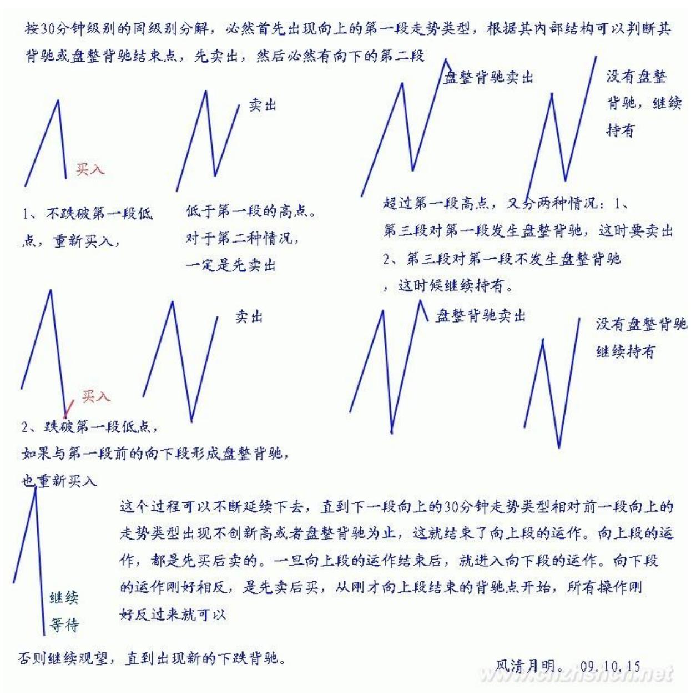
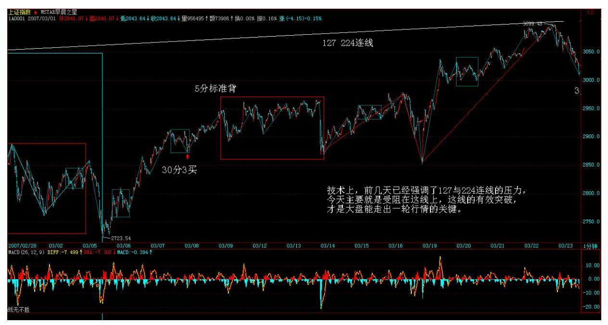
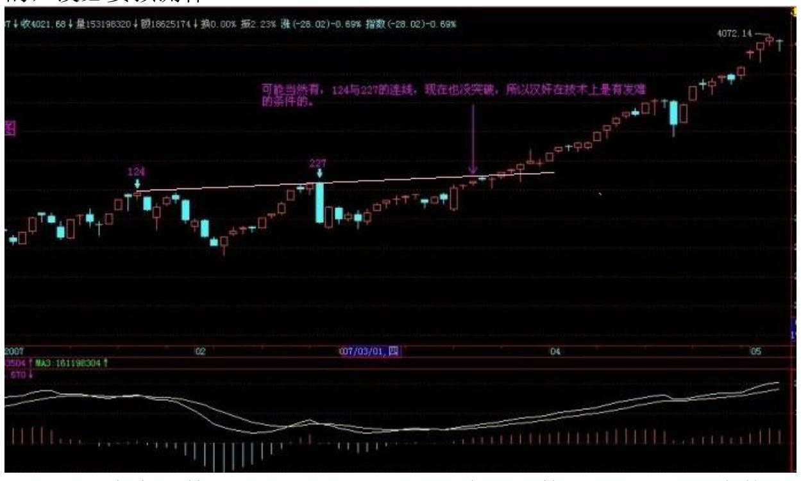
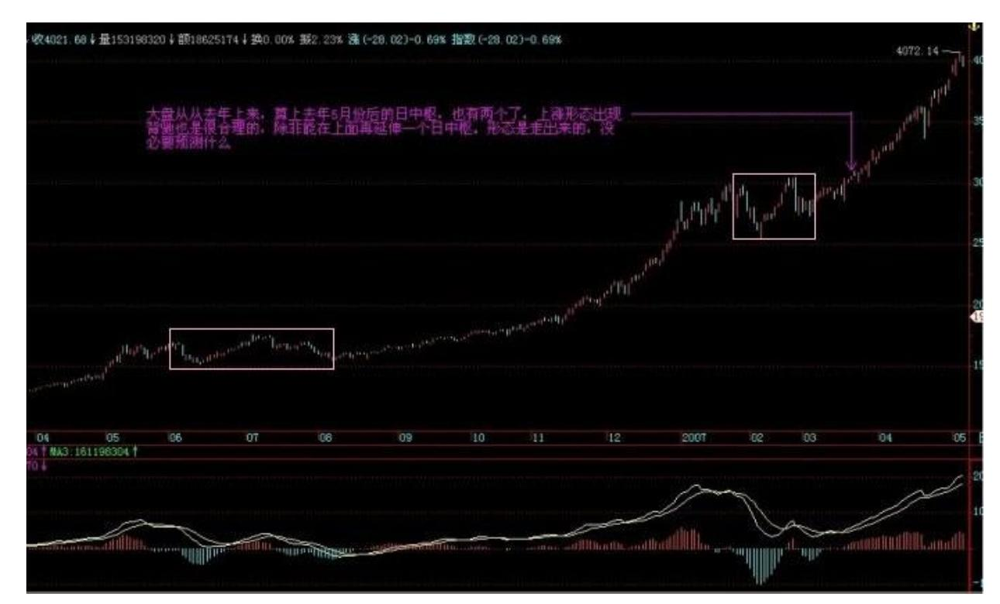
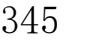
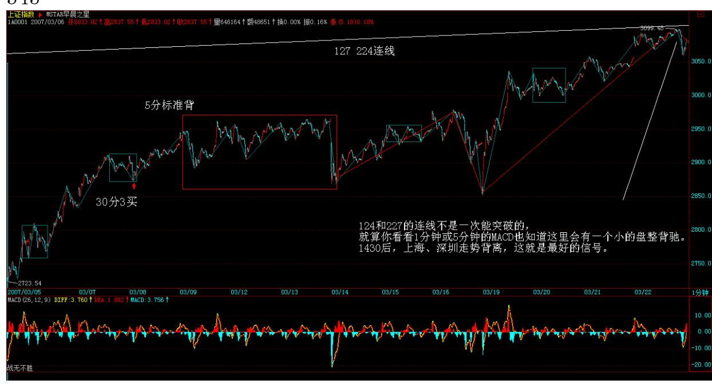
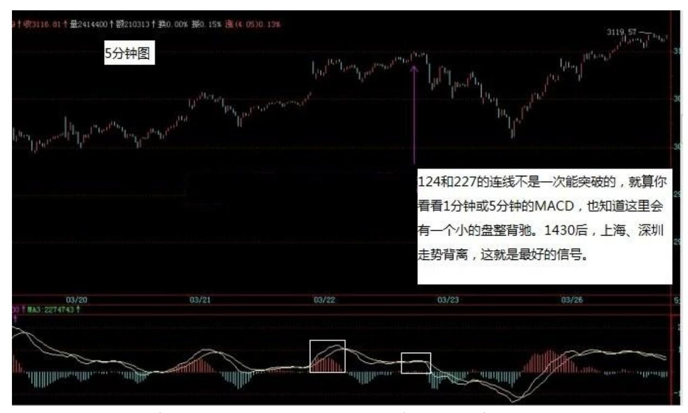

# 教你炒股票 38:走势类型连接的同级别分解

(2007-03-21 15:23:21)站在纯操作的角度,由于任何买卖点,归根结 底都是某级别的第一类买卖点,因此,只要搞清楚如何判断背驰,然 后选好适合的级别,当该级别出现底背驰时买入,顶背驰时卖出,就 一招鲜也足以在市场上混好了。不过,任何事情都应该究底穷源,这 有点像练短跑,跑到最后,提高 0.01 秒都很难,所以越往后,难度 和复杂程度都会越来越深,如果一时啃不下来,就选择可以把握的, 先按明白的选择好操作模式,等市场经验多了,发现更多需要解决的 问题,有了直观感觉,再回头看,也不失为一种学习的办法。当然, 都能看懂并能马上实践,那最好。

前面谈了有关走势类型连接结合的多义性问题,虽然已多次强调多义 性不是含糊性,但不少人依然产生误解,认为走势就可以胡乱分解 了,这是不对的。多义性是与走势的当下性密切相关的,但对已完成 走势类型连接进行相应的分解,就如同解问题设定不同的参数,虽然 参数的设定有一定的随意性,但一个好的参数设定,往往使得问题的 解决变得简单。根据结合律,如何选择一种恰当的走势分解,对把握 当下的走势极为关键。显然,一个好的分解,其分解规则下,必须保 证分解的唯一性,否则这种分解就绝对不可能是好的分解。其中,最 简单的就是进行同级别分解。所谓同级别分解,就是把所有走势按一 固定级别的走势类型进行分解。根据"缠中说禅走势分解定理",同 级别分解具有唯一性,不存在任何含糊乱分解的可能。

同级别分解的应用,前面已多有论述,例如,以 30 分钟级别为操作 标准的,就可用 30 分钟级别的分解进行操作,对任何图形,都分解 成一段段 30分钟走势类型的连接,操作中只选择其中的上涨和盘整类 型,而避开所有下跌类型。对于这种同级别分解视角下的操作,永远 只针对一个正在完成着的同级别中枢,一旦该中枢完成,就继续关注 下一个同级别中枢。注意,在这种同级别的分解中,是不需要中枢延 伸或扩展的概念的,对 30 分钟来说,只要 5 分钟级别的三段上下上 或下上下类型有价格区间的重合就构成中枢。如果这 5 分钟次级别延 伸出(娇:延伸成)6 段,那么就当成两个 30分钟盘整类型的连接, 在这种分解中,是允许盘整+盘整情况的。注意,以前说不允许"盘整 +盘整"是在非同级别分解方式下的,这在下面的课中会讲到,所以不 要搞混了。

有人可能马上要问,同级别分解的次级别分解是否也是同级别分解 的。答案是,不需要。这里在思维上可能很难转过弯,因为一般人都 喜欢把一个原则在各级别中统一运用,但实际上,你完全可以采取这 样的分解形式,就是只要某级别中进行同级别分解,而继续用中枢扩 展、延伸等确定其次级别,这里只涉及一个组合规则的问题,而组合 的规则,是为了方便操作以及判断,只要不违反连接的结合律以及分 解的唯一性,就是允许的,而问题的关键在于是否明晰且易于操作。

337 说得深入一点,走势分解、组合的难点在于走势有级别,而高级 别的走势是由低级别构成的,处理走势有两种最基本的方法,一种是 纯粹按中枢来,一种是纯粹按走势类型来,但更有效的是在不同级别 中组合运用。因此,完全合理、不违反任何理论原则的,可以制定出 这样的同级别分解规则:在某级别中,不定义中枢延伸,允许该级别 上的盘整+盘整连接;与此同时,规定该级别以下的所有级别,都允许 中枢延伸,不允许盘整+盘整连接;至于该级别以上级别,根本不考 虑,因为所有走势都按该级别给分解了。

按照以上的同级别分解规则,用结合律很容易证明,这种分解下,其 分解也是唯一的。这种分解,对于一种机械化操作十分有利。这里, 无所谓牛市熊市,例如,如果分解的级别规定是 30 分钟,那么只要 30 分钟上涨就是牛市,否则就是熊市,完全可以不管市场的实际走势 如何,在这种分解的视角下,市场被有效地肢解成一段段 30 分钟走 势类型的连接,如此分解,如此操作,如此而已。

注意,这种方法或分解是可以结合在更大的操作系统里的。例如,你 的资金有一定规模,那么你可以设定某个量的筹码按某个级别的分解 操作,另一个量的筹码按另一个更大级别的分解操作,这样,就如同 开了一个分区卷钱的机械,机械地按照一个规定的节奏去吸市场的 血。这样不断地机械操作下去,成本就会不断减少,而这种机械化操 作的力量是很大的。

其实,根本无须关心个股的具体涨幅有多少,只要足够活跃,上下震 荡大,这种机械化操作产生的利润是与时间成正比的,只要时间足够 长,就会比任何单边上涨的股票产生更大的利润。甚至可以对所有股 票按某级别走势的幅度进行数据分析,把所有历史走势都计算一次, 选择一组历史上某级别平均震荡幅度最大的股票,不断操作下去,这 样的效果更好。这种分解方法,特别适合于小资金又时间充裕的进行 全仓操作,也适合于大资金进行一定量的差价操作,更适合于庄家的 洗盘减成本操作。当然,每种在具体应用时,方法都有所不同,但道 理是一样的。

具体的操作程式,按最一般的情况列举如下,注意,这是一个机械化 操作,按程式来就行:不妨从一个下跌背驰开始,以一个 30 分钟级 别的分解为例子,按 30 分钟级别的同级别分解,必然首先出现向上 的第一段走势类型,根据其内部结构可以判断其背驰或盘整背驰结束 点,先卖出,然后必然有向下的第二段,这里有两种情况:1、不跌破 第一段低点,重新买入,2、跌破第一段低点,如果与第一段前的向下 段形成盘整背驰,也重新买入,否则继续观望,直到出现新的下跌背 驰。在第二段重新买入的情况下,然后出现向上的第三段,相应面临 两种情况:1、超过第一段的高点;2、低于第一段的高点。对于第二 种情况,一定是先卖出;第一种情况,又分两种情况:1、第三段对第 一段发生盘整背驰,这时要卖出;2、第三段对第一段不发生盘整背 驰,这时候继续持有。这个过程可以不断延续下去,直到下一段向上 的 30 分钟走势类型相对前一段向上的走势类型出现不创新高或者盘 整背驰为止,这就结束了向上段的运作。向上段的运作,都是先买后 卖的。一旦向上段的运作结束后,就进入向下段的运作。向下段的运 作刚好相反,是先卖后买,从刚才向上段结束的背驰点开始,所有操 作刚好反过来就可以。

338 339

\*\*\*\*\*\*

解盘及互动问答:

\*\*\*\*\*\*

缠师:大盘走势没什么可说的,如果不会看的,就看好 5 日线,5日线不破,什么问题都没有。当然,汉奸还会发难的,汉奸特别喜欢周

四发难,本ID 很欢迎汉奸出手,汉奸最好就把货都倒到 3000点以下 去,然后离开中国去美国当孙子。

中行今天继续休息,等 5 日线上来,这种大盘股票,不可能太远离5 日线,毕竟金融股是汉奸的老巢,上攻过激汉奸会发情的,到时候呕 吐一地,让大家恶心就不好了。

各股没什么可说的,板块依然那些板块,个股依然那些个股。当然, 除了那 14 只股票,联通、中行,本 ID 最近又独自去偷欢了几只, 用本 ID 减成本的方法,最终的结果就是钱越来越多,而筹码不见 少,所以必须多看几个仓才能满足。具体就不说,基本都是北京本地 股,熟人多,消息也有保障。

那 14 只个股,元旦前后的前 8 只,都基本翻倍了,有些已经开始向 翻两倍进军,其他的也会跟上来的,关键是你能否按本 ID 的建议, 持有并用部分打短茶,如果能,那你的成本应该不断减,这样就永远 不败了。

周四、周五,血战少不了,就看汉奸如何出手了,本 ID 再等着,大 不了再震荡一次,本 ID 陪着汉奸玩 20 年,一直玩上 30000点,时 间多的是,本ID 不急。2007-03-21 15:24:07对汉奸的周四发难,昨 天已经明说。汉奸总是很听话的,而本 ID的股票,除了些新进的北京 股,今天基本上一大早就开始主动调整,就是不想让汉奸有发力的机 会。汉奸也特没力,只能选择尾盘偷袭,一点新意都没有。后面三天 特别关键,只要这三天能在前期高位上收住,那突破的有效性就有保 障了,很多心态不稳的人也会重新回来。技术上,前几天已经强调了 127 与 224 连线的压力,今天主要就是受阻在这线上,这线的有效突 破,才是大盘能走出一轮行情的关键。2007-03-22 15:29:02

340 341 现在的走势很微妙,汉奸也有机会,毕竟现在很多人的心态 不稳,但汉奸的机会并不会对本 ID 造成任何损害,本 ID 的原则 是,稳打不冒进,如果机会不成熟,就反复震荡等机会成熟,绝对不 给汉奸好的下手机会。不过,现在有些多头太冒进、太急功近利,并 不是什么好事,本 ID 只管好自己这一拨就可以,别人爱干什么可管 不住。只要实力不断增长,试看几年后是谁的天下?2007-03-21 15:30:14

#### \*\*\*\*\*\*\*\*\*\*\*\*\*\*\*\*\*\*\*\*。

1. 网友 Anytime: 有些药的业绩不好,一直亏损,可以关注吗? 2007-03-21 15:26:33缠师:任何板块都分一、二、三线。你回想一下 去年酒的运动。先炒一线股,后炒二线股,最后连沱牌这类三股线都 动起来了,就差不多大调整了。酒大调整完,还要上的,像去年的有 色,今年一样表现。

#### \*\*\*\*\*\*\*\*\*\*\*\*\*\*\*\*\*\*\*\*。

2. 网友 [匿名] 新手: 老大,600343 走的实在是太软了,还有戏 吗? 2007-03-21 15:28:43缠师:343 是一个汉奸基金拿得特别多, 让他低位吐点出来有什么不好的?中线没问题。999 如果不让那汉奸 基金在 10 元上吐了数千万股,现在能走成这样吗?

3. 网友 [匿名] 草草: 以前总是为了买点,错失了做短差的机会。 现在知道了。也就是这样,当一个股票突破中枢上去,如果没有背 驰,是可以继续持有的。如果出现了背弛就卖,调整回来不破中枢高 点又买,然后上去不过中枢延伸的 b 段又可以卖了,往返操作,就可 以了。 2007-03-21 15:41:09缠师:没背驰,就意味着走势类型没结 束,还可以继续下去,当然没必要操作了。

#### \*\*\*\*\*\*\*\*\*\*\*\*\*\*\*\*\*\*\*\*。

342 4. 网友 [匿名] 漂泊: 禅主,今年的电力蓝筹股怎么还不见启 动啊?是不是金融股后才是电力啊? 2007-03-21 15:44:15缠师:电 力是另一波人在搞,本 ID 去年负责喝酒,今年负责吃药,顺便再为 以后储藏点环保、军工、农业、旅游、科技之类的,电力、汽车这 些,本ID 可顾不过来,国家又不资助本 ID 一万几千亿的,不可能把 所有板块都搞了。

#### \*\*\*\*\*\*\*\*\*\*\*\*\*\*\*\*\*\*\*\*。

5. 网友 [匿名] 荷塘: 915 感觉在今天 13:25 时 5 分钟背驰,想 做短差但又举棋不定,请 LZ 指教。 2007-03-21 15:47:53缠师:本 ID 这里有一个规矩,就是本 ID 说的那 14 只股票,都不具体分析 的,因为不能又当球员又当裁判,连黄健翔之流的活也抢来干,这样 太不地道了。这 10 几个股票的具体问题,可以问其他人,其他人可 以回答。

#### \*\*\*\*\*\*\*\*\*\*\*\*\*\*\*\*\*\*\*\*。

6. 网友 [匿名] 首钢股份: 女王,汽车股今后是否还有发展?今天 000800 翻番了我跑光了。昨天在平安大道看到一个漂亮 mm,开一辆 奥迪 Q7 越野车,突然想起女王来。2007-03-21 15:45:21缠师:其实 更好的操作是跑一半,变成 0 成本,这样能获取更大的利益。毕竟很 多汽车都是刚上路的。

#### \*\*\*\*\*\*\*\*\*\*\*\*\*\*\*\*\*\*\*\*。

7. 网友 [匿名] 白玉兰: 请教妹妹,有色金属锌的行情好吗?2007- 03-21 15:57:30缠师:有色金属的大牛市还要延续很长时间,短线的 震荡改变不了大趋势。国内锌期货很快也有了,疯一阵是免不了了。

不过期货风险比股票大,如果没有足够的时间与经验,还是少碰为 好。

343 8. 网友 [匿名] 勤学好问:楼主,从大盘日线上看,MACD 是不 是已经算双0轴回试了? 有点形成日线上涨背驰的可能,对吗? 2007-03-21 16:05:19缠师:这个可能性当然有。124 与 227 的连 线,现在也没突破,所以汉奸在技术上是有发难的条件的。大盘从去 年上来,算上去年 5月份后的日中枢,也有两个了。上涨形态出现背 驰也是很合理的,除非能在上面再延伸一个日中枢。形态是走出来 的,没必要预测什

么,而且大盘指数并不太重要。元旦到现在,指数没涨多少,但为什 么本 ID 元旦前后说的 8 只股票都基本翻倍了?344

347 348 9. 网友 [匿名] hehe2: 博主说的原则真的是太重要了。 可惜本人太急功紧利,经常违反。今天, 知道要空仓了。 三个股 票,只有一个是按照卖点卖出去的, 其他两个, 有点心急都没有按 卖点抛,所以操作上很失误,该赚的钱在面前也没有赚到。真的是很 惭愧。 2007-03-22 15:49:58缠师:股市永远有机会,路长着呢。百 炼成钢。关键要总结。不怕犯错。就怕总犯同一个错误。永远检讨, 不断改正。

#### \*\*\*\*\*\*\*\*\*\*\*\*\*\*\*\*\*\*\*\*。

10. 网友空读: 某一级别的一段走势,在当下如何判断走势是否结束 了呢?比如,30 分钟级别第二段向上的走势,如果没到达到第一段的 高点, 稍微拐头时,从何判断是小跌一下形成一个小级别中枢后再冲 高呢?还是已经走完,就一直跌下去了呢?拐头时下跌多少才能判断 出来?要形成低级别的第三类卖点才能确定吗?2007-03-22 15:35:59 缠师:背驰、盘整背驰,都是走势分段的依据。所谓第三类买卖对盘 整结束的确认,最终也要看其内部结构的背驰、盘整背驰。不是等真 跌了才问卖不卖,而是涨的时候一旦进入背驰的区间套里,就要陆续 走。当然,资金小的可以等到最后几个价位,资金大的就不可能了。 第一卖点没走,就要在第二卖点走。如果等到第三卖点,估计都跌很

多了。宁愿卖早了,坚决不要卖迟了,股票都是废纸,有钱还怕买不 到废纸。

#### \*\*\*\*\*\*\*\*\*\*\*\*\*\*\*\*\*\*\*\*。

11. 网友 [匿名] 酒吧心情: "不过,现在有些多头太冒进、太急功 近利了,并不是什么好事。"JJ 的这句话说到我心里去了。今天的状 况就是这样,太激进了,很容易被偷袭。我觉得还是学学老毛,农村 包围城市,抗日抗了 8 年,解放用了 3 年。难道股市不能多等个几 天?希望 JJ 给予点评。2007-03-22 15:46:10缠师:本 ID 现在的能 力只能管好自己的地盘,像中行这几天一直不动,其实就是对大盘最 大的贡献。就算汉奸敢在这个位置开始对中行发难,下去的空间能有 多少?毕竟中行有业绩增长、奥运等特别支持。现在关键是要稳定人 心,绝大多数的人都怕假突破,这就是汉奸的机会,所以一定不能 急。不过,市场不是本 ID 一个人的,有些人的钱,来路不明,急着 挣一把就跑,这种人是需要市场好好给点教训。

\*\*\*\*\*\*\*\*\*\*\*\*\*\*\*\*\*\*\*\*349 12. 网友 [匿名] 首钢股份: 明天找机会 建仓中行。女王,我的问题您没看到?北京旅游和中行,在今天砸盘 之前的走势不同,不知道您是怎么考虑的?北旅已经连拉阳线,近期 是否还有介入的机会?2007-03-22 16:21:44缠师:一般投资者没必要 参与中行了。那是打架用的,幅度不一定能满足小资金的要求。至于 怎么考虑这种事情就没必要说了,这里毕竟不是自己家的客厅,什么 人都有,把所有底牌都说出来,那就不是对局了,看走势,那是一 切。

#### \*\*\*\*\*\*\*\*\*\*\*\*\*\*\*\*\*\*\*\*。

13. 网友 [匿名] touchnet: 老大昨天的文章说,不跌破第一段低 点,重新买入。请问老大,这个"不跌破"是靠次别判断吗?2007- 03-22 15:57:49缠师:对。需要该段内部结构的确认。

#### \*\*\*\*\*\*\*\*\*\*\*\*\*\*\*\*\*\*\*\*。

14. 网友 [匿名] touchnet:"分解定理,可以分解成同级别的盘整 与趋势。"这个盘整与趋势中的中枢是同一级别吧?不是盘整中的中 枢大一级别?缠师:同级别分解,当然都是同级别的中枢。不存在盘 整中枢更大的问题。更大就分解成小的,这才叫同级别分解。

#### \*\*\*\*\*\*\*\*\*\*\*\*\*\*\*\*\*\*\*\*。

15. 网友 [匿名] touchnet:级别分解中的起点问题,走势中任意一 高低点都可做一个走势类型的分界点吗?缠师:当然不是,必须是前 面走势类型的结束点。

#### \*\*\*\*\*\*\*\*\*\*\*\*\*\*\*\*\*\*\*\*。

350 16. 网友 [匿名] 小明: 老大,600343 据我在盘面的观察,3月 13 日那天,不断有大单成交而股价却没怎么动,我当时的理解为庄家 在拉升前的调仓,随后 3 月 14 日来个陡峭的拉升,我以为是庄家在 试盘,更坚定我持有的信心。从现在来看好像不是。能不能说说 3 月 13 日那天的行为是在干什么?缠师:思维要改过来。一个股票里不一 定只有一拨人。现在的问题是,有一拨人太汉奸,不喜欢他们还待 着,就像 999 破 10 元那次一样。具体的事就没必要问了。

#### \*\*\*\*\*\*\*\*\*\*\*\*\*\*\*\*\*\*\*\*。

17. 网友 [匿名] 新浪网友: 请问博主,为什么工行是老大,还排在 中行后面呢? 2007-03-22 16:50:18缠师:工行本来就不应该比中行 贵,以前只是因为新股,汉奸跑进来容易。无论业绩、盘子、管理水 平,工行哪一点比得上中行?

#### \*\*\*\*\*\*\*\*\*\*\*\*\*\*\*\*\*\*\*\*。

18. 网友两只老虎: 神仙姐姐真是旷世奇女子啊!对了,姐姐,您前 几天说的关于"媒体"的事怎么样了? 2007-03-22 16:34:59缠师: 已经成了,具体是什么不方便说。因为不希望在还没完全成型时受到 意外干扰,总之以后有一个稳定的渠道了。
