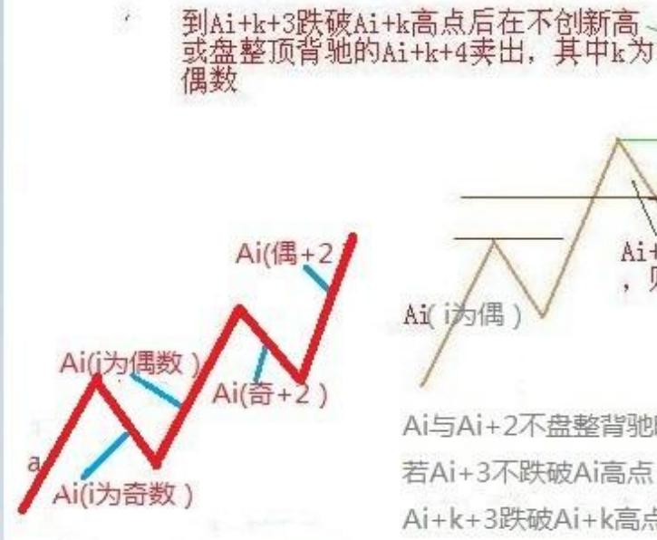
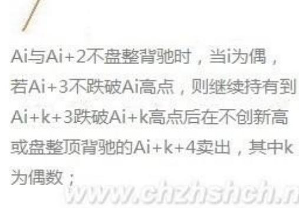
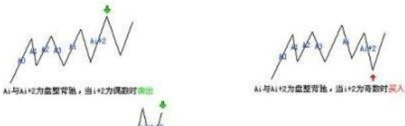
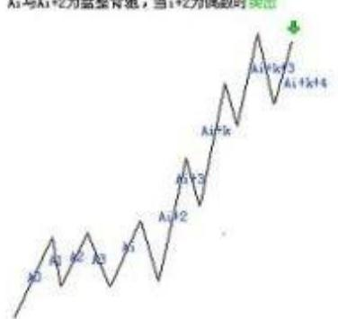
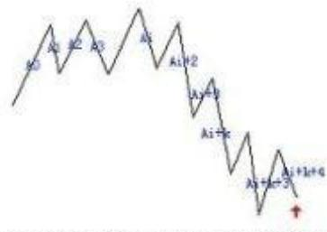
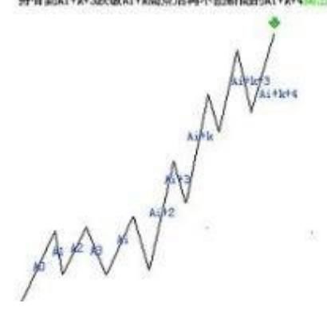
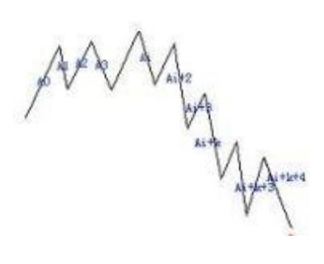
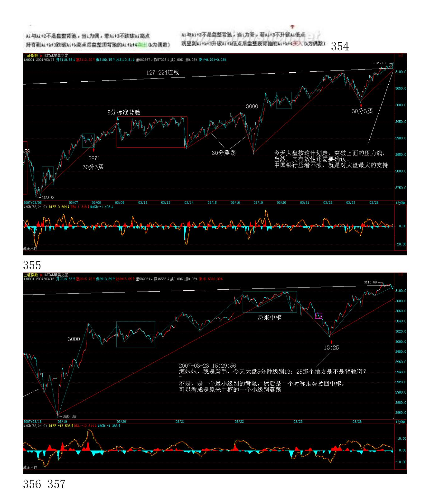

# 教你炒股票 39:同级别分解再研究

(2007-03-23 15:16:51)股票都是废纸,还怕有钱买不着废纸?因此, 对于任何操作来说,只要赚钱卖出,是无所谓错误的;反过来,股票 是吸血的凭证,没这凭证,至少在股票市场里是真吸不了血的,因 此,只要卖了能低价位回补,就无所谓错误。至于卖了可能还涨,回 补可能还跌,这是技术的精确度问题,就像练短跑,如果你永远只会 撒腿乱跑,那你不可能达到高层次,而基础的练习都很枯燥,甚至 100 米,每段怎么跑,多少步,可能都要按一个机械的要求来,最终

形成一个韵律,这才有可能达到高层次。股票的操作一样,首先就要 培养这样一个韵律,不排除在这个培养、训练的过程中,开始还比不 上以前撒腿乱跑的速度,但坚持下去,等韵律感形成,那进步就不是 撒腿乱跑的能比了。

上节说了一个机械的操作程式,这就有一个基本的韵律,其中最大的 就是向上段先买后卖与向下段先卖后买的韵律,如果这个韵律都错 了,那操作就一团糟。很多人的买卖其实都是靠天吃饭,买了,赌的 就是上下两面,因此不管位置、不管时间、不管当下的走势结构,胡 乱瞎买,然后又胡乱瞎卖。大的韵律把握了,还有就是每向上向下段 中每小段间操作的韵律,显然,只要其中一步错了,这舞步就乱了。 这时候,唯一正确的选择就是停止操作,先把心态、韵律调节好了才 继续。而且,当你按这个机械节奏不断操作下去,人身体的生物节奏 都会慢慢有所感应,甚至可以达到这种程度,就是那种该操作的图形 出现时,生理上就仿佛有感应一般。其实,这一点都不神秘,就好象 有些人睡觉,无论多晚,早上到点都会自动醒来,而股票的操作,都 有一定的紧张度,而同级别走势类型分解的节奏,大致有一定的周期 性,长期下来,生理上有自然的反应就一点都不奇怪了。

注意,下面的分析,如果对数学推理陌生的,大概要迷糊透,所以请 先准备纸和笔,对着画图,才能搞清楚。

按同级别分解操作,还可能有更广泛、更精确的操作。对 5 分钟的同 级别分解,以最典型的 a+A 为例子,一般情况下,a 并不一定就是 5 分钟级别的走势类型,但通过结合运算,总能使得 a+A 中,a 是一个 5 分钟的走势类型,而 A,也分解为 m 段 5 分钟走势类型,则 A=A1+A2+..+Am。想考虑 a+A 是向上的情况,显然,Ai 当I 为奇数时 是向下的,为偶数时是向上的,开始先有 A1、A2 出现,而且 A1 不 能跌破 a 的低点,如果 A2 升破 a 的高点而 A3不跌回 a 的高点, 这样可以把 a+ A1+A2+A3 当成一个 à,还是 5 分钟级别的走势类 型。因此,这里可以一般性地考虑 A3 跌破 a 的高点情况,这样, A1、A2、A3 必然构成 30 分钟中枢。因此,这一般性的 a+A 情况, 都必然归结为 a 是 5 分钟走势类型,A 包含一30 分钟中枢的情况。

把 a 定义为 A0,则 Ai 与 Ai+2 之间就可以不断地比较力度,用盘 整背驰的方法决定买卖点。这和前面说的围绕中枢震荡的处理方法类 似,但那不是站352 在同级别分解的基础上的。注意,在实际操作中 下一个 Ai+2是当下产生的,但这不会影响所有前面 Ai+1 的同级别唯 一性分解。这种机械化操作,可以一直延续,该中枢可以从 30 分钟 一直扩展到日线、周线甚至年线,但这种操作不管这么多,只理会一 点,就是 Ai 与 Ai+2 之间是否盘整背驰,只要盘整背驰,就在i+2 为偶数时卖出,为奇数时买入。如果没有,当 i 为偶,若Ai+3 不跌 破 Ai 高点,则继续持有到 Ai+k+3 跌破 Ai+k 高点后在不创新高或 盘整顶背驰的 Ai+k+4 卖出,其中 k 为偶数;当 i 为奇数,若 Ai+3 不升破 Ai 低点,则继续保持不回补直到 Ai+k+3升破 Ai+k 低点后在 不创新低或盘整底背驰的 Ai+k+4 回补。(娇注:此处漏掉 Ai 与 Ai+2 不新高新低的分类)。看完上面这段,至少 90%以上的人都心跳 加速,头晕眼花。不过没办法,这是最精确的表述,画着图应该不难 明白。以上的方法,最大的特点是,就是在同级别分解的基础上将图 形基本分为两类,一类是"当 i 为偶Ai+3不跌破 Ai 高点"或"i 为 奇数 Ai+3 不升破 Ai 低点" ;一类是"Ai 与 Ai+2 之间盘整背 驰"。对这两种情况采取不同的操作策略,构成了一种机械的操作方 法。

Ai与Ai+2之间是否盘整驰, 只要盘整背驰,就在i+2为偶数时卖出,为奇数时买入

Ai+3不跌破Ai高点 ,则继续持有

353

Ai 与Ai+2不是盘整青糖,当i为偶,若Ai+3不跌破Ai 商点 持有到Ai+k+3跌破Ai+k高点后再不创新高的Ai+k+4而出 0b为佛数)

Ai与Ai+2不是整整背池,当i为音,若Ai+3不升碳Ai低点 筑望到Ai+k+3升破Ai+k低点层在不创新低的Ai+k+4买入(k为偶数)

\*\*\*\*\*\*\*\*\*\*\*\*\*\*\*\*\*\*\*\*\*\*\*\*\*\*\*\*\*\*\*\*\*\*\*\*\*\*

解盘及互动问答:

#### \*\*\*\*\*\*\*\*\*\*\*\*\*\*\*\*\*\*\*\*。

1. 网友 [匿名] 塔: 601333 放量突破上市以来的高点,同学们上 啊! 2007-03-23 15:28:39缠师:对付汉奸的武器多着呢。其他去年 很牛,这几个月严重调整的板块,也会动的。所以前段时间才说,不 能光炒三线,比价在那里,靠假消息乱搞,等于帮助汉奸。不过,散 户不一定买指标股,因为相对还是慢点。可以多关注 10 元上下的二 线股,只要盘整足够,重新有启动迹象的,都可以关注。

#### \*\*\*\*\*\*\*\*\*\*\*\*\*\*\*\*\*\*\*\*。

2. 网友 [匿名] 新手却是老粉丝: 楼主好!我几乎天天都来这里看 看您们,但最近才有时间学习股票理论。中枢的概念我大致清楚了, 可是一旦打开图时就傻了,图里尽是高高低低的,不知怎么样去找相 关的中枢,是目测?还是用"区间统计"?2007-03-2315:33:36缠 师:你首先要搞清楚级别,然后搞清楚中枢定义的递归方法,这是最 基础的,课程里都有。

#### \*\*\*\*\*\*\*\*\*\*\*\*\*\*\*\*\*\*\*\*。

3. 网友 [匿名] 酒吧心情: JJ 好!今天帮同事练了一下000938,在 下午的时候抓了个 12.20 元,虽然不是很精确,但是小有收获。目前 的问题,是个股配合大盘的问题。如果选择大盘股票,比较稳妥,看 图行事。但是如果选择其他个股,特别是对指数灵敏度高的,在现在 的高位,虽然看到小级别买点,但总是怕大盘单边跌,然后在 T+1 的 模式下很难获利。希望 JJ 能够指点,怎么样在这种高位踩准节奏.。 2007-03-23 15:28:02缠师:这几堂课就是说这个问题,你必须有一定 的节奏韵律。例如,高位没走,低位去回补等于加仓。这样不好。一 定要搞清楚向下段与向上段。特别资金不大的,卖了就全买。回补如 果信心不足,可以分单回补。只要是先卖的,回补起来就不会害怕 了。所以节奏是第一的。你跳舞,节奏全乱,会有好心情、好心态 吗?358

#### \*\*\*\*\*\*\*\*\*\*\*\*\*\*\*\*\*\*\*\*。

4. 网友 [匿名] christine: 对不起,缠主,我的问题不该这么问, 二线蓝筹是从沪深 300 中找还是?能否给个明示。谢谢!2007-03-23 15:28:02缠师:前段时间成分股调整比较多,当然更有机会表现。

#### \*\*\*\*\*\*\*\*\*\*\*\*\*\*\*\*\*\*\*\*。

5. 网友 [匿名] 缠迷: 我想问下,5 分钟、15 分钟、30 分钟、60 分钟这几个级别,哪个级别发生背驰,买股票把握最大?我是新手 啊。大家别笑话我问的问题没有技术含量啊。呵呵。 2007-03- 2315:50:46缠师:临走回答一下。事情没有那么机械,还有 a+B 变成 à+B 的情况,你必须把前面的课程看一遍,彻底消化,一两句话没法 说清楚。

#### \*\*\*\*\*\*\*\*\*\*\*\*\*\*\*\*\*\*\*\*。

6. 网友 [匿名] 中枢: 请教大盘/cctv 等学长,对于上周五那一 课,有三个疑问:(1)判断 Ai+3 是否落回 Ai 高点意义何在?不论 是否落回高点,接下来向上的一段都是看它是否背驰而确定是否出 掉?2007-03-26 13:54:42网友【匿名】大盘:判断 Ai+3 是否落回, Ai 高点意义何在。不回落,说明一个中枢也没有形成,也就不可能结 束该段上升走势。回落意味形成中枢,以后就可能产生盘整背驰或者 趋势背驰,所以要密切注意,没有中枢,也就没有背驰。(娇注:没有 盘背 Ai+3 不落回 Ai 高点,表示高级别走势还能继续发展,虽然本 段内背驰但还可以继续持有)网友 [匿名] 中枢:(2)当 Ai+k+3 落 回 Ai+k 高点后,Ai+k+4和谁比背驰?Ai+k+2(同级比),还是 Ai+k (和中枢之前比)?网友【匿名】大盘:回落后,当下的走势段和上 一个同类的走势段比较就可以了。也就是数学符号表达的意思。(娇 注:大盘同学理解有误,相邻段比较或者与中枢前段比较都允许)359 网友 [匿名] 中枢:(3)Ai+k+4 之后,又如何开始新的程序?看 Ai+k+5 落回那个高点?Ai+k+2(机械化操作?),还是A+i+k(中枢 高点,看是否落回中枢形成三买?)网友【匿名】大盘:Ai+k+4 如果 盘整背离或者不升破前一上升段高点,就要先出来。然后直到底部盘 整背离,或者当下下跌低点超过上一下跌段低点。

(娇注:大盘同学超过下跌低点的说法有误,买点为盘整背驰或者不 创新低)。

至于同级别分解,这种机械操作程序的买卖方法,与以前中枢观点方 法下的 3 内买卖点之间的对应当关系,也正是我需要进一步理解的。 这已经在我中午发出的贴子当中提出,并希望大家帮助解答。

7. 网友[匿名] 股虱: 禅 MM,根据您的理论,买点买卖点卖,近期 颇有些斩获,但操作中也遇到些问题。烦请解答:(1)上周五(23 日)发现 600271的 30 分钟背驰了,5 分钟也背驰了,符合区间套原 理。上午在 44 元跟进,但下午却随大盘大幅跳水了。不知我起初的 判断是否有误?后来我发现其图形并未走坏,背驰仍然成立,故在 43 元左右补仓,不知是否妥当?(2)近期发现,有买点的股票基本是 10 元以上的高价股,低价股基本全是卖点,估计下阶段的热点应该是 绩优高价股。可以这样估计吗?2007-03-2615:23:13缠师:这问题已 经早说过了。没有真正题材的三线股,监管压力很大。600271 周五是 1 分钟背驰,后面出现反弹,不过力度有限。5分钟当时并没背驰,就 算看 MACD,也没明显回拉。注意,最好选择周线刚脱离底部的股票, 特别那些技术不好的,就算判断错误,也有改正的时候。

#### \*\*\*\*\*\*\*\*\*\*\*\*\*\*\*\*\*\*\*\*。

8. 网友 [匿名] wsmrzw: 缠妹妹,600855 如何?军工板块又没有动 静了,十分担心。2007-03-26 15:31:42缠师:板块要轮动的,一天把 所有股票都涨完,明天涨什么?

#### \*\*\*\*\*\*\*\*\*\*\*\*\*\*\*\*\*\*\*\*。

360 9. 网友 [匿名] whq999: 今天不关心股市,想请教缠妹一下房 市,最好讲上海的。对于穷人来说,何时买比较合适?不希望这边炒 股,那边房在涨,白忙了。谢谢 2007-03-26 15:33:59缠师:以前写 过文章,说房地产一定跌不下去,结果给人骂。本 ID说的是事实,你 看现在北京的房子,后来怎样?一直涨,根本没有跌过。要房子跌, 必须硬着陆,但在国家找到新的增长动力前,政府也有很多忌讳。总 之,房价只可能有小调整,大调整,除非中国经济不行了。本 ID 支 持房子的双轨制,一般住房,应该国家或单位建造;高档的才商品 化,不走这条路子,房价不可能降下来。

网友 [匿名] whq999:老大,这双轨制也有问题。国家建,那负责建 房的部门可猛贪了;单位建房,那有钱的单位又可分房了,一人几 套。没钱的单位,还是为一套房子打破头。呵呵。

缠师:难道现在的房子里,就没有这种因数?现在只是所有人,为房 地产商和地方政府及其相应的主管机关等埋单,这其实是一个共有的 问题,解决这个问题,是一个更大层面的事情。

#### \*\*\*\*\*\*\*\*\*\*\*\*\*\*\*\*\*\*\*\*\*。

10. 网友 [匿名] 中信海直: 请问 mm,这套理论是不是也可以用在 欧美的股市中。像美国股市 t+0,且没有涨跌幅限制,用这套理论是 不是还要注意一些什么?谢谢。 2007-03-26 15:43:23缠师:都一 样,没什么区别。期货之所以有点区别,就是因为有交易凭证是即时 可变的,股票不存在这个问题。

#### \*\*\*\*\*\*\*\*\*\*\*\*\*\*\*\*\*\*\*\*。

11. 网友 [匿名] 新浪网友: 600640,15.42 元进的。到现在一个礼 拜还是这个价,不知道此股有没有风险?我没有什么消息。毕竟已经 大涨过一回了。希望楼主给个指导意见。是不是可以继续持有?2007- 03-26 15:36:32缠师:这种题材股,最近都是有点怕监管。图形并不 差,暂时用中枢震荡的方法处理,中线还有一波的机会不小,但前提 是不要被监管了。
