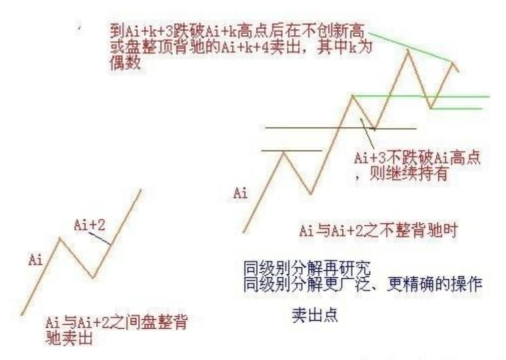
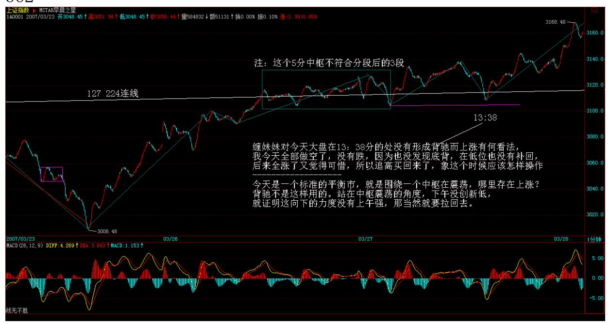
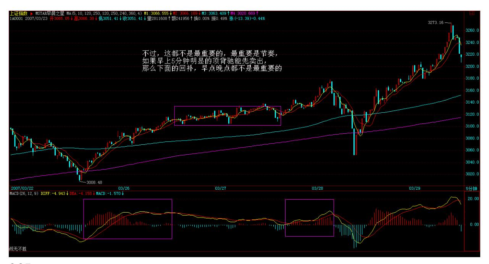
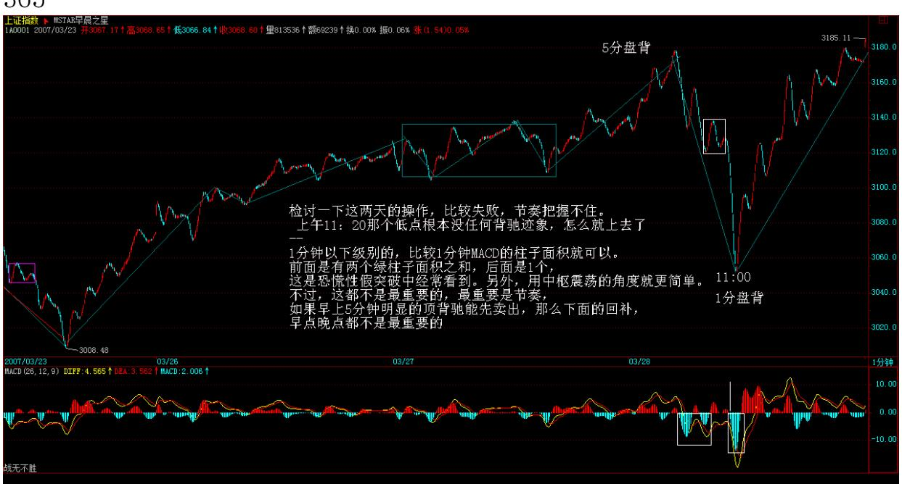
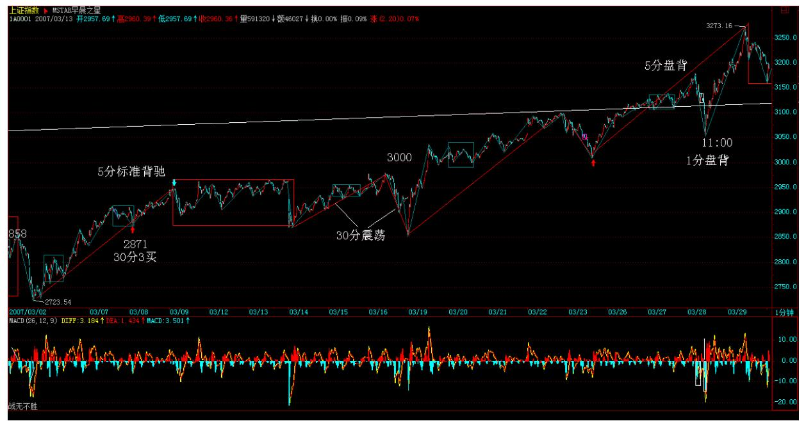

# 教你炒股票 40:同级别分解的多重赋格

(2007-03-27 12:53:22)投资,往往碰到这样两难的事情,就是一个小 级别的进入,结果出现大级别的上涨,这时候怎么办?这时候有两个 选择:一、继续按小级别操作,这样的代价是相当累,而且小级别操 作的问题是对精确度要求比大级别高,而且资金容纳程度低;二、升 级为大级别操作基础上部分保持小级别操作。对于资金比较大的投 资,后者是比较实用的。

上节中的"Ai 与 Ai+2 之间盘整背驰",将演化出"当 i 为偶Ai+3 跌破 Ai 高点"或"i 为奇数 Ai+3 升破 Ai 低点" ;因而相应演化 出高一级别的中枢,例如在该例子里,Ai+1、Ai+2、Ai+3就是 30 分 钟的中枢,而所有更大的中枢,当然是先有高一级别才可能有,否则 连 30 分钟的中枢都没有,哪里来日、周、月的?但这个现象就保证 了,在同级别分解下,一个小级别的操作是可以按一个自动模式换档 成一个高级别的操作。

一般情况下,在上面 5 分钟同级别分解的例子中,只要从 A0 开始到 某个 At,使得 A0+A1+".+At=B1+B2,后者是 30 分钟级别的同级别分 解,这时候就可以继续按后一种分解进行相应的操作。当然,是否换 档成后一种级别的操作,与你的时间、操作风格、资金规模有关。但

本 ID 还是建议,可以进行这种短线变中线的操作,即使你的资金量 很小,但如果出现一种明显的大级别走好,这种操作会让你获得稳定 的大级别波动利益,因此,根据当下的情况去决定是否换档,就如同 开车时根据路况等决定档位一样。 对于大资金来说,这种级别的操作 可以一直延伸下去,可以变成 N 重层次的操作,每一重都对应着一定 的资金与筹码,而相应对应着不同的节奏与波动。如果对古典音乐有 点了解的,就知道,这如同赋格曲,简单的动机、旋律在 N 个层次上 根据不同的转位、移位、对位等原则运动着,合成统一的乐曲。市场 的走势,其实就是这样的多重赋格,看似复杂,其实脉络清晰,可以 有机地统一在多层次的同级别分解操作中。

在这种同级别分解的多重赋格操作中,可以在任何级别上进行操作, 而且都遵守该级别的分解节奏与波动,只是在不同级别中投入的筹码 与资金不同而已。对于大资金所具有的整体筹码与资金来说,就永远 在一种有活动的多重赋格,实际的市场操作,成了一首美妙的乐曲演 奏,能应和上的知音,就能得到最大的利益与享受。

而每一层次

的操作都是独立又在一个整体的操作中,对这种操作如果没有什么直 观感觉,那就去听听巴赫的音乐,那不仅是音乐的圣经,对股票的操 作同样有益。

363 364

\*\*\*\*\*\*\*\*\*\*\*\*\*\*\*\*\*\*\*\*。

# 解盘及互动问答:

#### \*\*\*\*\*\*\*\*\*\*\*\*\*\*\*\*\*\*\*\*。

1. 网友北纬 36 度 54: 请教禅主,三买后的反转力度确认,主要要 结全哪几个方面来判断?(1)一买后次级回抽不破中枢,是不是回抽 的幅度越小越强?(2) 如果是一个次次级别的反转,突破最近一个 下跌中枢,是不是强势的表现?谢谢! 2007-03-27 21:39:00缠师:离 开中枢的回抽的力度越小,后面可以期待越高。至于形态上,比较复 杂,以后会说到。

#### \*\*\*\*\*\*\*\*\*\*\*\*\*\*\*\*\*\*\*\*。

2. 网友匿名] 新年好: 缠姐好!检讨一下这两天的操作,比较失 败,节奏把握不住。 上午 11:20 那个低点根本没任何背驰迹象,怎 么就上去了? 2007-03-28 15:27:00缠师:1 分钟以下级别的,比较 1 分钟 MACD 的柱子面积就可以。

前面是有两个绿柱子面积之和,后面是 1 个,这是恐慌性假突破中经 常看到。另外,用中枢震荡的角度就更简单。

不过,这都不是最重要的,最重要是节奏。如果早上 5 分钟明显的顶 背驰能先卖出,那么下面的回补,早点晚点都不是最重要的。而且, 个股方面就更明显,例如 000802,1 分钟上破 15 元后,那底背驰就 是最明显的了。

365

367 368 缠师:现在,为争夺的市场控制权,丧失筹码不行。唯一正 确的做法,就是通过震荡把筹码成本降低。由此可见,本 ID 理论, 其实对大资金一样有效。股票都是废纸,只是吸血凭证。关键是能不 能把成本降低为 0 才是真正的安全,0 以下的,才是真正的利润,才 是真正的血。无论散户还是主力,这都是一样的。

#### \*\*\*\*\*\*\*\*\*\*\*\*\*\*\*\*\*\*\*\*。

3. 网友风冷清秋: 姐姐好!问个问题。你选择股票,除了走势、消 息外,还看不看其他?我的意思是,比如说 938,业绩亏损。到该公 司的网页上看看,还是个搞科技的上市公司,网页做得之烂,真不说 了。还有卖的也是电脑城的产品,真是看了都担心? 2007-03-27 21:25:01缠师:看看现在是哪个学校在领导中国?在中国,技术又算 得了什么?任何事情都不能脱离当下,连股票走势都是当下的。

#### \*\*\*\*\*\*\*\*\*\*\*\*\*\*\*\*\*\*\*\*。

4. 网友 [匿名] 草草: 老师能讲讲什么时间之窗之类的课程吗?这 个东西听了好多次,报纸也看过,都神秘兮兮。不知道以后老师能不 能扫扫盲? 2007-03-27 21:48:02缠师:都是一些辅助性的东西,先 把基础框架弄好,才可能装修。

5. 网友 [匿名] 新浪网友: mm 好。我老是逃顶(在高位,股价临近 下跌之前卖股票)处理不好。有无好办法? 2007-03-2721:50:15缠 师:不熟悉的,宁愿卖早,别卖晚。

#### \*\*\*\*\*\*\*\*\*\*\*\*\*\*\*\*\*\*\*\*。

369 6. 网友【匿名】首钢股份: 女王认为像我们这样的低收入低投 入者(约 10-20 万之间),中线投资(当然留出 20%短差),是每 个板块选择一只股票分散投资,还是重仓投入一只好?我目前持有的 是 600008、000683、000959、600526,烦您受累给点意见。

2007-03-27 21:56:00缠师:如果每个板块,一只足够,之所以不敢集 中,是因为没把握。而要进步,就一定不断强迫自己更精细地分析, 提高把握性,这样才能进步。一般,资金不大的,最多两、三个板块 持股就可以,这样在轮动时可以互相照应。你那四只股票中线还行。

#### \*\*\*\*\*\*\*\*\*\*\*\*\*\*\*\*\*\*\*\*。

7. 网友 [匿名] 台湾局势: 缠 mm 好!不知道你对台海局势怎么看 法?是否会发生战争?台湾当局在独立的道路上越走越远,中国政府 不会坐视不管,任其走下去。相对国家的最高利益,政府是否会牺牲 股市的长远发展?2007-03-27 22:00:03缠师:这就像一个中枢震荡, 向上突破代表和平统一,向下突破代表战争统一,问题是出现第三类 买点还是卖点。而这个买卖点是当下的,是合力的结果,预测这些没 意义,因为不可预测。唯一可以断定的是,只要有第三类买卖点,目 前的中枢震荡一定结束。

#### \*\*\*\*\*\*\*\*\*\*\*\*\*\*\*\*\*\*\*\*。

8. 网友 [匿名] 晚安: "但由于目前启动的二线股都有比较强的业 绩等支持,比前期三线股的要稳健,而银行股的低调又使得汉奸打压 无处发力,这就是最近汉奸比较痛苦的地方。" (此处引用缠师的 话)老师,有一点不明白,既然汉奸重仓银行股,打压无处发力,为 什麽不反手上拉呢?他不想挣钱吗?还能就这样半空中挂着,光腚上 吊似的,丢人现眼?2007-03-27 22:00:00缠师:如果你基本都是银行 股,你拉起来干什么?让二、三线股的人出货?学雷锋?汉奸节奏错 了,想改变,没门了。今年二、三线股的大行情和他们没关系了。别

说汉奸了,那些空头,元旦开始就喊着回到 2200 点的,今年的行情 和他们有关系吗?等空头翻多,行情就非如此的行情了。

#### \*\*\*\*\*\*\*\*\*\*\*\*\*\*\*\*\*\*\*\*。

370 9. 网友[匿名] 快乐 VS 菜虫: 看了昨天缠姐关于房产的回贴, 我着实有点糊涂了,所以特地再次请教一下。缠姐之前的关于房产的 文章我看了,就是说房市要股市化,既然股市是没有只涨不跌的,那 房市怎么可能不跌呢?如果不跌还叫股市化吗? 2007-03-27缠师:那 是一个比喻,是用以前的股市监管的无力来比喻现在房产监管的无 力。因为,在很长时间,股市是一个贬义词,其实在现在,很多人还 有这种想法,不信,去问问 70 岁以上的老经济学家们吧。

#### \*\*\*\*\*\*\*\*\*\*\*\*\*\*\*\*\*\*\*\*。

10. 网友[匿名] 迷糊: MM, 按你说的,如果汉奸手上的银行股,如 果有了缠论的买卖点,要不要执行啊?是不是因为你和他们的战斗, 就不看那些了?今天汉奸拉银行是什么目的?他们不是不想给二线股 出货的机会吗 ?银行股的下一步会是什么呢?迷惑了。

2007-03-28 15:35:40缠师:为什么早上拉的和下午拉的一定是同一批 人?为什么早上砸的人,下午不能回补弄差价?早上是纯粹捣乱的。 深圳不跟着,就知道这种捣乱是没意义的。具体细节就不说了。事情 总没有想象那么简单。就算是市场主力,其行为也是不同的。那样认 为市场有一个总庄家的想法是很无聊的。

#### \*\*\*\*\*\*\*\*\*\*\*\*\*\*\*\*\*\*\*\*。

11. 网友[匿名] 无香: 无意中发现这里。已经习惯了天天来学习 下。不知您对基金怎么看?2007-03-28 15:39:46缠师:基金这种模式 是有很大弱点的,特别在一个心态浮动的市场里,基金被阻击而清盘 的可能性是很大的。市场最安全的资金,就是稳定、长期,没有套现 压力的,显然,基金并不符合。

#### \*\*\*\*\*\*\*\*\*\*\*\*\*\*\*\*\*\*\*\*。

缠师:对不起,太晚,要下了。补充一句,节奏是最重要的,操作, 归根结底就是买点买、卖点卖。能否做到,那是技术精确度问题,这

个通过实践,一定会不断提高,所谓熟能生巧。但如果这基本的节奏 都把握不住,那是越实践毛病越多,这是一定要记住的。

下了,再见。

371

#### \*\*\*\*\*\*\*\*\*\*\*\*\*\*\*\*\*\*\*\*。

缠师:下午收盘有事,不能上来,先说两句。这两天关系月、季收 盘,激烈的争斗本在计划中。今天出现如此走势,就是这种争斗的结 果。打不下去,先拉起来,这也是汉奸唯一的途径,如果换了本ID, 也会这样。对银行股不可能压盘,本 ID 不可能在今天去压制中行, 只可能顺势而为,先买后卖也是对的。

当然,大盘股打仗,其他股票就要受累,这是不可避免的,市场不是 慈善场所,如果看不懂的,就看深圳指数,以此为进出,上海指数在 这段时间的失真是不可避免的。个股要习惯根据个股本身的图形进 出,特别股指期货出来后,指数对个股的指导意义更弱。

对于本 ID 来说,中行、联通就是其中的组合而已。等大盘股的争斗 有方向了,其他股票自然重新走好,其实,完全可以以板块轮动来 看。晚上 9 点再来,再见。

#### \*\*\*\*\*\*\*\*\*\*\*\*\*\*\*\*\*\*\*\*。

12. 网友 [匿名] 新浪网友: 照妹妹的意思,明天是一场血战,大盘 明天有可能会大跌? 2007-03-29 21:52:03缠师:不排除这种可能。 特别如果是本 ID 来做空,明天是最好的机会。一个长上影 K 线后, 拉一条长阴,至少可以让很多所谓的技术派痛苦半个月。当然,汉奸 有没有这本事是另外的事。市场不是一个人、一个派别的市场。而 且,市场的走势,很多都是当下发生的。这如同打仗,战机难道能预 先知道吗?像今天,汉奸突然发疯,这时候如果去压盘,那就傻了, 而是要比汉奸更疯。而当汉奸想回砸时比他砸得更快。这就如同剑客 过招,错一步就是万劫不复。里面的工夫深着,哪里有这么简单。

13. 网友 [匿名] 新浪网友: 999 还有希望吗?2007-03-2921:58:43 缠师:999 是某汉奸基金在出货,该汉奸基金,在几元时拿了 5000万 股,11 元上下被赎回,出了 2000 万,然后这次想出清,换600607, 该股票也是372 该汉奸基金的重仓股票。本 ID 从来都是顺势而为, 别人砸,想让本 ID 接,门都没有,你想出,可以,低出吧。

#### \*\*\*\*\*\*\*\*\*\*\*\*\*\*\*\*\*\*\*。

14. 网友 [匿名] 漂泊: 禅主,您给说说 600238,已经底背驰了, 昨天进的,怎么还是被套了呢? 2007-03-29 22:09:26缠师:不明白 级别,永远也不可能真正明白市场,先想清楚是什么级别的背驰。

#### \*\*\*\*\*\*\*\*\*\*\*\*\*\*\*\*\*\*\*\*。

15. 网友 [匿名] 麒麟: 同时从昨天起,对二、三线股进行清洗?二 线蓝筹近期还有戏吗?我是刚换到这个板块的,刚冲了一下,就给套 住了。妹妹辛苦了! 2007-03-29 22:05:02缠师:只要不是过度炒作的 题材股,当然没有问题。不过请注意,任何被套的,肯定都不是在买 点买的。本 ID 反复强调过,心态最重要。很多人,明明知道不是买 点,就是手痒忍不住,这就是心态问题,不解决这个,任何理论都没 用。

股票只有两种,买点上的股票都是好股票,否则就是垃圾股票。大级 别买点的就是最好的绩优股,耐心等待股票成为真正的绩优股,这才 是真正的心态。

#### \*\*\*\*\*\*\*\*\*\*\*\*\*\*\*\*\*\*\*\*\*\*。

16. 网友 [匿名] 波波: 那仙女姐姐,我们手里的股票怎么办啊?没 有金融股票啊。 2007-03-29 22:09:35缠师:这种心态,怎么在市场 上生存。本 ID 大张旗鼓地介入中行、联通,如果你真喜欢这种股票 的,你早就该拥有了。这些股票,本质上根本不适合散户,因为波动 太小,没什么意义。本 ID说 10 元附近的二线股,像 000802,难道 中行、联通最近还能和他比?先把心态放好。关键不是什么股票,而 是买点与卖点。例如,即使是 000802,17 元上买,至少在这两天就 是垃圾股,在买点买点才是最重要的。

#### \*\*\*\*\*\*\*\*\*\*\*\*\*\*\*\*\*\*\*\*。

17. 网友 [匿名] 摇篮: 缠主,那对手下次不是反过来阻击你? 2007-03-29 22:25:35缠师:只要你能按照节奏来,没有人能阻击你。 像中行、联通,汉奸怎么阻击?本 ID 筹码不少,成本越来越低,他 阻击什么?汉奸有本事就阻击上10 元,本 ID 全部给他们。砸就更没 用,你问问他们,今天的高位他们能出多少?市场是有节奏的,把握 当下节奏,没有人能战胜你。

#### \*\*\*\*\*\*\*\*\*\*\*\*\*\*\*\*\*\*\*\*。

18. 网友 [匿名] 新浪网友: 看禅主的意思 ,明天难道要割肉斩仓 出局吗?2007-03-29 22:21:02缠师:你需要检讨的是,为什么在卖点 没卖,而不是去斩什么仓。

注意节奏,卖点没卖,活该斩仓,斩在买点,正好瘦身。那些喜欢逆 着市场节奏的人,什么时候变皮包骨了,可以上来广而告之,以此警 戒后人。

#### \*\*\*\*\*\*\*\*\*\*\*\*\*\*\*\*\*\*\*\*。

19. 网友 [匿名] 轻风吹断: 博主今天有点激动了。您说过修、齐、 治、平。明天还等着您平呢。离子时不远了,早点休息吧。

2007-03-29 22:33:07缠师:本 ID 喜欢有点水平的对手。今天,汉奸 能采取正确的选择,本 ID 更高兴,这是做空者唯一正确的选择。不 过,他们的时机已经不好,所以,只能算垂死一战。至于散户,震 荡,正是短差最好的机会,先卖后买,先买后卖,根据向下向上段的 节奏来,这是市场考验的机会。

#### \*\*\*\*\*\*\*\*\*\*\*\*\*\*\*\*\*\*\*。

20. 网友 [匿名] 麒麟: 缠妹妹,问个傻问题。就是砸盘时,买单为 什么不撤了啊?为什么还要傻傻地接别人的货啊?2007-03- 2922:36:56缠师:那你就要问那些喜欢填买单的人了。本 ID 从来不 这样,对手盘这种无聊玩意,本 ID 从来不干。

#### \*\*\*\*\*\*\*\*\*\*\*\*\*\*\*\*\*\*\*\*。

21. 网友 [匿名] 粉丝: 楼主您好!忍不住出来冒个泡。看来汉奸很 清楚楼主的这个博客,也有心来捣乱。我们很担心真的哪天我们在这 里见不着您了。咋办呢?或者又如何再去追随您?还有一个低级的问 题。000039,我也有大部分仓位。持它的理由,是因为前面的贴子和 对楼主的信任。而今天,楼主却公开地告诉大家,汉奸的动向。我的 担心又有了(主要是自己分析得不好)。假如汉奸出完货了,是不是 也意味着楼主也会将它放了呢?我们更没得希望了呢?2007-03-29 22:39:20缠师:就算按跌破 5 日线减仓这个最简单的方法,你看看你 该什么时候就出点这股票?且不说 16.5 元高开低走的长阴。做股票 不讲技术,怎么可能应付? 当然,如果你真是中长线持有,那就没必 要问那么多,去分析这股票的基本面,你看他该在什么位置?

#### \*\*\*\*\*\*\*\*\*\*\*\*\*\*\*\*\*\*\*\*\*。

缠师:必须下了,太晚。最后给各位一句话。节奏,永远是市场的节 奏,一个没有节奏感的市场参与者,等待他的永远都是折磨,抛开你 的贪婪、恐惧,去倾听市场的节奏。再见。2007-03-2922:46:03

#### \*\*\*\*\*\*\*\*\*\*\*\*\*\*\*\*\*\*\*\*。

缠师:加 41 课漏掉的回复

#### \*\*\*\*\*\*\*\*\*\*\*\*\*\*\*\*\*\*\*。

22. 网友 [匿名]3G: 楼主笔误,是加息吧。 2007-04-0315:34:02缠 师:对,是加息。不过本 ID 一直觉得,这次加息是一件很智力低下 的事情,所以笔误可能也不是完全没原因的。

#### \*\*\*\*\*\*\*\*\*\*\*\*\*\*\*\*\*\*\*\*。

375 23. 网友 [匿名]你的样子: 老大,终于想到一个问题,关于完 成这个概念的。我的理解是这样:趋势的完成标志是背驰,中枢的完 成是三买或者三卖。是不是这样?还有,盘整走势类型完成怎么判 断?是不是也是三买或者三卖? 2007-04-03 15:39:53缠师:基本上 可以这样理解。该级别盘整中枢结束,该级别的盘整就结束。但必须 注意,该级别的盘整结束,并不意味着一定脱离盘整。还可以进入更 大级别的盘整。如果站在年线的角度,基本盘整就是绝对的。

24. 网友[匿名] 你的样子:对于走势的完成标志,就是背驰是吗? 而 中枢至少要有一个,是一个必要条件吗?谢指教!2007-04- 0315:39:53缠师:是趋势,不是走势,盘整也是走势的一种,其完成 就不能说完全由盘整背驰决定。
