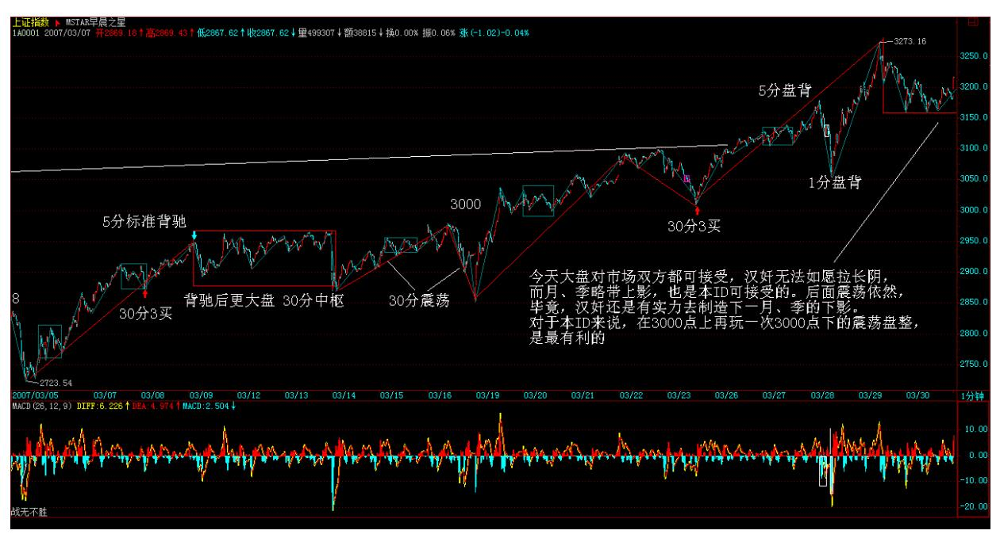
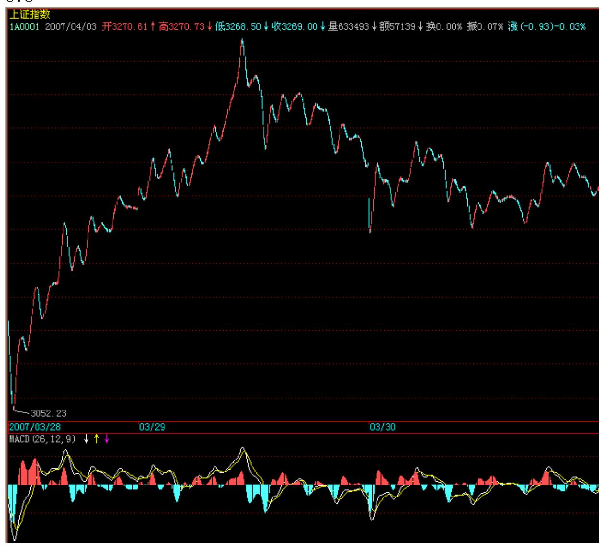

# 教你炒股票 41:没有节奏,只有死

(2007-03-30 15:17:22)市场的节奏,只有一个:买点买、卖点卖。这 么简单的问题,但从来能遵守的人,能有几个?是什么阻止你倾听市 场的节奏?是你的贪婪与恐惧。买点,总在下跌中形成,但恐惧阻止 了你;卖点,总在上涨中,但贪婪阻止了你。一个被贪婪与恐惧所支 配的人,在市场中唯一的命运就是:死!市场中,买点上的股票就是 好股票,卖点上的股票就是坏股票,除此之外的好坏分类,都是瞎 掰。你的命运,只能自己去把握,没有任何人是值得信任的,甚至包 括本 ID。唯一值得信任的就是,就是市场的声音、市场的节奏,这需 要你用心去倾听,用一颗战胜了贪婪与恐惧的心去倾听。

市场的声音,永远是当下的,任何人,无论前面有多少辉煌,在当下 的市场中,什么都不是,只要有一刻被贪婪与恐惧阻隔了对市场的倾 听,那么,这人,就走入鬼门关。除非,此人能猛醒,否则,等待的 只有:死亡。记住,1 万亿与 1 万,变成 0 的速度是一样的,前者 甚至可以更快。

买点买,买点只在下跌中,没有任何股票值得追涨,如果你追涨被 套,那是活该;卖点卖,没有任何股票值得杀跌,如果你希望瘦身, 那就习惯砍仓杀跌吧。即使你搞不懂什么是买点卖点,但有一点是必 须懂的,就是不能追涨杀跌。就算是第三类买卖点,也是分别在回调 与反弹中形成的,哪里需要追涨杀跌?买卖点是有级别的,大级别能 量没耗尽时,一个小级别的买卖点引发大级别走势的延续,那是最正 常不过的。但如果一个小级别的买卖点和大级别的走势方向相反,而 该大级别走势没有任何衰竭,这时候参与小级别买卖点,就意味着要 冒着大级别走势延续的风险,这是典型的刀口舔血。市场中不需要频 繁买卖,战胜市场,需要的是准确率,而不是买卖频率,只有券商与 税务部门才喜欢买卖高频率。

市场不是赌场,市场的操作是可以精心安排的。当你买入时,你必须 问自己,这是买点吗?这是什么级别的什么买点?大级别的走势如 何?当下各级别的中枢分布如何?大盘的走势如何?该股所在板块如 何?而卖点的情况类似。你对这股票的情况分析得越清楚,操作才能 更得心应手。

至于买卖点的判断,如何提高其精确度,那是一个理论学习与不断实 践的问题,但这一套程序与节奏,是不会改变的。精度可以提高,但 节奏不可能乱,节奏比精度更重要。无论你对买卖点判断的水平如 何,即使是初学者,也必须以此节奏来要求自己。如果你还没有市场 的直觉,那么就强迫自己377 去执行,否则,就离开。

对于初学者,一定不能采取小级别的操作,你对买卖点的判断精确度 不高,如果还用小级别操作,不出现失误就真是怪事了。对于初学 者,按照 30分钟来进出,是比较好的,怎么也不能小于 5 分钟,5 分钟都没有进入背驰段,就不能操作。级别越小,对判断的精确要求 越高,而频繁交易而导致的频繁失误只会使心态变坏,技术也永远学 不会。先学会站稳,才考虑行走,否则一开始就要跑,可能吗?节 奏,永远地,只有市场当下的节奏,谁,只要与此节奏对抗,只有痛 苦与折磨在等待。注意,一定要注意,所谓的心态好不是如被虐狂般 忍受市场节奏错误后的折磨,这一定要注意。很多人,错了,就百忍 成钢,在市场中是完全错误的。市场中,永远有翻身的机会,那前提 是,你还有战斗的能力。一旦发现节奏错误,唯一正确的就是跟上节 奏,例如,错过第一买卖点,还有第二买卖点,如果你连第三买卖点 都错过,连错三次,死了也活该。

为什么有三类买卖点?市场太仁慈了,给你三次改错的机会,你如果 连这都不能改正,那就休息去,喝茶去,三次都不能改错,还犯同样 的错误,不休息、不喝茶,还能干什么?那些一个股票上涨 N倍后还 问能不能买,甚至还追高买,这种人,还能说什么?难道上涨 N 倍还 看不到买点吗?看着很多散户,在连续拉升后还赌后面的所谓涨停, 只能好不客气地说:死了活该。

市场是残酷的,对于企图违反市场节奏的人来说,市场就是他们的死 地;市场是美好的,市场就是巴赫的赋格曲,那里有生命的节奏。节 奏,永远是市场的节奏,一个没有节奏感的市场参与者,等待他的永 远都是折磨,抛开你的贪婪、恐惧,去倾听市场的节奏。

周末了,放下一切,却倾听大自然的节奏,生命的节奏,音乐的节 奏,然后再回来倾听,这市场的节奏。与市场共舞,你的贪婪与恐惧 一一剥落,你会变得光明无比。

#### \*\*\*\*\*\*\*\*\*\*\*\*\*\*\*\*\*\*\*\*。

解盘及互动问答:

#### \*\*\*\*\*\*\*\*\*\*\*\*\*\*\*\*\*\*\*\*。

缠师:今天大盘对市场双方都可接受,汉奸无法如愿拉长阴,而月、 季略带上影,也是本 ID 可接受的。后面震荡依然,毕竟,汉奸还是 有实力去制造下一月、季的下影。

对于本 ID 来说,在 3000 点上再玩一次 3000 点下的震荡盘整,是 最有利的。玩震荡,汉奸没什么水平,而现在管理层、散户都有恐 高,需要时间治疗。

个股方面,三线已经被管理层监管警告,一线大盘打架不可能被散户 接受,这两天就是例子,因此,二线是最好的平衡,谁都能接受,一 些有中线潜力的二线已创新高,这就是点火,能否燎原,那是另外的 问题。今天 4 点有会,必须走,先下,再见。2007-03- 3015:25:08379 380 缠师: 前面已经说过,如果看不明白上海指数, 就看深圳的。

深圳今天的走势只表明一点,优质二线股还是得到更多人的认同。

深圳成分股里,基本都是优质二线股。其实,今天最终能收成这样, 也是经过刀光血影的。早上汉奸曾又使出拉金融股的一招,结果被破 坏,没什么效果,才有后面二线股的整体走强。

个股方面,看看上海、深圳今天涨停的,基本都是二线股与有真正题 材的三线股,特别是上海,很多都是 10 元上下的,就知道后面真正 可以产生利润的股票还是本 ID 前段时间已经明确指出的那些。具体 就不说了,现在监管风暴下,少说点不会错。

如果不会挑的,就去看 300 或深圳成分股,就那些股票,当然,金融 股、特大盘股也会有表现的,但这类股票还是以打仗为主,如果资金 量比较大的,组合部分也是可以的。

现在的走势肯定是进二退一甚至是进三退二,快速拉升只可能对汉奸 有利,把握节奏就很重要了。真看不明白的,就看 5 日线,你看这段 时间这么折腾,其实都没破过 5 日线,看着不用闹心么。

2007-04-02 15:14:44

#### \*\*\*\*\*\*\*\*\*\*\*\*\*\*\*\*\*\*\*\*。

1. 网友【匿名】:引用博主的话:"技术上,深圳面临前期上海已经 过去的上两个高点的连线压力,而且 9000 点的心理压力也是很大 的,这也是短期会面临震荡的心理基础,其实,合适震荡一下,走势 越可能延续长,至于震荡的时间是哪一天,其实问题都不大,很多都 是当下一个偶然因数导致的。"

#### \*\*\*\*\*\*\*\*\*\*\*\*\*\*\*\*\*\*\*。

2. 网友 [匿名] 新浪网友:美元的主导地位将被颠覆。而美元被颠覆 之后,人民币如何发展? 2007-04-02 15:48:57缠师:不是将被,而 是正被。人民币的发展不是在固定的轨迹运行的,是一个当下合力的 结果。难道一群大笨蛋来策划人民币的战略,人民币也能打赢?这世 界还没有堕落到如此无耻的事情都可以发生。天时、地利都给了机会 而搞不好,到时候你说能怪谁?还是先把自己的问题搞好,本 ID 现 在就没觉得人民币搞得有多好。只是中国的国运在那里,只要不是超 级大笨蛋,都不会太差而已。

381\*\*\*\*\*\*\*\*\*\*\*\*\*\*\*\*\*\*\*3. 网友悠悠悠哉: 市场节奏是不是指资金 的流动? 板块的互换?怎么去倾听,怎么去感受啊?有没有基础班能 上啊? 2007-04-0216:24:21缠师:先把个股运行的买卖节奏搞清楚, 这是基础。

#### \*\*\*\*\*\*\*\*\*\*\*\*\*\*\*\*\*\*\*\*。

4. 网友 [匿名] 头大也得看: 请教博主,关于中枢扩张例。三个以 上 5F 中枢扩张成为一个 30 分钟中枢。问题一:是否必须为三个 5F 中枢全部完成,才可以形成 30F 中枢?2007-04-0220:35:05缠师:概 念错误。不是三个中枢扩张,三个 5 分钟中枢如果在同一趋势里,只 是一个 5 分钟级别走势。不存在构成 30 分钟中枢的可能。注意,中 枢和走势不是同一个概念。先把中枢定义的递归方法看明白。

网友 [匿名] 头大也得看:问题二:在一个 5F 上涨趋势中,第二个 5F 中枢应该为一个下上下中枢,那么如果扩张,这第二个 5F中枢在 30F 中枢中处,在什么位置?缠师:这个问题也是上面概念混乱的结 果,请先把基础概念弄明白。

#### \*\*\*\*\*\*\*\*\*\*\*\*\*\*\*\*\*\*\*\*。

5. 网友 [匿名] 炒汉奸: "特别在人民币币值依然有着广阔上升空 间而中国贸易顺差的趋势依然不断扩大的背景下,相对流动性过剩, 必将是中国经济的常态,从而为中国资本结构、融资结构、财富结构 等升级换代提供契机与动力。" (此处引用缠师的话)20年前日元升 值以美国胜利告终,你认为人民币升值,胜者为谁?你认为未来 10 年内,中国和普通民众的财富结构将是怎样的趋势和形态?2007-04- 02 20:59:07缠师:预测这些没意义。问题的关键是,现在一切有利的 因数都有了,如果还不赢,那该如何!382 网友 [匿名] 炒汉奸:机 械操作法中有没有一二三类买卖点之分?如果有,如何区分?缠师: 这个是一样的,买卖点与图形分解没什么关系,只是一些大级别的买 卖点,被当成分解级别的来分解操作而已。是买点还是买点,不会因 为分解了买点就变卖点。

#### \*\*\*\*\*\*\*\*\*\*\*\*\*\*\*\*\*\*\*。

6. 网友 [匿名] abc: 请教 LZ,对 600010(包钢股份)的中期走势 有何看法? 2007-04-02 21:05:17缠师:钢铁股就没必要问了,去年 末就开始反复说,钢铁是去年的有色,这观点一直不变,至于具体个 股,没什么大区别。

7. 网友 [匿名] 钱龙: 缠姐好!对于第三类买点的形成还有点疑 问。为什么你说次级别回抽,在次级别图中,只要回拉两次就可以 了?我想,即使这个次级别回抽是盘整走势,也应该最少有五段。

那就是有三次回拉才完整。不知该如何理解? 2007-04-0221:11:58缠 师:那两次回拉的是次次级别的,这问题以前说过。三个次次级别构 成一个次级别,想想这就明白了。

#### \*\*\*\*\*\*\*\*\*\*\*\*\*\*\*\*\*\*\*。

8. 网友 [匿名] 球球: 缠 MM,我买了些中小企业股,该板块走势如 何?谢谢! 2007-04-02 21:13:02缠师:这是一个相对独立的中长线 板快,选那些盘小有成长性的反复操作,比瞎跑实际效果更好。

#### \*\*\*\*\*\*\*\*\*\*\*\*\*\*\*\*\*\*\*。

383 9. 网友 [匿名] AAA: 按楼主的理论,似乎目前绝大多数的股票 在日线级别上都没有买点了,楼主怎么看呢? 2007-04-0221:13:56缠 师:现在想找一个有日线买点的股票,确实有点困难,但也不是完全 没有。特别像日线级别的第三类买点,还是能找到的。

#### \*\*\*\*\*\*\*\*\*\*\*\*\*\*\*\*\*\*\*。

10. 网友 [匿名] 也许认识你: 博主,中枢的问题。最近和大家讨论 问题,发现中枢还是无法统一定义。

本级别中枢由次级别连续 3 个走势类型重叠而成。上涨中枢,次级别 走势类型分别是:下跌+上涨+下跌。那么 3 个次级别中枢,方向是 否一定是(上下上)+(下上下)+(上下上)?这几个中枢是只有 这个顺序还是可以交换?如(上下上)+(上下上)+(下上下)。3 个次级中枢(上下上)难道不可以构成本级别中枢?2007-04-02 21:17:23缠师:还是概念混乱。上涨、下跌都至少有两个以上次级别 中枢。

是 3 个次级别走势类型的重合部分构成中枢,而不是 3 个次级别中 枢的重合构成中枢。构成中枢的次级别走势类型,显然都是完成的。 而次级别中枢对于次级别走势来说却不一定是完成的。请把中枢、走 势类型、已经相互构成的递归定义弄清楚。

#### \*\*\*\*\*\*\*\*\*\*\*\*\*\*\*\*\*\*\*\*。

11. 网友 [匿名] 阿 Q: 为什么杭萧钢构今天出来后还是涨停?极其 不理解。 2007-04-02 21:22:36缠师:市场不关心你的理解,市场只 有当下的买卖。

#### \*\*\*\*\*\*\*\*\*\*\*\*\*\*\*\*\*\*\*\*。

12. 网友 [匿名] IBM: 多日来一直学习博主的理论,但总是很迷 糊。今天看了 601991,在 3 月 29 日形成日线级的第三类买点,我 的看法是否正确,请各位高手批评。 2007-04-02 21:28:26384 缠 师:日线的第三类买点至少是一个 30 分钟的回拉,不可能是一天完 成的。这股票的 30 分钟级别第三类买点在 30 分钟图上不难发现, 只是比 29 日要早点,不妨去研究一下。

#### \*\*\*\*\*\*\*\*\*\*\*\*\*\*\*\*\*\*\*\*。

13. 网友 [匿名] 剑十三: 今日罗杰斯说 6000 点开始抛股,你如何 看? 2007-04-02 21:35:27缠师:在 6000 没到时说 6000 点的操作 问题,都是无聊问题。

#### \*\*\*\*\*\*\*\*\*\*\*\*\*\*\*\*\*\*\*。

- 14. 网友 [匿名] 乐土: 禅师您好!快子时了,抓紧时间再问:
- (1)在上海大盘的 15 分钟 K 线图上,明天上午,若突破前面高点 3272.41,则顶背驰的可能极大。这将预示着明天又是很刺激的一天?
- (2)您怎样看低市盈率的电力和煤炭板块?医药板块近几天好象走的 比大盘弱?谢谢!2007-04-02 21:42:40缠师:大盘不震荡,单边上涨 才是不正常的。板快是轮动的,有些板快看好的人太多,自然拉不起 来,人人都在轿子里,谁抬?

#### \*\*\*\*\*\*\*\*\*\*\*\*\*\*\*\*\*\*\*。

15. 网友星星: "只要盘整背驰,就在 i+2 为偶数时卖出,为奇数 时买入。如果没有,当 i 为偶,若 Ai+3 不跌破 Ai 高点,则继续持 有到 Ai+k+3 跌破 Ai+k 高点后,在不创新高或盘整顶背驰的Ai+k+4 卖出,其中 k 为偶数。"2007-04-02 21:44:33(此处引用缠师的 话)有几点不解,请楼主讲一下:(1)如果没有盘整背驰,当 i 为 偶,若 Ai+3 跌破 Ai 高点,是不是要出掉,是不是一跌破就要出

掉?缠师:除非出现小级别转大级别的 a+B`情况,跌破和盘整背驰是 一回事情。

网友星星:(2)当 i 为偶,若我在 Ai 的低点买入,若 Ai+3 不跌 破 Ai 高点,则继续持有到 Ai+k+3 跌破 Ai+k 高点后,在不创新高 或盘整顶背驰的 Ai+k+4385 卖出,其中 k 为偶数。那有没有可能 Ai+k+3 直接跌破 Ai 的低点而造成亏损?缠师:这问题和上面是一回 事。

#### \*\*\*\*\*\*\*\*\*\*\*\*\*\*\*\*\*\*\*\*。

16. 网友[匿名] touchnet: 老大,在同级别分解中,对于"盘整+ 盘整+盘整+"" ,根据结合律,应该是可以任意组合的吧?那么这 里面的每个盘整,最多可有几段?5 段?8 段? 2007-04-0221:53:30 (对不起,上面的组合以及段都是指次级别而言。)缠师:同级别分 解,不允许盘整里的中枢延伸,因此 3 段次级别就是了,不存在任意 的问题。

#### \*\*\*\*\*\*\*\*\*\*\*\*\*\*\*\*\*\*\*\*。

17. 网友 [匿名] 绝对黑色: 另外想问问禅主,对于"A 的级别要大 于 B 的级别"这句话,是指 A 的中枢区间包含着 B 的中枢区间吗? 以至于,B 是围绕 A 做震荡,可看做为盘整,不知道这样理解对不 对? 2007-04-02 21:53:21缠师:不一定,A 和 B 完全可以没有任何 重合的地方。

网友 [匿名] 绝对黑色:那怎么判断它的级别大呢?迷茫中,中枢区 间大?还是扩展大?缠师:请先把递归定义搞清楚。级别和区间大小 没什么必然关系。

#### \*\*\*\*\*\*\*\*\*\*\*\*\*\*\*\*\*\*\*\*。

18. 网友 [匿名] 禅迷胡: 禅姐,请问您什么时候会放弃一只一直操 作的股票呢? 2007-04-02 21:50:14386 缠师:其实,一只股票在他 年老色衰前都可以一直玩下去。一般来说,在超大级别卖点出现时, 例如季度甚至是月线的,就等于宣告这股票已经精尽人亡。

19. 网友微微果二: 可否跟缠姐讨论一下人生发展的问题?我上了一 个不错的大学,但是上了一个烂专业,旅游管理。出来工作了两年, 在银行干基层工作,去年辞职了,然后迷失了方向,一直到现在都不 知道自己该干什么?不想上班,但一是怕父母担心,二是没有找到可 以独立存活的生存之道。有时候想着,自己还不如不上大学,那现在 就不会有那么多的束缚了。缠姐怎么看待职业发展问题? 2007-04-02 21:59:11缠师:如果你单纯为了生存而憋屈自己,那么,世界本来就 是坟墓。在哪里,干什么,都一样。如果不是这样,日日是好日,时 时是花时,又何必分什么天堂地狱?选什么股票其实不重要。关键是 要选好买点。明白股票之道,工作之道其实道理是一样的。等待你的 买点或换股的时机,别抛了一只买点上的股票去换一个卖点上的。一 个人,可以操作一只股票获取最大利润,关键是买点卖点的节奏,而 不是股票本身。炒的是股票,而不是股票炒你,工作是一样的,人生 也是一样的。

#### \*\*\*\*\*\*\*\*\*\*\*\*\*\*\*\*\*\*\*。

20. 网友 [匿名] 酒吧心情: 缠 JJ,目前的形式,很多的股票正处 于上升+盘整的走势中。所以,对盘整背驰力度的判断很重要。缠JJ 能不能再把重点强调一下?对于目前股票的普遍走势,怎样才能准确 把握背驰的力度,特别是盘整背驰的力度,怎样才能转化成趋势,或 者是反趋势。 2007-04-02 21:26:53缠师:这个问题包含很多概念误 解。力度是当下的。背驰、盘整背驰只意味着转向。至于力度,是和 中枢星球系统的分布与当下的买卖力度相关的,是一个当下的概念。 当然,有很多辅助的工具可以预计其力度,这太复杂,以后会有专门 的课程。

#### \*\*\*\*\*\*\*\*\*\*\*\*\*\*\*\*\*\*\*。

21. 网友 [匿名] 九头鸟: "一个走势中枢完成前,其波动触及上一 个走势中枢或延伸时的某个瞬间波动区间,由此产生更大级别的走势 中枢。" (此387 处引用缠师的话)缠姐,这句话是否指必须是第二 个中枢的前三段,和第一个中枢的任何一段重叠,才是中枢扩张?如 果是第二个中枢的前三段以后的,即使有重叠也不算?2007-04-02 22:14:02缠师:概念有问题。一个中枢的完成,是和第三类买卖点相 关的。

如果一个中枢延伸,就证明没完成。
