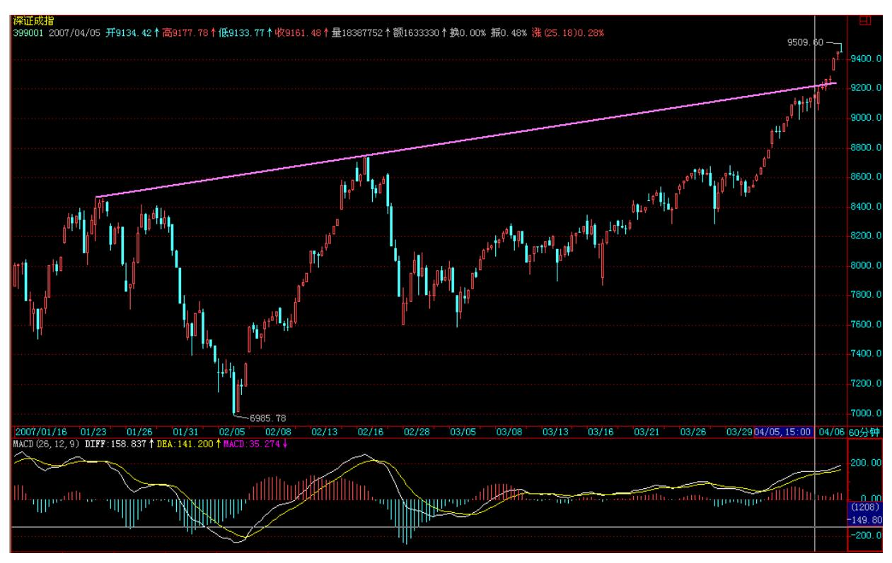
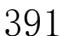
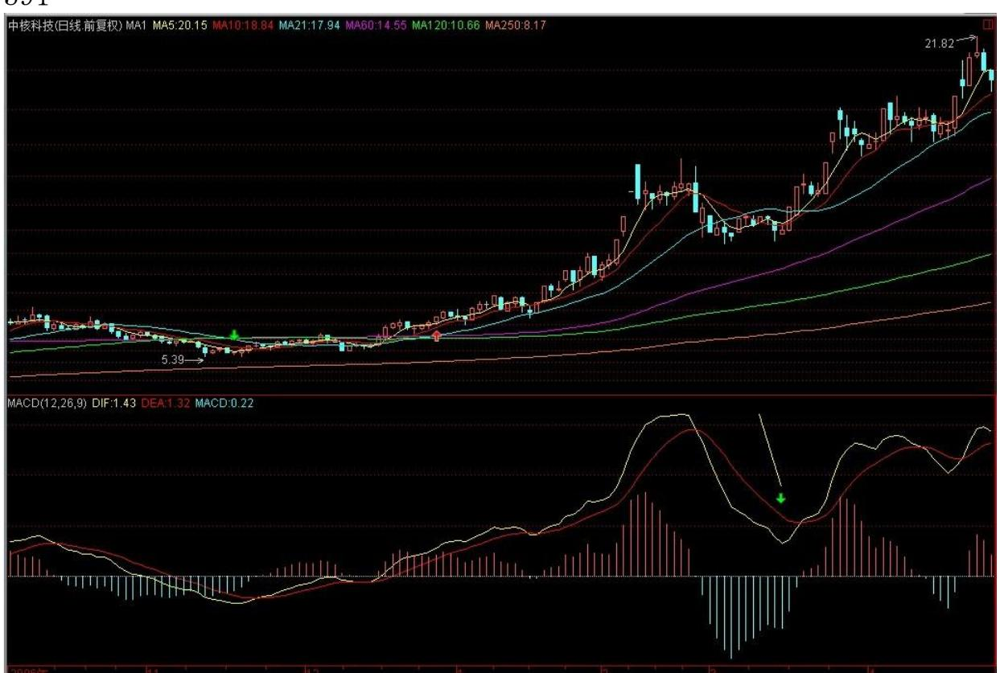
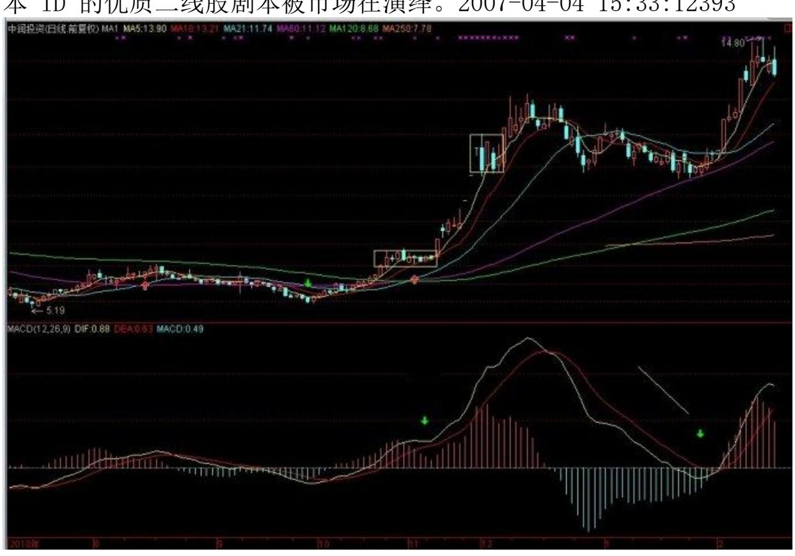
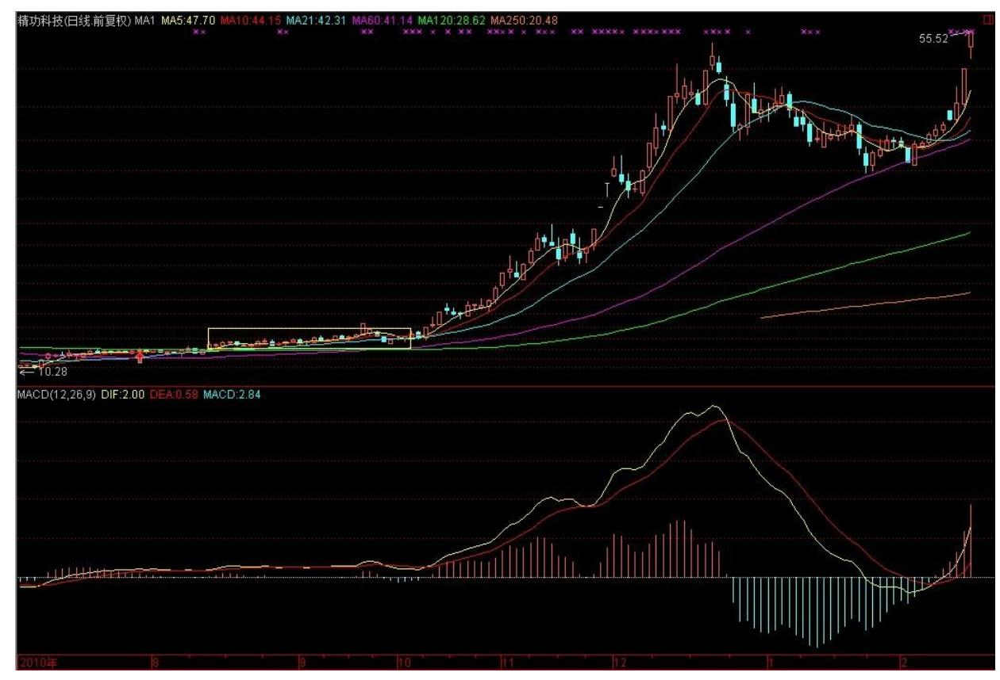
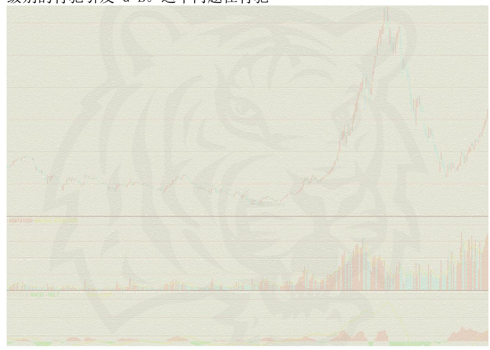
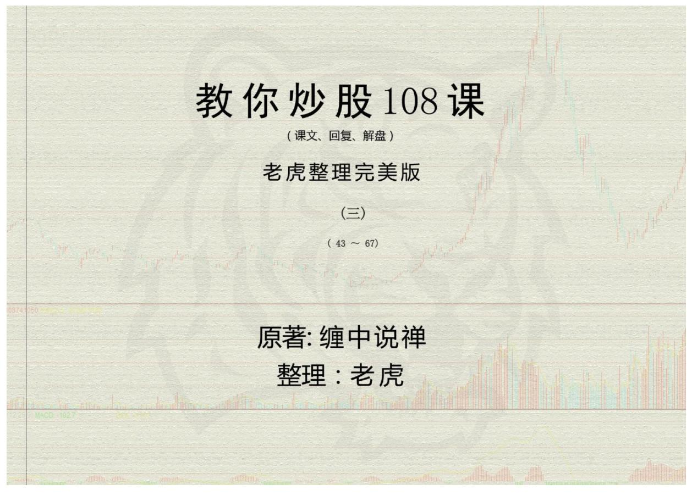

# 教你炒股票 42:有些人是不适合参与市场的

(2007-04-04 15:31:30)06 年在中国证券市场竟然可以亏损累累,最 后被迫转战香港,这种奇人绝对是 06 年市场的最大奇迹,前几天, 本 ID 有幸听闻此人后,真有一睹为快的冲动。当被告知此人为一 50 岁的北京老男人后,才打消此念头。细想,这其实也不奇怪,一个极 端心态有问题的人,确实是不难创造 06 年全年严重亏损奇迹的。例 如,一洗盘就砍仓,开涨的时候不敢买,一买就买个顶,然后又砍, 这样来回几次,不严重亏损就怪了。最奇的是,此人到香港后竟然能 挣点钱了,他的招数就是,一旦看到国内拉某股票,就去买香港相应 的股票,然后 T+0 出来,绝对不敢过夜,这市场还有这样的妙人,也 算有趣。

曾反复说过,心态的磨练对于市场操作的重要性,但这事情要分开 看。有些人,心态就是这样的,改无可改,天性如此,到了关键时刻 就是顶不住,例如,明明脑子里知道不能买了,但手就是发痒,像毒 瘾发作一般,不受控制。现在的买卖操作又特简单,以前最早时,无 论机构大户,都有报单、红马甲之类的东西,现在随便一个散户,在 网上 1 秒种就可以完成买卖,只要扛不住那 1 秒,什么技术、理论 都白搭。这时候怎么办?最好的办法,当然是去"戒毒" ,这必须从 最基础的心理训练开始,但这不是任何人都有条件办到的。还有,就 是远离股市,股市只是生活的一部分,一个没有股市的生活依然是生 活,活着就好。还有,就是换一个环境,例如像上面那奇人那样,到 了香港,找到一个偏方,病虽好不了,也至少不那么难受了。

从某种意义上说,操作并不一定能磨练心态的,这事就如同治疗某种 男性隐疾一样,根子上病了,那是很难有好办法的。最好的办法,就 是退出,至少不会被江湖郎中反复欺骗而花冤枉钱。当然对于是否适 合市场,也只有当下的意义,并不是说真是永远没救了,但有些特别 严重的,确实不适宜留在市场中治疗的,必须先远离市场一段时间, 彻底洗心革面,才有可能改善。

这里不妨给出几种不适合在市场上:一、耳朵控制大脑型。这种人, 一旦听到什么,就可以完全不经过大脑,立即由耳朵就直接操纵手, 如果你每一次的买卖几乎都是这样完成的,那么,你根本不适合在市 场上。

二、疯狂购物型。这种人,最大的特点就是可能只有几万元的资金, 竟然可以拥有十几甚至几十只股票,什么股票都想拥有,什么股票涨 了,都说我389 也有,以此来安慰自己,这种人,根本不适合在市场 上。

三、不受控制型。每次操作,明明知道不对,就是控制不住自己,心 里有一股顽劲,一到需要抉择的关键时刻,永远掉链子,这种人,根 本不适合在市场上。

四、永远认错型。典型的永远认错,死不改错,同样的毛病,可以永 远犯下去却永远改不了。而在市场中,一个毛病就足以致命,一个死 不改错的人,是不适合市场的。

五、祥林嫂型:这种人,永远就是哀声叹气,甚至会演变成特别享受 这种悲剧情调,市场中不是受罪来的,何必这么折腾,市场外的天空 广阔着,离开吧。

六、赌徒型:对于他来说,市场就是赌场,这种人根本没必要在市场 里,不说远的,现在澳门新来不少赌场,珠海的某个岛建桥连过去, 该岛将建成大型度假地,白天过桥就可以赌,晚上回来睡觉,参与该 建设的、其背景是美国某大型集团的人,在国内刚收购某大型旅游企 业,以后是一条龙服务,很方便的。

七、股评型。市场中喜欢吹嘘的人多了去了,有些人,明明亏的一塌 糊涂,就是爱吹,市场对于他来说不是用来操作的,是用来侃用来吹 的,这种人,不适合在市场,当股评去吧。

八、入戏太深型。这种人,把股市的波动当成电视连续剧,每一个细 微的变动都可以让他情绪失控,上涨也失控、下跌也失控、盘整也失 控,开盘 4小时,就煎熬 4 小时,这种人,在市场上太累,还是回家 看肥皂剧好。

九、偏执狂型。这种人,就爱认死理,万牛拉不回。偏执,对搞理论 或其他事情可能影响不大,甚至有好处,但在万变的市场中,偏执狂 是没有活路的。

十、赵括型。市场操作,不同于纯粹的理论研究。市场就是市场,就 如同战场,赵括之流同样是没有活路的。 以上十种,是特别不适合在 市场中的,当然,并不是有这种表现的就一定要永远离开市场,关键

是先要调节过来,所谓功夫在诗外,市场中也一样的,390 真正能在 市场上登顶并长期领先的,有可能是一个大傻瓜、心理有顽疾的吗? 所谓性格决定命运,这两节没讲有关技术的问题,说了些似乎无关的 东西,其实是大有相关的。要认清市场,首先要认清自己,知道自己 的弱点在哪里,自己在市场中的每个行为,都要清楚地意识到。每天 收盘后,都找十分钟,把自己当天的操作以及看盘时的心理过程复一 次盘,这是十分必要的。

\*\*\*\*\*\*\*\*\*\*\*\*\*\*\*\*\*\*\*\*。

解盘及互动问答:

\*\*\*\*\*\*\*\*\*\*\*\*\*\*\*\*\*\*\*\*。

缠师:今天继续 10 元上下二线股行情,看看今天涨停股票有多大比 例落在该区间就清楚了。尾盘一线大盘的偷袭,其实也不算太大问 题,现在这种走势,对某些人确实够煎熬的。

深圳由于已经离那条压力线很近,所以今天走的已经有点沉重,如果 真能突破站稳该线,那深成指的 1 万点,就在多方炮火下了。所以对 于这条线,汉奸是不会轻易罢休投降的。1 万点,其实不算什么,以 后上海的指数也会有这一天,只是内地指数从来没有这样的位置,让 散户、管理层接受,还需要一定的前戏。2007-04-0515:34:37

392 目前管理层的心态也很微妙,而且中国的事情,经常搞平衡,汉

奸现在也在到处哭诉,是否能打动某些地方,这种事情就不好说了。 所以,太过乐观的情绪是要不得的,目前最好的策略还是以稳为主, 这不仅是对多方的正规军,对民兵、敌后武工队等等,也是一样的。

板块轮动,稳健地走,通过不同级别的震荡消除各种压力的,才是正 路。像某些股票瞎搞乱来,这只会对汉奸有利。

今天的市场没什么可说的,该说的昨天已经说了,今天的走势就如同 照抄本 ID 昨天的剧本一样,如果你连剧本都先看了还操作不好,那 就没法子了。从纯技术上,深圳基本达到目前在 9200 点附近的上两 高点连线,这里存在技术压力很正常。上海最近走不强,原因很简 单,就是一时没目标了,深圳还存在那线可以攻击,上海上面无限宽 广,但反而找不着北了。当然,更重要的是,深圳指数更代表优质二 线股,最近这板块得到越来越多的认同,所以深圳走强,其实就代表 本 ID 的优质二线股剧本被市场在演绎。2007-04-04 15:33:12393

395 396 1. 网友 [匿名] 月儿: 股票涨得太快了,管理层可能要开 始收税了。这样对庄家和股民都是不利的。还是一波波上的好。老师 觉得是这样吗? 2007-04-04 16:24:26缠师:国家股是最大的股东, 如果他愿意交,本 ID 没意见。

#### \*\*\*\*\*\*\*\*\*\*\*\*\*\*\*\*\*\*\*\*。

2. 网友 [匿名] 新年好: 现在,深圳和上海的大盘的走势,差别可 真大。我是看深圳大盘来操作的。不过这个背驰的力度总是判断不 了。缠姐什么时候,能抽空讲讲力度的问题吗? 2007-04-0416:24:26 缠师:背驰后出现的三种情况,前面有一堂课专门说过,请去查找。

#### \*\*\*\*\*\*\*\*\*\*\*\*\*\*\*\*\*\*\*\*。

3. 网友 [匿名] asdf: 对于构成中枢的三段,不知楼主有什么实际 的应用技巧没有,可以帮助我们不用一层一层去判断,每一段是否走 完。例如,判断日线中枢的形成,首先至少要有三段连续的 30分钟走 势类型完成,而 30 分钟的每一段又要求是 5 分钟图表上的三段走 完,5 分钟的三段又要求至少 1 分钟图表的三段要走完。如此循环判 断,感觉实际应用起来,真是不太方便。而是可以只从日线图上或 30

分钟图上就可以方便的判断出来。 2007-04-0415:55:25缠师:这个问 题说过多次,趋势看背驰,盘整看第三类买卖点。

#### \*\*\*\*\*\*\*\*\*\*\*\*\*\*\*\*\*\*\*\*。

4. 网友 [匿名] 百思不解: 楼主好,请教关于非同级分解的问题。 同级别分解规则:在某级别中,不定义中枢延伸,允许该级别上的 "盘整+盘整" 连接;与此同时,规定该级别以下的所有级别,都允 许中枢延伸,不允许"盘整+盘整"连接;至于该级别以上级别,根本 不考虑,因为所有走势都按该级别给分解了。

397 按同级分解的话,如果本级不定义中枢延伸,那本级趋势的中枢 就都不允许延伸了,这样很多本级趋势岂不都不成立了?都被分解 了?即使本级按同级分解,但次级以下还允许中枢延伸,即次级以下 还要实行非同级分解,这样非同级分解在实践中无论如何都绕不过 去。还请楼主指教非同级分解的原则。

我理解的非同级分解,似乎是 16 课中的连接模式,只不过"上涨+ 盘整"中,上涨的级别可能比盘整低不止一级吧?非同级分解原则还 应该有很多细节的,也是实践中模糊的地方,影响对走势的解读。 2007-04-04 15:55:25缠师:一个 30 分钟的趋势,如果有 N 个 30 分钟的不延伸的中枢,根本不存在被分解的问题,只会被 30 分钟的 同级别分解看成一个趋势。如果其中有一个中枢延伸出 6 段,那就自 然被分解成两个 30 分钟的盘整,这没什么可难理解的。

#### \*\*\*\*\*\*\*\*\*\*\*\*\*\*\*\*\*\*\*\*。

5. 网友 [匿名] abc: 请教 LZ,如果开征股票所得税,会让牛市结 束吗? 2007-04-04 16:33:10缠师:按这种逻辑,外国就不会有牛市 了?现在要让牛市结束,除非重新跌破 1000 点,否则都不过是大牛 市中的调整。

#### \*\*\*\*\*\*\*\*\*\*\*\*\*\*\*\*\*\*\*\*。

6. 网友 [匿名] 新年好: 今天深圳指数在 04041104 和 04041351都 有背驰的样子,但是前者没怎么回调就直接上去了,但是后者却回调 那么多。请问缠姐,这个该如何判断啊?我在第一个背驰的时候参与 了一下,谁知道差价根本没多少。到了第二次我就没敢参与,谁知道 又回调了那么多。真是痛苦啊。 2007-04-04 16:04:40缠师:不用看

复杂的东西。就像今天深圳,请看看 1 分钟图的MACD,你看看你说的 两个点之间有什么大的区别?

#### \*\*\*\*\*\*\*\*\*\*\*\*\*\*\*\*\*\*\*\*。

398 7. 网友 [匿名] 白玉兰: 妹妹好!我的山东人有小表现。问妹 妹云铜咋样,和期货联动大吗? 2007-04-04 16:12:10缠师:云铜中 线没什么大问题,现在只是在历史天价区洗盘。看看这次行情,最终 突破历史天价的股票相应的走势就明白了。

#### \*\*\*\*\*\*\*\*\*\*\*\*\*\*\*\*\*\*\*\*。

8. 网友 [匿名] 缠迷: 缠妹妹,600649 也是 14 只票里的。现在 看,就它走得最慢。但是我一直握在手里,让它磨练我的耐性,但是 也快坚持不住了。呵呵。 2007-04-04 16:33:10缠师:你要看看他现 在什么地方,打开周线图,看看他的左边,这是历史密集成交区。

#### \*\*\*\*\*\*\*\*\*\*\*\*\*\*\*\*\*\*\*\*。

9. 网友 [匿名] 大猪: 缠主,您好!怎样判断大级别能量耗尽没耗 尽呀?我现在实际操作中,出现按小级别判断出现背弛,卖出了,之 后调整几下又上去了.差价都没做出来。可能是操作级别太低了是一 个原因,但主要还是不会判断大级别能量耗尽没耗尽。请帮忙解惑。 谢谢! 2007-04-04 16:40:43缠师:技术不好的,就看 30 分钟级别 进出。5 日线都不破,就别乱折腾。差价满地都是,关键是你的技术 达到没有,如果没达到,那只会把自己搞乱。先学会站起来,再跑。

#### \*\*\*\*\*\*\*\*\*\*\*\*\*\*\*\*\*\*\*\*。

10. 网友 [匿名] 新浪网友: 老大讲讲 343 吧。咋的啦? 200704- 04 16:55:36缠师:343 没什么问题。唯一的问题在一个多月前就说 过,某汉奸基金拿得太多,不招本 ID 待见。

#### \*\*\*\*\*\*\*\*\*\*\*\*\*\*\*\*\*\*\*\*。

399 11. 网友 [匿名] 新年好: 缠妹妹,600649 也是 14 只票里 的。现在看,就它走得最慢,但是我一直握在手里,让它磨练我的耐 性,但是也快坚持不住了。呵呵。 2007-04-04 16:50:58缠师:你要

看看他现在什么地方,打开周线图,看看他的左边,这是历史密集 区。

#### \*\*\*\*\*\*\*\*\*\*\*\*\*\*\*\*\*\*\*\*。

12. 网友[匿名] 缠迷:缠姐说的历史密集区,是什么意思啊?又有什 么影响啊? 2007-04-04 16:33:10缠师:就是历史上大多数的人都套 在这个地方,股票又不是慈善晚会,那些没信心、没耐心的人不下 来,换手不充分,怎么可能大涨?

#### \*\*\*\*\*\*\*\*\*\*\*\*\*\*\*\*\*\*\*。

13. 网友 [匿名] 大猪: 谢谢缠主!还有一个问题:如何选择分析的 中枢?假定一个5分钟级别的图形上,走势突破原来的中枢,形成了 一段新的走势,其中形成了一个新的"中枢" 。但围绕此新"中枢" 的波动,有与之前中枢重叠的地方,或者两个中枢有重叠的地方,该 怎么选择要分析的中枢?谢谢!2007-04-04 17:19:36缠师:那就要扩 展成更大的中枢,如果是趋势中的同级别中枢,之间是不会有任何重 叠的。这在中枢扩展、延伸等课程里都有。

#### \*\*\*\*\*\*\*\*\*\*\*\*\*\*\*\*\*\*\*\*。

14. 网友 [匿名] 禅迷: 老师,以前您曾提到沪深指数背离,大盘一 般要调整了。以往几次通常是沪市指数涨幅超过深市。哪象今天这种 情况,深市比沪市走强这么多,大盘可能会怎样呢?期盼老师指教。 谢谢! 2007-04-04 17:27:33缠师:原因不是已经说了。深圳成分指 数代表的是优质二线股,上海指数只是超级大盘股的指数。深圳也没 比上海强,连上次两高点连线都没破,上海早破了。上海不跟着走, 所以就有了今天的震荡,如果还不跟,那就继续震荡,震到跟为止。

400

#### \*\*\*\*\*\*\*\*\*\*\*\*\*\*\*\*\*\*\*\*。

缠师:今天继续 10 元上下二线股行情,看看今天涨停股票有多大比 例落在该区间就清楚了。尾盘一线大盘的偷袭,其实也不算太大问 题,现在这种走势,对某些人确实够煎熬的。

深圳由于已经离那条压力线很近,所以今天走的已经有点沉重,如果 真能突破站稳该线,那深成指的 1 万点,就在多方炮火下了。所以对 于这条线,汉奸是不会轻易罢休投降的。1 万点,其实不算什么,以 后上海的指数也会有这一天的,只是内地指数从来没有这样的位置, 让散户、管理层接受,还需要一定的前戏。

目前管理层的心态也很微妙,而且中国的事情,经常搞平衡,汉奸现 在也在到处哭诉,是否能打动某些地方,这种事情就不好说了。

所以,太过乐观的情绪是要不得的,目前最好的策略还是以稳为主, 这不仅是对多方的正规军,对民兵、敌后武工队等等,也是一样的。 板块轮动,稳健地走,通过不同级别的震荡消除各种压力的,才是正 路。像某些股票瞎搞乱来,这只会对汉奸有利。

#### \*\*\*\*\*\*\*\*\*\*\*\*\*\*\*\*\*\*\*\*。

15. 网友 [匿名] 缠心雕龙: 如果 Ai+2 和 Ai 没有盘背(且设Ai+1 低点不破 Ai-2 高点),则 Ai+2 结束时持有,那 Ai+3 发生暴跌, 一直跌破 Ai 的低点也没结束,这时肯定已经亏损了,即使后面向上 的 Ai+4 也不一定能解套,这种情况如何应对? 2007-04-05 15:36:54缠师:不背驰且不演化出 à+B 形式,就不会跌破,除非出现 百年不遇的,像突然世界大战,美国突然又被撞了几百座楼之类的事 情,使得本 ID 理论那两个前提在短时间内失效。

网友 [匿名] 缠心雕龙:原来如此。看来那两个前提,也会受突发事 件影响啊。比如伊朗扣留人质,油价开盘突然涨停,没有前兆啊。

缠师:这个自然。像今天晚上突然开会说要把股市关了,那什么技术 都没用。技术只能在系统中有用,那些非系统性风险,也就是说对所 有人都是突发的事情,当然不是技术能解决的,否则,技术就可以预 测上帝今天吃什么了。

401

#### \*\*\*\*\*\*\*\*\*\*\*\*\*\*\*\*\*\*\*\*。

16. 网友 [匿名] 缠心雕龙: 对于 39 课的同级操作流程,判断每段 Ai 是否结束是个很大问题。假如每段 Ai 的结束你都能正确判断,干 脆就每段 Ai 都高买低卖得了,这是最高效的操作了,何必比较 Ai

与 Ai+2 呢?这里是不是还有相邻两段 Ai 内部的分解组合问题? 2007-04-05 15:39:36缠师:你没理解同级别,先把级别搞清楚。想操 作效率高,就用更小级别,但这是有限度的。

#### \*\*\*\*\*\*\*\*\*\*\*\*\*\*\*\*\*\*\*\*。

17. 网友 [匿名] hehe2: 博主,是否可以再指点一下关于盘整是怎 么结束的啊? 2007-04-05 15:56:06缠师:第三类买卖点。

#### \*\*\*\*\*\*\*\*\*\*\*\*\*\*\*\*\*\*\*。

18. 网友 [匿名] 夜雨: 美女姐姐好!前几天,指数涨,我的股都没 有什么涨,牢记老师的话,顶住了。今天市值创了新高,很有成就 感。06 年下半年入市,06 年没赚钱,还亏损了。在这里学习了之 后,07 年至今天盈利 70%。谢谢您! 2007-04-05 16:00:50缠师:继 续努力。关键是要把胜利成果都保存下来。否则整天坐电梯也没意 思。

#### \*\*\*\*\*\*\*\*\*\*\*\*\*\*\*\*\*\*\*\*。

19. 网友[匿名] 中枢:盘背了好办,看前低是否破前高,破就卖,不 破就拿着,后面以此类推。 2007-04-05 15:54:00网友 [匿名] 缠心 雕龙: 老师刚刚明确了,不盘背必然不跌破。现在问题是,盘背了是 否仍然区分两种情况,破与不破。但我想不通这两种结果对后面操作 有什么影响 ?2007-04-05 16:01:39402 缠师:概念混乱,背驰了才 有破,而不是破了才背驰。

#### \*\*\*\*\*\*\*\*\*\*\*\*\*\*\*\*\*\*\*\*。

20. 网友 [匿名] 中枢: 继续请教老师。盘背后,是否 Ai+3 跌破Ai 高点,对本级别同级别操作没影响。但跌破后,可以让我们换挡到高 一级别操作?缠师:那为什么不先出来再说?换档是在有足够利润或 当下走势出现明显换档迹象所采取的方式,而不是去掩盖判断失误的 借口。

#### \*\*\*\*\*\*\*\*\*\*\*\*\*\*\*\*\*\*\*\*。

21. 网友 [匿名] 在路上: 请教缠姐。如果本轮牛市如缠姐所言般走 20 年,是否绝大多数个股都会创出它本身的新高来?问这个问题,是

从月线上关注缠姐的股票想到的。好像可以看出未来的幅度问题。 2007-04-05 16:01:13缠师:这个自然,如果业绩太差创不了,就重组 了再来创。

#### \*\*\*\*\*\*\*\*\*\*\*\*\*\*\*\*\*\*\*\*。

22. 网友 [匿名] 缠心雕龙: 上节中的"Ai 与 Ai+2 之间盘整背 驰" ,将演化出"当 i 为偶 Ai+3 跌破 Ai 高点"或"i 为奇数 Ai+3 升破 Ai 低点" ;因而相应演化出高一级别的中枢。例如,在 该例子里,Ai+1、Ai+2、Ai+3 就是 30 分钟的中枢,而所有更大的中 枢,当然是先有高一级别才可能有,否则连 30 分钟的中枢都没有, 哪里来日、周、月的?但这个现象就保证了,在同级别分解下,一个 小级别的操作是可以按一个自动模式换档成一个高级别的操作。2007- 04-05 15:41:22网友[匿名] 中枢:我觉得袖手旁观是对的。盘背就是 跌破。

网友 [匿名] 缠心雕龙:盘背后,就一定演化成跌破?可能性很大, 但不绝对吧?否则也没有 3 类买点的概念了。另外,跌破前一定盘 背?这更不绝对了吧。请博主解惑。2007-04-05 15:49:15403 缠师: 盘整背驰一定跌破,而跌破不一定都是盘整背驰,à+B这种形式也可 以。

#### \*\*\*\*\*\*\*\*\*\*\*\*\*\*\*\*\*\*\*\*。

23. 网友 [匿名] 你的样子:老大,我想问。如果没有基本面什么的 别的系统,就靠老大的技术系统,能做到下单如有神么?还有那个 level2 有没有用呢?值不值花钱买? 2007-04-05 15:49:17缠师:一 个系统有用,为什么要卖?一个靠卖系统来混饭吃的人,搞出来的东 西,值得买吗(为什么不直接拿这个系统去赚钱呢)?如果你明白市 场的走势,最简单的,有最基本走势图的系统就足够了。

#### \*\*\*\*\*\*\*\*\*\*\*\*\*\*\*\*\*\*\*\*。

24. 网友 [匿名] 中枢: 老师,前面你对缠心雕龙同学的回答,是不 是就是说 Ai+2/Ai 盘背等价于下面 Ai+3 跌破 MAX(Ai)?(无突发 情况)这样我这个问题就没了。能否答复一下前面的问题?关于中枢 结束点的具体位置。 2007-04-05 16:17:55缠师:不是等价,而是背 驰就一定破,而破不一定就是因为这级别的背驰导致的。而是由于小

级别的背驰引发 à+B。这个问题在背驰

的三种结果那节课里说得很清楚。(娇注:趋势后更大级别盘整à+B)

\*\*\*\*\*\*\*\*\*\*\*\*\*\*\*\*\*\*\*\*。

25. 网友 [匿名] 后知后觉: 如你文章回复所述,现在的确是个除了 您这样的人或集体,大家都整体洗脑的时间段。

各种力量在表演,在让领导层观摩,看领导的眼色,在给领导灌输一 些景象。机构在给我们散户洗脑,告诉我们怎么下去的就怎么上来, 没啥好怕的,于是,后续的新股民和资金源源不断。散户也在给散户 洗脑,互相抱团取暖。只有在你这里,才能认识市场,了解当下。

有一点不解,现在力量的权衡还是不懂,权重上,大盘就上,就会招 来非议。但是,权重股也不会一直趴着,都是为利益来的。为股指期 货,他们或404 许在等机会。这样下去,是否会把他们弄急了,报复 性的爆发?什么时候、什么环境下能达到一个平衡,形成共振? 我问 题比较愚蠢。谢了!2007-04-05 16:18:12缠师:没有说大盘股就不 涨,只是大盘股启动消耗太多能量,而且还需要一个好的理由。例

如,如果期货开了,要把空头打暴,那把中行夹上 20 又有什么大不 了的。

405

