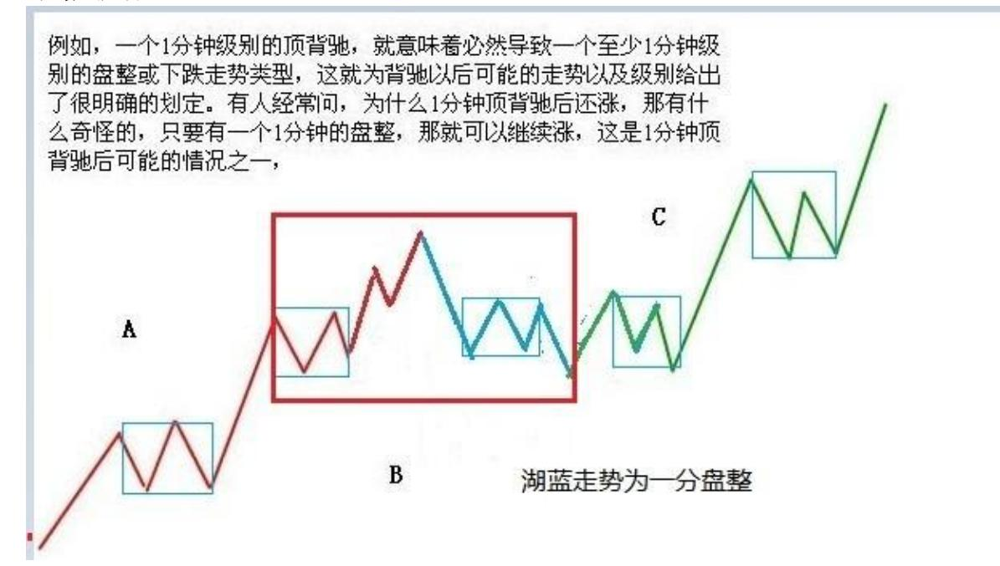
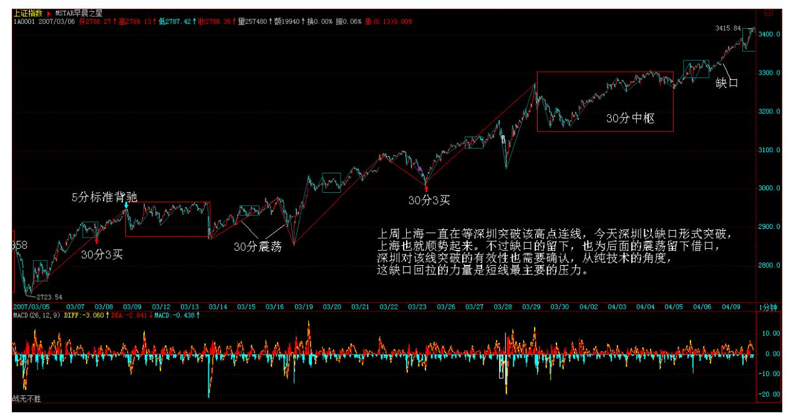
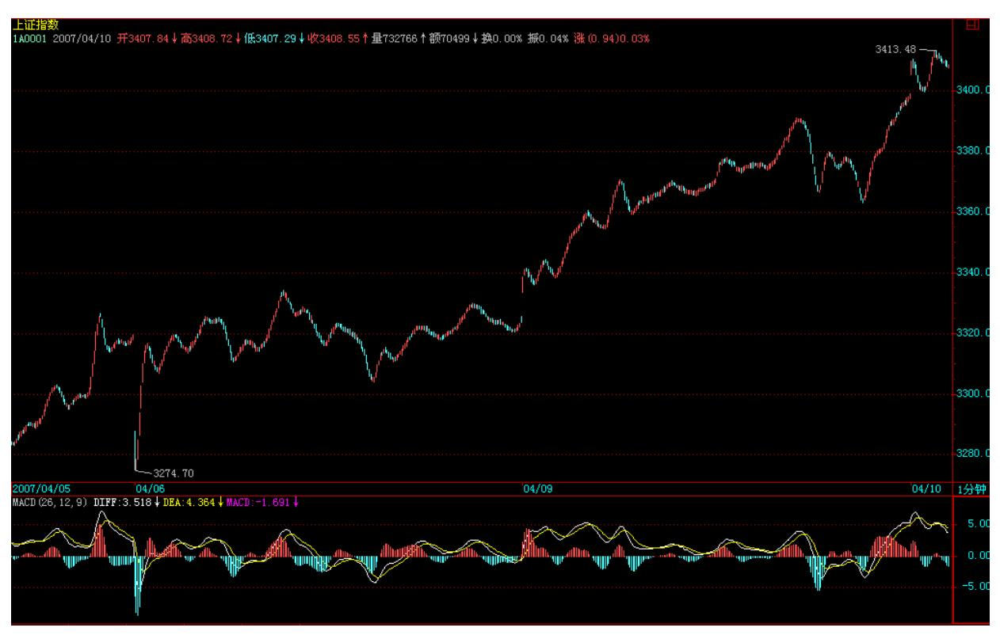

# 教你炒股票 43:有关背驰的补习课

(2007-04-06 15:31:28)发现很多人对最基础的背驰问题还是不大清 楚,周末,来一补习。关于如何判断背驰,背驰与盘整背驰的区别之 类问题就不说了,这个太基础,连这都没搞清楚,那最好的办法就是 重修,而不是补习。

转折必然由背驰导致,但背驰导致的转折并不一定是同一级别的。在 "教你炒股票 29:转折的力度与级别"中有"缠中说禅背驰-转折定 理:某级别趋势的背驰将导致该趋势最后一个中枢的级别扩展、该级 别更大级别的盘整或该级别以上级别的反趋势。"这是一个十分重要 的定理,这定理说明了什么?就是某级别的背驰必然导致该级别原走 势类型的终止,进而开始该级别或以上级别的另外一个走势类型。

由于不允许"上涨+上涨" 、"下跌+下跌"的情况,所以,这定理对 实际操作就很有意义了。例如,一个 1 分钟级别的顶背驰,就意味着 必然导致一个至少1 分钟级别的盘整或下跌走势类型,这就为背驰以 后可能的走势以及级别给出了很明确的划定。有人经常问,为什么 1 分钟顶背驰后还涨,那有什么奇怪的,只要有一个 1 分钟的盘整,那 就可以继续涨,这是 1 分钟顶背驰后可能的情况之一,(注:背驰后 中枢扩展)

2 3 当然,还有其他可能的情况,例如,最极端的,制造出一个年线 级别的下跌,但不能说这个制造是由于 1 分钟顶背驰造成的,因为这 是1 分钟顶背驰后,形成的盘整或下跌逐步级别扩张,最后才慢慢形 成的,如果随便看到一个 1 分钟顶背驰就说要形成年线级别大调整, 那就是脑子水太多了。如果市场的转折与背驰都有这在级别上一一对 应关系,那这市场也太没意思、太刻板了,而由于这种小级别背驰逐 步积累后导致大级别转折的可能,才使得市场充满当下的生机。

注意,这两种不同的转折方式的区分是十分关键的。所有的转折都与 背驰相关,但加上背驰的级别与当下走势级别的关系,就有了这两种 不同的转折方式。由于背驰的级别不可能大于当下走势的级别,例如 一个 30 分钟级别的背驰,只可能存在于一个至少是 30 分钟级别的 走势类型中,所以就有这两种不同转折方式的明确分类。

一、背驰级别等于当下的走势级别例如,一个 30 分钟的走势类型, 出现一个 30 分钟级别的背驰,那么这个背驰至少把走势拉向该 30

分钟走势最后一个中枢,当然就会跌破或升破相应的高点或低点。注 意,这种情况包括进入背驰段的情况,例如,一个 30 分钟的走势类 型,在 30 分钟级别进入背驰段,当然,这个背驰段并不一定就演化 成背驰,因为,小级别的延伸足以使得大级别最终摆脱背驰,这与当 下的走势判断相关。

二、背驰级别小于于当下的走势级别这种情况下,是走势已经明显没 有相应级别的背驰,例如,一个 30分钟的走势类型,明确显示没有出 现 30 分钟的背驰,也就是背驰段最终不成立,但却出现一个 1 分钟 级别的背驰,用一个最简单的形式向上的 a+A+b+B+c,A、B 是 30 分 钟中枢,在 c 中出现 1 分钟背驰,而 c 对 b 在 30 分钟级别并没 有出现背驰,这时候并不必然保证 c 的 1 分钟转折的最终走势就一 定不跌回 B 里,但即使这个回跌出现,其形式也和第一种情况不同。 这第二种情况,必然要先形成一个比 1 分钟级别要大的中枢,然后向 下突破,最终形成回跌到 B 中的走势。

有人可能要问,第一种情况中如果是 5 分钟级别的回跌,也会形成一 个比 1 分钟级别大的中枢,那和第二种情况有什么区别?这区别太大 了,在第一种情况中,其回跌是必然的,而第二种情况,在形成一个 比 1 分钟大的中枢后,并不必然回跌,可以往上突破,使得 a+A+b+B+c 继续延伸。(娇:上下中枢的区别)。

这种小级别背驰最终转化成大级别转折的情况,最值得注意的,是出 现在趋势走势的冲顶或赶底之中,这种情况一般都会引发大级别的转 折,这种例子前面都说过,例如 20070104 的工行,20061207 的北辰 实业、20070122 的水井坊等。

4 以上两种情况,对走势的分解也是很有意义的,例如对一个 30 分 钟的走势类型,其完结也同样有相应的两种情况,最普通的一种,例 如出现一个 30 分钟的背驰,从而完成一个 30 分钟级别走势类型, 在这种情况下,对该走势类型的分解就不存在任何含糊的地方,前后 两个走势类型,就以该背驰点为分界;至于小级别背驰引发大级别转 折的情况,这种情况比较复杂,但分解的原则是一致的,就是:缠中 说禅走势类型分解原则:一个某级别的走势类型中,不可能出现比该 级别更大的中枢,一旦出现,就证明这不是一个某级别的走势类型, 而是更大级别走势类型的一部分或几个该级别走势类型的连接。

这里,把上面第二种情况下的分解可能分析如下:不妨还是以上面向 上 30 分钟级别的 a+A+b+B+c 为例子,在 c 中出现一个 1 分钟级别 背驰,不妨假设后面演化出一个 30 分钟中枢 C,如果 C 和 B 没有 任何重叠,那就意味着原来的 a+A+b+B+c 并不是一个完成了的 30 分 钟走势类型,该走势类型将延伸为 a+A+b+B+c+C,相应的分解要等到 该走势类型完成了才可以进行;如果 C 和 B 有重合,那么 a+A+b+B+c+C=a+A+b+(B+c+C),其中(B+c+C)必然演化成(注:纯中 枢分解)一个日线中枢,那么 a+A+b+B+c 只是一个日线级别走势类型 的一部分,如果一定要按 30 分钟级别来进行同级别分解,那么该分 解点就是那 1 分钟的背驰点,a+A+b+B+c+C=(a+A+b+B+c)+C。 (注:同级别分解)有了以上的例子,就对如何用背驰对走势分解的 基本原则有一个大概的了解了,熟悉了这些分解方法,市场的走势图 就不会是天书了,而是如自己的掌纹一样清晰可辩。

\*\*\*\*\*\*\*\*\*\*\*\*\*\*\*\*\*\*\*\*。

解盘及互动问答:

\*\*\*\*\*\*\*\*\*\*\*\*\*\*\*\*\*\*\*\*。

缠师:今天深圳已经实现对那条压力线的冲击,不过还没有突破站上 去,某种程度上,这是汉奸最后的防线了,一旦突破站稳,那深圳的1 万点就在本 ID的强大炮火下了。

昨天说了,汉奸现在也到处哭诉,在市场上没法成功,就在市场下努 力,也亏汉奸干得出。希望下周汉奸能倾其所有,在这里大打一战, 别搞到本 ID 都没兴趣搭理你们就没意思了。

5 目前,二线股的行情已经有点不可阻挡了,由于 10 元上下的股票 不断往上顶,就促使整个股价结构发生松动,15、20、30、甚至更高 的二线股都被带动起来,由此也就知道本 ID 当时特别从 10 元上下 二线股下手的深意。

现在,本 ID 的星火已经有点燎原,也就不必要一定是什么 10 元上 下的,只要盘整到位,有业绩支持的二线股,都要启动,从而整个股 价结构上一台阶,为下一轮三线股的再启动腾出空间。

不过,任何时候都不应该追高,应该选择好买卖点,特别对于散户来 说,否则,一个小的震荡就足以出问题。目前,在政策上存在微妙的 地方,汉奸的哭诉能起多大作用,谁都说不准,那是另外一个战场的 战争,这里就不方便说了。2007-04-06 15:32:12大盘继续按剧本演 绎,汉奸今天被打成了缩头乌龟,除了搞些小动作,没什么作为。上 周上海一直在等深圳突破该高点连线,今天深圳以缺口形式突破,上 海也就顺势起来。不过缺口的留下,也为后面的震荡留下借口,深圳 对该线突破的有效性也需要确认,从纯技术的角度,这缺口回拉的力 量是短线最主要的压力。

个股方面,二线继续强悍,一线大盘,由于中石化等将有很好的业绩 公布,所以太压制,估计也有一点难度。目前这种良性的板块轮动只 要保持,大盘的问题就不大。但短线的技术震荡是难以避免的,这可 以根据短线指标进行一点的短线操作。当然,如果技术不好的,就别 乱忙了,5 日线都不破的走势,看着就可以。

目前唯一可能引发大盘大震荡的,就是管理层的态度问题,但除非有 人脑子进汉奸的水太多了,否则太严厉的转变是不可能出现的,这么 好的局面,大家都要珍惜,尤其是管理层,别刚好了伤疤就忘了疼, 折腾来折腾去,最多就害了散户,难道还能害得了像本 ID 这样的人 吗?所以,听话,汉奸上门哭诉都给踢走算了 2007-04-09 15:33:396

7 8 1. 网友 [匿名] 平安保险: 老师,是不是新股的周线还没有走 出来,就不会那么快启动啊?这时候看什么级别的图啊?如 601318 这样的股票,短期是不是不值得参与?什么线都走不出来,要象大唐 发电,四个月了才会发作? 盼复。 2007-04-06 15:40:40缠师:新股 就看短线的图形。

#### \*\*\*\*\*\*\*\*\*\*\*\*\*\*\*\*\*\*\*\*。

2. 网友 [匿名] 缠心雕龙: 博主好,39 课中讲到的同级分解流程有 点疑问。这种操作不管这么多,只理会一点。就是 Ai 与 Ai+2 之间 是否盘整背驰,只要盘整背驰,就在 i+2 为偶数时卖出,为奇数时买 入。如果没有,当 i 为偶,若 Ai+3 不跌破 Ai 高点,则继续持有到 Ai+k+3 跌破 Ai+k 高点后,在不创新高或盘整顶背驰的 Ai+k+4 卖 出,其中 k 为偶数。2007-04-06 15:42:05请问,当 Ai 与 Ai+2 之 间未盘背,若 Ai+3 不跌破 Ai 高点,而Ai+4 对 Ai+2 盘背,Ai+4 卖不卖?看原文,应该是说不卖。不卖的话,意味着即使发生 Ai+4对 Ai+2 盘背,也不一定就卖出,还要看Ai+3 是否跌破 Ai 高点。为何 不在 Ai+4 先出来呢?(可以避免Ai+5 出现大跌)缠师:为什么不 卖?不是有这一句:"或盘整顶背驰的 Ai+k+4 卖出"吗?

3. 网友 [匿名] 后知后觉: 感谢禅主的教诲,赐我打开愚钝的钥 匙!如你所分析,的确现在都很谨慎。不过,低开后瞬间拉起,还是 换了思路了。只是不知道是盘中主力拉起,还是场外进来的饿狼?按 照质地,分析价值,都感觉 601318 值得搞。只是没有老大这样的人 去挑逗,它股性不是很活。下周平安出年报了,申银的分析报告我看 了,挺细的,业绩应该在 0.7~1.5 元。就看一些东西怎么计提估值 了。今日平安表现相对有些亢奋,好像有些"骚动"的渴望。按成本 分析,现在就是第一天尾盘的价位。不知道老大是否有兴趣,在年报 前后去干一票?期待你的回答和分析!谢了! 2007-04-06 15:44:23 缠师:平安没什么问题。现在最大的压力是有限售部分,但不构成实 质影响。后面几个大家伙的业绩都很好,汉奸也少了一个借口。

#### \*\*\*\*\*\*\*\*\*\*\*\*\*\*\*\*\*\*\*\*。

4. 网友 [匿名] 新浪网友: 老师好!大唐电信昨日发布业绩预告, 早前预计扭亏为盈。在昨日的预告中变成了预亏,令市场哗然,股价 也因此跌停。传9 闻沸沸扬扬。我是新股民,我现在有(600198) 15000 股 19.65 元买进的。从来没有见过这样的架势。现在不知道是 去是留,请教该如何是好? 谢谢 !2007-04-06缠师:这没什么。如 果有经验,今天可以补仓,弄两次短差成本就下来了。这股票经过洗 盘,还会上去的,不过需要点时间。

#### \*\*\*\*\*\*\*\*\*\*\*\*\*\*\*\*\*\*\*。

5. 网友 [匿名] 兰兰: 向姐姐请教细节:本人为 90 后。为挣股票 做短差,每次卖出时,只收回本金,对吗?如 3000 元本金,每次短 差都是拿回 3000元,股价涨到 30 元,短差买点时只能买 100 股对 吗?2007-04-06 15:56:08缠师:一般成本为 0 后,可以用先卖后买 的方法。例如 20 卖 1万,19 就可以回补 1 万多股了,这样股数越 来越多,前提是这股票还有中长线潜力。

#### \*\*\*\*\*\*\*\*\*\*\*\*\*\*\*\*\*\*\*\*。

6. 网友 [匿名] 瞎鼓捣: 老大好!原来背驰段也不一定发生背驰 啊,这种情况多不多?具体怎么分辨? 2007-04-06 15:58:50缠师: 这很正常。如果用 MACD 来辅助看,拉回 0 轴后再上去,都可以先看 成是进入背驰段。例如,现在大盘的日线上,但最后是否黄白线创新 高,在刚走的时候是不可能知道的。然后就要看小级别的结构,如果

小级别的走势特别强,使得黄白线创出新高,那就不存在背驰的问题 了。

#### \*\*\*\*\*\*\*\*\*\*\*\*\*\*\*\*\*\*\*\*。

7. 网友 [匿名] 中信海直: 请问 mm,为什么有的三段重叠算中枢, 有的就不算?是不是只有均线交叉的情况下,才算作中枢? 2007-04- 06 16:00:50缠师:和均线没关系,关键是要都是次级别的。

#### \*\*\*\*\*\*\*\*\*\*\*\*\*\*\*\*\*\*\*\*。

8. 网友步点: 请问缠 MM,最近很多 10 元上下的股都放了天量,是 主力在出货吗?2007-04-09 15:44:4410 缠师:10 元出货,打回 5 元?看看现在市场上有多少 5 元的股票。

#### \*\*\*\*\*\*\*\*\*\*\*\*\*\*\*\*\*\*\*\*。

9. 网友 [匿名] 缠心雕龙: 博主好,39 课中讲到的同级分解流程有 点疑问:这种操作不管这么多,只理会一点,就是 Ai 与 Ai+2 之间 是否盘整背驰,只要盘整背驰,就在 i+2 为偶数时卖出,为奇数时买 入。如果没有,当 i 为偶,若 Ai+3 不跌破 Ai 高点,则继续持有到 Ai+k+3 跌破 Ai+k 高点后在不创新高或盘整顶背驰的 Ai+k+4 卖出, 其中 k 为偶数。请问,当 Ai 与 Ai+2 之间未盘背,若 Ai+3 不跌破 Ai 高点,而 Ai+4 对 Ai+2 盘背,Ai+4 卖不卖?看原文应该是说不 卖,则不卖的话,意味着即使发生 Ai+4 对 Ai+2 盘背,也不一定就 卖出,还要看 Ai+3 是否跌破 Ai 高点。为何不在 Ai+4 先出来呢 (可以避免 Ai+5出现大跌)?2007-04-09 15:42:54缠师:为什么不 卖?不是有这一句:"或盘整顶背驰的 Ai+k+4 卖出"吗?网友 [匿 名] 缠心雕龙:"或盘整顶背驰的 Ai+k+4 卖出" 这句前面不是还有 "则继续持有到Ai+k+3 跌破 Ai+k 高点后" 吗?这里似乎在说卖出 之前有"Ai+k+3跌破 Ai+k 高点" ,是不是哪里理解有问题?如果盘 背就卖,非盘背就持股,则是否"Ai+k+3 跌破 Ai+k 高点"还有什么 意义呢?看不出和 38 课流程有什么本质的区别啊?有点钻牛角尖, 但恐"学如不及" ,还请博主多讲两句。这里理解不好,则流程根本 就理解错了,实战节奏也乱了。

缠师:这程序很清楚,一般都按盘整背驰来,但有一种特殊情况是不 出现盘整背驰的,就是小级别变大级别的情况,这种情况,如果不破

前期高点,那只是一个新中枢,所以当然持有,如果破了,那就一定 要走,除非出现强力不背驰创新高的情况。

(注:39 课中:但这种操作不管这么多,只理会一点,就是 Ai 与 Ai+2 之间是否盘整背驰,只要盘整背驰,就在 i+2 为偶数时卖出, 为奇数时买入。如果没有,当 i 为偶,若 Ai+3 不跌破 Ai 高点,则 继续持有到 Ai+k+3 跌破 Ai+k 高点后在不创新高或盘整顶背驰的 Ai+k+4 卖出,其中 k 为偶数;当 i 为奇数,若 Ai+3 不升破 Ai 低 点,则继续保持不回补直到 Ai+k+3 升破 Ai+k 低点后在不创新低或 盘整底背驰的 Ai+k+4 回补。后面的句子就是考虑了小级别背驰导致 大级别转折的情况。属于段间没有盘背小转大下的转折,跌破 Ai+K高 点)

#### \*\*\*\*\*\*\*\*\*\*\*\*\*\*\*\*\*\*\*\*。

10. 网友 [匿名] 水房姑娘: 缠MM,管理层的态度,从股指期货又 放风推迟看出来,不太认可现在点位?再有,调整大多是从监查公司 开始的,杭萧钢构会不会是导火索? 2007-04-09 15:47:4111 缠师: 本 ID 也反对现在出股指期货,现在基本所有基金等的水平太差。现 货都没玩好,还想玩期货。那建议买基金的都快点赎回算了。

#### \*\*\*\*\*\*\*\*\*\*\*\*\*\*\*\*\*\*\*\*。

11. 网友 [匿名] 你的样子: 但有一种特殊情况是不出现盘整背驰 的,就是小级别变大级别的情况。这种情况,如果不破前期高点,那 只是一个新中枢,所以当然持有,如果破了,那就一定要走,除非出 现强力不背驰创新高的情况。老大的"即使破了一定要走",也是待 反弹不破前高点,或者盘整背驰时候走而不是跌破即走对吧?2007- 04-09 15:57:23缠师:是,不能杀跌。而且还存在着继续不背弛创新 高的可能。不过这里说的都是比较粗糙的方法,如果精细点,可以不 等跌破就先走掉。当然,如果是机械化程序,一般都是比较粗糙一点 的,但只要能坚持,一定能有超级回报。

#### \*\*\*\*\*\*\*\*\*\*\*\*\*\*\*\*\*\*\*\*。

12. 网友 [匿名] 后知后觉: 感谢楼主在群里也跟大家说了目前就是 管理层的态度了。到了现在,多数主力还是要奋力向上的。感谢平安 在起爆点起爆。一般它调整一两天还会继续向上的,我的感觉,不知

道对否?大盘某个阶段,首日上市的新股,还是有特殊的地方的。比 如招商轮船,也是在大家认为点位比较高的时候。我发现,首日上市 新股,看 30 分钟的 K 线,如果后三条 K 线的价位在第一个 K 线高 位的 1/3 以上位置,而第一个 30 分钟换手很高,这样的个股都有机 会。比如,招商轮船、金陵饭店、ST 仁和也是这样的情况。我说的这 个判断方法,也在群内告诉大家了。昨天也有人跟我一起在低位买了 金陵饭店。今天上午我也补了很多。请禅主帮我分析下,我对首日上 市新股的说法,是否正确?要注意什么? 因为我在群里跟大家说过, 请禅主给点分析,别让我影响了大家!感谢禅主! 2007-04- 0916:02:32缠师:这也是一种辅助性用法,等于是放量长阳 K 线后小 阴线调整后还会上涨的 K 线组合形态。

#### \*\*\*\*\*\*\*\*\*\*\*\*\*\*\*\*\*\*\*\*。

- 13. 网友[匿名] 新浪网友: 姐姐,问个蠢问题。大盘这样走下去, 大家都在赚钱。我乱炒,今年都搞了 50% 的回报了。别说庄家机构 了,那到底谁在亏钱啊? 2007-04-09 16:08:21缠师:你看今年有多 少基金跑不赢大盘的。
- 12 14. 网友 [匿名] 勇敢的心: 缠主你好!现在的股票已经涨的变成 搏傻游戏了,不知道未来要跌 5 年够不够?50 倍的市赢率了。透支了 好多年的涨幅了。我现在是满仓,但是心理认为我们做的股票真的是废 纸。未来大盘一旦见大顶就麻烦缠主提个醒。谢谢! 2007-04- 0916:07:10缠师:很多大盘股现在连 20 倍市赢率都不到,怎么能说 现在有问题呢?

#### \*\*\*\*\*\*\*\*\*\*\*\*\*\*\*\*\*\*\*\*。

15. 网友 [匿名] 大盘: 上一课讲的(a+A+b+B+c)+C 如果是换成 a+A+b 的情况,a 是 5 分钟,A 是 30 分钟中枢,b 是 1 分钟走势 并且发生背离,如果其后的 30 分钟 B 与 A 有重叠的话,是不是也 有类似(a+A+b+B+c))+C 的情况?换句话说,对于一个同级别分解 看似没有完成的情况,如果对于已经走完的历史走势进行同级分解, 简单的按照最高最低点来判断每一段的开始结束并不会影响对以后当 下走势的分析,是这样吗?2007-04-09 16:13:33缠师:可以用类似的 分析。

16.网友星星: 关于盘整中,中枢的理解一直有一点问题,请问楼 主:(1)盘整应该只有一个中枢,那么是否可以理解为 a+A+b,其中 a,b 段是必须有的吗?必须是次级别的吗?比如 30 分钟盘整,a,b 为 5 分钟走势,A 为 30 分钟中枢。假定为 A1+A2+A3,三段 5 分钟 走势构成的中枢。那么我的问题是,30分钟的盘整走势最少需要几段5 分钟走势构成?3 段还是 5 段?2007-04-09 16:36:19缠师:你说中 枢至少多少次级别构成?网友星星:(2)如果最少由 5 段构成,即 a+(A1+A2+A3)+b,那么第二类买卖点是在 A1 的末段还是在 A3 的末 段?缠师:请好好看看结合律的分析。

网友星星:(3)记得楼主曾经说过,一个标准的趋势至少由 9 段次 级别走势构成,即 a+(A1+A2+A3)+b+(B1+B2+B3)+c,其中 b 段可以没 有。那是不是说,一个趋势最少由 8 段次级别走势构成呢?谢谢!13 缠师:概念混乱,a\c 也可以不存在,那不就只需要 6 段了,那还谈 什么标准?标准就是都存在的那种。

#### \*\*\*\*\*\*\*\*\*\*\*\*\*\*\*\*\*\*\*\*。

17. 网友[匿名] 明天启程: 在上一课中,"如果 C 和 B 有重合, 那么 a+A+b+B+c+C=a+A+b+(B+c+C),其中(B+c+C)必然演化成一个 日线中枢,那么 a+A+b+B+c只是一个日线级别走势类型的一部分。" 其实一直就没看懂中枢扩张是怎么划分的,后来看了大盘师兄画的图 才明白了点,但看到这句"其中(B+c+C)必然演化成一个日线中枢" 又有点糊涂了,是指(B+c+C)就是形成了一个日线中枢呢?那这样的 话 ZD、ZG 怎么画?2007-04-09 21:42:47缠师:2 个 30 分钟中枢 B\C 如果有区间重合部分,必然扩展成一个日线级别的中枢,并不是 说(B+c+C)就是形成了一个日线中枢。

(注:禅师的意思为进行式非完成式)

#### \*\*\*\*\*\*\*\*\*\*\*\*\*\*\*\*\*\*\*\*。

18. 网友[匿名] 明天启程:还是按原来的理解,a+A+b+B+c 假如是向 上的 30 分钟走势,因为 B 和 C 重叠而引起中枢扩张,其后必然还 有 30 分钟向下、上组成三段,构成日线中枢,或是必然还有下、 上、下,才能组成?缠师:有了结合律,方向都不是最重要的。

\*\*\*\*\*\*\*\*\*\*\*\*\*\*\*\*\*\*\*\*19. 网友[匿名] 明天启程:在"如果一定要按 30 分钟级别来进行同级别分解,那么该分解点就是那 1 分钟的背驰 点,a+A+b+B+c+C=(a+A+b+B+c)+C。" 中,这个 C 是指将形成另外 一段 30 分钟走势吧,应该是未完成的?请缠老师指点。另外能否专 门讲讲中枢扩张的划分?缠师:C 当然不一定是完成的。扩展后的划 分和一般中枢正常的划分没什么区别。

#### \*\*\*\*\*\*\*\*\*\*\*\*\*\*\*\*\*\*\*\*。

20. 网友 [匿名] 糊涂虫: 今晚黄金时间,上海电视台第一财经的 "谈股论金"突然停了,而且下面一行字"周一至周四" 。"谈股论 金"改成"第一地产" 14 了。似乎一直如此,没说原因。请问楼 主,这是大盘的不祥之兆吗? 2007-04-09 21:46:35缠师:在大盘各 种不祥之兆与乌鸦嘴的诅咒下,已经又快涨了 1000点了。如果大盘真 涨得心脏受不了了,那就半仓,这样就舒服了。如果心脏没什么感 觉,那就至少看 5 日线,5 日线都不破,那有什么可说的。技术好 的,就看背驰,只要真背驰了,天王老子说要涨也是白搭。

#### \*\*\*\*\*\*\*\*\*\*\*\*\*\*\*\*\*\*\*\*。

21. 网友 [匿名] 呵呵: 从星期五开始,看学您的课程,看到 15 课 了。有点乱,就从新再看。今天看到第十课时,发现还要看留言。又 从新再看,又过了一遍,又发现每一篇的文章和留言都要看。心中乱 七八糟的,郁闷中。您以前说的 580991 的 30 分钟背弛的答案,我 找了很久,也没找到,可否再说一下?期盼中。2007-04-09 21:55:07 缠师:抓住中枢这个中心,走势类型与级别两个基本点,其他都是辅 助。

#### \*\*\*\*\*\*\*\*\*\*\*\*\*\*\*\*\*\*\*\*。

22. 网友 [匿名] 漂泊: 请问禅主,对于摆脱了原来中枢的涨了起 来,最后又跌回来的,没有破最低点,这样的股票怎么操作? 200704-09 21:54:27缠师:不要跌了再问怎么办。如果在你的操作级 别上出现顶背驰,那就卖。那时候还没有跌。跌了,就证明你对背驰 判断有问题。当然还要注意小级别变大级别的情况,这以后说。
