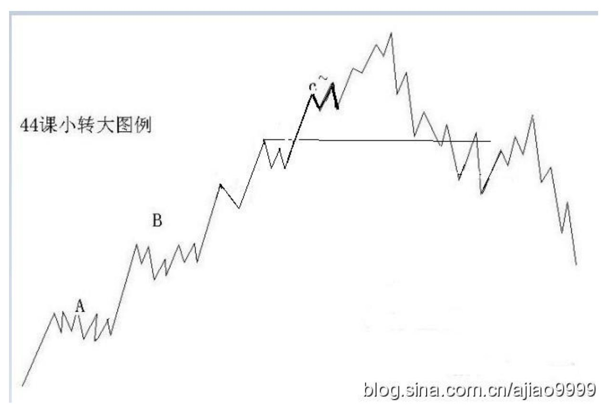
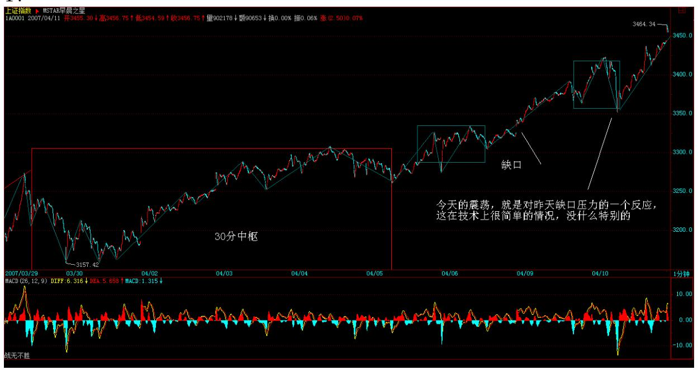

教你炒股票44:小级别背驰引发大级别转折

(2007-04-10 15:23:46)有了上一课,对"背驰级别等于当下的走势级 别"这最一般的情况,应该是很好把握了,唯一可能出现困难的,就 是"背驰级别小于于当下的走势级别" 这种情况,也就是所谓的小级 别转折引发大级别转折,对这种情况,还要进行进一步的分析。

还是用上次的例子,向上 30 分钟级别的 a+A+b+B+c,如果 c 是一个 1 分钟级别的背驰,最终引发下跌拉回 B 里,这时候,c 里究竟发生 了点什么事情?首先,c 至少要包含一个 5 分钟的中枢,否则,中枢 B 就不可能完成,因为这样不可能形成一个第三类的买点。不妨假设 c`是 c 中最后一个 5 分钟的中枢,显然,这个 1 分钟的顶背驰,只 能出现在 c`之后,而这个顶背驰必然使得走势拉回 c`里,也就是 说,整个运动,都可以看成了围绕 c`的一个震荡,而这个震荡要出现 大的向下变动,显然要出现 c`的第三类卖点,因此,对于那些小级别 背驰后能在最后一个次级别中枢正常震荡的,都不可能转化成大级别 的转折,这个结论很重要,所以可以归纳成如下定理:缠中说禅小背 驰-大转折定理:小级别顶背驰引发大级别向下的必要条件是该级别走 势的最后一个次级别中枢出现第三类卖点;小级别底背驰引发大级别 向上的必要条件提是该级别走势的最后一个次级别中枢出现第三类买 点。

注意,关于这种情况,只有必要条件,而没有充分条件,也就是说不 能有一个充分的判断使得一旦出现某种情况,就必然导致大级别的转 折。小级别顶背驰后,最后一个次级别中枢出现第三类卖点并不一定 就必然导致大级别的转折,在上面的例子里,并不必然导致走势一定 回到最后的该级别中枢 B 里。

显然,这个定理比起"背驰级别等于当下的走势级别"必然回来最后 一个该级别中枢的情况要弱一点,但这是很正常的,因为这种情况毕 竟少见点而且要复杂得多。因此,在具体的操作中,必须有更复杂的 程序来对付这种情况。而对于"背驰级别等于当下的走势级别" ,如 果你刚好是该级别为操作级别的,只要在顶背驰时直接全部卖出就可 以。

对于"背驰级别小于当下的走势级别"的情况,为了简单起见,不妨 还是用上面的为例子。如果一个按 30 分钟级别操作的投资者,那 么,对于一个 5 分钟的回调,是必然在其承受的范围之内,否则可以 把操作的级别调到 5 分钟。那么,对于一个 30 分钟的走势类型,一 个小于 30 分钟级别的顶背驰,必然首先至少要导致一个 5 分钟级别

的向下走势,如果这个向下走势并没有回到构成最后一个 30 分钟中 枢的第三类买点那个 5 分钟向下走势类型的高点,那么这个向下走势 就不必要理睬,因为走势在可接受的范围内。当然,在最强的走势 下,这个 5 分钟的向下走势,甚至不会接触到包含最后一个 30 分钟 中枢第三16 类买点那 5 分钟向上走势类型的最后一个 5 分钟中枢, 这种情况就更无须理睬了。如果那向下的 5 分钟走势跌破构成最后一 个 30 分钟中枢的第三类买点那个 5 分钟回试的 5 分钟走势类型的 高点,那么,任何的向上回抽都必须先离开。

以上这种是全仓操作的处理方法,如果筹码较多,那么当包含最后一 个 30 分钟中枢第三类买点那 5 分钟向上走势类型的最后一个 5 分 钟中枢出现第三类卖点,就必须先出一部分,然后在出现上一段所说 的情况时在出清。当然,如果没有出现上一段所说的情况,就可以回 补,权当弄了一个短差。

(娇:1 分背驰转 5 分级别看 1 分背驰点后 1 分下走势出现 1 分3 卖先卖出一部分,然后看 1 分下走势完成时能否碰到前 5 分 3 买高 点,不碰到买回。碰到后在随后的向上反抽中出清:分段递归级别)有 人可能问,为什么那 1 分钟背驰的时候不出去,这是与你假定操作的 级别相关的,而走势不能采取预测的办法,这是不可靠的,由于没有 预测,所以不可能假定任何 1 分钟顶背驰都必然导致大级别的转折, 其实这种情况并不常见,你不可能按 30 分钟操作,而一见到 1分钟 顶背驰就全部扔掉,这就变成按1 分钟级别操作了。如果你的资金量 与操作精度能按 1 分钟操作,那就没必要按 30 分钟操作,而按1 分 钟操作,操作的程序和按 30 分钟的是一样的,不过相应的级别不同 而已。

当然,对于有一定量的资金来说,即使按 30 分钟操作,当见到 1 分 钟的顶背驰时,也可以把部分筹码出掉,然后根据后面的回调走势情 况决定回补还是继续出,这样的操作,对一定量的资金是唯一可行 的,因为这种资金,不可能在任何一定级别的卖点都全仓卖掉。至于 底背驰的情况,将上面的反过来就可以。

18 19 昨天说了,由于中石化等业绩很好,大盘股是压不住了,那些 说现在市赢率如何如何的人,算一下中石化现在是多少?且不说今年 依然可以高速增长。其实探讨这些没什么意义,只是汉奸总是拿这些 说事,不妨也说说。

今天的震荡,就是对昨天缺口压力的一个反应,这在技术上很简单的 情况,没什么特别的。现在,以前说的深圳 1 万点已经在眼前,当 然,现在主要考验管理层智慧的时候,一个连深圳 1 万点都接受不了 的管理层,绝对是历史性的笑话,谁愿意当这个笑话的主角,请便。

纯操作上, 1 根 5 日线,反复强调,看好这就足够了,至于那些喜 欢测顶的人,从 2000 点就测到现在,劝一句,千万别玩期货,否则 死都不知道怎么死的。

不过,即使在最有利于多头时,也绝对不能得意忘形,任何时候都不 能追高,在这种走势中,如果技术不好,用均线控制持有,这是最简 单且有效的办法。如果要换股操作,一定要注意节奏,必须在某级别 顶背驰抛了,然后盘中回跌确实站稳后再换,这样才风险小。一般情 况下,技术不好的,最好别随便换股,轮动走势,只要是本 ID 反复 强调的优质二线成分股以及那些业绩、送配优良的二线股票,肯定都 会启动的。

\*\*\*\*\*\*\*\*\*\*\*\*\*\*\*\*\*\*\*\*解盘及互动问答:

#### \*\*\*\*\*\*\*\*\*\*\*\*\*\*\*\*\*\*\*\*。

1. 网友 [匿名] 小丸子: 缠主,今天节奏全错了,802 和 600961被 洗出来了,惭愧。 2007-04-10 15:26:41缠师:技术不好就看 5 日 线,如果是短线,就看 60 分钟的 5 均线,(娇注:5 分图多空轴) 这些线不破,根本不用理会。

#### \*\*\*\*\*\*\*\*\*\*\*\*\*\*\*\*\*\*\*\*。

2. 网友 [匿名] 缠心雕龙: 博主好,请教盘整背驰的问题:三段走 势"上下上" ,设为 A0A1A2,假如 A0 最短,A1 最长,A2 中等长 度,且 A2 高点大于 A0低点但低于 A0 高点,同时看 MACD 指标,A2 的面积比 A0 大,这时能说 A2 对 A0 未盘背吗?感觉 A2 回中枢的 力度比 A0 离开中枢的力度要大得多,虽然 A2没创新高,严格说这不 能叫盘背吧?2007-04-10 15:30:44缠师:这在中枢震荡那节里都有, 请去看看。

20

#### \*\*\*\*\*\*\*\*\*\*\*\*\*\*\*\*\*\*\*\*。

3. 网友 [匿名] 后知后觉: 禅主,昨天最后的提问探讨,您没看 到:大象按照各自的属相,分别过本命年。今天的走势似乎有些这样 的意思。感觉今天空方稍微有些技术含量,在时间上,节奏上控制的 很到位,而多方反倒有些猴急。现在散户心理浮躁,多方也有些急功 近利。问:(1)联通是否可以挑逗了?(2)大象是否会真的分别过 本命年?这样的剧本幼稚可笑吗?谢谢了!2007-04-10 15:34:34缠 师:为什么跌就一定是空方弄出来的?多头就不可以洗盘?今天在石 化出来前先跌,就是剧本里出彩的一笔,好好体会吧。

#### \*\*\*\*\*\*\*\*\*\*\*\*\*\*\*\*\*\*\*\*。

4. 网友 [匿名] 新浪网友: 老师辛苦了! 10.44 元进的 600782, 希望老师帮我看一下。谢谢! 2007-04-10 15:44:33缠师:这种股票 不是不可以玩,但如果你买了以后还要问的,证明你的技术还达不到 玩这种股票的程度。所以最好别养成追高的坏毛病,这股票中线没什 么大问题,短线涨太快,等均线上来。

缠师:复习到此,先留个脚印。搞懂这一课的必要条件是:搞懂 36, 37 课中趋势背驰里面的 c 内部的分解。

#### \*\*\*\*\*\*\*\*\*\*\*\*\*\*\*\*\*\*\*\*。

缠师:前两天经常说中石化,就如同过年前经常说联通,后面经常说 中行一般,由此,这剧本的有趣地方,应该有点感觉了。汉奸原来不 是很多工行要打压吗?那他们现在能对工行干点什么呢?把工行打压 下 5 元?拉起来?现在中行已经成龙头了,看看两者的差价。其实, 现在大盘的走势,就是一个现场直播,就那几只大盘股票,对指数起 着关键作用,如何应用,什么时候用什么,大家应该好好体会,从过 年前开始,慢慢体会,这样会学到点东西。

至于大盘,没什么可说的,测顶的人是最无耻的,按他们的预测,他 们早就尸骨无存了,还好意思出来晃?顶是干出来的,而不是测出来 的,连这个最简单的道理都不懂?还是那句话,看不明白的就看 5 日 线,技术好的,可以充分利用震荡先卖后买打短差、换股,但绝对不 能追高。现在能打住大盘的,只能是管理层的大棒,否则,大盘将继 续走到资金与筹码的能量平衡位置才能停下来休整,而这个位置是不 可预测的,是干出来的。心态不好、心脏不好的,21 就半仓,这样出 现什么情况都好办了。个股就不说了,反正都是以前说的,现在是瓜 田李下,只干不说。2007-04-11 15:38:12

#### \*\*\*\*\*\*\*\*\*\*\*\*\*\*\*\*\*\*\*\*。

5. 网友 [匿名] 新浪网友: MM,607 怎样,你说让大家去吸汉奸 血,我买了。 2007-04-11 15:41:59缠师:买了就好,汉奸基金在 13 元附近加仓,没买的就算了,没必须追高为汉奸抬轿子。到时候上去 后,找机会把汉奸折腾一把。

#### \*\*\*\*\*\*\*\*\*\*\*\*\*\*\*\*\*\*\*\*。

6. 网友 [匿名] 乐土: 老师,您好!一线蓝筹几乎同时被点燃,是 否预示后几天将出现二八行情?两大银行正在做技术整理?正在认真 学习您给我们大家的论语。2007-04-11 15:42:01缠师:你就当成板块 轮动,指数看深圳就可以,上海可以参考。注意,什么股票都不要追 高。

7. 网友 [匿名] 小八:老师,正在学习实践同级别分解的机械买卖操 作中,但是从30分钟图来看,往往盘背在30级别也是很难等的, 因为 macd 的参数是默认的。如果把它改成 5.10.10,那么感觉红绿 柱子的显示要敏感一些,您看这个修改参数的做法可行吗?如果不可 行您觉得用哪个比较合适呢?(我股龄不长,追随老师之中),望老 师不吝赐教。谢谢! 2007-04-11 15:42:36缠师:30 分钟等不到,就 按 5 分钟来,想快还不简单?不过,如果不熟练,别按太小级别的, 一旦判断错误,改都改不过来。

#### \*\*\*\*\*\*\*\*\*\*\*\*\*\*\*\*\*\*\*\*。

8. 网友 [匿名] 小丸子: 今天倒是能准确判断下跌,也能准确判断 上涨,但是没能心到手到,看来这个过程还要练习,就是太贪心了, 几只股票都想买,又没那么多银子,好不容易决定买其中一只,收盘 发现没买的都涨停了,而买了的却没怎么涨。2007-04-11 15:51:3622 缠师:先保证操作正确,再保证结果更好,这是两个层次的东西,没 有第一层次,后面是没意义的。而要保证操作正确,最好就是一心一 意,选好一定的股票,反复操作,如果你把所有该级别的震荡都基本 把握,其实效率并不低。

#### \*\*\*\*\*\*\*\*\*\*\*\*\*\*\*\*\*\*\*\*。

9. 网友 [匿名] hehe2: 博主,今天基本把握住下跌了。不过就是老 是没有跌完就进去。这个是个教训,我要记住。 2007-04-1115:43:11 缠师:先有节奏感,再完善准确率。

#### \*\*\*\*\*\*\*\*\*\*\*\*\*\*\*\*\*\*\*\*。

10. 网友 [匿名] 百思不解: 楼主好!44 课里小级别背驰引发大级 别转折,文中举例如下:"向上 30 分钟级别的 a+A+b+B+c,如果 c 是一个 1 分钟级别的背驰,最终引发下跌拉回 B 里" 。请问,c 如 果发生一个 5 分钟级别背驰(但 c 对 b 不背驰),最终引发下跌拉 回 B 里,这种情况和上面例子在分析上有什么不同呢?或者说,这种 情况和 a+A+b+B+c 发生 30 分钟背驰而必然拉回到 B 里有什么区别 呢?2007-04-11 15:44:44缠师:这没什么不同,即使是 1 分钟以下 背驰,道理也是一样的,那1 分钟背驰只是一种举例,并不是说一定 要是 1 分钟背驰。

(注:缠中说禅走势类型分解原则:一个某级别的走势类型中,不可 能出现比该级别更大的中枢,一旦出现,就证明这不是一个某级别的 走势类型,而是更大级别走势类型的一部分或几个该级别走势类型的 连接。小级别背驰后回跌,一旦碰到包含大级别中枢 3 买的的 GG,同 级别分解的角度,中枢就要扩展,原走势结束,必须先离开)

#### \*\*\*\*\*\*\*\*\*\*\*\*\*\*\*\*\*\*\*\*。

11. 网友 [匿名] 水房姑娘: MM,我感觉游资有争分夺秒赶顶的劲 头啊。 2007-04-11 15:45:05缠师:就算指数见顶也没什么大不了 的,1 月 4 日那次不也见了,后来指数不动,很多个股继续翻番,有 本 ID 这样的人在,一有机会自然到处点火,还怕市场没机会?23

#### \*\*\*\*\*\*\*\*\*\*\*\*\*\*\*\*\*\*\*\*。

12. 网友 [匿名] 缠心雕龙: 博主好,请教盘整背驰的问题:三段走 势"上下上" ,设为 A0A1A2,假如 A0 最短,A1 最长,A2 中等长 度,且 A2 高点大于A0 低点但低于 A0 高点,同时看 MACD 指标,A2 的面积比 A0 大,这时能说 A2 对 A0 未盘背吗?感觉 A2 回中枢的 力度比 A0 离开中枢的力度要大得多,虽然A2 没创新高,严格说这不 能叫盘背吧?2007-04-10 15:30:44缠师:这在中枢震荡那节里都有, 请去看看。

网友 [匿名] 缠心雕龙:不好意思,我理解中枢震荡那节内容,觉得 上述情况就是"未盘背" ,因为 A2 力度大于 A0 嘛。但好多同学说 没创新高,那就是"盘背" 。希望博主明确一下。 2007-04- 1115:48:27缠师:创新高或新低才有背驰或盘整背驰的可能。未创新 高的情况,其实可以按中枢震荡的方式去看,等于达不到上次震荡的 力度,也可以用 MACD 等辅助看,但和背驰不是同一样东西,这在关 于中枢震荡的力度判断那一课里里都有的。

#### \*\*\*\*\*\*\*\*\*\*\*\*\*\*\*\*\*\*\*\*。

13. 网友 [匿名] 幼稚园: 缠姐,昨天加仓了 600598(北大荒), 按日线级别操作的。今天有所表现,能帮我看一下我分析的正确吗? 2007-04-11缠师:这种图形是不会有日线级别买点的,小级别当然 有。做对了,有可能是碰对了,所以要把问题搞清楚。

- 14. 网友 [匿名] touchnet: 关于背驰后最后中枢扩展的情况,向老 大请教:对于向上 30 分钟级别的 a+A+b+B+c,如果 b、c 背驰,不 妨设背驰后 5 分钟走势段依次为 C1、C2、C3、C4、C5 等等,其中奇 数段向下,偶数段向上。则必有以下结论:(1)min(C1)<=GG(B) 第 一段折返就必须与 B 的 GG 有重叠部分。
- (2)min(C3)<=max(C1),否则,将形成一个与 B 完全不重叠的 C, 与背驰后结束该走势矛盾。(3)min(C5)<ZG(C),其中 C 为 C1、 C2、C3 形成的 30 分钟级别的中枢。否则 C5 形成 C 的三买,此时C 已结束,对于中枢扩展来说,B、C 如果要扩展成日线中枢,根据中枢 定义,至少要 9 段 5 分钟走势才能形成日线级别的中枢,此时,B中 若只有三段次级走势,则目前 B,C,再加上 c,总共只有七段,所以C5 只能走 C 的延伸段,这样加上 C4、C5,就有 9 段了。
- 24 缠师:首先,你这些结论都有一个前提,就是背驰的级别是 30 分 钟的,否则,一个小级别背驰,完全可以不这样走。至于后面的分 析,有些细节不太对,因为后面的课程就会说到,请等明天。

#### \*\*\*\*\*\*\*\*\*\*\*\*\*\*\*\*\*\*\*\*。

15. 网友 [匿名] 白玉兰: 妹妹好!最近只是二线优质或成分股的天 下,是不是象 915 这样的(定义为三线股?)即使有题材的也处于休 眠中?妹妹别不理我?如果我问错了,就不要回答了。 2007-04- 1116:17:29缠师:对不起,问题太多,没看到。这前段时间说过,二 线要先腾出空间,三线才能继续,中线没有任何问题。所以一定要踏 准板块轮动的节奏,但如果没跟上,也没必要跟了,等待也是一种操 作。

#### \*\*\*\*\*\*\*\*\*\*\*\*\*\*\*\*\*\*\*\*。

16. 网友 [匿名] asdf: 女王,对各个级别的中枢分辨还是糊涂啊。 譬如连续 10 天涨停, 又连续 5 天跌停, 又连续 10 天涨停,又连 续 5 天跌停,没有一个日线中枢,这样构不构成周线中枢啊?是不是 周线中枢形成前一定要形成日线级别上的 3 段走势? 可不可以是 30 分钟级别上的? 2007-04-11 15:52:31缠师:中枢级别和幅度没有必 然的关系。没有日线 3 段,怎么会有周线中枢?如果是 30 分钟,就 至少要 9 段,那也自然形成 3 段日线的。

#### \*\*\*\*\*\*\*\*\*\*\*\*\*\*\*\*\*\*\*\*。

17. 网友 [匿名] II: 老大,那你不管 999 了吗?它这几天不太好 噢。 2007-04-11 16:27:07缠师:这种问题毫无意义,什么叫管?难 道天天涨才是管?股票是有节奏的,你看 600497 去年 6 月份时盘了 多长时间。对于散户,根本没必要专门弄一只股票,热点在哪里就去 哪里,优质二线股,全市场本 ID 第一个把剧本告诉大家,怎么不去 关心?至于 999,本 ID 只知道,万科也是华润的。

#### \*\*\*\*\*\*\*\*\*\*\*\*\*\*\*\*\*\*\*\*。

25 18. 网友 [匿名] 麒麟: 妹妹,你资金量这么大,干出顶后怎么 出货啊?另外,我按妹妹提示的大方向买的 000912,怎么不涨啊?谢 谢妹妹!好几天都没回答俺的问题了。 2007-04-11 16:02:53缠师: 为什么要出货,20 年的大牛市,出了货去哪里买回来?先把这牛市的 性质搞清楚。一个 20 倍市赢率的股票,过三个月以后再问这个问 题,看在什么位置。市场只会给耐心者以回报。
