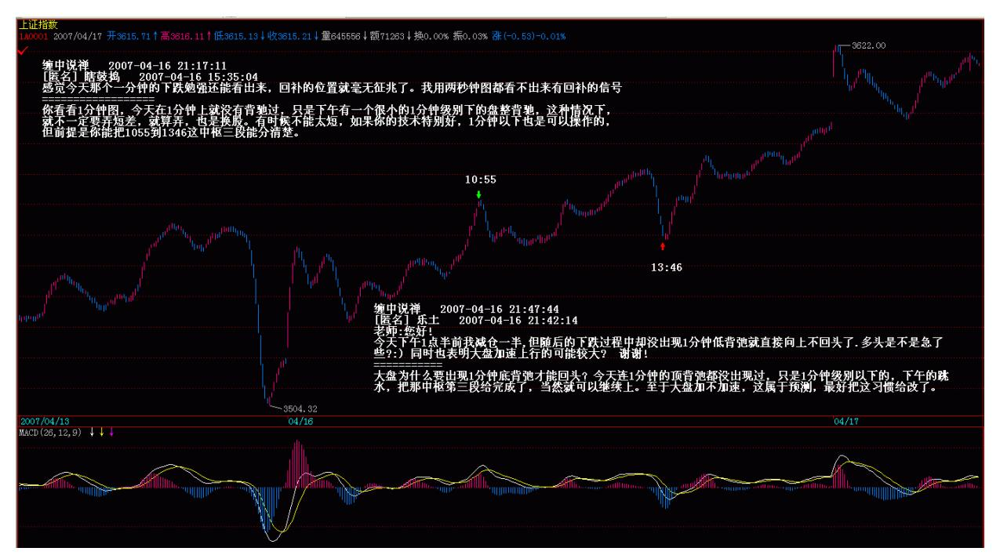
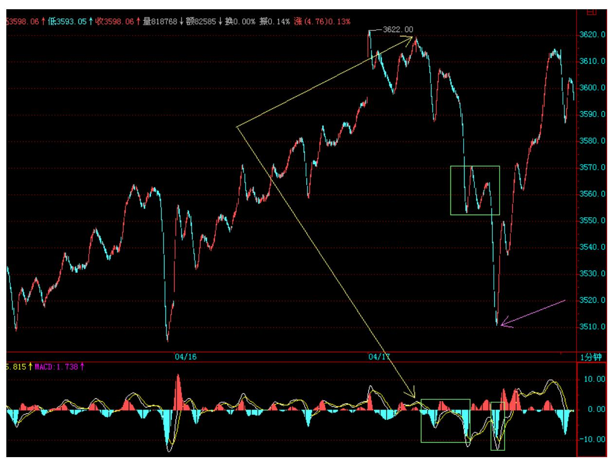
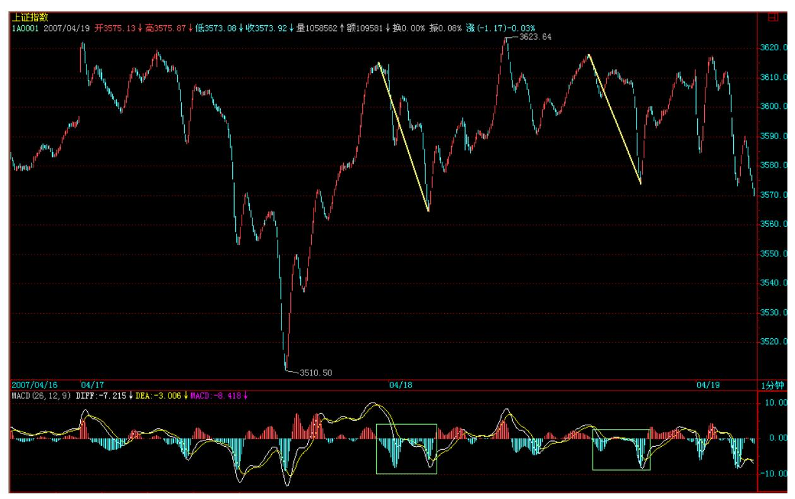

# 教你炒股票45:持股与持币,两种最基本的操作/p>;

(2007-04-12 15:39:04)发现很多人都有这样的糊涂概念,以为买入卖 出才是股票的操作,是股票操作的所有了。其实,对于每一笔交易来 说,买入卖出,1 秒都不用就完成了,更多、更长时间的,填充在买 入与卖出之间两种最基本的操作:持股与持币,才是更重要的操作。

假设你是按 30 分钟级别操作的,那么,在一个 30 分钟的买点买入 后,就进入一个持股的操作中,根据本 ID 的理论,你很明确地知 道,一个 30 分钟的卖点必然在前面等着,这卖点宣告从那 30 分钟 买点开始的走势类型的结束。在这个卖点到来之前,你就只在持股这 唯一的操作里。当这个 30 分钟的卖点出现时,卖出,然后就进入持 币的操作里,直到一个 30 分钟的买点出现。持股与持币,归根结底 就是一种等待,等待那个被理论绝对保证的买卖点。所有股票的操 作,归根结底,只有两个字:等待。

等待市场的买卖点,和等待彗星的到来不同,后者,可以很精确地知 道具体的时间,而市场的买卖点是生长出来的。买卖点的生长过程, 就是一个具体的走势类型的生灭过程。这些过程,不妨用一个 30 分 钟第一类买点 a 开始的 30 分钟走势类型如何生灭为例子进行说明。 一个 30 分钟的走势类型,最低标准,就要形成一个 30 分钟的中 枢,一旦这中枢形成,该走势类型随时结束都是符合理论的。这样, 最弱的走势类型(娇注:上涨调整反之最强),就是该中枢一完成就结 束,在该例子里,就是从 a 点开始,三段重叠的 5 分钟走势类型结 束后,该 30 分钟走势类型就结束了。用 A1、A2、A3 来依次代表这 三段 5 分钟走势类型,显然,从 a 开始的这 30 分钟走势类型就可 以用 A1+A2+A3 表示。那么,在实际操作中,如何事先知道,是否真 的将形成这种最弱的走势?答案是否定的,不仅不可能事先知道是否 真的要出现这种最弱的走势类型,而且走势类型的任何可能性都不可 能被事先确认,这说明什么?说明预测是毫无意义的,走势是干出来 的,是市场合力的结果,而不是被上帝所事先确定的,市场中没有上 帝,市场的方向只有所有参与者的合力决定,大资金或高技巧,可以 用自己的力量去引导市场,按照自己的剧本来演绎,但没有上帝可以 完全事先确定市场走势类型完成的所有细节。

那么,如果一切都不可以预测,那本 ID 理论的意义何在?一切虽然 不可以预测,但一切走势类型的可能结构与类型,却是可以分类的, 每一类之间都有着明确的界限,因此,你唯一需要的,就是观察市场 当下的走势,让市场去选择可能的结构与类型,然后根据市场的选择 来选择。注意,这对于大资金来说一样的,无论任何规模的资金,归 根结底都只是市场的分力,不是合力本身,企图把自己当合力本身, 把自己装扮成上帝的,最终的结局都是死无葬身之地。只要是分力, 就要观察市场当下的反应,根据市场反应的当下选择来选择。

例如,本 ID 可以点火二线股,可以把超级大盘股编写在剧本里,但 本 ID 从来就不会觉得自己是上帝在操控市场,本 ID 不过是在和市 场互动,一旦市场某27 方面的能量被引导耗尽,自然就要选择相反的 操作来互动市场,这是一个复杂的当下感应过程,必须最敏锐地察觉 市场能量的变动。

当第一个中枢形成后,走势类型可以随时结束,后面的分类比较复 杂,今天时间太紧,写不完,在下堂课中将详细论述。但今天的课 程,是一个思维上的关键,必须明确两点:一、买卖点操作后,等待 是一个最关键的过程,必须密切关注相应的走势类型的生长与分类选 择,这一切都是当下的。二、买卖点本质上是走势类型的生长状况与 分类决定的,反过来,某些买卖点的出现,又使得走势类型的生长状 况分类有一个明确的界定,这些都是观察市场细节的关键之处。

解盘及互动问答:

#### \*\*\*\*\*\*\*\*\*\*\*\*\*\*\*\*\*\*\*\*。

缠师:管理层是不能太表扬的,虽然这次上 1 万,表现得还很山东 人,但还是不能表扬。周末没有任何消息就是最好的消息,所以今天 的走势就极为正常了。那些测顶的大师们,如果弄期货,早破产几百 次了,所以期货还是不要出来了,免得汉奸都去跳楼。

多次强调,一条 5 日线就比所有测顶大师要厉害 1 万倍,连 5 日线 都不破的走势,你还有什么可担心的?当然,如果你技术可以,每天 都可以利用震荡来换股、打差价。如果技术不行,就看 5 日线吧。至 于那些测顶大师,那就继续伸长脖子等大阴线吧。真出大阴线,你们 也不敢买。最多就忽悠自己怎么厉害,知道一定会调整。可惜,这些 人从 2000 点、3000 点就一直说调整。2 月 27 日也只让你们高兴了 一天,你们那天敢买吗?大阴线又和你们有什么关系?现在空仓的, 唯一办法就去反省,看是什么心态造成的。偷心不死,自然有这样的 结果。有这么大的头,才带那么大的帽子。顶都给你们测去了,本 ID 之类的人吃什么?本周当然会有震荡,这就像说面首都是男的一样没 意义,关键是如何通过震荡减低成本,而不是把震荡当成自己预测如 何准确的谈资。股票如面首,是用来操作的,不是用来谈论的。目 前,关键还是管理层的态度,只要他们的态度没有明确的打压,那就 不会有任何大问题。

操作上,追高就没必要了,空仓的就看着吧,好好反省;其余技术不 好的,继续看 5 日线,技术好的,看好 1 分钟、5 分钟的小背驰做 震荡。

现在连周线的中枢都没形成过,怎么会有周线的背驰?要背驰也最多 是日线的,而且能不能形成还要打个问题,这没必要预测,看市场自 己走出来。本 ID这里没有什么子浪,只看中枢的运动。

你看看 1 分钟图,今天在 1 分钟上就没有背驰过,只是下午有一个 很小的 1 分钟级别下的盘整背驰,这种情况下,就不一定要弄短差, 就算弄,也是换股。

28 有时候不能太短,如果你的技术特别好,1 分钟以下也是可以操作 的,但前提是你能把 1055 到 1346 这中枢三段能分清楚。(2007-04- 16 21:17:11) 29 大盘为什么要出现 1 分钟底背弛才能回头?今天连 1 分钟的顶背弛都没出现过,只是 1 分钟级别以下的,下午的跳水, 把那中枢第三段给完成了,当然就可以继续上。至于大盘加不加速, 这属于预测,最好把这习惯给改了。

今天,你爽了吗?这样的震荡,就是本 ID 理论的天堂,打开 1 分钟 图,看看 1030 和 1340 分这两个点是什么,如果还看不明白,更重 要的是,如果当时还没有反应,那你还需要多学习。暂时学不会的, 本 ID 已经给了一个最简单的武器,5 日线,当然,这会错过很多短 差机会,但比那些测顶大师要厉害多了。

30 31 今天之所以有这样的震荡,其实很简单,因为明天有重要数据 公布,但今天有一个更重要的消息,就是以后到香港上市,一定要 10 亿美金以上,这就充分说明了,目前的管理层依然山东人,这么好的 市场,能解决大问题,不充分利用,那真傻了,希望管理层继续山东 人下去,但本 ID 依然不准备表扬他们。当然,今天还有人忽悠到某 日报上写文章了,这种破伎俩都要使用,汉奸也真窝囊。

但在最顺利时,也必须谨慎,市场永远是风险市场,股票永远是废 纸,任何追高杀跌的行为都是自寻死路。明天的数据影响短期走势, 如果数据不好,有大的加息预期,则继续震荡也是很正常的,但大方 向是不变的,而且,加息是一件很无聊的事情,如果还用,真有病 了。

个股方面,没什么可说的,二线拉开空间三线继续,这早说过了。但 必须指出,有些人的操作太乱,如果技术不行,难道持有都办不到?

像那 14 只里的,今天还一大半再创新高,有多少人拿住了? 600578、600777、000915 这些前面特慢的,还有人有吗?前面反复强 调过不在 14 只里的那 VC 股,估计没人拿住了吧?中小板的小盘 股,中线如何关注,大概也没有人有耐心了。

注意了,那些股票涨太多没买就算了,本 ID 是反对任何追高的,昨 晚说过,如果有耐心的,可以去选择估计把业绩搞坏的那些股票,如 果公布坏业绩反而走好的,就好好看着,特别那些价位不高的,这种 手法,并不难发现,找好买点进去就可以。现在,监管时段,本 ID也 不好说具体的,只能描述一下方向。

32 33 1. 网友 [匿名] 缠心雕龙: 博主好!还一个关于走势力度的 问题。因为背驰主要是比较围绕中枢振荡的两段走势之间的力度,而 力度目前没有太严格的定义,只是用均线面积或 MACD 红柱面积辅 助,这样实际中还是有少部分情况无法判断。假设 a、b 都是围绕中 枢的振荡,不考虑 a、b 内部振荡对力度面积的影响,先把 a、b 当 作直线段看,则"a 持续的时间乘以价格变动范围"是否可以当作 a 的力度看?a、b 之间如有连接 A,则这个 A 对 a、b 力度本身的计 算有影响吗?2007-04-12 15:43:37缠师:精确定义要用到测度的知 识,MACD 是一样的,精确的计算公式还是自己编,没多大意义。

2. 网友 [匿名] 百思不解: 楼主好!关于 39 课的同级分解操作流 程,如有向上的 A2 对 A0 未盘背,其后 A2 内部小级别背驰引发大 级别的 A3 回调,且A3 不破 A0 高点,其后 A4 盘背或不创新高,则 A4 是否卖出?这里的操作似乎和 44 课"背驰级别小于当下的走势级 别" 情况下的操作程序很类似。这里(A0-A4)应该还是一个和 A0同 级的走势吧?因为 A3 没有跌破前高,则 A3 可看作向上走势(A0- A4)的新中枢吧?2007-04-12 15:45:37缠师:只要是盘整背驰或不创 新高的,都可以先卖出。当然,是在操作的级别上。

#### \*\*\*\*\*\*\*\*\*\*\*\*\*\*\*\*\*\*\*\*。

3. 网友 [匿名] 梁山泊: 楼主说说五粮液有啥内幕啊?2007-04- 1215:57:08缠师:忘记内幕,只看买卖点。有卖点,天王老子不让你 卖也要卖。

#### \*\*\*\*\*\*\*\*\*\*\*\*\*\*\*\*\*\*\*\*。

4. 网友 [匿名] 也许认识你: 博主,上涨中,3 个 5 分钟级别的盘 整构成 1 个 30 分中枢,分别是(下上下)+(上下上)+(下上 下),这 9 段都是 5分钟级别(1 分钟级别的走势类型),是不是每 个盘整都是没有任何延伸的盘整?第二个(上下上)是不是对应第一 个(下上下)中的第二个下,而形成的盘整中枢?如果第一个盘整中 枢这样形成,上涨中,1 分钟级别以下的下跌(就是直线下跌没有中 枢)+5 分钟级别的(上下上)+1 分钟级别的下跌,3部分构成 5分 钟级别的盘整,现在中枢的方向变成(上下上),这个也是上涨中的 中枢?第一个盘整有延伸,那么其余两个盘整是否也要求必须有延 伸?2007-04-12 15:52:1934 缠师:概念有点混乱。如果真是盘整+盘 整,那就是中枢延伸或扩展出来的,除了在同级别分解中可以允许盘 整+盘整,其他情况下是不允许的。

\*\*\*\*\*\*\*\*\*\*\*\*\*\*\*\*\*\*\*\*5. 网友一粒米 :缠 MM 好!上海的量今天缩 79 亿,深圳增 20亿。两市昨天共计 2415 亿,今天共计 2355 亿, 按理本次极限值为2500 亿吧?是否不用管理层出手,市场规律很快会 起作用?(后市资金流入锐减)2007-04-12 16:03:03缠师:这地方出 现震荡调整都很正常。学习了本 ID 的理论,应该特别欢迎这种震荡 才是。本 ID 反对的是政策干预。大牛市,也没必要死拿着,有大级

别的卖点,也可以先卖再买。多头,不是傻多头。是要充分利用震荡 降低成本的快乐多头。

#### \*\*\*\*\*\*\*\*\*\*\*\*\*\*\*\*\*\*\*。

6. 网友 [匿名] 文科生的忧虑: 妹子,文科生数学不精,悄悄的问 一句:CCTV一个月就翻倍了,照这样下去,20年后市场上一半 的钱就都是他的了?罗锅,潜水几个月了,估计也翻了几番了。你的 理论如此无敌于天下,弟子又如此聪明能干。要不了10年,缠家军 就把中国股市的钱垄断了。再互相惨杀吗? 2007-04-12 16:05:17缠 师:资金到一定规模后,是不会有这样的速度的,不是任何买点卖点 都可以无限制地参与。大资金的玩法不是这样的,而真正能操作大资 金而且能长期保证赢利的,凤毛麟角。

#### \*\*\*\*\*\*\*\*\*\*\*\*\*\*\*\*\*\*\*\*。

7. 网友 [匿名] 瞎鼓捣: 老大说的对啊,持股最关键。最怕的是盈 利抱不住,亏损到是抱的很稳。 2007-04-12 16:12:11缠师:错,不 是持股最关键,持币一样关键。卖点以后,在买点以前,如何能持住 币,这同样关键。

#### \*\*\*\*\*\*\*\*\*\*\*\*\*\*\*\*\*\*\*。

8. 网友 [匿名] 新年好: 期待下堂课。请问缠姐,在等待中是不是 可以适当作短差?不过往往把握不住幅度,有的幅度很小,但是看样 子又跌不下去,35 买了是给证券公司打工,不买又怕接下来长上去。 如果出现这种情况应该怎么办呢? 2007-04-12 16:26:16缠师:当然 可以,但前提是操作有把握,这是一个实践问题,在不熟悉时,可以 分批小量操作。

#### \*\*\*\*\*\*\*\*\*\*\*\*\*\*\*\*\*\*\*\*。

9. 网友 [匿名] MACD: 请问缠妹,以前的大牛错过了,现在介入股 市晚不晚? 2007-04-12 16:21:03缠师:关键是学好技术,技术好, 如果资金又不大,例如可以按 30分钟操作,那什么时间都不存在晚的 问题。但如果资金级别必须是至少月线级别的,那是另外的问题了。

10. 网友 [匿名] 小八: 老大,能不能抽时间回答一下小弟的这个问 题呀?老师的38课中有这段描述:"必然首先出现向上的第一段走 势类型,根据其内部结构可以判断其背驰或盘整背驰结束点,先卖 出,然后必然有向下的第二段,这里有两种情况:1、不跌破第一段低 点,重新买入;2、跌破第一段低点,如果与第一段前的向下段形成盘 整背驰,也重新买入,否则继续观望,直到出现新的下跌背驰。在第 二段重新买入的情况下,然后出现向上的第三段,相应面临两种情 况:1、超过第一段的高点;2、低于第一段的高点。对于第二种情 况,一定是先卖出;第一种情况,又分两种情况:1、第三段对第一段 发生盘整背驰,这时要卖出;2、第三段对第一段不发生盘整背驰,这 时候继续持有。" 我不解的是在这么几句话里面:1、"不跌破第一 段低点,重新买入" (请教,这个不跌破是在次级别或次级别一下级 别看吗?或者是说这个"不跌破"怎么来看比较好。有没有可能出现 次级别或其以下级别没有出现底背就让这个"跌破"成为不可能 的?);2、"直到出现新的下跌背驰"(请教,这个"新的下跌背 驰"是在哪个级别中看的?是本级别吧。还是次级别?) 2007-04-12 16:31:59缠师:注意,这里说的是同级别分解,第一段是什么级别, 后面都是一样的。后面的问题也一样。

\*\*\*\*\*\*\*\*\*\*\*\*\*\*\*\*\*\*\*\*11. 网友 [匿名] 自然风: 缠师好!能说说钢 铁的走势吗?谢谢!2007-04-12 16:30:4236 缠师:本 ID 在去年底 给今年钢铁的定义是,去年的有色,你看看去年有色怎么走就可以。

网友 [匿名] 自然风:缠主请教看有色看去年的哪些个有色?有色中 表现不一,抱歉了,问这样的问题。

缠师:钢铁股也表现不一,说的当然是总体方向。

#### \*\*\*\*\*\*\*\*\*\*\*\*\*\*\*\*\*\*\*\*。

12. 网友 [匿名] 白玉兰: 我好像对股票有感情,不好。 2007-04- 12 16:28:33缠师:这是参与市场第一要戒掉的东西。应该对买卖点有 感情。

#### \*\*\*\*\*\*\*\*\*\*\*\*\*\*\*\*\*\*\*\*。

13. 网友 [匿名] 新年好: 缠姐,前两天我问你有关 s 藏药的问 题,你一直没回答,今天再问一遍,希望你有空帮我看看。我是在上 月底差不多 19 元的价钱,在以为是 30 分钟买点的地方买的,谁知 道买完又一波下跌。在 9 号那天本来可以赢利走掉的,但是我没看出 来任何背驰,就没走,谁知到现在又连着下跌,几乎回到原来的中 枢,这种情况算什么?还有,如何把握这种情况?还有上个问题,你 也给看看。不过往往把握不住幅度,有的幅度很小,但是看样子又跌 不下去,买了是给证券公司打工,不买又怕接下来长上去。如果出现 这种情况应该怎么办呢? 2007-04-12 16:43:10缠师:典型的 V 型走 势,这在大级别中枢震荡中很常见。S 由于被管理层警告,最近都只 能偃旗息鼓,但中线都没问题,只是休息一下。

如果你知道的东西多点,就知道这种通道式上涨的,一旦加速突破通 道上轨,往往都会引发大点的调整,看好通道下轨就可以。

#### \*\*\*\*\*\*\*\*\*\*\*\*\*\*\*\*\*\*\*。

缠师:正如昨天所说,目前是考验管理层智慧的时候,今天的走势很 正常,尾盘的下来就更正常了,这种 2 点 45 分的跳水走势,又不是 第一次了,技术上不难把握。这也是本 ID 反复强调的,利用技术先 卖后买降成本的好机会。

基本面上,所有人对管理层可能的态度有点担心,而且深圳 1 万点、 上海 3500 的第一攻击目标已经到,进行震荡稳固本就是应该的事 情,以退为进是最好37 的选择。现在就看管理层的短期态度,20 年 的牛市,来日方长,本 ID 从来都反对急功近利。在目前位置展开整 固,将有利于大盘以后的走势。

个股依然活跃,但本 ID 反对乱炒,这已多次说过,这样只会增加汉 奸们哭诉的口实,而管理层的智力与经验都有限,最终将损害市场本 身。今天有些股票的表现就有点过分了,这样,市场本身也要给予降 温,让大家都冷静一下。本 ID 不愿意看到因为某些人的急功近利, 损害了市场所有人的利益。2007-04-13 15:33:16

#### \*\*\*\*\*\*\*\*\*\*\*\*\*\*\*\*\*\*\*。

14. 网友 [匿名] 外科医生: 尾盘跳水,把心态搞坏了。原来以为会 周一再调整的,600500 也看不出背驰,结果直线就下来了。呵呵。

2007-04-13 15:37:44缠师:这是一个典型的 1 分钟图上小级别转大 级别。

#### \*\*\*\*\*\*\*\*\*\*\*\*\*\*\*\*\*\*\*。

15. 网友 [匿名] christine: 在目前位置展开整固,将有利于大盘 以后的走势。我的理解是该作一下调整了。狂热终需降温的,不然大 家都高烧了不好。

2007-04-13 15:40:27缠师:今天复牌的两只股票这样乱搞是不行的, 管理层不降温,本 ID也要降温,市场也要降温,让大家清醒清醒。

#### \*\*\*\*\*\*\*\*\*\*\*\*\*\*\*\*\*\*\*\*。

16. 网友 [匿名] 炒汉奸: 缠 MM,来首诗庆祝万点吧。 2007-04- 1315:43:08缠师:1 万点有什么可庆祝的,市场里没什么可庆祝的, 心态要稳,对股票、点位都不要有感情,只看市场的信号。

#### \*\*\*\*\*\*\*\*\*\*\*\*\*\*\*\*\*\*\*\*。

17. 网友 [匿名] 悟禅: 老师所言极是,今天看到了国务院发展研究 中心的一份报告,报告预示政府要给股市降温。2007-04-13 15:45:1238 缠师:那级别不够,他们也就写点东西,关键不是他们。

#### \*\*\*\*\*\*\*\*\*\*\*\*\*\*\*\*\*\*\*。

18. 网友 [匿名] 马背上的水手: 这么说,大家都要等着调整的那个 靴子落地? 2007-04-13 15:45:45缠师:大牛市,不仅仅是考验投资 者,更考验管理层,这也是这几天本 ID 整天说他们的用意。但今天 的市场是活该有问题,那两只复牌的瞎搞,这样不下来冷静一下,是 不行的。

#### \*\*\*\*\*\*\*\*\*\*\*\*\*\*\*\*\*\*\*。

19. 网友 [匿名] 中信海直: 如果技术不太好,是不是下周一就该清 仓观望了?望 mm 指点一下。 2007-04-13 15:56:41缠师:技术不 好,半仓等待,好象这两天都在说。

#### \*\*\*\*\*\*\*\*\*\*\*\*\*\*\*\*\*\*\*\*。

20. 网友 [匿名] 小菜鸟: 刚学缠论不久,看到第 14 、15 课,其 中提到缠中说禅趋势力度:前一"吻"的结束与后一"吻"开始由短

线均线与长期均线相交所形成的面积。在前后两个同向趋势中,当缠 中说禅趋势力度比上一次缠中说禅趋势力度要弱,就形成"背驰" 。

但是从缠 MM 所举的例子里,600519的周线第 2 类买点,在日线上的 第一类买点,其出现的趋势力度并不比之前的同向下的趋势要弱,为 何是在 2004 年 6 月 18 号产生背弛呢?从 MACD 上来看的确绿柱子 比之前要短,但是趋势的面积并不比之前小啊。请教缠姐姐指点。

2007-04-13 15:58:06缠师:2004 年 6 月 18 号又没有新低,怎么会 有周线背弛?要看周线第二买点,要去分析日线甚至 30 分钟的图。

#### \*\*\*\*\*\*\*\*\*\*\*\*\*\*\*\*\*\*\*\*。

21. 网友 [匿名] 钱少爱好多: 开会完一看,小跳一把。晕啊,又错 过了。 2007-04-13 16:00:5739 缠师:注意看盘时间,14、14:45。 这些都是敏感时间。

#### \*\*\*\*\*\*\*\*\*\*\*\*\*\*\*\*\*\*\*\*。

22. 网友 [匿名] 新浪网友: 缠 MM,600191 是不是第 3 类买点? 2007-04-13 16:01:32缠师:先把级别搞清楚,一个不带级别的买点是 不存在的。

#### \*\*\*\*\*\*\*\*\*\*\*\*\*\*\*\*\*\*\*\*。

23. 网友 [匿名] 飞: 博主啊。我跑了一半。而且跑早了。早上就跑 了。下午还升,郁闷。 2007-04-13 16:03:02缠师:技术不好的,宁 愿卖早,不要卖迟。

#### \*\*\*\*\*\*\*\*\*\*\*\*\*\*\*\*\*\*\*\*。

24. 网友 [匿名] 炒汉奸:缠 MM,又是政策市吗?是不是又有文件走 光给汉奸尾市偷袭的机会了?2 月的一次加息也出过这事吧?估计今 天有不少人被套。

历史当然不会重演,但还是希望看到你对 20 年前日元升值时日本股 市的详细介绍,零散也看过一些,但感觉都不太中立。2007-04- 1315:56:20缠师:今天被套是活该,不追高是投资第一要点,有股票

就拿着,技术不好就看 5 日线,好就先卖后买,怎么会套住?买点不 是天天都有的。

#### \*\*\*\*\*\*\*\*\*\*\*\*\*\*\*\*\*\*\*\*。

25. 网友 [匿名] 也许认识你: 博主,中枢扩展这一段:5 分钟上涨 中的中枢 A(下上下),1 分钟甚至以下级别向上离开中枢 A,然后5 分钟(下上下,看作中枢 B)3 段跟中枢 A 发生扩展,现在是已经完 成的 30 分钟中枢吗?根据中枢定义,是不是要等第 3 个 5 分钟走 势类型的完成,才可以算是 30 分钟中枢完成?如果第 3 个 5 分钟 走势类型,与中枢 A 的波动没有任何重叠,但是与第中枢 B 发生扩 展,这是 30 分钟中枢吗?按照中枢定义,只有连续 3 个 5分走势类 型重叠才是 30 分钟中枢。这里应该怎么理解? 2007-04- 1316:02:0840 缠师:三个完成的次级别走势类型的重叠,把定义研究 清楚。一个没有完成的走势类型,是说不好是什么级别的。例如一个 1 分钟的中枢,如果没有完成,震荡出 1000 个出来,按 9 个 1 分 钟就是 1 个30 分钟,你说这是什么中枢。所以走势类型,必须等完 成了,才能确定其级别。

#### \*\*\*\*\*\*\*\*\*\*\*\*\*\*\*\*\*\*\*\*。

26. 网友 [匿名] 大愚: LZ 好,用 MACD 判断背弛还有困惑,今 天,看到股票第三买点后又创新高,柱子却缩短了,想出,但是看到 比前一段次级别的最高点的柱子高,就没有走,结果股价又下来了, 一次短差没做成。 2007-04-13 15:56:47缠师:柱子是看面积,不是 看缩短,还要看黄白线是否回抽 0 轴。这些都反复说过,要好好研 究。

#### \*\*\*\*\*\*\*\*\*\*\*\*\*\*\*\*\*\*\*\*。

缠师:各位,在市场中反复磨练,一个能在市场中自如的人,没有什 么能打扰了。

如果你的情绪,能让你看不到买卖点,那么什么技术都是没用的,一 定要感觉市场的节奏,这样才能降低成本。

大牛市里,筹码是不能丢的,但成本一定要不断下降,这已经反复说 了。成本不降,就抗拒不了短线震荡的风险。

技术好的,见到震荡就高兴,成本又可以降下来。否则就是坐电梯, 上上下下享受。

好了,周末,本 ID 要去腐败了,周日回来放"四季"再见。

#### \*\*\*\*\*\*\*\*\*\*\*\*\*\*\*\*\*\*\*\*。

27. 网友[匿名] IRONCROSS: 缠禅 MM 的语气似乎越来越轻松了。跟 着你学炒股,真的受益万分,万分感激不为过的。今天开盘就买入了 0912,低市盈率绩优,农业相关,前景广阔,前期调整到位有突破欲 望。目前的价位风险很小。这么分析可以吗?我目前还只是看的到5 日线的托儿所水平,很惭愧。2007-04-16 15:33:1341 缠师:5 日线 在盘整时用处不大,但在单边中,足以应付最猛烈的情况,会这就足 够好了,当然,如果能再进一步,对中枢等有进一步的了解,就可以 不用看 5 日线了。

#### \*\*\*\*\*\*\*\*\*\*\*\*\*\*\*\*\*\*\*\*。

28. 网友 [匿名] 瞎鼓捣: 感觉今天那个一分钟的下跌勉强还能看出 来,回补的位置就毫无征兆了。我用两秒钟图都看不出来有回补的信 号。

缠师:你看看 1 分钟图,今天在 1 分钟上就没有背驰过,只是下午 有一个很小的 1 分钟级别下的盘整背驰,这种情况下,就不一定要弄 短差,就算弄,也是换股。有时候不能太短,如果你的技术特别好,1 分钟以下也是可以操作的,但前提是你能把 1055 到 1346 这中枢三 段能分清楚。

#### \*\*\*\*\*\*\*\*\*\*\*\*\*\*\*\*\*\*\*\*。

29. 网友 [匿名] 傻子: 老师好,今天市场不仅没有降温,反而更加 火热了,这样好吗?有点担心啊。2007-04-16 21:16:34缠师:周五尾 盘的下跌就是降温,周末没有利空,这就是最大的利好,还有必要降 温给空头回补吗?\*\*\*\*\*\*\*\*\*\*\*\*\*\*\*\*\*\*\*\*30. 网友 [匿名] AD: 如何 判断一个走势类型是次级别的还是次次级别的? 2007-04-16 21:15:52缠师:日线的次级别是 30 分钟,次次级别是 5 分钟,这都 是可以事先确认的。请把前面课程多看几遍。

31. 网友 [匿名] 新人: 缠姐,这是批评"带头 777"吧?"有这么 大的头,才带那么大的帽子,顶都给你们测去了,本 ID 之类的人吃 什么?"2007-04-16缠师:"带头 777"是谁?本 ID 不针对任何 人,也没有任何人值得本 ID 去专门针对,包括孔男人,看他是北大 的,给点面子点名骂他,否则他还没资格让本 ID 骂。

42

#### \*\*\*\*\*\*\*\*\*\*\*\*\*\*\*\*\*\*\*\*。

32. 网友 [匿名] 黎民: 今天走势太猛,把涨停的上午出了,准备继 续做差价,可只下 2%不敢接,下午开盘不久又封死了。只能等待。

2007-04-16 15:42:01缠师:思维要转过来,太猛不是走的理由,该猛 不猛,或想猛猛不起来,那才是走的理由。

#### \*\*\*\*\*\*\*\*\*\*\*\*\*\*\*\*\*\*\*\*。

33. 网友 [匿名] 迷糊: 缠 J 好!问一个问题,下跌背弛后的第一 段反弹走势可以算中枢的第一段吗? 2007-04-16 21:23:19缠师:为 什么不可以?只要不违反结合律,都可以。

#### \*\*\*\*\*\*\*\*\*\*\*\*\*\*\*\*\*\*\*\*。

34. 网友 [匿名] 乐土: 老师,您好!今天下午 1 点半前我减仓一 半,但随后的下跌过程中却没出现 1 分钟的背弛,就直接向上不回头 了。多头是不是急了些?同时也表明大盘加速上行的可能较大?谢 谢!2007-04-16 21:42:14缠师:大盘为什么要出现 1 分钟底背弛才 能回头?今天连 1 分钟的顶背弛都没出现过,只是 1 分钟级别以下 的。下午的跳水,把那中枢第三段给完成了,当然就可以继续上。至 于大盘加不加速,这属于预测,最好把这习惯给改了。

#### \*\*\*\*\*\*\*\*\*\*\*\*\*\*\*\*\*\*\*\*。

35. 网友 [匿名] 开心: 缠妹,晚上好!有二个问题请教。问题一: 4 月 11 日买入隧道股份,13 号停牌公布业绩,在开盘后,以跌停开 出,为什么会跌停开盘?怎样判断这类股票的下跌力度?问题二:今 天 000739(普洛康裕)开盘后 15 分钟内上涨 17.82%,最高价为 19.88 元,换手达 28.08%后,最终上涨 7.06%,收在 17.9 元。请教

缠妹,在盘中怎样处理这样在没有背弛的情况下的操作。谢谢!2007- 04-16 21:34:58缠师:级别越小,判断需要的经验与熟练程度越高, 所以刚开始学时,别为一些小级别而折腾,这样很容易搞坏心态,如 果能把 30 分钟级别的节奏抓住,这市场 95%的人都不是你对手了。

43 至于你说那两个例子,都是分笔级别的问题,看盘口摆单与拉升情 况,就能把握,但这需要盘口感觉特别好。后面就是小级别转大级别 的问题了。这事情是很公平的,如果你的技术能精确到分笔级别的, 你当然就会比别人走得更好,否则,就按小级别对大级别,那么后面 还有很多位置是可以走的,或者说是可以打短差的。

#### \*\*\*\*\*\*\*\*\*\*\*\*\*\*\*\*\*\*\*\*。

36. 网友 [匿名] 酒吧心情: JJ, 1345 是不是在 5 分钟图上也是 三分钟买点啊。首先突破上个中枢,4151415-4161000 ,然后回抽。

请 JJ 指教!2007-04-16缠师:可以这样看。后面演化成什么,就看 明天开盘了,预测是没必要的,你看着这些中枢是如何形成发展的, 对市场就慢慢有感觉了。

\*\*\*\*\*\*\*\*\*\*\*\*\*\*\*\*\*\*\*\*37. 网友 [匿名] 凡: 老师您好! 周线上 看,用波浪理论,是不是正在运行第 5 浪?如果是的话,走完后会构 成周线级别的背离吗?2007-04-16缠师:现在连周线的中枢都没形成 过,怎么会有周线的背驰?要背驰也最多是日线的,而且能不能形成 还要打个问号。这没必要预测,看市场自己走出来。本 ID 这里没有 什么子浪,只看中枢的运动。

#### \*\*\*\*\*\*\*\*\*\*\*\*\*\*\*\*\*\*\*\*。

38. 网友 [匿名] 走失的爱犬: 楼主,请帮忙看看 600737。请教过 你几次了,这个股的日线中枢是不是扩张成周线了。还有没有的搞 啊? 2007-04-16缠师:主要是原来一些烂事还没完全了结,但问题不 大。

#### \*\*\*\*\*\*\*\*\*\*\*\*\*\*\*\*\*\*\*\*。

39. 网友 [匿名] II: "如果技术不行,就看 5 日线吧。至于那些 测顶大师,那就继续伸长脖子等大阴线吧,真出大阴线,你们也不敢 买,最多就忽悠自己怎么厉害,知道一定会调整,可惜,这些人从

2000 点、3000 点就一直说调整,2 月 27 日也只让你们高兴了一 天,你们那天敢买吗?" 妹妹这话,真是个俏皮的丫头。我也是死 多!。2006 年年末加入的死多。2007-04-16 15:40:0844 缠师:不要 当死多,要充分利用自己可以把握的级别震荡去减低成本。死多,最 后往往就是上上下下坐电梯,没意义。

#### \*\*\*\*\*\*\*\*\*\*\*\*\*\*\*\*\*\*\*\*。

40. 网友 [匿名] 新浪网友: 老师,能不能在经济评论中说说楼市。 记得你以前说过,中国房子没有投资价值,说过楼市要股市化,也说 过楼市还要涨,到底是怎么情形呢? 2007-04-16 21:58:58缠师:楼 市不实行双轨制,就解决不了问题。楼市的黑幕太多,本 ID周围的所 谓大地产商不少,了解的比较清楚,以后有空再说。

\*\*\*\*\*\*\*\*\*\*\*\*\*\*\*\*\*\*\*\*41. 网友 [匿名] 诚诚: 晚上好!辛苦了!今 天上午我看到 600855的 5 分钟图好象是背弛了,下午就抛了,可到 尾盘又拉了起来,是不是看错了?还是在次级别又出现了底背弛?恳 请解答。谢谢!还有,我还能在明后天再买回来吗?2007-04-16 22:07:45缠师:有 5 分钟背驰不错,那不意味着就要跌个没停,1345 在 1 分钟图上是什么?至于其他,本 ID 就不方便回答了。又当裁判 又当运动员的事情没意思。

#### \*\*\*\*\*\*\*\*\*\*\*\*\*\*\*\*\*\*\*\*。

42. 网友 [匿名] 也许认识你: 博主,我好像明白了,我的问题是不 是也用结合律解决?买 3 的下跌中枢,前面 3 段可以看作盘整,再 和后面的 1 分走势组合,看作下跌?中枢也是如此结合,次级(上涨 +下跌+上涨),开始看作中枢,上涨+(下上下),后面 3 段结合 为中枢?2007-04-16 22:11:14缠师:结合律可以让你多角度看问题, 综合起来就准确了。但注意,在同一分解中,不能用不同的结合,这 样就乱套了。

个股方面,如果从中线的角度,多注意一下那些估计报亏损,或业绩 故意不好的股票,这些股票都是有预谋的,先可以不买,但一定要关 注,已经有不少股票玩这招数,后面这类股票会越来越多,特别在很 多人踏空的情况下,很多人会用这种招数骗筹码。太晚了,必须下 了,再见。

#### \*\*\*\*\*\*\*\*\*\*\*\*\*\*\*\*\*\*\*。

45 43. 网友 [匿名] 参禅: 最简单的武器,5 日线。记住了。 200704-17 15:45:11缠师:是单边走势,盘整中,用处不大。

#### \*\*\*\*\*\*\*\*\*\*\*\*\*\*\*\*\*\*\*\*。

44. 网友 [匿名] 新年好: 今天太感谢缠姐了,让我买了 416。 2007-04-17 15:39:22缠师:416,14 只里面第二批,在 2、3 元就让 各位买,有谁能拿到现在?靠涨停板是挣不了大钱的。

#### \*\*\*\*\*\*\*\*\*\*\*\*\*\*\*\*\*\*\*\*。

45. 网友 [匿名] 缠心雕龙: 博主好!有关背驰的级别问题有些拿不 准。a+A+b 走势,其中 a、b 是 5f 走势,A 是 30f 中枢,若 a、b 发生盘背,则这个盘背是 30f 级别的,对吗?这个盘背通常看 30f 图来判断。那么,同级分解操作中,若 Ai 是 5f 走势,则 Ai+2 和 Ai 发生盘背,这个盘背是什么级别的?也是 30f 级别的吗?这个盘 背一般是看 30f 图判断还是看 5f 图判断?2007-04-17 15:40:42缠 师:你事先以什么图为前提,这就涉及预测,是不对的。应该是在什 么级别图上看到背弛就是那级别的,当然,一般你说那种情况,都会 在 30 分钟图上看到,但这是两种不同的思维方式。

#### \*\*\*\*\*\*\*\*\*\*\*\*\*\*\*\*\*\*\*\*\*。

46. 网友 [匿名] 新年好: 1030 和 1340 这两个点现在看是很明 显,可是前几天都是在 10:52 那个点的样子就直接拉上去了,谁知 道今天又来一波下跌。我就是在 10:52 左右的时候就回补了,而且 还满仓,搞得后来跌了也没钱买了。缠姐如何判断今天这个第二波下 跌啊? 2007-04-17 15:50:32缠师:那些所谓一波就结束的,是构成 整个中枢的一部分,性质不同,不能搞混了。

#### \*\*\*\*\*\*\*\*\*\*\*\*\*\*\*\*\*\*\*\*。

46 47. 网友 [匿名] 百思不解: 楼主好!即使本级按同级分解规 则,但次级以下还要实行非同级分解规则,这样非同级分解在实践中 无论如何都绕不过去。感觉以前讲的很多内容理解不好,实际上是对 非同级分解规则不清楚,难免产生很多误解得离谱的问题。非同级分

解原则还应该有很多细节的,也是实践中模糊的地方,影响对走势的 解读。还请楼主指教非同级分解的原则。

16 课中讲到的反转式、中继式、陷阱式这三类走势组合,能代表所有 分解情况吗?以向上的中继式为例(上涨+盘整+上涨),其中的 "上涨"一定是趋势吗?上涨的级别可以比盘整的级别低两级以上 吗?2007-04-17缠师:这在上两节都说了,小级别变大级别如何分 解,背弛级别一样的如何分解,都说了,都是从背弛点开始分开。最 好别问具体个股的问题,这里耳目众多,本 ID 说多了,又说本 ID 操纵什么,不能畅所欲言,干脆都别说了。
