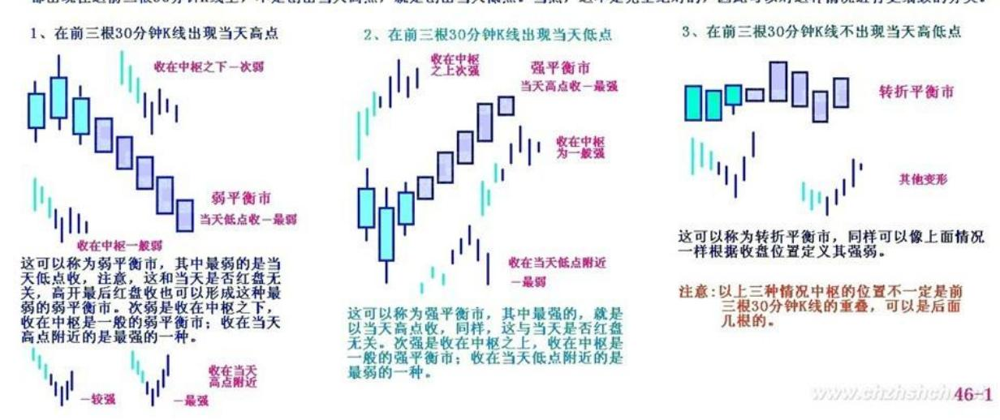
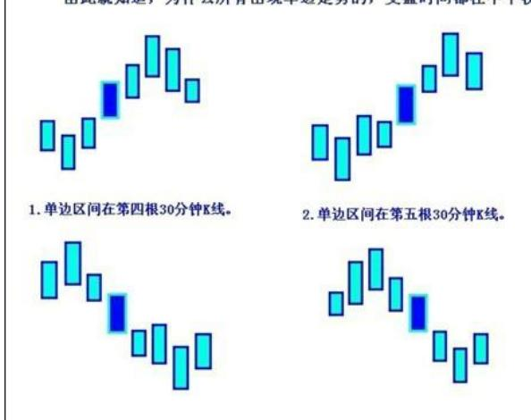
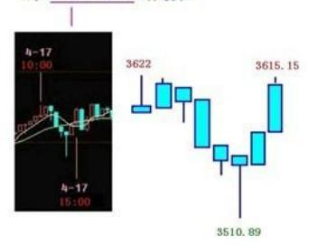
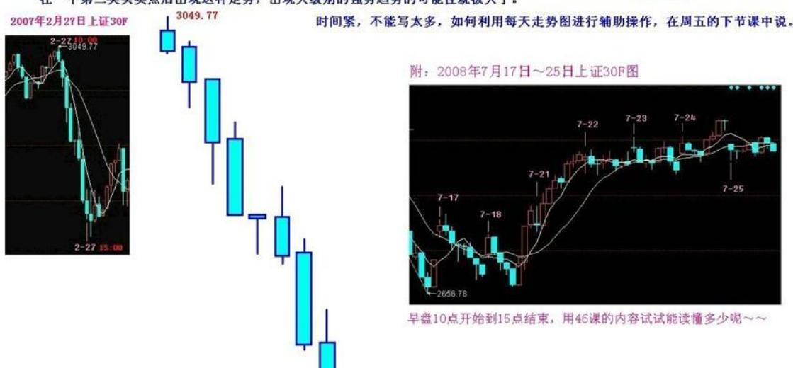
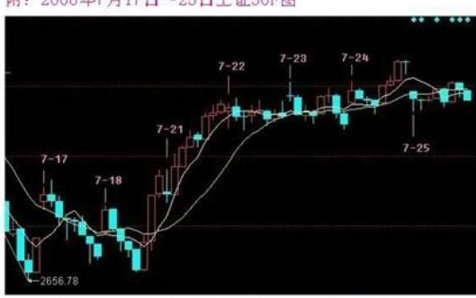
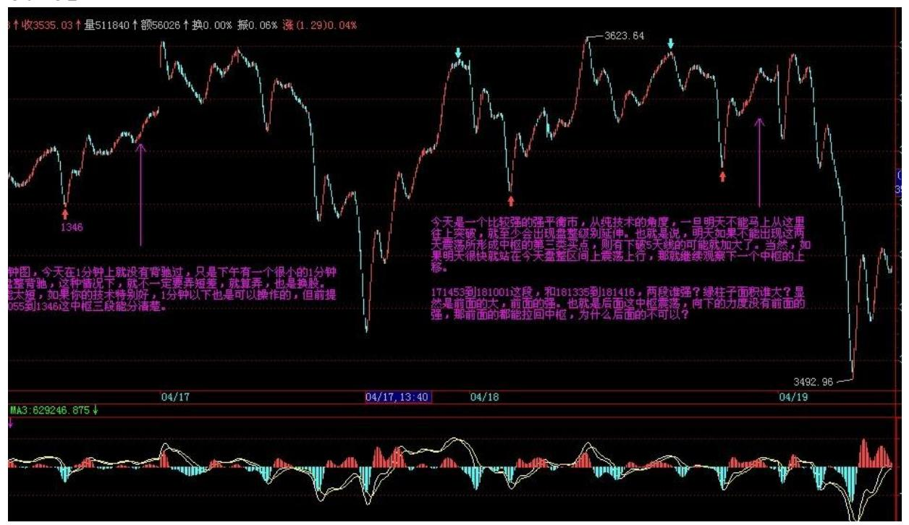
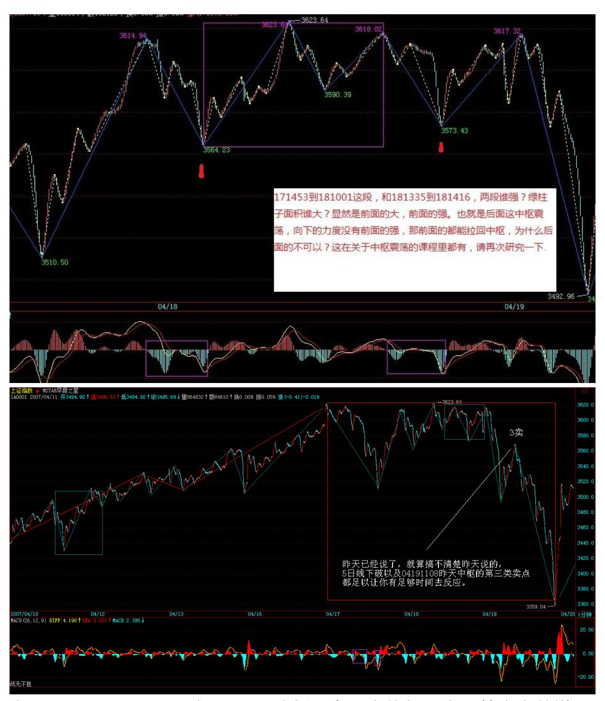
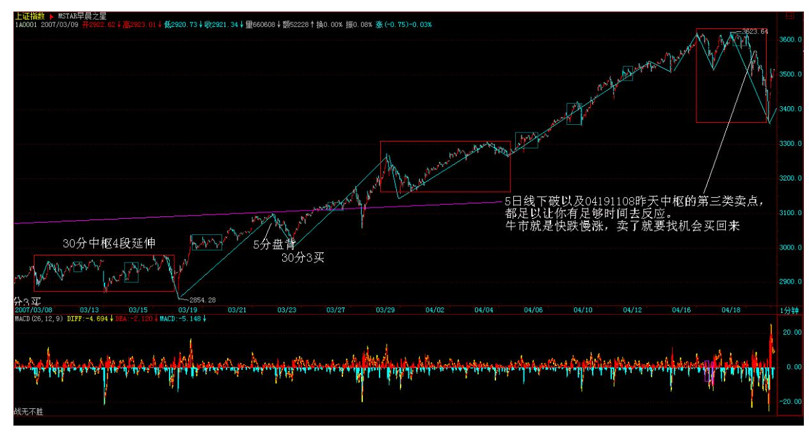
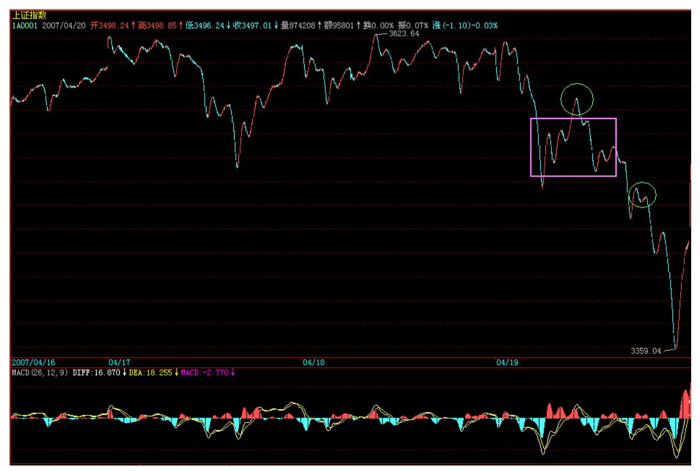

# 教你炒股票 46:每日走势的分类

(2007-04-18 15:36:09)本来要继续写上节所遗留的第一个中枢形成后 走势类型的分类问题,但发现太多人,连每天如何看盘都搞不清楚, 这事情可能更迫切,所以先说一下。

当然,如果是按某级别的严格操作,每天具体怎么走是关系不大的, 走势不会因为交易是按天来的就有什么本质的不同。但针对每天的走 势进行一些分类,至少是一个好的辅助。

一天的交易是 4 小时,等于有 8 个 30 分钟 K 线组成的一个系统。

把 3 个相邻 30 分钟 K 线的重叠部分当成一个每天走势上的一个中 枢,那么,一般来说显然,任何一天的走势,无非只有三类:一、只 有一个中枢;二、两个中枢。三、没有中枢,其力度依次趋强。

一、只有一个中枢这种走势,是典型的平衡市,一般情况下,开盘后 前三根 30 分钟 K线就决定了全天的波动区间,而全天的极限位置, 基本上,至少有一个都出现在这前三根 30 分钟 K 线上,不是创出当 天高点,就是创出当天低点。当然,这不是完全绝对的,因此可以对 这种情况进行更细致的分类。

1、在前三根 30 分钟 K 线出现当天高点这可以称为弱平衡市,其中 最弱的是当天低点收,注意,这和当天是否红盘无关,高开最后红盘 收也可以形成这种最弱的弱平衡市。次弱是收在中枢之下,收在中枢 是一般的弱平衡市;收在当天高点附近的是最强的一种。

- 2、在前三根 30 分钟 K 线出现当天低点这可以称为强平衡市,其中 最强的,就是以当天高点收,同样,这与当天是否红盘无关。次强是 收在中枢之上,收在中枢是一般的强平衡市;收在当天低点附近的是 最弱的一种。
- 3、在前三根 30 分钟 K 线不出现当天高低点48 这可以称为转折平衡 市,同样可以像上面情况一样根据收盘位置定义其强弱。

注意,以上三种情况中枢的位置不一定是前三根 30 分钟 K 线的重 叠,可以是后面几根的。

二、两个中枢显然,这根据两中枢的前后方向可以分为向上、向下两 种,一般地,讨论向上的情况,向下的情况反过来就是。

两个中枢,显然不能有重叠的地方,否则就会转化成上面的情形。因 此,这种形态,最大的特点就是这两个中枢之间有至少有一个 30 分 钟 K 线,其中有部分区间是不属于两个中枢的任何一个,这个区间, 成为单边区间,这是这种走势最重要的特点,是其后走势的关键位 置。注意,具有单边区间的 K 线不从属任何一个中枢。

由于只有 8 根 30 分钟 K 线,根据单边区间所在位置,无非是两种 可能:1、单边区间在第四根 30 分钟 K 线。2、单边区间在第五根30 分钟 K 线。由此就知道,为什么所有出现单边走势的,变盘时间都在 中午收盘的前后 30 分钟之内。

当然,第 4 第 5 根 30 分钟 K 线可以同时具有单边区间。如果只有 第 4 根 K 线具有单边区间的情况,那么第八根 K 线,有可能出现 (娇:反向)穿越单边区间的情况,例如,昨天 200070417 的走势。

显然,对于上涨的情况来说,最强的就是收盘在第二中枢的上方,最 弱的,就是出现第八根 K 线出现穿越(娇:反向)单边区间的情况, 最终收在第一个中枢的之下。然后根据收盘的位置,可以依次定出其 他的强弱。

三、没有中枢这是最强的单边走势,8 根 K 线,没有相临 3 根是有 重叠部分的,一旦出现这种情况,就是典型的强烈走势,一旦出现这 种走势,该日K 线都是具有重要意义的。一般来说,这种走势很不常 见。例如,227那天就是。但别以为出现这种走势就一定会继续趋势, 往往很多骗线

就是故意用这类走势构成,特别是在大的日 K 线中枢中出现这种情 况,更大可能是骗线,例如 227。当然,如果是在一个第三类买卖点 后出现这种走势,出现大级别的强势趋势的可能性就极大了。

49 时间紧,不能写太多,如何利用每天走势图进行辅助操作,在周五 的下节课中说。

#### 二、两个中枢

显然,这根据两中枢的前后方向可以分为向上、向下两种,一般地,讨论向上的情况,向下的情况反过来就是。

两个中枢,显然不能有重叠的地方,否则就会转化成上面的情形。因此,这种形态,最大的特点就是这两个中枢之间有至少有一个30分钟K线,其中有部分区间是不属于两个中枢的任何一个,这个区间,成为单边区间,这是这种走势最重要的特点,是其后走势的关键位置。注意,具有单边区间的K线不从属任何一个中枢。

由于只有8根30分钟K线,根据单边区间所在位置,无非是两种可能: 1、单边区间在第四根30分钟K线。2、单边区间在第五根30分钟K线。由此欲知道,为什么所有出现单边走势的,变盘时间都在中午收盘的前后30分钟之内。

当然,第4第5根30分钟K线可以同时具有单边区间。 如果只有第4根K线具有单边区间的情况,那么第八根K线,有可能出现穿越单边区间的情况,例如, 昨天200070417的走势。

显然,对于上涨的情况来说,最强的就是收盘在第二中枢的上方, 最弱的,就是出现第八根K线出现穿越单边区间的情况,最终收在 第一个中枢的之下。然后根据收盘的位置,可以依次定出其他的强弱。

46-2

缠中说禅教你炒股票46:每日走势的分类

2763.57

蓝色字体为原文引用 --FHSL 20080725

#### 三、没有中枢

这是最强的单边走势,8根K线,没有相临3根是有重叠部分的,一旦出现这种情况,就是典型的强烈走势,一旦出现这种走势,该日K线都是具有重要意义的。一般来说,这种走势很不常见。例如,227那天就是。但别以为出现这种走势就一定会继续趋势往往很多骗线就是故意用这类走势构成,特别是在大的日K线中枢中出现这种情况,更大可能是骗线,例如227。当然,如果是在一个第三类买卖点后出现这种走势,出现大级别的强势趋势的可能性就极大了。

附: 2008年7月17日~25日上证30F图

早盘10点开始到15点结束,用46课的内容试试能读懂多少呢~~

WWW.eirzineinei46-3

\*\*\*\*\*\*\*\*\*\*\*\*\*\*\*\*\*\*\*\*。

# 解盘及互动问答:

#### \*\*\*\*\*\*\*\*\*\*\*\*\*\*\*\*\*\*\*\*。

缠师:今天是一个比较强的强平衡市,从纯技术的角度,一旦明天不 能马上从这里往上突破,就至少会出现盘整级别延伸。也就是说,明 天如果不能出现这两天震荡所形成中枢的第三类买点,则有下破 5 天 线的可能就加大了。当然,如果明天很快就站在今天盘整区间上震荡 上行,那就继续观察下一个中枢的上移。2007-04-18:1553 54 上面 说的是纯短线技术方面的问题,基本面上,该出的消息被推迟,也是 造成今天走势的直接原因,但这东西本周一定出来,但究竟有多大意 义,估计只对基金等有影响,但这轮行情,基金丑态毕现。

今天最好玩的是事情就是那汉奸基金的破事被公开了,当然,这事情 本 ID 早知道,而且本 ID 那 14 只股票里有两只 999、343,那汉奸 都有,所以当时 999打回 14 元下时,本 ID 就说过,不想让汉奸以 及老鼠仓出太高了。本 ID 以前说过,要实验一下阻击基金,探讨一

下把基金给清盘的可能,本 ID 的话不是白说的。文章还在,有兴趣 者可以去复习一下。

今天,本 ID 有点想八卦一下,因为今天 000416 第一个翻出两倍 多,这是元旦后说的三只里的一只,调查一下,有谁能从 3 元拿到现 在?其他,000777 等很快也两倍了,还有人拿着吗?如果都没有,那 么为什么?是不是操作上有些问题需要解决?那 14 只个股,平均涨 幅,从元旦开始,超过 100%了,如果元旦到现在不超过 100%的,必 须彻底反省自己的操作。(2007-04-1815:38:33)

#### \*\*\*\*\*\*\*\*\*\*\*\*\*\*\*\*\*\*\*\*。

1. 网友 mm:对于不能保证每天看盘的人,如何操作才是最好的?缠 师:至少看 30 分钟级别操作。(2007-04-18 16:24:01)

#### \*\*\*\*\*\*\*\*\*\*\*\*\*\*\*\*\*\*\*\*。

2. 网友[匿名] 三藏:老大,深证 5 分钟今天的盘背给解说下,为什 么撑到第三个才跌?我是第二个红柱子出去的。另外,跌完后,什么 时候补仓没看出来。老大务必给说下!2007-04-18 16:23:08缠师:你 应该去看看 1 分钟图就明白了。(2007-04-18 16:27:37)

#### \*\*\*\*\*\*\*\*\*\*\*\*\*\*\*\*\*\*\*\*。

55 缠师:171453 到 181001 这段,和 181335 到 181416,两段谁 强?绿柱子面积谁大?显然是前面的大,前面的强。也就是后面这中 枢震荡,向下的力度没有前面的强,那前面的都能拉回中枢,为什么 后面的不可以?这在关于中枢震荡的课程里都有,请再次研究一下。

(2007-04-18 16:41:09) 56 57 缠师:今天走势很正常,技术上的道 理,昨天已经说了,就算搞不清楚昨天说的,5 日线下破以及 04191108 昨天中枢的第三类卖点,都足以让你有足够时间去反应。牛 市就是快跌慢涨,卖了就要找机会买

回来,否则,牛市与你无关。基本面上,数据最终如何,问题都不 大,就算是加息,也没什么大不了的。

58 今天 1030 到 1330,三 K 线形成 3520 上下的中枢,短线就看这 能否重新上穿,一旦上穿站稳,就继续原来走势。当然,站在本 ID 的角度,完成深圳指数 1万点,上证指数 3500 点的第一目标,是希 望在这里出现一个整固过程,这在前面也说过,这样才会比较稳健。 当然,目前资金流入太快,本 ID 这类稳健的想法,不一定能得到市 场的认可,本 ID 只看市场的反应,市场想干什么都可以。个股方 面,补涨的、故意玩坏业绩的,都会继续表现。

59 60 继续八卦一下,今天这样的走势,可以把人分为几类:一、吓 傻了;二、被夹空在说,我都说要调整的,其实从 3000 点开始就说 了,今天终于可以自渎一下;三、实干型,一看早上开盘没有形成第 三类买点可能,就先走,最迟在 04191108 懂得把有卖点的股票走掉 的,然后等待买点回补的;四、激进型,在大跌中还敢于对有买点的 股票发动进攻的。真正做到只关心买卖点,有卖点就卖,有买点就 买,不会被大盘的波动而影响。请问,你属于哪一种?激进是需要技 术支持的,技术达不到,可以采取相对保守的作法,例如,跌破 5 日 线,除非出现特别明显的较大级别背驰,否则还是持币等待。就算重 新上涨,还有第二、三类买点可以介入。(2007-04-1915:55:43)必须 等待真正的背驰,而且这种走势,从心理上也知道肯定要跌到 2点半 以后。这是一个经验问题。就像跳水经常在 14:45 分一样。大盘不 好,一定要等待大一点级别的买点,或者在尾盘出现的买点。否则不 一定能逃过 T+1 的限制。(2007-04-19

16:00:33)\*\*\*\*\*\*\*\*\*\*\*\*\*\*\*\*\*\*\*\*3. 网友[匿名]A:学习缠妹妹理论, 觉得在大的买点买比较安全(30分钟)在卖点上以 5 分钟的卖点比较 好。如果在大的下跌趋势中如果也按 5 分钟,一分钟买点买难免要受 当日不能卖的局限性,不知缠 MM我说的对与否? 2007-04-19 16:26:45 缠师:对 T+1 的局限是必须考虑的。但一般来说,特别巨大的下跌,

如果真有 5 分钟的背驰,其反弹力度已经足够短线。当然,这是对小 资金来说的。(2007-04-19 21:28:43)

#### \*\*\*\*\*\*\*\*\*\*\*\*\*\*\*\*\*\*\*\*。

4. 网友[匿名]B:缠美眉,今天大盘三十分钟的走势只有一个中枢, 收盘在中枢之下,对照你昨天的课程应该是一个转折平衡市,是意味 下跌转上涨还是从前阵子的上涨转折为下跌的趋势。如果是下跌形成 趋势应该还有一个 30 分钟的下跌中枢吧。这样分析对吗?请指点! 2007-04-19 16:30:56缠师:属于比较弱的平衡市,全天高点在前三就 出现了。(2007-04-1921:30:25)

#### \*\*\*\*\*\*\*\*\*\*\*\*\*\*\*\*\*\*\*\*。

5. 网友[匿名]C:今天上午看 600855 走势很强,就进了,没想到下 午跌破 5 日线了, 请教缠姐是否会继续下调?2007-04-19 20:29:5761 缠师:这问题说过多次,除非是有较大级别的买点,否 则,买股票都应该在下午,特别在走势不明朗的时候。而且这股票, 早上也没有任何买点,所以必须要好好总结。(2007-04-19 21:48:17)

#### \*\*\*\*\*\*\*\*\*\*\*\*\*\*\*\*\*\*\*\*。

6. 网友[匿名]D:我是激进型,上午走了后在下午 13.47 加了隧道股 份,可惜又新低了。2007-04-19 16:00:53缠师:要学会等待真正的背 驰。

#### \*\*\*\*\*\*\*\*\*\*\*\*\*\*\*\*\*\*\*\*。

7. 网友[匿名]E:谢谢,缠妹妹,我当时认为 13.47 是一分钟的背 驰,我判断有误?缠师:还要学习,这种走势,后面是一个标准的小 的第三类卖点。

(2007-04-19 21:55:34)

#### \*\*\*\*\*\*\*\*\*\*\*\*\*\*\*\*\*\*\*\*。

8. 网友[匿名]F:我们上班一族的面对这种情况可怎么办呢?没事的 时候在家,往往关键的一天却在上班。怎么处理这种情况啊?2007- 04-19 21:25:26缠师:如果你是做日线级别的,从去年拿到现在,那

这样的震荡算得了什么?关键是操作的级别,没时间,技术不好,就 操作级别大的。

(2007-04-19 21:58:04)

#### \*\*\*\*\*\*\*\*\*\*\*\*\*\*\*\*\*\*\*\*。

9. 网友[匿名]G:老大,今天早上的下是怎么造成的?没看出来!还 有,下午最后的上为什么那么有力度?没有背啊!2007-04- 1921:55:55缠师:要搞清楚和哪一段比较,如果 1 分钟看不清楚,看 5 分钟的,这种黄白线没回抽的,当然不会是 5 分钟的背驰,但一定 是 5分钟以下级别的背驰,很清楚可以看出该是哪两段比较。

62

#### \*\*\*\*\*\*\*\*\*\*\*\*\*\*\*\*\*\*\*\*。

10. 网友 [匿名] 新年好: 向缠姐问好!缠姐辛苦了!缠姐,今天大 盘在 14:16 的时候为什么直接上去了呢?我在 2 点左右清仓了,本 来还挺高兴看他下跌呢,想等着站稳了补回来的。谁知道 14:16 的 时候就直接上去了,搞得我不得不在 14:40 左右补仓。今天的下跌 跟昨天几乎一样啊,怎么结果这么不一样?这个该如何判断啊?均线 乖离什么的都说不通啊,昨天也一样啊。我尾盘的时候又满仓了,会 不会有短期危险?明天到底会怎么样啊? 2007-04-18 15:41:14缠 师:他为什么不能直接上去?例如 ABC 三段,前面两段都有了,C当 然可以直接一段就上去了。

#### \*\*\*\*\*\*\*\*\*\*\*\*\*\*\*\*\*\*\*\*。

11. 网友 [匿名] 袖手旁观: 缠 mm,多日没来发言,提个疑问:测 度论应该是能解决力度测算,但是背驰必转折这一条不能由测度直接 推导出来吧?缠师:可以利用这个去证明。

#### \*\*\*\*\*\*\*\*\*\*\*\*\*\*\*\*\*\*\*\*。

12. 网友 [匿名] 首钢股份: 本应于 4 月 19 日上午 10 时公布的 GDP 数据,突然被延后至下午 15 时公布,而 15 时正是 A 股的闭市 时间。据了解,首季GDP 数据可能超出此前预期,因此市场猜测这是 为了避免引发更大幅度的上涨;同时市场人士也认为央行可能提早加

息,以及加快推出新措施冷却股市。 女王,我们小散应如何应对?看 图操作,比如今天下午的大幅度回试,根本来不及啊! 2007-04- 1815:42:26缠师:来不及,就不参与,市场渠道当然不是完全公平 的,这没办法。只参与自己能把握的,请记住。

#### \*\*\*\*\*\*\*\*\*\*\*\*\*\*\*\*\*\*\*\*。

13. 网友 [匿名] 可惜了: 入市较迟,拿的是938,可惜涨得不 多,估计938是姐姐股票里涨得最少的。 2007-04-18 15:51:02缠 师:这是最晚说的,2 月初,10 元上下说的,到现在 50%,是有点 少,不过这股票从 100 元下来的,本 ID 只能说那么多了。

63

#### \*\*\*\*\*\*\*\*\*\*\*\*\*\*\*\*\*\*\*\*。

14. 网友 [匿名] 呼呼: 姐姐,不对吧,所有的都涨了 100%了吗? 938 好象没有吧?2007-04-18 15:52:03缠师:没有说都有,有 3、4 只没有吧,本 ID 说的是 14 只的平均。

#### \*\*\*\*\*\*\*\*\*\*\*\*\*\*\*\*\*\*\*\*。

15. 网友 [匿名] 新浪网友: 美女姐姐,000778 还没翻倍,可以等 到那一天吗?2007-04-18 15:58:26缠师:这翻倍了,第一批都是元旦 前说的,如果你买的比较高,问题也不大,涨了那么多,你听过这股 票的消息吗?知道他背后的股东背景吗?

#### \*\*\*\*\*\*\*\*\*\*\*\*\*\*\*\*\*\*\*\*。

16. 网友 [匿名] 新年好: "注意,以上三种情况中枢的位置不一定 是前三根 30 分钟 K 线的重叠,可以是后面几根的。"请问缠姐,今 天大盘应该属于哪种?一个中枢?那么是前三根 K 线的重叠吗?还 有,上个问题看到你的回答了,但是你并没有给我讲讲怎么判断在 14:16 的时候应该回补啊?我还看不出来,如果出现这种情况我们应 该怎么判断啊? 2007-04-18 16:00:32缠师:今天前三根有重叠,就 是了。下个问题,从 04171453 开始看,用中枢震荡的力度比较。你 看是今早的强还是下午的强?

17. 网友 [匿名] 机会在哪: 请问缠主,我现在 50 万入市,短期还 有没有机会赚钱?2007-04-18 15:58:09缠师:这种心态本来就是错 的,先把本 ID 关于股票资金的性质那几节看看,读读其中关于某人 的悲惨故事。

#### \*\*\*\*\*\*\*\*\*\*\*\*\*\*\*\*\*\*\*\*。

64 18. 网友 [匿名] 大鱼小鱼落鱼盘: 美女姐姐,000778 还没翻 倍,可以等到那一天吗? 2007-04-18 15:58:26缠师:这翻倍了,第 一批都是元旦前说的,如果你买的比较高,问题也不大,涨了那么 多,你听过这股票的消息吗?知道他背后的股东背景吗? 2007-04-18

#### \*\*\*\*\*\*\*\*\*\*\*\*\*\*\*\*\*\*\*\*。

19. 网友[匿名] 新浪网友:缠主,现在还可以买 000778 吗? 200704-18 16:06:28缠师:本 ID 只建议在买点买股票。如果错过, 就等下一个,绝对不能养成不在买点买股票的坏习惯。

#### \*\*\*\*\*\*\*\*\*\*\*\*\*\*\*\*\*\*\*\*。

20. 网友 [匿名] 悟禅: 感觉老师,真是用心良苦,太谢谢啦!汇报 一下,自元旦至今,股票帐户(资金没进出过)的收益已超 100%, 自觉离老师的要求尚远,唯有继续努力。2007-04-18 15:54:40缠师: 靠的是你自己,本 ID 只是助缘。

#### \*\*\*\*\*\*\*\*\*\*\*\*\*\*\*\*\*\*\*\*。

21. 网友微微果二: 天啊,我得跳着留级了!元旦到现在我才刚刚解 套赢利!半仓银行股,严重踏错节奏。股票个数分散,也属缠姐说的 小资金的大忌。

缠姐,现在还来得及纠正吗?要不要现在把手头股票逐个清仓,然后 单做一两个股?请缠姐指示纠正方法。2007-04-18 16:07:30缠师:先 学习,有时候等待也是一种修正,那课程学好了,什么时候都有机 会。

22. 网友 [匿名] 缠心雕龙: 博主好。向上的走势 a+A+b+B+c,A、B 是 30f 中枢,如果 c 是一个强劲的 1f 走势,且已经有 c 对 b 不 背驰了(但 B 没有出现严格意义上的三买),此时能认为 B 完成了 吗?2007-04-18 15:44:5665 缠师:完成是一种形态,和幅度无关。 这种情况,很正常,次级别总是从次次级别生长出来的,所以前面的 课程里就提到,次次级别回试构成的是次级别的第三类买卖,比该级 别的要早点,实际操作上,也可以利用这个先操作,这没有任何问 题。

网友 [匿名] 缠心雕龙:后续如有 c 内小级别背驰导致的 30f 级别 转折 C,从同级分解观点看,能否认为 c 上的小级别背驰点就是分解 点,而 a+A+b+B+c 是一完整趋势?缠师:这说过了,就是这样分解 的。

#### \*\*\*\*\*\*\*\*\*\*\*\*\*\*\*\*\*\*\*\*。

23. 网友 [匿名] 窗外: 缠 mm,今天的教程里,中枢就是 8 根 k 线中,第 1 次出现的 3 根重叠,是吗?2007-04-18 16:18:42缠师: 是,但这种只针对每天的走势图。

#### \*\*\*\*\*\*\*\*\*\*\*\*\*\*\*\*\*\*\*\*。

24. 网友 [匿名] longs: 缠 MM,你觉得现在基金没有有越来越被边 缘化的趋势?2007-04-18 15:55:01缠师:三十年河东,三十年河西, 这市场是开放的,只要他们能改过自新,还是好孩子。

#### \*\*\*\*\*\*\*\*\*\*\*\*\*\*\*\*\*\*\*\*。

25. 网友 [匿名] 朗月无花: 对于不能保证每天看盘的人如何操作才 是最好的? 2007-04-18 16:07:44缠师:至少看 30 分钟级别操作。

#### \*\*\*\*\*\*\*\*\*\*\*\*\*\*\*\*\*\*\*\*。

66 26. 网友 [匿名] II: 谢谢缠 MM。又在给我们送钱啊。我要集中 火力。938!2007-04-18 16:09:26缠师:本 ID 从来不让人在非买点 买股票,任何好股票也都需要好买点。

\*\*\*\*\*\*\*\*\*\*\*\*\*\*\*\*\*\*\*\*27. 网友一粒米: 缠 MM 好!问个问题:我们 小散每次有利润后将它变为 0 成本的股票好,还是变成现金再搞第二

个股票?我发现几个月前的股票留下来的话利润自动升值了。且现在 买不到以前的平货了。

但股票多了,管理起来又很烦。你有好建议吗?(我的资金才 3W)。谢 谢!2007-04-18 16:09:22缠师:你可以选好几只节奏有错位的股票, 当成股票池,不断反复操作这些股票。在这些股票中不断根据买卖点 买卖换股,每次只操作一只,最多两只。

#### \*\*\*\*\*\*\*\*\*\*\*\*\*\*\*\*\*\*\*\*。

28. 网友 [匿名] 后知后觉: 禅主,我已经复制了 12 遍了:(1) 禅主说的基金,看到了。另外不知道 QFII 想干什么?或许另有它 图,用香港的金融期货来对冲做空大陆股市?按理说,他们不至于目 前这么弱智吧?2007-04-18 16:22:21缠师:为什么外国人就不可以弱 智?谁都有干错事情的时候。当然,有很多外国进来的弄得很好,只 是不在水面上。

网友 [匿名] 后知后觉:(2)请禅主帮忙:002128,按照我的方法判 断,进了,也有同学跟进,可尾盘下的很凶,估计套了他们 2%了, 我认为那是它短线的极限低点了。在群里我已经公开道歉了,或许看 走眼了。责任重大,请禅主就这支新股给予必要的指导!谢了!缠 师:看 1 分钟图,上面走得很标准。

#### \*\*\*\*\*\*\*\*\*\*\*\*\*\*\*\*\*\*\*\*。

29. 网友 [匿名] 新浪网友: 后知后觉,姐姐终于回答你了,可怜的 人。可能是你平日里太嚣张了,姐姐不喜欢你的缘故吧。2007-04- 1816:38:06缠师:不是这个原因,只是本 ID 有其他问题还没回答 完。问题太多,本 ID 不可能每一个都回答到,抱歉。
