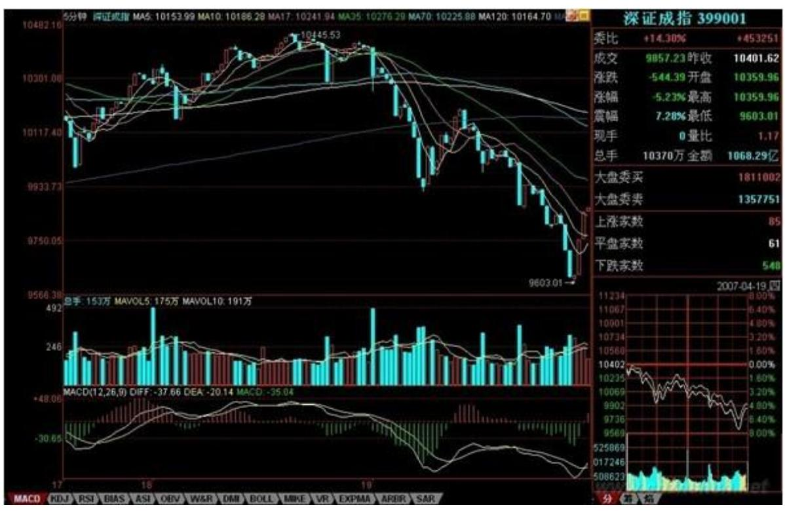
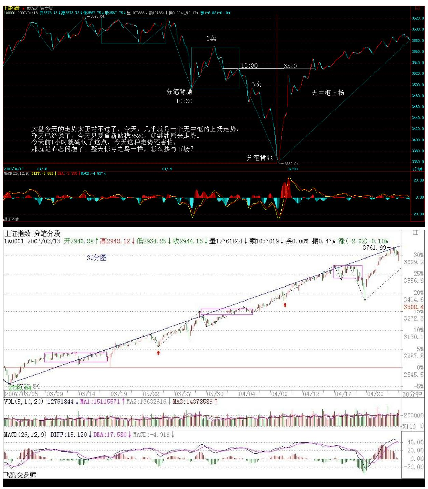
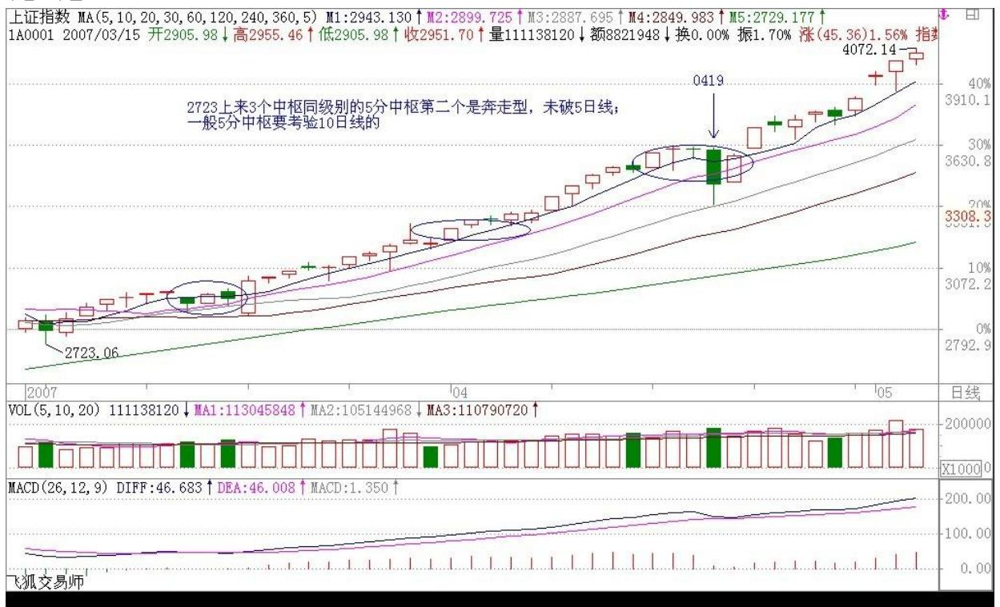
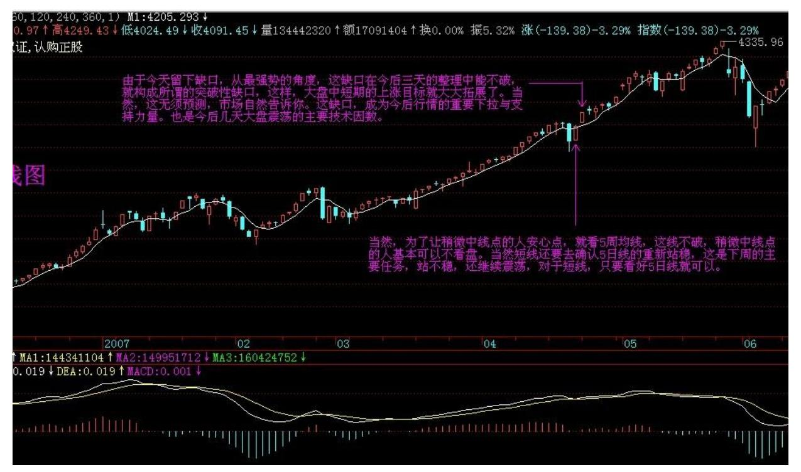

# 教你炒股票 47:一夜情行情分析

(2007-04-20 08:51:58)一个很显然的道理,对市场了解越多,对走势 的把握越精确。例如,昨天 20070419 的 2007 年一夜情行情,跌破 5 日线后有一个反抽,在 11 点 08 刚好构成对前一天中枢的第三类 卖点,这就是最后的、被本 ID 理论所保障的离开机会。那么,后面 去走,就完全与本 ID的理论无关了,在一个下跌里,除了最后那一个 位置,所有的卖出都是对的,但这和本 ID 的理论无关,这类似赌

博,就赌不是最后的位置。当然,赌博也是一种方法,但这种把握, 不在本 ID的讨论范围内。

有人可能要问,就算跌破 5 日线,也可能很快就拉起来,确实,存在 这种可能性,但市场是否选择这种可能性,就是当下的。如果很快拉 起来,那自然会有一个符合本 ID 理论的买点出现,这只要市场自己 去选择,既然已经卖出,就耐心等待。而其中,当然与分析的精确度 有关,有些人分析不到位,会回补早了,那这很正常,技术更熟练 的,当然应该享受更精确的买点。但节奏是重要的,站在小级别操作 的角度,就算你补早了,也比没走傻看着强。补早了,就以后多总结 经验,使自己的技术精度更高。

不过,必须强调的是,上面说的,都是针对资金比较小,操作级别比 较小的说的。如果是按日线级别操作,那这些震荡根本无须理会。如 果真按日线操作的,就应该从 1000 多点一直拿到现在,因为日线级 别的卖点并没有出现,等出现再说。而用周线级别操作的大资金,那 就更无所谓了。此外,这里只是以指数为代表来说一种方法,个股在 自己的图上是一样分析的。

其实,如果你对市场理解更多点,就知道,这一夜情走势的当天低 点,其实是很容易把握的。这就和上节所说的当日走势分类有关。最 后一个第三类卖点对 5 日线进行反抽出现在 11 点 08。前面 3 个30 分钟 K 线,没有重叠。也就是说,下面走势显然不可能出现存在两个 中枢的单边走势,三大类里,第二类是不可能出现了。对于第一类, 平衡市的走势,最好的情况,也只能是当日中枢在 11 点后那个K 线 范围内。至于出现第三类,也是就没中枢的走势,那意味着后面有巨 大跌幅。而第三类卖点后面,至少都会出现一个次级别的跌势,也就 是一个 1 分钟以下级别的向下走势是必须完美的。所以,站在纯理论 推理的角度,可以 100%确定地安排后面可能的回补,也就是,从11 点 08 开始的向下走势至少要出现走势的完美。注意,这些分析,在 1108 后就马上可以给出,并不需要预测或事后编排,都是根据可以根 据本 ID 理论严格分析出来的。

下午开盘后,到 1330 点,就知道,第三类可能不存在了,因为当日 一个连续 3 个 30 分钟 K 线的重合已经出现,也就是当日的中枢出 现了,也就是说,到1330 分钟,市场已经自己给出了选择,市场不可 能出现 227 那天的无中枢下跌,最多就是一个弱的平衡市,因此, 1030 到 1330 这个中枢,就是最值得关注的。用中枢震荡的观点,需

要比较的就是 1030 前的下跌与 1330 点后的下跌。这时候,大盘还 没有真正对该中枢破位,但已经可以 100%肯定地知道一旦68 破位, 需要去看什么来决定买卖点。用 MACD 辅助,显然 1 分钟图并不适合 看,因为 1030 到 1330 分钟前,这个 MACD 已经有绿柱子了,这样 看起来费劲,可以选择更大级别的图,5 分钟的。在 5 分钟图上, 1030 前的下跌刚好构成一个绿柱子面积,而 1030 到 1330刚好出现 回拉,所以黄白线没有明显到 0 轴,但红柱子是有了,所以,用中枢 震荡的看法,后面的下跌,出现的背驰不会是 5 分钟级别的,只能是 5 分钟以下级别的,甚至就是分笔级别(娇:无 1 分图中枢)的最小 背驰,然后引发大幅度回拉该中枢附近。当然,如果是特小级别的背 驰,并不一定有足够力度决定其一定能拉回该中枢,但由于这中枢的 存在,其力度是可预期的。

上面的分析,在大盘 1330 没真正继续破位前,就可以 100%明确地给 出,里面都是纯逻辑的推理,和任何预测无关。假设你已经在 1108的 第三类卖点出去了,而且你又是小级别操作者,那你需要的就是回 补,所以有了如上分析,你就可以耐心等待,看 5 分钟图去比较其力 度了。而且,你应该知道,强力回拉,并不一定需要一个 1 分钟的背 驰,在大幅度下跌后,一个分笔的背驰就足以引发盘中大幅回拉该中 枢,特别,由于 1030 前下跌引发的反抽也是一个分笔的背驰造成, 一般来说,中枢震荡都有对称性,虽然不是绝对,但已经足以让你不 会忽视分笔背驰引发小级别转大级别的极大可能。(分笔背驰,一般 可以用 1 分钟 MACD 柱子的长度来辅助)在大盘进入再次下跌时,你 已经有足够的准备去等待。而且,你可以很明确地知道,在跌破 1030 到 1330 的中枢后,首先会有一个小的

第三类卖点,小的第三类卖点后,有两种演化的可能,一是变成一个 大一点级别的盘整(娇注:新类型和前走势盘背扩展),一个是形成 下跌,至少再有两段向下(娇注:新类型和前走势非盘背向下,同分 3 卖含趋势第一个中枢)。对第一种情况,在这盘整出现后,有足够的 时间去选择介入,所以不用着急。而后面市场的真实选择,现在都很 清楚了,就是第二种,在一个小的第三类卖点后,再出现两波下跌。

对于一个跌破中枢的下跌来说,第三类卖点后再来两波就可以随时完 美。这个完美,由于该下跌是 1 分钟以下级别的,因此从该下跌的细 部,是找不到根据 1 分钟背弛去确认的买点的,只可能根据分笔背 驰。而根据预先知道的中枢震荡看法,唯一需要确认的是,1330 后的 下跌与 1030 前下跌的力度比较。从 5 分钟 MACD 两柱子面积的比较 可以看到,前者并不比后者的力度大,这一点,参考看深圳成指的图 就更明显了(请看下图)。所以,可以断言,这 1330开始的下跌,一 定会有强力回拉。

69 70 实际走势,在该第二波的分笔背驰(看 1 分钟图 1443 的 MACD柱子,该 K 线还是所谓的早晨之星)后,大盘出现大幅度回拉, 这其实是理论 100%保证的事情。注意,并不是下跌的分笔背驰就一定 存在大幅回拉,而是这天的当日平衡市的走势类型的中枢位置与时间

决定的。而且,反抽的最低位置也很清楚,就是这下跌最后一个反弹 处,结果收盘也真的是在该位置,这其实也是理论所保证的。

当然,如果你懂的东西更多点,对该最后位置的确定是可以很精确 的。首先,日线的布林通道中轨和 20 天线都在 3351 点,按一般的 技术分析,这是一个强力支持位置,而实际低点在 3358 点。另外, 在 1 分钟图上的下降通道下轨,也在该位置,几个因数相配合,该位 置出现反抽就完全在把握中了。

后面的走势很简单,关键是那中枢,由于分笔背驰只保证回抽到下跌 最后一个反弹处,收盘已达到,而分笔背驰并不 100%支持对该中枢的 完全回拉,所以理论上,依然完全存在继续跌出一个更大级别的背驰 再回拉的可能,当然,也可以直接上去,这必须由市场来选择。但无 论哪种情况,该中枢都是一个新的中枢形成前的判断关键。而 420 当 天中枢的位置,就决定了今后走势可能的演化。

以上,是一个分析的范本,这些分析,都是可以当下进行的,里面不 涉及任何预测,市场当下的每一步走势,都相应给出分析的选择。对 本 ID 理论熟悉的,其实 1 秒就可以把当下情况分析清楚,然后采取 最正确的操作。但必须强调,这只是为了说明如何去分析,并不是鼓 励所有人都去弄这种超级短线。当然,如果你连这么精确的分析都能 当下完成并指导自己的操作,那么那些大级别的操作,就更没问题 了。如果有 T+0,对于小资金来说,这些就是有绝对实战意义的事 情,当然,在 T+1 的环境下,就算 3358 买的,在第二天,还有出不 掉的风险。而如果是 T+0,那就不存在了,因为对于超级短线来说, 回拉最后反弹位置就可以出来,然后看市场下一步的选择再选择下一 买点。再次强调,这只是为了说明理论,并不说都要按这么小级别去 操作,只不过大级别的分析是一样的,切记。

当然,如果你对当日走势的辅助判断有更深的了解,那么用当日对冲 等方法来降低成本,也是可以做到的,但这只能在下节继续了。有时 间,可以去研究一下与大盘节奏不同个股的走势,感受一下大盘这外 在因数对个股的影响是如何首先必须有个股的内在原因的,例如,大 盘的下跌反而使得某些股票构造出第二、三类买点,而在中枢上移强 力延伸的股票,甚至不搭理大盘。也可以去参考一下,那些随大盘下 跌的股票,是本来就存在卖点,大盘只是加大了卖点后向买点运动的

幅度,但并不会改变卖点与买点的内在逻辑结构,明白了这一点,对 本 ID 理论的理解会更深点。

73 74 大盘今天的走势太正常不过了,今天,几乎就是一个无中枢的 上扬走势,昨天已经说了,今天只要重新站稳 3520 ,就继续原来走 势。

今天前 1 小时就确认了这点,今天这种走势还害怕,那就是心态问题 了。整天惊弓之鸟一样,怎么参与市场?当然,为了让稍微中线点的 人安心点,就看 5 周均线,这线不破,稍微中线点的人基本可以不看 盘。当然短线还要去确认 5 日线的重新站稳,这是下周的主要任务, 站不稳,还继续震荡,对于短线,只要看好 5 日线就可以。

当然,如果技术好点的,可以继续用中枢震荡的方法来看大盘走势。

马上要开会了,就不多说了,请把本文好好研究一下,方法是一样 的。 周末腐败快乐。先下,再见。

\*\*\*\*\*\*\*\*\*\*\*\*\*\*\*\*\*\*\*\*。

解盘及互动问答:

缠师:最近收盘都有事,都早上发帖子,没什么特别的,不用疑神疑 鬼。走势的判断,在周五说得很清楚了,这里没什么补充的。下午收 盘会把评论写上,但回答问题可能要晚上 9 点回来了,抱歉。先下, 再见。(2007-04-23 08:57:32)

#### \*\*\*\*\*\*\*\*\*\*\*\*\*\*\*\*\*\*\*\*。

缠师:大盘今天走得很正常,没有形成任何中枢的单边上涨,周五站 稳 3520 点后就继续原来的上涨走势,所以就创新高,这在技术上 100%没什么可说的。如果这种走势都还有惊弓之鸟的话,那心态绝对 有问题了。对于技术不行的,本 ID 已经给出一个最简单的方法,中 线看 5 周均线,短线看 5 日线,这都操作不好,那就没办法了。

有些人整天换股,这其实没问题,但这需要好的技术支持,如果你经 常换股后,被换的股票大涨而换进来股票的不涨,那就证明你没资格 去换股,乖乖拿着等着,你的技术达不到换股、弄短差的水平。人, 贵有自知之明,市场操作,这点更重要。不是什么活都适合所有人 的,如果你希望能达到更高的水平,就需要更刻苦的学习,在没学好 之前,就采取相对保守的做法,这才是可行的。

由于今天留下缺口,从最强势的角度,这缺口在今后三天的整理中能 不破,就构成所谓的突破性缺口,这样,大盘中短期的上涨目标就大 大拓展了。当然,这无须预测,市场自然告诉你。这缺口,成为今后 行情的重要下拉与支持力量。也是今后几天大盘震荡的主要技术因 数。

75 76 1. 网友【匿名】:MM给调整定的时间是三天?为什么? (200704-23 15:19:01) 缠师:这不是绝对的,是一个大统计概念。一 般有缺口后,三天内回补,不回补,就基本是突破性缺口,如果从技 术上解释,其实也很简单,因为 5 日上三天后一定在缺口上,如果不 有效跌破 5 日线,当然就不会去补缺口,而 5 日线有上推的力量, 自然就会继续走势,直到跌破 5 日线形成较大调整才会有补缺口的机 会,当然,如果走得比较远,就要更大级别的调整才有机会去补缺口 了。

(2007-04-23 21:15:39)

#### \*\*\*\*\*\*\*\*\*\*\*\*\*\*\*\*\*\*\*\*。

2. 网友 [匿名] N8: 缠姐,缠论是不是最后都可以简化为,在级别 的前提下,最后一个中枢与当下走势之间的关系来指导操作? 200704-23 15:48:23缠师:如果你是 30 分钟级别操作的,就看从该 30 分钟中枢离开的那段走势里的中枢变化,具体的,后面都会说到。

#### \*\*\*\*\*\*\*\*\*\*\*\*\*\*\*\*\*\*\*\*。

3. 网友 [匿名] 走失的爱犬: 缠姐,你好象满喜欢足球。国米时隔 18 年,终于在赛场夺冠。今天看天下足球介绍 18 年的历程还满感动 的。你是它的球迷吗?我可是 AC 的铁竿。希望它周三凯旋而归.。

2007-04-23 21:13:36缠师:十分不幸,这点没有共同语言,本 ID 是 英超球迷,准确说,一直都是利物浦的球迷,就是那支曾经 0 比 3 落后于你的 AC 最后反败为胜的利物浦。

#### \*\*\*\*\*\*\*\*\*\*\*\*\*\*\*\*\*\*\*\*。

4. 网友 [匿名] 在路上: 缠姐好!今天对大盘的判断有误,操作没 误。对上一课的问题有如下同学相同的疑问。今天收盘后看了缠姐说 没有中枢。重新看了看,深圳和上海的 30 分钟 K 线实体没有重叠, 但上下影线是有重叠的。是不是只看实体,不用管上下影线?2007- 04-23 21:03:23网友匿名] 钱龙: 缠主好!不是说三根 K 线有重叠 当成一个每天走势上的一个中枢吗?今天 30 分钟图上第 2-4 不是有 重叠吗?今天应该算有一个中枢的走势,不是吗?希望有明白的同学 也帮忙看一下。

2007-04-23 21:33:30缠师:说 5、6、7 有点重合还说得过去,2、 3、4 没有重合,但那重合很小,所以本 ID 说几乎没有中枢的,准确 说,还是有一个范围很小的中枢在 5、6、77 7 三 K 线的重合部分 。

#### \*\*\*\*\*\*\*\*\*\*\*\*\*\*\*\*\*\*\*\*。

5. 网友匿名] 钱龙:这可真糊涂了。K 线 5 和 7 一点都挨不着,不 知怎样才算重合。请缠姐解惑。

缠师:一个最高 3892,一个最低 3688,怎么没重合?严格说,4、 5、6 也可以算是有点重合,但这些几个点的重合,在大的看盘中都可 以忽略不算,一般标准的分时图中枢,怎么都要有 10 来个点的幅 度,所以本 ID 说今天几乎可以算是没中枢的。

#### \*\*\*\*\*\*\*\*\*\*\*\*\*\*\*\*\*\*\*\*。

6. 网友 [匿名] 再问一个: 缠 MM 一再教我们不追高买股票。可在 这样的牛市普涨中,眨眼就涨上去了,不追就踏空呀。能不能教我们 一点点牛市追股的技巧?2007-04-23 21:29:13缠师:第三买点,如果 你技术好,胆子大,就把级别定低点。

#### \*\*\*\*\*\*\*\*\*\*\*\*\*\*\*\*\*\*\*\*。

7. 网友 [匿名] 走失的爱犬: 呵呵。希望今年AC和缠姐的利物浦 再一决雌雄。 2007-04-23 21:42:18缠师:不错,自从贝帅哥离开, 本 ID 看曼联也不顺眼,就怕 AC 没本事,学罗马一样就没劲了。

#### \*\*\*\*\*\*\*\*\*\*\*\*\*\*\*\*\*\*\*\*。

8. 网友 [匿名] 首钢股份: 为什么女王会喜欢英超呢?英超只是场 面好看而已,技术含量和战术含量都不行啊,我是尤文图斯球迷。

2007-04-23缠师:足球,最基础的是血性,技术那些都是后面的东 西,喜欢利物浦,是因为他们是全世界最有血性的球队,当然,原来 有福勒、欧文,也是本 ID 喜欢的原因之一。

78

#### \*\*\*\*\*\*\*\*\*\*\*\*\*\*\*\*\*\*\*\*。

9. 网友 [匿名] 新股手: 很多股都创历史新高了。比如,钢铁板块 中的大多数。对已创新高的老股,如何把握?2007-04-23 21:50:18缠 师:如果你是中线的,就看着 5 周均线,看看那些牛股票,当他们中 线拉升时什么时候跌破过 5 周均线的?一旦跌破,就是一个较大的调 整了。短线的可以看 5 日线。当然,最精确的,还是看中枢、背驰 等,那需要你学习到一定程度才行。

#### \*\*\*\*\*\*\*\*\*\*\*\*\*\*\*\*\*\*\*\*。

10. 网友[匿名] 请缠姐一定看看: 请问:(1)30 分钟图上,如果 一段 5 分钟走势中有三根 K 线有重叠,是否这三根 K 线可以看成是 5 分钟级别走势的一个中枢?(2)这三根 K 线是否必须红绿相间, 如果是三根红线有重叠可不可以算成一个中枢?(3)这三根 K 线重 叠部位是否必须为实体?如果是一根的最高价和另外的最低价处有重 叠,是否可以算? 2007-04-23 21:59:55缠师:5 分钟中枢需要三段 1 分钟级别走势重合。这两节说的是如何看分时,里面的中枢概念和 前面的不同,只是借用一下,别搞混了。

重叠,就是三个区间有共同的部分。就这么简单,哪里有这么复杂的 事情。另外,像今天这种重叠区间很小的,可以忽略不算。当然,严

格算也可以,但意义不大。不过也可以参考,例如今天的 3688 到 3692,就可以当成明天强弱的一个参考,不破就是强,破了站不稳, 就有问题。

#### \*\*\*\*\*\*\*\*\*\*\*\*\*\*\*\*\*\*\*\*。

11. 网友 [匿名] 新浪网友: 盯盘也有几个月了,学得不好。现在一 些疑问请问缠姐。我是以五分钟的级别做为买卖的基础的,但是实际 操作时有一点是无法突破的。就是当五分钟的柱子不再增长时,在 1 分钟上的利润已经减少了很多,所以我一般都是配着看,但问题又出 现了。有时候在 1 分钟上盘整背驰可以不下来而是形成 1 分钟的三 买,所以继续上涨。但有时候 1 分钟的盘背后就直接下来了,而在五 分钟上则是刚突破新高就下来背了,这两种情况怎样操作?常因为这 两种情况无法准确判断而误了战机。谢谢! 2007-04-23 22:03:23缠 师:用 5 分钟不能光看 5 分钟,对 30 分钟怎么都要清楚,另外, 看出对背驰的辅助判断还不大了解,还有小级别变大级别的情况也没 分清楚,请再研究一下这两个问题。

#### \*\*\*\*\*\*\*\*\*\*\*\*\*\*\*\*\*\*\*\*。

79 缠师:今天的新浪太慢,经常好几次才能发出来。看来股市一火, 新浪也要瘫了。各位,心态好点,这市场还长着呢。今天本 ID 吃饭 时还和别人说,现在不算疯狂,想当年,甚至从 900 多到 6000 多, 用了不到一年半时间,现在快两年了,同样从 900 多起步的上海还没 到 4000,简直太理性了。不多说了,子时快到,今天不是周末,要严 格遵守纪律。

"全民炒股",市场经济走向成熟的必由之路(2007-04-23 08:53:46) 最近,随着 A 股开户数、指数、成交量连创新高,"全民炒股"又成 了某些习惯于全天候指责股票市场的人手中不断摆弄的大帽子、大棍 子。那么,究竟何谓"全民炒股"?"全民炒股"意味着什么?真如 某些人所说的就是洪水猛兽吗?首先,必须对所谓的"全民炒股"进 行概念上的界定。如果说"全民炒股"意味着所有人放弃一切工作都 到证券部上班,社会一切正常活动都被买卖股票这唯一的活动所中 断,那么这种所谓的"全民炒股" 不仅以前没出现、目前不存在、而 且以后也不会有。谁用这种含义的"全民炒股"来指责目前的市场, 都不值一驳。如果说"全民炒股" 意味着社会上越来越多人开始把自 己的资产快速转化为股票等虚拟资产,那么,该种含义下的"全民炒

股"恰好代表了市场经济发展的正确方向,是市场经济走向成熟的必 由之路。在市场经济的发育阶段,社会与个人的财富都以实物、货币 等非虚拟资产为计算,而当资本市场逐步成为社会经济结构最重要的 基础部分时,股票等虚拟资产的价值将逐步成为财富最主要组成部 分。在一个资本市场逐步强大的经济体中,无论是社会与个人的财 富,都必然出现一个实物、货币等资产形式被快速转化为股票等虚拟 资产形式的历史过程,从而也就相应形成上述所定义的"全民炒股" 现象。 站在市场发展的历史趋势上看,目前这种"全民炒股"不是过 分了,而是远远不够。目前国内,无论社会还是个人资产,其中的股 票等虚拟资产所占比例,与市场经济发达国家还有着极大的距离,在 股票等虚拟资产占到社会与个人总体资产的 30%之前,"全民炒股" 只能算是初级阶段,必然需要一个大的快速发展,才能满足市场经济 发展的最低要求。目前,国内资本市场逐步出现的"全民炒股"现 象,不仅符合市场经济发展的内在逻辑,而且具有历史必然性与广阔 发展前景。"全民炒股",使得社会上的任何企业与个人,都可以通 过资本市场这公开平台,公平地选择、参与市场经济中最有价值的投 资机会,让社会与个人资源得到最公正合理的配置。而在股票等虚拟 资产占到社会与个人总体资产的50%之前,一切对于"全民炒股"的指 责都是可笑、短视的。

80 显然,"全民炒股"有着各种不同实现形式,不可能都由每一个具 体参与。因此,基金等各类间接投资渠道的大发展,将成为实现"全 民炒股"这历史大趋势的必然选择。由此,各种金融创新、技术创 新、制度创新,才能在一个大的经济新格局中得以更好地实现。资本 市场所带来的财富效应,也将成为人们投资、创业的最大动力。所谓 榜样的力量是无穷的,最近中小板企业上市,平均每 11 天创造一个 亿万富翁,这种速度不是太快,而是太慢了。中国的崛起,中国经济 的崛起,必将导致中国成为资本大国,而日益强大的中国资本市场也 必将制造出越来越多的财富拥有者。美国人比尔·盖茨,巴菲特等之 所以能拥有世界级的个人财富,对于个人来说,可能具有偶然性,但 对于具有强大世界性资本市场的美国来说,这却是必然的。世界性的 资本市场,必然创造世界性的财富拥有者,而中国资本市场成为世界 上最重要资本市场的历史必然性也就意味着,大量的世界级财富拥有 者必将在中国的资本市场不断涌现。显然,中国资本市场制造世界首 富的一天,并不遥远。 站在中国市场经济发展的历史趋势上,目前的 股票热度不是太高,而是远未达到应有水平。市场当然会有中短期调 整,但长期趋势无可改变,任何级别的调整,只会引来更大级别上 涨。有着 100 多年历史,经历过 1929 年、1987 年等大暴跌调整的

美国股市,至今还继续创出历史新高。各国资本市场发展历史表明, 股票市场是长期投资平均回报最高的地方,市场走势无一例外总体向 上,调整都是次要的。高速增长、转型能量巨大的中国经济,其带来 的财富与投资机会,需要通过资本市场让所有国人得以分享。"全民 炒股",不是洪水猛兽,而是利国利民、顺应市场经济发展的大好 事。
