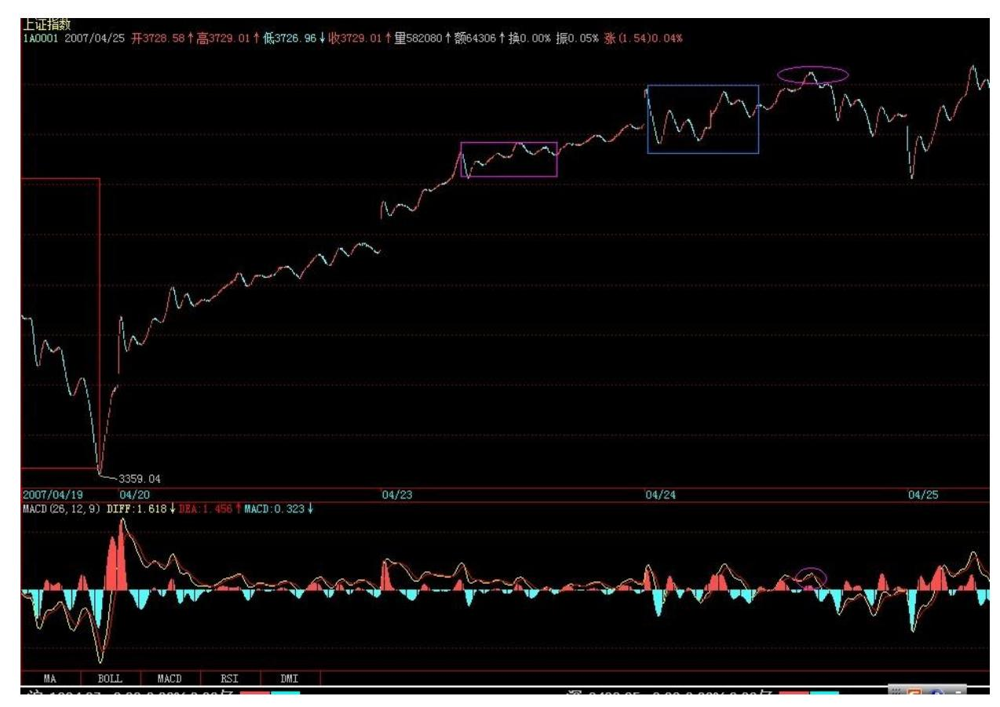
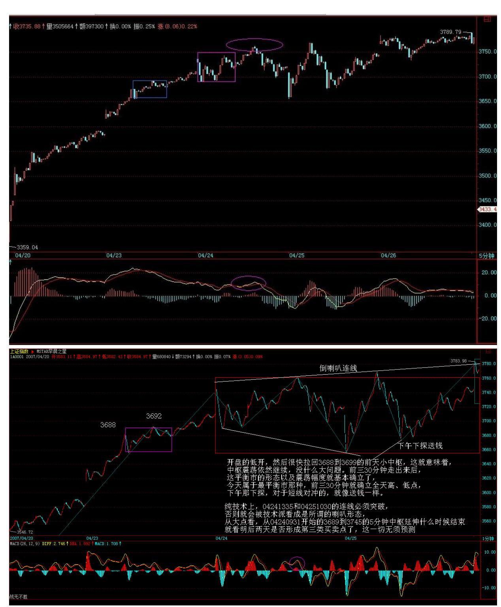

# 教你炒股票 48:暴跌,牛市行情的一夜情

(2007-04-24 08:52:02)前面在每天的行情分析中,曾不客气地说到, 对于空头日夜盼望的暴跌,其实永远与空头无关,因为真跌了,空头 就只会口头上快感一下,心理上满足一下,但人的思维惯性,使得空 头永远没机会在他们满意的地方获得满意的筹码。暴跌,对于牛市行 情来说,就如同一夜情,猛烈而刺激,但实质上,一夜情就是一夜 情,419 后,该干什么还是什么。

就如同性能量的积聚,牛市调整能力的积聚,也需要宣泄。这种宣 泄,与熊市最大的不同,就是 419 化。419,总是猛烈而疯狂,否则 就没必要 419 了。牛市中的调整也一样,来就狂风暴月,这和熊市中 的大反弹是一样的。最出名的熊市大反弹,大概就是停国债期货那 次,三天,指数从 550 不到翻上 920 上,结果,后面依然继续下跌 回来。而牛市中的暴跌,最出名的算是 96 年 12 月那次,由于政策 打击,连续跌停下来,1250 点上几天跌到 850 点附近,结果依然继 续上涨。所有真正的大顶,都是反复冲击出来的,有足够的时间让你 去反应判断,那种 V 型顶,在大型走势中基本不会构成真正的顶部, 就如同一夜情最后天长地久的机会基本为 0。所以,那些天天希望暴 跌的人,就如同天天期望一夜情的人一样,都有着滥交的潜意识倾 向,滥交之人,最终都会给废掉,不会有好结果的。

有一种对风险的错误观点,仿佛股价、市赢率高了才风险大,股价、 市赢率低了就风险小了,却不知道股价、市赢率都是些变动的因数, 并没有任何绝对的意义。本 ID 曾多次强调,风险对于市场是绝对 的,任何时候都在风险之中,如果你对本 ID 的理论能有所理解,那 么,不仅能让风险在操作级别的绝对控制之中,而且还能利用风险达 到降低成本。无风险是可以创造出来的,0 成本就是绝对的无风险。

如果不理解,那么最简单均线系统就可以控制住风险。

但站在社会财富增长的绝对性上,最大的风险就是你的财富增长赶不 上社会平均财富的增长,站在资本市场这个子系统,道理是一样的。

因此,在一个大牛市中,筹码的积累甚至更重要。一个大的上涨,3元 有 1 万股,到 4 元只有 1 千股,后来到了 30,一股没有,这就是 最大的风险,因为市场的上涨并没有为你制造应该的总体利润,你的 筹码丧失了,没有筹码,在市场中就没有赢利的准入证,在没有做空 机制的市场中,做空最后还是为了做多,除非你永远退出市场,特别 在牛市行情依然的情况下,这点更重要了。没有筹码,用嘴是赢利不 了的。

最好的情况,当然就是前面所说的,在成本为 0 前不断降低成本,在 成本为 0 后不断挣筹码,这样股价越上涨,你的筹码越多,你的真正 市值才会越来越大。有人问本 ID,你以后怎么出货,本 ID 反问,为 什么要出货?每一次震荡,都成了本 ID 降低成本、增加筹码的机 会,知道最高的境界是什么吗?就是等大牛市真正结束那天,你拥有 股票的数量最多而成本是 0,然后,(后面删去 419 字)。市场从来 不是慈善场所,要战胜市场,必须有正确的大思路与总体的方法。

82 正确去对待震荡、调整,显然,在大盘中短线能量耗尽后,大盘会 出现大规模的调整,如果说 227、419 都是在日线上一夜情,那么在 周线上、月线上、季线上、甚至年线上出现一夜情的可能性在这长达 至少 20 年以上的大牛市中,都是绝对存在的。但这决不是空头用嘴 欢呼的借口,而是真正操作者减低成本、增加筹码的大好时机。当 然,操作的精确度是一个技术问题,技术高的,就能把成本降更低, 筹码增得更多,这是绝对正常的事情,技术高的就该有更好的收益, 这是天经地义的。但精确度是可以用市场磨练来达到的,而思路、方 法的错误,则是不可救药的,这才是问题的根源。

站在纯技术的角度,把握一夜情的级别很重要。一个日线上的一夜情 与一个年线上的一夜情,显然力度上不一样。在这次从 2005 年中开 始的大牛市行情中,至今为止,本质上,在周线上都没有出现过一夜 情的暴跌,周线上两次大的调整,周跌幅都是 7%,还赶不上 227 的 日一夜情,月线上更是连一次真正有意义的下跌都没有。但为什么这 么多人,天天依然如惊弓之鸟一般?如果你把握不住日线的一夜情, 证明你的技术程度达不到把握日线一夜情的程度,那么就去把握周 线、月线的,那对技术精确的要求要低。给自己安排一些力所能及的 活动,一夜情也是有级别的,能否在各级别的一夜情中游刃有余,是

对你技术把握度的考验。事情往往相通,无论技术还是其他,精度都 是干出来的。今晚,是否也要 419 一把?附录:目前就是前面本 ID 所说,二线拉开空间,三线补上来的走势,但这种走势,必须有一个 转换,使得成分股能重新启动,否则也是震荡难免。目前走势,不要 随意换股,该换的早该换了,否则 T+1节奏一错就会大乱。如果是短 线的,就要注意今天中枢最后的演化方向来决定进出,中线的就无所 谓了,看 5 周均线。 今天很忙,马上有事情要谈,晚上 9 点再上来 回答问题。

\*\*\*\*\*\*\*\*\*\*\*\*\*\*\*\*\*\*\*\*。

解盘及互动问答:

\*\*\*\*\*\*\*\*\*\*\*\*\*\*\*\*\*\*\*\*。

缠师:今天大盘在昨天的一个小中枢 3688 到 3692 受到支持,下午 的 5 分钟盘整顶背驰,应该不难把握。从这就知道,每天之间的当日 走势,还是有一定技术意义的。今天,一个平衡市,收得一般,由于5 日线明天就上来了,所以关键还是 5 日线,站稳就寻机上攻,否则就 要受到昨天缺口的吸引。今天这种平衡市却是巨量的走势,关键就是 要有效向上突破今天的中枢,否则大幅震荡不可避免。今后两天走势 十分关键。睁大眼睛看好明后两天的走势,下面3688 到 3692 小中枢 不能有效被跌破。2007-04-24 15:23:54

84 85 86 板块方面,昨天已经说了,今天需要一个板块的切换,成分 股要重新走起来,这切换还可以,毕竟基金也要面子,51 前也需要一 个好的市值,做人不能打击面太宽了。

但是,大盘最近一点都不疯狂,反而最近汉奸有点疯狂,自编社论到 处流传,还在国外金融报纸上大声漫骂,这种人,该怎么处理,各位 可以讨论。有事,必须先下,晚上 9 点回来回答问题。再见。 (200704-25 15:25:17)

#### \*\*\*\*\*\*\*\*\*\*\*\*\*\*\*\*\*\*\*\*。

1. 网友 [匿名] 股虱:禅 MM,有个问题困扰我很久了:大多股票的 趋势都有 2 个中枢,在第二个中枢后背驰中终结,但如果第二个中枢 后的趋势不背驰,是否还要:1、等待新的中枢生成,同时黄白线靠拢 0 轴,再次比较是否背驰?2、假如趋势是 a+A+b+B+c+C+d,这时候是 比较 d 和 c 还是 d 和 b?或是其他?2007-04-25 19:11:47 缠师: 在该级别不背驰,就面临两种选择:一、形成新中枢(娇:1、3买后 新中枢 2、直接新中枢)。二、小级别转大级别(2007-04- 2521:13:53)

#### \*\*\*\*\*\*\*\*\*\*\*\*\*\*\*\*\*\*\*\*。

2. 网友[匿名]A:老师,一直以来,操作上总是产生这样的心理:明 明判断出来是一个顶背驰,但是又觉得级别不够,结果小级别的顶背 驰演化成大级别的顶背驰,到手的短差做不成。有没有什么强制性的 法子让自己坚决的走掉吗?2007-04-25 21:19:14 缠师:这很简单, 例如你是 30 分钟级别操作的,一个 5 分钟级别的背驰是在你操作的 忍受范围内的,5 分钟背驰,正常情况下只引发对 5 分钟走势类型的 修正,一旦该修正的第一中枢级别大于 5 分钟,那就要先出来。因为 这里至少要形成 30 分钟的盘整,这也是为什么需要第二类卖点的原 因。精细点的以后会说到。(2007-04-25 21:26:32)

#### \*\*\*\*\*\*\*\*\*\*\*\*\*\*\*\*\*\*\*\*。

3. 网友[匿名]B:请问缠主,从大点看,从 04240931 开始的 3689到 3745 的 5 分钟中枢延伸什么时候结束,就看明后两天是否形成第三 类买卖点了,这一切无须预测,大盘自然告诉你。我个人认为:从 04240931 开始的 3689 到 3745 的 5 分钟中枢应该是 0931-1025 吧。不知我判断正确否?2007-04-25 21:57:2687 网友[匿名]B:那不 只是一段吗?怎么成了中枢了呢? 缠师:那是第一段,但这第一段完 全包括在后面第三段里,所以三段的区间就是一段的区间,本 ID 说 的是该中枢的区间。(2007-04-2522:04:12)

4. 网友 [匿名] 蚕丝: 老大早上好!一看我的 ID 就知道我的来头 啦。哈哈。我不怀疑这一整套理论的客观有效性,更羡慕你表达观点 时的这份坦率,直白。但是说实话,真是蛮难理解运用好的。总之, 到目前为止,我感觉还是朋友给的消息更管用些。景仰仍然是滔滔江 水。来深圳出差的时候,给个机会,容我请你去华侨城吃一家精致的 小餐馆吧。轻轻松松聊聊天。我的电话:13828784409 。我这可不是 葛优说行的号码哟。呵呵。2007-04-24 08:54:14缠师:请不要在网上 留电话,不排除有人会冒充本 ID 的。请注意。

#### \*\*\*\*\*\*\*\*\*\*\*\*\*\*\*\*\*\*\*\*。

5. 网友[匿名] 技术学习 ing: " 睁大眼睛看好明后两天的走势, 下面 3688 到 3692 小中枢不能有效被跌破。"请教 LZ,怎么才算有 效跌破?连续 3 个 5分钟线收在 3688 下方? 2007-04-2421:09:32 缠师:第一类卖点的最主动,第二也不错,第三就差点。如果整天都 是第三类卖点出现了再跑,那比较累。要尽量在第一、二跑。当然, 级别越低,操作难度越大,需要的技术精确度越高,这需要实践来提 高。

#### \*\*\*\*\*\*\*\*\*\*\*\*\*\*\*\*\*\*\*\*。

6. 网友[匿名] 白玉兰: 妹妹好!下一阶段是否该关注二线指标股 了?三线股要息菜了。 2007-04-24 21:14:21 缠师:这转化还不一定 能转过来,但关于杭萧那事的深入调整,题材股会有所收敛。本 ID从 来都反对把题材搞得太过分,这绝对需要打击。后面,个股的行情会 进一步分化。说直白一点,后面肯定更多看里面各自的主力了,行情 节奏逐步走向群庄乱舞。

88

#### \*\*\*\*\*\*\*\*\*\*\*\*\*\*\*\*\*\*\*\*。

7. 网友 [匿名]:上课啦我举手。今天收市后到现在,到处都在说明 天人民日报发社论。晕倒。博主在北京,人熟,消息灵。有没有什么 政策面的东东? 2007-04-24 21:18:02缠师:如果现在还用这种手 段,那是管理层的悲哀。

#### \*\*\*\*\*\*\*\*\*\*\*\*\*\*\*\*\*\*\*\*。

8. 网友 [匿名] 新浪网友: 银行股近期持续低迷,禅师怎么看。 2007-04-24 21:21:46 缠师:那很正常,如果他们都高涨了,大家就 很快没饭吃了。

#### \*\*\*\*\*\*\*\*\*\*\*\*\*\*\*\*\*\*\*\*。

9. 网友 [匿名] 缠心雕龙:课原文:"你可以很明确地知道,在跌破 1030 到 1330 的中枢后,首先会有一个小的第三类卖点,小的第三类 卖点后,有两种演化的可能。一个是形成下跌,至少再有两段向下。

对于一个跌破中枢的下跌来说,第三类卖点后再来两波就可以随时完 美。这个完美,由于该下跌是 1分钟以下级别的,因此从该下跌的细 部,是找不到根据 1 分钟背弛去确认的买点的,只可能根据分笔背 驰。" 1、 在跌破 1030 到 1330 的中枢后的一个小的第三类卖点是 不是在1408? 2、 为何说"对于一个跌破中枢的下跌来说,第三类卖 点后再来两波就可以随时完美"? 3、 "这个完美,由于该下跌是 1 分钟以下级别的" ,这里说的"该下跌"是从哪算起?是 1f 级别的 吗?4、 1330 开始的下跌是 1f 级别的吗?他似乎并不是一个趋势, 也没有 1f 背驰?2007-04-24 21:22:10 47缠师:对于趋势,有两个 中枢后就可以随时结束,这是最基本的概念。盘中的这种下跌,基本 都不会是 1 分钟级别的,更有可能就是 1分钟以下级别的。而背驰的 级别与趋势的级别不一定一样,这是一个最基本的概念,否则怎么会 有小级别转大级别?

#### \*\*\*\*\*\*\*\*\*\*\*\*\*\*\*\*\*\*\*\*。

89 10. 网友 [匿名] 首钢股份: 等女王!今天突然很紧张,最终把 所有股票卖出,空仓过夜,然而刚刚卖出 600005 随即它就大涨接近 涨停。主要是下边的缺口太大了,最近几天又风传肯定要回补缺口, 而个股面临一个 20%跌幅的大调整,即使我做中线,这样的起伏也要 不得。看图操作,但我的情况女王应该了解,我白天无法看图,更是 电话委托,咱打不起短差也跑不快。不能跟大盘赌明天。 请问:若明 天跟今天一样走势,是否仍不能确定站稳?具体出现什么情况才能认 为后期将排除大盘整的可能?也就是说,什么叫做"有效跌破"和 "有效站稳"? 2007-04-24 21:26:37 缠师:这样操作其实更容易出 错,5 日线都没破,如果中线,5 周线都没破,算得了什么?以后注

意了,如果心情不好,特恐慌,人已经被恐惧所折磨,那就半仓,肯 定不会错,这时候也别说什么技术了,心态先调节好再技术。所以说 人是第一位的,就算你明白了本 ID 的理论,能否应用成功,最终还 是人的修炼。

#### \*\*\*\*\*\*\*\*\*\*\*\*\*\*\*\*\*\*\*\*。

11.网友 [匿名] 小凤: 可否请缠女王推介一只股呢?2007-04- 2421:30:06缠师:股票是需要养大的,天天要新股票的,肯定永远是 小资金,小打小闹。你看本 ID 年 14 只股票里,还有连续涨停的, 为什么不好好养?本 ID 现在不会推荐什么股票,主要是目前大盘的 位置并不是什么值得去买股票的位置,而且本 ID 那 14 只还有不少 中线潜力,但现在买没必要,因为不是好的买点。
