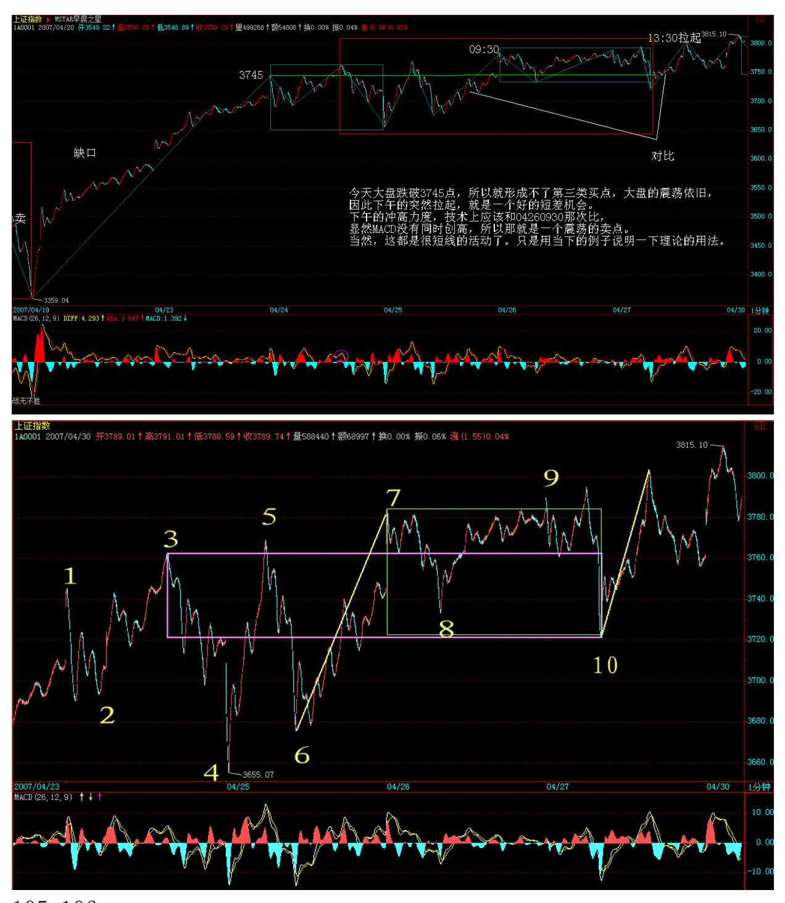
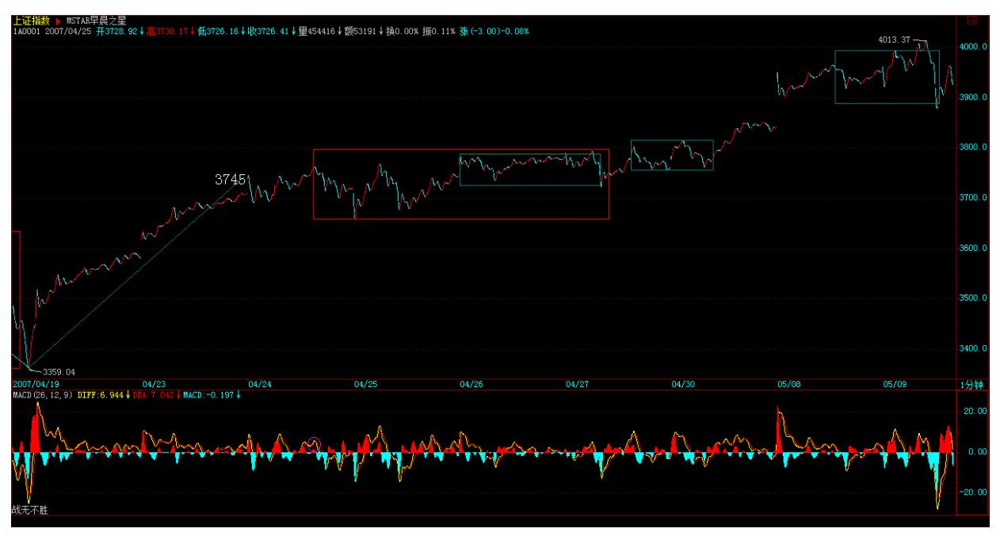

# 教你炒股票 50:操作中的一些细节问题

(2007-04-27 08:42:51)51 前都说股票了,51 后再恢复正常,继续解 〈论语〉还有诸如419、体液之类的东西。今天说点实际的问题,因 为,什么理论,最终都要落实到操作。而操作中一些细节问题,是必 须要搞清楚的。

首先,你无论如何都应该能看到走势图,至于最小只能看到 1 分钟还 是分笔图,甚至连 5 分钟都看不到,这问题都不是太大。其次,只要 是正常的软件,没有不能看 MACD 的,有一个很重要的问题,很多人 搞不清楚,就是怎么选择看几分钟的 MACD。必须明白一个道理,就是 MACD 的计算方法决定了,1 分钟和 30 分钟 MACD 之间并没有实质的 区别,只是计算的周期不同而已,而相应的计算是线性的,只是稍微 灵敏与迟钝的区别,没有太大的区别。问题的关键是,MACD 只是力度 比较的辅助,因此,是先定好比较哪两段走势,然后才去选择看是 1 分钟的还是 30 分钟的更适宜辅助判断(关系到灵敏度),例如,两 段走势,在 1 分钟上形成很复杂的 MACD 柱子和黄白线变化,而在30 分钟上是很明显的两个柱子面积以及标准的黄白线变化,那当然就选 择用 30 分钟看。虽然由于 MACD 与 K 线价格相关,所以一般情况 下,30 分钟级别的走势变化,经常对应在 30 分钟的 MACD 上,但这 不能因此而改变先根据中枢与走势运动的分析,然后选出需要比较力 度的走势段,最后才用 MACD 辅助判断的顺序原则。

以上是些小的技术细节,但更重要的,是一些操作心理上的细节。操 作上,最开始,一定都是患得患失的。为什么一定要把理论搞清楚? 就是先从根子上解开自己的疑惑,知道为什么本 ID 的理论是如几何 般严格精确的,否则,例如你对平面三角形内角之和为 180 度的证明 有疑惑,一定要去丈量每一个平面三角形去证明才舒服,这样,就永

远有心理阴影,是无法去进行正常操作的。理论的探讨,是为了树立 操作的信心,当然,还为了对走势有一个精确的分析去指导操作,但 其心理层面的意义也是极为重要的。这绝对不能迷信,因为相信本 ID 而相信本 ID 的理论,那就是绝对的脑子进水了。而是要从道理、逻 辑等方法彻底搞清楚,这样才能无疑地去操作,而不用瞻前顾后。

对本 ID 理论对走势分析以及操作的绝对性有把握后,以后解决的都 是一个操作精确度的问题。一个正确的理论,应用到实践中,特别是 面对瞬息万变的市场,因为应用的人的经验与心理状态,其结果自然 有很大差异。如何提高操作的精确度,就是一个长期实践的问题。但 无论如何,只有在操作中才能解决这个问题,否则永远都在纸上谈 论,那是毫无意义的。

一个最常见的心理就是,看到是买点或卖点了,但买了还跌、卖了还 涨,所以下次就不敢尝试了。这在操作不熟练的人中,太正常了。因 为,对买卖点的判断,开始时,一定都达不到理论所确立的精确度。

毕竟是人,人总有盲点与惯性。例如对于习惯性多头来说,经常就是 买早卖晚;而习惯性空头,就是买晚卖早。就算对理论在认识上没问 题了,这种习惯性因数也会导致真正的操作与理论所要求的操作时间 有偏差。要改变这种习惯性力量,不可能是一天104 两天的事情。

一般来说,应用理论开始实际操作前,要先看懂所有曾有的走势,能 用理论对已有的走势进行分析,如果这都达不到,那当下去操作一定 乱。这一步基础达到后,可以先不用真正买卖,可以进行一定的模 拟,市场一周 5 天开着,当下去模拟操作,每次的操作都记录下来, 然后不断根据后面的走势来总结,然后发现自己对理论当下理解上的 问题,不断修正。当模拟操作有足够把握后,才开始真正的买卖操 作。如果一开始就真正买卖,由于绝大多数人,在真的钱上都会方寸 大乱,无论操作成功、失败,都会迷失上输赢上,而忽略了操作上的 问题。

所以,首先要把静态的、已有的图形分析清楚,然后在进行动态的、 当下的分析把握,最后才是实际的操作,这样就比较稳妥了。当然, 这过程不是一两天完成的,所以,本 ID 在 12 月下旬开始就说了些 股票,当时是让各位学习时,能安心,买了就扔那里,边赚钱边学 习,本 ID 不需要各位的学费,但各位实际操作的时候,可能会交给 市场一些学费,本 ID 告诉点股票让各位拿着,就是把可能要交给市

场的学费都给各位准备好了,因为,毕竟最后都要靠各位自己,而在 市场上学习,先教点学费,然后不断进步,最后应用自如,都是很正 常的过程。

所以心态要平稳点,不要整天去计算今天少挣多少诸如此类的问题, 说白了,如果你没有一套有效的方法,只要你在市场里,你赚的钱从 本质上就不是你的,只是暂时存在你那里。而要把自己培养成一个赚 钱机器,就如同前锋把自己培养成射门机器一样,方法学了都会,但 神射手却不一定都是,这需要更多的努力。市场的技术,是需要磨练 的。关键是真正掌握技术,只要掌握了,赚钱就成了自然的事情,只 要有足够的时间,就自然产生足够的钱,为什么?因为这已经被本 ID 的理论如几何般严密地保证了。

另外,学本 ID 的理论,并不荒废任何其他的东西,但那些东西都只 能是辅助,甚至,你可以去听消息,去追炒概念,怎么都可以,但必 须不能违反本 ID的理论。为什么?因为本 ID 的理论是这市场真实的 直接反映,违反本 ID 的理论,最终都会被市场教训。如果不相信, 那你就在本 ID 理论的第一买点卖,第一卖点买,来回坚持,如果按 一个较大级别去操作,一般来说,N 次以后你就可以离开市场了。有 了本 ID 的理论,就算去跟风,追炒,都会有章法,都会进退自如。

\*\*\*\*\*\*\*\*\*\*\*\*\*\*\*\*\*\*\*\*。

解盘及互动问答:

\*\*\*\*\*\*\*\*\*\*\*\*\*\*\*\*\*\*\*\*。

缠师:今天大盘跌破 3745 点,所以就形成不了第三类买点,大盘的 震荡依旧,因此下午的突然拉起,就是一个好的短差机会。下午的冲 高力度,技术上应该和 04260930 那次比,显然 MACD 没有同时创 高,所以那就是一个震荡的卖点。当然,这都是很短线的活动了。只 是用当下的例子说明一下理论的用法。

107 缠师:今天的走势,用脚趾都能预测到,但依然无须预测。而实 际出现的走势,却并不像所表现的那么强,因为大盘只是出现一个强 的平衡市,这种留下大的缺口后的放量平衡市,意味着,今后几天, 下面的缺口都是大盘短线一个挥之不去的心病,大盘震荡难以避免。

108 当然,这里讨论的都是很短线的走势,一般地,短线还是继续看5 日线,中线看 5 周线,不破就拿着。而对技术有更高精确度追求的, 就可以关注其后短线上出现的背驰进行操作,而不是去预测大盘是否 真的要去补缺口,还是那句话,不是等跌了再找卖点,涨了再早买 点,那就晚了。大盘中线的走势以及具体的点位意义,综观现在所有 人,都搞不清楚大盘在纯技术上究竟在干什么。本 ID 已经写好一文 章,有些特殊的原因,现在不能发出来,等该发的时候,本 ID 会发 的。

个股没什么可说的,而且具体的个股也要根据自己的走势来决定进 出,很多比大盘要强的个股,就算大盘要补缺口,反而要大幅上扬。

个股操作上一定要注意,技术不好的,即使是短线,也就看 5 日线, 不破,就拿着,不要习惯性乱跑,否则大盘一震荡,左右挨巴掌。另 外,心态一定要好,如果卖早卖错了,也没必要追高去买,等一个短 线买点再介入不迟,大盘震荡中,这种买点不难发现。(2007-05- 0815:28:53)\*\*\*\*\*\*\*\*\*\*\*\*\*\*\*\*\*\*\*\*1. 网友 [匿名] 擎天: 请问大 盘,我这样理解对不对:在三买中,趋势+盘整是最有力度的,而盘整

的级别又大于趋势,因此,在某级别三买点中,一个次次级别的趋势 (最好是跳空缺口)离开,再一个次级别盘整是最有力度的!但如果这样 理解跟三买定理相矛盾,而且在工商银行 12 月 14 日日线三买中, 我们明明看到的也是日线趋势,和日线盘整呀,也没发现盘整级别比 趋势的级别大呀? 2007-04-2716:05:22网友大盘:你的理解是错误 的。首先,博主说过通过趋势+盘整来结束中枢往往表示力度强,但是 这里的趋势和盘整指的都是次级别走势,这与博主说的非同级走势连 接当中的趋势+盘整类型的含义完全不同。

例如一个 30 分钟中枢形成后,一个包含两个以上中枢的 5 分钟上涨 趋势离开,然后以一个只有一个 5 分钟中枢的 5 分钟盘整走势返回 不跌破 30 分钟中枢高点,那就是博主说的通过趋势+盘整来结束或者 破获中枢的情况。

至于你说的次次级别离开然后次次级别返回,如果在上面的例子中, 只能算是 5 分钟的 3 买,当然博主说过,这种情况就得特别留意 了,因为一旦真正的30 分钟 3 买形成,其价格往往已经超过 5 分钟 3 买点了。一句话,级别是逐级扩展而成,自然 3 买也是按照级别逐 级扩展缠师:看图操作,不要先入为主。

#### \*\*\*\*\*\*\*\*\*\*\*\*\*\*\*\*\*\*\*\*。

109 附录:本来,本 ID 早上不想多说的,后来还是八卦一下,让大 家别先入为主,以为有什么大幅低开。想想周五那些跑消息的人,为 什么让他们能回补? 估计 51,汉奸们会到处哭诉,汉奸存在的最大 好处,就是让不坚定的人跑出跑入,为券商贡献,从而让与券商相关 的股票有更大的基本面支持,所以,站在这个角度,汉奸真是功劳大 大的。

今天,999 也翻两倍了,这本来早该完成的任务,就是因为那汉奸基 金的老鼠闹迟了,这些事情就不说了。给各位一句话,就是,花心大 萝卜是需要有技术、有实力的,如果没有,就专一点。如果你想当花 心大萝卜,但收益竟然没有专一的好,那你就没资格当花心大萝卜。

放假了,从今天起,本 ID 也要连续七天将股票抛弃,去有甲骨文的 地方游荡一下,博关几天,7 号回来重新开张。

缠师:各位好,明天又要股票,有很多事情需要处理,先下了。再 见。2007-05-07 12:44:18

#### \*\*\*\*\*\*\*\*\*\*\*\*\*\*\*\*\*\*\*\*。

2. 网友两只老虎: 神仙姐姐呀!999 这个摇头丸不会刚亢奋两天又 要洗洗吧!999,真是让我欢喜让我忧啊! 2007-05-08 15:03:37 缠 师:为什么不打短线,51 前本 ID 其实有提醒过,本 ID 说他翻 2倍 了,你以为本 ID 在炫耀什么?本 ID 的股票,在那些 1 倍、2倍、N 倍的位置都喜欢洗盘,看 777、416,哪个不是这样?如果想快的,为 什么不去买本 ID 说的 VC 股,这里的人应该都知道的,最近也是连 续涨停的。至于 999,现在在等消息明朗,然后停牌,短线的,根本 没必要关注,中线的,当然一点问题都没有。

#### \*\*\*\*\*\*\*\*\*\*\*\*\*\*\*\*\*\*\*\*。

3. 网友 [匿名] 睬猜枚妹: 文章是显眼,也好看。可是也会招怨。 为了我们,还是请妹妹不要太激进了。木秀于林,风必摧之。要学会 保护自己。2007-05-08缠师:谢谢,不过不用担心。如果连批评一部 级官员的勇气和实力都没有,本 ID 这里可以关门了。

#### \*\*\*\*\*\*\*\*\*\*\*\*\*\*\*\*\*\*\*\*。

110 4. 网友 [匿名] 木匠: 禅主好。学了这么长时间的理论。就是 搞不清,老是出问题。 2007-05-08 15:43:38 缠师:你应该先少操 作,因为一条 5 日线就足以让你比很多所谓高手要高了,拿着就可 以。然后用少量资金,进行具体操作,但前提是对理论已经比较把握 了。然后每次操作,是怎么分析怎么想的,一定要复盘,甚至要记录 下来,不明白的地方,一定要问人,而且是具体的问题,这是一个追 求精确度的活动,当然不是那种光耍嘴皮子就能干的。

#### \*\*\*\*\*\*\*\*\*\*\*\*\*\*\*\*\*\*\*\*。

5. 网友两只老虎: 我总是对股票产生了不该有的留恋之情。该被神 仙姐姐骂。999 几次手法都是开盘几乎或拉涨停,然后才调整。我总 是不长记性。VC我只买了 938,手中还有管子、隆平、山大。 2007- 05-08 15:46:15缠师:VC 是 600635,5 块多钱的时候说的,他是中 国最大 VC20%的股东。现在就算了,都涨那么多了,没必要了。

#### \*\*\*\*\*\*\*\*\*\*\*\*\*\*\*\*\*\*\*\*。

6. 网友 [匿名] 过客: 缠姐,我就是想问问,为什么 938 涨得如此 滞后呢,其他的该翻的翻了,该洗的洗了,怎么这支不见动静啊?缠 姐是不是把它给忘记了啊? 2007-05-08 15:47:53缠师:这问题不早 说过了,第一阶段,科技股都不是主角。但对于本ID 这类资金来说, 不可能让本 ID 在第二阶段再去占位置吧。资金量不同,操作当然不 同。

#### \*\*\*\*\*\*\*\*\*\*\*\*\*\*\*\*\*\*\*\*。

7. 网友 [匿名] 大鱼小鱼落鱼盘: 778 是 VC 吗?缠主:偶做中 线,现在还可以买 778 吗?多谢缠主。2007-05-08 15:49:36缠师: 这问题,最近在 10 元的时候也有人问过,本 ID 的回答是,你知道 他的股东背景吗?现在,本 ID 的回答还是这个,但不建议你在这个 位置去买,这股票也快两倍了。

111

#### \*\*\*\*\*\*\*\*\*\*\*\*\*\*\*\*\*\*\*\*。

8. 网友 [匿名] 大鱼小鱼落鱼盘: 938、778 都是缠主后说的,还没 有翻番的股票。等大盘调整的时候再买 778,应该可以吧。 2007-05- 08 15:54:22缠师:778 是第一批那 5 只,都涨了快 200%了,但中线 依然有潜力,但不要追高。其实本 ID 特不想回答这类问题,像 778,5 元就开始的,现在问本 ID买不买,你让本 ID 怎么回答你。 本 ID 又不需要别人抬轿子,唯一还是这样的回答,你知道他的股东 背景吗?

#### \*\*\*\*\*\*\*\*\*\*\*\*\*\*\*\*\*\*\*\*。

9. 网友 [匿名] 袖手旁观: 缠 mm 好。有一个疑问是关于小级别背 驰转大级别走势的。有了小转大以后,又多了很多不确定性。假设日 线级别的背驰已经发生,走势处在背驰后回拉最后一个日中枢的过程 中,回拉段会因为小转大而被破坏、导致尚未回到最后一个日中枢就 出现再转折吗?按照背驰律,这应该不会发生,因为违背大级别的背 驰。不过大级别背驰的回拉段所需时间也相对较长,这期间有可能出 现变化吗?暂不管发生概率,只考虑纯理论可能性。 2007-05- 0815:59:30 缠师:转大以后,就按中枢震荡来操作。另外,周期特别 长的回拉过程,当然有存在理论失效的可能,例如,一个年线级别背 驰的回拉,中途可能就出现改朝换代、交易规则的完全改变等等,这 使得理论成立的前提改变了,所以当然可以产生并不完全回拉的可 能。

但这不是理论的问题,因为理论结论成立的前提是理论的前提能以成 立,所以,唯一需要关系的是,理论成立的前提是否改变,不改变, 就一定回拉。

#### \*\*\*\*\*\*\*\*\*\*\*\*\*\*\*\*\*\*\*。

10. 网友 [匿名] 微: 问一个比较初级的问题,破 5 日线指的是当 天的最低价触 5 日线还是指最高价低于 5 日线? 2007-05- 0816:00:29缠师:破 5 日线这些都是通用的不精确的方法,按通常的 理解,一般是 3 天拉不回来就是真跌破,但一般按这种确认,就离真 正的高点很远了。所以,这不是最终的办法,还是要下苦工夫,把本 ID 的理论啃下来,这才是最彻底精确的办法。

#### \*\*\*\*\*\*\*\*\*\*\*\*\*\*\*\*\*\*\*\*。

11. 网友 [匿名] 职业潜水员: 牛牛缠主,请问科技股什么时候启动 啊?2007-05-08 16:06:44112 缠师:科技股的时代,在牛市的第二阶 段,这在去年就说过了,现在,牛市的第一阶段还在运行之中。

#### \*\*\*\*\*\*\*\*\*\*\*\*\*\*\*\*\*\*\*\*。

12. 网友思朴: 对周行长(周小川)的认识,俺本来只说当证监会主 席是不行的。看你这几篇文章,当行长看来也不行了。不过现在想 想,自己控制着升值的阀门,却仍然保持那么大的美元资产,是有点 糊涂。而升息,简直就是告诉老外的投机资金,来搞我吧。有空交流 一下。2007-05-08 16:11:48缠师:他很喜欢古典音乐,这是本 ID 比 较不能下手的地方。还有,带地址的,新浪认出来都会自动删除,所 以,请进行一些处理,用一些符号替代进行。

#### \*\*\*\*\*\*\*\*\*\*\*\*\*\*\*\*\*\*\*\*。

13. 网友 [匿名] 万年青: 五一长假,用了三天时间看缠 M 的文 章,从最后开始,细细看,未漏缠 M 的一条发言,还有最前面的 5页 未看完。虽然朦朦胧胧不是全懂,但也有所了解,新手上路,请多关

照。请问缠 M000997 今天 5 分钟级别背驰,我走了部分。第一次使 用缠 M 的理论来指导操作,不知是否正确?请缠 M 指导为盼。

2007-05-08 16:17:16缠师:关键你要搞清楚是哪段和哪段比较力度, 由于你没写具体的,本 ID 不知道你是否真懂了。另外,关键不是能 判断准一次两次,而是要逐步形成节奏,卖了有买点再补回来,然后 再在卖点卖,根据自己的操作级别,不断下去,就有了节奏感,这样 才能不断地吸血。后面的路还很长,要有面对很多难点的心理准备。

#### \*\*\*\*\*\*\*\*\*\*\*\*\*\*\*\*\*\*\*\*。

14. 网友果二: 唉,最近操作一片混乱,股票个数越换越多,节奏乱 极了。今天变成 8 只股了,资金才一点点。缠 MM,怎么才能把节奏 换过来?明天把手头的股票都出了,然后重新按节奏找买点,这样可 行吗?缠 MM 能不能说一只能当下操作的股,让我们新进生练习节奏 啊?你老说以前的股票涨高了,所以都不知道当下该对什么股票下手 了? 2007-05-08 16:22:03缠师:这问题在课程里曾多次提过,这某 种程度上是一种大毛病,一定要强迫自己把股票的种类降下来,对于 小资金来说,一定要集中点,一般来说,100万以下的资金,超过 5 只都太多了。

113

#### \*\*\*\*\*\*\*\*\*\*\*\*\*\*\*\*\*\*\*\*。

15. 网友 [匿名] 袖手旁观: "大盘中线的走势以及具体的点位意 义,综观现在所有人,都搞不清楚大盘在纯技术上究竟在干什么。本 ID 已经写好一文章,有些特殊的原因,现在不能发出来,等该发的时 候,本 ID 会发的。"再往前,日线背驰段也要被破坏,这个影响可 大了去了。 2007-05-08 16:23:08缠师:不让这里出现背驰,本来就 是本 ID 的剧本之一。很多看所谓波浪理论的,在 3000 突破后叫嚷 第 5 浪,但为什么现在不可以是 3之 3?

#### \*\*\*\*\*\*\*\*\*\*\*\*\*\*\*\*\*\*\*\*。

16. 网友两只老虎: 神仙姐姐,缠论我学来学去总是糊涂,现在的做 法就是:最初低价买的股票我都舍不得丢,现在基本是用固定一部分 资金来做差价,不断买入卖出。基本上天天满仓,卖了的钱就买手中 已有的但当天调整的股票(都是姐姐的股票)。 2007-05-0816:32:19

缠师:这样也可以,用部分进行练习,但还是要把技术真学好,就算 有多大困难,也一定要学好,这才是真本事。

#### \*\*\*\*\*\*\*\*\*\*\*\*\*\*\*\*\*\*\*\*。

17. 网友匿名] 新浪网友: 姐姐,我想请教一下 000802,他的走势 咋那么难看呢? 我是 17.2 元买的。2007-05-08 16:44:40 缠师:短 线涨 1 倍,又背驰,就要调整,中线来说,你买的位置肯定没问题, 短线就要受点晃荡了。

#### \*\*\*\*\*\*\*\*\*\*\*\*\*\*\*\*\*\*\*\*。

18. 网友两只老虎: 神仙姐姐,您的教材我打印下来看了不下 5遍, 春节期间还手写一遍(呵呵!写的重点内容),可一联系实际完全不 是那回事。都怪我上学的时候就养成不善钻研的恶习。不过,我家人 对我学习缠论做以下评价——这是本人有史以来唯一一次主动性刻苦 学习、努力钻研。 2007-05-08缠师:你要一个难点一个难点的解决, 如果你现在连中枢都分不清楚,那当然怎么学都没用。先把最基础的 彻底搞清楚。

#### \*\*\*\*\*\*\*\*\*\*\*\*\*\*\*\*\*\*\*\*。

114 19. 网友 [匿名] 新学: 博主好!请问博主:如果按 5 分钟级 别的操作,你说的:"在中枢第三类买点后持股直到新中枢出现继续 中枢震荡操作,中途不参与短差。"这里所说的是不是指在形成新的5 分钟中枢必须等待这个级别中枢完成以后才能弄短差,如果没完成就 不进行操作? 2007-05-08 16:06:28 缠师:不用这么机械,具体的课 程里都有。这里再说一次,5 分钟中枢推移中,其前提就是不能出现 5 分钟中枢,否则这移动就结束了。所以,一个 1 分钟走势向下后, 再一个 1 分钟向上,如果出现背驰或不创新高,就意味着一定会形成 5 分钟中枢,所以这时候就可以先出来了。

#### \*\*\*\*\*\*\*\*\*\*\*\*\*\*\*\*\*\*\*\*。

20. 网友 [匿名] 新浪网友: 缠姐好。有盘口语言一课吗?想学的应 该不少。2007-05-08 16:50:33缠师:学东西,一定要先把大框架建立 起来,否则很容易迷失。细节总是烦琐而让人迷失。这些细节的东 西,以后会说到的,但千万别喧宾夺主了。

21. 网友 [匿名] 秋风秋雨: 缠老师,你能回答我的问题吗?因为我 暂时能用的只有这个。谢谢!缠老师,你说的跌-盘-跌背驰在现在 用会不会不合适?我的意思是会不会利润率比你的其他方法低?请指 教。谢谢! 2007-05-08 17:00:06缠师:先确定级别,级别不确定, 一切谈话都无法进行。请先把本 ID理论的总思路搞清楚。
