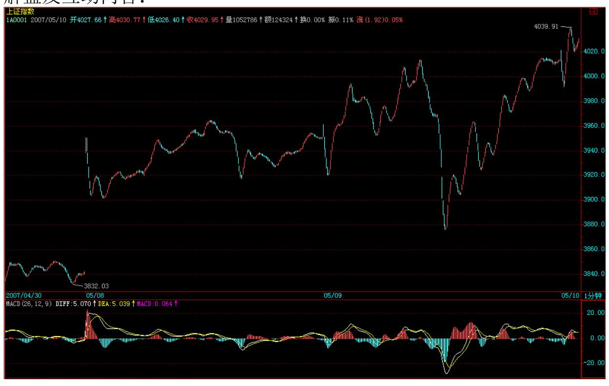
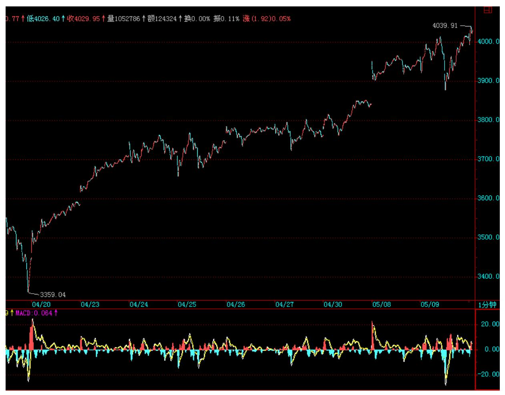
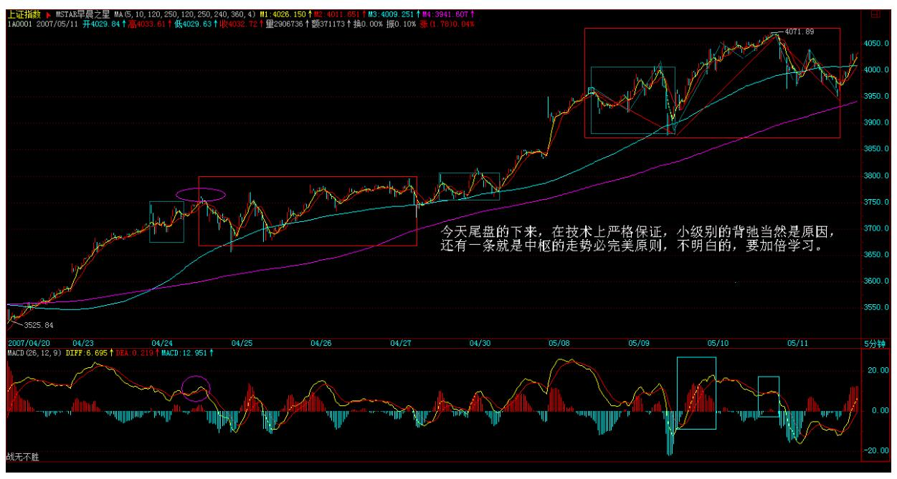
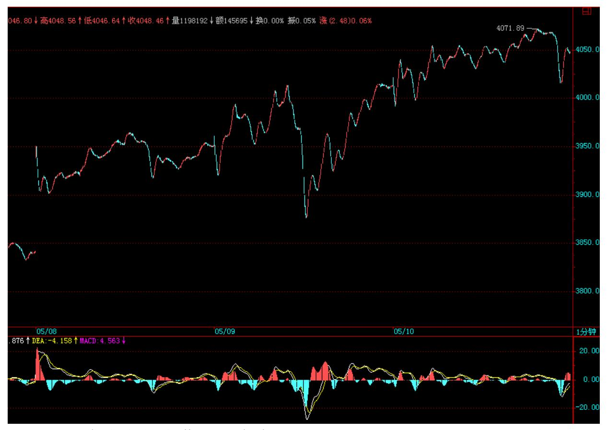
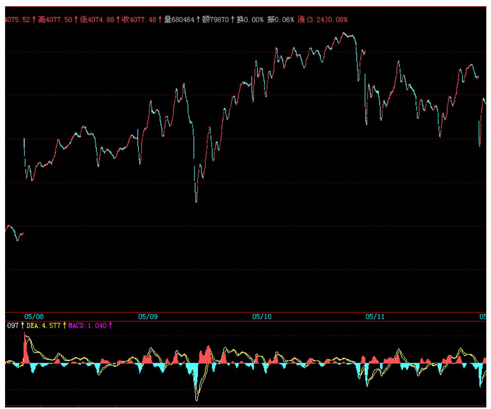
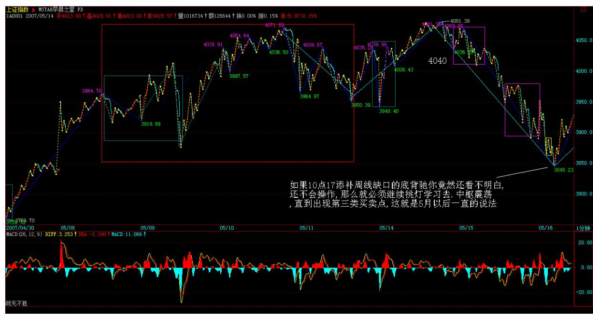
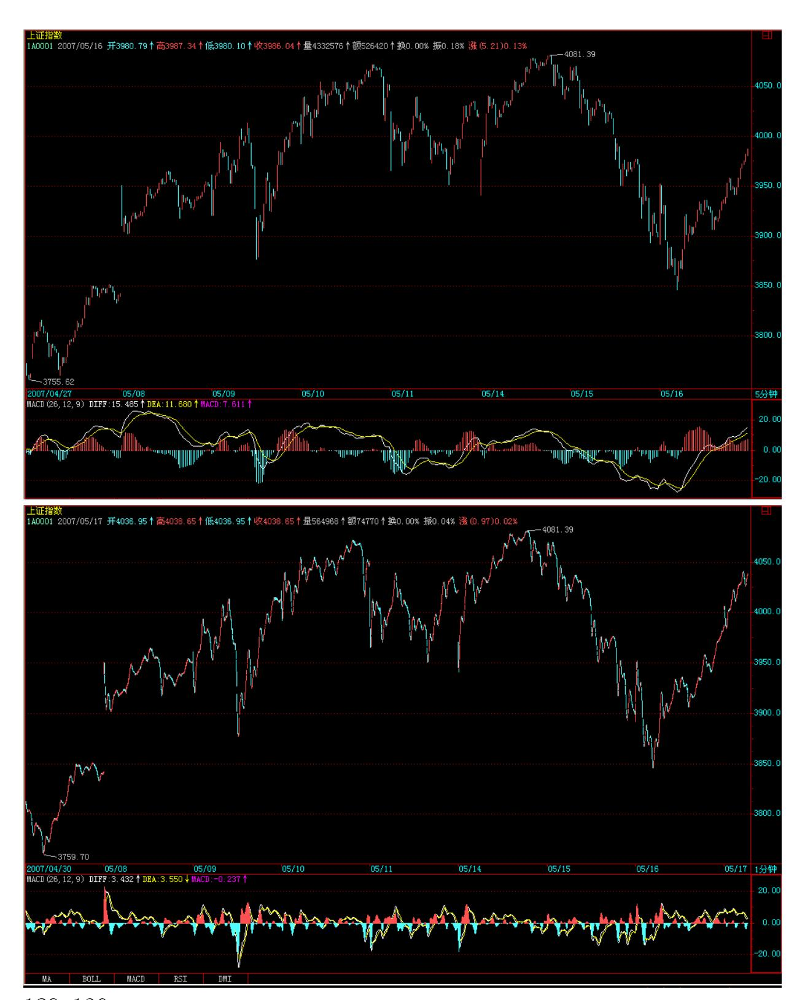
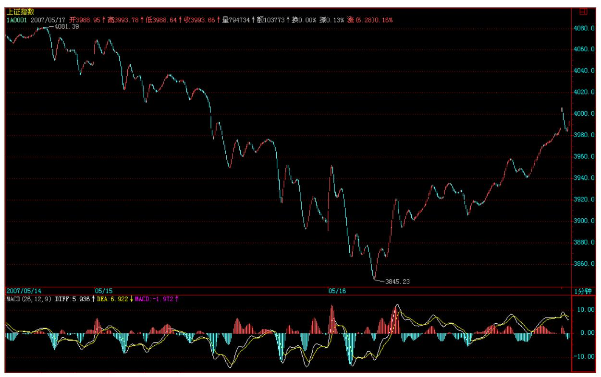
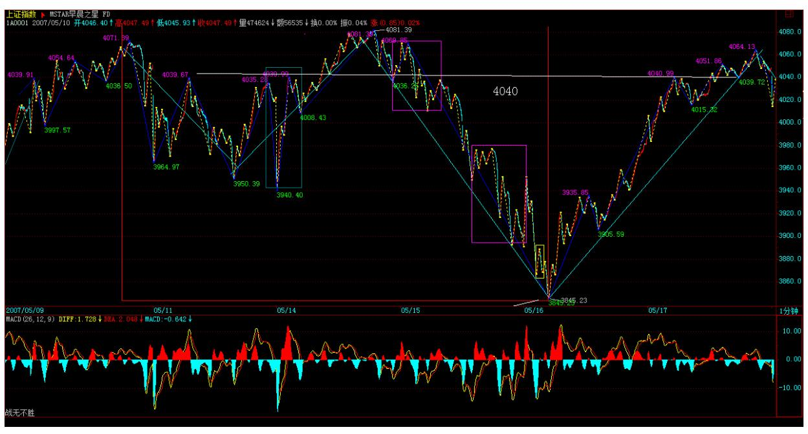

# 教你炒股票 51:短线股评荐股者的传销把戏

(2007-05-09 08:30:16)国人,赌博心理特重,一个六合彩就可以横扫 大半中国,那些偏僻的山村都可以为之痴狂,而这里包含的某种特 点,正是任何群体性运动的基础。股票市场中,那些短线股评荐股 者,如传销般,也就利用这种群体性癫狂来达到目的。

有一种最弱智的,就是为所谓的庄家出货卖嘴的,这种长久不了,一 两次后就没戏,只能改换门庭,由于没有可持续性,所以不值得专门 研究,而且靠找人卖嘴才能出货的庄家,智力水平太低,没资格让本 ID 去谈论。

现在说的是这样一种具有可操作性的把戏,不妨假设有一痴呆儿,在 一每天浏览量超过 10 万的网站或电视上随机地推荐短线的股票,有 5%的人相信并尝试第二天开始半小时内买入,也就是有 5000 人,每 人平均的买入量是 2000 股,也就是有 1000 万的买入量,这个买入 量,对于绝大多数的股票来说,足以使得该股票具有了极大的支持而 呈现大涨。而对于另外的 95%,有些因为高了而拒绝买入,但至少有 一个印象会留下,这股票推荐得真准,在下次荐股游戏中,这就是新 的资源。而有一部分胆子大的,会在更高的价位买入,这样,一个资 金的流动输入就产生了,而买入挣钱的,都爱到处忽悠,所以,相应 人群就会不断增加,直到资金流入与筹码的松动达到平衡。

这样一个系统,可改进成组织更严密的传销:先建核心的第一级会 员,会员,当然都要交会费,得到的回报是可以先买到第一批的货, 在广泛向外推荐前,可以优先得到购买权。而更精细的系统,可以把 会员分为不同的等级,这样,可以让购买流量得到一个更好的控制, 一个逐步扩散的传销效果。这种有精细结构的传销系统,可以支持一 个较长时间的操作,大致就演化成一个庄家行为,只是这庄家是很多 不同等级的人构成的一个有联系的组织,这比一般的庄家有一个好

处,就是不存在一个人挂一大堆虚帐号的监管风险,坏处之一,就是 这样一个结构,其稳定性是有问题的,一有困难,很容易树倒猢狲 散。

对于特别短线,经常换股的传销系统,由于最终必然最大量的人被 套,这样来回几次后,就会使得外围的传销者资源逐步枯竭,最终整 个系统崩溃,所以,那些经常在电视、网站上,每天 N 股的人,一般 来说其流传寿命都不会长,一轮大的调整,就可以消灭一大批。当 然,每轮行情起来,都可以看到类似的人出现,然后消失,如此而 已。而比较长线,有着精细结构的传销系统,就会逐步演化成所谓的 私募基金,这是比上述传销系统更稳定、更能长久的结构,这就是市 场里这类无聊把戏的生命演化进程。

而市场中绝大多数的,都不过是在参加一种无意识的传销游戏,为最 终的炮灰提供足够的人肉人骨。而在基金等层面上,那是另一种游 戏,但其天生的弱点,有着许多可攻击的地方。因此,基金会逐步演 化成对冲基金或更稳定的合伙制结构,这里的赎回或对风险的忍受程 度有着更大回旋余地,因此有着更116 高层次的市场生命。

市场如同大海,这里有各种的生命形态,本 ID 之所以说这些,是要 让各位对市场中各类资金的生存状态有一定的认识,这些生存方式, 都会存在,不会出现某种形式一统天下的状态。有人可能要问本 ID属 于哪种形态,本 ID 哪种形态都不是,如果一定要说,那本 ID 属于 猎鲸者的那种,你必须对所有猎杀对象有着最清楚的认识,才能对此 找到最好的攻击点,然后杀之,而本 ID 只对大海里最大的生物感兴 趣,本 ID 只猎鲸,特别对鲸群有兴趣,一次只杀一鲸的游戏,早玩 腻了。

有人又要问本 ID 不也推荐过股票吗?那只是本 ID 希望各位能专心 学习,除了那十四只,还有一些最大盘的但告诉各位只是用来打架散 户没必要介入的,最后明确说过的,就是 VC 股 600635(5 元多说 的)和北京旅游股 000802(10 元多说的),3 月 19 日加息后 1 个 多月到现在,从来不说具体股票了。为什么?因为这里的人越来越 多,本 ID 再说具体股票,就成了传销或被人利用成传销了,本 ID又 不需要任何人来抬轿子,注意,本 ID 是猎鲸的,而不是那鲸鱼。

当然,本 ID 说过的,都会负责到底,因为本 ID 自己依然在猎鲸 中。但绝对不是说让各位现在才去追高买,其实,对本 ID 猎鲸中的 或不是猎鲸中的,方法是一样的,本 ID 是要把渔的方法告诉各位让 各位自己去找鱼吃,关键是有什么级别的买卖点而不是对象。至于刚 好发现本 ID 也在猎着的有买点,那当然也可以介入,但不是让各位 集体无意识地都聚集在本 ID 的猎鲸对象上,这不又成了变相的基金 了?猎鲸船本来就比鲸鱼大,把本 ID 变成鲸鱼那不太小看本 ID了? 本 ID 做事情从来都不想含糊,加上 600635、000802,总共 16 只, 依然是本 ID 猎鲸船所追杀的物体,当然,实际上,这猎鲸船追杀的 目标还不只这 16 只,具体的结构,当然不能说了,这里汉奸这么 多,记得 2000 多点那美国老头胡诌本 ID 说要把他打到满地找牙夹 死他时说过什么吗?把这 16 只分类一下,最早一批是去年 12 月 底,最后一只是 3 月中旬,现在是 5 月初,按说过以后的涨幅大致 分类一下,这不是为了炫耀,而是让后面来的知道本 ID 猎杀的介入 位置,从中也可以发现一些技巧性的问题。本 ID 介入的位置和说的 位置大致一样,先来的当时买的,基本和本 ID 的成本是一样的,因 为本 ID 的货多,当然成本不可能比各位低。但是,现在可就不一样 了,因为本 ID 的成本不断在下降,这种最厉害的方法,本 ID 在课 程里可是毫无保留地说过的,就不知道有多少人能办到了。

基本 200%及以上:000416、000777、000999、600432、600635、 600578、000099。150%以上:000778、600777、000915 。100%以上: 000600、600649。

50%以上:000802、600343、000938、000998。

117 股票不过是小道,但条条小道通大道,本 ID 在这里费口舌,有 一个目的,是希望这里至少能有人通过学习以及自我磨练,最终能成 为猎鲸者。其次,更重要的,要小道而大道,这才不枉来这里一趟。

至于想把这个变成传销场所或来这里希望找点传销玩意的,那就入错 门了,本 ID 这里不需要这么多人,至于那些希望小道而大道或至少 有志于成为猎鲸者的,如果觉得有更好的地方,也没必要留在本 ID这 里。本 ID 只对面首感兴趣,而且只在 419 时候对面首感兴趣,对徒 子徒孙,从来没兴趣。各位自便吧,本 ID 这里门前草深三尺也无 妨。

#### 解盘及互动问答:

\*\*\*\*\*\*\*\*\*\*\*\*\*\*\*\*\*\*\*\*。

缠师:各位今天爽吗?这样的震荡简直是一个最好玩的游戏,这一 点,昨天已经给予最大的提示了。今天没把缺口完全补上,这问题不 太大,主要是今天看着缺口来的人太多了,个个争着提前量。至于技 术不好的,昨天也说了,看 5 日线,不破就上上下下享受一下,也不 错。2007-05-09 15:25:06118

119 缠师:本 ID 昨天说,今天要继续震荡。但估计到 14 点 45 分 前,所有人都以为本 ID 说错了,以为那些忽悠今天要冲多少多少点 的股评对。结果怎么样,就不用本 ID 说了。震荡,不一定是绿盘狂 跌才是震荡,就像一个中枢,在下面震也是震,上面震难道就不是震 了?今天尾盘的下来,在技术上严格保证,

120 小级别的背弛当然是原因,还有一条就是中枢的走势必完美原 则,不明白的,要加倍学习。2007-05-10 15:36:28121 关于 4000 上 下的震荡形成的中枢,要突破,向上要有第三类买点,否则,依然存 在向下变盘的机会。在第三类买点出现,中枢完结前,震荡继续。用 分时中枢概念看,昨天是一平衡市,今天也是,但今天中枢的位置向 上移了,明天就面临三种选择,强的继续上移,中的围绕今天中枢震 荡,弱的回试昨天中枢,从而让一般概念意义上的中枢形成级别扩 展。根据明天开盘的走势,这一点不难分辨。这些都是很短线的活 动,脑子不够使的,就看 5 日线就可以,本 ID 说过多次,要量力而 为,用自己最精通最有能力控制的方法,花心萝卜不是人人能干的, 要成为花心萝卜,要学很多工夫的。

122 123 大牛市的序幕,还未真正拉开。(2007-05-10 15:56:10) 附 录:本 ID 人在外地,但看盘不一定都在北京的。昨天承诺各位要收 盘解盘,当然要执行。

昨天说的三种当日中枢情况,一开盘就确认是最弱一种,因此,在这 里形成中枢扩张就是理所当然的。知道比空头、汉奸更可恶的是什么 吗?就是不学无术的多头,那些号称破多少冲多少多少的傻瓜。本 ID 前几天已经明确说过,4000 点不是怎么容易站稳的,必须是一个中枢 后一个第三类买点才能确认,没出现之前,就是中枢的形成与震荡。

在本 ID 的理论里,没所谓空头多头,只有见买点买卖点卖,这是必 须知道的。那么为什么本 ID 长线是多头,因为长线没有卖点,这就 是技术上唯一的原因。哪天连季度线上都有卖点,那么,本 ID 是最 狰狞的空头。

后面走势很简单,继续中枢震荡等待市场自己去选择方向。而这种震 荡,就是玩技术的最好场合,多多练习,那才是真工夫。

今天 416 第一个翻 300%了,今年从 2 元多到现在,有多少个股票比 他厉害的,请告诉本 ID。国安永远争第一,让本 ID 也有一个努力的 目标。

在外,事忙,周一收盘再解盘。有一公告在外面,请看。先下,再 见。

124 125 大牛市的序幕,还未真正拉开 (2007-05-10 15:56:10)股市 走势看似复杂,其实有规律可言。这轮已延续两年的上涨行情,在技 术上其实十分简单,为了能清楚说明,必须先揭示一个上证指数的历 史走势规律。为了简单起见,只以月线为例子。

1992 年 5 月,上证指数创出 1429 点的第一个历史高点,其后的历 史高点,都与该点位及时间有着密切关系。

1993 年 2 月,上证指数 1558 点的历史性大顶,恰好触及 1429 点 开始,每年上涨 180 点,每月上涨 15 点的压力线,当月该线在 1429+15X9=1564 点。

2001 年 6 月,上证指数 2245 点的历史性大顶,恰好触及 1429 点 开始,每年上涨 90 点,每月上涨 7.5 点的压力线,当月该线在 1429+109X7.5=2246.5 点,以上两个历史大顶都是上证指数历史上最 重要的顶部点位,都与 1429 点开始的按某速率上涨的压力线高度相 关,这显然不能以巧合来敷衍解释。

有人可能要问,相应速率是否随便设置?答案是否定的。

任何人都知道,圆周是 360 度,这构成分析的基础。以每天上涨 360 点为基准,相关压力线速率以其 1/4、1/2、3/4 等比例构成。显然, 在上述两例子中,压力线速率分别由 1/2 和 1/4 构成。

由此不难理解,从 2007 年 1 月开始的 3000 点下盘整,不过是突破 1/4 线后的强势回调整理,3 月,该线在 1429+178X7.5=2764 点。经 过 1-3 月的调整,在3 月初确认对该线突破的有效,而所谓的 227大 暴跌,不过构成对该线的最后一次回抽确认,其后出现的大幅上涨, 在技术上理所当然,不过是 1/4 线突破确认后,展开对 1/2 线顺理 成章的攻击。只是不学无术的空头,对此茫然不知,演出了一场企图 在 2700 点放空的闹剧。

5 月,1/2 线在 1429+180X15=4129 点,该点位在技术上有强烈意 义。从时间上看,1429 点开始有着同样重要的历史规律。1558 点与 1429 点相差 9 个月,2245 点与 1429 点相差 9 年,而今天 5 月, 是 1429 点以来的 180 个月,360 的一半,一个极为重要的时间之 窗,其后,不发生点事情,显然是不可能的。

从纯技术的意义上,1/2 线能否有效突破,是考验本轮大牛市的真正 试金石,不能有效突破该线,将使得受制于十几年来 1/2 压力线的运 行模式依然延续。

126 反过来说,到目前为止,这两年股市的上涨极端温和,是旧有的 股市运行内在速率引导下的恢复性上涨,没什么可大惊小怪的。从某

种意义上说,只有真正有效突破 1/2 线,一轮脱胎换骨的大牛市,才 真正拉开序幕,否则,不过是以前节奏、速度与模式的重复而已。

因此,能否有效突破该线,构成对多头的真正考验,而空头,必然以 此为屏障展开反攻。

围绕该线的争夺,将构成两年以来第一次真正有分量的多空对决,一 场决定行情新旧模式的大对决。

相应走势,只有三种可能的演化:一、在该线前止步或在该线上形成 多头陷阱进而形成一个大级别顶部;二、突破该线并围绕该线进行强 势的、如 1-3 月在突破 1/4 线后进行的类似盘整,然后寻机突破。

三、强力突破并远离该线后,以一个强势的回调来确认对该线的突 破,然后再展开对 3/4 线的攻击,目前该线的位置在 1429+270X15=5479 点。

无论市场采取哪种选择,对该线的突破、回试、确认等,都至少需要3 个月的时间,因此至少在 7 月之前,该线将主导着大盘的走势。至于 大盘究竟采取哪种选择,无须预测。

一切市场走势都是市场所有参与者合力的结果,并没有上帝事先确 定。而市场的选择,当下地在走势中呈现,只要对市场日线以下级别 的走势规律有足够认识,不难从中提前发现。

无论市场最终如何选择,都不过构成超级大牛市的一个小片段。

该 1/2 线是新旧两种模式的分水岭,一旦有效突破这每年上涨 180 点、一直控制大盘十几年的压力线,就能把该线有效转化成其后行情 发展最坚实的底部支持。

突破是迟早的事,而基础打得越扎实,对行情发展越有利。

127 128 中枢震荡的操作要领在课程里都有,不会的学,不熟练的继 续练习。

在本 ID 这里,首先要打破的一个概念,就是走势是被上帝决定的垃 圾概念。走势,从来都是市场各方力量综合的结果,管理层也不一定能 随时决定走势,而所有的走势,最终都是技术性的,都被本 ID 的理论 所包含着。不明白,不深切地体会这一点,那么,就要继续学习。再次 提醒,那围绕 1/2 线的大的中枢震荡,其形式依然形成中,没有上 帝,包括你在内的任何一个参与者都在创造着历史。

本 ID 这里不需要太多人,来这里的,就应该有志成为猎鲸者。就像本 ID 学作曲时老师说的,他只是一个训练者,真正的曲子只能自己写出 来。本 ID 在这里也只是一个训练者,引导者,真正月亮靠自己去发 现。八卦问一句,谁还和本 ID 一样继续抽那汉奸上实医药的血?

131 132 受传销蛊惑的,绞肉机最好的货!(2007-05-17 15:27:16)回 到北京,还是不错的。今天还有不错的,就是看到还有人一直拥有 600607,13 元上下到现在,1 个来月,其实没什么厉害的,最厉害 的,这是汉奸的船,本 ID 比较高兴的,是能让这里的人能一起乘乘 汉奸船、抽抽汉奸血,这种感觉和那 16 只股票是不一样的。

关于大盘,给那些不学无术的多头空头上上课。今天最重要的位置, 还是前几天说的 4040 点,早上受压制,下午受支持,都是这个位 置,那么这个位置就是决定中枢震荡是否能级别扩展的关键位置,站 稳,就会形成中枢震荡的级别扩展,否则还在这级别的中枢里进行延 伸。

关于中枢延伸与扩展的定义,在课程里都有,自己学去。

133 134 本 ID 反复强调,关于 1/2 线最终的震荡级别与形式,都是 形成中的,而现在,只是其中的一部分,这就是种子,不断延伸、扩 展下去,而大盘,永远都只是本 ID 理论的注释。实际的操作,特别 对于散户的操作,你只要知道这个大概的框架,根据短线的背弛进 出,这个就能创造出比单边更厉害的利润。当然,这需要技术,技术 是靠磨练的。

今天为什么用这个题目?因为刚进来时发现一个传销广告,是这门户 和某某联合推荐股票如何厉害如何收费之类的。好好去看看本 ID 前 面关于这个问题的文章,本 ID 早知道这种垃圾活动会不断出现,绞 肉机的货将足够新鲜。

记住:任何向你收费的,或部分收费的,都是垃圾。只要市场的垃圾 才需要参与这种收费的垃圾活动。

市场里有金山银山,有本事有技术就去拿,否则,市场迟早让这些垃 圾吐出来!对不起,刚回来,很多腐败活动要补课,这两天各位就让 本 ID 去补习一下腐败。今晚有三拨活动,最早的 4 点开始。先下, 再见。请原谅。

\*\*\*\*\*\*\*\*\*\*\*\*\*\*\*\*\*\*\*\*1. 网友匿名] 球球: 缠缠好!买了些科技 股,你怎么看? 2007-05-09 15:27:10缠师:科技股,没问题。但真 正的牛,要在第二阶段。当然,本阶段也会表现的,特别如果也是成 分股的。但科技股不是现在市场的重心。

#### \*\*\*\*\*\*\*\*\*\*\*\*\*\*\*\*\*\*\*\*。

2. 网友 [匿名] 水房姑娘: 缠 M,VC 股今天为什么放那么大的量 啊? 2007-05-09 15:31:34缠师:其实这个问题,本 ID 昨天已经很 八卦地说过了,本 ID 的股票,在翻 1、2、N 等倍后,都会有洗盘。 今天该股刚好翻两倍了,本ID 出手洗一下也没什么不可以的吧。注 意,无论谁的股票,一定要坚持买点买、卖点卖,除此之外,没什么 值得关注的。

#### \*\*\*\*\*\*\*\*\*\*\*\*\*\*\*\*\*\*\*\*。

135 3. 网友 [匿名] 恒灵: 报告缠主:我拿了联通将近一个月,昨 天刚割肉跑了,谁知今天就涨停了,命真苦呀。 2007-05-0915:37:43 缠师:要好好补习如何用 MACD 黄白线第一次上 0 轴,然后横在 0轴 上形成第二类买点的判断,这在课程里都有。

#### \*\*\*\*\*\*\*\*\*\*\*\*\*\*\*\*\*\*\*\*。

4. 网友两只老虎: 神仙姐姐太可爱了。可惜我总是悟性太差,不能 理解姐姐的暗示。今天几乎是上上下下的享受,没怎么动。不过总市 值竟然比昨天增加了。跑了点 999 进了 802,跑了点 998 进了938。 尾盘看到 999 起来了,暗暗祈祷"神仙姐姐,轻点洗 999 吧!洗得 俺心疼啊!" 2007-05-09 15:40:04缠师:其实本 ID 最近已经很八 卦了,那天故意说 999 翻两倍了,其实就是提醒翻两倍要洗盘了,估 计大多数人以为本 ID 要炫耀什么,这样理解,本 ID也没办法。看 来,本 ID 以后要换种操作的方法,这方法,用得太多,汉奸也熟悉 了。

#### \*\*\*\*\*\*\*\*\*\*\*\*\*\*\*\*\*\*\*\*。

5. 网友 [匿名] 缠途漫漫: 博主好!47 课原文:"实际走势,在该 第二波的分笔背驰(看 1 分钟图 1443 的 MACD 柱子)后,大盘出现 大幅度回拉,而且,反抽的最低位置也很清楚,就是这下跌最后一个 反弹处,结果收盘也真的是在该位置,这其实也是理论所保证的。" 第二波的分笔背驰,1f 图的 MACD 面积并没有缩小,难道是从 MACD 柱子开始缩短看出来的吗?其后反抽的最低位置为何是"这下跌最后 一个反弹处"?理论是如何保证的呢?这里和下跌背驰后反弹回到下 跌的最后一个中枢的概念不象是一回事啊。2007-05-09 15:27:14缠

师:不一定要缩小,不大于就可以,而且深圳那边明显变小,对照一 下就更能确定了。1 分钟以下级别的背驰,反抽到 1 分钟以下级别的 中枢里,这当然被理论所保证。

#### \*\*\*\*\*\*\*\*\*\*\*\*\*\*\*\*\*\*\*\*。

6. 网友一粒米: 缠 MM 好!你的理论在强庄股中好象比较难把握, 如今天的 002042。 2007-05-09 15:40:51缠师:这股票和大盘没什么 区别,怎么把握不了?136

#### \*\*\*\*\*\*\*\*\*\*\*\*\*\*\*\*\*\*\*\*。

7. 网友匿名] 玫瑰心月: 缠主好!我是一个新股民。今年 4 月 16 日开户的。为了炒股,看了不少股票方面的书。感觉不是写的太理论 就是前后矛盾,尤其是写到重要之处一笔带过,不知所云。看了缠主 的方法之后,才有了一点感觉。在五一前,根据缠主说的选股方法, 即突破年线的股选了几只,到现在增幅达 10%以上,是真的,真的谢 谢您了! 2007-05-09 15:46:12缠师:不用感谢本 ID,一定要真学到 真工夫,这才是你自己的。

#### \*\*\*\*\*\*\*\*\*\*\*\*\*\*\*\*\*\*\*\*。

8. 网友 [匿名] 见习者: 老师说的联通,我在 3.00 元、4.55 元、 5.64 元、5.80 元都买过。可是每回买完它,都横很长时间。相比同 时期其它的股票,它涨得太慢了。所以我每次挣一点就耐不住性子跑 出来了。就像 4 月 30 日,我 5.68 元买的,昨天 5.78 元就卖了。

严重后悔中。今天 5.78 元犹豫中错过,想起老师说过的花心大萝 卜,以后再也不干这种事了。请老师批评。2007-05-09 15:53:43缠 师:想避免自己当花心大萝卜反而两头被甩,最好的方法就是学好中 枢震荡的方法。你看,就算联通这大胖子,其震荡的幅度也是不小 的,如果资金大点,震荡的利润并不少。当然,一般的散户没必要参 与这类股票,一般只在有比较大的第二、三类买点,才有买的必要, 这类股票,一般都是动一动,躺N 躺,胖子都这样。

#### \*\*\*\*\*\*\*\*\*\*\*\*\*\*\*\*\*\*\*\*。

9. 网友笨笨猪: mm 的系列和股票一样也是越来越多了,论语很久没 说了,期待中。 2007-05-09 15:57:45缠师:会说的。以后至少保证

《论语》每周两次。这一周少了一天,就不算了。

#### \*\*\*\*\*\*\*\*\*\*\*\*\*\*\*\*\*\*\*\*。

10. 网友 [匿名] 黑胶唱片: 想请教个问题。是否所有有次级别的背 弛,都是该股票的买点呢?例如:000960(锡业股份)的 30 分钟 线,在 4 月 30 日的11 点,我认为已经是创了最低价了。不知道我 所理解的对不对?谢谢老师了! 第二个问题。我用 031002(钢钒 GFC1)的 15 分钟线,在 6.10 元买了。是137 否是老师所教的安全 买点呢?希望老师能看到我的问题。谢谢了! 2007-05-09 16:00:38 缠师:这些问题,在课程里都有,我要精确地回答你的问题,就要把 某些课程重讲一次。你还是先把课程通读一遍,至少也应该先从中枢 这一章开始,否则,你一开始概念就糊涂,以后就麻烦了。还有,像 安全买点这种概念,本 ID 无法回答你,因为任何买点都是有级别 的,在这个级别安全的,在另一级别就不安全了。请先把课程通读一 次。

\*\*\*\*\*\*\*\*\*\*\*\*\*\*\*\*\*\*\*\*11. 网友 [匿名] 天山飞狐: 请教缠姐:在一 个 a+A+b+B+c 上涨走势中,b 和 c 段用MACD看符合背驰的条 件,是否这就代表趋势背驰?其中的A和B是否都要有三买才算完 成?没有三买,b 和 c 段只能算盘整背驰?这问题困扰多时,急盼缠 姐解答! 2007-05-0915:53:16缠师:这在课程里强调过的,B 当然要 出现第三类买点,否则 B 就没结束,都是围绕 B 的震荡,用盘整背 驰就足以。

网友 [匿名] 天山飞狐:c 里面要形成第 3 类买点必须要有两个次级 别中枢, 一个 c1 离开 B, 一个 c2 向 B 回拉, 都不进中枢。背 驰的话,是不是一定要突破 c1,c2 高点才背驰? 还有经常有时候不 出现两个 c1, c2 就下来了。 2007-05-09 16:18:08缠师:不可能出 现这种情况,如果真出现,那就是第三类买点根本没出现,依然是中 枢震荡。另外,请把走势类型的完成等概念搞清楚。

如果不创新高,那依然在 C2 里。C2 都没完成,怎么知道他一定不跌 回原来的中枢里?这里说的走势类型,都必须是完成的。

12. 网友 [匿名] 大盘: 博主,对于每日走势分类的应用是不是可以 简单先提示一下。对于向上的在中午收盘前后,有单边向上的包含两 个中枢的股票,我现在每天都可以用公式自动找出来。如果把选出来 的单边股票再结合中枢方法进一步筛选,是不是可以作为一个换股时 候的参考方法?否则,一旦想换股票,逐个挑选,真是有点吃力。

2007-05-09 16:06:05缠师:对于超短线来说,最好的就是下午形成第 三类买点的,也就是说,上午还是原中枢的延续,后面起来,下午一 个第三买点确认,然后在 14 点后再拉起来。当然,还有很多类型, 以后再说了。

138

#### \*\*\*\*\*\*\*\*\*\*\*\*\*\*\*\*\*\*\*\*。

13. 网友 [匿名] 白玉兰: 妹妹好!今天用山东人换了点京能。前几 天每次都是收盘前拉升。可是今天被套了,危险吗?没有出差前,每 天来妹妹这里,有一些感觉。没想到,出差回来后又不知所措了。还 是离不开妹妹。 2007-05-09 16:34:57缠师:昨天都强调过,翻两倍 的都要洗盘,你看,今天翻两倍的,全部如此,这显然不是偶然的。 而且昨天还特别强调不能随便换股,以免左右挨巴掌。这些经验,不 单独针对今天的。至于那股票,中线问题当然不大,短线按中枢震荡 处理直到第三类买卖点出现。

#### \*\*\*\*\*\*\*\*\*\*\*\*\*\*\*\*\*\*\*\*。

14. 网友 [匿名] 后知后觉: 老大好!好久没提问了,一直在学习。 提个问题:老大对牛市喝牛奶的那些股,怎么看? 比如 600177。

2007-05-09 16:28:02缠师:这些股票没问题,短线太急,休整一下而 已。

网友 [匿名] 后知后觉:谢谢禅主!我都 50 岁的人了,跟你学习, 没有功劳也有苦劳。而且,我学的特别认真。 这里字又小,我都复制 了 13 遍了您才回答,以后禅主尽早回答我问题啊。我这么大岁数 了,说到底您还是个小丫头,向您学习我不容易啊!还是谢谢你! 2007-05-09 16:35:57缠师:对不起,人多,很快就一页,很多问题根 本看不过来,请原谅。

#### \*\*\*\*\*\*\*\*\*\*\*\*\*\*\*\*\*\*\*\*。

15. 网友 [匿名] 白玉兰: 妹妹的环保山东人也是长线布局吗? 2007-05-09 16:25:25缠师:这些股票都是中长线的股票,没什么问 题。有时候看不清楚中长线走势的,就看看月线图。

#### \*\*\*\*\*\*\*\*\*\*\*\*\*\*\*\*\*\*\*\*。

16. 网友 [匿名] 见习者: 自接触股票以来,感觉自己的脾气越来越 难已控制了。赢利就手舞足蹈,觉得自己很英明;输了就愤怒无比, 看谁都不顺眼。

139 时间长了,渐渐明白,股市涨跌属正常,关键把握好趋势,学习 好技术。但是还是和以前心平气和、爱怜悯人的我不一样了。希望老 师的打坐功,能帮我们消除浮燥的心态,更冷静的学习。犹其能在精 神层次上有一个提高。2007-05-09 16:53:56缠师:所以本 ID 要开讲 打坐,当然,不单纯为了股票。

#### \*\*\*\*\*\*\*\*\*\*\*\*\*\*\*\*\*\*\*\*。

缠师:看来,股票的煞气比较厉害,所以必须要开讲打坐了。本 ID晚 上又很不幸地被人抢占大搞腐败,推都推不掉,只好先下了。再见, 明早发帖。

#### \*\*\*\*\*\*\*\*\*\*\*\*\*\*\*\*\*\*\*\*。

缠师:大盘讲评在收盘后附录,由于本 ID 要去一趟深圳,所以下午 会把上次提到的对大盘中期走势的技术分析文章发出,明天就不发帖 子了。先下,再见。2007-05-10 08:50:53对证监会的警示,请充分理 解(2007-05-12 17:57:25)今天,N 的 N 次方的人通过各种渠道骚扰 本 ID,为的是证监会的警示,估计来这里的人也是六神无主的多,本 ID 趁着宴会前的 N 分钟,在深南路上某五星级宾馆为各位写两句。

对证监会的警示,请充分理解!前面,本 ID 已经说过,无论山东人 后面因为各种压力\原因干出些什么事情,大家都应该原谅,毕竟是这 一期的证监会摆脱原来的思维定式,为中国资本市场的最终破题给出 了一个大的突破,就算后面有多少不得不为之之事,怎么也是功七 分,过三分了。一个大国,任何事情都是一个平衡的结果,这点也多 次指出,没有任何人,可以完全不理会这种平衡,必要的姿态,就是

对股市最大的关心,如果这都体会不到,像那些不学无术的多头这两 天还叫嚣直接突破 4000 点冲多少多少,这就是本 ID 前面给他们的 定义,是比空头和汉奸更可恶的人,是典型的左派幼稚病。

本 ID 反左反右反中,对中期的走势,本 ID 说了有一篇文章,将在 适当的时候给出,5 月 10 日,那文章出来了,在里面最主要的话就 是"因此,能否有效140 突破该线,构成对多头的真正考验,而空 头,必然以此为屏障展开反攻。围绕该线的争夺,将构成两年以来第 一次真正有分量的多空对决,一场决定行情新旧模式的大对决。" 空 头的这种反攻,当然不纯粹在市场面上,还有政策上的反攻,这完全 都在本 ID 的剧本之中,大家现在可以再次体会 10 日文章中的这句 话:"而今天 5月,是 1429 点以来的 180 个月,360 的一半,一个 极为重要的时间之窗,其后,不发生点事情,显然是不可能的。" 注 意,本 ID 在这里只是强调,这种寒流是理所当然,完全在剧本之中 的。不妨在告诉各位一个秘密,本 ID 的一个老熟人,10 日也同时发 布了一篇文章被各大媒体传播,当然,本 ID 文章的立足点和他完全 不同,但各位如果对此人背景有了解,不难知道点什么。

5 月开始展开多空大对决,这不仅仅是市场上的,还有是市场的政策 \指导思想等方面。由此可见,技术分析的意义可以深入到事物的底 层。为什么和 360有关?想想人的身心波动周期吧。

必须再提醒,关于那三种震荡模式的选择,目前并没有任何上帝已经 给出答案,本 ID 事先告诉你将发生事情的基本模式,而具体的选 择,市场自己会有答案,并没有市场的上帝就选择了这三个月就一定 要选择其中的第一种,一切都在市场各方力量的平衡中。而有了本 ID 的理论,任何的震荡,都是天堂,这里一样会产生和单边走势一样大 的利润。关键不是走势,而是你的技术。那种只有单边才有快感的, 一定成不了猎鲸者。

请再次重温本 ID10 日文章的最后一段:"无论市场最终如何选择, 都不过构成超级大牛市的一个小片段。该 1/2 线是新旧两种模式的分 水岭,一旦有效突破这每年上涨 180 点、一直控制大盘十几年的压力 线,就能把该线有效转化成其后行情发展最坚实的底部支持。突破是 迟早的事,而基础打得越扎实,对行情发展越有利。" 请用你的眼睛 去警惕这几类人:1 从 1000\2000 多点就开始叫嚣崩盘,每次一夜情 就兴奋异常的。 2只会在市场上火上添油的,以散户为冲锋队,把散 户当炮灰的。(想想为什么本 ID 在 9 日要写"教你炒股票 51:短

线股评荐股者的传销把戏" ,本来希望新浪能放到主页,让更多人看 到,包括 10 日的文章。) 3 出货后就叫嚣要把资金拿出国,散布要 秋后算账的。(今天在北大,就上演了这样一场闹剧,本 ID 耳目众 多,这倒是知道的。) 4 带着捣毁中国资本市场任务的。 5 任何要 向你收费的。
