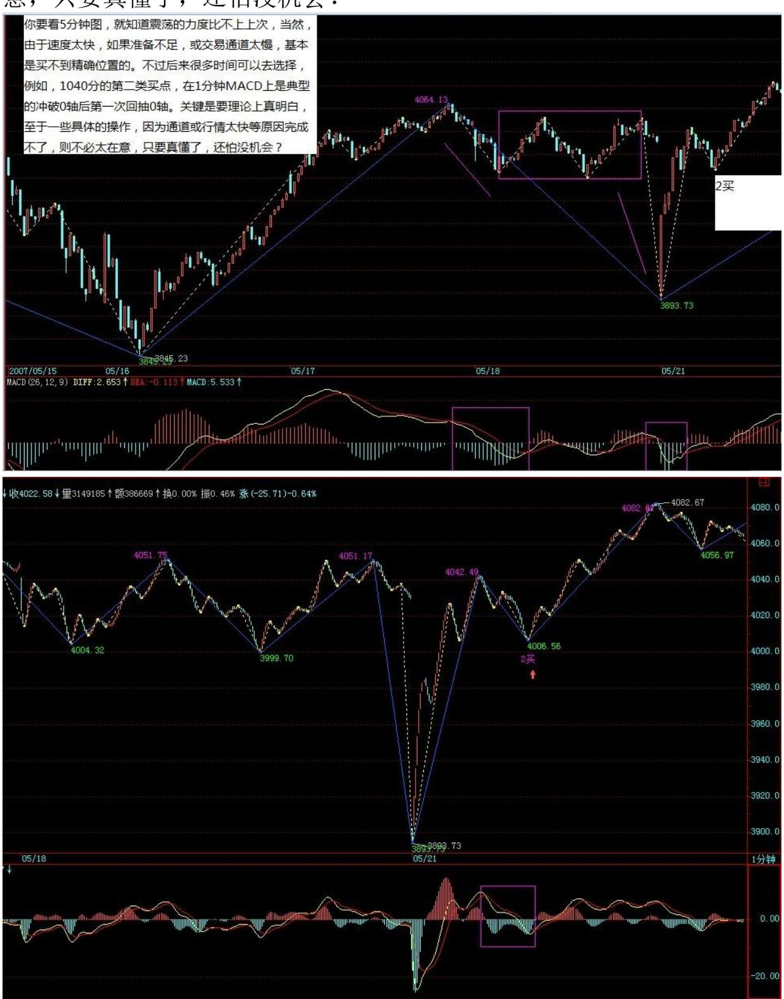

# 教你炒股票 52:炒股票就是真正的学佛

(2007-05-18 08:49:05)本 ID 一直强调无须预测,并不是说市场走势 就绝对不可预测,相反,市场走势当然可以绝对预测。不过,这里的 预测和一般所说的预测并不是同一意义,一般的预测是建立在一个机 械的、上帝式思维基础上,这种思维,把市场当成一个绝对的、不受 参与者观察所干扰的系统,由此而行为一套所谓的预测标准,一个建 立在错误的思维基础上的标准。这种预测,本来就不存在。关于这 点,如果你对量子力学的历史发展有点了解,不难理解。

市场的预测、观察、参与者,恰好又是市场走势的构成者,这就是市 场预测的最基本起点。因此,市场的走势模式,归根结底就是市场预 测、观察、参与者行为模式的同构,这意味着,唯一并绝对可以预测 的,就是市场走势的基本形态。不学无术之辈,喜欢谈论所谓的点 位,却不知道,点位只是基本形态演化的一个结果,是当下中形成 了,形态是"不患"的,点位是"不患"之"患",只要把握了这 "不患",其"患"自然就在当下的把握中。那种追求对点位的非当 下把握,绝对是脑子进水,因为点位都是当下形成中的,这是一个 "不患",企图逃离这个"不患"而谋其"患",不是脑子进水是什 么?正因为点位都是在基本形态的演变中当下形成的"不患",才有 点位的"不患"之"患"。

明白了这个道理,才算是有了市场预测的"正眼",无此"正眼", 都是瞎掰。而实际操作中,最基础的,就是对基本形态的最基本把 握,这是"不患" 的,只有立足于这"不患"上,才有对点位之 "患"当下的把握。说白了,所有的操作练习,归根结底就是在此之 上。所以,本 ID 说自己只是一个训练者,引导者,因为当下,只能 是你的当下,离开你的操作当下,根本是不存在的。由此,不难理解 另外一个操作上的"不患",就是你事先确立的操作级别,这是"不 患"的。市场,归根结底只是你的市场,就像,一个看花只能看到花 的眼睛,那自然看花就是花,不会把花看成猴子,科学的把戏,就是

要先假设所有的被科学定义为眼睛的物体,都只能把花看成花,所以 科学在股市上注定死无葬身之地。

所有的市场,都必然只能是你当下观察、操作中的市场,离开你当下 的观察、操作,市场对于你来说并不存在,或者说毫无意义。而你的 观察、操作,必须有一个"不患"的前提,就是你的操作级别。这操 作级别,就等于一个把花看成花或把花看成猴子的眼睛,在你的世界 里,把花看成花与把花看成猴子所包含的基本模式是同构的,关键是 这个模式,而不是花还是猴子的不同设定。所以,本 ID 的理论里, 可以适用于任何操作级别的人,因为不同级别之间的基本模式是同构 的,这就是市场的一个基本特征。注意,这特征不是理所当然的,这 个特征之所以存在,归根结底,就是市场参与者有着基本相同的结 构,这结构,归根结底,就是贪嗔痴疑慢。甚至可以这样说,在六道 轮回中,任何的类市场形态,本 ID 的理论都适用其中,因为,这贪 嗔痴疑慢是同构的。所以,如果本 ID 这理论的种子种下后,就算你 轮回到其它道上,那里恰好有一个股票市场,你也可以在其中如鱼得 水。

那么,市场的基本形态是什么,最基础的,就是反复说的以中枢、级 别为基础的趋势与盘整。而背驰的级别一定不小于转折的级别,是市 场预测的最基础142 手段。例如,你是一个 30 分钟级别的操作者, 那么,任何 30分钟级别下跌及 30 分钟级别以上的盘整,你都没必要 参与。因此,当一个 30 分钟的顶背驰出现后,你当然就要绝对退 出,为什么?因为这个退出是在一个绝对的预测基础上的,就是后面 必然是一个 30分钟级别下跌或扩展成 30 分钟级别以上的盘整,这就 是最有用、最绝对的预测,这才是真正的预测,这是被本 ID 的理论 绝对保证的,或者说这是被市场参与者的贪嗔痴疑慢所绝对保证的。

本 ID 的理论,归根结底,就是研究这贪嗔痴疑慢的。由此也就知 道,为什么市场的操作,归根结底就是人自身的比较,为什么本 ID可 以把理论大肆公开而不会影响本 ID 自己的操作,因为,只要这世界 依然有这贪嗔痴疑慢,本 ID 就如鱼得水。有人整天痴谈学佛,其 实,炒股票就是真正的学佛,不在这贪嗔痴疑慢的大烦恼中如鱼得 水、得大自在,你那佛,顶屁用!附录:今天,只有脑子都是水的 人,才会觉得上海要新高。用脚指头思维都知道,周末消息面的压力 会让走势在这里犹疑。今天的平衡市走势,无非就是对此的一种正常 反应。技术上,管了指数已经 N 天的 4040点依然站不住,当然,这

只是为了对中枢不了解的人给出的点,如果熟悉正常分析,可以找到 更精确的点。

下周初,大盘的这种震荡一定要选择方向了,一个最简单的原因,就 是 5 日线对 10 线之吻已经春情荡漾了。这种方向的选择,最终将导 致震荡区间的加大,技术点说,就是形成一个更大级别的震荡。

深圳最近之所以比上海强,只是因为对应上海 1/2 线的深圳成指数的 1/2 线在 13700 点,还有较大空间的。所以,后面走势无非两种选 择,深圳把上海带起来或相反,这种两个市场的背离走势,是不可能 再延续的。

大盘每天的走势都是本 ID 理论的最好注释,像上海今天的 05181326,当时当下如何判别,用什么方法可以精确地把握。如果你 还搞不清楚,那么就证明你需要复读。答案很简单,一个中枢震荡的 两段间的力度判别,05171430-05181000 与 05181058-05181326,用1 分钟的 MACD 来辅助,然后考察后一段的细部,用类似区间套的方法 就可以精确定位。注意,这一切都可以当下完成的,无须事后解释。 如果上述方法你一无所知或根本搞不清楚,那放假两天继续补课。

本 ID 最近比较无聊,放假是有点不可能了,今晚、明后两天都排满 了。为了高兴一下,八卦一个消息,就是 5 月 10 日写文章那老熟 人,结婚了,这消息今天应该公布了,网络上应该都有,由此就知道 此人文章的分量。最后再八卦一下,本 ID 国安永远争第一的股票, 究竟在今年涨幅排第几了?前面还有多少先进需要超越,让本 ID 也 有个努力的目标。

143

\*\*\*\*\*\*\*\*\*\*\*\*\*\*\*\*\*\*\*\*。

解盘及互动问答:

\*\*\*\*\*\*\*\*\*\*\*\*\*\*\*\*\*\*\*\*。

1. 网友 [匿名] 糊涂虫: 缠老师,问一个很弱智的问题,一定要回 答,不然会吃不下饭,睡不着觉的。问题是:在一个30分钟的K线 图上出现一个时间跨度为3天或者8天的中枢(24\64根K线) 和一个时间跨度为1天或者3个小时中枢(8/6根K线),请问这

两个中枢的"级别"是一样的?在某一级别的K线图上,其中枢的级 别是否由中枢形成的时间决定的?谢谢老师和师兄\师姐们! 2007- 05-18 15:25:30缠师:中枢是用递归方法定义的,先要把这个理解清 楚,否则你说的中枢和本 ID 说的都不是一样东西,怎么可能理解?

#### \*\*\*\*\*\*\*\*\*\*\*\*\*\*\*\*\*\*\*\*。

2. 网友 [匿名] 冠军杯: 缠 MM 你好!我提过 N 次问题都没回答 哦。今天想问下 000800,000063 的情况怎么样? 000063 被套了。

谢谢! 2007-05-18 15:32:48缠师:这两股票中线都问题不大,被套 肯定是因为在震荡区间中追高买了,可以好好学学震荡区间操作的要 领。

#### \*\*\*\*\*\*\*\*\*\*\*\*\*\*\*\*\*\*\*。

3. 网友 [匿名] 墨香小老虎: 今天操作也很郁闷!扔了 999 的 1/4,想回补结果错过机会。补了一天的 998,结果 998 萎靡了一 天。 2007-05-18 15:14:59网友两只老虎:我今天老老实实的,反倒 收益新高。唉。郁闷。还是技术不行啊。 2007-05-18 15:35:32缠 师:应该把做错的原因找出来,每一个都不能放过,这样才能磨练出 精确度。否则,看均线就可以了,那还更简单。

#### \*\*\*\*\*\*\*\*\*\*\*\*\*\*\*\*\*\*\*\*。

4. 网友匿名] 启程: 楼主,我想问个问题。000911 由于 3 月中的 停牌。造成 4 月初复牌后的两个涨停牌。月线图上就留了一个大缺 口。现在股价一直144 在震荡。难道这样的缺口一定要补吗?2007- 05-18 15:46:28缠师:谁说缺口一定要补的?像突破性的缺口,就不 补。像上海,94年在 300 多点还留着一个呢。

#### \*\*\*\*\*\*\*\*\*\*\*\*\*\*\*\*\*\*\*\*。

5. 网友匿名] christine: 姐姐,在实际看盘时,有时会发现,当时 即可以看成是某级别买点又可以看成是某级别卖点的情况发生,不同 级别出现的不同的买卖点这种情况该怎么处理? 2007-05-1815:52:13 缠师:首先这种情况是不可能发生的。当然,有可能发生的是,大级 别的卖买点和小级别的买卖点很接近,这当然要看大级别的来操作,

除非你有足够的经验与精确度确认,小级别的操作有可以退出的空 间。

#### \*\*\*\*\*\*\*\*\*\*\*\*\*\*\*\*\*\*\*\*。

6. 网友 [匿名] 新浪网友: 妹妹,由你的课程:大牛市的序幕,还 未真正拉开。 相应速率的测算上,是否也可以应用到个股上? 谢 谢!2007-05-18缠师:可以,但比例关系不一定一样。本 ID 有时间 可以分析个股来看,当然,只能是已经有足够交易时间的的老股了。

#### \*\*\*\*\*\*\*\*\*\*\*\*\*\*\*\*\*\*\*。

7. 网友 [匿名] 夜雨: 美女姐姐,我这两天老是卖最强势的股,减 仓 600597,昨天卖点卖出 600203。买的都还在盘整。象 600203 我 昨天卖了。怎么才能把握啊?还有 600203 今年的涨幅也跟 416 差不 多。这两支,有的比,有什么可以八卦一下吗? 2007-05-1815:56:54 缠师:技术不熟练的,可以把级别放大点,别 1 分钟都没背驰就急于 操作,甚至可以规定自己,那种 5 日线都不跌破的调整,可以不管 的。另外,卖了是为了买回来,特别对那些大级别在强劲上升的股 票,否则,卖了不买,那为什么要卖?至于 203,和 416 比不上吧, 一个 300%多,一个 500%多了。

#### \*\*\*\*\*\*\*\*\*\*\*\*\*\*\*\*\*\*\*。

145 8. 网友匿名] 钢铁大道: 女王好!汇报近日操作,由于揣摩您 意思失误,昨日进入中信国安(000839)。原本看该股高级别图形不 错,仅 1f 和 5fK 线欠佳,不料进入后被套,加上一旦今日加息出 台,周一是否要拼命出逃规避调整风险?盼复。 2007-05-1815:58:35 缠师:明显的思维矛盾,既然你是看好大级别的,就要按大级别的图 形来思维,而不用管小级别的事情。如果你只能忍受小级别的波动, 就按小级别操作,不能大小级别搞乱了。

#### \*\*\*\*\*\*\*\*\*\*\*\*\*\*\*\*\*\*\*。

9. 网友果二: 今天对大盘倒是判断正确了,可是个股操作不理想。 盘中打短差都只打到 2 毛,只够交手续费。而且边看大盘边看个股, 有的股又不跟大盘走,都看晕了。 2007-05-18 15:51:15缠师:本 ID 不是早说了,大盘震荡,有些个股会大幅上涨,例如416、607 这些, 如果你按大盘来看,那肯定是要出问题的。个股就按个股走势看,如

果个股要跟着大盘,那自然就表现出与大盘一致的买卖点结构。从 这,不难判断大盘与个股的相关程度。

#### \*\*\*\*\*\*\*\*\*\*\*\*\*\*\*\*\*\*\*\*。

10. 网友 [匿名] 漂泊: 禅主好!根据您的理论,进了 600166,涨 停了,但是 600601 越来越看不懂了,请您给看看,谢谢!2007-05- 18 16:06:16缠师:短线就是围绕 11.8 元的一个中枢震荡,没什么难 看的。

#### \*\*\*\*\*\*\*\*\*\*\*\*\*\*\*\*\*\*\*。

11. 网友 [匿名] 大盘: 请问博主:在 1 分钟图表上,有时 1 分钟 中枢三段加延伸段超过 6 段(但是小于 9 段)的情况,在 5 分钟图 表中也通常可以看出下上下和上下上的三段,但是按照定义这应该仍 然是 1 分钟级别。如果没有每日下载 1 分钟数据,那么 5 分钟图表 中看出的下上下三段,有没有什么办法可以确定其具体级别?要知 道,每日下载 1 分钟数据很占空间也不方便。 2007-05-18 16:09:08 缠师:5 分钟上的走势要完成的,其精确判断一定需要 1 分钟图。否 则,并不是 5 分钟的一定有 5 分钟背驰,如果小级别转大级别就没 法看了。如果只有5 分钟图,那只能把操作级别放大,把 5 分钟当最 小级别的。

146

#### \*\*\*\*\*\*\*\*\*\*\*\*\*\*\*\*\*\*\*\*。

12. 网友 [匿名] 戈石: 估计最近某些家伙的尾巴被您给踩疼了,天 天到这来狂吠。歇斯底里的,估计快气绝身亡了。 2007-05- 1816:11:39缠师:物种多样性,是要保持的,否则就不环保了。

#### \*\*\*\*\*\*\*\*\*\*\*\*\*\*\*\*\*\*\*\*。

13. 网友 [匿名] joyce: 美女老师:刚刚开始看还觉得看出点眉 目,沾沾自喜,到"中枢"就卡壳了。您文章中举的例子时间早了, 看不见,怎么办啊?缠师:如果是你学理科的,应该不难搞懂中枢的 递归定义。如果你学文科或者艺术的,需要直观才能明白定义的,这 里有网友把中枢定义画了图,你可以问他们的网址去看。本 ID 有一

帖子上有那地址,本ID 现在也不知道是哪个帖子了。如果可能,去找 一下也可以。

#### \*\*\*\*\*\*\*\*\*\*\*\*\*\*\*\*\*\*\*\*。

缠师:大盘评论,收盘附录本文后给出。先下,3 点半见。2007-05- 21 15:50:43

#### \*\*\*\*\*\*\*\*\*\*\*\*\*\*\*\*\*\*\*\*。

14. 网友 [匿名] 飞: 请问博主,某下跌或上涨的走势类型中,某级 别围绕两个中枢振荡的次级别走势发生重叠而形成中枢扩张。请问: 1. 这个扩张的中枢是否发生重叠后就完成了?2. 这个扩张后的中枢 如果完成或没完成,那他的次级别走势的三段该如何算起?如何区 分?缠师:你这样说不够严谨。中枢扩展不能预先说是某级别的,因 为扩展可以不断延续下去。这个问题其实很简单,如果你明白连接的 可结合性,就更简单了,其实就是 A+B+C=(A+B+C),而后者符合更 大的中枢定义,所以就可以说 A 扩展了,并没有什么高深的地方。

#### \*\*\*\*\*\*\*\*\*\*\*\*\*\*\*\*\*\*\*\*。

15. 网友 [匿名] 半路学禅: 有一个问题想问一下禅主:因为技术不 是很过关,所以鸡蛋放在 3、4 个篮子里,每天开盘后不停的轮换分 析,操作多些时,147 还编个 Excel 表格算差价,这样下来,每天精 神耗费大,而且还不是每次都能买卖正确且打到差价。想想禅主每天 至少十几支股票的操作,而且还是大资金,都能应付自如,做到游刃 有余,真是佩服!想问一下,禅主的操作法诀是什么? 2007-05-21 15:45:50缠师:这个问题很简单,本 ID 只需要告诉指令,具体敲键 盘这种活本 ID 是不干的。所以本 ID 反复说,资金小的一定要集 中,一般散户,2、3 只就足够了。

#### \*\*\*\*\*\*\*\*\*\*\*\*\*\*\*\*\*\*\*。

16. 网友 [匿名] 新浪网友: 博主,能不能说说早盘的反弹?在 1分 钟图上,不是很好把握啊? 2007-05-21 15:59:46缠师:你要看 5 分 钟图,就知道震荡的力度比不上上次,当然,由于速度太快,如果准 备不足,或交易通道太慢,基本是买不到精确位置的。不过后来很多 时间可以去选择,例如,1040 分的第二类买点,在1 分钟 MACD 上是 典型的冲破 0 轴后第一次回抽 0 轴。关键是要理论上真明白,至于

一些具体的操作,因为通道或行情太快等原因完成不了,则不必太在 意,只要真懂了,还怕没机会?

148 149 150 17. 网友[匿名] 首钢股份: 女王,好久没来了。我在

单位上博客太慢。但您的思路,群里的同学们已经传达给我了。我问 问,您说的钢铁板块,是即将整体上市的,还是已经整体上市的?这 关系到我选择承德钒钛还是华陵管线。您一定回复阿。跪求!2007- 05-2116:07:17缠师:最好看走势,钢铁股里有整体上市的很多,如果 你对基本面了解比较清楚的,自己可以去选择。本 ID 说的不是这两 只,不过这两只也不错,总之钢铁板块问题都不大。

#### \*\*\*\*\*\*\*\*\*\*\*\*\*\*\*\*\*\*\*\*。

18. 网友 [匿名] 哈哈: 继续问。急啊。 缠主教教我们怎么选择不 ED 的吧。很不幸,碰到 000807 这个"瘟神" ,已经瘟了快 2 个星 期了。振幅也不大,做短差也够呛。看 30 分钟线,简直就是条直 线,我已经快被它搞的吐血了。资金全耗在他上面了。救救我吧! 请 问之后应该怎么操作呀?2007-05-21 15:54:40缠师:你为什么一定要 大涨后才买?大涨后调整很自然。

#### \*\*\*\*\*\*\*\*\*\*\*\*\*\*\*\*\*\*\*。

19. 网友匿名] 缠途漫漫: 博主好!有问题请教:20 课原文:"而 中枢的形成无非两种,一种是回升形成的,一种是回调形成的。对于 第一种有 a1=b1,b2=c2;对第二种有 a2=b2,b1=c1。但无论是哪种 情况,中枢的公式都可以简化为[max(a2,c2),min(a1,c1)]。" 上面原文似乎隐含着一个前提:即构成本级中枢的每段次级别走势, 其起点和终点就是该次级走势的最高点或最低点,否则谈不上a1=b1, b2=c2 或 a2=b2,b1=c1。那么一段完成的走势类型,其起点和终点一 定是该走势类型的最高点或最低点吗?还有,原文:对 5 分钟的同级 别分解,以最典型的 a+A 为例子,一般情况下,a 并不一定就是 5 分钟级别的走势类型,但通过结合运算,总能使得 a+A 中,a 是一个 5 分钟的走势类型,而 A,也分解为 m 段 5 分钟走势类型,则 A=A1+A2+"+Am。

这里同级分解的若干段,相邻两段的连接点,是否就是这相邻两段共 同的高点或低点呢? 2007-05-21 15:45:45缠师:通过结合律,都可 以归到你说的这种标准形式上,也就是连接点都是高、低点。

151 网友匿名] 缠途漫漫:谢谢博主!但对于 9 段 5f 走势振荡扩 张,从 30f 中枢扩张到日线中枢的情况,似乎不符合上面所说。例如 这九段走势的振荡呈三角形收敛状态,则每 3 段构成的 30f 走势, 其最高点或最低点,显然不一定是两段 30f 走势间的连接点。

缠师:延伸的只看前三段的区间,后面都是震荡。你用 5 分钟的角度 和用 30 分钟的角度去分解图形,得出不同的中枢结果很正常,但原 则是一样的。

#### \*\*\*\*\*\*\*\*\*\*\*\*\*\*\*\*\*\*\*\*。

20. 网友 [匿名] 短路: 同学们还是花多花点心思研究课程,提高技 术吧。不要总想走捷径。电路中,捷径=短路。股市中,捷径=...... 2007-05-21 16:31:38缠师:很对,关键是学好技术,其他,都可以不 关注,包括本 ID 八卦说的股票。

#### \*\*\*\*\*\*\*\*\*\*\*\*\*\*\*\*\*\*\*\*。

缠师:各位请注意,本 ID 昨天说的股票只是举例子,由于有些盘子 太小,例如本 ID 就在摆弄着一只和那锌锗内容一样的股票,但盘子 确实太小,根本就没法说,一说就乱。现在不是 2000 点了,任何股 票都要首先注意风险,必须按照大级别的买点进入。盘子小的,不能 乱买,否则盘子就乱,就要洗。各位最好就是按思路去买股票,最好 就是继续持有原来已经获利丰厚而依然有大潜力的股票,这样可以减 少震荡的风险,否则一窝蜂地去换股票,那就乱套了。

注意,来这里是学技术的,有技术,操作什么股票都可以,没必要养 成听消息的坏习惯。如果说消息,本 ID 这里绝对是全中国最大的消 息集散地,但本ID 不愿意说,就是怕害了各位,养成坏习惯。解盘收 盘后附录上,先下,再见。2007-05-22 08:49:55

#### \*\*\*\*\*\*\*\*\*\*\*\*\*\*\*\*\*\*\*\*。

缠师:昨天说了,只要不跌破 4050 的昨天单边区间,大盘就继续向 上拓展。今天的大盘走得太技术了,全天基本就在磨那条最重要的1/2 压力线,早上先冲到 4129 这线的位置上,然后在上面来一个小多头 陷阱,然后一路下来考验缺口支持,尾盘再拉回,是否感觉到其中的 美感?明天,依然是该线与今天缺口间的震荡活动,然后再选择短线 突破的方向,具体可参照今天开始形成小中枢的震荡与第三类买卖点 选择。

大方面看,关于该 1/2 的震荡形式,依然继续选择中,虽然今天是历 史上第一次突破过该 1/2,但并不能绝对地否定第一种震荡形式的可 能。当然,操作上并不需要预测,只需要看好短线的突破方向,看不 懂的,就是 5、10 日线,不破就拿着,连短线的震荡都无须考虑。技 术好的,可以继续用短线背驰做152 震荡,但一定要针对具体个股 来,大盘只要平稳,个股行情将不断。

至于个股,本 ID 真不能说任何东西了,反正昨天本 ID 也没说什 么,只是说了几句梦话,如果因为本 ID 的几句梦话,大家明白了点 什么,那是大家的够狡猾,和本 ID 可无关。这种梦话,估计最变态 的管理层也不能对本 ID 发飙,本 ID 说而不说,不说而说,想抓本 ID 的把柄,可需要证据。2007-05-22 15:28:48

#### \*\*\*\*\*\*\*\*\*\*\*\*\*\*\*\*\*\*\*。

21. 网友[匿名] stone: 那个汉奸 13 元的股票,我还在,可最近吸 的血变少了,象这种股票,如何操作阿?怎么能看出什么时候涨停打 开?什么时候又拉涨停?谢谢!2007-05-22 15:28:48缠师:本 ID 那 几天还故意强调 13 元说的,为什么?别以为本 ID是再炫耀,本 ID 说 N 次了,本 ID 喜欢在翻倍的位置出手,13 的一倍在哪里?没 走,中线问题也不大,本 ID 也就是喜欢在这些位置把成本降为 0, 把多余的钱拿去干点别的坏事,这样本 ID 的生意才能越来越大,并 不是说这股票到 1 倍就是头了。本 ID 的方法也早说了,现在对汉奸 这股票,本 ID 是保持 0 成本去增加筹码的阶段了。

#### \*\*\*\*\*\*\*\*\*\*\*\*\*\*\*\*\*\*\*。

22. 网友 [匿名] 新浪网友: 再次强烈要求 LZ,将缠论在期货上的 应用作专题讲座,期货外汇上可双向交易,更适合用缠论吸血。

2007-05-22 15:40:37缠师:先把股票里的练熟,否则半生不熟到期货 里找揍?

#### \*\*\*\*\*\*\*\*\*\*\*\*\*\*\*\*\*\*\*\*。

23. 网友 [匿名] 小迷糊: 请问:甲骨文和等比数列是指什么呀?或 者是哪天的文章?请师兄、师姐们泄露一下。 2007-05-22 15:25:32 缠师:小盘股就更要找好买点,不能太追高,否则就有被洗的痛苦,

大盘股,更没必要追高,买了就买了,没买就算了。所谓眉目传情, 当下就领会,N下以后就没劲了。

#### \*\*\*\*\*\*\*\*\*\*\*\*\*\*\*\*\*\*\*\*。

153 24. 网友 [匿名] 我: 妹妹那个第三类买卖点的定义是一个次级 别走势离开, 然后再以另一个次级别走势回调不进本级别的中枢,也 就是至少要有两个中枢才形成第三类买卖点。妹妹又说一个中枢破坏 的前提是出现这个中枢的第三类买点, 也就是这个中枢破坏要在中枢 上出现一个次级别的中枢就破坏了。一个是一个次级中枢,另一个是 两个次级中枢,究竟是一个次级别中枢还是两个啊?我怎么觉得有点 矛盾啊?是不是我的理解有问题?还有,按照这个定义,第一类卖点 跟第三类买点,位置非常近。请妹妹解答我困惑。 2007-05- 2215:46:56缠师:离开中枢必须是次级别,回试也必须是次级别。单 在中枢上有一个次级别的中枢,并不能绝对保证安全。例如,很多跳 空后的岛型反转就是这样。第三类买卖点后,可以演化成更大级别的 震荡。当然有可能两者的位置特别近,所以要选择大级别的操作,这 样才有足够回旋的空间。当然,如果你技术好点,能精细去当下把握 第三类买点转化为大级别震荡的这种情况,一旦出现,马上离开,也 就是只选择继续中枢上移的那种,这样会提高资金的利用率。只要级 别不太小,即使是转化为大级别震荡的情况,也能有足够的利润空间 去从容离开。

#### \*\*\*\*\*\*\*\*\*\*\*\*\*\*\*\*\*\*\*\*。

25. 网友 [匿名] 走失的爱犬: 缠姐,我八卦下。你埋大米的时候是 用个人名义还是公司名义啊?那么多大米进去,怎么 F10 里就没显示 点东西出来啊?2007-05-22 15:56:14缠师:本 ID 在市场里 N 多年 了,还能被 F10 给抓住,那本 ID 真是白活了。一个最蠢的庄家,都 不至于如此,更不用说本 ID 早不干那种事情了。

#### \*\*\*\*\*\*\*\*\*\*\*\*\*\*\*\*\*\*\*\*。

26. 网友 [匿名] 新浪网友: 各位,楼主 419 那个地方可是在北京 哦,怎么被你们说成在河南了呢?000959(首钢)才是楼主说的那个 钢铁股哦,整体上市加奥运题材的。大家可要关注 000959(首钢)! 2007-05-22 15:53:52缠师:本 ID 就只能在北京 419?那也太小看本

ID 了。首钢是一熟人照顾着,中线问题不大。最后说一句,关于昨天 的梦话,本 ID 不想再提了,本 ID 什么都没说,到此为止。

#### \*\*\*\*\*\*\*\*\*\*\*\*\*\*\*\*\*\*\*\*。

27. 网友 [匿名] JESSIE: 缠姐,自从跟你学习以来,我真的整个人 都变了。变得更加自信开朗智慧了。我相信这是一种缘份。感谢上天 让我遇到你,希154 望这种缘份能一直延续到永远。以后不论你到哪 里,一定要事先给我们一个预告,让我们能跟上你的脚步,让我们这 些喜爱你的人可以一直追随你。当然,不论以后怎样,我们会学好你 的理论,这才是你给我们的最大财富。根据你的理论,我一直在实践 在操作,收益虽然不如别的同学大,但足以让我惊喜,而且我不会像 以前那样恐慌了。这一切要感谢你,你的理论真的很伟大,而你的为 人更让我喜爱。

我想问一个问题,一般股票会在什么时候拉涨停,为什么有的股票一 直几个涨停,而有的股票总是没有涨停?谢谢姐姐。2007-05- 2216:14:28缠师:上升,基本分两种,通道式上升的,一般都不爱涨 停,具体的,以后课程里都有。

\*\*\*\*\*\*\*\*\*\*\*\*\*\*\*\*\*\*\*\*28. 网友 [匿名] 新浪网友: 请教:600216 的 05181000 是否为 30分钟的 3 买?此问题我问了 N 遍了。请老师 和学长帮我解答一下。

2007-05-22 16:12:09缠师:不是。你要先找离开的次级别,然后再找 回来的次级别。30 分钟的次级别是 5 分钟的,其次级别至少是 3 段 (3/5/7/9/11)的 1分钟走势类型构成。按这样才能找到的。继续再 找一下,不难的。看5 分钟图,在 30 分钟上是找不到精确的 30 分 钟第三类买点的。

#### \*\*\*\*\*\*\*\*\*\*\*\*\*\*\*\*\*\*\*。

29. 网友 [匿名] 新浪网友: 不管楼主用什么方式说,说还是不说, 我认为大部分股民还是不挣钱的。这似乎是股市的铁律。不过楼主的 好心肠本人表示赞赏。在学习楼主理论时,我有个问题不明白:吻的开 始和结束,男上位,女上位的严格定义是什么?这是基础概念,需要 严格的定义。我在博客里似乎没有看到这些定义。 2007-05- 2216:05:49缠师:这些概念都没什么意义。关键是从中枢开始看。女

上位的定义,课程里都有,短期均线在长期之上就是。吻就是短期转 折靠近长期的,只是为了大家好记忆,顺便编的名词,没什么大意 义。还是从中枢开始努力。

#### \*\*\*\*\*\*\*\*\*\*\*\*\*\*\*\*\*\*\*\*。

30. 网友 [匿名] 新浪网友: "离开中枢必须是次级别,回试也必须 是次级别,单在中枢上有一个次级别的中枢并不能绝对保证安全,例 如,很多跳空后的岛型反转就是这样。第三类买卖点后可以演化成更 大级别的震荡,当然有可能两者的位置特别近,所以要选择大级别的 操作,这样才有足够回旋的空155 间。当然,如果你技术好点,能精 细去当下把握第三类买点转化为大级别震荡的这种情况,一旦出现, 马上离开,也就是只选择继续中枢上移的那种,这样会提高资金的利 用率。只要级别不太小,即使是转化为大级别震荡的情况,也能有足 够的利润空间去从容离开。" 请问老大:离开的次级别中枢可以在原 中枢之内吧?回试的次级别中枢才不可以回到原中枢里对吧? 2007- 05-22 16:21:43缠师:当然可以,而且大多数情况都是这样。

网友 [匿名] 新浪网友:妹妹我又糊涂了, 为什么离开的那个次级别 中枢可以在原中枢之内啊? 离开的意思不是不在原中枢啊? 不是离 开的跟回试的都不到原中枢?缠师:你说的是中枢,中枢不是走势的 全部,中枢上面离开了也就是离开。围绕中枢的震荡,只要是价格不 在中枢里,就是离开,只是这种离开一般都被抽回来了。第三类买卖 点之所以重要,就是离开后抽不回来了。

#### \*\*\*\*\*\*\*\*\*\*\*\*\*\*\*\*\*\*\*\*。

31. 网友 [匿名] 新股手: 老大,今天不收礼可是上窜下跳的来回了 好几次。是妹妹你在里面折腾吗?这股持有还有问题吗?网友【匿 名】心脏病复发:别乱说,不是老大啦,是史玉柱在玩。呵呵。 2007-05-22 16:31:11缠师:就是,管理层要抓人就去抓他,和本 ID 可没关系。本 ID 合法投资,大力抽血,别把本 ID 和那些大傻瓜联 系一起。

#### \*\*\*\*\*\*\*\*\*\*\*\*\*\*\*\*\*\*\*\*。

缠师:今天北京下雨,连腐败的兴趣都没有了,不妨和各位多说几 句。2007-05-22 16:56:07

#### \*\*\*\*\*\*\*\*\*\*\*\*\*\*\*\*\*\*\*\*\*。

32. 网友 [匿名] 新浪网友: 老大,既然今天兴致这么高,能不能谈 两句 B 股 ?2007-05-22 16:47:19156 缠师:买 B 股的,除非是底 部一直上来的,否则弄不好,赚的钱还不够美圆贬的多。当然,如果 你原来就有美圆,又不想换成人民币,那当然可以参与。B股在这地方 要好好震荡一下了,但行情没完。

#### \*\*\*\*\*\*\*\*\*\*\*\*\*\*\*\*\*\*\*\*。

33. 网友 [匿名] 新浪网友; 最近基督教在中国很盛行啊。老大怎么 看这个现象? 2007-05-22 16:53:27缠师:这个问题以前都说过了。 在这个问题上,国家应该严加监管,这比监管股市更重要。

#### \*\*\*\*\*\*\*\*\*\*\*\*\*\*\*\*\*\*\*\*\*。

34. 网友 [匿名] 中间体: 白玉兰:我知道你有 343、 北京人。我 也是! 哈哈。缠姐就要下手了。 2007-05-22 16:58:32缠师:578 突 破历史天价,又刚好两倍,震荡一下很自然。343 突破历史天价后在 15 元上下也一样。802,走势很标准,60 分钟顶背驰后调整一下都不 可以?一般大级别的背驰,也需要长点的时间去消化,这是一个很自 然的问题。中线,北京股都是没问题的,至于太具体的东西,例如明 天将怎么样,千万别问本 ID,本 ID 不想被监管。

#### \*\*\*\*\*\*\*\*\*\*\*\*\*\*\*\*\*\*\*\*。

35. 网友 [匿名] 新股手: 老大,我看了两遍课文。好象没有一二类 买卖点的精确定义。只有第三类买卖点有精确定义。2007-05- 2217:00:19缠师:所有的买卖点归根结底都是第一类的,第一类归根 结底和背驰相关,这是反复说的事情。

#### \*\*\*\*\*\*\*\*\*\*\*\*\*\*\*\*\*\*\*\*。

36. 网友 [匿名] 7NT: 缠姐好!请教问题:下面是以前的回复内 容:如果最少由 5 段构成,即 a+(A1+A2+A3)+b,那么第二类买卖点 是在 A1 的末段还是在 A3 的末段?2007-05-22 17:06:20157 缠师: 请好好看看结合律的分析。

网友 [匿名] 7NT:缠姐能不能再详细说一下?我看了结合律那课,还 是想不通。

缠师:对不起,本 ID 回答问题是顺着看,可能前面的问题会漏掉。

第二类买点的定义很明确,就是例如一个 30 分钟的第一类买点,一 个 5 分钟次级别上去后,一个 5 分钟回试不破低点,那就是第二类 买点,你说他该在哪一段?用结合进行次级别分解,只能在第二段。

#### \*\*\*\*\*\*\*\*\*\*\*\*\*\*\*\*\*\*\*\*\*。

37. 网友 [匿名] 墨香小老虎: 神仙姐姐,说说北京人吧!我是 16 元左右进的,最初 2000 股,结果现在越跌越买买到 20000 了。

2007-05-22 17:10:06网友两只老虎:羡慕你啊。这么有钱的。我要好 好学技术,做一个挣脱经济束缚的人。博主,我新入了 600780(通宝 能源),9.98 元的成本价,2400 股。你看,可以吗?谢谢!缠师: 这股票很好操作,从来不破 5 周均线,看这来持股就可以。当然,如 果技术好点,就可以用中枢震荡来短线操作,不过如果时间与熟练度 有问题,就算了。

#### \*\*\*\*\*\*\*\*\*\*\*\*\*\*\*\*\*\*\*\*\*。

38. 网友 [匿名] 路漫漫: 老师好!能不能谈谈 B 股的大势? 还 有,今天为什么会跌停那么多股票?谢谢! 2007-05-22 17:11:25缠 师:跌停有什么问题?227 跌停更多。技术上,看 15 分钟图,用区 间套定理,不难发现今天的高点。有空的,可以去分析一下。

#### \*\*\*\*\*\*\*\*\*\*\*\*\*\*\*\*\*\*\*\*。

39. 网友 [匿名] 白玉兰: 北京下雨真好,可以和妹妹多说说话。一 般大家总说中线,长线,江湖上是指几个月或一年? 2007-05- 2217:19:43缠师:外面的长线概念都是不精确的。在这里,年线是最 大级别的,最长线,就是从年线的买点拿到年线的卖点,所以巴非特 之流,也就干了点这类的事158 情,没什么大不了的。短点的,就是 季、月、周、日等,按这来分,才是精确的。

40. 网友 [匿名] 夜雨: 昨天出 600597,今天看来是操作正确了, 这一回一定要记得找个好买点买回来。美女姐姐,报告一下,我最近 的正确率提高了不少,谢谢老师了!像您说的,多用几次,就会熟 悉,实时的感觉也比以前好了。2007-05-22 17:08:06缠师:继续努 力,工夫是练出来的,不是说出来的。本 ID 最多算是个陪练,工夫 还是靠自己。

#### \*\*\*\*\*\*\*\*\*\*\*\*\*\*\*\*\*\*\*\*。

41. 网友 [匿名] 虚心学习: 很高兴发现了你的博客。本想从头把文 章都看一下,再一看从 06 年就开始了,我想从今天开始跟您学习, 但如何把以前的东西尽快补上呢?请指教。盼回复。谢谢!2007-05- 22 17:36:35缠师:从中枢开始,一路学下来。先学好,再用。心态好 点,真学会了,机会多多,别学一半就急着用,这样会乱套的。

#### \*\*\*\*\*\*\*\*\*\*\*\*\*\*\*\*\*\*\*\*。

42. 网友 [匿名] 乐土: 在实际操作中,我有个毛病:小级别背弛全 进全出。因为花心,总忘了回补,错过好多主升段。老师可开个方 子?2007-05-22 17:44:07缠师:只看大级别的图。或者只反复操作几 只股票。
