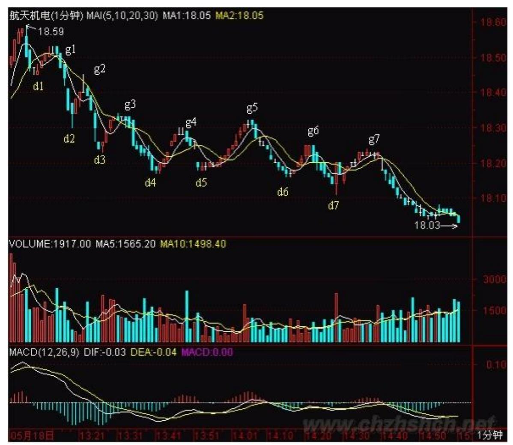
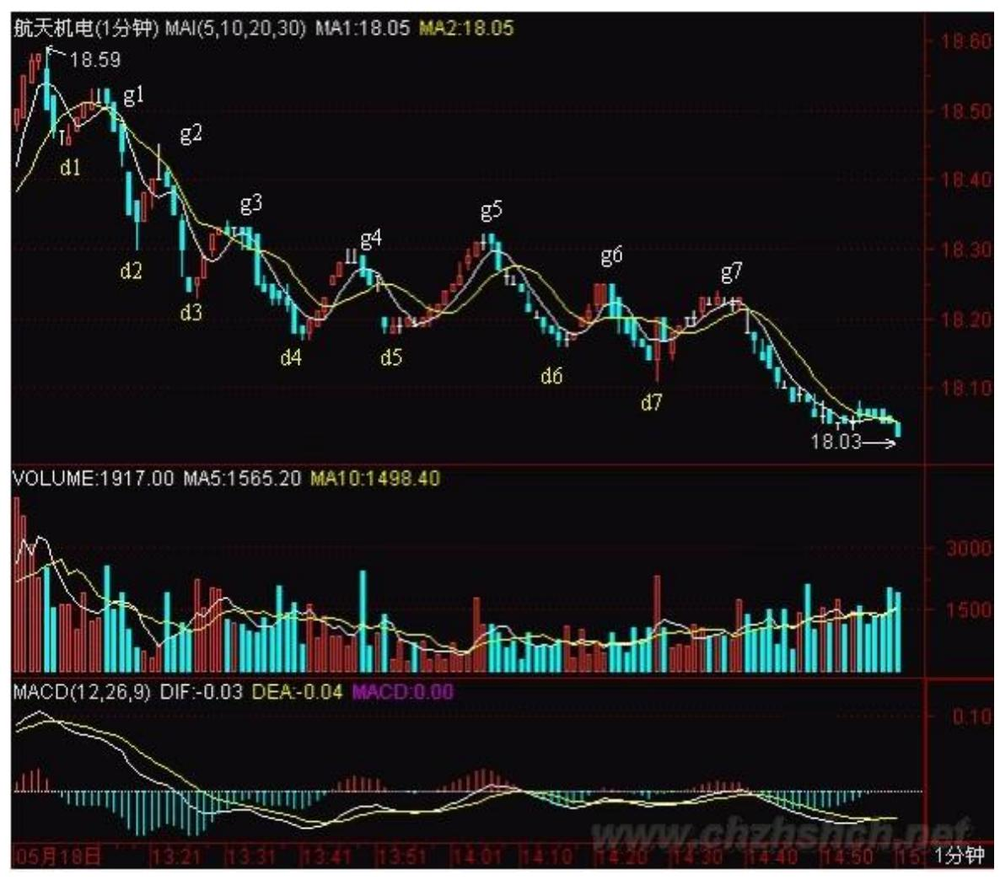
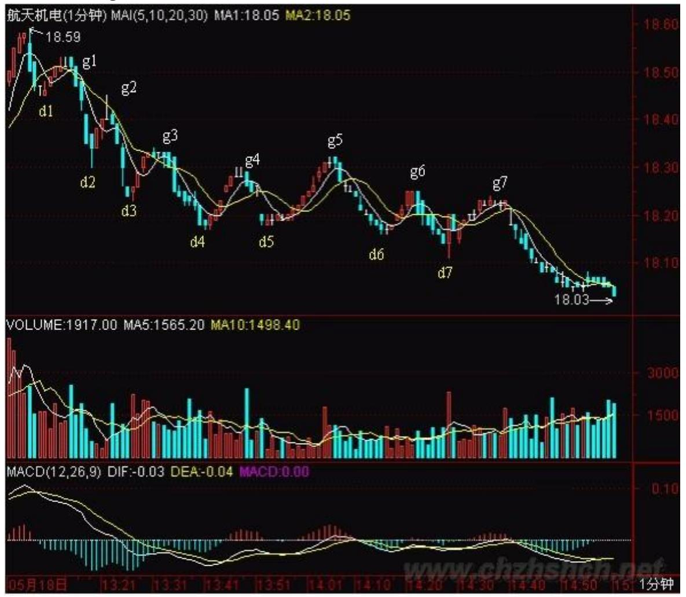
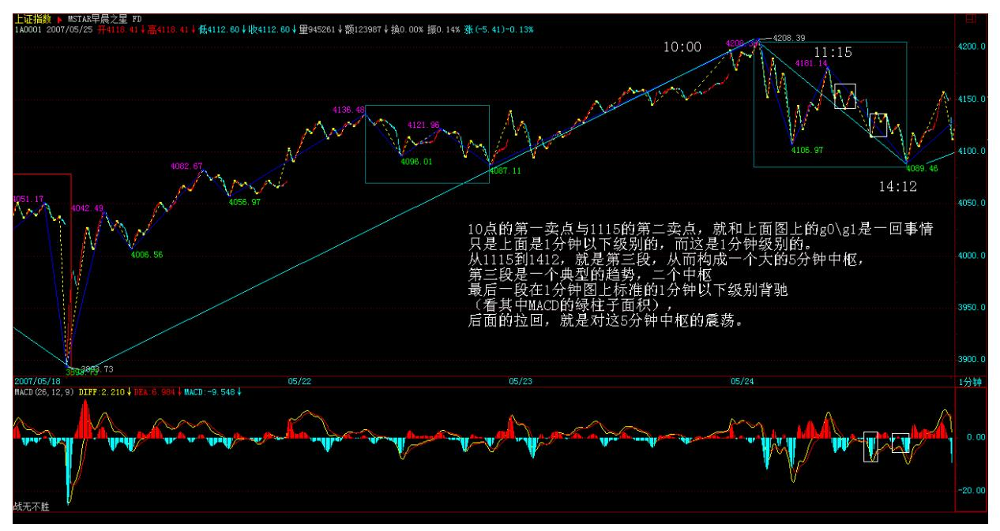
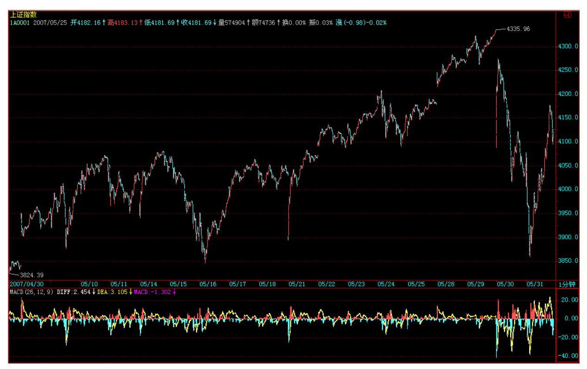
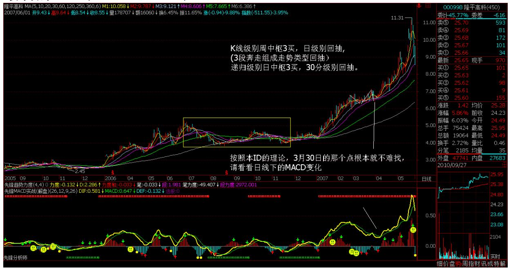
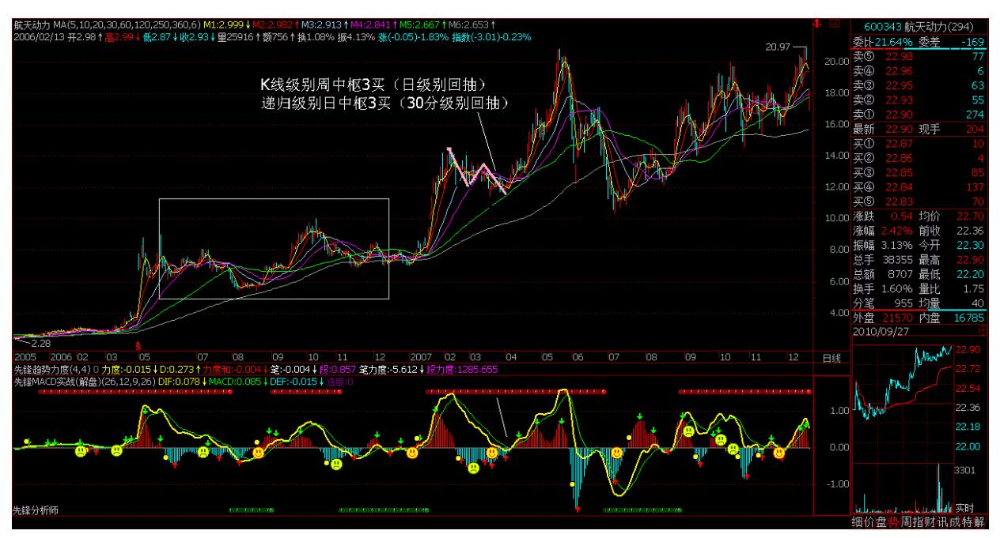
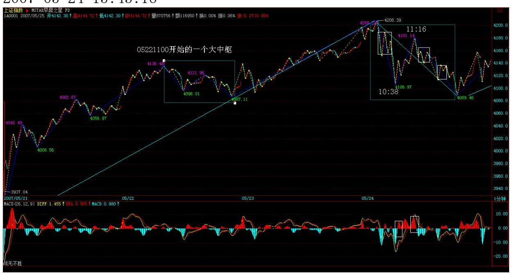

教你炒股票 54:一个具体走势的分析

(2007-05-24 01:37:31)(娇注:这课级别 AO 为笔,与分段后 AO 为 段不同。主要学习走势分析的思路。)注意,看下面分析之前,不能 太饿也不能太饱,不能太兴奋不能太不兴奋,否则一定晕。由于一般 的图都没有这么复杂,所以看完之后千万别信心受到打击,而是应该 信心百倍,知道只要精通本 ID 的理论,这么细微、古怪的图,都可 以当下精确分析并指导操作,从而对本 ID 理论关于走势的绝对把握 性有一个更清楚的认识。后面就是要多看图,多磨练的问题了。

如果概念不清,看到这样的图,基本都要晕头转向。好了,大家开始 深呼吸,放松脑筋,别抽筋了。

这图有个条件,就是 d1=g2,d2=g4。其实这条件有还是没有,并不影 响分析,但有这些条件,就会增加分析的难度。这里,就从 18.5 元 (设为 g0)开始分析。

昨天刚好谈到,当你以某级别分析图形时,就先假设了次级别是线 段。这图里,除了最后一个,其余每一个 dngn、gndn+1 都是 1 分钟 以下级别的,所以都可以看成没有内部结构的线段。

我们就从 g0 开始,当下地进入图形中。显然,当下走到 g1 时,由 于只有两段,所以不形成任何中枢,当然,如果你是一个分笔操作 者,那么 g1 就构成一个第二类卖点了。当走势发展到 d2 时,一个1 分钟级别的中枢就形成,区间是[d1,g1]。后面出现的线段,就要以该 区间来决定是中枢震荡还是第三类买卖点。由于 d1=g2,那么 d2g2这 段就属于[d1,g1]中枢的震荡。而到 d3g3 这段,显然已经不能触及 [d1,g1],所以 g3 就是第三类卖点。当然,如果前面 d1>g2,那 g2 就是第三类卖点了。(娇注:这里中枢取向不太严谨,3 卖点就不规 范)

169 其实,由于 d1=g2,所以当行情发展到 d3,就可以当下地用结合 律对走势进行多样性分析。这时候,有如下等式: g0d3= (g0d1+d1g1+g1d2)+d2g2+g2d3=g0d1+(d1g1+g1d2+d2g2)+g2d3括弧里的 是中枢。在后一式子看来,该中枢就是[d1,g2],也就是一个价位, 这时候,也并不影响前面关于 g3 就是第三类卖点的分析。

而这种分解,比较符合一般的习惯,所以是可以采取的。

170 显然,以 MACD 辅助判断,力度上,g1d2>g2d3>g3d4,相对来说, 后者都是前者的盘整背驰。当然,在 1 分钟图上,这种背驰都没有什 么操作意义,但如果是日线、甚至年线图上,就有了。

分解图形,有一个原则是必须知道的:两个同级别中枢之间必须有次 级别的走势连接,例如,g0d4= g0d1+(d1g1+g1d2+d2g2)+ (g2d3,+d3g3+g3d4)这样的分解是不被允许的,因为括弧中的两个同 级别中枢之间没有次级别的连接。(注意,这与下面三次级别构成中 枢的情况不同,那种情况下,是允许三个括弧相加而之间没有次级 别,因为那是扩展成高一级别中枢的情况,和这里两个同级别的情况 不同。)当行情当下走到 d4 点时,根据上面的原则,无非有下面两 种可能的分解: g0d4= g0d1+(d1g1+g1d2+d2g2)+g2d3+d3g3+g3d4 =g0d1+d1g1+g1d2+(d2g2+g2d3+d3g3)+g3d4d4g4 是盘整背驰后的正 常反弹,针对上面第一种分解,这只是第三类卖点后向一个新的同级 中枢移动或形成更高级别中枢的一个中间状态,g4d5 这段也是;针对 第二种分解,由于 g4=d2,所以 d4g4 是(d2g2+g2d3+d3g3)的中枢 震荡,d5g5 这段也是。

171 有人可能要问,在这种情况下,采取哪种分解?其实,哪一种都 可以,但第一种,由于在中间状态中,没有一个确定的标准,所以对 短线操作指导不足,而第二种,由于是中枢震荡,操作起来就指导明 确了,所以从方便操作的角度,就可以用第二种。这就是反复强调的

分解多样性的好处,一般来说,对于具体操作,一定要选择当下有明 确意义的分解,例如是中枢震荡的,或有第三类买卖点的,但一定要 注意,所有的分解必须符合分解的原则,否则就乱套了。

对于第二种分解,d5g5 这段属于中枢震荡,但对于第一种分解,d5g5 这段就有了一个重大的意义。因为那种第三类卖点出现后的中间状 态,在 d5g5 这段

172 出现后就彻底消除了,一个更大级别的中枢就给确定了。具体如 下:g0g5= g0d1+{(d1g1+g1d2+d2g2)+(g2d3+d3g3+g3d4)+ (d4g4+g4d5+d5g5)}三个小括弧里的 1 分钟中枢重叠构成了大括弧 里的 5 分钟高一级别中枢。中枢的区间是[d2,g5],注意,这时候, 就要把 1 分钟的走势当成线段,小括弧里的都是线段,高低点就是这 线段的端点。这样一来,后面的走势就十分简单了,例如,g7 就是一 个第三类卖点(d7g7,其中 2、3 根 K 线有一个较大的回试,然后有 5、6 两个小十字星停在该区域,由此就知道这肯定构成 1 分钟中枢

了,也就是内部可以画出一个 1 分钟以下级别的三段来,当然,具体 的如果有 1分钟以下图看就可以把握,特别对于级别大的图,这些时 候都可以看小级别的图去确认,如果经验多的,一般看到这种情况, 不用看小级别的都知道这么回事情。)按照第二种分解,相应的 5 分 钟中枢要到 g6 点才完成,这样 g0g6=g0d1+d1g1+g1d2+ {(d2g2+g2d3+d3g3)+(g3d4+d4g4+g4d5)+(d5g5+g5d6+d6g6)} 相 应的 5 分钟中枢区间就是[d3,g5],在这种情况下,d7g7 也是一个 中枢震荡,但不构成第三类卖点,因为不符合条件。(为什么?本 ID 写了这么多,这173 么简单的问题,就当成作业请各位回答。)注 意,并不是说一定要形成该级别第三类卖点后才能大幅度下跌,完全 可以用该级别以下小级别的第三类卖点就突破中枢,但有一点是肯定 的,就是只要足够长时间,该级别的这第三类卖点一定会出现的,当 然,在最极端的情况下,这个卖点离中枢很远的位置了,但有一点是 肯定的,就是该卖点后一定继续向下。而上涨的情况相反,第三买点 后一定继续向上,一个最好的例子就是 600477 在 20070409 日这个 小级别的第三类买点,这买点离 2 月分的中枢很远了,但依然有效, 而且还是在这么大监管的条件下,本 ID 的理论继续发挥作用,为什 么?因为那些监管并没有破坏本 ID 理论成立的两个最基本的前提。 还有的可以看 600837 在 20070206 的例子。至于暴跌的例子,现在 很难找到,老一点的投资者应该都记得庄股跳水后,第一次反抽后再 继续更大幅度下跌的例子,那就是第三类卖点。

必须注意,在这种大幅快速波动的情况下,一个小级别的第三类买卖 点就足以值得介入。例如对一个周线中枢的突破,如果真要等周线级 别的第三类买卖点,那就要一个日线级别的离开以及一个日线级别的 反抽,这样要等到何年何月?因此,一个 30 分钟甚至 5 分钟的第三 类买卖点都足以介入了。但这里有一个基本的前提,这种小级别的大 幅突破必须和一般的中枢波动分开,这种情况一般伴随最猛烈快速的 走势,成交量以及力度等都要相应配合。这种操作,如果理论把握不 好,有一定风险,就是和一般的中枢震荡搞混了,因此理论不熟练 的,还是先按最简单的来,例如对周线中枢的突破,就老老实实等周 线的第三类买点。注意,卖点的情况,即使理论不熟练的,宁愿按小 的来,因为宁愿卖早,决不卖晚。不过,对于大级别中枢来说,如果 还要等到第三类卖点才卖,那反应已经极端迟钝了,那第一、二卖点 去哪了?市场里可不能随地睡觉。

还有一种极端的例子,就是大幅度的中枢震荡,例如 5 分钟的中枢在 10000 元,最极端的,甚至可以次级别以下震荡到 0.01 元,又拉回

来,即使连续跌停到 0.01 元,然后连续涨停到 100000000 元,再跌 回来 10000 元,这也是 5 分钟的中枢震荡。当然,这么有病的例子 也只能是理论中的,但由此可见本 ID理论的涵盖面之广。所以中枢震 荡的操作,一定是向上时力度盘整背驰抛,向下力度盘整背驰回补, 而不是杀跌追涨,否则真出现这么有病的情况,那就真有病了。

关于追涨杀跌,如果在中枢震荡中,一定死定。但如果是在第三类买 卖点后,却不一定,因为中枢的移动,并不一定恰好就是你买卖的位 置就结束了,就算是,后面也还有中枢震荡出现,因此,在这种情况 下追涨杀跌,也有活的机会,但这都不是长远之计,为什么有好好的 第三类买卖点不用,一定要追涨杀跌?就算是追涨杀跌,也可以利用 小级别的买卖点进去,为什么一定要瞎蒙?回到上面的两种分解,其 实这两种分解对于 g7 点来说,结论是一样的,而从 MACD 辅助看, 这种两次拉回 0 轴都冲不上去的走势,而且第二次红柱子还面积小 了,这种情况也预示者后面有麻烦。但多种分解,其实并不是什么麻 烦事,反而是相互印证的好办法。不过一定要再次强调,分解必须符 合规范,不能胡乱分解。

174 按严格标准说,如果你能熟练地,无论任何图形,都能当下快速 地按以上标准来分解并指导操作,那么对于本 ID 理论的学习,就大 致可以小学毕业了。不过这样可能对信心不足或学习时分析能力比较 一般的人打击过大,所以为了鼓励大家,本 ID 决定向教育部门学习 学习,也来一个扩招,达到这种水平的,都统一发本科毕业证书,又 鉴于最近北大已经堕落到连孔男人、李男人之流都可以教授教授了, 所以决定毕业证书都统一成北大牌的,一律免费,这样大家应该可以 放心学习了。

\*\*\*\*\*\*\*\*\*\*\*\*\*\*\*\*\*\*\*\*。

解盘及互动问答:

\*\*\*\*\*\*\*\*\*\*\*\*\*\*\*\*\*\*\*\*。

1. 网友石猴:这课的重点是走势分析,先把主要精力放在学习走势分 析上吧。等走势分析明白了,再来琢磨这里的笔。2008-01- 0516:11:32缠师:虽然今天本 ID 见到什么股票都想当 AC 给揍扁, 但如果你学了上面的课程连今天的图都看不明白,那自己也要揍扁自 己了。10 点

的第一卖点与 1115的第二卖点,就和上面图上的 g0\g1 是一回事 情,只是上面是 1 分钟以下级别的,而这是 1 分钟级别的。从 1115 到 1412,就是第三段,从而构成一个大的 5 分钟中枢,第三段是一 个典型的趋势,二个中枢,最后一段在 1 分钟图上标准的 1 分钟以 下级别背驰(看其中 MACD 的绿柱子面积),后面的拉回,就是对这5 分钟中枢的震荡。就这么简单,看不明白的,对着今天的分时图,和 上面的图,请好好研究。(2007-05-24 15:34:20)175 明白了上面, 明天的走势就太简单了,就是关于这中枢的震荡直到出现第三类买卖 点,就这么简单,简单得像昨天首发就应该是克劳奇,但竟然没有, 你说是不是某些人脑子进水了。至于大的走势,就还是4129 点的 1/2 线问题,一定要震荡给站住才谈论向上发展,这是一个大前提。

176 个股不想说什么了,千万别问本 ID,今天 635 涨停究竟买不 买。一定要在买点买,短线也是一样的。就像本 ID 那 16 只里前期 最弱的998 和 343,998 在 3、

177 4 月分盘整的时候,无数人在叨唠,有那时间叨唠,还不如问自 己,那盘整究竟是什么级别的第三类买点,然后去分析细部,找出启 动的点。按照本 ID 的理论,3 月 30 日的那个点根本就不难找,请 看看日线下的 MACD 变化。其他个股也是一样的。343,3 月份的盘整 是什么?MACD 刚回拉 0 轴就起来,这够标准没有?为什么有时间埋 怨没时间研究?178 缠师:大盘今日分析收盘附上,先下,下午再 见。

附录:今天大盘没什么可说的,就是在昨天那 5 分钟中枢上晃荡,周 五,由于对周末消息面的犹疑,尾盘只能横着。下周依然只要看这中 枢震荡直到第三类买卖点出现。大的方面,还是突破 4129 的 1/2 线 后的反抽确认活动,没什么特别的。下周很关键,因为涉及月线收 盘,月线如果留下长上影,那下月179 一个弱走势盘整走势就很难避 免。如果收光头阳线,那么后面继续强势的可能就很大了。

前面突破 3000 点时,有人问 5 浪如何如何,本 ID 回帖反问,为什 么不能是 3 浪 3?当然,本 ID 的剧本是这样设计的,能否最终完 成,这要看很多方面的配合,不是本 ID 一个人能完全决定的。但从 春节前直播上 3000 点,到 319 一大早用神州自有中天日,万国衣冠 舞九韶发总攻号令,这 3 之 3 的游戏,也算有点意思了。不是汉奸 说 3 个月之内回 3000 之下吗?那就让他在 3000 下等着吧。

回想 319 在 3000 点之下的情况,后面大盘走成怎样,怎么都比那时 候要上了一个大台阶了,这个局面来之不易,大家是珍惜的,也希望 管理层珍惜,脑子尽量干燥点。当然,管理层也不是一言堂的。所 以,一切都是合力的结果,多一个人出力,才可能走出剧本所描画的 蓝图。周末,腐败去吧!2007-05-25 08:53:55

#### \*\*\*\*\*\*\*\*\*\*\*\*\*\*\*\*\*\*\*\*。

2. 网友[匿名] 天地之间: 缠姐好!请您指导下,联通的中线趋势好 吗? 2007-05-24 15:39:27缠师:联通没什么可说的,标准的通道式上 涨,有技术,就在通道上下轨结合短线背驰进行震荡买卖。没技术的 就拿着,下轨不破就一直拿着。

#### \*\*\*\*\*\*\*\*\*\*\*\*\*\*\*\*\*\*\*\*。

3. 网友雪狼: 请问博主,大盘今天一分钟图上 10:38 – 11:16这 段,也没有形成盘整背驰啊?像这样 11:16 这样的点该怎么分析? 2007-05-24 15:43:16

缠师:为什么一定要盘整背驰呢?那只是一种多数的情况。为什么不 可以是小级别转大级别呢?而且参照第一段的中枢,刚好就回拉到相 应的位置,而用前面 05221100 开始的一个大中枢的一个震荡,就更 容易判别。

180 图形是在一个系统里的,必须综合看大下级别的中枢关于当下走 势的意义,才有全面的把握。当然,这暂时有点要求高,但必须努力 才行。

181 4. 网友[匿名] 袖手旁观: "10 点的第一卖点与 1115 的第二 卖点,就和上面图上的 g0\g1 是一回事情,只是上面是 1 分钟以下 级别的,而这是 1 分钟级别的。"这个第一卖点在 5 分级别上算不 算? 2007-05-24 15:48:46缠师:你站在 5 分钟级别的角度,一个 5 分钟中枢形成,必须是先一个 1 分钟向下,然后一个 1 分钟向上, 不创新高或背驰,这就构成第二类卖点,这是昨天的课里有的。

#### \*\*\*\*\*\*\*\*\*\*\*\*\*\*\*\*\*\*\*\*。

5. 网友 [匿名] 新浪网友: 楼主的理论操作起来出现了问题。不知 道是否我理解错了。今天的上海大盘,在 10:12-10:31,一分钟图上 有中枢,在10:40-11:17,按楼主的说法是反弹直插中枢里面。所以后 面的第一个回调我就买进了,应该是所谓的第三买点。但结果就被套 住了。请楼主解释是否楼主的理论也有例外。什么时候会发生例外 呢?谢谢!请楼主一定阐明。避免我们继续错误。 2007-05- 2415:49:03缠师:本 ID 的理论最大的例外就是没有例外。你先把本 ID 的课程都先学一遍,你现在说的,根本就等于没看过本 ID 的课 程。第三类买点是这样的吗?请先把课程学一遍,把基础打好。

#### \*\*\*\*\*\*\*\*\*\*\*\*\*\*\*\*\*\*\*\*。

6. 网友雪狼:博主你好!(1)"一般说,高点一次级别向下后一次 级别向上,如果不创新高或盘整背驰,都构成第二类卖点,而买点的 情况反过来就是了。所以,在有第一类买卖点的情况下,第一类买卖 点是最佳的,第二类只是一个补充;但在小级别转大级别的情况下, 第二类买卖点就是最佳的,因为在这种情况下,没有该级别的第一类 买卖点。" 请问博主:是不是存在"第二类买点比第一买点低"和 "第二类卖点比第一卖点高"的情况?如高点一次级别向下后一次级 别向上,创新高但形成盘整背驰了,这时就应该是一个高于第一卖点 的第二卖点吧?2007-05-24 15:01:08缠师:当然有可能,虽然很少 见。

网友雪狼:(2)"第二类买卖点,站在中枢形成的角度,其意义就是 必然要形成更大级别的中枢,因为后面至少还有一段次级别且必然与

前两段有重叠。" 请问博主:这是一定必然保证的吗?为什么不能出 现从第一买点开始一段次级别上,然后次级别回试,第三段上之后再 不跌破第一段的高点的情况呢?或182 反过来的卖点。是不是这必须 考虑时间的无限性呢?那"后面至少还有一段次级别",这次级别是 不是,是 N 久以后的事情了?这样的话第二类买卖点的意义是不是就 不能只从形成更大级别的中枢来考虑了呢?缠师:这绝对保证。没有 什么更大级别,就是按这定义来。

网友雪狼:(3)按照第二种分解,相应的 5 分钟中枢要到 g6 点才 完成,这样 g0g6= g0d1+d1g1+g1d2+{(d2g2+g2d3+d3g3)+ (g3d4+d4g4+g4d5)+(d5g5+g5d6+d6g6)},相应的 5 分钟中枢区间 就是[d3,g5],在这种情况下,d7g7 也是一个中枢震荡,但不构成第 三类卖点,因为不符合条件。(为什么?本 ID 写了这么多,这么简 单的问题,就当成作业请各位回答。)是因为 G6D7 不是五分的次级 别吧?第三买卖点要求的是次级别的离开,次级别回试不破中枢。

缠师:次级别离开,次级别返回不重回中枢。

#### \*\*\*\*\*\*\*\*\*\*\*\*\*\*\*\*\*\*\*\*。

7. 网友 [匿名] 你的样子: 今日巨幅亏损,原因不说了,自身为 主。期待下次跳水的来临。争取抓住机会。 2007-05-24 15:57:40缠 师:今天连 5 日线都没碰到,这算什么跳水?技术不熟练的,就看5 日线就可以。

#### \*\*\*\*\*\*\*\*\*\*\*\*\*\*\*\*\*\*\*\*。

8. 网友 [匿名] 袖手旁观: 问题 1:[d1,g2]这样只有一个价位的重 叠,是不是可以忽略?尤其在力度 g1d2>g0d1 的情况下,g2 碰不碰 d1 没有必然要求。这时候 g2 如果低一个价位(很可能由偶然因素决 定),对整个走势应该没多少影响,但是重叠就不存在了。那么这个 中枢看不看它都关系不大。当然,这也还是归入第二种分解。2007- 05-24 15:55:09缠师:严格按理论来,如果一个价位就不算,那两个 算不算?这样就乱了。只要有重叠就是,而且,有时候 1 个价位反而 更有意义,这一般都是里面主力资金的杰作。

网友 [匿名] 袖手旁观:问题 2:力度上,g1d2>g2d3>g3d4,相对来 说,后者都是前者的盘整背驰。很多人说背了又背,缠论不灵了。其

实这里每次盘背183 都回探前低,从而完成了有理论保证的最低限度 的回抽,所以没有什么不对。

问题是对于实际操作,有哪些因素可以帮助判断在一个底背驰出现之 后、在顶背驰出现之前会有一段相当幅度的"惯性运动",而不是完 成最低限度的回抽之后就继续原方向的走势?这关系到小级别背驰值 不值得参与的问题。我现在只能依据高一级的 MACD 来做大概预计, 有明确判断的办法吗?缠师:这问题不能搞混了,趋势是形成中的, 刚背驰回来(娇:盘背),归根结底都是造成中枢震荡,震荡出第三 类买卖点才有趋势的可能。

#### \*\*\*\*\*\*\*\*\*\*\*\*\*\*\*\*\*\*\*\*。

缠师:对不起,本 ID 有事要马上外出,晚上有应酬,各位如果真想 自由于走势中的,就要多花点工夫,多看点图,首先把今天的分时图 留下来,这个图太典型了,把 1 分钟怎么演化成 5 分钟都表示出来 了。

有什么疑问,最好提些典型的,向这次这个,有些课程都没看一遍的 概念问题,请先把课程研读一次。先下,明早见。2007-05- 2416:11:18

#### \*\*\*\*\*\*\*\*\*\*\*\*\*\*\*\*\*\*\*\*。

9. 网友石猴:提示一下:很多同学抱怨 54 课没严格符合笔的定义, 但在 81 课,老师放宽了笔的定义,也就是顶底之间可以没有那一 笔,但顶和底共用 k 线绝对不可以,这课很多的线段就是没有顶底之 间的那根 k 线。

至于顶和底之间没有这根 k 线,是否成笔,要看具体情况,但这只对 小级别有影响,提高操作级别,以及递推出 1f 线段就是为了消除这 些偶然性因素的影响。

后面课程从顶分,底分,笔,到 1 分钟级别线段,这个递推是可以用 1 分钟图开始,也可以用 5 分钟图。即使是用 1 分钟图这么开始递 推,这个 1 分钟级别的线段也比较大了,按 1 分钟级别的中枢操 作,基本是看 5 分钟图的操作,平时老师常说的 5 分钟级别操作, 实际情况是看 30 分钟图操作。中枢重要的不是 f0,也不是它的名 称,而是它的递推关系,有了递推关系才有级别和区间套。

上次在我的级别那个帖子的留言里,有人搞笑,说可以叫孙子,儿 子,爷爷这些名称,这个系列名称只体现了级别,但无法体现区间 套,因为不能说三个孙子构成一个儿子吧。而本级别的一个上段,至 少是次级别的上下上,一般都是第二个上和第一个上盘背导致你能当 下的判断本级别上的结束点,(请注意,184 具体是以何种形成结 束,是千变万化的,但也就是几大类,就是各种基本类别的组合,大 家只能自己多看图总结)这也是区间套能当下的原因。

说区间套不能当下的,基本都是一根筋思维,就是只懂得了一个类, 就幻想所有的走势都在这类里,何况就是这一大类,他也没真搞明 白。算了,不多说了,谁爱一根筋就一根筋吧。2008-01-05 16:09:09 请远离所有借股票收费者(2007-05-25 08:52:29)上周突破孔男人 1/3 线后,本 ID 这里成交屡创天量,比平时 6、7千的浏览翻了近 6、7 倍,这轮行情过后,本 ID 这里指数上台阶,但也有太多新人加入, 人心难免中枢震荡,为此废话几句。

首先,现在来此的多为股票,原来这里是不说股票的,只谈诗赋歌 乐、众哲诸子、吃喝玩闹、经济数理等等,但本 ID 唯一能谋生的就 是股票之类的活动,本 ID 所有资产,都是从市场中抽血收刮而来, 虽然十多年前已不再为阿堵物烦恼添堵,但 2005 年六月后,本 ID又 重新出来折腾,看着那些忽悠传销之辈到处瞎人正眼、害人财物,本 ID 也就不能置身事外了。

当然,本 ID 是谁并不重要,本 ID 的年龄也无须公开,至于本 ID干 过什么事情,就更没有必要说了,不过可以 100%负责地说,本 ID呼 风唤雨时,现在市场上 99%的所谓人物可能还没解决温饱问题。股 票,无论对本 ID 还是本博客,都是末事,从某种意义上说,股票之 类的,不过是本 ID 接触社会的一个方便途径。如果不在市场上玩 玩,那本 ID 就要与世隔绝了。按本 ID 现在的年纪,这也太年轻 了,这也是 05 年本 ID 重新出来的一个原因。之前最多就在网上游 逛,那有关人民币与货币战争的帖子就是 05 年之前网络游逛时随手 写的。当然还有一个原因,就是本 ID 知道人民币升值将带来一轮前 所未有的大牛市,比本 ID 折腾过的都要大。而且,在 2001 年大盘 见顶,本 ID 休息时,本 ID 就曾和朋友说,中国今后最大的问题之 一,就是中国人是否还是中国资本市场的主人,这也是本 ID 要重新 出来的原因。

对于一般投资者,请远离所有借股票收费者,这是给来这里的所有 人,无论是常住还是过客的一个最基本忠告。市场中,真正值得本 ID 去接触的所谓牛人,有哪个是靠收费出来的?收费那点钱都要吆喝的 人,能是什么牛人?有那吆喝收点小钱的工夫,还不如去 419 一把 爽。把自己的身家性命交付给那些自己都不能自保的人,那真是抱团 死了。说实在,这世界上最不值钱的就是关于股票的信息,股票本质 上就是废纸一张,当然,为关于废纸的信息付钱,比起为关于上帝的 信息献身,那还是脑子的水少点。

185 本 ID 眼里不喜欢沙子,所以,现在这里人多了,鱼龙混杂,以 前这里是不删帖子的,但以后,这里要删帖子了,但只删一类,就是 卖广告骗钱的,其余的,爱干什么干什么,本 ID 一视同仁,如果你 骂本 ID 能心情愉快,本 ID 也会觉得心情不错。

本 ID 这里一不收费,二不收徒子徒孙,你是佛,本 ID 顶礼,别憋 屈了自己。本 ID 这里如空谷,任尔云来风动、虎啸龙吟, 各位不用 客气了。来这里,股票只是一个小道,最终如果能小道而大道,那才 算有小得,否则只是一场儿戏。非离股票而觅什么大道,如果你那大 道连股票都不能折腾一把,那你的是垃圾道。有些人看不得本 ID 这 里写股票,以为这就俗了、堕落了,就是如此之辈。本 ID 这里横天 横地,天堂地狱一把捏,不要画地自囚。

看了一下昨天的回帖,发现对连接同级别中枢的次级别有疑问,注 意,这问题以前其实都说过,一个次级别,连接两同级别中枢,这其 实就是趋势,所以分解时,那连接的次级别当然要和趋势本身是同向 的,否则就不是趋势了。所以,在那图上,

(g0d1+d1g1+g1d2)+d2g2+(g2d3+d3g3+g3d4)就是不允许的,因为 这两个同级别中枢间有重叠,而且 d2g2 的方向不对。

刚才看到那老熟人,有如下发言:"很多人都认为中国股市目前已经 发展到'全民炒股',但我的观点是,中国还远未到'全民炒股'的程 度。毕竟,现在开户数不到 1 亿,而且一般都会在两个市场开户,那 么差不多只有 5000 万户。就算一家有三到四口人,那也不过是一亿 多人,不到中国人口的十分之一。而在发达国家,这一比率是三分之 一甚至一半对一半。" 对比一下本 ID 四月份的文章"站在市场发展 的历史趋势上看,目前这种"全民炒股"不是过分了,而是远远不 够。目前国内,无论社会还是个人资产,其中的股票等虚拟资产所占 比例,与市场经济发达国家还有着极大的距离,在股票等虚拟资产占

到社会与个人总体资产的30%之前,"全民炒股"只能算是初级阶段, 必然需要一个大的快速发展,才能满足市场经济发展的最低要求。目 前,国内资本市场逐步出现的"全民炒股"现象,不仅符合市场经济 发展的内在逻辑,而且具有历史必然性与广阔发展前景。"全民炒 股" ,使得社会上的任何企业与个人,都可以通过资本市场这公开平 台,公平地选择、参与市场经济中最有价值的投资机会,让社会与个 人资源得到最公正合理的配置。而在股票等虚拟资产占到社会与个人 总体资产的 50%之前,一切对于"全民炒股" 的指责都是可笑、短视 的。" 管理层要逐步统一到这个认识上来,否则要干傻事情。

#### \*\*\*\*\*\*\*\*\*\*\*\*\*\*\*\*\*\*\*\*。

缠师:今天大盘没什么可说的,就是在昨天那 5 分钟中枢上晃荡,周 五,由于对周末消息面的犹疑,尾盘只能横着。下周依然只要看这中 枢震荡直到第三类买卖点出现。大的方面,还是突破 4129 的 1/2 线 后的反抽确认活动,没什么特别的。下周很关键,因为涉及月线收 盘,月线如果留下长上影,那下月一186 个弱走势盘整走势就很难避 免。如果收光头阳线,那么后面继续强势的可能就很大了。

前面突破 3000 点时,有人问 5 浪如何如何,本 ID 回帖反问,为什 么不能是 3 浪 3?当然,本 ID 的剧本是这样设计的,能否最终完 成,这要看很多方面的配合,不是本 ID 一个人能完全决定的,但从 春节前直播上 3000 点,到 319 一大早用神州自有中天日,万国衣冠 舞九韶发总攻号令,这 3 之 3 的游戏,也算有点意思了。不是汉奸 说 3 个月之内回 3000 之下吗?那就让他在 3000 下等着吧。

回想 319 在 3000 点之下的情况,后面大盘走成怎样,怎么都比那时 候要上了一个大台阶了,这个局面来之不易,大家是珍惜的,也希望 管理层珍惜,脑子尽量干燥点。当然,管理层也不是一言堂的,所 以,一切都是合力的结果,多一个人出力,才可能走出剧本所描画的 蓝图。

周末,腐败去吧!2007-05-25 15:41:14对不起,本 ID 马上要外出谈 事情,不能和大家聊了。先下,周日开音乐会,再见。2007-05-25 15:49:15最近太忙了,昨天又是一天,今天有点空,本 ID 要找个地 方美容一把,先下,明早见。2007-05-27 10:40:23
