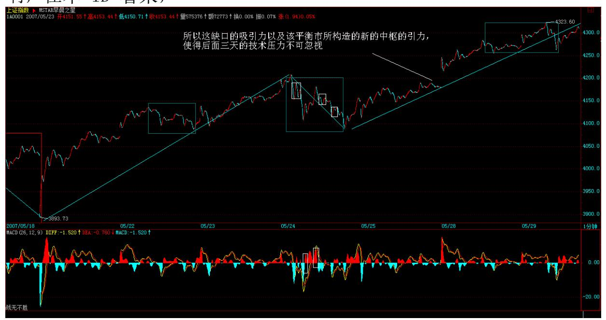
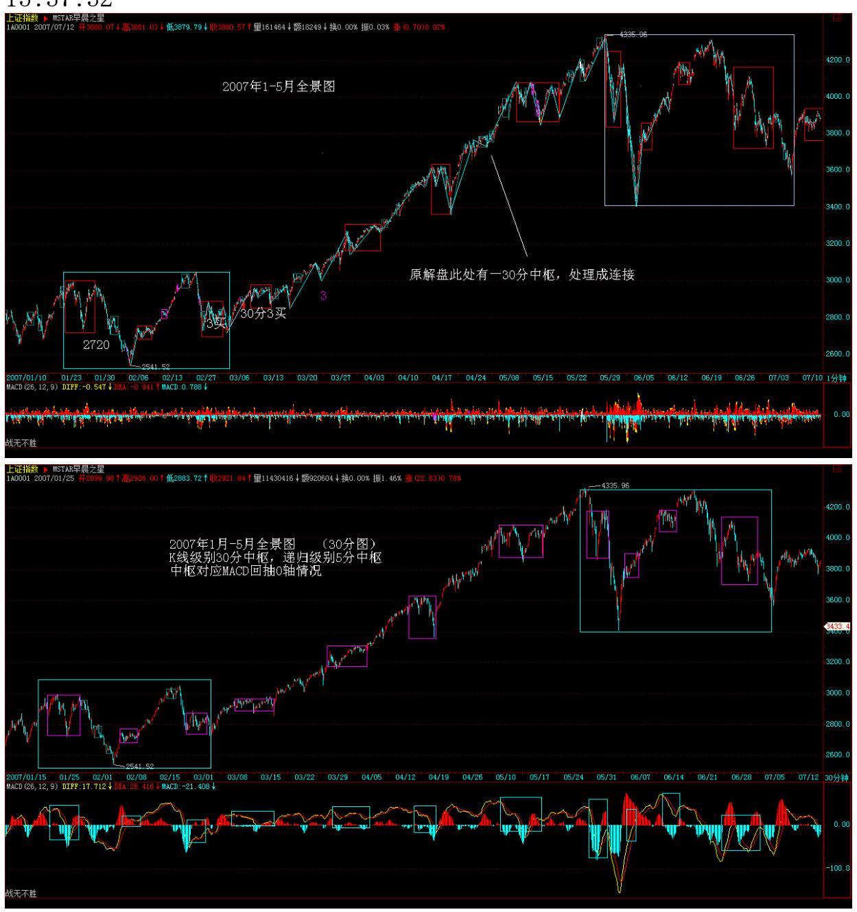

教你炒股票 55:买之前戏,卖之高潮

(2007-05-28 08:12:41)人的行为同构性,把性研究清楚,人的行为也 就略知一二了。股票买卖,不过是人的行为之一,当然也不例外。这 里极为严肃地讨论这个问题。

首先,先给股票定性别,为什么本 ID 总爱说股票是面首,因为他确 实是面首,他是他,而不是她,股票的性别是男的,所以难。难什 么?难在高潮之不可持续,高潮之后必有不应。而投资者应该是什么 性别,投资者应该是她而不是他,投资者的投资能力就应该如女性性 能力般可持续,无不应。以女"性" 可持续之洪大去折服男"性"不 可持续之弱小,这就是投资之道。

投资的关键就是女性,就是可持续,这与股票本身的男性,不可持续 构成了投资中最大的矛盾。投资之道,就是驾御面首之道,就是御男 之术,就是采阳补阴之方。采阳,要讲究其火候,火候太嫩,采之难 以成丹,太老,同样是废物,如果是阳气外泄,化为污浊之精,则更 是大煞风景。股票也一样,太早买入,一阳未生,则纯粹折腾,毫无 趣味;待到高潮之刻不能及时采补,则阳气尽去,污精尽泄,烂蛇死 鳝,反受其困。由于男"性"之不持续,则女"性" 采补之关键,就 是要取其精华,何谓其精华?一阳复始采之,阳极阴生弃之。用更通 俗的话说,就是买之前戏,卖之高潮。

买和卖,是不对等的,相应的策略也是不一样的,为什么?因为买卖 的前后状态是不同构的。在市场里,买是钱换筹码,卖是筹码换钱, 钱是与时间无关的,1 元,今天是,明天还是,只要还是钱,就是不 变的。而筹码不是,今天的筹码价值与明天的就不同,而筹码的数量 不变是没意义的,因为最终算的还是钱。而由于时间的不可逆转,因 此(钱-筹码)与(筹码-钱)这两个结构,就不是同构的。这道理十 分简单,谁都明白,但却是操作逻辑的基础,最基础的往往最简单。

因此,对于一个大级别的买的过程,或者说一个大的建仓过程,买必 然是反复的,买中有卖,不断灵活地根据当下的走势去调整建仓的成 本与数量,底部区域可以进行最复杂的中枢延伸与扩展,唯一的目的 只有一个,取得足够的、成本不断降低的筹码。这不一定和坐庄有 关,当然也可以相关。一个大级别的买的过程,某种程度上还兼备着 改造这股票股性的任务,而且这也是一条底线,也就是能顺利退出的 底线,在这个底部区域的股性改造中,也就是一个前戏的过程,没有 好的前戏,不会有好的高潮。注意,底部不一定就是在一个平衡的水

平线上中枢震荡,还可以是比较复杂的通道式上升,当然,一般来 说,这种通道都是斜率很小的,充满激烈的震荡,具体的以后再说。

一个好的、具有诱人前戏的买,当脱离底部区域时,其成本应该早在 该区域之下。而在大级别中枢上移中,只会减少成本,只有最愚蠢的 拉抬,才会增加其成本。其后的活动,本质上只是股"性"不断激 发,如同蜂王散发那诱惑引发那群雄蜂的追逐,这更如同一个壮观的 NP 过程,N 不断增大,各种裂口、188 长阳,将这 NP 活动推向高 潮。对于刚脱离底部的股票,第一次的高潮就如同一个淫乱狂欢夜的 序幕,只不过是为第二、第三、第四、第五、第六、甚至第10 次高潮 进行铺垫。第一次高潮后的不应期往往不长,但可能很猛烈,震荡很 激烈,不应期中还有继续高潮的冲力。这种股票,就如同刚被开发的 面首,只有第二、三次,甚至第四、五次的高潮才会渐入佳境。而一 个出色的卖,就是在那大级别高潮的后继乏力、背驰中退出,一个好 的庄家或大资金操作者,最好的状态就是在那大级别的最后疯狂中被 疯狂的雄蜂把货给抢光了,那种所谓筑平台出货的傻瓜,死去吧。

注意,本 ID 在上面是否正在进行一个 AV 的解说,这并不重要,重 要的是,股票就是这样每天现场直播着这 NP 级别的 AV。对于一般的 散户投资者,在一些较大级别的介入中,例如日线以上的介入中,并 不一定都要在第一类买点介入,因为,其后的前戏过程,并不一定是 一般的散户可以忍受的,一般地,可以在第二类买点出现后才考虑介 入,或者更干脆的,是第三类买点出现再介入。但如果资金有一定规 模,需要一定数量的筹码,或者要为以后的猎鲸活动储备经验,一个 至少从第二类买点开始利用部分前戏的介入是必须的,其中也要如大 资金一样,有利用前戏的震荡降低成本、增加筹码的必要。这有什么 好处?最重要的一个好处,就是熟悉其股性,一个前戏都不参与的, 怎么可能在后面的 N 次高潮与不应中得心应手?性,说白了就那么一 回事,所有人的基本运转模式都是一样的,也就是前戏-高潮的模式。 股票也一样,其运转的模式,归根结底,就是不同级别的中枢震荡与 移动的组合最终构成相应的前戏-高潮模式,都一样,但在一样之中, 每个股票都有其股性,涉及频率、幅度、形态复杂度等等,这些,对 于每只股票都是独特的,这也就是为什么,依据同一模式展开的走 势,却呈现千差万别的最终图形。

\*\*\*\*\*\*\*\*\*\*\*\*\*\*\*\*\*\*\*\*。

解盘及互动问答:

缠师:周末没什么消息,憋了两天的能量在今天爆发,所以就搞出一 个大缺口来,但其后的走势,并不是太强,依然只是一个平衡市,所 以这缺口的吸引力以及该平衡市所构造的新的中枢的引力,使得后面 三天的技术压力不可忽视。周四是月线收盘的位置,刚好也是缺口在 技术上需要三天考验的时间,所以后面三天,多空的搏杀将极为惨 烈。

大的方面看,4129 点的 1/2 线在六月份将上移到 4144 点,该线的 突破在日线上的回试确认并不能完全保证周线、月线上的回试确认, 从最严格的意义上,在月线上至少需要 3 个月才能确认该线的真正有 效突破。这就像 1-3 月份在 1/4 线时所呈现的走势一样。当然,最 理想,最强的走势就是,5 月收光头阳线,六月以下影线的方式是确 认该线的突破,七月继续长阳最终确认该突破的完全有效,但这只是 最理想的情况,市场最终并不一定能走出来。

政策方面,关于操纵的条例周末已经在报纸上有所暴光,说实话,这 条例才是一个真正的狠招,其中有些规定,对市场的格局有严重的影 响,在本 ID 看来,

189 这才是这两年来市场上飘来的真正的第一朵黑云,只是现在市场 中散户太多,一般反应比较迟钝,所以没什么感觉。由于该条例只是 一个草案,所以还有纠正的可能,下面,真正有意义的事情,就是对

该条例进行无情打击,深入揭发,让该条例中严重危害市场的条款不 能实施。如果大盘本月不能收出光头阳线,该条款以及今后几天的一 些政策面动态是主要的原因。但大家的心态要平和点,毕竟政策也是 市场合力的一部分,他们也不容易,就原谅他们吧。2007-05-28 15:37:32

190 离月线收盘还有两天,这两天极为关键,今天全天在昨天的中枢 之上,因此技术上没有任何问题。今天走的是前三个 30K 的高低点都 被打破的平衡市,明天要考验 4323 点早上高点的支持,如果不有效 跌破该位置,大盘就超强,跌破,则形成新的中枢,该中枢基本以

4300点为中线,然后又是中枢震荡直到第三买卖点出现的游戏。2007- 05-29 15:31:36191 192 1. 新浪网友:缠姐,一个困惑多日的问题, 第三类买卖点后中枢的构成应该是从哪段开始计啊?构成第三类买卖 点的那段开始?还是+1 段开始? 2007-05-28缠师:你必须先了解结 合律,中枢(C)=(A)+(B)里,前面 A 一个必须依然满足该级别 中枢的定义,B 满足次级别的定义而且是完成的,然后再看回试那一 段是否次级别完成,这样就能确认第三类买卖点。2007-05-28 15:55:28

#### \*\*\*\*\*\*\*\*\*\*\*\*\*\*\*\*\*\*\*\*。

- 2. 网友大盘:能不能把中枢(C)=(A)+(B)和这段话稍微再解释 一下,有点不太明白。2007-05-28 16:44:32网友袖手旁观:(A)要 满足本级中枢定义,就是说至少三段次级别走势的重合已经完成;
- (B)是次级别离开的走势,当然还在三买前面,所以还是整个中枢
- (C)的一部分。缠 mm 的意思应该是分解组合的时候要注意,(B) 做为离开的次级别走势分解出来的时候,中枢(C)剩下的部分(A) 要满足本级中枢的定义,然后如果(B)之后的次级别回试不破,即可 确认三买。

这个回答重在说如何定位三买,似乎跟提问者的重点不同,因为提问 是三买后的下一个本级中枢从哪段开始——这个提问本身倒也确实不 用回答,按缠 mm 思路,一定认为中枢定义已经是确认中枢的全部依 据。2007-05-28 18:43:13

#### \*\*\*\*\*\*\*\*\*\*\*\*\*\*\*\*\*\*\*\*。

3. 网友雪狼:博主你好!辛苦了!"当行情当下走到 d4 点时,根据 上面的原则,无非有下面两种可能的分解:g0d4= g0d1+

(d1g1+g1d2+d2g2)+g2d3+d3g3+g3d4=g0d1+d1g1+g1d2+

(d2g2+g2d3+d3g3)+g3d4" 请问博主:当行情当下走到 d4 点时, 该选择 g3d4 和那段比去判断盘整背驰没有?我的理解是如果按 g0d4= g0d1+(d1g1+g1d2+d2g2)+g2d3+d3g3+g3d4分解就用 g3d4 和 g2d3 比较对应的 MACD;如果按 g0d4=g0d1+d1g1+g1d2+

(d2g2+g2d3+d3g3)+g3d4分解就用 g3d4 和 g1d2 比较对应的 MACD。我的理解对吗?2007-05-28 15:54:37193 缠师:对的。这里, 无论是哪个,最终的结论都是 d4 点是背驰点,因此该点的意义就大 了。有时候会出现两种情况不一致,也就是后一段的力度刚好是前两

段的中间,这时候,可能的情况就是拉回满足那种分解的最低幅度, 而不一定到达不满足那种分解的最低幅度。

具体的以后课程里会说到的。2007-05-28 16:04:26

#### \*\*\*\*\*\*\*\*\*\*\*\*\*\*\*\*\*\*\*\*。

4. 网友水浴清蟾:我现在用 000900 学习妹妹的理论,进进出出好几 次了。上周五看出背驰,在 21.01 出了,但今天冲好高,我看的五分 钟的中枢,但这次判断失误,1000 股被套,现在已经 30 分钟背驰 了。不过,我基本空仓,手上只有 000900,所以还有机会把成本降下 来。2007-05-28 16:04:02缠师:一般来说,如果卖了没回补,最好别 养成追高回补的坏习惯。

抛了,在技术允许的情况下,一定要买回来,否则节奏就会乱,一旦 发现再冲高,再追,反而容易被套住。2007-05-28 16:08:09

#### \*\*\*\*\*\*\*\*\*\*\*\*\*\*\*\*\*\*\*\*。

5. 新浪网友:按《操纵市场指引》,行政部门权力太大又没得到制约, 麻烦大了!不受制约的权力对市场的危害最大。建议在指引中加入对调 查权使用的约定以及对调查结果审核\上诉\复核等方面的制约调查权 滥用的条文。2007-05-28 16:06:39缠师:还有很多条款过于严格,根 本没可操作性,本 ID 当然也会通过影响去修正这事。但这种事情, 必须要有大家的努力,否则最后害的是所有的人。2007-05-28 16:14:06

#### \*\*\*\*\*\*\*\*\*\*\*\*\*\*\*\*\*\*\*\*。

6. 网友卖错了吗:昨天在 1358 卖出 777,因为判断为第三卖点,怎 么后面的走势完全不是呢?真郁闷。LZ,我的判断错了吗?2007-05- 28 16:13:52缠师:无论 000777 与 600777,你的判断都错了。请你 先把定义搞清楚。连中枢都没脱离,哪里有第三类卖点?2007-05-28 16:25:10

#### \*\*\*\*\*\*\*\*\*\*\*\*\*\*\*\*\*\*\*\*。

194 7.网友大盘:请问博主:关于第 3 类买卖点的一个疑惑。次级别 盘整(盘整背驰)离开+次级别盘整(盘整背驰)回抽不破前面本级别

中枢高点 ZG 可以算作 3 买吗?2007-05-28 16:06:06如果博主觉得 看网页麻烦,我的问题可以简化为:1) 一个日线中枢3 段结束后, 跳空离开中枢最高点,然后逐渐扩展成第 2 个日线中枢,并且跳空后 的第 2 个日线中枢每段都是只有一个 30 分钟的盘整走势,那么第一 个日线中枢有 3 买点吗?2) 3 卖点允许次级别盘整离开+盘整返回 这种组合吗?2007-05-28 16:15:20缠师:只要是次级别的就可以,关 键不是这里,而是结合律,必须要括弧里的都满足定义。具体在上面 回答相关问题里有。详细的以后课程里有。2007-05-28 16:28:12

#### \*\*\*\*\*\*\*\*\*\*\*\*\*\*\*\*\*\*\*\*。

网友大盘:总是一贯的语言风格,解读起来不容易。博主似乎是认可 只有一个次级别中枢的次级别走势向上离开本级别中枢并完成后,仍 然以一个只有一个次级别中枢的次级走势完成后,不破本级中枢高点 就形成 3 买。也就是说博主似乎认可 zs9-htm 网页图中的 b10 为第 3 买点,博主是这样的意思吗?帮忙分析一下。2007-05-28 17:03:33 网友袖手旁观:"只要是次级别的就可以。"——这应该是正面回应 盘+盘组合。我印象里应该有大量的举例,其实都是次级盘整离开+次 级盘整回试的。可能因为你这句话没突出强调两个都是盘整,缠 mm 都没注意到提问的出发点应该是定理后面对走势组合的规定。

三种走势组合那句话我也很好奇,不过次级盘整离开这一段很容易向 前组合成次级趋势离开,只要本级中枢有延伸基本都可以。但是理论 上我也同有此问,因为你提到的两条定理本质上是一致的,只是阐述 的角度一个从运动规律的角度、另一个从买卖操作的角度。

至于两个中枢中间是跳空,并不妨碍在第二个中枢里按定义找到三 买。跳空是最低级别走势,把跳空段组合到后面的次级别走势里就行 了。2007-05-28 18:23:00网友缠途漫漫:问题 2 已得到博主肯定回 答。其实仔细看看 36 课的例子,再对照定义,很明确的。关键是结 合律,通过结合律,三买可以在不同的位置,趋势也可以被分解,跳 空也可以向前或向后结合出次级别走势。博主上面回答的一个关于三 买的问题,大致如袖手所解。2007-05-28 22:12:36195

#### \*\*\*\*\*\*\*\*\*\*\*\*\*\*\*\*\*\*\*\*。

8. 网友远帆:每次根据一分钟或五分钟线在三卖的时候抛出做 T+0 想把成本降下来,可是就是降不下来,就是降下来也不够手续费,结

果成本越做越高,缠主说说这怎么办?2007-05-28 16:20:26缠师:那 证明你的通道、技术等都不满足用 5 分钟以下级别操作,就把级别放 大操作。2007-05-28 16:29:40

#### \*\*\*\*\*\*\*\*\*\*\*\*\*\*\*\*\*\*\*\*。

9. 白玉兰:现在深刻理解小资金不要参与盘整的重大意义,我买了北 京人后,机会成本都无法计算了。2007-05-28 16:29:34缠师:对的, 一定要根据自己的实际情况来,资金量、通道、操作时间等是决定你 操作风格和操作级别的,一定要自己选择好。2007-05-28 16:31:01

#### \*\*\*\*\*\*\*\*\*\*\*\*\*\*\*\*\*\*\*\*。

缠师:在某一级以上的,今天应该已经收到一些东西,具体的本 ID不 能说,内容当然也是和调控股市有关的,估计这几天就会出来了。

但这些警示性的东西有多大作用,就看市场反应了,这也刚好配合了 技术面上的要求。

本 ID 晚上要见些人,不能陪各位了,先下,再见。2007-05- 2816:36:07两年来股市晴空飘过的第一朵黑云(2007-05-29 08:16:51) 关于《操纵市场指引》草案周末已经在报纸上有所暴光,说实话,这 指引若被实施,绝对是针对目前市场一个真正的狠招,其中有些规 定,对市场的操作格局有着严重影响,如果说以前加息之类的玩意不 过是向烈日的天空吹了口气,那么,这指引,才是两年来股市晴空飘 过的第一朵黑云,只是现在市场中散户太多,一般反应比较迟钝,没 什么感觉,把一个真正的隐患给忽略了。

196 先回顾一下历史,2001 年股市的历史大顶,就是在亿安科技那轰 动市场,空前绝后的近 9 亿罚单后引发的,当然,市场的最终反应有 所迟缓,那是正常的,因为一个突然的事件,让市场有一个理解、反 应的过程,是很正常的,别以为市场就能够最快速最充分反应的,市 场往往特别地迟钝。

不妨摘抄两条这闭门造车的所谓指引里的无聊条款:"在一个交易日 交易某一证券两次以上,或在两个交易日交易某一证券三次以上,即 构成连续买卖。"("最重要的,按照新的认定指引,没有成交的买 卖申报也可以算做连续买卖;再比如约定交易,只要双方买入申报和 卖出申报的价格相近,就可以构成该项操纵的条件。")如果上面句

子正描述某面首或者指引草拟者的生理状态,那么本 ID没什么意见, 但用来规范市场每一个人的行为,那就不行。首先,市场的参与者并 不都是面首,就算是面首,也不一定就是一天不能两次、两天不能三 次的超级弱男,这条款有超级严重的重男轻女倾向,而且重的还是弱 男,简直太过分了。

说点实际的,如果你当天要买 1 万股,结果 9 元没买着,然后撤单 9.01 元再买,这就构成连续买卖?或者说,当天要买 100 万股,分 10 张单,那就更是连续买卖了?难道买 100 万股,只能填一张单, 还不能撤单,那一定能买到?那么还不如干脆规定每天买卖不能超过 多少股算了。难道以后买卖股票都只能每天一单,而且只能一个固定 的价位,因为按照这个垃圾指引,在不同的价位填单就已经违规。显 然,制订所谓指引的人不仅下半身功能有可疑之处,上半身功能已是 无可质疑地极端可疑。

"同一交易日内,在同一证券的有效竞价范围内,按照同一方向,连 续、交替进行三次以上频繁申报和撤销申报的行为将被认为是"虚假 申报操纵"。" 制订这条款的人大概从来没有交易过股票,就算是一 个散户,如果一股票突然拉起来,他要去追买,连续三次都买不着都 要撤单重新填高价位去买,这种情况难道很不常见吗?此外,这指引 不是标榜自己如何如何细化吗?那么什么叫频繁?1 秒还是 1 分钟? 如何是 1 分钟,那么 61 秒就不频繁了?申报和撤消难道不都是交替 的,难道可以不申报就可以撤消?买的申报撤单后难道为了不同一方 向,就只能进行卖的申报?这种无聊的指引就如同在某类活动中规定 只能男上位一样极端地无耻。

本 ID 对这类无聊指引的态度很明确,由于这关系到根本的市场交易 制度,本 ID 不喜欢这种规定只能男上位的垃圾制度,因此,一旦这 种制度被实施,本ID 将彻底离开这个市场。本 ID 挣的钱,够花天酒 地、天天换面首,玩个一百几十辈子了,凭什么受这份鸟指引的鸟束 缚?而且世界那么大,全世界的市场都没有这样的垃圾指引,本 ID去 哪里不一样挣钱?一定要一棵树吊死?或者本 ID 干脆就转玩文化圈 子,把什么孔男人、李男人之类的砸成个面首之膜简称面膜算了。

197 更重要的问题是,这个无聊的指引,最终必然堕落为权力寻租的 有力工具,指引越细化,这工具越有力。说实话,这些破指引,最终 都是杀鸡给猴看,和本 ID 都毫无关系,你说狮子、鳄鱼会看这类把

戏吗?不过,本 ID 看不起这种无聊游戏后的无聊勾当和无聊后果, 这种无聊把戏为了什么,这就更不用本ID 说了。

由于该条例只是一个草案,所以还有纠正的可能,下面,真正有意义 的事情,就是对该条例进行无情打击,深入揭发,让该条例中严重危 害市场的条款不能实施。别以为这事情和散户没关系,你看看你自己 平时的操作中,有多少次违反了上面的规定?还有更多更无聊的规定 本 ID 都没有援引,上面这两条一般化的已经够恶心的,本 ID 都不 想把各位恶心掉了。 当然,必须明确的是,黑云不等于一定有暴雨, 但黑云晃荡在这明朗的天空中,确实够恶心。而即使在这种交易条件 下,本 ID 的理论依然有效,只是相应的操作级别必须大幅度提高。

站在纯技术的角度,管他什么风什么雨,一切尽在操作中!但本 ID 还是不得不提醒,股票都是废纸,如果你在股票中已经获得利益,那 首先去改善自己的生活条件,去孝敬那些值得孝敬的人,本ID 看到昨 天帖子的有博友"白玉兰"说拿钱出来买房子给父母,那就是很好的 事情。赚钱不花,当守财奴,脑子有水呀?先把自己以及家人的生活 安置好,把本金拿出去,用股市挣的钱继续股市的游戏,这样无论那 天空有多少黑云,多少风雨,你都可以毫无顾忌了。

#### \*\*\*\*\*\*\*\*\*\*\*\*\*\*\*\*\*\*\*\*。

缠师:公告一下。现在有了纸条箱,如果各位有技术上的问题,最好 是比较典型的,然后把图的地址告诉本 ID,本 ID 就可以在课程里很 仔细地讲解,这样效果好点,而且也可以惠及所有人。2007-05- 2915:40:42

#### \*\*\*\*\*\*\*\*\*\*\*\*\*\*\*\*\*\*\*\*。

10.网友 忠实的粉丝:楼主您好,我每天上您这儿已成了必修课了, 也越来越觉得"见"您一次越来越难了,努力潜水之余今天我厚着面 皮冒泡求救:由于技术没学好,前段时间跟风试着找了一个业绩相当 差走势看似强劲的 000506,请问现在是否退市了?它还会有复牌的机 会吗?谢谢!2007-05-29 15:41:38缠师:你说的是原来的川盐化?这 股票要停很长时间,但有重大重组,等着数钱吧。2007-05-29 15:46:43

198 11. 网友水房姑娘:缠 M,不是我们语文学得不好,是这篇暗示 太强烈。光看标题"两年来股市晴空飘过的第一朵黑云",等于是有 第一博客以来的第一次看空。2007-05-29 15:44:17缠师:这个比喻很 明确,本 ID 还在文章中特意说明,黑云不一定就有暴雨。但这朵黑 云是否最终引发暴雨,就看大家的努力了。不过,在目前的状态下, 把本金以及一些该消费的钱逐步兑现提出去,是一种必须的做法。一 旦这都拿出去了,你的操作将更加无所顾忌,才更安全,更有效果。 2007-05-29 15:50:24

#### \*\*\*\*\*\*\*\*\*\*\*\*\*\*\*\*\*\*\*\*。

12. 赚到了:"先把自己以及家人的生活安置好,把本金拿出去,用 股市挣的钱继续股市的游戏,这样无论那天空有多少黑云,多少风 雨,你都可以毫无顾忌了。"哎,缠 MM,我是看了上面的话,理解错了, 清仓了。现在怎么操作呢? 2007-05-29 15:45:18缠师:这话不写得很 明确?本 ID 说话,除了个股不方便明说,什么时候不是直接了当 的?如果真要各位清仓,就会明着说。这里说得很清楚,可以先把本 金拿走,把该消费的钱拿走。至于清仓了,也无所谓,反正震荡多的 是,不怕没机会拿回来,但关键是你的资金一定要安全,没有其他顾 忌的。2007-05-29

#### \*\*\*\*\*\*\*\*\*\*\*\*\*\*\*\*\*\*\*\*。

13. 网友空读:博主:向上突破中枢后,形成三买还是顶背驰或者盘 背,如何在最高点附近判断出来?常常买前看着象三买,买了看着象头 部。2007-05-29 15:49:11缠师:各位首先一定要把级别定好,像今天 早上的高点,是一个级别很小的,在 1 分钟图上不难发现。后面一个 3 波的下杀,并没有击破昨天的中枢,等于是对昨天中枢的回抽确 认,这就可以回补高位抛出的筹码了。当然,这都是很短的操作,没 这操作能力的,就看 5 日线。这反复说了。2007-05-29 16:04:32

#### \*\*\*\*\*\*\*\*\*\*\*\*\*\*\*\*\*\*\*\*。

14. 网友新股手:"如果真要各位清仓,就会明着说。"有了老大这 句话,我吃了定心丸。我再也不做空仓的傻事了。手握筹码,参与市 场。2007-05-29 16:04:01缠师:什么时候清仓,就是日线出现背弛, 现在日线有背弛吗?现在的,最多就是一些 30 分钟的背弛,这些, 完全用中枢震荡等处理就可以。2007-05-29199 15. 网友白玉兰:妹

妹好!今天刚上来,看到妹妹用宝贵的资源表扬我,很汗颜,因为做 得还不够好。我只是卖了 999 和赛迪传媒。

不过买了 2000 股 139的,我可没有全逃掉,还有北京人,山东环 保。2007-05-29 16:06:54缠师:如果把该拿的都拿走的,余下的就更 可以放心操作了。那样,拿走的钱,很快就会回来的。2007-05-29 16:08:35

#### \*\*\*\*\*\*\*\*\*\*\*\*\*\*\*\*\*\*\*\*。

缠师:补充一句,空仓的,千万别追高!一定要利用震荡的低点再介 入,否则会左右嘴巴。操作,一定要冷静!有钱,什么都有,还怕没 有好股票?2007-05-29 16:17:56从容面对突发事件是投资的基本素质 本 ID 虽然在大牛市的序幕,还未真正拉开说过,"5 月,是 1429点 以来的 180 个月,360 的一半,一个极为重要的时间之窗,其后,不 发生点事情,显然是不可能的";虽然前天已说过:"在某一级以上 的,今天应该已经收到一些东西,具体的本 ID 不能说,内容当然也 是和调控股市有关的,估计这几天就会出来了",昨天更劝告"如果 你在股票中已经获得利益,那首先去改善自己的生活条件,去孝敬那 些值得孝敬的人。赚钱不花,当守财奴,脑子有水呀?先把自己以及 家人的生活安置好,把本金拿出去,用股市挣的钱继续股市的游 戏",但本 ID 绝对不会说关于早已传闻的印花税增加在今天凌晨公 布的准确时间,本 ID 已事先知道。

显然,这事情公布的最终确认就在昨晚,所以各位也没必要拿 23 日 管理层的澄清说事,更不能说管理层朝令夕改,毕竟 30 日和 23 日 已经相隔一周了。这种凌晨才发布的消息,在中国证券历史上也算开 先河了。这里,首先必须表扬管理部门目前的操作程序与保密级别上 比以前有了很大的进步,这对市场的所有参与者更加公平;其次,这 政策本身也符合目前管理部门的认识水平;最后,收到的钱应该多照 顾几个该照顾的人,这也算是大牛市对全中国贫苦人的一点贡献。所 以,对该政策,本 ID 没什么意见,该来的都要来的。至于政策市这 样的帽子,本 ID 觉得没必要给他们戴上。毕竟,提高税收,并不是 中国才有的事情,这比那什么指引要强 10000 倍,那才是本 ID 最反 感的。

好,现在回到具体的操作上。首先必须再次明确,要改变大牛市性质 的只有经济的倒退,否则都不过是造成市场不同级别震荡的诱因,一

个正确的操作,足以应付。其次,面对突发事件,仓位、成本控制比 较重要,这也是本 ID 为什么反复强调股票是废纸,必须成本为 0 的 原因。因为突发事件,本来就是市场中不可避免的。一个良好的操作 习惯,足以应付任何突发事件。一个成本为 0 的筹码,是应付突发事 件最好的工具。

200 在投资市场上,必须大气点,无论这次震荡的级别有多大,你走 了没走,都不过是一个小事情。走了不是胜利,没走也不是末日,关 键的是你正确的操作习惯与长期的坚持。1996 年 12 月,连续的跌停 后,市场最终 5 个月后依然重新创出新高。1987 年的美国股市大 跌,在现在看来,只不过是在山脚上的一次小颠簸。从容面对突发事 件,这才是投资的基本素质。

技术上,这几天反复强调的月线收盘将引发多空相争的惨烈,当然也 包括政策面这市场合力之一。相应的分析依然有效,如果月线留下长 上阴,则 6 月份调整压力就大了,显然,管理层也知道这技术上的意 义,在这最关键的最后两天出手。这里,必须表扬一下管理层,不像 以前一样一点技术都不懂了。站在大的技术层面,本来那关键的 1/2 线就需要更多的考验,该线将至少影响 3 个月走势的结论依然有效, 而那三种模式的选择,现在依然没有最后确认。这里无须预测什么, 看图操作就可以。

附录三种模式:一、在该线(2\*1 线 4129)前止步或在该线上形成多 头陷阱进而形成一个大级别顶部; 二、突破该线并围绕该线进行强势 的、如 1-3 月在突破 1/4 线后进行的类似盘整,然后寻机突破。 (此类成现实)三、强力突破并远离该线后,以一个强势的回调来确 认对该线的突破,然后再展开对 3/4 线的攻击,目前该线的位置在 1429+270X15=5479 点。 本 ID 知道,昨天有人看了本 ID 的帖子阴 错阳差就清了仓的,有些把本金拿走了,这都很好。虽然这里有点阴 错阳差,但也算孝顺者得好报,这和本 ID无关。至于仓位依然比较 重,如果一直从低位守着均线等上来的,有足够多的利润空间,特别 成本已经是 0 的,就更无所谓了,只要按正常的操作,无论什么情 况,就算没在第一卖点走,也可以在第二、三卖点走,这没什么难 的。至于最近追高买股票的,那就得一个教训,然后才能刻骨铭心地 记住本 ID的话:股票都是废纸,必须选好级别买点买、卖点卖,把成 本降为 0,只有成本为 0 的股票才是真正安全的。

由于以后的交易成本大幅度提高,因此相应的操作级别必须大幅度提 高,最低的操作级别至少是 5 分钟甚至 30 分钟以上,至于按买点 买、卖点卖的原则永远不变。有了相应级别的买点,就要重新介入, 这一点是没什么可说的。短线技术上,30 分钟上本来就形成的顶背驰 段的区间套确认极可能因为这突发事件而被粗暴地确认,以此为起 点,参照其后相应的当下走势,去逐步确认今后的买卖点进行相应的 操作。

至于本 ID 的仓位,可以很公开地说,除了永远保持的协调应急保证 金,目前大概是 70%仓位成本为 0 的老股票,还有 5%是新建仓的新 股,其余 25%都是现金。这两天本 ID 的减磅也有点阴错阳差,但都 不是为了这印花税,小部分是技术上的原因,大部分是为了那可恶的 指引,当然还有一点是为了本来知道也201 和各位暗示过的一些消 息,当然,那些消息的力度与印花税的这个不可比较。本 ID 的观点 依然如故:除非那可恶的指引被实施,否则本 ID 不会走人,至于减 磅这种活动,只要有卖点,本 ID 都会参加的,只是数量多少的问 题,但本 ID 会在适当的买点重新买入。

最后,把昨天的话重申并延伸一下,这也是本 ID 的一贯态度:但无 论如何,中国大牛市的格局是不会因此改变的,震荡级别越大,不过 提供降低成增加筹码的机会越大。至于本 ID 一直设计的剧本,依然 没有任何放弃和修改的理由,因为 3 之 3 已经走出来,这一段已经 比上一段的 1500 点要长了,符合最严格的理论条件,至于能否走得 更长,那并不重要。更重要的是,这个剧本已经给在 2000 多点开始 的参与者带来巨大的回报,这个回报已经锁定,成本已经为 0,谁都 抢不走,而这,又是展开新一轮行情的能量储备,该来的,必将要 来,现在需要的,只是等待买点的出现。

#### \*\*\*\*\*\*\*\*\*\*\*\*\*\*\*\*\*\*\*\*。

缠师:从今天的走势,就知道为什么本 ID 的理论里要分第一、二、 三买卖点。例如像今天这种突然的事情,可能让第一卖点给错过了, 但第二卖点是不会错过的。因此早上本 ID 专门提醒第二、三卖点 走,实际图形上,如果你认不出 05300947 这个第二类卖点,或者知 道没操作,那么学习就比较失败了,还要努力。本 ID 的理论是实战 的,在第二类卖点走,即使不知道什么消息,和高位比也差不了多 少,有些股票今天还新高,可以对照不同股票的图形感受一下第二类 卖点在这种突发事件中的实用之处。(此段在 56 课中虎兄配了图

解,不过缺少后面文字部分。)对一个操作者来说,不要这么多抱 怨,第二类卖点不走,那就是节奏错误,那后面就没有资金等待买 点,不过,市场的机会多了,经历一次这样的,也会得点经验。这 30 分钟的顶背驰压力,怎么都需要一个至少 1 分钟的底背驰才能有比较 有力度的反弹,而且还要参考 5分钟、30 分钟等的走势。真正的底部 构筑,必须让这些级别的图形重新走出买点来。

长线看,本 ID 说那 1/2 线,还是对大盘有着极大的吸引,深圳对应 的线在 13700 点,没有突破,因此,上海对该线的走势就更有指导 性。5 月份这 180 月时间之窗的压力,同样构成了今后行情发展的最 主要技术压力。目前的调整是针对 2 月 6 日 2541 点上来 1800 点 上涨的,这是必须明确的。

从中枢的角度,一个 30 分钟顶背驰,按理论的要求,重新拉回 5 月 8 日到 5 月 21 日构成的 30 分钟中枢,因此,可以继续参照该中枢 来考察今后的中枢,可以中枢震荡的观点进行。

对于短线有能力的,可以参照短线指标回补第二卖点卖掉的股票,然 后进行中枢震荡操作。本 ID 的所有观点,没有任何变化,就不多说 了。(2007-05-30 15:38:29)202

#### \*\*\*\*\*\*\*\*\*\*\*\*\*\*\*\*\*\*\*\*。

16. 网友两只老虎:神仙姐姐早上 7 点多开会,估计就是布置坐地板 的重要任务。不知道明天神仙姐姐将会怎么反击。今天几百只股票一 块儿坐在地板上玩的情景定会让中国又在全世界现了一次眼——也不 是第一次这样现眼了。2007-05-30 15:25:51缠师:有人喜欢丢人,本 ID 不妨可以附和。2007-05-30 15:41:38

#### \*\*\*\*\*\*\*\*\*\*\*\*\*\*\*\*\*\*\*\*。

17. 新浪网友:你妈妈的,每次你都是说得模棱两可的,怎么样你都 对,害得我帮你抬轿子!2007-05-30 15:30:05缠师:本 ID 这里说什 么都可以,没必要为这些事动气。关键把自己的操作琢磨好。例如, 如果今天能正第二卖点出掉,就是一个很好的实践经验,没有的,就 要好好总结,看是什么原因,心理的还是技术的。本 ID 这里要学会 的是实战,而不是磨嘴皮。2007-05-3015:46:42

18. 网友止水:强烈呼吁搏主删那些粗话骂人的帖子。没有人有义务 给你送钱来,没有独立思考的人没必要到这里来。象这种人,赶紧去参 加传销比较合适。"目前的调整是针对 2 月 6 日 2541 点上来 1800 点上涨的,这是必须明确的" 。这句话应该叫大多数人放心了,最多 就是热点转换的一个整理。搏主若能提示下后期板块方面的动向就更 好了,当然指后半年的。2007-05-30 15:48:25缠师:现在必须先统一 思想,在震荡中统一思想,就如同 3000 点下干的一样。调整并不是 什么坏事,对于技术好的,调整就是降低成本的好机会。另外,一旦 大盘稳定下来,个股机会将很多,下面与中报业绩好相关的个股会逐 步走强,技术上注意那些在这里大跌中形成第三类买点的个股。2007- 05-30

#### \*\*\*\*\*\*\*\*\*\*\*\*\*\*\*\*\*\*\*\*。

- 19. 新浪网友:三买能抗过大盘吗?我昨天买的三买的股票,今天还是 跌停了。2007-05-30 15:54:47203 缠师:你如果是一个 5 分钟的第 三买点,当然斗不过一个 30 分钟的顶背驰,如果是日线的,当然就 没问题。至于跌停的问题不是一个问题,实际的操作就是你如果没有 在第二类卖点走,那么就还要学习或磨练。这和什么卖点之后如何无 关。
- 20. 网友 LL:缠姐姐,我今早满的仓,您的课程太难了,一直没明 白,姐姐,我明天是应该割肉还是坚守阵地呀?2007-05-30 15:52:47 缠师:今天第二卖点怎么不走,这么明显,ABC 上去,C 段力度不 足,典型的图形。没走就等等,没必要杀跌,在后面的震荡找机会把 仓位控制下来。现在半仓是比较好的,进退自如。2007-05- 3015:56:36
