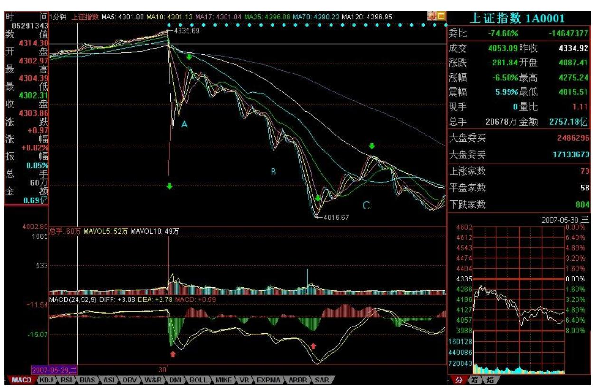
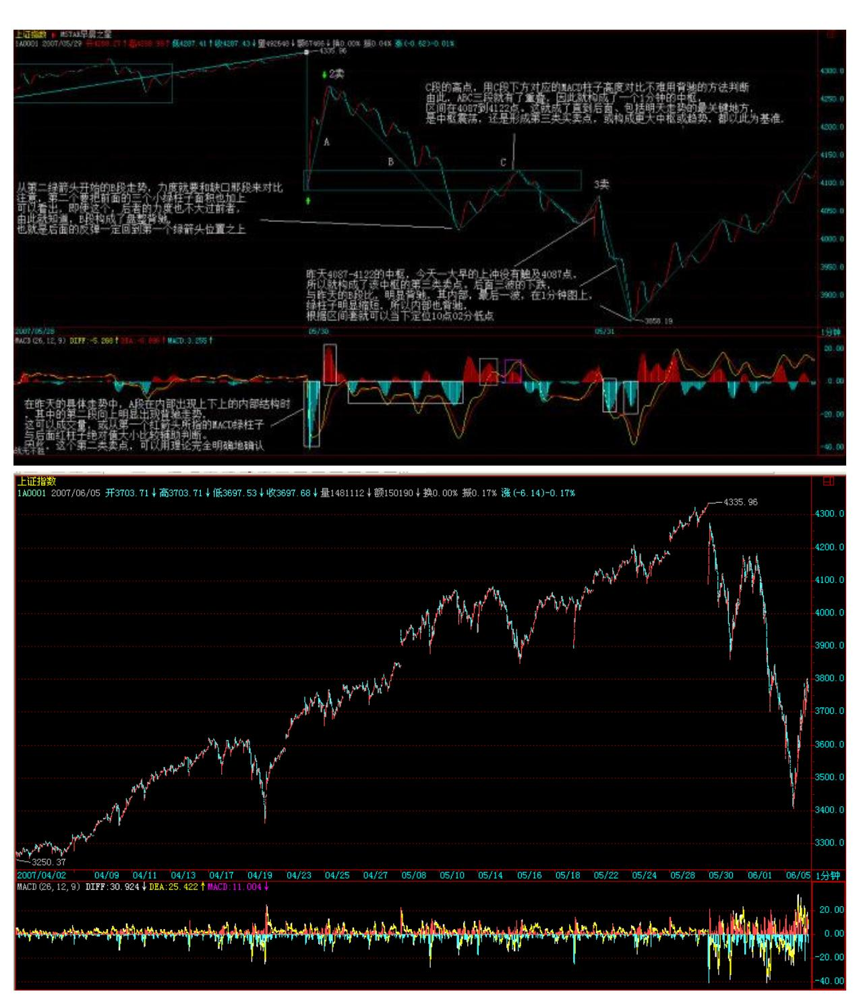
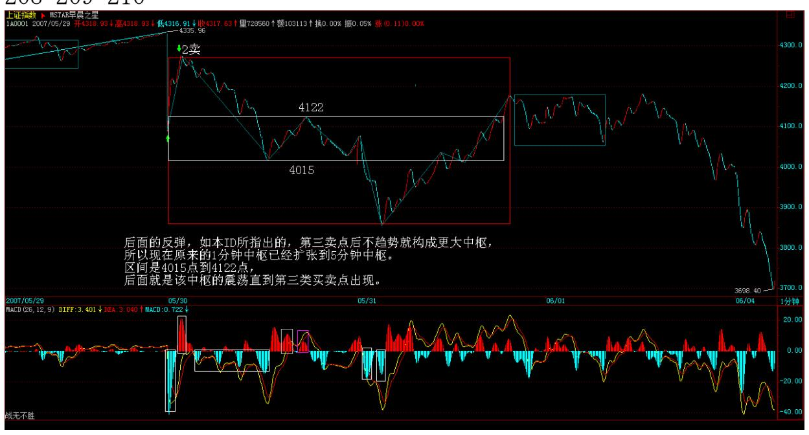
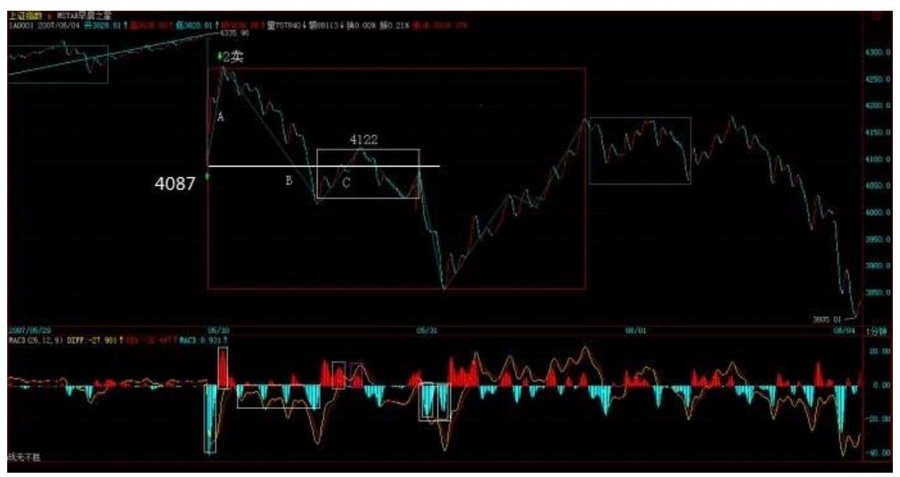
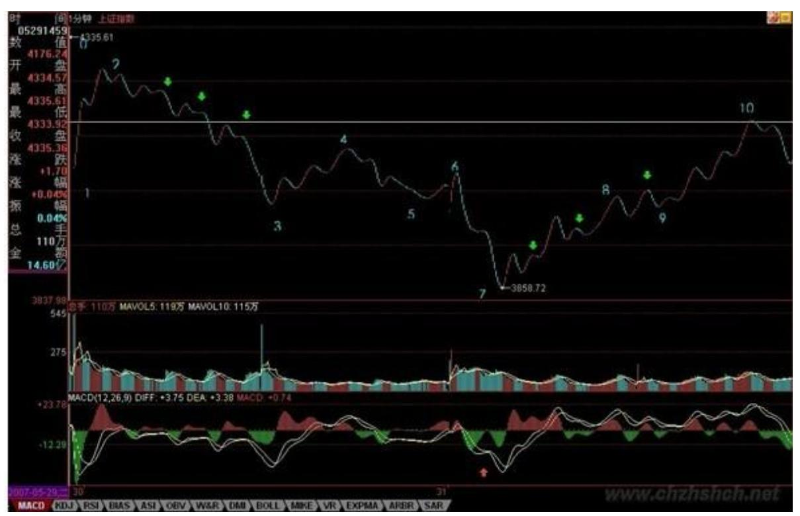

# 教你炒股票56: 5.30印花税当日行情图解-图解分析示范(一)

(2007-05-30 22:49:10)本来不想说股票的,但知道现在说其他,大多 数人也反应迟钝,被股票所迷惑了,所以还不如将错就错,就继续股 票一把,说说昨天这530 印花税当日行情如何去当下地分析。

本来这个问题十分简单,而且本 ID 一大早 7 点不到就发帖子提醒要 在第二、三卖点把仓位减掉,很高兴看到不少人都能发现 9 点 48 那 第二类卖点。注意,为什么同时强调第三类卖点,因为有些特别弱的 股票,可能就是一个第三类卖点,大盘的走势是一个平均走势,而且

当天比很多个股都强,所以大盘是第二类卖点,并不意味着个股是第 二类卖点。

很多人大概到现在都不明白为什么本 ID 的理论中要有三类卖点,其 实,第二类卖点除了在小级别转大级别上比第一类卖点优越,在一些 特殊的突发情况下,就是最佳的卖点。例如这次,就是一个很好的例 子。因为 529 那天,虽然 30 分钟明显进入背驰段,但由于当天尾盘 是高收的,所以用区间套定理并不能确认当时就是背驰了,毕竟还有 第二天的走势。而晚上的突发消息,使得这个背驰被立刻确认,这时 候,第一类卖点已经不可能在实际操作中存在,那么,唯一可以进行 操作的,只能是第二或第三类卖点。这,在开盘前就可以有一个确 定,也就是说,一旦大幅度低开,现实的、能被理论完全保证的卖点 就是第二类或第三类卖点。

205 206 上图就是昨天走势的 1 分钟图。缺口,被看成最低级别的, 而 1分钟以下级别,在 1 分钟图上,被看成没有内部结构的线段,所 以缺口和 1 分钟以下级别在 1 分钟图上是同级别的。图上绿尖头都 指着两个 1 分钟以下级别的分界点,两相邻绿箭头之间都是 1 分钟 以下级别的走势类型。其中 B 段,看似要形成3 个 1 分钟的中枢, 但由于每一个的第三段其实都是向下倾斜下去的,其实都是第二段向

下的一部分,不能算是形成中枢。昨天走势其实就这么简单,就是 5 个 1分钟以下走势类型的组合。(娇注:后期分段定义后相当于此文中 5分钟级别以下当成线段)显然,这第一段的 1 分钟以下级别走势类 型是以向下缺口的形成构成的,根据第二类卖点的定义,就知道,一 旦一个 1 分钟以下级别的向上过程不能创新高或背驰,都将构成第二 类卖点。因此,当图中 A 段走势出现时,一个构成第二类卖点的走势 就当下地形成中。

有人可能有疑问,那怎么知道这 A 段一定构成第二类卖点而不是直接 创新高强烈上升,这很简单,具体的方法和区间套定理是一样的,就 是看 A 段的内部结构,一旦内部出现背驰而当时位置没创新高或与前 面走势产生盘整顶背驰,那么就一定是第二类卖点。在昨天的具体走 势中,A 段在内部出现上下上的内部结构时,其中的第二段向上明显 出现背驰走势,这可以成交量,或从第一个红箭头所指的 MACD 绿柱 子与后面红柱子绝对值大小比较辅助判断。因此,这个第二类卖点, 可以用理论完全明确地确认,一点含糊的地方都不会有。如果当时当 下不能明白,那就要抓紧学习了,因为这个问题确实太简单了。

第二类卖点后,从第二绿箭头开始的 B 段走势,其力度就要和缺口那 一段来对比,比较 MACD 上两个红箭头指的绿柱子面积,注意,第二 个要把前面的三个小绿柱子面积也加上,可以看出,即使这个,后者 的力度也不大过前者,由此就知道,B 段构成了盘整背驰,也就是后 面的反弹一定回到第一个绿箭头位置之上。(注意,这里是 1 分钟以 下级别的力度对比,只需要比较柱子面积,如果是 1 分钟级别的,就 要同时考虑黄白线回抽 0 轴的情况。)而后面 C 段的走势也证明了 这一点。此外,C 段的高点,用 C 段下方对应的 MACD 柱子高度对比 不难用背驰的方法判断。由此,ABC 三段就有了重叠,因此就构成了 一个1 分钟的中枢,区间在 4087 到 4122 点。这就成了直到后面、 包括明天走势的最关键地方,究竟是中枢震荡,还是形成第三类买卖 点,进而构成更大中枢或趋势,都以此为基准。而这是被理论所当下 严格保证,毫无可以含糊的地方。

有些更细致的地方,其实还可以说的。例如,C 段的高点,没有重回B 段内部最后一个反弹的启始位置,这并不违反理论,因为在 B 段内 部,最后一段向下并没有背驰,他的转折,完全是小级别转大级别造 成的(由于级别太小,可以从柱子的缩短参考看出),这自然就不一 定能回到最后一个反弹的启始位置。而在 B 段内部,从绿柱子一个比 一个面积大,就知道前面的向下都不会形成背驰而使 B 段结束,因此

就可以当下地等待最后跌破 A 段低点,形成 B 段与缺口段的盘整背 驰。这个例子说明,一个大的盘整背驰段的内部结构,完全可以不必 有该级别的背驰,完全可以小级别转大级别,昨天的图上就有这样一 个标准的例子。

实际操作中,第二类卖点后,B 段盘整背驰造成的买点是否要参与回 补,这和你的操作级别有关,如果是股指期货,这对应的是 100 点的 空间,当然是可以参与的,但由于 T+0,而且现在交易成本提高了, 对于股票是否参与,这就与你实际操作的股票有关了,这必须根据自 己的情况灵活处理。但只要你明207 白了小级别的情况,大级别的操 作是一样的,而且大级别的安全性、可操作性更高,操作的频率也更 低而已。本 ID 说这里的例子,只是让大家对理论能更清楚地了解。

附录:明白了上面的文章,今天的走势如果都不能把握,那就要继续 加班学习了。昨天 4087-4122 的中枢,今天一大早的上冲没有触及 4087点,所以就构成了该中枢的第三类卖点。后面三波的下跌,与昨 天的B 段比,明显背驰,其内部,最后一波,在 1 分钟图上,绿柱子 明显缩短,所以内部也背驰,根据区间套就可以当下定位 10 点 02 分低点。这是本 ID 理论中最简单的技术的,如果今天没能这样的分 析的,请好好研究补习。

后面的反弹,如本 ID 所指出的,第三卖点后不趋势就构成更大中 枢,所以现在原来的 1 分钟中枢已经扩张到 5 分钟中枢。区间是 4015 点到 4122 点,后面就是该中枢的震荡直到第三类买卖点出现。

就这么简单,一点难度都没有。

大方面看,本 ID 反复强调的 1/2 线,依然是最重要的位置,大盘的 强弱,以此为标准。目前,该线刚好在这次大震荡的中间位置上,由 此就知道该线的意义有多大。在 5 月初的文章里已经明确说过,该线 至少要管大盘 3 个月,这观点不变。

今天的月线收盘,已经足够好了,至少上影线不太长,比最恶劣的倒T 要好多了,因此下月,至少有了很大的画图回旋的余地。注意,最近 的行情,又将以质优的一、二成分股为主,三线股一定要等到大盘基 本稳定下来,才会慢慢恢复元气。但明天和周一,今天反弹比较弱 的,会逐步表现,这和轮动是一个道理。

明天是周五,消息面又成了最大的心理压力,整个市场震荡要稳定下 来,要等到下周了。当然,这种大幅震荡,就是本 ID 理论的天堂, 在这里可以得到比单边更大的利润。注意,别以为本 ID 的理论只会 震荡,而是该震荡的时候震荡,该单边的时候单边,这都不明白,就 白学了。

\*\*\*\*\*\*\*\*\*\*\*\*\*\*\*\*\*\*\*\*。

#### 解盘及互动问答:

#### \*\*\*\*\*\*\*\*\*\*\*\*\*\*\*\*\*\*\*\*。

缠师:从今天的走势,就知道为什么本 ID 的理论里要分第一、二、 三买卖点。例如像今天这种突然的事情,可能让第一卖点给错过了, 但第二卖点是不会错过的。因此早上本 ID 专门提醒第二、三卖点 走,实际图形上,如果你认不出 05300947 这个第二类卖点,或者知 道没操作,那么学习就比较失败了,还要努力。本 ID 的理论是实战 的,在第二类卖点走,即使不知道什么消息,和高位比也差不了多 少,有些股票今天还新高,可以对照不同股票的图形感受一下第二类 卖点在这种突发事件中的实用之处。(2007-05-30 15:38:29)211 大 方面看,本 ID 反复强调的 1/2 线,依然是最重要的位置,大盘的强 弱,以此为标准。目前,该线刚好在这次大震荡的中间位置上,由此 就知道该线的意义有多大。在 5 月初的文章里已经明确说过,该线至 少要管大盘 3 个月,这观点不变。

今天的月线收盘,已经足够好了,至少上影线不太长,比最恶劣的倒T 要好多了,因此下月,至少有了很大的画图回旋的余地。注意,最近 的行情,又将以质优的一、二成分股为主,三线股一定要等到大盘基

本稳定下来,才会慢慢恢复元气。但明天和周一,今天反弹比较弱 的,会逐步表现,这和轮动是一212 个道理。

明天是周五,消息面又成了最大的心理压力,整个市场震荡要稳定下 来,要等到下周了。当然,这种大幅震荡,就是本 ID 理论的天堂, 在这里可以得到比单边更大的利润。注意,别以为本 ID 的理论只会 震荡,而是该震荡的时候震荡,该单边的时候单边,这都不明白,就 白学了。2007-05-31 15:58:38

#### \*\*\*\*\*\*\*\*\*\*\*\*\*\*\*\*\*\*\*\*。

1. 网友 [匿名] 美女:"昨天 4087-4122 的中枢,今天一大早的上 冲没有触及 4087 点,所以就构成了该中枢的第三类卖点。后面三波 的下跌,与昨天的B 段比,明显背驰,其内部,最后一波,在 1 分钟 图上,绿柱子明显缩短,所以内部也背驰,根据区间套就可以当下定 位 10 点 02 分低点。这是本 ID 理论中最简单的技术的,如果今天 没能这样的分析的,请好好研究补习" 。"后面三波的下跌,与昨天 的 B 段比,明显背驰" 这个怎么看出来的啊? 我用1F 图分析 MACD 绿柱子块没有减小啊, 背驰判断还有什么诀窍? 2007-05- 3115:56:46缠师:你要把所有面积加起来比较,这是最基本的知识。 请把相应课程要复习一下。

#### \*\*\*\*\*\*\*\*\*\*\*\*\*\*\*\*\*\*\*。

2. 网友 [匿名] 竹子: 缠 mm,你好!请问 s 和 st 股接下去会有 表现吗?我是重仓,本来打算至少中线的,可是这两天每天跌停,转 眼利润大幅减少,不知该怎么办了。谢谢! 2007-05-31 15:56:56缠 师:这些股票两个跌停也就别人的一个,大多数都回来 20%以上了, 他们如果才回 10%,当然没有反弹动力,这是一个常识问题。等有反 弹空间,自然就反弹。

#### \*\*\*\*\*\*\*\*\*\*\*\*\*\*\*\*\*\*\*\*。

3. 网友 [匿名] asd: 请禅主解答:1、连跳空缺口都是 1 分钟以下 级别的走势类型,为什么 A 段内部上、下、上这三段不是 1 分钟级 别以下的走势类型,而非得 A 段是 1 分钟以下级别走势类型?在 "一个具体走势的分析"中,每一有明显高低点的上或下段(除 d7g7 外,而 d7g7 更是 1 分钟级别的)可都是1 分钟以下级别的呀!2、

"C 段的高点,用 C 段下方对应的 MACD 柱子高度对比不难用背驰的 方法判断。"该如何具体判断?2007-05-31 15:46:49213 缠师:如何 判断,你看图就知道,一高一矮,这有什么可说的。1分钟以下级别, 是把下面所有级别当成线段,是没内部结构的,当然,你换了一种标 准,下面可能还有无数级别。至于每个图,等于用不同度数的显微 镜,关键是每张图上的标准是统一的。这标准的底线就是,先确认一 个最低级别的,然后把下面的都看成线段。这问题课程里反复说过 了。例如,把两张不同的图并在一起,可能看的标准就有改变,例 如,可能就用 5 分钟的标准看,那么需要忽略的东西就不同了,这道 理很简单。

如果还想不明白,那就用肉眼来比喻,像看一本书,我们的级别最多 就到字,但实际字里面还有无数级别,一直到电子下面还有,那这个 字里的下级别,与一个电子,在肉眼看来,都是字以下级别的,根本 就没区别,都看不到。(娇注:这类分析方法在前期 K 线图级别中显 得重要,后期严格分段递归后就不存在这类问题)

#### \*\*\*\*\*\*\*\*\*\*\*\*\*\*\*\*\*\*\*。

4. 网友 [匿名] hunter: "昨天 4087-4122 的中枢,今天一大早的 上冲没有触及 4087 点,所以就构成了该中枢的第三类卖点。后面三 波的下跌,与昨天的 B 段比,明显背驰,其内部,最后一波,在 1分 钟图上,绿柱子明显缩短,所以内部也背驰,根据区间套就可以当下 定位 10 点 02 分低点。"老大,为什么中枢不是 4027-4077 啊? 2007-05-31 16:05:33缠师:先把中枢的三段搞清楚,提示一下,昨天 的 C 段是这种分解的新中枢的第一段。当然,可以按照另一种分解去 定中枢的位置,那么谈论就要按那种分解说了,这样,本 ID 的讲解 就太长了。关于这问题,本 ID 不是已经专门示范过?请参考课程。 (娇注:指定位 ABC中枢,后面为中枢震荡,比较力度)

214 215 5. 网友 [匿名] 果: 缠姐,现在有没有必要将三线股和 ST 股换成蓝筹股? 2007-05-31 16:12:25缠师:操作不是这样的,最正 确的,就是昨天第三卖点清仓,然后回头打一、二线股,这叫节奏。 现在那些股票都涨起来了,你杀三线去买一线,那就左右挨嘴巴。操 作,说白了就是一个节奏问题,如果节奏不对,宁愿原地踏步,把节 奏调过来。

网友 [匿名] 果:姐姐的意思是说,既然没有踏准节奏就不要追高换 股了?应该利用手里的股做短差降低成本。对吗?缠师:板块是轮动 的,最好的节奏当然是从这跳到那,每次都准点。

但如果开始没这技术,先玩好一个,技术好了再来高难度的,那是目 标。

#### \*\*\*\*\*\*\*\*\*\*\*\*\*\*\*\*\*\*\*\*。

6. 网友 [匿名] 大盘: 请问博主:从 1 分钟线到周线,能不能给我 们介绍一下各级别盘整走势和趋势走势通常需要的最小时间,这对我 们散户看盘时间和波段操作节奏的掌握应该有帮助的,自己总结的总 是不够放心,因为参考的例子太少。 2007-05-31 16:21:36缠师:看 MACD 从顶到底背弛需要的最短时间,任何一个级别,怎么都需要几十 根 K 线吧,这是一个可以去统计的东西。其实,看图要当下如同看一 植物在生长,太多概念没什么用。

7. 网友 [匿名] 小明: 老大,抚顺那钢铁是你的吧?怎么没有跟上 大盘呢?更不要说钢铁板块的走势了? 2007-05-31 16:28:24缠师: 本 ID 什么时候说过这股票?本 ID 说的那股票现在关起来了,这里 的人都应该很清楚。

另外说一句,那什么等比,本 ID 当天早上专门上来说不要买小盘 的,那会把盘面搞乱,那天刚好是关起来那只的最后一天,那天买关 起来的,现在能有什么事?小盘那只,后面还创过一次新高,这么明 显的背驰,如果当时买了,为什么不走?小盘那股票,中线当然没问 题,但如果一大堆人抢了,那就有问题了。那时候,铜矿装不装就两 说了。这股票其实就这么简单,如果铜矿如期装,那就一飞冲天,如 果乱抢,那就趴着,等都熬不住再说。

216 注意,那可是 3000 来万的盘子,装不了许多人的,这就知道为 什么本 ID 那天专门上来警告不要乱买小盘的。记得 600777 在 1 月 时候为什么象死了一样吗?就是因为有 4 拨人,这当时本 ID 也说过 的,为什么 416 猛,就是因为干净,就这么简单,没什么可说的。
