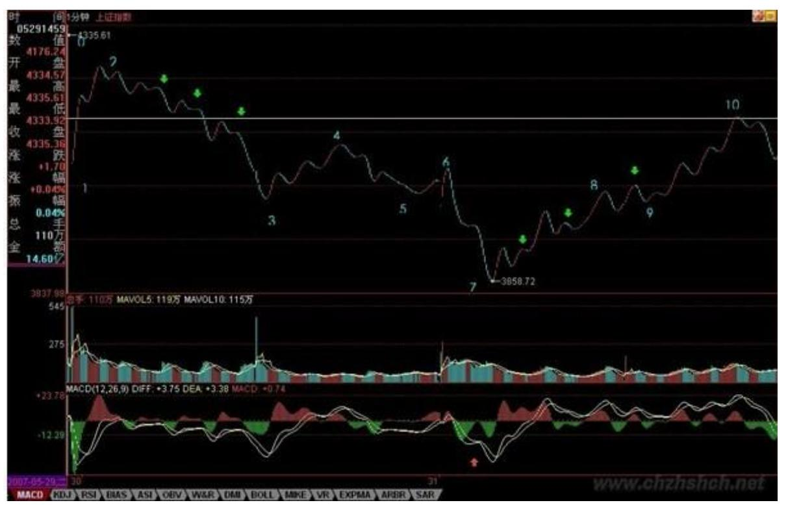
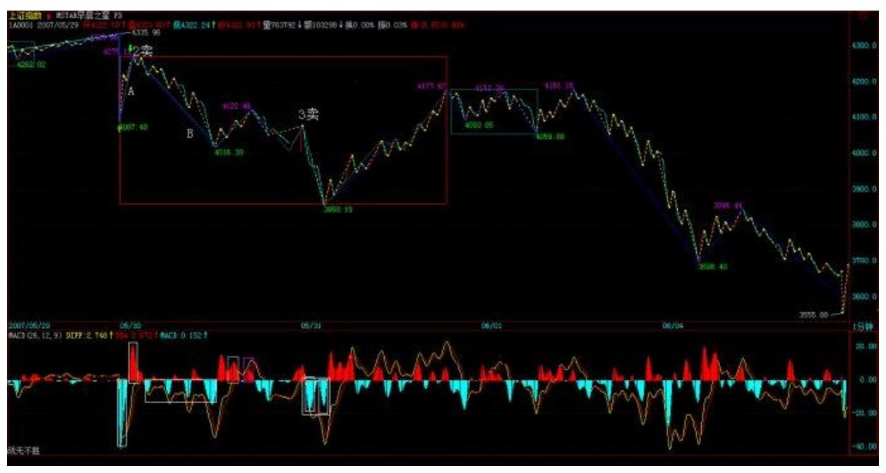

教你炒股票 57:当下图解分析再示范

(2007-06-04 15:43:40)部分由于管理层的夜半歌声,本周已经说了 4 天股票,本 ID 就来一个大满贯,再说一天,不过下不为例,天天 说股票,一周说 5 天,各位不审美疲劳,本ID 也烦了。

看到很多人还是发蒙,因此,就用这两天的 1 分钟图,继续说说怎样 进行图解。当然,这些图解都是可以当下进行的。今天看回帖,好象 有人希望本 ID 在什么 QQ 上即时发布什么提示之类的,这绝对不可 以,QQ 对于本 ID 来说只是用来 419 的,用来说股票也太浪费了, 而且,本 ID 那 4 小时是天王老子都不能打扰的,说句不太客气的 话,本 ID 的资金,大概比来这里所有人的资金之和都多,本 ID 忙 着上 QQ,出问题了谁负责?所以,最多就这样形式了,很多事情,还 是要靠自己多练习,本 ID 最多就是一个陪练的。

必须要再次强调,不熟练的投资者,一定不能全仓进行操作,基本的 仓位应该拿着中长线的股票,部分仓位可以用来练习,否则全仓操 作,一旦来几次半生不熟的折腾,到时候连本都没了。而且一定要注 意,卖点是在涨的时候出现的,不是追杀出来的,如果你砍了地板 价,那一定不是在卖点上。只要是赚钱的,就没有卖错,宁愿卖早, 不要卖晚。如果卖错了,就不看这股票,除非有新的买点。

还有,有人误解,认为本 ID 的方法就是拼命弄短线,这些人大概是 跟孔男人学的中文,所以就这水平了。用本 ID 的方法,如果你选择 年线级别操作,那比巴菲特还巴菲特,大概一个年线的买点后,至少 到等几十年才有卖点,你就拿几十年吧,就怕你拿不住。还有,如果 你是按周线级别操作,那这两年,至少指数上你根本没有卖点。至于 按 30 分钟操作的,在一个 30 分钟第三买点后的中枢上移中,如果 这上移是从 10 元开始,只要不形成新的 30 分钟中枢,那么就算到 了 100000 元,你还是要拿着,为什么?没有卖点。所以那些说学了 本 ID 理论就拿不住股票的,自己好好反思一下,究竟你学了什么? 闲话少说,看图解图。

对着图,首先要确定最小分析级别,也就是说,这级别以下的都可以 看成是线段,而站在最小分析级别的角度,每一线段就是其次级别走 势类型,三个线段重合部分就构成最小分析级别的中枢。

当然这些线段本身,可能都属于不同级别,这问题在前面已经说过 了。例如本图,最小分析级别先规定为 1 分钟级别的,所以所有 1分 钟级别以下的,都是线段,在图上标记着数字,所有的[N,N+1],都

是线段。有人可能要问,01 段是跳空缺口,23 段上上下下,很复 杂,怎么都是线段?因为这都不是 1分钟的走势类型,里面没有 1 分 钟的中枢,所以都是 1 分钟以下级别的,虽然缺口是最低级别的,当 然比 23 段这种要低级别,但在 1 分钟级别显微镜下,218 没有区 别,都可以看成是没有内部结构的线段。当然,如果你要考察 23 段 的内部结构,也是可以的,但那就不是站在 1 分钟级别的基础上了。

由此可见,上图可以看成是 10 段线段构成的,线段中的波动,至少 在分析 1 分钟级别的角度,就是可以忽略不计的。这里有一个地方是 可能有疑问的,在23、78 段 5 个带绿箭头指着的地方,似乎可以看 成是一线段,但为什么没有?因为在这似乎是三段的结构中,第三段 的都太微弱,把图形缩小后几乎就看不到了,对比一下 89 段带绿箭 头的地方,这第三段就明显不同了,所以这是一个 1 分钟以下级别的 上下上结构,而前面的不是。当然,如果你一定要说78 段那箭头的地 方很明显,那么 78、89 就合成一线段的上涨趋势了,这也可以,只 是如果你是按这个标准的,那么所有和 78 段箭头位置微弱程度一样 的,都要这样处理。本 ID 还是按图上的标记线段。

线段有了以后,一切都好分析了。当然,在当下时,例如在今早 9 点 30 分钟,是没有后面的线段的,但线段的标准,是一样的。你可以很 精细地分析 56段,是一个上下上的内部结构,其中下一段是跳空缺 口,但无论如何,这就是一个线段。不过,由于前面 12、23、34 构 成的中枢只有 1 分钟级别的,那么其构成第三类卖点的次级别就是 1 分钟以下级别的线段,这时候,就要考察一个有上下上结构的 1 分钟 的次级别结构了,而 56 段显然符合这个结构,有明显的上下上,而 45 段也是符合 1 分钟次级别的要求的,注意,当考察 1 分钟的次级 别时,就不能笼统地把所有 1 分钟以下的都看成 1 分钟的次级别 了,因为这里的视点已经不同。显然,这个的 45、56,就构成了标准 的次级别离开中枢与反抽中枢,而这 1 分钟中枢的区间是[4087, 4122],而 56 段只到了 4077,所以这就是第三类卖点了。

当然,在具体操作中,还可以特别精细地去分析这个问题,56 段里的 上下上,后上对前上的力度,从下面对应的 MACD 的柱子面积比就可 以判断出不足来,因此这里就有很小级别的背驰,这都可以用当下分 析的,当然,这样的精确度,需要操作者十分熟练并且反应与通道都 十分快,并不要求每个人都有这个可能,这里只是进行分析,对大的 级别,道理是一样的。

同样道理,67 段里的内部结构下上下,后下力度也比前下弱,这从下 面红箭头所指两绿柱子面积的对比就可以知道,所以这内部就有了背 驰。注意,这 67中的上,幅度上也很微弱,但时间比较长,是一个小 的时间换空间的反弹,所以是可以看成一个上的,更重要的是,这上 使得绿柱子回缩到 0 轴,这就更证明了这是一个不能忽视的有技术分 析意义的反弹。

219 当行情走到 6 点时,34、45、56 这三段,就可以看成是一个 1 分钟中枢了,当然,这种分法和原来[4087,4122]中枢的分解不同, 但站在多义性的角度,这是绝对符合结合律的,当然是一个分解的方 法。

这分法,就使得 23、67 成为这中枢的一个震荡,从而可以用力度的 方法来发现背驰。对于 23、67 下所有绿柱子面积之和,显然后者

小,所以就知道,67 只是针对[34、45、56]中枢的一个震荡,必然至 少回抽中枢附近,而对 67 内部用区间套的方法进行精确定位,具体 的看上一自然段的分析。按这种方法,7 那买点的把握,就是很简单 的事情了。注意,这都是可以当下分析的,根据当下的走势,自然就 能把握。如果那 7 当成是第一类买点,那么 9 就是第二类买点了, 这符合次级别上,次级别下,不创新低或盘整背驰的定义,对比一下2 点和 9 点,一卖一220 买,都是第二类的。当然,在 78 里,其中的 下也是一个第二类买点,但该买点的级别比 9 这点要低。

显然,这 10 个线段,已经组成了一个更高级别的 5 分钟中枢,结合 方式如下:(12+23+34)+(45+56+67)+(78+89+910),该中枢的区 间是[4015,4122]。这一点其实由 6 这个第三类卖点的存在以及后面 的背驰,就可以知道,这中枢级别的扩展,是必然的。

注意,这是为了示范才分析 1 分钟的图,这类图是最复杂的,一般来 说,级别越大的图越简单,而操作上,技术不好,通道不好的,一般 不用 1 分钟的图,把级别放大点,这点必须明确。

\*\*\*\*\*\*\*\*\*\*\*\*\*\*\*\*\*\*\*\*。

解盘及互动问答:

#### \*\*\*\*\*\*\*\*\*\*\*\*\*\*\*\*\*\*\*\*。

缠师:今天的走势就是[4015,4122]的中枢震荡,至少指数是不难看 明白的。周五出现这样的走势很正常,各种心怀鬼胎的到处散播这消 息那消息,散户当然如惊弓之鸟了。但今天的走势,对今后是有利 的。这次的问题并不在于国家公布了什么,而是其公布的手法,如此 手法,必须得到严惩,一个最直接的压力必须让用这种恶劣手法的人 承担:一个骂名。周五开始,舆论将逐渐转向,一轮新的反思将开 始,注意,管理层也不是一言堂。还要注意一点,这两天同时公布的 是财政部国债的发行,所以,经过这次风险教育,应该能分流些人去 买国债了。

不过散户确实需要有点教育,前段时间,不是有人叫嚣散户已经统治 市场了?但跌两天,散户就蔫了。大资金永远都是市场的中流砥柱, 没有大资金,没有这几天的聚会,像这几天北京股的走势能出现?看 那些企图限制大资金的政策还出不出?有些大资金,那些管理层换了

几茬了,依然屹立不倒,不断壮大,这些脑子进水的政策,除了害散 户,能害得了谁?周末,这样的局面,就让管理层去收烂摊子,如果 他们还喜欢这边打压,后面又来救市的游戏,那就玩吧,这种游戏已 经 10 几年了,真正的牛人,只会在这种游戏中越来越牛。

但对于散户,这几天确实心里压力大了点,但这其实也没什么,本 ID 前面反复提到这样的典故:96 年连续 3 天指数跌停,后来还创出新 高。所以,那天公布消息,本 ID 一大早 7 点不到就上来,告诉一定 要在第二、三类卖点卖掉,没卖的,那就算了,到今天还卖什么?大 反弹是必然有的,以后的位置一定比这个位置高,关键是该走的时 候,就不要有幻想。

注意,那种杀已经跌了 30%,去追买不跌反涨的所谓强势股,知道有 补跌这种概念吗?在混乱的市场中,更应该专一。可以很理性地讨论 这个问题,一个股票下跌 40%,第一次反弹回 20%,出一半或 2/3, 下来再买回来,在一次反弹上去,基本走的位置,就和没跌的时候差 不多了,如果你现在有资金,在221 一股票下跌 40%时补仓。这股票 又不是什么被查庄股,那么,这种的操作基本风险很小,如果技术再 好一点,看准一些买卖点,那么基本就等于高位走掉了。当然,以后 再碰到这种情况,一定要在第二、三卖点出掉,那天,有多少人辜负 了本 ID 在 7 点钟不到就上来发帖子?其实,纯技术上,现在的大走 势并不坏,六月的调整没什么可说的,本 ID 那 1/2 线,现在也在 4144 点了,下面,这次上涨 1/3 的位置在 3734 点,这位置是第一 支持位。没有特别的事情,这位置有很强支持。否则就要考验一半的 位置,3434 点。但至少现在,没有任何看到该位置的理由。(备注: 从 2/6 的2541 开始算)从短线上看,还是[4015,4122]的中枢震 荡,有技术的,继续按这震荡操作。下周最大的机会,就是暴跌个股 的大反弹,特别注意那些下跌到年线、半年线等关键位置的个股,这 些反弹的力度会厉害点。大浪淘沙,能从容面对本周情况的,是你投 资生涯重要的一课,好好珍惜、体会。2007-06-01各位散户,为了中 国资本市场的明天,为了以后不再有这样的暗算,为了有让管理层知 道他们的权力不是可以任意挥舞的,今天,这样一个特殊日子里的特 殊走势,是必须忍受的。今天收盘后,全世界的目光都会聚焦到这里 来,虽然管理层今天早上的统一口径的在各大传媒中文章已经有点那 意思了,但还不够,认识不够深刻,用词依然有父母教育孩子的味 道,投资者是需要被教育,但管理层同样需要。

技术上,上面的文章已经说得很清楚,看 5 月均线,经过今天的下 跌,该线已经到了 3540 点。短线的角度,在该线附近的介入,问题 不大。周末说一定注意补跌,不能买所谓抗跌的股票,今天,那些股 票都下来了。现在,站在反弹的角度,一定只能介入那些跌幅 40%以 上,已经跌到半年,最好是年线的股票,一旦大盘有所稳定,其反弹 的力度会较大。

至于现在依然没走的,依然全仓的,第一,现在走意义已经不大,不 说什么技术,就算是看历史数据,以后肯定有比现在位置要好得多的 位置。对于最不幸的满仓的朋友,目前一定要忍住,在第一次大反弹 出现后,一定先把一半筹码先兑现出来,下来再找机会回补,这样才 能把成本摊低。因为这样的走势后,中线的震荡不可避免,有资金才 会有机会。

当然,在 30 日第二卖点走掉的,仓位不重的,目前的任务就是好好 把握住本周必然出现的大反弹,注意,如果你技术不好,就要对超跌 个股逐步买入,而且必须要有针对性,集中力量,在反弹中,如果还 拿着几十只股票,那是操作不过来的。

具体点位,还是上文中说的,5 月均线是一个关键的位置,跌破该位 置,站在短线角度,将是空头陷阱,至于能不能跌破该位置,就看下 面的短线背驰点出现在什么位置上,这是技术比较好的最主要参考位 置。由于今天大盘股已经补跌,因此必须密切注意大盘动向。又由于 目前 30 分钟呈现的走势,所以反弹最直接的效果,就是把 30 分钟 的 MACD 拉回 0 轴,该 0 轴是反弹的最大压力。

222 这样的市场,是对所有市场参与者的考验,能经受住,也就成熟 点了。有些经验是必须记住的:对下跌不能有幻想,像 30 日这种第 二类卖点,一定要走,否则就没有反手之力了。2007-06-04 15:43:40223 学友体会:1 、"例如本图,最小分析级别先规定为 1 分钟级别的,所以所有 1分钟级别以下的,都是线段" ,1 分钟级别 以下包括 1 分钟次级别、1 分钟次级别的次级别...跳空缺口。确立 最小分析级别,就是把这些以下的级别都磨平为一线段了,方便分 析。但在确定买卖点时,又不能这样笼统处理,这就涉及到第 2要 点。

2、三类买卖点的鉴别:"由于前面 12、23、34 构成的中枢只有 1分 钟级别的,那么其构成第三类卖点的次级别就是 1 分钟以下级别的线 段,这时候,就要考察一个有上下上结构的 1 分钟的次级别结构了, 而 56 段显然符合这个结构,有明显的上下上,而 45 段也是符合 1 分钟次级别的要求的,注意,当考察 1 分钟的次级别时,就不能笼统 地把所有 1 分钟以下的都看成 1 分钟的次级别了,因为这里的视点 已经不同。显然,这个的 45、56,就构成了标准的次级别离开中枢与 反抽中枢,而这 1 分钟中枢的区间是[4087,4122],而 56 段只到了 4077,所以这就是第三类卖点了"。"如果那 7 当成是第一类买点, 那么 9 就是第二类买点了,这符合次级别上,次级别下,不创新低或 盘整背驰的定义" 。

鉴别的几个步骤: a、确定中枢。b、1 类买卖点是根据围绕中枢的背 驰,2 类买卖点是"次级别上,次级别下,不创新低或盘整背驰的定 义" ,3 类买卖点是"确定次级别离开与反抽中枢" 。

3、分解的多义性,其目的是方便根据背驰来进行操作:"当行情走到 6 点时,34、45、56 这三段,就可以看成是一个 1 分钟中枢了,当 然,这种分法和原来[4087,4122]中枢的分解不同,但站在多义性的 角度,这是绝对符合结合律的,当然是一个分解的方法。" 4、中枢 级别扩展。显然,这 10 个线段,已经组成了一个更高级别的5 分钟 中枢,结合方式如下:(12 23 34) (45 56 67) (78 89910), 该中枢的区间是[4015,4122]。扩展后的中枢区间就是每 3段中的最 高最低点的重合区域。

#### \*\*\*\*\*\*\*\*\*\*\*\*\*\*\*\*\*\*\*\*。

缠师:再补充一句,为某位为证券市场的大发展作出巨大贡献的老先 生默哀。没有他,股改都可能中途夭折,他对这两年市场的贡献,虽 然不为一般人所知,但历史会记住他的。为他念"往生咒",阿弥陀 佛。

拿摩阿眯搭巴呀,达塔嘎达呀,达得压他,阿弥利兜、巴威,阿弥利 达、悉眈巴威,阿弥利达、威哥兰谛,阿弥利达、威哥兰达、嘎弥 尼,嘎嘎那、给地、嘎利,司哇哈。2007-06-03 11:53:39224 1. 网 友 [匿名] 新浪网友: 老大,是否牛市第一波就此结束?后面将展开 科技股的行情? 2007-06-04 15:35:21网友[匿名] 股虱:肯定没有。 第一波结束要出现季线上的调整。

2007-06-04 15:37:29缠师:对,至少是月线级别的。这三波的概念, 必须放在 20、30 年的大周期上看。

#### \*\*\*\*\*\*\*\*\*\*\*\*\*\*\*\*\*\*\*\*。

2. 网友 [匿名] 蓝筹也看缠: 请问缠主,蓝筹股的补跌空间会有多 大? 2007-06-04 15:56:08缠师:把指数砸到位为止。

#### \*\*\*\*\*\*\*\*\*\*\*\*\*\*\*\*\*\*\*\*。

3. 网友两只老虎: 神仙姐姐,这样跌法不是让汉奸、国外不良居心 的人得逞了吗?真是一粒老鼠市害了一锅粥。 2007-06-04 16:05:30

缠师:现在不是这个问题,在这个位置硬扛没用,还不如砸出空间 来,有子弹自然能消灭敌人,所以为什么本 ID 在 30 日 7 点不到就 上来发帖子,就不知道有多少人明白了。

#### \*\*\*\*\*\*\*\*\*\*\*\*\*\*\*\*\*\*\*\*。

4. 网友 [匿名] 启程: 无视风雨,依然崇拜。但想问。今天下午就 建仓,虽然没有看到买点,只是觉得会有超跌反弹。请问楼主,这算 不算错误呢?现在建仓后的仓位大概有 90%了。请指教。 2007-06- 0416:06:51缠师:其实最好要耐心等买点,这种下跌,小级别的买 点,如果不能T+1 跑掉的,就有很大风险。而且这种建仓有赌博的意 思,应该分批来,宁愿没买到,少弄一次反弹,也要保证资金和仓位 安全。

#### \*\*\*\*\*\*\*\*\*\*\*\*\*\*\*\*\*\*\*\*。

225 5. 网友 [匿名] 新浪网友: "谁言肉价高难抑?举国皆是割肉 人。"尽管我侥幸提前出来了,看到这句话我还是想哭。谁言肉价高 难抑?举国皆是割肉人! 2007-06-04 16:11:35缠师:这种心态是不能 在投资市场玩的,这里不是慈善场所,是战场,哪里有这么多儿女情 长。

#### \*\*\*\*\*\*\*\*\*\*\*\*\*\*\*\*\*\*\*\*。

6. 网友 [匿名] 新浪网友: 禅师,能帮我看一下 000010 吗?成本 14.60 元。几天来一直都没有减仓机会啊。2007-06-04 16:16:44缠 师:30 日那天都有机会,只是你自己有幻想,这就是必须吸取的经 验。

#### \*\*\*\*\*\*\*\*\*\*\*\*\*\*\*\*\*\*\*\*。

7. 网友 [匿名] 新浪网友: 缠姐,ST 的还能持有吗?还是需要割出 来?你指条明路吧。拜谢!天天坐地板的日子不好受啊!到底是出来 找反弹的还是继续持有死等主力出货啊?2007-06-04 16:18:53缠师: 这股票说了很多次了,本来就不该买,那天本 ID 还专门说了不要买 小盘的,后来又反复说了几次。如果现在还拿着,那只能等反弹,这 些股每天才5%,反弹自然要先让给跌得多的。这股票的中线主要是基 本面上铜矿的注入,是否继续这么干,这就要看盘面的干净程度了。

#### \*\*\*\*\*\*\*\*\*\*\*\*\*\*\*\*\*\*\*\*。

8. 网友两只老虎: 神仙姐姐,有些人在这里污言秽语。您千万别往 心里去。这些人是故意到这来捣乱的。我们爱您!我们相信您!我们 感谢您!我们珍惜彼此的这个缘份!2007-06-04 16:19:35缠师:来市 场里不是为了吵架的,对这些言论,应该一概不予理睬。

学好本领,在市场上获利,这才是唯一值得干的活。

#### \*\*\*\*\*\*\*\*\*\*\*\*\*\*\*\*\*\*\*\*。

226 9. 网友 [匿名] 蓝筹看缠: 谢谢博主回答我的问题。请问蓝筹 股下跌被套,后市反弹是否也要全部出局?是否明日可以补仓?2007- 06-04 16:26:47缠师:反弹都要先出来,这种走势,出现 V 型的可能 性微乎其微。

#### \*\*\*\*\*\*\*\*\*\*\*\*\*\*\*\*\*\*\*\*。

10. 网友 [匿名] 三藏: "如果大盘和权证之间的联系失去了。就再 不玩了,风险太大了!" (缠师语)麻烦老大给解释下这个问题。

2007-06-04 16:26:22缠师:见好就收,至少要减少操作量。

\*\*\*\*\*\*\*\*\*\*\*\*\*\*\*\*\*\*\*\*11. 网友[匿名] 承认错误: 怎么看不到发的 帖?重发一次:本人很少发言,但是这个时候,我坚定的支持楼主! 虽然我这次损失惨重,而且大部分都是损失在楼主的 16 集团军上 (赚的时候没买它们,亏的时候倒是重仓)。但是这次是我的贪婪和 不理智造成了个人损失的最大化,我想很多朋友也一样。我们应该检 讨自身,好好学习。坚定支持楼主,坚定看好牛市,我们会拿回我们 暂时失去的东西的。

2007-06-04 16:23:16缠师:支持谁并不重要,关键是看好买卖点。

#### \*\*\*\*\*\*\*\*\*\*\*\*\*\*\*\*\*\*\*\*。

12. 网友 [匿名] 罗技: 总算明白为什么理财的课程说"没有期货进 行保障的股市是不能做的" 。针对各股,没有股票期货(个股期货) 进行保险。还是不能做的。理财的话,还是选择不动产更好些!200706-04 16:29:44缠师:关键不是有什么,而是你的技术。有期货,大 牛市也会死 N回,而且是暴仓那种。别相信对冲风险的废话。

13. 网友两只老虎: 神仙姐姐,反弹到多少出来呀!比如现在跌了 40%。2007-06-04 16:31:11缠师:半仓,如果技术好,资金又不大 的,可以全仓出来,回跌以后再找好的品种补入。
