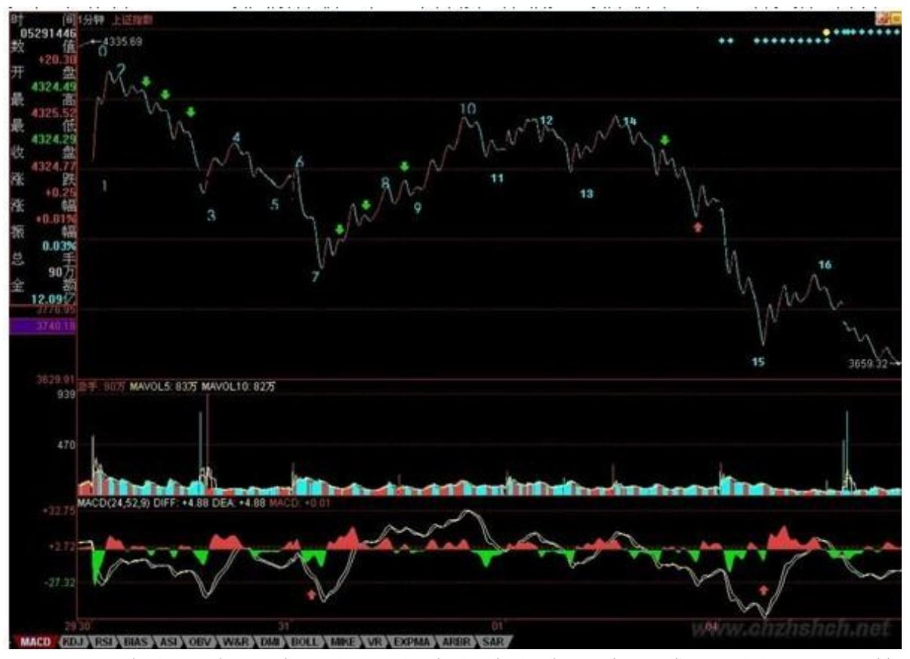
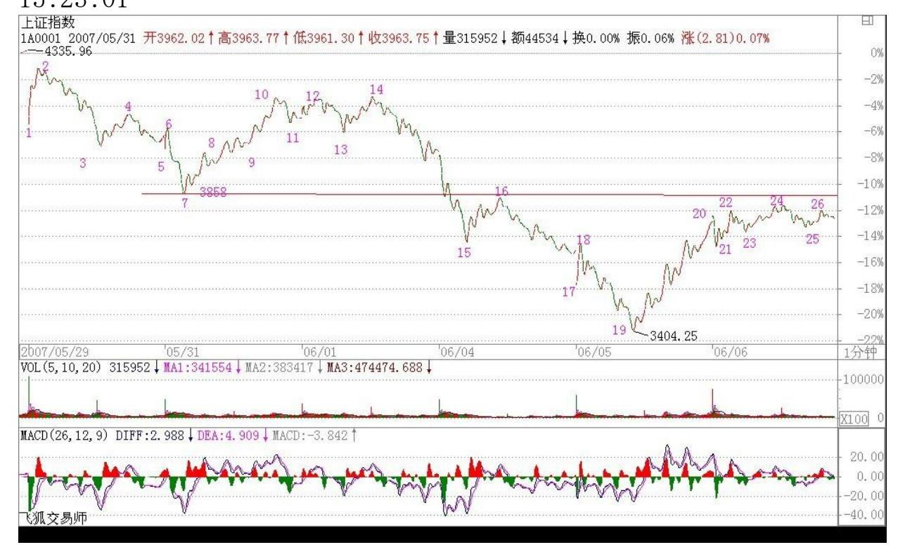
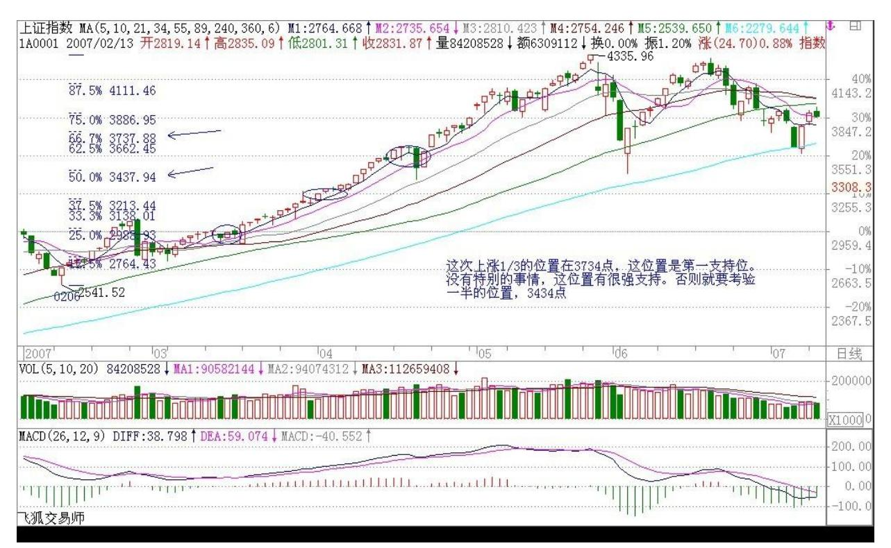
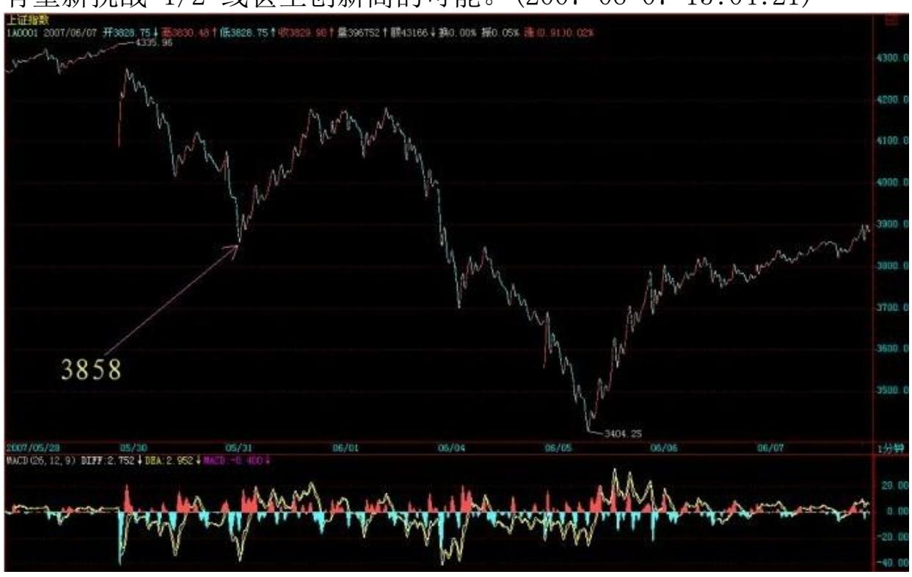
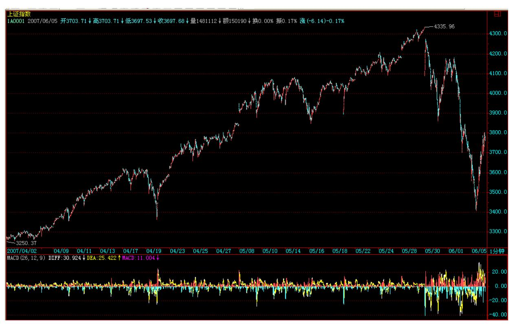
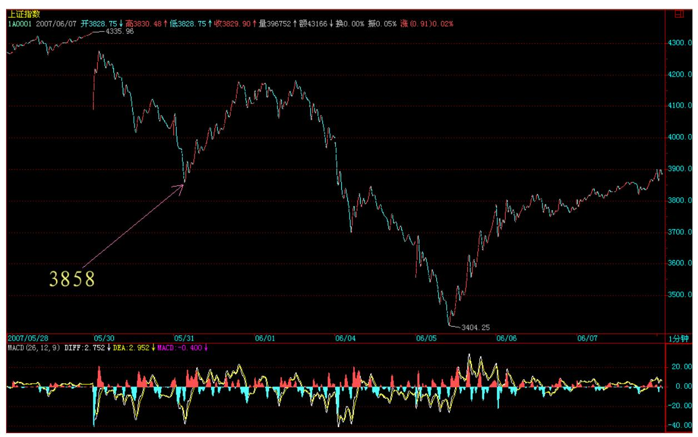
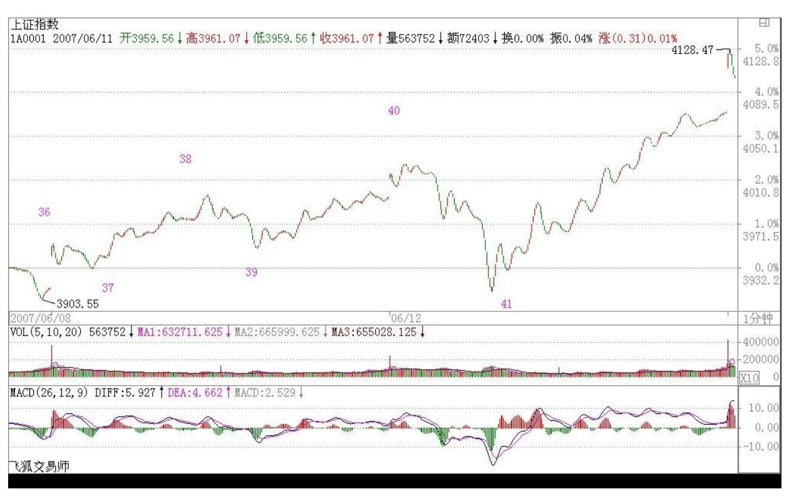
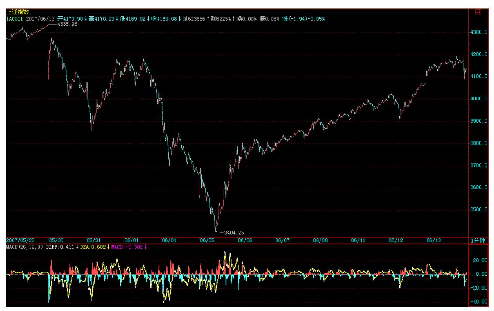

# 教你炒股票 58:图解分析示范三

(2007-06-04 22:34:47)明天收盘后要出一次差,去一趟曾 419 赋诗 的地方,所以,先把课程送上,今后几天都没时间写帖子,但每天收 盘后的解盘,都会尽量按时附上。至于其他内容的帖子,等出差回来 再说了。

大盘大跌,除了清洗筹码,还可以清洗一下人。本 ID 说过,这里没 必要有这么多人,来这里的,如果不是希望成为猎鲸者的,就没必要 来了。那种跌个40%就惊慌失措的,也不大适合市场。市场从来都是血 腥场所,这点在前面已经反复说到,见不了血腥场面的,还是把钱好 好去买国债,这样比较安心。股票就是废纸,该卖的时候不卖,把股 票当宝,这就是投资的最大软肋。如果你看图形操作时,做不到无我 无股票,只有走势图形,那基本可以不看图了,因为有我有股票,被 自己的贪婪恐惧所牵引,你看的图,也不过就是自己的贪婪与恐惧, 那何必看图?说一个最简单的例子,就算你没技术,只按最简单的跌 破 5 日线走,那请看看你该在什么时候走,且不说对于具体的个股 了。这次是一个很好的实习机会,请回想一下那些卖点时,你自己究 竟在干什么?心里是不是有很多幻想,被幻想蒙蔽了眼睛?看图操 作,唯一的对象只有图,谁说都没用,市场是当下发生着的,没有人 能替你去反应。

先把市场放一边,继续图解分析,把这次跌势的图形连续分析下去, 这样大概对各位的理解与分析有一定的帮助。请看下图:

228 229 各位可能还会对如何去确定线段有很大疑惑,图上已经用数 字标记了从 30 日开始的 1 分钟图上的线段。为什么这样标记?例如 14-15 间带红绿箭头这一段为什么不是线段?这很简单,因为这段中 的下-上-下-上-下中,没有任何的重合,也就是第二个上的终点没有 触及第一个上的起点,这种图形,和直接的一个下没有任何区别。而 一个线段,除非是缺口,否则必须由至少上-下-上或下-上-下的三折 组成,只要互相相邻的上或下不重合,则这个模式可以一直延伸下去 而依然还是一个线段。这里就不难明白 14-15 为什么只是一段线段 了。

那么为什么 14-15 这线段不构成合适的买点,因为在下面的 MACD 辅 助中,可以看出这一段的力度比前面所有的都大(这从黄白线就一目 了然了),那当然不构成任何的 1 分钟以上的背驰,最多就是 1 分 钟以下最小级别的背驰。在 15 下 MACD 小红箭头处,比较绿柱子的 面积,就可以发现这个小的背驰,因此就有了 15-16 的反弹,该反弹 在 14-15 最后一个上附近受阻,十分技术。(注意课文图上禅师的 MACD 参数是 52,24,9)而站在 10-13 构成的 1 分钟中枢来看,15- 16 这反弹反而是构成一个第三类卖点,本 ID 看了一下留言,有叫 CCTV 也看出这个是一个第三类卖点,但他的理由好象是这反弹没突破

7 这点所以是第三类卖点,这是不对的,因为如果是那一点,那对应 的中枢就乱了。注意,第三类买卖点必须是次级别离开,次级别反 抽,而且是针对该级别中最近那个中枢,而以前也曾说过,对于一些 快速变动的行情,往往第三类买卖点离开的距离会很远。

从 16 开始的一段,有进入背驰段的可能(娇:线段类背背驰段),但 由于明天的行情没有开始,所以如果明天突然加速下跌,就可以破坏 这可能,所以具体是否背驰成立,还要看明天走势的内部区间套的当 下定位。如果出现背驰,那么一个反弹至少重新回到 15 这点上,这 样就从 15 这点开始至少形成一个 1分钟的中枢了。

而对于 1-10 这个 5 分钟中枢,该反弹如果不能重新回到 4015 之 上,那就会形成一个 5 分钟的第三类卖点。从目前的情况看,这种可 能性有很大,所以这也预示着,今后几天,任何在 4000 点下的反 弹,都会构成一个卖点并至少引发一个更大级别的中枢,甚至是新一 轮的下跌,除非这反弹能重回 4000 点之上。显然,从中枢的分析 中,可以很绝对地分析出今后一段走势的一些操作性质。

站在更大的层面上,大盘要重新站稳,就要形成一个较大级别的中 枢,而从 10 开始,一个新的 5 分钟中枢都没形成,如果新的 5 分 钟中枢最终和 1-10 这个 5 分钟中枢没有重合,那么就形成一个 5分 钟级别的下跌,那其后的压力就更大了,所以,那 CCTV 也蒙对了一 点,就是 7 这点有这极强的技术含义,如果一个 5 分钟背驰引发的 反弹都能重回该点之上,那么大盘的走势就会有好转的可能,否则短 线压力依然。

别看本 ID 理论的分析似乎很复杂,但其中绝对条理清晰,每个结论 都是严格,没有任何含糊的。但关键,首先要把图给分解对,否则就 乱套了。这点必须多看图,多实践。所以,今后一段课程,都继续把 这图分解下去,至少看到一个日线中枢的生成为止,有这样的具体分 析,对各位的理解和把握应该有所帮助。

230

\*\*\*\*\*\*\*\*\*\*\*\*\*\*\*\*\*\*\*\*。

解盘及互动问答:

缠师:本 ID 要马上开车去 419 的地方,不能多说。今天,如果你还 看不明白昨天说的背驰段,然后今天如何精确定位的,那就好好学习 吧。上图的 17 段(下图中的 19 段)结束位置是 3404 点(为什 么,如何当下去判断,好好研究好,这是真工夫),后面的走势,上 面已经提及,下午走的是第 18 段(下图中的 20 段),该段结束 后,就进入上面说的中枢震荡中。明天的任务,就是看好这第 18 段 (20 段)的结束。

大走势,就是月线的 5 均线,今天盘中假突破,而且还是 3434 点一 般的位置,这不难看出来。(5/31 解盘:其实,纯技术上,现在的大 走势并不坏,六月的调整没什么可说的,本 ID 那 1/2 线,现在也在 4144 点了,下面,这次上涨 1/3 的位置在 3734 点,这位置是第一 支持位。没有特别的事情,这位置有很强支持。否则就要考验一半的 位置,3434 点。但至少现在,没有任何看到该位置的理由。(备注: 从 0206 的 2541 开始算,一般 30 分中枢大致相当于日线笔中枢、 月线 3k 重合中枢,对应的是月线的 5 均线)对不起,不能多说了, 本 ID 该干的干了,该说的说了,是否能成为你自己的东西,那就不 是本 ID 能决定的了。明天解盘见,帖子就写不了了。2007-06-05 15:23:01

231 232 233 1. 网友西门学缠:在一个背驰反弹后达到第一个反弹高 点时,接下来盘整的话,很多短线散户就会抛货的。所以 V 型反转如 何能持仓,那就是学会缠师中枢。理论的保证,心里才不会慌,才能 真正做到反弹的高点或者才能真正拿到反转的底部货而不被中途震出 仓。中枢,厉害就厉害在这,指引着我们买卖点。2009-08-31 21:13:20

#### \*\*\*\*\*\*\*\*\*\*\*\*\*\*\*\*\*\*\*\*。

缠师:抓紧说两句。刚才还和当地的领导谈事,马上又要宴会,抓紧 说两句。今天就是受制于 3858 点的第 7 那点,这在前两天的分析已 经说到该点的技术意义,具体可以看当时的分析。深圳强,看能否带 动上海。目前,压力不在盘里,而是在盘外,斗争激烈,不能多说。

现在,下面这中枢已经形成,就用中枢震荡看。个股向前面说到的一 \二线集中的趋势明显,但即使是最好的股票,也不能追高买,一定要 在震荡的低点介入。安全,永远都是第一位的。

不能多说了,离开这里,还要去一次杭州见个有分量的人,估计周一 才能回北京了。先下,再见。 (2007-06-06 16:52:09) 缠师:再说两 句。3858 的技术意义在今天表现无遗,突破就意味着一个大的中枢在

形成,这样是大盘拨乱反正的第一步。这样,大盘就有了一个可以依 赖的波动中心,但这中心在形成中。4015 点是下一个位置,这位置如 果不能突破(注:3 卖),大盘还有严重变坏的可能。否则,大盘就 有重新挑战 1/2 线甚至创新高的可能。(2007-06-07 15:04:21)

234 其他不能多说。马上要去看一个企业,明天主要看 3858 能否站 稳。

走了,再见。

235 236 缠师:周末腐败去吧!3858 点,昨天给今天的任务,完成得 不错,但对周末消息面上的担忧,使得今天十字星充满了"六桥烟 柳" 的味道。周末腐败去吧。断桥边,苏堤上,相逢何必曾相识。 (2007-06-08 15:13:42)

237 238 全流通后最大的投资机会(2007-06-10 08:40:52)刚从安徽回 到苏州,明天很忙,如果没有时间写评论,就在后天早上补上。注意,本 ID 这里指的最大机会是私人股权投资这一块,但一般人没机会参与, 所以可以关注中国最大 VC(现在主要做私人股权)公司的股东 600635 以及其他有相关题材的公司。这题材,目前市场还不大了解, 等市场了解了,就不是这个价格了。可以明确告诉各位,创业板明年 一定出来。635、潍柴动力都是从中线角度说的,没必要追高买,如果 是中线的资金,可以耐心等待好的买点。当然,如果以前已经有的, 就拿着。今天跑了不少地方,本 ID 也累了,先下,再见。昨晚已到 苏州,等一下要去安徽,去看一个准备私人股权投资的项目,N1 千 万,占 10%,好象有点贵。明天可能还要回杭州,这几天看了不少企 业,看到真正的企业,就知道中国的资本市场有多大的潜力,就知道 本ID 说 20 年的大牛市至少上 30000 点可能都有点保守了。像安徽 这企业,今年的净利润已经 N2 个亿了,具体不能说,涉及商业秘 密。

600635 是本 ID 那十几只股里的 VC 股,说的时候,当然也是本 ID 大举介入的时候,是 5 元多点。为什么本 ID 要当时要大力买入并让 这里的人都去买?因为他是中国最大的 VC 企业 20%的股东。知道全 流通最大的投资机会是什么?就是 VC,更准确说,是私人股权投资这 一块。知道 635 的那 VC 企业对潍柴动力 2000 万的投资,几年时

间,现在已经快 100 倍的收益了吗?知道本 ID 为什么要为潍柴动力 写了一首诗?看看当时该股多少钱,现在多少,有受大盘影响吗?知 道潍柴动力占有中国 5000 亿重汽市场的多少分额吗?当然,本 ID不 是让你现在去买,当时写诗的时候,潍柴动力 60 不到,不过,就算 现在去买,站在中线的角度,绝对一点问题都没有,但就怕你没有这 个耐心。就像本 ID4 月前后让各位注意 002100 后的 6000 万总盘, 2000 万以下流通的中小板,看看后来都走成什么?如果两年后再看 看,你会更 H,本 ID 就奇怪了,怎么总是有人说本 ID 的理论是短 线的,有些股票,本 ID 绝对可以拿 10 年以上,关键是他值得本ID 拿吗?本 ID 可以 419,当然也可以 4N9,关键是你的 N 是多少。谁 告诉你本 ID 只看技术面买股票的?只看技术面买股票就等于只看上 半身找面首一样,只有上半身没有下半身的能是好面首吗?昨天,央 行的吴大姐已经在说大力支持私人股权投资的事情,本 ID在这事上的 布局早就完成了,可以预言,这是今后最大的热点,注意,这不单单 指二级市场,而是股权投资本身,本 ID 只等着坐轿子了。现在 ID 已经开始布局一个更新的事情,不走在所有人前面,那是本 ID 吗? 今天违反规定,周末说股票,对不起了,车子来了,马上去安徽,不 能多说了。最后重温一下潍柴动力那五绝:曾经湘火炬 今已鲁潍柴十 载风云客 七尺老残骸239 刚回北京再说私人股权投资(2007-06-11 20:50:14)刚从南京飞回来,说句南京人不爱听的话,苏州比南京真是 好太多了。这次去苏州,金鸡湖一带也比上次好多了,南京给人的感 觉,一如既往地乱,杭州也不行,现在的杭州,完全没有特色,如果 没有西湖,真不知道杭州算什么了。当然,从南京开车,一进入安 徽,之间的对比也是明显的,现在的中国,真是众声喧哗。

这次出去,跑了五个省,累,今晚要好好休息。不过,一路上,开盘 的时间依然是不会耽误的,要感谢现在发达的通信手段,科技是让人 自由而不是束缚人的,这点很重要。

今天的大盘走得很正常,周末没消息就是好消息,因此大盘当然要尝 试对 4015 点进入攻击。前面说了,这一段都是深圳带着上海走,前 者的 1/2 线在 13700点,这没碰到过,所以有空间,只要这节奏不 变,大盘总体上就没大问题。现在,5 日线也成功拐头向上了,如果 不会看短线走势的,就看 5 日线,不破就没问题。现在印花税太贵, 短线不要太频繁,把操作级别放大点,人也轻松。

至于私人股权投资,和传统的 VC 不同,只投那些马上可以上市的, 更重要的是,可以在大的产业结构上进行大布局,目前的中国,正走

向一个产业大综合的阶段,这里的机会大锝惊人。具体有时间再说, 一般投资者没有参与这大机会的机会,现在私人股权投资基金也没有 被发展起来,所以一般投资者只能在二级市场上受累了。 不能多说 了,本 ID 要休息了,先下,再见。

缠师:今天的震荡都受不了的,就要好好补补心,买个猪心、牛心之 类的回家啃啃。今天突破 4015 点后回抽 5 日线,技术上极端标准, 现在是前面说的大盘拨乱反正走势的第二步,第三步就是 4144 点的 1/2 线,第四步是创新高。而深圳是 13700 点,现在应该明白深圳带 着上海走的意义了。深圳已经创新高,那么上海呢?当然,剧本能否 一幕幕最终完成,必须依赖各方面的配合,如果再来一次半夜鬼哭狼 嚎的,那只能再来一次悲惨世界,正如本 ID 上次说的,这样只能害 散户,大资金砸狠,回补也狠,怎么会有事情?当然,现在谁还敢玩 这样的夜半游戏,是要负历史责任的。

240 241 个股上,要知道,在这拨乱反正的过程中,有先有后,前面 已经说了,先是所谓的绩优,现在,这些很多都新高上下了,而其他 股票,搞个双底、头肩底的,总可以吧?最终,只要指数没问题,绝 大多数,都会轮动到的。目前人心还在狐疑中,所以关键是通过震荡 去让各位安心,今天深圳先冒头,也是测试一下各方的反应,这心 理、政策层面的测试,还是必须的。还是昨天的话,如果看不明白

的,就看 5 日线,不破就拿着,这样也不累。大盘真站稳 4000点 后,三线也会逐步活跃的,特别有题材的。

#### \*\*\*\*\*\*\*\*\*\*\*\*\*\*\*\*\*\*\*\*。

2. 网友 [匿名] 新浪网友: 你们想过吗?也许大跌前,博主已从139 出来了。现在还在这里叫有什么用,还不如出来,找个好的挣点钱, 等 139 有行情了,再进不迟,估计,139 走不远的。

网友【匿名】A:我不信博主会扔下我们不管的。她不是那样的人。尽 管她是女孩。可是,她的承诺从来都是严肃的。 不输给任何男人。

2007-06-12 15:39:59网友【匿名】B:博主的人品无人可比。

网友 [匿名] 新浪网友:这不是人品问题,而是卖买点的问题。看来 同学还要好好跟缠主学习。

缠师:有人能说出这话,也算本 ID 没浪费工夫了。在市场中,只能 存天理,灭人欲。

网友 [匿名] 新浪网友:看来还是俺了解他!缠师:买卖点是合力的 结果,买点出来,涨就是天经地义,就是如此简单,不要把指头当了 月亮。

#### \*\*\*\*\*\*\*\*\*\*\*\*\*\*\*\*\*\*\*\*。

3. 网友 [匿名] 新浪网友: 最近在苦读缠 MM 的文章,其中有关中 枢的级别及形成中枢的线段的定义很是不好理解,从第 54 讲和第 56、57、58 讲的图例来看有矛盾。第 54 讲是 1 分钟图,形成 1 分 钟中枢的三段和后面几讲中形成 1 分钟中枢的三段的级别感觉明显不 同。希望高人来一起讨论,等会缠 MM 上线后再向她请教。2007-06- 12 15:44:19242 缠师:请先搞清楚线段,然后线段如何继续形成更高 级的。有人总问 5 分钟怎么看,其实,那是一个精度问题,5 分钟看 出来一定没有 1 分钟的精度高。1 分钟里也可以找出日线中枢,图的 级别和走势的级别不是一回事情。走势的级别是客观的,而图的级别 是主观选择的,是不同倍数的显微镜,这前面多次说过的。

4. 网友 [匿名] 新浪网友: 老大,本次反弹中超跌题材股好象表现 不是太好,估计要等到啥时候才轮到他们表现呀? 2007-06- 1215:57:45缠师:今天的解盘里不已经说了?请看最后一句。

#### \*\*\*\*\*\*\*\*\*\*\*\*\*\*\*\*\*\*\*\*。

5. 网友 [匿名] 新浪网友: 老大好!今天为什么没新文章?还有那 个等比数列的(暗指某股票名称)。现在拿着应该没事吧 ?希望老大 能回答一下。 谢谢!2007-06-12 15:58:55缠师:对不起,出差一 次,留下很多腐败活动需要补课,今天没法写了,明天才有新文章。 那股票说了多次了,当时就不该一窝蜂去买,盘子太小,经不住,又 不到这样的跌势,当然是这样了。其实这股票跌得不算多,每天才 5%,当然涨起来就要后点,特别还是带星号的,一切事情要按节奏 来,先干什么后干什么,是有规矩的。

#### \*\*\*\*\*\*\*\*\*\*\*\*\*\*\*\*\*\*\*\*。

6. 网友 [匿名] whq999: 缠妹,现在上海以及各地的房子又开始狂 彪了,你怎么看现在的房市?可不可以象股票大盘一样给个中长期走 势?你上次说过房价不会跌的。那现在还没买的该怎么办?2007-06- 12 16:04:32缠师:这等于问,本 ID 在 5 元多说 600635,你没买, 那现在怎么办?你说怎么办?一种是找一个买点进入,一种是先买落 后,对于房子,可以就是远一点的,旧一点的,等有机会再买新的, 好的,一种就是干耗,什么都不买。具体怎样,自己选择,都可以, 只要自己高兴就可以。

243

#### \*\*\*\*\*\*\*\*\*\*\*\*\*\*\*\*\*\*\*\*。

7. 网友 [匿名] 插班生: 听博主的,今天进了 635,明天进 139。 我看洗的差不多了。2007-06-12 16:09:10缠师:在这里学的是技术, 而不是个股,如果有能力了,最好自己去找,这样首先不至于把这里 变成大传销,还有这样才能练出真本事。

#### \*\*\*\*\*\*\*\*\*\*\*\*\*\*\*\*\*\*\*\*。

8. 网友 [匿名] 逆天: 问问题,缠姐和各位学长帮忙啊。判断中枢 时,例如一个上涨的 5 分钟趋势,必然是找一分钟的下上下三段,但 是这个下上下在五分钟图上是否也有体现?是不是也是下上下的图 形?2007-06-12 15:56:29缠师:不一定,想想显微镜的例子。

网友 [匿名] 逆天:一分钟图,有很多下上下或者上下上,有时几根 线就能组成一个下上下或者上下上,但是我们如何判断这是不是个中 枢呢?例如二月六号的作业答案。上次因一个 5 分钟的顶背弛创造出 2980 点的高位,从该位置开始,是一个 5 分钟级别的下跌过程。共 形成三个下跌的中枢:第一个 1301055到 1301345,第二 2011105 到 2021110,第三 2051005 到 2051330。

缠师:线段的上下很明显,你在分时图上看到上上下下的,就是。而 一个线段,至少有上下上或下上下三段。

#### \*\*\*\*\*\*\*\*\*\*\*\*\*\*\*\*\*\*\*\*。

9. 网友【匿名】夜雨: 姐姐出差几天,大盘好象沧海桑田,变化好 大。这几天我们最大的收获就是心态,始终牢记您的话,这是一个大 牛市,因为这样,才能全仓坚持,没有崩溃。去年我有两次卖在地板 上的经验,就是因为怀疑自己当初的选择,怀疑中国的牛市能否继 续。这一回,终于战胜了自己的恐惧,这比金钱更宝贵,谢谢!2007- 06-12 16:18:57缠师:这就好。心态是要靠磨练的。但也不能把自己 培养成死多头,而是要只看买卖点,那什么多空放一边。

#### \*\*\*\*\*\*\*\*\*\*\*\*\*\*\*\*\*\*\*\*。

244 缠师:今天是一个大换防,空翻多的,解套先出来的,这都是极 为正常的。今天大盘的走势十分技术化,13700 点对于深圳的吸引, 1444 点在上午和下午都分别对上海起着作用,由于短线留下缺口,因 此本周余下时间里,这缺口发挥着最重要的短线技术意义,后面的震 荡难免。当然,站在纯技术的角度,这种震荡是必须的,没有一个充 分的换防,行情要继续发展是不可能的。另外,心理面、政策面,也 需要考验,这也配合了技术的走势。

个股方面,昨天已经说了,4000 点站稳,三线股会逐步活跃,今天已 经有些三线股开始动起来,只要大盘能保持围绕 4144 点的震荡,这

种个股轮动会继续。技术上,关键是看好各种底部形态的颈线位置的 具体走势,这对短线发现好股票有帮助。在震荡中,要注意千万别追 高。另外,特别要注意深圳走势,如果深圳在下周初还能站稳新高位 置,将鼓励上海已经所有没有创新高的股票走出新高行情,因此,目 前关键看深圳成指能否在今后几天震荡中站稳,这在短线技术与心理 上意义巨大。2007-06-13 15:49:07245 246 今天,那关住的钢铁出 来,这股票,这里很多人是停牌前一天 9元多点买的,至少让各位少 了被震的痛苦,逃过一次大跌,如果今天早上反应快的,还能有 10% 以上的收益。本来,如果没这次大跌,这股票肯定是要连续涨停的, 现在只能先清洗一下,让需要用钱的先出来,这也是市场操作中经常 要面对的事情,剧本,偶尔也要修改一下的。至于后面的走势,看好 技术图形就不难发现了。2007-06-1315:49:07

#### \*\*\*\*\*\*\*\*\*\*\*\*\*\*\*\*\*\*\*\*。

10. 网友 [匿名] 50 年以前: 缠姐来了没有啊?请一定回答我的问 题啊。缠姐啊,今天 1020 的时候,我看背驰就减仓了,谁知道在 1044 的时候就直接又拉上去了,这时候补仓的话成本肯定提高了。怎 么避免这种情况啊?如果不操作的话,很可能会去补缺口什么的,也 就说有一定下调幅度。 2007-06-13 15:49:07缠师:首先要搞清楚什 么级别的,小级别的盘整背驰,盘中跳一跳就化解,以前费用便宜,

可以对冲一下,现在,如果技术不好的,就没必要了,关键看好大一 点的背驰,能让你的操作能有足够空间的。

对于小资金,这么多股票,就算出错了,下午盘中震荡,找一个新启 动的股票一点都不难,关键是要选择买点级别大一点的。操作上一定 要记住,只要是赚钱卖的,就无所谓对错,这么多股票,总能找到股 票有更好的买点,没必要一棵树吊死。

当然,如果你技术能更好点,那这些烦恼都不会有,这需要不断的实 践磨练。

#### \*\*\*\*\*\*\*\*\*\*\*\*\*\*\*\*\*\*\*\*。

11. 网友 [匿名] 夏子: "13700 点对于深圳的吸引,1444 点在上 午和下午都分别对上海起着作用。"应该是 4144 点吧? 2007-06- 1315:55:26缠师:对不起,写反了,是 4144。

#### \*\*\*\*\*\*\*\*\*\*\*\*\*\*\*\*\*\*\*\*。

12. 网友 [匿名] 白玉兰: 妹妹好!昨天在这里大家谈到 899,今天 也看到有人跟了。说完有些后悔,怕误导别人。妹妹觉得呢? 2007- 06-13 15:58:58247 缠师:江西,本 ID 刚去过,股票是好股票,但 关键是要找好买点,9 元买和 11 元买,操作的压力当然不同。如果 追高,什么股票都是坏股票。所以关键不是什么股票,而是操作上要 平和点。

#### \*\*\*\*\*\*\*\*\*\*\*\*\*\*\*\*\*\*\*\*。

13. 网友 [匿名] hunter: 现在对政策还有些担心,有消息说政府希 望在年内保持在 5000 点以内,但是按 mm 现在的剧本,恐怕 5000根 本就止不住吧?这样会不会又会遭到打压,比方说利得税什么的? 2007-06-13 16:00:05缠师:对消息、政策 要平和些。关键是当技术 上出问题时,一定要走。例如这次,30 日时,即使你有很重仓位,但 一个第二类卖点,足以让你逃出来,然后在 5 日,一个标准的买点进 入,算算这样下来,真要感谢这政策了。所以,关键不是政策如何, 而是你的技术如何。

政策只是合力的一部分,走势则是合力本身画出来的。

#### \*\*\*\*\*\*\*\*\*\*\*\*\*\*\*\*\*\*\*\*。

14. 网友 [匿名] stone: 自从利物浦输了球,日子就不好过,汉奸 的药没出,现金又捆在这钢铁上,这波反弹算是彻底没赶上了。LZ 能 不能说说汉奸的药?2007-06-13 16:09:42缠师:607 刚好在 26 下到 一倍的位置,本 ID 就开砸了,这都是习惯了,不应该。汉奸没走出 来,中线没问题,本 ID 也还有很多,不过是 0 成本的。钢铁对于操 作不好的,其实是救了命了,至少不用亏钱,还不用整天害怕。当 然,对于操作好的,另说了。

#### \*\*\*\*\*\*\*\*\*\*\*\*\*\*\*\*\*\*\*\*。

15. 网友 [匿名] 银行干啥呢: 缠主,今天下午上海银行拉的时候, 深圳已经不配合了。感觉到技术的力量,那时候技术上不支持深圳跟 上,所以还是把上海也拉下一段。后来,似乎又配合了上海一下,我 记得你说过,银行下半年会有行情的。象兴业银行这样的。在日线上 出现买点的。是否有必要这么早就介入?毕竟现在离下半年还早呢。

但是买点似乎已经出来了。你能指示下吗? 2007-06-13 16:13:29缠 师:银行肯定没问题,只是你有没有耐心。所以问题归根结底还是你 的操作级别,如果你是站在日线级别的立场上,当然没问题,如果是 超短线的,那随便一只超跌股票,可能都会表现更好。

248

#### \*\*\*\*\*\*\*\*\*\*\*\*\*\*\*\*\*\*\*\*。

16. 网友 [匿名] 这次要看见:俺手都酸了,再一次的问缠主:日线 中枢的 AB 段已经走出来了,那么 C 段会因为缺口而走出还是新高后 再走出? 2007-06-13 16:24:06缠师:临走前回答一下,什么叫日线 的中枢走出来?这次震荡,还没形成日线中枢,级别上不够。
