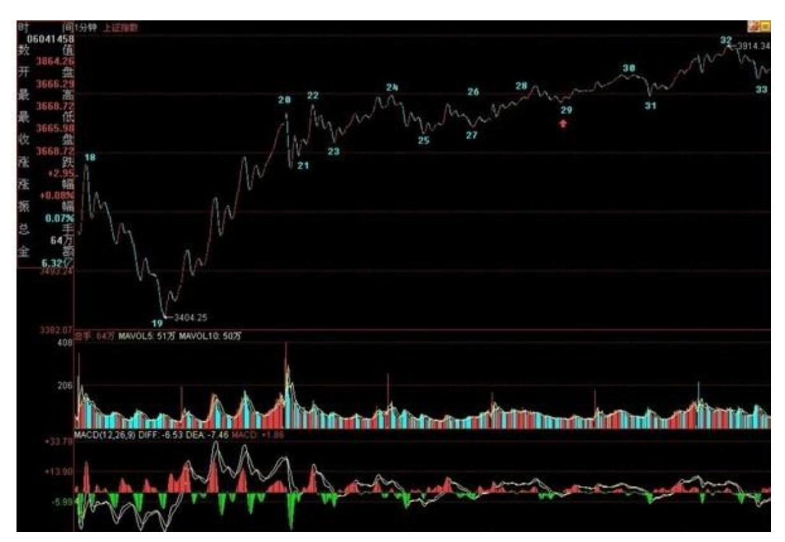
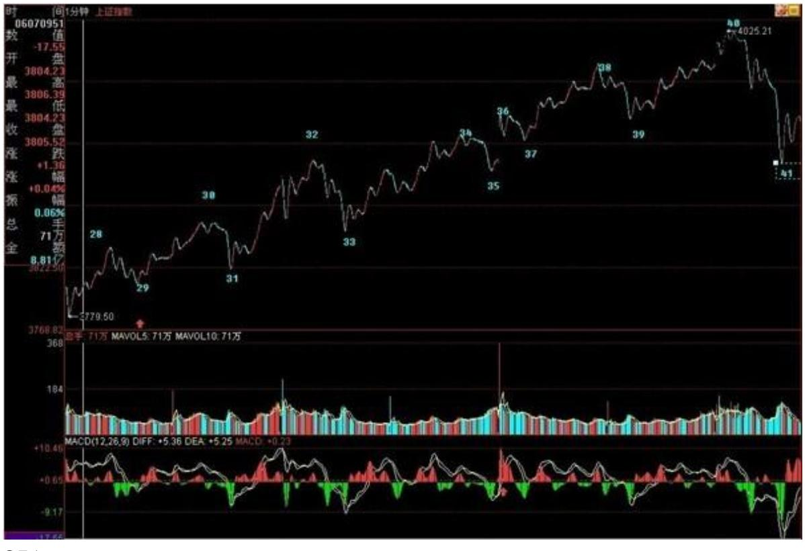
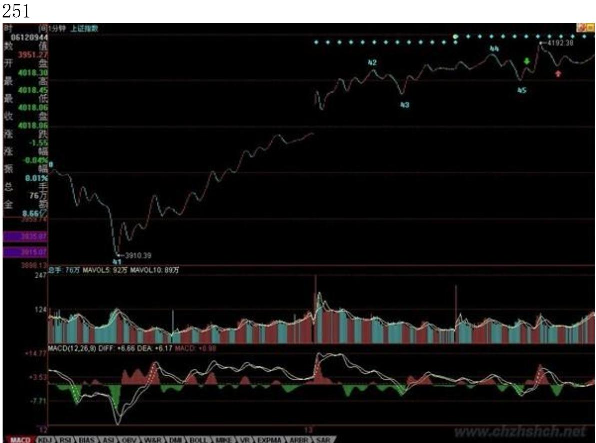
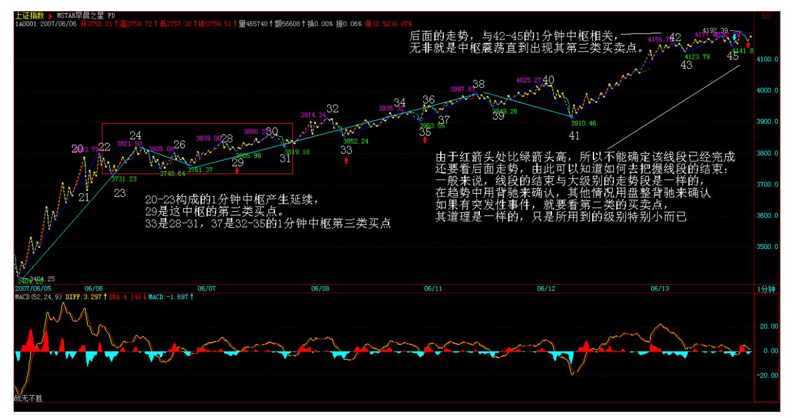
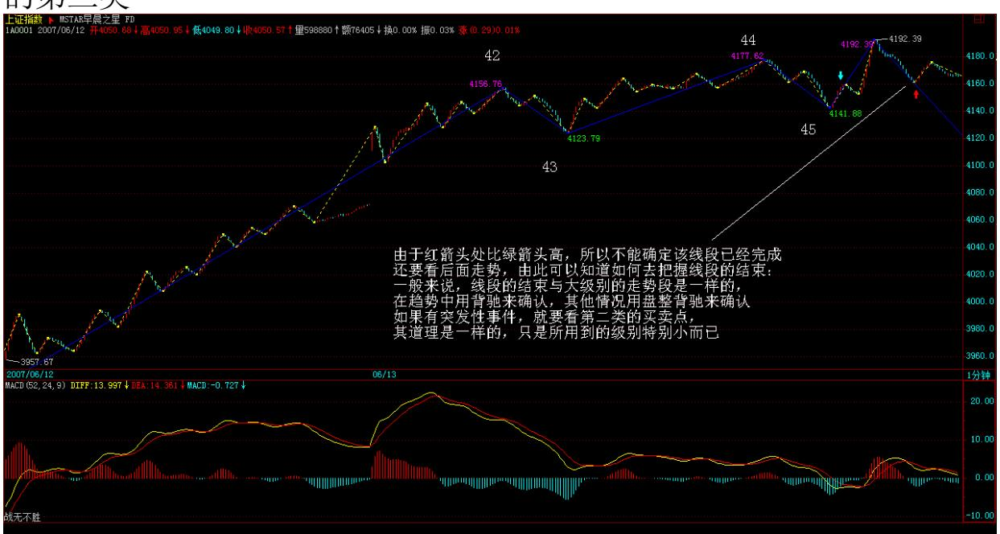
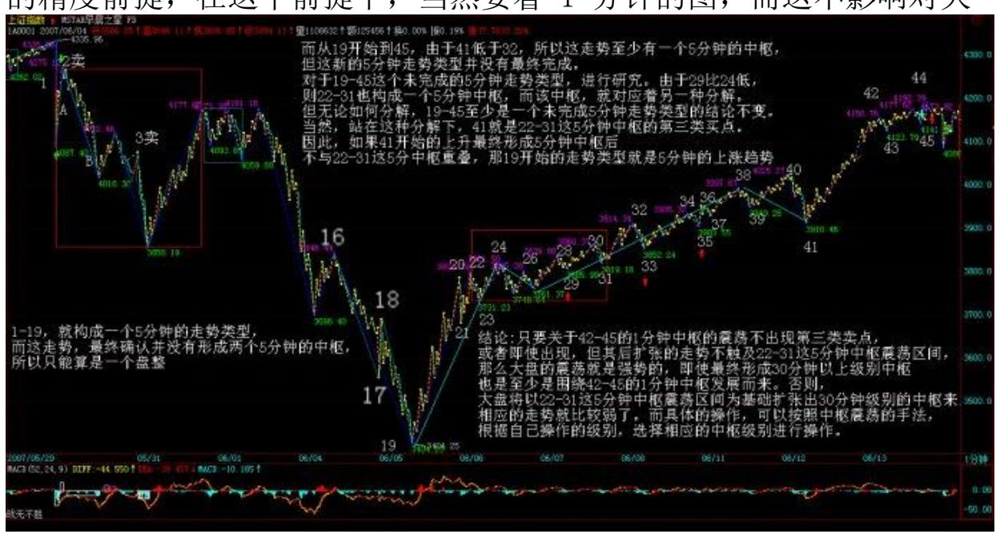
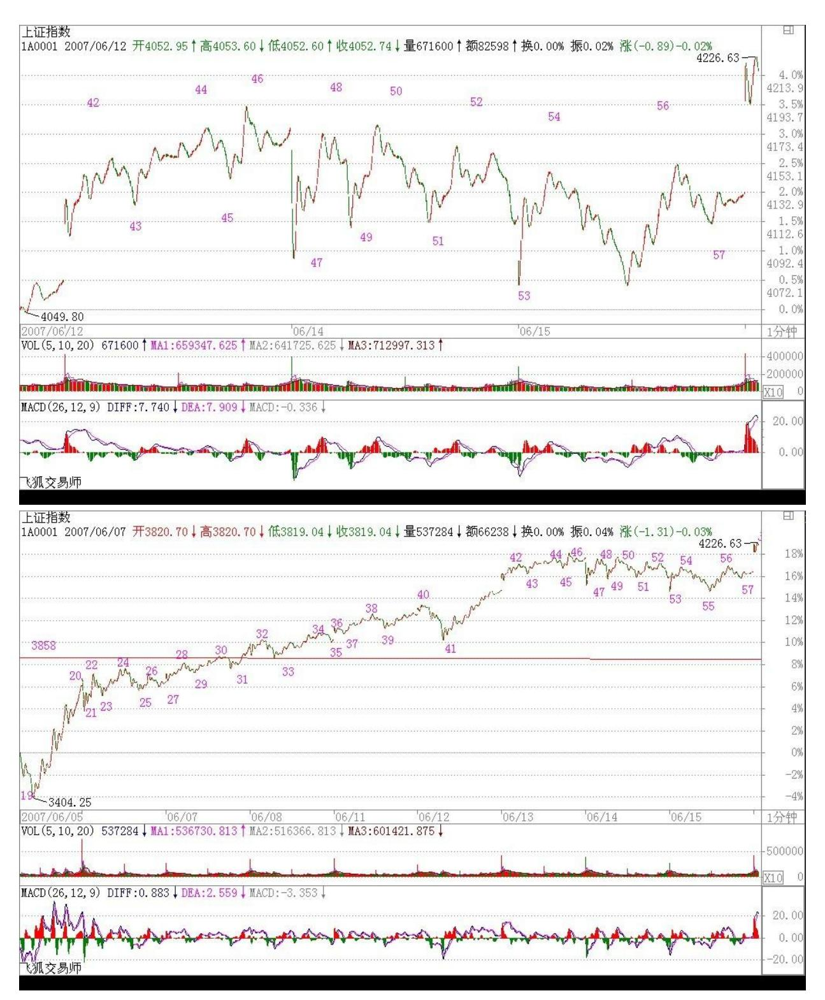
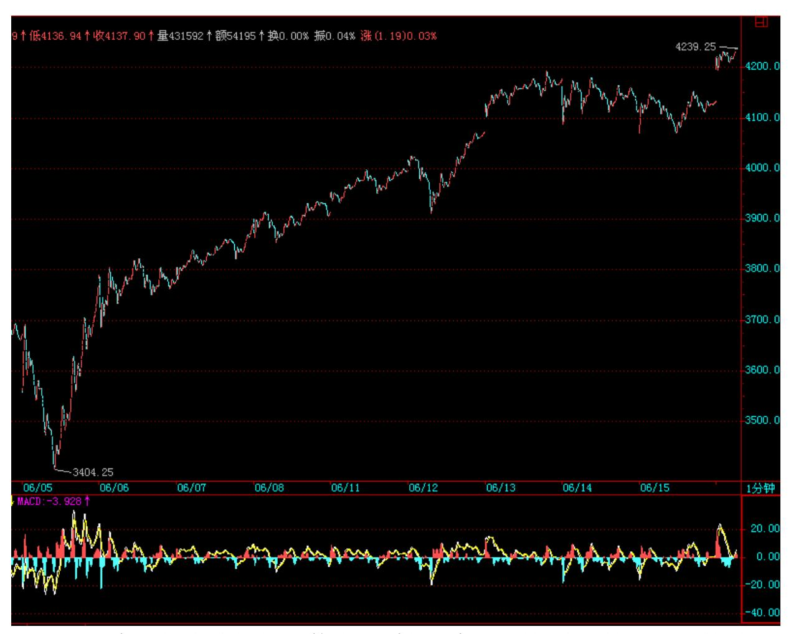
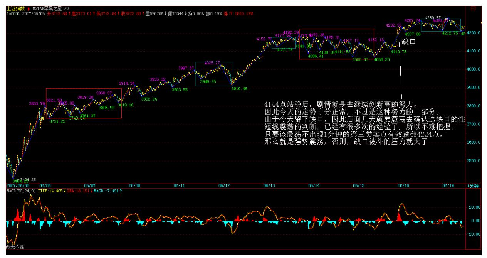

# 教你炒股票 59:图解分析示范四

(2007-06-14 08:23:43)出差,必须用三张图才能把落下的走势补上。 对于初学分析的人,最难搞的就是分清楚线段,所以,在每张图上, 都继续用数字标记每一段线段,从中不难学会究竟线段是如何分的。

有人可能要问,为什么有些线段延续上百点甚至更多,而有些很短。

这没什么奇怪的,是否线段,关键看走出来的形态,如果任何低点比 前一个高点都高,那么即使这情况无限延续下去,也依然只是一线 段,这和幅度没关系。

还有,前后两线段间,不可能是同向的,同是向上或向下不可能构成 两个前后相邻的线段。而且,由于线段都至少呈现上下上或下上下, 所以线段不存在一条直线走平的可能,由此也知道,为什么一字涨 停,无论如何延续,还是低于线段的级别,是最小级别的。

下面,先把三张图列出来,三者之间是连续的,根据上面的标记可以 明白。由于 K 线太多,不能放到一张图上,否则看不清楚。

250

252 253 图一中,20-23 构成的 1 分钟中枢产生延续,29 是这中枢 的第三类

买点。图二中,33 是 28-31,37 是 32-35 的 1 分钟中枢第三类买 点。图三中,由于红箭头处比绿箭头高,所以不能确定该线段已经完 成,还要看后面走势,由此可以知道如何去把握线段的结束:一般来 说,线段的结束与大级别的走势段是一样的,在趋势中用背驰来确 认,其他情况用盘整背驰来确认,如果有突发性事件,就要看第二类 的买卖点,其道理是一样的,只是所用到的级别特别小而已。而对于

图三,后面的走势,与 42-45 的 1 分钟中枢相关,无非就是中枢震 荡直到出现其第三类买卖点。

254 255 注意,在前面一课的 7-8-9 中,由于 8 下来的低点 3994.57 与7 中最后一个高点 3994.21 极为相近,如果点数只用到个 位的精度,两者就完全一样的,所以在这种情况下可以看成是有重合 的,因此可以分成三个线段。当然,如果精度要求到小数点后两位, 那么这 7-8-9 其实可以看成是一个线段。一般来说,如果这两者如此 相近,而且8 中也带着明显的下上下,所以还是看成三线段比较好。 当然,如何看,关系到你事先确认的精度,关键是统一去看,至于按 哪种精度,都没有任何实质影响。

有人可能又要问,怎么总是说 1 分钟的图?其实,看什么图并不重 要,从 1 分钟图看起,只不过意味着这分析的基础有一个 1 分钟图 的精度前提,在这个前提下,当然要看 1 分钟的图,而这不影响对大

级别的分析。例如,1-19,就构成一个 5 分钟的走势类型,而这走 势,最终确认并没有形成两个 5 分钟的中枢,所以只能算是一个盘 整。而从 19 开始到 45,由于 41 低于 32,所以这走势至少有一个5 分钟的中枢,但这新的 5 分钟走势类型并没有最终完成。

对于 19-45 这个未完成的 5 分钟走势类型,可以进行仔细的研究。

由于 29 比 24 低,则 22-31 也构成一个 5 分钟中枢,而该中枢, 就对应着另一种分解。但无论如何分解,19-45 至少是一个未完成 5

分钟走势类型的结论不变。当然,站在这种分解下,41 就是 22-31这 5 分钟中枢的第三类买点。因此,如果41 开始的上升最终形成 5分钟 中枢后不与 22-31 这 5 分钟中枢重叠,那么这 19 开始的走势类型 就是 5 分钟的上涨趋势了。

由上面的分析,对短线的走势就有一个明确的结论,只要关于 42-45 的 1 分钟中枢的震荡不出现第三类卖点,或者即使出现,但其后扩张 的走势不触及 22-31这 5 分钟中枢震荡区间,那么大盘的震荡就是强 势的,即使最终形成 30 分钟以上级别中枢,也是至少是围绕 42-45 的 1 分钟中枢发展而来。否则,大盘将以 22-31 这 5 分钟中枢震荡 区间为基础扩张出 30 分钟级别的中枢来,相应的走势就比较弱了。

而具体的操作,可以按照中枢震荡的手法,根据自己操作的级别,选 择相应的中枢级别进行操作。

256 257看待当前资本市场必须具有的基本智慧(2007-06-18 08:18)无 论管理层还是投资者,对当前资本市场都应该具有如下的基本智慧: 一、资本市场不仅能成为经济的晴雨表,更能成为经济发展的核心动 力如果说以土地承包制为起点的农村改革导致改革开放后第一次生产 力的大释放,以市场经济的确立为起点的城市改革导致其后第二次生 产力的大释放,那么,以股权分置改革为起点的资本市场大变革,将 导致比前两次远为重要的第三次生产力的大释放。前两次生产力的大 释放,都是在实体经济层面,是经济发展水平不高时的产物,而后者 是实体经济发展水平达到一定层次后才能出现也必然出现的产物,比 起前两者,对中国社会的影响更为深远。不认识到这一点,就缺乏了 看待当前资本市场必须具有的最基本的历史视角。资本市场不仅能成 为经济的晴雨表,更能成为经济发展的核心动力,不认识这一点,只 能是历史性的短视。

如果说第一次生产力的释放,带来了万元户、乡镇企业;第二次生产 力的释放带来了十几年的中国经济奇迹;那么第三次生产力的释放, 将使得中国出现一批世界性的企业、一批世界性的财富巨人、一个世 界性的资本市场与资金大平台,更重要的是,使得中国在这场资本全 球化的大竞赛中最终胜出,打下最基本也是最坚实的基础。这是一场 经济、文化、军事等方面的综合竞赛,但经济起着决定性的作用。在 一个资本全球化的时代,没有资本的力量,没有资本市场的动力,是 不可能成为一个经济大国,更不可能成为一个对世界有着稳定、持 续、全面影响力的世界性大国。

二、社会的财富观念将被彻底改变,由此带来社会结构与思想的深刻 变革文化、观念,没有对错,只有是否适时。资本就是一种文化、一 种观念。无论你愿意与否,资本是当今一切最有力量文化的源泉。在 一个资本全球化的时代,任何企图攻击、摧毁资本的力量,都要借助 于资本的力量。资本无处不在,资本以及相应的财富文化、观念,构 成当下世界最基本的底色。

当社会财富积累到一定阶段后,物质决定意识,必然导致社会大众财 富观念的变化。当中国社会依然以实体经济为主时,社会大众的财富 主要集中在有形的资产上,而当虚拟经济出现并逐步走向成熟后,必 然对应着股权等无形资产投资的大众化,由此带来社会财富观念与金 融意识的深刻变革,因此为市场进一步发展打下坚实基础。

258 建立在实体经济上的有形财富旧观念的被打破,以虚拟经济为基 础的无形财富新观念的被建立,都是不随任何人意志为转移的历史趋 势。无论历史是否宏大叙事,但历史的车轮总是宏大叙事地碾压过一 切挡车的螳臂。而具有新型财富观念的人所构成的社会,其结构与思 想必然发生深刻的变革。一个围绕资本市场而构建的经济体系将逐步 形成,资本市场将成为经济结构的关键点,资本市场所构建的文化、 观念,将逐步渗入到社会文化、观念之中,将深刻地影响所有人的生 存状态。

资本化生存,将是今后中国人的基本状态。资本化,就是今后所有中 国人的共业所在。

三、虚拟经济本质上是不可调控,只能进行有效监管虚拟经济是以股 权制度设计把未来财富以证券化等虚拟形式体现在现在的资产价格 上,虚拟经济是以预期为变量的,是面向未来的,这与实体经济以过 去的积累为依托有着本质的区别。证券化的资产价格必然提前反映对 经济的未来预期,而这个预期是随着时间不断变化的,由此构成了市 场的波动。虚拟经济中,价格偏离现实的所谓合理价值是常态。所谓 涨就涨过头,跌也跌过头,是理所当然、天经地义的。

虚拟经济就这样,这是由其本质决定的。如果不认识这一点,用实体 经济的老眼光来看新问题,只能是左右挨巴掌,被市场所戏弄。

而站在虚拟经济的角度,无所谓涨跌过头,一切都反映着当下对未来 的预期。任何一个人,买入股票只是因为他预期要涨,卖出股票只是

因为他预期要跌,预期的理由各色各样,但预期的本质是一样的,市 场走势本质上是各种预期的合力构成。而一个所谓的调控,本质上只 是让市场的预期发生改变,但改变不了的,还是这市场走势只是各种 预期合力的本质。而人不是上帝,人的预期,从来都不可能精确、划 一的,所有关于理性预期的假设都被市场情绪化的闹剧所打破。因此 一个以调控为主的资本市场,其中的调控者注定要在打压与救市之间 疲于应付。

正由于虚拟经济的不可调控,就使得对规则的确认与维护成为虚拟经 济监管中唯一可行的有效手段。这道理就如同一个裁判不可以去调控 比赛的结果,但可以根据规则去维护比赛的进程一样简单,但这一点 似乎并不是每一个应该明白的人都能真正明白。任何市场,都不免有 假货,但不能因为有部分的假货就对市场进行全面打击,而是要加大 监督稽查,打击假货,增加优质股票的供给,这才是一个好的监管者 该干的事情。

四、资本化生存,给任何人提供了跨越式发展的可能在实体经济层 面,一个人要成功,获得商业利益,必须精通各种社会关系,花大量 的时间于其中折腾,而在资本化生存的虚拟经济中,给任何人提供了 跨越式发展的可能。一个人,完全依靠自己的智慧独立去战胜市场, 这种可能性大为增加。在这种生存状态下,一个人是否成功,完全可 以更多地依靠个人259 的修养与修为,而不用看任何人的面色,甚至 与年龄、体力、性别都不再密切相关。

在资本化生存的虚拟经济中,世界更加平面了,任何人与成功及失败 的距离都更加短了。一个所谓的成功者,完全可以在下一秒就成为一 个失败者。任何级别的财富,在虚拟经济、资本市场中都不值得一 提。而虚拟经济、资本市场的发展现实,超越了所有旧有理论,如何 打破旧观念、创造新观念,让理论为现实服务而不是相反,则是市场 发展留下的一个全新课题。

而对于个人来说,一个全新的机会、一个全新的世界,一切都将被全 新定义。当然,这里有所谓的领跑者,但这些人与失败的距离并不比 任何一个所谓落后者与成功的距离更远,而这个距离,由每个人的贪 婪、恐惧与智慧相关。

缠师:今天的走势没什么可讲的,昨天都已经描述得很清楚了。技 术、心理、政策等压力,都需要在这里震荡消化。由于今天没完全补 上缺口,因此该位置依然是短线的关键,当然,上面说的 42-45 的 1 分钟中枢,已经延伸 9 段,成为一个 5 分钟中枢了,后面具体的分 析,在上面的文章里已经写了,就不再多说。深圳受到 13700 点的吸 引,短线,能否站稳该线对大盘走向有极大的引导作用。

注意,在中枢震荡中,安全的作法应该是先卖后买、形成节奏。其实 这问题很简单,从低位上来的筹码,当发现单边走势结束,进入较大 级别震荡时候,其标志就是出现顶背驰或盘整背驰,这就要求减磅, 然后等震荡下来,出现底背驰或盘整背驰再回补,这样差价才能出 来,成本才能下降。如果是先买后卖,那唯一可能就是在单边的时 候,你的仓位不高,所以才会不卖股票也有资金,这其实是节奏先错 了的表现。

当然,这些都需要通过练习才能熟练。而且必须注意,一旦震荡的力 度大于前面有可能形成第三类卖点时,就一定要停止回补,等待第三 类卖点引发的下跌出现买点时再介入,很多人经常出问题,就是心里 先假设一个可能的跌幅,觉得肯定跌不深,这都是大毛病。一定要养 成只看图形操作的习惯。还是那句话,无论是政策、心理、消息等, 都是市场的分力,而走势是合力的结果,这才是问题的关键之处。

对不起,今天不能回答各位的问题了,下午有一拨人,晚上有两拨都 需要腐败活动的,本 ID 必须去补课,先下,明早见。

262 263 今天的走势依然没什么可说的,把下面的缺口补了后,就继 续中枢震荡,关键是都在等周末的消息面,其实,不管周末有什么消 息,这两天都消化了。因此,尾盘重新冲上 4144 点,收在其下面不 远的地方,也就是很正常的。目前,拨乱反正行情第三目标已经达 到,后面将为第四目标的创新高而努力。当然,前提是先把 4144 点 的 1/2线给站稳了。

个股方面,那 16 只股票里,600432 已经新高,其他会慢慢跟上的, 这种事情肯定有先后的,否则根本忙不过来。如果大盘能如期重新新 高,那么绝大多数仍未新高的股票,都会为此而表现的,这是今后一 段时间内一个重要的利润点。另外,那些创新高后没有大级别背弛, 并且能回试站稳前期高位的,是另一种可关注的利润点。

站在中线的角度,对环保股票的重视将比本 ID 年初强调时有更多的 认同,这是国家大的方向,依然值得中长线关注的。除了那 16 只里 的环保新能源股,像 600636 也可以中线关注,该股在环保股里属于 已经有一定业绩支持的,不像很多股票暂时还是概念,因此对中长线 资金可以关注。该股票在一个月线双底的颈线位上整理,回试时可以 找买点介入,千万别一窝蜂追高,否则就等着受刑折磨。周末,腐败 去吧。2007-06-14 15:33:094144 点站稳后,剧情就是去继续创新高 的努力,因此今天的走势十分正常,不过是这种努力的一部分。由于 今天留下缺口,因此后面几天就要震荡去确认这缺口的性质。短线震 荡的判断,已经有很多次的经验了,所以不难把握。只要该震荡不出 现 1 分钟的第三类卖点有效跌破 4224 点,那么就是强势震荡,否 则,缺口被补的压力就大了。如果不会看的,可以看 5 日线。个股, 那 16 只里,今天 600635 也创新高了,其他会陆续跟上的,因此也 没什么可说的。

马上要去亦庄看一个项目,车在外面等着,必须走了,所以就不多说 了。对不起,明早见。2007-06-18 15:16:38264
