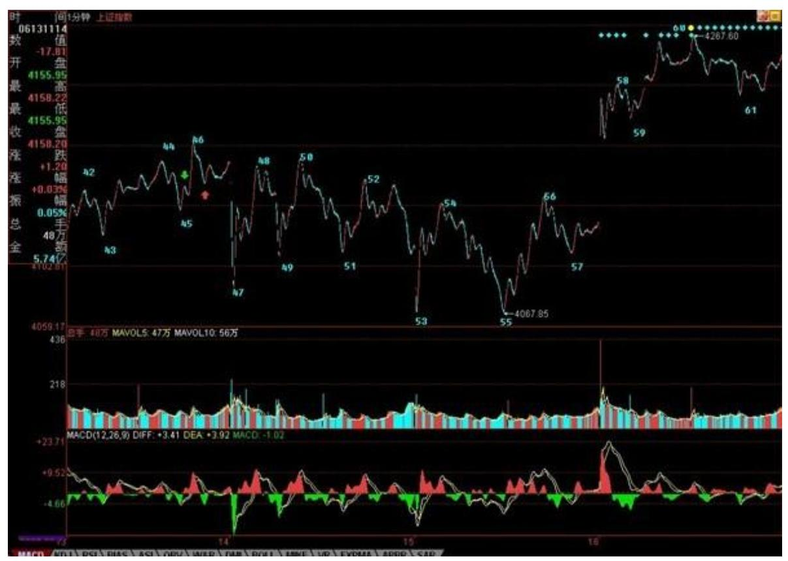
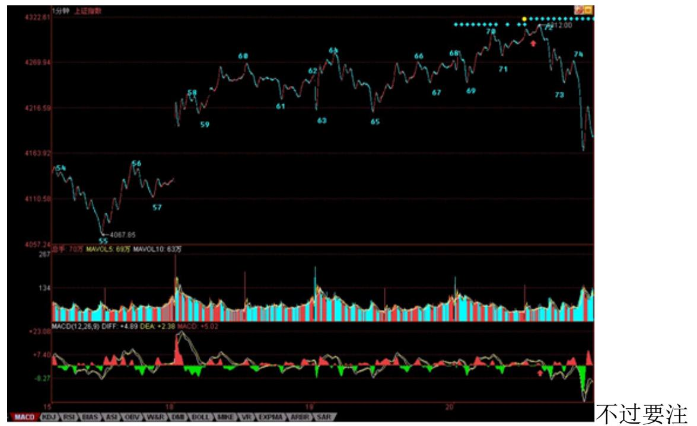
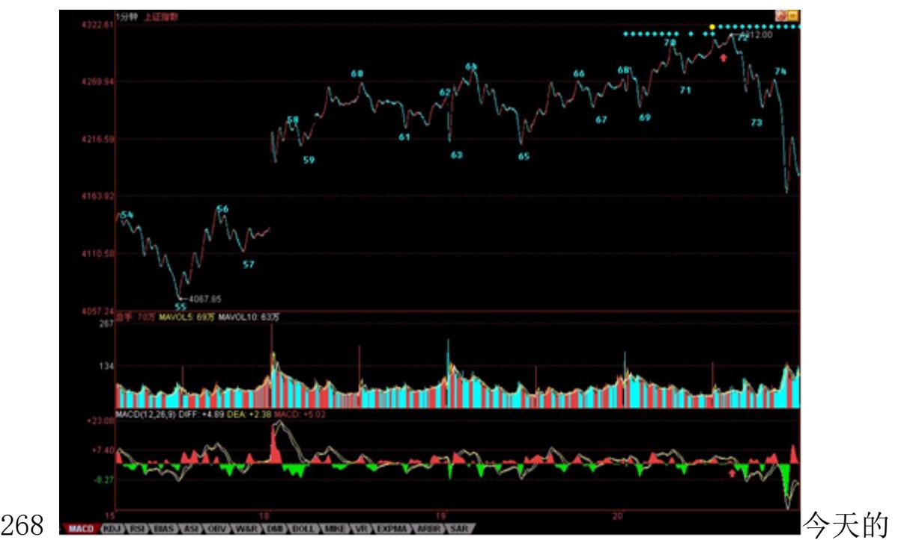
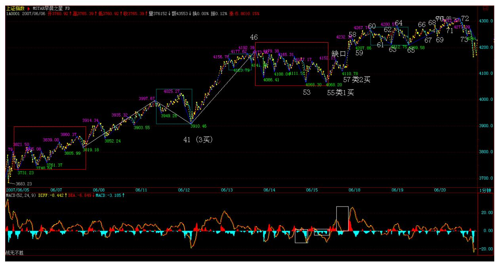
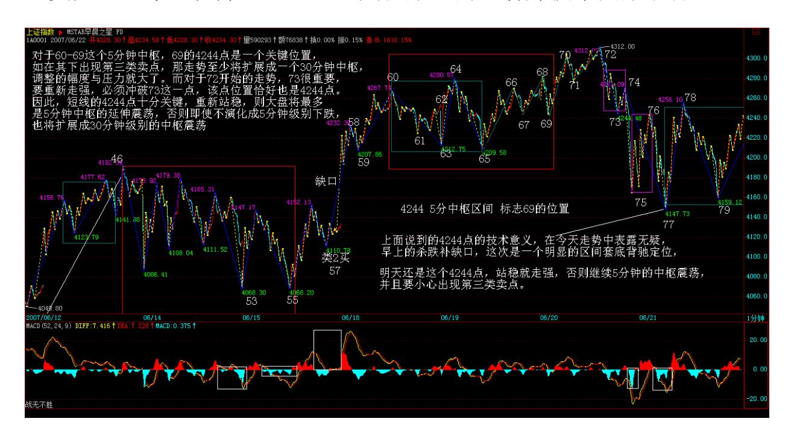

# 教你炒股票 60:图解分析示范五

(2007-06-19 08:04:06)其实,枯燥的图形,里面包含着很深的心理学 意义。走势,本质上是预期的合力。而预期,本质上是心理层面的。 只不过对于市场来说,可以被当成分力去形成市场合力的预期,都是

被外化为市场买卖行为的。你的恐惧,如果光是在那里恐惧而没有实 际的行动,那并不构成市场的交易行为。因此,所有市场行为,其实 已经被如此的心理模式给过滤一遍了。

举一个简单的例子,同级别走势从 B0 下跌到 A1 反弹到 B1,再跌破 下跌到 A2,再反弹到 B2,这可以分为两类:一、B2 低于 A1,二、 B2 不低于 A1。显然,第二种情况,会构成某更大级别的中枢,而第 一种情况没有,因此这两种情况是有着本质区别的。在心理层面上, A1 这第一个反弹的起点,有着很强的心理暗示意义,而再次的跌破, 使得这 A1 的价格成了一个很重要的心理位,而交易本质上都是预期 的,这价位就构成了一种实在的预期分类:一、预期能重新上去 A1 并实际交易,二、预期不能重新上 A1 并实际交易、三、观望。第三 种,在实际的走势中不产生实际的交易,因此一、二种心理预期构成 了市场合力,而市场的走势是这合力的当下痕迹,因此这两种心理预 期的大小,并不需要实际去测量,因为市场的走势就实际反映出来 了。例如,如果实际上不能重新上去,出现第一种 B2 低于 A1 的情 况,那么显然在当下的情况下,第二种心理预期大于第一种。

消息面、政策面、资金面,这面那面,最终作用的都是人心,人心因 预期而交易,这里关系的就是人的贪婪与恐惧、人的贪嗔痴疑慢。而 本 ID 的理论从不预测,没有预期,只跟随着市场合力、市场走势而 行,这里无须贪婪恐惧,看图作业,如此而已。但光知道这点还远远 不够,因为没有预期可能就是最大的预期,没有贪婪恐惧可能就是最 大的贪婪恐惧。不预测、不预期,并不是不可预测、不可预期,而是 不为贪婪恐惧而预期、预测,是根据走势的自身规律来。

走势是有规律的,这规律是不患的,这不患的根源在于人贪嗔痴疑慢 的不患。为什么本 ID 要强调当下分解的多样性?因为走势本身就是

当下形成中的,是市场各种预期的合力当下画出来的,而每种画法都 是不患的,都是源自人的贪嗔痴疑慢,因此每种多样性的分解都是符 合理论的,多样性不是模糊性,而是多角度去让市场本身自己去画地 为牢,由此使得市场的走势万变不离本 ID 理论的控制之中,而这, 恰好是市场自身的规律之一。

266 不妨看看上图,上一课刚好说到"红箭头处比绿箭头高,所以不 能确定该线段已经完成,还要看后面走势,由此可以知道如何去把握 线段的结束" ,有人可能问,为什么在这个位置不可以去预测、预 期?因为市场自身并没有完成。但这里的未完成,是站在人观察的级 别上说的,因为所谓的走势,首先是你观察的走势,没有离开你观察 的走势。不同倍数的显微镜下的世界是不同的,但市场操作的成本、 交易通道、资金规模等限制了人观察并能实际操作走势的显微镜倍数 不可能无限小下去,所以必须确定一个最低级别的线段,把其下一切 波动给抹平了。当然,根据严格的理论,用每笔成交当成最低级别, 然后以此构筑线段,这样可以严格地分辨任何级别的走势,但这根本 不具有操作性,特别现在交易成本增加,可操作的级别必然要增大, 因此,一些可操作级267 别下的波动,必须要忽视掉。

站在最严格意义上,45-46 线段构成 43-44 线段的盘整背驰(注意, 力度比较的是下面所有红柱子的面积之和。)而细致分别线段以下级 别,就知道 45-46其实是一个小级别转大级别,而红箭头后第一次拉 起不创新高,就可以出掉了,为什么,因为后面必然形成下上下的重 叠结构,也就是有一个小中枢了,而线段以下级别的同级别操作,是 不参与这类中枢的。当然,这是按最严格的,并没有太大操作意义的 分析。而实际的操作中,大概真在有意义的操作,都至少是 1 分钟以 下线段级别的(娇:改一分钟线段以上级别)。因此,在该图中,如果 你是按 30 分钟级别操作的,46-47 的波动就可以不管的,从 3404开 始的反弹,一个标准的 5 分钟级别的上涨,因此你的持有就至少一直 等待这 5 分钟级别的上涨出现背驰或突发破坏为止。

显然,46-55 是一个 5 分钟的中枢,55 跌破 53 后明显盘整背驰, 各位也不难发现,如果把 55 当成第一类买点(严格来说,盘整背驰 无所谓第一类买点,只是这样来类比),57 就是一个第二类买点。

55-60,是一个标准的线段级别的上涨,59-60 的背驰足够标准,看看 下面 MACD 标准的黄白线回拉 0 轴,然后60 新高,而柱子面积与黄 白线高度都比前面不如,由此就知道了。因此,按照理论,60 后必然 有调整回拉 58 之下,而实际上 61 就比 58 低,也就是说,58-61形 成一个新的 1 分钟中枢,该中枢是否扩展成 5 分钟的,以及上一个 5 分钟中枢的最高点,也就是 46,是否被重新跌破,都是今后走势的 关键。如果 46 不再被触及,那就是超强走势,意味着 3404 点开始 的 5 分钟上涨走势依然延续。

这里必须强调突发消息对市场走势以及操作的影响是不必过于在意 的,本质上,任何突发的消息,不过增加了一个市场预期的当下分 力,因此,最终还是要看合力本身,或者说是市场走势本身。一般情 况下,由于背驰的精确定位需要用区间套的方法,所以突发消息,最 不幸的,就是在这精确定位期间出现,例如这次 530,就是这样。当 然,这是一种小概率事件,更多情况,突发消息在背驰的精确定位后 出现,这样突发消息对操作的影响就是 0 了。而对于那种最不幸的情 况,用一个第二类卖点就足以应付,因此,突发消息出来后,在实际 的操作中就不能放过这第二类卖点。

意,并不是任何第二类卖点都需要反应的,这和级别有关,例如你是 月线级别的,那这次所谓的大跌,看都不用看,爱跌不跌,随他去。 即使你是 5 分钟级别操作的,如果某突发消息连一个 1 分钟的中枢 都没破坏,只制造了 1 分钟以下级别的震荡,那么在所谓的第二类卖 点,也是不用管的。原则很简单,任何消息,都只是分力,关键是看 对合力的影响,看他破坏了多大级别的走势,这一切都反映在实际走 势中,看图作业就可以了。

注意,突发消息破坏的级别越大,越不一定等相应级别的第二类卖 点。例如,一个向下缺口把一个日线级别的上涨给破坏了,那么,消 息出来当天盘中的1 分钟,甚至线段的第二类卖点,都是一个好的走 人机会,如果要等日线级别的第二类卖点,可能就要等很长时间、而 且点位甚至还比不上这一点,因为走势是逐步按级别生长出来的。还 有,级别只是区分可操作空间的,为什么按级别?因为级别大,操作 空间按通常情况下就大。但在快速变动的行情中,一个 5 分钟的走势 类型就可以跌个 50%,例如这次大跌,因此,一个这样的 5 分钟底背 驰,其反弹的空间就比一般情况下 30 分钟级别的都大,这时候,即 使你是按 30 分钟操作的,也可以按 5 分钟级别进入,而不必坐等30 分钟买点了。

走势昨天已经说得很清楚,4224 点下不出现第三类卖点,就是强势震 荡。今天的走势,显然符合这个要求。4224 点,就是上图 61这位 置,从 60开始的 1 分钟中枢[4224,4254],今后两天就看这中枢的 第三类买卖点。换言之,还和昨天说的一样,只要不在 4224 点下出 现 1 分钟级别的第三类卖点,那就是强势,至于大盘要展开新一轮上 攻,就要在 4254 上出现 1 分钟级别的第三类买点,否则大盘就在该 区间内震荡继续中枢震荡延伸。

269 关于大盘的剧本不变,但个股之间显然会有分化,因此不能光看 大盘,现在的股票,在技术上无非几类:一、创新高后回试的,这可 以用第三类买点来把握;二、在前期高位下盘整蓄势的,这可以用小 级别的第三类买点把握其突破,或在震荡低点介入;三、反弹受阻拉 平台整理的,这个第二同样处理,只是位置与前期高位有距离;四、 依然在底部构筑双底、头肩底之类图形的,这可以用第一、二类买点 把握。

具体个股就不说了,来这里,如果希望一点脑子都不动,那是不行 的。动脑子得到的东西是你自己的,否则永远都不行。

270 今天走势十分正常,一个正常的中枢震荡,下午 13 点半附近的 背弛如果还不能当下看出,那么就要抓紧学习了。具体的分析,将在

课程 61 里。如果当下没能分析出来的,请先自己分析一下,然后对 照明早的课程,这样才能提高。

由于周一那缺口还在那里,因此成为行情发展的一个隐患,前面已经 说过,只要震荡触及 4192 点附近的 46,那么中枢就将扩展。今天的 走势已经触及该点,所以后面将是一个大的中枢震荡。短线还是看在 4224 点的 61,如果一个 1 分钟走势不能重新触及该点,就会形成一 个 5 分钟的第三类卖点,那么震荡的区间就要往下扩展。如果能重新 站稳 4224 点,那震荡依然是强势的。中线看,4144 点的 1/2 线十 分关键,如果该线站不稳,那么大盘的调整级别就加大,否则就问题 不大。不会看的,短线还是看 5 日线,中线看 5 周线,不破就问题 不大。

271 272 个股方面,那 16 只里继续有几只新高了,其他在震荡后也 会跟上的。昨天说那四种技术形态的个股,必须按照技术图形分别对 待。

特别是创新高的股票,必须注意有没有大级别背驰,有的,一定要小 心,小心中了多头陷阱。如果没有背驰,或者盘整背驰最终转化为第 三类买点,才可以介入。至于,其他形态的,看好技术图形就行。

\*\*\*\*\*\*\*\*\*\*\*\*\*\*\*\*\*\*\*\*。

解盘及互动问答:

#### \*\*\*\*\*\*\*\*\*\*\*\*\*\*\*\*\*\*\*\*。

1. 网友全线飘红: 检讨。自己虽然是 3 买进的 569,但发现是盘整 一直没有出来。只盯着是缠 MM 的股票,就忘了缠 MM 的理论了,没 有挣到钱,损失时间成本。 2007-06-20 15:35:04缠师:你看看 569 的 60 分钟图,请说说 10.78 元那天是什么?一个这么大级别的背 驰,怎么可能 1、2 天就调整过来?本 ID 当天已经说得很清楚,剧 本改了,要买要等待买点出现。

再说一次,就算本 ID 没有专门提醒剧本改了,也应该看图作业,如 果不明白,看看像 569 这样的背驰,一般是怎么调整的。569 是本ID 的股票,难道 000999、000777、600635、600777、000778、600432、 000915 等等就不是?本 ID 对任何股票都只是按图作业。

#### \*\*\*\*\*\*\*\*\*\*\*\*\*\*\*\*\*\*\*\*。

- 2. 网友 [匿名] 新股手: 老大昨天生气,跑了,不上课了。安慰一 下先。呵呵。俺没学好,但俺只用你教的盯 5 日线,也蛮实用。530 上午高点跑出来了,躲过一劫。今天上午也出掉了持股的 7 成。呵 呵。俺的两个问题昨天没讨到答案,今天加几个:(1)你以前说中移 动回归后,联通有戏。现在中移动回归确定了,俺可以重仓联通吗? (2)416 既没业绩又没题材,还要争第一吗?(3)能不能多选几支 中线的股?申明不是你的。这里有人呼吁过。我顶一下。 2007-06- 2015:43:08缠师:好好学习理论,如果你对理论有感觉。其他问题, 没什么意义。一切按图作业。至于 600050,中线当然没问题,就看你 有没有这个耐心。一般这种股票,散户都没什么必要参与。散户完全 可以根据最多 30 分钟级别进行短线操作,这样的效率是最高的。当 然,前提是你真明白了本 ID 的理论。
- 273 3. 网友 [匿名] abc: 我们对于 5 分钟或 30 分钟的线段划分 比较糊涂,大师能不能下次分析一个 5 分钟的图?2007-06- 2015:45:39缠师:多少分钟的图和多少分钟的级别是没什么关系的。 如果看 5 分钟、30 分钟去决定线段,等于用倍数很小的显微镜去 看,与 1 分钟的唯一区别就是精度低了。用 1 分钟的图,一样可以 判断出年线的中枢。

缠师:对不起,今天外地来了客人,本 ID 要去腐败去了。技术上的 问题,明天 61 课都会说到的,如果可能,请先行分析,明天再对

照。先下,再见。2007-06-20 15:53:312007,人民币私人股权投资基 金元年(2007-06-20 08:13)经过 20 余年的改革开放,一大批优秀的 企业不断涌现。这些企业在各自行业实现快速发展,成为人民币私人 股权投资基金的最佳投资对象。但在股权分置改革之前,没有良好的 退出渠道,因此,该类基金只能停留在理论探讨阶段,不具备太大的 实际操作价值。

而股权分置改革之后,上市公司股份有了一个通畅的退出渠道,加之 目前公司上市的日益市场化,中国资本市场的超常规发展需要更多优 质的上市资源,这些都形成人民币私人股权投资基金的历史发展机 遇。由于人民币非控股发起人股东股票禁售期为 12 个月,而外资非 控股发起人股东股票禁售期 36 个月,客观上形成外资进入门槛较 高,加之政府对外资并购"国计民生"行业的忧虑,为人民币私人股 权投资基金的发展壮大提供了更宽松的环境。

由于前期对资本市场角色的定位存在严重误区,使得中国资本市场的 名声并不大好,而对上市指标的严控,让上市成为一场马拉松式的公 关比赛,往往花费大量财力精力而一无所获,使得许多没有太大背景 的优秀企业,对上市都心存疑虑,甚至有很强的抵触情绪。另一方 面,由于中国经济高速发展的大环境,使得企业的发展机遇众多,并 没有太大的危机意识,而且很多企业都以实体经济模式发展起来,甚 至有些民营企业依然停留在家族式经营的模式下,对上市成为公众公 司,有着巨大的观念鸿沟。

但中国实体经济的长足发展,已使得多层次资本市场的大发展成为必 不可少的一环。而资本市场的基础是其中交易的上市公司,上市公司 的质量成为资本市场发展是否基础牢靠的关键。一个起点就有原罪的 市场不可能有正常的发展,解决上市公司的质量,最根本的就是要确 立市场化的原则,让所有符合上市条件的公司都能在市场化的原则 下、根据企业发展的实际选择合适时机上市,然后通过严格监管、市 场淘汰,让已不达标的公司坚决退市,这样才能确保上市公司的质 量。这里最重要的前提,就是让所有符合上市条件的公司都能按照市 场化的原则上市。可以断言,这一前提正逐步变成现实,这也是中国 274 资本市场成为全球性资本市场的一个必不可少的前提。而该前提 的确立,同样为人民币私人股权投资基金的健康发展提供了最基本的 保证。

另一方面,中国企业在实体经济中普遍进入发展瓶颈,必须与资本市 场结合去获取新的发展动力。那些没有资本市场支持的企业,越来越 面临着被有资本市场强大资金支持的企业挤压、打跨、并购的风险。

对于那些依然企图逃避资本市场的企业来说,在今后将越来越面临生 存压力,在这种压力下,生存还是毁灭,是每一个企业必须面对的头 等问题,而充分利用资本市场发展壮大自己,是所有符合上市条件的 企业一个不能回避的必然选择。可以断言,越来越多的企业将把自己 的命运与资本市场结合在一起,这就为人民币私人股权投资基金的发 展提供充足的可开采资源。

对于管理层来说,一批有社会公信力、规范运作的人民币私人股权投 资基金的大发展,使得未上市资源能得到专业化、市场化、产业化、 国际化的整合,为资本市场提供足够的优质上市公司。更重要的是, 该类基金的发展,使得资本市场的资源配置功能得到更有效的发挥, 由此发展出的并购基金,将为市场的生态平衡起着关键的作用,有着 极为广阔的发展空间。

2006 年 12 月 28 日,中国银监会颁布了新的《信托公司集合资金信 托计划管理办法》,"集合资金信托计划"成为在中国从事资产管理 和结构融资的重要工具。2007 年 6 月 1 日实施的《合伙企业法》, 为人民币私人股权投资基金提供了完备的法律架构和立法保障。换言 之,2007 年 6 月以后,人民币私人股权投资基金的发展已经不可阻 挡,2007 年,必定作为人民币私人股权投资基金元年记入中国资本市 场发展史。

最后,将深圳中小版的基本上市条件附录如下:发行前总股本不低于 3000 万元人民币;发行前净资产在总资产比例中不低于 30%;发行前 无形资产在净资产比例中不高于 20%(不含土地使用权、采矿权、水 面养殖权);发行前连续 3 年盈利,3 年累计净利润不低于 3000 万 元人民币,在扣除非经常性损益后以孰低为准;发行前 3 年经营活动 累计产生的现金流量不低于 5000 万元人民币,或者 3 年累计销售收 入不低于 3 亿元人民币。

附录:今天走势十分正常,一个正常的中枢震荡,下午 13 点半附近 的背弛如果还不能当下看出,那么就要抓紧学习了。具体的分析,将 在课程 61 里。如果当下没能分析出来的,请先自己分析一下,然后 对照明早的课程,这样才能提高。

由于周一那缺口还在那里,因此成为行情发展的一个隐患,前面已经 说过,只要震荡触及 4192 点附近的 46,那么中枢就将扩展。今天的 走势已经触及该点,所以后面将是一个大的中枢震荡。短线还是看在 4224 点的 61,如果一个 1 分钟走势不能重新触及该点,就会形成一 个 5 分钟的第三类卖点,那么震荡的区间就要往下扩展。如果能重新 站稳 4224 点,那震荡依然是强势的。中线看,4144 点的 1/2 线十 分关键,如果该线站不稳,那么大盘的调整级别就加大,否则就问题 不大。不会看的,短线还是看 5 日线,中线看 5 周线,不破就问题 不大。

275 个股方面,那 16 只里继续有几只新高了,其他在震荡后也会跟 上的。昨天说那四种技术形态的个股,必须按照技术图形分别对待。

特别是创新高的股票,必须注意有没有大级别背驰,有的,一定要小 心,小心中了多头陷阱。如果没有背驰,或者盘整背驰最终转化为第 三类买点,才可以介入。至于,其他形态的,看好技术图形就行。

