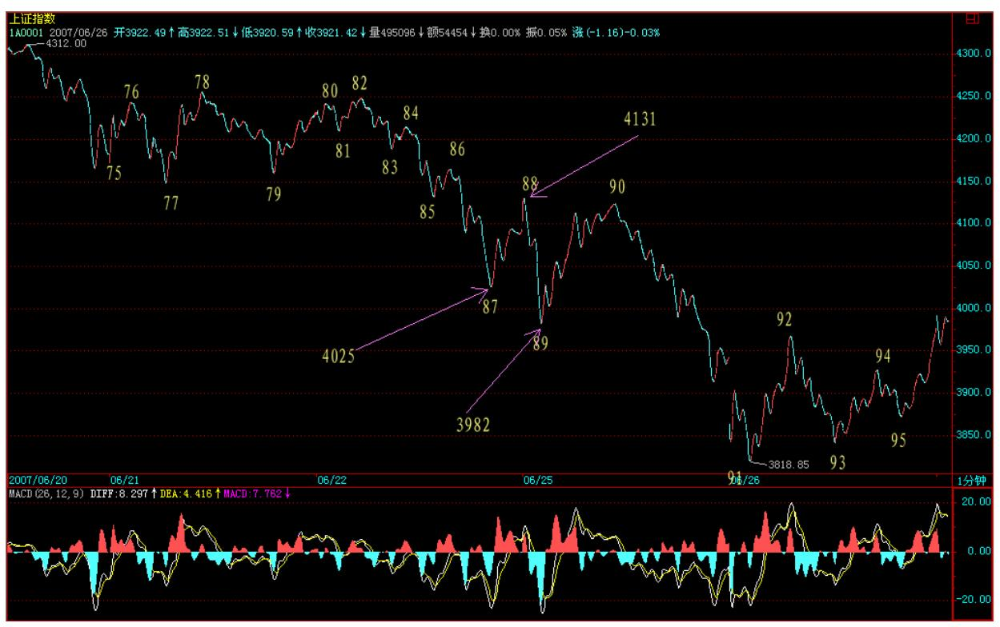
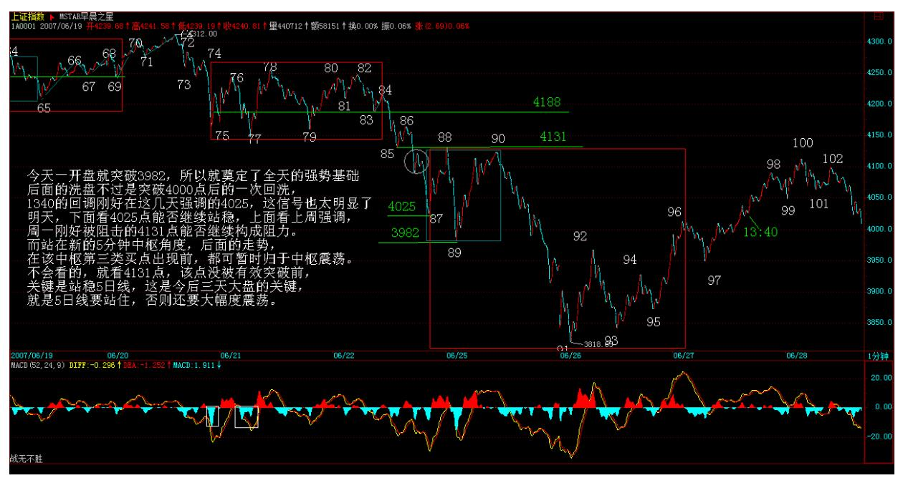
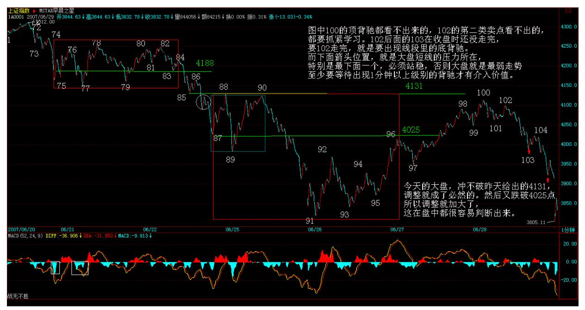
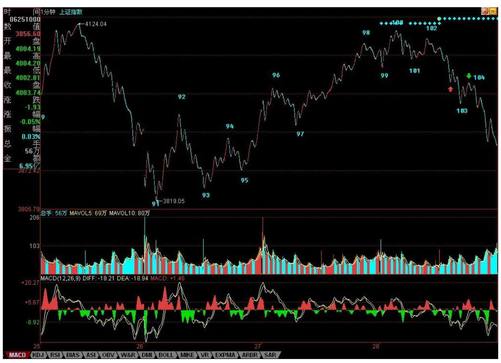
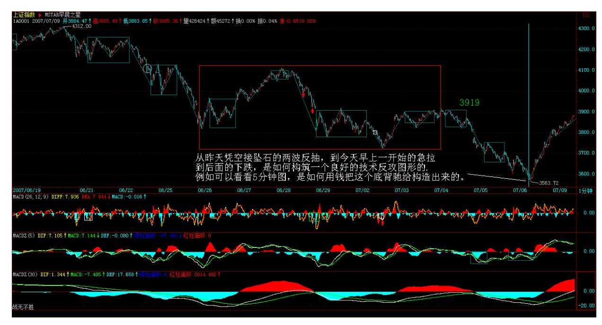
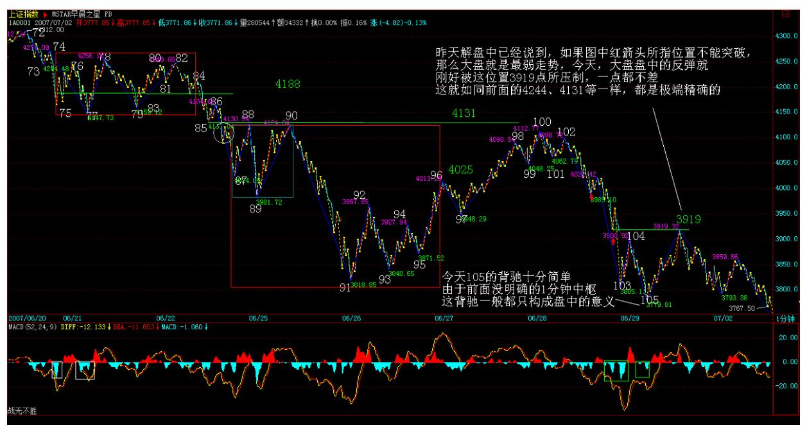
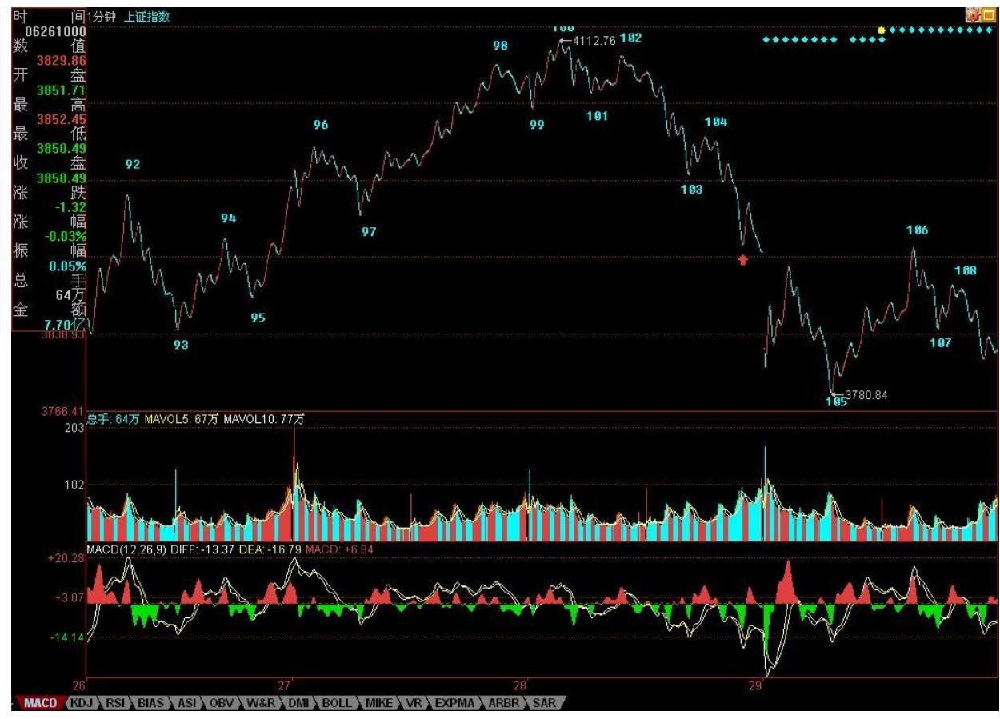
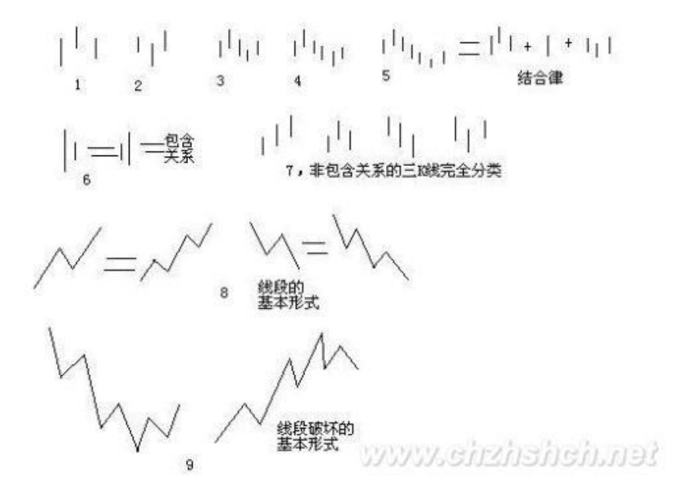

# 教你炒股票 61:区间套定位标准图解

(2010-08-13 09:52:39)个股方面,本 ID 那 16 只股票的剧本一大早 就告诉大家了,本 ID说的是 16 只,已经有 8 只创新高,今天还 3 只涨停的。为什么不16 只一起来,首先这操作不过来,其次,这样是 资金利用率最高的,如果你按照这节奏去轮动操作,对于小资金,你

这次反弹的收益率如果少于 100%,那你的毛病就大了。为什么要看买 卖点,为什么要强调节奏,最终都是为了资金的安全与利用率,这对 大资金同样的,而对小资金,掌握了节奏,你的效率更高。

注意,本 ID 的意思不是你一定要买本 ID 这 16 只股票,只是事先 告诉并直播本 ID 的操作节奏,让大家去把握其中资金运用的道理。

要有效率,必须有节奏,要有节奏,就首先要把握好买卖点,这里的 逻辑关系,请好好思考明白。 今天下午有一个聚会,谈谈心、统一一 下思想,必须下了,明早见。

股市里不动脑子只有死路一条 (2007-06-22 08:30:44) 由于要出差, 先把这线段图贴出来,否则回来就积累一大堆 K 线,要分很多张图 了。昨天说的很清楚了:"明天还是这个 4244 点,站稳就走强,否 则继续5 分钟的中枢震荡,并且要小心出现第三类卖点。"今天的走 势在 4244 点上精确地被再次压制,然后出现大幅度跳水,这些在今 天走势的当下都很容易分析。81-82 的盘整背驰、84 点的第二类卖 点,后面走出一个线段的标准下跌,以红箭头所指微型中枢前后出现 背驰,然后有 87 的转折,但这个转折,由于86-87 没有背驰,所 以,只能是线段下级别的,因此,并不能现在就确定该线段就走完 了,除非重新突破 85 的 4131 一点。

站在中枢的角度,75-84 这个 5 分钟中枢下边在 4188 点,如果后面 的走势不能重新站上去,就要提防形成 5 分钟第三卖点。而前面已经 说过,现在的情况46-87 已经构成一个 30 分钟的中枢,短线的问题 只是这中枢的第三段是否完成。其后就是该中枢的一个中枢震荡,该 中枢区间在[4067,4192],该中枢要管大盘一段时间直到出现 30 分 钟的第三类买卖点。

278 279 缠师:今天一开盘就突破 3982,所以就奠定了全天的强势基 础,后面的洗盘不过是突破 4000 点后的一次回洗,让不坚定分子最 后下车,然后就展开一路的上攻。1340 的回调刚好在这几天强调的 4025,这信号也太明显了。明天,下面看 4025 点能否继续站稳,上 面看上周强调,周一刚好被阻击的 4131 点能否继续构成阻力。周 四,是一个爱震荡的日子,而对周末效应的恐惧,也让明天走势震荡 难免。而站在新的 5 分钟中枢角度,后面的走势,在该中枢第三类买 点出现前,都可暂时归于中枢震荡。不会看的,就看 4131 点,该点 没被有效突破前,关键是站稳 5 日线,这是今后三天大盘的关键,就 是 5 日线要站住,否则还要大幅度震荡。(2007-06-27 15:29:56)

280 281 中线,留给多头去修复季度 K 线的时间只有两天了,这两天 很关键,本 ID 上周就说过,如果能收在 4144 点 1/2 线上是最理想 的。

两天,什么事都可能发生,尽力而为吧。

个股,本 ID 要提出抗议了,那十几只股票,本 ID 不看盘就全面堕 落,一看盘就兴奋,这也太不地道了。里面的其他人也要干活,别都 那么好吃懒做,这样身体会变胖的。一年半载下来,就会和猪八戒为 伍了。本 ID 什么都不会干,就是该砸的时候砸,该买的时候买,现 在,这些股票都是在保持 0 成本赚筹码的阶段,这种游戏很好玩,各 位学会的一定会上瘾的,本 ID 就喜欢上上下下地抽血,是不是本 ID 的基因里有些残暴的残留?各位,什么时候也能一起残暴,那才是炒 股票而不是被股票炒。车来了,马上要走,先下,再见。

282 把图弄上来花了点时间,图中 100 的顶背驰都看不出来的,102 的第二类卖点看不出的,都要抓紧学习。102 后面的 103 在收盘时还 没走完,要 102 走完,就是要出现线段里的底背驰。而下面箭头位 置,就是大盘短线的压力所在,特别是最下面一个,必须站稳(娇 注:站稳才能有新线段生成可能),否则大盘就是最弱走势,至少要 等待出现1 分钟以上级别的背驰才有介入价值。

283 缠师:先下,下午收盘后见。(娇注:2007 年 6 月 20 到 7 月 6日的走势,用严格分段定义后的划分非常清晰,为 1 分钟趋势后接 更大级别盘 5 分钟中枢再接 1 分钟趋势区间套,即下跌+盘+下 跌。)禅师当时的解盘划分就显得混乱,说明理论正确无比,但是当 下用的是人,禅师也难免出错。

284 285

\*\*\*\*\*\*\*\*\*\*\*\*\*\*\*\*\*\*\*\*。

#### 解盘及互动问答:

#### \*\*\*\*\*\*\*\*\*\*\*\*\*\*\*\*\*\*\*\*。

1. 网友石猴:这课的区间套分析方法,实战意义非常大。另:要对最 后一段走势的关键价位敏感,尤其是最高,最低,和三买三卖。2008- 01-27 22:26:31

#### \*\*\*\*\*\*\*\*\*\*\*\*\*\*\*\*\*\*\*\*。

缠师:解盘并说说中短线走势。昨天解盘中已经说到,如果图中红箭 头所指位置不能突破,那么大盘就是最弱走势,今天,大盘盘中的反 弹就刚好被这位置 3919 点所压制,一点都不差,这就如同前面的 4244、4131 等一样,都是极端精确的。谁告诉你本 ID 理论没有预测 功能的?只是预测都是无聊玩意,没必要浪费时间。关键还是当下的 操作。

今天 105 的背驰十分简单,但由于前面没有明确的 1 分钟中枢,所 以这种背驰一般都只构成盘中的意义。昨天已经说过,只有 1 分钟以 上级别的背驰才有参与意义。目前交易成本这么贵,又不是 T+0,所 以不熟练的,一定只能参与一些大级别的活动,太小的,估计只能用 在权证或特别强势的股票上。但技术好的除外。今天,这样的震荡可 以又吸出不少的血。(2007-06-29 15:45:10) 286 由于季线有 500 点 的上影,所以该上影将一路压制 7-9 月的走势,本 ID 的那条 1/2 线,下月将上移到 4159 点,在站稳该线之前,大盘不可能展开象样 的行情,只能如本 ID 在 6 月 4 日文章中所说,就是一个大震荡。 下月的关键是 5 月均线,如果不破,那么大盘还有机会走三角形的整 理,否则,一个平台型是不可避免的。本 ID 在 6月 5 日反弹时已经 明确说过,这个反弹最终不可能演化成 V 型,现在看来,最强的也就 是三角形,其次是平台型,所谓平台型,就是要再次考验 6 月 5 日 的低点。

当然,现在大盘依然存在走三角形的可能,下周是关键。5 月均线不 能有效跌破,而好的介入时机,还是至少是 1 分钟以上级别的背驰。

反弹的压力,3919287 以及最重要的是 5 周均线。对于技术不好的, 对震荡行情没把握的,在 5 周均线重新站稳之前,都可以不参与任何 活动,多读点本

ID 的帖子更好。但是,像技术好的,如同本 ID 般经常要活动一下才 舒服的,就可以在震荡行情中大吸其血。

注意,玩震荡一定要等适合自己资金的针对具体个股的较大买点,然 后到较大级别卖点一定要卖,否则就是坐电梯,没意义了。这种活动 必须多练习才有感觉的,如果觉得自己没有这方面的天赋,那就少 弄,上网多弄 419 算了。

晚上还有应酬,先下了。本周的音乐会也没法开,就用各自猛烈的腐 败活动去替代。周末,腐败快乐。(2007-06-29 15:45:10) 288

