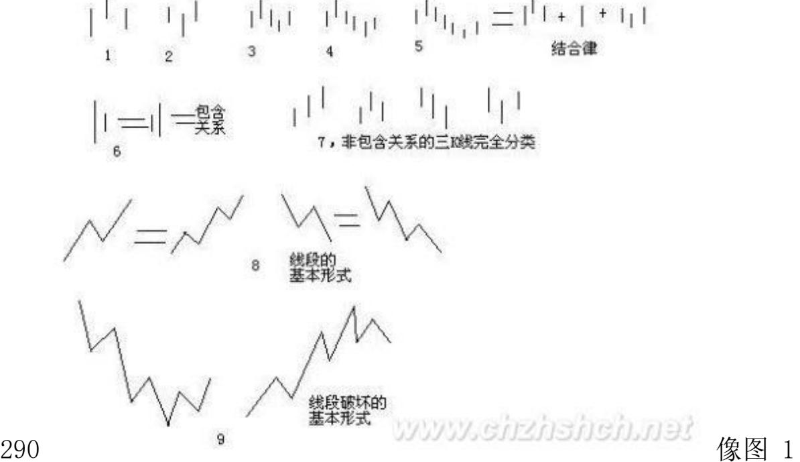
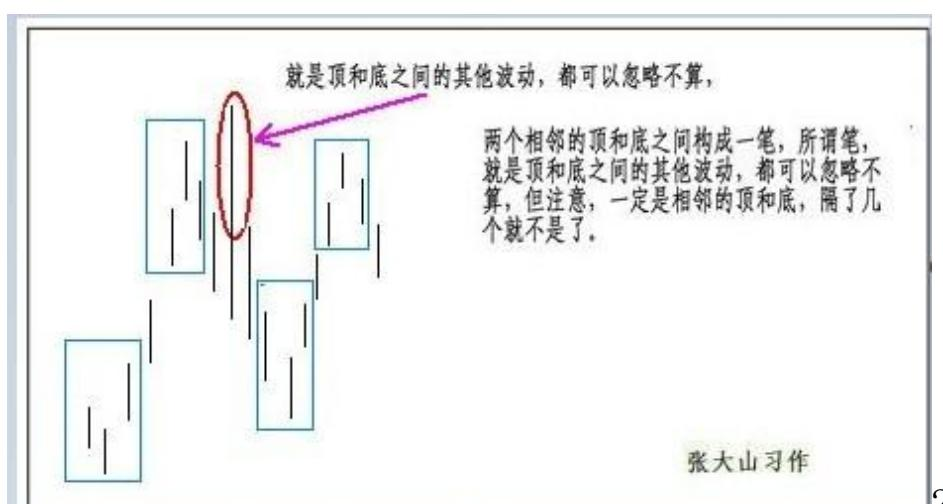
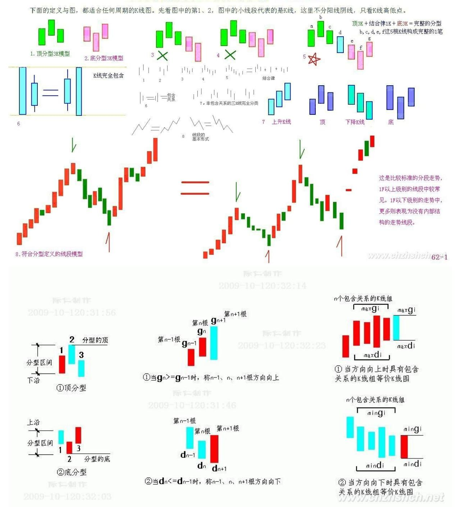
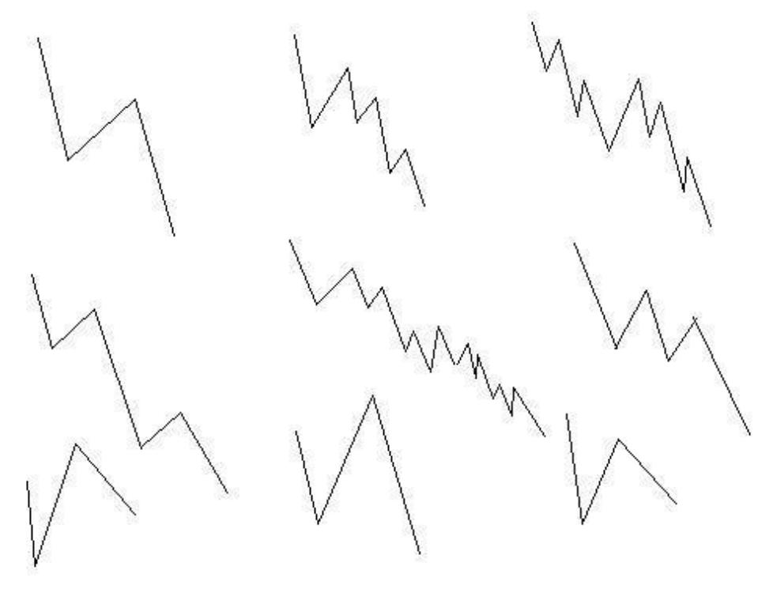
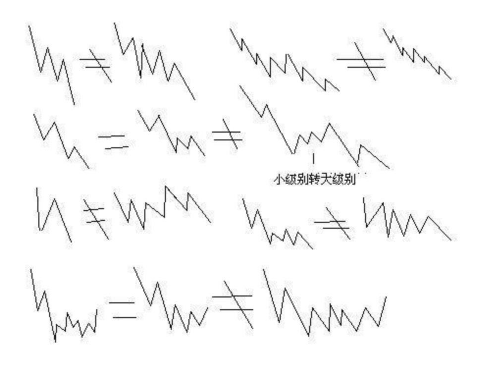

教你炒股票 62:分型、笔与线段

(2007-06-30 09:49:51)在宾馆里闲着等着 10 点开始的腐败,半个小 时,找个面首来面首有点时间紧张,还不如给各位写个主贴,来个课 程,耗费一下各位周末腐败的时间。

瞧了一下,有位叫石猴的网友写了帖子来解释什么是线段,他的理解 还行,但不够严密。其实,本 ID 的线段是可以最精确定义的,本 ID 的理论,本质上是一套几何理论,其有效性就如同几何一般,本 ID理 论当然有失败不严谨的时候,但这前提是几何的基础失败不严谨,不 明白这一点,就不明白本 ID 的理论。这里,就把本来是后面的课程 提前说说。

下面的定义与图,都适合任何周期的 K 线图。先看图中的第 1、2, 图中的小线段代表的是 K 线,这里不分阳线阴线,只看 K 线高低 点。

这种,第二 K 线高点是相邻三 K 线高点中最高的,而低点也是相邻 三 K 线低点中最高的,本 ID 给一个定义叫顶分型;图 2 这种叫底 分型,第二 K线低点是相邻三 K 线低点中最低的,而高点也是相邻三 K 线高点中最低的。看不明白定义的,看图就明白了,这么直观都不 明白,那去和孔男人为伍吧。

顶分型的最高点叫该分型的顶,底分型的最低点叫该分型的底,由于 顶分型的底和底分型的顶是没有意义的,所以顶分型的顶和底分型的 底就可以简称为顶和低。也就是说,当我们以后说顶和底时,就分别 是说顶分型的顶和底分型的底。

两个相邻的顶和底之间构成一笔,所谓笔,就是顶和底之间的其他波 动,都可以忽略不算,但注意,一定是相邻的顶和底,隔了几个就不 是了。而所谓的291 线段,就是至少由三笔组成。但这里有一个细微 的地方要分清楚,因为结合律是必须遵守的,像图 3 这种,顶和底之 间必须共用一个 K 线,这就违反结合律了,所以这不算一笔,而图 4,就光是顶和底了,中间没有其他 K 线,一般来说,也最好不算一 笔,而图 5,是一笔的最基本的图形,顶和底之间还有一根 K 线。在 实际分析中,都必须要求顶和底之间都至少有一 K 线当成一笔的最基 本要求。

当然,实际图形里,有些复杂的关系会出现,就是相邻两 K 线可以出 现如图 6 这种包含关系,也就是一 K 线的高低点全在另一 K 线的范 围里,这种情况下,可以这样处理,在向上时,把两 K 线的最高点当 高点,而两 K 线低点中的较高者当成低点,这样就把两 K 线合并成 一新的 K 线;反之,当向下时,把两 K线的最低点当低点,而两 K线 高点中的较低者当成高点,这样就把两 K 线合并成一新的 K 线。

经过这样的处理,所有 K 线图都可以处理成没有包含关系的图形。

292 而图 7,就给出了经过以上处理,没有包含关系的图形中,三相 邻 K 线之间可能组合的一个完全分类,其中的二、四,就是分别是顶 分型和底分型,一可以叫上升 K 线,三可以叫下降 K 线。所以,上 升的一笔,由结合律,就一定是底分型+上升 K 线+顶分型;下降的一 笔,就是顶分型+下降 K 线+底分型。注意,这里的上升、下降 K线, 不一定都是 3 根,可以无数根,只要一直保持这定义就可以。当然, 简单的,也可以是 1、2 根,这只要不违反结合律和定义就可以。

至于图 8,就是线段的最基本形态,而图 9,就是线段破坏,也就是 两线段组合的其中一种形态。有人可能要说,这怎么有点像波浪理 论,这有什么奇怪的,本 ID 的理论可以严格地推论出波浪理论的所 有结论,而且还可以指出他理论的所有不足,波浪理论和本 ID 的理 论一点可比性都没有。不仅是波浪理论,所有关于股市的理论,只要 是关系到图形的,本 ID 的理论都可以严格推论,因为本 ID 的理论 是关于走势图形最基础的理论,谁都逃不掉。

K 线顶分型、底分型:(附课文学习用图)"第二 K 线高点是相邻三 K 线高点中最高的,而低点也是相邻三 K线低点中最高的,本 ID 给 一个定义叫顶分型";"底分型,第二 K线低点是相邻三 K 线低点中 最低的,而高点也是相邻三 K 线高点中最低的"。

293 新笔定义:

本 ID 想了想,计算了一下能量力度,觉得以后可以把笔的成立条件 略微放松一下,就是一笔必须满足以下两个条件:(1)、顶分型与底分 型经过包含处理后,不允许共用 K 线,也就是不能有一 K 线分别属 于顶分型与底分型,这条件和原来是一样的,这一点绝对不能放松, 因为这样,才能保证足够的能量力度;(2)、在满足 1 的前提下,顶 分型中最高 K 线和底分型的最低 K 线之间(不包括这两 K 线),不 考虑包含关系,至少有 3 根(包括 3根)以上 K 线。显然,第二个 条件,比原来分型间必须有独立 K 线的一条,要稍微放松了一点,这 样,象今天绿箭头所指的地方,就是一笔了,相应那三笔下来就构成 一段了,整个划分就不会出现比较古怪的线段。

294 上升 K 线、下降 K 线: K 线的顶点和底点越来高的几根 K 线 称上升 K 线。一般第二根 K 线的高点比第一根的 K 线的顶点高,就 视为上升 K 线。

K 线的顶点和底点越来低的几根 K 线称下降 K 线。一般第二根 K 线 的低点比第一根的 K 线的低点低,就视为下降 K 线。

包含处理:实际图形里,有些复杂的关系会出现,就是相邻两 K 线可 以出现如图 6 这种包含关系,也就是一 K 线的高低点全在另一 K 线 的范围里,这种情况下,可以这样处理,在向上时,把两 K 线的最高 点当高点,而两 K 线低点中的较高者当成低点,这样就把两 K 线合 并成一新的 K 线;反之,当向下时,把两 K 线的最低点当低点,而

两 K 线高点中的较低者当成高点,这样就把两 K 线合并成一新的 K 线。

295 296

297 周末,用股票长沙各位一把(2007-06-23 16:15:21)长沙,一个正 被一群女性化幼男折腾着的城市,到处散发着腐烂的气息。本 ID 虽 然喜欢腐败,但对女性化幼男的腐烂没兴趣。企图以贩卖中性男女糜 烂中国的长沙,最近还有一个娱乐,就是关于所谓中国地王的。相比 之下,曾剃头已经算是忒可爱了。

中午刚腐败结束,晚上接着来,接着的一周转战 N 省,腐败到底。有 点空闲,学着画了两图,周末音乐会开不了,就用股票长沙各位一 把。图一里的图形都是等价的,都是一线段;图二里,区分了一些容 易混淆的。随手画的,各位凑合看吧。

长沙,最大的好处,就是没有任何 419 的诱惑,至少按照本 ID 的审 美标准,这里是最安全的城市了。在这里还要度过两个安全的、没有 诱惑的夜晚。那些没有诱惑的街道,如同卖点过后的下降通道。今 晚,湘江上是否有一叶扁舟,浮着轻凉的月光,让本 ID 去私人股权 投资一把?298

299 300 必

须和企图捣毁共和国基础的舆论进行坚决斗争(2007-07-01 12:06:06) 本 ID 眼里揉不进沙子,汉奸配合美国人对中国的颠覆是全方位的, 趁着午饭前的十分钟,必须写几句。

最近,有人开始有计划地去反思所谓土改的旧帐,说什么分地即全体 犯罪、土改是忽悠农民造反、地主其实都是老好人,诸如此类。任何 人要摧毁一个国家,最简单就是从其历史下手,美国这面首的历史, 从来都是最肮脏的,但谁在粉饰?历史本来就是铁和血,用某种绝对 的道德标准来摧毁历史,就是这些人的一贯伎俩。但历史从来不是道 德的,历史无法摧毁,所有对历史的谈论、摧毁,都不过为了现实的 利益服务。

新中国当然要砸破一切旧的法律,这有什么可说的?企图用旧中国法 律来规定新中国的行为,无聊且可笑。农民,把一切现存的当成天经 地义的,就是要忽悠他们,告诉他们没有任何现存是天经地义的,一 切生产关系,都是要被历史所打破的。地主,被个体的消灭,无须什 么矫柔造作的眼泪,历史就是这样,历史就是铁和血。

被忽悠的,都是能被忽悠的。历史的真理就是:被忽悠的都是能被忽 悠的。谁有本事,现在忽悠大家重新回到原始社会吧,看能还是不 能?历史的另一条真理就是:对待忽悠,可以用忽悠对待,也可以用

枪杆子对待,而且历史最终都在证明着,不懂得枪杆子,放弃枪杆子 的,不是别有用心,就是天字一号的大傻蛋。

好了,十分钟快到了,先下,再见。
