# 教你炒股票 64:去机场路上给各位补课

(2007-07-02 21:37:44) 现在的课已经越来越精细,特别用的是最小 的 1 分钟,一般的理论,在这么精细、偶然性那么大的图上都要乱套 了,但却恰好能显示本 ID 理论的有力。

别说 1 分钟图,分笔图也没问题,这就是本 ID 理论所构筑几何结构 的力量。世界都是几何的,别说那几张无聊的走势图了。

看下图,为什么下午的分段是这样?大概很少人现在就能全部搞清 楚,所以,为了让各位能睡一个塌实觉,也为了免得等一下飞机万一 不听话,到时候只留下各位在这里争论不休没人再给解答,所以本 ID 在去机场的路上用本本给各位补上一课。

308 309 106 到 107 这一段箭头所指的那一笔,用的是取整的前提 (底分型),所以,只要你仔细去分析,就知道那一定是一笔。这个问 题,本 ID 瞧了一下,见一位叫快乐 vs 菜虫的网友已说到。当然, 你可能要问为什么一定要取整?这没有什么必然性,只是预设的前

提,你可以采取严格到小数后两位的精确度,但其实不同软件,对 1 分钟这么精细的图,都会有数值上的细微差别,所以,所谓的精确, 往往不一定就是,而在这么快速变动的市场中,数值有点细微差别, 其实没什么不同,例如,还可以用这样的区别方式,就是两者相差 0.5 点内的看成是一样的。所有预设精度,唯一必须遵守的,就是精 度一旦预设,就一定要一路保持。 注意,没有什么精度是十全十美 的,例如用相差 0.5 内看成是相同的,那么如果是 0.51 呢?这和 0.49 也没有多大区别。所以这些细节,其实问题都不大,关键是要统 一,不要变来变去。由于现在只是示范,为了方便各位学习,就一直 继续采用取整的精度,各位可以根据自己的情况来调整。

至于 108-109,带箭头那笔为什么不被算成一段?也就是 108-109 为 什么不是三段?这很简单,因为段必须是至少三笔构成,缺口如果包 含在一笔中的,像今天早上低开的缺口,没有破坏昨天那笔,是顺着 昨天那笔下来的,所以这种缺口和一般的走势没什么区别,缺口还是 包含在昨天的一笔里。但有些突然性的逆着走势来的缺口,就像 530 那个,就必然要当成一段,而不能光当成一笔或一笔里的了。有人可 能说,缺口没有三笔?那你可以这样去看,就像0=0+0+0,缺口可以看 成是三个缺口的迭加,这样就有三笔以上了。还有,有位叫袖手旁观 的网友理解得也不错,线段必须要被破坏才算结束,但必须要强调的 是,线段必须要被线段破坏才算是真破坏,单纯的一笔是不能破坏线 段的,这就避免了一些特偶然因数对走势的干扰。

至于 110-111。红箭头那两个为什么不是最终精确定位的背驰点?这 都是些以前就应该解决的简单问题。像第一个红箭头位置,第一次略 微跌破 109 那位置,这时候把已经出现的面积和前面 108-109 的对 应面积之和比,已经十分接近,也就是说 110-111,刚起跌,这力度 已经和前面的 108-109 差不多,这恰好说明这一段的力度是很强的, 不但不可能是对 108-109 背驰,而且站在中枢震荡的角度,这种力 度,一定是小级别转大级别以时间换空间或与更大力度的对比产生的 背驰才能化解的。后面这种情况,在这个实际的图形中,就是与前面 104-105 的下跌力度比。110-111 这段,相比较的,是 104-105 这 段,中间的中枢震荡的中枢,是 105 到 110 这个。因此,这里根本 不存在与 108-109 对比的问题。站在 105-107 这个中枢的角度,110 虽然不构成第三类卖点,但也极为接近,这种对中枢的离开,力度一 般都很大,所以就算你搞不清楚和哪段比,也至少要等这段的结构被

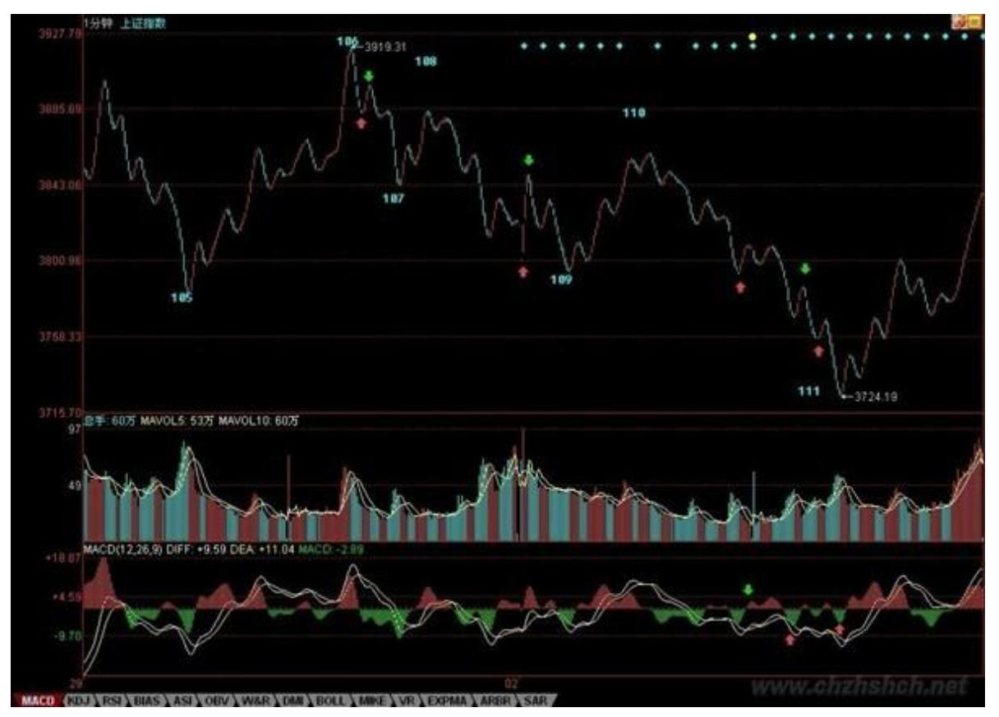

破坏,才有介入的可能,而后面,上下上的两次反抽,根本就没有破 坏其结构,因此后面的破位下跌就是天经地义的。

310 311 机场到了,先保存起来。挺好玩的,帖子分两段写,中间过 一安检。继续。

至于第二红箭头那个,就更不可能是了。绿箭头那次反抽,等于对前 面破位前那上下上的微型类中枢(注意,站在严格意义上,线段以下 是没有中枢的,所以说是类中枢)的一个类第三类卖点,后面有两种 变化,就是转大级别类中枢或类中枢移动直到形成新类中枢为止。而 下面的黄白线,是一个典型的下上下结构中的第二下刚破上的低点, 这是力度最大的一下,怎么可能有背驰出现?MACD 第一个红箭头就指 这大的下上下破的一下,这时候除非出现线段结构的突发性破坏,否 则不可能有什么背驰出现。而后的回拉,其实刚好构成一个奔走型的 上下上结构(也就是第二上刚和第一上的低点稍微重合),这其实也 就构成另一个微型类中枢。这和第一个红箭头指的那个一起,刚好构 成两个类中枢的下跌走势。然后,后面的背驰判断就很简单了,和一

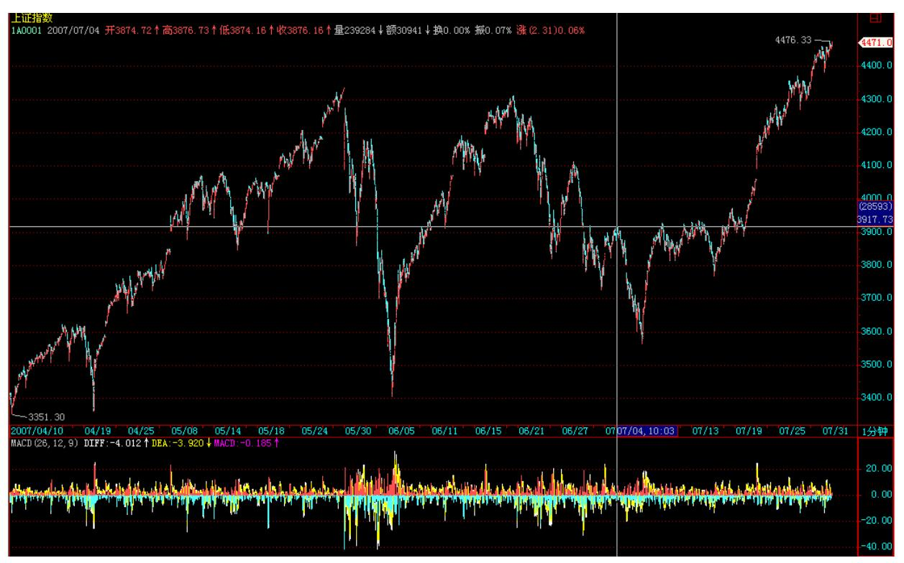

般的趋势中背驰的判断一样。针对第二那奔走型的微型中枢的前后两 段,MACD 两个红箭头对应的绿柱子的比较,一目了然。(千万别再问 这时候为什么不看黄白线之类的问题,这类问题回答过 N 次了。)请 各位好好把各类情况消化好,特别一些最基本的知识,一定要掌握, 62、63 课,要完全吃透,而且能当下应用。当然,这需要不断练习, 不断研究不同的图形。

本 ID 就不再说什么了,准备登机。回到北京,也快第二天了。

312 313 有些市是必须逆着而为的(2007-07-04 15:45:01)散户多是墙 头草,但如果所有的中国人都成了墙头草,那么,中国金融市场等着 被人宰割的日子就不远了。昨天已经说了,那些正在等额度的,都希 望走平台型,3000 点下的时候,本 ID 也逆过一次市而为,当时博客 都有部分记录,那次,这些汉奸与目前等额度的一批,希望从 3000 点下一直回到 2000 点下做一个大差价,但最终他们没有得逞。看看 这里春节前后的帖子,就知道斗争的激烈。

这次,道理一样,那些等额度的,希望他们新增加的额度能够买到他 们所谓符合投资价值的股票,而国内配合他们的,其他跟着他们的, 都在暗地里使坏,这在昨天的解盘里已经说过。这时候,必须有人站 出来,就像春节前 3000 点以下,那罗美国老头忽悠时,必须有人站

出来。那次,本 ID 站出来了,这次也一样,现在的战役,就是不能 让汉奸与等额度的人得逞,3000 点那次,汉奸和等额度的人大败,这 次,条件更险恶,但有些事情是必须干的,就像上次在 3000 点下, 本 ID 就说过,有些事只能北京人干,北京人就是牛 B,就像昨天在 人民大会堂唱响国际歌。

技术上,压力惊人,但有些事情,就是要逆市而为。今天早上,两次 的冲击,完全没有任何人跟进,所有的散户都落荒而逃,汉奸和等额 度的不断犯坏,看看今天中石化等指标股上,再看看今天代表指标股 的白线一直在黄线之下就知道了。但这次,汉奸和等额度的还是落空 了,指数是跌了,但今天的游击战术还是成功了。

现在,就是要放弃指数,对所有有中长线价值的股票进行战略性建 仓,让汉奸们、等额度的人,就算真打出平台型,也买不到好股票。

整体上市、大重组、中小盘成长股票,都是可以游击战的领域,就让 汉奸们去砸指标股好了,指标股不是不出手,而是要等待时机,时机 一到,游击战就要转化为大兵团作战,就像 3000 点那次本 ID 演示 的联通与中行一样。

对于散户来说,你们那些都是糊口的钱,没必须在这么血腥的斗争中 坚持,就像八年抗战,在上海,不一样有很多面首活得很好?这样, 抗战胜利不一样能分点好?这世界上,除了当汉奸,还可以当顺民, 管他是日本人还是美国人。但本 ID 不可以,真正的北京人都不可 以,本 ID 就是看不了汉奸和等额度的鬼子得逞,本 ID 的钱都不等 着花,钱是留着买子弹,打鬼子和汉奸的。

现在的环境有什么可怕的,95 年那么凶横的环境下,一样能掀起一轮 轰轰烈烈的重组行情,而带头的,还记得是哪里的股票吗?昨天,在 人民大会堂可以唱响国际歌,在最凶险的走势中,一样可以唱响游击 队之歌。

314 技术没什么可说的,颈线不能放量突破,图形自然受到破坏,大 盘最坏的情况,就是进入缩量阴跌,散户的对策,本 ID 已经多次说 过了,如果你没有技术、没有资金实力,那就半仓甚至空仓去当顺 民,等待抗战胜利的机会然后再出来。

而对于有一定实力的资金,就选好目标,现在的股票也不过就 1000来 只,难道中国还没有 1000 多的游击队,在每个适合的股票上进行游 击战?本 ID 已经选好目标了,你们呢?好,不说了,没有资金实力 的,就按技术来,唯一需要再次提醒的,就是要放大操作的级别,特 别技术好不太好的。

但,只要给本 ID 一个机会,反攻是必然的,在拉锯中消耗汉奸和鬼 子,这就策略。先下,后面还有一大堆事情等着,不能多说了,再 见。

告全国散户、大股东、庄家、基金及管理层书(2007-07-04 23:34:45) 中国的资本市场,必将成为世界性的市场,因此,必然将吸引世界性 的资金参与其中,但所有参与中国资本市场的资金,都必须按中国人 制定的规则办事,任何企图通过收买、使诈、玩坏来达到不可告人目 的的,都应得到应有惩罚。

管理层最重要的任务是什么?就是保证金融市场的绝对安全,这是和 国防同等重要的事情。而中国金融市场绝对安全的最基本标志是什 么?就是中国的金融市场是掌握在中国人手里的,是任何外国势力都 不能攻陷的,这是不允许有租界、不允许 0.00001%的殖民色彩、不允 许金融市场的任何一个山头去飘扬任何非中国的旗帜,无论那是太阳 还是星条。

但众所周知的,2005 年中的 1000 点飘扬着各色的旗帜,汉奸及其主 子晃悠着各色的旗帜永远历史地在 2005 年的上海指数 1000 点处显 摆,2007 年春节前的 3000 点下,他们出手了,企图把中国资本市场 的轮盘永远控制在自己手里,不过,那次,一场血与火的战争,他们 失败了,1997 年后,汉奸及其主子的嚣张气焰又一次被打击,但他们 从来都不会死心。这次,分配给他们的额度一下大幅度增加,但任何 对这个市场有一点了解的人都知道,其实,这连冰山一角都算不上, 躲藏其后的资金,比这多得多。但,额度的增加,给了他们一个新的 借口,他们又有了新的目标。

虽然中国人好客,1000 点可以先让客人吃,甚至这次也可以弄个2000 点再让客人先吃,好的都先让客人吃,但是,某些客人绝对不光光只 想当客人,他315 们不光光只想吃几个底部,卖几个顶部,他们窥视 的是整个中国的资本市场,他们现在的所有行为,不过是在预演,不 过是要去培养一种习惯、一种情绪,一种潜移默化、不断积聚的习

惯,最终,当他们发动致命一击时,这些习惯、情绪将起着关键作 用,那时候才警觉,就太晚了。

必须如 3000 点下那次一样,打乱其节奏、打乱其计划,不能让其得 逞,否则,一旦让他们得逞一次,以后就永远落入其圈套、节奏之 中。一个最简单的问题,请问,难道他们每一次提高额度,市场都要 回调 60%来等他们买入,这才是中国人的好客之道?要表现好客, 2005 年的 1000 点已经够了,以后还有,那不是傻蛋就是别有用心。

任何的资本市场,都有大鳄,如果杀光了本国的大鳄,那不过是让外 国大鳄横行中国的金融市场,也需要自己强大的海陆空三军,在现代 社会里,这甚至是更为重要的国防力量。只有脑子都是废水的人才会 认为,只有上涨才有操控,难道下跌就不可以操控?但现实却是,只 有因拉抬坐牢的,却没有因打压坐牢的,还是问一个最简单的问题, 导致 2001年后,在中国经济飞速发展的背景下打压 4 年,近 60%去 请外国人客的人,是否要背负法律责任?是否需要去彻查某些外国资 金违反中国法律的勾当?是否要对某些有罪恶勾当的资金全部没收、 永远禁入?管理层的监管系统能不能环保一点,别光看着红,涨得多 的,需不需要监控一下主要针对指标个股刻意打压的帐号?难道你们 的分辨力连刻意打压与正常卖出都分不清楚?对那些大各大传播途径 散播胡乱编造消息的是否要采取必要措施?难道在发生灾害时能允许 人随意散播恐慌言论吗?现在的手段,难道还不足以对此进行有效措 施吗?对于全流通后的大股东,好好管好你们的企业,只要你的企业 能在世界上为中国人扬眉吐气,那你的股价、财富自然也扬眉吐气, 中国的资本市场会为所有有能力、有抱负的中国企业提供最强大的能 量,这是你们最坚强的后盾,让你们去征服世界。一个没有征服世界 雄心的中国企业,不配当中国资本市场的上市公司。

对于各路庄家,你们辛苦了,任何行业都有害群之马,庄家必须得到 正名,不能因为少数的害群之马而败坏了整个行业。没有任何资本市 场是不存在庄家的,但庄家的形式,也必须与时俱进,像以前那种老 模式,路子将越来越窄。必须实现庄家新的模式,但无论模式如何, 有一点是必须知道的,请管好自己的一亩三分地,别让鬼佬抄了后 路。现在不过就 1000 来只股票,难道中国连 1000 来个合格的庄家 都没有?任何一个中国庄家,最基本的标准就是,不能让鬼佬抄了后 路,宁愿当山大王,也决不当汉奸头子吃鬼佬的屁。

对于基金,因为有些基金的汉奸背景,就不说他们了。所有不想汉奸 化的基金,必须树立有中国特色的投资理念为己任,一个被鬼佬完全 洗脑的基金,是没资格管理中国老百姓的钱的。 对于散户,一定只能 拿出空闲的钱来参与资本市场,任何有压力的钱,都不能也不应该来 这个战场中。对于个人来说,资本市场不过是生活的一部分,没316 必要为此而付出所有的生活。如果你市场中的钱不符合以上要求,那 么请等待一个好的机会,把该留的钱留好,绝对不能因为股票而影响 正常的生活。而对于那些无压力的钱,也不能去当炮灰了,风险太大 的活动是绝对不能参加的。而且,大兵团作战,其实你们也帮不上什 么忙,一定要等到买点,特别是大级别的买点出现后才介入,市场是 合力的结果,等大兵团作战打出结果来,大合力合力出方向来,才好 介入,否则刀光剑影、飞机导弹,弄伤了就不好了。像本 ID这种人, 就算打败了,也是好吃好住,一生无忧,但散户就不同了,所以一定 记住下面几点:散户三大纪律:一、只用空闲的钱参与市场。

- 二、必须等大兵团作战有结果才介入,要等大级别的买点。即使是本 ID 输了,汉奸鬼佬赢了,他们最终也是要搞上去的,这种,复仇的种 子才能保存,楚虽三户可亡秦,有种子就有希望。
- 三、坚决不抬汉奸鬼佬的高位轿子,要练好技术,从底位开始,逐步 抽光他们的血。

盘子控在汉奸与鬼佬手里,是没有金融安全可言的,这需要中国的散 户、大股东、庄家、基金及管理层共同的努力。为了打乱汉奸鬼佬的 节奏,本 ID 可以牺牲掉,但希望能换来国的散户、大股东、庄家、 基金及管理层共同的努力,一致对外。中国的资本市场,只能中国人 说了算。最后,临屏赋《满江红》以告国人。

满江红万古长空,今犹昔,一朝风月。 何处住?春花夏雨,秋鸿冬 雪。 百代浮华皆作土,千江吸尽无堪说。 问世间,多少梦消磨、英 雄血。

星旋轨,天补裂,山崩柱,河倾缺。 捣神宫鬼府,凤巢龙穴。 怒剑 穿云惊浩宇,狂涛卷日横孤筏。 纵生死,劫火洗乾坤,齐欢悦。

317 凭空接坠石,依然开弓没有回头箭(2007-07-05 15:43:43)所有的 战役都不是一天能完成的,现在,进行的是一项不可能完成的任务,

谁都知道,技术上周线刚破位,所以的技术指标与大的环境都不可能 让这样的任务完成,但本 ID 既然这样选择了,就义无返顾。

今天,是指标股被全面打压的一天。上下午两次的介入,同样 50 点 的反弹,都以失败告终,但开弓没有回头箭,抗战必须坚持而且继续 坚持,每一次的阻击,都是一次拉锯与消耗。没有正面的阻击,游击 战争是开展不起来的。看看今天中石化等放出的量就知道了,虽然这 是凭空接坠石,但必须接。而且,这也是以后需要的一些基本筹码。

今天的能量消耗不大,只属于试盘阶段,现在重点在三大领域,就是 整体上市、大重组、中小成长股,这是与指数无关的。技术上,必须 依靠年线,那些没有回到年线的股票,都不足以支持。但,这样的战 役,靠一方力量是不足以完成的,像今天的两次反抽,最后都是因为 没有呼应而夭折。但,明知道失败也要干,对技术指标上的战术准 备,这两次反弹也是必要的。

但战争有其规律,不能莽撞,技术上,所有的因数都有利于汉奸与等 额度的,但所有技术都是合力的结果,本 ID 站出来,而且将继续义 无返顾地干下去,就是要改变着合力,这合力是由每个人组成的,这 是一场成功率只有 1%的战争,每多一份努力,都是值得的。而改变合 力,最终都反映在某级别的买点上,本 ID 就是要在逐步的分级抵抗 中,把大级别的买点给构造出来,这就是今后一段时间的任务。好 了,最终需要的工作太多,不能多说了,先下,再见。

和散户网友说说现在的形势与任务(2007-07-05 23:04:16)首先,必须 要明确,各位的状况和本 ID 有很多本质的不同。各位也知道,本 ID6 月后就忙于 PE 的事情,可以很明确地说,本 ID 一部分资金已 经分流到PE 上去,也就是说,就算本 ID 这次大败,依然有翻身重来 的机会,而且一定可以翻身重来。正因为有这样的背景,所以各位第 一不用为本 ID 担心,第二必须知道,本 ID 这样干并不是不顾后果 的意气之举,而是进退有度的。

其次,本 ID 必须在这时候站出来,败了,大不了当股东,哪天本 ID 心情不好,找一个面首收购了自己当大股东算了,当然,这就成了走 唐家兄弟的老路,没什么意思。或者,再折腾几年,等本 ID 厌倦 了,就不玩了,出来玩文化也很好。而各位并没有本 ID 如此自如的 进退之路,所以,一定要量力而行。

318 因为本 ID 知道的太多,所以必须要干上这一仗,当然,这里不 光是本 ID 自己的,本 ID 在市场上干过这么多事情,联合点人干点 事,还是没问题的。站在纯技术的角度,这样干,绝对是脑子进水, 但人,有时候脑子就是要进点水,特别当这事必须干时就更应义无返 顾。本 ID 当然知道自己理论中耐心等待买点的道理,但站在实际层 面,本 ID 必须追究,这个买点不能如 1000 点那样被汉奸了。站在 纯技术的角度,本 ID 现在的所有行为都是错误的,正如站在所谓纯 人性的角度,用胸口顶枪口肯定是有病的,但人,有时候就是要病上 一病。

但对于一般的散户,完全没必要参与这种活动,各位应该利用市场机 会去壮大自己,没必要干用胸口顶枪口的傻事。对于各位来说,根本 不需要知道这市场的买卖点是如何合力构成的,你们只需要知道合力 的结果,根据结果进行操作。

目前的技术形态,站在最恶劣的角度,如果是对整轮行情的一个中级 调整,比较极端的幅度是 2/3,也就是说,调整到 2100 点也是毫不 奇怪的,所以,没必要有任何站岗的无聊思想。学了本 ID 的理论, 唯一需要坚持的就是根据自己操作级别,买点买,卖点卖。等各位有 这个能力后,才学本 ID 如此一病吧。

市场就是战场,一旦开战,在战场上,就是无情的,本 ID 只考虑如 何去夺取战争的主动权,这里,一切手法都可以用上,本 ID 不希望 在打仗时有什么顾虑,在战场上,分不清什么散户、机构。而且本 ID 这次战役的目标,也不是当什么解放军,只是要打乱某些人的节奏, 让某些人的目的不能得逞。如果一定要硬加上一个解放军的任务,只 能是两头不着边。解放军只能是一个顺带的任务,而不是战役的前 提。所以这盆冷水,本 ID 是一定要泼的,本 ID 从来都实话实说, 不想让人有任何不切实际的误解。

对于散户来说,市场中的真正的解放军,只能是你自己,你要掌握好 技术,要对股市有充分的理解,要明白股票都是废纸,要知道,股票 只是抽血的凭证。然后,放下一切幻想,如果有可能就学好本 ID 的 理论,看图作业,这才是散户战胜市场之道,只有自己壮大了,才是 对汉奸和鬼子最大的打击。而本 ID有这个能力,当然需要更多的承 担,这必须要分清楚。

本 ID 这次的任务,不是原来那 16 只股票可以完成的(这些股票, 中长线的角度依然会关照的,对他们,都是保持 0 成本增加筹码的阶 段),本 ID 现在正在开辟新的战场,介入一些对股市更有影响的品 种,大致方向本 ID 已经说了,就是整体上市(包括中字头)的、大 重组(包括老树发新枝那种)、中小成长。技术上,都是有年线可以 依托的。本 ID 不可能去接什么基金、甚至汉奸的高位股票,那真有 病了。但像中石化、联通等指标股,当然是需要慢慢控制的,否则, 就没有话语权了。逐步,将慢慢掀起整体上市、大重组、中小成长的 行情,把整个不利的局面扭转过来。

现在,要把人心扭转,不是一天半天的事情,必须有股票,逐步走出 有号召力的行情来,才会得到市场的响应。当然,这市场不是本 ID 的,其他有实力的,如果都能选择好攻击对象,为市场的稳定和对汉 奸的阻击给出自己的贡献,那么本 ID 的星火最终就可以燎原。而市 场好了,解放军自然就来了,这才是根本之道。光有热血,当义和 团,是打不赢汉奸鬼子的。先下,再见。

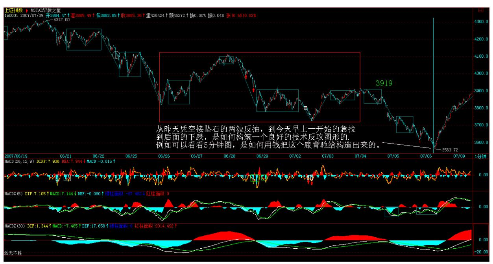

319 以黄河名字展开的绝地反击(2007-07-06 15:50:50)具体的盘中事 情,各位就没必要知道了,各位只需要知道结果,而结果是什么,已 经永远刻在中国证券历史的 K 线图上。当然,如果要学技术,要当猎 鲸者的,请好好去研究一下,从昨天凭空接坠石的两波反抽,到今天 早上一开始的急拉,到后面的下跌,是如何构筑一个良好的技术反攻 图形的,例如可以看看 5 分钟图,是如何用钱把这个底背驰给构造出

来的。本 ID 也不能违反本 ID 的理论,就像牛顿也不能让苹果尽往 天上飞。

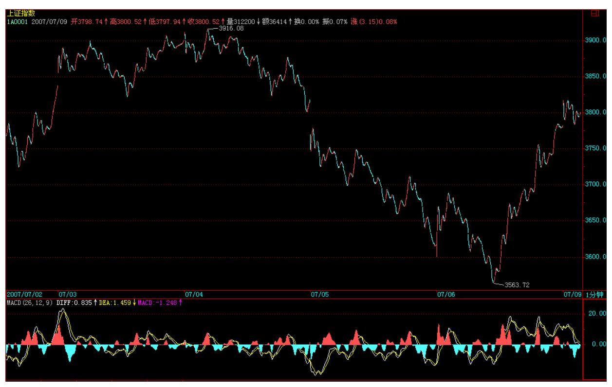

320 大的技术形态上,依然有利于某些人,所以,一切并不会因为一 根阳包阴就天下太平,这就当是平型关一战吧,但已足以向某些人表 明最基本的态度了,特别在这样一个特殊的日子里。

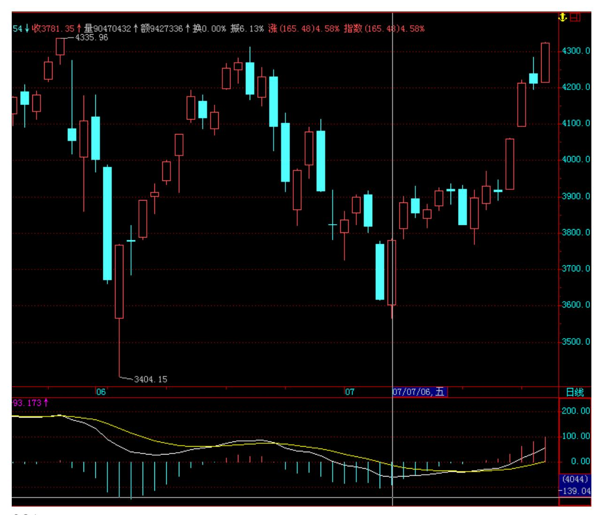

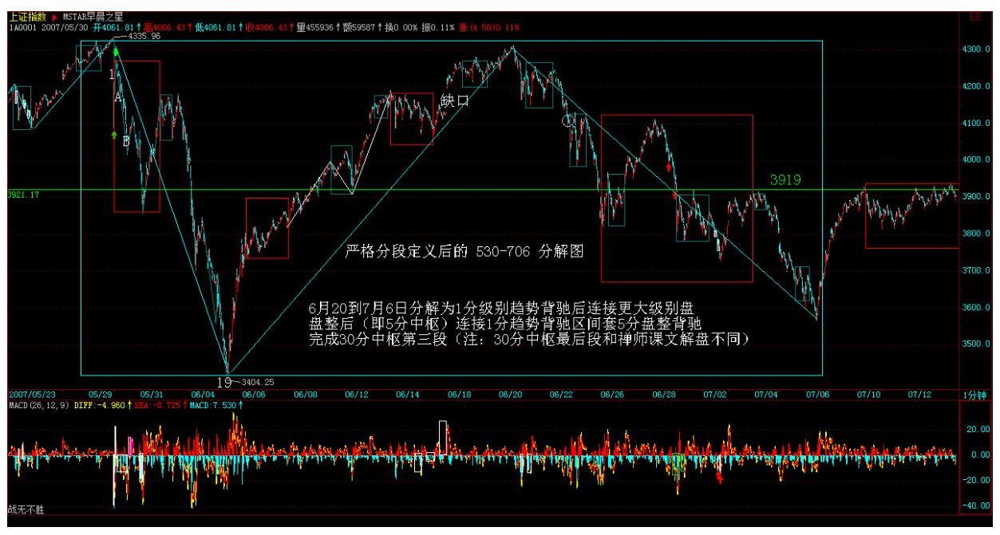

322 323 大盘长中短走势略说 (2007-07-08 22:16:44) 市场走势是合 力的结果,市场不是本 ID 一个人的,本 ID 这一方的力量也不可能 就是合力本身。目前市场走势,存在三种选择,而每一种选择对应着 不同的多方能量要求,依次如下:一、三角形调整这种走势,要求的 多方能量最大,具体走势分析,从 530 开始,大盘完成了三角形的前 三段,目前正走三角形的第四段向上。这种走势要成立,前提就是要 重新有效突破 3919 点的颈线,否则,如果没有足够能量达到这一 点,大盘的三角形形态最终不可能成立。

- 二、平台型调整不能重新站稳 3919 点,然后再逐步积聚空方能量, 再次考验 3400点低位,最强的平台型可以在 3400 点上完成,而一般 地,将跌破3400 点形成空头陷阱,极限位置可以达到 2800 点附近。
- 三、大平台型调整这种情况下,大盘的调整时间将大幅度增加,也就 是说第二种的平台形成后,形成一个大的反弹段后重新进入跌势,整 个调整就是针对1000 点上来的两年行情的大调整,极限位置,可以达 到 2100 点附近。

前两种调整,时间都不会太长,最快的情况下,7 月份就可以完成调 整。而后一种情况,调整至少延续半年。注意,市场的任何走势都是 当下形成的,并没有任何上帝规定现在就要选择哪一种调整方式,市 场最终走势是合力的结果,所以,本 ID 上周的努力,并不是毫无用 处的,所谓绝地反击,就是要在最合适的时机,四两拨千斤,用分力

去改变合力,让合力按更好的选择去选择。 当然,所有的分力,无论 多强大,最终都是分力,任何分力,把自己当合力了,就是脑子水太 多的表现。世界上没有什么救世主、大救星,因为世界上没有任何分 力就是合力本身,那种把自己当救世主、大救星,或者企求救世主、 大救星的,都是脑子注水了。

324 对于一般散户来说,只需要根据本 ID 的理论来,根据合力本身 的轨迹来。有人可能疑问,如果人人都根据合力来,等市场选择方 向,那么市场还会波动吗?这是典型的脑子进水想法。市场有各种不 同的利益,不同的利益构成不同的分力,任何时候都不缺乏不同的分 力,除非这世界上没有了利益的分歧。但没有利益分歧的世界,至少 不是目前的世界。

不用讳言,打击汉奸,不让鬼子霸占中国的金融市场,这也是一种利 益,这也是一种利益驱动,所以就有了本 ID 上周的分力,就这么简 单。这种利益是和鬼子、汉奸的根本对立的,所以要打仗,而打仗, 没有任何上帝保证谁谁谁一定赢,所以本 ID 已经很明确地说,这次 比春节前后本 ID 现场直播那次困难大多了,但本 ID 即使只有 1%的 把握也要干,这和任何技术无关,只是利益驱动,只是不希望鬼子汉 奸横行的利益驱动。

但,对于散户来说,就像战场上打仗,散户就是一般的老百姓,哪里 有让老百姓直接上战场打阵地战的?散户就算打,也只能打游击战, 阵地战不仅打不起也输不起。散户和本 ID 这种人是有本质区别的, 本 ID 阵地战打败了还可以打游击战,等大机会一到,随时又可以招 兵买马、找到大量新的资金来大打战略大反攻,不是本 ID 看不起散 户,而且很客观现实地根据不同的存在状态给出的客观建议。

所以,对于散户来说,究竟最终选择哪种调整方式根本不重要,最重 要的就是要用本 ID 的理论,根据自己的操作级别,买点买、卖点 卖,大打游击战,这才是散户该干的事情。

当然,如果你是散户,又没有打游击战的胆识,那么你就当顺民,就 把仓位空掉,完全不参与这市场的操作,等市场调整完再说。

还有一种,就是干脆全仓不动,反正无论哪种调整,最终还是要结束 的,最终还是要重新开始行情,中国股市大牛市的基础一点都没改 变,20 年 3 万点这过于保守的结论依然成立、甚至要大大向 4 万、 5 万点修正,只要拿着有着大潜质的股票,这些小波动根本不算什 么。例如,本 ID 告诉各位的年线附近,中字头、大重组、整体上 市、中小成长等股票,任何大盘的调整,只是提供一个中长线建仓的 机会。

例如,那只中字头的唐家兄弟的老股票,如此大力度的重组(以后就 知道,现在没必要说),如此深厚的大股东背景,如此完美的图形, 虽然本 ID 很讨厌唐家兄弟,很鄙视他们智力低下的游戏技巧,但最 近还是对这股票上下其手?而这种股票,就算是 15.19 元买了,解套 挣大钱,还不是迟早的事情?问题不是你什么价格买,而是你是否有 技术把成本降下来,或者,即使你没那技术,那你是否有持股的耐心 与决心。否则,整天贪嗔痴疑慢中当惊弓之鸟、追涨杀跌,上帝他姥 姥的姥姥都救不了你。

注意,本 ID 这只是举例,本 ID 最近上下其手的又不仅仅是这股 票,而且更重要的是,并不是本 ID 上下其手的股票才是好股票,别 的,有大买点、大题材、大背景的股票,都必须中长线密切关注。但 最重要的,还是你的技术与心态,如果是烂技术加烂心态,任何股票 都成了烂股。

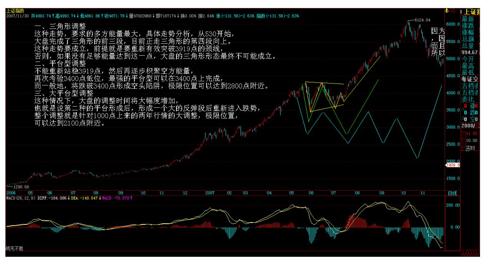

325 股票,是废纸,玩不好,就是股票吸你血而不是相反;但站在国 家的金融战略的大背景下,股票又是维护国家金融安全的关键筹码, 一场虚拟战争的光剑。这两者,来自对股票观察的两个不同视角,没

有对错,关键你的实力与位置。只有认清楚自己的实力与位置,才可 能采取相应合适的操作,没有任何操作是适合所有人的。好了,太晚 了,先下,明天见。

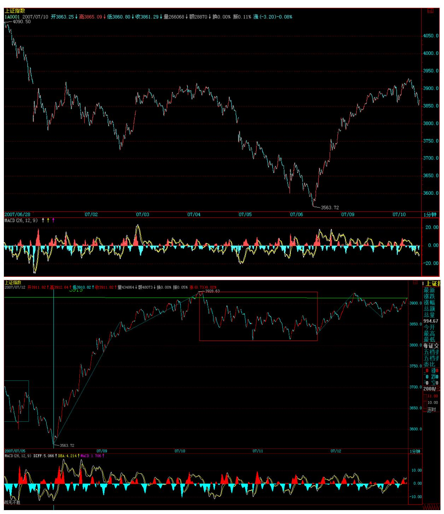

326 327 328 中国股市前途的大决战(2007-07-09 15:35:37) 大决战 的第一目标,今天已经达到,就是用比下跌更低级别、更猛烈的方式

重新回来前面 3900 点下的中枢里。只要回到该中枢里,一切都可以 下回分解了,多空都将有一个喘息的时间去思考下一步的走法。

由于现在是打仗时期,本 ID 的分段就不要放上来了,免得汉奸鬼子 从中揣测本 ID 的意图。但根据本 ID 前面给的分型、笔、段的原 则,其实并不难解决。昨天的大盘长中短走势略说 已经把大盘的长中 短走势按纯理论分析得十分清楚了,各位根据实际走势,不难发现最 终合力选择的结果。

本 ID 这分力,当然是要选择第一种走法,而且三角形这选择,本 ID 也不是现在才说的,这也是上周出手的主要技术上理由。当然,由于 本 ID 现在是身在此山中,所以多说也没用。

从今天下午开始,汉奸鬼子就开始加大反击力度了,明天,这力度会 更加大,不过这都是在本 ID 的预料中,大不了,就再玩玩中枢震 荡。从纯图形看,汉奸鬼子肯定不希望现在的大头肩底最终能成立, 这就是斗争的关键所在。

个股方面,本 ID 的股票都是中长线介入的,都有足够的基本面和战 略面的理由才介入的。当然,对于本 ID 这种资金来说,有时候介入 的股票,不一定是基本面很明确的,但本 ID 可能是先介入,再改造 其基本面。例如,最近在年线附近介入的一只股票,现在才 7、8元, 但他将生产的产品,比三一重工的最大利润的拳头产品成本低30%以 上,马上就开始生产,三一这次可麻烦大了。本来这样的股票是很好 的,但该股票在基本面上有些很不明朗的因数,所以本来这股票,应 该现在就应该在 30 元以上位置的,就因为这基本面上的某个因数, 所以不能太用力玩弄这面首。而这个因数能否解决,本 ID 也没把 握,也只能看一步走一步,所以这种股票,也就只能让本 ID 自己独 自去偷欢了。

总之,股票这种面首,一定要控制成本,不要追高,有技术的,一定 要通过震荡把成本往 0 甚至负处玩弄下去,这才是玩弄股票之道。

最近太忙,没时间和各位回答问题了,对不起,先下,再见。

329 3919 点继续折磨你(2007-07-10 15:43:11)今天的调整如期而 至,这点在昨天已经说了。这种调整,无论多头空头,都是需要的, 所以可以说是众望所归。今天由于金融股的超好业绩,引发大盘瞬间 突破 3919 点,这并没有改变该位置的强大压制作用。

现在本 ID 与汉奸鬼子的分歧在于,这个 3919 点颈线下的头肩底是 否能形成。所以,真正的鏖战还在后面。当然,其实最后是什么图形 并不重要,最终都要归结到 3919 点颈线的有效突破,如果这一点达 不到,其他一切都没意义。

对于散户来说,本 ID 已经多次强调,你们只需要知道游击战怎么 打,看着市场的最终合力划出的轨迹、根据自己设定的级别来操作, 最后就算本 ID 打败了,你们也没必要陪本 ID 一起去失败,该卖就 卖,该买就买,根据图形来,而不是根据其他任何原因来。

个股方面的选择,从纯技术的角度,一种就是已经下跌 50%上下,在 年线、至少是半年线附近,有明显新资金介入的有题材、有潜质的中 低价股票,另一种就是超强势的股票,但这种股票,一旦大盘逆转, 就有补跌的可能,因此对技术的要求特别高。现在对个股,一定要抱 着中长线建仓的心态,当然,有些短线题材股,会继续表现的,但这 里的风险比上半年要大多了。

注意,对于散户来说,建仓完全可以是动态的,也就是说,你可以反 复操作一只股票,这样把成本减下去,反复强调,在市场上要生存, 关键的就是成本,一般股票在构筑底部时,一般震荡都比较大,其实 是很容易把握的。而且,万一大盘逆转,有些股票会顺势砸出空头陷 阱,如果不会动态建仓,就会有短线被套的痛苦,所以,如果你技术 还可以,就要让自己动态起来,这样才是真工夫。

当然,如果你没什么技术,那就分析好基本面,研究透了,然后就靠 熬的工夫,逐步建仓后就熬着,把牢底坐穿了,自己就解放赚大钱 了。每个人的操作方法,必须根据自己的实际情况来,千万不要硬 来。

最后再强调一次,市场操作,最终都要归于自己,只有自己提高了, 才是最终的。千万别依靠任何人,连本 ID 都不要依靠,你可以学习 本 ID 的理论,因为那是几何的、是不患的,谁都必须遵守,但千万 别有依靠本 ID 的想法,本 ID 可不是慈善家,在残酷的市场中,宣 称自己是慈善家的,肯定只能是骗子。

市场就是火与血,没有温情与慈善,就别偷心不死了。至于那些被传 销者骗的,那是自作自受,市场没有眼泪给这些人,自己反省去吧。

先下,再见。

330 3850 点,残酷的多空无量鏖战(2007-07-11 15:41:38)由于本 ID 身在此山中,因此评论难免有本方色彩,为了尽量客观点,所以以后 的评论都换一种说法,这样就不至于干扰散户的自我判断。

昨天说了,真正的鏖战还在后面,今天,是一个地量,却是多空间一 场残酷的无量鏖战,其他大多数的市场参与者都采取一种观望的态 度,有点像古代战场上,对敌双方的主将在那里大战 300 回合,周围 N 万的人在那里观战,一旦一方取对方首级,后面就可以掩杀过来, 来次大胜了。

当然,股票市场还要复杂点,有时候对方可能是九头虫,砍一个又冒 一个出来,所以需要极端的耐心,不要期望一次搞掂。今天的无量与 震荡幅度极端收窄,只不过意味着更大规模的、在更广空间上的对攻 战的开始。

这是一场中国资本市场的斯大林格勒保卫战,对其残酷性要有最充分 的准备。

中短线来说,3919 点不能有效突破站稳,那么多方的中短线战略就没 有得到真正的胜利;中长线来说,目前在 4159 点的 1/2 线不被有效 突破站稳,多方的中长线战略也只能是空想,所以,对于多方来说, 胜利还很遥远,还需要加倍的努力。1%的可能,也要付出 100%的努 力。

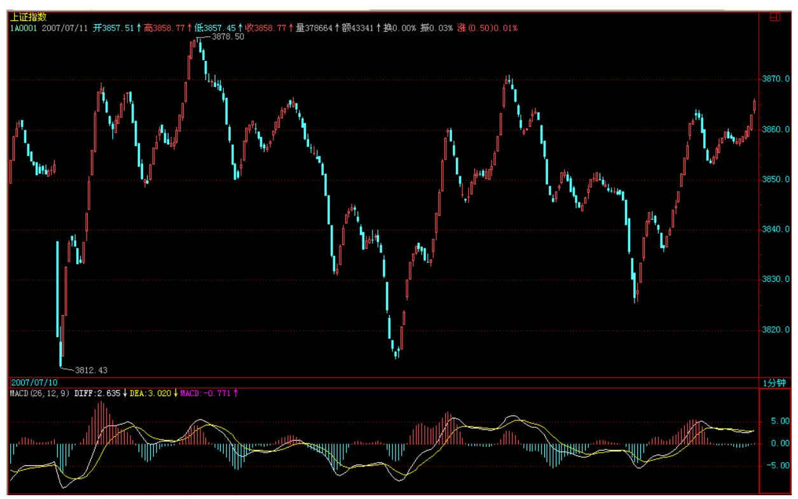

个股没什么说的,也不方便说。有人整天说本 ID 这里爱出谜语,这 是自然的。本 ID 当然要根据法律来办事,本 ID 说的股票,都只是 梦话,因为本 ID 白天自己买了,日有所思、夜有所梦而已。有时候 操作多了,白天也说梦话,所以各位千万就当梦话听,千万要自己看 图操作,一定要根据图形,在大级别的买点去介入。

当然,本 ID 有时候也会显摆一下,例如本 ID3 元上下买的000416, 同时也就说梦话了,后来涨到 18 元,本 ID 显摆一下,是理所当然 的。再说一遍,本ID 说梦话的,一定自己刚买的,一般涨了本 ID 就 不再说梦话了,最多就显摆一下,就像 000999,6 元说的梦话,后面 都是显摆。当然,有时候梦话了,并不一定都如 000999、000416、 000777 之类都一开始就梦想照进现实,有时候,梦里的剧情也会改变 一下,但梦想总是要照进现实的。

好了,废话就不说了,本 ID 今天心情还不错,晚饭才有事,就回答 各位的问题到 4 点半,不过一定是可以回答的问题,本 ID 可没有回 答间谍问题的癖好。

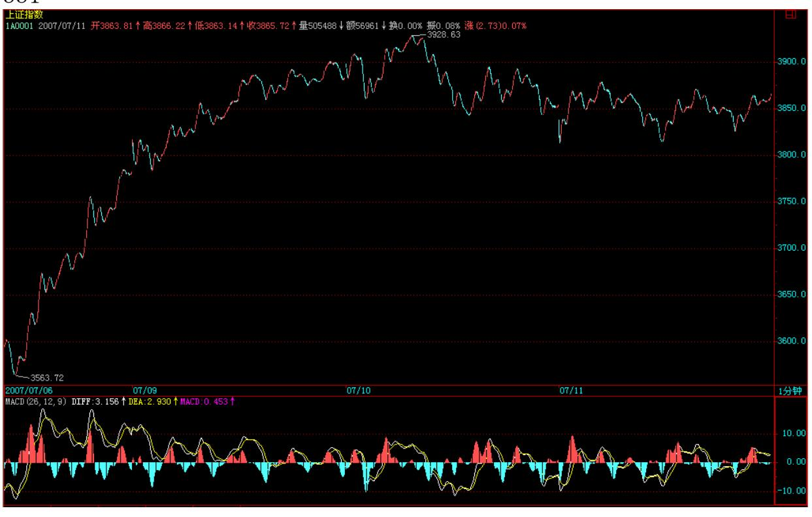

332 333

\*\*\*\*\*\*\*\*\*\*\*\*\*\*\*\*\*\*\*\*。

# 解盘及互动问答:

#### \*\*\*\*\*\*\*\*\*\*\*\*\*\*\*\*\*\*\*\*。

1. 网友[匿名] 50 年以前: 现在利空真是满天飞啊。什么加息,取 消利息税,新股申购等等,会不会太可怕?!2007-07-11 15:43:19缠 师:消息跟着走势走,空头主控,当然利空漫天飞。哪天等多头主控 了,你想听什么利多消息都有。

#### \*\*\*\*\*\*\*\*\*\*\*\*\*\*\*\*\*\*\*\*。

2. 网友楚狂人: 请问缠君:在 30 分钟图上找到的 30 分钟中枢和 在 1 分钟图上找到的 30 分钟中枢,起始位置是否会一样呢? 2007- 07-11 15:49:25缠师:当然不一定一样,就像两个不同倍数的显微 镜,看的东西当然不一定一样。不过,在一般情况下,没有太实质的 差别,只是精确度的问题。

#### \*\*\*\*\*\*\*\*\*\*\*\*\*\*\*\*\*\*\*\*。

3. 网友 [匿名] 在路上:在任何级别的图中,有没有可能是这样。一 个顶分型,下来一个底分型,盘整几天再下来又形成一个底分型?因 图是当下看的。第一个底分型出来后,并不知道后面是如何的。如上 海指数日线,620 是顶分型,走到 627 时像形成了底分型,但接着双 下来。702 后二天也是,请问缠姐,我分的是否有错?当下如何判 断?谢谢! 2007-07-11 15:51:23缠师:那就是包含了好几段,或 者,有些段并没有被段所破坏。注意,段必须被段破坏才是确认结 束。当然,可以用类似背弛的方法预先确认段的结束,但那不是实际 的确认。

#### \*\*\*\*\*\*\*\*\*\*\*\*\*\*\*\*\*\*\*\*。

4. 网友 [匿名] 窗外: 缠 MM,问一个划分线段的问题:有一个线段 虽然级别很低但是很长,在大级别的图上也是很明显的高低点,是不 是就把他算做大级别的一段呢?这样和定义又不相同,怎么理解这个 问题呢? 2007-07-11 15:57:27334 缠师:不,按定义,该怎么就怎 么。段的级别和幅度没什么关系,只能说,级别越大,其平均幅度越 大,但对单个,并不能这样说。

#### \*\*\*\*\*\*\*\*\*\*\*\*\*\*\*\*\*\*\*\*。

5. 网友 [匿名] 手机用户: 请教缠老师:所谓的"中枢",实质上 是不是震荡区间? 2007-07-11 15:59:54缠师:震荡区间是一个模糊 不精确的概念,本 ID 的中枢和任何中枢的最大不同在于,这是一个 精确的概念。否则,猿人都可以画三角形,还用欧几里德研究干什 么?

#### \*\*\*\*\*\*\*\*\*\*\*\*\*\*\*\*\*\*\*\*。

6. 网友 [匿名] 新浪网友: 请问缠 MM,除了用 MACD 辅助判断背驰 外,还有没有其它更严格的方法?2007-07-11 16:06:19缠师:这问题 回答过很多次了,可以很严格的数学方法去确认,但太复杂,实用起 来很麻烦,还要自己去编软件。MACD 只是辅助,但用好了,98%的问 题都解决了,足够实用了。

7. 网友 [匿名] 海东青: 缠姐辛苦,有个问题想请教:是否可以这 样理解,次级别的线段构成本级别的分笔,而次级别的走势类型构成 本级别的线段。差别在于级别越低则精度越高。盼望解答。 2007-07- 11 16:07:40缠师:没必要这样理解,笔、段都是针对最低级别说的, 有了最低级别,按中枢和走势类型的递归定义,后面的级别就可以严 格推出来了,没必要用什么笔和段。

#### \*\*\*\*\*\*\*\*\*\*\*\*\*\*\*\*\*\*\*\*。

8. 网友 [匿名] 求教: 如果一段上涨,中间没有三笔,但却是一段 走势中的高低点,那么是不是一条线段呢?如今天 600505 的 11 点 28 分到 11 点 38分,中间显然不构成三笔,那么这一段是不是一条 线段呢?盼复。 2007-07-11 16:10:04335 缠师:必须至少三笔,如 果没有,那一笔肯定是归于前面一段,后者后面一段没完成。至于, 在盘整中,三笔之间的高低点是可以有奔走型或扩张型等形态,这在 以后再说。

#### \*\*\*\*\*\*\*\*\*\*\*\*\*\*\*\*\*\*\*\*。

9. 网友 [匿名] 水房姑娘: 缠 M 好!种种政策都有,是将血抽离股 市的,那几万点的大牛市如何实现呢?管理层是叶公好龙吗? 2007- 07-11 16:11:32缠师:有些事情是必须慢慢来的,资本市场对于中国 人,都是新鲜事,有些人,反应慢点,理解慢点,是可以理解的,而 且必须有这个耐心,没有什么是不能改变的。

\*\*\*\*\*\*\*\*\*\*\*\*\*\*\*\*\*\*\*\*10. 网友 [匿名] 新浪网友: 妹子辛苦了!我 学缠论,刚看到 29课。请问"该趋势最后一个中枢的级别扩展中" ,最后说的,这种情况和盘整背驰中转化为第三类买卖点不同。那种 情况下,反弹的级别一定比最后一个中枢低。而这种情况,反弹的级 别一定大于或等于最后一个中枢的。这里不明白。反弹的级别如何 定?是不是也要看反弹以来的这一段走势包含什么级别的中枢?如果 是,那反弹的级别等于/大于最后一个中枢的级别,不是在最后中枢下 形成了新的中枢?望解惑。 2007-07-11 16:21:56缠师:不一定在最 后一个范围内形成,例如突然消息引发的缺口,就完全可以在最后中 枢之上很远的地方形成新中枢。如果还是比原中枢级别小,那就意味 着原来的趋势并没有结束,还是原来中枢的中枢震荡。

11. 网友[匿名] 勇敢的心: 缠老大和空头打仗有什么意义?大盘都 50 倍的市赢了。难道非要拉到 100 倍?到 100 倍的时候又怎样?后 来总是要有人买单的。如果缠老大能把外国人忽悠进来,那算成功。

但是把散户套在高高山岗上的话,我就搞不清你是否是最大的卖国。

2007-07-11 16:21:57缠师:现在是 50 倍市盈率吗?而且,中国现在 绝大多数股票的市盈率/增长率<1。如果说投资价值,中国的股票比鬼 佬的投资价值大多了。以后世界上最牛的公司,很多将在中国的股票 里产生,你说谁有投资价值?336

#### \*\*\*\*\*\*\*\*\*\*\*\*\*\*\*\*\*\*\*\*。

12. 网友 [匿名] 新浪网友: 请教老大一个问题:如果 1F 级别的前 后两个中枢发生扩展,则形成一个新的 5F 中枢,那么这个 5F 中枢 的区间如何来确定呢?要去 5F 的图上看么? 2007-07-11 16:27:30 缠师:这问题早回答过,就是用结合律。例如原来九段的,三个三段 结合起来看。这在课程里都有,请看清楚。

\*\*\*\*\*\*\*\*\*\*\*\*\*\*\*\*\*\*\*\*13. 网友 [匿名] 弓口虫: 看了缠论,真的觉 得能开宗立派,就象笑傲江湖的剑宗。废话不说,问个小问题。一分 钟走势,它每个 K 线应分钟时间内的分笔总和,一分钟中枢到底是在 分钟线段中,还是 Z 字形分钟走势,不过我觉得都无所谓,不阻碍判 断,只是想更明白点。

万分感谢!2007-07-11 16:26:54缠师:1 分钟中枢由段构成,先把段 分清楚,后面都可以按定义找出来。

#### \*\*\*\*\*\*\*\*\*\*\*\*\*\*\*\*\*\*\*\*。

14. 网友我爱法拉利: 缠姐,我写了《7 月 10 日沪市大盘用三十分 钟级别图来进行分析中枢和背驰》,在世界上博客并配图。请缠姐前 往看看,写得合不合理。缠姐,16:30 快到了,等你的答复呀。

2007-07-11 16:26:17缠师:对不起,已经说过,现在打仗时期,不能 对实际走势发表分段结果,等该走的走完了,以后再补充。

15. 网友 [匿名] 多来米: 博主,你说过,站在本级别图上,都把次 级别当作线段。但有时候,如果只看 30 分钟图的话,有高低点的线 段是 5F 的,但可能是次次级别 1F 的线段啊。 2007-07-1116:29:15 缠师:线段只针对最低级别,把次级别当线段,只能看成是比喻,严 格的说法,线段只存在最低级别之下。

337 16. 网友 [匿名] 紫衣飘飘: 如果在盘整中,那可以看做中枢震 荡。如果超过 9 段,则可以根据结合律,看做更大一级别的中枢。

2007-07-11 16:29:15网友[匿名] 长江: 两个中枢需要线段连接,但 在盘整中呢? 2007-07-11 16:34:31缠师:线段都没有怎么会有中 枢?线段构成 1 分钟中枢,然后这就是原料,再按定义构筑更大级别 的中枢和走势类型,后面这些和线段无关。

为中国股票的投资价值正名 (2007-07-11)回来晚了,花了 18 分钟, 随手写的文章,各位将就看吧,先下,再见。

在某些被华尔街洗脑的人的忽悠下,中国股票的投资价值,从中国资 本市场诞生那天起,就长久地成了被质疑的对象,中国资本市场,被 某些人有预谋地描述成垃圾股漫天飞,投机倒把的场所,还有所谓的 中国股市赌场论大行其道。

这种说法,不过是利用信息不对称制造的经济殖民话语。世界上所有 资本市场,都存在严重的投机行为,不说别的,就说香港股市,那些 所谓的"仙股" 、还有各类权证,其投机性比中国股市那些厉害一百 倍,在那里,一天涨几倍、跌 80%,从几分钱涨到几块甚至更高又跌 回 0,这难道很难见到吗?至于欧美股市,这种现象一样存在。而且 在欧美股市发展的历史中,严重的投机行为比中国曾存在的厉害一万 倍,就算现在,请问中国股市中有从 2 毛飞涨到几百美圆然后回跌到 6 毛的股票吗?欧美市场上就有,而且最近就有。可以很严肃负责地 说,中国股市中的投机行为,只能说是在资本市场正常机制的平均水 平之下,中国资本市场,从来没出现过超过任何一个国家或地区投机 平均水平之上的投机现象。

对待华尔街的洗脑,就是要用洗脑对洗脑,本 ID 比较懒,也没太多 时间,如果有谁有兴趣,写一篇数据详实的文章,对比各国资本市场 投机行为的历史与现状,揭露某些人粉饰所谓成熟市场的谎言,这将 是一件有意义的事情。

有人可能说,我们要取法其上,不要学别人不好的。那没问题,我们 就考察好的方面。这里,必须首先区分,所有资本市场,考察其市盈 率,都是以成分股为对象的,像在香港股市里,其"仙股"里的市盈 率比中国股市里的垃圾股高多了,说香港股市的市盈率,不过是考察 其成分股,欧美的股市也一样。

338 在国际市场上,考察一个股票的投资价值,最典型的不是市盈 率,而是用市盈率/增长率这指标为标准,一般来说,只要市盈率/增 长率<1,这股票就被看成存在合理的价格。而目前,中国股市中的成 分股,其增长率平均在 50%以上,那么,在中国股市,一个 50 倍的 市盈率是绝对合理的。换另外一种算法,由于现在的利率在 3%左右, 也就是一个 33 倍的市盈率意味着和利率的水平相匹配,而一个 50% 的增长率,将使得一个 50 倍市盈率的股票在一年后的市盈率变成 33 倍,因此,这也反证了,50 倍市盈率对中国股票的合理性。

有人可能反驳说,你说的是动态市盈率。废话,股票价格就是各种预 期的合力,反映的是对价格的预期,哪天中国企业的增长率下来了, 可以接受的市盈率自然就下来,在这趋势没有出现之前,当然就是按 现有的可预期的增长率作为参考的标准,没有谁是上帝,也别把自己 当上帝去规定未来。

上面说的都是些最简单的道理,但某些人故意不承认,不过是别有用 心而已。可以很明确地说,中期业绩出来后,沪深 300 的平均市盈率 将远远低于 50倍,中国股市目前的投资价值是被大大低估了。

站在更大的层面上,由于中国目前的企业,代表着中国经济的未来, 而中国成为世界经济强国的历史趋势不可逆转,因此,现有的上市公 司里,将出现以后世界上一些最大的公司,中国的企业也将跨国化, 现在,很多的中国上市公司,即使是盘子最大那些,站在成为世界上 最大公司的角度,都只能算是中小盘股,都是成长股。只要看好中国 经济的未来,就没有理由对中国的企业失去信心,谁又能说,21 世纪 最伟大的公司不能是中国公司?而且可以肯定的预言,21 世纪世界最 伟大的 500 家公司里,至少有 100 家是中国公司,而这 100 家公司 就在现在深沪交易所交易的股票里。

当然,中国的企业,有着各种毛病,但所有的发展都是在毛病下出现 的,没有毛病的企业早死了。而经济资本化带来的历史性动力,将让

中国的企业走上一个伟大的历史性发展时期,这才是中国资本市场发 展的核心动力,没有这样的历史眼光,只不过是被人洗脑的可怜虫。

坠石化光剑,兵临 3919 点颈线(2007-07-12 15:38:28)看完今天的走 势,各位重新去看 N 天前的凭空接坠石,依然开弓没有回头箭,大概 都有别样感觉了。今天,坠石化为星球大战中的光剑,挥舞出雄兵亿 万,直指 3919 点颈线,关于这光剑的道具,前面的帖子里也提过 了。

当然,昨天说的更大规模、更广空间上的多空对攻战,今天不过是开 始,后面的困难,还是想多点,准备充足点,毕竟现在,技术指标没 被完全修复,人339 气还没被有效聚拢,后面的路还长着,路漫漫其 修远兮吾将上下而求索。

个股方面,前面说了两类股票是必须关注的,一种就是中低价的已经 受到年线支持的有题材、有潜力的股票,一种就是强势股票,这种股 票的代表,就是昨晚为中国股票的投资价值正名中说的沪深 300,原 话是这样的"可以很明确地说,中期业绩出来后,沪深 300 的平均市 盈率将远远低于 50 倍,中国股市目前的投资价值是被大大低估 了。" 这里的老人都知道,本 ID 把中国的牛市分为三阶段,第一阶 段是成分股行情,而这个第一阶段的行情还远为结束,站在 20 年以 上大牛市的角度,现在不过是第一阶段成分股行情中的一个小修正, 没什么大不了的。所以,在第一阶段行情中,任何一波有实在性意义 的行情,都必须有成分股的加盟,否则都是白搞。中期业绩开始后, 大家会发现如昨晚文章中说的,中国最好的 300 只股票的投资价值已 经被大大低估了。

注意,本 ID 这博客说的话,如果梦想照进现实了,那请找王朔去, 和本 ID 无关。本 ID 只是梦想,至于那现实那么不争气,愣要死皮 赖脸地跟着本 ID 的梦想,就去把那死皮赖脸的剥皮拆骨吧。

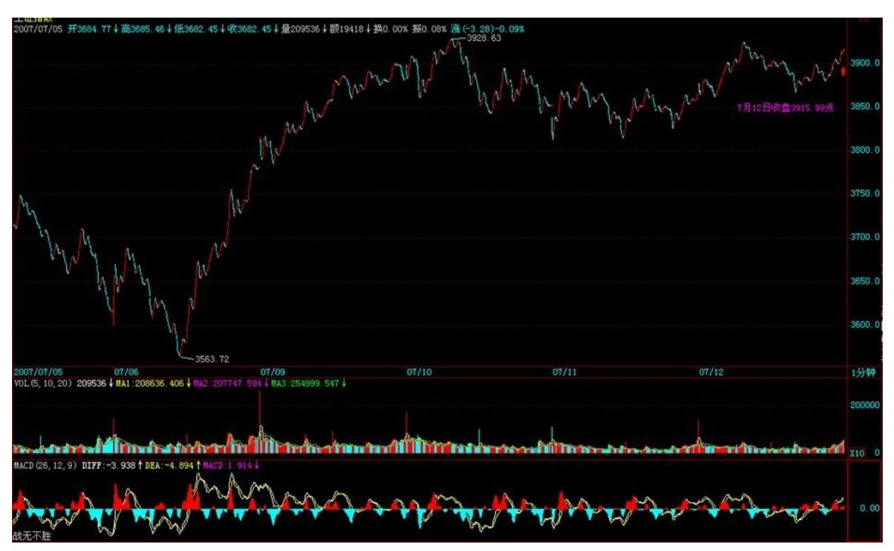

340 341 私募变乌龟,制造成交地量 (2007-07-13 15:36:38) 这两 天,很多所谓的私募都开始自我检查,变缩头乌龟去了,乌龟多了, 今天自然就地量了。在二级市场,本 ID 从来不和什么私募玩,也最 反感那些所谓的私募,特别是其中最下等那些,简直就是偷摸拐骗、 五毒俱全,对这些人不进行全面清理,就不会有中国资本市场健康发 展的良好环境。

本 ID 的观点一向很明确,就是自己的钱自己干,真没这天分的,就 把钱给特别好的公募基金,最好就是指数型基金,这样至少不会跑输 指数。至于那些私募,最终的命运就是被收编或阳光化,还有,就是 要加强对新投资者的基本知识教育,被这么低劣的骗术也能骗倒一 片,简直给中国人丢脸。

大盘今天,在这么恶劣的环境下,还是对颈线进行了试盘,现在最大 的问题,还是人气的聚拢,这需要反复的震荡才能完成,而对中国股 票投资价值的再认识,是新一轮行情能否展开的理念基础,中期业绩 的逐步公布,会让更多人认清中国股票的投资价值,当然,一些理论 上的工作,还需要各方去努力。下周,由于有宏观数据的公布,让行 情的发展存在变数,但这都不是核心的问题,关键是要有新理念,有 新理念,才有新行情,一切不过是唯心所造,而这心,在投资市场 中,就是理念。

个股方面,还是一直强调的那两类,中低价位的一类,都处在换庄或 筹码收集的过程,所以短线不一定会有火暴表现,而沪深 300,由于 有长线资金一直关照,所以会有轮动表现,先让成分股轮动起来,然 后延伸到大盘,一旦这个良性循环能形成,一切关于资金、人气的担 心都无须担心了。路还很长,慢慢走吧。 终于又是周末了,终于可以 腐败、419 了,各位就各取所需去吧。

342 无论多空,都必须要退的一步(2007-07-16 15:43:17)上周五已经 说了,由于本周有宏观数据的公布,让行情的发展存在变数,而周末 所有的消息面,都对该数据有着最不利的版本,这时候,硬顶在颈线 上,已经变得毫无意义,只能让有生力量被无谓地消耗。

这些数据,从本质上说,只是为了让靴子落下,目前,地球人都知道 的那几条利空,如果不落地,只能让行情的发展变得不可控制,无论 多空,这一步都是必须要退的。

现在,确实是一个多空大对决的阶段,本 ID 已经很明确地说,从纯 技术的角度,空头占着绝对优势,而从宏观面的角度,空头在短期上 也占着绝对优势,这也就是为什么本 ID 一直强调路长着的原因。现 在,就是要有不断的阻击战、阵地战、突击战,不断消耗空方的力 量,通过在不同空间的震荡来让筹码与人气得到梳理。这是一个残酷 而漫长的过程。

本周,借助宏观面数据的发布,空方的能量已经并继续会得到大力释 放,而如何借力打力,用最小的消耗去消化这空方能力的宣泄,是短 线摆在多方面前最重要的课题。而今天的走势,也正是该解决方案中 必不可少的一步。

明天有可能到深圳出一次差,具体还没定好,如果走得太急来不及解 盘,请原谅,有时间会补上的,对于散户的操作原则,本 ID 已经反 复说过多次了,不用关心走势的合力是如何构成的,只要关系合力所 画出的轨迹,看图操作,不要受任何的影响。而对于中短线操作的、 技术又不好的投资者,在 5 周均线重新站稳之前,没必须参与市场的 买入。而对于中长线的投资者,继续可以利用市场下跌的机会,震荡 式对前面提到的两类股票进行中长线的建仓。

由于可能要出差,有几天帖子不能正常发,所以今天可以回答问题到4 点半。

#### \*\*\*\*\*\*\*\*\*\*\*\*\*\*\*\*\*\*\*\*。

17. 网友 [匿名] 新浪网友: 最近政府准备在香港市场推出沪深 300 指数基金,政府此举无异将大陆 A 股市场的定价权交给了国际资金。

等于授人以柄。

大陆 A 股市场是二等市场吗?大陆人民是二等人民吗?未来也许在今 年,管理层要推出股指期货,这样国际资金可以在香港压低红筹股同 时沽空 A 股指数。

我已经无语了。大陆人民永远都是鱼肉,永远都是被宰割的对象。什 么叫分享改革开放的成果?认真思考了一个下午。决定离开市场。安 心的去做实业。 心一旦被伤,短时间很难修复。2007-07- 1615:47:36343 缠师:对资本市场处理的失误,将直接影响实业。世 界经济历史一再证明,很多经济危机,回头看,都是人为的。

#### \*\*\*\*\*\*\*\*\*\*\*\*\*\*\*\*\*\*\*\*。

18. 网友 [匿名] 新浪网友:会爆发经济危机么?好可怕。我们目前 应当如何做以防止其影响呢?缠师:一切都是合力的结果,多一分 力,可能就有另外的发展,所以本 ID 必须干点什么。

#### \*\*\*\*\*\*\*\*\*\*\*\*\*\*\*\*\*\*\*\*。

19. 网友 [匿名] 新浪网友: 楼主好!每天看你的文章,受益不浅, 无言感激。想请教一个也许是肤浅的问题,别笑我哦:作为小散,同 时操作多少个股票合适?与资金多少有关吗?如果 50 万的资金呢? 2007-07-16 15:51:41缠师:不要超过 3 只。

#### \*\*\*\*\*\*\*\*\*\*\*\*\*\*\*\*\*\*\*\*。

20. 网友 [匿名] 路人甲: 很早以前老大说过钢是去年的有色,但今 年以来好像还是有色强很多啊。钢怎么样啊,有没有戏啊?我拿的是 全市场市盈率几乎最低的宝钢,看日线这图形明明就是中枢底部啊。

下跌的时候,MACD 更是只有很短的一点,明显底部盘整背驰啊。有半 年线支撑,怎么就是上不去呢?难道我判断错了? 2007-071615:54:44缠师:你回想去年的有色是怎么走的,就明白今年的钢为 什么这样走的。

#### \*\*\*\*\*\*\*\*\*\*\*\*\*\*\*\*\*\*\*\*。

21. 匿名] 新浪网友: LZ好!小声问下上涨趋势的中枢走势是下上 下吗?新人学习中。谢谢!2007-07-16 15:57:54缠师:准确说,在标 准分解中,可以这样认为。但首先你要明白结合律与分解多样性的关 系。

344

#### \*\*\*\*\*\*\*\*\*\*\*\*\*\*\*\*\*\*\*\*。

22. 匿名]的小鱼: 老师,在 1F 图上标 1F 走势应怎么标呀?一个 1F 走势间,不是必须有次级别的连接?回复。2007-07-16 15:58:21 缠师:请把分型、笔、线段那章反复看明白。

#### \*\*\*\*\*\*\*\*\*\*\*\*\*\*\*\*\*\*\*\*。

23. 匿名] 人间几年: 楼主好!请教一个困惑了很久的题:大级别图 出现了明显的背驰,但是小级别却不断延伸,MACD上的表现是红 柱已经缩短没有了,黄白线平走或者逐渐下倾,但价格却不断创新 高,这种情况如何操作呢?如果按大级别出了,什么时候接回呢?如 果不降低操作级别的话。007-07-1616:02缠师:请搞清楚背驰与背驰 段的关系。这样才能明白区间套的用法,明白了,你的问题就不是问 题了。

345(2007-07-16 22:14:16)如果真明白了前面的,这课就不必再说 了。本 ID 反复强调,本 ID理论的关键是一套几何化的思维,因此, 你需要从最基本的定义出发,而在实际操作的辨认中,这一点更重 要。所有复杂的情况,其实,从最基本的定义出发,都没有任何的困 难可言。

例如,对于分型,里面最大的麻烦,就是所谓的前后 K 线间的包含关 系,其次,有点简单的几何思维,根据定义,任何人都可以马上得出 以下的一些推论:1、用[di,gi]记号第 i 根 K 线的最低和最高构成 的区间,当向上时,顺次 n 个包含关系的 K 线组,等价于 [maxdi,maxgi]的区间对应的 K 线,也就是说,这n 个 K 线,和最低

最高的区间为[maxdi,maxgi]的 K 线是一回事情;向下时,顺次 n 个 包含关系的 K线组,等价于[mindi,mingi]的区间对应的 K 线。

- 2、结合律是有关本 ID 这理论中最基础的,在 K 线的包含关系中, 当然也需要遵守,而包含关系,不符合传递律,也就是说,第 1、2根 K 线是包含关系,第 2、3 根也是包含关系,但并不意味着第 1、3 根就有包含关系。因此在 K 线包含关系的分析中,还要遵守顺序原 则,就是先用第 1、2 根 K 线的包含关系确认新的 K 线,然后用新 的 K 线去和第三根比,如果有包含关系,继续用包含关系的法则结合 成新的 K 线,如果没有,就按正常 K 线去处理。
- 3、有人可能还要问,什么是向上?什么是向下?其实,这根本没什么 可说的,任何看过图的都知道什么是向上,什么是向下。当然,本 ID 的理论是严格的几何理论,对向上向下,也可以严格地进行几何定 义,只不过,这样对于不习惯数学符号的人,头又要大一次了。

假设,第 n 根 K 线满足第 n 根与第 n+1 根的包含关系,而第 n 根 与第 n-1 根不是包含关系,那么如果 gn>=gn-1,那么称第 n-1、n、 n+1 根 K 线是向上的;如果 dn<=dn-1,那么称第 n-1、n、n+1 根 K 线是向下的。

有人可能又要问,如果 gn<gn-1 且 dn>dn-1,算什么?那就是一种包 含关系,这就违反了前面第 n 根与第 n-1 根不是包含关系的假设。

同样道理,gn>=gn-1与 dn<=dn-1 不可能同时成立。

上面包含关系的定义已经十分清楚,就是一些最精确的几何定义,只 要按照定义来,没有任何图是不可以精确无误地、按统一的标准去找 出所有的分型来。注意,这种定义是唯一的,有统一答案的,就算是 本 ID,如果弄错了,也就是错,没有任何含糊的地方,是可以在当下 或任何时候明确无误地给出唯一答案的,这答案与时间无关,与人无 关,是客观的,不可更改的,唯一的要求就是被分析的 K 线已经走出 来。

346 从这里,本 ID 理论的当下性也就有了一个很客观的描述。为什 么要当下的?因为如果当下那些 K 线还没走出来,那么具体的分型就 找不出来,相应的笔、线段、最低级别中枢、高级别走势类型等就不 可能划分出来,这样就无从分析了。而一旦当下的 K 线走出来,就可

以当下按客观标准唯一地找出相应的分型结构,当下的分析和事后的 分析,是一样的,分析的结果也是一样的,没有任何的不同。因此, 当下性,其实就是本 ID 的客观性。

有人可能要问,如果看 30 分钟图,可能 K 线一直犬牙交错,找不到 分型。这有什么奇怪的,在年线图里,找到分型的机会更小,可能十 几年找不到一个也很正常,这还是显微镜倍数的比喻问题。确定显微 镜的倍数,就按看到的 K 线用定义严格来,没有符合定义的,就是没 有,就这么简单。如果希望能分析得更精确,那就用小级别的图,例 如,不要用 30 分钟图,用 1 分钟图,这样自然能分辨得更清楚。再 次强调,用什么图与以什么级别操作没任何必然关系,用 1 分钟图, 也可以找出年线级别的背驰,然后进行相应级别的操作。看 1 分钟 图,并不意味着一定要玩超短线,把显微镜当成被显微镜的,肯定是 脑子水太多了。

从分型到笔,必须是一顶一底。那么,两个顶或底能构成一笔吗?这 里,有两种情况,第一种,在两个顶或底中间有其他的顶和底,这种 情况,只是把好几笔当成了一笔,所以只要继续用一顶一底的原则, 自然可以解决;第二种,在两个顶或底中间没有其他的顶和底,这种 情况,意味着第一个顶或底后的转折级别太小,不足以构成值得考察 的对象,这种情况下,第一个的顶或底就可以忽略其存在了,可以忽 略不算了。

所以,根据上面的分析,对第二种情况进行相应处理(类似对分型中 包含关系的处理),就可以严格地说,先顶后底,构成向下一笔;先 底后顶,构成向上一笔。而所有的图形,都可以唯一地分解为上下交 替的笔的连接。显然,除了第二种情况中的第一个顶或底类似的分 型,其他类型的分型,都唯一地分别属于相邻的上下两笔,是这两笔 间的连接。用一个最简单的比喻,膝盖就是分型,而大腿和小腿就是 连接的两笔。

有了笔,那么线段就很简单了,线段至少有三笔,线段无非有两种, 从向上一笔开始的,和从向下一笔开始的。

对于从向上一笔开始的,其中的分型构成这样的序列: d1g1d2g2d3g3"dngn(其中 di 代表第 i 个底,gi 代表第 i 个 顶)。如果找到 i 和 j,j>=i+2,使得dj<=gi,那么称向上线段被笔破 坏。

对于从向下一笔开始的,其中的分型构成这样的序列:g1d1g2d2"gndn (其中 di 代表第 i 个底,gi 代表第 i 个顶)。如果找到 i 和j, j>=i+2,使得 gj>=di, 那么称向下线段被笔破坏。

线段有一个最基本的前提,就是线段的前三笔,必须有重叠的部分, 这个前提在前面可能没有特别强调,这里必须特别强调一次。线段至 少有三笔,但并不是连续的三笔就一定构成线段,这三笔必须有重叠 的部分。由上面线段被笔破坏的定义可以证明:347 缠中说禅线段分 解定理:线段被破坏,当且仅当至少被有重叠部分的连续三笔的其中 一笔破坏。而只要构成有重叠部分的前三笔,那么必然会形成一线 段,换言之,线段破坏的充要条件,就是被另一个线段破坏。

以上,都是些最严格的几何定义,真想把问题搞清楚的,就请根据定 义多多自己画图,或者对照真实的走势图,用定义多多分析。注意,

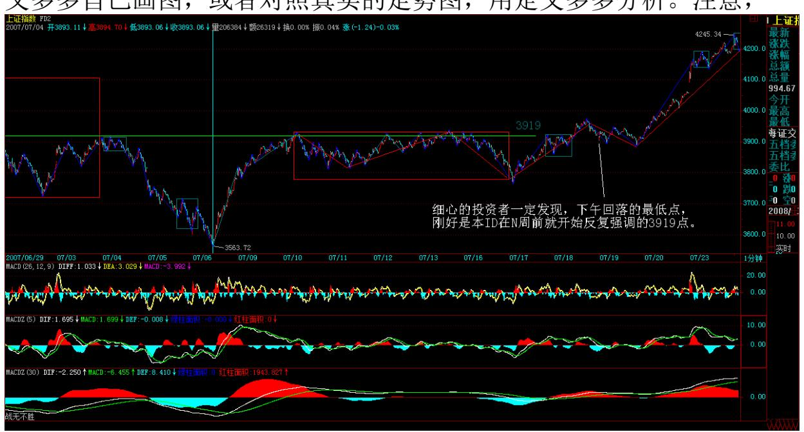

所有分析的答案,只和你看的走势品种与级别图有关,在这客观的观 照物与显微镜倍数确定的情况下,任何的分析都是唯一的,客观的, 不以任何人的意志为转移的。

如果分型、笔、线段这最基础的东西都没搞清楚,都不能做到在任何 时刻,面对任何最复杂的图形当下地进行快速正确的分解,说要掌握 本 ID 的理论,那纯粹是瞎掰。

前后 K 线间的包含关系:348 349

解盘及互动问答:

#### \*\*\*\*\*\*\*\*\*\*\*\*\*\*\*\*\*\*\*\*。

缠师:现在,对于短线走势,消息面有着决定性的意义,在技术上, 对颈线突破后需要三天的回抽确认,而刚好本周的最后两天和下周第 一天是消息面上最大的动荡期,技术与消息,在这里产生完美的碰 撞。

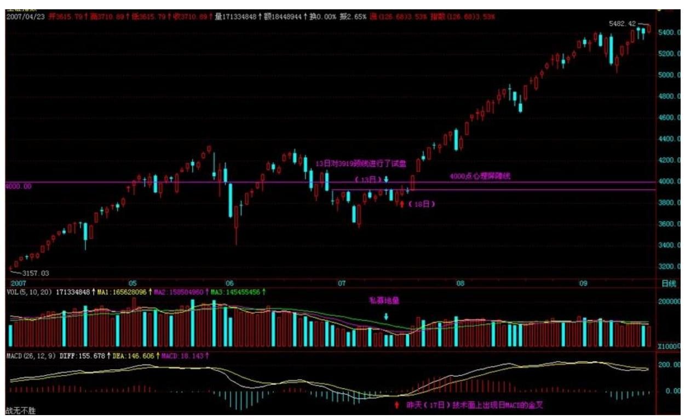

本 ID 虽然站在多方立场上进行战略部署、战术安排,但对空头的所 有伎俩,当然也分析得底朝天。站在大的角度,本 ID 也可以分析一 下空头可以采取的最好策略,就是同样搞三角形,但这三角形和本 ID 为代表的多方要搞的不同,对于本 ID 来说,现在是三角形的第四 段,而对于空头来说,现在是他们的三角形的第三段,就是这三、四 之争,将构成后面技术上的最大分歧。多方搞的三角形,最后是要往 上突破的,而空头搞的,是要往下突破的。

今天,一个多空共同合力下走出的完美图形,而明天开始,这种一致 将被打破,而关键之处,就在消息面的配合。个股方面,今天成分股 的轮动有了新的发展,但还没把人气充分激发,更多的股票里的人,

都采取观望,甚至有些还采取借机逃跑的策略,这都是正常的。天上 打架,没打出结果,下面的当然只能这样了。一旦天上打架有了结 果,地下的自然就有了方向。主力、庄家的资金,也是分级别的。

对于散户来说,本 ID 已经说得很明确了,在有效站稳目前在 4159点 的 1/2 线之前,都以震荡行情看待,按自己的级别,顶背驰出,底背 驰买,这样就不会左右挨巴掌。

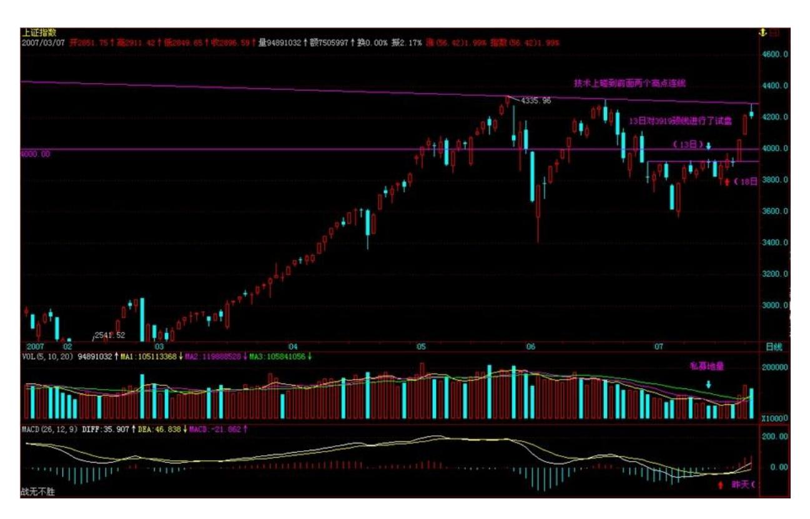
