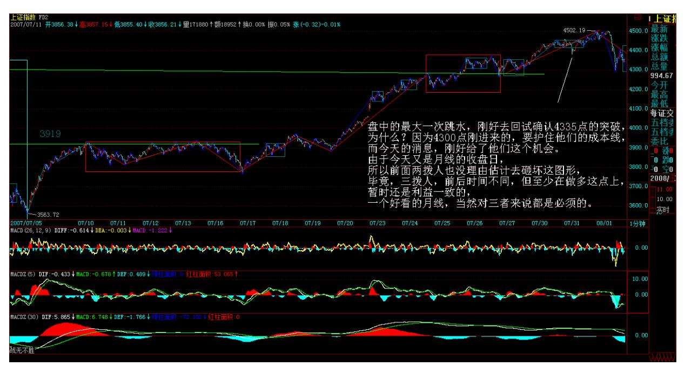
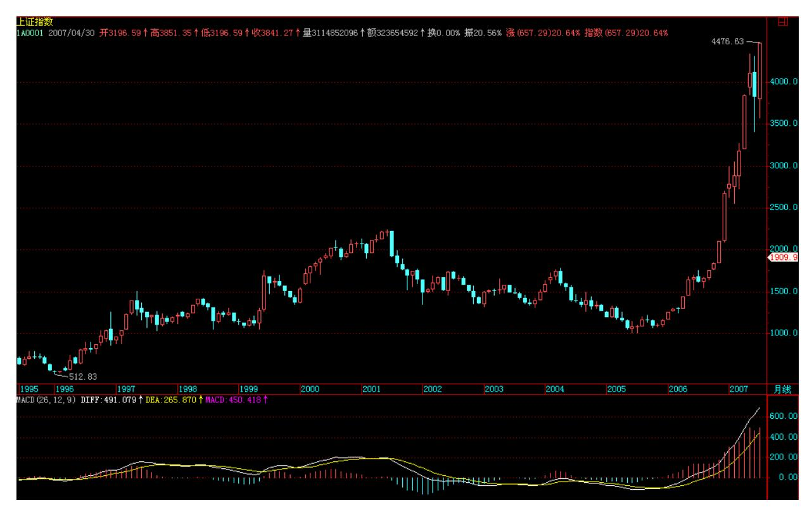
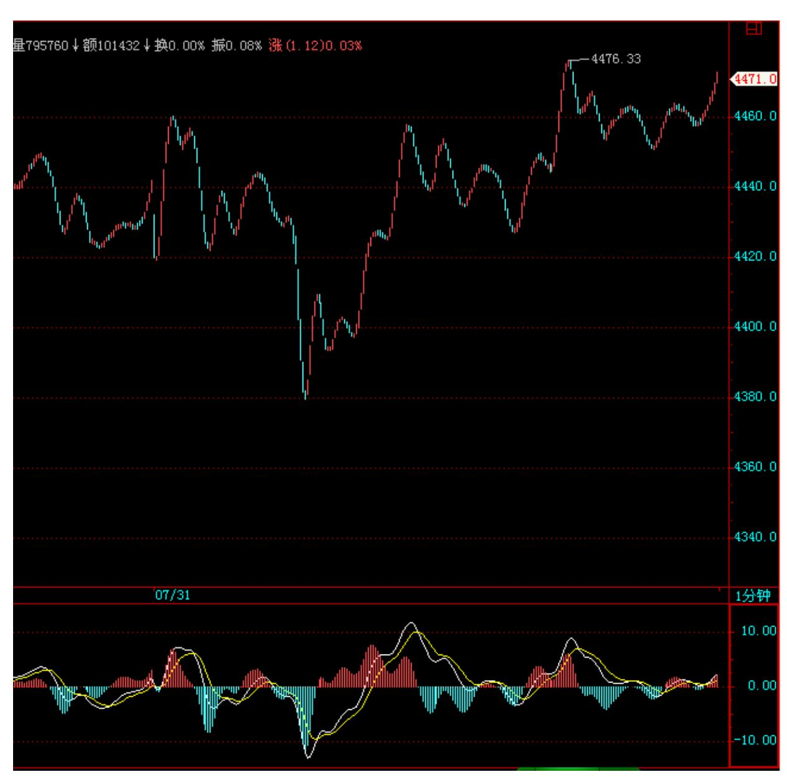
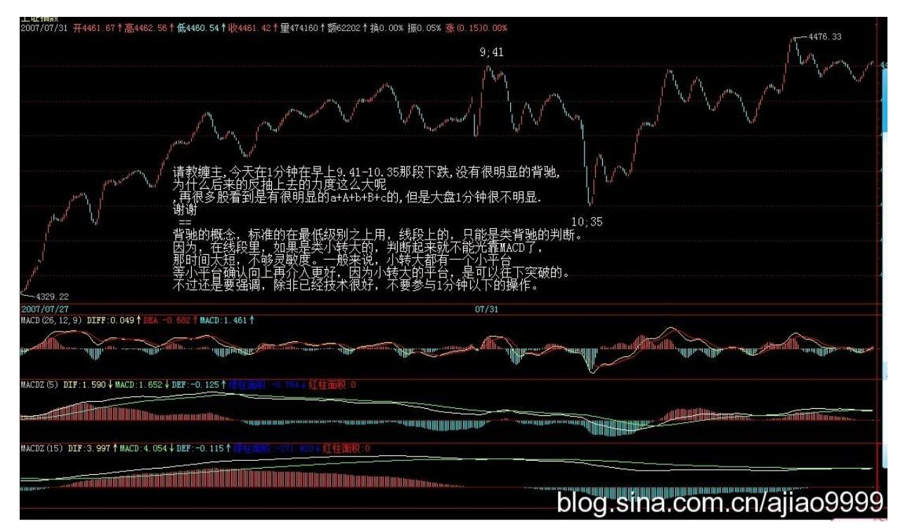
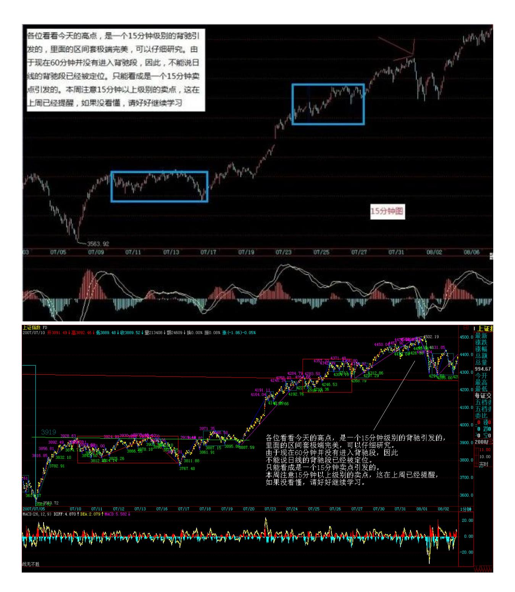

# 教你炒股票 66:主力资金的食物链

(2007-07-30 22:42:05)因为要画图要浪费时间,下一课再说有关线段 的问题。今天,说一些宏观点的东西,说说主力资金的食物链。

市场每一时刻的走势,都由当下的合力构成,如果 1 亿人参加的市 场,每一分力都是相等的、都是独立的,那么市场的整个运转和现实 的情况,当然有所不同。现实的情况是,有些分力是特别巨大于其他 的分力,在这种情况下,对合力的分析,不能脱离对这些特别巨大分 力的分析。

如果现实的系统中这种特别巨大的分力只有一个,其他分力与之相比 都可以忽略不算,那么市场的所谓合力,就与这分力基本无异了。例 如,在那些控盘程度极端高的股票中,就往往呈现这种情况。而这种 一个分力远大于其他分力的系统,其稳定性是会产生突变的。关于个 股的情况,以后会说到,这里先说说关于大盘合力与分力的关系。

有一种很流行却纯粹出于想象的说法,是关于所谓市场主力资金的。

在这种流行的谬误中,似乎市场中的主力只有一拨人,他们控制着市 场的走势,画着每天大盘的分时图中每分每秒。而事实上,这种所谓 的主力,从来没存在过。市场从来都分裂着不同的利益集团,所谓的 主力资金,从来都是分派别的,各派别之间,会有联手,会有默契, 但也有暗算、互相拆台等等,黄雀、螳螂、蝉的游戏也一点都不新 鲜。

主力资金层面的运作,当然也不是单纯的技术分析可以包括的。用打 仗来比喻,技术分析,不过是一些战术性问题,而战略性问题,就不 是技术分析可以解决的。例如,如果你是一个散户,你只要把本 ID的 技术理论搞清楚,那在市场中就可以游刃有余了。但如果光把本 ID的 技术理论搞清楚,是运作不了主力资金的,当然,技术层面是一个基 础,但只是一个方面。但无论什么资金,站在市场走势的角度,不过 就是构造出不同级别的买卖点而已。因此,对于散户来说,你无须知

道这天上掉下的馅饼是怎么制造的,只需要知道怎么才能吃到这馅 饼。

必须明确的,任何的主力资金,无论什么背景、级别,最终都不可能 逆整个经济的大势而行。资金不是一拨,山头就那么多,10 年前的主 力,如果不随着市场去发展,到现在就什么都不是了。所以,任何主 力资金,无论什么背景、级别,还有一个特点,就是要折腾。不折 腾,就没有江湖地位,唯一不同的,只是折腾什么,只是不同市场、 板块的变换。

在单一的股票市场中,不同风格、背景、势力的资金,各自控制着不 同的板块,最大的几个,构成食物链的最上层。一般来说,这几拨资 金都是老油条,互相也知根底,其根底往往不在市场中,而在市场之 外,一般情况下,各方都是保持江湖规矩,不会轻易与某一方开战。

但,绝对不是说,最大的家伙间373 就没有战争,而是这战争无时不 在,只是都在等着一方出现破绽,余下的一拥而上,分而吃之。中国 资本市场的历史上,出现过好几次这样的事情,都是陈年旧事,不说 也罢。

当然,最大的家伙,也不是一成不变的,不同的年代也会改变点包 装,换些名头。

从这食物链的最高端开始,逐级下去,到最后的散户个体,分着好几 个层次。对于最大的主力来说,对下面几个层次的生态状态,会保持 一定的维持。一般来说,一个新的最高级别的势力出现,是没有人愿 意看到的。因此,那些在次一级别中特别活跃,特别有上升苗头的, 都会被重点绞杀。对于最高级别的主力来说,一个各层次的生态平衡 是最有利的。站在这个意义上,如果有些对散户特别恶劣的,要把散 户或某层次赶尽杀绝的,那么肯定成为最高级别主力绞杀的对象。这 种事情,在资本历史上也太常见了。一般来说,这种绞杀对象,都类 似暴发户,最高级别的主力,就如同贵族,贵族当然看不起暴发户, 特别当这暴发户影响了整个市场生态的平衡,不对之株连九族,斩草 除根,那还怎么当贵族?这种绞杀,当然可以是市场化的,却不一定 是市场化的,这就不想多说了。

### 解盘及互动问答:

#### \*\*\*\*\*\*\*\*\*\*\*\*\*\*\*\*\*\*\*\*。

缠师:今天,有没有消息都要震荡,反而因为消息的出现,使得震荡 中,市场各方的心理都比较平稳。盘中的最大一次跳水,刚好去回试 确认 4335 点的突破,为什么?因为 4300 点刚进来的,要护住他们 的成本线,而今天的消息,刚好给了他们这个机会。由于今天又是月 线的收盘日,所以前面两拨人也没理由估计去砸坏这图形,毕竟,三 拨人,前后时间不同,但至少在做多这点上,暂时还是利益一致的, 一个好看的月线,当然对三者来说都是必须的。

374 有了月线,那么 8 月的走势,无非就是长阴线、十字星、长阳线 等几种。纯技术的角度,本月 K 线的一半位置刚好和 1/2 线的位置 差不多,也就是说,这月 K 线的确立,使得 1/2 线的突破有了极大 的保障,虽然不能说万无一失,但至少对于多头,特别对于前面两拨 进去的人来说,已经有了中线运作的第一375 道防线。短线,还是看 4300 点进去这一拨,他们最大的愿望,当然是快速拉离目前位置,所 以短线做多意愿最大的就是这一拨人。

3600 点这拨,当然乐见其成,4000 点那拨人,也不会有太大分歧。

但是,基本面上依然有不明朗的地方,国家对目前经济形势的判断, 依然有可变的地方,这构成影响今后走势最重要的因数。因此,大盘

能否把去年 8 月后的走势复制一次,基本面上还有着极大的不确定因 数。这因数,不是哪一拨人可以控制的,那是一个合力的结果,当 然,一切都确定了,这市场也太不好玩了,不确定,才有美丽与奇迹 可言。

技术上,其实十分简单。前面几次的单边势,都是基本以 5 日线为支 持,基本上,在单边势里,没有 3 天是收在 5 日线之下的,因此, 如果不会看太复杂图形的,5 日线,或者中线的 5 周均线,就是最简 单的判断指标。如果震荡连 5 日线都不破,那还怕什么?日线上,可 以先以背驰段看待,然后根据后面的走势去确认背驰段是否有效。短 线,4500 点附近如果太快通过,就会为以后的走势埋下技术隐患,本 周走势,如果继续长阳,将使得可能的基本面变化埋下政策隐患。但 现在急功近利者太多,而本 ID 也不想浪费筹码进行太严厉的调控, 因为本 ID 并不介意这次真搞成一个背驰段,现在本 ID 的策略,就 是尽量不作为,让各路举重选手自己表现去。

个股方面,还是一早说的两条主线,成分股和超跌股,那些从年线或 半年线上来的超跌股,也慢慢把形态走好,一旦大盘中线上升完全确 立,那么都会轮动走出行情,但问题的关键是,这个确立依然不完 全,所以超跌股的短线表现依然不充分。

一句话,太急功近利,就会把大盘给害了,目前大盘的关键是要走得 扎实点。而八月中上旬,基本面上也将有一个中长线的定调,具体到 时候就知道,现在还没有结果,这才是必须关注的地方。今天可以回 答各位问题到 5 点。

377 378 1. 网友匿名] 新浪网友: 缠 JJ,一笔是否也有类似线段那 样的三角形形态或奔走形态?或者说,一笔之中的非顶、底 K 线是否 允许超出顶底的范围呢?顶或底是否一定为一笔的最高点或最低点 呢?2007-07-31 16:10:56缠师:一笔,是一顶一底,怎么会有三角 形?顶和底,当然一定是那一笔的最高最低,如果不是,那里面一定 不只一笔。

#### \*\*\*\*\*\*\*\*\*\*\*\*\*\*\*\*\*\*\*\*。

2. 网友[匿名] 新浪网友: 缠主你好!对背弛和背弛段还不能理解, 是看 MACD 的柱线高度还是总的面积啊? 2007-07-31 16:15:06缠

师:标准情况下,黄白线和柱子面积都要看。

#### \*\*\*\*\*\*\*\*\*\*\*\*\*\*\*\*\*\*\*\*。

3. 网友 [匿名] 新手: 老师,对于技术不好的新手,可不可以做长 线投资,不理会一时的震荡或调整?2007-07-31 16:16:08缠师:技术 不好,可以把操作级别扩大为 30 分钟以上、甚至是日线级别,这 样,一个月也就操作一两次,而且心态要好点,不要强迫自己一定买 卖在最好的位置,最好的位置的买卖,那是要靠磨练的,不可能一上 手就达到,所以一定不能有不切实际的想法。

#### \*\*\*\*\*\*\*\*\*\*\*\*\*\*\*\*\*\*\*\*。

4. 网友[匿名] 新浪网友: 老师,最近的行情是否有很多小转大的情 况?线段划分分歧很大,你能否再讲一讲? 2007-07-31 16:22:37缠 师:线段划分,下节课说,等等。

#### \*\*\*\*\*\*\*\*\*\*\*\*\*\*\*\*\*\*\*\*。

5. 网友匿名] RVAER: 请教缠主:按照缺口必补的理论,上周一大盘 跳空高开的缺口大概什么时候回补?是要一口气冲到 4800 才回来补 缺口吗? 第二批和第三批进来的人会主动去补缺口吗?谢谢!007- 07-31 16:26:19379 缠师:谁告诉你缺口一定补的?上海在 300 多点 那里还有一个大缺口没补,10 几年了。

#### \*\*\*\*\*\*\*\*\*\*\*\*\*\*\*\*\*\*\*。

6. 网友 [匿名] 新浪网友: 緾主,消息面怎么看啊?今天看两证券 报都大版面力推钢铁股,并说机构正持续加仓中,可是买进就被套 了。难道消息要反着看? 2007-07-31 16:23:34缠师:去年年尾,本 ID 在这里明确说了今年的两大主题:钢铁、医药。这两大板块的布 局,去年就开始了。主力资金用了这么长时间来运作,你考虑的是短 线,根本不是一种层面的东西,当然没法看了。

#### \*\*\*\*\*\*\*\*\*\*\*\*\*\*\*\*\*\*\*。

7. 网友 [匿名] 新浪网友: 博主好!请教:按中枢振荡观点解读走 势时,中枢振荡的每一次级段是否按同级分解规则划分呢?能否按非 同级分解规则划分呢? 2007-07-31 16:31:56缠师:概念不清,线段

上没有中枢,哪里来级别和同级别?线段的划分,就按线段自己的原 则,具体下节课会说到。

#### \*\*\*\*\*\*\*\*\*\*\*\*\*\*\*\*\*\*。

8. 网友 [匿名] 新浪网友: 老大,后面走势在顶分型第一个 k 线的 区间内,可以算一笔吗? 2007-07-31 16:36:06缠师:不可以,除非 在后面根据非包含处理后能找到标准的底分型。

#### \*\*\*\*\*\*\*\*\*\*\*\*\*\*\*\*\*\*\*。

9. 网友 [匿名] 楚狂人: 感觉市场做多气氛好的时候,1 分钟甚至 线段级别的上涨都延伸很久。碰到这些小级别的延伸,判断第一卖点 感觉好困难。还是等第二卖点。不知这样妥否?请缠君指正。 2007- 07-31 16:37:18380 缠师:除非你觉得自己交易通道特别好,判断又 能特别精确,否则不要太多参与线段的操作。至少要参与 1 分钟以上 的操作。

#### \*\*\*\*\*\*\*\*\*\*\*\*\*\*\*\*\*\*\*。

10. 网友 [匿名] 学习: 请问,9 个一分钟的走势类型重叠构成一个 5 分钟的中枢,那么这个 5 分钟的中枢点位和从一分钟递归上来的一 样吗?缠师:不一定。按 3+3+3 这样组合后确定 5 分钟的。

11. 网友 [匿名] 砂: 请教缠主,今天在 1 分钟在早上 9.41-10.35 那段下跌,没有很明显的背驰。为什么后来的反抽上去的力度这么大 呢?再有,很多股看到是有很明显的 a+A+b+B+c 的,但是大盘 1 分 钟很不明显。谢谢!2007-07-31 16:38:15缠师:背驰的概念,标准的 在最低级别之上用,线段上的,只能是类背驰的判断。因为,在线段 里,如果是类小转大的,判断起来就不能光靠 MACD 了,那时间太 短,不够灵敏度。一般来说,小转大都有一个小平台,等小平台确认 向上再介入更好,因为小转大的平台,是可以往下突破的。不过还是 要强调,除非已经技术很好,不要参与 1 分钟以下的操作。

381 382 12. 网友[匿名] 新浪网友: 请问老大,有时,大盘的"一 笔" 可能就 5~6 根 K 线,走得比较平,其中存在包含关系,如果 包含掉,则不能形成一笔。请问要看包含吗? 2007-07-31 16:44:03 缠师:有包含的一定要非包含化处理。严格按定义来。

#### \*\*\*\*\*\*\*\*\*\*\*\*\*\*\*\*\*\*\*\*。

13. 网友 [匿名] 神抛弃的大道: 女王好!关于您的理论,我有个小 小的问题,就是如果 9 根线段构成的 1 分钟中枢同时扩张成为 5 分 钟中枢,那么 5分钟中枢的区间如何确定,您能说明一下么?要是能 图解一下就最好不过了。这个问题困扰我一段时间了。谢谢女王!盼 复。2007-07-31 16:46:49缠师:按结合律。3+3+3 结合。

#### \*\*\*\*\*\*\*\*\*\*\*\*\*\*\*\*\*\*\*\*。

14. 网友石头叁: 老大,向下的一段无论延伸了多少笔,在触及前一 向上线段的最后一个高点之前都不能认为是一个线段,因为还没有破 坏向上线段的内部结构。这样理解对么? 2007-07-31 16:49:58缠 师:一般情况下是这样,但有些特殊情况,下节课都会说到。

#### \*\*\*\*\*\*\*\*\*\*\*\*\*\*\*\*\*\*\*\*。

15. 网友 [匿名] 大盘: 请问博主:a+b+c+d 依次连续出现的 4 个 线段,其中 b 线段没有破坏 a 线段,但是 b、c、d 线段相互重叠 (即构成中枢)。请问这种情况下,当下在线段 b 的时候如何反应? 2007-07-31 16:50:53缠师:如果 B 不破坏 A 的,那 A 这线段就没 完成,等 A 完成再说。在线段里,A 线段没被破坏,就不会存在 B 线段。关于线段划分的一些细节问题,下节课里都有。

383 该来的调整,必须且及时(2007-08-01 15:33:01)本周的 K 线, 本 ID 在上周已经明确说过,希望是带上影的第二种情况,否则急功 近利,只能害了最终的行情。今天的调整,使得这长上影的小阴线已 初显。后面两天,关键是第三拨人的做多决心了,强烈回收上去,则 还有走出第三种情况,也就是中阳周线的可能,但这种走势,确实有 点急功近利,反正,本ID 是绝对不出这手的。本 ID 已经早说了,震 荡,对本 ID 只是一个先卖后买的短差机会。在这里等5 周均线上 来,更稳健。

技术上,今天的低点并没有跌破前面两高点连线,所以调整在合理的 范围内,该线在 4260 点附近,目前 10 日线也在该位置,因此是否 有效跌破该线是一个大盘调整强弱的重要指标。一旦有效跌破,上周K 线留下的缺口将面临考验。对于第三拨人,该线是他们的生命线,当 然,对于前两拨,其实无所谓,就看第三拨人表演吧。 上面,由于今 天跌破 5 日线,因此后面的反抽如果不能上 5 日线,则大盘的调整 将加大,能重新上去,那就将重新挑战 4500 点。即使能突破 4500 点,最好能反复震荡,否则,将引起昨天所说的八月中上旬基本面上 的重大不稳定因数。还是昨天那句话,不要急功近利,要爱护市场本 身。

大的技术上,日线上的背驰段依然成立,如本 ID 般第一拨进来的, 一定不能在这个位置加码,而是用先卖后买打差价的策略,通过震荡

把成本降低,万一大盘真不能突破 4500 点走出多头陷阱,到时候砸 起盘来也更爽。大家好好去看看,现在叫嚣冲多少多少点的人,在 3600 点的时候,是不是那些吼着要跌破多少多少点的。行情是合力 的,一步一步走出来的,预测都是忽悠,按照正确的策略去操作才是 一切。

如果能看明白线段、中枢、走势类型等的,现在这种行情是最好操作 的,注意,节奏一定是先卖后买,卖错了不怕,如果大盘真能突破 4500 点,很多中低价股都会大幅启动的,还怕买不到好股票?不杀 跌、不追涨,按照买卖点来。各位看看今天的高点,是一个 15 分钟 级别的背驰引发的,里面的区间套极端完美,可以仔细研究。由于现 在 60 分钟并没有进入背驰段,因此,不能说日线的背驰段已经被定 位。只能看成是一个 15 分钟卖点引发的。本周注意 15分钟以上级别 的卖点,这在上周已经提醒,如果没看懂,请好好继续学习。晚上, 把关于线段分类的课程放上来。先下,再见。

